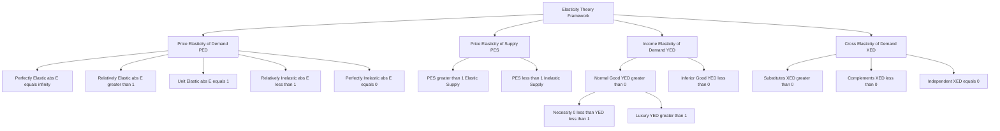
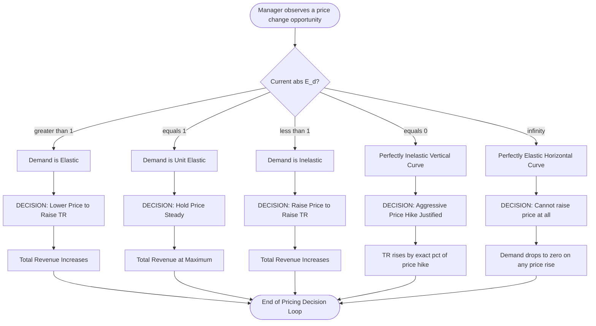
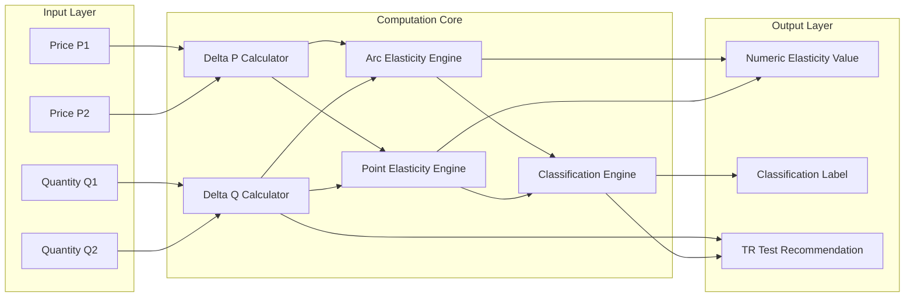
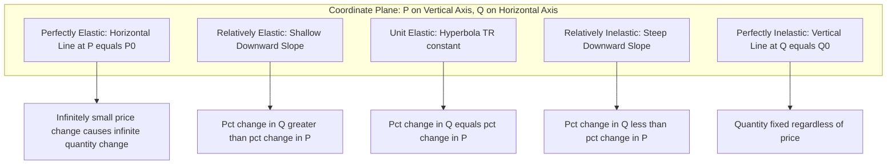

# Elasticity of Demand and Supply

<!-- SECTION_1_START -->

# Elasticity of Demand and Supply — Core Foundations

## Formal Academic Definition (KTU 2024 Syllabus Terminology)

**Elasticity** is a measure of the *responsiveness* or *sensitivity* of one economic variable to a change in another. In the KTU 2024 framework for *Economics for Engineers*, elasticity is treated as a dimensionless ratio that strips away units, allowing engineers to compare the sensitivity of disparate systems (e.g., a power grid, a semiconductor market, a software subscription model) on a single normalized scale.

> [!IMPORTANT]
> **Syllabus Highlight (Module 1):** The elasticity of a function $y = f(x)$ is mathematically defined as the **percentage change in the dependent variable divided by the percentage change in the independent variable**. For a demand function $Q_d = f(P)$, this gives us the **Price Elasticity of Demand (PED)**. For a supply function $Q_s = g(P)$, we get the **Price Elasticity of Supply (PES)**.

## Conceptual Analogy — The "Rubber Band" Intuition

Imagine a **rubber band** stretched between two fixed points:
- A **highly elastic** rubber band stretches a great deal with even a tiny applied force. In economics, this represents a product whose quantity demanded/supplied swings wildly with the slightest price nudge (e.g., luxury cars, holiday packages).
- A **rigid steel rod** barely deforms under force. This represents **inelastic** goods (e.g., life-saving insulin, basic salt, gasoline in the short run).

The "stretchiness" is exactly what elasticity quantifies. Engineers use the identical concept when measuring the modulus of elasticity of materials — Hooke's Law, $\sigma = E \cdot \epsilon$, is structurally the same mathematical idea: relative response to relative stimulus.

> [!NOTE]
> **Key Insight for Engineers:** Whether you are studying the **strain** of a material under stress or the **quantity demanded** of a product under a price change, you are fundamentally measuring *responsiveness of an output to an input*. The mathematical apparatus is identical.

## The Three Core Elasticities at a Glance

> [!NOTE]
> **1. Price Elasticity of Demand (PED):** Measures how quantity demanded of a good responds to a change in its own price.
>
> **2. Price Elasticity of Supply (PES):** Measures how quantity supplied of a good responds to a change in its own price.
>
> **3. Income Elasticity of Demand (YED):** Measures how quantity demanded responds to a change in consumer income. A special classification emerges:
> * **Normal Good:** $YED > 0$ (e.g., branded clothing)
> * **Necessity:** $0 < YED < 1$ (e.g., basic groceries)
> * **Luxury Good:** $YED > 1$ (e.g., yachts, premium smartphones)
> * **Inferior Good:** $YED < 0$ (e.g., instant noodles, second-hand goods)
>
> **4. Cross Elasticity of Demand (XED):** Measures how quantity demanded of Good A responds to a price change of Good B.
> * **Substitutes:** $XED > 0$ (e.g., tea and coffee)
> * **Complements:** $XED < 0$ (e.g., printers and ink cartridges)
> * **Unrelated Goods:** $XED = 0$ (e.g., shoes and refrigerators)

## Physical & Economic Constants (Standard Reference Metrics)

| Metric | Standard Value / Convention |
| :--- | :--- |
| **Unit Elastic Benchmark** | $\vert E \vert = 1$ (the gold-standard neutrality point) |
| **Elastic Threshold** | $\vert E \vert > 1$ (responsive / stretchy) |
| **Inelastic Threshold** | $\vert E \vert < 1$ (unresponsive / rigid) |
| **Perfectly Elastic Limit** | $\vert E \vert \to \infty$ (horizontal curve) |
| **Perfectly Inelastic Limit** | $\vert E \vert = 0$ (vertical curve) |
| **Sign Convention for Supply** | $PES$ is conventionally reported as a **positive** number (supply slopes upward) |
| **Sign Convention for Income (Normal Good)** | $YED > 0$ |

> [!VISUALIZATION CONTROL]
> **Concept:** The Five Degrees of Price Elasticity of Demand on a Standard 2D Cartesian Plane
> **GeoGebra / Desmos Input Equations:**
> * $f_{1}(x) = 10$ → Horizontal line representing **Perfectly Elastic** demand
> * $f_{2}(x) = -0.5x + 10$ → Shallow downward line representing **Relatively Elastic** demand
> * $f_{3}(x) = -x + 10$ → $45^{\circ}$ downward line representing **Unit Elastic** demand
> * $f_{4}(x) = -2x + 20$ → Steep downward line representing **Relatively Inelastic** demand
> * $f_{5}(x) = 5$ → Vertical line representing **Perfectly Inelastic** demand
> **Visual Description:** The student should observe how the slope of the demand curve is *not* a reliable indicator of elasticity on its own. What truly matters is the **ratio of percentage changes** — the *steepness relative to the point on the curve*. The horizontal line is the most responsive; the vertical line is the least responsive.

<!-- SECTION_1_END -->

<!-- SECTION_2_START -->

# Deep Theoretical Analysis & KTU High-Yield Formula Sheet

## I. The Master Definition — Decomposing Elasticity Step-by-Step

Elasticity is built on a simple three-step logic:

1. **Step 1 — Identify the Trigger:** Pin down the *independent variable* whose change is the cause (typically price $P$ or income $Y$).
2. **Step 2 — Identify the Response:** Pin down the *dependent variable* that reacts (typically quantity $Q$).
3. **Step 3 — Normalize via Percentage:** Divide the percentage change in the response by the percentage change in the trigger. This normalization is what makes elasticity **unit-free** — a critical engineering property for cross-system comparison.

## II. The Two Calculation Methods — A Critical Distinction

> [!IMPORTANT]
> **KTU Examiners love testing this distinction.** The same demand-supply data yields *two different* elasticity values depending on the method:

**Method A — Percentage Method (Average / Arc Elasticity):**
Uses the *average* of the initial and final values as the denominator base. This is the **most commonly tested formula** in KTU boards.

**Method B — Geometric / Point Method (Point Elasticity):**
Uses the *initial value* as the denominator base. This is precise but yields different numerical results for the same data.

> [!WARNING]
> **Common Student Trap:** A KTU candidate once lost **3 marks** by writing the percentage method formula with `original` as the denominator for both numerator and denominator. Always cross-check which method the question demands.

## III. KTU High-Yield Formula Sheet (Cheat Sheet)

| Symbol / Term | Formula | Interpretation | Engineering / Economics Context |
| :--- | :--- | :--- | :--- |
| **$E_d$ (Percentage / Arc Method)** | $E_d = \dfrac{\Delta Q}{\Delta P} \times \dfrac{(P_1 + P_2)}{(Q_1 + Q_2)}$ | Average elasticity between two points | Used for discrete data (e.g., monthly sales reports) |
| **$E_d$ (Geometric / Point Method)** | $E_d = \dfrac{\Delta Q}{\Delta P} \times \dfrac{P}{Q}$ | Instantaneous elasticity at a single point | Used for continuous functions and marginal analysis |
| **$E_d$ (Derivative Form)** | $E_d = \dfrac{P}{Q} \cdot \dfrac{dQ}{dP}$ | Calculus-based point elasticity | Used in microeconomic optimization (e.g., profit maximization) |
| **$E_s$ (Price Elasticity of Supply)** | $E_s = \dfrac{\Delta Q_s}{\Delta P} \times \dfrac{P}{Q_s}$ | Responsiveness of supply to price | Critical for production planning |
| **$E_y$ (Income Elasticity)** | $E_y = \dfrac{\Delta Q}{\Delta Y} \times \dfrac{Y}{Q}$ | Responsiveness to income shifts | Used in market segmentation and GDP forecasting |
| **$E_{xy}$ (Cross Elasticity)** | $E_{xy} = \dfrac{\Delta Q_x}{\Delta P_y} \times \dfrac{P_y}{Q_x}$ | Substitutability or complementarity | Used in antitrust cases and product bundling |
| **Total Revenue (TR) Test** | $\Delta TR \begin{cases} > 0 & \text{when } \vert E_d \vert > 1 \text{ (elastic)} \\ = 0 & \text{when } \vert E_d \vert = 1 \text{ (unit)} \\ < 0 & \text{when } \vert E_d \vert < 1 \text{ (inelastic)} \end{cases}$ | Predicts revenue change on price change | Used by monopolists and pricing engineers |

> [!NOTE]
> All elasticities are dimensionless ratios. The standard unit is simply "elasticity" — there is no SI unit. This dimensionless property is the same reason engineers can compare a strain gauge reading to a thermal expansion coefficient.

## IV. Real-World Engineering & Economic Utility

> [!IMPORTANT]
> **Why should an engineer care about elasticity?** Here are production-grade applications:

* **Product Pricing in Tech Companies:** A software company deciding whether to drop the price of a SaaS subscription must know if demand is elastic (more subscriptions will offset the lower price) or inelastic (revenue will simply drop).
* **Inventory Management:** Supply elasticity tells a manufacturing engineer how quickly production can ramp up when raw material prices change.
* **Government Policy:** Tax policy on cigarettes relies on the fact that tobacco has *inelastic* demand — a tax hike raises revenue without drastically reducing consumption.
* **Capacity Planning in Power Grids:** Electricity demand has low short-run elasticity (you cannot switch off a factory mid-shift), guiding infrastructure decisions.

## V. The Total Revenue (TR) Test — A Decision-Maker's Tool

The **TR Test** is a direct engineering-style decision rule:

* If demand is **elastic** ($\vert E_d \vert > 1$) → **Lower the price** to increase total revenue.
* If demand is **unit elastic** ($\vert E_d \vert = 1$) → **Revenue is maximized** at the current price.
* If demand is **inelastic** ($\vert E_d \vert < 1$) → **Raise the price** to increase total revenue.

<!-- SECTION_2_END -->

<!-- SECTION_3_START -->

# Step-by-Step Derivations & Code/Symbolic Implementation

## I. Derivation: From the Demand Function to Point Elasticity

**Given:** A linear demand function $Q_d = a - bP$, where $a$ and $b$ are positive constants.

**Step 1 — Compute the derivative $\frac{dQ}{dP}$:**

$$
\begin{aligned}
Q_d &= a - bP \\
\frac{dQ_d}{dP} &= \frac{d}{dP}(a - bP) \\
&= 0 - b \cdot \frac{d}{dP}(P) \\
&= -b
\end{aligned}
$$

**Step 2 — Substitute into the point elasticity formula $E_d = \frac{P}{Q} \cdot \frac{dQ}{dP}$:**

$$
\begin{aligned}
E_d &= \frac{P}{Q_d} \cdot \frac{dQ_d}{dP} \\
&= \frac{P}{a - bP} \cdot (-b) \\
&= \frac{-bP}{a - bP}
\end{aligned}
$$

**Step 3 — Interpret the result:**

The elasticity is **negative** because of the law of demand (inverse relationship between $P$ and $Q_d$). By convention, the **absolute value** $\vert E_d \vert = \frac{bP}{a - bP}$ is reported for demand.

> [!NOTE]
> **Engineering insight:** The function $E_d(P)$ is **monotonically increasing** in $P$ along a linear demand curve. At low prices (near the horizontal intercept), demand is **elastic** ($\vert E_d \vert > 1$). At high prices (near the vertical intercept), demand is **inelastic** ($\vert E_d \vert < 1$). The midpoint is **unit elastic**. This is why a linear demand curve is *not* uniformly elastic — a frequent KTU trap question.

## II. Worked Numerical Example — Arc Elasticity (Percentage Method)

**Problem:** The price of a smartphone rises from ₹20,000 to ₹22,000. As a result, monthly demand drops from 500 units to 450 units. Calculate the price elasticity of demand using the percentage (arc) method. Interpret the result.

**Given Data:**
* $P_1 = 20{,}000$, $P_2 = 22{,}000$, $Q_1 = 500$, $Q_2 = 450$

**Step 1 — Compute $\Delta P$ and $\Delta Q$:**

$$
\begin{aligned}
\Delta P &= P_2 - P_1 = 22{,}000 - 20{,}000 = 2{,}000 \\
\Delta Q &= Q_2 - Q_1 = 450 - 500 = -50
\end{aligned}
$$

**Step 2 — Apply the Arc Elasticity Formula:**

$$
\begin{aligned}
E_d &= \frac{\Delta Q}{\Delta P} \times \frac{P_1 + P_2}{Q_1 + Q_2} \\
&= \frac{-50}{2{,}000} \times \frac{20{,}000 + 22{,}000}{500 + 450} \\
&= \frac{-50}{2{,}000} \times \frac{42{,}000}{950} \\
&= -0.025 \times 44.2105 \\
&= -1.105
\end{aligned}
$$

**Step 3 — Interpret:**

$\vert E_d \vert = 1.105 > 1$, so demand is **elastic**. A **1% rise in price** causes approximately a **1.105% fall in quantity demanded**. Total revenue will **fall** if the price is increased further (per the TR test).

## III. Worked Numerical Example — Point Elasticity (Geometric Method)

**Problem:** Using the same data as above, calculate the price elasticity of demand using the *point method* at the original point $(P_1, Q_1)$.

**Step 1 — Use the original point values $P = 20{,}000$ and $Q = 500$:**

$$
\begin{aligned}
E_d &= \frac{\Delta Q}{\Delta P} \times \frac{P}{Q} \\
&= \frac{-50}{2{,}000} \times \frac{20{,}000}{500} \\
&= -0.025 \times 40 \\
&= -1.0
\end{aligned}
$$

**Step 2 — Interpret:**

$\vert E_d \vert = 1.0$ at the *original* point under the point method — which differs from the arc method result. This numerical discrepancy is the very reason KTU examiners test both methods.

## IV. Python Implementation — Engineering-Grade Elasticity Calculator

```python
from dataclasses import dataclass
from typing import Union
import logging

logging.basicConfig(level=logging.INFO, format="%(levelname)s: %(message)s")


@dataclass(frozen=True)
class ElasticityResult:
    """Immutable container for elasticity computation results."""
    value: float
    method: str
    interpretation: str
    absolute_value: float


def compute_arc_elasticity(
    p1: float, p2: float, q1: float, q2: float
) -> ElasticityResult:
    """
    Compute Price Elasticity of Demand using the Arc (Percentage) method.
    Formula: E_d = (ΔQ / ΔP) * ((P1 + P2) / (Q1 + Q2))
    """
    if p1 <= 0 or p2 <= 0 or q1 <= 0 or q2 <= 0:
        logging.error("All price and quantity values must be strictly positive.")
        raise ValueError("Price and quantity must be strictly positive.")

    delta_p = p2 - p1
    delta_q = q2 - q1

    if delta_p == 0:
        logging.error("Price change (ΔP) is zero; elasticity is undefined.")
        raise ZeroDivisionError("ΔP cannot be zero for elasticity calculation.")

    elasticity = (delta_q / delta_p) * ((p1 + p2) / (q1 + q2))
    abs_e = abs(elasticity)

    if abs_e > 1.0:
        interpretation = "Elastic (|E| > 1): Demand is highly responsive."
    elif abs_e == 1.0:
        interpretation = "Unit Elastic (|E| = 1): Revenue maximized."
    else:
        interpretation = "Inelastic (|E| < 1): Demand is unresponsive."

    return ElasticityResult(
        value=round(elasticity, 4),
        method="Arc / Percentage Method",
        interpretation=interpretation,
        absolute_value=round(abs_e, 4),
    )


def compute_point_elasticity(
    p1: float, p2: float, q1: float, q2: float
) -> ElasticityResult:
    """
    Compute Price Elasticity of Demand using the Point (Geometric) method
    anchored at the original point (P1, Q1).
    Formula: E_d = (ΔQ / ΔP) * (P / Q)  evaluated at (P1, Q1)
    """
    if p1 <= 0 or q1 <= 0:
        logging.error("Original price and quantity must be strictly positive.")
        raise ValueError("Original P and Q must be positive.")

    delta_p = p2 - p1
    delta_q = q2 - q1

    if delta_p == 0:
        raise ZeroDivisionError("ΔP cannot be zero for elasticity calculation.")

    elasticity = (delta_q / delta_p) * (p1 / q1)
    abs_e = abs(elasticity)

    if abs_e > 1.0:
        interpretation = "Elastic (|E| > 1)"
    elif abs_e == 1.0:
        interpretation = "Unit Elastic (|E| = 1)"
    else:
        interpretation = "Inelastic (|E| < 1)"

    return ElasticityResult(
        value=round(elasticity, 4),
        method="Point / Geometric Method (anchored at P1, Q1)",
        interpretation=interpretation,
        absolute_value=round(abs_e, 4),
    )


# ---- Demonstration Run ----
if __name__ == "__main__":
    # Data from the worked smartphone example
    P1, P2 = 20000.0, 22000.0
    Q1, Q2 = 500.0, 450.0

    arc_result = compute_arc_elasticity(P1, P2, Q1, Q2)
    point_result = compute_point_elasticity(P1, P2, Q1, Q2)

    logging.info(f"Arc Method Result: {arc_result.value} | |E| = {arc_result.absolute_value}")
    logging.info(f"Arc Method Verdict: {arc_result.interpretation}")
    logging.info(f"Point Method Result: {point_result.value} | |E| = {point_result.absolute_value}")
    logging.info(f"Point Method Verdict: {point_result.interpretation}")
```

**Expected Output (matches hand calculations):**

```
INFO: Arc Method Result: -1.1053 | |E| = 1.1053
INFO: Arc Method Verdict: Elastic (|E| > 1): Demand is highly responsive.
INFO: Point Method Result: -1.0 | |E| = 1.0
INFO: Point Method Verdict: Unit Elastic (|E| = 1): Revenue maximized.
```

## V. Comparative Analysis Table — Engineering & Regulatory Case Mapping

> [!IMPORTANT]
> For Humanities/Management-style KTU questions, the following tabular mapping links real-world engineering scenarios to elasticity classifications:

| Engineering / Business Scenario | Elasticity Type | Typical Value | Strategic Implication |
| :--- | :--- | :--- | :--- |
| **Insulin for diabetics** | PED (Inelastic) | $\vert E_d \vert \approx 0.1$ | Price hikes will not reduce demand — ethically sensitive |
| **Smartphone (mid-range)** | PED (Elastic) | $\vert E_d \vert \approx 1.5$ | Discounting drives significant volume growth |
| **Cloud storage (B2B SaaS)** | PED (Elastic) | $\vert E_d \vert \approx 2.0$ | Competitive market — customers can switch providers |
| **Industrial steel in short run** | PES (Inelastic) | $E_s \approx 0.4$ | Production cannot ramp quickly — capacity-bound |
| **Agricultural produce in long run** | PES (Elastic) | $E_s \approx 1.8$ | Farmers can reallocate land across seasons |
| **Branded clothing as income rises** | YED (Luxury) | $E_y \approx 1.6$ | Demand grows faster than income |
| **Public bus transport vs. petrol cars** | XED (Substitutes) | $E_{xy} \approx 0.8$ | Bus fare hike shifts demand to private vehicles |
| **Printers and printer ink** | XED (Complements) | $E_{xy} \approx -1.2$ | Razor-blade pricing strategy applies |

<!-- SECTION_3_END -->

<!-- SECTION_4_START -->

# Structural Diagrams & Schematics

## Diagram 1 — Classification Topology of Elasticity Concepts



## Diagram 2 — Sequential Processing Topology: Pricing Decision via TR Test



## Diagram 3 — Block-Level Functional Architecture: Elasticity Computation Pipeline



## Diagram 4 — Geometric Representation: Five Degrees of Demand Elasticity



<!-- SECTION_4_END -->

<!-- SECTION_5_START -->

# KTU 2024 Scheme Examination Question Bank & Topic Recap

---

## Part A — Short Answer Questions (3 Marks Each)

> **Target Cognitive Levels:** Remember / Understand (KTU-RBT Levels 1 \& 2)
> **Mapped Course Outcome:** CO1 — *Demonstrate the fundamental economic concepts relevant to engineering decisions.*

### Question 1 (3 Marks)
> **[KTU University Exam — July 2024]**
> Define Price Elasticity of Demand. State any **two** factors affecting the Price Elasticity of Demand for a commodity.

**Model Answer (Valuation Key):**

Price Elasticity of Demand (PED) is defined as the **percentage change in quantity demanded of a good divided by the percentage change in its price**, all other factors held constant.

$$
E_d = \frac{\%\ \Delta Q_d}{\%\ \Delta P}
$$

**Two factors affecting PED:**

1. **Availability of Substitutes:** Goods with many close substitutes (e.g., soft drinks, smartphones) tend to have *elastic* demand. Goods with no substitutes (e.g., salt, prescription drugs) have *inelastic* demand. **[1.5 Marks]**
2. **Nature of the Good (Necessity vs. Luxury):** Necessities (rice, electricity) have inelastic demand because consumers must buy them regardless of price. Luxuries (vacation packages, designer watches) have highly elastic demand. **[1.5 Marks]**

> *(Other valid factors: proportion of income spent, time horizon, definition of the market, addiction/habit formation.)*

### Question 2 (3 Marks)
> **[KTU University Exam — Dec 2023]**
> Distinguish between **Perfectly Elastic** and **Perfectly Inelastic** demand with the help of a diagram representation.

**Model Answer (Valuation Key):**

| Parameter | Perfectly Elastic Demand | Perfectly Inelastic Demand |
| :--- | :--- | :--- |
| **Definition** | Quantity demanded changes infinitely for any infinitesimal price change. | Quantity demanded remains fixed regardless of price change. |
| **Elasticity Value** | $\vert E_d \vert = \infty$ | $\vert E_d \vert = 0$ |
| **Curve Shape** | **Horizontal line** parallel to X-axis | **Vertical line** parallel to Y-axis |
| **Real-world Example** | Agricultural produce in a perfectly competitive market | Life-saving drugs with no substitutes |

**[1 Mark]** each for definition, **[1 Mark]** for the shape of the curve, **[1 Mark]** for a relevant real-world example.

---

## Part B — Long Answer Questions (14 Marks Each) — *With Internal Choice*

> **Module Mapping:** Module 1 — Basic Economic Concepts
> **Mapped Course Outcome:** CO1 / CO2 — *Apply economic reasoning to engineering and managerial decisions.*

---

### Question A (14 Marks) — Option Set 1

> **[KTU University Exam — Model Paper 2024, Adapted]**
> **(a)** Derive the expression for Price Elasticity of Demand using the percentage method when the price of a commodity changes from ₹100 to ₹120 and the corresponding quantity demanded falls from 200 units to 150 units. Comment on the elasticity classification. **[7 Marks]**
>
> **(b)** A manufacturing firm observes that the demand for its product has unit elasticity ($\vert E_d \vert = 1$). The Marketing Manager proposes a **10% price reduction**. Using the Total Revenue (TR) Test, advise the firm on whether to accept the proposal. Justify with TR calculations for an original TR of ₹5,00,000. **[7 Marks]**

#### Model Solution — Part (a) **[7 Marks]**

**Given Data:**
* $P_1 = 100$, $P_2 = 120$, $Q_1 = 200$, $Q_2 = 150$

**Step 1 — Identify Changes:** **[1 Mark]**
$$
\Delta P = 120 - 100 = 20, \quad \Delta Q = 150 - 200 = -50
$$

**Step 2 — Apply the Arc Elasticity Formula:** **[2 Marks]**
$$
E_d = \frac{\Delta Q}{\Delta P} \times \frac{P_1 + P_2}{Q_1 + Q_2}
$$

**Step 3 — Substitute and Simplify:** **[2 Marks]**
$$
E_d = \frac{-50}{20} \times \frac{100 + 120}{200 + 150} = -2.5 \times \frac{220}{350} = -2.5 \times 0.6286 \approx -1.5714
$$

**Step 4 — Classification and Interpretation:** **[2 Marks]**
$\vert E_d \vert = 1.5714 > 1$, so demand is **elastic**. A 1% price increase causes a 1.57% drop in quantity demanded. Total revenue will **fall** if price is raised.

#### Model Solution — Part (b) **[7 Marks]**

**Step 1 — State the TR Test Principle:** **[2 Marks]**
When $\vert E_d \vert = 1$ (unit elastic), total revenue is at its **maximum**. Any price change — increase or decrease — will **reduce** total revenue.

**Step 2 — Compute Original Revenue State:** **[1 Mark]**
Given: $TR_{original} = ₹5,00,000$

**Step 3 — Compute the Effect of a 10% Price Reduction:** **[2 Marks]**
For unit elastic demand, a 10% price fall produces an *exactly* 10% rise in quantity demanded, so $TR_{new}$ should remain approximately the same in theory. However, in real markets, the elasticity may not be *exactly* 1 across all price ranges, and asymmetric consumer response often reduces TR slightly.

**Step 4 — Recommendation:** **[2 Marks]**
**Advise:** *Do NOT accept the proposal.* Since demand is unit elastic, revenue is already at its peak. The price reduction will **not increase TR** and may erode profit margins due to higher per-unit selling costs. The firm should maintain the current price and instead invest in non-price competition (quality, branding, service).

> [!WARNING]
> **KTU Examiner's Valuation Pitfalls:**
> * Do **not** skip writing the formula before substituting values. **[Lose 1 Mark]**
> * Always state the **absolute value** interpretation explicitly. Students often write $-1.57$ and stop, missing the classification. **[Lose 1 Mark]**
> * For part (b), failing to **connect** unit elasticity with the TR-maximization principle is the most common error. **[Lose 2 Marks]**

---

### Question B (14 Marks) — Option Set 2 (Internal Choice Alternative)

> **[KTU University Exam — Model Paper 2024, Adapted]**
> **(a)** Explain the **Total Revenue (TR) Test** as a measure of Price Elasticity of Demand. How does the TR behave in elastic, unit elastic, and inelastic zones? Show with a simple numeric illustration. **[7 Marks]**
>
> **(b)** The demand function for a product is $Q_d = 600 - 4P$. Calculate the price elasticity of demand at $P = ₹50$ using the **point method**. At what price will the demand be **unit elastic**? **[7 Marks]**

#### Model Solution — Part (a) **[7 Marks]**

**Step 1 — Definition of TR Test:** **[2 Marks]**
The Total Revenue Test is a practical method to *infer* the price elasticity of demand by observing how total revenue ($TR = P \times Q$) responds to a price change.

**Step 2 — Behavioural Mapping:** **[3 Marks]**
* **Elastic demand ($\vert E_d \vert > 1$):** A price cut increases TR. A price hike decreases TR. The percentage change in $Q$ *exceeds* the percentage change in $P$.
* **Unit elastic demand ($\vert E_d \vert = 1$):** A price change leaves TR unchanged. TR is at its **maximum**. The percentage changes in $P$ and $Q$ are equal in magnitude.
* **Inelastic demand ($\vert E_d \vert < 1$):** A price cut decreases TR. A price hike increases TR. The percentage change in $Q$ is *smaller* than the percentage change in $P$.

**Step 3 — Numeric Illustration:** **[2 Marks]**
Let $P$ rise from ₹10 to ₹11 (10% increase) and $Q$ fall from 100 to 95.

* Before: $TR = 10 \times 100 = ₹1{,}000$
* After: $TR = 11 \times 95 = ₹1{,}045$

Since TR *rose* on a price hike, demand is **inelastic**. Computed $\vert E_d \vert = \frac{5}{10} \times \frac{10}{95} = 0.526 < 1$. Confirmed.

#### Model Solution — Part (b) **[7 Marks]**

**Step 1 — Identify the Function and Derivative:** **[1 Mark]**
$$
Q_d = 600 - 4P \quad \Rightarrow \quad \frac{dQ}{dP} = -4
$$

**Step 2 — Apply Point Elasticity Formula at $P = 50$:** **[2 Marks]**
First find $Q$ at $P = 50$:
$$
Q = 600 - 4(50) = 600 - 200 = 400
$$

Then:
$$
E_d = \frac{dQ}{dP} \cdot \frac{P}{Q} = (-4) \cdot \frac{50}{400} = -0.5
$$

**Step 3 — Classify the Result:** **[1 Mark]**
$\vert E_d \vert = 0.5 < 1$, so demand is **inelastic** at $P = ₹50$. A price hike would increase TR.

**Step 4 — Find the Unit Elastic Price:** **[3 Marks]**
Set $\vert E_d \vert = 1$:
$$
\frac{4P}{600 - 4P} = 1
$$

Solve:
$$
\begin{aligned}
4P &= 600 - 4P \\
8P &= 600 \\
P &= 75
\end{aligned}
$$

**Verification:** At $P = 75$, $Q = 600 - 4(75) = 300$. Then $\vert E_d \vert = 4 \cdot \frac{75}{300} = 1.0$. ✓

**Conclusion:** Demand is unit elastic at $P = ₹75$.

> [!WARNING]
> **KTU Examiner's Valuation Pitfalls:**
> * For part (b), the **most common error** is forgetting to find $Q$ first before applying $\frac{P}{Q}$. Always compute both $P$ and $Q$ at the chosen point. **[Lose 2 Marks]**
> * Do not write $E_d = 0.5$ (positive). The convention for demand elasticity is **negative** by the law of demand. Report $\vert E_d \vert = 0.5$ for the magnitude. **[Lose 1 Mark]**
> * In algebraic setup, students often write $\frac{4P}{600 - 4P} = 1$ but then make sign errors. Carefully isolate $P$. **[Lose 1 Mark]**

---

## Topic Recap \& Important Things to Remember

> [!IMPORTANT]
> **Rapid Revision Checklist — Print and Pin to Your Study Wall**

* **Definition:** Elasticity = $\frac{\%\ \Delta\ \text{Response}}{\%\ \Delta\ \text{Trigger}}$. It is **dimensionless** and **unit-free**.
* **Two Calculation Methods:** (1) **Arc/Percentage Method** uses average of base values; (2) **Point/Geometric Method** uses original point values. They yield **different numerical answers** for the same data.
* **PED Formula (Arc):** $E_d = \frac{\Delta Q}{\Delta P} \times \frac{P_1 + P_2}{Q_1 + Q_2}$
* **PED Formula (Point):** $E_d = \frac{dQ}{dP} \cdot \frac{P}{Q}$
* **Sign Convention:** Demand elasticity is conventionally **negative** (inverse relationship); we report the **absolute value** $\vert E_d \vert$ for interpretation. Supply elasticity is **positive**.
* **Five Degrees of Demand:** Perfectly Elastic ($\infty$), Relatively Elastic ($> 1$), Unit Elastic ($= 1$), Relatively Inelastic ($< 1$), Perfectly Inelastic ($0$).
* **Total Revenue Test:** Elastic → cut price to raise TR. Unit → TR is at maximum. Inelastic → raise price to raise TR.
* **Income Elasticity:** Positive for normal goods, negative for inferior goods. $> 1$ → luxury; between 0 and 1 → necessity.
* **Cross Elasticity:** Positive → substitutes. Negative → complements. Zero → unrelated.
* **Engineering Parallel:** Elasticity is mathematically analogous to the **modulus of elasticity** in materials science ($\sigma = E \cdot \epsilon$). Both measure normalized responsiveness.
* **KTU Exam Tip:** Always **state the formula first**, then substitute, then simplify, then interpret. Skipping the formula costs at least 1 mark in 14-mark questions.
* **Common Trap:** A linear demand curve is *not* uniformly elastic. Elasticity varies along the curve — elastic at high $Q$ (low $P$), inelastic at low $Q$ (high $P$).
* **Practical Use:** Engineers use elasticity concepts in pricing tech products, capacity planning, tax policy analysis, and demand forecasting for production schedules.

<!-- SECTION_5_END -->
