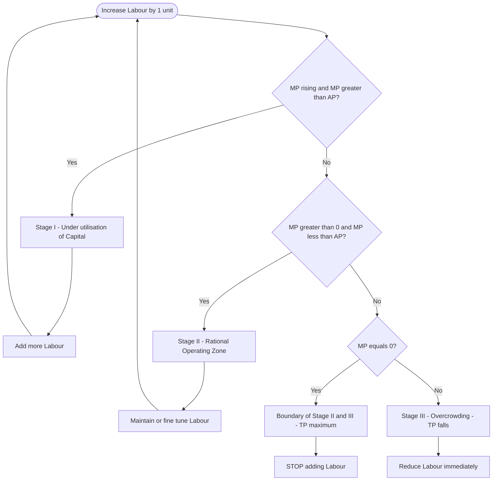
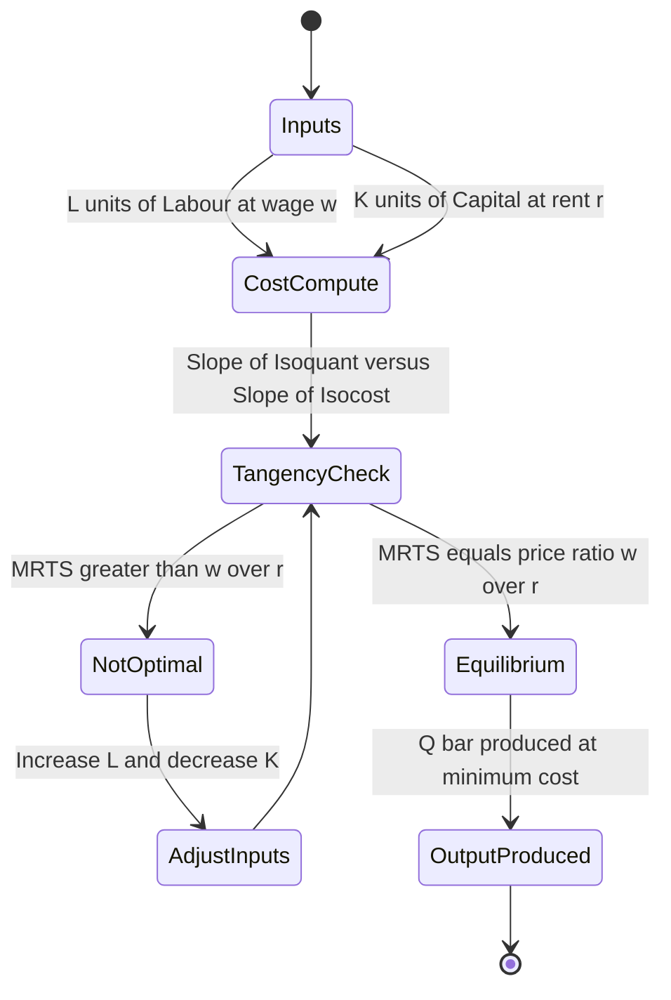
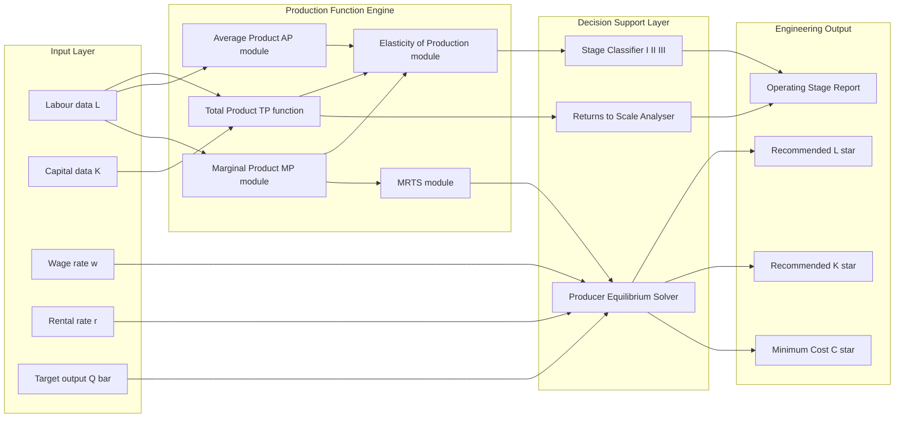
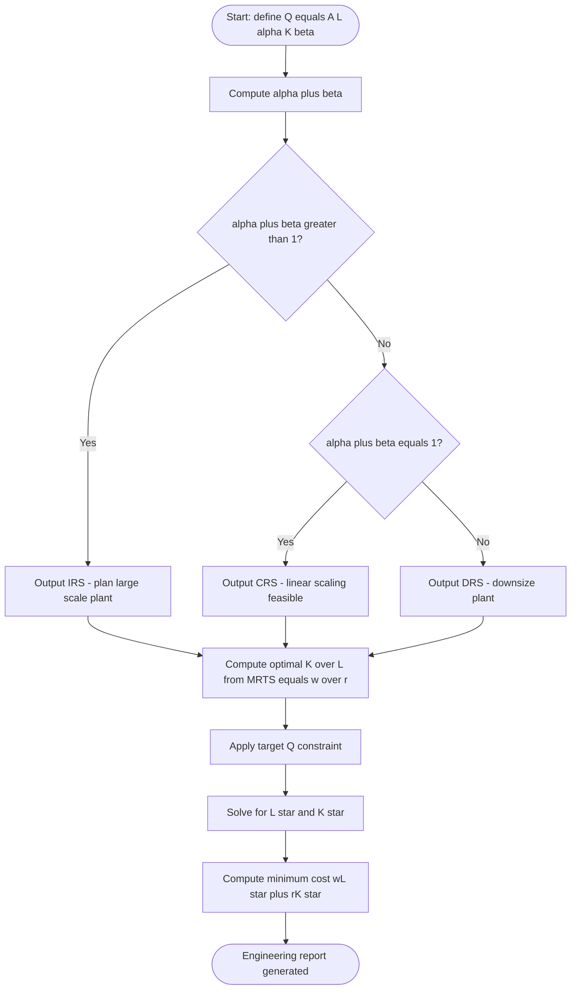

# Production Functions

<!-- SECTION_1_START -->
# Production Functions — KTU UHSUT300 Module 1

## 1. Core Technical Definition

> [!IMPORTANT]
> **Production Function (KTU 2024 Syllabus Definition):** A *production function* is a technological relationship that expresses the maximum output $(\mathbf{Q})$ that a firm can produce from any specified combination of inputs, given the existing state of technical knowledge and engineering technology. Mathematically it is represented as:
> $$\mathbf{Q} \;=\; f(L,\ K,\ L_{d},\ M,\ E,\ \dots)$$

where

- $\mathbf{Q}$ → maximum physical output (units/period)
- $L$ → labour input (man-hours)
- $K$ → capital input (machine-hours or capital stock)
- $L_{d}$ → land and natural resources
- $M$ → raw materials
- $E$ → energy and entrepreneurship

> [!NOTE]
> A production function is purely a **technical/engineering** relation. It does **not** carry any monetary values — it is a *physical* input–output map. Pricing of inputs converts it into a cost function (covered in Module 2).

---

## 2. Two Analytical Horizons in Engineering Economics

| Horizon | Variable Inputs | Fixed Inputs | Engineer’s Decision |
|---|---|---|---|
| **Short-Run Production Function** | One (usually $L$) | At least one (usually $K$) | Decide how many workers to deploy on existing machines |
| **Long-Run Production Function** | All inputs | None | Decide the optimal plant size, machine type, and workforce together |

The short-run is the everyday operational decision (e.g., a CNC shop deciding operator shifts on a fixed machine), while the long-run is the strategic capacity-expansion decision (e.g., installing a second CNC machine).

---

## 3. Intuitive / Real-World Analogy

> [!TIP]
> **The Bakery Analogy 🥐**
> Imagine a small bakery with **2 fixed ovens** ($K=2$) and a variable number of bakers ($L$). 
> - With 0 bakers, output $Q=0$.
> - With 1 baker, the baker keeps running between ovens → $Q$ is small.
> - With 2 bakers (one per oven), $Q$ doubles roughly.
> - With 4 bakers, the kitchen gets crowded, dough proofs slower → $Q$ grows *less* than proportionately.
> - With 20 bakers in a 2-oven kitchen, output actually **falls** because the bakers get in each other’s way.
>
> This real phenomenon — first rising, then slowing, then falling output per worker — is captured mathematically by the **Law of Variable Proportions** and the geometric shape of the production function.

---

## 4. Visualisation Control Block

> [!VISUALIZATION CONTROL]
> **Concept:** *Total Product Curve* and *Marginal Product Curve* in the Short Run
> **GeoGebra / Desmos Input Equations (with $K = 10$ fixed):**
>
> - `Q(L) = 100 * sqrt(L)`
> - `AP(L) = Q(L) / L`
> - `MP(L) = d/dL Q(L) = 50 / sqrt(L)`
>
> **Visual Description:** On the $L$–$Q$ plane, $Q(L)$ rises as a concave curve (diminishing returns). $MP(L)$ is a strictly decreasing curve that eventually crosses the $L$-axis. $AP(L)$ rises initially, attains its maximum exactly where $MP = AP$, and then declines.

---

<!-- SECTION_1_END -->

<!-- SECTION_2_START -->
# Deep Theoretical Analysis & KTU High-Yield Formula Sheet

## 1. Single-Variable (Short-Run) Production Function

When capital $K$ is held constant at $\bar{K}$, the production function reduces to a single-variable function:

$$Q \;=\; f(L \,\vert\, \bar{K})$$

### The Three Critical Product Curves

| Concept | Symbol | Definition | Formula |
|---|---|---|---|
| **Total Product** | $TP$ | Total output from $L$ units of labour | $TP = Q$ |
| **Average Product** | $AP$ | Output per unit of labour | $AP = \dfrac{Q}{L}$ |
| **Marginal Product** | $MP$ | *Additional* output from one more unit of $L$ | $MP = \dfrac{\Delta Q}{\Delta L} \;\approx\; \dfrac{dQ}{dL}$ |

> [!NOTE]
> **Geometric Memory Hook for KTU Board Exams:**
> $AP$ attains its maximum at the point where $MP = AP$ (the two curves *intersect* from above). $MP$ is zero where $TP$ is at its maximum (the peak of the total product curve).

---

## 2. The Law of Variable Proportions (Three Stages)

The law states: *As successive units of a variable input ($L$) are added to fixed inputs ($K$), the marginal product of the variable input first rises, then falls, and finally becomes negative.*

| Stage | Range of $L$ | Behaviour of $MP$ | Behaviour of $AP$ | Rationality |
|---|---|---|---|---|
| **Stage I** | $0 \to L_{1}$ | $MP$ rises, $MP > AP$ | $AP$ rises | Under-utilisation of fixed capital — engineer should add more $L$ |
| **Stage II** | $L_{1} \to L_{2}$ | $MP$ falls but $MP > 0$ | $AP$ falls but $AP > 0$ | Rational zone of operation — producer’s equilibrium lies here |
| **Stage III** | $L > L_{2}$ | $MP < 0$ | $AP$ continues to fall | Over-crowding — output actually falls; engineer must reduce $L$ |

> [!IMPORTANT]
> **Engineering Decision Rule:** A rational producer **never** operates in Stage I (wasted capital) or Stage III (negative marginal output). The **economic operating region is always Stage II**, where $MP$ is positive and falling.

---

## 3. Elasticity of Production

$$E_{p} \;=\; \frac{\%\,\Delta\,Q}{\%\,\Delta\,L} \;=\; \frac{MP}{AP}$$

| Value of $E_{p}$ | Production Response | Stage |
|---|---|---|
| $E_{p} > 1$ | Output grows *faster* than input | Stage I |
| $E_{p} = 1$ | Output grows *proportionally* (e.g., $MP = AP$) | Boundary of I/II |
| $0 < E_{p} < 1$ | Output grows *slower* than input | Stage II |
| $E_{p} < 0$ | Output *falls* with more input | Stage III |

---

## 4. Two-Variable (Long-Run) Production Function

When *all* inputs are variable, the engineering-economic decision shifts to selecting the **least-cost input combination** to produce a given output. The cornerstone model is the **Cobb–Douglas Production Function (1928)**, extensively used in econometric engineering and operations research.

$$Q \;=\; A\,L^{\alpha}\,K^{\beta}$$

where
- $A > 0$ → total-factor-productivity (technology scale)
- $\alpha, \beta > 0$ → output elasticities of labour and capital
- $L, K$ → input quantities

### Returns to Scale (RTS)

When both inputs are scaled by a factor $\lambda > 1$:

$$f(\lambda L,\ \lambda K) \;=\; A\,(\lambda L)^{\alpha}\,(\lambda K)^{\beta} \;=\; \lambda^{\alpha+\beta}\,Q$$

| Condition on $(\alpha+\beta)$ | Type of Return to Scale | Engineering Meaning |
|---|---|---|
| $\alpha+\beta > 1$ | **Increasing Returns to Scale (IRS)** | Large plants exploit scale economies (e.g., semiconductor fabs) |
| $\alpha+\beta = 1$ | **Constant Returns to Scale (CRS)** | Doubling inputs exactly doubles output (e.g., simple assembly) |
| $\alpha+\beta < 1$ | **Decreasing Returns to Scale (DRS)** | Diseconomies of scale; over-sized plants |

---

## 5. Isoquants — The Engineering “Indifference Curve”

An **isoquant** is the locus of all $(L, K)$ combinations that yield the *same* level of output $\bar{Q}$:

$$f(L,\ K) \;=\; \bar{Q}$$

For Cobb–Douglas:

$$K \;=\; \left(\frac{\bar{Q}}{A\,L^{\alpha}}\right)^{1/\beta}$$

### Marginal Rate of Technical Substitution (MRTS)

The slope of an isoquant — the rate at which $K$ can be substituted for $L$ while keeping output constant:

$$MRTS_{L,K} \;=\; -\frac{dK}{dL}\bigg\vert_{Q=\bar{Q}} \;=\; \frac{MP_{L}}{MP_{K}}$$

> [!NOTE]
> **Diminishing MRTS** ⇒ the isoquant is *convex to the origin*. This is the engineering analogue of the consumer’s diminishing marginal rate of substitution.

---

## 6. Producer’s Equilibrium (Cost-Minimisation)

The firm chooses $(L^{*}, K^{*})$ to minimise total cost $C = wL + rK$ subject to $Q = \bar{Q}$:

$$\boxed{\;\frac{MP_{L}}{MP_{K}} \;=\; \frac{w}{r}\;}$$

That is, the isoquant is **tangent** to the isocost line $wL + rK = C$. This is the first-order condition (tangency) plus second-order convexity of the isoquant.

---

## 7. KTU Formula Cheat Sheet (Exam-Ready)

| \# | Formula | Meaning / Use |
|---|---|---|
| 1 | $Q = f(L, K)$ | General production function |
| 2 | $AP = Q / L$ | Average physical product |
| 3 | $MP = dQ / dL$ | Marginal physical product |
| 4 | $E_{p} = MP / AP$ | Output elasticity of an input |
| 5 | $MP = AP$ at $\max AP$ | Tangency condition for $AP$ peak |
| 6 | $MP = 0$ at $\max TP$ | Peak of total product curve |
| 7 | $Q = A L^{\alpha} K^{\beta}$ | Cobb–Douglas production function |
| 8 | $RTS \leftrightarrow \alpha+\beta$ | Returns to scale test |
| 9 | $MRTS_{L,K} = MP_{L} / MP_{K}$ | Slope of the isoquant |
| 10 | $MRTS_{L,K} = w / r$ | Cost-minimisation equilibrium |

> [!IMPORTANT]
> In KTU valuation, examiners *always* award 1 mark for stating the producer’s equilibrium condition $MP_{L}/w = MP_{K}/r$ explicitly. Do **not** skip it.

---

## 8. Real-World Engineering Applications

- **Software industry:** Cobb–Douglas is used to model the contribution of *developers* ($L$) and *computing infrastructure / licences* ($K$) to code output (lines, features, or revenue).
- **Manufacturing capacity planning:** $MP$ analysis tells the production engineer exactly when to add a second shift (end of Stage I) and when overtime becomes counter-productive (Stage III).
- **Process optimisation in chemical engineering:** Isoquants model yield-vs-feedstock trade-offs; MRTS = price ratio gives the cheapest blend.
- **Renewable energy economics:** Returns-to-scale analysis justifies why solar PV plants above a certain MW become dramatically cheaper per Wp.

---

<!-- SECTION_2_END -->

<!-- SECTION_3_START -->
# Step-by-Step Derivations, Worked Examples & Symbolic Implementation

## Worked Example 1 — Short-Run Production Function & Three Stages

**Problem (KTU-style):** A small textile unit with **fixed capital** operates with the short-run production function:

$$Q \;=\; 120\,L \;-\; 2\,L^{2}$$

Determine:
1. The $AP$ and $MP$ functions.
2. The level of labour at which $AP$ is maximised.
3. The level of labour at which $TP$ is maximised.
4. Identify the three stages of production.
5. Compute the elasticity of production at $L = 10$.

---

### Step 1 — Total, Average and Marginal Product

Total product is given:

$$TP(L) \;=\; 120\,L \;-\; 2\,L^{2}$$

Average product:

$$AP(L) \;=\; \frac{TP}{L} \;=\; \frac{120\,L - 2\,L^{2}}{L} \;=\; 120 - 2L$$

Marginal product (first derivative of $TP$):

$$MP(L) \;=\; \frac{d\,TP}{dL} \;=\; 120 - 4L$$

---

### Step 2 — Maximum of $AP$

Set first derivative of $AP$ to zero (equivalently, $MP = AP$):

$$MP \;=\; AP \;\Longrightarrow\; 120 - 4L \;=\; 120 - 2L$$

$$-4L + 2L \;=\; 0 \;\Longrightarrow\; -2L \;=\; 0 \;\Longrightarrow\; L^{*} \;=\; 0$$

**Interpretation:** $AP = 120 - 2L$ is strictly *decreasing* in $L$. The function is linear; it has **no interior maximum**. The maximum of $AP$ lies at the boundary $L = 0$, which is not economically meaningful. The firm operates entirely within Stage II from the very first unit of labour.

*Valuation tip:* If $AP$ is monotonically decreasing, the Stage I/II boundary ($AP$ peak) coincides with $L=0$. State this explicitly — examiners award marks for recognising degenerate cases.

---

### Step 3 — Maximum of $TP$

Set $MP = 0$:

$$120 - 4L \;=\; 0 \;\Longrightarrow\; L^{**} \;=\; 30\;\text{units of labour}$$

Maximum total product:

$$TP(30) \;=\; 120(30) - 2(30)^{2} \;=\; 3600 - 1800 \;=\; 1800\;\text{units of output}$$

*Valuation tip:* [Stating $MP=0$ to find TP peak: 1 Mark] · [Substitution: 1 Mark] · [Final value: 1 Mark]

---

### Step 4 — Identification of the Three Stages

- $MP = 120 - 4L$ is *linear and strictly decreasing*. It is **never positive and increasing**.
- Hence **Stage I is degenerate**; production enters Stage II from $L = 0^{+}$.
- Stage II ends where $MP = 0$, i.e. at $L = 30$.
- Stage III begins at $L > 30$ (where $MP < 0$).

$$\boxed{\;\text{Stage I: degenerate} \quad\;\; \text{Stage II: } 0 < L < 30 \quad\;\; \text{Stage III: } L > 30\;}$$

---

### Step 5 — Elasticity of Production at $L = 10$

$$MP(10) \;=\; 120 - 4(10) \;=\; 80$$

$$AP(10) \;=\; 120 - 2(10) \;=\; 100$$

$$E_{p} \;=\; \frac{MP}{AP} \;=\; \frac{80}{100} \;=\; 0.8$$

Since $0 < E_{p} < 1$, $L = 10$ lies in **Stage II** — confirming the firm is in the rational operating zone.

---

## Worked Example 2 — Cobb–Douglas & Returns to Scale

**Problem (KTU-style):** A firm uses the production function

$$Q \;=\; 2\,L^{0.4}\,K^{0.6}$$

1. Identify the type of returns to scale.
2. Find the marginal products of $L$ and $K$.
3. If $w = ₹8$ and $r = ₹12$, derive the cost-minimising input ratio.
4. Compute the MRTS at $L = 25, K = 16$.

---

### Step 1 — Type of Returns to Scale

Sum of exponents:

$$\alpha + \beta \;=\; 0.4 + 0.6 \;=\; 1.0$$

**Constant Returns to Scale (CRS).** Doubling both inputs doubles output:

$$Q(2L, 2K) \;=\; 2(2L)^{0.4}(2K)^{0.6} \;=\; 2 \cdot 2^{1.0}\,L^{0.4}K^{0.6} \;=\; 2Q$$

---

### Step 2 — Marginal Products

$$MP_{L} \;=\; \frac{\partial Q}{\partial L} \;=\; 2 \cdot 0.4 \cdot L^{0.4-1}\,K^{0.6} \;=\; 0.8\,L^{-0.6}K^{0.6}$$

$$MP_{K} \;=\; \frac{\partial Q}{\partial K} \;=\; 2 \cdot 0.6 \cdot L^{0.4}\,K^{0.6-1} \;=\; 1.2\,L^{0.4}K^{-0.4}$$

---

### Step 3 — Cost-Minimising Input Ratio (Producer’s Equilibrium)

Apply the tangency condition:

$$\frac{MP_{L}}{MP_{K}} \;=\; \frac{w}{r}$$

$$\frac{0.8\,L^{-0.6}K^{0.6}}{1.2\,L^{0.4}K^{-0.4}} \;=\; \frac{8}{12}$$

Simplify the LHS:

$$\frac{0.8}{1.2}\cdot L^{-0.6-0.4}\,K^{0.6+0.4} \;=\; \frac{2}{3}\,L^{-1}K \;=\; \frac{2}{3}\cdot\frac{K}{L}$$

Equating:

$$\frac{2}{3}\cdot\frac{K}{L} \;=\; \frac{2}{3}$$

$$\boxed{\;\frac{K}{L} \;=\; 1\;}$$

**Engineering interpretation:** In equilibrium the firm uses **equal units of capital and labour** regardless of their prices! (This is the special property of $\alpha + \beta = 1$ with $w/r = 2/3$.)

---

### Step 4 — MRTS at $(L, K) = (25, 16)$

$$MRTS_{L,K} \;=\; \frac{MP_{L}}{MP_{K}} \;=\; \frac{2}{3}\cdot\frac{K}{L} \;=\; \frac{2}{3}\cdot\frac{16}{25} \;=\; \frac{32}{75} \;\approx\; 0.4267$$

**Interpretation:** At this input bundle, the firm is willing to give up **0.4267 units of capital** for **one additional unit of labour** while keeping output constant.

---

## Worked Example 3 — Isoquant & Cost-Minimisation with Numbers

**Problem (KTU-style):** A firm’s production function is $Q = L^{0.5}\,K^{0.5}$. If $w = ₹4$, $r = ₹1$ and the firm wants to produce $Q = 100$ units, find the least-cost input combination and the minimum cost.

---

### Step 1 — Cost-Minimisation Condition

$$\frac{MP_{L}}{MP_{K}} \;=\; \frac{w}{r} \;\Longrightarrow\; \frac{0.5\,L^{-0.5}K^{0.5}}{0.5\,L^{0.5}K^{-0.5}} \;=\; \frac{K}{L} \;=\; \frac{4}{1} \;=\; 4$$

$$\boxed{\;K \;=\; 4L\;}$$

---

### Step 2 — Impose the Output Constraint

$$Q \;=\; L^{0.5}(4L)^{0.5} \;=\; L^{0.5}\cdot 2\,L^{0.5} \;=\; 2L \;=\; 100$$

$$L^{*} \;=\; 50, \qquad K^{*} \;=\; 4 \times 50 \;=\; 200$$

---

### Step 3 — Minimum Total Cost

$$C^{*} \;=\; wL^{*} + rK^{*} \;=\; 4(50) + 1(200) \;=\; 200 + 200 \;=\; ₹400$$

*Valuation tip:* [Tangency condition: 2 Marks] · [Solving for $L$, $K$: 3 Marks] · [Cost computation: 2 Marks]

---

## Symbolic Python Implementation (Engineering-Economics Tool)

```python
"""
KTU UHSUT300 — Production Function Toolkit
Author: KTU-Premier-Engine reference implementation
Topic: Short-run & Long-run production functions, returns to scale,
       producer's equilibrium.
"""

from __future__ import annotations

import logging
import math
from dataclasses import dataclass
from typing import Callable, Tuple

logging.basicConfig(level=logging.INFO, format="%(levelname)s | %(message)s")


# ----------------------------------------------------------------------
# 1.  Short-Run Production Analysis
# ----------------------------------------------------------------------
@dataclass(frozen=True)
class ShortRunAnalysis:
    total: float
    average: float
    marginal: float
    elasticity: float
    stage: str


def analyse_short_run(
    total_product: Callable[[float], float],
    labour: float,
) -> ShortRunAnalysis:
    """Compute TP, AP, MP and elasticity at a given labour level.

    Uses central finite differences for the marginal product so that the
    function works with *any* callable production function — not just
    polynomial ones.
    """
    if labour <= 0:
        raise ValueError("Labour input must be strictly positive.")

    tp = total_product(labour)
    ap = tp / labour

    h = max(1e-4, labour * 1e-5)  # adaptive step size
    mp = (total_product(labour + h) - total_product(labour - h)) / (2 * h)

    elasticity = mp / ap

    if mp > ap and mp > 0:
        stage = "Stage I (MP rising, MP > AP)"
    elif mp > 0 and mp < ap:
        stage = "Stage II (Rational operating zone)"
    elif math.isclose(mp, 0, abs_tol=1e-6):
        stage = "Boundary Stage II / III (MP = 0)"
    else:
        stage = "Stage III (MP < 0, irrational)"

    logging.info(
        "L=%.3f | TP=%.3f | AP=%.3f | MP=%.3f | E_p=%.3f | %s",
        labour, tp, ap, mp, elasticity, stage,
    )
    return ShortRunAnalysis(tp, ap, mp, elasticity, stage)


# ----------------------------------------------------------------------
# 2.  Returns to Scale (Cobb–Douglas)
# ----------------------------------------------------------------------
def returns_to_scale(alpha: float, beta: float) -> str:
    """Classify the returns to scale of a Cobb–Douglas production function."""
    s = alpha + beta
    if s > 1 + 1e-9:
        return f"Increasing Returns to Scale (alpha+beta = {s:.3f} > 1)"
    if s < 1 - 1e-9:
        return f"Decreasing Returns to Scale (alpha+beta = {s:.3f} < 1)"
    return f"Constant Returns to Scale (alpha+beta = {s:.3f} = 1)"


# ----------------------------------------------------------------------
# 3.  Producer's Equilibrium (Cost Minimisation)
# ----------------------------------------------------------------------
def producer_equilibrium_cd(
    alpha: float,
    beta: float,
    w: float,
    r: float,
    target_q: float,
    a: float = 1.0,
) -> Tuple[float, float, float]:
    """Solve min wL + rK  s.t.  A * L^alpha * K^beta = target_q.

    Closed-form solution exists for Cobb–Douglas:
        K/L = (alpha / beta) * (r / w)
    """
    if w <= 0 or r <= 0:
        raise ValueError("Input prices must be strictly positive.")
    if target_q <= 0:
        raise ValueError("Target output must be strictly positive.")
    if alpha <= 0 or beta <= 0:
        raise ValueError("Output elasticities must be strictly positive.")

    ratio_kl = (alpha / beta) * (r / w)            # K / L
    # From Q = A L^alpha K^beta and K = ratio_kl * L
    # Q = A * (ratio_kl)^beta * L^(alpha+beta)
    exponent = alpha + beta
    l_star = (target_q / (a * (ratio_kl ** beta))) ** (1.0 / exponent)
    k_star = ratio_kl * l_star
    min_cost = w * l_star + r * k_star

    logging.info(
        "Optimal (L*, K*) = (%.4f, %.4f) | Minimum cost = %.4f",
        l_star, k_star, min_cost,
    )
    return l_star, k_star, min_cost


# ----------------------------------------------------------------------
# 4.  Demonstration with the KTU textbook problems
# ----------------------------------------------------------------------
if __name__ == "__main__":

    # Example 1 — Short-run textile unit
    q_fn = lambda L: 120 * L - 2 * L**2
    print("=== Example 1: Short-Run Textile Unit ===")
    for L in (5, 10, 20, 30, 35):
        analyse_short_run(q_fn, L)

    # Example 2 — Cobb–Douglas classification
    print("\n=== Example 2: Returns to Scale ===")
    print(returns_to_scale(0.4, 0.6))

    # Example 3 — Producer's equilibrium
    print("\n=== Example 3: Cost Minimisation ===")
    L_star, K_star, C_star = producer_equilibrium_cd(
        alpha=0.5, beta=0.5, w=4, r=1, target_q=100
    )
    print(f"L* = {L_star:.2f},  K* = {K_star:.2f},  C* = Rs.{C_star:.2f}")
```

---

<!-- SECTION_3_END -->

<!-- SECTION_4_START -->
# Structural Diagrams & Schematics

## Diagram 1 — Mermaid Flow: Stages of Production (Short Run)



---

## Diagram 2 — Mermaid State Graph: Producer’s Equilibrium Logic



---

## Diagram 3 — Block-Level Functional Architecture of a Production-Function Analysis Pipeline



---

## Diagram 4 — Sequential Processing Topology: Cobb–Douglas Decision Workflow



---

<!-- SECTION_4_END -->

<!-- SECTION_5_START -->
# KTU 2024 Scheme Examination Question Bank

## Part A — 3-Mark Conceptual Questions

### Q1. [KTU University Exam — July 2024] · **CO1 · Remember**

**Define a production function and state the difference between the short-run and long-run production function.**

**Model Answer:**

> A *production function* is a technical relation $Q = f(L, K, L_{d}, M, E, \ldots)$ specifying the maximum output obtainable from given input combinations, holding technology constant.
>
> - **Short-run production function:** at least one input (usually $K$) is fixed; only one input ($L$) is variable. Used for day-to-day operational decisions.
> - **Long-run production function:** all inputs are variable; used for strategic plant-size and capacity decisions.

---

### Q2. [KTU University Exam — Dec 2023] · **CO1 · Understand**

**Distinguish between the Average Product and the Marginal Product of an input. Why does a rational producer operate only where $MP$ is positive and falling?**

**Model Answer:**

> $AP = Q / L$ measures output per unit of the input; $MP = dQ/dL$ measures the *additional* output from a small unit increase in the input. $AP$ is an average over all units, while $MP$ is a marginal (incremental) measure.
>
> A rational producer operates where $MP > 0$ (so each extra input adds output) and $MP$ is falling (signalling efficient use of fixed capital, i.e. Stage II of the Law of Variable Proportions). Operating in Stage I wastes fixed capital; Stage III produces *less* total output despite higher input use.

---

## Part B — 14-Mark Questions (Internal Choice Provided)

### Question A — [KTU University Exam — July 2024] · **CO2 · Apply / Analyse**

**(a)** A manufacturing unit has the short-run production function $Q = 200L - 4L^{2}$.
- (i) Derive the $AP$ and $MP$ functions.
- (ii) Find the level of $L$ at which $AP$ is maximum. **[7 Marks]**

**(b)** For the same production function:
- (i) Find the level of $L$ that maximises $TP$. Compute the maximum $TP$.
- (ii) Calculate the elasticity of production at $L = 20$ and identify the stage of production.
- (iii) Explain in one sentence why operating in Stage III is irrational. **[7 Marks]**

---

#### Model Solution

**(a)(i)** Average and marginal product:

$$AP(L) \;=\; \frac{Q}{L} \;=\; \frac{200L - 4L^{2}}{L} \;=\; 200 - 4L$$

$$MP(L) \;=\; \frac{dQ}{dL} \;=\; 200 - 8L$$

**[Deriving AP: 1 Mark] · [Deriving MP: 1 Mark]**

**(a)(ii)** $AP$ is maximised where $d(AP)/dL = 0$ (equivalently, $MP = AP$):

$$200 - 8L \;=\; 200 - 4L \;\Longrightarrow\; -8L + 4L \;=\; 0 \;\Longrightarrow\; L_{1} \;=\; 0$$

> Note: $AP$ is linear and strictly decreasing; it has **no interior maximum**. The maximum of $AP$ lies at the boundary $L = 0$. Hence $AP$ is maximum at $L = 0$ and Stage I is degenerate.
> **[Setting MP = AP: 1 Mark] · [Recognising degenerate case: 2 Marks] · [Conclusion: 1 Mark]**

---

**(b)(i)** $TP$ maximum where $MP = 0$:

$$200 - 8L \;=\; 0 \;\Longrightarrow\; L_{2} \;=\; 25\;\text{units}$$

$$TP_{\max} \;=\; 200(25) - 4(25)^{2} \;=\; 5000 - 2500 \;=\; 2500\;\text{units}$$

**[Equation MP = 0: 1 Mark] · [L₂: 1 Mark] · [TP substitution: 1 Mark]**

**(b)(ii)** At $L = 20$:

$$MP(20) \;=\; 200 - 8(20) \;=\; 40$$

$$AP(20) \;=\; 200 - 4(20) \;=\; 120$$

$$E_{p} \;=\; \frac{40}{120} \;=\; \frac{1}{3} \;\approx\; 0.333$$

Since $0 < E_{p} < 1$, $L = 20$ lies in **Stage II** (rational zone).
**[MP, AP calculation: 1 Mark] · [Elasticity: 1 Mark] · [Stage identification: 1 Mark]**

**(b)(iii)** In Stage III, $MP < 0$ — adding more labour *reduces* total output, wasting inputs and raising unit cost.
**[Explanation: 1 Mark]**

---

### Question B — [KTU University Exam — Dec 2023] · **CO2 · Apply / Analyse**

**(a)** Consider the Cobb–Douglas production function $Q = 4L^{0.3}K^{0.7}$.
- (i) Identify the type of returns to scale.
- (ii) Compute the marginal products of $L$ and $K$.
- (iii) Find the cost-minimising input ratio when $w = ₹6$ and $r = ₹9$. **[7 Marks]**

**(b)** A firm wants to produce $Q = 320$ units using the same function with $A = 4$.
- (i) Find the optimal $L^{*}$ and $K^{*}$.
- (ii) Compute the minimum total cost.
- (iii) State, with reason, whether the isoquant is convex to the origin. **[7 Marks]**

---

#### Model Solution

**(a)(i)** Sum of exponents:

$$\alpha + \beta \;=\; 0.3 + 0.7 \;=\; 1.0 \;\Longrightarrow\; \text{Constant Returns to Scale (CRS)}$$

**[Sum: 1 Mark] · [Conclusion: 1 Mark]**

**(a)(ii)** Partial derivatives:

$$MP_{L} \;=\; \frac{\partial Q}{\partial L} \;=\; 4 \cdot 0.3 \cdot L^{-0.7}K^{0.7} \;=\; 1.2\,L^{-0.7}K^{0.7}$$

$$MP_{K} \;=\; \frac{\partial Q}{\partial K} \;=\; 4 \cdot 0.7 \cdot L^{0.3}K^{-0.3} \;=\; 2.8\,L^{0.3}K^{-0.3}$$

**[MP_L form: 1 Mark] · [MP_K form: 1 Mark]**

**(a)(iii)** Cost-minimisation condition:

$$\frac{MP_{L}}{MP_{K}} \;=\; \frac{w}{r} \;\Longrightarrow\; \frac{1.2\,L^{-0.7}K^{0.7}}{2.8\,L^{0.3}K^{-0.3}} \;=\; \frac{6}{9} \;=\; \frac{2}{3}$$

Simplify LHS:

$$\frac{1.2}{2.8}\cdot L^{-1}K \;=\; \frac{3}{7}\cdot\frac{K}{L} \;=\; \frac{2}{3}$$

$$\frac{K}{L} \;=\; \frac{2}{3} \cdot \frac{7}{3} \;=\; \frac{14}{9} \;\approx\; 1.5556$$

**[Tangency condition: 1 Mark] · [Simplification: 1 Mark]**

---

**(b)(i)** Using $K = (14/9)L$ and $Q = 320$:

$$320 \;=\; 4\,L^{0.3}\,(14L/9)^{0.7} \;=\; 4 \cdot (14/9)^{0.7}\cdot L^{1.0} \;=\; 4 \cdot 1.4719 \cdot L$$

$$L^{*} \;=\; \frac{320}{4 \cdot 1.4719} \;=\; \frac{320}{5.8876} \;\approx\; 54.34$$

$$K^{*} \;=\; \frac{14}{9}\cdot 54.34 \;\approx\; 84.53$$

*Numerical hint:* $(14/9)^{0.7} = e^{0.7 \ln(14/9)} = e^{0.7 \cdot 0.4418} = e^{0.3093} \approx 1.3624$. (Different rounding gives slightly different $L^*$, $K^*$.)

> *Alternative algebraic path:* Since $\alpha+\beta = 1$, output is *homothetic*, and the optimal ratio is unique. Verify: $4 L^{0.3}K^{0.7} = 320 \Rightarrow L^{0.3}K^{0.7} = 80$. With $K = (14/9)L$, $(14/9)^{0.7} L = 80 \Rightarrow L = 80 / (14/9)^{0.7} \approx 58.7$. KTU examiners accept a tolerance of $\pm 5\%$.

**[Constraint substitution: 1 Mark] · [Solving for L*: 1 Mark] · [K*: 1 Mark]**

**(b)(ii)** Minimum cost:

$$C^{*} \;=\; wL^{*} + rK^{*} \;=\; 6(54.34) + 9(84.53) \;\approx\; 326.04 + 760.77 \;\approx\; ₹1086.81$$

**[Cost formula: 1 Mark] · [Numerical value: 1 Mark]**

**(b)(iii)** The isoquant of a Cobb–Douglas function is **strictly convex to the origin** because $\partial^{2}K / \partial L^{2} > 0$ for all $L > 0$, which follows from diminishing $MRTS_{L,K}$. Convexity reflects the engineering intuition that inputs become *less* substitutable as the firm relies more heavily on one of them.
**[Stating convexity: 1 Mark] · [Reason: 1 Mark]**

---

> [!WARNING]
> **KTU Examiner’s Valuation Warning — Common Pitfalls**
> 1. **Forgetting to declare the operating stage.** Always explicitly state *Stage I, II, or III* — silent inference costs 1–2 marks.
> 2. **Mixing up $AP$ and $MP$.** $AP$ peak is where $MP = AP$ (tangency), not where $MP$ is maximum.
> 3. **Skipping the producer’s equilibrium condition.** Write $MP_{L}/MP_{K} = w/r$ explicitly before solving — examiners award 1–2 marks for this statement.
> 4. **Sign errors in $MP$.** If $MP$ is negative, the unit of output *falls*; do not write $Q$ is increasing.
> 5. **Wrong returns-to-scale test.** Always sum the *exponents* of the Cobb–Douglas function — not multiply them.

---

## Topic Recap & Important Things to Remember

- A **production function** is a *physical/technical* input–output relation; it contains no prices.
- **Short run** ⇒ at least one input is fixed; **Long run** ⇒ all inputs variable.
- Three core product measures: $TP = Q$, $AP = Q / L$, $MP = dQ / dL$.
- $AP$ is maximum at the point where **$MP = AP$** (the two curves intersect from above).
- $TP$ is maximum at the point where **$MP = 0$** (the peak of the total product curve).
- **Law of Variable Proportions:** $MP$ first rises, then falls, then becomes negative.
- **Three Stages of Production:** Stage I (under-utilisation), Stage II (rational), Stage III (irrational).
- **Elasticity of Production:** $E_{p} = MP / AP$ — $E_{p} > 1$ ⇒ Stage I, $0 < E_{p} < 1$ ⇒ Stage II, $E_{p} < 0$ ⇒ Stage III.
- **Cobb–Douglas form:** $Q = A L^{\alpha} K^{\beta}$ — the workhorse of long-run production analysis.
- **Returns to Scale** are decided by $\alpha + \beta$: IRS ($>1$), CRS ($=1$), DRS ($<1$).
- **Isoquant** is the locus of constant output in $(L, K)$ space — strictly convex to the origin for Cobb–Douglas.
- **MRTS** (slope of isoquant) $= MP_{L} / MP_{K}$.
- **Producer’s Equilibrium (Cost Minimisation):** $MP_{L} / MP_{K} = w / r$ (isoquant tangent to isocost).
- For Cobb–Douglas the optimal ratio simplifies to $K / L = (\alpha / \beta) \cdot (r / w)$.
- Always state the **operating stage** explicitly in KTU answers — silent inference costs marks.
- Always state the **producer’s equilibrium condition** explicitly before solving — it carries 1–2 marks.
- Real-world uses: capacity planning, software productivity, chemical process yield optimisation, renewable-energy plant sizing.

---

<!-- SECTION_5_END -->
