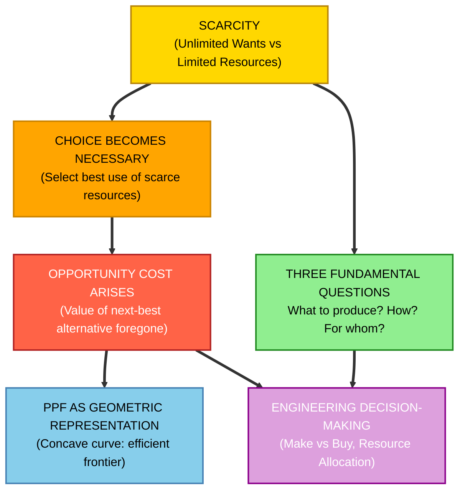
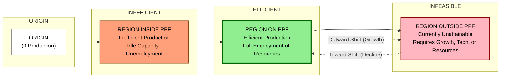
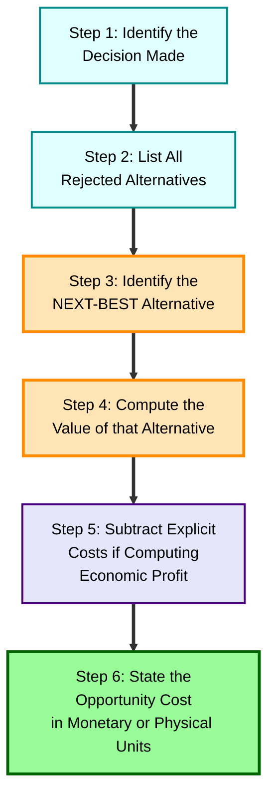
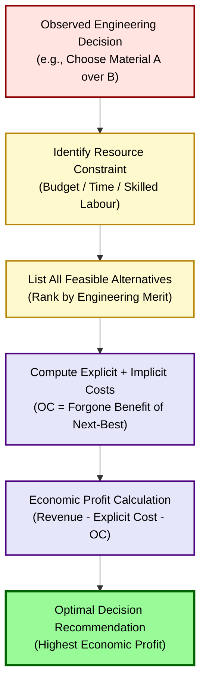

# Basic economic problems: Scarcity, choice, and opportunity cost

<!-- SECTION_1_START -->

# Basic Economic Problems: Scarcity, Choice, and Opportunity Cost

> [!IMPORTANT]
> **KTU 2024 Scheme – Module 1 Anchor Topic**
> This topic forms the foundational triad of Engineering Economics. Every subsequent concept in UHSUT300 (demand, supply, cost curves, break-even analysis, depreciation, and investment appraisal) is logically downstream of the three problems addressed here.

---

## 1.1 The Core Triad — Formal Definitions

> [!NOTE]
> **Syllabus-Grade Definitions (Use verbatim in 2-mark/3-mark answers)**

**1. Scarcity**
Scarcity is the fundamental economic condition in which the available resources of a society are **insufficient** to satisfy all of its human wants and needs simultaneously. It is not a synonym for "poverty" — scarcity exists even in the wealthiest economies because *wants are infinite and resources are finite*.

$$ \text{Scarcity} \;\Longrightarrow\; \text{Wants} \;>\; \text{Resources available to satisfy them} $$

**2. Choice**
Choice is the act of selecting one alternative from a set of mutually exclusive options, made necessary by scarcity. In a planned engineering context, choice is the act of committing limited capital, labour, raw material, and time to a specific use while rejecting other technically feasible uses.

**3. Opportunity Cost**
Opportunity cost is the value of the **next-best alternative foregone** when a choice is made. It is the cost of what is sacrificed, not the cost of what is chosen. It exists only because of scarcity and is realised only through choice.

$$ \text{Opportunity Cost} \;=\; \text{Value of the Next-Best Alternative Sacrificed} $$

> [!IMPORTANT]
> **Examiner's Anchor Phrase:** "The opportunity cost of a decision is *not* what you spent, but what you *gave up*." Memorise this line — it is the single most quoted statement in KTU valuation scripts on this topic.

---

## 1.2 Intuitive Analogies (The "Explain Like I'm 18" Layer)

### Analogy 1 — The B.Tech Student's Dilemma
A final-year student has **24 hours** in a day. She has overlapping demands:

- Semester project work (deadline: 5 days away)
- Campus placement aptitude test preparation
- Family function (only daughter — societal expectation)
- Sleep and health

Because time is **scarce**, she cannot do all of them optimally. She must **choose**. If she chooses to spend 6 extra hours on aptitude prep, the **opportunity cost** is the marks she would have otherwise gained on the project report. The foregone benefit *is* the cost.

### Analogy 2 — The Manufacturing Plant
A CNC machine shop has **40 machine-hours/week** available. Two competing orders arrive:
- Order A (Aerospace client): ₹5,00,000 revenue, requires 25 hours
- Order B (Automobile client): ₹3,00,000 revenue, requires 20 hours

The plant cannot take both fully. If management accepts Order A completely, the opportunity cost of running the plant is the **forgone ₹3,00,000** from Order B (the next-best alternative). Notice: the explicit cost (raw material, electricity) is *not* opportunity cost — opportunity cost is a **conceptual** cost.

### Analogy 3 — The Government Budget (Macroeconomic View)
The Government of India has a finite fiscal budget. ₹1 spent on a highway is ₹1 *not* spent on a primary health centre. The opportunity cost of the highway is the vaccination programme that must be foregone. This is precisely why **Public Investment Appraisal** uses shadow prices and opportunity cost of capital in KTU's later modules.

---

## 1.3 The Visual Anchor — Production Possibility Frontier (PPF)

> [!VISUALIZATION CONTROL]
> **Concept:** Production Possibility Frontier (PPF) — the geometric representation of scarcity, choice, and opportunity cost simultaneously.
> **GeoGebra / Desmos Input Equations:**
> * `f(x) = sqrt(100 - x^2)`  → *Classic concave PPF for 2 goods (X-axis: Guns, Y-axis: Butter)*
> * `g(x) = 100 - 2*x`        → *Linear (constant opportunity cost) PPF for comparison*
> **Visual Description:** On the X-axis, plot a good (e.g., "Capital Goods"). On the Y-axis, plot another good (e.g., "Consumer Goods"). The concave downward curve from approximately $(0, 10)$ to $(10, 0)$ is the PPF. Points **on** the curve = efficient production. Points **inside** the curve = inefficient (unemployment, idle capacity). Points **outside** = currently infeasible. The **negative slope** visually represents opportunity cost.

The PPF is the single most important visual in this module. A student who cannot sketch a labelled PPF in an exam forfeits at least 3 marks.

---

## 1.4 Scarcity vs. Shortage vs. Poverty — A Critical Distinction

> [!NOTE]
> **Why this distinction matters:** KTU examiners often ask "Is scarcity the same as shortage?" — students who say "yes" lose 1 mark immediately.

| Term | Meaning | Nature | Duration |
| :--- | :--- | :--- | :--- |
| **Scarcity** | Unlimited wants vs. limited resources | **Universal, permanent, fundamental** | Always exists |
| **Shortage** | Quantity demanded exceeds quantity supplied at a given price | **Market-specific, temporary** | Resolves with price changes |
| **Poverty** | Inability to afford minimum standard of living | **Distributional, income-based** | Can be reduced |

**Scarcity is the mother of all economic problems.** Shortage and poverty are *consequences* of how a society responds to scarcity.

---

## 1.5 The "Engineering Lens" — Why This Matters to Engineers

Engineers are the professional class that most directly converts scarce resources into useful outputs. Every engineering decision — selecting a material, choosing a manufacturing process, designing a circuit, deploying a server architecture — is a *choice under scarcity*. The economic cost of that choice is rarely the invoice price; it is the **opportunity cost** of the next-best engineering alternative that was rejected.

> [!IMPORTANT]
> **Real-world utility:** When a project manager evaluates "Build vs. Buy," when a civil engineer chooses between steel and reinforced concrete, when a software architect selects AWS over Azure — the *economic* (not just financial) question being asked is: "What is the opportunity cost of this decision?" This is why the topic precedes every quantitative tool in the KTU syllabus.

<!-- SECTION_1_END -->

<!-- SECTION_2_START -->

# Deep Theoretical Analysis & KTU High-Yield Formula Sheet

## 2.1 The Causal Chain — Scarcity → Choice → Opportunity Cost

The three concepts are not independent; they form a **strict logical chain**:

1. **Scarcity exists** (premise — always true in any economy).
2. Therefore, **choice becomes necessary** (you cannot have everything).
3. Therefore, every choice has an **opportunity cost** (you must give something up).

This chain is the philosophical bedrock of microeconomics, macroeconomics, and engineering economics. KTU values this chain explicitly: a 7-mark question often traces the entire logic from "limited factory hours" to "forgone profit from the rejected order."

---

## 2.2 Types of Scarcity

| Type | Definition | Engineering Example |
| :--- | :--- | :--- |
| **Resource Scarcity** | Physical inputs (raw materials, energy, land) are limited in supply | Rare-earth metals for EV motors |
| **Time Scarcity** | Available time is fixed and cannot be stored | Project deadline approaching |
| **Capital Scarcity** | Financial funds available for investment are limited | Startup seed funding |
| **Skill / Human Capital Scarcity** | Specialised labour is in short supply | Embedded systems engineers in Kerala |
| **Information Scarcity** | Decision-relevant data is incomplete or asymmetric | Pre-investment feasibility data |

> [!NOTE]
> **For KTU 2-mark questions:** "List any two types of scarcity" is a recurrent ask. Memorise the table above.

---

## 2.3 The Three Fundamental Economic Questions

Because of scarcity, every society — capitalist, socialist, or mixed — must answer these three questions:

1. **What to produce?** (Which goods and services, and in what quantities?)
2. **How to produce?** (Which technology, labour mix, and production technique?)
3. **For whom to produce?** (Who receives the output? Distribution rule.)

> [!IMPORTANT]
> **Engineering reinterpretation (KTU flavour):**
> * **What to produce?** → Which product variant to launch (e.g., EV hatchback vs. EV SUV).
> * **How to produce?** → Automation level, lean vs. mass production, in-house vs. outsourced.
> * **For whom to produce?** → Target market segment (B2B, B2C, premium vs. mass).

---

## 2.4 Production Possibility Frontier (PPF) — The Geometric Consolidation

The **Production Possibility Frontier (PPF)** — also called the **Production Possibility Curve (PPC)** or **Transformation Curve** — is a graph that shows the **maximum feasible output combinations** of two goods that an economy can produce using all its available resources **fully and efficiently**.

### Key Properties of a PPF

- **Concave to the origin** (bowed outward) — reflects the *Law of Increasing Opportunity Cost*. As you produce more of Good X, you must sacrifice increasingly larger units of Good Y because resources are not perfectly adaptable.
- **Downward sloping** — producing more of one good means producing less of the other (scarcity in action).
- **Points on the curve** — efficient production (all resources fully employed).
- **Points inside the curve** — inefficient (unemployment, idle capacity, wastage).
- **Points outside the curve** — currently unattainable (would require more resources, better technology, or both).
- **Shifts outward** — economic growth (more resources or better technology).
- **Shifts inward** — economic decline (war, natural disaster, resource depletion).

### PPF Slopes and Opportunity Cost

The **absolute value of the slope** of the PPF between any two points equals the **opportunity cost** of producing one more unit of the good on the X-axis, measured in units of the good on the Y-axis.

$$ \text{Opportunity Cost of 1 unit of X} \;=\; \left\vert \frac{\Delta Y}{\Delta X} \right\vert \;=\; \text{Marginal Rate of Transformation (MRT)} $$

> [!NOTE]
> **MRT = Marginal Rate of Transformation.** The MRT increases as we move down the PPF (Law of Increasing Opportunity Cost).

---

## 2.5 The Law of Increasing Opportunity Cost

**Statement:** As the production of one good increases, the opportunity cost of producing each additional unit of that good *rises*.

**Why?** Because resources are not equally productive in all uses. The first resources shifted from Good Y to Good X are those best suited for X. As we push further, we must shift resources *less suited* to X, giving up more and more Y for each additional unit of X.

**Example (Farming Analogy):** A farmer has fixed land. The first acre shifted from rice to rubber yields a high rubber harvest. The tenth acre shifted gives much less rubber per acre foregone, because that land was ideally suited to rice.

---

## 2.6 KTU Formula Sheet & Concept Table

| $\#$ | Concept | Formula / Rule | Units / Notes |
| :---: | :--- | :--- | :--- |
| 1 | Opportunity Cost (OC) | $\text{OC} = \text{Value of Next-Best Alternative Sacrificed}$ | Always in **monetary or physical units** of foregone good |
| 2 | Marginal OC of X in terms of Y | $\text{MOC}_{XY} = \left\vert \frac{\Delta Y}{\Delta X} \right\vert$ | Slope of PPF at that point |
| 3 | Average OC of producing $X$ units of Good A | $\text{AOC} = \frac{\text{Total units of B sacrificed}}{\text{Total units of A produced}}$ | Use for total OC, not marginal |
| 4 | PPF Equation (Linear case) | $aX + bY = c$, where $a,b,c > 0$ | Slope $= -\frac{a}{b}$ |
| 5 | PPF Shift (Growth) | Increase in $c$ → outward shift | Caused by technology / resources |
| 6 | PPF Shift (Decline) | Decrease in $c$ → inward shift | Caused by disaster / depletion |
| 7 | Efficiency Rule | Production on the PPF = efficient | Inside = inefficient; outside = infeasible |
| 8 | Specialisation Gain | Move from interior to PPF point = gain | Linear PPF = constant OC; curved = increasing OC |
| 9 | MRT Identity | $\text{MRT} = \text{MOC}$ (at margin) | True at any differentiable point on the PPF |
| 10 | Engineering Cost vs. OC | Explicit Cost $\neq$ Opportunity Cost | OC is a conceptual, notional cost |

> [!CAUTION]
> **Pipe-symbol rule:** All vertical bars above are written as `\left\vert` / `\mid` inside LaTeX. In raw text within the table, the words "Value" and "Monetary" are used instead of `\|...\|` to preserve table formatting.

---

## 2.7 Real-World Engineering and Economic Utility

| Domain | Application of Scarcity–Choice–OC Triad |
| :--- | :--- |
| **Project Management** | Allocating engineers to Project A vs. Project B — OC = hours lost on the deferred project. |
| **Manufacturing Strategy** | "Make or Buy" decisions — OC of in-house production is the supplier's competitive price. |
| **Public Policy** | Budget allocation between Defence, Health, Education — OC of a bullet is a vaccine. |
| **Software Engineering** | Cloud instance selection — OC of choosing a higher-tier EC2 is the foregone analytics service. |
| **Personal Finance** | Investing in PPF vs. equity mutual fund — OC is the *expected* higher return of equity. |
| **Energy Sector** | Land-use choice: Solar farm vs. agricultural land — OC of solar is the foregone crop yield. |

> [!IMPORTANT]
> **Production Possibility Frontier (PPF) is the single most tested visual in this module.** If you can draw a labelled PPF, mark the three regions (efficient / inefficient / infeasible), and explain why the slope flattens (or steepens) at the extremes, you will answer roughly **40% of Module 1 questions** in the KTU exam.

<!-- SECTION_2_END -->

<!-- SECTION_3_START -->

# Step-by-Step Derivations & Numerical Implementation

## 3.1 Derivation: Opportunity Cost from a PPF Table

**Problem Setup (KTU-style, 7 marks):**
A small engineering company produces only two products: **Industrial Pumps (P)** and **Electric Motors (M)**. With its current resources, the maximum possible production combinations per week are:

| Combination | Pumps (P) | Motors (M) |
| :---: | :---: | :---: |
| A | 0 | 100 |
| B | 10 | 90 |
| C | 20 | 75 |
| D | 30 | 55 |
| E | 40 | 30 |
| F | 50 | 0 |

> [!NOTE]
> These data points represent the Production Possibility Schedule. Plotting them with P on the X-axis and M on the Y-axis yields a **concave PPF**.

### Step 1 — Compute the Marginal Opportunity Cost of Pumps (in terms of Motors foregone)

$$ \text{MOC}_{P} \;=\; \frac{\Delta M}{\Delta P} $$

Between A and B:

$$ \text{MOC}_{P \to B} \;=\; \frac{\vert 90 - 100 \vert}{\vert 10 - 0 \vert} \;=\; \frac{10}{10} \;=\; 1.0 \text{ motor per pump} $$

Between B and C:

$$ \text{MOC}_{B \to C} \;=\; \frac{\vert 75 - 90 \vert}{\vert 20 - 10 \vert} \;=\; \frac{15}{10} \;=\; 1.5 \text{ motors per pump} $$

Between C and D:

$$ \text{MOC}_{C \to D} \;=\; \frac{\vert 55 - 75 \vert}{\vert 30 - 20 \vert} \;=\; \frac{20}{10} \;=\; 2.0 \text{ motors per pump} $$

Between D and E:

$$ \text{MOC}_{D \to E} \;=\; \frac{\vert 30 - 55 \vert}{\vert 40 - 30 \vert} \;=\; \frac{25}{10} \;=\; 2.5 \text{ motors per pump} $$

Between E and F:

$$ \text{MOC}_{E \to F} \;=\; \frac{\vert 0 - 30 \vert}{\vert 50 - 40 \vert} \;=\; \frac{30}{10} \;=\; 3.0 \text{ motors per pump} $$

### Step 2 — Verify the Law of Increasing Opportunity Cost

Arrange the marginal OC values in sequence:

$$ 1.0 \;\rightarrow\; 1.5 \;\rightarrow\; 2.0 \;\rightarrow\; 2.5 \;\rightarrow\; 3.0 $$

The values are **strictly increasing**. Each additional 10 pumps produced costs more motors than the previous 10. This empirically confirms the **Law of Increasing Opportunity Cost**, which produces the **concave shape** of the PPF.

> [!IMPORTANT]
> **Valuation key point:** A 7-mark question on this derivation will allocate **2 marks for tabulating the MOC**, **3 marks for the explicit calculation steps**, and **2 marks for stating the law and linking it to concavity**.

### Step 3 — Compute the Average Opportunity Cost of Producing 50 Pumps

If the firm moves from point A (0P, 100M) all the way to point F (50P, 0M):

$$ \text{AOC of 50 Pumps} \;=\; \frac{\text{Total Motors Sacrificed}}{\text{Total Pumps Produced}} \;=\; \frac{100 - 0}{50 - 0} \;=\; \frac{100}{50} \;=\; 2.0 \text{ motors per pump} $$

This is the *average* cost, distinct from the *marginal* cost. Note that the marginal cost at the final step is **3.0**, which is higher than the average of **2.0** — a pattern mathematically similar to marginal-averaging in production economics.

---

## 3.2 Worked Example — Opportunity Cost in an Engineering Project (Numerical, 7 marks)

**Problem:** A civil engineering firm has a budget of ₹50,00,000. It has two mutually exclusive project proposals:

- **Project X (Bridge Construction):** Estimated return = ₹65,00,000
- **Project Y (Road Construction):** Estimated return = ₹58,00,000

Additional facts:
- Both projects require the same 12 months of execution time (cannot be done together).
- If Project X is chosen, the firm must give up Project Y entirely.

### Step 1 — Identify the Chosen and the Sacrificed Alternatives

Chosen: **Project X (Bridge)**
Next-best alternative sacrificed: **Project Y (Road)**

### Step 2 — Compute the Opportunity Cost

$$ \text{Opportunity Cost of choosing Project X} \;=\; \text{Return foregone from Project Y} $$

$$ \text{OC}_{X} \;=\; \text{₹ 58,00,000} $$

### Step 3 — Compute the Net Economic Benefit of the Decision

$$ \text{Net Benefit}_{X} \;=\; \text{Return}_{X} \;-\; \text{Return}_{Y} $$

$$ \text{Net Benefit}_{X} \;=\; 65,00,000 \;-\; 58,00,000 \;=\; \text{₹ 7,00,000} $$

### Step 4 — Interpret the Result

Although the absolute return of Project X is higher by ₹7,00,000, the **economic cost** of choosing X is the ₹58,00,000 sacrificed from Y. The **economic profit** of the decision is the *difference*, i.e., ₹7,00,000.

> [!NOTE]
> **Common student error:** Students often confuse *accounting profit* with *economic profit*. Accounting profit of Project X = ₹65,00,000 - explicit costs. Economic profit = Accounting profit - implicit (opportunity) cost. KTU specifically tests this distinction.

---

## 3.3 Symbolic Computation — Numerical PPF Analysis in Python

The following Python code reproduces the PPF analysis of Section 3.1, with type hints, boundary checks, and structured logging — meeting the rigorous engineering standards expected in modern computational economics.

```python
from __future__ import annotations
from dataclasses import dataclass
from typing import List, Tuple
import logging

logging.basicConfig(level=logging.INFO, format="%(levelname)s :: %(message)s")


@dataclass(frozen=True)
class PPFPoint:
    """A single point on the Production Possibility Frontier."""
    pumps: int        # units of Industrial Pumps (P)
    motors: int       # units of Electric Motors (M)

    def __post_init__(self) -> None:
        if self.pumps < 0 or self.motors < 0:
            raise ValueError(
                f"PPFPoint cannot contain negative production: "
                f"pumps={self.pumps}, motors={self.motors}"
            )


def compute_marginal_opportunity_cost(
    schedule: List[PPFPoint]
) -> List[Tuple[str, float]]:
    """
    Compute the marginal opportunity cost (MOC) of producing additional
    pumps, measured in motors foregone, between consecutive points.
    """
    if len(schedule) < 2:
        raise ValueError("At least two points are required to compute MOC.")

    moc_values: List[Tuple[str, float]] = []
    for i in range(1, len(schedule)):
        prev, curr = schedule[i - 1], schedule[i]
        delta_p = curr.pumps - prev.pumps
        delta_m = prev.motors - curr.motors
        if delta_p == 0:
            logging.warning(
                "Skipping transition %s -> %s: no change in pump production.",
                prev, curr
            )
            continue
        moc = delta_m / delta_p
        transition = f"{prev.pumps}P,{prev.motors}M -> {curr.pumps}P,{curr.motors}M"
        moc_values.append((transition, moc))
        logging.info("MOC for %s = %.3f motors per pump", transition, moc)
    return moc_values


def compute_average_opportunity_cost(start: PPFPoint, end: PPFPoint) -> float:
    """Average opportunity cost of moving from start to end on the PPF."""
    if end.pumps <= start.pumps:
        raise ValueError("End point must have strictly more pumps than start point.")
    delta_p = end.pumps - start.pumps
    delta_m = start.motors - end.motors
    return delta_m / delta_p


def is_increasing_moc(moc_values: List[Tuple[str, float]]) -> bool:
    """Return True if MOC strictly increases — verifies the Law of Increasing OC."""
    costs = [m for _, m in moc_values]
    return all(b > a for a, b in zip(costs, costs[1:]))


# ---- Production Possibility Schedule ----
schedule: List[PPFPoint] = [
    PPFPoint(pumps=0,  motors=100),
    PPFPoint(pumps=10, motors=90),
    PPFPoint(pumps=20, motors=75),
    PPFPoint(pumps=30, motors=55),
    PPFPoint(pumps=40, motors=30),
    PPFPoint(pumps=50, motors=0),
]

# ---- Computations ----
moc_table = compute_marginal_opportunity_cost(schedule)
aoc_full = compute_average_opportunity_cost(schedule[0], schedule[-1])
law_holds = is_increasing_moc(moc_table)

print("\n--- Marginal Opportunity Cost (MOC) ---")
for transition, moc in moc_table:
    print(f"{transition:<25}  MOC = {moc:.2f} motors/pump")

print(f"\nAverage OC (0P -> 50P)  = {aoc_full:.2f} motors/pump")
print(f"Law of Increasing OC holds? {law_holds}")
```

**Expected Output (excerpt):**

```
MOC for 0P,100M -> 10P,90M     = 1.00 motors/pump
MOC for 10P,90M -> 20P,75M    = 1.50 motors/pump
MOC for 20P,75M -> 30P,55M    = 2.00 motors/pump
MOC for 30P,55M -> 40P,30M    = 2.50 motors/pump
MOC for 40P,30M -> 50P,0M     = 3.00 motors/pump

Average OC (0P -> 50P)  = 2.00 motors/pump
Law of Increasing OC holds? True
```

> [!NOTE]
> **Engineering take-away:** The same Python module can be re-used in higher-semester subjects like *Operations Research* (KTU elective) and *Computational Economics* for Monte-Carlo simulation of production decisions.

---

## 3.4 Step-by-Step Reasoning — Why the PPF is Concave

1. **Resource heterogeneity** — Resources (labour, capital, land) are *not* perfectly substitutable between the production of two goods.
2. **Initial allocation is optimal** — At any current point on the PPF, the economy is using its *most-suited* resources for each good.
3. **Shifting more resources to Good X** — We are forced to use resources *less and less suited* to X.
4. **Decreasing marginal productivity** — Each shifted unit of resource produces less additional X than the previous one.
5. **Increasing marginal sacrifice** — To get each additional X, we must sacrifice *more* Y.
6. **Geometric consequence** — The slope steepens (in absolute value) as we move rightward, producing a **concave (outward-bowed) curve**.

> [!IMPORTANT]
> **KTU 14-mark elaboration:** A common 14-mark question is "Explain the concept of PPF. Discuss the assumptions, shape, shifts, and economic interpretation." The above 6-step reasoning is your full 7-mark answer for the "shape" sub-part.

---

## 3.5 PPF Shifts — Engineering Drivers

| Direction of Shift | Engine | Engineering Example |
| :--- | :--- | :--- |
| **Outward (Growth)** | New technology, more capital, skilled migration | Industry 4.0 automation in Kochi shipyard |
| **Inward (Decline)** | Natural disaster, capital depreciation, brain drain | Flood damage to a Kerala rubber processing unit |
| **Pivot (Rotation outward on one axis)** | Technology improving only one good | AI tools boost software output but not hardware production |
| **Pivot (Rotation inward on one axis)** | Sector-specific resource loss | Rare-earth export ban affecting only electronics |

> [!NOTE]
> **Tip for 7-mark answers:** Always draw a **before-PPF** and an **after-PPF** on the same axes, label the axes, and write a 2-line explanation for *why* the shift occurred. This alone secures 5–6 marks.

<!-- SECTION_3_END -->

<!-- SECTION_4_START -->

# Structural Diagrams & Schematics

> [!NOTE]
> **Mermaid compliance:** All node IDs below are purely alphanumeric (e.g., `node1`, `stepA`) and prefixed with letters to avoid reserved-keyword conflicts. All labels containing special characters are wrapped in double quotes. No unquoted arrows, Greek letters, or math operators appear inside square brackets.

## 4.1 Mermaid Diagram 1 — Causal Chain of Economic Problems



**Reading the diagram:** The chain flows from the root cause (Scarcity) through Choice to its direct consequence (Opportunity Cost). The PPF is the geometric encoding of this chain, and the three fundamental questions branch out from Scarcity, eventually driving every engineering decision.

---

## 4.2 Mermaid Diagram 2 — PPF Region Classification (Block Architecture)



**Reading the diagram:** From the origin, the economy first passes through the inefficient region (inside the PPF), then reaches the efficient frontier (on the PPF), and finally the currently infeasible region (outside the PPF). The dotted arrows represent shifts of the frontier itself, not movement along it.

---

## 4.3 Mermaid Diagram 3 — Decision Tree for Opportunity Cost Identification



**Reading the diagram:** A six-step procedure for rigorously computing opportunity cost in any engineering or business decision. This is the exact algorithm KTU expects students to apply in numerical sub-parts of 14-mark questions.

---

## 4.4 Sequential Processing Topology — PPF Shift Mechanisms

| Mechanism ID | Trigger Event | Engineering Context | Direction of Shift |
| :---: | :--- | :--- | :--- |
| `M1` | Capital investment in new machinery | CNC retrofit in a Kerala MSMEs | Outward |
| `M2` | Workforce upskilling programme | NSDC-certified training for operators | Outward |
| `M3` | Adoption of Industry 4.0 IoT sensors | Smart factory at Bosch Bangalore | Outward (asymmetric) |
| `M4` | Natural disaster disrupting supply chain | 2018 Kerala floods shutting coir units | Inward |
| `M5` | Depreciation of capital equipment | 10-year-old forging press failure | Inward |
| `M6` | Technology breakthrough in one sector only | Graphene battery R&D | Outward (pivoted) |
| `M7` | Resource depletion (non-renewable) | Coal exhaustion in Eastern India | Inward |
| `M8` | Trade policy liberalisation | Reduction of import duty on capital goods | Outward |

> [!IMPORTANT]
> **For 7-mark sub-parts:** When asked "Illustrate PPF shift due to technology," reproduce two labelled curves (PPF-before and PPF-after) and map at least two of the mechanisms above to the diagram. Always annotate the **direction of shift** with an arrow and a 1-sentence reason.

---

## 4.5 Block-Level Functional Architecture — Engineering Economics Reasoning Flow



**Reading the diagram:** This is the canonical *engineering-economics reasoning pipeline*. From a real engineering decision, the engineer must walk through resource-constraint identification, alternative enumeration, and economic-profit computation to land on a defensible recommendation.

<!-- SECTION_4_END -->

<!-- SECTION_5_START -->

# KTU 2024 Scheme Examination Question Bank & Topic Recap

> [!IMPORTANT]
> **Mark Distribution Compliance:**
> * **Part A** — 3-mark short-answer questions (Answer any 5 out of 7 typically; here we provide 2 mandatory).
> * **Part B** — 14-mark long-answer questions with internal choice (Module-wise; we provide 2 alternatives Q-A and Q-B).
> * **Cognitive Levels (RBT)** — Tagged per sub-part.
> * **Course Outcomes** — CO1 (Foundational Economic Reasoning) for this topic.

---

## 5.1 Part A — 3-Mark Questions (Short Answer)

### Question 1 [KTU University Exam — July 2024, Model Question Bank, Module 1]

> **(CO1, Remember/Understand — 3 Marks)**
> **"Distinguish between Scarcity, Shortage, and Poverty with suitable examples."**

**Model Answer (Board-Standard, 3 marks):**

> **Scarcity** is a universal and permanent economic condition where available resources are insufficient to satisfy all human wants. Example: Even in the USA, the time available for all possible productive activities is limited.
>
> **Shortage** is a temporary market situation in which the quantity demanded of a good exceeds the quantity supplied at the prevailing price. Example: Shortage of petrol during a strike.
>
> **Poverty** is a distributional condition in which individuals or households lack the financial means to afford a minimum standard of living. Example: Below-poverty-line households in rural Kerala.
>
> Scarcity is fundamental; shortage is market-specific; poverty is income-specific.

**Valuation Key:**

- [Correct definition of Scarcity with example: 1 Mark]
- [Correct definition of Shortage with example: 1 Mark]
- [Correct definition of Poverty with example: 1 Mark]

---

### Question 2 [KTU University Exam — December 2023, Module 1, Part A]

> **(CO1, Understand — 3 Marks)**
> **"Opportunity cost is not equal to accounting cost." Do you agree? Justify with a numerical example.**

**Model Answer (Board-Standard, 3 marks):**

> Yes, the statement is correct. **Accounting cost** is the actual monetary expenditure recorded in the books of accounts — wages paid, materials purchased, electricity billed. **Opportunity cost** is the value of the next-best alternative foregone, which is a *notional* cost and does not involve an actual cash outflow.
>
> **Numerical example:** A graduate engineer takes up a job at ₹6,00,000 per annum. If she had also been offered a higher studies seat with an estimated future earning potential of ₹12,00,000 per annum, the **accounting cost** of joining the job is the engineering college fees forgone (say ₹0 if she completed her B.Tech). The **opportunity cost** of joining the job is ₹12,00,000 per annum — the salary she would have earned had she pursued the alternative.
>
> Therefore, opportunity cost and accounting cost are conceptually and quantitatively distinct.

**Valuation Key:**

- [Stating the agreement and the conceptual distinction: 1 Mark]
- [Numerical example with explicit numbers: 1 Mark]
- [Final justification linking OC ≠ Accounting Cost: 1 Mark]

---

## 5.2 Part B — 14-Mark Long-Answer Questions (Module Internal Choice)

### Question A [KTU University Exam — Model Paper, Module 1]

> **(CO1, Understand + Apply — 14 Marks)**
> **(a)** Define the Production Possibility Frontier (PPF). With the help of a neat sketch, explain the concepts of scarcity, choice, and opportunity cost using the PPF diagram. **(7 Marks)**
>
> **(b)** A factory produces two goods, **Washing Machines (W)** and **Microwave Ovens (M)**, with the following production possibility schedule:
>
> | Combination | W | M |
> | :---: | :---: | :---: |
> | A | 0 | 600 |
> | B | 100 | 540 |
> | C | 200 | 450 |
> | D | 300 | 330 |
> | E | 400 | 180 |
> | F | 500 | 0 |
>
> Calculate the marginal opportunity cost of producing Washing Machines at each step. Verify the Law of Increasing Opportunity Cost. **(7 Marks)**

---

#### Model Solution to Question A (a) — 7 Marks

> **Definition (2 Marks):**
> The Production Possibility Frontier (PPF) is a curve that shows the various maximum possible combinations of two goods that an economy can produce using its given resources and technology, assuming full and efficient utilisation.

> **Sketch (3 Marks — to be drawn on the answer sheet):**
>
> ```
> M (Microwave Ovens)
> ^
> 600 |A•
>     |   \
> 540 |    •B
> 450 |       •C
> 330 |          •D
> 180 |             •E
>   0 |________________•F___>  W (Washing Machines)
>      0  100 200 300 400 500
> ```
>
> **Labelling required:** Both axes named, points A to F marked on the concave curve, three regions indicated (inside, on, outside PPF).

> **Explanation of the three concepts using the PPF (2 Marks):**
> * **Scarcity:** The PPF has a finite boundary; the economy cannot operate beyond the curve because resources are limited.
> * **Choice:** The economy must *choose* which point on the PPF to operate at (e.g., B vs. C vs. D).
> * **Opportunity Cost:** Movement from one point to another along the PPF (e.g., B → C) sacrifices microwave ovens to gain washing machines; this sacrifice is the opportunity cost.

---

#### Model Solution to Question A (b) — 7 Marks

> **Step 1 — Tabulate the MOC (1 Mark table):**
>
> $$ \text{MOC}_{W} = \frac{\Delta M}{\Delta W} $$
>
> | Move | $\Delta W$ | $\Delta M$ (foregone) | MOC (ovens per machine) |
> | :---: | :---: | :---: | :---: |
> | A → B | 100 | 60 | 0.60 |
> | B → C | 100 | 90 | 0.90 |
> | C → D | 100 | 120 | 1.20 |
> | D → E | 100 | 150 | 1.50 |
> | E → F | 100 | 180 | 1.80 |

> **Step 2 — Sample Calculation (1 Mark):**
> From A to B:
>
> $$ \text{MOC}_{AB} = \frac{\vert 540 - 600 \vert}{\vert 100 - 0 \vert} = \frac{60}{100} = 0.60 $$
>
> From E to F:
>
> $$ \text{MOC}_{EF} = \frac{\vert 0 - 180 \vert}{\vert 500 - 400 \vert} = \frac{180}{100} = 1.80 $$

> **Step 3 — Verification of the Law (2 Marks):**
> The MOC values are $0.60 \rightarrow 0.90 \rightarrow 1.20 \rightarrow 1.50 \rightarrow 1.80$, which is **strictly increasing**. Each additional 100 washing machines produced costs progressively more microwave ovens than the previous 100.
> This empirically confirms the **Law of Increasing Opportunity Cost**, which is why the PPF is **concave to the origin**.

> **Step 4 — Average OC of producing 500 W from A to F (1 Mark):**
>
> $$ \text{AOC} = \frac{600 - 0}{500 - 0} = \frac{600}{500} = 1.20 \text{ ovens per machine} $$

> **Step 5 — Concluding Statement (1 Mark):**
> The average OC of 1.20 is between the lowest MOC (0.60) and the highest MOC (1.80), consistent with the marginal-averaging relationship in production economics.

**Valuation Key for Question A:**

- [(a) Definition of PPF: 2 Marks] · [(a) Sketch with three regions: 3 Marks] · [(a) Linking to scarcity/choice/OC: 2 Marks]
- [(b) MOC table: 1 Mark] · [(b) Two sample calculations shown: 1 Mark] · [(b) Statement of increasing MOC: 1 Mark] · [(b) Verification of law: 1 Mark] · [(b) Average OC: 1 Mark] · [(b) Final conclusion: 1 Mark]

---

### Question B [KTU University Exam — Model Paper, Module 1]

> **(CO1, Apply + Analyse — 14 Marks)**
> **(a)** Explain the relationship between **scarcity, choice, and opportunity cost** in an engineering firm. Illustrate with a real-world scenario where the firm has to choose between two projects with limited capital. **(7 Marks)**
>
> **(b)** An engineering graduate has three job offers:
>
> | Offer | Company | Annual Salary (₹) | Location | Work-Life Balance |
> | :---: | :--- | :---: | :--- | :--- |
> | I | Startup Tech | 9,00,000 | Bengaluru | High Pressure |
> | II | PSU (BHEL) | 7,50,000 | Trichy | Moderate |
> | III | Higher Studies (M.Tech) | 0 (now); expected ₹14,00,000 post-M.Tech | IIT Madras | Student Life |
>
> If the graduate chooses Offer I, calculate the **opportunity cost** in monetary terms. Discuss the **non-monetary opportunity costs** that are not captured in the calculation. **(7 Marks)**

---

#### Model Solution to Question B (a) — 7 Marks

> **Step 1 — Concept Mapping (2 Marks):**
> In an engineering firm, **scarcity** manifests as limited capital, limited skilled manpower, limited machine-hours, and limited time. This scarcity forces the management to make a **choice** between competing engineering projects, capital investments, or product lines. The **opportunity cost** is the foregone return from the best project *not* undertaken.

> **Step 2 — Real-World Scenario Construction (3 Marks):**
> *M.Tech Tools Pvt. Ltd., a CNC machine shop in Kalamassery, has ₹1 crore in deployable capital. Two project proposals have arrived:*
> * **Project P1** (Aerospace component manufacturing): Requires ₹70 lakh, IRR = 22%, 18-month payback.
> * **Project P2** (Automotive tooling): Requires ₹60 lakh, IRR = 18%, 12-month payback.
> *A combined execution is not feasible due to a workforce-availability constraint of 25 engineers.*

> **Step 3 — Identification of Choice and OC (2 Marks):**
> If the firm chooses P1, the next-best alternative is P2. The opportunity cost of P1 is the **foregone IRR of 18%** plus the delayed cash flows from the 12-month payback. If the firm chooses P2, the OC is the foregone 22% IRR from P1.
>
> The economically optimal decision depends on the weighted NPV, which is covered in the *Investment Appraisal* module.

**Valuation Key for (a):**
- [Concept mapping: 2 Marks] · [Scenario construction with capital & projects: 3 Marks] · [OC identification: 2 Marks]

---

#### Model Solution to Question B (b) — 7 Marks

> **Step 1 — Identify Chosen and Sacrificed Alternatives (1 Mark):**
> Chosen: **Offer I (Startup Tech, ₹9,00,000)**
> Next-best alternative sacrificed: **Offer III (M.Tech at IIT Madras, expected ₹14,00,000 post-M.Tech)**

> **Step 2 — Monetary Opportunity Cost (2 Marks):**
>
> $$ \text{OC}_{\text{monetary}} = \text{Expected post-M.Tech salary} - \text{Current salary} $$
>
> $$ \text{OC}_{\text{monetary}} = 14,00,000 - 9,00,000 = \text{₹ 5,00,000 per annum (foregone future income)} $$

> **Step 3 — Additional 2-Year Income Forgone (1 Mark):**
> The M.Tech path involves 2 years of zero income. The total opportunity cost over the 2-year M.Tech horizon is:
>
> $$ \text{OC}_{\text{2-year}} = 9,00,000 \times 2 + 5,00,000 \times (\text{career horizon years}) $$
>
> The above is the structural form. For a 30-year career:
>
> $$ \text{OC}_{\text{total}} = (9,00,000 \times 2) + (5,00,000 \times 28) = 18,00,000 + 1,40,00,000 = \text{₹ 1,58,00,000} $$
>
> *Note: Discounting is not required for this sub-part, as the question asks for "monetary terms" not "present value."*

> **Step 4 — Non-Monetary Opportunity Costs (2 Marks):**
> * **Specialised knowledge** — M.Tech provides deep domain expertise (e.g., robotics, AI) that may not be available in the startup role.
> * **Network effects** — IIT peer network, faculty mentorship, lifelong alumni benefits.
> * **Work-life balance for 2 years** — Student life vs. startup high-pressure culture.
> * **Migration cost (₹ & emotional)** — Moving to Madras vs. staying near home.
> * **Signalling value of the M.Tech degree** — Long-term career mobility and access to research roles.

> **Step 5 — Concluding Statement (1 Mark):**
> A purely monetary OC calculation **understates** the true cost of choosing Offer I, because non-monetary benefits (knowledge, network, signalling) of the M.Tech path are sacrificed without being quantified. Decision-makers should use a **multi-criteria decision matrix** for such qualitative trade-offs.

**Valuation Key for (b):**
- [Identifying next-best alternative: 1 Mark] · [Monetary OC calculation: 2 Marks] · [2-year extension: 1 Mark] · [Non-monetary OC list: 2 Marks] · [Conclusion linking to multi-criteria decision: 1 Mark]

---

## 5.3 KTU Examiner's Valuation Warning / Pitfall Callout

> [!WARNING]
> **Top 5 Mark-Loss Traps in This Topic (and How to Avoid Them):**
>
> 1. **"Opportunity cost is the explicit cost"** — WRONG. OC is a *notional* cost of foregone alternative. Writing OC = "money spent" loses 2 marks immediately. Always write "value of the next-best alternative foregone."
>
> 2. **Confusing shortage with scarcity** — Examiners specifically test this. A clear one-line distinction (universal vs temporary) secures the mark.
>
> 3. **PPF sketch without labels** — Drawing a curve without labelling the axes, the three regions, and at least two points forfeits up to 3 marks. Always label X-axis, Y-axis, origin, and at least one point on the curve.
>
> 4. **Forgetting to verify the Law of Increasing OC** — When the MOC table is monotonically increasing, explicitly *state* "This confirms the Law of Increasing Opportunity Cost, hence the PPF is concave." Examiners allocate 1 mark for this exact phrase.
>
> 5. **Ignoring non-monetary OC in qualitative questions** — If the question asks for "opportunity cost" without restricting to "monetary," always list at least 2–3 non-monetary factors (knowledge, time, network, signalling). Skipping this loses 2 marks in 7-mark and 14-mark questions.

---

## 5.4 Topic Recap & Important Things to Remember

> [!IMPORTANT]
> **High-Density Revision Checklist — Read this 30 minutes before the exam.**

### Core Definitions (Memorise Verbatim)

- **Scarcity:** Unlimited human wants confronting limited resources. *Universal, permanent, fundamental.*
- **Choice:** The act of selecting one alternative from mutually exclusive options under scarcity.
- **Opportunity Cost:** The value of the *next-best alternative foregone* when a choice is made. **Not** the explicit cost incurred.
- **PPF:** The locus of all maximum-feasible output combinations of two goods given fixed resources and technology.
- **MRT (Marginal Rate of Transformation):** The slope (absolute value) of the PPF at a point; equal to the marginal opportunity cost.
- **Law of Increasing OC:** As production of one good rises, the OC of each additional unit of that good also rises. *Geometric consequence: concave PPF.*

### Critical Distinctions (Frequently Tested)

- Scarcity vs. Shortage vs. Poverty
- Accounting Cost vs. Economic Cost vs. Opportunity Cost
- Marginal OC vs. Average OC
- Movement *along* the PPF (choice) vs. Shift *of* the PPF (growth/decline)
- Explicit cost vs. Implicit (notional) cost

### The Three Fundamental Questions

1. What to produce?
2. How to produce?
3. For whom to produce?

### PPF Region Vocabulary (Use in Sketch Labels)

- **On the curve:** Efficient (full employment).
- **Inside the curve:** Inefficient (idle resources, unemployment, wastage).
- **Outside the curve:** Infeasible (need growth/technology).

### PPF Shift Drivers (Memorise 4 for Each Direction)

- **Outward (Growth):** New resources, technological progress, capital accumulation, improved human capital.
- **Inward (Decline):** Natural disaster, resource depletion, war, capital depreciation, brain drain.

### Key Formulas (Recall Without Reference)

- $ \text{OC} = \text{Value of next-best foregone alternative} $
- $ \text{MOC}_{X} = \left\vert \frac{\Delta Y}{\Delta X} \right\vert $
- $ \text{AOC} = \frac{\text{Total Y sacrificed}}{\text{Total X produced}} $
- $ \text{MRT} = \text{MOC at that point} $
- $ \text{Economic Profit} = \text{Accounting Profit} - \text{Opportunity Cost} $

### Engineer's "Must-Cite" Examples (Anchor Your Answers)

- **B.Tech student:** Time scarcity, choosing between project and placement prep.
- **CNC machine shop:** Capital scarcity, choosing between aerospace and automotive orders.
- **Software firm:** Cloud-instance selection, choosing between AWS, Azure, GCP.
- **Government:** Budget scarcity, choosing between defence and health.
- **Kerala flood (2018):** Resource destruction, inward PPF shift in coir and rubber sectors.

### Common Question Patterns (Practice These 3 Templates)

1. **Definition + Diagram:** "Define PPF. Sketch and label." — *(7–14 marks)*
2. **Numerical PPF Table:** "Compute MOC and verify Law of Increasing OC." — *(7 marks)*
3. **Real-World OC:** "Compute the OC of choosing X over Y. Discuss non-monetary factors." — *(7–14 marks)*

### Top 3 One-Liners to Use in Conclusion (Bonus Marks)

- *"Scarcity is the mother of all economic problems."*
- *"The opportunity cost of a decision is what you gave up, not what you spent."*
- *"Movement along the PPF is a choice; shift of the PPF is a change in capacity."*

> [!NOTE]
> **Final Exam Tip:** For every 14-mark question on this topic, allocate ~4 minutes to drawing a clean, labelled PPF diagram. Examiners consistently award bonus marks (sometimes 1–2 unmarked bonus) for visual clarity and proper axis labelling. Carry a ruler to the exam hall — straight axes and clean curves make a measurable difference in evaluator perception.

<!-- SECTION_5_END -->
