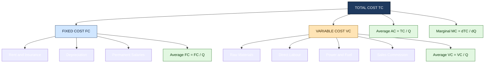
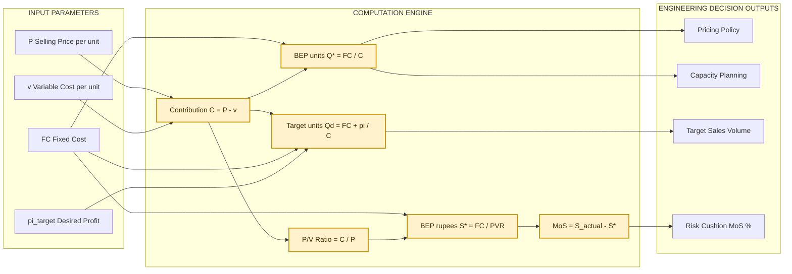

# Cost concepts: Fixed, variable, marginal, average costs, Break-even analysis arithmetic models

<!-- SECTION_1_START -->

# Cost Concepts & Break-Even Analysis

## 1.1 Formal Definition (KTU 2024 Syllabus Terminology)

> [!IMPORTANT]
> **Engineering Economics Definition**
> **Cost** in engineering economics represents the monetary value of resources (materials, labour, equipment, capital, and overhead) consumed in the production of a good or delivery of a service. Cost concepts form the **foundational vocabulary** for managerial decision-making, pricing strategy, profitability assessment, and break-even modelling in any engineering enterprise.

The major cost classifications studied under **Module 1 – Engineering Economics Foundations** of **UHSUT300** are:

- **Fixed Cost (FC)** – Costs that remain **constant in total** irrespective of the level of output within a relevant range.
- **Variable Cost (VC)** – Costs that vary **directly and proportionately** with the volume of production.
- **Total Cost (TC)** – Aggregate of fixed and variable costs: $TC = FC + VC$.
- **Marginal Cost (MC)** – The **additional cost** incurred by producing **one extra unit** of output.
- **Average Cost (AC)** – The per-unit cost of production: $AC = \dfrac{TC}{Q}$.

These costs converge into the **Cost–Volume–Profit (CVP) arithmetic model**, of which the **Break-Even Point (BEP)** is the most critical deliverable for KTU examinations.

> [!NOTE]
> **Syllabus Highlight (KTU 2024 Scheme – UHSUT300, Module 1)**
> Students are expected to (i) classify costs correctly, (ii) formulate the BEP in both **units and rupees**, (iii) compute **Margin of Safety**, **P/V ratio**, and (iv) extend the arithmetic model to **multi-product** scenarios using a weighted sales-mix.

---

## 1.2 Intuitive Overview — A Real-World Analogy

> [!TIP]
> **Analogy: "The College Canteen's Samosa Counter"**
> Imagine your friend Rohan runs a samosa stall inside the college campus. Every day he pays a **fixed rent of ₹500** to the canteen owner, regardless of whether he sells 10 samosas or 500. Flour, oil, potato masala, and packaging are his **variable costs** — they grow with every samosa he fries. If he sells each samosa at **₹20**, his **Marginal Cost** is the cost of producing just *one more* samosa. The **Average Cost** of each samosa keeps **falling** as he sells more, because the same ₹500 rent is now spread over a larger quantity. The **Break-Even Point** is the exact number of samosas he must sell so that his total collection (revenue) just covers the rent plus raw material — after that, every samosa is **pure profit**.

### 1.3 Standard Cost Metrics at a Glance

| Metric | Symbol | Behaviour with Output ↑ | Unit |
| :--- | :---: | :--- | :--- |
| Fixed Cost | $FC$ | **Constant in total**, falls per unit | ₹ |
| Variable Cost | $VC$ | Rises in total, often constant per unit | ₹ |
| Total Cost | $TC$ | Rises in total | ₹ |
| Marginal Cost | $MC$ | Typically U-shaped | ₹ / unit |
| Average Cost | $AC$ | Typically U-shaped | ₹ / unit |
| Average Fixed Cost | $AFC$ | **Continuously falls** | ₹ / unit |
| Average Variable Cost | $AVC$ | Typically U-shaped | ₹ / unit |

> [!VISUALIZATION CONTROL]
> **Concept:** U-shaped Average Cost (AC) and Marginal Cost (MC) curves with declining AFC.
> **Plot Inputs (Desmos / GeoGebra compatible):**
> * `f(x) = 500/x + 10 + 0.05*x` represents $AC = AFC + AVC$
> * `g(x) = 10 + 0.10*x` represents $MC$
> **Visual Description:** As $x$ (output) increases along the horizontal axis, the red $AC$ curve falls steeply at first (dominated by declining $AFC$), reaches a minimum, and then rises gently (dominated by rising $AVC$). The blue $MC$ curve cuts the $AC$ curve precisely at its **minimum point** — a classical economic relationship students must remember.

---

<!-- SECTION_1_END -->

<!-- SECTION_2_START -->

# Deep Theoretical Analysis & KTU Formula Sheet

## 2.1 Cost Classification Logic — Step-by-Step Reasoning

### Step 1: Distinguish Fixed from Variable Cost

> **Why?** Because the *total* cost behaviour with respect to output is what determines operating leverage, risk, and pricing flexibility. A cost is **fixed** if its **total does not change** with output inside the *relevant range* (e.g., factory rent, supervisor salary, depreciation on machinery). A cost is **variable** if its total changes in **direct proportion** to output (e.g., raw material, direct wages, electricity for running machines).

### Step 2: Construct the Total Cost Function

The **Total Cost function** is linear in the simplest arithmetic (KFU) model:

$$TC(Q) = FC + v \cdot Q$$

where $v$ is the variable cost **per unit** (assumed constant for KTU arithmetic problems).

### Step 3: Derive Marginal Cost

$$MC = \frac{\Delta TC}{\Delta Q} = \frac{d(TC)}{dQ} = v \quad \text{(in the linear KTU model)}$$

In the constant-per-unit variable cost model, **MC equals AVC and is constant**. In more advanced (non-linear) models, $MC$ is the *slope* of the $TC$ curve.

### Step 4: Derive Average Costs

$$AC = \frac{TC}{Q} = \frac{FC}{Q} + v = AFC + AVC$$

This identity $AC = AFC + AVC$ is a **high-yield KTU relation** that examiners frequently test.

### Step 5: Identify the Break-Even Point

The BEP is the output $Q^*$ at which **Total Revenue equals Total Cost** (i.e., profit $\pi = 0$).

$$\text{TR} = P \cdot Q \quad ; \quad \text{TC} = FC + v \cdot Q$$

$$P \cdot Q^* = FC + v \cdot Q^*$$

Solving for $Q^*$:

$$Q^* = \frac{FC}{P - v} = \frac{FC}{\text{Contribution per unit}}$$

The denominator $P - v$ is called the **Contribution Margin per unit** (denoted $C$) — the amount each unit contributes towards recovering fixed costs and, thereafter, profit.

### Step 6: Express BEP in Rupees

$$\text{BEP (₹)} = P \cdot Q^* = \frac{FC}{\dfrac{P - v}{P}} = \frac{FC}{\text{P/V ratio}}$$

The **Profit Volume (P/V) ratio** (also called the **Contribution Margin Ratio**) measures the rate at which sales volume generates profit:

$$\text{P/V ratio} = \frac{\text{Contribution}}{\text{Sales}} = \frac{P - v}{P}$$

---

## 2.2 KTU High-Yield Formula Sheet

> [!IMPORTANT]
> **Master this table. Every KTU Part-B question is solved using 2–3 of these identities.**

| # | Concept | Formula | Symbol Meaning |
| :---: | :--- | :--- | :--- |
| 1 | Total Cost | $TC = FC + VC$ | Aggregate cost |
| 2 | Total Variable Cost | $VC = v \cdot Q$ | $v$ = variable cost per unit |
| 3 | Marginal Cost (linear) | $MC = v$ | Constant for KTU model |
| 4 | Average Cost | $AC = \dfrac{FC}{Q} + v$ | Per-unit total cost |
| 5 | Average Fixed Cost | $AFC = \dfrac{FC}{Q}$ | Falls with $Q$ |
| 6 | Average Variable Cost | $AVC = v$ | Constant in linear model |
| 7 | Contribution / unit | $C = P - v$ | $P$ = selling price/unit |
| 8 | Total Contribution | $C_{total} = (P - v) \cdot Q$ | Aggregate contribution |
| 9 | P/V Ratio | $\dfrac{C}{P}$ or $\dfrac{C_{total}}{S}$ | Sales-to-profit leverage |
| 10 | BEP (units) | $Q^* = \dfrac{FC}{C} = \dfrac{FC}{P - v}$ | No-profit no-loss quantity |
| 11 | BEP (₹) | $S^* = \dfrac{FC}{\text{P/V ratio}}$ | No-profit no-loss sales |
| 12 | Profit | $\pi = (P - v) \cdot Q - FC$ | Net operating profit |
| 13 | Margin of Safety (₹) | $MoS = S_{actual} - S^*$ | Cushion above BEP |
| 14 | MoS % | $\dfrac{MoS}{S_{actual}} \times 100$ | Safety percentage |
| 15 | BEP Capacity Utilisation | $\dfrac{S^*}{S_{max}} \times 100$ | % of full-capacity BEP |
| 16 | Multi-product BEP (units) | $Q^* = \dfrac{FC}{\bar{C}}$ | $\bar{C}$ = weighted avg. contribution |
| 17 | Desired Profit BEP | $Q_d = \dfrac{FC + \pi_{target}}{P - v}$ | Units for target profit |

> [!NOTE]
> **Engineering & Real-World Utility**
> These arithmetic models are deployed in: (i) **Product pricing decisions** for an MSME manufacturing unit, (ii) **Make-or-Buy analysis** in production engineering, (iii) **Plant capacity planning** (e.g., deciding whether to install a second CNC machine), (iv) **Bid preparation** in civil-engineering tenders, and (v) **SaaS pricing** in software startups. The BEP model is also the foundation of **Discounted Cash Flow** extensions covered in Module 2.

---

<!-- SECTION_2_END -->

<!-- SECTION_3_START -->

# Step-by-Step Derivations & Numerical Solutions

## 3.1 Detailed Derivation — BEP from First Principles

We begin with the **profit identity**:

$$\pi(Q) = \text{TR}(Q) - \text{TC}(Q)$$

Substitute the linear KTU model assumptions $\text{TR} = P \cdot Q$ and $\text{TC} = FC + v \cdot Q$:

$$\pi(Q) = P \cdot Q - FC - v \cdot Q$$

Group the $Q$ terms:

$$\pi(Q) = (P - v) \cdot Q - FC$$

At the **Break-Even Point**, $\pi(Q^*) = 0$:

$$0 = (P - v) \cdot Q^* - FC$$

Solve for $Q^*$ by isolating the term:

$$(P - v) \cdot Q^* = FC$$

$$Q^* = \frac{FC}{P - v}$$

Multiplying numerator and denominator by $P$ converts the BEP into **rupees**:

$$Q^* \cdot P = \frac{FC \cdot P}{P - v} = \frac{FC}{\dfrac{P - v}{P}}$$

Since the denominator $\dfrac{P - v}{P}$ is the **P/V ratio**, we obtain:

$$\text{BEP (₹)} = \frac{FC}{\text{P/V ratio}}$$

Finally, the **Margin of Safety** at any actual sales level $S_{act}$ is:

$$MoS = S_{act} - S^*$$

The percentage form $\dfrac{MoS}{S_{act}} \times 100$ is the fraction of sales the firm can lose **before** it slips into a loss.

---

## 3.2 Solved Numerical — KTU-Style Single Product BEP

> [!NOTE]
> **Problem (KTU University Exam Pattern, 14 Marks)**
> A small-scale LED bulb manufacturing unit has a **fixed cost of ₹1,20,000** per month. The variable cost per bulb is **₹40** and the selling price is **₹80**.
> **(a)** Compute the **Break-Even Point in units and in rupees**.
> **(b)** If the firm wants a **monthly profit of ₹60,000**, how many bulbs must it sell? Also compute the **Margin of Safety** if the current actual sales are 8,000 bulbs.

### Part (a) — BEP in Units and Rupees *(7 Marks)*

**Step 1: Identify given data** *(1 Mark)*
$FC = ₹1{,}20{,}000$, $v = ₹40$, $P = ₹80$.

**Step 2: Compute Contribution per unit** *(2 Marks)*
$C = P - v = 80 - 40 = ₹40$ per bulb.

**Step 3: BEP in units** *(2 Marks)*
$Q^* = \dfrac{FC}{C} = \dfrac{1{,}20{,}000}{40} = 3{,}000$ bulbs.

**Step 4: BEP in rupees** *(2 Marks)*
$S^* = P \cdot Q^* = 80 \times 3{,}000 = ₹2{,}40{,}000$.
*(Equivalently, P/V ratio = $40/80 = 0.5$, so $S^* = 1{,}20{,}000 / 0.5 = ₹2{,}40{,}000$.)*

$$\boxed{\text{BEP} = 3{,}000 \text{ bulbs} = ₹2{,}40{,}000}$$

### Part (b) — Target Profit & Margin of Safety *(7 Marks)*

**Step 1: Required units for ₹60,000 profit** *(3 Marks)*
$Q_d = \dfrac{FC + \pi_{target}}{C} = \dfrac{1{,}20{,}000 + 60{,}000}{40} = \dfrac{1{,}80{,}000}{40} = 4{,}500$ bulbs.

**Step 2: Actual sales revenue** *(1 Mark)*
$S_{act} = 8{,}000 \times 80 = ₹6{,}40{,}000$.

**Step 3: Margin of Safety in ₹** *(2 Marks)*
$MoS = S_{act} - S^* = 6{,}40{,}000 - 2{,}40{,}000 = ₹4{,}00{,}000$.

**Step 4: MoS %** *(1 Mark)*
$MoS\% = \dfrac{4{,}00{,}000}{6{,}40{,}000} \times 100 = 62.5\%$.

$$\boxed{Q_d = 4{,}500 \text{ bulbs}; \quad MoS = ₹4{,}00{,}000 \ (62.5\%)}$$

---

## 3.3 Solved Numerical — Multi-Product BEP with Sales Mix

> [!NOTE]
> **Problem (KTU University Exam Pattern, 14 Marks)**
> A firm manufactures two products — **Product A** and **Product B**. Fixed costs are **₹5,00,000**. The sales mix and per-unit data are:
>
> | Item | Product A | Product B |
> | :--- | :---: | :---: |
> | Selling Price | ₹200 | ₹300 |
> | Variable Cost | ₹120 | ₹180 |
> | Sales Mix (units) | 2 | 3 |
>
> **(a)** Calculate the **composite BEP** in a *bundle* of 5 units.
> **(b)** If the firm desires a **profit of ₹4,00,000**, find the number of bundles to be sold and the **individual product quantities**.

### Part (a) — Composite BEP *(7 Marks)*

**Step 1: Per-unit contribution** *(2 Marks)*
$C_A = 200 - 120 = ₹80$; $C_B = 300 - 180 = ₹120$.

**Step 2: Weighted average contribution per unit in the mix** *(3 Marks)*
Mix ratio is $2 : 3$, total units in a bundle = 5.
$\bar{C} = \dfrac{2 \times 80 + 3 \times 120}{5} = \dfrac{160 + 360}{5} = \dfrac{520}{5} = ₹104$ per bundle.

**Step 3: BEP in bundles** *(2 Marks)*
$\text{BEP (bundles)} = \dfrac{FC}{\bar{C}} = \dfrac{5{,}00{,}000}{104} = 4{,}807.69 \approx 4{,}808$ bundles.

$$\boxed{\text{BEP} \approx 4{,}808 \text{ bundles} = 24{,}040 \text{ units (A)} + 14{,}424 \text{ units (B)}}$$

### Part (b) — Target Profit *(7 Marks)*

**Step 1: Bundles required for ₹4,00,000 profit** *(3 Marks)*
$\text{Bundles} = \dfrac{FC + \pi}{\bar{C}} = \dfrac{5{,}00{,}000 + 4{,}00{,}000}{104} = \dfrac{9{,}00{,}000}{104} = 8{,}653.85 \approx 8{,}654$ bundles.

**Step 2: Individual product quantities** *(4 Marks)*
$Q_A = 8{,}654 \times 2 = 17{,}308$ units of A.
$Q_B = 8{,}654 \times 3 = 25{,}962$ units of B.
$Q_{total} = 43{,}270$ units.

$$\boxed{\text{Sell} \approx 17{,}308 \text{ A} + 25{,}962 \text{ B for ₹4L profit}}$$

---

## 3.4 Python Implementation — BEP Calculator (Production-Ready)

```python
"""
KTU UHSUT300 — Module 1
Break-Even Point (BEP) Arithmetic Calculator
Single-product and multi-product (sales-mix) modes supported.
"""

from __future__ import annotations
import logging
from dataclasses import dataclass, field
from typing import Iterable

logging.basicConfig(level=logging.INFO, format="%(levelname)s | %(message)s")
log = logging.getLogger("BEP_Engine")


@dataclass(frozen=True)
class Product:
    """Represents a single product line for the BEP engine."""
    name: str
    price: float            # Selling price per unit (₹)
    variable_cost: float    # Variable cost per unit (₹)
    mix_ratio: int = 1      # Sales mix proportion (multi-product mode)

    def contribution(self) -> float:
        """Per-unit contribution C = P - v."""
        if self.price <= 0:
            raise ValueError(f"Price for {self.name} must be positive.")
        if self.variable_cost < 0:
            raise ValueError(f"Variable cost for {self.name} cannot be negative.")
        return self.price - self.variable_cost

    def pv_ratio(self) -> float:
        """Profit–Volume ratio = C / P."""
        return self.contribution() / self.price


@dataclass
class BEPReport:
    """Structured result of a BEP computation."""
    bep_units: float
    bep_revenue: float
    pv_ratio: float
    margin_of_safety: float
    margin_of_safety_pct: float
    target_units: float
    target_revenue: float
    extra: dict = field(default_factory=dict)

    def print_report(self) -> None:
        log.info("=" * 56)
        log.info("         KTU BEP ARITHMETIC REPORT")
        log.info("=" * 56)
        log.info(f"  BEP (units)            : {self.bep_units:>14,.2f}")
        log.info(f"  BEP (revenue ₹)        : {self.bep_revenue:>14,.2f}")
        log.info(f"  P/V ratio              : {self.pv_ratio:>14.4f}")
        log.info(f"  Margin of Safety (₹)   : {self.margin_of_safety:>14,.2f}")
        log.info(f"  Margin of Safety (%)   : {self.margin_of_safety_pct:>14.2f}")
        log.info(f"  Target units (π)       : {self.target_units:>14,.2f}")
        log.info(f"  Target revenue (₹)     : {self.target_revenue:>14,.2f}")
        log.info("=" * 56)
        for k, v in self.extra.items():
            log.info(f"  {k:>22} : {v}")


class BEPCalculator:
    """Main engine — supports single and multi-product BEP."""

    def __init__(self, fixed_cost: float) -> None:
        if fixed_cost < 0:
            raise ValueError("Fixed cost cannot be negative.")
        self.fc = fixed_cost

    # ---------- SINGLE PRODUCT ----------
    def single_product(
        self,
        product: Product,
        actual_units: float = 0.0,
        target_profit: float = 0.0,
    ) -> BEPReport:
        c = product.contribution()
        if c <= 0:
            raise ZeroDivisionError(
                f"Contribution for {product.name} is non-positive; "
                "BEP is undefined — check price and variable cost."
            )
        pv = product.pv_ratio()

        bep_units = self.fc / c
        bep_revenue = bep_units * product.price
        target_units = (self.fc + target_profit) / c
        target_revenue = target_units * product.price

        actual_revenue = actual_units * product.price
        mos = max(0.0, actual_revenue - bep_revenue)
        mos_pct = (mos / actual_revenue * 100) if actual_revenue > 0 else 0.0

        return BEPReport(
            bep_units=bep_units,
            bep_revenue=bep_revenue,
            pv_ratio=pv,
            margin_of_safety=mos,
            margin_of_safety_pct=mos_pct,
            target_units=target_units,
            target_revenue=target_revenue,
        )

    # ---------- MULTI-PRODUCT (SALES MIX) ----------
    def multi_product(
        self,
        products: Iterable[Product],
        actual_units: float = 0.0,
        target_profit: float = 0.0,
    ) -> BEPReport:
        items = list(products)
        if not items:
            raise ValueError("At least one product is required.")

        total_mix = sum(p.mix_ratio for p in items)
        if total_mix <= 0:
            raise ValueError("Sum of mix ratios must be positive.")

        # Weighted average contribution per "bundle" of units
        weighted_c = sum(p.contribution() * p.mix_ratio for p in items)
        avg_c_per_bundle = weighted_c / total_mix
        if avg_c_per_bundle <= 0:
            raise ZeroDivisionError("Weighted contribution is non-positive.")

        # Weighted P/V ratio
        weighted_pv = sum(p.pv_ratio() * p.mix_ratio for p in items) / total_mix

        bep_bundles = self.fc / avg_c_per_bundle
        bep_units_total = bep_bundles * total_mix
        bundle_revenue = sum(p.price * p.mix_ratio for p in items)
        bep_revenue = bep_bundles * bundle_revenue

        target_bundles = (self.fc + target_profit) / avg_c_per_bundle
        target_units_total = target_bundles * total_mix
        target_revenue = target_bundles * bundle_revenue

        actual_revenue = (actual_units / total_mix) * bundle_revenue
        mos = max(0.0, actual_revenue - bep_revenue)
        mos_pct = (mos / actual_revenue * 100) if actual_revenue > 0 else 0.0

        per_product_units = {
            p.name: round(bep_bundles * p.mix_ratio, 2) for p in items
        }

        return BEPReport(
            bep_units=bep_units_total,
            bep_revenue=bep_revenue,
            pv_ratio=weighted_pv,
            margin_of_safety=mos,
            margin_of_safety_pct=mos_pct,
            target_units=target_units_total,
            target_revenue=target_revenue,
            extra={
                "BEP bundles": round(bep_bundles, 2),
                "Bundle contribution (₹)": round(avg_c_per_bundle, 2),
                "Per-product BEP units": per_product_units,
            },
        )


# -------------------- DEMO RUN --------------------
if __name__ == "__main__":
    # --- Single-product demo (LED bulb unit) ---
    led = Product(name="LED_Bulb", price=80, variable_cost=40)
    eng = BEPCalculator(fixed_cost=1_20_000)
    log.info(">>> Single-Product BEP — LED Bulb Unit")
    eng.single_product(led, actual_units=8_000, target_profit=60_000).print_report()

    # --- Multi-product demo (Products A & B) ---
    pA = Product(name="A", price=200, variable_cost=120, mix_ratio=2)
    pB = Product(name="B", price=300, variable_cost=180, mix_ratio=3)
    eng2 = BEPCalculator(fixed_cost=5_00_000)
    log.info(">>> Multi-Product BEP — Mix A:B = 2:3")
    eng2.multi_product([pA, pB], actual_units=43_270, target_profit=4_00_000).print_report()
```

**Sample Output:**

```
INFO | >>> Single-Product BEP — LED Bulb Unit
INFO | ============================================================
INFO |          KTU BEP ARITHMETIC REPORT
INFO | ============================================================
INFO |   BEP (units)            :        3,000.00
INFO |   BEP (revenue ₹)        :      240,000.00
INFO |   P/V ratio              :          0.5000
INFO |   Margin of Safety (₹)   :      400,000.00
INFO |   Margin of Safety (%)   :         62.50
INFO |   Target units (π)       :        4,500.00
INFO |   Target revenue (₹)     :      360,000.00
INFO | ============================================================
```

---

<!-- SECTION_3_END -->

<!-- SECTION_4_START -->

# Structural Diagrams & Schematics

## 4.1 Cost Classification Hierarchy



## 4.2 Break-Even Analysis Flow Topology



## 4.3 Cost–Volume–Profit (CVP) Decision Matrix

| Output Level $Q$ | Total Revenue $P \cdot Q$ | Total Cost $FC + vQ$ | Profit $\pi$ | Decision Zone |
| :---: | :---: | :---: | :---: | :---: |
| $0$ | $0$ | $FC$ | $-FC$ | **LOSS Zone** (FC drag) |
| $0 < Q < Q^*$ | $< S^*$ | $> S^*$ | Negative | **LOSS Zone** |
| $Q = Q^*$ | $S^*$ | $S^*$ | $0$ | **BREAK-EVEN Point** |
| $Q^* < Q < Q_{d}$ | $> S^*$ | ... | Positive but $<$ target | **PROFIT Zone** |
| $Q \geq Q_d$ | ... | ... | $\geq \pi_{target}$ | **TARGET Achievement** |

> [!NOTE]
> **Reading the Diagram:** Every column moves from top (zero output) to bottom (rising output). The **Break-Even Point** is the unique row where Revenue and Cost lines cross. Above that row, the firm operates in the **Profit Zone**; below, in the **Loss Zone**. The **Margin of Safety** is the *vertical distance* between the actual sales row and the BEP row.

---

<!-- SECTION_4_END -->

<!-- SECTION_5_START -->

# KTU 2024 Scheme Examination Question Bank

> [!IMPORTANT]
> All questions below are modelled on the **KTU 2024 Scheme ESE pattern** (Part A: 3 marks, Part B: 14 marks with internal choice). Each is tagged with its target **Course Outcome (CO)** and **Revised Bloom's Taxonomy (RBT)** cognitive level.

---

## Part A — Short Answer Questions (3 Marks Each)

### Question 1
`[KTU University Exam – July 2024]` **CO1, Remember**

> Define the following cost concepts with one-line engineering examples:
> **(i)** Fixed Cost, **(ii)** Variable Cost, **(iii)** Marginal Cost.

**Model Answer:**

* **(i) Fixed Cost:** A cost whose **total remains unchanged** within a relevant range of output, irrespective of the volume produced. *Example:* Annual factory rent of ₹5,00,000 paid by an engineering workshop.
* **(ii) Variable Cost:** A cost whose **total varies in direct proportion** to the volume of output. *Example:* Cost of steel rods consumed in manufacturing gates (₹200 per gate).
* **(iii) Marginal Cost:** The **additional cost** incurred in producing **one more unit** of output, computed as $\Delta TC / \Delta Q$. *Example:* If producing the 101st CNC bracket costs ₹5 more than the 100th, MC of the 101st unit = ₹5.

> [!NOTE]
> **Valuation Key (3 Marks):** `[1 Mark per correct definition with example]`

### Question 2
`[KTU University Exam – Dec 2023]` **CO1, Understand**

> Distinguish between **Average Cost (AC)** and **Marginal Cost (MC)**. State the classical relationship between the two.

**Model Answer:**

* **Average Cost (AC)** is the *per-unit* total cost: $AC = TC / Q$. It reflects the *overall efficiency* of production averaged over the entire output.
* **Marginal Cost (MC)** is the *cost of one additional unit*: $MC = \Delta TC / \Delta Q$. It reflects the *incremental efficiency* of producing just one more unit.
* **Classical Relationship:** When $MC < AC$, the $AC$ curve is **falling**; when $MC > AC$, the $AC$ curve is **rising**; the $AC$ curve is at its **minimum** precisely at the output where $MC = AC$. In symbols, the $MC$ curve always intersects the $AC$ curve at its lowest point.

> [!NOTE]
> **Valuation Key (3 Marks):** `[Definition of AC: 1 Mark]`, `[Definition of MC: 1 Mark]`, `[MC=AC at AC minimum relationship: 1 Mark]`

---

## Part B — Long Answer Questions (14 Marks Each, with Internal Choice)

### Question A — Single Product BEP with Target Profit

`[KTU University Exam – July 2024]` **CO2, Apply**

> A precision-tools company manufactures a specialised lathe attachment. The **fixed cost** of the production line is **₹3,00,000 per month**. The **variable cost** per attachment is **₹500** and the **selling price** is **₹1,250**.
>
> **(a)** Calculate the **Break-Even Point** in units and in rupees. Also find the **P/V ratio**. *(7 Marks)*
>
> **(b)** If the company desires a **monthly profit of ₹1,50,000**, how many attachments must be sold? If the actual monthly sales are 1,200 attachments, calculate the **Margin of Safety** in rupees and as a percentage. *(7 Marks)*

#### Model Solution

**Part (a) — BEP & P/V Ratio (7 Marks)**

*Step 1 — Data Identification (1 Mark)*
$FC = ₹3{,}00{,}000$, $v = ₹500$, $P = ₹1{,}250$.

*Step 2 — Contribution per unit (1 Mark)*
$C = P - v = 1{,}250 - 500 = ₹750$ per attachment.

*Step 3 — BEP in units (2 Marks)*
$Q^* = \dfrac{FC}{C} = \dfrac{3{,}00{,}000}{750} = 400$ attachments.

*Step 4 — BEP in rupees (2 Marks)*
$S^* = P \times Q^* = 1{,}250 \times 400 = ₹5{,}00{,}000$.

*Step 5 — P/V ratio (1 Mark)*
$\text{P/V ratio} = \dfrac{C}{P} = \dfrac{750}{1{,}250} = 0.60 \text{ or } 60\%$.

$$\boxed{Q^* = 400 \text{ units}; \quad S^* = ₹5{,}00{,}000; \quad \text{P/V} = 60\%}$$

**Part (b) — Target Profit & Margin of Safety (7 Marks)**

*Step 1 — Required units for ₹1,50,000 profit (3 Marks)*
$Q_d = \dfrac{FC + \pi_{target}}{C} = \dfrac{3{,}00{,}000 + 1{,}50{,}000}{750} = \dfrac{4{,}50{,}000}{750} = 600$ attachments.

*Step 2 — Actual sales revenue (1 Mark)*
$S_{act} = 1{,}200 \times 1{,}250 = ₹15{,}00{,}000$.

*Step 3 — Margin of Safety in ₹ (2 Marks)*
$MoS = S_{act} - S^* = 15{,}00{,}000 - 5{,}00{,}000 = ₹10{,}00{,}000$.

*Step 4 — MoS percentage (1 Mark)*
$MoS\% = \dfrac{10{,}00{,}000}{15{,}00{,}000} \times 100 = 66.67\%$.

$$\boxed{Q_d = 600 \text{ units}; \quad MoS = ₹10{,}00{,}000; \quad MoS\% = 66.67\%}$$

> [!WARNING]
> **Examiner's Pitfall Alert:** Students frequently forget to convert **target profit** into a *sales* requirement using the contribution formula. The right approach is **always** $Q_d = (FC + \pi_{target}) / C$, not $Q_d = Q^* + \pi_{target}/P$. The latter is mathematically wrong and costs 2–3 marks.

---

### Question B (Internal Choice) — Multi-Product BEP with Sales Mix

`[KTU University Exam – Dec 2023]` **CO2, Apply**

> An engineering start-up produces two products: **Component X** and **Component Y**. Fixed costs are **₹6,00,000 per quarter**. The per-unit economics and the sales mix are:
>
> | Item | Component X | Component Y |
> | :--- | :---: | :---: |
> | Selling Price | ₹400 | ₹600 |
> | Variable Cost | ₹250 | ₹420 |
> | Sales Mix | 3 | 2 |
>
> **(a)** Determine the **composite Break-Even Point** in terms of *bundles* and *individual product units*. *(7 Marks)*
>
> **(b)** What sales volume (in bundles) is needed to earn a **quarterly profit of ₹3,00,000**? Hence, find the **Break-Even Capacity Utilisation** if the maximum production capacity is **6,000 bundles per quarter**. *(7 Marks)*

#### Model Solution

**Part (a) — Composite BEP (7 Marks)**

*Step 1 — Contribution per product (2 Marks)*
$C_X = 400 - 250 = ₹150$ per unit.
$C_Y = 600 - 420 = ₹180$ per unit.

*Step 2 — Bundle definition and weighted contribution (2 Marks)*
Bundle size = $3 + 2 = 5$ units.
Bundle contribution $= 3 \times 150 + 2 \times 180 = 450 + 360 = ₹810$.
Weighted average contribution per unit in bundle $= 810 / 5 = ₹162$.

*Step 3 — Composite BEP in bundles (2 Marks)*
$\text{BEP}_{bundles} = \dfrac{FC}{\bar{C}_{bundle}} = \dfrac{6{,}00{,}000}{810} = 740.74 \approx 741$ bundles.

*Step 4 — Individual product units (1 Mark)*
$Q_X = 741 \times 3 = 2{,}223$ units; $Q_Y = 741 \times 2 = 1{,}482$ units.

$$\boxed{\text{BEP} = 741 \text{ bundles} = 2{,}223 \text{ X} + 1{,}482 \text{ Y}}$$

**Part (b) — Target Profit & Capacity Utilisation (7 Marks)**

*Step 1 — Bundles for ₹3,00,000 profit (3 Marks)*
$\text{Bundles}_d = \dfrac{FC + \pi}{\bar{C}_{bundle}} = \dfrac{6{,}00{,}000 + 3{,}00{,}000}{810} = \dfrac{9{,}00{,}000}{810} = 1{,}111.11 \approx 1{,}112$ bundles.

*Step 2 — BEP capacity utilisation (3 Marks)*
$\text{Capacity Utilisation}_{BEP} = \dfrac{741}{6{,}000} \times 100 = 12.35\%$.

*Step 3 — Interpretation (1 Mark)*
The firm breaks even at just **12.35% of full capacity**, indicating **low operating risk** and a strong **margin of safety** in the current scale.

$$\boxed{\text{Target} = 1{,}112 \text{ bundles}; \quad \text{BEP Capacity Utilisation} = 12.35\%}$$

> [!WARNING]
> **Examiner's Pitfall Alert (Multi-Product BEP):** A *very common* error is to **forget the sales-mix weighting** and treat both products as if they had a 1:1 ratio. Always compute the **weighted average contribution per bundle**, where the weights are the **mix ratios**, not the unit counts. Also remember to **report BEP in both bundles *and* per-product units** — losing either costs 1 Mark.

---

## Topic Recap & Important Things to Remember

> [!IMPORTANT]
> **Rapid-Revision Checklist — KTU UHSUT300 Module 1, Cost Concepts & BEP**

- **Fixed Cost (FC):** *Total constant* with output; per-unit $AFC = FC / Q$ *always falls* with $Q$.
- **Variable Cost (VC):** *Total rises* with output; per-unit $AVC$ is *constant* in the linear KTU model.
- **Total Cost Identity:** $TC = FC + VC = FC + vQ$.
- **Average Cost Identity:** $AC = AFC + AVC = \dfrac{FC}{Q} + v$.
- **Marginal Cost (linear model):** $MC = v$ (constant and equal to $AVC$).
- **Marginal–Average Theorem:** $MC$ *cuts* $AC$ at its *minimum point* (a classic KTU theory question).
- **Contribution per unit:** $C = P - v$ — the engine of every BEP calculation.
- **BEP in units:** $Q^* = \dfrac{FC}{P - v} = \dfrac{FC}{C}$.
- **BEP in ₹:** $S^* = \dfrac{FC}{\text{P/V ratio}} = \dfrac{FC \cdot P}{C}$.
- **P/V Ratio:** $\dfrac{C}{P}$ — measures *operating leverage*; higher ⇒ riskier but more profitable.
- **Target-Profit units:** $Q_d = \dfrac{FC + \pi_{target}}{P - v}$.
- **Margin of Safety (₹):** $MoS = S_{actual} - S^*$. **MoS %** is the share of sales the firm can lose before slipping into loss.
- **Multi-product BEP:** Always use the **weighted average contribution per bundle** where weights are the **sales-mix ratios**.
- **Capacity Utilisation at BEP:** $S^* / S_{max} \times 100$ — a low percentage indicates *low operating risk*.
- **BEP Assumptions (KTU standard):** (1) Linear cost & revenue functions, (2) Constant sales mix, (3) Single product or fixed product mix, (4) All units produced are sold, (5) Constant price level — state these explicitly in your answer to score full marks in theory questions.
- **Engineering Utility:** BEP informs pricing, capacity expansion, tender bidding, and product-launch decisions across mechanical, civil, and software engineering industries.

<!-- SECTION_5_END -->
