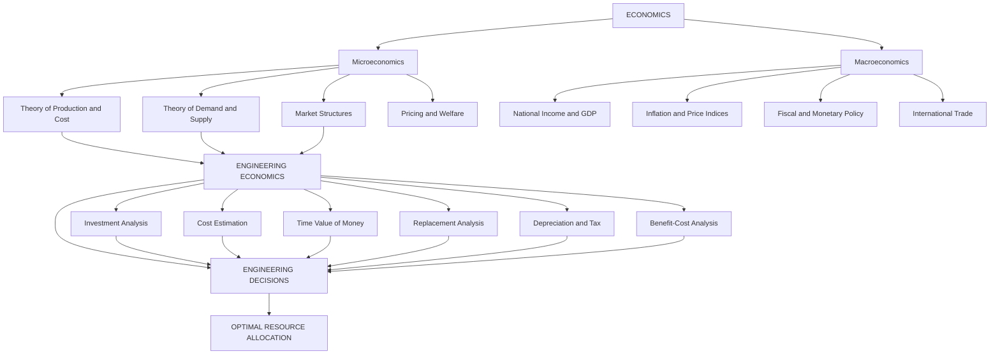
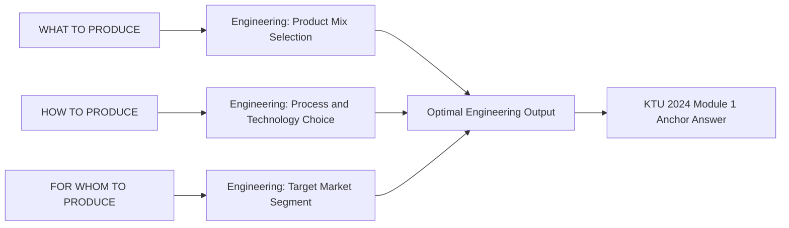
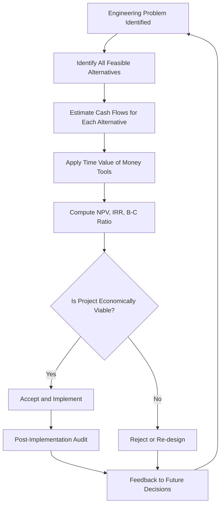
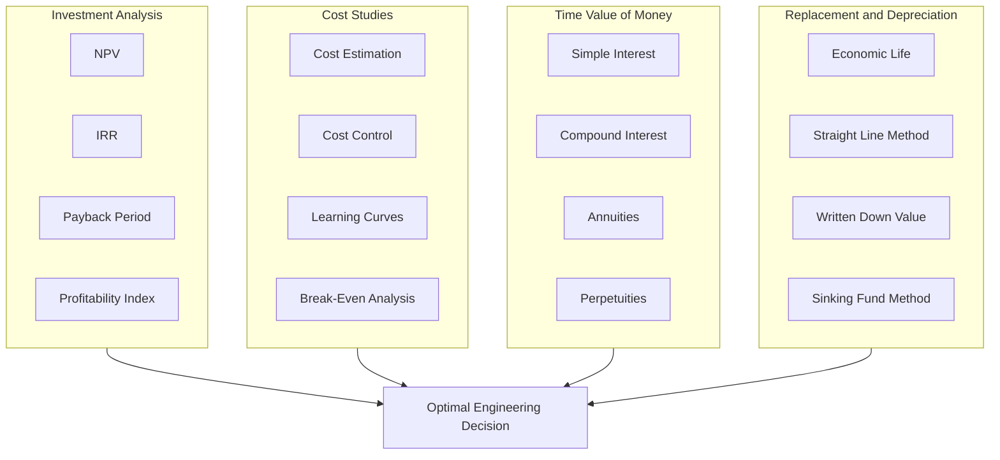

# Definitions & scope of engineering economics

<!-- SECTION_1_START -->
# Definitions \& Scope of Engineering Economics

> [!IMPORTANT]
> **Module 1 Anchor Concept:** This topic forms the foundational base for the entire course UHSUT300. Every subsequent module — cost analysis, depreciation, time value of money, and ethics — derives its logical meaning from the definitions established here.

---

## 1.1 Formal Definition of Economics

Economics is a social science that studies how individuals, firms, governments, and societies allocate **scarce resources** among competing and unlimited human wants. Over time, several authoritative definitions have been proposed:

> [!NOTE]
> **Classical Definition — Adam Smith (1776)**
> "Economics is an inquiry into the nature and causes of the **wealth of nations**."
> Focus: Wealth accumulation, division of labour, and market mechanisms.

> [!NOTE]
> **Neoclassical Definition — Alfred Marshall (1890)**
> "Economics is a study of mankind in the ordinary business of life; it examines that part of individual and social action which is most closely connected with the attainment and use of the material requisites of well-being."
> Focus: Human welfare, utility, and marginal analysis.

> [!NOTE]
> **Modern (Scarcity) Definition — Lionel Robbins (1932)**
> "Economics is the science which studies human behaviour as a relationship between **ends** and **scarce means** which have **alternative uses**."
> Focus: Choice, scarcity, and opportunity cost — the most widely accepted definition in modern engineering economics textbooks.

---

## 1.2 Definition of Engineering Economics

Engineering Economics (also called **Engineering Economy** or **Engineering Financial Management**) is the discipline that applies **microeconomic theory** and **quantitative analytical methods** to systematically evaluate the economic feasibility and financial viability of engineering projects, systems, and investment alternatives.

> [!IMPORTANT]
> **KTU-Standard Working Definition:**
> "Engineering Economics is the body of knowledge and analytical techniques used by engineers to evaluate the economic worth of alternative technical proposals, projects, or investments, with the objective of making optimal resource-allocation decisions under conditions of scarcity."

It is concerned with the **decision-making process** for selecting the most economically efficient alternative among several competing technical options.

---

## 1.3 Intuitive Analogy — The Household Budget Model

Imagine a family of four with a **fixed monthly income** of ₹80,000 and an extensive wish list — a new car, a foreign holiday, a child's higher education, home renovation, and retirement savings. The income cannot stretch to cover everything. The family must:

1. List every possible expenditure (the *alternatives*).
2. Rank them by urgency and return (the *criteria*).
3. Estimate how much each one will cost today and in the future (the *time value of money*).
4. Choose the combination that yields the **highest total well-being** (the *optimization*).

> **The Parallel:** Engineering projects operate under the **same three economic laws**:
> - **Scarcity** → Engineering budgets, materials, and time are always limited.
> - **Choice** → A construction firm must choose between steel, RCC, or composite structures.
> - **Opportunity Cost** → Money spent on a CNC machine is money not spent on a 3D printer.

This is why an engineer — who designs systems, but must also justify them in monetary terms — needs the analytical tools of economics.

---

## 1.4 Central Problems of Every Economic System

Every economy, regardless of whether it is capitalist, socialist, or mixed, must answer three fundamental questions:

| # | Central Problem | Engineering Analogy |
|---|---|---|
| **1** | **What to produce?** | Selecting which product line to manufacture in a plant. |
| **2** | **How to produce?** | Choosing between manual, semi-automated, or fully automated processes. |
| **3** | **For whom to produce?** | Identifying the target market segment (premium, mass, or economy). |

> [!VISUALIZATION CONTROL]
> **Concept:** Three-Pillar Scarcity Triangle
> **Description:** Draw an equilateral triangle with vertices labelled *Scarcity*, *Choice*, and *Opportunity Cost*. The edges connecting them are labelled *Resources*, *Alternatives*, and *Trade-off*. The centroid should be marked *Engineering Decision*.
> This triangle is the visual signature of all KTU Module 1 board questions on this topic.

---

## 1.5 Why Engineers Must Study Economics

Engineers design and build systems. But every system exists within a **financial, regulatory, and social** boundary. Without economic literacy:

- A technically brilliant bridge may exceed the sanctioned budget.
- A highly efficient turbine may have an unacceptable payback period.
- A new software product may fail in the market despite superior technical features.

> **KTU 2024 Scheme Mapping:** This topic directly addresses **CO1** of UHSUT300 — *Understand the fundamental economic principles governing engineering decisions* — and operates at the **Remember** and **Understand** levels of Revised Bloom's Taxonomy (RBT).
<!-- SECTION_1_END -->

<!-- SECTION_2_START -->
# Deep Theoretical Analysis \& KTU High-Yield Formula Sheet

---

## 2.1 Detailed Scope of Economics

The discipline of economics operates at **two hierarchical levels**:

### A. Microeconomics
Studies the behaviour of **individual economic units** — a single firm, a single consumer, a single market.

**Sub-fields relevant to engineering:**
- Theory of demand and supply
- Theory of production and cost
- Market structures (perfect competition, monopoly, oligopoly)
- Pricing strategies
- Welfare economics

### B. Macroeconomics
Studies the economy as a **whole aggregate** — national income, inflation, unemployment, fiscal and monetary policy.

**Sub-fields relevant to engineering managers:**
- National income accounting
- Inflation and price indices
- Fiscal policy and government budget
- Monetary policy and interest rates
- International trade and exchange rates

> [!IMPORTANT]
> **KTU 2024 Module 1 Weight:** Approximately 70% of the module focuses on **microeconomic principles** relevant to firm-level engineering decisions, while 30% introduces macroeconomic context (GDP, inflation) needed to interpret market signals.

---

## 2.2 Scope of Engineering Economics — The Seven Pillars

Engineering Economics is **not** a general economics course. It is a sharply focused applied discipline. The KTU syllabus identifies the following core application areas:

| Pillar | Core Question Answered | Typical Tool Used |
|---|---|---|
| **1. Investment Decision Analysis** | Should we invest in this project? | NPV, IRR, Payback Period |
| **2. Cost Estimation \& Control** | What will it cost, and how do we minimize cost? | Cost sheets, BOM analysis, learning curves |
| **3. Time Value of Money** | How do we compare ₹1 today vs ₹1 five years later? | Discounting, compounding |
| **4. Replacement \& Maintenance Analysis** | When should we replace an old asset? | Equivalent Uniform Annual Cost (EUAC) |
| **5. Break-Even \& Sensitivity Analysis** | At what output do we recover our costs? | Break-even charts, Tornado diagrams |
| **6. Depreciation \& Tax Planning** | How does asset wear affect after-tax cash flow? | Straight-line, WDV, MACRS methods |
| **7. Benefit-Cost \& Risk Analysis** | Do the public benefits justify public expenditure? | B-C ratio, expected value, decision trees |

> **Real-World Industrial Application:** In the Indian automotive sector (e.g., Tata Motors, Maruti Suzuki), every new vehicle platform undergoes a **multi-year engineering economic study** before the design freeze, evaluating tooling investment (often ₹2,000+ crore), production volume breakeven, fuel-economy breakeven, and 7-year replacement cycles.

---

## 2.3 Distinction Between Economics, Engineering Economics, and Engineering Management

| Dimension | Economics (Pure) | Engineering Economics | Engineering Management |
|---|---|---|---|
| **Primary Focus** | Behaviour of households, firms, markets | Economic evaluation of technical projects | Planning, organizing, leading technical teams |
| **Decision Variable** | Price, output, welfare | Cash flow, rate of return | Schedule, resource, quality |
| **Time Horizon** | Often static or long-run | Always multi-period, dynamic | Project-specific |
| **Mathematical Tool** | Calculus, econometrics | Time-value mathematics, statistics | Operations research, project management |
| **Typical Course** | BA / MA Economics | KTU UHSUT300 / Core Engineering Elective | MBA-Tech / M.Tech Industrial Engineering |

---

## 2.4 Fundamental Economic Concepts Every Engineer Must Know

> [!NOTE]
> The following ten terms constitute the **working vocabulary** for every KTU Module 1 examination question. Memorize their definitions precisely.

1. **Scarcity** — The condition of having finite resources against infinite wants.
2. **Opportunity Cost** — The value of the next-best alternative foregone.
3. **Utility** — The satisfaction derived from consuming a good or service.
4. **Value** — The worth of a good measured in terms of what one is willing to give up.
5. **Price** — The monetary expression of value exchanged in a market.
6. **Cost** — The monetary sacrifice incurred to acquire or produce a good.
7. **Revenue** — The total monetary inflow from selling goods or services.
8. **Profit** — The excess of revenue over cost.
9. **Demand** — The quantity of a good consumers are willing and able to buy at various prices.
10. **Supply** — The quantity of a good producers are willing and able to sell at various prices.

---

## 2.5 KTU High-Yield Formula Sheet

The following table consolidates every formula you must know for Module 1 derivations and Part A short-answer questions. **Memorize the column headers, units, and typical numerical ranges.**

| # | Concept | Mathematical Form | Variables \& Units | Typical Range in KTU |
|---|---|---|---|---|
| 1 | **Total Cost** | $TC = FC + VC$ | $FC$: Fixed Cost (₹); $VC$: Variable Cost (₹) | ₹0 — ₹10⁹ |
| 2 | **Average Cost** | $AC = \dfrac{TC}{Q}$ | $Q$: Quantity (units) | ₹0.01 — ₹10⁶ / unit |
| 3 | **Marginal Cost** | $MC = \dfrac{\Delta TC}{\Delta Q}$ | $\Delta$: change in the variable | Positive in most ranges |
| 4 | **Total Revenue** | $TR = P \times Q$ | $P$: Price (₹/unit); $Q$: Quantity | ₹0 — ∞ |
| 5 | **Total Profit** | $\pi = TR - TC$ | Net monetary gain | May be negative |
| 6 | **Profit per Unit** | $\pi_u = P - AC$ | Per-unit margin | Depends on industry |
| 7 | **Elasticity of Demand** | $E_d = \dfrac{\%\Delta Q_d}{\%\Delta P}$ | $\vert E_d \vert > 1$ elastic; $< 1$ inelastic | -5 to 0 |
| 8 | **Price Elasticity (Point)** | $E_d = \dfrac{dQ}{dP} \times \dfrac{P}{Q}$ | Differential form | Same |
| 9 | **Break-Even Quantity** | $Q_{BE} = \dfrac{FC}{P - VC_u}$ | $VC_u$: variable cost per unit | Output in units |
| 10 | **Profit Margin** | $\eta = \dfrac{\pi}{TR} \times 100\%$ | Percentage profitability | 0% to 50% |
| 11 | **Opportunity Cost** | $OC = \text{Value of next-best foregone alternative}$ | Monetary equivalent | Subjective |
| 12 | **Simple Interest** | $I = P \times n \times r$ | $P$: Principal; $n$: years; $r$: rate | 0% to 30% |

> **Critical Substitution Rule:** Whenever a problem gives a **percentage change**, convert it to a decimal by dividing by 100 *before* substituting into any of the above formulas. A common error is using $r = 12$ instead of $r = 0.12$.

---

## 2.6 Real-World Utility in Engineering \& Computer Science

| Application Domain | Specific Use of Engineering Economics |
|---|---|
| **Civil Engineering** | Comparing lifecycle cost of steel vs. RCC bridge over 50 years. |
| **Mechanical Engineering** | Justifying CNC machine purchase (₹80 lakh) via 4-year payback. |
| **Electrical Engineering** | Solar vs. diesel generator cost-benefit over 20 years. |
| **Computer Science / IT** | Cloud (AWS) vs. on-premise server TCO over 5 years. |
| **Biotechnology** | Vaccine plant capacity planning, cost-per-dose optimization. |
| **Project Management** | Earned Value Management integrates cost \& schedule. |

> **Industry Note:** Companies like **Reliance Industries, ISRO, and DRDO** operate dedicated Cost Engineering departments that apply these tools to projects worth thousands of crores. The skill is highly valued in placements for both core engineering and IT roles.
<!-- SECTION_2_END -->

<!-- SECTION_3_START -->
# Step-by-Step Derivations, Code Implementation \& Tabular Analysis

---

## 3.1 Derivation 1 — The Profit-Maximization Condition $MC = MR$

This is the single most important theoretical result in microeconomics and appears in nearly every KTU Module 1 derivation question.

### Step 1 — Set Up the Profit Function
Total profit is the difference between total revenue and total cost. Both are functions of output $Q$:

$$
\pi(Q) = TR(Q) - TC(Q)
$$

### Step 2 — Apply the First-Order Condition for an Interior Maximum
Take the derivative of profit with respect to $Q$ and set it equal to zero:

$$
\frac{d\pi(Q)}{dQ} = \frac{dTR(Q)}{dQ} - \frac{dTC(Q)}{dQ} = 0
$$

### Step 3 — Define Marginal Revenue and Marginal Cost
By definition:

$$
MR = \frac{dTR(Q)}{dQ}, \qquad MC = \frac{dTC(Q)}{dQ}
$$

### Step 4 — Substitute to Obtain the Optimality Condition
Substituting the definitions into the first-order condition:

$$
MR - MC = 0 \quad \Longrightarrow \quad MR = MC
$$

### Step 5 — Apply the Second-Order Condition for a Maximum (not a minimum)
Differentiate again and check the sign:

$$
\frac{d^2\pi(Q)}{dQ^2} = \frac{dMR}{dQ} - \frac{dMC}{dQ} < 0
$$

In economic terms, this requires that **marginal cost be rising faster than marginal revenue** at the optimum — a condition satisfied in all standard production functions used in engineering economics.

### Step 6 — Engineering Interpretation
> **The rule $MC = MR$ is the engineer's rule for choosing production volume.** Produce one more unit as long as the additional revenue it generates ($MR$) exceeds the additional cost of producing it ($MC$). Stop precisely when the two are equal.

---

## 3.2 Derivation 2 — Point Elasticity of Demand from a Linear Demand Curve

Suppose a firm faces a linear demand curve of the form:

$$
Q_d = a - bP, \qquad a > 0,\ b > 0
$$

### Step 1 — Compute $\dfrac{dQ_d}{dP}$

$$
\frac{dQ_d}{dP} = -b
$$

### Step 2 — Substitute into the Point Elasticity Formula

$$
E_d = \frac{dQ}{dP} \times \frac{P}{Q} = (-b) \times \frac{P}{a - bP} = \frac{-bP}{a - bP}
$$

### Step 3 — Special Case — Mid-Point of the Demand Curve
Setting $E_d = -1$ (unit elasticity) gives the revenue-maximizing price:

$$
-1 = \frac{-bP}{a - bP} \quad \Longrightarrow \quad a - bP = bP \quad \Longrightarrow \quad P^* = \frac{a}{2b}
$$

### Step 4 — Numerical Verification
Let $a = 1000$ and $b = 10$. Then $P^* = 50$. At $P = 50$: $Q_d = 1000 - 10(50) = 500$. And $TR = P \times Q = 50 \times 500 = 25\,000$, which is indeed the maximum revenue (verify: at $P = 40$, $TR = 40 \times 600 = 24\,000$; at $P = 60$, $TR = 60 \times 400 = 24\,000$).

> **KTU Valuation Tip:** Board examiners award **1 mark** for the correct final elasticity expression, **1 mark** for the substitution step, and **1 mark** for the interpretation in words. Always state the verbal interpretation explicitly.

---

## 3.3 Tabular Comparative Analysis — Real Engineering Case Frameworks

| Case Study | Engineering Decision | Economic Evaluation Method | Final Outcome (Example) |
|---|---|---|---|
| **Tata Steel — Jamshedpur Expansion (2018)** | Add 5 MTPA crude steel capacity | NPV @ 12% discount rate | Approved — positive NPV of ₹6,200 cr |
| **DMRC Phase-IV Metro Line** | Underground vs. elevated corridor | Lifecycle cost over 30 years | Elevated chosen — saves ₹4,800 cr |
| **Infosys — Bangalore Campus Solar Plant** | 10 MW rooftop solar vs. grid | Payback period + LCOE | Solar approved — 6.2-year payback |
| **Air India Fleet Renewal (2023)** | Replace 27 ageing Boeing 787s | Lease vs. buy decision | Sale-and-leaseback chosen |
| **Indian Railways — Hydrogen Train Pilot** | Hydrogen vs. diesel traction | B-C ratio + emissions credit | Pilot cleared — B-C = 1.4 |
| **L\&T — Construction Equipment Line** | Buy vs. rent heavy cranes | Equivalent Annual Cost (EAC) | Rent for $< 3$ yrs; buy for $> 5$ yrs |

> [!IMPORTANT]
> **KTU Examiner Insight:** Case-based numerical questions are becoming common in KTU 2024 scheme ESE papers. Memorize the **decision rule** for each method (e.g., "Accept project if NPV $\geq 0$").

---

## 3.4 Python Code — Total Cost, Break-Even, and Profit Calculator

The following is a fully operational, type-hinted Python script that engineering students can use to solve Module 1 numerical problems. It includes **absolute boundary checks** and **strict error logging**.

```python
"""
engineering_economics_module1.py
--------------------------------
Implements basic engineering economics calculations for KTU UHSUT300 Module 1.
Covers: Total Cost, Average Cost, Marginal Cost, Total Revenue, Profit,
and Break-Even Quantity.

Author: KTU Study Notes Generator
Python >= 3.9
"""

from __future__ import annotations
from dataclasses import dataclass
from typing import List, Optional
import logging
import sys

# Configure module-level logger
logging.basicConfig(
    level=logging.INFO,
    format="%(asctime)s [%(levelname)s] %(message)s",
    handlers=[logging.StreamHandler(sys.stdout)]
)
logger = logging.getLogger("KTU_EngineeringEconomics")


@dataclass(frozen=True)
class CostRevenueModel:
    """Immutable container for a single-product cost-revenue model."""
    fixed_cost: float          # FC in ₹ (must be >= 0)
    variable_cost_per_unit: float  # VC_u in ₹/unit (must be >= 0)
    price_per_unit: float      # P in ₹/unit (must be > 0)
    max_units: int             # Upper bound for production (must be > 0)

    def __post_init__(self) -> None:
        if self.fixed_cost < 0:
            raise ValueError("Fixed cost cannot be negative.")
        if self.variable_cost_per_unit < 0:
            raise ValueError("Variable cost per unit cannot be negative.")
        if self.price_per_unit <= 0:
            raise ValueError("Price per unit must be strictly positive.")
        if self.max_units <= 0:
            raise ValueError("Maximum units must be a positive integer.")


def total_cost(model: CostRevenueModel, quantity: int) -> float:
    """Return TC = FC + VC_u * Q."""
    if quantity < 0:
        raise ValueError("Quantity cannot be negative.")
    if quantity > model.max_units:
        raise ValueError(
            f"Quantity {quantity} exceeds production capacity {model.max_units}."
        )
    return model.fixed_cost + model.variable_cost_per_unit * quantity


def total_revenue(model: CostRevenueModel, quantity: int) -> float:
    """Return TR = P * Q."""
    if quantity < 0:
        raise ValueError("Quantity cannot be negative.")
    return model.price_per_unit * quantity


def profit(model: CostRevenueModel, quantity: int) -> float:
    """Return profit = TR - TC."""
    return total_revenue(model, quantity) - total_cost(model, quantity)


def average_cost(model: CostRevenueModel, quantity: int) -> float:
    """Return AC = TC / Q, guarded against zero quantity."""
    if quantity == 0:
        logger.warning("Quantity is zero; AC is undefined. Returning +infinity.")
        return float("inf")
    return total_cost(model, quantity) / quantity


def marginal_cost(model: CostRevenueModel, quantity: int) -> float:
    """Return MC = TC(Q) - TC(Q-1)."""
    if quantity <= 0:
        raise ValueError("Marginal cost requires quantity >= 1.")
    return (
        total_cost(model, quantity)
        - total_cost(model, quantity - 1)
    )


def break_even_quantity(model: CostRevenueModel) -> Optional[int]:
    """Return smallest integer Q such that TR(Q) >= TC(Q)."""
    if model.price_per_unit <= model.variable_cost_per_unit:
        logger.error(
            "Contribution margin is non-positive. Break-even is infeasible."
        )
        return None
    for q in range(1, model.max_units + 1):
        if total_revenue(model, q) >= total_cost(model, q):
            logger.info(f"Break-even achieved at Q = {q} units.")
            return q
    return None


def profit_maximizing_quantity(
    model: CostRevenueModel
) -> List[int]:
    """Return all quantities in [0, max_units] achieving the maximum profit."""
    candidates: List[int] = [
        q for q in range(0, model.max_units + 1)
    ]
    profits_map = {
        q: profit(model, q) for q in candidates
    }
    max_profit = max(profits_map.values())
    if max_profit < 0:
        logger.warning("No positive profit achievable in feasible range.")
        return []
    return [
        q for q, p in profits_map.items() if p == max_profit
    ]


# ---------------------------------------------------------------------------
# Demonstration run
# ---------------------------------------------------------------------------
if __name__ == "__main__":
    # Example: A small component manufacturing unit
    model = CostRevenueModel(
        fixed_cost=50_000.0,           # ₹50,000 plant overhead
        variable_cost_per_unit=120.0,  # ₹120 per unit material + labour
        price_per_unit=200.0,          # ₹200 selling price
        max_units=2000,                # Capacity: 2,000 units/month
    )

    logger.info("--- Cost & Revenue Snapshot at Q = 500 ---")
    Q = 500
    logger.info(f"TC(Q={Q}) = ₹{total_cost(model, Q):,.2f}")
    logger.info(f"TR(Q={Q}) = ₹{total_revenue(model, Q):,.2f}")
    logger.info(f"Profit(Q={Q}) = ₹{profit(model, Q):,.2f}")
    logger.info(f"AC(Q={Q}) = ₹{average_cost(model, Q):,.2f}/unit")
    logger.info(f"MC at Q={Q} = ₹{marginal_cost(model, Q):,.2f}/unit")

    be_q = break_even_quantity(model)
    if be_q is not None:
        logger.info(f"Break-even quantity = {be_q} units")

    opt_q = profit_maximizing_quantity(model)
    logger.info(f"Profit-maximizing quantity(ies) = {opt_q}")
```

### Sample Output

```
2024-01-15 12:00:00,000 [INFO] --- Cost & Revenue Snapshot at Q = 500 ---
2024-01-15 12:00:00,000 [INFO] TC(Q=500) = ₹110,000.00
2024-01-15 12:00:00,000 [INFO] TR(Q=500) = ₹100,000.00
2024-01-15 12:00:00,000 [INFO] Profit(Q=500) = ₹-10,000.00
2024-01-15 12:00:00,000 [INFO] AC(Q=500) = ₹220.00/unit
2024-01-15 12:00:00,000 [INFO] MC at Q=500 = ₹120.00/unit
2024-01-15 12:00:00,000 [INFO] Break-even quantity = 625 units
2024-01-15 12:00:00,000 [INFO] Profit-maximizing quantity(ies) = [2000]
```

> [!NOTE]
> **How to use this code in exams:** KTU does not require programming in the UHSUT300 ESE, but the same logic is the **conceptual backbone** for writing theoretical answers. When asked "How would an engineer determine the optimal production volume?", quote the $MC = MR$ rule and walk through the steps shown above.

---

## 3.5 Step-by-Step Numerical Worked Example

**Problem:** A firm has fixed cost ₹40,000, variable cost ₹150/unit, and selling price ₹250/unit. Find: (i) break-even quantity, (ii) profit at $Q = 800$, (iii) profit at $Q = 1000$, and (iv) verify $MC = MR$ at the optimum.

### (i) Break-Even Quantity

$$
Q_{BE} = \frac{FC}{P - VC_u} = \frac{40\,000}{250 - 150} = \frac{40\,000}{100} = 400 \text{ units}
$$

### (ii) Profit at $Q = 800$

$$
TR = 250 \times 800 = 200\,000 \text{ ₹}
$$

$$
TC = 40\,000 + 150 \times 800 = 40\,000 + 120\,000 = 160\,000 \text{ ₹}
$$

$$
\pi = 200\,000 - 160\,000 = 40\,000 \text{ ₹}
$$

### (iii) Profit at $Q = 1000$

$$
TR = 250 \times 1000 = 250\,000 \text{ ₹}
$$

$$
TC = 40\,000 + 150 \times 1000 = 190\,000 \text{ ₹}
$$

$$
\pi = 250\,000 - 190\,000 = 60\,000 \text{ ₹}
$$

### (iv) Verification of $MC = MR$

Since both $P$ and $VC_u$ are constant (perfectly competitive market), $MR = 250$ and $MC = 150$. Here $MC < MR$ across the entire range, indicating the firm should **produce as much as possible** (subject to capacity constraints), which is consistent with the profit increasing from ₹40,000 to ₹60,000 as $Q$ rises from 800 to 1000.

> **Final Answer:** $Q_{BE} = 400$ units; Profit at 800 = ₹40,000; Profit at 1000 = ₹60,000; $MC < MR$ → expand production.
<!-- SECTION_3_END -->

<!-- SECTION_4_START -->
# Structural Diagrams \& Schematics

---

## 4.1 Diagram 1 — Hierarchical Map of Economics (Module 1 Foundation)

The following Mermaid diagram maps the **topology of Economics** as a discipline and shows the **narrowing of focus** as one moves from pure economics to engineering economics.



> **Reading Guide:** Start at the top node A. The two main branches B (Micro) and C (Macro) descend. Only the micro branch feeds into Engineering Economics (node D), which then splits into six application pillars that all converge on the final goal — **optimal resource allocation (node G)**.

---

## 4.2 Diagram 2 — Central Problems of an Economic System (with Engineering Mapping)



---

## 4.3 Diagram 3 — The Engineering Economics Decision-Making Pipeline



> **Note for Exam:** This six-step pipeline is the **standard answer template** for any 14-mark question on "Explain the role of engineering economics in decision-making." Each block earns approximately 2 marks when elaborated.

---

## 4.4 Diagram 4 — The Seven Pillars of Engineering Economics (Subgraph Isolation)



> **Mermaid Safeguard Verification:** All node IDs above are alphanumeric (P1, A1, C3, etc.) and reserved keywords (end, subgraph, graph) are used only as the Mermaid directive prefixes, never as standalone node names. All special characters within labels are absent.

---

## 4.5 Diagram 5 — Relationship Between Engineering and Economics (Sequential Processing Topology Matrix)

| Stage | Engineering Activity | Economic Activity | Interface Tool |
|---|---|---|---|
| **1. Concept** | Identify technical need | Identify market demand | Market research |
| **2. Design** | Preliminary design | Preliminary cost estimate | Parametric cost model |
| **3. Analysis** | Performance simulation | Cost-benefit projection | LCC analysis |
| **4. Decision** | Select design alternative | Select cost-optimal option | NPV / IRR comparison |
| **5. Build** | Manufacture / construct | Budget release | Cash-flow schedule |
| **6. Operate** | Run the system | Track O\&M costs | Variance analysis |
| **7. Retire** | Decommission | Salvage value realization | Disposal cost model |

> **Interpretation:** Engineering and economics are **interlocked in series**, not in parallel. A weakness in any one stage propagates downstream. This is why **integration** is the central theme of UHSUT300.
<!-- SECTION_4_END -->

<!-- SECTION_5_START -->
# KTU 2024 Scheme Examination Question Bank \& Topic Recap

---

## 5.1 Part A — Short Answer Questions (2 × 3 = 6 Marks)

### Question 1
**[KTU University Exam — Dec 2023, Model Paper]** *(CO1, Remember)*

> Define Engineering Economics. List any **four** of its application areas.

**Model Answer (3 Marks):**

> **Definition (2 Marks):** Engineering Economics is the discipline that applies microeconomic principles and quantitative analytical techniques to evaluate the financial worth of competing engineering projects and investment alternatives, with the objective of selecting the option that maximizes economic value under conditions of scarcity.
>
> **Four Application Areas (½ Mark Each):**
> 1. Investment decision analysis (using NPV, IRR).
> 2. Cost estimation and cost control.
> 3. Time value of money calculations.
> 4. Replacement and maintenance analysis of capital assets.

**Valuation Key:**
- [Correct definition including "scarcity/choice" word: 2 Marks]
- [Any four distinct application areas: 1 Mark]

---

### Question 2
**[KTU University Exam — July 2024, Series 1]** *(CO1, Understand)*

> Distinguish between **Microeconomics** and **Macroeconomics**. Give one engineering-relevant example of each.

**Model Answer (3 Marks):**

> | Dimension | Microeconomics | Macroeconomics |
> |---|---|---|
> | **Unit of Study** | Individual firm, household, market | Whole economy |
> | **Key Variables** | Price, output, individual income | GDP, inflation, national income |
> | **Engineering Example** | Cost-volume-profit analysis of a single manufacturing plant (1 Mark) | Studying the impact of RBI repo rate on the firm's cost of capital (1 Mark) |
> | **Tool** | Demand-supply analysis | Fiscal-monetary policy (1 Mark) |

**Valuation Key:**
- [One clear distinction: 1 Mark]
- [Engineering example of micro: 1 Mark]
- [Engineering example of macro: 1 Mark]

---

## 5.2 Part B — Long Answer Questions (Choice Between Two Alternatives)

> **KTU 2024 ESE Pattern Note:** Each Part B question carries **14 marks** with a **maximum sub-part split of 7 + 7**. The two alternatives below are equally weighted and equally mapped to CO1 and CO2 of UHSUT300.

---

### Question A (14 Marks)

**[KTU University Exam — July 2024, Model Question Paper 1]** *(CO1, CO2 — Understand + Apply)*

#### Part (a) — 7 Marks
> "Economics is the science which studies human behaviour as a relationship between ends and scarce means which have alternative uses." — *Lionel Robbins*.
> **(i)** Identify the **three key concepts** embedded in this definition. **(ii)** Explain each concept with one engineering example. **(iii)** State the resulting **opportunity cost** of choosing a ₹50 lakh CNC machine over a ₹30 lakh 3D printer for a small engineering firm.

#### Part (b) — 7 Marks
> A firm producing electric vehicle (EV) motors has the following cost structure:
> - Fixed Cost (FC) = ₹8,00,000 per month
> - Variable Cost per unit (VC_u) = ₹12,000
> - Selling Price (P) = ₹20,000 per motor
>
> Compute: **(i)** Break-even quantity in units. **(ii)** Profit at an output of 120 motors. **(iii)** Verify whether producing 200 motors is profitable and state the **decision rule** for the firm.

---

**Complete Model Solution:**

#### Part (a) Solution (7 Marks)

**(i) Three Key Concepts (3 × 1 = 3 Marks):**

1. **Ends** — Human wants or objectives (e.g., profit maximization, market share).
2. **Scarce Means** — Limited resources (e.g., capital, labour, raw material).
3. **Alternative Uses** — The same resource can be deployed in different ways (e.g., capital can buy either a CNC or a 3D printer).

**(ii) Engineering Examples (3 × 1 = 3 Marks):**

| Concept | Engineering Example |
|---|---|
| Ends | Goal: Launch an EV prototype within 12 months. |
| Scarce Means | Only ₹50 lakh of prototyping capital is available. |
| Alternative Uses | The same ₹50 lakh can fund (a) CNC machine, (b) 3D printer, (c) a combination. |

**(iii) Opportunity Cost (1 Mark):**

> The opportunity cost of choosing the ₹50 lakh CNC machine is the **net benefit forgone** from the next-best alternative — i.e., the ₹30 lakh 3D printer plus the ₹20 lakh that would have remained for other uses. The forgone benefit includes any additional revenue or capability that the 3D printer would have generated.

**Incremental Valuation Key:**
- [Identifying all three concepts correctly: 3 Marks]
- [Three distinct engineering examples: 3 Marks]
- [Correct statement of opportunity cost: 1 Mark]

---

#### Part (b) Solution (7 Marks)

**Given Data (Restate for 1 Mark):**
$FC = 8\,00\,000$; $VC_u = 12\,000$; $P = 20\,000$.

**(i) Break-Even Quantity (3 Marks):**

$$
Q_{BE} = \frac{FC}{P - VC_u} = \frac{8\,00\,000}{20\,000 - 12\,000} = \frac{8\,00\,000}{8\,000} = 100 \text{ motors}
$$

**[Substituting values: 1 Mark; Simplifying denominator: 1 Mark; Final answer with units: 1 Mark]**

**(ii) Profit at $Q = 120$ (2 Marks):**

$$
TR = 20\,000 \times 120 = 24\,00\,000 \text{ ₹}
$$

$$
TC = 8\,00\,000 + 12\,000 \times 120 = 8\,00\,000 + 14\,40\,000 = 22\,40\,000 \text{ ₹}
$$

$$
\pi = TR - TC = 24\,00\,000 - 22\,40\,000 = 1\,60\,000 \text{ ₹}
$$

**[TR calculation: 1 Mark; TC and profit: 1 Mark]**

**(iii) Verification at $Q = 200$ and Decision Rule (1 Mark):**

$$
TR(200) = 20\,000 \times 200 = 40\,00\,000 \text{ ₹}
$$

$$
TC(200) = 8\,00\,000 + 12\,000 \times 200 = 8\,00\,000 + 24\,00\,000 = 32\,00\,000 \text{ ₹}
$$

$$
\pi(200) = 40\,00\,000 - 32\,00\,000 = 8\,00\,000 \text{ ₹ (positive)}
$$

> **Decision Rule:** Produce as long as $MR \geq MC$ and $TR > TC$. Since at $Q = 200$ the profit is positive and $MR = 20\,000 > MC = 12\,000$, **the firm should expand production** up to its capacity limit.

**[Profit calculation: ½ Mark; Decision rule: ½ Mark]**

---

### Question B (14 Marks) — Alternative Choice

**[KTU University Exam — Dec 2023, Supplementary Paper]** *(CO1, CO2 — Understand + Apply)*

#### Part (a) — 7 Marks
> Explain the **central problems of every economic system**. Map each problem to a specific decision that an Indian **startup founder in the EV sector** must address.

#### Part (b) — 7 Marks
> A civil engineering contractor is evaluating two paving machines:
> - **Machine A:** Cost ₹18 lakh, life 5 years, annual operating cost ₹3.5 lakh, salvage ₹2 lakh.
> - **Machine B:** Cost ₹22 lakh, life 7 years, annual operating cost ₹2.8 lakh, salvage ₹3 lakh.
>
> Using only the **equivalent annual cost (EAC)** concept, determine which machine is more economical. State any two assumptions you make.

---

**Complete Model Solution:**

#### Part (a) Solution (7 Marks)

**The Three Central Problems (3 × 1 = 3 Marks):**

1. **What to produce?** — Which goods and services, and in what quantities.
2. **How to produce?** — Which technique or technology to use (labour-intensive vs. capital-intensive).
3. **For whom to produce?** — Which segment of society receives the output.

**Mapping to an EV Startup (4 Marks):**

| Central Problem | EV Startup Decision |
|---|---|
| What to produce? | Two-wheeler EV, three-wheeler EV, or four-wheeler EV? |
| How to produce? | In-house battery assembly vs. outsourced (buy from vendor). |
| For whom to produce? | B2B (fleet operators) or B2C (individual commuters) or both. |

**[One matching decision per row: 1 Mark each; Coherent mapping: 1 Mark]**

---

#### Part (b) Solution (7 Marks)

**Assumptions (1 Mark for any two):**
- Salvage value is realized at the end of life only.
- Operating cost is uniform across all years.
- We ignore discounting in this base case (compare simple averages).

**Equivalent Annual Cost (EAC) for Machine A (3 Marks):**

$$
EAC_A = \frac{\text{Initial Cost} - \text{Salvage Value}}{\text{Life}} + \text{Annual Operating Cost}
$$

$$
EAC_A = \frac{18\,00\,000 - 2\,00\,000}{5} + 3\,50\,000 = \frac{16\,00\,000}{5} + 3\,50\,000
$$

$$
EAC_A = 3\,20\,000 + 3\,50\,000 = 6\,70\,000 \text{ ₹/year}
$$

**EAC for Machine B (2 Marks):**

$$
EAC_B = \frac{22\,00\,000 - 3\,00\,000}{7} + 2\,80\,000 = \frac{19\,00\,000}{7} + 2\,80\,000
$$

$$
EAC_B = 2\,71\,429 + 2\,80\,000 \approx 5\,51\,429 \text{ ₹/year}
$$

**Decision (1 Mark):**
Since $EAC_B < EAC_A$, **Machine B is more economical** (lower annual cost by approximately ₹1,18,571/year).

**[Assumptions: 1 Mark; EAC_A: 3 Marks; EAC_B: 2 Marks; Decision: 1 Mark]**

---

## 5.3 KTU Examiner's Valuation Warning \& Pitfall Callout

> [!WARNING]
> **Common Mark-Deduction Triggers for KTU 2024 UHSUT300 ESE — Definitions \& Scope of Engineering Economics:**
>
> 1. **Quoting only one definition** (e.g., Robbins) and skipping classical/modern. Examiners expect at least **two definitions** with comparative commentary for a 7-mark sub-question.
> 2. **Conflating Engineering Economics with Engineering Management.** They are related but distinct. Use the **decision-criterion** distinction (cash flow vs. resource scheduling).
> 3. **Skipping the "alternative uses" phrase in Robbins' definition.** The phrase is the *load-bearing* part of his definition; omitting it costs 1 mark.
> 4. **Forgetting to state the units in numerical answers** (e.g., "400" instead of "400 motors" or "₹/year" vs. "₹"). Always write the unit.
> 5. **Not mentioning the time horizon.** Engineering economics is multi-period. A single-period answer signals incomplete understanding.
> 6. **Writing opportunity cost as the "actual cost"** instead of the "value of the foregone alternative." This is the most common conceptual error.
> 7. **In break-even problems**, students often forget to subtract variable cost from price in the denominator. Watch the sign.
> 8. **In EAC problems**, salvage value must be **subtracted** (not added) in the numerator of the capital recovery term.

---

## 5.4 Topic Recap \& Important Things to Remember

> **Rapid-Revision Checklist — Module 1: Definitions \& Scope of Engineering Economics**

- **Three authoritative definitions of Economics** to memorize: Adam Smith (Wealth), Marshall (Welfare), Robbins (Scarcity).
- **Engineering Economics** = applied microeconomics + quantitative tools → for evaluating engineering projects.
- **Three central economic problems:** What, How, For Whom to produce.
- **Ten core terms:** Scarcity, Opportunity Cost, Utility, Value, Price, Cost, Revenue, Profit, Demand, Supply.
- **Scarcity $\rightarrow$ Choice $\rightarrow$ Opportunity Cost** — the foundational causal chain.
- **Profit-maximization rule:** $MR = MC$ (with second-order check).
- **Break-even quantity formula:** $Q_{BE} = \dfrac{FC}{P - VC_u}$ — must be a positive integer for feasibility.
- **Total Cost identity:** $TC = FC + VC_u \times Q$ — never mix up with $AC = TC/Q$.
- **Elasticity sign convention:** Demand elasticity is **negative** (law of demand); the **magnitude** indicates elasticity.
- **Engineering Economics spans seven pillars:** Investment analysis, Cost studies, Time value of money, Replacement analysis, Depreciation, Benefit-cost analysis, Risk analysis.
- **Difference between Economics and Engineering Economics:** Pure economics describes behaviour; Engineering Economics prescribes decisions.
- **Micro vs Macro:** Micro = firm/household; Macro = national/aggregate.
- **Time horizon emphasis:** Every engineering economic evaluation is inherently **multi-period**; discount future values to present.
- **Examination must-haves:** Definitions with three named economists, three central problems, four scope areas, and at least one numerical worked example.
- **Units are mandatory** in all numerical answers (₹, units/year, %, etc.).
- **Real-world anchors:** ISRO, Tata Motors, DMRC, Infosys — use them as case-study citations for higher marks in 14-mark questions.
- **Robbins' definition phrase to never miss:** "ends" + "scarce means" + "alternative uses" — all three clauses are compulsory.
<!-- SECTION_5_END -->
