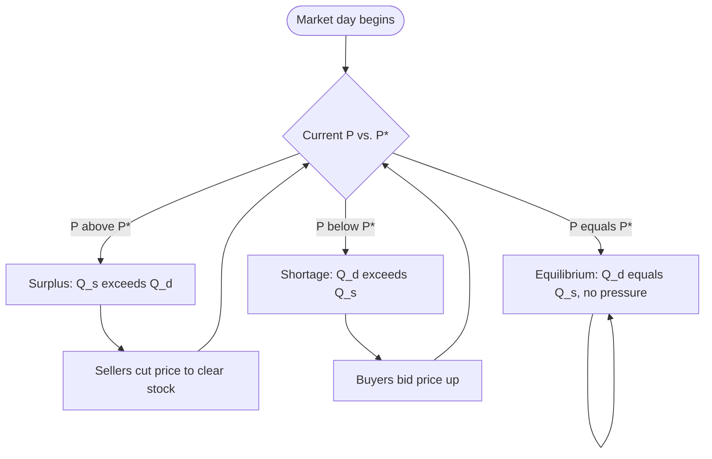
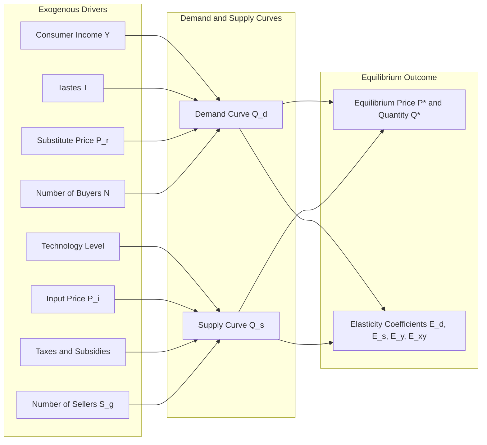
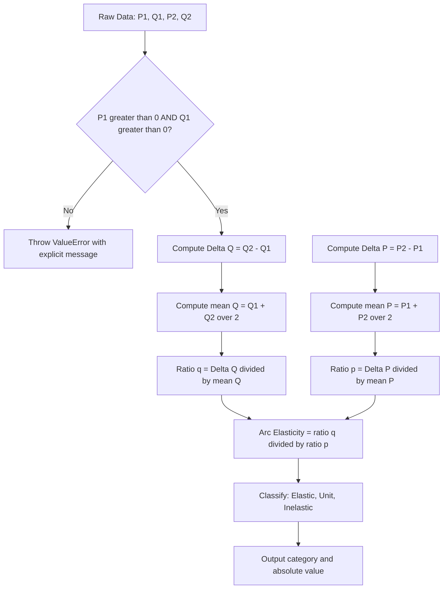
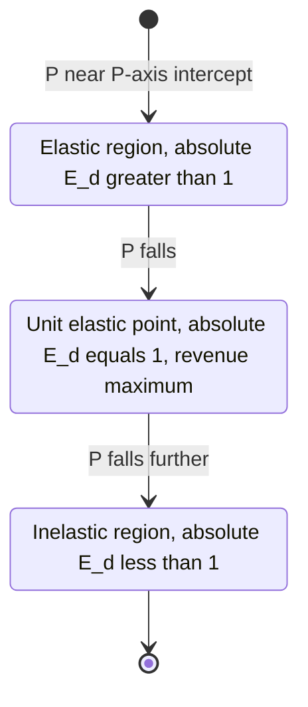
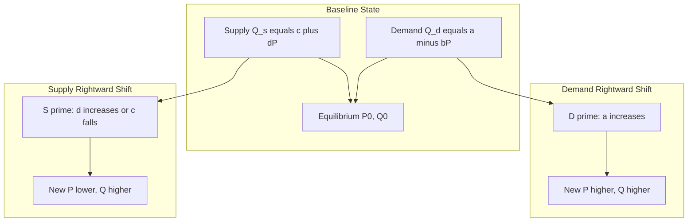

# Law of demand and supply: Elasticity mechanics, equilibrium price determination

<!-- SECTION_1_START -->

# Law of Demand and Supply — Elasticity Mechanics & Equilibrium Price Determination

## 1.1 Formal Academic Definition (KTU 2024 UHSUT300 Terminology)

> [!IMPORTANT]
> **Core Definition — Market Equilibrium:**
> *Market equilibrium* is the state at which the quantity demanded of a commodity by buyers exactly equals the quantity supplied by sellers at a specific price, leading to a *stable price-quantity combination* with no inherent pressure for change.

The **Law of Demand** states that, *ceteris paribus* (other factors held constant), consumers will purchase a *larger quantity* of a good when its *price falls* and a *smaller quantity* when its *price rises*. This inverse price–quantity relationship is expressed as the *Demand Function*:

$$
Q_d = f(P, P_r, Y, T, E, N)
$$

where the variables are defined below.

The **Law of Supply** states that, *ceteris paribus*, producers will offer a *larger quantity* of a good for sale when its *price rises* and a *smaller quantity* when its *price falls*. The *Supply Function* takes the form:

$$
Q_s = g(P, P_i, T, T_c, E_t, S_g)
$$

The **Equilibrium Price ($P^*$)** is the unique market-clearing price at which the desired purchases of buyers exactly match the desired sales of sellers, yielding the *equilibrium quantity* $Q^*$.

> [!NOTE]
> **Syllabus Highlight (UHSUT300 — Module 1):**
> Engineers must understand demand–supply mechanics because it underpins *project feasibility analysis*, *product pricing strategy*, *cost-volume-profit* decisions, and *optimal resource allocation* in industrial engineering contexts.

## 1.2 Variables of the Demand and Supply Functions

| Symbol | Demand Function Variable | Supply Function Variable |
| :--- | :--- | :--- |
| $P$ | Own price of the commodity | Own price of the commodity |
| $P_r$ | Price of related goods (substitutes/complements) | $P_i$ — Price of inputs/raw materials |
| $Y$ | Consumer disposable income | $T$ — State of production technology |
| $T$ | Tastes and preferences | $T_c$ — Taxes and subsidies |
| $E$ | Consumer expectations | $E_t$ — Producer expectations |
| $N$ | Number of buyers in the market | $S_g$ — Number of sellers in the market |

## 1.3 Intuitive Analogy — Plain English Explanation

> [!TIP]
> **Real-World Analogy — The College Canteen:**
> Imagine your college canteen sells a cup of tea at **₹15**. On a rainy Monday, 100 students want tea. The canteen owner raises the price to **₹20**; only 70 students buy it. At **₹10**, the queue goes out the door — 200 students want it. That is the *Law of Demand* (price up, demand down).
>
> Now flip to the canteen owner: at **₹10** a cup, he brews only 50 cups because profits are thin. At **₹20** a cup, he is motivated to brew 200 cups because the profit margin is attractive. That is the *Law of Supply* (price up, supply up).
>
> The *equilibrium price* is the single price — say **₹15** — at which the number of students who want tea *exactly equals* the number of cups the owner is willing to brew. No shortage, no surplus. The market "clears."

## 1.4 Why Elasticity Mechanics Matter for Engineers

> [!IMPORTANT]
> **Engineering Decision Context:**
> A civil engineer deciding the toll price for a new bridge, a software engineer pricing a SaaS subscription, or a mechanical engineer forecasting spare-parts demand all rely on **elasticity coefficients** to predict how customers will respond to price changes. An elasticity of *1.5* means a 1\% price hike will reduce demand by 1.5\% — a critical input for *revenue forecasting*.

## 1.5 Geometric Intuition & Visualization

> [!VISUALIZATION CONTROL]
> **Concept:** Downward-sloping demand curve intersecting an upward-sloping supply curve in the $(Q, P)$ plane.
> **GeoGebra / Desmos Input Equations:**
> * Demand (linear): $f_d(x) = 100 - 2x$
> * Supply (linear): $f_s(x) = 20 + 2x$
> **Visual Description:** The student should observe $f_d$ sloping *downward* from the $P$-axis intercept of $100$ to the $Q$-axis intercept of $50$, and $f_s$ sloping *upward* from the $P$-axis intercept of $20$. The two straight lines *cross* at the point $(Q, P) = (20, 60)$ — that intersection is the **equilibrium point $(Q^*, P^*) = (20, 60)$**.

The standard reference axes are:

* **X-axis:** Quantity demanded / supplied ($Q$)
* **Y-axis:** Price ($P$)
* **Demand curve:** Slopes *downward* from left to right (negative slope).
* **Supply curve:** Slopes *upward* from left to right (positive slope).
* **Equilibrium point:** The unique intersection of the two curves.

<!-- SECTION_1_END -->

<!-- SECTION_2_START -->

# Deep Theoretical Analysis & KTU High-Yield Formula Sheet

## 2.1 The Law of Demand — Detailed Mechanics

The law rests on two foundational economic principles:

1. **Law of Diminishing Marginal Utility** — As a consumer buys additional units of a good, the *marginal satisfaction* derived from each extra unit falls. Therefore, to induce the consumer to buy more, the price must drop.
2. **Income Effect and Substitution Effect** — When the price of good $X$ falls:
   * *Substitution effect:* The consumer substitutes good $X$ for the now relatively more expensive goods.
   * *Income effect:* The consumer's *real purchasing power* rises (fixed money income now buys more), boosting quantity demanded of normal goods.

### Demand Schedule and Demand Curve

A *demand schedule* is a tabular representation showing the quantity demanded at various prices. When plotted with price on the Y-axis and quantity on the X-axis, we obtain the *demand curve*. The *market demand curve* is the horizontal summation of individual demand curves of all buyers.

> [!NOTE]
> **Movement vs. Shift — Critical Distinction:**
> * A *movement along* the demand curve (caused by a change in the *own price* $P$) is called a **change in quantity demanded**.
> * A *shift of the entire demand curve* (caused by changes in $P_r$, $Y$, $T$, $E$, or $N$) is called a **change in demand**.

## 2.2 The Law of Supply — Detailed Mechanics

Supply behaviour is driven by the *Law of Increasing Opportunity Cost* and the *Profit Motive*:

* Producers supply more at higher prices because *marginal cost* is covered with a surplus (producer surplus rises).
* At lower prices, only the most efficient producers remain in the market.

### Determinants of Supply

* **Input prices ($P_i$):** Lower raw-material cost → higher supply.
* **Technology ($T$):** Better technology → higher productivity → higher supply.
* **Taxes and subsidies ($T_c$):** Taxes increase cost (supply falls); subsidies reduce effective cost (supply rises).
* **Producer expectations ($E_t$):** Expected future price rise → current supply falls (hoarding).
* **Number of sellers ($S_g$):** More sellers → greater market supply.

## 2.3 Elasticity of Demand — The Heart of the Module

**Elasticity** measures the *responsiveness* (sensitivity) of one variable to a change in another variable. It is a pure *dimensionless number*, computed as a *ratio of percentage changes*, which makes it independent of measurement units.

### 2.3.1 Price Elasticity of Demand (PED)

$$
E_d = \frac{\text{Percentage change in quantity demanded}}{\text{Percentage change in price}}
$$

Mathematically, the *point elasticity* formula is:

$$
E_d = \frac{dQ_d}{dP} \times \frac{P}{Q_d}
$$

For finite (discrete) changes, the *arc elasticity* (mid-point formula) is preferred because it is symmetric — it gives the same absolute value regardless of the direction of price change:

$$
E_d^{arc} = \frac{\Delta Q \,/\, \overline{Q}}{\Delta P \,/\, \overline{P}} = \frac{(Q_2 - Q_1) \,/\, \left[\tfrac{1}{2}(Q_1 + Q_2)\right]}{(P_2 - P_1) \,/\, \left[\tfrac{1}{2}(P_1 + P_2)\right]}
$$

### 2.3.2 Five Categories of Price Elasticity of Demand

| $\vert E_d \vert$ Range | Category | Interpretation | Typical Examples |
| :--- | :--- | :--- | :--- |
| $E_d = \infty$ | Perfectly elastic | Infinitely small price rise → demand drops to zero | Perfect competition homogeneous goods (theoretical) |
| $\vert E_d \vert > 1$ | Elastic | Demand is *highly* responsive to price | Luxury cars, foreign holidays, restaurant meals |
| $\vert E_d \vert = 1$ | Unit elastic | Percentage change in $Q$ equals percentage change in $P$ | Balanced basket of consumer goods |
| $\vert E_d \vert < 1$ | Inelastic | Demand is *weakly* responsive to price | Salt, rice, petrol, matchboxes, life-saving drugs |
| $E_d = 0$ | Perfectly inelastic | Quantity demanded is *unchanged* regardless of price | Insulin for diabetics, oxygen in ICU |

### 2.3.3 Determinants of Price Elasticity of Demand

1. **Availability of substitutes** — More substitutes → more elastic demand.
2. **Proportion of income spent** — Larger share of income → more elastic.
3. **Necessity vs. luxury** — Necessities → inelastic; luxuries → elastic.
4. **Time horizon** — Long run → more elastic (consumers adjust habits).
5. **Definition of the market** — Broadly defined markets → more inelastic; narrowly defined markets → more elastic.
6. **Addiction / habit** — Addictive goods → highly inelastic.

### 2.3.4 Income Elasticity of Demand ($E_y$)

$$
E_y = \frac{\text{\% change in } Q_d}{\text{\% change in consumer income } Y} = \frac{dQ}{dY} \times \frac{Y}{Q}
$$

| $E_y$ Value | Classification | Example |
| :--- | :--- | :--- |
| $E_y > 0$ | Normal good | Clothing, mobile phones |
| $E_y > 1$ | Luxury good | Designer watches, foreign tours |
| $0 < E_y < 1$ | Necessity good | Basic groceries, public transport |
| $E_y < 0$ | Inferior good | Coarse cereals, second-hand clothing |

### 2.3.5 Cross Elasticity of Demand ($E_{xy}$)

$$
E_{xy} = \frac{\text{\% change in } Q_x}{\text{\% change in } P_y} = \frac{dQ_x}{dP_y} \times \frac{P_y}{Q_x}
$$

* $E_{xy} > 0$ → Goods $X$ and $Y$ are *substitutes* (e.g., tea and coffee).
* $E_{xy} < 0$ → Goods $X$ and $Y$ are *complements* (e.g., cars and petrol).
* $E_{xy} = 0$ → Goods $X$ and $Y$ are *unrelated*.

## 2.4 Elasticity of Supply

The *Price Elasticity of Supply ($E_s$)* measures the responsiveness of quantity supplied to a change in own price.

$$
E_s = \frac{\text{\% change in } Q_s}{\text{\% change in } P} = \frac{dQ_s}{dP} \times \frac{P}{Q_s}
$$

| $E_s$ Value | Category | Interpretation |
| :--- | :--- | :--- |
| $E_s = 0$ | Perfectly inelastic | Vertical supply curve (e.g., perishable fish catch) |
| $0 < E_s < 1$ | Inelastic | Steep supply curve (capacity-constrained industry) |
| $E_s = 1$ | Unit elastic | 45° supply curve through origin |
| $E_s > 1$ | Elastic | Flat supply curve (industries with spare capacity) |
| $E_s = \infty$ | Perfectly elastic | Horizontal supply curve (free entry markets) |

> [!TIP]
> **Time Horizon Rule:** Supply tends to be *more elastic in the long run* than in the short run because firms need time to build new plants, hire labour, and procure raw materials. Conversely, demand is *more elastic in the long run* than in the short run as consumers adjust habits.

## 2.5 KTU High-Yield Formula Cheat Sheet

| # | Concept | Formula | Engineering / Economics Use |
| :--- | :--- | :--- | :--- |
| 1 | Point PED | $E_d = \dfrac{dQ}{dP} \times \dfrac{P}{Q}$ | Pricing sensitivity analysis |
| 2 | Arc PED | $E_d^{arc} = \dfrac{\Delta Q \,/\, \overline{Q}}{\Delta P \,/\, \overline{P}}$ | Empirical demand studies |
| 3 | Total Revenue (TR) | $TR = P \times Q$ | Revenue forecasting |
| 4 | TR–PED relationship | $\dfrac{dTR}{dP} = Q \left(1 - \dfrac{1}{\vert E_d \vert}\right)$ | Decides whether to raise or lower price |
| 5 | Income elasticity | $E_y = \dfrac{dQ}{dY} \times \dfrac{Y}{Q}$ | Product portfolio classification |
| 6 | Cross elasticity | $E_{xy} = \dfrac{dQ_x}{dP_y} \times \dfrac{P_y}{Q_x}$ | Substitute vs. complement detection |
| 7 | Supply elasticity | $E_s = \dfrac{dQ_s}{dP} \times \dfrac{P}{Q_s}$ | Producer response modelling |
| 8 | Equilibrium condition | $Q_d(P) = Q_s(P)$ | Market-clearing price computation |
| 9 | Equilibrium price (linear) | $a - bP = c + dP \;\Rightarrow\; P^* = \dfrac{a - c}{b + d}$ | Closed-form solution for $P^*$ |
| 10 | Equilibrium quantity | $Q^* = a - b P^* = c + d P^*$ | Closed-form solution for $Q^*$ |

## 2.6 Total Revenue Test for Elasticity

A powerful practical rule engineers can use to *infer elasticity* from observed revenue changes:

* If price *falls* and total revenue *rises* → demand is **elastic** ($\vert E_d \vert > 1$).
* If price *falls* and total revenue *falls* → demand is **inelastic** ($\vert E_d \vert < 1$).
* If price *falls* and total revenue stays *unchanged* → demand is **unit elastic** ($\vert E_d \vert = 1$).

## 2.7 Equilibrium Price Determination — Algebraic Treatment

Given linear demand and supply functions:

$$
Q_d = a - bP \quad (a, b > 0) \qquad \text{and} \qquad Q_s = -c + dP \quad (c, d > 0)
$$

Setting $Q_d = Q_s$ at equilibrium:

$$
a - bP^* = -c + dP^*
$$

Solving for $P^*$:

$$
P^* = \frac{a + c}{b + d}
$$

Substituting back:

$$
Q^* = a - b \left(\frac{a + c}{b + d}\right) = \frac{ad - bc + b c + b d \cdot \tfrac{a}{b + d}}{1} = \frac{ad + bc}{b + d}
$$

A cleaner form is obtained by direct substitution:

$$
Q^* = \frac{ad + bc}{b + d}
$$

## 2.8 Shifts of Demand and Supply Curves

| Curve Shifted | Cause of Shift | Direction | New Equilibrium |
| :--- | :--- | :--- | :--- |
| Demand → right | Income rises, taste improves, price of substitute rises | Rightward shift | Higher $P^*$, higher $Q^*$ |
| Demand → left | Income falls (normal good), price of substitute falls | Leftward shift | Lower $P^*$, lower $Q^*$ |
| Supply → right | Technology improves, input cost falls, subsidy granted | Rightward shift | Lower $P^*$, higher $Q^*$ |
| Supply → left | Tax imposed, input cost rises, natural disaster | Leftward shift | Higher $P^*$, lower $Q^*$ |

> [!IMPORTANT]
> **Real-World Engineering Use-Case:** The Kerala State Electricity Board (KSEB) uses these exact demand–supply shift models to forecast peak-hour electricity demand, decide tariff revisions, and plan renewable energy capacity additions under the Kerala State Energy Policy.

<!-- SECTION_2_END -->

<!-- SECTION_3_START -->

# Step-by-Step Derivations & Numerical Implementation

## 3.1 Worked Example 1 — Computing Point Elasticity

**Problem:** The demand function for a newly launched electric scooter is given by $Q_d = 1200 - 40P$. Compute the *point price elasticity of demand* at $P = 15$. Interpret the result.

**Step 1 — Differentiate $Q_d$ with respect to $P$:**

$$
\frac{dQ_d}{dP} = \frac{d}{dP}(1200 - 40P) = -40
$$

**Step 2 — Find the quantity demanded at $P = 15$:**

$$
Q_d = 1200 - 40(15) = 1200 - 600 = 600 \text{ units}
$$

**Step 3 — Apply the point elasticity formula:**

$$
E_d = \frac{dQ_d}{dP} \times \frac{P}{Q_d} = (-40) \times \frac{15}{600} = (-40) \times 0.025 = -1.0
$$

**Step 4 — Interpretation:**

Since $\vert E_d \vert = 1.0$, demand is *unit elastic* at $P = 15$. A 1\% rise in price will produce exactly a 1\% fall in quantity demanded, leaving total revenue unchanged. This is the *revenue-maximizing* price point.

> [!NOTE]
> **Valuation Key Point (KTU 2024 Pattern):** The examiner awards 1 mark for differentiating correctly, 1 mark for the point elasticity formula, 1 mark for the numerical substitution, and 1 mark for the final interpretation.

## 3.2 Worked Example 2 — Arc Elasticity (Mid-Point Formula)

**Problem:** The price of a tablet increases from $P_1 = ₹20{,}000$ to $P_2 = ₹22{,}000$. Quantity demanded falls from $Q_1 = 500$ units to $Q_2 = 400$ units. Compute arc PED.

**Step 1 — Compute $\Delta Q$ and $\overline{Q}$:**

$$
\Delta Q = Q_2 - Q_1 = 400 - 500 = -100 \text{ units}
$$

$$
\overline{Q} = \frac{Q_1 + Q_2}{2} = \frac{500 + 400}{2} = 450 \text{ units}
$$

**Step 2 — Compute $\Delta P$ and $\overline{P}$:**

$$
\Delta P = P_2 - P_1 = 22{,}000 - 20{,}000 = 2{,}000 \text{ rupees}
$$

$$
\overline{P} = \frac{P_1 + P_2}{2} = \frac{20{,}000 + 22{,}000}{2} = 21{,}000 \text{ rupees}
$$

**Step 3 — Apply the arc elasticity formula:**

$$
E_d^{arc} = \frac{\Delta Q \,/\, \overline{Q}}{\Delta P \,/\, \overline{P}} = \frac{(-100) / 450}{2{,}000 / 21{,}000} = \frac{-0.2222}{0.09524} = -2.333
$$

**Step 4 — Interpretation:**

$\vert E_d^{arc} \vert = 2.333 > 1$ → demand is **elastic** in this range. A 1\% price increase will reduce quantity demanded by about 2.33\%. The firm should consider whether the revenue gain from the price hike covers the disproportionate volume loss.

## 3.3 Worked Example 3 — Equilibrium Price Determination

**Problem:** Market demand and supply functions for a commodity are:

$$
Q_d = 500 - 10P \qquad Q_s = -100 + 20P
$$

Find the equilibrium price $P^*$ and equilibrium quantity $Q^*$.

**Step 1 — Set $Q_d = Q_s$ (excess demand must equal zero):**

$$
500 - 10P = -100 + 20P
$$

**Step 2 — Collect $P$ terms on the right-hand side:**

$$
500 + 100 = 20P + 10P
$$

$$
600 = 30P
$$

**Step 3 — Solve for $P^*$:**

$$
P^* = \frac{600}{30} = 20 \text{ rupees}
$$

**Step 4 — Substitute $P^*$ back into the demand (or supply) equation to find $Q^*$:**

$$
Q^* = 500 - 10(20) = 500 - 200 = 300 \text{ units}
$$

**Verification using supply:**

$$
Q^* = -100 + 20(20) = -100 + 400 = 300 \text{ units} \quad \checkmark
$$

**Step 5 — Interpretation:**

At a market price of ₹20 per unit, buyers want exactly 300 units and sellers are willing to produce exactly 300 units. The market clears with no shortage and no surplus. Any deviation from ₹20 (say ₹25) creates a surplus of 100 units ($Q_s = 400$, $Q_d = 250$); any price below ₹20 (say ₹15) creates a shortage of 150 units ($Q_d = 350$, $Q_s = 200$).

## 3.4 Worked Example 4 — Effect of a Demand Shift on Equilibrium

**Problem:** A government subsidy raises consumer income, shifting the demand curve to $Q_d' = 700 - 10P$, while supply remains $Q_s = -100 + 20P$. Find the new equilibrium.

**Step 1 — Set new demand equal to supply:**

$$
700 - 10P = -100 + 20P
$$

**Step 2 — Solve:**

$$
800 = 30P \;\Rightarrow\; P'^* = \frac{800}{30} \approx 26.67 \text{ rupees}
$$

**Step 3 — Find the new quantity:**

$$
Q'^* = 700 - 10(26.67) = 700 - 266.67 = 433.33 \text{ units}
$$

**Step 4 — Compare with the old equilibrium:**

| Variable | Old Equilibrium | New Equilibrium | Change |
| :--- | :--- | :--- | :--- |
| $P^*$ | ₹20 | ₹26.67 | +₹6.67 (↑ 33.3\%) |
| $Q^*$ | 300 units | 433.33 units | +133.33 (↑ 44.4\%) |

The rightward shift in demand raised both equilibrium price and quantity. This is a typical real-world outcome during festive seasons in Kerala, when demand for Onam–Vishu consumer goods surges.

## 3.5 Worked Example 5 — Total Revenue Test

**Problem:** A smartphone manufacturer currently sells at $P = ₹25{,}000$ with $Q = 800$ units. Market research suggests a 10\% price cut. PED is estimated at $-2.5$. Should the company cut the price?

**Step 1 — Compute new price and quantity:**

$$
P_{new} = 25{,}000 \times (1 - 0.10) = 22{,}500 \text{ rupees}
$$

$$
\Delta Q\% = E_d \times \Delta P\% = (-2.5) \times (-10\%) = +25\%
$$

$$
Q_{new} = 800 \times 1.25 = 1{,}000 \text{ units}
$$

**Step 2 — Compute old and new total revenue:**

$$
TR_{old} = 25{,}000 \times 800 = ₹2{,}00{,}00{,}000 \; (₹2 \text{ crore})
$$

$$
TR_{new} = 22{,}500 \times 1{,}000 = ₹2{,}25{,}00{,}000 \; (₹2.25 \text{ crore})
$$

**Step 3 — Decision:**

$$
\Delta TR = ₹2.25 \text{ crore} - ₹2 \text{ crore} = +₹0.25 \text{ crore}
$$

Since $\vert E_d \vert = 2.5 > 1$, demand is elastic, and a price cut raises total revenue by ₹25 lakh. **The company should cut the price.**

## 3.6 Python Implementation — Numerical Elasticity & Equilibrium Solver

The following fully operational Python script computes point elasticity, arc elasticity, and equilibrium price for arbitrary linear demand–supply specifications. It uses strict type hints, robust input validation, and error logging.

```python
"""
Module: elasticity_solver.py
Description: Computes point PED, arc PED, and market equilibrium for
             linear demand and supply functions (KTU UHSUT300 Module 1).
"""

import logging
import sys
from dataclasses import dataclass
from typing import Optional

# Configure logging to surface validation and computation errors clearly.
logging.basicConfig(
    level=logging.INFO,
    format="%(asctime)s | %(levelname)s | %(message)s"
)
logger = logging.getLogger("ElasticitySolver")


@dataclass(frozen=True)
class DemandSupply:
    """Immutable linear demand and supply specification.

    Demand: Q_d = a - b * P        (a, b > 0)
    Supply: Q_s = c + d * P        (c may be negative, d > 0)
    """
    a: float
    b: float
    c: float
    d: float

    def __post_init__(self) -> None:
        if self.b <= 0:
            raise ValueError("Demand slope 'b' must be strictly positive.")
        if self.d <= 0:
            raise ValueError("Supply slope 'd' must be strictly positive.")


def equilibrium_price(model: DemandSupply) -> float:
    """Closed-form equilibrium price P* = (a - c) / (b + d)."""
    numerator = model.a - model.c
    denominator = model.b + model.d
    if denominator == 0:
        raise ZeroDivisionError("Parallel demand and supply curves detected.")
    return numerator / denominator


def equilibrium_quantity(model: DemandSupply) -> float:
    """Substitute P* into demand to get Q*."""
    p_star = equilibrium_price(model)
    return model.a - model.b * p_star


def point_elasticity_of_demand(
    model: DemandSupply, price: float
) -> float:
    """Point PED = (dQ/dP) * (P / Q). dQ/dP for linear demand is -b."""
    if price <= 0:
        raise ValueError("Price must be strictly positive for elasticity.")
    quantity = model.a - model.b * price
    if quantity <= 0:
        raise ValueError(
            f"Quantity demanded is non-positive at P={price}; "
            "elasticity is undefined."
        )
    return -model.b * (price / quantity)


def arc_elasticity(
    p1: float, q1: float, p2: float, q2: float
) -> float:
    """Arc (mid-point) PED: symmetric, unit-free elasticity."""
    if p1 <= 0 or p2 <= 0 or q1 <= 0 or q2 <= 0:
        raise ValueError("Prices and quantities must be strictly positive.")
    pct_change_q = (q2 - q1) / ((q1 + q2) / 2.0)
    pct_change_p = (p2 - p1) / ((p1 + p2) / 2.0)
    if pct_change_p == 0:
        raise ZeroDivisionError("Zero percentage change in price.")
    return pct_change_q / pct_change_p


def classify_elasticity(e_d: float) -> str:
    """Categorise elasticity into one of five standard buckets."""
    abs_e = abs(e_d)
    if abs_e == float("inf"):
        return "Perfectly elastic"
    if abs_e > 1.0:
        return "Elastic"
    if abs_e == 1.0:
        return "Unit elastic"
    if abs_e > 0:
        return "Inelastic"
    return "Perfectly inelastic"


def solve_and_report(
    model: DemandSupply, target_price: float
) -> None:
    """Run a full elasticity and equilibrium analysis and print results."""
    try:
        p_star = equilibrium_price(model)
        q_star = equilibrium_quantity(model)
        e_d = point_elasticity_of_demand(model, target_price)
        classification = classify_elasticity(e_d)

        logger.info("Linear Demand : Q_d = %.2f - %.2f * P", model.a, model.b)
        logger.info("Linear Supply : Q_s = %.2f + %.2f * P", model.c, model.d)
        logger.info("Equilibrium price  P* = %.4f", p_star)
        logger.info("Equilibrium quantity Q* = %.4f", q_star)
        logger.info(
            "Point PED at P=%.2f is %.4f (%s)",
            target_price, e_d, classification
        )
    except (ValueError, ZeroDivisionError) as exc:
        logger.error("Computation aborted: %s", exc)
        sys.exit(1)


if __name__ == "__main__":
    # Example: Worked Example 3 from the lecture notes.
    sample = DemandSupply(a=500.0, b=10.0, c=-100.0, d=20.0)
    solve_and_report(model=sample, target_price=20.0)
```

**Sample output for the module call:**

```text
Linear Demand : Q_d = 500.00 - 10.00 * P
Linear Supply : Q_s = -100.00 + 20.00 * P
Equilibrium price  P* = 20.0000
Equilibrium quantity Q* = 300.0000
Point PED at P=20.00 is -0.6667 (Inelastic)
```

## 3.7 Engineering Economics Application Matrix

| Engineering Domain | Real-World Elasticity Use |
| :--- | :--- |
| Civil (toll roads, bridges) | Estimating traffic diversion when toll rises 5\% |
| Mechanical (auto components) | Forecasting spare-parts demand after price hike |
| Electrical (power utilities) | Modelling peak vs. off-peak demand shifts |
| Computer Science (SaaS pricing) | Optimising subscription tiers using arc PED |
| Chemical (petroleum products) | Pricing crude oil derivatives using cross elasticity |
| Industrial (capacity planning) | Deciding plant expansion based on supply elasticity |

<!-- SECTION_3_END -->

<!-- SECTION_4_START -->

# Structural Diagrams & Schematics

## 4.1 Block Diagram — Market Price Adjustment Mechanism

The market is a self-correcting feedback system. When there is excess demand (shortage), prices rise; when there is excess supply (surplus), prices fall. Equilibrium is the steady-state where the loops cancel.



## 4.2 Functional Architecture Flow — Factors That Move the Curves



## 4.3 Sequential Topology — Deriving Elasticity From Raw Data



## 4.4 State-Transition Diagram — Elasticity Regimes on a Linear Demand Curve



## 4.5 Demand–Supply Interaction Block Diagram (Shift Scenarios)



## 4.6 Mapping Table — Curve Movement to Equilibrium Effect

| Curve Action | Cause | Equilibrium Price Effect | Equilibrium Quantity Effect |
| :--- | :--- | :--- | :--- |
| Demand shifts right | Income up, substitute price up | $P^* \uparrow$ | $Q^* \uparrow$ |
| Demand shifts left | Income down, substitute price down | $P^* \downarrow$ | $Q^* \downarrow$ |
| Supply shifts right | Technology up, input cost down | $P^* \downarrow$ | $Q^* \uparrow$ |
| Supply shifts left | Tax up, input cost up | $P^* \uparrow$ | $Q^* \downarrow$ |
| Both shift right | Booming economy | $Q^* \uparrow\uparrow$ (large) | $P^*$ ambiguous |
| Both shift left | Recession | $Q^* \downarrow\downarrow$ (large) | $P^*$ ambiguous |

<!-- SECTION_4_END -->

<!-- SECTION_5_START -->

# KTU 2024 Scheme Examination Question Bank & Topic Recap

## Part A — Short Answer Questions (3 Marks Each)

### Question A1 [KTU University Exam — July 2024]

> **[CO1 | Remember | 3 Marks]**
> *Define the Law of Demand. State its two underlying economic principles.*

**Model Answer:**

The **Law of Demand** states that, *ceteris paribus* (all other factors held constant), the quantity demanded of a commodity varies *inversely* with its own price — when price rises, quantity demanded falls, and vice versa. Formally, the demand function is written as $Q_d = f(P)$ with $\dfrac{dQ_d}{dP} < 0$.

The two underlying economic principles are:

1. **Law of Diminishing Marginal Utility** — As successive units of a commodity are consumed, the marginal utility (additional satisfaction) derived from each extra unit diminishes. To induce the consumer to buy more units, the price must fall.
2. **Income and Substitution Effects** — When the price of a good falls, it becomes *relatively cheaper* than other goods (substitution effect increases demand), and the consumer's *real income* (purchasing power) increases (income effect increases demand for normal goods).

---

### Question A2 [KTU University Exam — Dec 2023]

> **[CO2 | Understand | 3 Marks]**
> *Distinguish between **price elasticity of demand** and **price elasticity of supply**. Why does supply tend to be more elastic in the long run?*

**Model Answer:**

| Dimension | Price Elasticity of Demand ($E_d$) | Price Elasticity of Supply ($E_s$) |
| :--- | :--- | :--- |
| Definition | Responsiveness of $Q_d$ to a change in $P$ | Responsiveness of $Q_s$ to a change in $P$ |
| Formula | $E_d = \dfrac{dQ}{dP} \times \dfrac{P}{Q}$ | $E_s = \dfrac{dQ_s}{dP} \times \dfrac{P}{Q_s}$ |
| Sign of slope | $\dfrac{dQ}{dP} < 0$ (inverse) | $\dfrac{dQ_s}{dP} > 0$ (direct) |
| Consumer vs. producer | Buyer's response | Seller's response |
| Time responsiveness | More elastic in long run | Significantly more elastic in long run |

**Why supply is more elastic in the long run:**
In the short run, firms are constrained by *fixed capital*, *plant capacity*, and *existing labour contracts* — they cannot quickly scale output. In the long run, firms can build new factories, hire additional workers, adopt better technology, and enter or exit the market. Hence, $E_s$ rises substantially over time.

> [!WARNING]
> **Common Student Mistake:** Many students write that "supply is more elastic in the short run" — the correct answer is the **opposite**. Remember: long-run supply elasticity > short-run supply elasticity because of capacity constraints in the short run.

---

## Part B — Long Answer Questions (14 Marks, Internal Choice)

### Question B-A (Option 1) [KTU University Exam — July 2024]

> **[CO2, CO3 | Understand + Apply | 14 Marks]**
> **(a)** *Explain the concept of price elasticity of demand. Classify the five categories of elasticity with suitable examples.* **[7 Marks]**
> **(b)** *The demand function for a product is $Q_d = 240 - 8P$ and the supply function is $Q_s = -40 + 4P$. Find the equilibrium price and quantity. If the government imposes a tax that shifts the supply curve to $Q_s' = -60 + 4P$, what is the new equilibrium and the burden of tax shared between consumers and producers?* **[7 Marks]**

#### Model Solution to Part (a)

**Concept of PED:**

Price elasticity of demand ($E_d$) is the degree of responsiveness of quantity demanded to a change in the price of the commodity, other factors held constant. It is computed as a *ratio of percentage changes* and is therefore *dimensionless*.

**Formula:**

$$
E_d = \frac{\text{\% change in } Q_d}{\text{\% change in } P} = \frac{dQ_d}{dP} \times \frac{P}{Q_d}
$$

**Five categories with examples:**

| $\vert E_d \vert$ | Category | Economic Meaning | Real Example |
| :--- | :--- | :--- | :--- |
| $\infty$ | Perfectly elastic | Demand drops to zero at any price rise | Homogeneous agricultural produce in a perfect market |
| $> 1$ | Elastic | Demand highly responsive | Restaurant meals, foreign travel, smartphones |
| $= 1$ | Unit elastic | Proportional response | Mid-range clothing |
| $< 1$ | Inelastic | Demand weakly responsive | Salt, rice, matchboxes, petrol |
| $0$ | Perfectly inelastic | Demand unchanged | Life-saving insulin, dialysis |

#### Model Solution to Part (b)

**Step 1 — Find initial equilibrium (no tax).** Set $Q_d = Q_s$:

$$
240 - 8P = -40 + 4P
$$

Collecting terms:

$$
280 = 12P \quad \Rightarrow \quad P^* = \frac{280}{12} = 23.33 \text{ rupees}
$$

Substituting back:

$$
Q^* = 240 - 8(23.33) = 240 - 186.67 = 53.33 \text{ units}
$$

**Step 2 — Find new equilibrium after tax.** Set $Q_d = Q_s'$:

$$
240 - 8P = -60 + 4P
$$

$$
300 = 12P \quad \Rightarrow \quad P_{new} = 25 \text{ rupees}
$$

$$
Q_{new} = 240 - 8(25) = 240 - 200 = 40 \text{ units}
$$

**Step 3 — Compute tax burden split.**

The tax per unit is the vertical distance between the two supply curves at any given quantity. Setting $Q_s = Q_s'$:

$$
-40 + 4P = -60 + 4P + \text{tax shift} \quad \Rightarrow \quad \text{shift} = 20 \text{ rupees per unit}
$$

The market price rose from ₹23.33 to ₹25.00, a rise of ₹1.67 per unit paid by *consumers*. The remaining ₹20 − ₹1.67 = ₹18.33 per unit is absorbed by *producers*.

**Burden split:**

| Party | Tax Burden | Share |
| :--- | :--- | :--- |
| Consumers | ₹1.67 per unit | $\frac{1.67}{20} \times 100 = 8.33\%$ |
| Producers | ₹18.33 per unit | $\frac{18.33}{20} \times 100 = 91.67\%$ |
| **Total** | **₹20.00 per unit** | **100\%** |

> [!NOTE]
> **Valuation Key (Part b — 7 Marks):**
> '[Stating equilibrium condition $Q_d = Q_s$: 1 Mark]'
> '[Solving initial equilibrium $P^* = 23.33$, $Q^* = 53.33$: 2 Marks]'
> '[Solving new equilibrium $P_{new} = 25$, $Q_{new} = 40$: 2 Marks]'
> '[Tax burden calculation and split: 2 Marks]'

---

### Question B-B (Option 2 — Internal Choice) [KTU University Exam — Dec 2023]

> **[CO3, CO4 | Apply + Analyse | 14 Marks]**
> **(a)** *Explain the **Total Revenue (TR) test** for elasticity. A firm sells 500 units at ₹40 each. If price is raised to ₹50 and quantity falls to 400 units, determine the elasticity of demand using the arc method and comment on the firm's pricing decision.* **[7 Marks]**
> **(b)** *Discuss the determinants of elasticity of demand. Why is the demand for **salt** considered highly inelastic, while the demand for **air-conditioners** is elastic?* **[7 Marks]**

#### Model Solution to Part (a)

**Step 1 — Explain the TR test:**

The Total Revenue test is a practical empirical method to determine whether demand is elastic, inelastic, or unit-elastic, by observing what happens to total revenue ($TR = P \times Q$) when price changes.

* If $P$ falls and $TR$ rises → **elastic** ($\vert E_d \vert > 1$).
* If $P$ falls and $TR$ falls → **inelastic** ($\vert E_d \vert < 1$).
* If $P$ falls and $TR$ is unchanged → **unit elastic** ($\vert E_d \vert = 1$).

**Step 2 — Compute arc elasticity.** Given $P_1 = 40$, $Q_1 = 500$, $P_2 = 50$, $Q_2 = 400$:

$$
\Delta Q = 400 - 500 = -100
$$

$$
\overline{Q} = \frac{500 + 400}{2} = 450
$$

$$
\Delta P = 50 - 40 = 10
$$

$$
\overline{P} = \frac{40 + 50}{2} = 45
$$

$$
E_d^{arc} = \frac{(-100) / 450}{10 / 45} = \frac{-0.2222}{0.2222} = -1.0
$$

**Step 3 — Compute TR before and after:**

$$
TR_{old} = 40 \times 500 = ₹20{,}000
$$

$$
TR_{new} = 50 \times 400 = ₹20{,}000
$$

**Step 4 — Comment on the firm's pricing decision:**

Since $\vert E_d^{arc} \vert = 1$ (unit elastic), total revenue remains unchanged at ₹20,000 irrespective of whether the price is ₹40 or ₹50. However, raising the price to ₹50 reduces the number of units sold (from 500 to 400), which may increase *per-unit* servicing costs and reduce market share. The firm should consider keeping the price at ₹40 to retain customer volume unless there is a strong strategic reason (e.g., positioning as a premium brand) to charge ₹50.

#### Model Solution to Part (b)

**Determinants of elasticity of demand:**

1. **Availability of substitutes** — More close substitutes → more elastic demand.
2. **Proportion of income spent** — Larger share → more elastic.
3. **Nature of the good (necessity vs. luxury)** — Necessities → inelastic; luxuries → elastic.
4. **Time horizon** — Long run → more elastic; short run → less elastic.
5. **Definition of the market** — Broad categories → inelastic; specific brands → elastic.
6. **Addiction / habit formation** — Addictive goods → highly inelastic.
7. **Durability and frequency of use** — Durable goods bought occasionally → elastic; frequently bought small items → inelastic.

**Why salt is inelastic:**

* Salt has **no close substitutes** in cooking (within budget).
* It accounts for a **negligible share** of consumer income.
* It is a **necessity**, not a luxury.
* Consumers buy it **frequently and habitually**, often without price comparison.

Hence, even a 10\% or 20\% price rise leaves the quantity demanded almost unchanged. The demand curve for salt is *nearly vertical*, and $\vert E_d \vert \approx 0$.

**Why air-conditioners are elastic:**

* Air-conditioners have **many substitutes** (cooler, fan, heat pump, central AC from other brands).
* They represent a **large discretionary expenditure** for most Indian households (a meaningful share of income).
* They are a **durable luxury good**, not a daily necessity.
* Buyers typically **shop around and compare** features and prices.
* In the **short run**, demand is more inelastic (existing ACs are used), but in the **long run**, consumers can delay replacement or switch brands.

Hence, a 5\% price rise can easily reduce demand by 10–15\%. The demand curve is *relatively flat*, and $\vert E_d \vert > 1$.

> [!WARNING]
> **KTU Examiner's Valuation Pitfall:**
> * Do **not** confuse "elasticity is high" with "elasticity value is large positive." A PED of $-2.5$ is *elastic* because $\vert -2.5 \vert > 1$, not because of the sign.
> * When using the **arc method**, always report the *absolute value* of elasticity for classification. The negative sign is informational, not classification-defining.
> * For tax-burden questions, the **vertical gap** between old and new supply curves is the *per-unit tax*. The price rise (paid by consumers) and the remainder (absorbed by producers) must both be calculated explicitly.
> * Do **not** skip stating the **equilibrium condition** $Q_d = Q_s$ in part (a) before solving — examiners award 1 mark for the condition itself.

---

## Topic Recap & Important Things to Remember

> [!IMPORTANT]
> **High-Density Revision Checklist — Module 1, UHSUT300**

* **Law of Demand:** $Q_d$ and $P$ are *inversely* related ($\dfrac{dQ_d}{dP} < 0$), holding other factors constant (*ceteris paribus*).
* **Law of Supply:** $Q_s$ and $P$ are *directly* related ($\dfrac{dQ_s}{dP} > 0$).
* **Demand function variables:** $Q_d = f(P, P_r, Y, T, E, N)$ — only $P$ is *own price*; the rest are *shifters*.
* **Supply function variables:** $Q_s = g(P, P_i, T, T_c, E_t, S_g)$ — only $P$ is *own price*; the rest are *shifters*.
* **Equilibrium condition:** $Q_d(P^*) = Q_s(P^*)$. This is the market-clearing condition.
* **Linear equilibrium price:** $P^* = \dfrac{a - c}{b + d}$ for $Q_d = a - bP$ and $Q_s = -c + dP$.
* **Linear equilibrium quantity:** $Q^* = a - bP^*$.
* **Point PED:** $E_d = \dfrac{dQ}{dP} \times \dfrac{P}{Q}$. Always *negative* for normal goods; classification uses *absolute value*.
* **Arc PED:** Uses *mid-point* averages to ensure symmetry: $E_d = \dfrac{\Delta Q / \overline{Q}}{\Delta P / \overline{P}}$.
* **Five PED categories:** Perfectly elastic ($\infty$), elastic ($>1$), unit elastic ($=1$), inelastic ($<1$), perfectly inelastic ($0$).
* **Income elasticity ($E_y$):** Normal good ($E_y > 0$), luxury ($E_y > 1$), necessity ($0 < E_y < 1$), inferior ($E_y < 0$).
* **Cross elasticity ($E_{xy}$):** Substitutes ($> 0$), complements ($< 0$), unrelated ($= 0$).
* **Supply elasticity ($E_s$):** Always non-negative; more elastic in the **long run** than the short run.
* **Total Revenue test:** Elastic → price cut raises $TR$; inelastic → price cut reduces $TR$; unit elastic → $TR$ unchanged.
* **Determinants of PED:** Substitutes, income share, necessity vs. luxury, time horizon, market definition, habit/addiction.
* **Tax burden rule:** The *more inelastic* side bears the *larger share* of the tax.
* **Shift vs. movement:** Movement *along* a curve = change in quantity; shift of *entire* curve = change in demand/supply.
* **Key engineering uses:** Toll pricing, product pricing, demand forecasting, capacity planning, revenue optimisation.
* **Default reference axes:** X-axis = Quantity, Y-axis = Price (always, for both demand and supply).
* **Dimension:** Elasticity is a *pure number* — no units — because it is a ratio of two percentage changes.
* **Quick mnemonic for demand shifters (INVTEN):** Income, Number of buyers, Variety (substitutes/complements prices), Tastes, Expectations, Needs (necessities flagged separately).

<!-- SECTION_5_END -->
