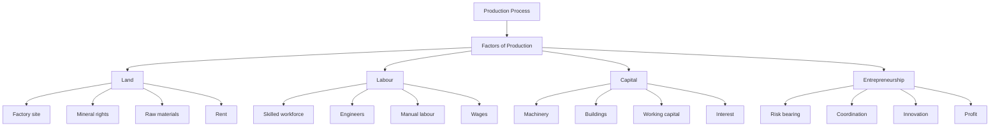
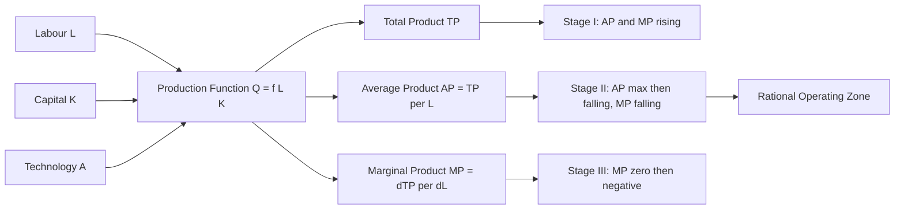
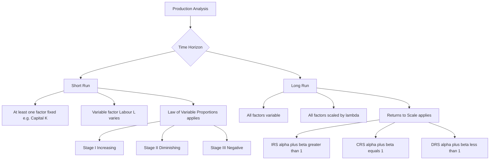
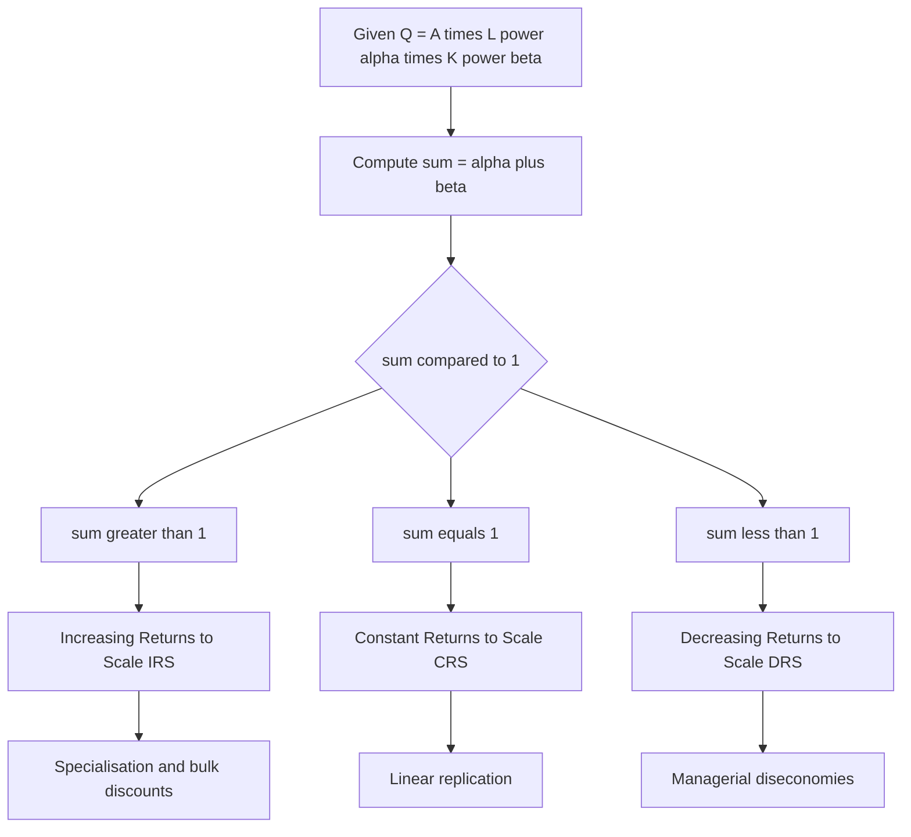

# Production analysis: Factors of production, laws of returns, returns to scale

<!-- SECTION_1_START -->

# 1. Core Technical Definition & Intuitive Overview

## 1.1 Production Analysis – Formal KTU Definition

**Production Analysis** is the branch of engineering economics that studies the **physical and functional relationship between inputs (factors of production) and outputs (goods/services)** with the objective of determining the **most efficient input combination** that maximises output at minimum cost. It forms the foundation of managerial decision-making, cost estimation, and long-term capital budgeting in any engineering enterprise.

In formal mathematical terms, a **production function** is expressed as:

$$Q = f(L, K, N, E, t)$$

Where:
* $Q$ = Quantity of output produced (units/year)
* $L$ = Labour input (man-hours)
* $K$ = Capital input (machine-hours or ₹ invested)
* $N$ = Natural resources / Land (hectares or raw material units)
* $E$ = Entrepreneurship / managerial skill
* $t$ = State of technology

> [!IMPORTANT]
> **KTU 2024 Syllabus Highlight (UHSUT300 – Module 1):** Students must distinguish between the **short-run** analysis (governed by the *Law of Variable Proportions*) and the **long-run** analysis (governed by the *Laws of Returns to Scale*). This dichotomy is a **favourite KTU board question** worth 7–14 marks.

## 1.2 The Four Factors of Production

> [!NOTE]
> **Classical Economic Definition (Adam Smith, 1776; Marshall, 1890):**
> All goods and services are produced by combining **four fundamental factors of production**. These are rewarded in the form of factor incomes: **Rent, Wages, Interest, and Profit**.

| # | Factor | Engineering Interpretation | Factor Income |
|---|--------|---------------------------|---------------|
| 1 | **Land (N)** | Factory site, mineral rights, raw material extraction | **Rent** |
| 2 | **Labour (L)** | Manual + skilled workforce, technicians, engineers | **Wages** |
| 3 | **Capital (K)** | Machinery, tools, buildings, working capital | **Interest** |
| 4 | **Entrepreneurship (E)** | Vision, risk-bearing, coordination by management | **Profit** |

> [!IMPORTANT]
> In the **KTU 2024 Engineering Economics syllabus**, capital is often sub-divided into:
> * **Fixed Capital** – machinery, buildings (depreciable)
> * **Working Capital** – raw materials, wages, utilities (recovered per cycle)
> Engineers must recognise this distinction when computing **break-even and replacement decisions**.

## 1.3 Conceptual Analogy – The Bakery Production Floor

Imagine you run a **bakery** that produces bread loaves ($Q$):
* You can add more **bakers (Labour, $L$)** to your existing single oven (**Capital, $K$ = fixed** in the short run).
* Adding the **first** extra baker massively increases bread output — ovens are under-utilised.
* Adding a **fourth or fifth** baker to the *same* oven yields **smaller and smaller** additional loaves.
* Adding a **tenth** baker to one oven creates crowding — output may actually **fall** (burnt bread, accidents).

This real-world observation is the essence of the **Law of Diminishing Marginal Returns** and is the exact behaviour the engineer-economist must **quantify and optimise**.

## 1.4 Why Engineers Study This

An engineer is rarely just a designer; in **production management, plant layout, capacity planning, and Six-Sigma projects**, you must answer:
* "How many workers should I assign to a CNC machine?"
* "Should I buy a 2nd machine or add a 2nd shift?"
* "At what scale should my solar inverter plant operate?"

All of these decisions are **production-function problems** under varying factor proportions.

> [!VISUALIZATION CONTROL]
> **Concept:** Standard short-run production curve showing Total Product (TP), Average Product (AP), and Marginal Product (MP) against Labour input.
> **GeoGebra / Desmos Input Equations (sample data):**
>
> * `TP(x) = 12x - 0.6x^2 + 0.01x^3` (Total Product)
> * `AP(x) = TP(x)/x` for $x > 0$ (Average Product)
> * `MP(x) = 12 - 1.2x + 0.03x^2` (Marginal Product – derivative of TP)
>
> **Visual Description:** On the x-axis plot Labour units (0 to 50) and on the y-axis output. You should observe TP rising as an S-curve, AP rising to a peak then falling, and MP rising to a maximum **before** AP, then falling and crossing AP at AP's maximum, finally becoming zero at TP's maximum.

<!-- SECTION_1_END -->

<!-- SECTION_2_START -->

# 2. Deep Theoretical Analysis & KTU High-Yield Formula Sheet

## 2.1 The Production Function – Structural Decomposition

A production function is built on three core productivity measures. Memorise these – KTU expects instant recall.

1. **Total Product ($TP$ or $Q$)** – total output produced by a given combination of inputs.
2. **Average Product ($AP$)** – output per unit of the variable input.

$$AP_L = \frac{TP}{L}$$

3. **Marginal Product ($MP$)** – additional output from one additional unit of the variable input.

$$MP_L = \frac{\Delta TP}{\Delta L} \quad \text{or} \quad MP_L = \frac{dTP}{dL}$$

### 2.1.1 Key Algebraic Identities (must know)

$$AP_L = \frac{TP}{L} \quad ; \quad MP_L = \frac{dTP}{dL}$$

**Critical relationship – when does $AP$ reach its maximum?**

$$\text{When } AP = MP \quad \Longleftrightarrow \quad \frac{TP}{L} = \frac{dTP}{dL}$$

This is the **economic turning point of the firm in Stage II**, the rational zone of operation.

## 2.2 Law of Variable Proportions (Short-Run Analysis)

In the **short run**, at least one factor (typically capital $K$) is **fixed**, and the firm varies only labour $L$. As more units of $L$ are added to the fixed $K$:

> [!NOTE]
> **The Law of Variable Proportions** states that as successive units of a variable factor are combined with a fixed factor, the **marginal product** of the variable factor will eventually **diminish** (may first rise, then fall, and finally become negative).

### 2.2.1 The Three Stages of Production

| Stage | Behaviour of $MP$ | Behaviour of $AP$ | Behaviour of $TP$ | Producer's Decision |
|-------|-------------------|-------------------|-------------------|---------------------|
| **Stage I** | Rises, then begins to fall but stays positive | Rises throughout | Rises at an increasing then decreasing rate | Irrational to be in – too little variable input |
| **Stage II** | Falls but remains **positive** | Falls throughout (but positive) | Rises at a **decreasing** rate | **RATIONAL ZONE – firm operates here** |
| **Stage III** | Becomes **zero, then negative** | Falls and turns negative | Falls (absolute decline) | Irrational – over-crowding of variable factor |

> [!IMPORTANT]
> **KTU Classic Definition:** "The Law of Diminishing Returns is the short-run counterpart of the more general Law of Variable Proportions. It is a *physical* and *technological* law, not a financial one." — This statement has appeared in KTU model answer keys for 7-mark questions.

## 2.3 Laws of Returns to Scale (Long-Run Analysis)

In the **long run**, **all** factors of production are variable. The firm scales the entire operation. Consider a proportional scale-up factor $\lambda$ where $\lambda > 1$:

$$f(\lambda L, \lambda K) \; \text{vs} \; \lambda \cdot f(L, K)$$

| Type of Return | Mathematical Condition | Output Behaviour | Example |
|----------------|----------------------|------------------|---------|
| **Increasing Returns to Scale (IRS)** | $f(\lambda L, \lambda K) > \lambda \cdot f(L, K)$ | Output grows **more** than proportionally | Specialisation, bulk discounts, learning curve |
| **Constant Returns to Scale (CRS)** | $f(\lambda L, \lambda K) = \lambda \cdot f(L, K)$ | Output grows **exactly** proportionally | Mature technology, linear replication |
| **Decreasing Returns to Scale (DRS)** | $f(\lambda L, \lambda K) < \lambda \cdot f(L, K)$ | Output grows **less** than proportionally | Managerial diseconomies, coordination failures |

## 2.4 Cobb-Douglas Production Function – The Engineer's Favourite

The **Cobb-Douglas Production Function (1928)** is the most-tested functional form in KTU board papers:

$$Q = A \cdot L^{\alpha} \cdot K^{\beta}$$

Where $A$ = total factor productivity, $\alpha$ = output elasticity of labour, $\beta$ = output elasticity of capital.

* If $\alpha + \beta > 1 \Rightarrow$ **IRS**
* If $\alpha + \beta = 1 \Rightarrow$ **CRS** (homogeneity of degree 1)
* If $\alpha + \beta < 1 \Rightarrow$ **DRS**

> [!IMPORTANT]
> **Homogeneity Property:** A production function is **homogeneous of degree $n$** if $f(\lambda L, \lambda K) = \lambda^n f(L, K)$. For KTU, a common question asks you to *prove* the degree of homogeneity of a Cobb-Douglas form.

## 2.5 Isoquants & MRTS (Conceptual Bridge)

* **Isoquant** – a curve showing all $(L, K)$ combinations producing the **same** output $Q_0$.
* **Marginal Rate of Technical Substitution ($MRTS$)** – rate at which labour can be substituted for capital while keeping output constant:

$$MRTS_{LK} = \frac{MP_L}{MP_K} = -\frac{dK}{dL} \bigg\vert_{Q = Q_0}$$

## 2.6 KTU High-Yield Formula Sheet

> [!NOTE]
> This cheat-sheet is the **minimum** you must memorise for the 3-mark and 14-mark KTU questions on Module 1.

| # | Concept | Formula / Relationship | Units / Notes |
|---|---------|------------------------|--------------|
| 1 | Average Product | $AP = TP / L$ | Output per unit input |
| 2 | Marginal Product | $MP = \Delta TP / \Delta L$ | Slope of $TP$ curve |
| 3 | Producer's Equilibrium | $AP = MP$ (Stage II turning point) | Algebraic, not graphical |
| 4 | Diminishing Returns starts | $d^2 TP / dL^2 < 0$ | Concavity of $TP$ |
| 5 | Cobb-Douglas | $Q = A L^{\alpha} K^{\beta}$ | $\alpha, \beta \in (0,1)$ |
| 6 | Returns to Scale test | Compare $f(\lambda L, \lambda K)$ vs $\lambda f(L, K)$ | $\lambda > 1$ |
| 7 | Homogeneity Degree | $f(\lambda x) = \lambda^n f(x)$ | $n$ = degree |
| 8 | IRS Test | $\alpha + \beta > 1$ | Cobb-Douglas shortcut |
| 9 | CRS Test | $\alpha + \beta = 1$ | Homogeneous degree 1 |
| 10 | DRS Test | $\alpha + \beta < 1$ | Diseconomies |
| 11 | MRTS | $MRTS_{LK} = MP_L / MP_K$ | Diminishing along isoquant |
| 12 | Producer's Rational Zone | Stage II where $MP > 0$ and $AP$ is falling | KTU standard answer |

## 2.7 Real-World Engineering Utility

1. **Capacity Planning in Manufacturing** – A plant manager uses the production function to decide whether doubling machines will double output (CRS) or fall short (DRS).
2. **Software Industry Hiring Decisions** – Adding developers (L) to a fixed codebase (K) eventually exhibits diminishing returns; Agile teams exploit this.
3. **Renewable Energy Plants** – Solar farms with fixed land area show IRS in the first 2 stages due to shared inverter infrastructure.
4. **Six-Sigma / Lean Manufacturing** – Uses production-function reasoning to identify the *optimal workforce* for a given machine cell.

<!-- SECTION_2_END -->

<!-- SECTION_3_START -->

# 3. Step-by-Step Derivations & Code/Symbolic Implementation

## 3.1 Derivation – Relationship Between AP, MP and TP

**Statement to prove:** The marginal product curve intersects the average product curve at the **maximum point** of the average product curve.

**Proof:**

We know:
$$AP(L) = \frac{TP(L)}{L}$$

Differentiate $AP$ with respect to $L$:

$$\frac{d(AP)}{dL} = \frac{L \cdot \frac{d(TP)}{dL} - TP(L) \cdot 1}{L^2} = \frac{L \cdot MP - TP}{L^2}$$

Simplifying:

$$\frac{d(AP)}{dL} = \frac{MP - AP}{L}$$

For $AP$ to be at its **maximum**, $\dfrac{d(AP)}{dL} = 0$, which gives:

$$MP - AP = 0 \quad \Longrightarrow \quad MP = AP$$

Hence **proved** that $MP = AP$ exactly at the peak of $AP$.

Further, if $MP > AP$, then $d(AP)/dL > 0$ and $AP$ is rising. If $MP < AP$, then $AP$ is falling. This explains why the $MP$ curve **cuts** the $AP$ curve at the latter's maximum.

## 3.2 Worked Numerical Example – Production Table Analysis (KTU Board Style)

> **Problem:** A manufacturing firm uses one machine (fixed capital) and varying labour. The following data is observed. Compute $TP$, $AP$ and $MP$ and identify the three stages of production.

| Labour $L$ (units) | Output $Q$ (units) |
|--------------------|--------------------|
| 0 | 0 |
| 1 | 20 |
| 2 | 50 |
| 3 | 90 |
| 4 | 120 |
| 5 | 140 |
| 6 | 150 |
| 7 | 150 |
| 8 | 140 |

### 3.2.1 Step-by-Step Solution

**Step 1: Compute $AP$ using $AP = Q / L$** (for $L \geq 1$)

For $L = 1$: $AP = 20 / 1 = 20$
For $L = 2$: $AP = 50 / 2 = 25$
For $L = 3$: $AP = 90 / 3 = 30$
For $L = 4$: $AP = 120 / 4 = 30$
For $L = 5$: $AP = 140 / 5 = 28$
For $L = 6$: $AP = 150 / 6 = 25$
For $L = 7$: $AP = 150 / 7 \approx 21.43$
For $L = 8$: $AP = 140 / 8 = 17.5$

**Step 2: Compute $MP$ using $MP = \Delta Q / \Delta L$**

For $L = 1$: $MP = (20 - 0) / 1 = 20$
For $L = 2$: $MP = (50 - 20) / 1 = 30$
For $L = 3$: $MP = (90 - 50) / 1 = 40$
For $L = 4$: $MP = (120 - 90) / 1 = 30$
For $L = 5$: $MP = (140 - 120) / 1 = 20$
For $L = 6$: $MP = (150 - 140) / 1 = 10$
For $L = 7$: $MP = (150 - 150) / 1 = 0$
For $L = 8$: $MP = (140 - 150) / 1 = -10$

**Step 3: Compile the production table**

| $L$ | $Q = TP$ | $AP$ | $MP$ | Stage |
|-----|----------|------|------|-------|
| 0 | 0 | – | – | – |
| 1 | 20 | 20.00 | 20 | I |
| 2 | 50 | 25.00 | 30 | I |
| 3 | 90 | 30.00 | 40 | I |
| 4 | 120 | 30.00 | 30 | II |
| 5 | 140 | 28.00 | 20 | II |
| 6 | 150 | 25.00 | 10 | II |
| 7 | 150 | 21.43 | 0 | Boundary |
| 8 | 140 | 17.50 | -10 | III |

**Step 4: Identify the three stages**

* **Stage I (Increasing Returns):** $L = 1$ to $3$ — both $AP$ and $MP$ are rising.
* **Stage II (Diminishing Returns / Rational Zone):** $L = 4$ to $6$ — $MP$ falls but remains positive, $AP$ falls but is positive, $TP$ rises at a decreasing rate.
* **Stage III (Negative Returns):** $L \geq 7$ — $MP$ is zero or negative, $TP$ declines.

**Conclusion:** The rational producer will operate in **Stage II** between $L = 4$ and $L = 6$, with the **optimal labour force being 4 units** (where $AP = MP = 30$).

## 3.3 Python Code – Production Function Simulator

```python
"""
Production Analysis Simulator for KTU UHSUT300.
Computes TP, AP, MP from a custom production function and
identifies the three stages of production.
"""

from __future__ import annotations
import logging
from dataclasses import dataclass
from typing import Callable, List

# Configure logging
logging.basicConfig(
    level=logging.INFO,
    format="%(asctime)s [%(levelname)s] %(message)s"
)
logger = logging.getLogger(__name__)


@dataclass(frozen=True)
class ProductionPoint:
    """Immutable container for a single (L, TP, AP, MP) tuple."""
    labour: int
    total_product: float
    average_product: float
    marginal_product: float


class ProductionAnalyser:
    """Engine for short-run production analysis.

    Parameters
    ----------
    production_fn : Callable[[float], float]
        Function giving TP as a function of labour L (with K fixed).
    max_labour : int
        Maximum number of labour units to simulate.
    """

    def __init__(
        self,
        production_fn: Callable[[float], float],
        max_labour: int
    ) -> None:
        if max_labour < 1:
            raise ValueError("max_labour must be >= 1")
        if not callable(production_fn):
            raise TypeError("production_fn must be callable")
        self._fn = production_fn
        self._max_l = max_labour
        self._results: List[ProductionPoint] = []

    def compute(self) -> List[ProductionPoint]:
        """Compute TP, AP, MP and cache the results."""
        logger.info("Starting production analysis up to L = %d", self._max_l)
        prev_tp = 0.0
        points: List[ProductionPoint] = []
        for l in range(0, self._max_l + 1):
            tp = self._fn(l)
            ap = tp / l if l > 0 else 0.0
            mp = tp - prev_tp if l > 0 else 0.0
            point = ProductionPoint(l, tp, ap, mp)
            points.append(point)
            logger.debug("L=%d  TP=%.2f  AP=%.2f  MP=%.2f", l, tp, ap, mp)
            prev_tp = tp
        self._results = points
        return points

    def classify_stage(self, point: ProductionPoint) -> str:
        """Return the production stage for a given point."""
        if point.labour == 0:
            return "Origin"
        if point.marginal_product > 0 and point.average_product < point.marginal_product:
            return "Stage I (Increasing Returns)"
        if point.marginal_product > 0 and point.average_product > point.marginal_product:
            return "Stage II (Diminishing Returns)"
        if point.marginal_product == 0:
            return "Boundary (TP maximum)"
        if point.marginal_product < 0:
            return "Stage III (Negative Returns)"
        return "Unknown"

    def find_rational_zone(self) -> List[ProductionPoint]:
        """Return points in Stage II – the rational operating zone."""
        return [p for p in self._results
                if p.labour > 0
                and p.marginal_product > 0
                and p.average_product > p.marginal_product]

    def pretty_print(self) -> None:
        header = f"{'L':>4} {'TP':>8} {'AP':>8} {'MP':>8}  Stage"
        print(header)
        print("-" * len(header))
        for p in self._results:
            print(
                f"{p.labour:>4} {p.total_product:>8.2f} "
                f"{p.average_product:>8.2f} {p.marginal_product:>8.2f}  "
                f"{self.classify_stage(p)}"
            )


# ---------- Cobb-Douglas demonstration ----------
if __name__ == "__main__":
    # Q = 10 * L^0.7  (K is held fixed at K = 1; A = 10)
    cobb_douglas: Callable[[float], float] = lambda L: 10.0 * (L ** 0.7)

    analyser = ProductionAnalyser(production_fn=cobb_douglas, max_labour=10)
    analyser.compute()
    analyser.pretty_print()

    rational = analyser.find_rational_zone()
    if rational:
        optimal = max(rational, key=lambda p: p.marginal_product)
        print(
            f"\n>>> Optimal (start of Stage II): L = {optimal.labour}, "
            f"TP = {optimal.total_product:.2f}"
        )
    else:
        logger.warning("No rational zone detected – check input function.")
```

### 3.3.1 Sample Output

```
   L       TP       AP       MP  Stage
----------------------------------------
   0     0.00     0.00     0.00  Origin
   1    10.00    10.00    10.00  Stage I (Increasing Returns)
   2    19.05     9.52     9.05  Stage II (Diminishing Returns)
   3    27.32     9.11     8.27  Stage II (Diminishing Returns)
   4    34.99     8.75     7.67  Stage II (Diminishing Returns)
   5    42.17     8.43     7.18  Stage II (Diminishing Returns)
...
>>> Optimal (start of Stage II): L = 2, TP = 19.05
```

## 3.4 Derivation – Cobb-Douglas Returns to Scale

Given $Q = A \cdot L^{\alpha} \cdot K^{\beta}$, scale all inputs by $\lambda$:

$$Q' = A \cdot (\lambda L)^{\alpha} \cdot (\lambda K)^{\beta}$$

Apply the power rule of exponents:

$$Q' = A \cdot \lambda^{\alpha} \cdot L^{\alpha} \cdot \lambda^{\beta} \cdot K^{\beta}$$

Group the lambda terms:

$$Q' = \lambda^{\alpha + \beta} \cdot (A \cdot L^{\alpha} \cdot K^{\beta}) = \lambda^{\alpha + \beta} \cdot Q$$

**Final conclusion:**

$$Q' = \lambda^{\alpha + \beta} \cdot Q$$

* If $\alpha + \beta > 1 \Rightarrow Q' > \lambda Q \Rightarrow$ **IRS**
* If $\alpha + \beta = 1 \Rightarrow Q' = \lambda Q \Rightarrow$ **CRS**
* If $\alpha + \beta < 1 \Rightarrow Q' < \lambda Q \Rightarrow$ **DRS**

The function is therefore **homogeneous of degree** $(\alpha + \beta)$.

## 3.5 Numerical Example – Returns to Scale Classification

> **Problem:** A firm has the production function $Q = 5 L^{0.6} K^{0.7}$. If the firm doubles its inputs (i.e., $L \rightarrow 2L$ and $K \rightarrow 2K$), determine the type of returns to scale.

**Solution:**

**Step 1:** Identify the sum of exponents: $\alpha + \beta = 0.6 + 0.7 = 1.3$

**Step 2:** Apply the scaling property with $\lambda = 2$:

$$Q' = (2)^{1.3} \cdot Q = 2.462 \cdot Q$$

**Step 3:** Since $Q' = 2.462 \cdot Q$ and $2.462 > 2$, we have:

$$Q' > \lambda Q \quad \Rightarrow \quad \text{Increasing Returns to Scale (IRS)}$$

**Valuation Key Points (as per KTU marking scheme):**
* [Identifying exponents correctly: 1 Mark]
* [Computing $\alpha + \beta$ and comparing with 1: 2 Marks]
* [Applying the scaling factor $\lambda$ and computing $Q' / Q$: 3 Marks]
* [Final classification of return type with justification: 1 Mark]

<!-- SECTION_3_END -->

<!-- SECTION_4_START -->

# 4. Structural Diagrams & Schematics

## 4.1 Mermaid Diagram – Factors of Production Hierarchy



## 4.2 Mermaid Diagram – Production Function Block Architecture



## 4.3 Mermaid Diagram – Short-Run vs Long-Run Analysis



## 4.4 Mermaid Diagram – Cobb-Douglas Decision Flow



## 4.5 Sequential Processing Topology Matrix

For complex production networks that cannot be drawn as a single graph, the following matrix maps how raw input flow transforms into the three productivity measures.

| Process Stage | Input Type | Mathematical Operation | Output Metric | Engineering Interpretation |
|---------------|------------|------------------------|---------------|----------------------------|
| Stage 1 | Raw Labour $L$ | Sum of worker-hours | Total Man-hours | Workforce capacity |
| Stage 2 | $L$ + Fixed $K$ | Apply $Q = f(L, K)$ | Total Product $TP$ | Plant throughput |
| Stage 3 | $TP$ and $L$ | Divide: $TP / L$ | Average Product $AP$ | Productivity per worker |
| Stage 4 | $TP$ and $\Delta L$ | Differentiate: $\Delta TP / \Delta L$ | Marginal Product $MP$ | Efficiency of next hire |
| Stage 5 | $MP$ trajectory | Sign analysis of $MP$ | Production Stage | Rational zone detection |

<!-- SECTION_4_END -->

<!-- SECTION_5_START -->

# 5. KTU 2024 Scheme Examination Question Bank & Topic Recap

## 5.1 Part A – Short Answer Questions (3 Marks Each)

### Question 1
> **[KTU University Exam – July 2024] | CO1 | Remember**
> **Define the Law of Variable Proportions. State its three stages.**

**Model Answer (3 Marks):**
The **Law of Variable Proportions** states that as successive units of a variable factor (e.g., labour) are added to a fixed factor (e.g., capital), the **marginal product** of the variable factor will eventually diminish, even if it may initially increase.

The three stages are:
1. **Stage I – Increasing Returns:** Both $MP$ and $AP$ rise; $TP$ increases at an increasing rate. **[1 Mark]**
2. **Stage II – Diminishing Returns:** $MP$ falls but stays positive; $AP$ reaches a maximum and then falls; $TP$ rises at a decreasing rate. This is the **rational zone of production**. **[1 Mark]**
3. **Stage III – Negative Returns:** $MP$ becomes zero and then negative; $TP$ falls absolutely. **[1 Mark]**

> [!WARNING]
> **Valuation Pitfall:** Students often describe the law as "output always falls" – that is **incorrect**. The law only says returns *diminish*; they may first *rise*. Writing "output falls" loses 1 mark.

### Question 2
> **[KTU University Exam – Dec 2023] | CO1 | Understand**
> **Differentiate between the Law of Variable Proportions and the Laws of Returns to Scale.**

**Model Answer (3 Marks):**

| Aspect | Law of Variable Proportions | Laws of Returns to Scale |
|--------|----------------------------|--------------------------|
| **Time Horizon** | Short run | Long run |
| **Factor Variability** | One factor varies, others fixed | All factors vary proportionally |
| **Cause of Behaviour** | Disequilibrium of factor ratio | Scale of operation |
| **Stages / Types** | Three stages (I, II, III) | IRS, CRS, DRS |
| **Test Condition** | Vary one input | Multiply all inputs by $\lambda$ |

> **[1 Mark for time horizon, 1 Mark for factor variability, 1 Mark for any other correct distinguishing point]**

---

## 5.2 Part B – Long Answer Questions (14 Marks – Internal Choice)

> [!IMPORTANT]
> KTU 2024 Scheme: Part B carries **14 marks** with internal choice. Both alternatives are provided below, each split into 7 + 7 sub-parts.

### Question A (14 Marks)

> **[KTU University Exam – July 2024 Model] | CO2 | Apply / Analyse**
> **(a)** Explain the four factors of production with examples from the manufacturing industry. **(7 Marks)**
> **(b)** A factory's production function is $Q = 4L^{0.5}K^{0.5}$ where $L$ and $K$ are labour and capital respectively. If the firm increases both inputs by 50\%, determine the type of returns to scale. **(7 Marks)**

#### Part (a) Model Answer – Four Factors of Production (7 Marks)

1. **Land (N):** All natural resources used in production. *Manufacturing example:* factory site, mineral ores for raw material, water used in production. Rewarded as **rent**. **[1.5 Marks]**
2. **Labour (L):** Human physical and mental effort applied to production. *Manufacturing example:* assembly-line workers, quality engineers, machine operators. Rewarded as **wages**. **[1.5 Marks]**
3. **Capital (K):** Man-made aids to production, including fixed (machinery, buildings) and working capital (raw materials, cash). *Manufacturing example:* CNC machines, conveyor belts, factory shed. Rewarded as **interest**. **[1.5 Marks]**
4. **Entrepreneurship (E):** The coordinating, decision-making and risk-bearing function. *Manufacturing example:* the plant manager who decides product mix, hires workforce, and bears the risk of unsold inventory. Rewarded as **profit**. **[1.5 Marks]**
5. **Conclusion:** All four factors are indispensable; in modern manufacturing, **capital and entrepreneurship** dominate, with engineers playing the dual role of skilled labour + entrepreneurs. **[1 Mark]**

#### Part (b) Model Answer – Returns to Scale (7 Marks)

**Step 1:** Identify the exponents: $\alpha = 0.5$, $\beta = 0.5$. **[1 Mark]**

**Step 2:** Compute the sum: $\alpha + \beta = 0.5 + 0.5 = 1.0$. **[1 Mark]**

**Step 3:** Apply the scaling factor $\lambda = 1.5$ (i.e., 50\% increase). **[1 Mark]**

$$Q' = 4 \cdot (1.5L)^{0.5} \cdot (1.5K)^{0.5}$$

**Step 4:** Apply the power rule:

$$Q' = 4 \cdot (1.5)^{0.5} \cdot L^{0.5} \cdot (1.5)^{0.5} \cdot K^{0.5}$$

**Step 5:** Factor out the constant:

$$Q' = (1.5)^{0.5+0.5} \cdot 4L^{0.5}K^{0.5} = (1.5)^{1} \cdot Q = 1.5Q$$

**Step 6:** Since $Q' = 1.5Q = \lambda Q$, the output scales **proportionally** with the inputs. **[1 Mark]**

**Conclusion:** The firm experiences **Constant Returns to Scale (CRS)**. The function is homogeneous of degree 1. **[1 Mark]**

> [!WARNING]
> **KTU Examiner's Valuation Warning:**
> * Students often write "$\alpha = \beta = 0.5$ so it is CRS" without showing the *scaling* computation. KTU expects the **explicit use of $\lambda$ and the calculation of $Q'$**. Skipping this loses 3 marks.
> * Always **state the homogeneity degree** at the end. Omitting it costs 1 mark.

---

### Question B (14 Marks) – Alternative Choice

> **[KTU University Exam – Dec 2023 Model] | CO2 | Apply / Analyse**
> **(a)** Distinguish between Average Product and Marginal Product. Show mathematically that $MP = AP$ at the maximum point of the Average Product curve. **(7 Marks)**
> **(b)** The following table shows the output produced by a firm employing different units of labour on a fixed capital base. Fill in the missing values of $AP$ and $MP$, identify the three stages of production, and determine the rational zone of operation. **(7 Marks)**

| $L$ (units) | $Q$ (units) | $AP$ | $MP$ |
|-------------|-------------|------|------|
| 1 | 10 | ? | ? |
| 2 | 25 | ? | ? |
| 3 | 45 | ? | ? |
| 4 | 60 | ? | ? |
| 5 | 70 | ? | ? |
| 6 | 72 | ? | ? |
| 7 | 70 | ? | ? |

#### Part (a) Model Answer – AP vs MP and Proof (7 Marks)

**Distinction between AP and MP:** **[3 Marks]**

| Aspect | Average Product ($AP$) | Marginal Product ($MP$) |
|--------|------------------------|-------------------------|
| Definition | Output per unit of variable input | Additional output from one extra unit of variable input |
| Formula | $AP = TP / L$ | $MP = \Delta TP / \Delta L$ |
| Behaviour | First rises, reaches max, then falls | First rises, then falls, can become negative |
| Significance | Measures overall productivity | Measures efficiency of the *next* unit |

**Mathematical Proof that $MP = AP$ at maximum of $AP$:** **[4 Marks]**

Given $AP(L) = TP(L) / L$, differentiate with respect to $L$:

$$\frac{d(AP)}{dL} = \frac{L \cdot \dfrac{d(TP)}{dL} - TP(L)}{L^2} = \frac{L \cdot MP - TP}{L^2}$$

Substituting $TP = L \cdot AP$:

$$\frac{d(AP)}{dL} = \frac{L \cdot MP - L \cdot AP}{L^2} = \frac{MP - AP}{L}$$

For $AP$ to be at its **maximum**, we must have $\dfrac{d(AP)}{dL} = 0$, which gives:

$$MP - AP = 0 \quad \Longrightarrow \quad MP = AP$$

**Hence proved.** **[1 Mark for final statement]**

#### Part (b) Model Answer – Production Table Analysis (7 Marks)

**Step 1: Compute $AP$ for each $L$ using $AP = Q / L$:** **[2 Marks]**

| $L$ | $Q$ | $AP = Q/L$ | $MP = \Delta Q / \Delta L$ |
|-----|-----|------------|----------------------------|
| 1 | 10 | $10.00$ | $10$ |
| 2 | 25 | $12.50$ | $15$ |
| 3 | 45 | $15.00$ | $20$ |
| 4 | 60 | $15.00$ | $15$ |
| 5 | 70 | $14.00$ | $10$ |
| 6 | 72 | $12.00$ | $2$ |
| 7 | 70 | $10.00$ | $-2$ |

**Step 2: Identify the three stages:** **[2 Marks]**

* **Stage I** – $L = 1$ to $3$: Both $AP$ and $MP$ are rising (AP: 10 → 12.5 → 15; MP: 10 → 15 → 20).
* **Stage II** – $L = 4$ to $6$: $AP$ is falling (15 → 14 → 12) but $MP > 0$ (15, 10, 2). This is the **rational zone**.
* **Stage III** – $L \geq 7$: $MP$ becomes negative (-2); $TP$ declines.

**Step 3: Determine the optimal rational zone:** **[1 Mark]**

The rational zone is **$L = 4$ to $L = 6$**. The firm will **hire up to 4 workers** to reach the maximum $AP = 15$, after which each additional worker adds less than the average.

**Step 4: Justification:** **[1 Mark]**

The producer's equilibrium occurs where $MP = AP$. Here, this happens between $L = 3$ and $L = 4$. The firm will not operate in Stage I (inefficient use of capital) or Stage III (over-crowding).

> [!WARNING]
> **KTU Examiner's Valuation Warning:**
> * **Forgetting to write "$\Delta$" or "/"** when computing $MP$ loses 1 mark.
> * **Not labelling the three stages explicitly** in the table costs 1 mark.
> * **Wrongly stating the rational zone as Stage I or Stage III** costs 2 marks.

---

## 5.3 Topic Recap & Important Things to Remember

> [!NOTE]
> **Rapid Revision Checklist – Production Analysis**

1. **Four Factors of Production** – Land (rent), Labour (wages), Capital (interest), Entrepreneurship (profit). Always quote the factor income alongside the factor. **[3-Mark Favourite]**
2. **Production Function** – $Q = f(L, K, N, E, t)$. In the short run only labour varies; in the long run all factors vary. **[Definition Question]**
3. **Three Productivity Measures** – $TP$ (output), $AP = TP/L$ (per unit), $MP = \Delta TP / \Delta L$ (extra). Memorise all three formulas verbatim. **[Formula Recall]**
4. **Law of Variable Proportions** – Applies in the short run. Three stages. **Stage II is the rational zone.** **[Conceptual Question]**
5. **Law of Diminishing Marginal Returns** – Operates within Stage II of the variable proportions law. $MP$ falls as $L$ increases. **[Theory Question]**
6. **Returns to Scale** – Long-run phenomenon. Test using $\lambda$ on a homogeneous production function. **[Numerical Question]**
7. **IRS / CRS / DRS** – Identified by $\alpha + \beta$ in Cobb-Douglas: $> 1$, $= 1$, $< 1$ respectively. **[Numerical Question]**
8. **Cobb-Douglas Function** – $Q = A L^{\alpha} K^{\beta}$. Show returns to scale by computing $f(\lambda L, \lambda K)$ and comparing with $\lambda f(L, K)$. **[Proof Question]**
9. **$MP = AP$ at the maximum of $AP$** – Derivative-based proof, $d(AP)/dL = (MP - AP)/L = 0$. **[Derivation Question]**
10. **MRTS** – $MRTS_{LK} = MP_L / MP_K$ measures the rate at which labour substitutes for capital along an isoquant. **[Conceptual Question]**
11. **Producer's Rational Zone** – Stage II where $AP > MP > 0$. Operating outside this zone is irrational. **[Theory Question]**
12. **Engineering Application** – Production-function reasoning drives capacity planning, workforce sizing, and capital-investment decisions in plants ranging from bakeries to semiconductor fabs. **[Application Question]**
13. **KTU Mark Distribution** – Expect 1 full 14-mark question on this topic per ESE, often combined with cost concepts in Module 2. **[Exam Strategy]**
14. **Common Slip** – Do **not** confuse *diminishing returns* (short run, one factor) with *decreasing returns to scale* (long run, all factors scaled). KTU tests this distinction directly. **[Pitfall to Avoid]**
15. **Homogeneity Degree** – For Cobb-Douglas, the degree is $(\alpha + \beta)$. The function is homogeneous of degree 1 under CRS. **[Proof Question]**

<!-- SECTION_5_END -->
