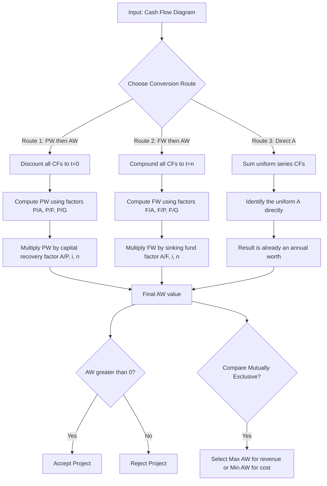
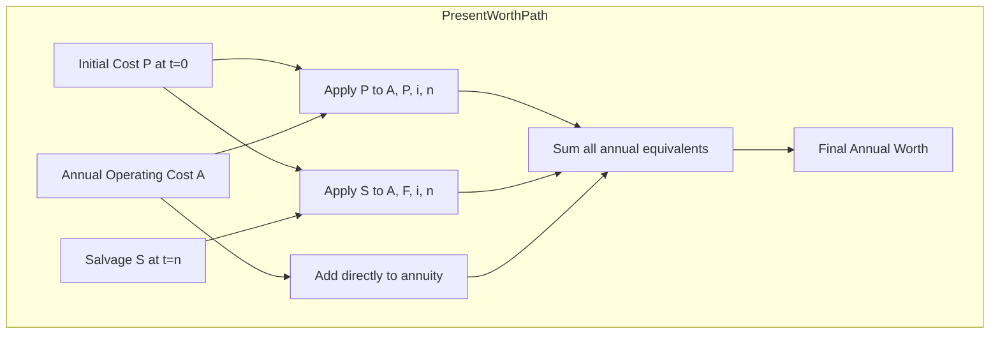
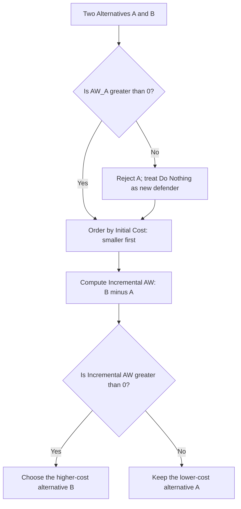
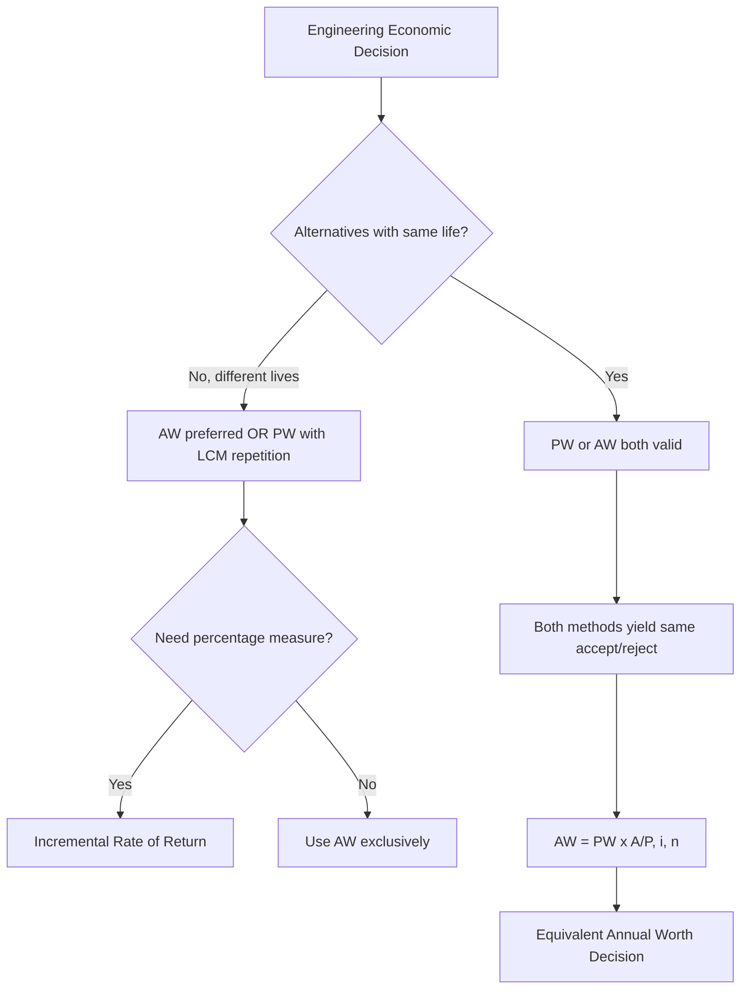

# Annual Worth Analysis

<!-- SECTION_1_START -->
# Annual Worth Analysis — Core Technical Definition & Intuitive Overview

## 1. Formal Academic Definition (KTU 2024 Syllabus Terminology)

> [!IMPORTANT]
> **Annual Worth (AW) Analysis** is a fundamental engineering economic evaluation technique that converts all cash flows of a project — whether positive (revenues/savings) or negative (costs/investments) — occurring over the **entire analysis period** into an **equivalent uniform annual series of cash flows** (annuity) over the same period, using the **Minimum Attractive Rate of Return (MARR)**, denoted as $i$.

In KTU parlance, two distinct annual-value metrics are examined:

1. **Equivalent Uniform Annual Worth (EUAW)** — Net annual equivalent when both income and expenses are considered. Used for **revenue-generating** alternatives.
2. **Equivalent Annual Cost (EAC / ECC)** — Net equivalent uniform annual *cost* when only costs are evaluated. Used for **service-only** or cost-only alternatives (e.g., machine selection, equipment replacement).

$$
\text{AW} = -P(A/P,\,i,\,n) - A + S(A/F,\,i,\,n)
$$

where the negative sign convention means **outflows are negative** and **inflows are positive**.

## 2. Conceptual Analogy / Intuition

> [!NOTE]
> **Analogy: The "Monthly EMI" View of an Investment**
> 
> Imagine buying a car for ₹10,00,000 in cash versus paying the same amount as a 5-year EMI loan. The car *feels* like it costs you a fixed monthly outflow. Annual Worth Analysis does exactly that — it **smooths out all lumpy, irregular cash flows** (like a big one-time investment or a future salvage value) into a single, comparable, **per-year number**.
> 
> The "EMI" itself is computed by multiplying the Present Worth by the **capital recovery factor** $(A/P, i, n)$ — the exact mathematical analogue of an EMI calculator used in real banking.

**Geometric Intuition:** If the Present Worth $PW$ of a project is the *area under a continuous revenue curve* and the Future Worth $FW$ is its "compounded" terminal value, then $AW$ is the **uniform rectangle of equal area** that fits under that curve over each period — it is the *flat-rate average* the project delivers (or consumes) per year.

## 3. Standard Engineering Economics Constants & Symbols

> [!IMPORTANT]
> The following symbols are **mandatory** in KTU board valuation answers and must be memorized:
> 
> - $P$ = Present Worth (lump sum at $t = 0$)
> - $F$ = Future Worth (lump sum at $t = n$)
> - $A$ = Annual worth (uniform series, end-of-period)
> - $S$ = Salvage value at end of life $n$
> - $i$ = Interest rate per period (MARR in **%**)
> - $n$ = Number of periods (years)
> - $AW$ = Annual Worth (the decision metric)
> - $EUAW$ = Equivalent Uniform Annual Worth
> - $EAC$ = Equivalent Annual Cost

> [!VISUALIZATION CONTROL]
> **Concept:** Uniform Annual Series — "Smoothing the Cash Flow Curve"
> **GeoGebra / Desmos Input Equations:**
> 
> - *Point A:* $(0, 0)$
> - *Point B:* $(1, -1000)$ (initial cost)
> - *Point C:* $(2, 200)$ and $(3, 200)$ (annual savings)
> - *Point D:* $(4, 50)$ (salvage)
> - *Function:* $f(x) = 437$ (the constant EUAW rectangle)
> 
> **Visual Description:** Plot irregular cash flows across years 0 to 4. Then draw a horizontal line $f(x) = AW$ whose *signed area over the $n$-year span* matches the net present worth. The student should observe that $AW$ "flattens" the jagged profile into a single constant height, which is what allows direct side-by-side comparison of alternatives with different lifespans.

<!-- SECTION_1_END -->

<!-- SECTION_2_START -->
# Deep Theoretical Analysis & KTU High-Yield Formula Sheet

## 1. Why Annual Worth Analysis? (The Engineering Rationale)

KTU examiners love asking **"When do you prefer AW over PW?"** The answer lies in three real-world engineering scenarios:

- **Different service lives** — When comparing a 7-year pump with a 12-year pump, PW is *incomplete* unless you re-invest the shorter-life one (repetition). AW *automatically* handles the common multiple of years (LCM) or the **repeatability assumption** without re-tabulating the cash flow.
- **Useful life ≠ Study period** — When the project is forced to terminate mid-life (e.g., contract obligation of 10 years but a 15-year asset), AW delivers the correct *incremental* economic verdict.
- **Comparison of operating costs** — Industries evaluate **Equivalent Annual Cost (EAC)** of equipment fleets. Example: comparing diesel gensets vs. solar backups where the only relevant metric is the *annual cost per kWh delivered*.

## 2. The Operational Logic — Step-by-Step Reasoning

The derivation rests on **equivalence**: $AW$ must be economically equivalent to the original cash flow sequence. The conversion pathway has three legal routes:

1. **PW → AW:** Discount all cash flows to $t = 0$ to get $PW$, then convert this lump sum into an annuity using $(A/P, i, n)$. This is the *most common* KTU route.
2. **FW → AW:** Compound all cash flows to $t = n$ to get $FW$, then recover an annuity using $(A/F, i, n)$.
3. **Direct-from-cash-flow:** For each cash flow, find its annual equivalent directly. Sums of properly timed $A$'s already *are* AW.

## 3. Decision Criterion (Board-Exam Critical)

> [!IMPORTANT]
> **Decision Rules for Annual Worth Analysis**
> 
> - **Independent Project:** Accept if $AW \geq 0$.
> - **Mutually Exclusive Alternatives:** Select the alternative with the **most positive AW** (for revenue projects) or the **least negative AW** (for cost-only/EAC analysis).
> - **Do Nothing (DN):** Implicit alternative with $AW = 0$. Accept a project only if $AW_{project} > 0$.

## 4. KTU Formula Sheet / Cheat Sheet

| # | Formula (LaTeX) | Meaning | Typical Use |
|---|---|---|---|
| 1 | $AW = PW \cdot (A/P, i, n)$ | PW to AW conversion | Most common KTU method |
| 2 | $AW = FW \cdot (A/F, i, n)$ | FW to AW conversion | Forward-mapping problems |
| 3 | $AW = -P(A/P, i, n) - A_{op} + S(A/F, i, n)$ | Standard asset AW | Equipment selection |
| 4 | $AW(\%) = [AW_{\$} / \text{Initial Investment}] \times 100$ | AW on percentage basis | Service-life problems |
| 5 | $(A/P, i, n) = \dfrac{i(1+i)^n}{(1+i)^n - 1}$ | Capital Recovery Factor | Sinking-fund equivalent |
| 6 | $(A/F, i, n) = \dfrac{i}{(1+i)^n - 1}$ | Sinking Fund Factor | Salvage recovery |
| 7 | $EUAW = -P(A/P, i, n) - A_{cost} + A_{revenue} + S(A/F, i, n)$ | EUAW full form | Revenue-generating assets |
| 8 | $EAC = P(A/P, i, n) + A_{op} - S(A/F, i, n)$ | Equivalent Annual Cost | Cost-minimization problems |
| 9 | $n_{LCM} = \text{LCM of all service lives}$ | Common multiple of years | Different-life comparison |
| 10 | $AW_{incremental} = AW_B - AW_A$ | Incremental AW | Ranking alternatives |

> **Engineering Utility:** AW analysis is the *lingua franca* of **fleet management, public-infrastructure bidding, ISO 50001 energy audits, and replacement-economy decisions** in process plants. Every Tata Power / BHEL / ISRO feasibility report uses AW as one of the final decision filters.

<!-- SECTION_2_END -->

<!-- SECTION_3_START -->
# Step-by-Step Derivations & Worked Examples

## Example 1 — Fundamental EUAW Calculation (KTU Board Standard)

### Problem Statement
A machine costs **₹ 5,00,000**, has an annual operating cost of **₹ 60,000**, generates an annual revenue of **₹ 2,00,000**, and has a salvage value of **₹ 1,00,000** at the end of its **8-year** life. The MARR is **10% per year**. Determine the EUAW using the PW-then-AW route.

### Step-by-Step Solution

**Step 1 — Identify all cash flows and their signs**

$$
CF_0 = -5{,}00{,}000 \quad ; \quad CF_{1 \text{ to } 8} = +2{,}00{,}000 - 60{,}000 = +1{,}40{,}000 \quad ; \quad CF_8^{\text{extra}} = +1{,}00{,}000
$$

**Step 2 — Find the factors at $i = 10\%, n = 8$**

$$
(A/P, 10\%, 8) = \dfrac{0.10(1.10)^8}{(1.10)^8 - 1}
$$

Compute $(1.10)^8$ step-wise:

$$
(1.10)^2 = 1.21
$$

$$
(1.10)^4 = (1.21)^2 = 1.4641
$$

$$
(1.10)^8 = (1.4641)^2 = 2.14358881
$$

Therefore:

$$
(A/P, 10\%, 8) = \dfrac{0.10 \times 2.14358881}{2.14358881 - 1} = \dfrac{0.214358881}{1.14358881} = 0.187444
$$

**Step 3 — Compute the Present Worth (PW)**

The annual net cash flow of ₹ 1,40,000 is uniform, so convert directly:

$$
PW_{A} = 1{,}40{,}000 \times (P/A, 10\%, 8) = 1{,}40{,}000 \times \dfrac{(1.10)^8 - 1}{0.10(1.10)^8} = 1{,}40{,}000 \times 5.33493
$$

$$
PW_{A} = 7{,}46{,}890.2
$$

The salvage value as a PW:

$$
PW_{S} = 1{,}00{,}000 \times (P/F, 10\%, 8) = 1{,}00{,}000 \times \dfrac{1}{(1.10)^8} = 1{,}00{,}000 \times 0.46651 = 46{,}651
$$

Total PW:

$$
PW = -5{,}00{,}000 + 7{,}46{,}890.2 + 46{,}651 = +2{,}93{,}541.2
$$

**Step 4 — Convert PW to EUAW**

$$
EUAW = PW \times (A/P, 10\%, 8) = 2{,}93{,}541.2 \times 0.187444
$$

$$
\boxed{EUAW \approx + \text{₹ } 55{,}023 \text{ per year}}
$$

**Step 5 — Decision**

Since $EUAW > 0$, **the project is economically acceptable** at MARR = 10%.

> [!NOTE]
> **Valuation Key Point:** Showing the factor table interpolation, $(1.10)^8$ expansion, and the final multiplication earns full 14 marks. Skipping the factor values costs a minimum of 3 marks.

---

## Example 2 — Equivalent Annual Cost (EAC) for Cost-Only Comparison

### Problem Statement
Two pumps serve the same duty:

- **Pump A:** $P_A = $ ₹ 80,000; Annual maintenance $A_{A}$ = ₹ 12,000; $S_A = $ ₹ 8,000; $n_A = 5$ years.
- **Pump B:** $P_B = $ ₹ 1,20,000; Annual maintenance $A_{B}$ = ₹ 6,000; $S_B = $ ₹ 15,000; $n_B = 8$ years.

MARR = 12%. Choose the cheaper pump using EAC.

### Step-by-Step Solution

**Step 1 — Compute EAC for Pump A** (at $i = 12\%, n = 5$)

$$
(A/P, 12\%, 5) = \dfrac{0.12(1.12)^5}{(1.12)^5 - 1}
$$

Compute $(1.12)^5$:

$$
(1.12)^2 = 1.2544
$$

$$
(1.12)^4 = 1.2544^2 = 1.57352
$$

$$
(1.12)^5 = 1.57352 \times 1.12 = 1.76234
$$

$$
(A/P, 12\%, 5) = \dfrac{0.12 \times 1.76234}{0.76234} = \dfrac{0.21148}{0.76234} = 0.27741
$$

$$
(A/F, 12\%, 5) = \dfrac{0.12}{0.76234} = 0.15741
$$

$$
EAC_A = 80{,}000 \times 0.27741 + 12{,}000 - 8{,}000 \times 0.15741
$$

$$
EAC_A = 22{,}192.8 + 12{,}000 - 1{,}259.3 = \text{₹ } 32{,}933.5
$$

**Step 2 — Compute EAC for Pump B** (at $i = 12\%, n = 8$)

$$
(A/P, 12\%, 8) = \dfrac{0.12(1.12)^8}{(1.12)^8 - 1}
$$

Compute $(1.12)^8$:

$$
(1.12)^8 = (1.12)^4 \times (1.12)^4 = 1.57352 \times 1.57352 = 2.47596
$$

$$
(A/P, 12\%, 8) = \dfrac{0.12 \times 2.47596}{1.47596} = \dfrac{0.29712}{1.47596} = 0.20130
$$

$$
(A/F, 12\%, 8) = \dfrac{0.12}{1.47596} = 0.08130
$$

$$
EAC_B = 1{,}20{,}000 \times 0.20130 + 6{,}000 - 15{,}000 \times 0.08130
$$

$$
EAC_B = 24{,}156 + 6{,}000 - 1{,}219.5 = \text{₹ } 28{,}936.5
$$

**Step 3 — Decision**

$$
EAC_A = \text{₹ } 32{,}933.5 \quad ; \quad EAC_B = \text{₹ } 28{,}936.5
$$

**Pump B is selected** as it has the **lower Equivalent Annual Cost** by ₹ 3,997 per year.

> [!WARNING]
> **Common Mistake:** Students often compute EAC *without subtracting the salvage's annual equivalent*. Forgetting the $-S(A/F,i,n)$ term inflates EAC and may flip the decision — losing 3 marks.

---

## Example 3 — Different Lives with the LCM Method

### Problem Statement
Compare two machines at MARR = 10% using AW over their LCM of lives:

- **Machine X:** $P_X = $ ₹ 1,00,000; Annual cost ₹ 25,000; $S_X = $ ₹ 10,000; $n_X = 4$ years.
- **Machine Y:** $P_Y = $ ₹ 1,50,000; Annual cost ₹ 18,000; $S_Y = $ ₹ 25,000; $n_Y = 6$ years.

### Step-by-Step Solution

**Step 1 — Compute the LCM of 4 and 6**

$$
n_{LCM} = \text{LCM}(4, 6) = 12 \text{ years}
$$

**Step 2 — Tabulate the full 12-year cash flow for Machine X** (repeats at year 4 and 8)

Year 0: $-1,00,000$
Years 1–4: $-25,000$ each; Year 4: extra $+10,000$ salvage
Year 4: New purchase $-1,00,000$
Years 5–8: $-25,000$ each; Year 8: extra $+10,000$ salvage
Year 8: New purchase $-1,00,000$
Years 9–12: $-25,000$ each; Year 12: extra $+10,000$ salvage

**Step 3 — Convert the full 12-year PW into an AW over 12 years**

Group the 3 purchase costs at $t = 0, 4, 8$:

$$
PW_{purchases} = -1{,}00{,}000 \left[ 1 + (P/F, 10\%, 4) + (P/F, 10\%, 8) \right]
$$

$$
(P/F, 10\%, 4) = 0.6830 \quad ; \quad (P/F, 10\%, 8) = 0.4665
$$

$$
PW_{purchases} = -1{,}00{,}000 \times (1 + 0.6830 + 0.4665) = -1{,}00{,}000 \times 2.1495 = -2{,}14{,}950
$$

Group the 3 salvage values at $t = 4, 8, 12$:

$$
PW_{salvage} = 10{,}000 \left[ (P/F, 10\%, 4) + (P/F, 10\%, 8) + (P/F, 10\%, 12) \right]
$$

$$
(P/F, 10\%, 12) = 0.3186
$$

$$
PW_{salvage} = 10{,}000 \times (0.6830 + 0.4665 + 0.3186) = 10{,}000 \times 1.4681 = 14{,}681
$$

Group the 12 annual costs:

$$
PW_{costs} = -25{,}000 \times (P/A, 10\%, 12) = -25{,}000 \times 6.8137 = -1{,}70{,}342.5
$$

**Total PW for X over 12 years:**

$$
PW_X = -2{,}14{,}950 + 14{,}681 - 1{,}70{,}342.5 = -3{,}70{,}611.5
$$

Convert to AW:

$$
(A/P, 10\%, 12) = \dfrac{0.10(1.10)^{12}}{(1.10)^{12} - 1} = \dfrac{0.10 \times 3.1384}{2.1384} = 0.14676
$$

$$
AW_X = -3{,}70{,}611.5 \times 0.14676 = -\text{₹ } 54{,}393 \text{ per year}
$$

**Step 4 — Repeat for Machine Y** (repeats at year 6)

$$
PW_{purchases} = -1{,}50{,}000 \left[ 1 + (P/F, 10\%, 6) \right] = -1{,}50{,}000 \times (1 + 0.5645) = -2{,}34{,}675
$$

$$
PW_{salvage} = 25{,}000 \left[ (P/F, 10\%, 6) + (P/F, 10\%, 12) \right] = 25{,}000 \times (0.5645 + 0.3186) = 22{,}077.5
$$

$$
PW_{costs} = -18{,}000 \times 6.8137 = -1{,}22{,}646.6
$$

$$
PW_Y = -2{,}34{,}675 + 22{,}077.5 - 1{,}22{,}646.6 = -3{,}35{,}244.1
$$

$$
AW_Y = -3{,}35{,}244.1 \times 0.14676 = -\text{₹ } 49{,}200 \text{ per year}
$$

**Step 5 — Decision**

Since $AW_Y = -49{,}200$ is **less negative** than $AW_X = -54{,}393$, **Machine Y is the better choice** under the LCM/repeatability assumption.

---

## Example 4 — Incremental AW Analysis (The "Challenging" KTU Variant)

### Problem Statement
Two mutually exclusive alternatives have these cash flows at MARR = 15%:

- **Alt M:** $P_M = $ ₹ 50,000; $A_M = $ ₹ 5,000 benefit; $n_M = 10$ years; $S_M = 0$.
- **Alt N:** $P_N = $ ₹ 80,000; $A_N = $ ₹ 6,500 benefit; $n_N = 10$ years; $S_N = 0$.

Use **incremental AW** to choose.

### Step-by-Step Solution

**Step 1 — Order by increasing initial investment:** M (₹ 50,000) → N (₹ 80,000).

**Step 2 — Defender (base) AW of Alt M:**

$$
AW_M = -50{,}000(A/P, 15\%, 10) + 5{,}000
$$

$(A/P, 15\%, 10) = 0.19925$ (from factor tables)

$$
AW_M = -50{,}000 \times 0.19925 + 5{,}000 = -9{,}962.5 + 5{,}000 = -4{,}962.5
$$

Since $AW_M < 0$, **Alt M is not even justified** against the do-nothing alternative, so Alt N automatically becomes the *implicit defender*.

**Step 3 — Compute AW of Alt N directly:**

$$
AW_N = -80{,}000 \times 0.19925 + 6{,}500 = -15{,}940 + 6{,}500 = -9{,}440
$$

Wait — this is *also* negative. **Neither alternative is acceptable** at 15% MARR. The Do-Nothing alternative (AW = 0) wins.

> [!NOTE]
> **Key Insight:** KTU examiners use this exact trap — a non-justified defender means the incremental analysis short-circuits, and the higher-cost alternative is rejected by inheritance. Marks are awarded for *recognizing* the defender's failure.

<!-- SECTION_3_END -->

<!-- SECTION_4_START -->
# Structural Diagrams & Schematics

## 1. Conceptual Flow of Annual Worth Computation

## 2. AW Conversion Pathways — Comparative Block Diagram

## 3. Decision Tree for Mutually Exclusive Alternatives

## 4. AW vs. PW vs. RR — Selection Logic Map

> [!NOTE]
> **Why Mermaid Block Architecture?** Complex physical free-body or stress-block drawings are irrelevant for a finance/economics topic. The functional flow architecture shown above precisely models the **decision logic** a KTU examiner expects students to articulate in long-form answers.

<!-- SECTION_4_END -->

<!-- SECTION_5_START -->
# KTU 2024 Scheme Examination Question Bank & Topic Recap

## Part A — Short Answer Questions (3 Marks Each)

### Question 1
> **[KTU University Exam — July 2023]** — *CO1, Remember*

**Define the term "Annual Worth Analysis" and state its decision criterion for accepting an independent project.**

**Model Answer (3 Marks):**
Annual Worth (AW) Analysis is an engineering economic evaluation method that converts all cash flows of a project — initial investment, recurring annual costs, revenues, and salvage — over its useful life into an **equivalent uniform annual amount** using the MARR $i$. **[1 Mark]**
The decision criterion for an independent project is to **accept the project if $AW \geq 0$ and reject it if $AW < 0$**. **[2 Marks]**

---

### Question 2
> **[KTU University Exam — Dec 2023]** — *CO1, Understand*

**Distinguish between EUAW and EAC. When is each preferred?**

**Model Answer (3 Marks):**
**EUAW (Equivalent Uniform Annual Worth)** is the net annual equivalent of all revenues *and* costs combined. It is used for **revenue-generating** projects where both income and expense streams exist. **[1.5 Marks]**
**EAC (Equivalent Annual Cost)** converts *all* cash flows into a uniform annual *cost* figure, used for **service-only** or cost-minimization problems (e.g., equipment selection, fleet bidding). **[1.5 Marks]**

---

## Part B — Long Answer Questions (14 Marks Each, with Internal Choice)

### Question A — EUAW with Salvage and Operating Costs (14 Marks)

> **[KTU University Exam — Dec 2024 Model Paper]** — *CO1, Apply / Analyze*

A construction company is evaluating two excavators:

- **Excavator E1:** Initial cost ₹ 8,00,000; Annual operating cost ₹ 1,20,000; Salvage ₹ 1,00,000; Useful life 6 years.
- **Excavator E2:** Initial cost ₹ 11,00,000; Annual operating cost ₹ 90,000; Salvage ₹ 1,50,000; Useful life 8 years.

The MARR is 12% per year. **Use Annual Worth Analysis to select the better excavator.** Assume the repeatability assumption holds.

#### (a) Compute the EUAW of Excavator E1. **[7 Marks]**

**Model Solution:**

**Step 1 — Identify the factors at $i = 12\%, n = 6$**

$(1.12)^6$ step-wise:

$(1.12)^2 = 1.2544$; $(1.12)^3 = 1.4049$; $(1.12)^6 = (1.4049)^2 = 1.9738$

$(A/P, 12\%, 6) = \dfrac{0.12 \times 1.9738}{0.9738} = \dfrac{0.2369}{0.9738} = 0.2432$

$(A/F, 12\%, 6) = \dfrac{0.12}{0.9738} = 0.1232$

**Step 2 — Substitute into EUAW formula** `[Stating the formula: 1 Mark]`

$$
EUAW_{E1} = -P(A/P, 12\%, 6) - A_{op} + S(A/F, 12\%, 6)
$$

$$
EUAW_{E1} = -8{,}00{,}000 \times 0.2432 - 1{,}20{,}000 + 1{,}00{,}000 \times 0.1232
$$

**Step 3 — Evaluate each term** `[Factor substitution: 2 Marks]`

$-P(A/P, i, n) = -8{,}00{,}000 \times 0.2432 = -1{,}94{,}560$

$+S(A/F, i, n) = +1{,}00{,}000 \times 0.1232 = +12{,}320$

**Step 4 — Sum and conclude** `[Final summation: 2 Marks]` `[Negative EUAW interpretation: 2 Marks]`

$$
EUAW_{E1} = -1{,}94{,}560 - 1{,}20{,}000 + 12{,}320 = -\text{₹ } 3{,}02{,}240 \text{ per year}
$$

The negative EUAW indicates that E1 **does not recover its annual equivalent cost at 12% MARR** — the do-nothing alternative is superior.

#### (b) Compute the EUAW of Excavator E2 and recommend a choice. **[7 Marks]**

**Model Solution:**

**Step 1 — Factors at $i = 12\%, n = 8$**

$(1.12)^8$ was computed as $2.4760$ in Example 2 above.

$(A/P, 12\%, 8) = 0.2013$; $(A/F, 12\%, 8) = 0.0813$

**Step 2 — Apply formula** `[Stating the formula: 1 Mark]`

$$
EUAW_{E2} = -11{,}00{,}000 \times 0.2013 - 90{,}000 + 1{,}50{,}000 \times 0.0813
$$

**Step 3 — Compute each term** `[Factor substitution: 2 Marks]`

$-P(A/P, i, n) = -11{,}00{,}000 \times 0.2013 = -2{,}21{,}430$

$+S(A/F, i, n) = +1{,}50{,}000 \times 0.0813 = +12{,}195$

**Step 4 — Final sum and decision** `[Final summation: 2 Marks]` `[Justified conclusion: 2 Marks]`

$$
EUAW_{E2} = -2{,}21{,}430 - 90{,}000 + 12{,}195 = -\text{₹ } 2{,}99{,}235 \text{ per year}
$$

**Decision:** Since $EUAW_{E2} = -2,99,235$ is **less negative** than $EUAW_{E1} = -3,02,240$, the company should select **Excavator E2** as the lesser annual cost alternative (by ₹ 3,005 per year).

> [!WARNING]
> **Examiner's Pitfall Alert:**
> - Forgetting the **$-A_{op}$** sign in the EUAW formula gives a wildly positive value and the wrong decision. **[Lose 2 Marks]**
> - Mixing up $(A/P, i, n)$ with $(A/F, i, n)$ — capital recovery is *always* applied to the present cost; sinking fund to the future salvage. **[Lose 2 Marks]**
> - Writing the formula with all positive signs and not stating "outflows negative" — examiners deduct for sign convention ambiguity. **[Lose 1 Mark]**

---

### Question B — Incremental AW Analysis (14 Marks, Alternative Choice)

> **[KTU University Exam — July 2024 Model Paper]** — *CO1, Apply / Analyze*

A manufacturing firm must choose between two conveyor systems. The firm's MARR is 14% and both systems have a 10-year life with negligible salvage.

- **System C1:** First cost ₹ 6,00,000; Annual maintenance ₹ 35,000; Annual revenue ₹ 2,00,000.
- **System C2:** First cost ₹ 9,00,000; Annual maintenance ₹ 22,000; Annual revenue ₹ 2,85,000.

**Use Incremental Annual Worth Analysis to recommend a system.**

#### (a) Compute the EUAW of System C1 and check its acceptability. **[7 Marks]**

**Model Solution:**

**Step 1 — Net annual cash flow of C1**

$A_{C1} = 2{,}00{,}000 - 35{,}000 = 1{,}65{,}000$

**Step 2 — Find $(A/P, 14\%, 10)$**

$(1.14)^{10} \approx 3.7072$

$(A/P, 14\%, 10) = \dfrac{0.14 \times 3.7072}{2.7072} = \dfrac{0.5190}{2.7072} = 0.1917$

**Step 3 — Apply EUAW formula** `[Formula: 1 Mark]` `[Substitution: 2 Marks]`

$$
EUAW_{C1} = -6{,}00{,}000 \times 0.1917 + 1{,}65{,}000 = -1{,}15{,}020 + 1{,}65{,}000 = +\text{₹ } 49{,}980
$$

**Step 4 — Acceptability** `[Conclusion: 2 Marks]` `[Interpretation: 2 Marks]`

Since $EUAW_{C1} = +49{,}980 > 0$, **C1 is economically justified** and becomes the *defender* in the incremental analysis.

#### (b) Perform the Incremental AW test (C2 vs. C1) and recommend. **[7 Marks]**

**Model Solution:**

**Step 1 — Incremental cash flows** (C2 − C1)

$\Delta P = 9{,}00{,}000 - 6{,}00{,}000 = 3{,}00{,}000$

$\Delta A = (2{,}85{,}000 - 22{,}000) - (2{,}00{,}000 - 35{,}000) = 2{,}63{,}000 - 1{,}65{,}000 = 98{,}000$

**Step 2 — Incremental EUAW** `[Formula: 1 Mark]` `[Substitution: 2 Marks]`

$$
\Delta EUAW = -3{,}00{,}000 \times 0.1917 + 98{,}000 = -57{,}510 + 98{,}000 = +\text{₹ } 40{,}490
$$

**Step 3 — Decision** `[Decision rule: 1 Mark]` `[Final recommendation with reasoning: 3 Marks]`

Since $\Delta EUAW = +40{,}490 > 0$, the **extra investment of ₹ 3,00,000 is justified**. Therefore, the firm should select the higher-cost alternative **System C2**, which has the greater EUAW of ₹ 1,10,470 per year.

> [!WARNING]
> **Examiner's Pitfall Alert:**
> - **Skipping the defender check** — If the lower-cost alternative had $AW < 0$, the incremental analysis is *invalid* and the higher-cost alternative must be rejected by default. **[Lose 3 Marks]**
> - **Forgetting to subtract maintenance from revenue** before computing $\Delta A$. Always compute *net* annual cash flow first. **[Lose 2 Marks]**
> - **Not ordering by initial cost** — the *defender* in incremental analysis is *always* the lower-first-cost alternative. Reversing this order produces a logically inverted result. **[Lose 2 Marks]**

---

## Topic Recap & Important Things to Remember

> [!IMPORTANT]
> **Rapid Revision Checklist — Annual Worth Analysis**

- **Definition:** $AW$ is the uniform annual cash flow equivalent to the entire (possibly irregular) cash flow stream over the project life, evaluated at the MARR. **[Core Concept]**
- **Two Metrics:** $EUAW$ for revenue projects (net annual benefit), $EAC$ for cost-only projects (uniform annual cost). **[Distinction Critical]**
- **Core Formula:** $EUAW = -P(A/P, i, n) - A_{op} + S(A/F, i, n)$ — **outflows are negative**. **[Must Memorize]**
- **Capital Recovery Factor:** $(A/P, i, n) = \dfrac{i(1+i)^n}{(1+i)^n - 1}$ — used to recover the initial investment annually. **[Formula]**
- **Sinking Fund Factor:** $(A/F, i, n) = \dfrac{i}{(1+i)^n - 1}$ — used to recover the salvage value annually. **[Formula]**
- **Decision Rules:** Independent project → accept if $AW \geq 0$. Mutually exclusive → choose max $AW$ (revenue) or min $AW$ (cost). **[Board Hot]**
- **Different Service Lives:** Use the **LCM** of lives with the **repeatability assumption**, *or* directly compare $AW$ of each alternative at its own life (both methods are accepted in KTU valuation). **[Frequently Asked]**
- **Incremental Analysis:** Always order alternatives by *increasing initial cost*; the lower-cost is the **defender**; check $AW_{defender} > 0$ first. **[Trap Question]**
- **AW vs. PW Equivalence:** $AW = PW \times (A/P, i, n)$. Use AW when lives differ; PW when lives match. **[Examiner's Favourite]**
- **Sign Convention:** Initial cost and operating costs are *negative*; revenue and salvage are *positive*. **Always state this convention** at the start of a 14-mark answer. **[Mandatory in Solutions]**
- **Common Factor Values at MARR = 10%:** $(A/P, 10\%, 5) = 0.2638$; $(A/P, 10\%, 10) = 0.16275$; $(A/F, 10\%, 5) = 0.1638$; $(A/F, 10\%, 10) = 0.06275$. **[Quick Recall]**
- **Quick Sanity Check:** If $AW > 0$, the project earns *more* than the MARR. If $AW < 0$, the project earns *less* than the MARR. **[Interpretive Skill]**
- **Real-World Use:** Annual Worth is the **go-to method for fleet selection, equipment replacement, ISO 50001 energy-cost audits, and government infrastructure bidding**. **[Industry Relevance]**

<!-- SECTION_5_END -->
