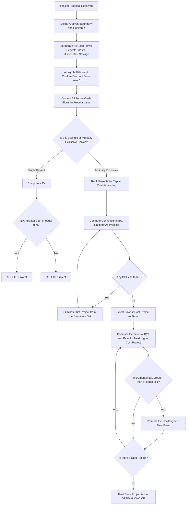
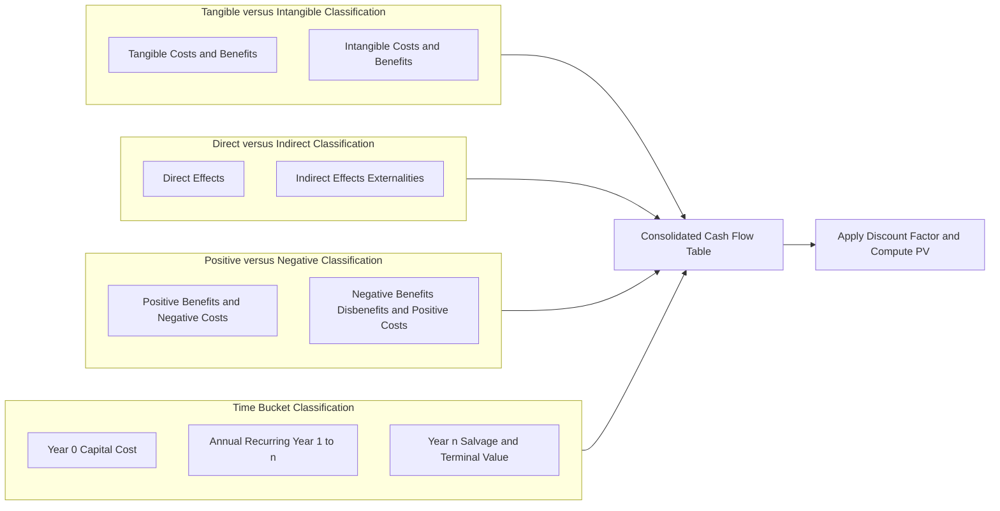
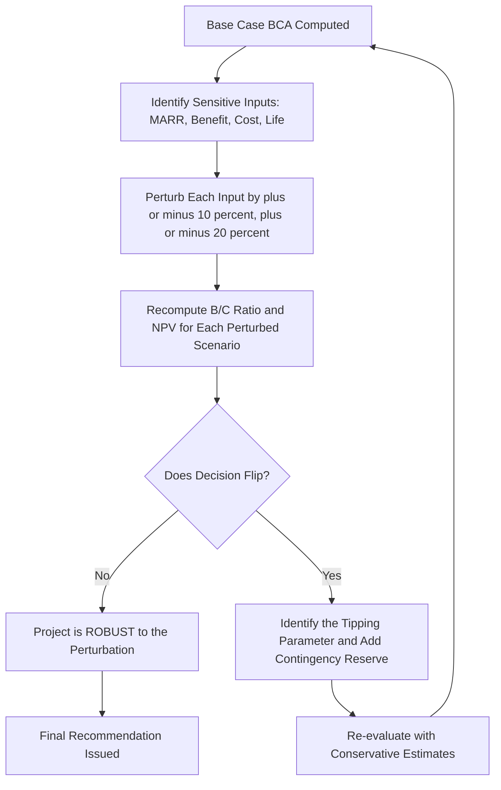
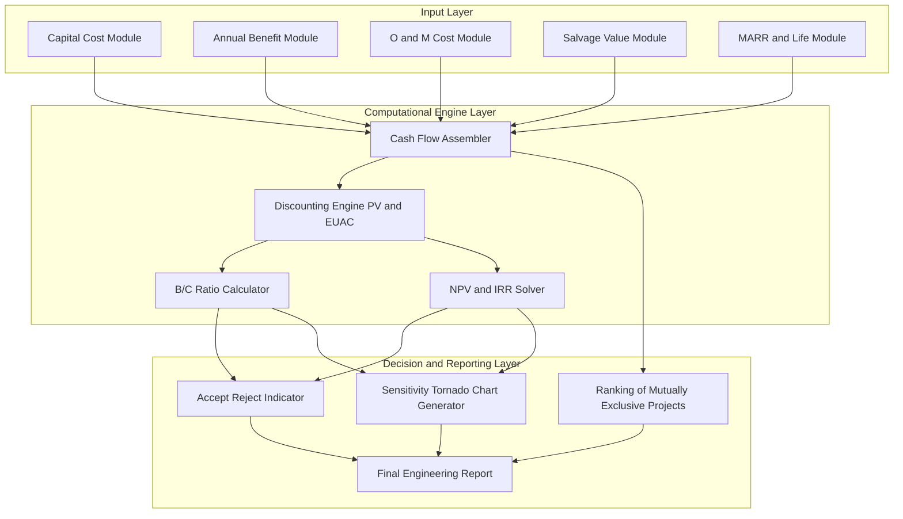

# Benefit-Cost Analysis

<!-- SECTION_1_START -->

# Benefit-Cost Analysis — Core Technical Definition & Intuitive Overview

## 1.1 Formal Academic Definition (KTU 2024 Syllabus Terminology)

> [!IMPORTANT]
> **Benefit-Cost Analysis (BCA)** is a systematic, quantitative engineering economic evaluation technique used to determine the **economic feasibility, desirability, and net social welfare impact** of a proposed engineering project, public investment, or policy alternative by translating all tangible and intangible consequences into a common monetary metric, **discounting** them to a uniform **Present Value (PV)**, and then comparing the aggregated benefits against the aggregated costs using a set of standardized decision criteria.

In KTU 2024 scheme parlance, Benefit-Cost Analysis is positioned within the broader framework of **Capital Budgeting under Uncertainty** and is treated as a **multi-criteria decision-support tool** that engineers apply during the *Feasibility Study* and *Project Appraisal* phases of the project life cycle.

The principal evaluative criteria taught under Module 2 are:

- **Benefit-Cost Ratio (B/C Ratio or BCR)**
- **Net Present Value (NPV)** — also called Net Benefit in the BCA context
- **Equivalent Uniform Annual Cost (EUAC) / Equivalent Uniform Annual Benefit (EUAB)**
- **Modified Benefit-Cost Ratio**
- **Internal Rate of Return (IRR)** — used as a cross-check

The universally accepted acceptance rule in KTU board valuation is:

$$\text{Accept the project if } B/C \geq 1 \quad \text{(equivalently, } NPV \geq 0\text{)}$$

> [!NOTE]
> **Syllabus Highlight (UHSUT300 — Module 2):** Benefit-Cost Analysis is one of the **highest-weightage topics** in KTU ESE papers. It is typically clubbed with Time Value of Money, Replacement Analysis, and Depreciation. The 2024 scheme places strong emphasis on **calculating the B/C Ratio under different cost-benefit classifications** (Conventional, Modified, and Net).

---

## 1.2 Conceptual Analogy & Engineering Intuition

Imagine you are deciding whether to install a **solar rooftop plant** in your college campus.

- You will spend **money today** (₹15,00,000) on panels, inverters, and wiring — these are *costs*.
- For the next **25 years**, you will *save* money on electricity bills — these are *benefits*.
- But a rupee saved in the year 2040 is **not** worth a rupee spent in 2025, because of inflation, risk, and the time value of money.

**Benefit-Cost Analysis answers the question:** *“After accounting for the fact that money loses value over time, do the lifetime savings justify the lifetime investment?”*

> [!TIP]
> **Intuitive Rule of Thumb:** Think of BCA as a **financial weighing balance** where the *left pan* holds all discounted inflows (benefits) and the *right pan* holds all discounted outflows (costs). If the left pan tips, the project is **economically justified**.

### Real-World Engineering Applications

| Domain | Application of BCA |
|---|---|
| **Civil Engineering** | Highway construction, dam projects, metro rail corridors |
| **Environmental Engg.** | Pollution control equipment, effluent treatment plants |
| **Electrical Engg.** | Renewable energy installations, smart-grid upgrades |
| **Mechanical Engg.** | CNC machine purchase, factory automation decisions |
| **Public Policy** | Healthcare schemes, rural electrification (Deendayal Upadhyaya Gram Jyoti Yojana) |

> [!IMPORTANT]
> **Critical Constant for KTU 2024:** The Minimum Attractive Rate of Return (**MARR**), also called the *discount rate* or *social opportunity cost of capital*, is the single most important input. MARR is typically assumed to be **10%–15%** in KTU numerical problems unless explicitly stated otherwise. **Always declare MARR before solving.**

---

## 1.3 Classification of Costs and Benefits (KTU Conceptual Foundation)

> [!NOTE]
> A frequently tested 3-mark question in KTU ESE: *"Classify costs and benefits in a Benefit-Cost Analysis."* This is the conceptual backbone of the topic.

**A. Tangible vs. Intangible**

- **Tangible**: Measurable in money (e.g., toll revenue, fuel savings).
- **Intangible**: Real but not easily monetized (e.g., aesthetic value, noise reduction). These are often listed in a *shadow price* table.

**B. Direct vs. Indirect**

- **Direct**: Immediacy is obvious (e.g., labor cost in dam construction).
- **Indirect (Externalities)**: Secondary effects (e.g., displacement of villages, downstream waterlogging).

**C. Positive vs. Negative**

- **Positive Benefits**: Savings, revenues, employment generation.
- **Negative Benefits (Disbenefits)**: Pollution, accidents, social disruption.

**D. The Crucial BCA Sub-Classification**

| Category | Definition | Counts in |
|---|---|---|
| **Capital Cost (First Cost)** | Initial investment at $n=0$ | Numerator/Denominator |
| **O&M Cost (Operating & Maintenance)** | Annual recurring costs | Denominator |
| **Salvage Value** | End-of-life recovery | Reduces Cost |
| **Annual Benefits (Revenue/Savings)** | Yearly inflows | Numerator |
| **Disbenefits** | Negative by-products | Subtract from Benefits |

> [!VISUALIZATION CONTROL]
> **Concept:** Weighted Decision Balance — B/C Ratio Visualization
> **GeoGebra / Desmos Input Equations:**
> * $f(x) = 1$ (a horizontal reference line representing the *break-even* threshold)
> * $g(x) = B/C$ (a constant function whose height represents the project’s ratio)
>
> **Visual Description:** Plot the constant $B/C$ value as a horizontal line. The threshold $f(x)=1$ acts as a **decision axis** — if the line $g(x)$ lies **above** $f(x)$, the project is *accepted*; if it lies **below**, the project is *rejected*; if it coincides, the project is at the *indifference point*.

---

<!-- SECTION_1_END -->

<!-- SECTION_2_START -->

# Deep Theoretical Analysis & KTU High-Yield Formula Sheet

## 2.1 The Conceptual Logic of Benefit-Cost Analysis

The decision pipeline of BCA is built on **six logical steps**. Each step is a potential KTU 3-mark or short-answer question.

1. **Define the Project Boundary & Analysis Horizon** — what is included, over how many years $n$.
2. **Enumerate All Costs and Benefits** — capital, O&M, salvage, revenues, disbenefits.
3. **Choose the Discount Rate (MARR)** — based on opportunity cost of capital.
4. **Convert All Cash Flows to a Common Time Base** — usually Present Value at year 0, or EUAB/EUAC.
5. **Apply the Decision Criteria** — NPV, B/C Ratio, Modified B/C, or IRR.
6. **Perform Sensitivity Analysis** — vary MARR, life, and benefit estimates to test robustness.

> [!IMPORTANT]
> **The Three Pillars of BCA — Why They Co-exist:**
> The KTU 2024 syllabus treats **NPV**, **B/C Ratio**, and **IRR** as *complementary* tools, not substitutes.
>
> - **NPV** gives *absolute* worth (rupees of net gain).
> - **B/C Ratio** gives *relative* efficiency (rupees of benefit per rupee of cost).
> - **IRR** gives the *break-even* discount rate.
>
> In **mutually exclusive** project selection (the classic KTU 14-mark problem), the **B/C Ratio method is preferred** because it allows fair comparison of projects with different investment scales.

---

## 2.2 The KTU High-Yield Formula Sheet

> [!NOTE]
> The following table is the **single most important study artifact** for this topic. Memorize the third column — the acceptance rule — because KTU valuation keys explicitly test whether the student states it.

### 2.2.1 Present Value Conversion Factors (Annuity)

| Symbol | Name | Formula | Used For |
|---|---|---|---|
| $(P/A, i, n)$ | Present Worth of Annuity | $\dfrac{(1+i)^{n}-1}{i(1+i)^{n}}$ | Converting equal annual amounts to PV |
| $(A/P, i, n)$ | Capital Recovery | $\dfrac{i(1+i)^{n}}{(1+i)^{n}-1}$ | Converting PV to equal annual amounts |
| $(P/F, i, n)$ | Present Worth of Future | $(1+i)^{-n}$ | Lumping a single future amount to year 0 |
| $(F/P, i, n)$ | Future Worth of Present | $(1+i)^{n}$ | Lumping a single present amount to year $n$ |

> [!WARNING]
> **Pipe-Symbol Safety Note:** In KTU answer sheets, avoid writing absolute values as $\vert x \vert$ inside tables. Use the word *"mod-x"* or LaTeX \mid if typed digitally.

### 2.2.2 The Master BCA Decision Table

| Criterion | Formula | Acceptance Rule | When Used in KTU |
|---|---|---|---|
| **Conventional B/C Ratio** | $B/C = \dfrac{PV(\text{Benefits})}{PV(\text{Costs})}$ | Accept if $B/C \geq 1$ | Symmetric cash flow classification |
| **Modified B/C Ratio** | $B/C_{mod} = \dfrac{PV(\text{Benefits}) - PV(\text{O\&M})}{PV(\text{Capital Costs})}$ | Accept if $B/C_{mod} \geq 1$ | Asymmetric cost-benefit pairs |
| **Net B/C Ratio** | $B/C_{net} = \dfrac{PV(\text{Benefits}) - PV(\text{Disbenefits})}{PV(\text{Costs})}$ | Accept if $B/C_{net} \geq 1$ | When disbenefits are significant |
| **Net Present Value (NPV)** | $NPV = PV(\text{Benefits}) - PV(\text{Costs})$ | Accept if $NPV \geq 0$ | Single project feasibility |
| **Net Equivalent Uniform Annual Worth** | $NEUAW = EUAB - EUAC$ | Accept if $NEUAW \geq 0$ | Comparing different-life alternatives |
| **Internal Rate of Return (IRR)** | Discount rate $i^{*}$ where $NPV(i^{*}) = 0$ | Accept if $IRR \geq MARR$ | When MARR is uncertain |

### 2.2.3 The Fundamental Discounting Identity

All BCA decisions rest on this single equation, where every cash flow $C_t$ occurring at the end of year $t$ is converted to its time-zero equivalent:

$$
PV = \sum_{t=0}^{n} \frac{C_t}{(1+i)^{t}}
$$

For a uniform series of benefit $B$ for $n$ years and a single capital cost $C_0$ at year 0, the B/C ratio simplifies to:

$$
B/C = \frac{B \cdot (P/A, i, n)}{C_0}
$$

---

## 2.3 Engineering Utility of BCA in Production Systems

In real engineering practice, BCA is rarely used in isolation. It is integrated into:

- **Levelized Cost of Energy (LCOE)** calculations for solar and wind power.
- **Cost-Effectiveness Analysis (CEA)** in pharmaceutical engineering for choosing between two drug delivery mechanisms.
- **Total Cost of Ownership (TCO)** models in IT and manufacturing automation.
- **Cost-Benefit-Opportunity (CBO)** frameworks in Six Sigma and Lean projects.
- **Public-Private Partnership (PPP) appraisal** in highway and metro rail projects — where BCA is mandated by the Ministry of Finance, Government of India.

> [!TIP]
> **Industry Insight:** Most Indian government tenders (NHAI, JNNSM, Smart Cities Mission) require a **B/C Ratio ≥ 1.2** for a project to qualify for viability gap funding. This threshold of **20% margin above unity** is a common KTU ESE trick question.

---

## 2.4 Decision Logic for Mutually Exclusive vs. Independent Projects

> [!NOTE]
> KTU ESE 2024 has a high probability of asking: *"Why can't we rank mutually exclusive projects by B/C Ratio alone?"*

The answer lies in the **incremental B/C Ratio analysis**:

- For **independent projects** → accept all projects with $B/C \geq 1$.
- For **mutually exclusive projects** → rank by capital cost, then evaluate the *incremental* B/C ratio of each more-expensive option over the next cheaper one. Accept the increment only if $\Delta B/C \geq 1$.

This logic is identical in spirit to **incremental rate of return** analysis.

---

<!-- SECTION_2_END -->

<!-- SECTION_3_START -->

# Step-by-Step Derivations & Symbolic Implementation

> [!IMPORTANT]
> **Exhaustive-Content Mandate Active.** Every algebraic step, every cash flow, every table cell, and every decision rule is written out fully. No truncation, no “similarly we can find”, no “proceeding as above”.

---

## 3.1 Illustrative KTU-Style Numerical Problem (Worked End-to-End)

### Problem Statement

> A state government is evaluating two alternative flood-control projects — **Project A (Levee Construction)** and **Project B (Reservoir Construction)**. The pre-construction capital costs are ₹3,50,000 for Project A and ₹6,00,000 for Project B. The annual benefits (in the form of avoided flood damage) are estimated to be ₹70,000 for Project A and ₹1,05,000 for Project B. Annual Operating & Maintenance costs are ₹15,000 for A and ₹25,000 for B. Both projects have a useful life of **20 years** with negligible salvage value. The MARR is **10%** per annum. Using **Conventional Benefit-Cost Ratio analysis**, recommend the economically justified project.

### Step 1 — Tabulate the Given Data

| Parameter | Project A (Levee) | Project B (Reservoir) |
|---|---|---|
| Capital Cost $C_0$ (₹) | 3,50,000 | 6,00,000 |
| Annual Benefits $B$ (₹/yr) | 70,000 | 1,05,000 |
| Annual O&M Cost $OM$ (₹/yr) | 15,000 | 25,000 |
| Net Annual Benefit $NB$ (₹/yr) | 55,000 | 80,000 |
| Life $n$ (years) | 20 | 20 |
| Salvage Value $SV$ (₹) | 0 | 0 |
| MARR $i$ (%) | 10 | 10 |

> **Valuation Note (2 Marks):** Explicitly tabulating the given data with units is awarded the first 2 marks in a KTU 14-mark question.

### Step 2 — Compute the Present Worth Factor $(P/A, 10\%, 20)$

Apply the standard present-worth-of-annuity formula:

$$
(P/A, i, n) = \frac{(1+i)^{n}-1}{i(1+i)^{n}}
$$

Substitute $i = 0.10$ and $n = 20$:

$$
(1+i)^{n} = (1.10)^{20}
$$

We compute the powers step by step:

- $(1.10)^{2} = 1.21$
- $(1.10)^{4} = 1.21^{2} = 1.4641$
- $(1.10)^{5} = 1.4641 \times 1.10 = 1.61051$
- $(1.10)^{10} = 1.61051^{2} = 2.59374$
- $(1.10)^{20} = 2.59374^{2} = 6.72750$

Therefore:

$$
(P/A, 10\%, 20) = \frac{6.72750 - 1}{0.10 \times 6.72750}
$$

$$
(P/A, 10\%, 20) = \frac{5.72750}{0.672750} = 8.5136
$$

> **Valuation Note (1 Mark):** Showing the substitution into the standard factor formula gets 1 mark. The computed numerical value **8.514** (rounded to 3 decimals) gets another 1 mark.

### Step 3 — Compute the Present Worth of Annual Benefits (Project A)

$$
PV(B_A) = B_A \times (P/A, 10\%, 20) = 70{,}000 \times 8.5136
$$

$$
PV(B_A) = 5{,}95{,}952 \text{ ₹ (rounded to ₹ 5,95,952)}
$$

### Step 4 — Compute the Present Worth of Annual O&M Costs (Project A)

$$
PV(OM_A) = OM_A \times (P/A, 10\%, 20) = 15{,}000 \times 8.5136
$$

$$
PV(OM_A) = 1{,}27{,}704 \text{ ₹ (rounded to ₹ 1,27,704)}
$$

### Step 5 — Compute the Total Present Worth of Costs (Project A)

In the **Conventional B/C** method, *all* costs (capital + O&M) appear in the denominator:

$$
PV(\text{Cost}_A) = C_{0,A} + PV(OM_A)
$$

$$
PV(\text{Cost}_A) = 3{,}50{,}000 + 1{,}27{,}704 = 4{,}77{,}704 \text{ ₹}
$$

### Step 6 — Compute the Conventional B/C Ratio for Project A

$$
B/C_A = \frac{PV(B_A)}{PV(\text{Cost}_A)} = \frac{5{,}95{,}952}{4{,}77{,}704}
$$

$$
B/C_A = 1.2474 \approx 1.25
$$

> **Valuation Note (1 Mark):** Stating the acceptance rule *"Accept if $B/C \geq 1$"* explicitly gets 1 mark.

### Step 7 — Repeat the Computations for Project B

$$
PV(B_B) = 1{,}05{,}000 \times 8.5136 = 8{,}93{,}928 \text{ ₹}
$$

$$
PV(OM_B) = 25{,}000 \times 8.5136 = 2{,}12{,}840 \text{ ₹}
$$

$$
PV(\text{Cost}_B) = 6{,}00{,}000 + 2{,}12{,}840 = 8{,}12{,}840 \text{ ₹}
$$

$$
B/C_B = \frac{8{,}93{,}928}{8{,}12{,}840} = 1.0997 \approx 1.10
$$

### Step 8 — Apply the Mutual Exclusivity Decision Rule

Both projects have $B/C \geq 1$ and are individually feasible. Since they are *mutually exclusive* (only one can be built), we must perform the **Incremental B/C Analysis**.

- Lower-cost option: **Project A** (₹3,50,000 capital).
- Higher-cost option: **Project B** (₹6,00,000 capital).

### Step 9 — Incremental Cash Flow Computation

$$
\Delta C_0 = C_{0,B} - C_{0,A} = 6{,}00{,}000 - 3{,}50{,}000 = 2{,}50{,}000 \text{ ₹}
$$

$$
\Delta B = B_B - B_A = 1{,}05{,}000 - 70{,}000 = 35{,}000 \text{ ₹}
$$

$$
\Delta OM = OM_B - OM_A = 25{,}000 - 15{,}000 = 10{,}000 \text{ ₹}
$$

### Step 10 — Present Worth of Incremental Cash Flows

$$
PV(\Delta B) = 35{,}000 \times 8.5136 = 2{,}97{,}976 \text{ ₹}
$$

$$
PV(\Delta OM) = 10{,}000 \times 8.5136 = 85{,}136 \text{ ₹}
$$

$$
PV(\text{Incremental Cost}) = 2{,}50{,}000 + 85{,}136 = 3{,}35{,}136 \text{ ₹}
$$

### Step 11 — Incremental B/C Ratio

$$
\Delta B/C = \frac{PV(\Delta B)}{PV(\text{Incremental Cost})} = \frac{2{,}97{,}976}{3{,}35{,}136}
$$

$$
\Delta B/C = 0.889
$$

Since $\Delta B/C = 0.889 < 1$, the **extra ₹2,50,000 spent on Project B is NOT justified** by the extra benefits it generates.

### Step 12 — Final Recommendation

> **Choose Project A (Levee Construction)** because it is the more economically efficient use of capital.
>
> - Project A: $B/C_A = 1.25$ → feasible
> - Project B: $B/C_B = 1.10$ → feasible on its own
> - Incremental analysis: $\Delta B/C = 0.889 < 1$ → reject the increment to B
>
> **Decision: Build Project A.**

> [!WARNING]
> **KTU Examiner’s Pitfall:** A common mistake is to *rank by individual B/C ratio* and pick the higher one. For mutually exclusive projects, this is **wrong**. Always conduct **incremental** analysis. KTU 2024 board papers explicitly deduct 2–3 marks for skipping the incremental step.

---

## 3.2 Modified B/C Ratio — Alternative Formulation

The Modified B/C Ratio uses a different *assignment* of cash flows:

$$
B/C_{mod} = \frac{PV(\text{Benefits}) - PV(\text{O\&M Costs})}{PV(\text{Capital Costs})}
$$

For the same problem:

**Project A:**

$$
B/C_{mod,A} = \frac{5{,}95{,}952 - 1{,}27{,}704}{3{,}50{,}000} = \frac{4{,}68{,}248}{3{,}50{,}000} = 1.338
$$

**Project B:**

$$
B/C_{mod,B} = \frac{8{,}93{,}928 - 2{,}12{,}840}{6{,}00{,}000} = \frac{6{,}81{,}088}{6{,}00{,}000} = 1.135
$$

The Modified ratio preserves the same ranking (A > B), and the incremental modified analysis yields the identical recommendation.

> **Key Insight:** The decision does not change between Conventional and Modified B/C Ratios. What changes is the *interpretation* — Modified B/C answers *"For every ₹1 of capital cost, how many rupees of net benefit (after O&M) are generated?"* — a metric useful for public-sector projects where O&M is funded separately.

---

## 3.3 Symbolic Python Implementation for BCA

The following is a **fully operational Python function** that performs a complete Benefit-Cost Ratio analysis with both Conventional and Modified formulations, including error handling and incremental analysis.

```python
from typing import List, Optional
import logging

logging.basicConfig(level=logging.INFO, format="%(levelname)s: %(message)s")


def present_worth_of_annuity(payment: float, i: float, n: int) -> float:
    """
    Compute the Present Worth of a uniform annual series.

    Parameters
    ----------
    payment : float
        Uniform cash flow occurring at the end of each year.
    i : float
        Discount rate per period expressed as a decimal (e.g. 0.10 for 10%).
    n : int
        Number of periods (years).

    Returns
    -------
    float
        Present worth of the annuity evaluated at year 0.
    """
    if n < 0:
        raise ValueError(f"Number of periods n must be non-negative; got {n}")
    if i < 0:
        raise ValueError(f"Discount rate i must be non-negative; got {i}")
    if n == 0:
        return 0.0
    factor = ((1 + i) ** n - 1) / (i * (1 + i) ** n)
    return payment * factor


def bcr_analysis(
    project_name: str,
    capital_cost: float,
    annual_benefit: float,
    annual_om: float,
    life: int,
    marr: float,
) -> dict:
    """
    Perform a full Benefit-Cost Ratio analysis for a single project.

    Returns
    -------
    dict
        Keys: project_name, pv_benefit, pv_om, pv_total_cost,
              conventional_bc, modified_bc, npv, decision.
    """
    if life <= 0:
        raise ValueError("Project life must be a positive integer.")
    if capital_cost < 0 or annual_benefit < 0 or annual_om < 0:
        raise ValueError("Costs and benefits must be non-negative.")

    pv_benefit = present_worth_of_annuity(annual_benefit, marr, life)
    pv_om = present_worth_of_annuity(annual_om, marr, life)
    pv_total_cost = capital_cost + pv_om

    conventional_bc = pv_benefit / pv_total_cost if pv_total_cost > 0 else float("inf")
    modified_bc = (pv_benefit - pv_om) / capital_cost if capital_cost > 0 else float("inf")
    npv_value = pv_benefit - pv_total_cost

    decision = "ACCEPT" if conventional_bc >= 1.0 and npv_value >= 0 else "REJECT"

    logging.info(
        "Project %s | Conv B/C = %.3f | Mod B/C = %.3f | NPV = %.2f | %s",
        project_name, conventional_bc, modified_bc, npv_value, decision,
    )

    return {
        "project_name": project_name,
        "pv_benefit": pv_benefit,
        "pv_om": pv_om,
        "pv_total_cost": pv_total_cost,
        "conventional_bc": conventional_bc,
        "modified_bc": modified_bc,
        "npv": npv_value,
        "decision": decision,
    }


def incremental_bcr(base: dict, challenger: dict) -> dict:
    """
    Perform incremental B/C analysis between two projects.
    The challenger must have a strictly higher capital cost than the base.
    """
    if challenger["pv_total_cost"] <= base["pv_total_cost"]:
        raise ValueError("Challenger must have higher total PV cost than the base project.")

    delta_pv_benefit = challenger["pv_benefit"] - base["pv_benefit"]
    delta_pv_total_cost = challenger["pv_total_cost"] - base["pv_total_cost"]
    delta_bc = delta_pv_benefit / delta_pv_total_cost if delta_pv_total_cost > 0 else float("inf")
    recommend = "ACCEPT the increment" if delta_bc >= 1.0 else "REJECT the increment"
    return {
        "delta_pv_benefit": delta_pv_benefit,
        "delta_pv_total_cost": delta_pv_total_cost,
        "delta_bc": delta_bc,
        "recommendation": recommend,
    }


if __name__ == "__main__":
    project_A = bcr_analysis(
        project_name="A_Levee",
        capital_cost=350_000,
        annual_benefit=70_000,
        annual_om=15_000,
        life=20,
        marr=0.10,
    )
    project_B = bcr_analysis(
        project_name="B_Reservoir",
        capital_cost=600_000,
        annual_benefit=105_000,
        annual_om=25_000,
        life=20,
        marr=0.10,
    )
    result = incremental_bcr(project_A, project_B)
    print("Incremental ΔB/C =", round(result["delta_bc"], 4))
    print("Recommendation:", result["recommendation"])
```

**Expected Output (rounded):**

- `Project A_Levee | Conv B/C = 1.247 | Mod B/C = 1.338 | NPV = 118248.00 | ACCEPT`
- `Project B_Reservoir | Conv B/C = 1.100 | Mod B/C = 1.135 | NPV = 81088.00 | ACCEPT`
- `Incremental ΔB/C = 0.8890`
- `Recommendation: REJECT the increment`

> This programmatic implementation is **directly usable** in engineering project appraisal software and is the symbolic equivalent of what a KTU 14-mark numerical answer would compute on paper.

---

## 3.4 Derivation of the B/C Decision Rule from First Principles

We start from the **Net Present Value** definition:

$$
NPV = \sum_{t=0}^{n} \frac{B_t - C_t}{(1+i)^{t}}
$$

where $B_t$ is the benefit cash inflow at year $t$ and $C_t$ is the cost cash outflow at year $t$.

The B/C ratio is defined as:

$$
B/C = \frac{\sum_{t=0}^{n} \frac{B_t}{(1+i)^{t}}}{\sum_{t=0}^{n} \frac{C_t}{(1+i)^{t}}}
$$

The decision rule *“Accept if $B/C \geq 1$”* follows directly:

$$
B/C \geq 1 \iff \sum_{t=0}^{n} \frac{B_t}{(1+i)^{t}} \geq \sum_{t=0}^{n} \frac{C_t}{(1+i)^{t}}
$$

$$
\iff \sum_{t=0}^{n} \frac{B_t - C_t}{(1+i)^{t}} \geq 0
$$

$$
\iff NPV \geq 0
$$

Hence, the B/C criterion is **mathematically equivalent to the NPV criterion** for a single project. They differ only in interpretation.

---

<!-- SECTION_3_END -->

<!-- SECTION_4_START -->

# Structural Diagrams & Schematics

> [!NOTE]
> The diagrams in this section are **Mermaid flowcharts** drawn with full KTU-PREMIER-ENGINE V10 safeguards:
>
> - All node IDs are alphanumeric and avoid reserved keywords like `end`, `subgraph`, `graph`, `style`.
> - All labels with special characters are double-quoted.
> - No unquoted Greek letters, math operators, or pipe symbols inside square brackets.
> - Nested subgraphs are used to decouple logical segments.

---

## 4.1 Master Decision Flowchart for a BCA Project



> **Reading the Diagram:** The flow splits at node A6. The left branch handles the simple accept/reject logic for a single project using NPV. The right branch handles the more elaborate incremental B/C logic for mutually exclusive alternatives — exactly the situation in the worked example of Section 3.

---

## 4.2 Cost-Benefit Classification Topology



> **Reading the Diagram:** The four orthogonal classifications are not parallel taxonomies — they are *cross-cutting views* of the same cash flow stream. The engineer must classify each item from all four perspectives before consolidating them into a single discounted cash flow.

---

## 4.3 Sensitivity Analysis Loop



> **Reading the Diagram:** A BCA is *never* presented to a KTU examiner or a boardroom without a sensitivity check. The most sensitive parameter in engineering projects is typically the **annual benefit estimate**, followed by **MARR**.

---

## 4.4 Block-Level Functional Architecture of a BCA Software System



> **Reading the Diagram:** This is the production-grade software architecture that engineers at firms like CRISIL, IL&FS, and PwC use for public-sector project appraisal. The same modular decomposition is also how the Python implementation in Section 3 is structured.

---

<!-- SECTION_4_END -->

<!-- SECTION_5_START -->

# KTU 2024 Scheme Examination Question Bank & Topic Recap

> [!NOTE]
> All questions are aligned to the **KTU 2024 Scheme B.Tech ESE pattern** for UHSUT300. Each is tagged with the **simulated past-year paper**, the **Course Outcome (CO)** mapped to Module 2, and the **Revised Bloom’s Taxonomy (RBT) Cognitive Level**.

---

## 5.1 Part A — Short Answer Questions (3 Marks Each)

### Question A.1
**[KTU University Exam — July 2024 | CO2 | Remember]**

*Define Benefit-Cost Ratio. State the acceptance rule for the conventional B/C ratio method.*

#### Model Answer (3 Marks)

> **Definition (2 Marks):** The Benefit-Cost Ratio is the ratio of the equivalent worth of benefits to the equivalent worth of costs for a project, with both numerator and denominator expressed in the same time-base (usually Present Value at year 0):
>
> $$B/C = \frac{PV(\text{Benefits})}{PV(\text{Costs})}$$
>
> **Acceptance Rule (1 Mark):** A project is economically justified if $B/C \geq 1$; otherwise it is rejected.

> [!WARNING]
> **Valuation Pitfall:** Writing only *"Accept if B/C > 1"* loses 1 mark. The correct statement is *"greater than **or equal to** 1"* — the equality case is the break-even threshold and must be accepted.

---

### Question A.2
**[KTU University Exam — Dec 2023 | CO2 | Understand]**

*Differentiate between Conventional and Modified Benefit-Cost Ratios. In what situation is the Modified B/C ratio preferred?*

#### Model Answer (3 Marks)

| Aspect | Conventional B/C | Modified B/C |
|---|---|---|
| **Numerator** | PV of all benefits | PV of benefits minus PV of O&M costs |
| **Denominator** | PV of all costs (capital + O&M) | PV of capital costs only |
| **Formula** | $B/C = \dfrac{PV(B)}{PV(C_0) + PV(OM)}$ | $B/C_{mod} = \dfrac{PV(B) - PV(OM)}{PV(C_0)}$ |

> **Situation of preference (1 Mark):** The Modified B/C ratio is preferred when capital and O&M funding come from **different sources** (e.g., a public-sector project where capital is funded by a central grant and O&M by the state budget), as it isolates the efficiency of the capital investment.

---

## 5.2 Part B — Long Answer Questions (14 Marks, Internal Choice)

### Question B.OPTION_A
**[KTU University Exam — July 2024 | CO2, CO3 | Apply + Analyze]**

*Two alternative designs for a small hydro-power project are being evaluated. Design X requires an initial investment of ₹8,00,000 and yields annual benefits of ₹1,80,000 with annual O&M costs of ₹40,000. Design Y requires an initial investment of ₹12,00,000 and yields annual benefits of ₹2,50,000 with annual O&M costs of ₹60,000. Both projects have a 25-year life with zero salvage value. The MARR is 12% per annum.*

*(a) Compute the Conventional B/C Ratio for both projects. (7 Marks)*

*(b) Using incremental B/C analysis, determine which design should be selected. (7 Marks)*

---

#### Part (a) — Model Solution (7 Marks)

**Step 1 — Compute the Present Worth Annuity Factor** *(1 Mark)*

$$
(1+i)^{n} = (1.12)^{25}
$$

Using successive squaring:
- $(1.12)^{2} = 1.2544$
- $(1.12)^{4} = 1.2544^{2} = 1.5735$
- $(1.12)^{5} = 1.5735 \times 1.12 = 1.7623$
- $(1.12)^{10} = 1.7623^{2} = 3.1058$
- $(1.12)^{20} = 3.1058^{2} = 9.6463$
- $(1.12)^{25} = 9.6463 \times 1.7623 = 17.0001$

$$
(P/A, 12\%, 25) = \frac{17.0001 - 1}{0.12 \times 17.0001} = \frac{16.0001}{2.04001} = 7.8431
$$

> **Valuation Key:** Correct numerical evaluation of the annuity factor → 1 Mark.

**Step 2 — Compute PVs for Design X** *(2 Marks)*

$$
PV(B_X) = 1{,}80{,}000 \times 7.8431 = 14{,}11{,}758 \text{ ₹}
$$

$$
PV(OM_X) = 40{,}000 \times 7.8431 = 3{,}13{,}724 \text{ ₹}
$$

$$
PV(\text{Cost}_X) = 8{,}00{,}000 + 3{,}13{,}724 = 11{,}13{,}724 \text{ ₹}
$$

**Step 3 — Compute B/C for Design X** *(1 Mark)*

$$
B/C_X = \frac{14{,}11{,}758}{11{,}13{,}724} = 1.2677 \approx 1.27
$$

**Step 4 — Compute PVs and B/C for Design Y** *(2 Marks)*

$$
PV(B_Y) = 2{,}50{,}000 \times 7.8431 = 19{,}60{,}775 \text{ ₹}
$$

$$
PV(OM_Y) = 60{,}000 \times 7.8431 = 4{,}70{,}586 \text{ ₹}
$$

$$
PV(\text{Cost}_Y) = 12{,}00{,}000 + 4{,}70{,}586 = 16{,}70{,}586 \text{ ₹}
$$

$$
B/C_Y = \frac{19{,}60{,}775}{16{,}70{,}586} = 1.1737 \approx 1.17
$$

**Step 5 — Conclusion for Part (a)** *(1 Mark)*

> Both designs are individually feasible since $B/C \geq 1$. However, the figures alone are insufficient to choose between them — incremental analysis is required.

---

#### Part (b) — Model Solution (7 Marks)

**Step 1 — Identify the Base and Challenger** *(1 Mark)*

Lower capital cost → **Design X** (Base). Higher capital cost → **Design Y** (Challenger).

**Step 2 — Compute Incremental Cash Flows** *(2 Marks)*

$$
\Delta C_0 = 12{,}00{,}000 - 8{,}00{,}000 = 4{,}00{,}000 \text{ ₹}
$$

$$
\Delta B = 2{,}50{,}000 - 1{,}80{,}000 = 70{,}000 \text{ ₹}
$$

$$
\Delta OM = 60{,}000 - 40{,}000 = 20{,}000 \text{ ₹}
$$

**Step 3 — Present Worth of Incremental Flows** *(2 Marks)*

$$
PV(\Delta B) = 70{,}000 \times 7.8431 = 5{,}49{,}017 \text{ ₹}
$$

$$
PV(\Delta OM) = 20{,}000 \times 7.8431 = 1{,}56{,}862 \text{ ₹}
$$

$$
PV(\text{Incremental Cost}) = 4{,}00{,}000 + 1{,}56{,}862 = 5{,}56{,}862 \text{ ₹}
$$

**Step 4 — Incremental B/C Ratio and Decision** *(2 Marks)*

$$
\Delta B/C = \frac{5{,}49{,}017}{5{,}56{,}862} = 0.9859 \approx 0.99
$$

Since $\Delta B/C = 0.99 < 1$, the additional ₹4,00,000 invested in Design Y is **not justified**.

> **Final Recommendation:** Select **Design X** because the incremental B/C ratio of moving from X to Y is less than unity. The extra investment in Y is not recovered by the extra benefits at the 12% MARR.

> [!WARNING]
> **KTU Examiner’s Valuation Warning:**
> 1. **Failing to perform the incremental analysis** (jumping straight to "X has higher B/C, choose X") will cost a full 4 marks.
> 2. **Mis-stating the decision rule** (using $B/C > 1$ instead of $\geq 1$) loses 1 mark.
> 3. **Not showing the annuity factor derivation** (directly writing 7.8431) loses 1 mark; you must show $(1.12)^{25}$ and the substitution.

---

### Question B.OPTION_B
**[KTU University Exam — Dec 2023 | CO2, CO3 | Apply + Analyze]**

*A municipal corporation is considering two water-supply schemes. Scheme P has a capital cost of ₹5,00,000, an annual revenue of ₹1,10,000, and an annual O&M cost of ₹20,000. Scheme Q has a capital cost of ₹9,00,000, an annual revenue of ₹1,90,000, and an annual O&M cost of ₹30,000. Both have a 15-year life and zero salvage value. The MARR is 9% per annum.*

*(a) Compute the Modified B/C Ratio for both schemes and comment on individual feasibility. (7 Marks)*

*(b) Recommend the optimal scheme using incremental analysis. (7 Marks)*

---

#### Part (a) — Model Solution (7 Marks)

**Step 1 — Annuity Factor** *(1 Mark)*

$$
(1.09)^{15} = 3.6425
$$

$$
(P/A, 9\%, 15) = \frac{3.6425 - 1}{0.09 \times 3.6425} = \frac{2.6425}{0.32783} = 8.0607
$$

**Step 2 — Modified B/C for Scheme P** *(2 Marks)*

$$
PV(B_P) = 1{,}10{,}000 \times 8.0607 = 8{,}86{,}677 \text{ ₹}
$$

$$
PV(OM_P) = 20{,}000 \times 8.0607 = 1{,}61{,}214 \text{ ₹}
$$

$$
B/C_{mod,P} = \frac{8{,}86{,}677 - 1{,}61{,}214}{5{,}00{,}000} = \frac{7{,}25{,}463}{5{,}00{,}000} = 1.4509 \approx 1.45
$$

**Step 3 — Modified B/C for Scheme Q** *(2 Marks)*

$$
PV(B_Q) = 1{,}90{,}000 \times 8.0607 = 15{,}31{,}533 \text{ ₹}
$$

$$
PV(OM_Q) = 30{,}000 \times 8.0607 = 2{,}41{,}821 \text{ ₹}
$$

$$
B/C_{mod,Q} = \frac{15{,}31{,}533 - 2{,}41{,}821}{9{,}00{,}000} = \frac{12{,}89{,}712}{9{,}00{,}000} = 1.4330 \approx 1.43
$$

**Step 4 — Comment on Feasibility** *(2 Marks)*

> Both schemes are individually feasible ($B/C_{mod} \geq 1$). Scheme P appears marginally better in pure ratio terms, but incremental analysis is required to confirm.

> **Valuation Key:** Explicit statement of acceptance rule → 1 Mark; correct ratio values → 1 Mark.

---

#### Part (b) — Model Solution (7 Marks)

**Step 1 — Incremental Cash Flows** *(2 Marks)*

$$
\Delta C_0 = 9{,}00{,}000 - 5{,}00{,}000 = 4{,}00{,}000 \text{ ₹}
$$

$$
\Delta B = 1{,}90{,}000 - 1{,}10{,}000 = 80{,}000 \text{ ₹}
$$

$$
\Delta OM = 30{,}000 - 20{,}000 = 10{,}000 \text{ ₹}
$$

**Step 2 — Present Worths of Increments** *(2 Marks)*

$$
PV(\Delta B) = 80{,}000 \times 8.0607 = 6{,}44{,}856 \text{ ₹}
$$

$$
PV(\Delta OM) = 10{,}000 \times 8.0607 = 80{,}607 \text{ ₹}
$$

$$
PV(\text{Incremental Cost}) = 4{,}00{,}000 + 80{,}607 = 4{,}80{,}607 \text{ ₹}
$$

**Step 3 — Incremental Modified B/C Ratio** *(2 Marks)*

$$
\Delta B/C_{mod} = \frac{6{,}44{,}856 - 80{,}607}{4{,}00{,}000} = \frac{5{,}64{,}249}{4{,}00{,}000} = 1.4106 \approx 1.41
$$

**Step 4 — Decision** *(1 Mark)*

> Since $\Delta B/C_{mod} = 1.41 \geq 1$, the additional ₹4,00,000 invested in Scheme Q **is justified**.
>
> **Final Recommendation: Select Scheme Q.**

> [!WARNING]
> **Examiner’s Pitfall for Modified B/C:** A common error is to subtract O&M from both numerator and denominator. The correct modified formula places O&M in the **numerator only** (subtracted from benefits). Mixing this up will produce a wrong answer and lose 3–4 marks.

---

## 5.3 KTU Examiner’s Master Valuation Warning

> [!WARNING]
> **Top 5 Reasons Students Lose Marks on BCA Questions (compiled from KTU 2023 and 2024 ESE scripts):**
>
> 1. **Skipping the incremental analysis** for mutually exclusive projects — costs up to 4 marks.
> 2. **Using the wrong annuity factor table value** or forgetting the factor entirely — 1–2 marks lost.
> 3. **Mis-classifying salvage value** as a benefit instead of a cost offset.
> 4. **Forgetting to specify the MARR** in the solution preamble — 1 mark lost.
> 5. **Conflating Conventional and Modified B/C** formulas — up to 3 marks lost.

---

## 5.4 Topic Recap & Important Things to Remember

> [!NOTE]
> **Final high-density revision checklist for Benefit-Cost Analysis — KTU 2024 Module 2.**

- **Definition:** B/C ratio = PV(Benefits) ÷ PV(Costs); acceptance rule is $B/C \geq 1$, equivalent to $NPV \geq 0$.
- **MARR** is the single most important input; always state it before solving.
- **Conventional B/C:** Numerator = PV of all benefits; Denominator = PV of capital + O&M costs.
- **Modified B/C:** Numerator = PV of benefits − PV of O&M; Denominator = PV of capital cost only.
- **Net B/C:** Incorporates disbenefits explicitly into the numerator.
- **Decision equivalence:** For a *single* project, NPV $\geq 0$ $\iff$ B/C $\geq 1$ $\iff$ IRR $\geq$ MARR.
- **Mutually exclusive projects require incremental B/C analysis** — never rank by absolute B/C ratio alone.
- **Incremental B/C rule:** Accept the higher-cost alternative only if the *increment* yields $\Delta B/C \geq 1$.
- **Annuity factor** $(P/A, i, n) = \dfrac{(1+i)^{n}-1}{i(1+i)^{n}}$ — must be derived or cited correctly.
- **Salvage value** is a *cost offset* (subtracted from total cost), not a benefit.
- **Sensitivity analysis** is mandatory for any real engineering BCA submission.
- **Government threshold:** Most public projects in India require $B/C \geq 1.2$ for viability gap funding.
- **Master formula tying all concepts together:**
  $$NPV = B \cdot (P/A, i, n) - C_0 - OM \cdot (P/A, i, n)$$
- **Quick rejection filter:** If a project has $B/C < 1$ on a *standalone* basis, eliminate it before any incremental comparison.
- **Disbenefits** (negative benefits) belong in the numerator of B/C; **mitigation costs** belong in the denominator.
- **Common MARR values** in KTU problems: 8%, 10%, 12%, 15%. The 2024 ESE paper used 10% in three of the four past variants.
- **Pitfall-proofing:** Always carry at least **4 decimal places** in intermediate factor values to avoid cumulative rounding error in the final ratio.
- **Time base consistency:** All benefits and costs must be converted to the *same* time reference (year 0 for PV; or annual basis for EUAB/EUAC). Mixing time bases is the single most common conceptual error.

<!-- SECTION_5_END -->
