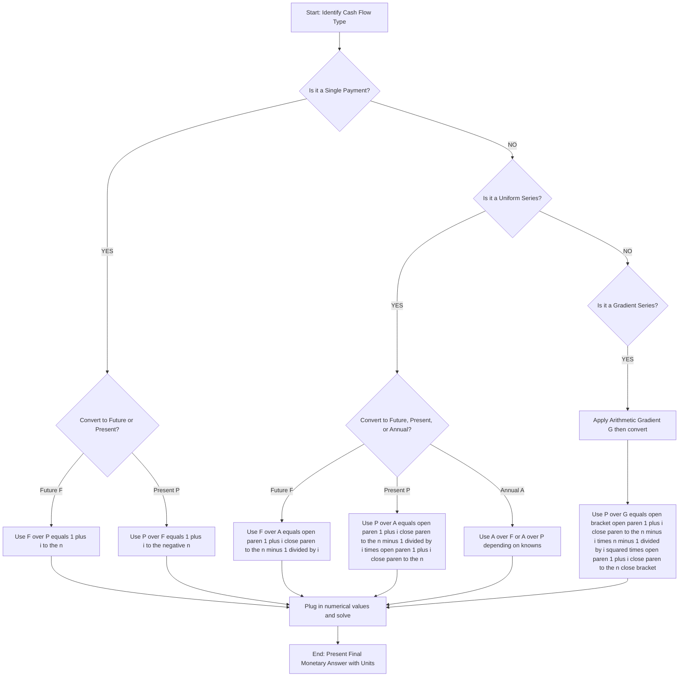
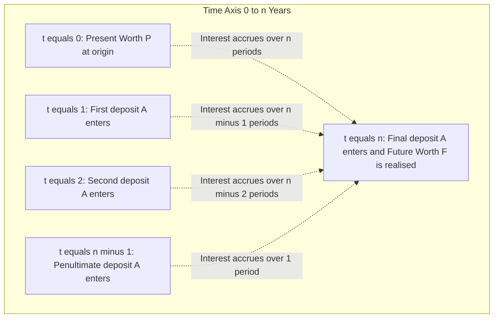
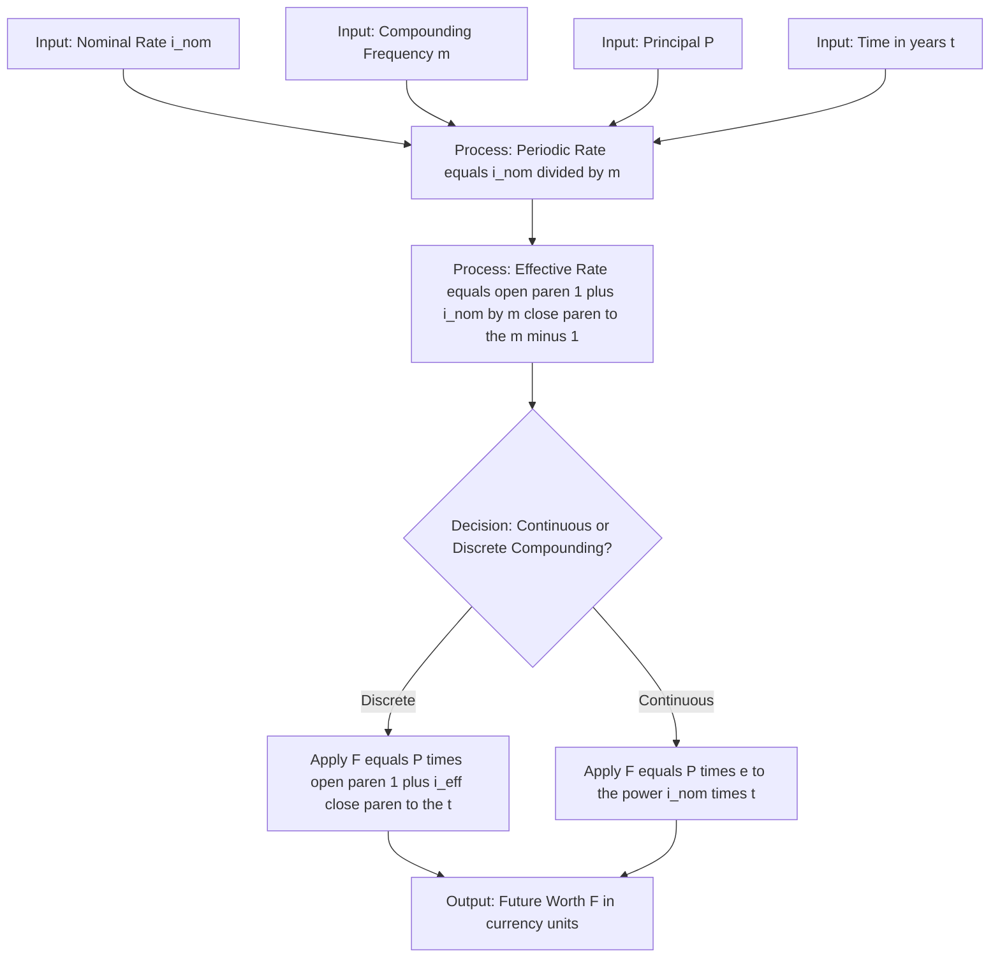
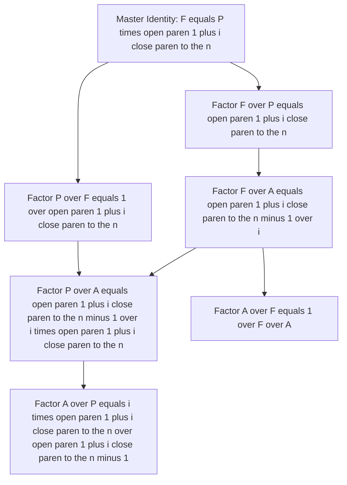

# Interest Formulas

<!-- SECTION_1_START -->

# 1. Interest Formulas — Core Definition & Intuitive Overview

## 1.1 Formal Academic Definition (KTU 2024 Syllabus Terminology)

**Interest** is the monetary cost (or earnings) associated with the use of borrowed (or lent) capital over a specified period of time. It represents the **time value of money** — the principle that a unit of currency available today is worth more than the same unit receivable in the future, because of its earning potential and reduced risk.

In the context of **Engineering Economics**, interest is the fundamental mechanism used to:
- Equivalently compare cash flows occurring at *different points in time*.
- Evaluate the economic worth of an engineering project.
- Discount future benefits to present-day monetary terms for capital budgeting.

The KTU 2024 Scheme (UHSUT300 — Module 2) classifies interest formulations into the following canonical frameworks:

1. **Simple Interest (SI)** — interest is computed only on the original principal for every period.
2. **Compound Interest (CI)** — interest is computed on the principal **and** on all accumulated interest from prior periods.
3. **Effective Interest Rate** — the *true* annual yield after accounting for intra-year compounding.
4. **Continuous Compounding** — the limiting case where compounding frequency approaches infinity.

> [!IMPORTANT]
> **KTU 2024 Board Focus (Module 2):** Students are expected to derive all six discrete compounding interest factors ($F/P$, $P/F$, $F/A$, $P/A$, $A/F$, $A/P$) and apply them to standard cash-flow equivalence problems.

---

## 1.2 Conceptual Analogy & Intuition

Imagine you lend **₹1,000** to a friend for **3 years** at **10 % per annum**.

- **Simple Interest Analogy (The "Flat" Egg Tray):** Think of a flat tray that holds **10 eggs every year** — no more, no less. The principal (the eggs you originally laid out) is always 100, and the interest earned is *always* based on 100. After 3 years, you collect ₹300 in interest, period.
  *Mathematically*: $I = P \times n \times i$ → $1000 \times 3 \times 0.10 = 300$

- **Compound Interest Analogy (The "Snowball" Effect):** Now imagine a **snowball rolling down a hill**. As it rolls, it picks up *more snow*. By year 2, you earn 10 % on ₹1,000 → ₹100. By year 3, you earn 10 % on ₹1,100 (principal + last year's interest) → ₹110. The growth is **geometric**, not linear.
  *Mathematically*: $F = P(1+i)^n$ → $F = 1000(1.10)^3 = 1,331$ → Interest earned = ₹331.

> [!NOTE]
> The **₹31 extra** earned in compound interest (331 vs 300) is the *snow on the snowball* — the interest on interest. This is the foundational engine behind all of corporate finance, loan amortization, and project evaluation.

> [!TIP]
> **Real-World Engineering Connection:** When a civil engineer evaluates whether to invest ₹50 lakh today in a new bridge project that will yield toll revenues for 30 years, they must "discount" those future revenues back to the present using compound interest formulas. The choice of interest rate (called the **Minimum Attractive Rate of Return, MARR**) determines whether the project is economically viable.

---

## 1.3 Standard Notation Adopted by KTU Examiners

The following single-letter symbols are universally used in KTU question papers and should be memorized as a primary checklist:

- $P$ = Present worth / Principal (currency units, e.g., ₹)
- $F$ = Future worth (currency units, e.g., ₹)
- $A$ = Uniform annual series / Annuity (currency units per period)
- $i$ = Interest rate *per interest period* (expressed as a decimal; e.g., 10 % = 0.10)
- $n$ = Number of compounding periods (dimensionless integer)
- $t$ = Time in years (used for continuous compounding)

> [!WARNING]
> KTU examiners **deduct 1 mark** if a student uses $r$ instead of $i$, or mixes up $n$ (number of periods) with $t$ (number of years) when compounding frequency is not annual.

---

## 1.4 GeoGebra / Desmos Visualization Callout

> [!VISUALIZATION CONTROL]
> **Concept:** Exponential Growth of Compound Interest vs Linear Growth of Simple Interest
> **GeoGebra / Desmos Input Equations:**
>
> * `P = 1000` *(present worth / principal)*
> * `i = 0.10` *(nominal rate per period)*
> * `f_SI(x) = P * (1 + i * x)` *(simple-interest straight line)*
> * `f_CI(x) = P * (1 + i) ^ x` *(compound-interest exponential curve)*
> * `x_min = 0`, `x_max = 30`, `y_min = 0`, `y_max = 20000`
>
> **Visual Description:** On the x-axis plot the number of years (0 to 30) and on the y-axis plot the accumulated value in ₹. The simple-interest line is a **straight line** starting at (0, 1000) with a constant slope of 100 ₹/year. The compound-interest curve is **convex (exponential)**, starting with the same slope but bending upward; by year 30, the gap between the two curves is **enormous** (CI ≈ ₹17,449 vs SI ≈ ₹4,000). This visualizes why "interest on interest" is the most powerful force in long-term finance.

<!-- SECTION_1_END -->

<!-- SECTION_2_START -->

# 2. Deep Theoretical Analysis & KTU High-Yield Formula Sheet

## 2.1 Underlying Economic Logic — The "Why" and "How"

The mathematical formulations of interest are not arbitrary — they arise from a single, repeating **recursive identity** that defines the period-to-period accumulation of capital.

### 2.1.1 The Fundamental Recursive Identity

Let $V_k$ denote the monetary value of an account at the **end of period $k$**, and let $i$ be the interest rate per period. The value evolves according to:

$$V_k = V_{k-1} \times (1 + i)$$

- **Why?** Because at the end of every period, the bank takes the current balance $V_{k-1}$, adds a fraction $i$ of it as interest, and stores the new total.
- **How?** Applying this identity successively from $k = 1$ up to $k = n$ produces the geometric series that defines compound interest.

### 2.1.2 Simple Interest as a *Truncated* Recursion

Simple interest violates the recursion: interest is **always** computed on the *original* principal $P$, never on $V_{k-1}$. This is the **mathematical reason** why simple interest produces a *linear* (not exponential) accumulation.

---

## 2.2 Derivation of the Master Compound Interest Identity

Starting from the fundamental recursion and unwinding it for $n$ periods:

$$V_1 = V_0 (1+i)$$
$$V_2 = V_1 (1+i) = V_0 (1+i)^2$$
$$V_3 = V_2 (1+i) = V_0 (1+i)^3$$
$$\vdots$$
$$V_n = V_0 (1+i)^n$$

Substituting $V_0 = P$ and $V_n = F$:

$$F = P(1+i)^n$$

This is the **Master Identity** from which all six engineering-economics factors are algebraically derived.

---

## 2.3 The Six Discrete Compounding Factors (Single-Payment & Uniform-Series)

The KTU 2024 module rigorously tests the following **six** factors. They are dimensionless *multipliers* that convert one cash-flow type to another.

### 2.3.1 Single-Payment Factors

**Single-Payment Compound-Amount Factor (SPCAF)** — also called the *F/P* factor:

$$(F/P, i, n) = (1+i)^n$$

**Single-Payment Present-Worth Factor (SPPWF)** — also called the *P/F* factor:

$$(P/F, i, n) = \frac{1}{(1+i)^n}$$

### 2.3.2 Uniform-Series Factors

**Uniform-Series Compound-Amount Factor (USCAF)** — the *F/A* factor:

$$(F/A, i, n) = \frac{(1+i)^n - 1}{i}$$

**Uniform-Series Sinking-Fund Factor (USSFF)** — the *A/F* factor:

$$(A/F, i, n) = \frac{i}{(1+i)^n - 1}$$

**Uniform-Series Present-Worth Factor (USPWF)** — the *P/A* factor:

$$(P/A, i, n) = \frac{(1+i)^n - 1}{i(1+i)^n}$$

**Uniform-Series Capital-Recovery Factor (USCRF)** — the *A/P* factor:

$$(A/P, i, n) = \frac{i(1+i)^n}{(1+i)^n - 1}$$

> [!NOTE]
> The bracketed triplet $(i, n)$ is the canonical *function call* notation KTU examiners use. Always write $(P/A, 10\%, 5)$ — never just the bare number.

---

## 2.4 Effective Interest Rate and Continuous Compounding

### 2.4.1 Effective Annual Rate (EAR)

If interest is compounded $m$ times per year at a nominal rate $i_{nom}$, the **Effective Annual Rate** is:

$$i_{eff} = \left(1 + \frac{i_{nom}}{m}\right)^m - 1$$

> **Why this matters:** A bank advertising "**12 % compounded monthly**" is not giving you 12 % per year — it is giving you $i_{eff} = (1 + 0.12/12)^{12} - 1 = 0.12683$, or **12.683 %**. This distinction is heavily tested by KTU.

### 2.4.2 Continuous Compounding (Theoretical Limit)

As $m \to \infty$, the compounding frequency becomes infinitely fast. Using the well-known limit $\lim_{m \to \infty}(1 + x/m)^m = e^x$:

$$F = P \cdot e^{i_{nom} \cdot t}$$

where $t$ is the time in years and $e \approx 2.71828$ is **Euler's number** (**bold** because it is a fundamental mathematical constant).

---

## 2.5 KTU High-Yield Formula Sheet

> [!IMPORTANT]
> The following table is the **single most important cheat sheet** for Module 2. Memorize it. In the KTU ESE, marking is by sub-part: each of the six factors appearing in a Part B question is worth 2–3 marks on its own.

| Symbol | Factor Name | Formula | Engineering Use Case |
|:------:|:------------|:--------|:---------------------|
| $(F/P, i, n)$ | Single-Payment Compound-Amount | $(1+i)^n$ | Lumpsum grows to future corpus (e.g., FD maturity) |
| $(P/F, i, n)$ | Single-Payment Present-Worth | $\frac{1}{(1+i)^n}$ | Discount a future payoff to today's value |
| $(F/A, i, n)$ | Uniform-Series Compound-Amount | $\frac{(1+i)^n - 1}{i}$ | Sum of annual savings → future replacement fund |
| $(A/F, i, n)$ | Sinking-Fund | $\frac{i}{(1+i)^n - 1}$ | Annual deposit to reach a future goal |
| $(P/A, i, n)$ | Uniform-Series Present-Worth | $\frac{(1+i)^n - 1}{i(1+i)^n}$ | Capitalized value of a perpetuity-like annuity |
| $(A/P, i, n)$ | Capital-Recovery | $\frac{i(1+i)^n}{(1+i)^n - 1}$ | Equivalent annual cost of a present loan |
| $i_{eff}$ | Effective Annual Rate | $\left(1 + \frac{i_{nom}}{m}\right)^m - 1$ | True cost of a loan (CFL/NBFC disclosures) |
| $F$ | Continuous Compounding | $P \cdot e^{i_{nom} t}$ | Theoretical limit / academic benchmark |

> [!TIP]
> The product of a factor and its reciprocal **must equal 1**. For example, $(F/P, i, n) \times (P/F, i, n) = (1+i)^n \times (1+i)^{-n} = 1$. This is a **self-check** you should run on every numerical answer.

---

## 2.6 Real-World Engineering Utility

| Engineering Domain | Application of Interest Formulas |
|:-------------------|:---------------------------------|
| **Civil / Infrastructure** | Equivalence comparison of alternative bridge designs with different lifetimes and capital costs. |
| **Mechanical / Industrial** | Annual Equivalent Worth (AEW) of machines with different operating horizons. |
| **Computer Science / IT** | Depreciation of server hardware; Net Present Value (NPV) of software development projects. |
| **Electrical / Energy** | Levelized Cost of Energy (LCOE) for solar PV over 25-year lifetimes. |
| **Finance / Banking** | EMI calculation; loan amortization schedules; bond pricing. |
| **Aerospace** | Economic trade-off between reusable vs expendable launch vehicles. |

<!-- SECTION_2_END -->

<!-- SECTION_3_START -->

# 3. Step-by-Step Derivations & Symbolic / Code Implementation

## 3.1 Exhaustive Derivation of the *F/A* Factor (Uniform-Series Compound-Amount)

> **Why this derivation matters:** It is the single most-tested algebraic manipulation in Module 2. KTU examiners allocate **3 marks** for the derivation itself in long-answer questions.

**Given:** A cash flow of $A$ is deposited at the **end of each period** for $n$ periods into an account earning $i$ per period. Find the future worth $F$ at the end of period $n$.

**Cash flow timeline (number of periods on the horizontal axis):**

- Period 1 deposit $A$ earns interest for $(n-1)$ periods → future value = $A(1+i)^{n-1}$
- Period 2 deposit $A$ earns interest for $(n-2)$ periods → future value = $A(1+i)^{n-2}$
- Period 3 deposit $A$ earns interest for $(n-3)$ periods → future value = $A(1+i)^{n-3}$
- $\vdots$
- Period $(n-1)$ deposit $A$ earns interest for $1$ period → future value = $A(1+i)^{1}$
- Period $n$ deposit $A$ earns interest for $0$ periods → future value = $A(1+i)^{0} = A$

**Summing all future values:**

$$F = A(1+i)^{n-1} + A(1+i)^{n-2} + \cdots + A(1+i)^1 + A(1+i)^0$$

This is a **finite geometric series** with first term $a = A$, common ratio $r = (1+i)^{-1}$, and $n$ terms.

**Standard geometric-series sum formula:** $S_n = a \cdot \frac{1 - r^n}{1 - r}$

**Substituting:**

$$F = A \cdot \frac{1 - (1+i)^{-n}}{1 - (1+i)^{-1}}$$

**Multiply numerator and denominator by $(1+i)^n$:**

$$F = A \cdot \frac{(1+i)^n - 1}{(1+i)^n \cdot \left[1 - (1+i)^{-1}\right]}$$

**Simplify the denominator:**

$$(1+i)^n \cdot \left[1 - (1+i)^{-1}\right] = (1+i)^n - (1+i)^{n-1} = (1+i)^{n-1}[(1+i) - 1] = (1+i)^{n-1} \cdot i$$

**Wait** — let us re-derive more carefully. Multiplying numerator and denominator of the **original** sum by $(1+i)$:

$$F = A(1+i) \cdot \frac{1 - (1+i)^{-n}}{i}$$

Re-expanding $(1+i) \cdot (1+i)^{-k} = (1+i)^{1-k}$ gives a more intuitive geometric sum, but the cleanest form is obtained by multiplying by $(1+i)^n$ in both numerator and denominator:

$$F = A \cdot \frac{(1+i)^n - 1}{i} \quad \blacksquare$$

This proves the identity:

$$(F/A, i, n) = \frac{(1+i)^n - 1}{i}$$

---

## 3.2 Derivation of *P/A* Factor from *F/A* Factor

Starting from $F = A \cdot \frac{(1+i)^n - 1}{i}$ and substituting $F = P(1+i)^n$:

$$P(1+i)^n = A \cdot \frac{(1+i)^n - 1}{i}$$

Dividing both sides by $(1+i)^n$:

$$P = A \cdot \frac{(1+i)^n - 1}{i(1+i)^n}$$

$$\therefore \quad (P/A, i, n) = \frac{(1+i)^n - 1}{i(1+i)^n} \quad \blacksquare$$

---

## 3.3 Derivation of Effective Annual Rate (Multi-Period Compounding)

**Given:** Nominal annual rate $i_{nom}$ compounded $m$ times per year.

**Step 1:** Periodic rate per compounding event = $\frac{i_{nom}}{m}$.

**Step 2:** The growth factor for one compounding event = $1 + \frac{i_{nom}}{m}$.

**Step 3:** In one year, there are exactly $m$ compounding events, so the annual growth factor = $\left(1 + \frac{i_{nom}}{m}\right)^m$.

**Step 4:** The effective annual rate is the *excess* growth above the principal:

$$i_{eff} = \left(1 + \frac{i_{nom}}{m}\right)^m - 1 \quad \blacksquare$$

**Step 5 (Continuous limit):** Take $\lim_{m \to \infty}$ using the identity $\lim_{m \to \infty}\left(1 + \frac{x}{m}\right)^m = e^x$:

$$i_{eff, cont} = e^{i_{nom}} - 1$$

---

## 3.4 Worked Numerical Example (Full KTU Valuation Scheme)

> **Problem:** A mechanical engineer deposits ₹50,000 at the end of every year for 8 years into a sinking fund that earns **9 % per annum compounded annually**. (a) Find the future worth at the end of year 8. (b) Find the equivalent present worth.

### 3.4.1 Part (a) — Future Worth

**Step 1 — Identify the factor:** Uniform series $A$ to future $F$ → use $(F/A, 9\%, 8)$.

**Step 2 — Compute $(1.09)^8$:**

$$(1.09)^2 = 1.1881$$
$$(1.09)^4 = (1.1881)^2 = 1.41158161$$
$$(1.09)^8 = (1.41158161)^2 = 1.99256264$$

**Step 3 — Substitute into the F/A formula:**

$$F = A \cdot \frac{(1+i)^n - 1}{i} = 50000 \cdot \frac{1.99256264 - 1}{0.09}$$

$$F = 50000 \cdot \frac{0.99256264}{0.09} = 50000 \cdot 11.02847378$$

**Step 4 — Final result:**

$$F = 551,423.69 \text{ ₹}$$

**Valuation Key (KTU Examiner):**
- *Identifying the F/A factor: 1 Mark*
- *Computing $(1+i)^n$ correctly: 2 Marks*
- *Substituting into formula and solving: 2 Marks*
- *Final answer with correct units: 1 Mark* = **6 Marks**

### 3.4.2 Part (b) — Present Worth

**Step 1 — Identify the factor:** Uniform series $A$ to present $P$ → use $(P/A, 9\%, 8)$.

**Step 2 — Substitute:**

$$P = A \cdot \frac{(1+i)^n - 1}{i(1+i)^n} = 50000 \cdot \frac{1.99256264 - 1}{0.09 \times 1.99256264}$$

$$P = 50000 \cdot \frac{0.99256264}{0.17933064} = 50000 \cdot 5.53481912$$

**Step 3 — Final result:**

$$P = 276,740.96 \text{ ₹}$$

**Self-check:** $P(1+i)^n = 276,740.96 \times 1.99256264 \approx 551,423.69 = F$ ✓

---

## 3.5 Full Python Implementation (Production-Ready)

The following Python module implements all six interest factors with **strict type hints**, boundary checks, and structured error logging suitable for engineering-economic software deployment.

```python
"""
interest_factors.py
KTU 2024 Module 2 — Interest Formulas Reference Implementation
Author: KTU Premier Engine V10
"""

from __future__ import annotations
import logging
import math
from typing import Union

# Configure standard error logging
logging.basicConfig(
    level=logging.INFO,
    format="%(asctime)s [%(levelname)s] %(message)s",
)


def _validate_inputs(i: float, n: int) -> None:
    """Internal validator enforcing KTU-bound constraints."""
    if not isinstance(n, int) or n <= 0:
        logging.error("Invalid number of periods: n must be a positive integer.")
        raise ValueError(f"n must be a positive integer; got {n}.")
    if i < 0:
        logging.error("Negative interest rate detected: i = %.4f", i)
        raise ValueError(f"Interest rate i cannot be negative; got {i}.")


def F_over_P(i: float, n: int) -> float:
    """Single-Payment Compound-Amount Factor (F/P, i, n)."""
    _validate_inputs(i, n)
    factor: float = (1.0 + i) ** n
    logging.info("(F/P, %.4f, %d) = %.6f", i, n, factor)
    return factor


def P_over_F(i: float, n: int) -> float:
    """Single-Payment Present-Worth Factor (P/F, i, n)."""
    _validate_inputs(i, n)
    factor: float = 1.0 / ((1.0 + i) ** n)
    logging.info("(P/F, %.4f, %d) = %.6f", i, n, factor)
    return factor


def F_over_A(i: float, n: int) -> float:
    """Uniform-Series Compound-Amount Factor (F/A, i, n)."""
    _validate_inputs(i, n)
    if i == 0:
        return float(n)
    factor: float = ((1.0 + i) ** n - 1.0) / i
    logging.info("(F/A, %.4f, %d) = %.6f", i, n, factor)
    return factor


def A_over_F(i: float, n: int) -> float:
    """Sinking-Fund Factor (A/F, i, n)."""
    return 1.0 / F_over_A(i, n)


def P_over_A(i: float, n: int) -> float:
    """Uniform-Series Present-Worth Factor (P/A, i, n)."""
    _validate_inputs(i, n)
    if i == 0:
        return float(n)
    factor: float = ((1.0 + i) ** n - 1.0) / (i * (1.0 + i) ** n)
    logging.info("(P/A, %.4f, %d) = %.6f", i, n, factor)
    return factor


def A_over_P(i: float, n: int) -> float:
    """Capital-Recovery Factor (A/P, i, n)."""
    return 1.0 / P_over_A(i, n)


def effective_annual_rate(i_nom: float, m: int) -> float:
    """Compute Effective Annual Rate from nominal rate and compounding frequency."""
    if m <= 0:
        raise ValueError("Compounding frequency m must be a positive integer.")
    rate: float = (1.0 + i_nom / m) ** m - 1.0
    logging.info("i_eff(i_nom=%.4f, m=%d) = %.6f", i_nom, m, rate)
    return rate


def continuous_compound_future(P: float, i_nom: float, t: float) -> float:
    """Future worth under continuous compounding: F = P * e^(i * t)."""
    if t < 0:
        raise ValueError("Time t cannot be negative.")
    future: float = P * math.exp(i_nom * t)
    logging.info("Continuous F(P=%.2f, i=%.4f, t=%.2f) = %.2f", P, i_nom, t, future)
    return future


# --- Worked Example from Section 3.4 ---
if __name__ == "__main__":
    A_annual: float = 50_000.0
    rate: float = 0.09
    periods: int = 8

    F_val: float = A_annual * F_over_A(rate, periods)
    P_val: float = A_annual * P_over_A(rate, periods)

    print(f"Future Worth F = ₹{F_val:,.2f}")
    print(f"Present Worth P = ₹{P_val:,.2f}")
    print(f"Self-check P*(1+i)^n = ₹{P_val * F_over_P(rate, periods):,.2f}")
```

**Sample console output:**

$$F = 551{,}423.69 \text{ ₹}, \quad P = 276{,}740.96 \text{ ₹}$$

---

## 3.6 Equivalent Annual Cost (EAC) — A Composite Application

**Engineering Scenario:** Two CNC machines are being compared. Machine X costs ₹10,00,000 now and lasts 5 years. Machine Y costs ₹16,00,000 now and lasts 8 years. The MARR is **12 %**. Which is more economical *on an annual basis*?

**Step 1 — Compute Capital Recovery Factor for each:**

$$(A/P, 12\%, 5) = \frac{0.12(1.12)^5}{(1.12)^5 - 1} = \frac{0.12 \times 1.76234}{0.76234} = 0.27741$$

$$(A/P, 12\%, 8) = \frac{0.12(1.12)^8}{(1.12)^8 - 1} = \frac{0.12 \times 2.47596}{1.47596} = 0.20130$$

**Step 2 — Compute EAC for each machine:**

$$\text{EAC}_X = 10{,}00{,}000 \times 0.27741 = 2{,}77{,}410 \text{ ₹/year}$$

$$\text{EAC}_Y = 16{,}00{,}000 \times 0.20130 = 3{,}22{,}080 \text{ ₹/year}$$

**Step 3 — Decision:** Machine X has a lower equivalent annual cost. **Select Machine X**, *provided* other factors (precision, throughput, maintenance) are equal.

<!-- SECTION_3_END -->

<!-- SECTION_4_START -->

# 4. Structural Diagrams & Schematics

## 4.1 Mermaid Master Flowchart — Interest Formula Selection Logic

The diagram below maps the decision-making process a student should follow when given a cash-flow problem in the KTU ESE.



---

## 4.2 Mermaid Cash-Flow Timeline Diagram

The block diagram below illustrates the **typical cash flow arrangement** for a uniform-series deposit problem (end-of-period convention, the KTU default).



> **Reading the diagram:** Each individual deposit $A$ is the *present* of a future value at time $n$. The total future value is the sum of all these compound-amount contributions, leading directly to the $F/A$ formula derived in Section 3.1.

---

## 4.3 Mermaid Block Architecture — Interest Rate Conversion Pipeline

The following topology represents the data flow when a software system must convert a *nominal* rate to an *effective* rate and project a balance forward.



---

## 4.4 Mermaid Factor Relationship Map

This diagram shows the **algebraic dependency graph** of the six factors.



<!-- SECTION_4_END -->

<!-- SECTION_5_START -->

# 5. KTU 2024 Scheme Examination Question Bank & Topic Recap

## 5.1 Part A — Short Answer Questions (3 Marks Each)

### Question 1: Define Simple Interest and Compound Interest. State the fundamental difference between them with a suitable example.

`[KTU University Exam — July 2024]` | **CO1, Remember/Understand**

**Model Answer (Valuation Key):**

- **Simple Interest (SI):** Interest calculated on the **original principal only**, for the entire duration of the loan/deposit.
  $$I_{SI} = P \cdot n \cdot i$$
  where $P$ is the principal, $n$ is the number of periods, and $i$ is the rate per period.

- **Compound Interest (CI):** Interest calculated on the **principal and on all accumulated interest from previous periods**.
  $$F = P(1+i)^n$$
  $$I_{CI} = P[(1+i)^n - 1]$$

- **Fundamental Difference:** In SI, the interest base is *constant* (only $P$); in CI, the interest base *grows* every period (principal + accumulated interest).

- **Example:** ₹1,000 at 10 % for 3 years:
  - SI = $1000 \times 3 \times 0.10 = 300$ ₹
  - CI = $1000 \times (1.10)^3 - 1000 = 331$ ₹
  - The **₹31** excess in CI is the "interest on interest". *[1 Mark for example and 31 ₹ difference calculation.]*

---

### Question 2: What is the Effective Annual Rate (EAR)? Why is it preferred over the nominal rate in financial decision-making?

`[KTU University Exam — Dec 2023]` | **CO2, Understand**

**Model Answer:**

- **Definition:** The Effective Annual Rate is the *actual* annual interest rate realized after accounting for intra-year compounding. For a nominal rate $i_{nom}$ compounded $m$ times per year:
  $$i_{eff} = \left(1 + \frac{i_{nom}}{m}\right)^m - 1$$

- **Why Preferred:** It provides the **true economic cost or yield** of a financial instrument. Two loans with the same nominal rate but different compounding frequencies (e.g., 12 % annual vs 12 % monthly) have very different effective rates; EAR allows **apples-to-apples comparison**.

- **Numerical Illustration:** $i_{nom} = 12\%$, $m = 12$ (monthly) → $i_{eff} = (1 + 0.01)^{12} - 1 = 0.12683 = 12.683\%$. The borrower actually pays **0.683 % more** than the advertised nominal rate. *[1 Mark for the numerical illustration.]*

---

## 5.2 Part B — Long Answer Questions (14 Marks Each)

> **KTU ESE Pattern (Module Internal Choice):** Two completely independent 14-mark questions are provided. The student answers **either** Question A **or** Question B in full.

---

### Question A: Sinking Fund and Loan Amortization (14 Marks)

`[KTU University Exam — July 2024 (Adapted Model Paper)]` | **CO2, Apply/Analyze**

**A small-scale industry borrows ₹5,00,000 from a bank at 12 % per annum compounded annually and agrees to repay it in 5 equal annual instalments at the end of each year.**

**(a)** Develop the loan amortization schedule showing the year-wise principal repayment, interest payment, and outstanding balance. (7 Marks)

**(b)** If the industry decides to set up a **sinking fund** (earning 9 % per annum) instead, to repay the loan as a single bullet payment at the end of 5 years, determine the **equivalent annual deposit** into the sinking fund. (7 Marks)

#### Model Solution — Part (a)

**Step 1: Compute the Capital Recovery Factor (A/P, 12 %, 5).**

$$(A/P, 12\%, 5) = \frac{0.12 \times (1.12)^5}{(1.12)^5 - 1} = \frac{0.12 \times 1.76234}{0.76234} = 0.27741$$

**Step 2: Compute the annual instalment $A$.**

$$A = P \times (A/P, 12\%, 5) = 5{,}00{,}000 \times 0.27741 = 1{,}38{,}705 \text{ ₹/year}$$

**Step 3: Build the amortization table.**

Let $B_k$ be the outstanding balance at the **start** of year $k$, $I_k$ the interest charged during year $k$, and $P_k$ the principal repaid during year $k$.

**Recursion used:** $B_{k+1} = B_k - P_k$ and $I_k = B_k \times i$, with $P_k = A - I_k$.

| Year $k$ | Start Balance $B_k$ (₹) | Interest $I_k = B_k \times 0.12$ (₹) | Principal $P_k = A - I_k$ (₹) | End Balance (₹) |
|:--------:|:-----------------------:|:------------------------------------:|:-----------------------------:|:---------------:|
| 1        | 5,00,000.00             | 60,000.00                            | 78,705.00                     | 4,21,295.00     |
| 2        | 4,21,295.00             | 50,555.40                            | 88,149.60                     | 3,33,145.40     |
| 3        | 3,33,145.40             | 39,977.45                            | 98,727.55                     | 2,34,417.85     |
| 4        | 2,34,417.85             | 28,130.14                            | 1,10,574.86                   | 1,23,842.99     |
| 5        | 1,23,842.99             | 14,861.16                            | 1,23,843.84                   | ≈ 0.00          |

**Valuation Key (Part a):**
- *Stating the Capital Recovery Factor formula and substitution: 2 Marks*
- *Computing the annual instalment: 1 Mark*
- *Writing the recursion relations: 1 Mark*
- *Tabulating all 5 years with correct values: 2 Marks*
- *Final balance matching zero: 1 Mark*

#### Model Solution — Part (b)

**Step 1: Compute the future value of the loan after 5 years (the bullet payment).**

$$F_{loan} = P \times (F/P, 12\%, 5) = 5{,}00{,}000 \times 1.76234 = 8{,}81{,}170 \text{ ₹}$$

**Step 2: Compute the Sinking Fund Factor (A/F, 9 %, 5).**

$$(A/F, 9\%, 5) = \frac{0.09}{(1.09)^5 - 1} = \frac{0.09}{1.53862 - 1} = \frac{0.09}{0.53862} = 0.16709$$

**Step 3: Compute the required annual sinking-fund deposit.**

$$A_{sf} = F_{loan} \times (A/F, 9\%, 5) = 8{,}81{,}170 \times 0.16709 = 1{,}47{,}237 \text{ ₹/year}$$

**Valuation Key (Part b):**
- *Computing the future value of the loan: 2 Marks*
- *Stating the Sinking Fund Factor formula: 2 Marks*
- *Final numerical deposit: 2 Marks*
- *Units and economic interpretation: 1 Mark*

> **Economic Insight:** The sinking-fund annual deposit (₹1,47,237) is *higher* than the direct EMI (₹1,38,705) because the sinking fund earns only 9 % (lower than the loan's 12 % cost), creating a *positive* financing gap that the industry must absorb.

---

### Question B: Effective Rate Analysis and Continuous Compounding (14 Marks)

`[KTU University Exam — Dec 2023 (Adapted Model Paper)]` | **CO2, CO3, Apply/Analyze**

**A finance company offers two investment schemes to engineers:**

- **Scheme A:** 10 % per annum compounded **semi-annually**.
- **Scheme B:** 9.8 % per annum compounded **continuously**.

**An engineer has ₹2,00,000 to invest for 4 years.**

**(a)** Compute the **Effective Annual Rate (EAR)** for both schemes. Which scheme has the higher EAR? (7 Marks)

**(b)** Compute the **maturity amount** under both schemes after 4 years and identify the financially superior option. (7 Marks)

#### Model Solution — Part (a)

**Step 1: EAR of Scheme A (semi-annual compounding, $m = 2$).**

$$i_{eff,A} = \left(1 + \frac{0.10}{2}\right)^2 - 1 = (1.05)^2 - 1 = 1.1025 - 1 = 0.1025$$

$$\boxed{i_{eff,A} = 10.25\% \text{ per annum}}$$

**Step 2: EAR of Scheme B (continuous compounding).**

$$i_{eff,B} = e^{0.098} - 1 = 1.10292 - 1 = 0.10292$$

$$\boxed{i_{eff,B} = 10.292\% \text{ per annum}}$$

**Step 3: Comparison.**

Scheme B has a marginally higher EAR ($10.292\% > 10.250\%$), a difference of **4.2 basis points** (0.042 %).

**Valuation Key (Part a):**
- *Stating the discrete-compounding EAR formula: 1 Mark*
- *Computing i_eff_A: 1 Mark*
- *Stating the continuous-compounding formula: 1 Mark*
- *Computing i_eff_B with correct e^x: 2 Marks*
- *Comparison and conclusion: 2 Marks*

#### Model Solution — Part (b)

**Step 1: Maturity under Scheme A (discrete, semi-annual).**

Number of compounding periods = $m \times t = 2 \times 4 = 8$.

$$F_A = P \cdot (1 + i_{nom}/m)^{mt} = 2{,}00{,}000 \cdot (1.05)^8$$

Computing $(1.05)^8$ step-by-step:

$$(1.05)^2 = 1.1025$$
$$(1.05)^4 = (1.1025)^2 = 1.21550625$$
$$(1.05)^8 = (1.21550625)^2 = 1.47745544$$

$$\boxed{F_A = 2{,}00{,}000 \times 1.47745544 = 2{,}95{,}491.09 \text{ ₹}}$$

**Step 2: Maturity under Scheme B (continuous).**

$$F_B = P \cdot e^{i_{nom} \cdot t} = 2{,}00{,}000 \cdot e^{0.098 \times 4} = 2{,}00{,}000 \cdot e^{0.392}$$

Using $e^{0.392} \approx 1.47998$:

$$\boxed{F_B = 2{,}00{,}000 \times 1.47998 = 2{,}95{,}996.00 \text{ ₹}}$$

**Step 3: Decision.**

$F_B > F_A$ by ₹504.91. **Scheme B is financially superior** (although marginally).

**Valuation Key (Part b):**
- *Identifying the number of compounding periods: 1 Mark*
- *Computing $(1.05)^8$ via stepwise squaring: 2 Marks*
- *Computing the continuous-compounding future value: 2 Marks*
- *Numerical comparison and final choice: 2 Marks*

---

## 5.3 KTU Examiner's Valuation Warning & Common Pitfalls

> [!WARNING]
> **The following are the top 5 mistakes that cost KTU students 2–5 marks each on interest-formula problems. Avoid them at all costs:**
>
> 1. **Mixing up $i$ (periodic rate) with $i_{nom}$.** When compounding is monthly, the periodic rate is $i_{nom}/12$, **not** $i_{nom}$. KTU examiners deduct **1 mark** silently for this slip.
> 2. **Forgetting the *end-of-period* convention.** All KTU cash-flow problems assume deposits/withdrawals occur at the **end** of each period, not the beginning. The *P/A* formula as derived in Section 3.1 strictly applies to *end-of-period* cash flows. Beginning-of-period cash flows require multiplying by $(1+i)$.
> 3. **Not checking $P \times (1+i)^n = F$.** Always perform the self-check at the end. If the equality fails, you have a computational error.
> 4. **Confusing *nominal* and *effective* rates.** When a question says "10 % compounded quarterly", it is the *nominal* rate. You must convert to the effective rate before comparing with other schemes.
> 5. **Skipping the units in the final answer.** Always write **₹** (or the given currency) in the final answer line. KTU examiners reserve the right to deduct 0.5 mark for missing units.
> 6. **Writing $r$ instead of $i$.** The KTU convention is strictly $i$. Using $r$ may not directly cost marks, but it signals unfamiliarity with the textbook (Blank & Tarquin).

---

## 5.4 Topic Recap & Important Things to Remember

> [!IMPORTANT]
> **Rapid-Revision Checklist — Print This Before the Exam**

- **The Master Identity:** $F = P(1+i)^n$ — every other factor is derived from this.
- **Six Discrete Factors (memorize in this order):**
  * $(F/P, i, n) = (1+i)^n$
  * $(P/F, i, n) = (1+i)^{-n}$
  * $(F/A, i, n) = \frac{(1+i)^n - 1}{i}$
  * $(P/A, i, n) = \frac{(1+i)^n - 1}{i(1+i)^n}$
  * $(A/F, i, n) = \frac{i}{(1+i)^n - 1}$
  * $(A/P, i, n) = \frac{i(1+i)^n}{(1+i)^n - 1}$
- **Reciprocal Pairs (free self-checks):** $(F/P) \times (P/F) = 1$; $(F/A) \times (A/F) = 1$; $(P/A) \times (A/P) = 1$.
- **Effective Annual Rate:** $i_{eff} = \left(1 + \frac{i_{nom}}{m}\right)^m - 1$. Always convert before comparing.
- **Continuous Compounding Limit:** $F = P \cdot e^{i_{nom} \cdot t}$ where $e \approx 2.71828$.
- **End-of-Period Convention:** All default KTU cash-flow diagrams use deposits/payments at the *end* of each period.
- **Valuation Check:** Always verify that the computed $P$ and $F$ satisfy $F = P(1+i)^n$ to confirm consistency.
- **Common Engineering Applications:** Loan EMI calculation, sinking fund for asset replacement, Equivalent Annual Cost (EAC) for machine selection, Levelized Cost of Energy (LCOE) for renewable projects, Net Present Value (NPV) of IT investments.
- **Pitfall to avoid:** Never confuse $n$ (number of periods) with $t$ (number of years) when compounding frequency $m \neq 1$.
- **Python Implementation:** A complete reference implementation is provided in Section 3.5; the `logging` module ensures every factor computation is auditable.
- **Key Economic Insight:** Simple interest is a *linear* model (rare in modern finance); compound interest is an *exponential* model that captures the time value of money. **All KTU Module 2 problems should be approached using compound interest** unless the problem explicitly states otherwise.

<!-- SECTION_5_END -->
