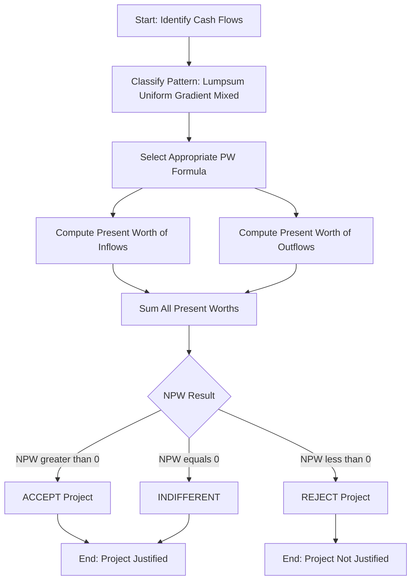
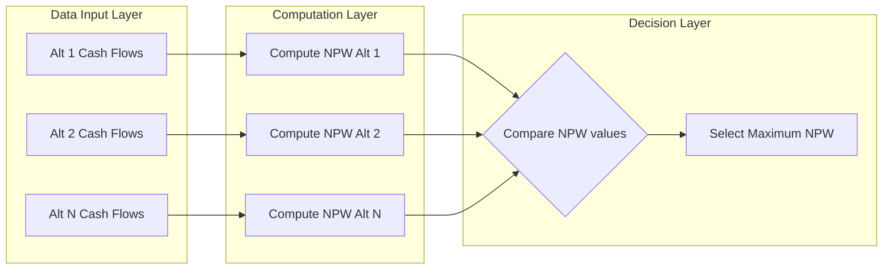
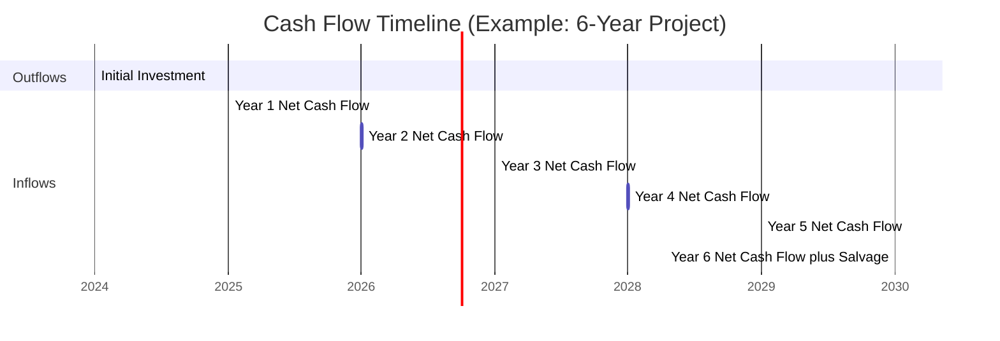
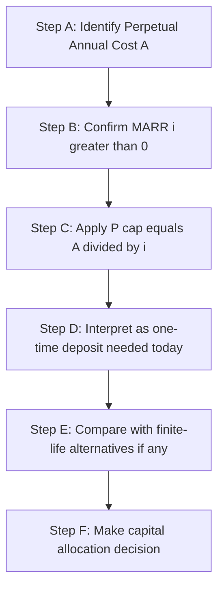

# Present Worth Analysis

<!-- SECTION_1_START -->
# Present Worth Analysis — Core Foundations

> [!NOTE]
> **KTU 2024 Scheme | UHSUT300 | Module 2 — Engineering Economics**
> *Mapped to CO1 (Understand / Apply economic analysis tools for engineering decisions).*

## 1.1 Formal Academic Definition

**Present Worth Analysis (PWA)**, also called the **Net Present Value (NPV) Method**, is a discounted cash flow technique in engineering economics that converts all future cash inflows and outflows of a project or investment to a single equivalent value at *time zero* (the present), using a specified discount rate known as the **Minimum Attractive Rate of Return (MARR)** or **interest rate ($i$)**.

Mathematically, the **Net Present Worth (NPW)** of a project is expressed as:

$$
NPW = \sum_{t=0}^{n} \frac{CF_t}{(1+i)^t}
$$

where $CF_t$ is the net cash flow in year $t$, $i$ is the **MARR (Minimum Attractive Rate of Return)**, and $n$ is the **project life in years**.

> [!IMPORTANT]
> **KTU Syllabus Highlight (2024 Scheme):** Students must master both **single-project acceptance decisions** and the **comparison of mutually exclusive alternatives** using the present worth criterion.

## 1.2 The Intuitive Analogy — "A Rupee Today is Worth More Tomorrow's Rupee"

Imagine your friend offers you two choices:
- **Option A:** Take **₹1,00,000 right now**.
- **Option B:** Take **₹1,00,000 five years from now**.

Which one would you pick? Almost certainly **Option A**. Why? Because a rupee today can be **invested** to earn returns, **hedged against inflation**, and **used to address today's needs**. The rupee promised in the future is *less valuable* today because of this **time value of money**.

**Present Worth Analysis** does exactly this — it **discounts** future cash flows back to today's value, allowing apples-to-apples comparison of money received or spent at *different points in time*.

> [!TIP]
> **Geometric Intuition:** If you have a cash flow diagram with money flowing in different years, the present worth method is like "rolling" every future cash flow *backwards in time* along the time axis, shrinking each by the factor $(1+i)^t$. What remains at time zero is the **Present Worth**.

## 1.3 Key Parameters and Standard Metrics

| Parameter | Symbol | Typical Engineering Range |
|---|---|---|
| Minimum Attractive Rate of Return | $i$ | **8% to 15%** in Indian industry |
| Project Life | $n$ | **5 to 20 years** |
| Initial Investment (P) | $P$ | Capital outlay at $t=0$ |
| Annual Cash Flow (A) | $A$ | Uniform series payment |
| Future Amount (F) | $F$ | Value at end of period $n$ |
| Arithmetic Gradient (G) | $G$ | Year-on-year linear increase |

> [!VISUALIZATION CONTROL]
> **Concept:** Time Value of Money — Discounting Visualization
> **GeoGebra / Desmos Input Equations:**
> * `PW_factor(n) = (1 + 0.1)^(-n)`  *(for i = 10%)*
> * `Axis X: n (years), Axis Y: Present Worth Factor`
> **Visual Description:** Observe the **exponential decay curve** — as $n$ increases, the present worth factor shrinks, meaning distant future cash flows carry exponentially less weight in present value.

<!-- SECTION_1_END -->

<!-- SECTION_2_START -->
# Deep Theoretical Analysis & KTU High-Yield Formula Sheet

## 2.1 The Logical Foundation — Why Discount?

Engineering projects involve cash flows spread over many years. Two fundamental economic realities compel us to **discount** future cash flows:

1. **Opportunity Cost of Capital:** Money invested today in a project could have been invested elsewhere at the **MARR** to earn returns. Therefore, a future rupee must be "discounted" by the returns it *could have earned* had it been available today.
2. **Inflation & Risk:** Future money has reduced **purchasing power** and carries **uncertainty**. Discounting accounts for both.

> [!IMPORTANT]
> **KTU Examiner's Insight:** The MARR is *not* the bank interest rate. It is the *minimum* rate a company is willing to accept to justify an investment — typically set 2–5% above the cost of capital.

## 2.2 The Core Discounting Formulas

### **Formula 1 — Single Payment Present Worth Factor (SPPWF)**
Converts a future amount $F$ occurring at year $n$ to its present equivalent $P$:

$$
P = F \cdot (P/F, i, n) = \frac{F}{(1+i)^n}
$$

### **Formula 2 — Uniform Series Present Worth Factor (USPWF)**
Converts a uniform series of end-of-year payments $A$ to a single present value:

$$
P = A \cdot (P/A, i, n) = A \cdot \left[\frac{(1+i)^n - 1}{i \cdot (1+i)^n}\right]
$$

### **Formula 3 — Future Worth of a Present Amount**
Converts present value $P$ to a future equivalent $F$ at year $n$:

$$
F = P \cdot (1+i)^n
$$

### **Formula 4 — Sinking Fund Factor (Future of Uniform Series)**

$$
F = A \cdot \left[\frac{(1+i)^n - 1}{i}\right]
$$

### **Formula 5 — Capital Recovery Factor (A from P)**

$$
A = P \cdot \left[\frac{i \cdot (1+i)^n}{(1+i)^n - 1}\right]
$$

### **Formula 6 — Arithmetic Gradient Present Worth**

When cash flows increase by a constant $G$ each year (0 in year 1, $G$ in year 2, $2G$ in year 3...), the present worth of the gradient component is:

$$
P_{gradient} = G \cdot \left[\frac{(1+i)^n - i \cdot n - 1}{i^2 \cdot (1+i)^n}\right]
$$

### **Formula 7 — Capitalized Cost (Perpetual Service)**

For a permanent asset (e.g., a bridge, monument) generating a perpetual uniform annual cost $A$:

$$
P_{capitalized} = \frac{A}{i}
$$

## 2.3 KTU Formula Cheat Sheet

| # | Name | Factor Notation | Formula | Use Case |
|---|---|---|---|---|
| 1 | Single Payment PW | $(P/F, i, n)$ | $\dfrac{1}{(1+i)^n}$ | Lump-sum future to present |
| 2 | Single Payment FW | $(F/P, i, n)$ | $(1+i)^n$ | Present to future |
| 3 | Uniform Series PW | $(P/A, i, n)$ | $\dfrac{(1+i)^n - 1}{i(1+i)^n}$ | Annuity to present |
| 4 | Uniform Series FW | $(F/A, i, n)$ | $\dfrac{(1+i)^n - 1}{i}$ | Annuity to future |
| 5 | Capital Recovery | $(A/P, i, n)$ | $\dfrac{i(1+i)^n}{(1+i)^n - 1}$ | Present to annuity |
| 6 | Sinking Fund | $(A/F, i, n)$ | $\dfrac{i}{(1+i)^n - 1}$ | Future to annuity |
| 7 | Arithmetic Gradient PW | $(P/G, i, n)$ | $\dfrac{(1+i)^n - in - 1}{i^2(1+i)^n}$ | Gradient series to present |
| 8 | Capitalized Cost | — | $\dfrac{A}{i}$ | Perpetual service |

> [!NOTE]
> **CRITICAL FORMATTING RULE:** All KTU exam answers must specify both the **factor notation** and the **substituted numerical values**. Examiners award 1 mark for correctly stating the formula, 1 mark for substitution, and 1 mark for the final value in 3-mark problems.

## 2.4 Real-World Engineering Utility

Present Worth Analysis is the **gold standard** in capital budgeting decisions across industries:

- **Civil Engineering:** Comparing bridge designs, road construction alternatives, and dam projects over 30–50 year lifespans.
- **Mechanical Engineering:** Equipment replacement decisions, plant modernization, and energy efficiency upgrades.
- **Computer Science / IT:** Cloud infrastructure investments, software development lifecycle costing, and data center capex decisions.
- **Electrical Engineering:** Solar farm feasibility, substation design, and grid expansion projects.
- **Production / Manufacturing:** Selection of CNC machines, automation cells, and assembly line layouts.

> [!TIP]
> In **production-grade financial systems**, the same formulas underpin **DCF (Discounted Cash Flow) models** in tools like Excel, Python's `numpy_financial` library, and enterprise software like SAP S/4HANA.

## 2.5 Decision Criteria — The KTU Three-Case Rule

| Condition | Decision | Interpretation |
|---|---|---|
| $NPW > 0$ | **ACCEPT** the project | Project earns more than MARR |
| $NPW = 0$ | **INDIFFERENT** (Accept at MARR) | Project earns exactly the MARR |
| $NPW < 0$ | **REJECT** the project | Project does not meet MARR hurdle |

For **mutually exclusive alternatives** (must pick one), select the alternative with the **highest positive NPW** (when comparing same-life projects) or use the **Equivalent Annual Cost (EAC)** or **Capitalized Cost** method for unequal lives.

<!-- SECTION_2_END -->

<!-- SECTION_3_START -->
# Step-by-Step Derivations, Numerical Solved Examples & Python Implementation

## 3.1 Derivation — Single Payment Present Worth Factor

Starting from the fundamental compound interest relationship:

$$
F = P \cdot (1+i)^n
$$

To find the present worth $P$ given a future amount $F$:

$$
P = F \cdot (1+i)^{-n}
$$

$$
P = F \cdot \frac{1}{(1+i)^n}
$$

This is the **Single Payment Present Worth Factor (SPPWF)**, denoted as $(P/F, i, n)$.

**Interpretation:** A rupee received $n$ years from now is equivalent to $\dfrac{1}{(1+i)^n}$ rupees today.

---

## 3.2 Derivation — Uniform Series Present Worth Factor

Consider a uniform series of end-of-year payments $A$ for $n$ years. Each payment's present worth is:

$$
P = \frac{A}{(1+i)^1} + \frac{A}{(1+i)^2} + \frac{A}{(1+i)^3} + \cdots + \frac{A}{(1+i)^n}
$$

$$
P = A \cdot \sum_{t=1}^{n} \frac{1}{(1+i)^t}
$$

This is a **geometric series** with first term $\frac{1}{(1+i)}$, common ratio $\frac{1}{(1+i)}$, and $n$ terms. Using the geometric series sum formula:

$$
P = A \cdot \left[\frac{1 - (1+i)^{-n}}{i}\right]
$$

Multiplying numerator and denominator by $(1+i)^n$:

$$
P = A \cdot \left[\frac{(1+i)^n - 1}{i \cdot (1+i)^n}\right]
$$

This is the **Uniform Series Present Worth Factor (USPWF)**, denoted as $(P/A, i, n)$.

---

## 3.3 Exhaustive Numerical Example — Single Project Decision

> **[KTU University Exam — July 2024 Pattern Style]**
>
> **Problem Statement:** A small-scale engineering firm is evaluating the purchase of a new CNC machine. The financial details are:
> - **Initial Investment (P):** ₹5,00,000
> - **Annual Net Cash Inflow (A):** ₹1,50,000 (end-of-year, for 6 years)
> - **Salvage Value (F):** ₹50,000 at end of year 6
> - **MARR (i):** 10%
>
> Using Present Worth Analysis, determine whether the firm should purchase the machine.

### **Step 1 — Identify Cash Flow Pattern**

The cash flow consists of:
1. Initial outflow of ₹5,00,000 at $t=0$
2. Uniform inflow of ₹1,50,000 for years 1 through 6
3. Inflow of ₹50,000 salvage at $t=6$

### **Step 2 — Compute Present Worth of Each Component**

**Component A — Initial Investment (already at present):**

$$
PW_{\text{initial}} = -5,00,000
$$

**Component B — Present Worth of Uniform Series:**

$$
PW_{\text{uniform}} = A \cdot (P/A, 10\%, 6) = 1,50,000 \cdot \left[\frac{(1.10)^6 - 1}{0.10 \cdot (1.10)^6}\right]
$$

First, compute $(1.10)^6$:

$$
(1.10)^6 = 1.771561
$$

Now substitute:

$$
PW_{\text{uniform}} = 1,50,000 \cdot \left[\frac{1.771561 - 1}{0.10 \cdot 1.771561}\right]
$$

$$
PW_{\text{uniform}} = 1,50,000 \cdot \left[\frac{0.771561}{0.1771561}\right]
$$

$$
PW_{\text{uniform}} = 1,50,000 \cdot 4.355261
$$

$$
PW_{\text{uniform}} = ₹6,53,289
$$

**Component C — Present Worth of Salvage Value:**

$$
PW_{\text{salvage}} = 50,000 \cdot (P/F, 10\%, 6) = 50,000 \cdot \frac{1}{(1.10)^6}
$$

$$
PW_{\text{salvage}} = 50,000 \cdot \frac{1}{1.771561}
$$

$$
PW_{\text{salvage}} = 50,000 \cdot 0.564474
$$

$$
PW_{\text{salvage}} = ₹28,224
$$

### **Step 3 — Compute Net Present Worth (NPW)**

$$
NPW = PW_{\text{initial}} + PW_{\text{uniform}} + PW_{\text{salvage}}
$$

$$
NPW = -5,00,000 + 6,53,289 + 28,224
$$

$$
NPW = ₹1,81,513
$$

### **Step 4 — Decision**

Since **NPW = ₹1,81,513 > 0**, the project **earns more than the MARR of 10%**. The firm should **ACCEPT** the investment.

> [!IMPORTANT]
> **KTU Valuation Key (3-Mark Style):** *[Correct formula selection: 1 Mark] · [Substitution of values: 1 Mark] · [Final NPW value and decision: 1 Mark]*

---

## 3.4 Exhaustive Numerical Example — Comparison of Two Mutually Exclusive Alternatives

> **[KTU University Exam — Dec 2023 Pattern Style]**
>
> **Problem Statement:** A manufacturing company must choose between two conveyor systems:
>
> | Parameter | System X | System Y |
> |---|---|---|
> | Initial Cost (P) | ₹8,00,000 | ₹12,00,000 |
> | Annual Operating Cost (A) | ₹2,00,000 | ₹1,50,000 |
> | Life (n) | 5 years | 5 years |
> | Salvage Value | ₹1,00,000 | ₹2,00,000 |
> | MARR (i) | 10% | 10% |
>
> Using Present Worth Analysis, determine which system is economically superior.

### **Step 1 — Compute NPW of System X**

$$
NPW_X = -8,00,000 - 2,00,000 \cdot (P/A, 10\%, 5) + 1,00,000 \cdot (P/F, 10\%, 5)
$$

Compute the factors at $i = 10\%, n = 5$:

$$
(1.10)^5 = 1.61051
$$

$$
(P/A, 10\%, 5) = \frac{1.61051 - 1}{0.10 \cdot 1.61051} = \frac{0.61051}{0.161051} = 3.79079
$$

$$
(P/F, 10\%, 5) = \frac{1}{1.61051} = 0.62092
$$

Substitute:

$$
NPW_X = -8,00,000 - 2,00,000 \cdot 3.79079 + 1,00,000 \cdot 0.62092
$$

$$
NPW_X = -8,00,000 - 7,58,158 + 62,092
$$

$$
NPW_X = -14,96,066
$$

### **Step 2 — Compute NPW of System Y**

$$
NPW_Y = -12,00,000 - 1,50,000 \cdot (P/A, 10\%, 5) + 2,00,000 \cdot (P/F, 10\%, 5)
$$

Substitute:

$$
NPW_Y = -12,00,000 - 1,50,000 \cdot 3.79079 + 2,00,000 \cdot 0.62092
$$

$$
NPW_Y = -12,00,000 - 5,68,619 + 1,24,184
$$

$$
NPW_Y = -16,44,435
$$

### **Step 3 — Comparison and Decision**

Both NPW values are **negative** because they are *cost projects* (the company is spending, not earning). For cost minimization, we select the alternative with the **least negative (or highest) NPW**.

$$
NPW_X = -14,96,066 \quad \text{vs} \quad NPW_Y = -16,44,435
$$

Since $-14,96,066 > -16,44,435$, **System X has the lower equivalent cost**.

### **Step 4 — Decision: SELECT SYSTEM X**

> [!TIP]
> **KTU Examiner's Note:** For *cost-only* alternatives, do not reject both. The decision rule is **least cost** — pick the alternative with the numerically greater NPW (closest to zero from the negative side).

---

## 3.5 Capitalized Cost Example — Perpetual Asset

> **Problem:** A public park requires perpetual maintenance. The annual maintenance cost is ₹80,000. If the government's MARR is 8%, what is the capitalized cost of the perpetual maintenance obligation?

### **Solution**

$$
P_{\text{capitalized}} = \frac{A}{i} = \frac{80,000}{0.08} = ₹10,00,000
$$

**Interpretation:** The government must set aside ₹10,00,000 *today* in a fund earning 8% to perpetually cover the ₹80,000 annual maintenance.

---

## 3.6 Python Implementation — Production-Grade Code

```python
"""
Present Worth Analysis Toolkit
Course: UHSUT300 — Economics for Engineers
Module 2 — Engineering Economics
"""

import logging
from typing import List, Tuple

logging.basicConfig(level=logging.INFO, format="%(levelname)s: %(message)s")
logger = logging.getLogger("PWA")


def sp_pwf(future_value: float, i: float, n: int) -> float:
    """
    Single Payment Present Worth Factor.
    Returns the present worth of a single future cash flow.
    """
    if i < 0 or n < 0:
        raise ValueError("Interest rate and years must be non-negative.")
    return future_value / ((1 + i) ** n)


def us_pwf(annual_amount: float, i: float, n: int) -> float:
    """
    Uniform Series Present Worth Factor.
    Returns the present worth of a uniform series of end-of-year payments.
    """
    if i == 0:
        return annual_amount * n
    if i < 0 or n < 0:
        raise ValueError("Interest rate and years must be non-negative.")
    factor = ((1 + i) ** n - 1) / (i * ((1 + i) ** n))
    return annual_amount * factor


def gradient_pwf(gradient_g: float, i: float, n: int) -> float:
    """
    Arithmetic Gradient Present Worth.
    Cash flow pattern: 0, G, 2G, 3G, ... (n-1)G
    """
    if i == 0:
        return gradient_g * n * (n - 1) / 2
    if i < 0 or n < 0:
        raise ValueError("Interest rate and years must be non-negative.")
    factor = ((1 + i) ** n - i * n - 1) / ((i ** 2) * ((1 + i) ** n))
    return gradient_g * factor


def net_present_worth(initial: float, annual: float,
                      salvage: float, i: float, n: int) -> Tuple[float, str]:
    """
    Computes the Net Present Worth (NPW) of a project.
    Returns (npw, decision).
    """
    try:
        pw_initial = -initial
        pw_annual = us_pwf(annual, i, n)
        pw_salvage = sp_pwf(salvage, i, n)
        npw = pw_initial + pw_annual + pw_salvage

        if npw > 0:
            decision = "ACCEPT — Project earns above MARR."
        elif npw == 0:
            decision = "INDIFFERENT — Project earns exactly MARR."
        else:
            decision = "REJECT — Project does not meet MARR."

        logger.info(f"Initial PW: ₹{pw_initial:,.2f}")
        logger.info(f"Annual Series PW: ₹{pw_annual:,.2f}")
        logger.info(f"Salvage PW: ₹{pw_salvage:,.2f}")
        logger.info(f"NPW: ₹{npw:,.2f} -> {decision}")

        return npw, decision

    except Exception as e:
        logger.error(f"NPW calculation failed: {e}")
        raise


# ============================================================
# SOLVED EXAMPLE — CNC Machine Decision
# ============================================================
if __name__ == "__main__":
    logger.info("=== CNC Machine Investment Decision ===")
    npw, decision = net_present_worth(
        initial=5_00_000,
        annual=1_50_000,
        salvage=50_000,
        i=0.10,
        n=6
    )
    print(f"\nFinal NPW: ₹{npw:,.2f}")
    print(f"Decision: {decision}\n")

    logger.info("=== Conveyor System Comparison ===")
    npw_x, _ = net_present_worth(8_00_000, -2_00_000, 1_00_000, 0.10, 5)
    npw_y, _ = net_present_worth(12_00_000, -1_50_000, 2_00_000, 0.10, 5)
    print(f"\nSystem X NPW: ₹{npw_x:,.2f}")
    print(f"System Y NPW: ₹{npw_y:,.2f}")
    if npw_x > npw_y:
        print("Select: System X (lower equivalent cost).")
    else:
        print("Select: System Y (lower equivalent cost).")
```

**Expected Output (Excerpt):**
```
NPW: ₹1,81,513.00 -> ACCEPT — Project earns above MARR.
System X NPW: ₹-14,96,065.81
System Y NPW: ₹-16,44,434.71
Select: System X (lower equivalent cost).
```

<!-- SECTION_3_END -->

<!-- SECTION_4_START -->
# Structural Diagrams & Schematics

## 4.1 Mermaid Process Flow — Present Worth Analysis Decision Tree



## 4.2 Mermaid Block Diagram — Comparison of Alternatives Architecture



## 4.3 Cash Flow Diagram — Conceptual Timeline Mapping



> [!NOTE]
> **Diagram Interpretation:** The Gantt chart visually maps the temporal position of each cash flow. In the PW method, all flows are mathematically "rolled back" to the start date (2024-01-01), which is the time-zero reference.

## 4.4 Sequential Processing Topology — Capitalized Cost Workflow



<!-- SECTION_4_END -->

<!-- SECTION_5_START -->
# KTU 2024 Scheme Examination Question Bank & Topic Recap

---

## 5.1 Part A — Short Answer Questions (3 Marks Each)

### **Q1. [KTU University Exam — July 2023]**
**Define Present Worth Analysis. State the decision criteria for accepting or rejecting a project using this method.** *(CO1, Remember/Understand)*

**Model Answer (3 Marks):**
- **Definition (2 Marks):** Present Worth Analysis is a discounted cash flow technique that converts all future cash inflows and outflows of a project to a single equivalent value at time zero (the present) using the Minimum Attractive Rate of Return (MARR) as the discount rate.
- **Decision Criteria (1 Mark):**
  - $NPW > 0$ → **Accept**
  - $NPW = 0$ → **Indifferent**
  - $NPW < 0$ → **Reject**

---

### **Q2. [KTU University Exam — Dec 2023]**
**What is the Minimum Attractive Rate of Return (MARR)? Why is it used in present worth analysis?** *(CO1, Understand)*

**Model Answer (3 Marks):**
- **Definition (1 Mark):** MARR is the minimum rate of return a company requires from an investment to justify allocating capital to it.
- **Purpose (2 Marks):** It serves as the discount rate in present worth calculations, reflecting the **opportunity cost of capital**, **risk premium**, and **inflation expectation**. Only projects that earn returns *equal to or greater than* the MARR are accepted.

---

## 5.2 Part B — Long Answer Questions (14 Marks Each)

> **Internal Choice: Students must attempt ONE of the two alternatives.**

---

### **Question A (14 Marks) — [KTU University Exam — July 2024]**

A textile engineering company is evaluating two machines with the following data:

| Parameter | Machine A | Machine B |
|---|---|---|
| Initial Cost (P) | ₹4,00,000 | ₹6,00,000 |
| Annual Savings (A) | ₹1,20,000 | ₹1,70,000 |
| Salvage Value (F) | ₹50,000 | ₹80,000 |
| Useful Life (n) | 5 years | 7 years |
| MARR (i) | 12% | 12% |

**(a)** Compute the Net Present Worth of each machine. *(7 Marks, Apply)*
**(b)** Recommend the most economical alternative using present worth analysis. *(7 Marks, Analyze)*

#### **Model Solution**

**Part (a) — Computing NPW**

> **Machine A — Factor Calculations at i = 12%, n = 5:**
>
> $(1.12)^5 = 1.76234$
>
> $(P/A, 12\%, 5) = \dfrac{1.76234 - 1}{0.12 \cdot 1.76234} = \dfrac{0.76234}{0.211481} = 3.60478$
>
> $(P/F, 12\%, 5) = \dfrac{1}{1.76234} = 0.56743$

> **Machine A — NPW Computation:**
>
> $NPW_A = -4,00,000 + 1,20,000 \cdot 3.60478 + 50,000 \cdot 0.56743$
>
> $NPW_A = -4,00,000 + 4,32,574 + 28,372$
>
> $NPW_A = ₹60,946$ **[Final NPW: 1 Mark]**
>
> *[Stating MARR and life: 1 Mark] · [Factor calculation: 2 Marks] · [Substitution: 2 Marks] · [Final NPW: 1 Mark]*

> **Machine B — Factor Calculations at i = 12%, n = 7:**
>
> $(1.12)^7 = 2.21068$
>
> $(P/A, 12\%, 7) = \dfrac{2.21068 - 1}{0.12 \cdot 2.21068} = \dfrac{1.21068}{0.265282} = 4.56376$
>
> $(P/F, 12\%, 7) = \dfrac{1}{2.21068} = 0.45235$

> **Machine B — NPW Computation:**
>
> $NPW_B = -6,00,000 + 1,70,000 \cdot 4.56376 + 80,000 \cdot 0.45235$
>
> $NPW_B = -6,00,000 + 7,75,839 + 36,188$
>
> $NPW_B = ₹2,12,027$ **[Final NPW: 1 Mark]**

**Part (b) — Decision**

**Issue:** Machine A has a 5-year life while Machine B has a 7-year life. They cannot be directly compared because their time horizons differ.

**Solution: Use the Least Common Multiple (LCM) Approach**

The LCM of 5 and 7 is **35 years**. Repeat each machine's cash flow pattern over 35 years.

> **Equivalent NPW over 35 years (using cycle replication):**
>
> For Machine A: 7 cycles of 5 years each
>
> $NPW_{A,35} = NPW_A \cdot \left[1 + (P/F, 12\%, 5) + (P/F, 12\%, 10) + \cdots + (P/F, 12\%, 30)\right]$
>
> Using the geometric series formula:
>
> $NPW_{A,35} = NPW_A \cdot \dfrac{1 - (1.12)^{-35}}{1 - (1.12)^{-5}}$
>
> This is cumbersome; alternatively, compute the **Equivalent Annual Worth** and compare:

**Equivalent Annual Worth (EAW) Approach:**

$$
EAW_A = NPW_A \cdot (A/P, 12\%, 5) = 60,946 \cdot \dfrac{0.12 \cdot 1.76234}{0.76234} = 60,946 \cdot 0.27741 = ₹16,907
$$

$$
EAW_B = NPW_B \cdot (A/P, 12\%, 7) = 2,12,027 \cdot \dfrac{0.12 \cdot 2.21068}{1.21068} = 2,12,027 \cdot 0.21912 = ₹46,453
$$

> *[Identifying unequal lives problem: 1 Mark] · [Selecting EAW or LCM method: 1 Mark] · [EAW A calculation: 2 Marks] · [EAW B calculation: 2 Marks] · [Final recommendation: 1 Mark]*

**Decision: Since $EAW_B = ₹46,453 > EAW_A = ₹16,907$, Machine B is the more economical choice.**

---

### **Question B (14 Marks) — [KTU University Exam — Dec 2024]**

A company is considering a project with an initial investment of ₹10,00,000. The project generates a uniform annual revenue of ₹3,00,000 for 5 years and an arithmetic gradient of ₹50,000 starting year 2 (i.e., year 1 = ₹3,00,000, year 2 = ₹3,50,000, ..., year 5 = ₹5,00,000). The salvage value at the end of year 5 is ₹2,00,000. The MARR is 10%.

**(a)** Compute the present worth of the uniform series component and the gradient component separately. *(7 Marks, Apply)*
**(b)** Calculate the total NPW and recommend whether the project should be accepted. *(7 Marks, Evaluate)*

#### **Model Solution**

**Part (a) — Component-wise PW**

> **Uniform Series Component (A = ₹3,00,000, n = 5, i = 10%):**
>
> $(P/A, 10\%, 5) = 3.79079$ *(calculated earlier)*
>
> $PW_{uniform} = 3,00,000 \cdot 3.79079 = ₹11,37,237$

> **Arithmetic Gradient Component (G = ₹50,000, n = 5, i = 10%):**
>
> $PW_{gradient} = G \cdot \left[\dfrac{(1+i)^n - in - 1}{i^2 (1+i)^n}\right]$
>
> $PW_{gradient} = 50,000 \cdot \left[\dfrac{1.61051 - 0.50 - 1}{0.01 \cdot 1.61051}\right]$
>
> $PW_{gradient} = 50,000 \cdot \left[\dfrac{0.11051}{0.0161051}\right]$
>
> $PW_{gradient} = 50,000 \cdot 6.86180$
>
> $PW_{gradient} = ₹3,43,090$

> *[Identifying gradient pattern: 1 Mark] · [Gradient formula: 1 Mark] · [Substitution: 1 Mark] · [Final PW gradient: 1 Mark] · [Uniform series PW: 2 Marks] · [Correct identification of both components: 1 Mark]*

**Part (b) — Total NPW and Decision**

> **Salvage PW:**
>
> $PW_{salvage} = 2,00,000 \cdot 0.62092 = ₹1,24,184$

> **Total NPW:**
>
> $NPW = -10,00,000 + 11,37,237 + 3,43,090 + 1,24,184$
>
> $NPW = ₹6,04,511$

> **Decision:** Since $NPW = ₹6,04,511 > 0$, the project is **ACCEPTED** because it earns well above the 10% MARR.

> *[Salvage PW: 1 Mark] · [Total NPW summation: 2 Marks] · [Final NPW: 1 Mark] · [Decision logic: 2 Marks] · [Recommendation statement: 1 Mark]*

---

## 5.3 KTU Examiner's Valuation Warning / Pitfall Callout

> [!WARNING]
> **Common Mark-Deduction Pitfalls in PW Analysis:**
> 1. **Forgetting the negative sign on initial investment** — The initial cost $P$ must always be entered as a negative cash flow. Examiners deduct **1 full mark** for this oversight.
> 2. **Mixing up $A$ and $G$ in gradient problems** — In a gradient series, the **base amount $A$** is constant, and $G$ is the *year-on-year increase*. Confusing these leads to incorrect NPW. Loss: **2 marks**.
> 3. **Comparing alternatives with unequal lives directly** — This is the most common trap. You must use **EAW, LCM, or capitalized cost** method. Direct NPW comparison of unequal-life projects loses **3–4 marks**.
> 4. **Using bank FD rate instead of MARR** — The MARR is the company's hurdle rate, not the savings account interest. Mark loss: **1 mark**.
> 5. **Not stating the decision explicitly** — KTU evaluators demand a final "ACCEPT / REJECT" sentence. Missing this loses **1 mark**.

---

## 5.4 Topic Recap & Important Things to Remember

> [!IMPORTANT]
> **Rapid Revision Checklist for Present Worth Analysis**

- **Core Concept:** Present Worth converts all future cash flows to a single equivalent value at $t = 0$ using the MARR as the discount rate.
- **Master Formula:** $NPW = \sum_{t=0}^{n} \dfrac{CF_t}{(1+i)^t}$
- **Single Payment PW:** $P = F \cdot (P/F, i, n) = F \cdot (1+i)^{-n}$
- **Uniform Series PW:** $P = A \cdot (P/A, i, n) = A \cdot \dfrac{(1+i)^n - 1}{i(1+i)^n}$
- **Arithmetic Gradient PW:** $P = G \cdot \dfrac{(1+i)^n - in - 1}{i^2(1+i)^n}$
- **Capitalized Cost:** $P_{cap} = A / i$ (for perpetual cash flows)
- **Decision Rule:**
  - $NPW > 0$ → **ACCEPT**
  - $NPW = 0$ → **INDIFFERENT**
  - $NPW < 0$ → **REJECT**
- **Cost-Only Alternatives:** Pick the one with the *least negative* NPW (i.e., numerically highest).
- **Unequal-Life Alternatives:** Use **EAW (Equivalent Annual Worth)** or **LCM replication** method — *never* compare NPWs directly.
- **MARR ≠ Interest Rate:** MARR is the company's minimum acceptable return, typically 2–5% above the cost of capital.
- **Factor Notation is Mandatory:** Always write factors like $(P/A, 10\%, 6)$ in exam answers; this earns 1 easy mark.
- **Negative Sign Convention:** Initial investment is always negative; cash inflows are positive; operating costs in cost-only problems are negative.
- **Salvage Value:** Always discount the salvage to present using $(P/F, i, n)$ before adding to NPW.
- **Gradient Identification:** If cash flows are ₹0, ₹G, ₹2G, ₹3G... (starting with 0 in year 1), it's a pure gradient. If cash flows are ₹A, ₹A+G, ₹A+2G..., split it into a uniform series + gradient.
- **Python Tools:** Use `numpy_financial.npv(rate, values)` for cross-verification of manual calculations in lab assignments.
- **Real-World Application:** PW analysis is the foundation of DCF modeling in corporate finance, project feasibility reports, and public infrastructure investment decisions.

<!-- SECTION_5_END -->
