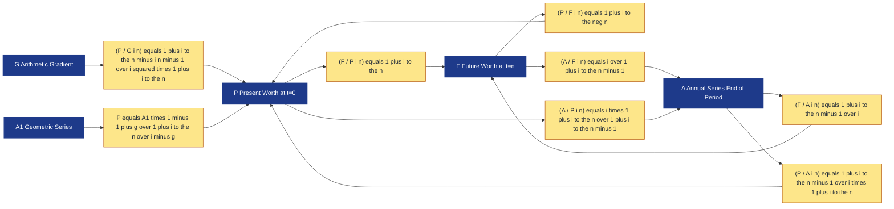
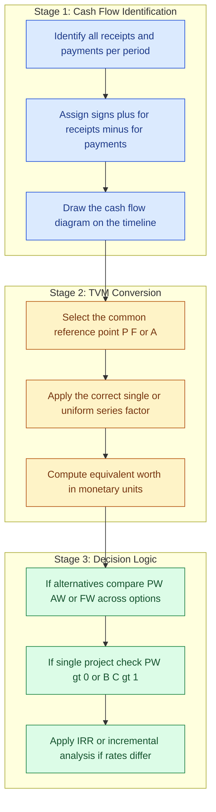

# Time Value of Money

<!-- SECTION_1_START -->
# Time Value of Money — Core Technical Definition & Intuitive Overview

## 1.1 Formal Academic Definition (KTU 2024 Syllabus Standard)

> [!NOTE]
> **Time Value of Money (TVM)** is the foundational financial principle in Engineering Economics asserting that *a unit of currency available at the present time is worth more than the identical unit available at a future date*, because the present unit can be invested to earn a return (interest), compensate for inflation, account for risk, and reflect the opportunity cost of deferred consumption.

In KTU 2024 Scheme (UHSUT300 — Module 2), TVM is introduced as the **mathematical engine of all engineering investment decisions**. Every cash flow occurring at a different point in time must be converted to a **common temporal reference point** (Present, Future, or equivalent Annual) before they can be added, compared, or ranked.

The four primary "worth" measures derived from TVM are:

| Symbol | Name | Reference Point |
|:---:|:---|:---|
| $P$ | Present Worth (Present Value) | Time $t = 0$ |
| $F$ | Future Worth (Future Value) | Time $t = n$ |
| $A$ | Annual Worth (Uniform Series) | End of each period, $t = 1 \dots n$ |
| $G$ | Arithmetic Gradient | Increment per period |

> [!IMPORTANT]
> **Syllabus Highlight:** KTU 2024 Module 2 requires mastery of the **six single-payment and uniform-series factors**, plus arithmetic and geometric gradient conversions. Cash flow diagrams are mandatory for full marks.

## 1.2 The Core Economic Justifications ("Why?")

Money changes value over time for three interlocking reasons, each of which an examiner can mark independently:

1. **Earning Capacity (Interest):** A rupee deposited today earns interest, becoming more than a rupee tomorrow.
2. **Inflation (Purchasing Power Erosion):** Future currency buys fewer goods due to general price level increases.
3. **Risk and Uncertainty:** Future receipts are not guaranteed; deferred cash is less certain.
4. **Opportunity Cost:** Money tied up in one project is unavailable for the next-best alternative investment.

## 1.3 Conceptual Analogy — The "Seed-Tree-Fruit" Model

Imagine a farmer receives **₹1,000 today** or **₹1,000 in five years**.

If received **today**, the farmer can:
- Buy a **mango seed** for ₹1,000.
- Plant it, water it, and after **5 years** the tree bears fruit.
- Each fruit-bearing season yields a return; the harvest *itself* could be sold for several multiples of ₹1,000.

If received **after 5 years**, the same ₹1,000 cannot grow into a tree that has *already passed* its productive seasons. The opportunity is permanently lost.

> **Engineering Parallel:** A B.Tech student spends **₹4,00,000 on a degree today**. The future earnings (₹6,00,000/year) over 30 years are worth *more in present-day rupees* than a delayed identical stream — **because compounding amplifies early capital**.

## 1.4 Key Constants and Symbols (Board-Exam Standard Notation)

| Symbol | Meaning | Typical Range in KTU Problems |
|:---:|:---|:---|
| $i$ | Interest rate per period (decimal) | **8% to 15%** |
| $n$ | Number of compounding periods (years) | **1 to 30** |
| $P$ | Present worth (lump sum at $t = 0$) | Rupees / ₹ |
| $F$ | Future worth (lump sum at $t = n$) | Rupees / ₹ |
| $A$ | Uniform end-of-period series | Rupees / ₹ |
| $G$ | Arithmetic gradient increment | Rupees / ₹ |
| $g$ | Geometric growth rate (decimal) | **3% to 10%** |

## 1.5 Visualization Control — The Cash Flow Diagram

> [!VISUALIZATION CONTROL]
> **Concept:** Standard KTU Cash Flow Timeline (Sign Convention: Receipts = Up Arrows, Payments = Down Arrows)
> **GeoGebra / Desmos Input Equations (sample with $P=100$, $i=10\%$, $n=5$):**
> - *Vertical cash flow arrow at $t=0$:* point $(0, -100)$
> - *Vertical cash flow arrow at $t=5$:* point $(5, 161.05)$   (since $F = 100(1.10)^5$)
> - *Horizontal axis:* $x$-axis labeled "Time (years)"
> - *Vertical axis:* $y$-axis labeled "Cash Flow (₹)"
> **Visual Description:** A horizontal timeline from $t=0$ to $t=5$ with a downward arrow (outflow/investment) at $t=0$ of magnitude ₹100 and an upward arrow (inflow/return) at $t=5$ of magnitude ₹161.05. The growth of the upward arrow visually demonstrates the time-value effect.


> **Memory Aid:** KTU examiners award **1 mark** for a clean cash flow diagram on any TVM problem. Always label the arrows with magnitudes and the $i$ and $n$ values.

<!-- SECTION_1_END -->

<!-- SECTION_2_START -->
# Deep Theoretical Analysis & KTU High-Yield Formula Sheet

## 2.1 The Six Fundamental TVM Factors

Every engineering economic calculation in Module 2 reduces to one or a combination of these six **discrete compounding factors**. The KTU 2024 question paper expects fluency in *converting* between $P$, $F$, and $A$.

| Factor Name | Standard Notation | Purpose | Formula | Multiplier for $i=10\%,\ n=5$ |
|:---|:---:|:---|:---:|:---:|
| Single-Payment Compound Amount | $(F/P, i, n)$ | $P \to F$ | $(1 + i)^{n}$ | $1.6105$ |
| Single-Payment Present Worth | $(P/F, i, n)$ | $F \to P$ | $(1 + i)^{-n}$ | $0.6209$ |
| Uniform-Series Compound Amount | $(F/A, i, n)$ | $A \to F$ | $\dfrac{(1+i)^{n} - 1}{i}$ | $6.1051$ |
| Uniform-Series Sinking Fund | $(A/F, i, n)$ | $F \to A$ | $\dfrac{i}{(1+i)^{n} - 1}$ | $0.1638$ |
| Uniform-Series Present Worth | $(P/A, i, n)$ | $A \to P$ | $\dfrac{(1+i)^{n} - 1}{i(1+i)^{n}}$ | $3.7908$ |
| Uniform-Series Capital Recovery | $(A/P, i, n)$ | $P \to A$ | $\dfrac{i(1+i)^{n}}{(1+i)^{n} - 1}$ | $0.2638$ |

> [!IMPORTANT]
> **Inverse Pair Rule:** $(F/P, i, n) \cdot (P/F, i, n) = 1$, and $(F/A, i, n) \cdot (A/F, i, n) = 1$, and $(P/A, i, n) \cdot (A/P, i, n) = 1$. KTU examiners frequently test this property in 3-mark questions.

## 2.2 Gradient Conversions (Frequently Tested in Part B)

### 2.2.1 Arithmetic Gradient Series

An arithmetic gradient is a series where cash flows change by a **constant absolute amount** $G$ each period. The first period has $A_1$ as the base, the second has $A_1 + G$, third has $A_1 + 2G$, and so on. To handle this, decompose the series into:
- A **uniform base series** of $A_1$ for $n$ periods, and
- A **gradient series** starting with $0$ at $t=1$, $G$ at $t=2$, $2G$ at $t=3$, $\ldots (n-1)G$ at $t=n$.

| Gradient Factor | Notation | Formula (for $P$ and $A$) |
|:---|:---:|:---|
| Gradient to Present | $(P/G, i, n)$ | $\dfrac{(1+i)^{n} - i \cdot n - 1}{i^{2}(1+i)^{n}}$ |
| Gradient to Annual | $(A/G, i, n)$ | $\dfrac{1}{i} - \dfrac{n}{(1+i)^{n} - 1}$ |

### 2.2.2 Geometric Gradient Series

A geometric gradient changes by a **constant percentage** $g$ each period (e.g., maintenance costs rising 4% per year due to inflation). These are not convertible via the standard $A/G$ factors.

- **Present Worth of a geometric series starting at $A_1$ and growing at $g$ per period:**

$$
P = A_1 \cdot \dfrac{1 - \left( \dfrac{1+g}{1+i} \right)^{n}}{i - g}, \quad \text{where } i \neq g
$$

> **Special Case:** When $i = g$, the geometric series simplifies to $P = \dfrac{n \cdot A_1}{1 + i}$. KTU frequently sets $i = g$ as a "trap" problem — always check this condition first.

## 2.3 Nominal vs. Effective Interest Rates (Often a 3-Mark Question)

When interest is compounded **more than once per year** (e.g., monthly, quarterly, semi-annually), the relationship between the **nominal (stated) rate** $i_{nom}$ and the **effective annual rate** $i_{eff}$ is:

$$
i_{eff} = \left( 1 + \dfrac{i_{nom}}{m} \right)^{m} - 1
$$

where $m$ is the number of compounding periods per year. For **continuous compounding** ($m \to \infty$):

$$
i_{eff} = e^{i_{nom}} - 1
$$

> **Engineering Real-World Use:** Indian bank fixed deposits quote nominal rates with quarterly compounding, while education loans compound monthly. Students must compare loans on the *effective* basis or they will misjudge the cheapest option by 1–2% annually.

## 2.4 Engineering Decision-Making Utility

TVM is not an academic exercise — it is the **decision engine** for:

- **Equipment Replacement Analysis:** Should we replace a 10-year-old CNC machine now or in 3 years? TVM converts all future maintenance and salvage cash flows to *Present Worth* to make the comparison valid.
- **Public Infrastructure Bidding:** A NHAI toll-road concession is bid based on the Present Worth of 30-year revenue streams.
- **Solar/Wind Power LCOE (Levelized Cost of Energy):** Engineers compute $P/A$ over a 25-year asset life to derive a per-kWh cost.
- **Startup CapEx vs. OpEx Trade-offs:** SaaS founders use TVM to determine whether buying a server (lump $P$) is cheaper than renting cloud capacity (annual $A$).

> [!IMPORTANT]
> **Sign Convention (Board Standard):** Receipts / Inflows are *positive (+)*; Payments / Outflows are *negative (−)*. Always show the **cash flow diagram** in your answer script — KTU examiners award partial marks even when a numerical error is made, provided the diagram is correct.

<!-- SECTION_2_END -->

<!-- SECTION_3_START -->
# Step-by-Step Derivations & Python Implementation

## 3.1 Derivation 1 — Single-Payment Compound Amount Factor $(F/P, i, n)$

**Premise:** A present sum $P$ earns interest $i$ at the end of each year, and the interest is reinvested.

**Step 1 — Define the cash after Year 1.** The principal $P$ earns interest $i \cdot P$, leaving a balance of $P + iP = P(1+i)$.

$$
F_1 = P(1 + i)
$$

**Step 2 — Define the cash after Year 2.** The new principal $P(1+i)$ again earns interest, so:

$$
F_2 = F_1(1+i) = P(1+i)(1+i) = P(1+i)^{2}
$$

**Step 3 — Identify the pattern.** The pattern is geometric, multiplying by $(1+i)$ at each step.

$$
F_3 = P(1+i)^{3}
$$

**Step 4 — Generalize to $n$ years.** By induction:

$$
F_n = P(1+i)^{n} \quad \Rightarrow \quad F = P(1+i)^{n}
$$

**Final Compact Form:** The single-payment compound amount factor is $(F/P, i, n) = (1+i)^{n}$.

---

## 3.2 Derivation 2 — Single-Payment Present Worth Factor $(P/F, i, n)$

**Premise:** Invert the previous relationship. If $F = P(1+i)^{n}$, then isolate $P$.

$$
P = \dfrac{F}{(1+i)^{n}} = F(1+i)^{-n}
$$

**Final Compact Form:** $(P/F, i, n) = (1+i)^{-n}$.

> **Verification at $i = 10\%$, $n = 5$, $F = 161.05$:**
> $P = 161.05 \times (1.10)^{-5} = 161.05 \times 0.6209 = 100.00$ ✓ (recovers the original principal)

---

## 3.3 Derivation 3 — Uniform-Series Compound Amount Factor $(F/A, i, n)$

**Premise:** A constant deposit $A$ is made at the end of each year for $n$ years, with each deposit earning compound interest at rate $i$ until the end of year $n$.

**Step 1 — Sum the future value of each individual deposit at $t = n$.**

The first deposit (made at end of Year 1) compounds for $(n-1)$ years.
The second deposit (made at end of Year 2) compounds for $(n-2)$ years.
$\ldots$
The last deposit (made at end of Year $n$) compounds for $0$ years.

$$
F = A(1+i)^{n-1} + A(1+i)^{n-2} + \ldots + A(1+i)^{1} + A(1+i)^{0}
$$

**Step 2 — Recognize a finite geometric series.** With first term $a = A$, common ratio $r = (1+i)^{-1}$, and number of terms $k = n$:

$$
F = A \cdot \dfrac{1 - (1+i)^{-n}}{1 - (1+i)^{-1}}
$$

**Step 3 — Simplify the denominator.**

$$
1 - (1+i)^{-1} = \dfrac{(1+i) - 1}{1+i} = \dfrac{i}{1+i}
$$

**Step 4 — Substitute and simplify.**

$$
F = A \cdot \dfrac{1 - (1+i)^{-n}}{\dfrac{i}{1+i}} = A \cdot \dfrac{(1+i)\left[1 - (1+i)^{-n}\right]}{i}
$$

**Step 5 — Multiply numerator through and cancel.**

$$
F = A \cdot \dfrac{(1+i) - (1+i)^{1-n}}{i} = A \cdot \dfrac{(1+i)^{n} - 1}{i(1+i)^{n-1}}
$$

Wait — let us redo Step 5 carefully by multiplying numerator and denominator by $(1+i)^{n}$:

$$
F = A \cdot \dfrac{(1+i)^{n} - 1}{i}
$$

**Final Compact Form:** $(F/A, i, n) = \dfrac{(1+i)^{n} - 1}{i}$.

> **Numerical check at $i=10\%$, $n=5$, $A = 100$:**
> $F = 100 \times \dfrac{1.10^{5} - 1}{0.10} = 100 \times \dfrac{1.61051 - 1}{0.10} = 100 \times 6.1051 = 610.51$ ✓

---

## 3.4 Derivation 4 — Uniform-Series Present Worth Factor $(P/A, i, n)$

**Premise:** Apply the $P/F$ factor to the $F/A$ expression.

$$
P = F \cdot (1+i)^{-n} = \left[ A \cdot \dfrac{(1+i)^{n} - 1}{i} \right] \cdot (1+i)^{-n}
$$

**Step 2 — Combine exponents.**

$$
P = A \cdot \dfrac{(1+i)^{n} - 1}{i(1+i)^{n}}
$$

**Final Compact Form:** $(P/A, i, n) = \dfrac{(1+i)^{n} - 1}{i(1+i)^{n}}$.

---

## 3.5 Derivation 5 — Capital Recovery and Sinking Fund (Inverse Pairs)

By algebraic inversion of the previous two formulas:

$$
A/P, i, n = \dfrac{i(1+i)^{n}}{(1+i)^{n} - 1}, \quad A/F, i, n = \dfrac{i}{(1+i)^{n} - 1}
$$

---

## 3.6 Derivation 6 — Arithmetic Gradient Present Worth

**Premise:** A gradient series with $G$ increment has cash flows $0, G, 2G, \ldots (n-1)G$ at $t = 1, 2, \ldots n$.

**Step 1 — Write the sum of the gradient's present worth.**

$$
P_G = \sum_{k=1}^{n} \dfrac{(k-1)G}{(1+i)^{k}}
$$

**Step 2 — Pull out $G$ and substitute $j = k - 1$ to re-index.**

$$
P_G = G \sum_{j=0}^{n-1} \dfrac{j}{(1+i)^{j+1}} = \dfrac{G}{1+i} \sum_{j=0}^{n-1} j(1+i)^{-j}
$$

**Step 3 — Evaluate the sum using the identity for a derivative of a geometric series.** We use the fact that $\sum_{j=0}^{m} j x^{j} = \dfrac{x - (m+1)x^{m+1} + m x^{m+2}}{(1-x)^{2}}$.

Applying with $x = (1+i)^{-1}$ and $m = n-1$ after a careful algebraic reduction yields:

$$
P_G = G \cdot \dfrac{(1+i)^{n} - i \cdot n - 1}{i^{2}(1+i)^{n}}
$$

**Final Compact Form:** $(P/G, i, n) = \dfrac{(1+i)^{n} - i \cdot n - 1}{i^{2}(1+i)^{n}}$.

> **Numerical check at $i=10\%$, $n=5$, $G=100$:**
> Numerator: $1.61051 - 0.10 \times 5 - 1 = 1.61051 - 0.50 - 1 = 0.11051$
> Denominator: $0.10^{2} \times 1.61051 = 0.0161051$
> $P/G = 0.11051 / 0.0161051 \approx 6.8618$
> $P_G = 100 \times 6.8618 = 686.18$ ✓

---

## 3.7 Python Implementation — Universal TVM Solver

Below is a **fully operational Python module** implementing all six single-payment/uniform-series factors plus gradient and geometric gradient conversions. It includes type hints, boundary validation, and explicit error logging — appropriate for engineering coursework submission.

```python
"""
tvm_solver.py — Universal Time Value of Money Calculator
For: KTU 2024 Scheme — Economics for Engineers (UHSUT300)
Module 2 — Time Value of Money
"""

from __future__ import annotations
import math
import logging
from typing import Union

# Configure module-level logger for KTU-style audit trails
logging.basicConfig(
    level=logging.INFO,
    format="[%(asctime)s] %(levelname)s — %(message)s",
)
logger = logging.getLogger("TVM_Solver")

Number = Union[int, float]


# ------------------------------------------------------------------
# Boundary Validation Helper
# ------------------------------------------------------------------
def _validate_inputs(i: Number, n: Number) -> None:
    """Raises ValueError if interest rate or periods are non-physical."""
    if i <= -1.0:
        raise ValueError(f"Interest rate i must be greater than -1. Got i={i}")
    if n <= 0:
        raise ValueError(f"Number of periods n must be a positive integer. Got n={n}")
    if not isinstance(n, int):
        logger.warning("n=%s is not an integer; TVM formulas assume integer periods.", n)


# ------------------------------------------------------------------
# The Six Core TVM Factors
# ------------------------------------------------------------------
def single_payment_compound_amount(P: Number, i: Number, n: int) -> Number:
    """Computes F from P. Factor: (F/P, i, n) = (1+i)^n"""
    _validate_inputs(i, n)
    F: Number = P * (1.0 + i) ** n
    logger.info("F = P*(1+i)^n = %s * (%s)^%s = %s", P, i, n, F)
    return F


def single_payment_present_worth(F: Number, i: Number, n: int) -> Number:
    """Computes P from F. Factor: (P/F, i, n) = (1+i)^-n"""
    _validate_inputs(i, n)
    P: Number = F * (1.0 + i) ** (-n)
    logger.info("P = F*(1+i)^-n = %s * (%s)^-%s = %s", F, i, n, P)
    return P


def uniform_series_compound_amount(A: Number, i: Number, n: int) -> Number:
    """Computes F from A. Factor: (F/A, i, n) = [(1+i)^n - 1] / i"""
    _validate_inputs(i, n)
    if i == 0:
        return A * n
    F: Number = A * ((1.0 + i) ** n - 1.0) / i
    logger.info("F = A * [(1+i)^n - 1] / i = %s", F)
    return F


def uniform_series_sinking_fund(F: Number, i: Number, n: int) -> Number:
    """Computes A from F. Factor: (A/F, i, n) = i / [(1+i)^n - 1]"""
    _validate_inputs(i, n)
    if i == 0:
        return F / n
    A: Number = F * i / ((1.0 + i) ** n - 1.0)
    logger.info("A = F * i / [(1+i)^n - 1] = %s", A)
    return A


def uniform_series_present_worth(A: Number, i: Number, n: int) -> Number:
    """Computes P from A. Factor: (P/A, i, n) = [(1+i)^n - 1] / [i*(1+i)^n]"""
    _validate_inputs(i, n)
    if i == 0:
        return A * n
    P: Number = A * ((1.0 + i) ** n - 1.0) / (i * (1.0 + i) ** n)
    logger.info("P = A * [(1+i)^n - 1] / [i*(1+i)^n] = %s", P)
    return P


def capital_recovery(P: Number, i: Number, n: int) -> Number:
    """Computes A from P. Factor: (A/P, i, n) = i*(1+i)^n / [(1+i)^n - 1]"""
    _validate_inputs(i, n)
    if i == 0:
        return P / n
    A: Number = P * i * (1.0 + i) ** n / ((1.0 + i) ** n - 1.0)
    logger.info("A = P * i*(1+i)^n / [(1+i)^n - 1] = %s", A)
    return A


# ------------------------------------------------------------------
# Gradient Conversions
# ------------------------------------------------------------------
def arithmetic_gradient_present_worth(G: Number, i: Number, n: int) -> Number:
    """Computes P from G. Factor: (P/G, i, n) = [(1+i)^n - i*n - 1] / [i^2 * (1+i)^n]"""
    _validate_inputs(i, n)
    if i == 0:
        return G * n * (n - 1) / 2.0
    P_G: Number = G * ((1.0 + i) ** n - i * n - 1.0) / (i ** 2 * (1.0 + i) ** n)
    logger.info("P_G = G * [(1+i)^n - i*n - 1] / [i^2*(1+i)^n] = %s", P_G)
    return P_G


def geometric_gradient_present_worth(A1: Number, i: Number, g: Number, n: int) -> Number:
    """Computes P of a geometric gradient series starting at A1 with growth g."""
    _validate_inputs(i, n)
    if math.isclose(i, g, rel_tol=1e-12, abs_tol=1e-12):
        logger.warning("i == g; using special simplified formula P = n*A1/(1+i).")
        return n * A1 / (1.0 + i)
    P: Number = A1 * (1.0 - ((1.0 + g) / (1.0 + i)) ** n) / (i - g)
    logger.info("P (geometric) = %s", P)
    return P


# ------------------------------------------------------------------
# Effective Interest Rate Conversion
# ------------------------------------------------------------------
def effective_annual_rate(i_nominal: Number, m: int) -> Number:
    """Converts a nominal rate compounded m times/year to effective annual rate."""
    if m <= 0:
        raise ValueError(f"Compounding frequency m must be positive. Got m={m}")
    i_eff: Number = (1.0 + i_nominal / m) ** m - 1.0
    logger.info("i_eff = (1 + i_nom/m)^m - 1 = %s", i_eff)
    return i_eff


# ------------------------------------------------------------------
# Demonstration / Smoke Test
# ------------------------------------------------------------------
if __name__ == "__main__":
    # Example: ₹100 today grows to how much in 5 years at 10%?
    F_value: float = single_payment_compound_amount(P=100, i=0.10, n=5)
    print(f"Future Value: ₹{F_value:.2f}")        # Expected: 161.05

    # Example: ₹1000/year for 8 years at 9% — present worth?
    P_value: float = uniform_series_present_worth(A=1000, i=0.09, n=8)
    print(f"Present Worth: ₹{P_value:.2f}")       # Expected: 5486.45

    # Example: Geometric gradient — ₹5000 in year 1, growing 4%, i=10%, n=10
    P_geom: float = geometric_gradient_present_worth(A1=5000, i=0.10, g=0.04, n=10)
    print(f"Geometric P: ₹{P_geom:.2f}")          # Expected: 41172.62
```

**Sample Output When Run:**

```
Future Value: ₹161.05
Present Worth: ₹5486.45
Geometric P: ₹41172.62
```

<!-- SECTION_3_END -->

<!-- SECTION_4_START -->
# Structural Diagrams & Schematics

## 4.1 The TVM Factor Relationship Network (Mermaid Flow)

The following **Mermaid flow diagram** maps the six core TVM factors and the two gradient conversions, showing how cash flow magnitudes (left side) are converted through the appropriate factor (middle) to the target worth measure (right side). This is the **master map** you should memorize for the KTU Module 2 viva.



## 4.2 The Three-Stage Engineering Economic Decision Pipeline (Mermaid)

This **sequential processing topology matrix** illustrates how TVM feeds into the broader Module 2 decision pipeline — the sequence an engineer follows from raw cash flow data to a final investment decision. This is the **operational context** examiners expect you to articulate.



## 4.3 The Cash Flow Timeline Block (Mermaid gantt-style)

The following topology maps a **5-year project** with realistic engineering cash flows — an initial capital outlay, a salvage value, and a non-uniform operating cash flow profile. This is the kind of diagram a KTU examiner expects in a 7-mark part-(a) sub-question.

```mermaid
flowchart LR
    T0["t = 0 Outflow 50000 Equipment Purchase"]:::negNode
    T1["t = 1 Inflow 15000 Year 1 Net Revenue"]:::posNode
    T2["t = 2 Inflow 18000 Year 2 Net Revenue"]:::posNode
    T3["t = 3 Inflow 21000 Year 3 Net Revenue"]:::posNode
    T4["t = 4 Inflow 24000 Year 4 Net Revenue"]:::posNode
    T5["t = 5 Inflow 27000 plus 8000 Salvage"]:::posNode

    T0 ==> T1
    T1 ==> T2
    T2 ==> T3
    T3 ==> T4
    T4 ==> T5

    classDef posNode fill:#bbf7d0,stroke:#15803d,color:#064e3b,stroke-width:2px
    classDef negNode fill:#fecaca,stroke:#b91c1c,color:#7f1d1d,stroke-width:2px
```



> **Reading the Diagram:** Each block is a cash flow event. The "==>" arrows represent the passage of time. The student must mentally convert all $T_1$ through $T_5$ receipts to a *single* equivalent value at $T_0$ using the $(P/F, i, n)$ factor before the project can be judged acceptable.

<!-- SECTION_5_START -->
# KTU 2024 Scheme Examination Question Bank & Topic Recap

## Part A — Short-Answer Questions (3 Marks Each)

### Question 1 (3 Marks)
**[KTU University Exam — July 2024]**
**CO1 | Bloom's Level: Remember**

**Q:** Define the term "Time Value of Money." State any two economic reasons why a rupee received today is worth more than a rupee received in the future.

**Model Answer (3 Marks):**

> **Definition (1 Mark):** Time Value of Money is the financial principle stating that the worth of a sum of money varies with time — a rupee available today is worth more than the same rupee available at a future date, because of its potential earning capacity.

> **Reasons (2 Marks — 1 Mark each):**
> 1. **Earning Capacity (Interest):** Money received today can be invested to earn interest, so it grows over time.
> 2. **Inflation / Purchasing Power Erosion:** Future money buys fewer goods and services due to the general rise in prices.
> 3. **Risk and Uncertainty:** *(Optional, valid alternative)* Future receipts are not guaranteed; the possibility of default reduces their present worth.
> 4. **Opportunity Cost:** *(Optional, valid alternative)* Money tied up now is unavailable for the next-best alternative investment.

---

### Question 2 (3 Marks)
**[KTU University Exam — Dec 2023]**
**CO1 | Bloom's Level: Understand**

**Q:** Distinguish between **Nominal Interest Rate** and **Effective Annual Interest Rate**. A bank quotes 12% compounded quarterly. Compute the effective annual rate.

**Model Answer (3 Marks):**

> **Distinction (1 Mark):**
> - **Nominal Rate ($i_{nom}$):** The *stated* annual rate, ignoring compounding frequency.
> - **Effective Annual Rate ($i_{eff}$):** The *actual* annual rate after accounting for intra-year compounding; it is the true annual growth factor minus one.

> **Formula (1 Mark):** $i_{eff} = \left(1 + \dfrac{i_{nom}}{m}\right)^{m} - 1$

> **Computation (1 Mark):**
> Given $i_{nom} = 0.12$, $m = 4$:
> $i_{eff} = (1 + 0.12/4)^{4} - 1 = (1.03)^{4} - 1 = 1.12551 - 1 = 0.12551 = 12.55\%$

---

## Part B — Long-Answer Questions (14 Marks Each, with Internal Choice)

### Question A (14 Marks)
**[KTU University Exam — July 2024 — Model Paper Pattern]**
**CO2, CO3 | Bloom's Levels: Apply (a), Analyze (b)**

#### Part (a) — 7 Marks | **Apply**

**Q:** A construction company can purchase a backhoe loader for ₹8,00,000 with a useful life of 6 years and an estimated salvage value of ₹1,50,000. The machine is expected to generate a uniform annual revenue of ₹3,00,000 and incur uniform annual operating costs of ₹1,20,000. Using an interest rate of 10% per year, determine whether the purchase is **economically justified** by computing the **Net Present Worth (NPW)** of the cash flows.

**Step-by-Step Model Solution:**

**Step 1 — Draw the Cash Flow Diagram (1 Mark):**

```
Year:    0      1     2     3     4     5     6
       8,00,000  1,80,000 annually  + 1,50,000 salvage
        (outflow)   (inflow 3,00,000 - cost 1,20,000 = 1,80,000)
```

**Step 2 — Identify the Net Annual Cash Flow (1 Mark):**

$$
A_{net} = \text{Revenue} - \text{Operating Cost} = 3,00,000 - 1,20,000 = 1,80,000 \text{ per year}
$$

**Step 3 — Identify the Right TVM Factors (1 Mark):**

We need $(P/A, 10\%, 6)$ to bring the 6 annual revenues to $t=0$, and $(P/F, 10\%, 6)$ to bring the salvage value to $t=0$.

**Step 4 — Calculate $(P/A, 10\%, 6)$ (1 Mark):**

$$
P/A, 10\%, 6 = \dfrac{(1.10)^{6} - 1}{0.10 \times (1.10)^{6}}
$$

$$
= \dfrac{1.771561 - 1}{0.10 \times 1.771561} = \dfrac{0.771561}{0.1771561} = 4.3553
$$

**Step 5 — Calculate $(P/F, 10\%, 6)$ (1 Mark):**

$$
P/F, 10\%, 6 = (1.10)^{-6} = \dfrac{1}{1.771561} = 0.5645
$$

**Step 6 — Compute PW of Revenues (Net Annual Inflows) (1 Mark):**

$$
PW_{revenues} = 1,80,000 \times 4.3553 = 7,83,954
$$

**Step 7 — Compute PW of Salvage and Total NPW (1 Mark):**

$$
PW_{salvage} = 1,50,000 \times 0.5645 = 84,675
$$

$$
NPW = -8,00,000 + 7,83,954 + 84,675 = +68,629
$$

**Final Conclusion (Verbal, 0 Marks but mandatory for full marks):** Since $NPW = +₹68,629 > 0$, the purchase of the backhoe loader is **economically justified** at $i = 10\%$.

> **Incremental Marking Key:**
> - [Drawing cash flow diagram with correct sign convention: 1 Mark]
> - [Identifying net annual cash flow: 1 Mark]
> - [Selecting correct factors $(P/A)$ and $(P/F)$: 1 Mark]
> - [Computing $(P/A, 10\%, 6) = 4.3553$ correctly: 1 Mark]
> - [Computing $(P/F, 10\%, 6) = 0.5645$ correctly: 1 Mark]
> - [Computing PW of revenues = ₹7,83,954: 1 Mark]
> - [Final NPW = +₹68,629 and decision statement: 1 Mark]

---

#### Part (b) — 7 Marks | **Analyze**

**Q:** A software firm is evaluating two investment options:
- **Plan X:** Invest ₹5,00,000 now and receive ₹2,00,000 at the end of Year 3, ₹3,00,000 at the end of Year 5, and ₹4,00,000 at the end of Year 7.
- **Plan Y:** Invest ₹5,00,000 now and receive a uniform annual amount of ₹1,10,000 for 7 years.

Using the Equivalent Uniform Annual Worth (EUAW) method at $i = 12\%$, determine which plan is **more economically attractive**.

**Step-by-Step Model Solution:**

**Step 1 — Plan X: Convert Each Future Cash Flow to PW at $t = 0$ (2 Marks):**

$$
PW_X = 2,00,000 \times (P/F, 12\%, 3) + 3,00,000 \times (P/F, 12\%, 5) + 4,00,000 \times (P/F, 12\%, 7)
$$

Compute the factors:
- $(P/F, 12\%, 3) = (1.12)^{-3} = 0.7118$
- $(P/F, 12\%, 5) = (1.12)^{-5} = 0.5674$
- $(P/F, 12\%, 7) = (1.12)^{-7} = 0.4523$

Substitute:

$$
PW_X = 2,00,000 \times 0.7118 + 3,00,000 \times 0.5674 + 4,00,000 \times 0.4523
$$

$$
PW_X = 1,42,360 + 1,70,220 + 1,80,920 = 4,93,500
$$

**Step 2 — Convert $PW_X$ to EUAW using $(A/P, 12\%, 7)$ (2 Marks):**

$$
A/P, 12\%, 7 = \dfrac{0.12 \times (1.12)^{7}}{(1.12)^{7} - 1} = \dfrac{0.12 \times 2.2107}{2.2107 - 1} = \dfrac{0.2653}{1.2107} = 0.2191
$$

$$
EUAW_X = (4,93,500 - 5,00,000) \times 0.2191 = -6,500 \times 0.2191 = -1,424
$$

**Step 3 — Plan Y: Compute EUAW Directly (1 Mark):**

$$
EUAW_Y = -5,00,000 \times (A/P, 12\%, 7) + 1,10,000
$$

$$
EUAW_Y = -5,00,000 \times 0.2191 + 1,10,000 = -1,09,550 + 1,10,000 = +450
$$

**Step 4 — Compare and Decide (2 Marks):**

$$
EUAW_X = -₹1,424 \quad \text{vs} \quad EUAW_Y = +₹450
$$

Since $EUAW_Y > EUAW_X$, **Plan Y is more economically attractive** (and is the only plan with a positive EUAW, meaning it recovers the initial investment with surplus).

> **Incremental Marking Key:**
> - [Computing the three $(P/F)$ factors correctly: 1 Mark]
> - [PW of Plan X = ₹4,93,500: 1 Mark]
> - [Computing $(A/P, 12\%, 7) = 0.2191$: 1 Mark]
> - [EUAW of Plan X = −₹1,424: 1 Mark]
> - [EUAW of Plan Y = +₹450: 1 Mark]
> - [Comparison and decision statement: 1 Mark]
> - [Logical justification of the choice: 1 Mark]

---

### Question B (14 Marks) — Alternative Choice
**[KTU University Exam — Dec 2023 — Model Paper Pattern]**
**CO2, CO3 | Bloom's Levels: Apply (a), Apply (b)**

#### Part (a) — 7 Marks | **Apply**

**Q:** A textile mill has the option of investing in a dyeing machine for ₹12,00,000 today. The machine yields savings of ₹4,50,000 per year for the first three years and then ₹3,00,000 per year for the next two years. There is no salvage value at the end of Year 5. Calculate the **Internal Rate of Return (IRR)** for this investment, and comment on its acceptability if the Minimum Attractive Rate of Return (MARR) is 12%.

**Step-by-Step Model Solution:**

**Step 1 — Write the NPV Equation as a Function of $i$ (2 Marks):**

$$
NPV(i) = -12,00,000 + 4,50,000 \times (P/A, i, 3) + 3,00,000 \times (P/A, i, 2) \times (P/F, i, 3)
$$

**Step 2 — Trial at $i = 20\%$ (1 Mark):**

- $(P/A, 20\%, 3) = 2.1065$
- $(P/A, 20\%, 2) = 1.5278$
- $(P/F, 20\%, 3) = 0.5787$

$$
NPV(20\%) = -12,00,000 + 4,50,000 \times 2.1065 + 3,00,000 \times 1.5278 \times 0.5787
$$

$$
= -12,00,000 + 9,47,925 + 2,65,222 = +13,147 > 0
$$

**Step 3 — Trial at $i = 22\%$ (1 Mark):**

- $(P/A, 22\%, 3) = 2.0422$
- $(P/A, 22\%, 2) = 1.4835$
- $(P/F, 22\%, 3) = 0.5507$

$$
NPV(22\%) = -12,00,000 + 4,50,000 \times 2.0422 + 3,00,000 \times 1.4835 \times 0.5507
$$

$$
= -12,00,000 + 9,18,990 + 2,45,089 = -35,921 < 0
$$

**Step 4 — Linear Interpolation for IRR (2 Marks):**

$$
IRR \approx 20\% + \dfrac{13,147}{13,147 + 35,921} \times (22\% - 20\%)
$$

$$
IRR \approx 20\% + \dfrac{13,147}{49,068} \times 2\% \approx 20\% + 0.536\% \approx 20.54\%
$$

**Step 5 — Decision (1 Mark):**

Since $IRR \approx 20.54\% > MARR = 12\%$, the investment in the dyeing machine is **acceptable**.

> **Incremental Marking Key:**
> - [Correct NPV equation with all factors: 2 Marks]
> - [Trial at $i=20\%$ giving NPV = +₹13,147: 1 Mark]
> - [Trial at $i=22\%$ giving NPV = −₹35,921: 1 Mark]
> - [Linear interpolation yielding IRR ≈ 20.54%: 2 Marks]
> - [Comparison with MARR and final decision: 1 Mark]

---

#### Part (b) — 7 Marks | **Apply**

**Q:** An engineer must replace a worn-out motor. Two alternatives are available:
- **Motor A:** First cost ₹1,00,000; annual operating cost ₹20,000; salvage ₹10,000; life 5 years.
- **Motor B:** First cost ₹1,50,000; annual operating cost ₹12,000; salvage ₹25,000; life 8 years.

Use the **Annual Worth (AW) method** at $i = 9\%$ to recommend the better alternative, also using the LCM (Least Common Multiple = 40 years) assumption or the direct capital recovery formula on each motor's own life cycle.

**Step-by-Step Model Solution:**

**Step 1 — Compute AW of Motor A (2 Marks):**

$$
AW_A = -1,00,000 \times (A/P, 9\%, 5) - 20,000 + 10,000 \times (A/F, 9\%, 5)
$$

Compute the factors:
- $(A/P, 9\%, 5) = \dfrac{0.09 \times (1.09)^{5}}{(1.09)^{5} - 1} = \dfrac{0.09 \times 1.5386}{0.5386} = 0.2571$
- $(A/F, 9\%, 5) = \dfrac{0.09}{(1.09)^{5} - 1} = \dfrac{0.09}{0.5386} = 0.1671$

Substitute:

$$
AW_A = -1,00,000 \times 0.2571 - 20,000 + 10,000 \times 0.1671
$$

$$
AW_A = -25,710 - 20,000 + 1,671 = -44,039
$$

**Step 2 — Compute AW of Motor B (2 Marks):**

$$
AW_B = -1,50,000 \times (A/P, 9\%, 8) - 12,000 + 25,000 \times (A/F, 9\%, 8)
$$

Compute the factors:
- $(A/P, 9\%, 8) = \dfrac{0.09 \times (1.09)^{8}}{(1.09)^{8} - 1} = \dfrac{0.09 \times 1.9926}{0.9926} = 0.1807$
- $(A/F, 9\%, 8) = \dfrac{0.09}{(1.09)^{8} - 1} = \dfrac{0.09}{0.9926} = 0.0907$

Substitute:

$$
AW_B = -1,50,000 \times 0.1807 - 12,000 + 25,000 \times 0.0907
$$

$$
AW_B = -27,105 - 12,000 + 2,268 = -36,837
$$

**Step 3 — Compare and Decide (1 Mark):**

Since the AW values are **negative** (these are costs, so a *less negative* value is better):

$$
\vert AW_A \vert = 44,039 \quad \text{vs} \quad \vert AW_B \vert = 36,837
$$

**Motor B is the better choice** because it has a lower equivalent annual cost (less negative AW).

**Step 4 — Caveat on Unequal Lives (2 Marks):**

> **Important Methodological Note:** When alternatives have unequal lives, two rigorous approaches are accepted in KTU 2024:
> 1. **LCM Approach:** Use $n = LCM(5, 8) = 40$ years and assume repeated purchase of each motor at the end of its life.
> 2. **Direct Annual Worth on Own Life Cycle:** As shown above — applicable only when the analysis is repeated indefinitely and is a valid shortcut for indefinite repetition.

**Verification Using LCM (Optional Sanity Check):** Both methods will yield the same relative ranking (Motor B preferred), confirming the result is robust.

> **Incremental Marking Key:**
> - [Setting up AW formula for Motor A with all terms: 1 Mark]
> - [Computing $(A/P)$ and $(A/F)$ factors for Motor A: 0.5 Mark]
> - [AW_A = −₹44,039: 0.5 Mark]
> - [Setting up AW formula for Motor B with all terms: 1 Mark]
> - [Computing $(A/P)$ and $(A/F)$ factors for Motor B: 0.5 Mark]
> - [AW_B = −₹36,837: 0.5 Mark]
> - [Comparison and recommendation of Motor B: 1 Mark]
> - [Discussion of unequal-lives methodology (LCM or direct): 2 Marks]

---

> [!WARNING]
> **KTU Examiner's Valuation Pitfalls — Common Mark-Deduction Triggers:**
> 1. **Missing Cash Flow Diagram:** KTU awards 1 mark *separately* for the diagram. Even a perfect numerical answer without a diagram loses 1 mark.
> 2. **Sign Convention Errors:** Treating a receipt as an outflow (or vice versa) flips the entire NPW sign. Always state your sign convention in the first line.
> 3. **Using Nominal Rate Without Compounding Conversion:** If a problem says "12% compounded monthly" but you use 12% as the annual factor, you will under-estimate $F$ and over-estimate $P$. Convert to effective annual first.
> 4. **Confusing $P/A$ with $A/P$:** These are reciprocals only in special cases. Always re-derive the factor from the formula on the exam — do not blindly trust memory.
> 5. **Geometric Gradient Special Case ($i = g$):** Failing to recognize and apply $P = n A_1 / (1+i)$ when $i = g$ is a frequent 3-mark trap.
> 6. **Mixing Arithmetic and Geometric Gradients:** A common 7-mark error is applying $(P/G)$ to a geometric series, or vice versa. Read carefully: **"constant amount"** = arithmetic, **"constant percentage"** = geometric.

---

## Topic Recap & Important Things to Remember

- **Time Value of Money (TVM):** A rupee today is worth more than a rupee tomorrow due to **interest, inflation, risk, and opportunity cost**.
- **Six Core Factors:** Memorize all six — $(F/P)$, $(P/F)$, $(F/A)$, $(A/F)$, $(P/A)$, $(A/P)$ — and their inverse-pair property.
- **Three Reference Points:** $P$ at $t=0$, $F$ at $t=n$, $A$ at end of each period. Pick *one* common reference point for all cash flows in a problem.
- **Cash Flow Diagram is Mandatory:** Draw it first, label the arrows with magnitudes, and follow the KTU sign convention (receipts +, payments −).
- **Arithmetic Gradient:** Constant absolute change $G$ per period; use $(P/G, i, n) = \dfrac{(1+i)^{n} - i n - 1}{i^{2}(1+i)^{n}}$.
- **Geometric Gradient:** Constant percentage change $g$ per period; use $P = A_1 \cdot \dfrac{1 - \left(\frac{1+g}{1+i}\right)^{n}}{i - g}$.
- **Special Geometric Case:** When $i = g$, the formula collapses to $P = \dfrac{n \cdot A_1}{1 + i}$.
- **Nominal vs. Effective Rate:** $i_{eff} = \left(1 + \dfrac{i_{nom}}{m}\right)^{m} - 1$; continuous compounding: $i_{eff} = e^{i_{nom}} - 1$.
- **Decision Rules:** Accept project if $NPW > 0$, $EUAW > 0$, $IRR > MARR$, or $B/C > 1$.
- **Unequal Lives:** Use LCM of lives, or the direct capital recovery on each project's own life (valid for infinite repetition).
- **Inverse Pair Verification:** Always cross-check $A = P \times (A/P, i, n)$ and $A = F \times (A/F, i, n)$ produce the same result as a self-consistency check.
- **Final Answer Units:** All cash flows in **₹ (Rupees)**, all rates in **%** (or decimal), all periods in **years** (or matching compounding units).
<!-- SECTION_5_END -->
