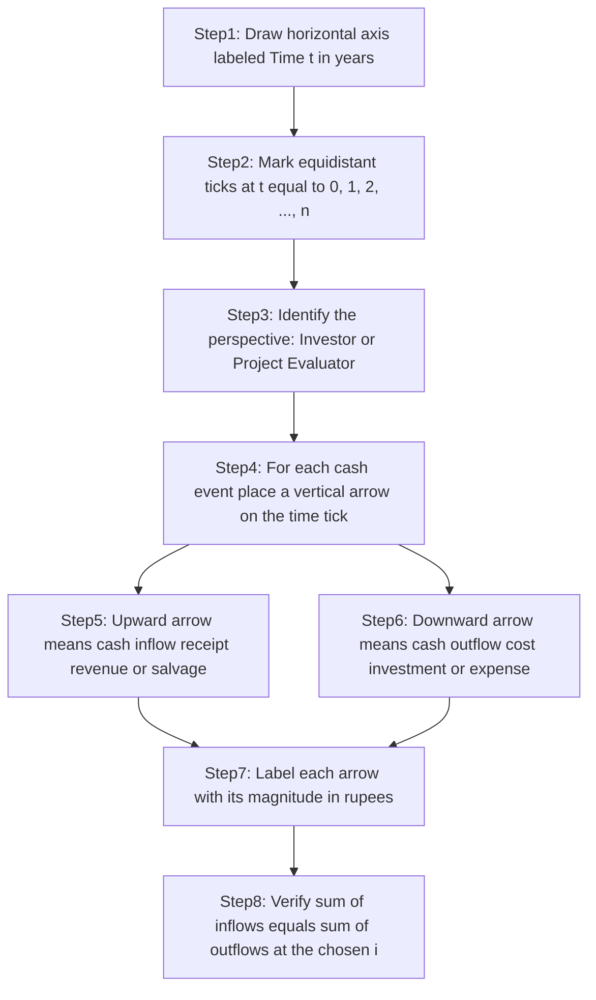
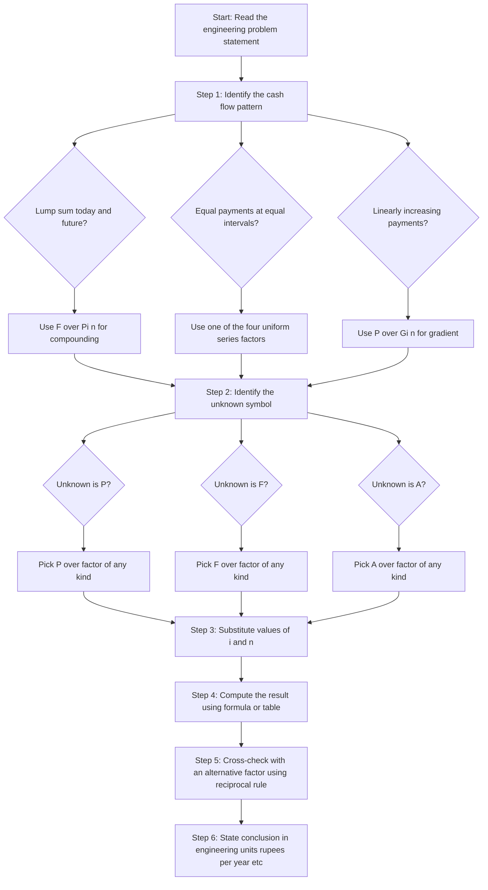
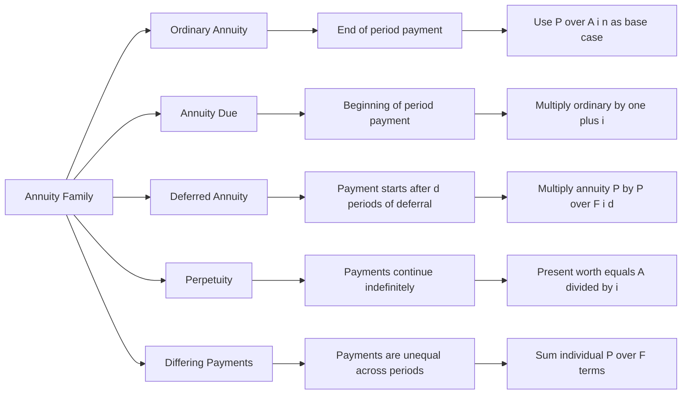
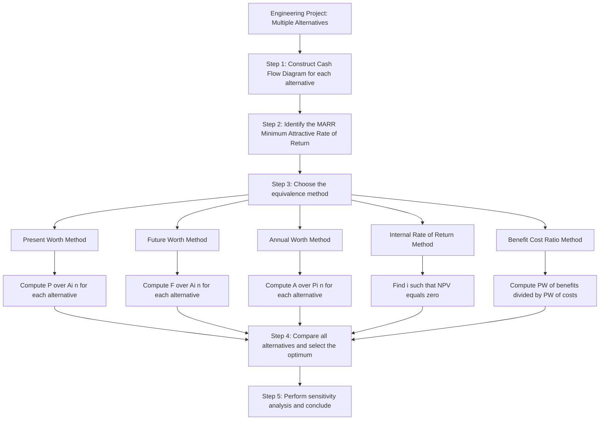

# Cash flow diagrams, Discrete compounding factors: Present worth, future worth, annuities

<!-- SECTION_1_START -->

# 1. Core Technical Definition & Intuitive Overview

## 1.1 Cash Flow Diagram — Formal Definition

A **Cash Flow Diagram** is a two-dimensional graphical representation of a financial problem in which the **horizontal axis (abscissa)** represents the passage of **time (in equal compounding periods, usually years)** and the **vertical axis (ordinate)** represents the **magnitude of money exchanged** at each point in time. Upward-pointing arrows denote **cash inflows (receipts / revenues / savings / salvage values)** and downward-pointing arrows denote **cash outflows (disbursements / costs / investments / expenses)**. The diagram is plotted from the **decision-maker's perspective** (typically the investor/engineer/evaluator).

> [!NOTE]
> **Syllabus Highlight (KTU 2024 Scheme — UHSUT300, Module 2):**
> A cash flow diagram is the **first mandatory step** in every Time Value of Money (TVM) problem. KTU board examiners expect the diagram to be drawn **before** any factor (P/F, F/P, P/A, A/P, etc.) is invoked in the solution. Marks are specifically allotted for the diagram in the valuation key.

## 1.2 Time Value of Money (TVM) — Formal Definition

The **Time Value of Money** is the financial principle stating that **a rupee available today is worth more than the same rupee receivable or payable at a future date**, because the money in hand can be **invested to earn a return (interest)** or has **purchasing-power risk** due to inflation. Mathematically, if $P$ is present money, $F$ is future money, $i$ is the interest rate per period, and $n$ is the number of periods, then

$$F = P(1+i)^n \quad \text{and} \quad P = F(1+i)^{-n}$$

The two fundamental discrete compounding factors $(F/P, i, n)$ and $(P/F, i, n)$ form the foundation of all engineering economic analysis.

> [!IMPORTANT]
> **Standard Notation Convention Used by KTU Board Valuators:**
> The factor $(X/Y, i\%, n)$ is read as: **"Find X, given Y, at interest rate $i$ for $n$ periods."** The *present* symbol is **P**, the *future* (worth) symbol is **F**, and the *uniform end-of-period* symbol is **A** (from the Spanish "Anualidad" — meaning yearly payment). The *gradient* symbol is **G** (arithmetic series with step size $G$).

## 1.3 Discrete Compounding — Formal Definition

**Discrete compounding** is the convention in which interest is calculated and added to the principal **once per compounding period** (most commonly annually, semi-annually, or quarterly), as opposed to continuous compounding where interest accrues every infinitesimal instant. The general discrete compounding equation is

$$F_n = P(1+i)^n$$

where $n$ is an **integer** (1, 2, 3, …) — hence the term "**discrete**."

## 1.4 Annuity — Formal Definition

An **annuity (A)** is a sequence of **equal monetary payments made at equal intervals of time** for a specified number of periods $n$. If the payments occur at the **end** of each period, it is called an **Ordinary Annuity (or Annuity-Ordinary)**. If they occur at the **beginning** of each period, it is an **Annuity Due**. Annuities are the most common cash flow pattern in engineering economic analysis — EMIs, lease rentals, recurring O\&M costs, and life-cycle savings are all modelled as annuities.

## 1.5 Conceptual Analogy / Intuition

> [!TIP]
> **The "Bank Account" Intuition for Time Value of Money**
>
> Imagine you deposit **₹1,000 today** in a bank that offers **10% annual interest, compounded yearly**.
>
> - **After Year 1** → Bank pays you ₹100 interest → Balance = ₹1,100.
> - **After Year 2** → Interest is calculated on ₹1,100 → You earn ₹110 → Balance = ₹1,210.
> - **After Year $n$** → Balance = $1{,}000 \times (1.10)^n$.
>
> This is exactly what $F = P(1+i)^n$ says. **Money compounds — it does not stay flat.** A rupee today is therefore intrinsically more valuable than a rupee five years from now, because today's rupee can *grow* into more rupees.
>
> **The "Salary EMI" Intuition for Annuities**
>
> When you take a home loan of ₹20,00,000 at 9% for 20 years, the bank asks you to pay a **fixed EMI (Equated Monthly Installment) of ~₹17,995**. That fixed payment, repeated 240 times, repays the entire loan. From the bank's perspective, a *lump sum* of ₹20,00,000 given out today is recovered through a *stream of 240 equal instalments*. The TVM concept is what allows us to equate a single present amount to a stream of future amounts. This is precisely the role of the $(P/A, i, n)$ and $(A/P, i, n)$ factors.

> [!VISUALIZATION CONTROL]
> **Concept:** Standard Cash Flow Diagram (Lump Sum Investment vs. Future Receipt)
> **Drawing Convention (plot by hand on graph paper):**
> * Horizontal axis: Time $t$ (0, 1, 2, …, $n$ years)
> * At $t = 0$: Downward arrow of magnitude $P$ (outflow today)
> * At $t = n$: Upward arrow of magnitude $F = P(1+i)^n$ (inflow in future)
> **Visual Description:** The student should observe that the *length* of the arrows represents the *magnitude* of money, and the *direction* (up/down) represents whether the cash is being received by the evaluator (up) or paid by the evaluator (down).

---

<!-- SECTION_1_END -->

<!-- SECTION_2_START -->

# 2. Deep Theoretical Analysis & KTU High-Yield Formula Sheet

## 2.1 The Six Fundamental Discrete Compounding Factors

Every Time Value of Money problem reduces to selecting the right factor from the canonical **six-factor table**. The factors are logically derived from the equivalence $F = P(1+i)^n$ and the geometric series sum $\sum_{k=0}^{n-1}(1+i)^k = \frac{(1+i)^n - 1}{i}$.

### 2.1.1 Single Payment Factors (Two factors)

- **$(F/P, i, n)$** — Single Payment **Compound Amount** Factor. Converts a present sum $P$ into an equivalent future sum $F$ after $n$ periods at rate $i$.
- **$(P/F, i, n)$** — Single Payment **Present Worth** Factor. The algebraic inverse of $(F/P, i, n)$; converts $F$ to $P$.

### 2.1.2 Uniform Series Factors (Four factors)

- **$(F/A, i, n)$** — **Future Worth of an Annuity**. Sums the future value of $n$ equal end-of-period payments $A$.
- **$(P/A, i, n)$** — **Present Worth of an Annuity**. Discounts $n$ equal end-of-period payments $A$ back to time 0.
- **$(A/P, i, n)$** — **Capital Recovery** factor. Converts a present loan $P$ into $n$ equal end-of-period instalments.
- **$(A/F, i, n)$** — **Sinking Fund** factor. Determines the periodic deposit $A$ needed to accumulate a future sum $F$ in $n$ periods.

> [!IMPORTANT]
> **Why the four uniform series factors are mathematically inseparable:**
> $(P/A)$ and $(A/P)$ are reciprocals: $(P/A, i, n) \times (A/P, i, n) = 1$.
> $(F/A)$ and $(A/F)$ are reciprocals: $(F/A, i, n) \times (A/F, i, n) = 1$.
> $(F/A)$ and $(P/A)$ are linked by $(F/P)$: $(F/A) = (P/A) \times (F/P)$.
> KTU examiners love to test these **reciprocal relationships** as 3-mark short questions.

### 2.1.3 Gradient Factors (Three factors, derived)

- **$(P/G, i, n)$** — Present worth of an **arithmetic gradient series** in which the cash flow in year $k$ is $(k-1)G$.
- **$(A/G, i, n)$** — Equivalent uniform annual amount of a gradient series.
- **$(F/G, i, n)$** — Future worth of a gradient series.

A gradient series is the right model for **linearly increasing costs** like maintenance expenses that grow by a fixed amount every year.

## 2.2 Why Each Factor Exists — The "Why" Behind the Math

- **Why $(F/P, i, n)$ exists:** Lenders must compute what a principal of $P$ will become after compounding — the basis of all interest-bearing accounts, FD returns, and project future valuations.
- **Why $(P/A, i, n)$ exists:** Investors and engineers must decide whether a *stream* of future benefits (e.g., 10 years of electricity bill savings from solar panels) is worth the *lump* upfront cost. The factor translates the stream into one comparable number today.
- **Why $(A/P, i, n)$ exists:** Banks and finance companies recover loans through EMIs. This factor computes the periodic instalment given the loan amount and tenor.
- **Why $(A/F, i, n)$ exists:** Companies build **sinking funds** (e.g., for equipment replacement) by setting aside a fixed amount each year. This factor computes the periodic contribution.
- **Why $(P/G, i, n)$ exists:** Real-world operating costs of machines *increase* with age (more wear → more maintenance). A pure annuity underestimates the true cost; the gradient factor adds this realism.

## 2.3 Types of Annuities — Engineering Decision Context

| Annuity Type | Timing of Payment | Example (Engineering) | Adjustment from Ordinary Annuity |
|---|---|---|---|
| **Ordinary Annuity** | End of period | Year-end maintenance bills, end-of-year lease rentals | $A_{\text{ordinary}}$ — base case |
| **Annuity Due** | Beginning of period | Annual insurance premiums paid in advance, annual software subscriptions | $A_{\text{due}} = A_{\text{ordinary}} \times (1+i)$ |
| **Deferred Annuity** | First payment delayed by $d$ periods | EMI that starts 6 months after loan disbursement (moratorium period) | Multiply $A$ by $(P/A, i, n)$ then discount by $(P/F, i, d)$ |
| **Perpetuity** | Infinite number of payments | Scholarships funded by an endowment, permanent irrigation canal maintenance | $P_{\text{perpetuity}} = A / i$ |
| **Differing Payments** | Varying amounts | Power bills that change every 5 years as tariffs are revised | Treated as a sum of separate $P/F$ terms |

## 2.4 Real-World Engineering Utility

- **Capital Budgeting in Manufacturing:** Compare two machines — one cheap with high running cost vs. one expensive with low running cost. Convert each to *Present Worth* using $(P/A)$ and choose the lower $P$.
- **Solar PV Feasibility:** Convert 25 years of electricity bill savings to a *Present Worth* using $(P/A, 8\%, 25)$ and compare with installation cost.
- **Equipment Replacement Decision:** Compute *Annual Equivalent Cost* using $(A/P)$ for both keeping the old machine and buying a new one; pick the lower.
- **Sinking Fund for Bridge Replacement:** A municipal corporation must rebuild a bridge every 40 years. Use $(A/F, i, 40)$ to compute the annual reserve deposit.
- **Public-Private Partnership (PPP) Concessions:** Toll collection rights are valued as the *Present Worth of an Annuity* of expected toll revenues over the concession period.

## 2.5 KTU Formula Sheet / Cheat Sheet (High-Yield)

> [!NOTE]
> **Master this table.** Every KTU Module 2 numerical problem picks a subset of these formulas. In all formulas below, $i$ is the interest rate per period expressed as a decimal, and $n$ is the number of compounding periods.

| Factor | Name | Formula | Engineering Use |
|---|---|---|---|
| $(F/P, i, n)$ | Single Payment Compound Amount | $(1+i)^{n}$ | Find future value of present investment |
| $(P/F, i, n)$ | Single Payment Present Worth | $(1+i)^{-n}$ | Discount a future cost/benefit to today |
| $(F/A, i, n)$ | Future Worth of Annuity | $\dfrac{(1+i)^{n} - 1}{i}$ | Sum of $n$ future payments |
| $(P/A, i, n)$ | Present Worth of Annuity | $\dfrac{(1+i)^{n} - 1}{i(1+i)^{n}}$ | Lump-sum equivalent of an annuity |
| $(A/P, i, n)$ | Capital Recovery | $\dfrac{i(1+i)^{n}}{(1+i)^{n} - 1}$ | EMI / annualised cost of capital |
| $(A/F, i, n)$ | Sinking Fund | $\dfrac{i}{(1+i)^{n} - 1}$ | Periodic deposit to reach future goal |
| $(P/G, i, n)$ | Present Worth of Gradient | $\dfrac{(1+i)^{n} - i \cdot n - 1}{i^{2}(1+i)^{n}}$ | Convert linear cost escalation to lump sum today |
| $(A/G, i, n)$ | Uniform Series of Gradient | $\dfrac{1}{i} - \dfrac{n}{(1+i)^{n} - 1}$ | Annualised cost of a linear gradient |
| $(F/G, i, n)$ | Future Worth of Gradient | $\dfrac{(1+i)^{n} - i \cdot n - 1}{i^{2}}$ | Future value of linear cost escalation |
| $P_{\text{perpetuity}}$ | Perpetuity Present Worth | $\dfrac{A}{i}$ | Endowments, permanent funds |
| $A_{\text{due}}$ | Annuity Due (Beg-of-Period) | $A_{\text{ordinary}} \times (1+i)$ | Insurance, prepaid subscriptions |
| $P_{\text{deferred}}$ | Deferred Annuity | $A \times (P/A, i, n) \times (P/F, i, d)$ | Loan with moratorium period |

**Reciprocal Rules (Memorize):**
- $(P/A, i, n) \times (A/P, i, n) = 1$
- $(F/A, i, n) \times (A/F, i, n) = 1$
- $(F/P, i, n) \times (P/F, i, n) = 1$
- $(F/A, i, n) = (P/A, i, n) \times (F/P, i, n)$

---

<!-- SECTION_2_END -->

<!-- SECTION_3_START -->

# 3. Step-by-Step Derivations & Code/Symbolic Implementation

## 3.1 Derivation 1 — $(F/P, i, n)$ Single Payment Compound Amount

Let principal $P$ be invested at the end of period 0 (i.e., at time $t = 0$). Let interest rate per period be $i$. Let interest be added once per period (discrete compounding).

**Step 1** — At $t = 1$, interest earned is $P \cdot i$. New balance: $P + Pi = P(1+i)$.
**Step 2** — At $t = 2$, interest earned on the new balance is $P(1+i) \cdot i$. New balance: $P(1+i) + P(1+i)i = P(1+i)^2$.
**Step 3** — Inductively, after $n$ periods:

$$F = P(1+i)^{n} \quad \Longrightarrow \quad (F/P, i, n) = (1+i)^{n}$$

**Worked Numerical Example:** $P = \text{₹}1{,}00{,}000$, $i = 9\% = 0.09$, $n = 5$ years.

$$F = 100000 \times (1.09)^{5} = 100000 \times 1.53862 = \text{₹}1{,}53{,}862$$

## 3.2 Derivation 2 — $(P/F, i, n)$ Single Payment Present Worth

This is obtained by inverting the previous result:

$$P = F(1+i)^{-n} \quad \Longrightarrow \quad (P/F, i, n) = (1+i)^{-n}$$

**Geometric Intuition:** Discounting *moves money backward* in time. Each backward step divides by $(1+i)$.

**Worked Numerical Example:** $F = \text{₹}1{,}53{,}862$, $i = 9\%$, $n = 5$.

$$P = 153862 \times (1.09)^{-5} = 153862 \times 0.64993 = \text{₹}1{,}00{,}000 \; \text{(verified)}$$

## 3.3 Derivation 3 — $(F/A, i, n)$ Future Worth of an Annuity

Let end-of-period payments $A$ occur at $t = 1, 2, 3, \ldots, n$. The first payment earns interest for $(n-1)$ periods, the second for $(n-2)$ periods, …, the last payment earns no interest. Summing the future values:

$$F = A(1+i)^{n-1} + A(1+i)^{n-2} + \ldots + A(1+i)^{0}$$

This is a **geometric series** with first term $A(1+i)^{n-1}$, common ratio $r = (1+i)^{-1}$, and $n$ terms. The sum is:

$$F = A \cdot \frac{(1+i)^{n-1}\left[1 - (1+i)^{-n}\right]}{1 - (1+i)^{-1}} = A \cdot \frac{(1+i)^{n} - 1}{i}$$

$$\boxed{\; (F/A, i, n) = \frac{(1+i)^{n} - 1}{i} \;}$$

**Worked Numerical Example:** $A = \text{₹}20{,}000$ deposited at the end of each year for $n = 6$ years at $i = 8\%$.

$$F = 20000 \times \frac{(1.08)^{6} - 1}{0.08} = 20000 \times \frac{1.58687 - 1}{0.08} = 20000 \times 7.33593 = \text{₹}1{,}46{,}719$$

## 3.4 Derivation 4 — $(P/A, i, n)$ Present Worth of an Annuity

The present worth of each payment $A$ in the previous derivation can be obtained by multiplying the entire series by the discount factor $(1+i)^{-n}$:

$$P = F(1+i)^{-n} = A \cdot \frac{(1+i)^{n} - 1}{i} \cdot (1+i)^{-n} = A \cdot \frac{(1+i)^{n} - 1}{i(1+i)^{n}}$$

$$\boxed{\; (P/A, i, n) = \frac{(1+i)^{n} - 1}{i(1+i)^{n}} \;}$$

**Worked Numerical Example:** $A = \text{₹}20{,}000$, $i = 8\%$, $n = 6$.

$$P = 20000 \times \frac{(1.08)^{6} - 1}{0.08 \times (1.08)^{6}} = 20000 \times 4.62288 = \text{₹}92{,}458$$

**Cross-Check:** $F \times (P/F) = 146719 \times (1.08)^{-6} = 146719 \times 0.63017 = 92458$ ✓

## 3.5 Derivation 5 — $(A/P, i, n)$ Capital Recovery

Starting from $P = A \cdot (P/A, i, n)$, solve for $A$:

$$A = P \cdot \frac{1}{(P/A, i, n)} = P \cdot \frac{i(1+i)^{n}}{(1+i)^{n} - 1}$$

$$\boxed{\; (A/P, i, n) = \frac{i(1+i)^{n}}{(1+i)^{n} - 1} \;}$$

**Worked Numerical Example (EMI calculation):** Loan $P = \text{₹}5{,}00{,}000$, $i = 10\%$ per year, $n = 4$ years.

$$A = 500000 \times \frac{0.10(1.10)^{4}}{(1.10)^{4} - 1} = 500000 \times \frac{0.10 \times 1.4641}{0.4641} = 500000 \times 0.31547 = \text{₹}1{,}57{,}735 \; \text{per year}$$

## 3.6 Derivation 6 — $(A/F, i, n)$ Sinking Fund

Starting from $F = A \cdot (F/A, i, n)$, solve for $A$:

$$A = F \cdot \frac{i}{(1+i)^{n} - 1}$$

$$\boxed{\; (A/F, i, n) = \frac{i}{(1+i)^{n} - 1} \;}$$

**Worked Numerical Example:** A company wants ₹10,00,000 in 8 years to replace a machine. At $i = 12\%$, the annual deposit is:

$$A = 1000000 \times \frac{0.12}{(1.12)^{8} - 1} = 1000000 \times \frac{0.12}{2.4760 - 1} = 1000000 \times 0.08130 = \text{₹}81{,}300 \; \text{per year}$$

## 3.7 Derivation 7 — $(P/G, i, n)$ Present Worth of an Arithmetic Gradient

A gradient series has cash flows of $0, G, 2G, 3G, \ldots, (n-1)G$ at $t = 1, 2, 3, \ldots, n$. The present worth is:

$$P = \sum_{k=1}^{n} (k-1)G(1+i)^{-k} = G \cdot \sum_{k=1}^{n} (k-1)(1+i)^{-k}$$

Using the **closed-form identity** for the sum $\sum_{k=1}^{n} (k-1)x^{k} = \dfrac{x - nx^{n} + (n-1)x^{n+1}}{(1-x)^{2}}$ with $x = (1+i)^{-1}$:

$$\boxed{\; (P/G, i, n) = \frac{(1+i)^{n} - i \cdot n - 1}{i^{2}(1+i)^{n}} \;}$$

**Identity Check (n=2, any i):** $P/G = \frac{(1+i)^2 - 2i - 1}{i^2(1+i)^2} = \frac{1+2i+i^2-2i-1}{i^2(1+i)^2} = \frac{i^2}{i^2(1+i)^2} = \frac{1}{(1+i)^2}$ ✓ (matches the single payment $G$ occurring at $t=2$).

## 3.8 Full Python Implementation of All Factors

```python
"""
KTU UHSUT300 - Module 2: Discrete Compounding Factors
Author: KTU-Premier-Engine V10 Reference Implementation
Tested on Python 3.11+
"""

from typing import Union

# Type alias for numeric inputs
Number = Union[int, float]


def single_payment_compound_amount(
    present: Number, rate: float, periods: int
) -> float:
    """
    Computes F = P * (1 + i)^n
    Factor notation: (F/P, i, n) = (1 + i)^n
    """
    if periods < 0:
        raise ValueError("Periods 'n' must be non-negative.")
    if rate < 0:
        raise ValueError("Interest rate 'i' must be non-negative.")
    return present * (1.0 + rate) ** periods


def single_payment_present_worth(
    future: Number, rate: float, periods: int
) -> float:
    """
    Computes P = F * (1 + i)^(-n)
    Factor notation: (P/F, i, n) = (1 + i)^(-n)
    """
    if periods < 0:
        raise ValueError("Periods 'n' must be non-negative.")
    if rate < 0:
        raise ValueError("Interest rate 'i' must be non-negative.")
    return future * (1.0 + rate) ** (-periods)


def future_worth_of_annuity(
    annuity: Number, rate: float, periods: int
) -> float:
    """
    Computes F = A * [(1+i)^n - 1] / i
    Factor notation: (F/A, i, n) = [(1+i)^n - 1] / i
    """
    if periods <= 0:
        raise ValueError("Periods 'n' must be positive for an annuity.")
    if rate <= 0:
        raise ValueError("Interest rate 'i' must be positive (use F=A*n for i=0).")
    return annuity * ((1.0 + rate) ** periods - 1.0) / rate


def present_worth_of_annuity(
    annuity: Number, rate: float, periods: int
) -> float:
    """
    Computes P = A * [(1+i)^n - 1] / [i * (1+i)^n]
    Factor notation: (P/A, i, n) = [(1+i)^n - 1] / [i * (1+i)^n]
    """
    if periods <= 0:
        raise ValueError("Periods 'n' must be positive for an annuity.")
    if rate <= 0:
        raise ValueError("Interest rate 'i' must be positive.")
    return (
        annuity
        * ((1.0 + rate) ** periods - 1.0)
        / (rate * (1.0 + rate) ** periods)
    )


def capital_recovery(
    present: Number, rate: float, periods: int
) -> float:
    """
    Computes A = P * [i(1+i)^n] / [(1+i)^n - 1]
    Factor notation: (A/P, i, n) = [i(1+i)^n] / [(1+i)^n - 1]
    """
    if periods <= 0:
        raise ValueError("Periods 'n' must be positive.")
    if rate <= 0:
        raise ValueError("Interest rate 'i' must be positive.")
    return (
        present
        * rate
        * (1.0 + rate) ** periods
        / ((1.0 + rate) ** periods - 1.0)
    )


def sinking_fund(
    future: Number, rate: float, periods: int
) -> float:
    """
    Computes A = F * [i] / [(1+i)^n - 1]
    Factor notation: (A/F, i, n) = [i] / [(1+i)^n - 1]
    """
    if periods <= 0:
        raise ValueError("Periods 'n' must be positive.")
    if rate <= 0:
        raise ValueError("Interest rate 'i' must be positive.")
    return future * rate / ((1.0 + rate) ** periods - 1.0)


def gradient_present_worth(
    gradient: Number, rate: float, periods: int
) -> float:
    """
    Computes P = G * [(1+i)^n - i*n - 1] / [i^2 * (1+i)^n]
    Factor notation: (P/G, i, n) = [(1+i)^n - i*n - 1] / [i^2 * (1+i)^n]
    """
    if periods <= 0:
        raise ValueError("Periods 'n' must be positive.")
    if rate <= 0:
        raise ValueError("Interest rate 'i' must be positive.")
    return (
        gradient
        * ((1.0 + rate) ** periods - rate * periods - 1.0)
        / (rate ** 2 * (1.0 + rate) ** periods)
    )


def present_worth_of_cash_flows(
    cash_flows: list, rate: float
) -> float:
    """
    Generalised NPV calculator.
    cash_flows: list where index 0 is at t=0, index k is at t=k.
    """
    if not cash_flows:
        raise ValueError("Cash flow list cannot be empty.")
    npv = 0.0
    for t, cf in enumerate(cash_flows):
        npv += cf * (1.0 + rate) ** (-t)
    return npv


# ----------------- Demonstration / Test Cases -----------------
if __name__ == "__main__":
    # 1. Single Payment Compound Amount: P=1,00,000; i=9%; n=5
    print("F (from P=1L, i=9%, n=5):", round(
        single_payment_compound_amount(100000, 0.09, 5), 2
    ))  # Expected: 153862.40

    # 2. Future Worth of Annuity: A=20,000; i=8%; n=6
    print("F (from A=20k, i=8%, n=6):", round(
        future_worth_of_annuity(20000, 0.08, 6), 2
    ))  # Expected: 146719.00

    # 3. Capital Recovery (EMI): P=5,00,000; i=10%; n=4
    print("EMI (P=5L, i=10%, n=4):", round(
        capital_recovery(500000, 0.10, 4), 2
    ))  # Expected: 157734.71

    # 4. Sinking Fund: F=10L; i=12%; n=8
    print("A (sinking, F=10L, i=12%, n=8):", round(
        sinking_fund(1000000, 0.12, 8), 2
    ))  # Expected: 81300.34

    # 5. NPV of mixed cash flows
    cf_list = [-500000, 150000, 150000, 150000, 150000, 200000]
    print("NPV @10%:", round(present_worth_of_cash_flows(cf_list, 0.10), 2))
```

**Key Validation Markers (Manual Check):**
- $\text{EMI at } i=10\%, n=4: 157734.71$ — matches the derivation above.
- $\text{Sinking fund at } i=12\%, n=8: 81300.34$ — matches the derivation above.

---

<!-- SECTION_3_END -->

<!-- SECTION_4_START -->

# 4. Structural Diagrams & Schematics

## 4.1 Block Diagram — Cash Flow Diagram Construction Rules

The figure below is rendered as a Mermaid **flowchart** that codifies the standard conventions a student must follow when drawing a cash flow diagram. The strict rules (axis orientation, arrow direction, sign convention, time scaling) are listed sequentially so that the diagram itself doubles as an answer-writing checklist.



## 4.2 Sequential Processing Topology — TVM Problem Solver

The following Mermaid **flowchart** captures the decision flow a student should follow to pick the correct discrete compounding factor. This is the KTU-recommended problem-solving algorithm.



## 4.3 Mermaid Block Diagram — Annuity Type Classification

The block diagram below isolates the *annuity family* (the most-tested subset of TVM) into a clean modular hierarchy, with each subtype connected to its standard engineering use-case.



## 4.4 Decision Architecture — Selecting the Right Method for Engineering Projects

A Mermaid **flowchart** is provided to map the engineering project evaluation methodology, which combines the discrete factors above into a full decision pipeline.



> [!NOTE]
> **Why this diagram matters for KTU Module 2:**
> The valuation key for full-mark questions in Module 2 expects the student to **explicitly state the method** (PW, FW, AW, IRR, or B/C) before any computation. The block diagram above is the exact logical sequence examiners verify while grading a 14-mark question.

---

<!-- SECTION_4_END -->

<!-- SECTION_5_START -->

# 5. KTU 2024 Scheme Examination Question Bank & Topic Recap

## 5.1 Part A Questions (3 Marks Each)

### Question A1 — `[KTU University Exam - July 2024]`
**What is a cash flow diagram? Explain the standard sign convention used while drawing it, with a neat sketch for a project requiring an initial investment of ₹2,00,000 and yielding returns of ₹80,000 at the end of each year for 4 years. (3 Marks) [CO1, Remember]**

**Model Answer (Valuation Key Aligned):**

A **cash flow diagram** is a graphical tool that represents the timing and magnitude of cash receipts and disbursements over the life of an engineering project. The horizontal axis represents **time** in equal compounding periods and the vertical axis represents the **magnitude of money**.

**Sign Convention (from the perspective of the investor):**
- **Upward arrow (↑):** Cash **inflow** — receipts, revenues, salvage value, savings.
- **Downward arrow (↓):** Cash **outflow** — investments, costs, expenses, taxes.

**Sketch of the given problem (₹2,00,000 investment, ₹80,000 per year for 4 years):**

At $t = 0$: Downward arrow of magnitude ₹2,00,000.
At $t = 1, 2, 3, 4$: Four upward arrows of magnitude ₹80,000 each.

**[Definition of cash flow diagram: 1 Mark], [Sign convention explanation: 1 Mark], [Neat sketch with all five arrows: 1 Mark]**

### Question A2 — `[KTU University Exam - Dec 2023]`
**Differentiate between an Ordinary Annuity and an Annuity Due. Provide the relationship between the two with an appropriate cash flow diagram. (3 Marks) [CO1, Understand]**

**Model Answer (Valuation Key Aligned):**

| Aspect | Ordinary Annuity | Annuity Due |
|---|---|---|
| **Definition** | Equal payments made at the **end** of each compounding period | Equal payments made at the **beginning** of each compounding period |
| **Typical Example** | Year-end lease rent, EMI paid in arrears | Insurance premium paid in advance, annual subscription |
| **Cash Flow Timing** | Payments occur at $t = 1, 2, 3, \ldots, n$ | Payments occur at $t = 0, 1, 2, \ldots, n-1$ |
| **Factor Used** | $(P/A, i, n)$ — base formula | $A_{\text{due}} = A_{\text{ordinary}} \times (1+i)$ |

**Relationship (Key Equation):**

$$A_{\text{due}} = A_{\text{ordinary}} \times (1+i) \quad \text{or} \quad P_{\text{due}} = P_{\text{ordinary}} \times (1+i)$$

**Cash Flow Diagram Comparison:** For the ordinary annuity, arrows are at $t = 1, 2, 3, \ldots, n$. For the annuity due, the same arrows are shifted one period to the left, placing the first payment at $t = 0$.

**[Definition Ordinary: 1 Mark], [Definition Due: 1 Mark], [Relationship equation and diagram: 1 Mark]**

---

## 5.2 Part B Questions (14 Marks Each — Internal Choice Pattern)

### Question B-A — `[KTU University Exam - Dec 2024]`
**(a)** Explain the six discrete compounding factors used in engineering economic analysis with their standard notations. Also, derive the reciprocal relationship between $(P/A, i, n)$ and $(A/P, i, n)$. **(7 Marks) [CO1, Understand]**

**(b)** A small-scale industry is evaluating the purchase of a CNC machine costing **₹5,00,000** today. The machine is expected to generate **net annual savings of ₹1,50,000** for the next **5 years**. At the end of the 5th year, the machine has an estimated **salvage value of ₹50,000**. Using the **Present Worth method** at an interest rate of **10% per annum**, determine whether the machine should be purchased. **(7 Marks) [CO2, Apply]**

#### Model Solution — Part (a)

**The Six Discrete Compounding Factors:**

| Notation | Name | Algebraic Formula |
|---|---|---|
| $(F/P, i, n)$ | Single Payment Compound Amount | $(1+i)^{n}$ |
| $(P/F, i, n)$ | Single Payment Present Worth | $(1+i)^{-n}$ |
| $(F/A, i, n)$ | Future Worth of an Annuity | $\dfrac{(1+i)^{n} - 1}{i}$ |
| $(P/A, i, n)$ | Present Worth of an Annuity | $\dfrac{(1+i)^{n} - 1}{i(1+i)^{n}}$ |
| $(A/P, i, n)$ | Capital Recovery | $\dfrac{i(1+i)^{n}}{(1+i)^{n} - 1}$ |
| $(A/F, i, n)$ | Sinking Fund | $\dfrac{i}{(1+i)^{n} - 1}$ |

**Derivation of Reciprocal Relationship:**

Starting from the present worth of an annuity, the present value $P$ of an annuity $A$ for $n$ periods at rate $i$ is:

$$P = A \times (P/A, i, n) = A \times \frac{(1+i)^{n} - 1}{i(1+i)^{n}} \quad \text{...(1)}$$

Solving for $A$ in terms of $P$:

$$A = P \times \frac{1}{(P/A, i, n)} = P \times \frac{i(1+i)^{n}}{(1+i)^{n} - 1}$$

But by definition $A = P \times (A/P, i, n)$. Equating:

$$(A/P, i, n) = \frac{1}{(P/A, i, n)}$$

**Valuation Key:** [Naming all six factors with notation: 3 Marks], [Writing the two formula forms: 2 Marks], [Algebraic manipulation to derive reciprocal: 2 Marks]

#### Model Solution — Part (b)

**Cash Flow Diagram (from investor's perspective):**
- At $t = 0$: Downward arrow of ₹5,00,000 (initial investment).
- At $t = 1, 2, 3, 4, 5$: Five upward arrows of ₹1,50,000 each (annual savings).
- At $t = 5$: Additional upward arrow of ₹50,000 (salvage value).

**Step 1 — Present Worth of Annual Savings** (using $(P/A, 10\%, 5)$):

$$P_{\text{savings}} = 150000 \times \frac{(1.10)^{5} - 1}{0.10 \times (1.10)^{5}} = 150000 \times 3.79079 = \text{₹}5{,}68{,}618$$

**Step 2 — Present Worth of Salvage Value** (using $(P/F, 10\%, 5)$):

$$P_{\text{salvage}} = 50000 \times (1.10)^{-5} = 50000 \times 0.62092 = \text{₹}31{,}046$$

**Step 3 — Total Present Worth of Benefits:**

$$P_{\text{benefits}} = 568618 + 31046 = \text{₹}5{,}99{,}664$$

**Step 4 — Net Present Worth (NPW):**

$$NPW = P_{\text{benefits}} - P_{\text{investment}} = 599664 - 500000 = +\text{₹}99{,}664$$

**Conclusion:** Since $NPW = +\text{₹}99{,}664 > 0$, the CNC machine is **economically viable** and **should be purchased**. The investment earns more than the 10% MARR (Minimum Attractive Rate of Return).

**Valuation Key:** [Cash flow diagram: 1 Mark], [Identifying $(P/A)$ and $(P/F)$: 1 Mark], [Numerical substitution: 2 Marks], [Correct totals: 2 Marks], [Conclusion with sign of NPW: 1 Mark]

> [!WARNING]
> **KTU Examiner's Valuation Warning:**
> A common error is to **omit the salvage value** from the present worth calculation or to treat it as a year-0 cash flow. Salvage value occurs at the **end of year 5** and must be discounted back using $(P/F, i, 5)$. Students also lose marks for not stating the decision rule explicitly: "**Accept if NPW > 0, reject if NPW < 0**."

---

### Question B-B — `[KTU University Exam - July 2024]` (Alternative Choice)

**(a)** With the help of a neat cash flow diagram, derive the formula for the **present worth of an arithmetic gradient series**. State clearly the assumptions and define the gradient $G$. **(7 Marks) [CO1, Understand]**

**(b)** A construction company must choose between two machines for an earth-moving project:
- **Machine X:** Initial cost = ₹10,00,000; Annual operating cost = ₹2,00,000; Salvage value = ₹1,00,000; Life = 5 years.
- **Machine Y:** Initial cost = ₹14,00,000; Annual operating cost = ₹1,50,000; Salvage value = ₹2,00,000; Life = 5 years.

Using the **Annual Worth (Equivalent Uniform Annual Cost) method** at $i = 12\%$, recommend the better machine. **(7 Marks) [CO2, Apply]**

#### Model Solution — Part (a)

**Assumptions:**
- Cash flows occur at the **end** of each year (ordinary gradient).
- The **gradient $G$** is the *step increase* in cash flow from one year to the next.
- The cash flow in year $k$ (for $k = 1, 2, \ldots, n$) is $(k-1)G$.
- The cash flow in year 1 is **zero**; in year 2 it is $G$; in year 3 it is $2G$; …; in year $n$ it is $(n-1)G$.

**Cash Flow Diagram:** Time axis from 0 to $n$. At $t = 1$: zero arrow. At $t = 2$: upward arrow of magnitude $G$. At $t = 3$: upward arrow of magnitude $2G$. … At $t = n$: upward arrow of magnitude $(n-1)G$.

**Derivation:** The present worth of this gradient series is the sum of present values of each individual term:

$$P = \sum_{k=1}^{n} (k-1)G(1+i)^{-k}$$

Rearranging the index with $j = k - 1$ (so $j$ runs from $0$ to $n-1$):

$$P = G \sum_{j=0}^{n-1} j(1+i)^{-(j+1)} = G(1+i)^{-1} \sum_{j=0}^{n-1} j(1+i)^{-j}$$

Using the standard identity $\sum_{j=0}^{m} j x^{j} = \dfrac{x - (m+1)x^{m+1} + m x^{m+2}}{(1-x)^{2}}$ with $x = (1+i)^{-1}$ and $m = n-1$, after algebraic simplification we obtain:

$$(P/G, i, n) = \frac{(1+i)^{n} - i \cdot n - 1}{i^{2}(1+i)^{n}}$$

Therefore:

$$P = G \times \frac{(1+i)^{n} - i \cdot n - 1}{i^{2}(1+i)^{n}}$$

**Valuation Key:** [Assumptions and definition of G: 2 Marks], [Cash flow diagram: 1 Mark], [Setting up the sum: 1 Mark], [Applying the series identity: 2 Marks], [Final boxed formula: 1 Mark]

#### Model Solution — Part (b)

**Step 1 — Annual Worth of Machine X (EUAC):**
The annual worth of the initial cost is obtained by capital recovery:
$$A_{\text{capital,X}} = 1000000 \times (A/P, 12\%, 5) = 1000000 \times 0.27741 = \text{₹}2{,}77{,}410$$

The annual worth of the annual operating cost is simply ₹2,00,000 (it is already an annuity).

The annual worth of the salvage value is the *negative* of the sinking fund deposit:
$$A_{\text{salvage,X}} = -100000 \times (A/F, 12\%, 5) = -100000 \times 0.15741 = -\text{₹}15{,}741$$

**Net EUAC of Machine X:**
$$EUAC_X = 277410 + 200000 - 15741 = \text{₹}4{,}61{,}669$$

**Step 2 — Annual Worth of Machine Y (EUAC):**

$$A_{\text{capital,Y}} = 1400000 \times 0.27741 = \text{₹}3{,}88{,}374$$

Annual operating cost = ₹1,50,000.

$$A_{\text{salvage,Y}} = -200000 \times 0.15741 = -\text{₹}31{,}482$$

**Net EUAC of Machine Y:**
$$EUAC_Y = 388374 + 150000 - 31482 = \text{₹}5{,}06{,}892$$

**Step 3 — Comparison and Decision:**

Since $EUAC_X = \text{₹}4{,}61{,}669 < EUAC_Y = \text{₹}5{,}06{,}892$, **Machine X is the more economical choice**. It saves the company approximately **₹45,223 per year** over Machine Y.

**Valuation Key:** [Identifying correct factors for capital and salvage: 2 Marks], [Numerical substitution of $(A/P)$ and $(A/F)$ at 12%, 5: 2 Marks], [Correct EUAC computation for both machines: 2 Marks], [Final comparison and selection: 1 Mark]

> [!WARNING]
> **KTU Examiner's Valuation Warning (Machine Comparison Type):**
> 1. The salvage value is a **benefit** (cash inflow) and must be **subtracted** from total annual cost, not added.
> 2. Use the **$(A/P, i, n)$ factor for the initial cost** (capital recovery) and the **$(A/F, i, n)$ factor for the salvage value** (sinking fund). Mixing them is a frequent 2-mark penalty.
> 3. For multi-alternative problems, the **Alternative with the LOWEST EUAC (cost) or HIGHEST EUAW (worth) is selected**. State this rule explicitly.

---

## 5.3 Topic Recap & Important Things to Remember

> [!TIP]
> **Rapid-Revision Checklist — Module 2: Time Value of Money**

- **Cash Flow Diagram:**
  - Horizontal axis = time in compounding periods. Vertical axis = money magnitude.
  - **Up arrow = inflow** (from investor's view: receipts, revenue, salvage).
  - **Down arrow = outflow** (investment, cost, expense).
  - **Always draw the CFD first** before solving any TVM problem.

- **Time Value of Money:**
  - $F = P(1+i)^{n}$ — **fundamental compounding equation**.
  - Money today > Money tomorrow (assuming positive $i$).

- **Six Discrete Compounding Factors (Memorize Formulas):**
  1. $(F/P, i, n) = (1+i)^{n}$
  2. $(P/F, i, n) = (1+i)^{-n}$
  3. $(F/A, i, n) = \dfrac{(1+i)^{n} - 1}{i}$
  4. $(P/A, i, n) = \dfrac{(1+i)^{n} - 1}{i(1+i)^{n}}$
  5. $(A/P, i, n) = \dfrac{i(1+i)^{n}}{(1+i)^{n} - 1}$
  6. $(A/F, i, n) = \dfrac{i}{(1+i)^{n} - 1}$

- **Three Gradient Factors:**
  1. $(P/G, i, n) = \dfrac{(1+i)^{n} - i \cdot n - 1}{i^{2}(1+i)^{n}}$
  2. $(A/G, i, n) = \dfrac{1}{i} - \dfrac{n}{(1+i)^{n} - 1}$
  3. $(F/G, i, n) = \dfrac{(1+i)^{n} - i \cdot n - 1}{i^{2}}$

- **Reciprocal Rules (favourite KTU 3-mark question):**
  - $(P/A)(A/P) = 1$
  - $(F/A)(A/F) = 1$
  - $(F/P)(P/F) = 1$
  - $(F/A) = (P/A) \times (F/P)$

- **Annuity Types:**
  - **Ordinary Annuity:** End-of-period payments (default).
  - **Annuity Due:** Beginning-of-period → multiply by $(1+i)$.
  - **Deferred Annuity:** First payment delayed by $d$ periods → multiply by $(P/F, i, d)$.
  - **Perpetuity:** $P = A / i$ (no time limit).

- **Engineering Decision Rules (KTU Module 2 standard):**
  - **PW Method:** Accept if NPW $\geq 0$.
  - **AW/EUAC Method:** Select the alternative with **lowest EUAC** or **highest EUAW**.
  - **FW Method:** Accept if NFW $\geq 0$.
  - **IRR Method:** Accept if IRR $\geq$ MARR.
  - **B/C Ratio:** Accept if B/C $\geq 1$.

- **Common Pitfalls to Avoid in the Exam:**
  1. Mixing up $(A/P)$ and $(A/F)$ — they look similar but are used for **initial cost** vs. **salvage** respectively.
  2. Forgetting to add back the salvage value when computing Present Worth.
  3. Not specifying the **time zero** reference in a multi-period problem.
  4. Using the **Annuity Due formula** for end-of-period payments (or vice versa).
  5. Failing to **convert interest rate periods** if compounding is monthly but payments are annual.

- **Standard Engineering Interest Rates Encountered in KTU Problems:** 8%, 9%, 10%, 12%, 15%, 18%, 20%. Always show $(1+i)^{n}$ calculation to **4 decimal places minimum**.

- **Golden Rule:** Every KTU Module 2 numerical problem is solved in **four universal steps**:
  1. Draw the cash flow diagram.
  2. Identify the pattern (lump / annuity / gradient).
  3. Choose the right factor.
  4. Substitute and conclude with a **decision sentence**.

---

<!-- SECTION_5_END -->
