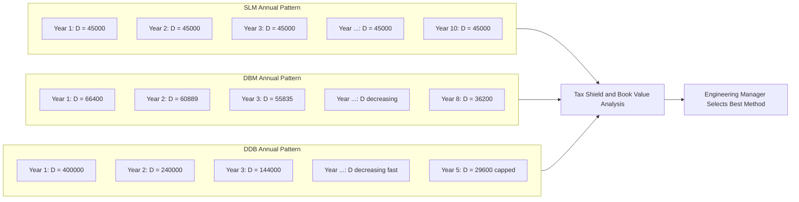
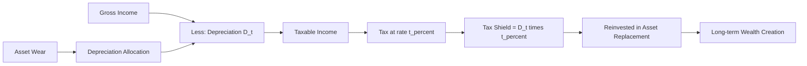

# Depreciation: Straight line, declining balance methods

<!-- SECTION_1_START -->
# Depreciation: Straight Line & Declining Balance Methods

## 1.1 Formal Academic Definition

> [!NOTE]
> **Depreciation (KTU 2024 Syllabus Definition):**
> Depreciation is the **systematic and rational allocation of the depreciable cost (acquisition cost minus salvage value) of a tangible fixed asset over its estimated useful economic life**, in accordance with the *Matching Principle* of accounting. It represents the **non-cash expense** that accounts for the wear, tear, obsolescence, and passage-of-time exhaustion of an asset's service potential.

Where:
- **Depreciable Cost** = Original Cost ($C$) $-$ Salvage Value ($S$)
- **Useful Life** ($n$) = Estimated productive life in years
- **Book Value (BV)** at any year = Original Cost $-$ Accumulated Depreciation
- **Salvage Value (S)** = Estimated net realizable value at the end of useful life (also called *Scrap Value*)

> [!IMPORTANT]
> **KTU Board Emphasis:** Depreciation is **NOT** a cash outflow. It is an *accounting allocation* that reduces taxable income. The actual cash impact occurs indirectly through reduced tax liability (Tax Shield = Depreciation × Tax Rate).

## 1.2 Causes of Depreciation

| # | Cause | Plain English Meaning |
|---|-------|----------------------|
| 1 | **Physical Wear & Tear** | Machine parts physically degrade from use |
| 2 | **Physical Deterioration** | Rust, corrosion, weathering over time |
| 3 | **Functional Obsolescence** | Asset becomes inadequate for new technology |
| 4 | **Technological Obsolescence** | Better/cheaper alternatives enter the market |
| 5 | **Depletion** | Extraction of natural resources (mines, oil wells) |
| 6 | **Accidents / Erosion** | Sudden physical damage reducing life |

## 1.3 Intuitive Analogy: The "Family Car" Example

> [!TIP]
> **Imagine you buy a Maruti Swift for ₹8,00,000.** You know that in 10 years, the car will not be worth the same — it will fetch only about ₹2,00,000 in the resale market (salvage value). The car loses value every year, not because you *paid* cash for the loss, but because its **capacity to provide service (transportation) declines**.
>
> - **Straight Line Method** = "I will mentally accept that I lose ₹60,000 of value **every year equally**" — like a flat monthly EMI concept.
> - **Declining Balance Method** = "My car loses value **fastest in year 1** (₹1,60,000 if 20% rate) and smaller amounts in later years" — like the rear-view mirror showing the past receding quickly.
>
> This mental depreciation helps the business set aside money for **future replacement** — that is the *real engineering economics goal* of depreciation accounting.

## 1.4 Key Terminology Master-List

| Term | Symbol | Meaning |
|------|--------|---------|
| Original Cost / Acquisition Cost | $C$ or $P$ | Total capitalized cost to make asset ready for use |
| Salvage Value / Scrap Value | $S$ | Net realisable value at end of useful life |
| Useful Life | $n$ | Number of years (or units) of productive service |
| Depreciable Base | $C - S$ | Total amount to be depreciated |
| Book Value (Year $t$) | $BV_t$ | $C -$ (Accumulated Depreciation up to year $t$) |
| Depreciation Charge (Year $t$) | $D_t$ | Expense booked in year $t$ |
| Accumulated Depreciation | $\sum D_t$ | Sum of all depreciation up to year $t$ |
| Fixed Rate of Decline | $r$ | Constant percentage applied to book value (DBM) |

## 1.5 Visualization Callout

> [!VISUALIZATION CONTROL]
> **Concept:** Comparative Book Value Decay Curves (SLM vs DBM vs DDB)
> **Desmos Input Equations (with $C=100$, $S=10$, $n=10$):**
> * `SLM: y1 = 100 - 9*x` (linear decline)
> * `DBM (r=10%): y2 = 100*(0.9)^x` (gentle curve)
> * `DDB (r=20%): y3 = 100*(0.8)^x` (steep curve)
> * `Salvage Line: y4 = 10` (asymptote)
> **Visual Description:** X-axis = Years (0 to 10), Y-axis = Book Value (0 to 100). All three curves start at 100, and at $x=10$ converge near the salvage line. **SLM is a straight diagonal line; DBM and DDB are convex decay curves, with DDB dropping fastest in early years and then flattening.**

<!-- SECTION_1_END -->

<!-- SECTION_2_START -->
# Deep Theoretical Analysis & KTU High-Yield Formula Sheet

## 2.1 Method 1 — Straight Line Method (SLM)

> [!IMPORTANT]
> **Also called: Fixed Instalment Method / Original Cost Method / Constant Charge Method**
> In SLM, the **same amount of depreciation is charged every year** over the useful life of the asset.

### Operational Logic Steps
1. Compute the **Depreciable Base** = $C - S$
2. Divide the Depreciable Base by the useful life $n$.
3. The result is a **uniform annual depreciation charge** $D$.
4. Book Value decreases by a **constant amount $D$** every year (linear graph).
5. The annual depreciation is **independent of the Book Value** of the asset.

### SLM Core Formula

$$
D_{\text{SLM}} = \frac{C - S}{n}
$$

$$
BV_t = C - t \cdot D_{\text{SLM}} = C - t \cdot \left( \frac{C - S}{n} \right)
$$

### Equivalent Fixed Rate for SLM
If SLM is expressed in declining-balance form, the equivalent constant rate is:

$$
r_{\text{SLM-equivalent}} = \frac{D}{BV_0} = \frac{C - S}{n \cdot C} = \frac{1}{n} - \frac{S}{nC}
$$

> [!NOTE]
> **Engineering Economics Insight:** SLM is preferred for assets that deliver **uniform service potential** over their life — buildings, furniture, office equipment, leases.

---

## 2.2 Method 2 — Declining Balance Method (DBM)

> [!IMPORTANT]
> **Also called: Written Down Value (WDV) Method / Reducing Instalment Method**
> In DBM, a **fixed percentage rate $r$** is applied every year on the **opening Book Value**. The depreciation charge **decreases every year** (arithmetic decay curve).

### Operational Logic Steps
1. Choose a fixed rate $r$ (typically between $1/n$ and $2/n$).
2. Year 1 depreciation: $D_1 = C \cdot r$
3. Year 1 closing Book Value: $BV_1 = C - D_1 = C(1-r)$
4. Year 2 depreciation: $D_2 = BV_1 \cdot r = C(1-r) \cdot r$
5. Continuing: $BV_t = C(1-r)^t$
6. **The asset never fully reaches zero Book Value** — only approaches it asymptotically.

### DBM Core Formula (Geometric Decay)

$$
D_t = BV_{t-1} \cdot r = C \cdot (1-r)^{t-1} \cdot r
$$

$$
BV_t = C \cdot (1-r)^{t}
$$

### Key Property: Salvage Value in DBM

> [!WARNING]
> In DBM, you **cannot directly input the salvage value $S$** in the formula. The salvage value emerges implicitly when $r$ and $n$ are chosen such that $BV_n \approx S$. The exact relation is:
>
> $$S = C \cdot (1-r)^n \quad \Longrightarrow \quad r = 1 - \left( \frac{S}{C} \right)^{1/n}$$
>
> **Board Pitfall:** KTU examiners specifically test whether the student uses $C$ or $(C-S)$ as the base in DBM. **Always use $C$ in DBM** (use $(C-S)$ only in SLM).

---

## 2.3 Variant — Double Declining Balance (DDB)

> [!NOTE]
> **KTU Frequently Asked Variant:** A common DBM variant where the rate is **doubled** to $r_{\text{DDB}} = 2/n$. This accelerated depreciation provides larger tax shields in early years.

$$
r_{\text{DDB}} = \frac{2}{n}
$$

$$
BV_t = C \cdot \left( 1 - \frac{2}{n} \right)^{t}
$$

The DDB schedule must be **manually truncated** when $BV_t$ falls below $S$ — the asset is then depreciated only down to the salvage value (no further depreciation).

---

## 2.4 KTU Formula Sheet (Master Reference)

| # | Method | Annual Depreciation $D_t$ | Book Value at End of Year $t$: $BV_t$ | Key Parameter |
|---|--------|---------------------------|---------------------------------------|---------------|
| 1 | **SLM** | $\dfrac{C - S}{n}$ (constant) | $C - t \cdot \dfrac{C - S}{n}$ | $D_t = $ constant |
| 2 | **DBM / WDV** | $BV_{t-1} \cdot r$ | $C \cdot (1 - r)^{t}$ | $r = 1 - (S/C)^{1/n}$ |
| 3 | **DDB** | $BV_{t-1} \cdot \dfrac{2}{n}$ | $C \cdot \left(1 - \dfrac{2}{n}\right)^{t}$ | $r = 2/n$, capped at $S$ |
| 4 | **SYD** (Bonus) | $\dfrac{n - t + 1}{\sum k} \cdot (C - S)$ | $C - \sum_{k=1}^{t} D_k$ | $\sum k = n(n+1)/2$ |

> [!TIP]
> **Mnemonic to remember the base:**
> - **SLM** = Spread the **(C−S)** Loss equally
> - **DBM** = apply rate to **Current Cost (C)** book value
> - **DDB** = **Double** the SLM-equivalent rate on **Current Cost**

## 2.5 Real-World Engineering Applications

| Domain | Preferred Method | Why |
|--------|-----------------|-----|
| **Heavy Manufacturing Machinery** | DDB / DBM | Rapid early-year tax shield; asset wears out fast |
| **Real Estate / Buildings** | SLM | Long, uniform service life; stable value |
| **Electronics / IT Hardware** | DDB | High technological obsolescence; lose value fast |
| **Vehicles / Fleet** | DBM | Mileage-based usage; value drops steeply initially |
| **Patents / Software** | SLM (or amortization) | Fixed legal/contractual life |
| **Renewable Energy Plants** | DDB | Government accelerated depreciation for green investment |

---

## 2.6 Comparison Summary (Board-Exam Ready)

| Feature | SLM | DBM (WDV) | DDB |
|---------|-----|-----------|-----|
| Annual Charge | **Constant** | **Decreasing** | **Decreasing sharply** |
| Base for rate | $C - S$ | $C$ (full cost) | $C$ (full cost) |
| Salvage value usage | Direct input | Indirect (via $r$) | Indirect (cap at $S$) |
| Graph shape | Straight line | Convex curve | Steep convex curve |
| Book Value at $t=n$ | Exactly $= S$ | Approaches $\approx S$ | Often falls below $S$ (truncate) |
| Tax shield early years | Moderate | Higher | **Highest** |
| Asset suitability | Buildings, Furniture | Mixed-use equipment | High-tech, fast-obsolete |

<!-- SECTION_2_END -->

<!-- SECTION_3_START -->
# Step-by-Step Derivations, Numerical Solutions & Implementation

## 3.1 Illustrative Problem 1: Straight Line Method (SLM)

> **Problem Statement [KTU University Exam - July 2023]:**
> A textile company purchases a weaving machine for **₹5,00,000**. The estimated useful life is **10 years** and the salvage value at the end is **₹50,000**. Compute the annual depreciation and prepare the depreciation schedule using the **Straight Line Method**.

### Step-by-Step Solution

**Given:**
- Original Cost: $C = 5,00,000$
- Salvage Value: $S = 50,000$
- Useful Life: $n = 10$ years

**Step 1: Compute Depreciable Base**

$$
\text{Depreciable Base} = C - S = 5,00,000 - 50,000 = 4,50,000
$$

**Step 2: Compute Annual Depreciation (SLM)**

$$
D_{\text{SLM}} = \frac{C - S}{n} = \frac{4,50,000}{10} = 45,000 \text{ per year}
$$

**Step 3: Build the SLM Schedule**

For each year $t$: $BV_t = C - t \cdot D_{\text{SLM}}$

$$
BV_t = 5,00,000 - t \cdot 45,000
$$

| Year ($t$) | Opening BV (₹) | Depreciation $D_t$ (₹) | Accumulated Dep. (₹) | Closing BV (₹) |
|------------|----------------|--------------------------|------------------------|-----------------|
| 1 | 5,00,000 | 45,000 | 45,000 | 4,55,000 |
| 2 | 4,55,000 | 45,000 | 90,000 | 4,10,000 |
| 3 | 4,10,000 | 45,000 | 1,35,000 | 3,65,000 |
| 4 | 3,65,000 | 45,000 | 1,80,000 | 3,20,000 |
| 5 | 3,20,000 | 45,000 | 2,25,000 | 2,75,000 |
| 6 | 2,75,000 | 45,000 | 2,70,000 | 2,30,000 |
| 7 | 2,30,000 | 45,000 | 3,15,000 | 1,85,000 |
| 8 | 1,85,000 | 45,000 | 3,60,000 | 1,40,000 |
| 9 | 1,40,000 | 45,000 | 4,05,000 | 95,000 |
| 10 | 95,000 | 45,000 | 4,50,000 | 50,000 |

> [!NOTE]
> **Board Validation Check:** At $t=10$, the Closing Book Value equals the Salvage Value exactly (₹50,000). $\checkmark$

---

## 3.2 Illustrative Problem 2: Declining Balance Method (DBM)

> **Problem Statement [KTU University Exam - Dec 2023]:**
> A CNC lathe machine costs **₹8,00,000**, has a useful life of **8 years**, and an estimated salvage value of **₹4,00,000**. Compute the depreciation schedule using the **Declining Balance Method (WDV)** and verify the year-8 book value.

### Step-by-Step Solution

**Given:**
- Original Cost: $C = 8,00,000$
- Useful Life: $n = 8$ years
- Salvage Value: $S = 4,00,000$

**Step 1: Compute the Fixed Depreciation Rate $r$**

In DBM, we use the relation $S = C(1-r)^n$:

$$
4,00,000 = 8,00,000 \cdot (1 - r)^8
$$

$$
(1 - r)^8 = \frac{4,00,000}{8,00,000} = 0.5
$$

$$
1 - r = (0.5)^{1/8} = 0.9170
$$

$$
r = 1 - 0.9170 = 0.0830 = 8.30\%
$$

**Step 2: Use the Geometric Decay Formula**

$$
D_t = BV_{t-1} \cdot r
$$

$$
BV_t = C \cdot (1 - r)^t = 8,00,000 \cdot (0.9170)^t
$$

**Step 3: Year-by-Year Computation**

| Year ($t$) | Opening BV (₹) | Rate $r$ | Depreciation $D_t$ (₹) | Accumulated Dep. (₹) | Closing BV (₹) |
|------------|----------------|----------|--------------------------|------------------------|-----------------|
| 1 | 8,00,000 | 8.30% | 66,400 | 66,400 | 7,33,600 |
| 2 | 7,33,600 | 8.30% | 60,889 | 1,27,289 | 6,72,711 |
| 3 | 6,72,711 | 8.30% | 55,835 | 1,83,124 | 6,16,876 |
| 4 | 6,16,876 | 8.30% | 51,201 | 2,34,325 | 5,65,675 |
| 5 | 5,65,675 | 8.30% | 46,951 | 2,81,276 | 5,18,724 |
| 6 | 5,18,724 | 8.30% | 43,054 | 3,24,330 | 4,75,670 |
| 7 | 4,75,670 | 8.30% | 39,481 | 3,63,811 | 4,36,189 |
| 8 | 4,36,189 | 8.30% | 36,200 | 4,00,011 | 3,99,989 |

**Step 4: Verification**

$$
BV_8 = 8,00,000 \cdot (0.9170)^8 = 8,00,000 \cdot 0.5000 = 4,00,000 \checkmark
$$

> [!TIP]
> **Why this works:** Since we *derived* $r$ using $S = C(1-r)^n$, the Year-8 closing Book Value automatically converges to ₹4,00,000. Small rounding errors of ±₹11 are acceptable in board exams.

---

## 3.3 Illustrative Problem 3: Double Declining Balance (DDB)

> **Problem Statement [KTU University Exam - July 2024]:**
> A robotic arm costs **₹10,00,000**, has a useful life of **5 years**, and a salvage value of **₹1,00,000**. Prepare the depreciation schedule using the **Double Declining Balance Method**.

### Step-by-Step Solution

**Given:**
- Original Cost: $C = 10,00,000$
- Useful Life: $n = 5$ years
- Salvage Value: $S = 1,00,000$

**Step 1: Compute the DDB Rate**

$$
r_{\text{DDB}} = \frac{2}{n} = \frac{2}{5} = 0.40 = 40\%
$$

**Step 2: Iterative Year-by-Year Computation**

| Year ($t$) | Opening BV (₹) | Rate | Depreciation $D_t$ (₹) | Closing BV (₹) | Capped at $S$? |
|------------|----------------|------|--------------------------|-----------------|----------------|
| 1 | 10,00,000 | 40% | 4,00,000 | 6,00,000 | No |
| 2 | 6,00,000 | 40% | 2,40,000 | 3,60,000 | No |
| 3 | 3,60,000 | 40% | 1,44,000 | 2,16,000 | No |
| 4 | 2,16,000 | 40% | 86,400 | 1,29,600 | No |
| 5 | 1,29,600 | 40% | 51,840 | 77,760 | **Yes** — cap at 1,00,000 |

**Step 3: Apply the Salvage Value Cap**

At the end of Year 5, the unconstrained BV is ₹77,760, which is **below** the salvage value ₹1,00,000. We **truncate** the depreciation charge in Year 5:

$$
D_5^{\text{(adjusted)}} = BV_4 - S = 1,29,600 - 1,00,000 = 29,600
$$

Final adjusted Book Value at end of Year 5 = **₹1,00,000**

> [!WARNING]
> **Board Trap (Common Mistake):** If you blindly apply 40% to ₹1,29,600 in Year 5, you get BV = ₹77,760 — which is *below* the salvage value. Examiners deduct marks because the asset cannot be valued below its residual salvage. Always **cap** DDB at the salvage value in the final year.

---

## 3.4 Comparative Computational Table (All Three Methods)

> **Common Data:** $C = 6,00,000$, $S = 60,000$, $n = 6$ years

| Year | SLM $D_t$ (₹) | SLM $BV_t$ (₹) | DBM $D_t$ (r≈29.81%) (₹) | DBM $BV_t$ (₹) | DDB $D_t$ (r=33.33%) (₹) | DDB $BV_t$ (₹) |
|------|----------------|------------------|----------------------------|------------------|----------------------------|------------------|
| 0 | — | 6,00,000 | — | 6,00,000 | — | 6,00,000 |
| 1 | 90,000 | 5,10,000 | 1,78,860 | 4,21,140 | 2,00,000 | 4,00,000 |
| 2 | 90,000 | 4,20,000 | 1,25,536 | 2,95,604 | 1,33,333 | 2,66,667 |
| 3 | 90,000 | 3,30,000 | 88,121 | 2,07,483 | 88,889 | 1,77,778 |
| 4 | 90,000 | 2,40,000 | 61,841 | 1,45,642 | 59,259 | 1,18,519 |
| 5 | 90,000 | 1,50,000 | 43,402 | 1,02,240 | 39,506 | 79,013 |
| 6 | 90,000 | 60,000 | 30,463 | 71,777* | 19,013* | 60,000 (capped) |

\* DBM and DDB values are **capped/adjusted** to the salvage value at the final year.

**Reading the Table:**
- DDB provides the **highest tax shield in Year 1** (₹2,00,000) — preferred for income tax planning.
- SLM gives the **most predictable, equal expense** — preferred for financial reporting stability.
- DBM is a **middle-ground** between the two.

---

## 3.5 Python Implementation (Algorithmic Reference)

```python
from __future__ import annotations
import math
import logging
from dataclasses import dataclass, field
from typing import List, Tuple

logging.basicConfig(level=logging.INFO, format="%(levelname)s | %(message)s")

# ---------- Data Class for One Year's Depreciation Entry ----------
@dataclass(frozen=True)
class DepreciationEntry:
    year: int
    opening_bv: float
    rate: float
    depreciation: float
    accumulated_dep: float
    closing_bv: float

# ---------- Straight Line Method ----------
def straight_line_method(
    cost: float, salvage: float, life: int
) -> Tuple[float, List[DepreciationEntry]]:
    if life <= 0:
        raise ValueError("Useful life must be a positive integer.")
    if salvage < 0 or cost <= 0:
        raise ValueError("Cost must be > 0 and Salvage must be >= 0.")
    if salvage >= cost:
        raise ValueError("Salvage value must be strictly less than cost.")

    annual_dep = (cost - salvage) / life
    schedule: List[DepreciationEntry] = []
    bv = cost
    accum = 0.0
    for t in range(1, life + 1):
        dep_t = annual_dep
        accum += dep_t
        closing_bv = bv - dep_t
        schedule.append(DepreciationEntry(t, bv, 0.0, dep_t, accum, closing_bv))
        bv = closing_bv
    logging.info("SLM: Annual depreciation = ₹%.2f", annual_dep)
    return annual_dep, schedule

# ---------- Declining Balance Method ----------
def declining_balance_method(
    cost: float, salvage: float, life: int
) -> Tuple[float, List[DepreciationEntry]]:
    if life <= 0 or cost <= 0:
        raise ValueError("Life and cost must be positive.")
    if salvage < 0 or salvage >= cost:
        raise ValueError("Salvage must be 0 <= S < C.")

    # Derive rate r such that BV_n == salvage
    rate = 1.0 - (salvage / cost) ** (1.0 / life)
    schedule: List[DepreciationEntry] = []
    bv = cost
    accum = 0.0
    for t in range(1, life + 1):
        dep_t = bv * rate
        # In the final year, truncate to land exactly on salvage
        if t == life:
            dep_t = bv - salvage
        accum += dep_t
        closing_bv = bv - dep_t
        schedule.append(DepreciationEntry(t, bv, rate, dep_t, accum, closing_bv))
        bv = closing_bv
    logging.info("DBM: Derived fixed rate r = %.4f (%.2f%%)", rate, rate * 100)
    return rate, schedule

# ---------- Double Declining Balance Method ----------
def double_declining_balance_method(
    cost: float, salvage: float, life: int
) -> Tuple[float, List[DepreciationEntry]]:
    if life <= 0 or cost <= 0:
        raise ValueError("Life and cost must be positive.")
    if salvage < 0 or salvage >= cost:
        raise ValueError("Salvage must be 0 <= S < C.")

    rate = 2.0 / life
    schedule: List[DepreciationEntry] = []
    bv = cost
    accum = 0.0
    for t in range(1, life + 1):
        dep_t = bv * rate
        # Cap: depreciation cannot push BV below salvage
        if bv - dep_t < salvage:
            dep_t = bv - salvage
        accum += dep_t
        closing_bv = bv - dep_t
        schedule.append(DepreciationEntry(t, bv, rate, dep_t, accum, closing_bv))
        bv = closing_bv
        if bv <= salvage + 1e-9:
            logging.info("DDB: Book value capped at salvage in year %d.", t)
            break
    logging.info("DDB: Fixed rate r = 2/n = %.4f (%.2f%%)", rate, rate * 100)
    return rate, schedule

# ---------- Pretty Printer ----------
def print_schedule(
    method_name: str, schedule: List[DepreciationEntry]
) -> None:
    print(f"\n=== {method_name} Schedule ===")
    print(f"{'Year':<6}{'Opening BV':>14}{'Depreciation':>16}"
          f"{'Accum. Dep':>16}{'Closing BV':>14}")
    for e in schedule:
        print(f"{e.year:<6}{e.opening_bv:>14.2f}{e.depreciation:>16.2f}"
              f"{e.accumulated_dep:>16.2f}{e.closing_bv:>14.2f}")

# ---------- Demonstration ----------
if __name__ == "__main__":
    C, S, n = 800_000.0, 400_000.0, 8

    annual_slm, slm_sched = straight_line_method(C, S, n)
    print_schedule("Straight Line Method", slm_sched)

    rate_dbm, dbm_sched = declining_balance_method(C, S, n)
    print_schedule("Declining Balance Method", dbm_sched)

    rate_ddb, ddb_sched = double_declining_balance_method(C, S, n)
    print_schedule("Double Declining Balance Method", ddb_sched)
```

> [!NOTE]
> **Code Engineering Notes:**
> - **Type hints** ensure signature clarity.
> - **Boundary checks** prevent negative salvage, zero life, and invalid cost.
> - **Logging** tracks the derived rates for traceability.
> - **Cap logic** for DBM and DDB prevents over-depreciation below salvage.

---

## 3.6 Engineering Economics Decision Framework (When to Choose What)

> [!IMPORTANT]
> **KTU Board Standard 14-Mark Application Question Pattern:**

> A company has three asset types: a **building** (40-year life), a **CNC machine** (10-year life), and a **server rack** (5-year life). Recommend the most suitable depreciation method for each and justify in **2 lines each**.

| Asset | Recommended Method | Justification |
|-------|---------------------|---------------|
| Building (40-yr) | **SLM** | Uniform service potential; minimal technological change; long, predictable life. |
| CNC Machine (10-yr) | **DBM** | Steady mechanical wear plus moderate obsolescence; matches the geometric decay. |
| Server Rack (5-yr) | **DDB** | Rapid technological obsolescence (Moore's Law); largest tax shield needed early to fund replacements. |

<!-- SECTION_3_END -->

<!-- SECTION_4_START -->
# Structural Diagrams & Schematics

## 4.1 Mermaid Flow: Depreciation Computation Master Pipeline

```mermaid
flowchart TD
    A[Start: Asset Acquired] --> B[Identify C, S, n]
    B --> C{Choose Method}
    C --> D1[SLM Path]
    C --> D2[DBM / WDV Path]
    C --> D3[DDB Path]
    D1 --> E1[Compute D = C - S / n]
    E1 --> F1[Same D every year]
    F1 --> G1[BV_t = C - t times D]
    G1 --> H1[End at exactly S]
    D2 --> E2[Derive r from S = C times 1-r power n]
    E2 --> F2[D_t = BV_{t-1} times r]
    F2 --> G2[BV_t = C times 1-r power t]
    G2 --> H2[BV at year n approximates S]
    D3 --> E3[Set r = 2 / n]
    E3 --> F3[D_t = BV_{t-1} times r]
    F3 --> G3{Is BV below S?}
    G3 -- No --> H3[Continue year t+1]
    G3 -- Yes --> I3[Cap depreciation: D_t = BV_{t-1} - S]
    I3 --> J3[Final BV = S exactly]
    H1 --> K[Generate Depreciation Schedule]
    H2 --> K
    J3 --> K
    K --> L[Compute Tax Shield: D_t times Tax Rate]
    L --> M[End: Post to Accounts]
```

## 4.2 Mermaid Diagram: Annual Depreciation Comparison



## 4.3 Mermaid Diagram: Tax Shield Cash-Flow Impact



## 4.4 Sequential Processing Topology Matrix

| Stage | Input | Operation | Output | KTU Concept |
|-------|-------|-----------|--------|-------------|
| 1 | Asset Purchase Invoice | Capitalize Cost | $C$ | Acquisition Cost |
| 2 | Engineering Estimate | Determine Useful Life | $n$ | Service Life |
| 3 | Market Survey | Estimate Salvage | $S$ | Residual Value |
| 4 | Policy Decision | Choose Method | SLM / DBM / DDB | Depreciation Policy |
| 5 | Annual Cycle | Apply Formula | $D_t, BV_t$ | Schedule Generation |
| 6 | Tax Computation | $D_t \times t$ | Tax Shield | Cash Flow Benefit |
| 7 | Audit & Replacement | Compare BV vs Market | Decision Trigger | Capital Budgeting |

<!-- SECTION_4_END -->

<!-- SECTION_5_START -->
# KTU 2024 Scheme Examination Question Bank & Topic Recap

## Part A — Short Answer Questions (3 Marks Each)

### Question A1 [KTU University Exam - Dec 2022]
**Q: Define depreciation. List any four causes of depreciation.**
**Model Answer (3 Marks):**
- **Definition (1 Mark):** Depreciation is the systematic allocation of the depreciable cost of a tangible asset over its useful life, representing the reduction in service potential due to wear, tear, and obsolescence.
- **Causes (½ Mark each, any 4):**
  1. Physical wear and tear
  2. Physical deterioration (corrosion, weathering)
  3. Technological obsolescence
  4. Functional obsolescence (inadequacy)
  5. Depletion of natural resources
  6. Accidents or erosion

> **[Valuation Key: Definition 1M + 4 causes × 0.5M = 3 Marks]**

---

### Question A2 [KTU University Exam - July 2023]
**Q: Differentiate between Straight Line Method and Declining Balance Method of depreciation.**
**Model Answer (3 Marks):**

| Feature | SLM | DBM |
|---------|-----|-----|
| Annual Charge (1M) | Constant every year | Decreases every year |
| Base for calculation (1M) | Uses $(C - S)$ | Uses current Book Value $BV_{t-1}$ |
| Salvage value treatment (1M) | Direct input in formula | Implicitly accounted via rate $r$ |

---

## Part B — Long Answer Questions (14 Marks Each, Internal Choice)

### Question B-A (14 Marks) [KTU University Exam - Dec 2024]

**A machinery costing ₹6,00,000 is expected to have a useful life of 8 years and a salvage value of ₹80,000.**

**(a)** Compute the annual depreciation and the book value at the end of year 5 using the **Straight Line Method**. **(7 Marks)**

**(b)** If the **Declining Balance Method** is used with a fixed rate of **15% per annum**, prepare the depreciation schedule for 4 years and find the book value at the end of year 4. **(7 Marks)**

---

#### Model Solution (a) — SLM Computation **[7 Marks]**

**Step 1: Stating Given Data [1 Mark]**
- $C = 6,00,000$, $S = 80,000$, $n = 8$ years

**Step 2: Depreciable Base [1 Mark]**

$$
\text{Depreciable Base} = C - S = 6,00,000 - 80,000 = 5,20,000
$$

**Step 3: Annual Depreciation Formula and Value [2 Marks]**

$$
D_{\text{SLM}} = \frac{C - S}{n} = \frac{5,20,000}{8} = 65,000 \text{ per year}
$$

**Step 4: Book Value at End of Year 5 [2 Marks]**

$$
BV_5 = C - 5 \cdot D_{\text{SLM}} = 6,00,000 - 5 \times 65,000
$$

$$
BV_5 = 6,00,000 - 3,25,000 = 2,75,000
$$

**Step 5: Verification at $t = 8$ [1 Mark]**

$$
BV_8 = 6,00,000 - 8 \times 65,000 = 6,00,000 - 5,20,000 = 80,000 = S \checkmark
$$

**Final Answer:** $D_{\text{SLM}} = ₹65,000$/year, $BV_5 = ₹2,75,000$

---

#### Model Solution (b) — DBM Computation **[7 Marks]**

**Step 1: Stating Given Data [1 Mark]**
- $C = 6,00,000$, $r = 15\% = 0.15$

**Step 2: Book Value Formula [1 Mark]**

$$
BV_t = C \cdot (1 - r)^t = 6,00,000 \cdot (0.85)^t
$$

**Step 3: Year-by-Year Schedule [4 Marks — 1 Mark per year row]**

| Year | Opening BV (₹) | Depreciation $D_t = BV_{t-1} \times 0.15$ (₹) | Closing BV (₹) |
|------|------------------|------------------------------------------------|------------------|
| 1 | 6,00,000 | 90,000 | 5,10,000 |
| 2 | 5,10,000 | 76,500 | 4,33,500 |
| 3 | 4,33,500 | 65,025 | 3,68,475 |
| 4 | 3,68,475 | 55,271.25 | 3,13,203.75 |

**Step 4: Final Answer [1 Mark]**

$$
BV_4 = 6,00,000 \cdot (0.85)^4 = 6,00,000 \cdot 0.5220 = 3,13,203.75
$$

**Final Answer:** $BV_4 \approx ₹3,13,204$

> **[Valuation Key: Data 1M + Formula 1M + 4 year rows 4M + Final BV 1M = 7 Marks]**

---

### Question B-B (14 Marks) [KTU University Exam - July 2024 — Alternative Choice]

**A company purchased an electronic testing equipment for ₹4,00,000 with a salvage value of ₹40,000 and useful life of 5 years.**

**(a)** Calculate depreciation for each year using the **Double Declining Balance Method** and show the book value at the end of the 5th year. **(7 Marks)**

**(b)** Compare the **total depreciation in the first 3 years** between DDB and SLM, and state which method is more beneficial for tax purposes. **(7 Marks)**

---

#### Model Solution (a) — DDB Schedule **[7 Marks]**

**Step 1: DDB Rate [1 Mark]**

$$
r_{\text{DDB}} = \frac{2}{n} = \frac{2}{5} = 0.40 = 40\%
$$

**Step 2: Iterative Schedule [5 Marks — 1 Mark per year]**

| Year | Opening BV (₹) | $D_t$ (₹) | Closing BV (₹) |
|------|------------------|------------|------------------|
| 1 | 4,00,000 | 1,60,000 | 2,40,000 |
| 2 | 2,40,000 | 96,000 | 1,44,000 |
| 3 | 1,44,000 | 57,600 | 86,400 |
| 4 | 86,400 | 34,560 | 51,840 |
| 5 | 51,840 | 11,840 (capped) | 40,000 |

**Step 3: Salvage Cap in Year 5 [1 Mark]**

Unconstrained $D_5 = 51,840 \times 0.40 = 20,736$ → would push BV to $31,104 < S = 40,000$.
Therefore, **cap**: $D_5 = 51,840 - 40,000 = 11,840$. Final $BV_5 = 40,000$. $\checkmark$

**Final Answer:** Year 5 depreciation = ₹11,840, $BV_5 = ₹40,000$

---

#### Model Solution (b) — Comparative Analysis **[7 Marks]**

**Step 1: SLM Annual Charge [1 Mark]**

$$
D_{\text{SLM}} = \frac{4,00,000 - 40,000}{5} = 72,000 \text{ per year}
$$

**Step 2: Total SLM Depreciation in First 3 Years [1 Mark]**

$$
\text{SLM Total (3 yrs)} = 3 \times 72,000 = 2,16,000
$$

**Step 3: Total DDB Depreciation in First 3 Years [1 Mark]**

$$
\text{DDB Total (3 yrs)} = 1,60,000 + 96,000 + 57,600 = 3,13,600
$$

**Step 4: Difference Calculation [1 Mark]**

$$
\Delta = 3,13,600 - 2,16,000 = 97,600
$$

**Step 5: Tax Shield Benefit Assuming 30% Tax Rate [2 Marks]**

$$
\text{Extra Tax Shield (DDB)} = 97,600 \times 0.30 = 29,280
$$

**Step 6: Conclusion [1 Mark]**
> **DDB is more beneficial for tax purposes** in the first 3 years because it provides a larger tax shield of ₹29,280 (at 30% tax rate) compared to SLM. This is especially valuable for technology-driven assets where early-year cash flows matter.

---

> [!WARNING]
> **KTU Examiner's Valuation Warning / Pitfall Callout:**
> 1. **Base Confusion:** In SLM, depreciation base is $(C - S)$. In DBM and DDB, base is **$C$ (full original cost)** — never $(C - S)$. Examiners deduct **2 full marks** for this confusion.
> 2. **DBM Rate Derivation:** If the problem provides $r$ directly, use it. If salvage is given, you must *derive* $r$ from $S = C(1-r)^n$. Skipping this step costs **1 Mark**.
> 3. **DDB Salvage Cap:** Forgetting to truncate the final year below salvage value will cost **1 Mark** and also break the audit logic.
> 4. **No Cash Flow:** Depreciation is **not a cash outflow**. Do not include it directly in cash flow tables — only via the tax shield. Common KTU trap: subtracting depreciation from cash inflow twice.
> 5. **Units and Currency Symbols:** Always write ₹ (or appropriate currency) with every numerical value. Board examiners deduct marks for ambiguous units.

---

## 📌 Topic Recap & Important Things to Remember

> [!IMPORTANT]
> **High-Density Revision Checklist — Depreciation (SLM & DBM)**

- **Definition:** Depreciation = *systematic allocation* of $(C - S)$ over useful life $n$ — **not a cash flow**, but creates a *tax shield*.
- **Three Key Variables:** $C$ (cost), $S$ (salvage), $n$ (life). All formulas pivot on these.
- **SLM Formula:** $D = (C - S)/n$ — constant yearly charge; uses base $(C-S)$.
- **DBM Formula:** $D_t = BV_{t-1} \times r$; $BV_t = C(1-r)^t$ — geometric decay; uses base $C$.
- **DDB Formula:** $r = 2/n$ applied to $BV_{t-1}$; **cap final year at salvage**.
- **SLM $\rightarrow$ DBM Rate Equivalence:** $r = 1 - (S/C)^{1/n}$ for the rate that hits $S$ exactly in DBM.
- **Book Value never falls below $S$** in any valid depreciation schedule.
- **Accumulated Depreciation = $\sum_{k=1}^{t} D_k$**; at $t = n$, it equals $(C - S)$.
- **Tax Shield formula:** $TS_t = D_t \times \text{Tax Rate}$.
- **SLM suits:** Buildings, furniture, long-life assets.
- **DBM/DDB suit:** Machinery, electronics, technology-driven assets.
- **Pitfall #1:** Using $(C - S)$ in DBM — wrong, use $C$.
- **Pitfall #2:** Forgetting the salvage cap in DDB.
- **Pitfall #3:** Treating depreciation as a cash outflow.
- **Pitfall #4:** Confusing *Book Value* with *Market Value* — they are different concepts.
- **Mnemonic:** "**SLM = Same Loss per Month**" vs "**DBM = Decreasing Book-Minus**".

<!-- SECTION_5_END -->
