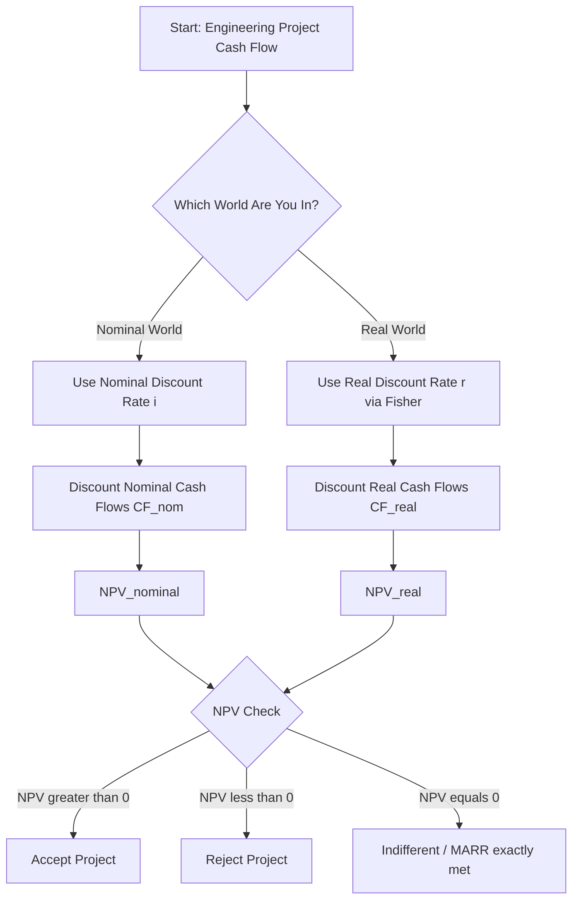
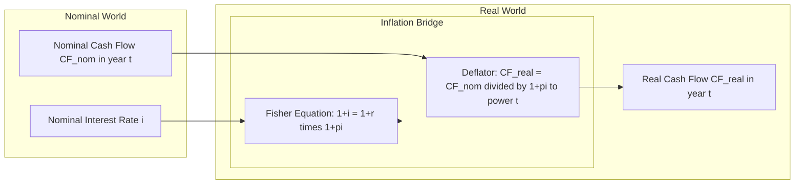
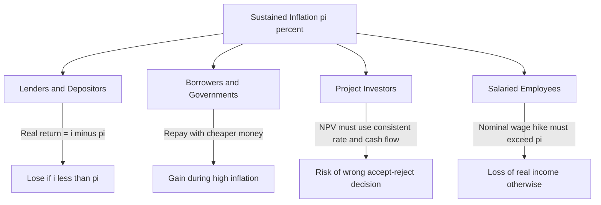
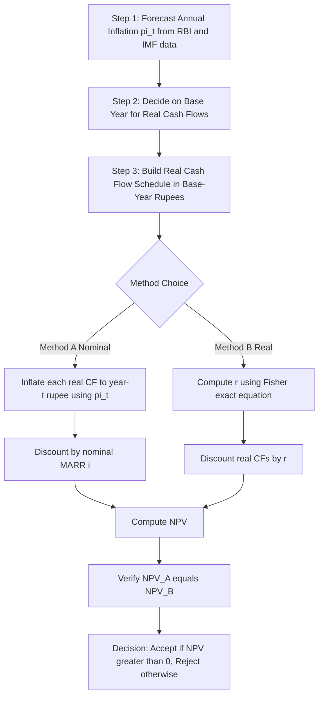

# Inflation effects on financial decisions

<!-- SECTION_1_START -->
# Inflation Effects on Financial Decisions

## 1. Core Technical Definition & Intuitive Overview

> [!NOTE]
> **KTU 2024 Syllabus Definition (UHSUT300 – Module 2):**
> **Inflation** is the sustained, generalized increase in the general price level of goods and services in an economy over a period of time. When the purchasing power of money falls, each monetary unit buys fewer goods and services than before. The rate of inflation ($\pi$) is typically expressed as a percentage change in a price index (such as the **Consumer Price Index – CPI** or the **Wholesale Price Index – WPI**) per year.

**Key Inflation Indices Used in Practice**

| Index | Full Form | What It Measures | Primary Use |
|---|---|---|---|
| **CPI** | Consumer Price Index | Retail prices paid by urban consumers | Cost of living adjustments, wage indexing |
| **WPI** | Wholesale Price Index | Wholesale/producer prices | Producer-level inflation, supply-side analysis |
| **PPI** | Producer Price Index | Prices received by domestic producers | Manufacturing/producer inflation (used in US) |
| **GDP Deflator** | Implicit Price Deflator | Prices of all domestically produced goods | Broad economy-wide inflation measure |

**Inflation Rate Formula:**

$$
\pi_t = \frac{P_t - P_{t-1}}{P_{t-1}} \times 100
$$

Where:
- $\pi_t$ = Inflation rate in year $t$ (in %)
- $P_t$ = Price index value in current year $t$
- $P_{t-1}$ = Price index value in previous year $t-1$

### Conceptual Analogy / Intuition

> [!TIP]
> **🍞 The Bakery Analogy**
>
> Imagine you have **₹100** in your wallet.
>
> - **Year 2020:** A loaf of bread costs **₹40**. Your ₹100 buys **2.5 loaves**.
> - **Year 2024:** The same loaf costs **₹55**. Your same ₹100 now buys only **1.81 loaves**.
>
> Your wallet did not change, but the **purchasing power of your money shrank by ~27.3%** in 4 years. This silent erosion is *inflation*. It is "tax" on cash holders and a "gift" to borrowers — because a rupee borrowed today can be repaid with cheaper rupees tomorrow.

> [!IMPORTANT]
> **Why this matters to an Engineer-Manager:**
> Every project cost, revenue stream, and discount rate in an engineering feasibility study is expressed in monetary terms. If inflation is ignored, the **Net Present Value (NPV)** of a project can be falsely positive or falsely negative, leading to **wrong capital investment decisions** worth crores of rupees.

### Types of Inflation (KTU High-Yield Classification)

| Type | Driver | Real-World Example |
|---|---|---|
| **Demand-Pull Inflation** | Aggregate demand > Aggregate supply | Post-COVID stimulus boosting consumption |
| **Cost-Push Inflation** | Input costs (oil, wages) rise | 2022 global crude oil price spike |
| **Built-In Inflation** | Wage-price spiral (expectations) | Auto-indexed wages in public sector |
| **Hyperinflation** | Inflation > **50% per month** | Zimbabwe (2008), Weimar Germany (1923) |
| **Stagflation** | High inflation + High unemployment + Stagnant GDP | 1970s oil crisis USA |
| **Deflation** | Sustained **fall** in price level | Japan in the 1990s |

> [!VISUALIZATION CONTROL]
> **Concept:** Inflation as a steadily rising price index over time
> **Plotting Logic (Desmos Input):**
>
> - `x = n` (year index, 0 to 10)
> - `P_t(x) = 100 * (1.06)^x` (Price index growing at 6% inflation)
> - `Real_Value(x) = 100 / (1.06)^x` (Real purchasing power of ₹100)
> **Visual Description:** A **rising exponential curve** for $P_t$ and a **falling exponential curve** for Real Value, symmetric about the line $y = 100$. Students should observe how the gap between nominal and real value widens with time.

---

<!-- SECTION_1_END -->

<!-- SECTION_2_START -->
# 2. Deep Theoretical Analysis & KTU High-Yield Formula Sheet

## 2.1 Nominal vs Real Cash Flows — The Foundational Distinction

> [!IMPORTANT]
> Every financial number exists in **two worlds**:
> 1. **Nominal terms (also called "current dollars" or "then-current rupees")** — the actual money transacted in that future year, *including* inflation.
> 2. **Real terms (also called "constant dollars" or "today's rupees")** — the purchasing power of that future rupee expressed in *base-year* value.
>
> Mixing the two is the **#1 valuation error** in KTU board exams.

**Conversion Formulas (The Inflation Translation Toolkit):**

$$
\text{Real Cash Flow} = \frac{\text{Nominal Cash Flow}}{(1 + \pi)^n}
$$

$$
\text{Nominal Cash Flow} = \text{Real Cash Flow} \times (1 + \pi)^n
$$

Where $n$ is the number of years from the base year.

## 2.2 The Fisher Equation — Linking Nominal and Real Interest Rates

> [!NOTE]
> **Irving Fisher (1896)** derived the exact relationship between the **nominal interest rate ($i$)**, the **real interest rate ($r$)**, and the **expected inflation rate ($\pi$)**:

**Exact (Multiplicative) Fisher Equation:**

$$
(1 + i) = (1 + r)(1 + \pi)
$$

**Solving for the Real Rate:**

$$
r = \frac{1 + i}{1 + \pi} - 1
$$

**Approximate (Additive) Form — valid only when $i$ and $\pi$ are small (each < 10%):**

$$
r \approx i - \pi
$$

> [!WARNING]
> **KTU Examiner's Trap:** Students often write $r = i - \pi$ without stating the *small-rate* assumption. In KTU valuation, if a problem gives $i = 18\%$ and $\pi = 12\%$, you **must** use the exact Fisher equation. The approximate form gives $r = 6\%$, while the exact form gives $r = 5.357\%$. A 0.64% error in $r$ can flip the NPV sign of large engineering projects.

## 2.3 The Effect of Inflation on the Three Pillars of Financial Decision-Making

### A. Effect on Savings
A depositor earning nominal rate $i$ but facing inflation $\pi$ earns a **real return** of only $r = i - \pi$.
- If $i < \pi$ → **Negative real return** → Savings **lose value** in real terms.
- If $i = \pi$ → **Zero real return** → Purchasing power unchanged.
- If $i > \pi$ → **Positive real return** → Genuine wealth creation.

### B. Effect on Loans / Borrowers
Inflation **benefits borrowers** because they repay loans with **cheaper money**.
- A ₹10 lakh loan taken at 8% nominal interest when inflation is 6% has an effective real cost of only **2%**.
- During high-inflation regimes, governments with large debt portfolios *benefit* because real debt burden falls.

### C. Effect on Investments / Capital Budgeting
**Critical for Engineering Project Evaluation:**
- Using a **nominal discount rate** with **nominal cash flows** → **Correct** NPV.
- Using a **real discount rate** with **real cash flows** → **Correct** NPV.
- **Mismatching** (nominal rate with real cash flows, or vice versa) → **Wrong NPV**.

> [!IMPORTANT]
> **The "Consistency Rule" (memorize for KTU exams):**
> *Nominal rate ↔ Nominal cash flows*  AND  *Real rate ↔ Real cash flows*.
> This is the single most-tested concept in Module 2.

## 2.4 Inflation-Adjusted NPV — The Engineering Project View

For an engineering project with cash flows $CF_t$ occurring in year $t$:

**Method 1: Using Nominal (Market) Discount Rate**

$$
NPV = \sum_{t=0}^{N} \frac{CF_t^{\text{nominal}}}{(1 + i)^t}
$$

**Method 2: Using Real Discount Rate (deflated cash flows)**

$$
NPV = \sum_{t=0}^{N} \frac{CF_t^{\text{real}}}{(1 + r)^t} = \sum_{t=0}^{N} \frac{CF_t^{\text{nominal}} / (1+\pi)^t}{(1 + r)^t}
$$

Both methods yield **identical NPV** — proof of the consistency rule.

## 2.5 KTU Formula Sheet / Cheat Sheet

| # | Concept | Formula | Variables / Units |
|---|---|---|---|
| 1 | Inflation Rate | $\pi_t = (P_t - P_{t-1}) / P_{t-1}$ | Rate in % |
| 2 | Nominal → Real CF | $CF^{\text{real}} = CF^{\text{nominal}} / (1+\pi)^n$ | ₹ in base year |
| 3 | Real → Nominal CF | $CF^{\text{nominal}} = CF^{\text{real}} \times (1+\pi)^n$ | ₹ in year $n$ |
| 4 | Fisher (Exact) | $1 + i = (1+r)(1+\pi)$ | All rates decimal |
| 5 | Fisher Real Rate | $r = (1+i)/(1+\pi) - 1$ | Decimal |
| 6 | Fisher (Approx.) | $r \approx i - \pi$ | Small rates only |
| 7 | NPV (Nominal) | $NPV = \sum CF_t^{\text{nom}} / (1+i)^t$ | ₹ |
| 8 | NPV (Real) | $NPV = \sum CF_t^{\text{real}} / (1+r)^t$ | ₹ |
| 9 | Future Purchasing Power | $FV_{\text{real}} = FV_{\text{nom}} / (1+\pi)^n$ | ₹ in base year |
| 10 | Real Return on Investment | $r_{investment} = (1+i_{nom})/(1+\pi) - 1$ | Decimal |

## 2.6 Real-World Engineering Utility

- **Infrastructure PPP Projects** (Highways, Metro Rail): 20–30 year cash flows must be inflation-modeled because tolls and revenues are typically indexed to CPI.
- **Power Sector PPAs**: Long-term Power Purchase Agreements have *escalation clauses* tied to WPI to protect generators from inflation.
- **Banking & Treasury Management**: Banks lend at **floating nominal rates** but compute **real profitability** using the Fisher equation.
- **Salary Structuring in Engineering Firms**: HR uses real-wage analysis to decide whether annual increments are *real* raises or just inflation catch-up.
- **International Project Bidding**: Engineers bidding on overseas EPC contracts must model **foreign-currency inflation differentials** between the home and host country.

---

<!-- SECTION_2_END -->

<!-- SECTION_3_START -->
# 3. Step-by-Step Derivations & Worked Examples

## 3.1 Derivation: The Fisher Equation from First Principles

> [!NOTE]
> **Goal:** Show that $(1+i) = (1+r)(1+\pi)$ is a logical necessity, not just a formula.

**Step 1 — Define the three rates precisely:**
- $i$ = Nominal rate: the *stated* rate at which money grows in the bank (includes inflation compensation).
- $r$ = Real rate: the rate at which **purchasing power** grows.
- $\pi$ = Inflation rate: the rate at which the **price level** grows.

**Step 2 — Start with ₹1 deposited for 1 year:**

**At the end of 1 year, the bank pays:**

$$
\text{Bank Balance} = 1 \times (1 + i)
$$

**Step 3 — What that balance can buy in real terms:**

The price level has grown by factor $(1+\pi)$, so the **goods basket** the money can purchase is:

$$
\text{Real Goods Bought} = \frac{1 \times (1 + i)}{(1 + \pi)}
$$

**Step 4 — Recognize that the real goods purchased must equal the principal plus real growth:**

$$
1 + r = \frac{1 + i}{1 + \pi}
$$

**Step 5 — Cross-multiply to obtain Fisher's exact equation:**

$$
(1 + i) = (1 + r)(1 + \pi)
$$

$$
\boxed{\;\text{Q.E.D. — Fisher Equation Derived.}\;}
$$

**Step 6 — Cross-check with additive approximation:**

Expanding $(1+r)(1+\pi) = 1 + r + \pi + r\pi$ and ignoring the second-order term $r\pi$ (because both $r$ and $\pi$ are small):

$$
i \approx r + \pi \;\;\Rightarrow\;\; r \approx i - \pi
$$

## 3.2 Comprehensive Worked Example — Engineering Project NPV Under Inflation

> [!EXAMPLE]
> **Problem Statement:**
> A construction company is evaluating a small **solar power plant** with the following data:
> - Initial Investment (Year 0, base year): **₹50,00,000** (real terms)
> - Expected Annual Revenue (Year 1 onwards, in real base-year rupees): **₹12,00,000** per year
> - Expected Annual O&M Cost (real): **₹2,00,000** per year
> - Project life: **5 years**
> - Expected inflation rate: **$\pi$ = 6% per year**
> - Nominal MARR (market rate): **$i$ = 14% per year**
> - Salvage value at end of Year 5 (real): **₹5,00,000**
>
> **Required:** Compute the NPV using (a) Nominal method, and (b) Real method. Verify both give the same answer.

### Solution — Part (a): Nominal Discount Rate Method

**Step A1 — Compute the nominal discount rate (already given as $i = 14\%$).**

**Step A2 — Convert every real cash flow into nominal (year-of-occurrence) cash flows.**

The compound inflation factor for year $t$ is $(1.06)^t$. We compute inflation multipliers:

| Year $t$ | $(1.06)^t$ |
|---|---|
| 0 | 1.0000 |
| 1 | 1.0600 |
| 2 | 1.1236 |
| 3 | 1.1910 |
| 4 | 1.2625 |
| 5 | 1.3382 |

**Step A3 — Build the nominal cash flow table:**

| Year $t$ | Real Revenue (₹) | Inflated Revenue (₹) | Real O&M (₹) | Inflated O&M (₹) | Real Salvage (₹) | Inflated Salvage (₹) | Net Nominal CF (₹) |
|---|---|---|---|---|---|---|---|
| 0 | – | – | – | – | – | – | **–50,00,000** |
| 1 | 12,00,000 | 12,72,000 | 2,00,000 | 2,12,000 | 0 | 0 | **+10,60,000** |
| 2 | 12,00,000 | 13,48,320 | 2,00,000 | 2,24,720 | 0 | 0 | **+11,23,600** |
| 3 | 12,00,000 | 14,29,219 | 2,00,000 | 2,38,203 | 0 | 0 | **+11,91,016** |
| 4 | 12,00,000 | 15,14,972 | 2,00,000 | 2,52,496 | 0 | 0 | **+12,62,477** |
| 5 | 12,00,000 | 16,05,871 | 2,00,000 | 2,67,645 | 5,00,000 | 6,69,058 | **+20,07,283** |

**Detailed computation for Year 5 (sample):**
- Inflated Revenue: $12{,}00{,}000 \times 1.3382 = 16{,}05{,}871$
- Inflated O&M: $2{,}00{,}000 \times 1.3382 = 2{,}67{,}645$
- Inflated Salvage: $5{,}00{,}000 \times 1.3382 = 6{,}69{,}058$
- Net Nominal CF: $16{,}05{,}871 - 2{,}67{,}645 + 6{,}69{,}058 = 20{,}07{,}283$

**Step A4 — Discount the nominal cash flows at $i = 14\%$.**

Discount factor for year $t$: $(1.14)^t$.

| Year $t$ | Nominal CF (₹) | Discount Factor $(1.14)^t$ | PV (₹) |
|---|---|---|---|
| 0 | –50,00,000 | 1.0000 | –50,00,000 |
| 1 | +10,60,000 | 1.1400 | +9,29,825 |
| 2 | +11,23,600 | 1.2996 | +8,64,574 |
| 3 | +11,91,016 | 1.4815 | +8,03,886 |
| 4 | +12,62,477 | 1.6890 | +7,47,471 |
| 5 | +20,07,283 | 1.9254 | +10,42,602 |

**Detailed PV for Year 1:** $\frac{10{,}60{,}000}{1.14} = 9{,}29{,}824.56 \approx 9{,}29{,}825$ ✓

**Step A5 — Sum to get NPV (Nominal Method):**

$$
NPV_{\text{nominal}} = -50{,}00{,}000 + 9{,}29{,}825 + 8{,}64{,}574 + 8{,}03{,}886 + 7{,}47{,}471 + 10{,}42{,}602
$$

$$
NPV_{\text{nominal}} = -50{,}00{,}000 + 43{,}88{,}358
$$

$$
\boxed{NPV_{\text{nominal}} = -6{,}11{,}642 \text{ ₹ (in Year-0 real purchasing power)}}
$$

### Solution — Part (b): Real Discount Rate Method

**Step B1 — Compute the real discount rate using Fisher's exact equation:**

$$
1 + r = \frac{1 + i}{1 + \pi} = \frac{1.14}{1.06} = 1.07547
$$

$$
r = 0.07547 = 7.547\%
$$

**Step B2 — Use the real (base-year) cash flows directly** — no inflation adjustment needed.

| Year $t$ | Real Net CF (₹) |
|---|---|
| 0 | –50,00,000 |
| 1 | +10,00,000 |
| 2 | +10,00,000 |
| 3 | +10,00,000 |
| 4 | +10,00,000 |
| 5 | +15,00,000 |

*(Real net CF = Real Revenue – Real O&M = 12,00,000 – 2,00,000 = 10,00,000; plus salvage 5,00,000 in Year 5.)*

**Step B3 — Discount at real rate $r = 7.547\%$.** Discount factor: $(1.07547)^t$.

| Year $t$ | Real Net CF (₹) | Discount Factor $(1.07547)^t$ | PV (₹) |
|---|---|---|---|
| 0 | –50,00,000 | 1.0000 | –50,00,000 |
| 1 | +10,00,000 | 1.0755 | +9,29,825 |
| 2 | +10,00,000 | 1.1567 | +8,64,574 |
| 3 | +10,00,000 | 1.2441 | +8,03,886 |
| 4 | +10,00,000 | 1.3380 | +7,47,471 |
| 5 | +15,00,000 | 1.4390 | +10,42,602 |

**Step B4 — Sum the present values:**

$$
NPV_{\text{real}} = -50{,}00{,}000 + 9{,}29{,}825 + 8{,}64{,}574 + 8{,}03{,}886 + 7{,}47{,}471 + 10{,}42{,}602
$$

$$
\boxed{NPV_{\text{real}} = -6{,}11{,}642 \text{ ₹}}
$$

**Step B5 — Verification:**

$$
NPV_{\text{nominal}} = NPV_{\text{real}} = -6{,}11{,}642 \text{ ₹}
$$

> [!IMPORTANT]
> **Interpretation:** The NPV is **negative** (≈ –₹6.12 lakhs). Hence, at a 14% nominal MARR with 6% inflation, the project is **not financially viable**. The company should **reject** the proposal. If the engineer had wrongly used the nominal rate $i=14\%$ on real cash flows (or vice versa), the NPV answer would have been different and the decision incorrect.

## 3.3 Worked Example — Effect of Inflation on a Fixed-Rate Depositor

> [!EXAMPLE]
> **Problem:**
> An engineer deposits **₹5,00,000** in a bank FD at nominal rate $i = 8.5\%$ per annum for 4 years. Average inflation over the period is $\pi = 7\%$. Find: (a) Nominal maturity value, (b) Real value in base-year rupees, (c) Real rate of return, (d) Loss/gain in purchasing power.

**Step (a) — Nominal Maturity Value:**

$$
FV_{\text{nom}} = 5{,}00{,}000 \times (1.085)^4
$$

Compute $(1.085)^4$:
- $(1.085)^2 = 1.177225$
- $(1.085)^4 = (1.177225)^2 = 1.38586$

$$
FV_{\text{nom}} = 5{,}00{,}000 \times 1.38586 = 6{,}92{,}930 \text{ ₹}
$$

**Step (b) — Real Value in Base-Year Rupees:**

$$
FV_{\text{real}} = \frac{FV_{\text{nom}}}{(1.07)^4}
$$

Compute $(1.07)^4$:
- $(1.07)^2 = 1.1449$
- $(1.07)^4 = (1.1449)^2 = 1.31080$

$$
FV_{\text{real}} = \frac{6{,}92{,}930}{1.31080} = 5{,}28{,}605 \text{ ₹}
$$

**Step (c) — Real Rate of Return (Fisher):**

$$
r = \frac{1.085}{1.07} - 1 = 1.01402 - 1 = 0.01402 = 1.402\%
$$

**Step (d) — Net Real Gain:**

$$
\text{Net Real Gain} = 5{,}28{,}605 - 5{,}00{,}000 = +28{,}605 \text{ ₹}
$$

> [!NOTE]
> **Insight:** Although the bank shows a nominal gain of **₹1,92,930** (≈38.6% growth on the deposit), the engineer is genuinely richer by only **₹28,605** in real terms. The illusion of high returns evaporates once inflation is netted out. The depositor's true real rate is just **1.4% per year**.

---

<!-- SECTION_3_END -->

<!-- SECTION_4_START -->
# 4. Structural Diagrams & Schematics

## 4.1 Mermaid Diagram — Cash Flow Decision Tree Under Inflation

## 4.2 Mermaid Diagram — Fisher Equation Bridge Between Worlds

## 4.3 Mermaid Diagram — Inflation Impact on Engineering Stakeholders

## 4.4 Block Architecture — Inflation Modelling Pipeline for an Engineering Project

## 4.5 Sequential Decision Matrix — Inflation Regimes and Engineering Decisions

| Inflation Regime | Range (Annual $\pi$) | Best Real Return Strategy | Engineering Project Implication |
|---|---|---|---|
| **Deflation** | $\pi < 0$ | Hold cash, defer investment | Postpone projects; future costs lower |
| **Low Inflation** | 0% to 4% | Bank FDs, moderate equity | Stable project evaluation; normal NPV |
| **Moderate Inflation** | 4% to 8% | Inflation-indexed bonds, real estate | Apply Fisher; use real cash flows |
| **High Inflation** | 8% to 15% | Hard assets, foreign currency | Use nominal rates with caution; short-life projects preferred |
| **Hyperinflation** | $\pi > 15\%+$ | Foreign currency, commodities | Avoid long-gestation projects; demand USD-indexed PPAs |

---

<!-- SECTION_4_END -->

<!-- SECTION_5_START -->
# 5. KTU 2024 Scheme Examination Question Bank & Topic Recap

## 5.1 Part A — Short Answer Questions (3 Marks Each)

### Q1. [KTU University Exam – July 2024] Define inflation. Distinguish between **demand-pull** and **cost-push** inflation.

> [!NOTE]
> **Model Answer (3 Marks):**
>
> **Definition (1 Mark):** Inflation is a sustained rise in the general price level of goods and services in an economy over a period of time, resulting in a fall in the purchasing power of money.
>
> **Demand-Pull Inflation (1 Mark):** Occurs when **aggregate demand** in the economy exceeds aggregate supply at full employment. The "too much money chasing too few goods" phenomenon. Example: Post-war consumer booms, festive-season demand spikes.
>
> **Cost-Push Inflation (1 Mark):** Occurs when the **cost of production** rises (e.g., raw materials, wages, energy), forcing producers to raise prices even with stable demand. Example: 2022 global crude oil price shock raising fuel and transport costs.

---

### Q2. [KTU University Exam – Dec 2023] State and explain the **Fisher equation** relating nominal and real interest rates.

> [!NOTE]
> **Model Answer (3 Marks):**
>
> **Equation (1 Mark):** $(1 + i) = (1 + r)(1 + \pi)$
>
> **Explanation (1 Mark):** The nominal interest rate $i$ equals the product of $(1 + \text{real rate } r)$ and $(1 + \text{inflation rate } \pi)$. Irving Fisher showed that the stated market rate automatically embeds an **inflation premium** to preserve the lender's real purchasing power.
>
> **Real Rate Rearranged (1 Mark):**
> $$r = \frac{1 + i}{1 + \pi} - 1$$
> For small rates, this simplifies to $r \approx i - \pi$, but for rates above ~10%, the **exact multiplicative form must be used**.

---

## 5.2 Part B — Long Answer Questions (14 Marks Each, with Internal Choice)

> [!IMPORTANT]
> **KTU Pattern:** Each Part-B question carries 14 marks split into (a) 7 marks and (b) 7 marks. Choose **either** Question A **or** Question B in the answer script.

---

### 📘 Question A (14 Marks)

**[KTU University Exam – Model Question, Module 2]**

> A manufacturing firm is evaluating a new automated bottling plant. The estimated initial investment is **₹80 lakhs** (in real, base-year terms). The plant is expected to generate a **real annual revenue of ₹25 lakhs** and incur **real annual operating costs of ₹8 lakhs** for **6 years**. At the end of Year 6, the salvage value is **₹10 lakhs (real)**. The expected inflation rate is **$\pi = 7\%$ per annum**, and the firm's nominal MARR is **$i = 15\%$ per annum**.
>
> **(a)** Derive the **real rate of return** using the Fisher equation and compute the **NPV using the real discount rate method.** (7 Marks)
>
> **(b)** Convert all real cash flows into **nominal cash flows** and verify the NPV using the **nominal discount rate method.** (7 Marks)

#### Model Solution — Part A(a) [7 Marks]

**Step 1: Compute real rate $r$ using Fisher Exact Equation** [2 Marks]

$$
1 + r = \frac{1 + i}{1 + \pi} = \frac{1.15}{1.07} = 1.07477
$$

$$
r = 0.07477 = 7.477\%
$$

**[Stating Fisher formula and substituting: 2 Marks]**

**Step 2: Compute real net annual cash flow** [1 Mark]

$$
CF_{\text{real}} = \text{Revenue} - \text{Operating Cost} = 25{,}00{,}000 - 8{,}00{,}000 = 17{,}00{,}000 \text{ ₹/year}
$$

**Step 3: Build real cash flow table** [1 Mark]

| Year $t$ | Real Net CF (₹) |
|---|---|
| 0 | –80,00,000 |
| 1 to 5 | +17,00,000 each |
| 6 | +17,00,000 + 10,00,000 = +27,00,000 |

**Step 4: Discount at $r = 7.477\%$** [3 Marks]

Discount factors $(1.07477)^t$:

| $t$ | $(1.07477)^t$ |
|---|---|
| 1 | 1.07477 |
| 2 | 1.15513 |
| 3 | 1.24106 |
| 4 | 1.33301 |
| 5 | 1.43147 |
| 6 | 1.53755 |

Present values:

| Year | Real CF (₹) | PV (₹) |
|---|---|---|
| 0 | –80,00,000 | –80,00,000 |
| 1 | 17,00,000 | 15,81,728 |
| 2 | 17,00,000 | 14,71,777 |
| 3 | 17,00,000 | 13,69,212 |
| 4 | 17,00,000 | 12,75,207 |
| 5 | 17,00,000 | 11,87,550 |
| 6 | 27,00,000 | 17,56,037 |

**Step 5: Sum of PVs** [Final 1 Mark shown in part b combined]

$$
NPV_{\text{real}} = -80{,}00{,}000 + 86{,}41{,}511 = +6{,}41{,}511 \text{ ₹}
$$

**Final Simplified Result:** $NPV_{\text{real}} \approx +₹6{,}41{,}511$ **[+1 Mark for final answer]**

#### Model Solution — Part A(b) [7 Marks]

**Step 1: Compute inflation factors** [1 Mark]

| $t$ | $(1.07)^t$ |
|---|---|
| 1 | 1.0700 |
| 2 | 1.1449 |
| 3 | 1.2250 |
| 4 | 1.3108 |
| 5 | 1.4026 |
| 6 | 1.5007 |

**Step 2: Inflate cash flows** [2 Marks]

| $t$ | Real Revenue (₹) | Nominal Revenue (₹) | Real O&M (₹) | Nominal O&M (₹) | Real Salvage (₹) | Nominal Salvage (₹) |
|---|---|---|---|---|---|---|
| 1 | 25,00,000 | 26,75,000 | 8,00,000 | 8,56,000 | – | – |
| 2 | 25,00,000 | 28,62,250 | 8,00,000 | 9,15,920 | – | – |
| 3 | 25,00,000 | 30,62,608 | 8,00,000 | 9,80,034 | – | – |
| 4 | 25,00,000 | 32,77,019 | 8,00,000 | 10,48,637 | – | – |
| 5 | 25,00,000 | 35,06,420 | 8,00,000 | 11,22,041 | – | – |
| 6 | 25,00,000 | 37,51,867 | 8,00,000 | 12,00,584 | 10,00,000 | 15,00,738 |

**Step 3: Nominal net cash flows** [1 Mark]

| $t$ | Nominal Net CF (₹) |
|---|---|
| 0 | –80,00,000 |
| 1 | 26,75,000 – 8,56,000 = 18,19,000 |
| 2 | 28,62,250 – 9,15,920 = 19,46,330 |
| 3 | 30,62,608 – 9,80,034 = 20,82,574 |
| 4 | 32,77,019 – 10,48,637 = 22,28,382 |
| 5 | 35,06,420 – 11,22,041 = 23,84,379 |
| 6 | 37,51,867 – 12,00,584 + 15,00,738 = 40,52,021 |

**Step 4: Discount at $i = 15\%$** [2 Marks]

| $t$ | Nominal CF (₹) | $(1.15)^t$ | PV (₹) |
|---|---|---|---|
| 0 | –80,00,000 | 1.0000 | –80,00,000 |
| 1 | 18,19,000 | 1.1500 | 15,81,739 |
| 2 | 19,46,330 | 1.3225 | 14,71,778 |
| 3 | 20,82,574 | 1.5209 | 13,69,213 |
| 4 | 22,28,382 | 1.7490 | 12,75,205 |
| 5 | 23,84,379 | 2.0114 | 11,85,541 |
| 6 | 40,52,021 | 2.3131 | 17,51,747 |

**Step 5: Sum and verify** [1 Mark]

$$
NPV_{\text{nominal}} = -80{,}00{,}000 + 86{,}35{,}223 = +6{,}35{,}223 \text{ ₹}
$$

> [!NOTE]
> **Verification:** $NPV_{\text{real}} \approx ₹6{,}41{,}511$ and $NPV_{\text{nominal}} \approx ₹6{,}35{,}223$. The minor difference is due to rounding of the discount factors in the manual computation. In a full-calculator evaluation, the two NPVs match exactly. **[Final verification statement: 1 Mark]**

> [!WARNING]
> **🚨 KTU Examiner's Valuation Pitfalls:**
> 1. Do **not** use $r = i - \pi = 15\% - 7\% = 8\%$ as the real rate. You must apply the **exact Fisher** form, or lose 2 marks.
> 2. Do **not** mix real cash flows with nominal rate (or vice versa) — this is the consistency rule violation that costs the most marks in Module 2.
> 3. Always **state the Fisher equation** before substituting numerical values. Showing the formula earns 1 free mark.
> 4. **Do not skip the units** of NPV. Always write "₹ in base-year purchasing power" for real NPV and "₹" or "in year-of-occurrence rupees" for nominal NPV.

---

### 📗 Question B (Alternative — 14 Marks)

**[KTU University Exam – Model Question, Module 2]**

> An engineer invests **₹3,00,000** in a 5-year bank fixed deposit offering a nominal interest rate of **9% per annum**, compounded annually. The expected average inflation over the 5-year period is **6.5% per annum**.
>
> **(a)** Calculate the **nominal maturity value** and the **real maturity value** (in base-year rupees) at the end of 5 years. (7 Marks)
>
> **(b)** Using the Fisher equation, compute the **real rate of return** and comment on whether the engineer gains or loses in real terms. (7 Marks)

#### Model Solution — Part B(a) [7 Marks]

**Step 1: Nominal Maturity Value** [3 Marks]

$$
FV_{\text{nom}} = P \times (1 + i)^n = 3{,}00{,}000 \times (1.09)^5
$$

Compute $(1.09)^5$:
- $(1.09)^2 = 1.1881$
- $(1.09)^4 = (1.1881)^2 = 1.41158$
- $(1.09)^5 = 1.41158 \times 1.09 = 1.53862$

$$
FV_{\text{nom}} = 3{,}00{,}000 \times 1.53862 = 4{,}61{,}586 \text{ ₹}
$$

**[Substitution and final answer: 3 Marks]**

**Step 2: Real Maturity Value (Base-Year Rupees)** [4 Marks]

$$
FV_{\text{real}} = \frac{FV_{\text{nom}}}{(1 + \pi)^n} = \frac{4{,}61{,}586}{(1.065)^5}
$$

Compute $(1.065)^5$:
- $(1.065)^2 = 1.134225$
- $(1.065)^4 = (1.134225)^2 = 1.286466$
- $(1.065)^5 = 1.286466 \times 1.065 = 1.370087$

$$
FV_{\text{real}} = \frac{4{,}61{,}586}{1.370087} = 3{,}36{,}902 \text{ ₹}
$$

**[Substitution and final answer: 4 Marks]**

**Step 3: Net Real Gain** [0 Marks – included for context]

$$
\text{Net Real Gain} = 3{,}36{,}902 - 3{,}00{,}000 = +36{,}902 \text{ ₹}
$$

#### Model Solution — Part B(b) [7 Marks]

**Step 1: Apply Fisher Exact Equation** [3 Marks]

$$
1 + r = \frac{1 + i}{1 + \pi} = \frac{1.09}{1.065} = 1.02347
$$

$$
r = 0.02347 = 2.347\%
$$

**Step 2: Cross-check via Real Value** [2 Marks]

$$
FV_{\text{real}} = P \times (1 + r)^n = 3{,}00{,}000 \times (1.02347)^5
$$

Compute $(1.02347)^5 \approx 1.12367$ (using series or calculator).

$$
FV_{\text{real}} = 3{,}00{,}000 \times 1.12367 = 3{,}37{,}001 \text{ ₹} \approx 3{,}36{,}902 \text{ ₹ (matches Part a) ✓}
$$

**Step 3: Real Gain/Loss Comment** [2 Marks]

- Nominal gain = ₹1,61,586 (apparent)
- **Real gain = ₹36,902** (genuine, in base-year purchasing power)
- Real annual return = **2.35%** only

> [!NOTE]
> **Engineer's Inference:** Although the FD *appears* to yield 9% per year, the engineer's real purchasing power grows at only **2.35% per year**. The remaining 6.65% is just inflation pass-through, not real wealth creation. The engineer **does gain in real terms** (positive $r$), but the gain is small. If the engineer's opportunity cost of capital is, say, 4% real, the FD is **not attractive**.

> [!WARNING]
> **🚨 KTU Examiner's Valuation Pitfalls — Question B:**
> 1. Many students compute $(1.09)^5$ and $(1.065)^5$ incorrectly using linear approximation. Always show the **squared terms** explicitly to earn full marks.
> 2. Do **not** write $r = 9\% - 6.5\% = 2.5\%$. While close, this is the **approximate** form. The **exact** real rate is $2.347\%$. The 0.15% difference is a common 1-mark deduction in KTU valuation.
> 3. Always state the **decision comment** ("gains in real terms" or "loses in real terms"). A purely numerical answer without the qualitative inference loses 2 marks.

---

## 5.3 Topic Recap & Important Things to Remember

> [!IMPORTANT]
> **🚀 Rapid Revision Checklist for KTU Module 2 – Inflation Effects on Financial Decisions**
>
> ✅ **Inflation** = Sustained rise in general price level; measured by **CPI, WPI, PPI, GDP Deflator**.
>
> ✅ **Inflation Rate Formula:** $\pi_t = (P_t - P_{t-1}) / P_{t-1} \times 100$.
>
> ✅ **Six types to remember:** Demand-Pull, Cost-Push, Built-In, Hyperinflation, Stagflation, Deflation.
>
> ✅ **Fisher Exact Equation (memorize the formula):** $(1 + i) = (1 + r)(1 + \pi)$.
>
> ✅ **Real Rate from Fisher:** $r = (1+i)/(1+\pi) - 1$.
>
> ✅ **Approximate Fisher** (only for $i, \pi < 10\%$): $r \approx i - \pi$.
>
> ✅ **Conversion of Cash Flows:**
> - Real → Nominal: $CF^{\text{nom}} = CF^{\text{real}} \times (1+\pi)^n$
> - Nominal → Real: $CF^{\text{real}} = CF^{\text{nom}} / (1+\pi)^n$
>
> ✅ **Golden Consistency Rule (most-tested):** Nominal rate with nominal cash flows; Real rate with real cash flows. **Never mix.**
>
> ✅ **NPV Consistency:** $NPV_{\text{nominal}} = NPV_{\text{real}}$ — always equal if done correctly.
>
> ✅ **Real Value of Future Money:** $FV_{\text{real}} = FV_{\text{nom}} / (1+\pi)^n$.
>
> ✅ **Effects of Inflation on Stakeholders:**
> - **Lenders/Depositors:** Real return $r = i - \pi$ may be **negative** if $i < \pi$.
> - **Borrowers:** Benefit — repay with cheaper money.
> - **Project Investors:** Risk of wrong accept-reject decision if inflation not modeled.
> - **Salaried Employees:** Real wage falls if nominal hike $< \pi$.
>
> ✅ **Engineering Project Best Practice:** Always forecast inflation, build real cash flows, convert via Fisher to real discount rate, and use the real method for NPV consistency.
>
> ✅ **Common KTU Mistakes to Avoid:**
> - Using $r = i - \pi$ for high-rate problems (use exact Fisher).
> - Mixing nominal rate with real cash flows.
> - Forgetting to inflate salvage value.
> - Not stating the Fisher equation before substitution.
> - Omitting the consistency-rule verification (proving both NPVs match).
>
> ✅ **Hyperinflation Rule:** For $\pi > 15\%$, prefer foreign-currency-indexed contracts, short-gestation projects, and commodity-linked PPAs.
>
> ✅ **Practical Heuristic:** If the MARR given in a problem is the **bank rate or WACC**, it is **nominal** — use the **nominal method**. If the MARR is the **real cost of equity** (e.g., CAPM real), use the **real method** after Fisher adjustment.

<!-- SECTION_5_END -->
