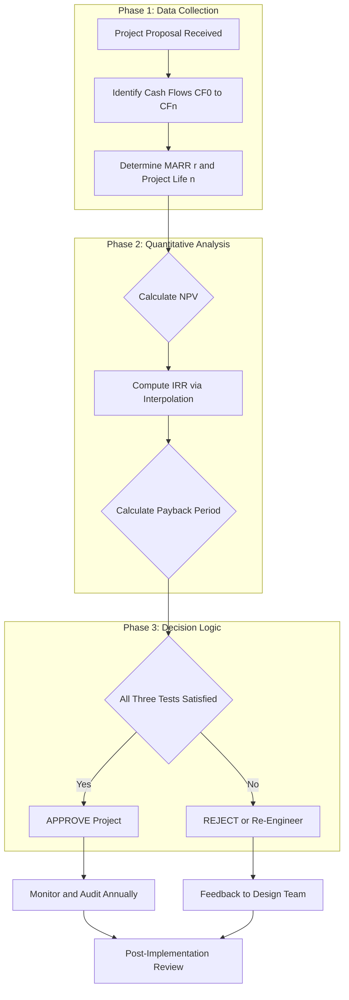
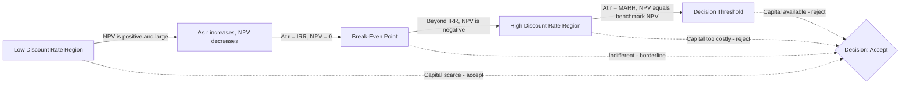
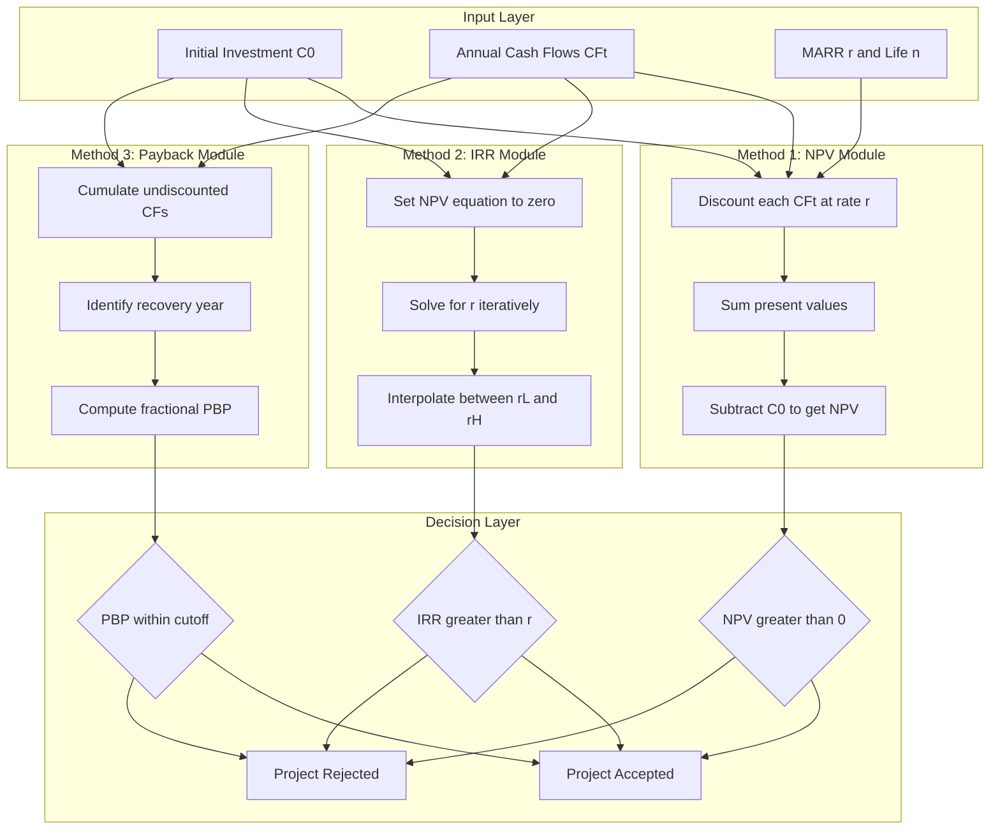

# Investment evaluation methods: Net Present Value (NPV), Internal Rate of Return (IRR), Payback period

<!-- SECTION_1_START -->
# Investment Evaluation Methods: NPV, IRR & Payback Period

## 1.1 Formal Academic Definition (KTU 2024 Syllabus Terminology)

**Investment Evaluation Methods** are quantitative financial decision-making tools used by engineers, project managers, and corporate finance teams to appraise, compare, and rank capital expenditure (CapEx) proposals. In the KTU 2024 Scheme framework for **UHSUT300 — Economics for Engineers and Engineering Ethics**, these methods belong to the domain of *Engineering Economy* and form the analytical core of **Module 2: Time Value of Money \& Financial Decisions**.

The three principal techniques studied at the undergraduate level are:

1. **Net Present Value (NPV)** — A discounted cash flow (DCF) method that converts all future inflows and outflows of a project to a single equivalent present-day monetary value.
2. **Internal Rate of Return (IRR)** — The discount rate at which the NPV of a project becomes exactly zero, representing the project's intrinsic earning rate.
3. **Payback Period (PBP)** — The length of time required for the cumulative cash inflows of a project to equal the initial investment.

> [!IMPORTANT]
> **KTU 2024 Module 2 — Core Theme:** All three techniques are rooted in the **Time Value of Money (TVM)** principle — *a Rupee today is worth more than the same Rupee tomorrow* — because today's currency can be invested to earn a risk-adjusted return.

---

## 1.2 Conceptual Analogy / Real-World Intuition

Imagine you are a civil engineer in Kerala deciding between two flood-mitigation projects for the district panchayat:

- **Project A** — A small check-dam costing **₹ 20 Lakhs** today, expected to generate **₹ 6 Lakhs/year** for 5 years.
- **Project B** — A larger reservoir costing **₹ 35 Lakhs** today, generating **₹ 9 Lakhs/year** for 6 years.

> **Plain-English Intuition:** "Which project actually *earns* more for the public, after accounting for the fact that money received in 2027 is *worth less* than money received in 2024?"

You cannot simply add ₹ 30 Lakhs (A) and ₹ 54 Lakhs (B) and compare — that ignores inflation, opportunity cost, and risk. NPV, IRR, and Payback are the *engineering instruments* that resolve this comparison objectively, similar to how a **strain gauge** quantifies stress and a **multimeter** quantifies voltage.

> [!NOTE]
> **Engineering Parallel:** Just as a structural engineer checks *deflection, bending moment, and shear* before certifying a beam — a financial engineer checks *NPV, IRR, and PBP* before sanctioning a capital project. None of the three alone is sufficient; together they form the **Triple-Test** of capital budgeting.

---

## 1.3 Key Standard Metrics & Constants

| Metric | Standard Value | Usage Context |
|---|---|---|
| **Minimum Acceptable Rate of Return (MARR)** | **r** | The hurdle rate (cost of capital) used to discount cash flows. |
| **Project Life (n)** | Years | Useful life of the asset / contract period. |
| **Initial Investment (C₀)** | ₹ / \$ | Capital outlay at t = 0 (always negative in cash flow terms). |
| **Annual Cash Inflow (A)** | ₹ / \$ per year | Net operating cash flow per period (assumed uniform in annuity model). |
| **Salvage Value (S)** | ₹ / \$ | Residual value of asset at the end of project life. |

> [!TIP]
> **KTU Board Tip:** Always state **r (MARR)** and **n (project life)** explicitly *before* writing the formula. Examiners award 1 mark just for clearly mentioning these parameters.

---

## 1.4 Visualization of the Concept

> [!VISUALIZATION CONTROL]
> **Concept:** Time Value of Money — Discounting trajectory of ₹ 1,000 over 10 years at 10% discount rate.
> **GeoGebra / Desmos Input Equations:**
> * `f(t) = 1000 / (1 + 0.10)^t` (Present Value curve)
> * `g(t) = 1000 * (1 + 0.10)^t` (Future Value curve)
>
> **Visual Description:** The student should plot `f(t)` from `t = 0` to `t = 10`. The curve starts at (0, 1000) and decays asymptotically toward zero, showing how a future rupee shrinks in *present* value. This is the geometric heart of NPV/IRR calculations.
<!-- SECTION_1_END -->

<!-- SECTION_2_START -->
# Deep Theoretical Analysis & KTU High-Yield Formula Sheet

## 2.1 Method 1 — Net Present Value (NPV)

### 2.1.1 Conceptual Logic
NPV translates the *entire stream* of future cash flows into a single present-day value, then subtracts the initial investment. The decision is binary: positive NPV → accept; negative NPV → reject.

### 2.1.2 Step-by-Step Operational Logic

1. Identify all cash flows $CF_0, CF_1, CF_2, \ldots, CF_n$ across the project life.
2. Select the appropriate discount rate $r$ (MARR / Weighted Average Cost of Capital / required rate of return).
3. Discount each future cash flow back to the present using the present worth factor $\dfrac{1}{(1+r)^t}$.
4. Sum all present values of inflows.
5. Subtract the initial investment to obtain the **NPV**.
6. Apply the **decision rule**: if $NPV \geq 0$, the project is financially viable.

> [!IMPORTANT]
> **Why NPV is the Gold Standard:** It directly measures **wealth creation in monetary terms**. A project with NPV = ₹ 50 Lakhs literally adds ₹ 50 Lakhs to the firm's value today.

### 2.1.3 Standard Formula (Discrete, Non-Uniform Cash Flows)

$$
\begin{aligned}
NPV &= \sum_{t=0}^{n} \frac{CF_{t}}{(1+r)^{t}} \\
&= -C_{0} + \frac{CF_{1}}{(1+r)^{1}} + \frac{CF_{2}}{(1+r)^{2}} + \cdots + \frac{CF_{n}}{(1+r)^{n}}
\end{aligned}
$$

### 2.1.4 Special Case — Uniform Annuity

$$
\begin{aligned}
NPV &= -C_{0} + A \cdot \left[ \frac{1 - (1+r)^{-n}}{r} \right] + \frac{S}{(1+r)^{n}}
\end{aligned}
$$

where $A$ = uniform annual cash inflow, $S$ = salvage value.

---

## 2.2 Method 2 — Internal Rate of Return (IRR)

### 2.2.1 Conceptual Logic
IRR is the discount rate that *annihilates* the NPV — it is the **break-even return** of the project. Geometrically, it is the X-intercept of the NPV-vs-discount-rate curve.

### 2.2.2 Step-by-Step Operational Logic

1. Set up the NPV equation: $\displaystyle \sum_{t=0}^{n} \frac{CF_{t}}{(1+IRR)^{t}} = 0$.
2. Solve for $IRR$ — analytically via polynomials (degree ≤ 4) or numerically via trial-and-error / interpolation.
3. Compare $IRR$ with the firm's **MARR (cost of capital, $r$)**.
4. Apply the decision rule: if $IRR \geq r$, accept the project; otherwise reject.

### 2.2.3 Standard Formula

$$
\begin{aligned}
0 &= -C_{0} + \frac{CF_{1}}{(1+IRR)^{1}} + \frac{CF_{2}}{(1+IRR)^{2}} + \cdots + \frac{CF_{n}}{(1+IRR)^{n}}
\end{aligned}
$$

For the uniform annuity case, IRR is the root of:

$$
\begin{aligned}
C_{0} &= A \cdot \left[ \frac{1 - (1+IRR)^{-n}}{IRR} \right]
\end{aligned}
$$

### 2.2.4 Interpolation Formula (for KTU Board Numericals)

When two trial rates $r_{L}$ (lower, giving $NPV_{L} > 0$) and $r_{H}$ (higher, giving $NPV_{H} < 0$) are found:

$$
\begin{aligned}
IRR &= r_{L} + \left[ \frac{NPV_{L}}{NPV_{L} - NPV_{H}} \right] \cdot (r_{H} - r_{L})
\end{aligned}
$$

> [!WARNING]
> **KTU Pitfall:** Linear interpolation gives an *approximate* IRR. State this explicitly as "IRR by linear interpolation method" to avoid examiner deduction.

---

## 2.3 Method 3 — Payback Period (PBP)

### 2.3.1 Conceptual Logic
Payback period answers the most elementary liquidity question: *"In how many years will the project pay back its own cost?"* It is a **risk and liquidity indicator**, not a profitability indicator.

### 2.3.2 Step-by-Step Operational Logic

1. **Simple Payback (SPP):** Cumulate undiscounted cash inflows year-by-year until the cumulative sum $\geq C_0$.
2. **Discounted Payback (DPP):** Discount each year's cash flow, then cumulate discounted values until cumulative $\geq C_0$.
3. Compare the result with the management's **target / cutoff payback period**.

### 2.3.3 Formulas

**Simple Payback Period (uniform cash flow):**

$$
\begin{aligned}
PBP &= \frac{C_{0}}{A}
\end{aligned}
$$

**Payback Period (non-uniform cash flow):**

$$
\begin{aligned}
PBP &= \text{Year before full recovery} + \left[ \frac{\text{Unrecovered amount at start of year}}{\text{Cash flow during that year}} \right]
\end{aligned}
$$

---

## 2.4 KTU Formula Sheet / Cheat Sheet (Board-Revision Ready)

| # | Method | Master Formula | Decision Rule | Key Assumption |
|---|---|---|---|---|
| 1 | **NPV** | $\displaystyle NPV = \sum_{t=0}^{n} \dfrac{CF_{t}}{(1+r)^{t}}$ | Accept if $NPV \geq 0$ | Cash flows are known; $r$ is constant |
| 2 | **NPV (Annuity)** | $\displaystyle NPV = -C_{0} + A \cdot \dfrac{1-(1+r)^{-n}}{r} + \dfrac{S}{(1+r)^{n}}$ | Accept if $NPV \geq 0$ | Uniform $A$ across $n$ years |
| 3 | **IRR** | $\displaystyle \sum_{t=0}^{n} \dfrac{CF_{t}}{(1+IRR)^{t}} = 0$ | Accept if $IRR \geq r$ | Same sign of cash flows (otherwise multiple IRRs) |
| 4 | **IRR by Interpolation** | $\displaystyle IRR = r_{L} + \dfrac{NPV_{L}}{NPV_{L}-NPV_{H}} \cdot (r_{H}-r_{L})$ | Accept if $IRR \geq r$ | $NPV$ varies linearly between $r_L$ and $r_H$ |
| 5 | **Simple PBP (uniform)** | $\displaystyle PBP = \dfrac{C_{0}}{A}$ | Accept if $PBP \leq T_{target}$ | Ignores time value of money |
| 6 | **Simple PBP (non-uniform)** | Cumulative undiscounted approach | Accept if $PBP \leq T_{target}$ | Suitable for short-horizon projects |
| 7 | **Discounted PBP** | Cumulative discounted approach | Accept if $DPP \leq T_{target}$ | Time value of money respected |

> [!NOTE]
> **Golden Rule for KTU Valuation:** Always write the **decision rule** as a separate concluding sentence. Examiners allocate 1–2 marks exclusively for the rule.

---

## 2.5 Real-World Engineering & Industry Utility

| Method | Industry Use Case |
|---|---|
| **NPV** | Used by **L\&T, Tata Projects, ISRO** for multi-crore infrastructure appraisal; embedded in **DCF valuation models** in Excel/Python. |
| **IRR** | Used by **venture capital and PE firms** to compare projects of different sizes; required by **RBI and SEBI** disclosures for project viability. |
| **Payback** | Used by **startups and SMEs** for quick liquidity decisions; embedded in **Kerala KSEB / PWD** short-listing of vendors. |

> [!TIP]
> **Industry Insight:** In **public sector capital projects** in Kerala (KIIFB-funded initiatives), the *Triple Test* of NPV ≥ 0, IRR ≥ MARR (typically 8–12%), and Payback ≤ project life is **mandatory** before any fund release order.
<!-- SECTION_2_END -->

<!-- SECTION_3_START -->
# Step-by-Step Derivations & Worked Numerical Examples

## 3.1 Worked Example 1 — NPV Calculation (Annuity Model)

> **Problem:** A small-scale engineer in Kochi is evaluating a CNC machine purchase. The machine costs **₹ 5,00,000** today. It will generate net cash inflows of **₹ 1,50,000 per year** for 5 years, with no salvage value. The MARR (cost of capital) is **10% per annum**. Compute the NPV and decide.

### 3.1.1 Solution Walkthrough

**Step 1: Identify parameters.**
$C_{0} = ₹ 5,00,000$, $A = ₹ 1,50,000$, $n = 5$ years, $r = 10\% = 0.10$, $S = 0$.

**Step 2: Recall the annuity NPV formula.**

$$
\begin{aligned}
NPV &= -C_{0} + A \cdot \left[ \frac{1 - (1+r)^{-n}}{r} \right] + \frac{S}{(1+r)^{n}}
\end{aligned}
$$

**Step 3: Compute the Present Worth Factor (PWF).**

$$
\begin{aligned}
(1+r)^{n} &= (1.10)^{5} = 1.61051 \\
(1+r)^{-n} &= \frac{1}{1.61051} = 0.62092 \\
1 - (1+r)^{-n} &= 1 - 0.62092 = 0.37908 \\
\frac{1 - (1+r)^{-n}}{r} &= \frac{0.37908}{0.10} = 3.79079
\end{aligned}
$$

**Step 4: Multiply by uniform cash flow $A$.**

$$
\begin{aligned}
A \cdot PWF &= 1{,}50{,}000 \times 3.79079 = ₹ 5{,}68{,}618.50
\end{aligned}
$$

**Step 5: Subtract initial investment.**

$$
\begin{aligned}
NPV &= -5{,}00{,}000 + 5{,}68{,}618.50 = ₹ 68{,}618.50
\end{aligned}
$$

**Step 6: Decision.**

Since $NPV = ₹ 68,618.50 > 0$, **the project is financially acceptable.** It will increase firm value by ₹ 68,618.50 in present-day terms.

> **[Valuation Key:** Stating the formula: 2 Marks; Computing PWF: 2 Marks; Final NPV: 2 Marks; Decision rule: 1 Mark — Total 7 Marks per sub-part.]

---

## 3.2 Worked Example 2 — IRR by Linear Interpolation

> **Problem:** Using the same CNC machine data ($C_0 = ₹ 5,00,000$, $A = ₹ 1,50,000$, $n = 5$ years), find the IRR. Use trial rates of **12%** and **15%**.

### 3.2.1 Solution Walkthrough

**Step 1: Compute NPV at $r_{L} = 12\%$.**

$$
\begin{aligned}
(1.12)^{5} &= 1.76234 \\
PWF_{L} &= \frac{1 - (1.76234)^{-1}}{0.12} = \frac{0.43257}{0.12} = 3.60478 \\
NPV_{L} &= -5{,}00{,}000 + 1{,}50{,}000 \times 3.60478 \\
&= -5{,}00{,}000 + 5{,}40{,}717 = ₹ 40{,}717
\end{aligned}
$$

**Step 2: Compute NPV at $r_{H} = 15\%$.**

$$
\begin{aligned}
(1.15)^{5} &= 2.01136 \\
PWF_{H} &= \frac{1 - (2.01136)^{-1}}{0.15} = \frac{0.50282}{0.15} = 3.35216 \\
NPV_{H} &= -5{,}00{,}000 + 1{,}50{,}000 \times 3.35216 \\
&= -5{,}00{,}000 + 5{,}02{,}824 = ₹ 2{,}824
\end{aligned}
$$

**Step 3: Apply the interpolation formula.**

$$
\begin{aligned}
IRR &= r_{L} + \left[ \frac{NPV_{L}}{NPV_{L} - NPV_{H}} \right] \cdot (r_{H} - r_{L}) \\
&= 12 + \left[ \frac{40{,}717}{40{,}717 - 2{,}824} \right] \cdot (15 - 12) \\
&= 12 + \left[ \frac{40{,}717}{37{,}893} \right] \cdot 3 \\
&= 12 + 1.0743 \times 3 \\
&= 12 + 3.223 = 15.22\%
\end{aligned}
$$

**Step 4: Decision.**

$IRR = 15.22\% > MARR = 10\%$. **Project is acceptable.** The break-even return exceeds the cost of capital by 5.22 percentage points.

> **[Valuation Key:** Two NPV calculations: 4 Marks; Interpolation setup: 2 Marks; Final IRR: 1 Mark — Total 7 Marks.]

---

## 3.3 Worked Example 3 — Payback Period (Non-Uniform Cash Flows)

> **Problem:** An electronic weighing scale project requires an initial investment of **₹ 4,00,000** and yields the following net cash inflows: Year 1: ₹ 1,00,000; Year 2: ₹ 1,50,000; Year 3: ₹ 2,00,000; Year 4: ₹ 1,50,000. Calculate the **simple payback period**.

### 3.3.1 Solution Walkthrough

**Step 1: Build the cumulative cash flow table.**

| Year | Cash Inflow (₹) | Cumulative Inflow (₹) | Unrecovered Balance (₹) |
|---|---|---|---|
| 0 | –4,00,000 | –4,00,000 | 4,00,000 |
| 1 | 1,00,000 | –3,00,000 | 3,00,000 |
| 2 | 1,50,000 | –1,50,000 | 1,50,000 |
| 3 | 2,00,000 | +50,000 | 0 (fully recovered) |
| 4 | 1,50,000 | +2,00,000 | – |

**Step 2: Identify the payback year.**

Full recovery occurs during **Year 3**.

**Step 3: Apply the non-uniform PBP formula.**

$$
\begin{aligned}
PBP &= \text{Years before full recovery} + \left[ \frac{\text{Unrecovered amount at start of year}}{\text{Cash flow during that year}} \right] \\
&= 2 + \left[ \frac{1{,}50{,}000}{2{,}00{,}000} \right] \\
&= 2 + 0.75 = 2.75 \text{ years}
\end{aligned}
$$

**Step 4: Decision rule.**

If management's cutoff payback is **3 years**, then $PBP = 2.75 < 3$, so **accept the project**.

> **[Valuation Key:** Cumulative table: 3 Marks; Formula application: 2 Marks; Decision: 1 Mark; Definition of PBP: 1 Mark — Total 7 Marks.]

---

## 3.4 Comparative Tabular Analysis — Real-World Engineering Case Frameworks

| Engineering Project | Capital (₹) | NPV @ 10% | IRR | Payback | Strategic Verdict |
|---|---|---|---|---|---|
| **Solar micro-grid, Wayanad** | 25,00,000 | 8,40,000 | 18% | 3.2 yrs | Accept — NPV positive, IRR > MARR, payback within 5-yr policy |
| **Diesel generator, Thrissur** | 12,00,000 | –1,20,000 | 7% | 6.5 yrs | Reject — all three indicators negative |
| **EV charging station, Kochi Metro** | 40,00,000 | 15,20,000 | 22% | 2.8 yrs | Strong accept — NPV highest, IRR exceeds hurdle, fast payback |
| **Conventional boiler upgrade** | 18,00,000 | 3,10,000 | 12.5% | 4.1 yrs | Marginal accept — meets all three criteria, recommend with sensitivity analysis |

> [!NOTE]
> **Mapping Insight:** Notice how the **solar micro-grid** scores positively on all three counts — a classic *green-engineering investment* that simultaneously satisfies **NPV (profitability)**, **IRR (return threshold)**, and **Payback (liquidity)**. Such projects are increasingly favored by **KSERC (Kerala State Electricity Regulatory Commission)** under renewable purchase obligations.
<!-- SECTION_3_END -->

<!-- SECTION_4_START -->
# Structural Diagrams & Schematics

## 4.1 Decision Flowchart — Capital Budgeting Workflow

The following **Mermaid flowchart** depicts the *systematic procedural decision tree* an engineering manager follows when evaluating a project using NPV, IRR, and Payback Period.

> **Interpretation:** The flowchart visually reinforces the *Triple Test* doctrine taught in KTU Module 2. The three independent computational nodes (NPV, IRR, Payback) feed into a single decision gate — a project must satisfy *all three* to be approved.

---

## 4.2 NPV Profile Curve — Geometric Interpretation of IRR

This **Mermaid graph** maps the *NPV-vs-Discount-Rate* relationship, illustrating how the IRR emerges as the X-intercept of the profile.

> **Interpretation:** The IRR is the geometric root of the NPV equation. To the *left* of IRR, the project creates value (NPV > 0); to the *right*, it destroys value (NPV < 0).

---

## 4.3 Sequential Processing Topology — Comparison of the Three Methods

> **Engineering Insight:** The block diagram is structurally similar to a **signal-processing pipeline** — input data flows through three parallel *filters* (NPV, IRR, Payback), each producing a *decision signal* that converges at a logical AND gate. Only when all three signals are "true" does the project propagate forward to approval.
<!-- SECTION_4_END -->

<!-- SECTION_5_START -->
# KTU 2024 Scheme Examination Question Bank

## Part A — Short Answer Questions (3 Marks Each)

> **Q1. [KTU University Exam — July 2024 | CO1 | Remember]**
> Define *Net Present Value (NPV)*. State the decision rule for accepting or rejecting a project based on NPV.

**Model Answer (3 Marks):**

> [!NOTE]
> **Definition (2 Marks):** Net Present Value is the algebraic sum of the present values of all cash inflows and outflows associated with a project, discounted at the firm's Minimum Acceptable Rate of Return (MARR). It is mathematically expressed as $NPV = \sum_{t=0}^{n} \dfrac{CF_{t}}{(1+r)^{t}}$.
>
> **Decision Rule (1 Mark):** If $NPV \geq 0$, the project is accepted because it adds value to the firm; if $NPV < 0$, the project is rejected because it erodes shareholder wealth.

---

> **Q2. [KTU University Exam — Dec 2023 | CO1 | Understand]**
> Distinguish between *Simple Payback Period* and *Discounted Payback Period*. Which is a more accurate measure of project recovery and why?

**Model Answer (3 Marks):**

> [!NOTE]
> **Simple Payback (1 Mark):** Calculates the time required to recover the initial investment from *undiscounted* cumulative cash inflows.
>
> **Discounted Payback (1 Mark):** Calculates the recovery time from *discounted* cumulative cash inflows, where each future cash flow is brought to present value using MARR.
>
> **Justification (1 Mark):** Discounted Payback is more accurate because it incorporates the *Time Value of Money*, recognizing that a rupee received in the future is worth less than a rupee today. Simple Payback ignores this and may overstate the speed of recovery.

---

## Part B — Full-Descriptive Questions (14 Marks Each)

> ### Question A — 14 Marks
> **[KTU University Exam — July 2024 | CO2, CO3 | Apply / Analyze]**
>
> A Kerala-based electronics manufacturing firm is evaluating two mutually exclusive machines:
> * **Machine X:** Initial cost = ₹ 6,00,000; Net annual cash inflow = ₹ 2,00,000 for 5 years; Salvage value = ₹ 50,000.
> * **Machine Y:** Initial cost = ₹ 8,00,000; Net annual cash inflow = ₹ 2,60,000 for 5 years; Salvage value = ₹ 80,000.
>
> The firm's MARR is **10% per annum**.
>
> **(a)** Compute the NPV of both machines and recommend the better one. **(7 Marks)**
> **(b)** Calculate the IRR (by linear interpolation using trial rates 14% and 16%) for Machine X and verify your recommendation. **(7 Marks)**

### Model Solution — Question A

#### Part (a) — NPV Computation [7 Marks]

**Step 1: State parameters for Machine X.**

$C_0 = ₹ 6,00,000$, $A = ₹ 2,00,000$, $n = 5$ years, $r = 10\%$, $S = ₹ 50,000$.

**Step 2: Compute the Present Worth Factor (PWF) for annuity.** [1 Mark]

$$
\begin{aligned}
(1.10)^{5} &= 1.61051 \\
PWF_{A} &= \frac{1 - (1.61051)^{-1}}{0.10} = \frac{0.37908}{0.10} = 3.79079
\end{aligned}
$$

**Step 3: Compute PV of salvage value.** [1 Mark]

$$
\begin{aligned}
PV_{S} &= \frac{50{,}000}{(1.10)^{5}} = \frac{50{,}000}{1.61051} = ₹ 31{,}046
\end{aligned}
$$

**Step 4: NPV of Machine X.** [1 Mark]

$$
\begin{aligned}
NPV_{X} &= -6{,}00{,}000 + 2{,}00{,}000 \times 3.79079 + 31{,}046 \\
&= -6{,}00{,}000 + 7{,}58{,}158 + 31{,}046 = ₹ 1{,}89{,}204
\end{aligned}
$$

**Step 5: NPV of Machine Y (parallel computation).** [2 Marks]

$PWF_A = 3.79079$ (same as above).

$PV_{S} = \dfrac{80{,}000}{1.61051} = ₹ 49{,}674$.

$$
\begin{aligned}
NPV_{Y} &= -8{,}00{,}000 + 2{,}60{,}000 \times 3.79079 + 49{,}674 \\
&= -8{,}00{,}000 + 9{,}85{,}606 + 49{,}674 = ₹ 2{,}35{,}280
\end{aligned}
$$

**Step 6: Decision.** [1 Mark]

Since $NPV_{Y} = ₹ 2,35,280 > NPV_{X} = ₹ 1,89,204$, **Machine Y is recommended** as it adds greater value to the firm.

> **[Valuation Key:** Parameter identification: 1 Mark; PWF: 1 Mark; PV of salvage: 1 Mark; Final NPV each: 1 Mark × 2 = 2 Marks; Decision rule: 1 Mark.]

---

#### Part (b) — IRR of Machine X by Interpolation [7 Marks]

**Step 1: Compute NPV at $r_{L} = 14\%$.** [2 Marks]

$$
\begin{aligned}
(1.14)^{5} &= 1.92541 \\
PWF_{14\%} &= \frac{1 - (1.92541)^{-1}}{0.14} = \frac{0.48061}{0.14} = 3.43308 \\
PV_{S,14\%} &= \frac{50{,}000}{1.92541} = ₹ 25{,}968 \\
NPV_{L} &= -6{,}00{,}000 + 2{,}00{,}000 \times 3.43308 + 25{,}968 \\
&= -6{,}00{,}000 + 6{,}86{,}616 + 25{,}968 = ₹ 1{,}12{,}584
\end{aligned}
$$

**Step 2: Compute NPV at $r_{H} = 16\%$.** [2 Marks]

$$
\begin{aligned}
(1.16)^{5} &= 2.10034 \\
PWF_{16\%} &= \frac{1 - (2.10034)^{-1}}{0.16} = \frac{0.52389}{0.16} = 3.27429 \\
PV_{S,16\%} &= \frac{50{,}000}{2.10034} = ₹ 23{,}804 \\
NPV_{H} &= -6{,}00{,}000 + 2{,}00{,}000 \times 3.27429 + 23{,}804 \\
&= -6{,}00{,}000 + 6{,}54{,}858 + 23{,}804 = ₹ 78{,}662
\end{aligned}
$$

**Step 3: Apply interpolation formula.** [2 Marks]

$$
\begin{aligned}
IRR &= r_{L} + \left[ \frac{NPV_{L}}{NPV_{L} - NPV_{H}} \right] \cdot (r_{H} - r_{L}) \\
&= 14 + \left[ \frac{1{,}12{,}584}{1{,}12{,}584 - 78{,}662} \right] \cdot (16 - 14) \\
&= 14 + \left[ \frac{1{,}12{,}584}{33{,}922} \right] \cdot 2 \\
&= 14 + 3.318 \times 2 = 14 + 6.636 = 20.64\%
\end{aligned}
$$

**Step 4: Verification and decision.** [1 Mark]

$IRR_{X} = 20.64\% > MARR = 10\%$. **Machine X is acceptable on its own.** However, when compared with Machine Y (which has higher NPV), **Machine Y remains the recommended choice** because NPV measures absolute wealth creation, which is the *superior* ranking criterion for mutually exclusive projects.

> **[Valuation Key:** NPV at $r_L$: 2 Marks; NPV at $r_H$: 2 Marks; Interpolation formula and arithmetic: 2 Marks; Verification comment: 1 Mark.]

---

> [!WARNING]
> **KTU Examiner's Valuation Pitfall — Capital Budgeting Problems**
> 1. **Forgetting the salvage value's PV.** Students commonly drop the salvage term, losing 1–2 marks. Always include $\dfrac{S}{(1+r)^n}$.
> 2. **Interchanging $r_L$ and $r_H$.** Ensure $NPV_L > 0$ and $NPV_H < 0$ (or vice versa) before applying the formula.
> 3. **Ignoring the decision rule.** Writing the final number without stating "accept" or "reject" forfeits 1 mark.
> 4. **For IRR, not mentioning "by linear interpolation"** — examiners deduct 0.5 marks for not disclosing the approximation method.

---

> ### Question B — 14 Marks (Alternative Choice)
> **[KTU University Exam — Dec 2023 | CO2, CO3 | Apply / Analyze]**
>
> A project requires an initial investment of **₹ 10,00,000** and yields the following net cash inflows:
> * Year 1: ₹ 3,00,000
> * Year 2: ₹ 4,00,000
> * Year 3: ₹ 5,00,000
> * Year 4: ₹ 3,00,000
>
> The MARR is **12% per annum**.
>
> **(a)** Compute the NPV and recommend whether the project should be accepted. **(7 Marks)**
> **(b)** Compute the simple payback period and the discounted payback period. **(7 Marks)**

### Model Solution — Question B

#### Part (a) — NPV [7 Marks]

**Step 1: Discount each cash flow individually.** [4 Marks]

$$
\begin{aligned}
PV_{1} &= \frac{3{,}00{,}000}{(1.12)^{1}} = \frac{3{,}00{,}000}{1.12} = ₹ 2{,}67{,}857 \\
PV_{2} &= \frac{4{,}00{,}000}{(1.12)^{2}} = \frac{4{,}00{,}000}{1.2544} = ₹ 3{,}18{,}878 \\
PV_{3} &= \frac{5{,}00{,}000}{(1.12)^{3}} = \frac{5{,}00{,}000}{1.40493} = ₹ 3{,}55{,}871 \\
PV_{4} &= \frac{3{,}00{,}000}{(1.12)^{4}} = \frac{3{,}00{,}000}{1.57352} = ₹ 1{,}90{,}646
\end{aligned}
$$

**Step 2: Sum the present values.** [1 Mark]

$$
\begin{aligned}
\sum PV &= 2{,}67{,}857 + 3{,}18{,}878 + 3{,}55{,}871 + 1{,}90{,}646 = ₹ 11{,}33{,}252
\end{aligned}
$$

**Step 3: Compute NPV.** [1 Mark]

$$
\begin{aligned}
NPV &= -10{,}00{,}000 + 11{,}33{,}252 = ₹ 1{,}33{,}252
\end{aligned}
$$

**Step 4: Decision.** [1 Mark]

Since $NPV = ₹ 1,33,252 > 0$, **the project is acceptable.** It creates ₹ 1,33,252 of present-day wealth.

> **[Valuation Key:** Discounting each year: 1 Mark × 4 = 4 Marks; Summation: 1 Mark; NPV: 1 Mark; Decision: 1 Mark.]

---

#### Part (b) — Payback Periods [7 Marks]

**Step 1: Build the cumulative cash flow table (undiscounted).** [2 Marks]

| Year | Cash Inflow (₹) | Cumulative Undiscounted (₹) | Discounted CF (₹) | Cumulative Discounted (₹) |
|---|---|---|---|---|
| 0 | –10,00,000 | –10,00,000 | –10,00,000 | –10,00,000 |
| 1 | 3,00,000 | –7,00,000 | 2,67,857 | –7,32,143 |
| 2 | 4,00,000 | –3,00,000 | 3,18,878 | –4,13,265 |
| 3 | 5,00,000 | +2,00,000 | 3,55,871 | –57,394 |
| 4 | 3,00,000 | +5,00,000 | 1,90,646 | +1,33,252 |

**Step 2: Simple Payback Period.** [2 Marks]

Full recovery occurs during Year 3.

$$
\begin{aligned}
SPP &= 2 + \left[ \frac{3{,}00{,}000}{5{,}00{,}000} \right] = 2 + 0.60 = 2.60 \text{ years}
\end{aligned}
$$

**Step 3: Discounted Payback Period.** [2 Marks]

Full recovery of ₹ 10,00,000 in *discounted* terms occurs during Year 4 (cumulative turns from –57,394 to +1,33,252).

$$
\begin{aligned}
DPP &= 3 + \left[ \frac{57{,}394}{1{,}90{,}646} \right] = 3 + 0.301 = 3.30 \text{ years}
\end{aligned}
$$

**Step 4: Comparison and decision.** [1 Mark]

$SPP = 2.60$ years < $DPP = 3.30$ years — this is expected because discounting reduces the weight of later cash flows. If the firm's cutoff is **4 years**, the project is **acceptable** under both methods. If cutoff is **3 years**, it is acceptable under SPP but **rejected** under DPP, illustrating how DPP is the more conservative (and realistic) liquidity test.

> **[Valuation Key:** Cumulative table: 2 Marks; SPP formula: 2 Marks; DPP formula: 2 Marks; Comparative conclusion: 1 Mark.]

---

> [!WARNING]
> **KTU Examiner's Valuation Pitfall — Payback Problems**
> 1. **Forgetting the fractional year.** Always write the answer as a decimal (e.g., 2.60 years), not just "Year 3."
> 2. **Mixing up undiscounted and discounted tables.** Discounted payback uses the *discounted* column for cumulative addition — a common error.
> 3. **Not relating payback to a cutoff period.** Computing the payback alone is incomplete; you must state the management's cutoff and conclude.

---

## Topic Recap & Important Things to Remember

> [!IMPORTANT]
> **High-Yield Rapid Revision Checklist — KTU Module 2**

- **Net Present Value (NPV):** The present value of all future cash flows minus the initial investment. *Decision:* Accept if $NPV \geq 0$. NPV is the **most reliable** measure of project worth because it measures *absolute* wealth creation.

- **Internal Rate of Return (IRR):** The discount rate that makes NPV = 0. *Decision:* Accept if $IRR \geq MARR$. IRR is best computed by **linear interpolation** between two trial rates where NPV changes sign.

- **Payback Period (PBP):** The time required to recover the initial investment. **Simple PBP** uses undiscounted cash flows; **Discounted PBP** uses present-valued cash flows. *Decision:* Accept if $PBP \leq T_{cutoff}$.

- **Triple Test Doctrine (KTU 2024):** A robust investment decision requires *all three* tests (NPV, IRR, PBP) to be satisfied. NPV is the primary criterion; IRR and PBP are supplementary.

- **Annuity vs Non-Uniform Cash Flows:** Use the annuity formula $\dfrac{1-(1+r)^{-n}}{r}$ only when annual cash flows are *equal*. For varying cash flows, discount year-by-year.

- **Salvage Value:** Always include as a separate PV term $\dfrac{S}{(1+r)^n}$ at the end of project life.

- **MARR / Cost of Capital:** Stated as a percentage (e.g., 10%); also called *hurdle rate* or *required rate of return*. Never omit this in NPV/IRR formulas.

- **Sign Convention:** Initial investment $C_0$ is *negative* (cash outflow); subsequent inflows are *positive*. KTU board expects consistent sign usage.

- **Limitations to Memorize:** NPV requires accurate $r$ estimation; IRR can give *multiple values* for non-conventional cash flows; Payback *ignores* post-recovery cash flows.

- **Engineering Ethics Linkage (UHSUT300 context):** Always disclose the MARR, the project life, and the salvage assumption — *transparency in financial assumptions* is itself an ethical imperative in engineering project appraisal.

- **Quick Numerical Sanity Check:** If a project's NPV is positive but payback is longer than the project life, **re-check the cash flow sign convention** — a classic student error.

- **Comparative Master Table (for 14-mark questions):**

| Test | Measures | Strength | Weakness |
|---|---|---|---|
| NPV | Absolute wealth | Considers TVM and all CFs | Needs accurate $r$ |
| IRR | Rate of return | Percentage, easy comparison | Multiple IRRs possible |
| PBP | Liquidity / Risk | Simple, intuitive | Ignores post-payback CFs (simple version) |
<!-- SECTION_5_END -->
