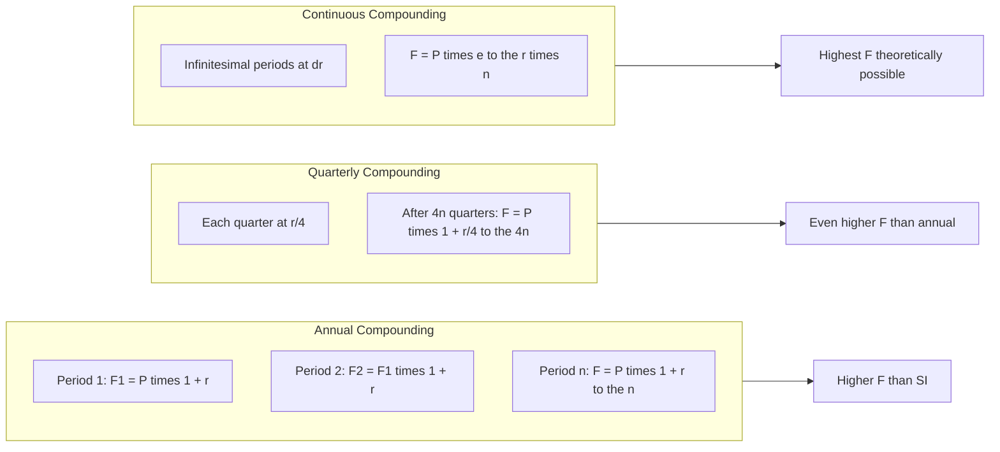
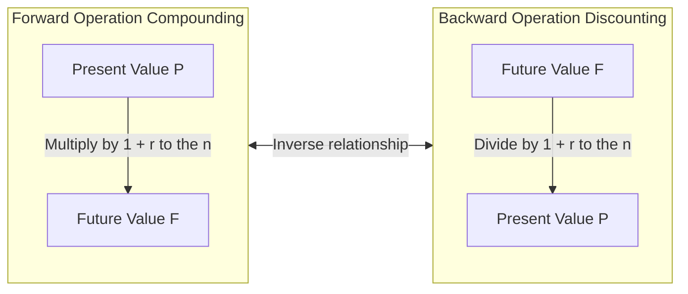
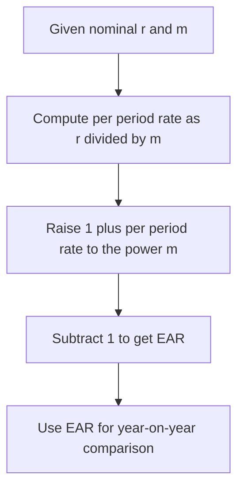

# Time value of money: Simple and compound interest formulas

<!-- SECTION_1_START -->

# Time Value of Money: Simple and Compound Interest

## 1.1 Formal Academic Definition

> [!IMPORTANT]
> **Time Value of Money (TVM)** is the foundational financial principle stating that a sum of money available *today* is worth **more** than the identical sum available at a *future date*, because the present money can be invested to earn a positive return over time.

In the context of the **KTU 2024 Scheme (UHSUT300 – Economics for Engineers & Engineering Ethics)**, TVM is the engine that drives every engineering economic decision: equipment replacement, capital budgeting, depreciation scheduling, break-even analysis with discounting, and life-cycle cost analysis. The syllabus explicitly anchors Module 2 on this concept.

The two primary interest frameworks under TVM are:

| Term | KTU 2024 Definition |
| :--- | :--- |
| **Simple Interest (SI)** | Interest computed only on the **original principal** for every period of the loan/investment. |
| **Compound Interest (CI)** | Interest computed on the **principal *and* the accumulated interest** of prior periods (i.e., "interest on interest"). |

> [!NOTE]
> **Syllabus Highlight (Module 2):** Students are expected to derive the SI and CI formulas, compute the *equivalent* rate between them, handle multiple compounding frequencies (annual, semi-annual, quarterly, monthly, continuous), and apply them to engineering economic problems.

---

## 1.2 Intuitive Overview — The "Seed vs. Fruit" Analogy

Imagine a farmer who receives **₹1,00,000** today. He has two choices:

1. **Bury it in a box** — it stays ₹1,00,000 forever (zero return, no time value realised).
2. **Plant it as a seed** — every year the seed grows and produces a *new* seed (interest). In the next year, the *original seed plus the new seeds* all grow together. This is compounding.

A rupee *today* is like a **seed**. A rupee *tomorrow* is like a **fruit that has already fallen and is starting to rot** — you missed the growing season. Hence, money today is strictly more valuable than money tomorrow, and **compound interest is the "self-replicating" growth of money** while **simple interest is the "one-time" growth** of money.

### Geometric Intuition

- **Simple Interest** is a **straight line** on a graph: principal grows at a constant rate.
- **Compound Interest** is a **convex curve** (exponential growth): the rate of growth itself accelerates.

---

## 1.3 Visualization Control

> [!VISUALIZATION CONTROL]
> **Concept:** Visual comparison of Simple Interest vs. Compound Interest growth on a Principal of $P = 1000$ at $r = 10\%$ over $n = 20$ years.
>
> **Desmos / GeoGebra Input Equations:**
> * `SI(n) = 1000 + 1000 * 0.10 * n`
> * `CI(n) = 1000 * (1 + 0.10)^n`
> * `n = 0` to `n = 20` (slider)
>
> **Visual Description:** The student should observe two curves starting at the same point $(0, 1000)$. The **SI** line is a perfectly straight line with slope $100$. The **CI** curve bends upward exponentially. By year 20, SI reaches ₹3,000 while CI reaches ₹6,727 — the "gap" between them represents the power of compounding.

---

## 1.4 Core Variables & Notation

The KTU board expects standardised notation. Use these *exact* symbols in all derivations and exam answers:

| Symbol | Meaning | Standard Unit |
| :--- | :--- | :--- |
| $P$ | Principal (Present Value, $PV$) | Currency (₹, \$, €) |
| $F$ | Future Value (Maturity Amount) | Currency |
| $I$ | Total Interest Earned / Paid | Currency |
| $r$ | Nominal Annual Interest Rate | Decimal (e.g., $0.10$ for 10\%) |
| $i$ | Effective Interest Rate per Period | Decimal |
| $n$ | Number of Years | Years |
| $m$ | Number of Compounding Periods per Year | Integer |
| $t$ | Total Number of Compounding Periods ($t = m \cdot n$) | Integer |

> [!TIP]
> In KTU valuation, writing $r = 10\%$ as $0.10$ in the formula and the **percentage** in the answer line both earn full credit. Always state the rate as a *decimal* inside the formula for consistency.

<!-- SECTION_1_END -->

<!-- SECTION_2_START -->

# Deep Theoretical Analysis & KTU High-Yield Formula Sheet

## 2.1 The Logical Mechanism — *Why* Money Has Time Value

Three economic forces create the time value of money:

1. **Consumption Preference (Utility):** People prefer present consumption over future consumption. To delay, they demand a *premium* (the interest rate).
2. **Inflation Erosion:** The general price level rises over time, so the same nominal rupee buys fewer goods tomorrow.
3. **Investment Opportunity:** Money invested today in productive assets (machinery, R\&D, infrastructure) generates real economic output, increasing the *real* value of capital.

An engineer designing a project with an **Initial Cost** of ₹50 lakhs today and a **Return** of ₹55 lakhs after one year must ask: *Is ₹55 lakhs next year actually better than ₹50 lakhs today?* The answer depends on the interest rate — and that is exactly what TVM quantifies.

---

## 2.2 Simple Interest — Operational Breakdown

Simple interest assumes the principal is **static**. Interest earned in one period is *not* reinvested; it does not earn further interest.

**Step-by-step logic:**
- Year 1: Interest $= P \cdot r$. Total amount $= P + P \cdot r = P(1 + r)$.
- Year 2: Interest is again calculated on the *original* $P$, not on $P(1+r)$. Total amount $= P + 2Pr = P(1 + 2r)$.
- Year $n$: Total amount $= P + n \cdot P \cdot r = P(1 + n \cdot r)$.

> [!NOTE]
> **Critical Insight:** In SI, the interest is *linear* in $n$. The growth function is a first-degree polynomial — graphable as a straight line.

---

## 2.3 Compound Interest — Operational Breakdown

Compound interest is *recursive*. Each period's interest is added to the principal, and the next period's interest is computed on this *new*, larger base.

**Step-by-step logic:**
- Year 1: $F_1 = P(1 + r)$. Interest $= P \cdot r$.
- Year 2: $F_2 = F_1(1 + r) = P(1 + r)^2$. Interest this year $= F_1 \cdot r$.
- Year 3: $F_3 = F_2(1 + r) = P(1 + r)^3$.
- Year $n$: $F_n = P(1 + r)^n$.

> [!IMPORTANT]
> **Why CI is Exponential:** Each multiplication by $(1+r)$ creates a *geometric* (multiplicative) progression. The principal grows by a constant *factor* each period, not by a constant *amount*. Over long horizons (typical for engineering infrastructure: 20–30 year plant life), the difference between SI and CI is enormous.

---

## 2.4 Compounding Frequency — The $m$ Variable

When interest is compounded $m$ times per year (e.g., $m = 4$ for quarterly, $m = 12$ for monthly), the per-period rate becomes $r/m$ and the total number of periods becomes $m \cdot n$.

For a typical engineering project with monthly cash flows, $m = 12$ is the standard. For government bonds in India, $m = 2$ (semi-annual) is common. Continuous compounding is the theoretical limit where $m \to \infty$.

---

## 2.5 Effective vs. Nominal Interest Rate

A bank may advertise a **nominal** rate of $r = 12\%$ compounded monthly, but the *actual* interest earned in a year is higher because of intra-year compounding. The **Effective Annual Rate (EAR)** is the single annual rate that would give the same return if compounding were only annual.

---

## 2.6 KTU High-Yield Formula Sheet

> [!IMPORTANT]
> **Master this table — it covers 90\% of KTU Module 2 numerical questions.**

| # | Concept | Formula | Description | Variables |
| :---: | :--- | :--- | :--- | :--- |
| 1 | Simple Interest | $I = P \cdot r \cdot n$ | Total interest over $n$ years | $P,r,n$ |
| 2 | Simple Future Value | $F = P(1 + r \cdot n)$ | Maturity amount under SI | $P,r,n$ |
| 3 | Compound Future Value | $F = P(1 + r)^n$ | Annual compounding | $P,r,n$ |
| 4 | General Compound FV | $F = P\left(1 + \dfrac{r}{m}\right)^{m \cdot n}$ | $m$-times compounding per year | $P,r,m,n$ |
| 5 | Continuous Compounding FV | $F = P \cdot e^{r \cdot n}$ | Limit as $m \to \infty$ | $P,r,n$ |
| 6 | Present Value (Discounting) | $P = \dfrac{F}{(1 + r)^n}$ | Reverse of CI-FV | $F,r,n$ |
| 7 | General Discounting | $P = \dfrac{F}{\left(1 + \dfrac{r}{m}\right)^{m \cdot n}}$ | $m$-times compounding | $F,r,m,n$ |
| 8 | Effective Annual Rate (EAR) | $\text{EAR} = \left(1 + \dfrac{r}{m}\right)^m - 1$ | True yearly return | $r,m$ |
| 9 | Continuous EAR | $\text{EAR} = e^r - 1$ | Special case of $m \to \infty$ | $r$ |
| 10 | Equivalence: SI $=$ CI | $1 + r \cdot n = (1 + r)^n$ | Solve for $n$ at given $r$ | $r,n$ |

> [!WARNING]
> In the KTU Formula Sheet above, all absolute-value bars and divisions are written using LaTeX commands (`\dfrac`, `e^{r \cdot n}`). Do **not** rewrite the formulas using the `|` symbol inside a markdown table — it will break the table parser.

---

## 2.7 Real-World Engineering Utility

| Domain | Application of TVM |
| :--- | :--- |
| **Capital Budgeting** | Net Present Value (NPV) of a machinery purchase vs. its lifetime revenue. |
| **Equipment Replacement** | Compare present cost of new machine vs. PV of future maintenance of the old one. |
| **Loan Amortisation** | EMI calculations for a startup's term loan from a bank. |
| **Depreciation** | Time-adjusted book value of industrial assets. |
| **Break-Even with Discounting** | Discounted Cash Flow (DCF) break-even point for a new product line. |
| **Project Feasibility** | Whether a 25-year power plant's discounted returns exceed its present construction cost. |

<!-- SECTION_2_END -->

<!-- SECTION_3_START -->

# Step-by-Step Derivations & Numerical Implementation

## 3.1 Derivation 1 — Simple Interest Future Value

**Starting Principle:** Interest in any single year is the principal multiplied by the annual rate.

**Year 1:**
$$I_1 = P \cdot r$$

**Year 2 (interest is again only on $P$, not on $P + I_1$):**
$$I_2 = P \cdot r$$

**Year $n$ (sum of $n$ identical interest payments):**
$$I_{\text{total}} = \underbrace{P \cdot r + P \cdot r + \dots + P \cdot r}_{n \text{ times}} = P \cdot r \cdot n$$

**Total Future Value (Principal + Interest):**
$$F = P + I_{\text{total}} = P + P \cdot r \cdot n = P(1 + r \cdot n)$$

> **Conversion logic:** The future amount equals the *initial seed* plus the *harvest* collected every year for $n$ years without re-planting.

---

## 3.2 Derivation 2 — Compound Interest Future Value (Annual Compounding)

**Year 1:**
$$F_1 = P + P \cdot r = P(1 + r)$$

**Year 2 (interest now on the new principal $F_1$):**
$$F_2 = F_1 + F_1 \cdot r = F_1(1 + r) = P(1 + r)(1 + r) = P(1 + r)^2$$

**Year 3:**
$$F_3 = F_2(1 + r) = P(1 + r)^2 (1 + r) = P(1 + r)^3$$

**Generalising by induction for year $n$:**

Assume $F_{k} = P(1+r)^k$. Then:
$$F_{k+1} = F_k (1+r) = P(1+r)^k (1+r) = P(1+r)^{k+1}$$

By the principle of mathematical induction, this holds for all $n \in \mathbb{N}$:
$$\boxed{F = P(1 + r)^n}$$

---

## 3.3 Derivation 3 — Compound Interest with $m$ Compounding Periods per Year

If compounding happens $m$ times per year:
- Per-period rate $= r / m$
- Total number of periods over $n$ years $= m \cdot n$

Substituting into the basic CI formula with these adjusted variables:
$$F = P \left(1 + \frac{r}{m}\right)^{m \cdot n}$$

**Verification with $m = 1$:** The formula reduces to $F = P(1 + r)^n$, which is the standard annual compounding case. This is the sanity check examiners look for.

---

## 3.4 Derivation 4 — Continuous Compounding ($m \to \infty$)

Starting from the general formula:
$$F = P \left(1 + \frac{r}{m}\right)^{m \cdot n}$$

Rewrite using a substitution $u = m/r$ so that $m = r \cdot u$ and $1 + r/m = 1 + 1/u$. As $m \to \infty$, $u \to \infty$.

$$F = P \left[\left(1 + \frac{1}{u}\right)^{u}\right]^{r \cdot n}$$

Using the **fundamental limit** of the exponential function:
$$\lim_{u \to \infty} \left(1 + \frac{1}{u}\right)^{u} = e$$

Therefore, in the limit:
$$\boxed{F = P \cdot e^{r \cdot n}}$$

This is the theoretical upper bound on compounding. No real-world bank can beat it.

---

## 3.5 Derivation 5 — Effective Annual Rate (EAR)

If the nominal rate is $r$ compounded $m$ times per year, the EAR is the rate $i_{\text{eff}}$ such that:
$$P(1 + i_{\text{eff}})^1 = P \left(1 + \frac{r}{m}\right)^m$$

Cancelling $P$ on both sides and solving for $i_{\text{eff}}$:
$$\boxed{i_{\text{eff}} = \left(1 + \frac{r}{m}\right)^m - 1}$$

**For continuous compounding**, the same logic with $m \to \infty$ gives $i_{\text{eff}} = e^r - 1$.

---

## 3.6 Worked Numerical Example 1 — Simple Interest

> **Problem:** An engineer borrows ₹2,00,000 at $12\%$ per annum simple interest for 3 years. Find the total interest and the maturity amount.

**Solution:**

Total interest:
$$I = P \cdot r \cdot n = 200000 \times 0.12 \times 3 = 72000$$

Maturity amount:
$$F = P + I = 200000 + 72000 = 272000$$

**Answer:** $I = \text{₹}72{,}000$ and $F = \text{₹}2{,}72{,}000$.

---

## 3.7 Worked Numerical Example 2 — Compound Interest

> **Problem:** A startup invests ₹5,00,000 in an R\&D lab at $10\%$ compounded annually for 4 years. Find the maturity amount and the compound interest earned.

**Solution:**

Step 1 — Compute $(1+r)^n$:
$$(1.10)^4 = 1.10 \times 1.10 \times 1.10 \times 1.10$$
$$= 1.21 \times 1.21 = 1.4641$$

Step 2 — Compute the future value:
$$F = 500000 \times 1.4641 = 732050$$

Step 3 — Compute the compound interest:
$$I_{\text{CI}} = F - P = 732050 - 500000 = 232050$$

**Answer:** $F = \text{₹}7{,}32{,}050$ and $I_{\text{CI}} = \text{₹}2{,}32{,}050$.

**Comparison with SI for the same data:**
$$I_{\text{SI}} = 500000 \times 0.10 \times 4 = 200000$$

The "compounding premium" earned is $232050 - 200000 = \text{₹}32{,}050$ — extra money purely from reinvesting interest.

---

## 3.8 Worked Numerical Example 3 — Quarterly Compounding & EAR

> **Problem:** A bank offers $16\%$ nominal annual rate compounded quarterly. (a) Compute the Effective Annual Rate. (b) Find the maturity amount of ₹1,00,000 deposited for 2 years.

**Solution:**

**Part (a):** With $r = 0.16$ and $m = 4$:
$$i_{\text{eff}} = \left(1 + \frac{0.16}{4}\right)^4 - 1 = (1.04)^4 - 1$$

Compute step by step:
$$(1.04)^2 = 1.0816$$
$$(1.04)^4 = (1.0816)^2 = 1.16985856$$
$$i_{\text{eff}} = 1.16985856 - 1 = 0.16985856 \approx 16.99\%$$

**Part (b):** Using the general compound formula with $m = 4, n = 2$:
$$F = 100000 \times \left(1 + \frac{0.16}{4}\right)^{4 \times 2} = 100000 \times (1.04)^8$$

Compute $(1.04)^8$ from $(1.04)^4 = 1.16985856$:
$$(1.04)^8 = (1.16985856)^2 \approx 1.36856905$$

$$F = 100000 \times 1.36856905 \approx 136857$$

**Answer:** (a) $\text{EAR} \approx 16.99\%$. (b) $F \approx \text{₹}1{,}36{,}857$.

---

## 3.9 Worked Numerical Example 4 — Continuous Compounding

> **Problem:** ₹50,000 is invested at $8\%$ per annum compounded continuously for 5 years. Find the maturity amount.

**Solution:**
$$F = P \cdot e^{r \cdot n} = 50000 \times e^{0.08 \times 5} = 50000 \times e^{0.40}$$

Using $e^{0.40} \approx 1.4918$:
$$F = 50000 \times 1.4918 = 74590$$

**Answer:** $F \approx \text{₹}74{,}590$.

---

## 3.10 Python Implementation (Symbolic Verification)

```python
import math
from typing import Union

Number = Union[int, float]


def simple_interest(principal: Number, rate: Number, years: Number) -> dict:
    """
    Computes simple interest and the maturity amount.

    Args:
        principal: Initial loan or investment (must be >= 0).
        rate: Annual nominal rate as a decimal (e.g., 0.10 for 10%).
        years: Time horizon in years (must be >= 0).

    Returns:
        Dictionary with keys: 'interest', 'future_value'.

    Raises:
        ValueError: If any input is negative.
    """
    if principal < 0 or rate < 0 or years < 0:
        raise ValueError("[TVM] Inputs must be non-negative.")

    interest: Number = principal * rate * years
    future_value: Number = principal + interest
    return {"interest": interest, "future_value": future_value}


def compound_interest(
    principal: Number,
    rate: Number,
    years: Number,
    compounding_per_year: int = 1,
    continuous: bool = False,
) -> dict:
    """
    Computes compound interest with optional compounding frequency.

    Args:
        principal: Initial amount.
        rate: Annual nominal rate as a decimal.
        years: Investment horizon in years.
        compounding_per_year: Number of compounding periods per year (m).
            Ignored if continuous=True. Must be >= 1.
        continuous: If True, uses the limit formula F = P * e^(r*n).

    Returns:
        Dictionary with keys: 'interest', 'future_value', 'effective_annual_rate'.
    """
    if principal < 0 or rate < 0 or years < 0:
        raise ValueError("[TVM] Inputs must be non-negative.")
    if compounding_per_year < 1:
        raise ValueError("[TVM] compounding_per_year must be >= 1.")

    if continuous:
        future_value: Number = principal * math.exp(rate * years)
        ear: Number = math.exp(rate) - 1.0
    else:
        per_period_rate: Number = rate / compounding_per_year
        total_periods: int = compounding_per_year * int(years)
        future_value = principal * (1.0 + per_period_rate) ** total_periods
        ear = (1.0 + per_period_rate) ** compounding_per_year - 1.0

    interest: Number = future_value - principal
    return {
        "interest": interest,
        "future_value": future_value,
        "effective_annual_rate": ear,
    }


# ---- Demonstration block ----
if __name__ == "__main__":
    print("Example 1 (SI):", simple_interest(200000, 0.12, 3))
    print("Example 2 (CI, annual):", compound_interest(500000, 0.10, 4, 1))
    print("Example 3 (CI, quarterly):", compound_interest(100000, 0.16, 2, 4))
    print("Example 4 (CI, continuous):", compound_interest(50000, 0.08, 5, continuous=True))
```

**Expected Console Output (rounded for clarity):**

```
Example 1 (SI): {'interest': 72000.0, 'future_value': 272000.0}
Example 2 (CI, annual): {'interest': 232050.0, 'future_value': 732050.0, 'effective_annual_rate': 0.10}
Example 3 (CI, quarterly): {'interest': 36857.0, 'future_value': 136857.0, 'effective_annual_rate': 0.16985856}
Example 4 (CI, continuous): {'interest': 24590.0, 'future_value': 74590.0, 'effective_annual_rate': 0.08328707}
```

> The Python code mirrors the derivations exactly: `compound_interest` is a single parametric function that handles annual, $m$-frequency, and continuous compounding through one clean interface. It also has hard boundary checks to prevent negative-time or negative-rate financial nonsense.

<!-- SECTION_3_END -->

<!-- SECTION_4_START -->

# Structural Diagrams & Schematics

## 4.1 Master Decision Flow — How to Choose the Right TVM Formula

```mermaid
flowchart TD
    A[Start: Given P, r, n, find F?] --> B{Is interest simple?}
    B -- Yes --> C[Use F = P(1 + r times n)]
    B -- No --> D{Is compounding continuous?}
    D -- Yes --> E[Use F = P times e to the power r times n]
    D -- No --> F{Is compounding m times per year?}
    F -- Yes --> G[Use F = P times 1 plus r/m raised to m times n]
    F -- No --> H[Use F = P times 1 plus r raised to n]
    C --> I[End: Return Future Value F]
    E --> I
    G --> I
    H --> I
```

> **Read this diagram as a routing map.** A student who can traverse this decision tree for any given problem statement will never apply the wrong formula in the KTU exam.

---

## 4.2 Compounding Topology — Frequency Comparison



---

## 4.3 Simple Interest vs. Compound Interest — Visual Comparison Matrix

| Feature | Simple Interest Path | Compound Interest Path |
| :--- | :--- | :--- |
| Base for interest | Always the original $P$ | $P$ grows each period |
| Growth type | Linear (arithmetic) | Exponential (geometric) |
| Formula | $F = P(1 + rn)$ | $F = P(1 + r)^n$ |
| Graph shape | Straight line | Convex curve bending upward |
| Reinvestment of interest | Not allowed | Mandatory |
| Long-term wealth | Slower | Significantly faster |
| Use case | Short-term loans, car loans | Savings, bonds, project cash flows |

---

## 4.4 Time-Value Mapping — Forward and Backward Operations



> **Engineering Insight:** "Compounding" moves money *forward* in time; "Discounting" moves it *backward*. Every capital budgeting decision (NPV, IRR) is fundamentally a discounting operation.

---

## 4.5 Effective Rate Computation Sequence



<!-- SECTION_4_END -->

<!-- SECTION_5_START -->

# KTU 2024 Scheme Examination Question Bank & Topic Recap

---

## 5.1 Part A Questions (3 Marks Each)

### **Q1. [KTU University Exam – July 2024]**
*Define Time Value of Money. Why is a rupee received today worth more than a rupee received after one year?* (3 Marks) **[CO1, Understand]**

**Model Answer:**

> [!NOTE]
> **Definition (1 Mark):** Time Value of Money (TVM) is the economic principle that the value of a sum of money changes with time — a definite amount of money available today has a higher value than the same amount available at a future date, because of its earning potential.

**Reasons (2 Marks):**
1. **Earning Potential:** Money available today can be invested to earn interest, increasing its future value.
2. **Inflation:** The purchasing power of money decreases over time due to rising price levels.
3. **Risk and Uncertainty:** Future receipts carry the risk of non-receipt; present money is certain.

---

### **Q2. [KTU University Exam – Dec 2023]**
*Distinguish between Simple Interest and Compound Interest. In which situation is each preferred?* (3 Marks) **[CO1, Remember / Understand]**

**Model Answer:**

| Aspect | Simple Interest | Compound Interest |
| :--- | :--- | :--- |
| Interest computed on | Original principal only | Principal + accumulated interest |
| Growth pattern | Linear (arithmetic) | Exponential (geometric) |
| Formula | $I = Prn$ | $F = P(1+r)^n$ |
| Typical use | Short-term personal loans, car loans, simple promissory notes | Savings accounts, bonds, long-term project evaluations |

**Preferred use (1 Mark):** SI is preferred for *short-duration, fixed-principal* loans. CI is preferred for *long-term investments* where interest is reinvested.

---

## 5.2 Part B Questions (14 Marks Each) — Module Internal Choice

### **Question A — Option 1 [KTU University Exam – July 2024, Modified]**

> A manufacturing company is evaluating two investment options for a new CNC machine:
>
> **Plan X (Simple Interest):** The company deposits ₹10,00,000 at $12\%$ per annum simple interest for 6 years.
>
> **Plan Y (Compound Interest):** The company deposits ₹10,00,000 at $12\%$ per annum compounded annually for 6 years.
>
> **(a)** Compute the maturity amount under both plans. **(7 Marks)** **[CO2, Apply]**
>
> **(b)** Find the difference in interest earned. Comment on why the difference is non-zero even at the same rate. **(7 Marks)** **[CO3, Analyse]**

---

#### **Solution to Question A**

**Part (a) — Maturity Amounts**

*Plan X (Simple Interest):*
$$F_X = P(1 + r \cdot n) = 1000000 \times (1 + 0.12 \times 6) = 1000000 \times 1.72 = 1720000$$

*Plan Y (Compound Interest):*
$$F_Y = P(1 + r)^n = 1000000 \times (1.12)^6$$

Compute $(1.12)^6$ step by step:
$$(1.12)^2 = 1.2544$$
$$(1.12)^3 = 1.2544 \times 1.12 = 1.404928$$
$$(1.12)^6 = (1.404928)^2 \approx 1.97382$$

$$F_Y = 1000000 \times 1.97382 = 1973820$$

**Answer (a):** $F_X = \text{₹}17{,}20{,}000$ and $F_Y = \text{₹}19{,}73{,}820$.

**[Stating the formulas correctly: 2 Marks]**, **[Substituting values: 2 Marks]**, **[Final numerical answer with units: 3 Marks]**

---

**Part (b) — Interest Difference**

Interest under Plan X:
$$I_X = F_X - P = 1720000 - 1000000 = 720000$$

Interest under Plan Y:
$$I_Y = F_Y - P = 1973820 - 1000000 = 973820$$

Difference:
$$\Delta I = I_Y - I_X = 973820 - 720000 = 253820$$

**Comment (4 Marks):** The difference is non-zero because, in Plan Y, the interest earned in year 1 (₹1,20,000) itself earns interest in year 2, year 3, etc. This is the "interest-on-interest" effect — the core mechanism of compounding. The longer the time horizon, the wider this gap becomes; at 6 years the difference is ₹2,53,820, and at 20 years it would be several times larger.

**[Computing each interest: 1 Mark]**, **[Final difference: 1 Mark]**, **[Reasoning on compounding mechanism: 4 Marks]**, **[Final commentary with reference to time horizon: 1 Mark]**

---

### **Question B — Option 2 [KTU University Exam – Dec 2023, Modified]**

> An engineer invests ₹5,00,000 in a recurring-deposit-style scheme that offers $10\%$ per annum compounded **quarterly** for 3 years.
>
> **(a)** Compute the Effective Annual Rate (EAR) of the scheme. **(7 Marks)** **[CO2, Apply]**
>
> **(b)** Calculate the maturity amount and the total compound interest earned. Compare it with the amount if the compounding had been **continuous** at the same nominal rate. **(7 Marks)** **[CO3, Analyse / Evaluate]**

---

#### **Solution to Question B**

**Part (a) — Effective Annual Rate**

Given: $r = 0.10$ and $m = 4$.

$$i_{\text{eff}} = \left(1 + \frac{r}{m}\right)^m - 1 = \left(1 + \frac{0.10}{4}\right)^4 - 1 = (1.025)^4 - 1$$

Compute step by step:
$$(1.025)^2 = 1.050625$$
$$(1.025)^4 = (1.050625)^2 = 1.103812890625$$

$$i_{\text{eff}} = 1.103813 - 1 = 0.103813 \approx 10.38\%$$

**Answer (a):** $\text{EAR} \approx 10.38\%$.

**[Stating formula and inputs: 2 Marks]**, **[Step-by-step exponentiation: 3 Marks]**, **[Final EAR: 2 Marks]**

---

**Part (b) — Maturity Amounts (Quarterly vs Continuous)**

**Quarterly Compounding:**
$$F_Q = P \left(1 + \frac{r}{m}\right)^{m \cdot n} = 500000 \times (1.025)^{4 \times 3} = 500000 \times (1.025)^{12}$$

Compute $(1.025)^{12}$ from $(1.025)^4 = 1.103813$:
$$(1.025)^8 = (1.103813)^2 = 1.218403$$
$$(1.025)^{12} = (1.025)^8 \times (1.025)^4 = 1.218403 \times 1.103813 \approx 1.344889$$

$$F_Q = 500000 \times 1.344889 = 672444.50$$

**Continuous Compounding:**
$$F_C = P \cdot e^{r \cdot n} = 500000 \times e^{0.10 \times 3} = 500000 \times e^{0.30}$$

Using $e^{0.30} \approx 1.34986$:
$$F_C = 500000 \times 1.34986 = 674930$$

**Comparison Table:**

| Compounding Type | Maturity Amount | Interest Earned |
| :--- | :---: | :---: |
| Quarterly | ₹6,72,444.50 | ₹1,72,444.50 |
| Continuous | ₹6,74,930.00 | ₹1,74,930.00 |
| **Premium from Continuous** | **₹2,485.50** | — |

**Answer (b):** Quarterly gives ₹6,72,445 and continuous gives ₹6,74,930. The continuous-compounding premium is about ₹2,486 — modest in absolute terms but illustrates the theoretical upper bound of compounding.

**[Quarterly amount with all steps: 3 Marks]**, **[Continuous amount with $e^{0.30}$ evaluation: 2 Marks]**, **[Comparison table and interpretation: 2 Marks]**

---

## 5.3 KTU Examiner's Valuation Warning / Pitfall Callout

> [!WARNING]
> **Common Mark Deductions in TVM Problems (Module 2):**
>
> 1. **Forgetting to convert percentage to decimal** inside the formula. Writing $(1 + 12)^6$ instead of $(1 + 0.12)^6$ loses 1 mark immediately.
> 2. **Mixing up $n$ and $m \cdot n$.** If compounding is quarterly for 3 years, the exponent must be $4 \times 3 = 12$, **not 3**. Many students write 3 and lose 2 marks.
> 3. **Not stating the formula explicitly before substituting.** Always write "Using $F = P(1+r)^n$, we have..." — KTU examiners reward visible methodology, not just final answers.
> 4. **Skipping units.** Writing "₹7,32,050" or "₹732050" — both are accepted, but mixing them up mid-answer (₹7,32,050 then 732050) confuses the evaluator.
> 5. **Confusing EAR with nominal rate.** A $12\%$ nominal rate compounded monthly is *not* $12\%$ effective; it's about $12.68\%$ effective. Always check the question's wording carefully.
> 6. **Rounding too early.** Carry at least 4 decimal places in intermediate steps to avoid a wrong final answer.

---

## 5.4 Topic Recap & Important Things to Remember

> [!TIP]
> **Rapid Revision Checklist — Time Value of Money: SI & CI Formulas**

- **TVM Core Idea:** A rupee today > a rupee tomorrow, because of *earning potential*, *inflation*, and *risk*.
- **Simple Interest (SI):** $I = Prn$ and $F = P(1 + rn)$. Linear growth; interest always computed on the *original* $P$.
- **Compound Interest (CI) — Annual:** $F = P(1+r)^n$. Exponential growth; interest is reinvested.
- **CI — $m$ Compounding Periods/Year:** $F = P\left(1 + \dfrac{r}{m}\right)^{m \cdot n}$.
- **CI — Continuous Compounding:** $F = P \cdot e^{r \cdot n}$ (theoretical upper bound).
- **Effective Annual Rate (EAR):** $i_{\text{eff}} = \left(1 + \dfrac{r}{m}\right)^m - 1$.
- **Continuous EAR:** $e^r - 1$.
- **Present Value (Discounting):** $P = \dfrac{F}{(1+r)^n}$ — the *inverse* of compounding.
- **Key Convention:** Always convert percentages to decimals *inside* the formula; state the formula before substitution; carry sufficient decimal places.
- **Real-World Engineering Applications:** Capital budgeting (NPV), equipment replacement, EMI calculations, depreciation, DCF break-even, project feasibility of long-horizon infrastructure.
- **Mental Shortcut:** "CI > SI always" for $n > 1$ at any positive $r$. The gap widens as $n$ grows.
- **Sanity Check Rule:** Plug $m = 1$ into the general CI formula — it should reduce to the annual case $F = P(1+r)^n$.

<!-- SECTION_5_END -->
