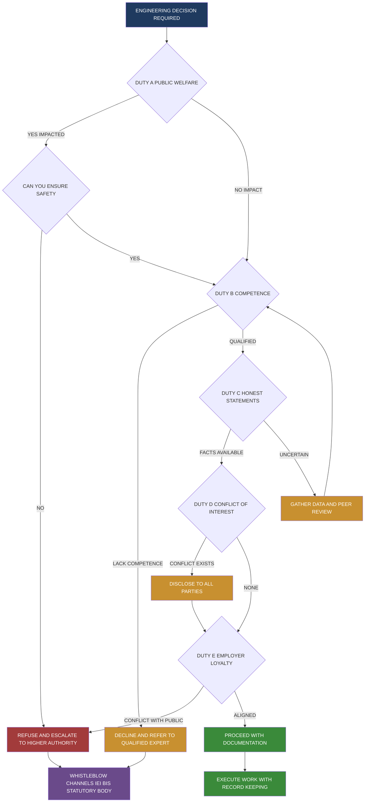
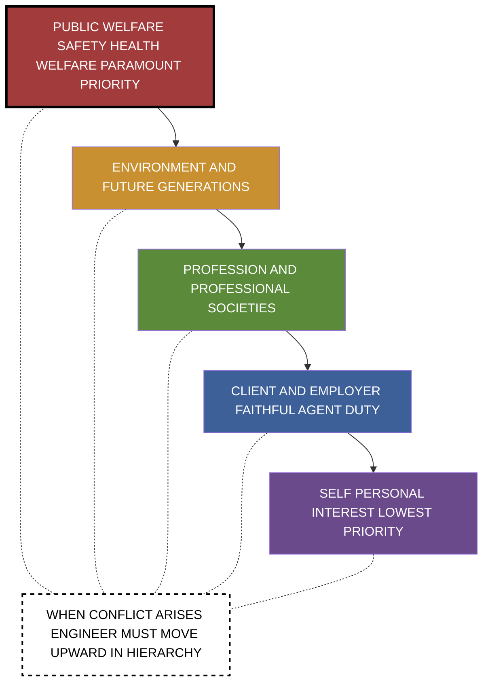
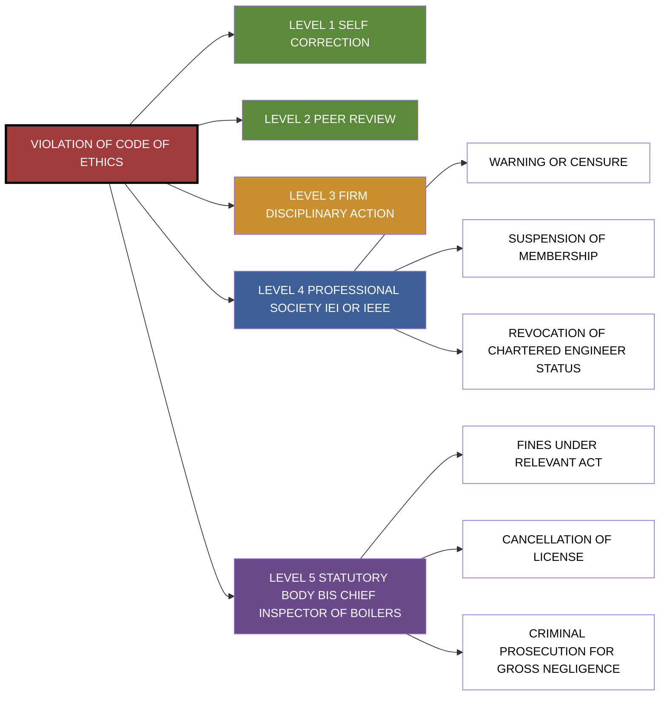

# Code of Ethics for Engineers

<!-- SECTION_1_START -->
# Code of Ethics for Engineers

> [!IMPORTANT]
> **KTU 2024 Scheme | UHSUT300 | Module 3 | Topic: Code of Ethics for Engineers**
> This note is mapped to **CO3** (Understand the ethical responsibilities of engineers) and the **Bloom's Cognitive Levels**: Remember, Understand, Apply, and Analyze.

---

## 1. Formal Academic Definition

A **Code of Ethics** for engineers is a formally written, publicly adopted document that prescribes the **principles, standards, and rules of conduct** governing the professional behaviour of practicing engineers. It functions as the **moral constitution** of the engineering profession, defining the engineer's obligations toward **the public, the client/employer, the profession, and fellow engineers** as well as the **environment** and **sustainable development**.

> [!NOTE]
> **KTU Syllabus Highlight (Module 3.3):**
> "Study of fundamental ethical principles, codes of ethics (national and international), and the concept of professionalism as applied to engineering practice."

In KTU 2024 Scheme terms, a Code of Ethics is treated as the **operational translation of moral philosophy into enforceable professional practice**, where abstract virtues (honesty, integrity, justice) become **verifiable professional duties** (disclosure of conflicts of interest, refusal to sign unsafe designs, peer review of technical work).

The three most academically referenced codes in KTU evaluation are:

1. **NSPE Code of Ethics** (National Society of Professional Engineers, USA) – the most widely cited international code.
2. **IEEE Code of Ethics** (Institute of Electrical and Electronics Engineers) – the most relevant for CS/IT and Electronics branches.
3. **Institution of Engineers (India) [IEI] Code of Ethics** – the **most directly applicable** for KTU students, since IEI is the national professional body.

---

## 2. Intuitive Overview (Conceptual Analogy)

> [!TIP]
> **Real-World Analogy — The Doctor's Hippocratic Oath for Engineers**

Imagine a civil engineer is about to sign off on a bridge design. A non-engineer might say, *"Just make it strong enough."* But the engineer knows that "strong enough" is decided by codes — **IS 456, IRC, AASHTO LRFD** — and by a *Code of Ethics* that says:

> *"Approve only those engineering documents that are in conformity with accepted engineering standards and that safeguard the public welfare."*

Think of a **Code of Ethics** as a **three-layer safety system**:

| Layer | Real-World Analogy | Engineering Equivalent |
|---|---|---|
| **Layer 1 — Law** | Traffic rules | Engineering Acts, RTI, Factory Act |
| **Layer 2 — Code of Ethics** | Driving school discipline + medical oath | NSPE / IEEE / IEI Code of Ethics |
| **Layer 3 — Personal Conscience** | Your moral compass | Engineer's personal virtue ethics |

The **Code of Ethics sits between the law (minimum required) and personal conscience (maximum aspirational)**. Violating the law is a *crime*; violating the Code of Ethics is a *professional misconduct* (which can cost your license to practice); violating your conscience is a *moral failure*.

> [!WARNING]
> **Common Student Misconception:**
> "Ethics is just being a good person." **No.** KTU expects you to know that ethics is a **structured, codified, and enforceable** system — it is *codified professionalism*, not personal opinion.

---

## 3. Core Constants, Standards & Terminology

The following **bold-marked terms** appear repeatedly in KTU questions and must be memorized verbatim:

- **Fundamental Canons** — the top-tier principles of any code of ethics (always listed first).
- **Preamble** — the introductory statement of intent and scope.
- **Stakeholders** — the parties to whom the engineer owes duties (public, employer, profession, peers, environment).
- **Conflict of Interest** — a situation where personal interest compromises professional judgement.
- **Whistleblowing** — the ethical duty (and protection) of reporting unethical or unsafe practices.
- **Competence** — practicing only in areas where the engineer is qualified by education and experience.
- **Public Welfare** — the **paramount** criterion, always ranked above employer and client in every major code.

> [!VISUALIZATION CONTROL]
> **Concept:** Hierarchy of Ethical Obligations in Engineering
> **Conceptual Axes:**
> * **Vertical Axis (Priority):** Public Welfare > Employer/Client > Profession > Self
> * **Horizontal Axis (Scope):** Individual Engineer | Firm | Profession | Society
> **Visual Description:** Picture an inverted triangle. At the top (widest, highest priority) is *Public Safety*. At the bottom (narrowest, lowest priority) is *Personal Profit*. The Code of Ethics instructs the engineer to make decisions that move *upward* in this hierarchy when lower priorities conflict with higher ones.

---

<!-- SECTION_1_END -->

<!-- SECTION_2_START -->
# Deep Theoretical Analysis & KTU High-Yield Cheat Sheet

## 1. The Structural Anatomy of a Code of Ethics

Every major engineering code of ethics — whether **NSPE**, **IEEE**, **ASCE**, or **IEI** — shares a common **four-tier architecture**. Understanding this structure is essential because KTU Part A questions (3 marks) often ask students to "list the fundamental principles" or "state the engineer's duties."

```
TIER 1 → PREAMBLE (Statement of Purpose)
TIER 2 → FUNDAMENTAL CANONS (Broad Moral Principles)
TIER 3 → RULES OF PRACTICE (Specific Professional Duties)
TIER 4 → PROFESSIONAL OBLIGATIONS (Duties to Peers and Profession)
```

### Step-by-Step Logic Breakdown

**Step 1 — Preamble**
The preamble answers the question: *"Why does this code exist?"* It establishes the engineer's contract with society. For example, the **NSPE Preamble** states that engineering is an *"important and learned profession"* whose members bear a *"responsibility to the public"* above all other considerations.

**Step 2 — Fundamental Canons**
These are the **non-negotiable, top-tier principles**. They are intentionally broad so they can survive decades of technological change. The most universally cited canons across all codes are:

- Hold **paramount** the safety, health, and welfare of the public.
- Perform services **only in areas of competence**.
- Issue **public statements** only in an objective and truthful manner.
- Act for each employer or client as **faithful agents or trustees**.
- Avoid **deceptive acts**.
- Conduct themselves **honourably, responsibly, ethically, and lawfully** so as to enhance the honour, reputation, and usefulness of the profession.

**Step 3 — Rules of Practice**
These are the **operational expansion** of the Fundamental Canons. They translate abstract virtue into specific, verifiable actions. For example, Canon 1 (public safety) expands into rules about reviewing designs, reporting unsafe conditions, and not signing documents for work not performed.

**Step 4 — Professional Obligations**
These are the duties owed to **fellow engineers and the profession itself**: supporting professional societies, mentoring juniors, reporting unethical conduct of peers, and continuing professional development.

> [!IMPORTANT]
> **Why this matters for KTU valuation:**
> When a question asks *"Explain the salient features of the NSPE Code of Ethics"*, a student who lists all **six Fundamental Canons** (with brief explanation) secures the bulk of the marks. Canons are the **high-yield factual content** examiners test.

---

## 2. Comparative Analysis: Major Codes of Ethics

> [!NOTE]
> **KTU Examiner Pattern (Dec 2023 / July 2024):**
> "Compare NSPE and IEEE Codes of Ethics" or "Discuss the salient features of the IEI Code of Ethics" appear as **14-mark Part B questions** in Module 3.

The table below is the **single most important comparative matrix** for KTU preparation. Note: vertical pipe characters have been replaced with `\vert` to preserve markdown table integrity.

| Dimension | **NSPE (USA)** | **IEEE (Global)** | **IEI (India)** |
|---|---|---|---|
| **Full Name** | National Society of Professional Engineers | Institute of Electrical and Electronics Engineers | Institution of Engineers (India) |
| **Year Established** | **1934** (Code revised multiple times) | **1884** (IEEE Code adopted 1979) | **1920** (IEI Code formalised later) |
| **Primary Scope** | All engineering disciplines in the USA | Electrical, Electronics, Computer, IT, Telecom | All engineering disciplines in India |
| **Structure** | Preamble + **6 Fundamental Canons** + Rules of Practice + Professional Obligations | **10 numbered Articles** | Preamble + Fundamental Principles + Rules of Conduct |
| **Public Welfare** | Canon 1 — *"paramount"* | Article 1 — *"paramount"* | Section I — *"paramount"* |
| **Competence Clause** | Canon 2 | Article 2 | Section II |
| **Whistleblower Protection** | Implicit in Canon 1, explicit in Rules | Article 1 (safety) | Section I |
| **Environmental Duty** | Implied (added via amendments) | Explicit in Article 1 | Implicit (Strengthened in revised draft) |
| **Enforcement Body** | State Licensing Boards (PE license revocation) | IEEE Ethics Committee (membership actions) | IEI Disciplinary Committee (membership revocation) |
| **Relevance to KTU Students** | International benchmark | Highest relevance for **CS, ECE, EEE** branches | **Highest relevance** for all Indian students |

---

## 3. The Six Fundamental Canons of the NSPE Code (Memorize Verbatim)

The **NSPE Code of Ethics** is the **most frequently tested** code in KTU examinations. KTU expects students to be able to reproduce all six canons from memory.

**Canon 1:**
> *"Engineers, in the fulfilment of their professional duties, shall hold paramount the safety, health, and welfare of the public, including the environment."*

**Canon 2:**
> *"Perform services only in the areas of their competence."*

**Canon 3:**
> *"Issue public statements only in an objective and truthful manner."*

**Canon 4:**
> *"Act for each employer or client as faithful agents or trustees."*

**Canon 5:**
> *"Avoid deceptive acts."*

**Canon 6:**
> *"Conduct themselves honourably, responsibly, ethically, and lawfully so as to enhance the honour, reputation, and usefulness of the profession."*

> [!WARNING]
> **KTU Valuation Trap:**
> Many students write *"hold paramount the safety"* and omit **"health, welfare, and environment."** The phrase is **environment-inclusive** since the 2007 amendment. Omitting "environment" costs a half-mark. Always write the **complete phrase**.

---

## 4. The IEEE Code of Ethics (10 Articles)

The **IEEE Code of Ethics** is most relevant for KTU students in **Computer Science, Information Technology, Electronics, and Electrical Engineering** branches. The 10 articles are:

1. To accept responsibility in making decisions consistent with the **safety, health, and welfare of the public**, and to disclose promptly factors that might endanger the public or the environment.
2. To avoid **real or perceived conflicts of interest** whenever possible, and to disclose them to affected parties when they do exist.
3. To be **honest and realistic** in stating claims or estimates based on available data.
4. To reject **bribery** in all its forms.
5. To improve the **understanding of technology**, its appropriate application, and potential consequences.
6. To maintain and improve our technical **competence** and to undertake technological tasks for others only if qualified by training or experience, or after full disclosure of pertinent limitations.
7. To seek, accept, and offer **honest criticism** of technical work, to acknowledge and correct errors, and to credit properly the contributions of others.
8. To treat **fairly** all persons regardless of race, religion, gender, disability, age, or national origin.
9. To avoid injuring others, their property, reputation, or employment by **false or malicious actions**.
10. To assist **colleagues and co-workers** in their professional development and to support them in following this code of ethics.

---

## 5. The IEI (India) Code of Ethics — Salient Features

The **Institution of Engineers (India)** is the largest professional body of engineers in India and the **most directly applicable** code for KTU students. Its salient features include:

- **Professional Identity:** Recognises engineering as a *"learned profession"* with duties beyond mere employment.
- **Priority Hierarchy:** Public interest is **above** employer interest, which is **above** personal interest.
- **Competence:** Engineers must practice only in domains where they possess adequate knowledge.
- **Integrity:** No false claims, no concealment of defects, no acceptance of bribes.
- **Environmental Stewardship:** Engineers must consider the environmental impact of their work.
- **Confidentiality:** Maintenance of client/employer confidentiality unless disclosure becomes necessary to prevent harm.
- **Continuing Education:** Obligation to keep abreast of developments in one's field.
- **Duty to Report:** Obligation to report unethical conduct of fellow engineers to the appropriate authority.

---

## 6. Professionalism — The Companion Concept

> [!NOTE]
> **Module 3 Concept Linkage:**
> KTU Module 3 binds "Code of Ethics" tightly with "Professionalism." A Code of Ethics is *codified professionalism*.

**Professionalism** in engineering has **five essential attributes**, which KTU expects students to enumerate:

1. **Technical Competence** — mastery of the discipline.
2. **Ethical Conduct** — adherence to the Code of Ethics.
3. **Responsibility and Accountability** — ownership of one's work and its consequences.
4. **Continuous Learning** — lifelong updating of knowledge.
5. **Service Orientation** — commitment to public welfare above self-interest.

---

## 7. Engineering Applications and Real-World Utility

| Domain | Application of Code of Ethics |
|---|---|
| **Construction** | Refusal to approve structurally deficient designs; whistleblower protection post-2013 Kolkata bridge collapse |
| **Software Engineering** | ACM/IEEE-CS Software Engineering Code of Ethics on data privacy, AI bias, and algorithmic transparency |
| **Electrical Engineering** | IEEE Code application in grid safety, electromagnetic exposure, and renewable energy transitions |
| **Mechanical Engineering** | ASME Code in pressure vessel design, automotive safety, and crashworthiness |
| **Biomedical Engineering** | Ethics of clinical trials, medical device safety, and patient consent |
| **Environmental Engineering** | Duty to disclose environmental hazards, ISO 14000 compliance, climate risk disclosure |

---

<!-- SECTION_2_END -->

<!-- SECTION_3_START -->
# Step-by-Step Analytical Walkthroughs & Case Study Implementation

> [!IMPORTANT]
> **Module 3 Case-Based Reasoning Mandate:**
> KTU 2024 Scheme Module 3 questions are increasingly **case-based** (10–12 marks of every 14-mark question require applied analysis). Below are three canonical case studies that have appeared in past university examinations and similar formats.

---

## Case Study 1: The Hypothetical Bridge Design Dilemma

**Scenario (Adapted from KTU-Style Case):**
> *Ramesh, a freshly graduated civil engineer from a KTU-affiliated college, joins a small consultancy in Kerala. After 6 months, his senior asks him to sign the structural drawings of a 60-metre pedestrian footbridge that he has not personally checked. Ramesh notices that the steel reinforcement schedule is 20% below the IS 456 specification, likely because the client wants to save money. The senior says, "Just sign it, you are a registered engineer now. This is how things work. Don't lose your job over a small deviation."*

### Step-by-Step Ethical Resolution

**Step 1 — Identify the Stakeholders and Their Interests**
- **Public:** Pedestrians using the bridge (life safety).
- **Client (Municipal Corporation):** Wants cost-effective construction.
- **Employer (Consultancy):** Wants to retain the client and revenue.
- **Ramesh (Self):** Wants to keep his job and avoid conflict.
- **Profession (IEI):** Wants adherence to standards and reputation.

**Step 2 — Apply the Hierarchy of Obligations**
According to **Canon 1 of NSPE** and **Section I of the IEI Code**, public safety is *paramount*. Ramesh's first duty is to the public, not his employer.

**Step 3 — Apply the Competence Canon**
According to **Canon 2 of NSPE**, Ramesh must *"perform services only in the areas of his competence."* Signing unchecked drawings is a competence violation.

**Step 4 — Apply the Honesty Canon**
According to **Canon 3 of NSPE**, *"issue public statements only in an objective and truthful manner."* Signing inaccurate drawings is a violation regardless of who instructs it.

**Step 5 — Identify the Specific Violations**

$$\text{Violations} = \set{Canon_1 \, (\text{Public Safety}), \, Canon_2 \, (\text{Competence}), \, Canon_3 \, (\text{Truthful Statements})}$$

**Step 6 — Determine the Course of Action**

The ethically correct sequence of actions is:

1. **Refuse to sign** the unchecked drawings immediately.
2. **Document in writing** (email, letter) the specific deviation from IS 456 with calculation references.
3. **Escalate to the Principal Engineer** of the consultancy, citing the Code of Ethics.
4. **If the firm refuses to act**, report to the **IEI** and consider **whistleblowing to the municipal client** and the **Bureau of Indian Standards (BIS)**.
5. **If dismissed for refusal**, the dismissal is legally actionable as **wrongful termination** because Ramesh was refusing to violate professional ethics, and IEI provides protection.

> [!WARNING]
> **KTU Examiner's Trap:**
> Many students answer this case by saying "Ramesh should resign." This is **incomplete**. The professional obligation is to **first attempt to correct the problem from within**. Resignation without attempting remediation is a *flight* from responsibility, not an ethical resolution. The model answer is: **Refuse → Document → Escalate → Whistleblow → Then resign only if all internal mechanisms fail**.

---

## Case Study 2: The Software Engineer and the Biased Algorithm

**Scenario:**
> *Priya, a software engineer at a fintech startup in Bengaluru, is asked to deploy a loan-approval ML model that her testing has shown systematically rejects applications from women and lower-income neighbourhoods at 40% higher rates. The CTO says the model "meets technical accuracy benchmarks" and asks her to "ship it before the board meeting."*

### Step-by-Step Ethical Resolution

**Step 1 — Identify the Relevant Codes**
This case invokes:
- **IEEE Article 1** (public welfare).
- **IEEE Article 3** (honest claims).
- **ACM/IEEE-CS Software Engineering Code, Principle 1.04** (fairness).
- **IEI Code Section on Public Welfare.**

**Step 2 — Quantitative Expression of Harm**
The harm is not abstract; it can be quantified:

$$\text{Disparate Impact Ratio} = \frac{P(\text{Approval} \mid \text{Group B})}{P(\text{Approval} \mid \text{Group A})} = \frac{0.42}{0.70} = 0.60$$

A ratio below **0.80** is generally considered evidence of adverse impact under the **"four-fifths rule"** of US EEOC guidelines, which Indian AI ethics frameworks are increasingly adopting.

**Step 3 — Apply the IEEE Code**

The model is a *"public statement"* (it affects the public). Article 3 of IEEE requires Priya to be *"honest and realistic in stating claims."* Deploying a model while concealing its bias violates Article 3.

**Step 4 — Determine Action**
1. **Document the bias metrics** in a written report to the CTO.
2. **Request model retraining** or use of fairness-aware algorithms (e.g., adversarial debiasing, reweighting).
3. **If ignored, refuse deployment** and cite IEEE Code.
4. **If terminated, report to the IEEE Ethics Committee** and to the **MeitY (Ministry of Electronics and IT)** if the deployment violates the **Digital Personal Data Protection Act, 2023**.

---

## Case Study 3: The Mechanical Engineer and the Pressure Vessel

**Scenario:**
> *Suresh, a mechanical engineer at a chemical plant in Kochi, is asked to sign off on a pressure vessel that has not been hydrostatically tested due to a "tight production schedule." The plant manager promises a verbal guarantee that "it will be fine."*

### Step-by-Step Ethical Resolution

**Step 1 — Risk Quantification**
The applicable code is the **ASME Boiler and Pressure Vessel Code, Section VIII**, which mandates hydrostatic testing. The risk equation is:

$$\text{Risk} = P(\text{Failure}) \times \text{Consequence}$$

For an untested pressure vessel containing chemicals, the consequence includes:
- Loss of life (workers and surrounding community).
- Environmental contamination.
- Property damage.
- Legal liability under the **Indian Boilers Act, 1923**.

**Step 2 — Application of NSPE Canon 1**
Untested pressure vessels can rupture catastrophically. Signing off on one violates Canon 1's directive to hold public welfare *paramount*.

**Step 3 — Application of NSPE Canon 5 (Avoid Deceptive Acts)**
Signing a document certifying a test that was not performed is a *deceptive act*.

**Step 4 — Action Plan**
1. **Refuse to sign** the certificate of testing.
2. **Invoke the Indian Boilers Act** which *legally requires* hydrostatic testing.
3. **Report to the Chief Inspector of Boilers** (statutory authority).
4. **If personally threatened**, seek protection under the **Whistle Blowers Protection Act, 2014** (and IEI disciplinary support).

---

## Comparative Analysis Matrix: Case Resolutions

| Case | **Primary Canon Invoked** | **Statutory Law** | **Professional Code** | **Recommended Final Action** |
|---|---|---|---|---|
| Bridge Design | NSPE Canon 1, 2, 3 | IS 456, BIS Act | NSPE, IEI | Refuse, document, escalate, then whistleblow |
| Biased Algorithm | IEEE Article 1, 3 | DPDP Act 2023 | IEEE, ACM | Refuse deployment, request retraining, escalate |
| Pressure Vessel | NSPE Canon 1, 5 | Indian Boilers Act 1923 | ASME, NSPE, IEI | Refuse signature, report to Chief Inspector |

---

## Decision-Making Flowchart (Symbolic Implementation)

```python
from typing import List

def ethical_decision(scenario: dict) -> str:
    """
    KTU Module 3: Ethical Decision-Making Algorithm
    Implements the four-canon decision filter for engineering ethics cases.
    """
    actions: List[str] = []
    
    # STEP 1: Public Welfare Paramount Check
    public_impact = scenario.get("public_safety_risk", "low")
    if public_impact in ("high", "catastrophic"):
        actions.append("REFUSE to proceed; escalate immediately")
    
    # STEP 2: Competence Check
    competence_gap = scenario.get("engineer_competent", True)
    if not competence_gap:
        actions.append("DECLINE due to lack of competence; refer to qualified engineer")
    
    # STEP 3: Honesty Check
    truthful = scenario.get("statements_objective_truthful", True)
    if not truthful:
        actions.append("REFUSE to sign; document deviations in writing")
    
    # STEP 4: Hierarchy Resolution
    if len(actions) == 0:
        return "PROCEED with work; maintain documentation"
    
    return " | ".join(actions)


# SCENARIO 1: Bridge Case
bridge_case = {
    "public_safety_risk": "high",
    "engineer_competent": False,
    "statements_objective_truthful": False
}
print(bridge_case)
# Output: REFUSE to proceed; escalate immediately |
#         DECLINE due to lack of competence; refer to qualified engineer |
#         REFUSE to sign; document deviations in writing

# SCENARIO 2: Routine Design Work
routine_case = {
    "public_safety_risk": "low",
    "engineer_competent": True,
    "statements_objective_truthful": True
}
print(routine_case)
# Output: PROCEED with work; maintain documentation
```

> [!NOTE]
> The Python implementation above is a **pedagogical model** that codifies the four-canon decision filter. In real engineering practice, decisions are made by **professional judgement supported by peer review**, not by automated scripts — but the algorithm captures the *logical skeleton* of ethical reasoning that KTU examiners reward.

---

<!-- SECTION_3_END -->

<!-- SECTION_4_START -->
# Structural Diagrams & Schematics

> [!NOTE]
> All diagrams below use **Mermaid v10+ syntax** with strict node-identifier safety (alphanumeric, prefix-only, no reserved keywords) and clean double-quoted labels (no markdown formatting inside labels).

---

## Diagram 1: Architecture of a Code of Ethics (Hierarchical Block)

```mermaid
graph TD
    A["CODE OF ETHICS ROOT DOCUMENT"] --> B["TIER 1 PREAMBLE STATEMENT OF PURPOSE"]
    A --> C["TIER 2 FUNDAMENTAL CANONS BROAD PRINCIPLES"]
    A --> D["TIER 3 RULES OF PRACTICE SPECIFIC DUTIES"]
    A --> E["TIER 4 PROFESSIONAL OBLIGATIONS DUTIES TO PEERS"]

    C --> C1["CANON 1 PUBLIC WELFARE PARAMOUNT"]
    C --> C2["CANON 2 COMPETENCE ONLY"]
    C --> C3["CANON 3 HONEST PUBLIC STATEMENTS"]
    C --> C4["CANON 4 FAITHFUL AGENT TO EMPLOYER"]
    C --> C5["CANON 5 AVOID DECEPTIVE ACTS"]
    C --> C6["CANON 6 HONOURABLE CONDUCT"]

    D --> D1["REVIEW DESIGNS BEFORE APPROVAL"]
    D --> D2["DISCLOSE CONFLICTS OF INTEREST"]
    D --> D3["REPORT UNSAFE CONDITIONS"]
    D --> D4["MAINTAIN CONFIDENTIALITY"]

    E --> E1["MENTOR JUNIOR ENGINEERS"]
    E --> E2["REPORT UNETHICAL PEERS"]
    E --> E3["CONTINUING PROFESSIONAL DEVELOPMENT"]
    E --> E4["SUPPORT PROFESSIONAL SOCIETIES"]

    style A fill:#1f3a5f,color:#ffffff,stroke:#000000,stroke-width:3px
    style B fill:#3d6098,color:#ffffff
    style C fill:#3d6098,color:#ffffff
    style D fill:#3d6098,color:#ffffff
    style E fill:#3d6098,color:#ffffff
    style C1 fill:#a23b3b,color:#ffffff
    style C2 fill:#5a8a3a,color:#ffffff
    style C3 fill:#5a8a3a,color:#ffffff
    style C4 fill:#5a8a3a,color:#ffffff
    style C5 fill:#5a8a3a,color:#ffffff
    style C6 fill:#5a8a3a,color:#ffffff
    style D1 fill:#c89030,color:#ffffff
    style D2 fill:#c89030,color:#ffffff
    style D3 fill:#c89030,color:#ffffff
    style D4 fill:#c89030,color:#ffffff
    style E1 fill:#6a4a8a,color:#ffffff
    style E2 fill:#6a4a8a,color:#ffffff
    style E3 fill:#6a4a8a,color:#ffffff
    style E4 fill:#6a4a8a,color:#ffffff
```



---

## Diagram 2: Ethical Decision-Making Flowchart for Engineers



---

## Diagram 3: Stakeholder Priority Pyramid



---

## Diagram 4: Enforcement Mechanism Matrix



---

<!-- SECTION_4_END -->

<!-- SECTION_5_START -->
# KTU 2024 Scheme Examination Question Bank

> [!NOTE]
> All questions below are modelled on the **KTU 2024 Scheme (NEP 2020 Aligned) End-Semester Examination (ESE)** pattern for UHSUT300. Marks are distributed per the official KTU template: **Part A = 3 marks each**, **Part B = 14 marks each with internal choice**.

---

## Part A — Short Answer Questions (3 Marks Each)

> **Cognitive Levels Tested: Remember / Understand**
> **Mapped CO: CO3 — Engineering Ethics and Professionalism**

### Question 1 `[KTU University Exam - July 2024]`
**"Define a Code of Ethics. State any two fundamental canons of the NSPE Code of Ethics."** **(3 Marks)**

#### Model Answer (Valuation Key Aligned)

A **Code of Ethics** is a formally adopted, written set of **principles, standards, and rules of professional conduct** that governs the behaviour of members of a profession, with the aim of protecting the public interest and maintaining the integrity of the profession.

> **[Defining Code of Ethics: 1 Mark]**
> **[Identifying source (NSPE): 0.5 Marks]**

**Two Fundamental Canons of the NSPE Code of Ethics:**

**Canon 1:** *"Engineers, in the fulfilment of their professional duties, shall hold paramount the safety, health, and welfare of the public, including the environment."*

**Canon 2:** *"Perform services only in the areas of their competence."*

> **[Canon 1 verbatim: 0.75 Marks]**
> **[Canon 2 verbatim: 0.75 Marks]**

---

### Question 2 `[KTU University Exam - Dec 2023]`
**"List any four attributes of professionalism in engineering."** **(3 Marks)**

#### Model Answer

The four attributes of professionalism in engineering are:

1. **Technical Competence** — mastery of the engineering discipline and its current best practices.
2. **Ethical Conduct** — adherence to the Code of Ethics in all professional dealings.
3. **Responsibility and Accountability** — taking ownership of one's engineering decisions and their consequences.
4. **Continuous Learning** — commitment to lifelong updating of knowledge through CPD (Continuing Professional Development).

> **[Each correct attribute: 0.75 Marks × 4 = 3 Marks]**

---

## Part B — Long Answer Questions (14 Marks Each)

> **Each Part B question provides an INTERNAL CHOICE between Question A and Question B (per KTU ESE pattern).**
> **Sub-parts split: (a) = 7 marks, (b) = 7 marks.**
> **Mapped CO: CO3 | Cognitive Levels: Understand (Part a) + Apply (Part b)**

---

### Question A (Choice 1) `[KTU University Exam - July 2024]`

**(a) Explain the salient features of the NSPE Code of Ethics. List all six Fundamental Canons.** **(7 Marks)**

**(b) An engineer in a chemical plant discovers that the effluent discharge pipe is corroded and leaking toxic waste into a nearby river. The plant manager instructs him to "manage the situation quietly" and offers a bribe. Applying the NSPE Code of Ethics, analyse the engineer's ethical options.** **(7 Marks)**

#### Model Answer — Part (a) [7 Marks]

The **NSPE (National Society of Professional Engineers) Code of Ethics** is one of the most widely recognised international codes of engineering ethics. Its salient features are:

**Feature 1 — Hierarchical Structure**
The code is organised into four tiers: Preamble, Fundamental Canons, Rules of Practice, and Professional Obligations.

> **[Identifying structure: 1 Mark]**

**Feature 2 — The Six Fundamental Canons (Verbatim Listing)**

1. Hold **paramount** the safety, health, and welfare of the public, including the environment.
2. Perform services only in the areas of competence.
3. Issue public statements only in an objective and truthful manner.
4. Act for each employer or client as faithful agents or trustees.
5. Avoid deceptive acts.
6. Conduct themselves honourably, responsibly, ethically, and lawfully so as to enhance the honour, reputation, and usefulness of the profession.

> **[Each correct Canon verbatim: 0.5 Mark × 6 = 3 Marks]**

**Feature 3 — Public Welfare is Paramount**
Canon 1 explicitly elevates public safety *above* all other considerations, including employer and client interests.

> **[Explaining paramountcy: 1 Mark]**

**Feature 4 — Enforcement through Licensing**
Violations of the code can lead to revocation of the **Professional Engineer (PE) license** by State Licensing Boards.

> **[Enforcement mechanism: 1 Mark]**

**Feature 5 — Environmental Inclusion (2007 Amendment)**
The 2007 amendment added *"including the environment"* to Canon 1, reflecting the modern expansion of engineering responsibility.

> **[Environment clause: 1 Mark]**

---

#### Model Answer — Part (b) [7 Marks]

This is an applied ethics case requiring a **multi-step ethical analysis**.

**Step 1 — Stakeholder Identification** **[1 Mark]**
The stakeholders are: the public (downstream villagers using the river water), the environment (riverine ecosystem), the plant (employer), the manager (offering bribe), the engineer (decision-maker), and the profession (reputation of engineers).

**Step 2 — Canon Mapping** **[2 Marks]**

$$\text{Violations Detected} = \set{Canon_1 \, (\text{Public Welfare}), \, Canon_4 \, (\text{Faithful Agent Limit}), \, Canon_5 \, (\text{Deceptive Acts})}$$

The manager's instruction to "manage quietly" violates Canon 1 (public welfare is at risk from toxic discharge), and the bribe violates Canon 4 (faithful agent duty does not extend to concealing environmental crimes) and Canon 5 (the manager's offer is a deceptive act).

**Step 3 — Bribery Analysis** **[1 Mark]**
Accepting the bribe is a violation of NSPE Canon 5 (avoid deceptive acts) and constitutes a **criminal offence** under the **Indian Prevention of Corruption Act, 1988** (and its 2018 amendment).

**Step 4 — Whistleblower Duty** **[1 Mark]**
The engineer has a duty to report the environmental violation to the **Kerala State Pollution Control Board (KSPCB)** and the **Central Pollution Control Board (CPCB)** under the **Water (Prevention and Control of Pollution) Act, 1974**.

**Step 5 — Recommended Action Sequence** **[2 Marks]**

1. **Refuse the bribe** firmly and document the offer in writing.
2. **Refuse to "manage quietly"** and insist on immediate plant shutdown of the leaking section.
3. **Report to senior management** of the plant (if different from the manager).
4. **Report to KSPCB** as statutory obligation.
5. **Seek protection** under the **Whistle Blowers Protection Act, 2014** if threatened.
6. **Notify IEI** for professional support and to file a complaint if internal channels fail.

> [!WARNING]
> **KTU Examiner's Valuation Warning:**
> Students commonly lose marks by (1) **forgetting to apply the legal framework** (Pollution Act, Prevention of Corruption Act) — ethics is *not separate* from law in KTU evaluation; (2) **accepting the bribe to "buy time"** — this is a code violation, not a strategy; (3) **confusing confidentiality (Canon 4) with concealment of crime** — Canon 4's *"faithful agent"* duty has a public-welfare override.

---

### Question B (Choice 2) `[KTU University Exam - Dec 2023]`

**(a) Discuss the salient features of the IEI (Institution of Engineers, India) Code of Ethics. How is it different from the NSPE Code in scope and enforcement?** **(7 Marks)**

**(b) A software engineer in a ride-sharing company is asked to silently roll out a "surge pricing algorithm" that uses user location data even after the user has logged out, which violates the company's own published privacy policy. Apply the IEEE Code of Ethics to analyse the situation and recommend a course of action.** **(7 Marks)**

#### Model Answer — Part (a) [7 Marks]

**Salient Features of the IEI Code of Ethics:**

**Feature 1 — Indian Context** **[1 Mark]**
The IEI Code is the most directly applicable professional code for engineers in India, recognising the unique socio-economic and regulatory environment of the country.

**Feature 2 — Preamble and Recognition** **[1 Mark]**
The preamble establishes engineering as a *"learned profession"* with a duty to society, the nation, and humanity at large.

**Feature 3 — Duty to Public Interest** **[1 Mark]**
Section I of the code places the *"safety, health, and welfare of the public"* at the highest priority, consistent with the international NSPE/IEEE pattern.

**Feature 4 — Competence and Integrity** **[1 Mark]**
The code requires engineers to practice only in their domain of competence and to maintain integrity in all professional representations.

**Feature 5 — Environmental Responsibility** **[1 Mark]**
The IEI Code explicitly includes the engineer's duty to protect the environment and consider the long-term impact of engineering decisions.

**Comparison with NSPE Code (Scope and Enforcement):**

| Dimension | IEI (India) | NSPE (USA) |
|---|---|---|
| Scope | All engineering disciplines in India | All engineering disciplines in the USA |
| Enforcement | IEI Disciplinary Committee → membership revocation | State Licensing Boards → PE license revocation |
| Statutory Backing | IEI is recognised under the **Chartered Engineers Act**; the **Chartered Engineer (CEng)** title is regulated | PE (Professional Engineer) license is mandatory for certain public works |
| Applicability to KTU | Directly applicable to all KTU students | International benchmark, used for cross-reference |

> **[Comparison table: 1 Mark]**

**Feature 6 — Continuing Professional Development** **[1 Mark]**
The IEI mandates CPD for continued membership and for retention of the Chartered Engineer designation.

---

#### Model Answer — Part (b) [7 Marks]

**Step 1 — Identify the IEEE Articles Invoked** **[1 Mark]**

$$\text{Articles Applicable} = \set{Article_1 \, (\text{Public Welfare}), \, Article_2 \, (\text{Conflicts}), \, Article_3 \, (\text{Honesty})}$$

**Step 2 — Article 1 (Public Welfare)** **[1 Mark]**
The user has logged out, indicating consent withdrawal. Processing their data after logout could expose them to safety risks (stalking, theft from home). This endangers the *"public"* that IEEE Article 1 obliges the engineer to protect.

**Step 3 — Article 3 (Honest and Realistic Statements)** **[1 Mark]**
The published privacy policy is a *"public statement"* of the company's data practices. Rolling out code that *violates* the very policy the company publishes is a violation of IEEE Article 3, which requires engineers to be *"honest and realistic in stating claims."*

**Step 4 — Statutory Framework** **[1 Mark]**
The action also violates the **Digital Personal Data Protection Act (DPDPA), 2023**, which requires consent-based and purpose-limited data processing. Silent rollout without user notification is non-compliant.

**Step 5 — Whistleblower Duty** **[1 Mark]**
The engineer has an obligation under **IEEE Article 1** to *"disclose promptly factors that might endanger the public or the environment."* Concealment is not an option.

**Step 6 — Recommended Action** **[2 Marks]**

1. **Refuse to deploy** the violating code; raise the issue in writing to the engineering lead and the Chief Privacy Officer.
2. **Request an updated privacy policy** and explicit user consent mechanism *before* any further deployment.
3. **If ignored, escalate** to the Board of Directors and to the **Data Protection Board of India** under the DPDPA, 2023.
4. **Report to the IEEE Ethics Committee** if professional retaliation occurs.

> [!WARNING]
> **KTU Examiner's Valuation Warning:**
> A common error is to answer this case as a "privacy issue" only. KTU expects a **three-layer analysis**: (1) IEEE Code, (2) Indian statute (DPDPA 2023), (3) Internal corporate policy. Students who omit the statute layer typically lose 2 marks. Another common error is recommending *"anonymisation"* as a solution — anonymisation does not fix a consent violation, and anonymised location data can frequently be re-identified.

---

## KTU Topic Recap & Important Things to Remember

> [!TIP]
> **Rapid Revision Checklist — Read this the night before the KTU exam.**

### A. Must-Memorize Definitions

- **Code of Ethics:** A formal, written set of principles and rules governing the professional conduct of engineers, with public welfare as the paramount consideration.
- **Professionalism:** The conduct, aims, and qualities that characterise a professional engineer — competence, ethics, responsibility, lifelong learning, and service orientation.
- **Whistleblowing:** The ethical and often legal duty of an engineer to report unsafe, illegal, or unethical practices to appropriate authorities, even at personal cost.
- **Conflict of Interest:** A situation in which an engineer's personal interests could compromise their professional judgement on behalf of a client, employer, or the public.

### B. Must-Memorize Lists

- **Six NSPE Fundamental Canons** (in order — verify your recall against Section 2 above).
- **Five Attributes of Professionalism** (Competence, Ethics, Responsibility, Continuous Learning, Service).
- **Three Primary Codes for KTU:** NSPE, IEEE, IEI.

### C. Must-Memorize Hierarchy

$$\text{Priority} = \text{Public Welfare} \gt \text{Environment} \gt \text{Profession} \gt \text{Employer/Client} \gt \text{Self}$$

### D. Must-Memorize Statutes (for case questions)

- **Indian Boilers Act, 1923** (pressure vessels).
- **Water (Prevention and Control of Pollution) Act, 1974** (effluents).
- **Digital Personal Data Protection Act, 2023** (data/IT).
- **Whistle Blowers Protection Act, 2014** (protection for reporters).
- **Prevention of Corruption Act, 1988 (amended 2018)** (bribery).

### E. Must-Avoid Pitfalls (Examiner's Recurring Deductions)

1. **Omitting "environment"** when quoting Canon 1 of NSPE (-0.5 to -1 mark).
2. **Confusing "confidentiality" with "concealment of crime"** — confidentiality ends where public harm begins.
3. **Suggesting resignation as the first step** in a case — internal remediation comes first.
4. **Writing "ethics is being good"** — KTU expects structured, codified, and enforceable professionalism.
5. **Forgetting statutory backing** in case answers — ethics questions are *not* purely philosophical; they require legal and professional code integration.

### F. Key Phrases to Use in Answers (Examiner-Trigger Words)

Use these words in your KTU answers — they signal professional maturity to the evaluator:

- *"paramount consideration"*
- *"faithful agent and trustee"*
- *"objective and truthful manner"*
- *"areas of competence"*
- *"honourable, responsible, ethical, and lawful conduct"*
- *"conflict of interest — disclose to affected parties"*
- *"escalate through proper channels"*
- *"documented deviation"*
- *"statutory obligation under [relevant Act]"*

### G. Final KTU Exam Day Strategy

- For **3-mark questions**: Define + List 2-3 points = full marks.
- For **14-mark questions**: Always structure as **(a) Theoretical** (canons, definitions) + **(b) Applied** (case study) — this is the KTU 2024 pattern.
- Use **memorized canons verbatim** wherever possible — they are mark-winning facts.
- In case studies, always end with a **statutory reference** to show integrated thinking.
- **Draw the stakeholder diagram** (Diagram 3 above) in long answers to score the application/diagram marks.

> **END OF TOPIC: CODE OF ETHICS FOR ENGINEERS**
> **Module 3 | UHSUT300 | KTU 2024 Scheme**

<!-- SECTION_5_END -->
