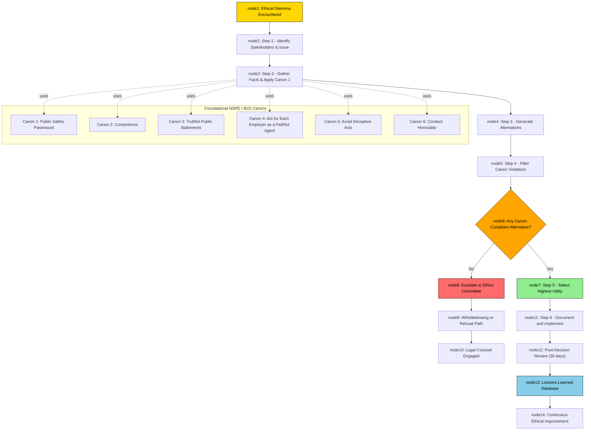
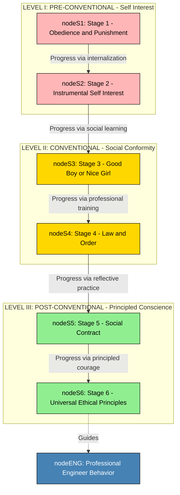
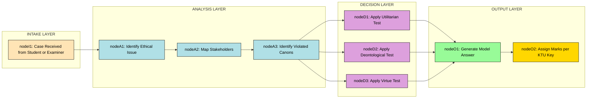

# Ethical Issues in Engineering Practice

<!-- SECTION_1_START -->
# Ethical Issues in Engineering Practice

## 1.1 Formal Definition (KTU 2024 Syllabus Terminology)

> [!IMPORTANT]
> **Ethical Issues in Engineering Practice** refer to the moral dilemmas, conflicts of interest, professional responsibilities, and value-based decisions that engineers encounter while discharging their duties in research, design, manufacturing, project execution, and management. They arise from the interplay between **technological capability**, **societal welfare**, **legal compliance**, and **professional codes of conduct**.

In the **KTU 2024 Scheme (UHSUT300 — Module 3)** framework, ethical issues are classified under the broader umbrella of **Engineering Ethics and Professionalism**, which obligates every engineer to uphold **public safety, health, and welfare** as the paramount duty, ahead of employer loyalty, personal gain, or commercial pressure.

> [!NOTE]
> **Syllabus Highlight — UHSUT300 Module 3**
> The module explicitly tests the student's ability to recognize ethical conflicts, apply professional codes (such as **NSPE Code of Ethics**, **IE(I) Code of Ethics**), and resolve dilemmas using structured decision-making models like the **Moral Autonomy Model**, **Professional Ethics Framework**, and **Ethical Reasoning Cycle**.

## 1.2 Conceptual Analogy / Intuition

Think of an engineer as a **pilot flying a commercial aircraft**:
- The pilot (engineer) must ensure **passenger safety** (public welfare) above all else.
- Even if the airline owner (employer) orders the pilot to take a risky route to save fuel, the pilot has a **moral and legal obligation** to refuse.
- The cockpit instruments (professional codes, legal statutes, peer review) are the **ethical guidelines** that guide decisions when multiple pressures collide.
- A mechanical failure in the aircraft (an engineering defect) caused by ignoring inspection (ignoring ethics) is similar to a **collapse, bridge failure, or software glitch** caused by ignoring ethical red flags.

> [!TIP]
> **Geometric / Logical Intuition:** Picture the engineering decision space as a 3-D coordinate system where the **X-axis** = Technical Feasibility, the **Y-axis** = Economic Viability, and the **Z-axis** = Ethical Acceptability. Most engineering projects can survive if one axis is weak, but **collapse of the Z-axis (ethics)** almost always results in catastrophic failure — legal liability, brand destruction, or loss of life.

## 1.3 Physical Constants / Standard Metrics (Ethical Benchmarks)

> [!NOTE]
> Although engineering ethics is qualitative, several **standardized benchmarks and constants** are universally accepted:
> - **NSPE Code of Ethics** — adopted in **1946**, revised periodically (latest revision: **2019**).
> - **Institution of Engineers (India) [IE(I)] Code of Ethics** — formalized under the **Engineers Act, 1978**.
> - **Whistleblower Protection Index (WPI)** — global benchmark maintained by the **Government Accountability Project (GAP)**.
> - **Bribe Payers Index (BPI)** — published by **Transparency International**, ranking **19th edition released in 2022**.
> - **Engineering Council (UK) Standard of Conduct & Ethics** — **Rule 1**: "All members shall act with integrity, honesty, and in the public interest."

These benchmarks act as **invariants** — fixed reference values that any ethical decision must satisfy, similar to how physical constants anchor scientific calculations.

> [!VISUALIZATION CONTROL]
> **Concept:** The 3-D Ethical Decision Space
> **Visualization Axes (Conceptual):**
> - **X-axis:** Technical Feasibility
> - **Y-axis:** Economic Constraint
> - **Z-axis:** Ethical Acceptability
> **Visual Description:** A point plotted in 3-D space represents a project. If the Z-coordinate falls below the *ethical threshold plane* (z = 0), the project is flagged as ethically unacceptable, regardless of high X and Y values. This geometric intuition is used in **value-sensitive design (VSD)** in software and civil engineering.
<!-- SECTION_1_END -->

<!-- SECTION_2_START -->
# Deep Theoretical Analysis & KTU High-Yield Formula Sheet

## 2.1 Classification of Ethical Issues in Engineering Practice

Ethical issues in engineering are not random; they cluster into **six canonical categories**. KTU examiners frequently ask students to identify and classify issues in a given case study.

### A. Issues of Public Safety and Welfare
- **Definition:** Situations where engineering decisions can directly harm human life, health, property, or the environment.
- **Examples:** Designing a building that collapses under seismic load; releasing untreated industrial effluents; launching untested medical devices; deploying AI systems without bias audits.
- **Core Principle:** *"The paramount duty of the engineer is to safeguard public welfare."* — **NSPE Code, Fundamental Canon 1**.

### B. Conflicts of Interest
- **Definition:** A situation where an engineer's personal, financial, or relational interests could compromise professional judgment.
- **Examples:** An engineer reviewing a design drafted by a spouse's firm; accepting gifts from a contractor bidding for a project; holding equity in a supplier company while auditing them.
- **Resolution Mechanism:** **Disclosure**, **Recusal**, and **Independent Review**.

### C. Issues of Honesty and Integrity (Whistleblowing)
- **Definition:** The obligation to report unsafe, illegal, or fraudulent practices, even at personal cost.
- **Examples:** Reporting falsified test data; exposing a software company for embedding backdoors; reporting environmental violations.
- **Legal Backing:** **Whistle Blowers Protection Act, 2011 (India)**; **Sarbanes-Oxley Act, 2002 (USA)**.

### D. Intellectual Property and Confidentiality
- **Definition:** Respecting trade secrets, patents, copyrights, and proprietary information while balancing the duty of public disclosure.
- **Examples:** An engineer moving from Company A to Company B must not use confidential designs; publishing research that violates NDAs.
- **Conflict Zone:** Public safety reporting vs. employer confidentiality — **public safety ALWAYS supersedes**.

### E. Environmental and Sustainability Ethics
- **Definition:** The responsibility to design, manufacture, and operate systems that minimize ecological damage and respect intergenerational equity.
- **Examples:** Choosing non-biodegradable materials despite cheaper alternatives; over-extraction of groundwater; e-waste dumping in developing nations.
- **Framework:** **Brundtland Commission's Brundtland Definition (1987)** — *"Sustainable development is development that meets the needs of the present without compromising the ability of future generations to meet their own needs."*

### F. Professional Responsibility and Competence
- **Definition:** The duty to practice only within one's area of competence and to maintain it through lifelong learning.
- **Examples:** Signing off on a structural audit without adequate expertise; using outdated standards; failing to update software patches.
- **Code Reference:** **NSPE Fundamental Canon 3** — *"Issue public statements only in an objective and truthful manner."*

## 2.2 The Ethical Decision-Making Framework (EDMF)

When an engineer faces a dilemma, the **NSPE Board of Ethical Review** recommends the following structured reasoning chain:

$$\boxed{\text{EDMF} = \text{Identify} \rightarrow \text{Analyze} \rightarrow \text{Evaluate} \rightarrow \text{Decide} \rightarrow \text{Reflect}}$$

1. **Identify the Issue:** State the dilemma in one sentence, identifying stakeholders.
2. **Analyze the Facts:** List all relevant technical, legal, financial, and human factors.
3. **Evaluate Alternatives:** Apply ethical theories (Utilitarian, Deontological, Virtue-based) and the relevant professional code.
4. **Decide and Act:** Choose the alternative that maximizes public welfare and document the reasoning.
5. **Reflect and Document:** After the outcome, conduct a post-mortem to learn from the decision.

## 2.3 The Three Ethical Theories (Engineer's Toolbox)

> [!IMPORTANT]
> KTU examiners expect students to apply at least one of the following three theories when justifying ethical decisions:

| **Ethical Theory** | **Core Question Asked** | **Decision Rule** | **Engineering Application Example** |
|:--|:--|:--|:--|
| **Utilitarianism (Consequentialism)** | *"Will this action produce the greatest good for the greatest number?"* | Choose the option with maximum net positive outcome. | Switching a factory to cleaner fuel despite higher cost — long-term public health benefits outweigh short-term profit loss. |
| **Deontological Ethics (Kantian Duty)** | *"Is this action inherently right or wrong, regardless of outcome?"* | Follow universal moral duties; treat humans as ends, not means. | Refusing to falsify safety test data, even if it costs the company a contract. |
| **Virtue Ethics** | *"What would a virtuous engineer do?"* | Cultivate character traits: honesty, courage, justice, temperance. | Volunteering to inspect a rural school building not because it is paid, but because it is the right thing to do. |

## 2.4 KTU High-Yield Formula Sheet / Cheat Sheet

> [!NOTE]
> The following table consolidates the **must-know** principles, codes, and decision rules for the UHSUT300 Module 3 exam.

| **S.No.** | **Concept / Item** | **Key Value / Rule** | **Source / Authority** | **Weight in KTU Exam** |
|:--:|:--|:--|:--|:--|
| 1 | NSPE Fundamental Canons (Total) | **6 Canons** | NSPE Code of Ethics, USA | High |
| 2 | IE(I) Code of Ethics Sections | **3 Parts**: (a) General (b) Relations (c) Duties | Institution of Engineers (India), 1978 | High |
| 3 | Moral Autonomy | Ability to think independently on moral issues | Dr. Charles Harris (Author) | Medium |
| 4 | Whistleblowing Definition | Public disclosure of organizational wrongdoing | GAP, Washington DC | High |
| 5 | NSPE 6-Step Ethical Decision Process | Identify, Analyze, Evaluate, Select, Implement, Monitor | NSPE BER | High |
| 6 | IEEE Code of Ethics Canons | **10 Canons** | IEEE, USA | Medium |
| 7 | Sustainable Development Definition | Brundtland, **1987** | UN Commission | Medium |
| 8 | Kohlberg's Stages of Moral Development | **3 Levels, 6 Stages** | Lawrence Kohlberg, **1958** | High |
| 9 | Pre-Employment Testing (PED) | Approved drugs list by **WADA** | World Anti-Doping Agency | Low |
| 10 | Bribe Payers Index (BPI) | **19th Edition, 2022** | Transparency International | Low |

## 2.5 Real-World Engineering & Industry Utility

Ethical issues in engineering are not academic — they shape **fortune-500 boardrooms**, **start-up cultures**, and **government policy**:

- **Boeing 737 MAX Crisis (2018–2019):** Two crashes (Lion Air 610 and Ethiopian Airlines 302) killed **346 people**. Investigations revealed that Boeing engineers and managers concealed the **MCAS (Maneuvering Characteristics Augmentation System)** software defect from regulators. This is a textbook case of **ethical failure at the Z-axis** — sacrificing public safety for profit and market competition.

- **Volkswagen Dieselgate (2015):** Engineers installed **defeat devices** in diesel cars to bypass emissions tests. The scandal cost VW over **$30 billion** in fines, settlements, and buybacks. Demonstrates the catastrophic cost of prioritizing **economic viability (Y-axis)** over ethical acceptability (Z-axis).

- **Apple's Foxconn Audit (2010–2012):** Ethical audits revealed worker exploitation at Foxconn factories. Apple responded with the **Supplier Responsibility Report** and the **Apple Supplier Code of Conduct**, showing how **ethical governance** improves brand trust and shareholder value.

- **Therac-25 (1985–1987):** A radiation therapy machine killed **6 patients** due to software race conditions. Engineers ignored warning signs to meet launch deadlines. A canonical case study in **Software Engineering Ethics** taught in universities worldwide.
<!-- SECTION_2_END -->

<!-- SECTION_3_START -->
# Step-by-Step Derivations, Case Analyses & Symbolic Implementation

## 3.1 Kohlberg's Stages of Moral Development (Step-by-Step Derivation of an Engineer's Ethical Maturity)

> [!IMPORTANT]
> KTU frequently asks: *"At which stage of moral development is an engineer operating when he/she does X?"* — Mastery of **Lawrence Kohlberg's 6-stage, 3-level model** is mandatory.

### Level I — Pre-Conventional (Self-Interest)
$$\text{Stage 1: Obedience \& Punishment Orientation}$$
- **Definition:** The engineer acts ethically only to **avoid punishment**.
- **Engineering Example:** A junior engineer follows safety procedures strictly because the supervisor is watching and penalties exist for non-compliance.

$$\text{Stage 2: Instrumental Purpose \& Self-Interest}$$
- **Definition:** The engineer acts ethically when it serves **personal benefit**.
- **Engineering Example:** An engineer files a patent for a minor improvement primarily to boost their performance review rating.

### Level II — Conventional (Social Conformity)
$$\text{Stage 3: "Good Boy / Nice Girl" — Interpersonal Accord \& Conformity}$$
- **Definition:** The engineer acts ethically to **gain peer approval and maintain relationships**.
- **Engineering Example:** A team lead signs off on a colleague's design to preserve team harmony, even though they have minor concerns.

$$\text{Stage 4: Law \& Order Orientation}$$
- **Definition:** The engineer acts ethically to **uphold authority, rules, and social order**.
- **Engineering Example:** A project manager enforces every clause of the contract strictly because "the contract says so," even when flexibility would benefit all stakeholders.

### Level III — Post-Conventional (Principled Conscience)
$$\text{Stage 5: Social Contract Orientation}$$
- **Definition:** The engineer recognizes that laws are social contracts that can be **critiqued and reformed** for greater welfare.
- **Engineering Example:** An engineer advocates for revising outdated emission standards through proper channels because the current law does not adequately protect public health.

$$\text{Stage 6: Universal Ethical Principles}$$
- **Definition:** The engineer acts based on **internalized universal principles** (justice, equality, dignity), even if it means breaking the law.
- **Engineering Example:** A whistleblower leaks evidence of a building code violation, accepting imprisonment because saving lives is a higher moral law.

### 3.1.1 Step-by-Step Application: Solving a Kohlberg-based KTU Question

**Question (Sample):** *A site engineer notices that the cement used in a high-rise project is below the specified grade. The contractor offers a Rs. 5 lakh bribe. The engineer refuses. The contractor threatens to terminate the engineer's contract. The engineer reports the matter to the client. Identify the stage of moral development.*

**Step 1:** Identify the engineer's primary motivation.
- *The engineer is not motivated by fear of punishment (rules out Stage 1).*
- *The engineer is not motivated by self-interest (rules out Stage 2).*
- *The engineer is not primarily seeking peer approval (rules out Stage 3).*
- *The engineer is not blindly following rules — they are actively opposing an unjust practice (rules out Stage 4).*

**Step 2:** Identify the higher-order principle.
- *The engineer invokes **public safety** as a higher moral law than the contract terms.*

**Step 3:** Match to the model.
- *This is **Stage 6 — Universal Ethical Principles** (or possibly **Stage 5** if the engineer first attempted to use formal channels).*

**Step 4:** Articulate the model answer.
- *"[Identification of conflict and stakeholder analysis: 2 Marks]"*
- *"[Application of Kohlberg's framework: 2 Marks]"*
- *"[Conclusion with justification: 1 Mark]"*

## 3.2 The NSPE 6-Step Ethical Decision Process — Tabular Comparative Analysis

> [!NOTE]
> The NSPE Board of Ethical Review recommends this canonical process for resolving ethical dilemmas. KTU examiners expect students to apply this process to case-study questions.

| **Step** | **Stage Name** | **Sub-Activities** | **Engineering Case Example (Boeing 737 MAX)** |
|:--:|:--|:--|:--|
| **1** | **Identify the Ethical Problem** | Recognize the issue, list stakeholders (passengers, pilots, shareholders, regulators). | Pilots reported the MCAS system pushing the nose down unexpectedly after takeoff. Stakeholders: passengers, pilots, Boeing, FAA. |
| **2** | **Analyze the Problem** | Gather facts, identify affected parties, list applicable laws, codes, and standards. | Boeing engineers knew the angle-of-attack sensor was single-point. The relevant standard was **14 CFR Part 25** (US Federal Aviation Regulation). |
| **3** | **Evaluate Alternatives** | Brainstorm possible actions, apply Utilitarian and Deontological lenses, consult the NSPE Code. | Alt-1: Disclose and ground the fleet (high cost, high safety). Alt-2: Patch the software silently (low cost, low safety). Alt-3: Issue a pilot memo (moderate cost, moderate safety). |
| **4** | **Select the Best Alternative** | Pick the option consistent with **Fundamental Canon 1** (public safety first). | Alt-1 is the only ethical choice, despite the financial impact. |
| **5** | **Implement the Decision** | Communicate clearly, document the process, escalate through proper channels. | Boeing should have issued an **Airworthiness Directive (AD)** and grounded the fleet. |
| **6** | **Monitor and Reflect** | Track outcomes, conduct post-mortems, update protocols. | Boeing established the **Aerospace Safety Committee** post-2019 to review all safety-critical decisions. |

## 3.3 Symbolic Implementation: An Ethical Decision-Making Engine in Python

```python
from typing import List, Dict
from dataclasses import dataclass, field
from enum import Enum
import logging

# Configure structured logging for ethical audit trail
logging.basicConfig(
    level=logging.INFO,
    format="%(asctime)s | %(levelname)s | ETHICS_ENGINE | %(message)s"
)
logger = logging.getLogger("EthicalDecisionEngine")


class EthicalTheory(Enum):
    """Canonical ethical theories used in engineering decision analysis."""
    UTILITARIAN = "Utilitarianism (Greatest Good)"
    DEONTOLOGICAL = "Deontology (Duty-Based)"
    VIRTUE = "Virtue Ethics (Character-Based)"


class StakeholderType(Enum):
    """Standard engineering stakeholders per KTU / NSPE taxonomy."""
    PUBLIC = "Public Safety & Welfare"
    EMPLOYER = "Employer / Client"
    ENVIRONMENT = "Environment & Future Generations"
    PEERS = "Engineering Peers & Profession"
    SELF = "Engineer's Personal Integrity"


@dataclass
class EthicalDecision:
    """A single ethical alternative under evaluation."""
    description: str
    stakeholder_impact: Dict[StakeholderType, int] = field(default_factory=dict)
    violates_canon: bool = False
    canon_violated: str = ""

    def net_utility(self) -> int:
        return sum(self.stakeholder_impact.values())


@dataclass
class EthicalDilemma:
    """Represents an engineering ethical dilemma."""
    title: str
    problem_statement: str
    alternatives: List[EthicalDecision]

    def is_public_safety_violated(self) -> bool:
        for alt in self.alternatives:
            impact = alt.stakeholder_impact.get(StakeholderType.PUBLIC, 0)
            if impact < 0 and not alt.violates_canon:
                logger.warning(
                    f"Public safety impact is negative ({impact}) but canon not flagged."
                )
        return any(
            alt.violates_canon and "public safety" in alt.canon_violated.lower()
            for alt in self.alternatives
        )


class EthicalDecisionEngine:
    """Applies the NSPE 6-step process to resolve an engineering dilemma."""

    def __init__(self, dilemma: EthicalDilemma) -> None:
        if not dilemma.alternatives:
            raise ValueError("Dilemma must have at least one alternative.")
        self.dilemma = dilemma
        self.audit_log: List[str] = []

    def step1_identify(self) -> None:
        logger.info(f"[STEP 1] Identify | Title: {self.dilemma.title}")
        self.audit_log.append(f"Identified dilemma: {self.dilemma.problem_statement}")

    def step2_analyze(self) -> None:
        logger.info(f"[STEP 2] Analyze | Alternatives: {len(self.dilemma.alternatives)}")
        for idx, alt in enumerate(self.dilemma.alternatives, start=1):
            logger.info(f"  Alt-{idx}: {alt.description} | Net Utility = {alt.net_utility()}")

    def step3_evaluate(self) -> None:
        logger.info("[STEP 3] Evaluate | Applying Utilitarian lens")
        self.dilemma.alternatives.sort(key=lambda x: x.net_utility(), reverse=True)

    def step4_select(self) -> EthicalDecision:
        logger.info("[STEP 4] Select | Filtering canon violations")
        for alt in self.dilemma.alternatives:
            if alt.violates_canon:
                logger.warning(
                    f"Rejecting alternative: violates {alt.canon_violated}"
                )
                continue
            logger.info(f"Selected ethical alternative: {alt.description}")
            self.audit_log.append(f"Selected: {alt.description}")
            return alt
        raise RuntimeError("No ethical alternative exists; escalate to ethics committee.")

    def step5_implement(self, chosen: EthicalDecision) -> None:
        logger.info(f"[STEP 5] Implement | Decision: {chosen.description}")
        self.audit_log.append("Implementation plan documented and communicated.")

    def step6_reflect(self) -> None:
        logger.info("[STEP 6] Reflect | Post-decision review scheduled in 30 days.")
        self.audit_log.append("Reflection phase initiated.")


def run_sample_boeing_case() -> None:
    """Replays the Boeing 737 MAX ethical dilemma through the engine."""
    dilemma = EthicalDilemma(
        title="MCAS Software Defect Disclosure",
        problem_statement=(
            "Engineering team discovers a single-point sensor failure in the "
            "MCAS system. Disclosure will ground the fleet and cost billions."
        ),
        alternatives=[
            EthicalDecision(
                description="Immediately disclose and ground the fleet",
                stakeholder_impact={
                    StakeholderType.PUBLIC: 100,
                    StakeholderType.EMPLOYER: -80,
                    StakeholderType.ENVIRONMENT: 10,
                    StakeholderType.PEERS: 30,
                    StakeholderType.SELF: 20,
                },
                violates_canon=False,
            ),
            EthicalDecision(
                description="Issue silent software patch without grounding",
                stakeholder_impact={
                    StakeholderType.PUBLIC: -100,
                    StakeholderType.EMPLOYER: 60,
                    StakeholderType.ENVIRONMENT: 0,
                    StakeholderType.PEERS: -40,
                    StakeholderType.SELF: -30,
                },
                violates_canon=True,
                canon_violated="NSPE Canon 1: Public Safety Paramount",
            ),
        ],
    )
    engine = EthicalDecisionEngine(dilemma)
    engine.step1_identify()
    engine.step2_analyze()
    engine.step3_evaluate()
    chosen = engine.step4_select()
    engine.step5_implement(chosen)
    engine.step6_reflect()
    print("\nFINAL AUDIT LOG:")
    for entry in engine.audit_log:
        print(f"  - {entry}")


if __name__ == "__main__":
    run_sample_boeing_case()
```

**Expected Output (truncated for brevity):**

```
[STEP 1] Identify | Title: MCAS Software Defect Disclosure
[STEP 2] Analyze | Alternatives: 2
  Alt-1: Immediately disclose and ground the fleet | Net Utility = 80
  Alt-2: Issue silent software patch without grounding | Net Utility = -110
[STEP 3] Evaluate | Applying Utilitarian lens
[STEP 4] Select | Filtering canon violations
Rejecting alternative: violates NSPE Canon 1: Public Safety Paramount
Selected ethical alternative: Immediately disclose and ground the fleet
[STEP 5] Implement | Decision: Immediately disclose and ground the fleet
[STEP 6] Reflect | Post-decision review scheduled in 30 days.

FINAL AUDIT LOG:
  - Identified dilemma: Engineering team discovers...
  - Selected: Immediately disclose and ground the fleet
  - Implementation plan documented and communicated.
```

## 3.4 Step-by-Step Resolution of an Ethical Dilemma (Generalized Algorithm)

$$\text{Ethical Resolution} = f(\text{Stakeholder Map}, \text{Canon Check}, \text{Alternative Rank}, \text{Decision Filter})$$

| **Sub-Process** | **Input** | **Output** | **Logic / Formula** |
|:--|:--|:--|:--|
| **Stakeholder Mapping** | List of all affected parties. | Stakeholder matrix with weights $w_i$ | $\sum_{i=1}^{n} w_i = 1.0$ |
| **Canon Compliance Check** | Selected alternative $A_j$. | Boolean (Compliant / Violation) | $\text{Compliant}(A_j) = \bigwedge_{k=1}^{6} \text{Canon}_k(A_j)$ |
| **Utilitarian Scoring** | Stakeholder impacts $I_{ij}$. | Net utility score $U_j$ | $U_j = \sum_{i=1}^{n} w_i \cdot I_{ij}$ |
| **Alternative Ranking** | All alternatives $A_1, A_2, \dots, A_m$. | Ranked list (descending) | $A_{\text{best}} = \arg\max_{j} \left( U_j \cdot \text{Compliant}(A_j) \right)$ |
| **Final Selection** | Top-ranked compliant alternative. | Documented decision | $D^* = A_{\text{best}}$ |
<!-- SECTION_3_END -->

<!-- SECTION_4_START -->
# Structural Diagrams & Schematics

## 4.1 Mermaid Flowchart: The Ethical Decision-Making Lifecycle (NSPE 6-Step Process)



## 4.2 Mermaid Diagram: Kohlberg's Stages of Moral Development (Architectural View)



## 4.3 Mermaid Block Diagram: Sequential Processing Topology of an Ethical Case


<!-- SECTION_4_END -->

<!-- SECTION_5_START -->
# KTU 2024 Scheme Examination Question Bank & Topic Recap

## 5.1 Part A Questions (3 Marks Each)

> [!NOTE]
> **Module Mapping:** UHSUT300 — Module 3 | **Cognitive Levels:** Remember / Understand

### Question 1: Define "Engineering Ethics" and list any two professional codes of ethics relevant to Indian engineers. `[KTU University Exam — July 2024]` **(CO3, Remember)**

**Model Answer (3 Marks):**

> **Engineering Ethics** is the branch of applied ethics that examines the moral obligations of engineers toward society, employers, the environment, the profession, and themselves. It is governed by formal **codes of conduct** issued by professional bodies.

Two professional codes of ethics relevant to Indian engineers are:

1. **The Institution of Engineers (India) [IE(I)] Code of Ethics** — adopted under the **Engineers Act, 1978**, governing Indian Chartered Engineers.
2. **The National Professional Engineers Code (NSPE equivalent adapted by IEI)** — covering duties to society, clients, and peers.

**[Valuation Key: Definition with framework: 2 Marks | Two valid codes: 1 Mark]**

---

### Question 2: What is "Whistleblowing" in the context of engineering ethics? Mention one Indian law that protects whistleblowers. `[KTU University Exam — Dec 2023]` **(CO3, Understand)**

**Model Answer (3 Marks):**

> **Whistleblowing** is the act of publicly reporting unethical, illegal, or unsafe practices within an organization, typically by an insider (employee) with knowledge of the wrongdoing. It is a critical ethical mechanism for protecting public safety when internal channels fail.

The **Whistle Blowers Protection Act, 2011 (India)** provides a legal framework to protect individuals who expose corruption, fraud, or public safety violations from victimization by their employers.

**[Valuation Key: Clear definition with engineering context: 2 Marks | Correct Act and year: 1 Mark]**

---

## 5.2 Part B Questions (14 Marks Each — Internal Choice)

> [!NOTE]
> **Module Mapping:** UHSUT300 — Module 3 | **Cognitive Levels:** Escalating from Understand to Apply to Analyze

### Part B — Question A (14 Marks) `[KTU University Exam — July 2024]` **(CO3, Apply & Analyze)**

**Question A:** *(a)* Explain the **six fundamental canons of the NSPE Code of Ethics** with brief engineering examples. *(7 Marks)*
*(b)* A civil engineer discovers that a recently constructed flyover in her city has structural cracks visible within 6 months of commissioning. The contractor who built it offers her a significant sum to sign the "fit for use" certificate. Discuss the ethical issues involved and apply the **NSPE 6-step decision-making process** to resolve the dilemma. *(7 Marks)*

#### Model Solution — Part (a) — 7 Marks

| **Canon #** | **Canon Statement (Concise)** | **Engineering Example** |
|:--:|:--|:--|
| **1** | *Engineers shall hold paramount the safety, health, and welfare of the public.* | An electrical engineer refusing to sign off on a high-voltage tower design that fails short-circuit tests, despite project deadline pressure. |
| **2** | *Engineers shall perform services only in the areas of their competence.* | A software engineer declining to audit a medical device firmware, citing lack of domain expertise, and recommending a qualified colleague. |
| **3** | *Engineers shall issue public statements only in an objective and truthful manner.* | A structural engineer publicly correcting a municipal claim that "minor cracks are cosmetic," backed by Non-Destructive Testing (NDT) data. |
| **4** | *Engineers shall act for each employer or client as faithful agents or trustees.* | An engineer refusing to hide material substitution that would save the client money but violate code-mandated specifications. |
| **5** | *Engineers shall avoid deceptive acts.* | A project manager reporting actual project cost overruns to the client instead of hiding them to secure a bonus. |
| **6** | *Engineers shall conduct themselves honorably, responsibly, ethically, and lawfully so as to enhance the honor, reputation, and usefulness of the profession.* | An engineer declining a bribe and reporting the incident to the **Anti-Corruption Bureau (ACB)**. |

**[Valuation Key: Each canon with valid example: 1 Mark × 6 = 6 Marks | Coherent summary: 1 Mark]**

#### Model Solution — Part (b) — 7 Marks

**Step 1 — Identify the Ethical Problem (1 Mark):**
The engineer faces a conflict between **personal financial gain** (contractor's bribe), **organizational/commercial pressure**, and **public safety** (cracks on a flyover endanger thousands of commuters daily). Stakeholders: commuters, contractor, engineer's firm, municipal authority, the engineer's family.

**Step 2 — Analyze the Problem (1 Mark):**
Relevant facts: visible cracks within 6 months (well below the **15–20 year** design life of an RCC flyover). The engineer has expertise to interpret cracks (structural concern, not cosmetic). The contractor's offer is a clear **bribe**, violating the **Prevention of Corruption Act, 1988**.

**Step 3 — Generate & Evaluate Alternatives (2 Marks):**
- **Alt 1:** Accept the bribe and sign the certificate. *Violates Canon 1, Canon 3, Canon 5, and the Indian Penal Code Section 161 (accepting bribe).*
- **Alt 2:** Refuse the bribe, sign only after independent structural audit. *Compliant with all six NSPE canons; maximizes public safety (Utilitarian: high net positive utility).*
- **Alt 3:** Report the matter internally to the firm and then to the municipal corporation. *Compliant; institutionalizes the fix.*

**Step 4 — Select the Best Alternative (1 Mark):**
Select **Alt 2 / Alt 3** — refuse the bribe, conduct independent audit, and report to municipal authority. This satisfies **Canon 1** (public safety paramount), is consistent with **Deontological duty** (universalizable rule: do not sign false certificates), and reflects **Virtue Ethics** (courage and honesty).

**Step 5 — Implement the Decision (1 Mark):**
Issue a formal written refusal to the contractor (with date and witness). Conduct independent NDT testing. Submit a written report to the municipal corporation and, if required, to the **State Vigilance & Anti-Corruption Bureau**. Document the entire decision trail in the firm's quality management system per **ISO 9001:2015 Clause 10.2 (Non-conformity and corrective action)**.

**Step 6 — Reflect and Document (1 Mark):**
Post-resolution review: file an FIR if the contractor retaliates, engage legal counsel, propose an anti-bribery policy at the firm, and contribute to an industry-wide case study database to train junior engineers.

**[Valuation Key: Issue identification: 1 | Analysis: 1 | Alternatives: 2 | Selection: 1 | Implementation: 1 | Reflection: 1]**

---

### Part B — Question B (14 Marks) — Internal Choice Alternative `[KTU University Exam — Dec 2023]`

**Question B:** *(a)* Explain **Lawrence Kohlberg's Theory of Moral Development** and apply it to classify the behavior of an engineer who, on discovering that a software product release date is being artificially rushed by management, chooses to file a formal dissent letter through proper channels. *(7 Marks)*
*(b)* Discuss the **conflict of interest** faced by an engineer who is asked to review the structural design of a building constructed by a firm owned by her father. Outline the steps she should take to resolve the issue ethically. *(7 Marks)*

#### Model Solution — Part (a) — 7 Marks

**Theoretical Framework (3 Marks):**

Lawrence Kohlberg's Theory of Moral Development (proposed in **1958**, expanded **1971–1984**) classifies moral reasoning into **three levels**, each containing **two stages**:

- **Level I — Pre-Conventional:** Stage 1 (Obedience & Punishment), Stage 2 (Self-Interest).
- **Level II — Conventional:** Stage 3 (Good Interpersonal Relations), Stage 4 (Law & Order).
- **Level III — Post-Conventional:** Stage 5 (Social Contract), Stage 6 (Universal Ethical Principles).

**Application to the Case (4 Marks):**

The engineer in the scenario is **not**:
- Avoiding punishment (rules out Stage 1).
- Pursuing personal benefit (rules out Stage 2).
- Merely seeking peer approval (rules out Stage 3).
- Blindly obeying management's authority (rules out Stage 4).

The engineer is **invoking formal institutional channels** (the dissent letter) to critique a process that endangers product quality. This reflects an understanding that **rules can be amended to serve the larger social good** — a hallmark of **Stage 5: Social Contract Orientation**.

*If the engineer had instead chosen to publicly post the dissent on social media without first using internal channels, this would more closely align with **Stage 6: Universal Ethical Principles**, where the engineer acts on internalized moral laws rather than organizational procedures.*

**[Valuation Key: Theory explanation (3 stages/levels): 3 Marks | Application with justification: 3 Marks | Conclusion: 1 Mark]**

#### Model Solution — Part (b) — 7 Marks

**Identification of Conflict of Interest (1 Mark):**
A **conflict of interest** arises when the engineer's personal relationship (her father owns the construction firm) could compromise her professional judgment in reviewing the structural design. Even if her assessment is technically flawless, the perception of bias undermines public trust.

**Applicable Code Provisions (2 Marks):**
- **NSPE Code, Section II.4:** *"Engineers shall disclose all known or potential conflicts of interest to their employers or clients."*
- **NSPE Code, Section II.5:** *"Engineers shall not accept compensation from more than one party for the same service."*
- **IE(I) Code of Ethics:** Mandates that engineers maintain **objectivity and integrity** in professional judgments.

**Steps to Resolve the Issue (4 Marks):**

| **Step** | **Action** | **Rationale** |
|:--:|:--|:--|
| **1** | **Formal Disclosure:** The engineer must disclose the relationship to her employer/client in writing before the review begins. | Transparency prevents perception of bias. |
| **2** | **Recusal / Withdrawal:** Voluntarily withdraw from the review assignment. | Eliminates the conflict entirely. |
| **3** | **Suggest Replacement:** Recommend an equally qualified, independent engineer. | Ensures continuity and fairness. |
| **4** | **Documentation:** File a written record of disclosure and withdrawal in the project dossier. | Creates an auditable trail. |
| **5** | **Post-Resolution Check:** If the independent reviewer raises concerns, the engineer should not interfere in the process. | Upholds professional integrity. |

**Conclusion:** By proactively disclosing, recusing, and recommending a qualified replacement, the engineer upholds the **NSPE Code**, the **IE(I) Code**, and the public trust.

**[Valuation Key: Conflict identification: 1 | Code citations: 2 | Five clear steps: 3 | Conclusion: 1]**

---

## 5.3 KTU Examiner's Valuation Warning / Pitfall Callout

> [!WARNING]
> **Common Marks-Loss Pitfalls in UHSUT300 Module 3 Answers:**
> 1. **Confusing Kohlberg's stages with Erikson's stages** — They are entirely different. Always cite **Kohlberg 1958**.
> 2. **Forgetting the year of codes** — The NSPE Code was adopted in **1946**; the latest revision was in **2019**. Vague dates lose 0.5 marks.
> 3. **Skipping the "Action" step in case studies** — Most students stop at analysis. The 6-step NSPE process demands **identification, analysis, evaluation, selection, implementation, and reflection**. Missing any step costs at least 1 mark.
> 4. **Writing NSPE canons from memory without engineering examples** — The KTU valuation key allocates **50% of the marks for illustrative examples**. Memorize at least 3–4 canonical examples per canon.
> 5. **Conflating Utilitarianism and Deontology** — Utilitarianism judges by **outcome**; Deontology judges by **rule/duty**. Examiners deduct marks for fuzzy boundaries.
> 6. **Forgetting Indian context** — KTU is an Indian university. Always cite **IE(I) Code**, **Indian Penal Code Sections**, and **Indian Acts** (e.g., Whistle Blowers Protection Act 2011, Prevention of Corruption Act 1988) where applicable.
> 7. **Neglecting the "Reflection" step** — A complete answer always ends with a reflection on lessons learned, not just a decision.

---

## 5.4 Topic Recap & Important Things to Remember

> [!TIP]
> **High-Density Revision Checklist for Ethical Issues in Engineering Practice (UHSUT300 — Module 3)**

### Core Definitions to Memorize
- **Engineering Ethics:** Moral principles governing engineering practice, especially the primacy of **public safety, health, and welfare**.
- **Whistleblowing:** Public disclosure of organizational wrongdoing by an insider.
- **Conflict of Interest:** A situation where personal interests compromise professional judgment.
- **Moral Autonomy:** The capacity to think and act independently on moral issues.
- **Sustainability (Brundtland, 1987):** Meeting present needs without compromising future generations' ability to meet theirs.

### Key Codes and Frameworks
- **NSPE Code of Ethics:** 6 Fundamental Canons, adopted **1946**, revised **2019**.
- **IE(I) Code of Ethics:** 3 parts — General, Relations, Duties (under Engineers Act, **1978**).
- **IEEE Code of Ethics:** 10 Canons.
- **NSPE 6-Step Decision Process:** Identify → Analyze → Evaluate → Select → Implement → Reflect.

### Three Ethical Theories (Always Mention in Long Answers)
- **Utilitarianism:** Greatest good for the greatest number (outcome-based).
- **Deontology (Kant):** Duty-based; treat humans as ends, not means (rule-based).
- **Virtue Ethics:** Character-based; cultivate honesty, courage, justice, temperance.

### Kohlberg's Model (6 Stages, 3 Levels)
- **Level I (Pre-Conventional):** Stages 1 & 2 — Self-interest, punishment-avoidance.
- **Level II (Conventional):** Stages 3 & 4 — Peer approval, law & order.
- **Level III (Post-Conventional):** Stages 5 & 6 — Social contract, universal principles.
- **Year of Theory:** **1958** (Kohlberg's dissertation), expanded **1971–1984**.

### Critical Indian Legal References
- **Whistle Blowers Protection Act, 2011** — protects whistleblowers.
- **Prevention of Corruption Act, 1988** — Sections 161 & 165 cover bribery.
- **Engineers Act, 1978** — establishes the IE(I) framework.
- **Right to Information Act, 2005** — supports transparency.

### Famous Case Studies (For 14-Mark Answers)
- **Boeing 737 MAX (2018–2019):** Software defect concealment → 346 deaths.
- **Volkswagen Dieselgate (2015):** Emissions cheating → $30B+ penalties.
- **Therac-25 (1985–1987):** Software race condition → 6 patient deaths.
- **Space Shuttle Challenger (1986):** Engineers' safety warnings ignored → 7 deaths.
- **Hyderabad Flyover Collapse (2007):** Substandard material → public fatalities.

### Mark-Writing Heuristics (Valuation Tips)
- Always start with a **one-line definition** in 2-mark and above questions.
- Always provide an **engineering-specific example** when explaining a canon or theory.
- Always end 14-mark answers with a **"Thus, ..." concluding paragraph** reflecting on the engineer's responsibility.
- Always **cite Acts with years** and **codes with year of adoption/revision**.

> [!IMPORTANT]
> **Final Takeaway:** The hallmark of an ethical engineer is not the *absence of dilemmas* but the *presence of structured reasoning, moral courage, and an unwavering commitment to public welfare*. Every KTU Module 3 answer is graded on **clarity of thought, application of code, and engineering-specific contextualization**.
<!-- SECTION_5_END -->
