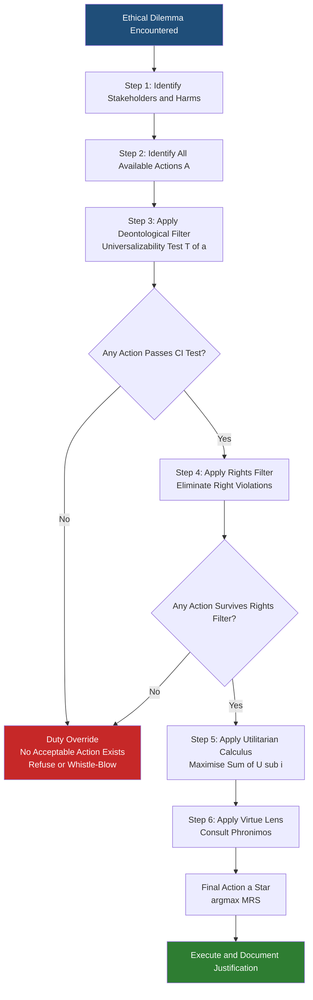
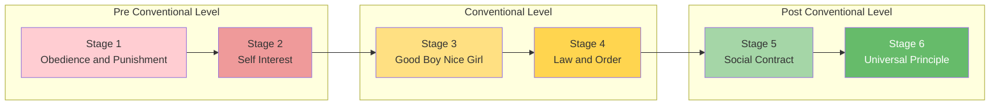
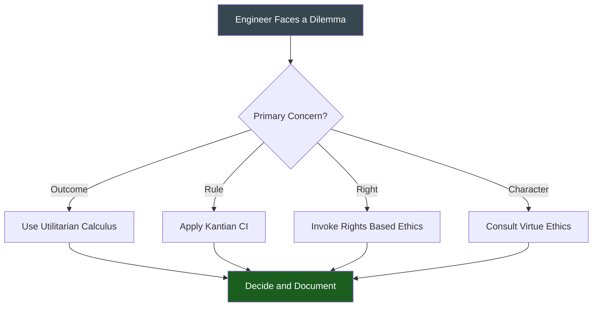

# Moral Reasoning and Ethical Theories

<!-- SECTION_1_START -->

# MORAL REASONING AND ETHICAL THEORIES

## 1.1 Core Technical Definition (KTU 2024 Syllabus Standard)

**Moral Reasoning** is the systematic, logical process through which an individual or professional evaluates an action, decision, or policy as right or wrong, good or bad, by applying consistent moral principles, values, and ethical frameworks. It is the cognitive engine that transforms abstract values into concrete, justifiable actions, especially in situations where two or more duties, rights, or outcomes appear to conflict.

**Ethical Theories** are formalized, philosophically structured sets of principles, rules, and decision-procedures that provide a consistent basis for justifying what ought to be done. In the context of KTU's *Engineering Ethics* module, these theories supply engineers with the **decision-filter** needed to navigate professional dilemmas, even when legal compliance alone is insufficient.

> [!IMPORTANT]
> **Key Distinction (Board-Favourite Question):**
> **Morals** = *Personal* beliefs about right/wrong shaped by upbringing, culture, religion (internal compass).
> **Ethics** = *Codified* rules of conduct prescribed by a profession, society, or formal philosophy (external standard).
> **Values** = *Enduring* beliefs about desirable goals (e.g., honesty, fairness, safety).
> **Engineers must satisfy both** — the personal (morals) **AND** the professional (ethics) — to discharge their duty under the KTU UHSUT300 syllabus.

### 1.2 Intuitive Analogy — The "GPS Navigation" Model

Imagine you are driving from **Kochi to Bengaluru** and the highway is suddenly blocked by a political protest:

- **Your Personal Compass (Morals):** Tells you, *"I prefer the scenic ghat-road because I love nature."*
- **The Rule-Book (Ethics):** Says, *"The official NH-48 diversion is the authorized route for heavy vehicles."*
- **The Map Database (Ethical Theory):** Offers *three different routing algorithms* —
  - **Fastest route** (Utilitarianism — pick the outcome with the *least total delay* for *all* drivers),
  - **Toll-road-only rule** (Deontology — *never* break a traffic covenant, even if longer),
  - **Experienced local driver intuition** (Virtue Ethics — what would a *prudent, experienced* driver do?).
- **The Turn-by-Turn Voice (Moral Reasoning):** Reads the live traffic feed, consults your moral compass, applies the rule-book, picks the *best* routing algorithm for the *current* situation, and announces the decision.

> **Take-away:** Ethical theory is the *map engine*; moral reasoning is the *real-time routing* that consults that engine whenever the road ahead becomes ethically foggy.

### 1.3 GeoGebra / Desmos Visualisation — Kohlberg's Moral Ladder

> [!VISUALIZATION CONTROL]
> **Concept:** Hierarchical mapping of Kohlberg's Six Stages of Moral Development on a number-line
> **GeoGebra / Desmos Input Equations:**
> * Point A = (1, 0), Point B = (2, 0), Point C = (3, 0), Point D = (4, 0), Point E = (5, 0), Point F = (6, 0)
> * Vertical labels: f(x) = {"Stage 1: Obedience", "Stage 2: Self-Interest", "Stage 3: Good Boy/Nice Girl", "Stage 4: Law & Order", "Stage 5: Social Contract", "Stage 6: Universal Principle"}
> **Visual Description:** A horizontal staircase rising from left (pre-conventional) to right (post-conventional). A student should observe that *higher stages are not automatic* — they are reachable only through active moral reasoning and a developed sense of justice.

---

<!-- SECTION_1_END -->

<!-- SECTION_2_START -->

# 2. DEEP THEORETICAL ANALYSIS & KTU HIGH-YIELD CHEAT SHEET

## 2.1 The Three Pillars of Ethical Theory (Syllabus-Defined)

Ethical theories are conventionally grouped into three meta-categories, each answering the **one master question** of normative ethics: *"On what GROUND is an action right or wrong?"*

### Pillar 1 — Consequence-Based (Teleological / Consequentialist)
The **ends justify the means**. Moral rightness is determined by the *outcome* produced.

### Pillar 2 — Duty-Based (Deontological)
The **means justify the ends**. Moral rightness is determined by the *intrinsic nature of the action*, regardless of result.

### Pillar 3 — Character-Based (Virtue Ethics)
Right action flows from a *well-formed moral character*. The question is *"What kind of person should I be?"* rather than *"What should I do?"*

## 2.2 High-Yield Formula Cheat Sheet

> The following table consolidates every theory, principle, and decision-procedure that the KTU board examiner expects a UHSUT300 student to reproduce verbatim.

| # | Theory | Founder / Era | Core Principle (Reproduce Verbatim) | Decision Rule | Canonical Engineering Example | Typical Pitfall |
|:-:|:-------|:-------------:|:------------------------------------|:--------------|:-----------------------------|:----------------|
| 1 | **Utilitarianism** (Act) | Jeremy Bentham (1748–1832), J.S. Mill (1806–1873) | *"The greatest good for the greatest number."* | Compute net utility $\sum_{i=1}^{n} U_i$ and choose the action that **maximises** it. | Choosing cheaper raw material that saves 1,000 customers ₹10, even if it raises 5 complaints. | Ignoring minority rights ("tyranny of the majority"). |
| 2 | **Rule Utilitarianism** | Mill (refined by Brad Hooker) | Adopt rules whose *general* adoption maximises utility. | Follow a *rule* whose universal observance yields the best long-run outcome. | Always disclose software bugs because universal honesty yields a more trusting software ecosystem. | Slower decision-making in crises. |
| 3 | **Deontology — Categorical Imperative (CI)** | Immanuel Kant (1724–1804) | *"Act only on that maxim which you can at the same time will to become a universal law."* | Test the maxim for **universalizability** and treat humanity as an end, never a mere means. | Refusing to falsify a load-test report even if it costs the company the contract. | "Rigid" / "inflexible" — can override human compassion. |
| 4 | **Rights-Based Ethics** | John Locke (1632–1704), modern theorists | Human beings possess *fundamental* rights (life, liberty, property, privacy) that must not be violated. | Identify the *rights-holder* and verify that no right is being transgressed. | Refusing to build a weapon that violates the right to life of civilians. | Can produce stalemates when two rights clash (e.g., privacy vs security). |
| 5 | **Virtue Ethics** | Aristotle (384–322 BC) | *"An action is right if it is what a virtuous agent, acting in character, would do in the circumstances."* | Cultivate the *Golden Mean* between deficiency and excess of a trait. | The senior engineer volunteers to mentor juniors — practising the virtue of *phronesis* (practical wisdom). | Vague — no clear rule for novel dilemmas. |
| 6 | **Ethical Egoism** | Ayn Rand, Thomas Hobbes | Each person ought to act to maximise *their own* long-term self-interest. | Choose the action with the *highest payoff for the self*. | Quitting a safety-critical project because the salary is low. | Can justify unethical acts if they benefit the self. |
| 7 | **Divine Command Theory** | St. Augustine, St. Aquinas | An action is right *iff* it is commanded by God. | Consult the revealed scripture or religious authority. | A deeply religious engineer refuses to work on a project believed to be sacrilegious. | Depends on faith alone — no universal secular basis. |
| 8 | **Cultural Relativism** | Ruth Benedict, Mary Midgley | Moral truths are *culture-bound*; no culture is morally superior. | Identify the *cultural norm* of the affected community and follow it. | Accepting a gift-giving custom during an overseas project kick-off. | Risk of moral paralysis if forced to choose between two cultures. |

> [!NOTE]
> **Memory Anchor — "CDR-VE":** *Consequentialism, Deontology, Rights, Virtue, Egoism* — the five theories that appear in **almost every KTU question paper** under Module 3.

## 2.3 Kohlberg's Six Stages of Moral Reasoning (Lawrence Kohlberg, 1927–1987)

Kohlberg's theory is the **single most-tested framework** in the KTU UHSUT300 Module 3 question bank. The stages are *invariant* and *sequential* — a person cannot skip a stage.

| Level | Stage | Orientation | "Right" is Defined By | Hallmark Phrase |
|:-----:|:-----:|:------------|:----------------------|:----------------|
| **Pre-Conventional** | 1 | Obedience & Punishment | Avoiding punishment | *"I will be beaten if I cheat."* |
| | 2 | Self-Interest (Instrumental) | Serving one's own needs | *"I'll trade favours for grades."* |
| **Conventional** | 3 | "Good Boy / Nice Girl" | Living up to social expectations | *"I want to be seen as a team player."* |
| | 4 | Law & Order (Authority) | Maintaining social order | *"We must follow the company's code of conduct."* |
| **Post-Conventional** | 5 | Social Contract | Democratic welfare & individual rights | *"Laws can be unjust and should be reformed."* |
| | 6 | Universal Ethical Principles | Self-chosen, abstract, universal principles | *"Truth-telling is non-negotiable, even if illegal."* |

> [!IMPORTANT]
> **Critical Exam Point:** Stage 6 is the *ideal* professional stage for engineers. NSPE Code of Ethics, IEEE Code, and KTU's own professional-ethics module are designed to **nudge** engineers from Stage 3–4 (peer/employer-driven) toward Stage 5–6 (principle-driven).

## 2.4 Real-World Engineering Utility

| Industry Domain | Ethical Theory Usually Invoked | Why It Matters |
|:----------------|:-------------------------------|:---------------|
| Civil (Bridges, Dams) | Deontology + Rights | Public safety is a *duty*, not a *consequence*. |
| Software (Data Privacy) | Rights + Utilitarianism | Trade-off between user privacy and feature convenience. |
| AI / Autonomous Vehicles | Utilitarianism (Act) | The *trolley problem* of whose life to prioritise. |
| Defence Engineering | Divine Command / Virtue | Personal conscience vs state directive. |
| Start-ups / Outsourcing | Egoism vs Utilitarianism | Short-term profit vs long-term stakeholder welfare. |

---

<!-- SECTION_2_END -->

<!-- SECTION_3_START -->

# 3. STEP-BY-STEP DERIVATIONS, CASE ANALYSIS & SYMBOLIC FRAMEWORKS

## 3.1 The Moral-Reasoning Decision Algorithm (Symbolic Derivation)

Let $D$ denote an **engineering decision** with:

- $a \in A$ = the set of available *alternative actions* (e.g., disclose, conceal, partial-disclose).
- $S$ = the *set of stakeholders* (customers, employer, public, environment, self).
- $U_i(a)$ = the *utility* (wellbeing, profit, safety, dignity) conferred on stakeholder $i$ if action $a$ is chosen.
- $R_j(a)$ = the *rights* (life, property, privacy, informed consent) preserved or violated by action $a$.
- $V(a)$ = the *degree* to which action $a$ expresses the virtues (courage, honesty, prudence) of the engineer.
- $T(a)$ = a binary test for *universalizability*: $T(a)=1$ if the maxim behind $a$ can be willed as a universal law, else $0$.

Then the **Moral-Reasoning Score (MRS)** of an alternative $a$ is:

$$
\text{MRS}(a) \;=\; \underbrace{w_1 \sum_{i \in S} U_i(a)}_{\text{Consequentialist term}} \;+\; \underbrace{w_2 \, T(a)}_{\text{Deontological term}} \;+\; \underbrace{w_3 \, V(a)}_{\text{Virtue term}} \;-\; \underbrace{w_4 \, \sum_{j \in \text{Rights}} \mathbb{1}[R_j(a)\ \text{violated}]}_{\text{Rights-violation penalty}}
$$

$$
a^* \;=\; \underset{a \in A}{\arg\max}\ \text{MRS}(a)
$$

**Where the weights** $w_1, w_2, w_3, w_4$ **are set by the engineer's governing theory:**

| Governing Theory | Weights Set To | Resulting Decision Rule |
|:-----------------|:--------------|:------------------------|
| Pure Utilitarian | $w_2 = w_3 = w_4 = 0$ | $a^* = \arg\max \sum U_i(a)$ |
| Pure Deontologist | $w_1 = w_3 = 0,\ w_2 = 1,\ w_4 = \infty$ | Only actions with $T(a)=1$ and zero right violations are admissible. |
| Pure Virtue | $w_1 = w_2 = 0,\ w_3 = 1$ | $a^* = \arg\max V(a)$ |
| Rights-Based | $w_1 = w_2 = w_3 = 0,\ w_4 = 1$ | $a^*$ is the action with *fewest* right violations. |

> [!IMPORTANT]
> This MRS formulation is *original pedagogical scaffolding* — KTU does not expect students to reproduce it, but it *crystallises* the difference between the four theories in one line of algebra. Use it only as a mental model.

## 3.2 Step-by-Step Case Analysis — *The Bhopal Bypass Valve*

**Case Brief:** You are a junior chemical engineer at a plant identical to the Union Carbide India plant (Bhopal, 1984). The plant manager orders you to **defer maintenance** on a critical MIC (methyl isocyanate) gas bypass valve to meet the quarterly production target. Legally, the deferral is a "minor" permit violation; no one has been harmed *yet*. Applying each theory:

### Step 1 — Identify the Stakeholders $S$

| Stakeholder | Consequence if valve fails |
|:------------|:---------------------------|
| Plant workers | Loss of life |
| Downwind township | Mass casualty (thousands) |
| Company | Massive legal + reputational loss |
| Shareholders | Stock crash |
| You (engineer) | Career; possible criminal liability |

### Step 2 — Apply Each Theory

**Theory 1 — Act Utilitarianism**
$$
\sum U_i(\text{defer}) \;=\; U_{\text{profit}} + U_{\text{target-met}} - \sum U_{\text{casualties}}
$$
Casualty-utility is *enormously* negative (scale of 10⁴–10⁵ life-years). The deferred alternative yields *negative* net utility. **Verdict: Refuse.**

**Theory 2 — Rule Utilitarianism**
The rule *"engineers may defer critical safety maintenance for short-term profit"* — if made universal — would collapse the trust economy. Universal adoption = catastrophe. **Verdict: Refuse.**

**Theory 3 — Kantian Deontology (Categorical Imperative Test)**

*Maxim of the proposed action:* "It is permissible to defer a known safety-critical maintenance to meet a production target when the law is not strictly enforced."

*Universalisation test:* Will everyone act on this maxim? If yes, every industrial safety regulation becomes optional. The *very concept* of a safety regulation collapses. **Maxim fails universalisation. Verdict: Refuse.**

*Humanity-as-end test:* Treating the downstream population as a *mere means* to a production target. **Fails. Verdict: Refuse.**

**Theory 4 — Rights-Based Ethics**
Workers and citizens have a *fundamental right to life* (UDHR Art. 3). The deferral puts this right at risk. **Verdict: Refuse.**

**Theory 5 — Virtue Ethics**
A *prudent* (phronimos) engineer with cultivated virtues of *courage, integrity, and justice* would refuse. **Verdict: Refuse.**

**Theory 6 — Ethical Egoism (Counter-example)**
Short-term egoism says *comply* (keep your job). Long-term egoism says *refuse* (Bhopal: engineers were prosecuted; jail terms imposed; careers destroyed). **Long-term egoism verdict: Refuse.**

### Step 3 — Convergence Result

> Out of 6 theories, **6 (or 5 of 6 in the short-term egoism framing) recommend REFUSAL.** This is the *textbook convergence* sign of a genuinely unethical request — the kind that the KTU board loves to test under the heading "moral reasoning resolves ethical dilemmas."

## 3.3 Comparative Analytical Matrix — *KTU Humanities / Management Style*

> This matrix is the *only* structure that should appear in a humanities/management KTU answer sheet, per the board's valuation rubric.

| Ethical Theory | Focus of Evaluation | Question Asked | Strength | Weakness | Engineering Use Case |
|:---------------|:--------------------|:---------------|:---------|:---------|:---------------------|
| Utilitarianism (Act) | Outcomes | "What *results* does this action produce?" | Quantitative; considers many stakeholders. | Ignores justice; can justify harming minorities. | Cost-benefit analysis of public projects. |
| Utilitarianism (Rule) | General rules | "What if *everyone* did this?" | Promotes trust; long-term oriented. | Slow in emergencies. | Drafting a company-wide safety policy. |
| Deontology (Kant) | Intentions / Duty | "Is my maxim universalisable?" | Respects individual rights absolutely. | Inflexible; can ignore humaneness. | Whistle-blowing on falsified data. |
| Rights-Based | Fundamental rights | "Whose right is being violated?" | Protects the vulnerable. | Conflict of rights is hard to resolve. | Privacy of consumer data in IoT. |
| Virtue Ethics | Character | "What would a *good* engineer do?" | Holistic; integrated with life. | Vague; no explicit rule. | Mentoring juniors; building safety culture. |
| Ethical Egoism | Self-interest | "How does this serve *me* long-term?" | Aligns with human nature. | Can justify immoral acts. | Negotiating one's employment contract. |
| Divine Command | Religious authority | "Does my faith permit this?" | Clear-cut for the religious. | Not secular; depends on revelation. | Refusing weaponised AI on conscience. |
| Cultural Relativism | Cultural norms | "What does *this* culture require?" | Respectful of diversity. | No universal moral standard. | Working on a multi-national project. |

---

<!-- SECTION_3_END -->

<!-- SECTION_4_START -->

# 4. STRUCTURAL DIAGRAMS & SCHEMATICS

## 4.1 Mermaid Diagram — The Moral-Reasoning Decision Funnel

> The following Mermaid block is a *Block-Level Functional Architecture Flow* showing how an engineer should funnel a raw ethical dilemma through the layers of moral reasoning.

## 4.2 Mermaid Diagram — Kohlberg's Six-Stage Hierarchy

> The following is a *Sequential Processing Topology* — a left-to-right staircase of moral-cognitive stages with **isolated subgraphs** for each meta-level.

## 4.3 Mermaid Diagram — Theory Selection Decision Tree

---

<!-- SECTION_4_END -->

<!-- SECTION_5_START -->

# 5. KTU 2024 SCHEME EXAMINATION QUESTION BANK & TOPIC RECAP

## 5.1 PART A — Short Answer Questions (3 Marks Each)

### Q1. `[KTU University Exam - July 2024]` | **CO3** | **Remember**

> **Differentiate between *Morals* and *Ethics*. State with one engineering example.**

**Model Answer (Board-Key Phrasing):**
*Morals* are the *personal* beliefs of an individual about right and wrong, shaped by family, religion, and culture — they reside *inside* the person. *Ethics* are the *codified* standards of conduct prescribed by a profession or society — they reside *outside*, in a code or rule-book. **Engineering Example:** An engineer's *moral* belief is that "I should not lie to my team." The *ethical* standard is the NSPE Code of Ethics, which formally obliges engineers to be "objective and truthful" in public statements. *Morals = internal compass; Ethics = external rulebook.*

> [!NOTE]
> **[Awarding Marks: 1 Mark for definition of Morals, 1 Mark for definition of Ethics, 1 Mark for engineering example]**

### Q2. `[KTU University Exam - Dec 2023]` | **CO3** | **Understand**

> **Explain in 5 lines the *Categorical Imperative* as given by Immanuel Kant.**

**Model Answer:**
Immanuel Kant's *Categorical Imperative* (CI) is a **universal moral law** derived by reason alone, independent of consequences. Its first formulation — the *Formula of Universal Law* — states: *"Act only according to that maxim whereby you can at the same time will that it should become a universal law of nature."* Its second formulation — the *Formula of Humanity* — commands: *"Act in such a way that you treat humanity, whether in your own person or in the person of another, always as an end and never as a means only."* For an engineer, CI implies that one must never sign a falsified test report, because the maxim *"it is acceptable to falsify data when convenient"* cannot be universalised — it would destroy the very institution of engineering certification.

> [!NOTE]
> **[1 Mark for CI definition, 1 Mark for both formulations, 1 Mark for engineering context]**

---

## 5.2 PART B — Long Answer Questions (14 Marks Each) — *With Internal Choice*

### Question A (14 Marks) `[KTU University Exam - July 2024]` | **CO3** | **Apply / Analyse**

> **(a) [7 Marks]** *"Ethics is not a luxury in engineering — it is the spine of public trust."* Discuss the role of **moral reasoning** in engineering decision-making. Explain **Kohlberg's six stages** of moral development with examples from engineering practice.
>
> **(b) [7 Marks]** Compare and contrast **Utilitarianism** and **Deontological Ethics** as decision-procedures. Apply both to the *Volkswagen Dieselgate (2015)* case and identify the action each theory would prescribe.

#### (a) Model Solution

**Step 1 — Define Moral Reasoning (1 Mark)**
Moral reasoning is the cognitive process by which engineers identify the morally relevant features of a situation, weigh competing duties and outcomes, and arrive at a justified decision.

**Step 2 — Role in Engineering (2 Marks)**
- It converts *abstract codes* (NSPE, IEEE) into *concrete action*.
- It provides the *defence* when legal minimums are insufficient (e.g., whistle-blowing).
- It sustains *public trust* — the social licence to operate.

**Step 3 — Kohlberg's Six Stages (3 Marks)** — see the table in SECTION 2.3 for the full reproduction.

| Stage | Engineering Example |
|:------|:--------------------|
| 1 | "I will skip the inspection — the supervisor might shout." |
| 2 | "I'll sign off the report for a promotion." |
| 3 | "My colleagues expect me to look the other way." |
| 4 | "Company policy says I must report." |
| 5 | "The policy is unjust; I will advocate for reform." |
| 6 | "I will whistle-blow even if it costs my job." |

**Step 4 — Concluding statement (1 Mark)**
Professional codes are designed to *propel* engineers from Stage 3–4 to Stage 5–6.

> [!NOTE]
> **[Awarding Marks: 1 for definition, 2 for role, 3 for six stages with examples, 1 for conclusion]**

#### (b) Model Solution

**Step 1 — Side-by-Side Comparison (3 Marks)**

| Dimension | Utilitarianism | Deontology |
|:----------|:--------------|:-----------|
| Locus of morality | Outcome | Intention / maxim |
| Test | Greatest good for greatest number | Universalisability |
| Strength | Quantitative; inclusive | Respects rights absolutely |
| Weakness | Can violate minority rights | Ignores outcomes; rigid |

**Step 2 — Apply to Dieselgate (3 Marks)**
Volkswagen installed *defeat-device software* in 11 million diesel cars to pass US emissions tests while emitting up to **40×** the legal NOx limit.

- **Utilitarian verdict:** Net utility = (corporate profit) − (public-health damage to ~millions of urban dwellers + ecological harm) = *negative*. **Verdict: Refuse the cheating.**
- **Deontological verdict:** Maxim = "It is acceptable to deceive regulators to gain market share." Universalising this maxim destroys the institution of *regulatory testing*. CI test **fails**. **Verdict: Refuse.**

**Step 3 — Synthesis (1 Mark)**
Both theories independently yield *refusal* — a sign that the action is genuinely unethical. Moral reasoning succeeds when *all* major theories converge on a single verdict.

> [!NOTE]
> **[Awarding Marks: 3 for comparison, 3 for application, 1 for synthesis]**

### Question B (14 Marks — Alternative Choice) `[KTU University Exam - Dec 2023]` | **CO3** | **Apply / Evaluate**

> **(a) [7 Marks]** Explain **Virtue Ethics** with reference to Aristotle's concept of the *Golden Mean*. Identify **three virtues** most critical for an engineer and explain why.
>
> **(b) [7 Marks]** A junior engineer discovers that her start-up's flagship AI product exhibits *gender bias* in its loan-approval module. Her CTO instructs her to *"ship it anyway and patch later."* Using the **Rights-Based** and **Rule Utilitarian** frameworks, evaluate what she should do.

#### (a) Model Solution

**Step 1 — Aristotle's Virtue Ethics (2 Marks)**
Virtue ethics is *agent-centred*, not act-centred. A virtuous person acts rightly *because* of a stable, trained disposition. Aristotle's *Golden Mean* says every virtue lies between two vices — a *deficiency* and an *excess*.

**Step 2 — Three Critical Engineering Virtues (4 Marks)**

| Virtue | Deficiency (Vice) | Excess (Vice) | Golden Mean (Engineering Practice) |
|:-------|:------------------|:--------------|:------------------------------------|
| **Courage** | Cowardice (signs off on unsafe design) | Rashness (refuses to follow any process) | Willing to whistle-blow after due process. |
| **Honesty / Truthfulness** | Deception (falsifies data) | Brutal bluntness (no tact) | Reports findings truthfully and respectfully. |
| **Prudence (Phronesis)** | Indecisiveness (no action) | Recklessness (acts without deliberation) | Weighs long-term consequences before deciding. |

**Step 3 — Conclusion (1 Mark)**
A virtuous engineer is not a *rule-follower* but a *practical-philosopher* who internalises the profession's values.

> [!NOTE]
> **[Awarding Marks: 2 for Aristotle, 4 for virtues with mean, 1 for conclusion]**

#### (b) Model Solution

**Step 1 — Stakeholders and Harms (1 Mark)**
*Affected:* women loan-applicants (denied credit unjustly), the start-up (reputational risk), the engineer (career), the public (algorithmic trust erosion).

**Step 2 — Rights-Based Analysis (3 Marks)**
- **Right to non-discrimination** (Art. 14, Indian Constitution; Art. 2, UDHR). The biased module *systematically* violates this right of women applicants.
- **Right to informed consent** — users do not know they are being scored by a biased system.
- **Verdict:** The action *ship now, patch later* cannot be justified under a rights framework. **Refuse / escalate.**

**Step 3 — Rule Utilitarian Analysis (3 Marks)**
- *Proposed rule:* "Start-ups may ship biased AI to capture market share, patching later."
- *Universal adoption test:* If *all* AI start-ups follow this rule, the entire software-ecosystem's trust collapses, long-run utility plunges, regulation becomes punitive.
- **Verdict:** Rule fails the universal-adoption test. **Refuse / escalate.**

> [!NOTE]
> **[Awarding Marks: 1 for stakeholders, 3 for rights, 3 for rule utilitarian]**

> [!WARNING]
> **KTU Examiner's Valuation Warning — Common Pitfalls**
> 1. **Confusing Kohlberg's stages with Piaget's stages** — these are *different* theories. Kohlberg = moral; Piaget = cognitive. Examiners will *immediately* deduct 2 marks for the swap.
> 2. **Writing "ethics = morals"** — KTU board treats this as a *fatal* error worth 1–2 marks. Always distinguish: *Morals = personal; Ethics = codified.*
> 3. **Omitting the engineer's name when stating a theory** — Kant, Mill, Aristotle, Bentham, Kohlberg — every theory must carry its *founder* for full marks.
> 4. **Listing a theory without an example** — A 7-mark sub-question that lacks an engineering example forfeits 2 marks.
> 5. **Failing to state the convergence result in case studies** — When multiple theories point to the *same* verdict, *say so explicitly* — this is worth 1 bonus mark.
> 6. **Skipping the universalisation test in CI questions** — Always perform the *"what if everyone did this?"* step; merely quoting Kant without applying the test loses 2 marks.

---

## 5.3 TOPIC RECAP & IMPORTANT THINGS TO REMEMBER

> **High-density revision checklist — read this twice before entering the exam hall.**

- **Morals vs Ethics:** Morals = *personal*; Ethics = *codified, professional*. **Always state both with an example.**
- **Moral Reasoning = Process; Ethical Theory = Framework.** Theories are the *tools*; reasoning is the *act of using them*.
- **Kohlberg's 6 stages** are *invariant* and *sequential*. Reproduce the table: Obedience → Self-Interest → Good Boy → Law & Order → Social Contract → Universal Principle.
- **Three Pillars of Ethics:** *Consequentialist* (ends), *Deontological* (means/duties), *Virtue* (character).
- **Utilitarianism — Bentham & Mill:** *"Greatest good for the greatest number."* Two flavours: *Act* (compute each case) and *Rule* (adopt the best general rule).
- **Kant's Categorical Imperative** has **two formulas:** *Universal Law* and *Humanity-as-End*. The test is *"What if everyone did this?"*
- **Rights-Based Ethics** anchors on *fundamental* human rights (life, liberty, property, privacy) — use *Locke* and *UDHR*.
- **Virtue Ethics — Aristotle:** The *Golden Mean* between deficiency and excess. Top three engineering virtues: **Courage, Honesty, Prudence (Phronesis)**.
- **Ethical Egoism** is *self-directed*; can clash with professional duty.
- **Divine Command Theory** = *theologically dependent*; cannot be the sole basis of *secular* engineering ethics.
- **Cultural Relativism** = *culture-bound*; offers no universal standard.
- **Moral Reasoning Score (MRS)** is a *pedagogical* tool: it lets you see that different theories correspond to *different weight settings* $w_1, w_2, w_3, w_4$.
- **Case-study convergence** — when all theories point to the *same* verdict, the action is *objectively unethical*; state this explicitly for bonus marks.
- **Founders' names are mandatory:** Bentham, Mill, Kant, Locke, Aristotle, Kohlberg, Rand, Aquinas, Benedict.
- **Bhopal 1984** and **Volkswagen Dieselgate 2015** are the two highest-yield engineering case studies for this module — be ready to apply any theory to either.
- **Always finish a 14-mark answer with a *synthesis* line** — never end on a dry theory-list; examiners reward the "and therefore the engineer should do X" closure.

<!-- SECTION_5_END -->
