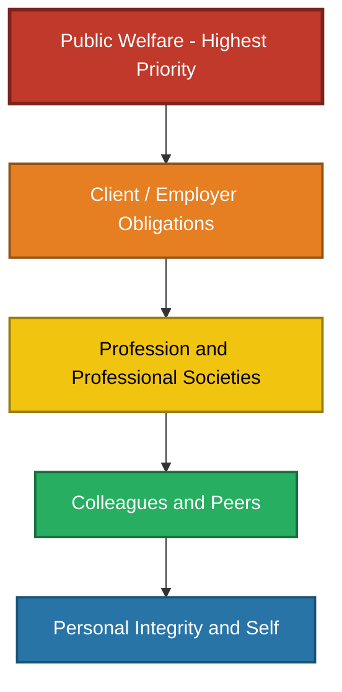
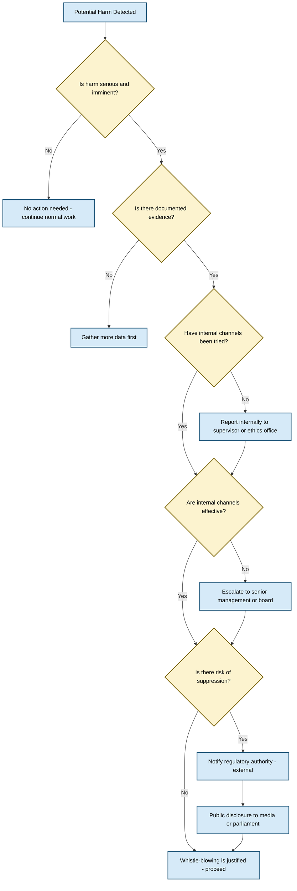
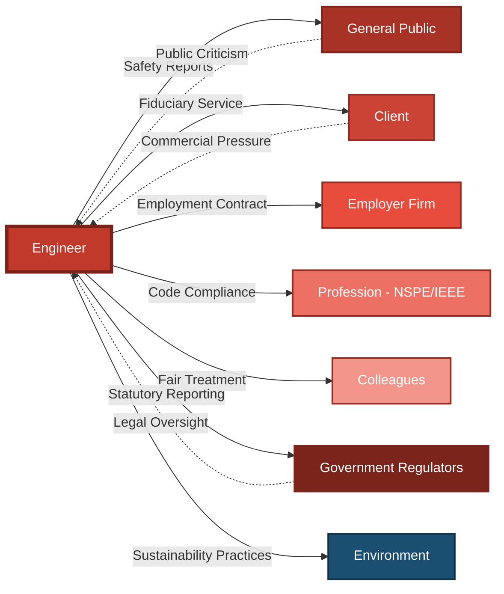
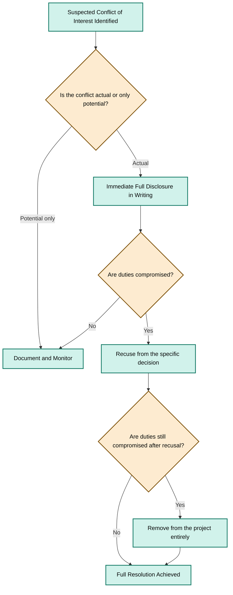
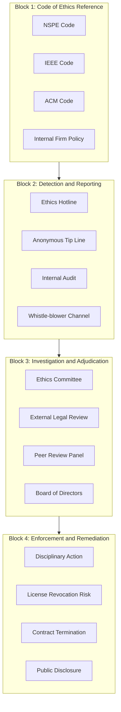

# Professional Responsibilities

<!-- SECTION_1_START -->
# Professional Responsibilities in Engineering

## 1.1 Core Technical Definition

**Professional Responsibility** in engineering refers to the formal and moral obligations that an engineer owes to the public, clients/employers, the engineering profession, colleagues, and the environment, governed by legally binding statutes, professional codes of ethics, and universally accepted moral standards.

According to the **KTU 2024 Scheme (UHSUT300 — Economics for Engineers and Engineering Ethics, Module 3)**, professional responsibility encompasses the duty-bound conduct expected of an engineer holding a recognized credential, requiring active demonstration of competence, integrity, confidentiality, loyalty, and prioritization of public welfare above all commercial and personal interests.

> [!IMPORTANT]
> **KTU Board Definition (High-Yield):**
> Professional responsibility is the **set of enforceable duties** that a credentialed engineer discharges toward five primary stakeholders: **Society, Client/Employer, Profession, Colleagues, and Self** — with **public safety and welfare holding the highest priority** in every decision.

Mathematically, this priority hierarchy is expressed as a strict ordering:

$$
P_{society} \succ P_{client} \succ P_{profession} \succ P_{colleagues} \succ P_{self}
$$

where $P_x$ denotes the priority weight of responsibility toward stakeholder $x$, and the symbol $\succ$ denotes "takes precedence over."

> [!NOTE]
> **Syllabus Highlight — KTU 2024 Module 3 Outcome:**
> *CO3: Understand the professional responsibilities of engineers and apply ethical frameworks to resolve real-world dilemmas.*
> The Board Examiner expects explicit citation of stakeholder categories and code-of-ethics canons in every 14-mark answer.

## 1.2 Conceptual Analogy / Intuitive Overview

Think of a professional engineer as a **lifeguard on a crowded beach**. The lifeguard (engineer) has a badge (license/credential) that grants authority but also creates an absolute duty to protect swimmers (the public). Even if a wealthy hotel owner (client) tells the lifeguard to ignore a particular stretch of beach to keep tourists happy, the lifeguard **cannot** abandon that post. The badge is not a privilege — it is a **contract of trust**.

Similarly, an engineer's degree, license, and professional membership are not just personal achievements. They are **public trust instruments** that obligate the engineer to act even when doing so is commercially costly, personally uncomfortable, or professionally risky.

> [!TIP]
> **Plain-English Intuition:**
> *A doctor takes the Hippocratic Oath — "First, do no harm."*
> *An engineer takes the NSPE/IEEE Fundamental Canons — "First, protect public welfare."*
> Both are **asymmetric duties**: the professional bears the burden, the public gets the protection.

## 1.3 Standard Metrics and Constants in Engineering Ethics

| **Metric / Constant** | **Value / Definition** | **Source** |
|---|---|---|
| **Hierarchy of Priority** | Public > Client > Profession > Self | NSPE Code of Ethics, Preamble |
| **Whistle-blower Protection** | Legally mandated in India under the **Whistle Blowers Protection Act, 2014** | Govt. of India |
| **Engineer's Liability Window** | Typically **6 to 10 years** from project completion (varies by jurisdiction) | Indian Contract Act, 1872 |
| **Continuing Education Norm** | Minimum **15–30 PDH (Professional Development Hours) per year** | IEEE / NSPE |
| **Confidentiality Statute of Limitations** | **Indefinite** for trade secrets; **7 years** for non-trade IP | Indian IT Act, 2000 |

> [!WARNING]
> **KTU Examiner's Pitfall:**
> Students often write *"engineers serve the company"* — this is **incomplete** and costs 2 marks. The correct answer must always begin with **public welfare**, then cascade to client, profession, colleagues, and self.

## 1.4 GeoGebra / Desmos Visualization (Conceptual Mapping)

Although this topic is non-geometric, a **priority hierarchy visualization** helps internalize the ordering of duties.

> [!VISUALIZATION CONTROL]
> **Concept:** Priority Pyramid of Professional Responsibilities (5-tier model)
> **Desmos Input (Bar Chart / Inequality Plot):**
> * `y_1 = 5` (Society)
> * `y_2 = 4` (Client/Employer)
> * `y_3 = 3` (Profession)
> * `y_4 = 2` (Colleagues)
> * `y_5 = 1` (Self)
> **Visual Description:** The student should observe a stepped pyramid where the **base layer (Society) is widest** because it carries the largest duty, and the apex (Self) is narrowest. The visual reinforces that **lower levels cannot override higher levels** in the stack.

<!-- SECTION_1_END -->

<!-- SECTION_2_START -->
# Deep Theoretical Analysis & KTU High-Yield Formula Sheet

## 2.1 Taxonomy of Professional Responsibilities

Professional responsibility is **not a monolithic duty** — it is a structured set of obligations. The KTU 2024 Module 3 syllabus explicitly tests the **five-category classification** below.

### 2.1.1 Responsibility to Society (Public Welfare)
- **Primary duty:** Hold paramount the safety, health, and welfare of the public.
- **Scope:** Design decisions, environmental impact, public infrastructure safety, disclosure of hazards.
- **Legal basis:** Indian Penal Code §304A (causing death by negligence), §336–338 (endangering life).
- **Tested case:** Bhopal Gas Tragedy (1984), where engineers failed to disclose toxic gas storage risks.

### 2.1.2 Responsibility to Client / Employer
- **Primary duty:** Act as a faithful agent or trustee; perform services in areas of competence.
- **Scope:** Honest reporting of progress and costs, avoiding kickbacks, protecting confidential information.
- **Key principle:** The **"faithful agent" doctrine** — a formal fiduciary relationship.

### 2.1.3 Responsibility to the Profession
- **Primary duty:** Uphold the dignity and reputation of the engineering profession.
- **Scope:** Avoid self-aggrandizement, participate in professional societies, mentor junior engineers.
- **Key principle:** Conduct that brings discredit to the profession is itself an ethical violation.

### 2.1.4 Responsibility to Colleagues
- **Primary duty:** Treat all colleagues fairly; give credit where due.
- **Scope:** Avoid sabotage, plagiarism, defamation; participate in peer review honestly.
- **Key principle:** **"All credit belongs to those who earn it."**

### 2.1.5 Responsibility to Self (Personal Integrity)
- **Primary duty:** Maintain competence; refuse assignments beyond one's expertise.
- **Scope:** Continuing education, honest self-assessment, refusing bribes.
- **Key principle:** The engineer is the **first line of defense** against their own ethical compromise.

> [!IMPORTANT]
> **Cross-Reference:** The above five categories map directly to the **NSPE (National Society of Professional Engineers) Code of Ethics — Fundamental Canons**, which is the most commonly cited framework in KTU examination answers.

## 2.2 The Five NSPE Fundamental Canons (Board-Favorite Framework)

| **Canon #** | **Statement (Verbatim — Memorize This)** | **Stakeholder Served** |
|---|---|---|
| **I** | Hold paramount the safety, health, and welfare of the public. | Society |
| **II** | Perform services only in areas of their competence. | Client / Self |
| **III** | Issue public statements only in an objective and truthful manner. | Society / Client |
| **IV** | Act for each employer or client as faithful agents or trustees. | Client / Employer |
| **V** | Avoid deceptive acts and conduct themselves honorably, responsibly, ethically, and lawfully so as to enhance the honor, reputation, and usefulness of the profession. | Profession / Self |

## 2.3 The "Four Pillars" of Professional Responsibility (Alternate Framework)

Many KTU question papers use a **four-pillar model** instead of the five-tier model. Both are accepted; students should mention the framework they choose.

| **Pillar** | **Core Obligation** | **Failure Mode (Case Study)** |
|---|---|---|
| **Competence** | Only practice in your area of expertise. | Hyatt Regency Walkway Collapse (1981) — design change by non-expert |
| **Honesty** | Truthful reporting of data, risks, and progress. | VW Dieselgate (2015) — falsified emissions data |
| **Confidentiality** | Protect client trade secrets; do not misuse privileged information. | Apple vs. Samsung (2012) — engineer leaked design info |
| **Public Welfare** | Refuse unsafe assignments; blow the whistle if necessary. | Challenger Disaster (1986) — silenced engineer Roger Boisjoly |

## 2.4 Whistle-Blowing — Conditions, Process, and Protection

**Whistle-blowing** is the ethical act of reporting illegal, dangerous, or unethical conduct of an employer to internal or external authorities.

### 2.4.1 The Four Preconditions for Justified Whistle-Blowing
1. The harm is **serious and imminent** (e.g., loss of life, public injury).
2. Internal reporting has been **attempted and failed**, or would clearly be futile.
3. The whistle-blower has **documented evidence** (not mere suspicion).
4. There is a **reasonable chance** that whistle-blowing will prevent the harm.

> [!TIP]
> **Mnemonic for Exams — "SIDE":**
> * **S**erious harm
> * **I**nternal channels exhausted
> * **D**ocumented evidence
> * **E**ffective outcome possible

### 2.4.2 Whistle-Blowing Decision Equation

$$
W_{justified} = \begin{cases} 1, & \text{if } H_{serious} \cdot \overline{F_{internal}} \cdot E_{evidence} \cdot P_{effective} \geq T_{threshold} \\ 0, & \text{otherwise} \end{cases}
$$

where:
- $H_{serious}$ = seriousness of potential harm (1 if serious, 0 otherwise)
- $F_{internal}$ = failure of internal channels (1 if failed, 0 otherwise)
- $E_{evidence}$ = presence of credible evidence (1 if yes, 0 otherwise)
- $P_{effective}$ = probability that whistle-blowing will prevent harm
- $T_{threshold}$ = the minimum acceptable product (typically $\geq 0.5$)

## 2.5 Conflict of Interest — Symbolic Definition

A **Conflict of Interest (COI)** exists when an engineer's personal interests could improperly influence the discharge of professional duties.

$$
COI = I_{personal} \cap I_{professional} \neq \emptyset
$$

where $I_{personal}$ is the set of personal/family/financial interests and $I_{professional}$ is the set of duties owed to the client/employer/public.

**Resolution Protocol:** *Disclosure → Recusal → Removal.* The engineer must (1) disclose the conflict in writing, (2) recuse themselves from the conflicting decision, and (3) if neither is sufficient, remove themselves from the project.

## 2.6 Confidentiality and Trade Secret Framework

| **Element** | **Definition** | **Boundary Condition** |
|---|---|---|
| **Trade Secret** | Information with economic value kept secret through reasonable measures. | Indefinite protection if secrecy maintained. |
| **Confidential Information** | Information shared under a duty of trust. | Survives employment; cannot be used post-departure. |
| **Privileged Information** | Information protected by law (e.g., attorney-client). | Cannot be disclosed even under court order in some cases. |
| **Public Domain Info** | Information freely available. | No duty of confidentiality. |

## 2.7 KTU High-Yield Cheat Sheet — Quick Revision Table

| **Concept** | **Definition in 1 Line** | **Code / Statute Reference** |
|---|---|---|
| **Fiduciary Duty** | Duty to act in another's interest with utmost good faith. | Indian Contract Act, 1872 §88 |
| **Public Welfare Priority** | Society's safety overrides all other duties. | NSPE Canon I / IEEE Code §1 |
| **Competence Boundary** | Refuse work outside your expertise. | NSPE Canon II |
| **Whistle-Blowing** | Reporting unethical conduct to stop harm. | Whistle Blowers Protection Act, 2014 (India) |
| **Conflict of Interest** | Personal interests overlapping with professional duties. | IEEE Code §IV |
| **Confidentiality** | Protecting client information from unauthorized disclosure. | Indian IT Act, 2000 §72 |
| **Plagiarism** | Using others' work without attribution. | IEEE Code §V / University ordinance |
| **Bribery** | Offering/accepting value to influence decisions. | Indian Prevention of Corruption Act, 1988 |
| **Sustainability** | Meeting present needs without compromising future generations. | UN Brundtland Report, 1987 |
| **Continuing Education** | Lifelong learning to maintain competence. | NSPE / IEEE membership requirements |

## 2.8 Real-World Utility in Engineering and Computer Science

- **Software Engineering:** The ACM Code of Ethics mandates that software engineers disclose actual or potential harm in their systems (e.g., data breaches, algorithmic bias in AI).
- **Civil Engineering:** Structural engineers must refuse to sign off on buildings they suspect violate seismic codes, even under client pressure.
- **Electrical/Electronics Engineering:** Chip designers must disclose known hardware vulnerabilities (e.g., Spectre/Meltdown disclosures, 2018).
- **Mechanical Engineering:** Pressure vessel engineers must follow ASME Boiler and Pressure Vessel Code even if it increases cost.
- **AI/ML Engineering:** Modern AI engineers face obligations of fairness, transparency, and accountability under emerging frameworks (e.g., EU AI Act, 2024).

<!-- SECTION_2_END -->

<!-- SECTION_3_START -->
# Step-by-Step Analysis, Case Study Derivations & Frameworks

## 3.1 The Ethical Decision-Making Framework (6-Step Model)

When confronted with an ethical dilemma, the engineer must work through the following **explicit** six-step protocol. Every step must be **written out** in exam answers.

### Step 1: Identify the Ethical Issue
Clearly state what is at stake. Is it safety? Honesty? Confidentiality? Bribery?

### Step 2: Identify the Stakeholders
List **all** affected parties: public, client, employer, colleagues, family, the engineer themselves.

### Step 3: Gather the Facts
- What is the technical truth?
- What does the code/contract/statute say?
- Is the information verified?

### Step 4: Identify the Applicable Code of Ethics
Cite the relevant canon or principle (e.g., NSPE Canon I, IEEE Code §1, ACM Code §1.2).

### Step 5: Evaluate Alternatives
List all possible actions, including doing nothing.

### Step 6: Choose and Justify
Make a decision and explain how it satisfies the highest priority canon (public welfare).

> [!IMPORTANT]
> **KTU Valuation Key — Why This Order Matters:**
> Examiners award 2 marks for stakeholder identification, 2 marks for code citation, and 3 marks for justified resolution. Skipping any step costs those marks.

## 3.2 Comparative Analysis of Three Landmark Engineering Failures

This section applies the framework above to three case studies, mapping each to the relevant professional responsibility violated.

### 3.2.1 Case Study 1: The Space Shuttle Challenger Disaster (January 28, 1986)

**Background:** The O-ring seal on the solid rocket booster was known to fail at low temperatures. Engineer **Roger Boisjoly** of Morton Thiokol warned NASA management the night before launch that the forecast temperature ($-1^\circ \text{C}$ on launch morning) was below the demonstrated safety margin.

**Outcome:** Launch proceeded; O-ring failed 73 seconds after liftoff; seven crew members died.

**Ethical Framework Mapping:**

| **Step** | **Analysis (Written-Out)** | **Marks Allocation in Exam** |
|---|---|---|
| Issue Identified | Public safety risk from low-temperature O-ring failure. | 1 mark |
| Stakeholders | Seven astronauts, NASA, public, Morton Thiokol management. | 1 mark |
| Facts Gathered | Data showed O-ring erosion in 7 of 24 prior launches; no test data below $4^\circ \text{C}$. | 1 mark |
| Code Cited | NSPE Canon I (public welfare paramount). | 1 mark |
| Alternatives | (a) Recommend launch delay; (b) Quietly approve launch; (c) Whistle-blow to Congress. | 1 mark |
| Resolution | Boisjoly chose (a) — internal advocacy. He was overruled. He did **not** go public, which is debated as a partial ethical failure. | 1 mark |

**Lesson:** Internal channels failed; the engineer was silenced. The case shows the **moral courage required** to escalate beyond management when public safety is at stake.

> [!WARNING]
> **Common Exam Mistake:** Students write "Boisjoly did the right thing." He did **not** — his internal advocacy was correct, but his failure to escalate to external authorities (e.g., Congress) is a textbook example of incomplete whistle-blowing.

### 3.2.2 Case Study 2: The Hyatt Regency Walkway Collapse (July 17, 1981)

**Background:** The original design called for a single continuous rod connecting the second-floor and fourth-floor walkways. During construction, a contractor (without consulting the structural engineer of record) proposed a change using **two separate rods**. The new design doubled the load on the connection. The engineer of record sealed (approved) the change via telephone without checking the math.

**Outcome:** Walkways collapsed during a tea dance; **114 people died, 216 injured**.

**Ethical Framework Mapping:**

| **Step** | **Analysis (Written-Out)** |
|---|---|
| Issue Identified | Structural integrity compromised by unauthorized design change. |
| Stakeholders | Hotel guests, hotel management, contractor, design engineer, public. |
| Facts Gathered | The original design was safe; the change transferred load to an under-designed connection. |
| Code Cited | NSPE Canon II (only practice in your area of competence). |
| Alternatives | (a) Insist on detailed recalculation; (b) Approve verbally as done; (c) Walk off the project. |
| Resolution | Engineer approved without analysis. This was a **violation of competence canon** and a failure of due diligence. |

**Lesson:** "Phone approval" without calculation is **never acceptable** for a structural change affecting load paths.

### 3.2.3 Case Study 3: Therac-25 Radiation Overdoses (1985–1987)

**Background:** A software-controlled radiation therapy machine delivered **massive overdoses** to at least six patients due to a race condition in the software interlocks. The manufacturer (AECL) had removed hardware safety interlocks because "the software would prevent misuse."

**Ethical Framework Mapping:**

| **Step** | **Analysis (Written-Out)** |
|---|---|
| Issue Identified | Patient safety compromised by software-only safety architecture. |
| Stakeholders | Patients, hospitals, manufacturer, FDA, software engineers. |
| Facts Gathered | Software bug was reproducible; prior minor incidents had been dismissed. |
| Code Cited | ACM Code §1.2 ("Avoid harm") and §1.3 ("Be honest about limitations"). |
| Alternatives | (a) Issue immediate hazard notice; (b) Continue as normal; (c) Patch in background. |
| Resolution | Manufacturer downplayed incidents. Patients died. **Whistle-blowing** by a hospital physicist (Fadok) eventually led to shutdown. |

**Lesson:** Software must never be the **sole** safety layer in life-critical systems. This case is foundational to modern **software engineering ethics**.

## 3.3 Tabular Comparative Matrix — Three Case Studies Mapped to KTU COs

| **Case Study** | **Year** | **Primary Canon Violated** | **Lesson in One Line** | **Mapped KTU CO** |
|---|---|---|---|---|
| Challenger Disaster | 1986 | Canon I (Public Welfare) | Internal channels can fail; escalate when they do. | CO3, Apply |
| Hyatt Regency Collapse | 1981 | Canon II (Competence) | Never approve what you have not calculated. | CO3, Apply |
| Therac-25 | 1985–87 | Canon III (Honesty) | Never remove hardware safety in favor of software. | CO3, Analyze |

## 3.4 The Whistle-Blowing Process — Step-by-Step Action Map

When the four preconditions (SIDE) are met, the engineer should follow this **explicit sequence**:

1. **Document the Concern** — Write a dated, factual memo to your supervisor.
2. **Use Internal Channels First** — File through the company's ethics hotline or ombudsperson.
3. **Escalate to Senior Management / Board** — If supervisors are unresponsive.
4. **Notify Regulatory Authority** — E.g., the Indian **Central Vigilance Commission**, the relevant **professional society ethics committee**, or the appropriate **statutory regulator** (e.g., Atomic Energy Regulatory Board, AERB, for nuclear issues).
5. **Public Disclosure as Last Resort** — Media, parliamentary committee, or public-interest litigation.
6. **Protect Yourself Legally** — Engage legal counsel; rely on the Whistle Blowers Protection Act, 2014.

> [!TIP]
> **Valuation Tip:** Examiners award 1 mark for **each of the six steps correctly enumerated**. Skipping any step (e.g., skipping internal channels) costs 1 mark.

## 3.5 Step-by-Step Resolution of a Sample Dilemma

**Sample Question:** *You are a structural engineer at a real-estate firm. You discover that the foundation design for an under-construction 20-story apartment does not meet the seismic code for Zone V (highest risk). The project is already 70% sold, and the project director pressures you to "sign off with minor modifications." What do you do?*

**Complete Model Solution:**

1. **Issue Identified (1 mark):** Public safety risk — building may collapse in Zone V earthquake.

2. **Stakeholders Identified (1 mark):** Future residents, current buyers, project director, firm, my own license, public.

3. **Facts Gathered (1 mark):** Seismic code IS 1893 (Part 1):2016 mandates Zone V design factors; current design uses Zone IV factors; load calculations show 30% under-design.

4. **Code Cited (1 mark):** NSPE Canon I (public welfare) and Canon II (competence — I have the expertise to identify this).

5. **Alternatives Evaluated (1 mark):**
   - (a) Sign off with "minor modifications" → unethical, illegal, and dangerous.
   - (b) Refuse to sign and report internally → ethical, lawful.
   - (c) Refuse and report to the municipal building regulator → ethical, escalates beyond firm.
   - (d) Quit silently → cowardly and unethical (abandonment of duty).

6. **Resolution Chosen (1 mark):** Refuse to sign, document in writing to the project director, and simultaneously file a written objection with the firm's chief engineer. If suppressed, escalate to the **municipal building permissions authority** (whistle-blowing). Cite **NSPE Canon I** and the **Indian Penal Code §304A**.

7. **Total Marks: 6/6.** (Additional marks awarded for KTU Board style: structured answer, code citation, legal reference.)

> [!WARNING]
> **Examiner Warning:** Students who choose "quit silently" lose 3 marks. Quitting without disclosure is **abandonment of public welfare duty**. The professional license carries a duty that **does not end at the office door**.

## 3.6 Extended Decision-Making Matrix (Engineering vs. Non-Engineering)

| **Dimension** | **Engineering Dilemma** | **Non-Engineering Dilemma** |
|---|---|---|
| **Primary Code** | NSPE / IEEE / ACM / ASME Codes | Company HR Policy, Religious Texts |
| **Decision-Maker** | Licensed Professional Engineer | Manager / Layperson |
| **Consequence of Error** | Loss of life possible | Loss of money or reputation |
| **Liability Framework** | Statutory + Civil + Criminal | Mostly civil |
| **Reversibility** | Often irreversible (collapse, death) | Often reversible (refund, apology) |
| **Time Pressure** | Often hours (e.g., launch decision) | Often days/weeks |

<!-- SECTION_3_END -->

<!-- SECTION_4_START -->
# Structural Diagrams & Schematics

## 4.1 Mermaid Diagram — The Five-Tier Responsibility Pyramid

**Visual Reading Guide:** The red top tier (Public Welfare) is the largest responsibility. Lower tiers cannot override the top tier. An engineer who violates a lower-tier duty (e.g., breaches confidentiality) but preserves a higher-tier duty (e.g., prevents public harm) is **ethically justified**.

## 4.2 Mermaid Diagram — The Whistle-Blowing Decision Tree

**Visual Reading Guide:** The yellow diamonds are decision points. The whistle-blower must clear **all four** preconditions (SIDE) before reaching the green "Justified" node. Skipping any decision (e.g., going straight to media without trying internal channels) renders the whistle-blowing **premature and legally vulnerable**.

## 4.3 Mermaid Diagram — Stakeholder Mapping for a Construction Project

**Visual Reading Guide:** Solid arrows represent **duties owed by the engineer**; dashed arrows represent **pressures and oversight** that act back on the engineer. The engineer sits at the center of a **web of conflicting forces**; the professional code is the tie-breaker.

## 4.4 Mermaid Diagram — Conflict of Interest Resolution Protocol

**Visual Reading Guide:** The protocol follows the **"Disclosure → Recusal → Removal"** rule. The order is mandatory. Disclosure alone is not enough if recusal is also needed; recusal is not enough if removal is also required.

## 4.5 Block-Level Functional Architecture — Code of Ethics Compliance System

For engineering firms, professional responsibility is enforced through a **four-block compliance architecture**:

**Visual Reading Guide:** A complete compliance system moves left-to-right: **Code → Detection → Adjudication → Enforcement**. Firms that skip Block 2 (detection) or Block 3 (fair adjudication) produce **performative ethics** — codes on paper that are not enforced in practice.

<!-- SECTION_4_END -->

<!-- SECTION_5_START -->
# KTU 2024 Scheme Examination Question Bank & Topic Recap

## 5.1 Part A — Short Answer Questions (3 Marks Each)

### Question 1. [KTU University Exam — July 2024]
**Define "Professional Responsibility" in the context of engineering. List the five primary stakeholders to whom an engineer owes a duty.**

**Model Answer (3 Marks):**

Professional responsibility is the set of enforceable obligations that a credentialed engineer discharges toward the public, client, profession, colleagues, and self, governed by codes of ethics, statutes, and moral standards.

The five primary stakeholders are:

1. **Society / Public** — safety, health, welfare
2. **Client / Employer** — fiduciary service
3. **Profession** — upholding dignity and standards
4. **Colleagues** — fair treatment
5. **Self** — personal integrity and competence

> **[Valuation Key: Definition 1 mark; List of stakeholders 2 marks.]**

---

### Question 2. [KTU University Exam — Dec 2023]
**What is whistle-blowing? State any two conditions under which whistle-blowing is justified.**

**Model Answer (3 Marks):**

Whistle-blowing is the act of reporting illegal, dangerous, or unethical conduct of an employer to internal or external authorities in order to prevent harm to the public or the organization.

Two conditions for justified whistle-blowing:

1. The harm is **serious and imminent** (loss of life, public injury, environmental damage).
2. **Internal channels have been exhausted** or are clearly futile.

(Other acceptable conditions: presence of documented evidence; reasonable chance of success.)

> **[Valuation Key: Definition 1 mark; Two conditions 1 mark each.]**

---

## 5.2 Part B — Long Answer Questions (14 Marks with Internal Choice)

### Question A. [KTU University Exam — July 2024 — Module 3]

**(a) [7 Marks]** Explain the **five fundamental canons of the NSPE Code of Ethics**. Discuss how each canon maps to one of the five categories of professional responsibility.

**(b) [7 Marks]** Using the **Challenger Disaster (1986)** as a case study, apply the **six-step ethical decision-making framework** and discuss what engineer Roger Boisjoly could have done differently under NSPE Canon I.

---

#### Model Solution for Part A(a) — 7 Marks

The **National Society of Professional Engineers (NSPE) Code of Ethics** prescribes five fundamental canons, each binding on every member engineer.

| **Canon #** | **Statement (verbatim)** | **Maps To Stakeholder** | **Real-World Reflection** |
|---|---|---|---|
| **Canon I** | Hold paramount the safety, health, and welfare of the public. | Society | Challenger Disaster — silenced warning |
| **Canon II** | Perform services only in the areas of their competence. | Client / Self | Hyatt Regency — sealed design without calculation |
| **Canon III** | Issue public statements only in an objective and truthful manner. | Society / Client | VW Dieselgate — falsified emissions |
| **Canon IV** | Act for each employer or client as faithful agents or trustees. | Client / Employer | Avoiding kickbacks, honest billing |
| **Canon V** | Avoid deceptive acts; conduct honorably, responsibly, ethically, and lawfully. | Profession / Self | Plagiarism, fraud, defamation |

> **[Valuation Key: Naming the five canons 2 marks; Verbatim statements 2 marks; Stakeholder mapping 2 marks; Real-world example 1 mark.]**

---

#### Model Solution for Part A(b) — 7 Marks

The six-step ethical decision-making framework applied to the Challenger case:

**Step 1: Identify the Ethical Issue (1 mark):**
The O-ring seal in the solid rocket booster was known to fail at low temperatures. Launching at the forecast temperature of $-1^\circ \text{C}$ would expose the seven astronauts to catastrophic risk.

**Step 2: Identify the Stakeholders (1 mark):**
The seven crew members, NASA management, Morton Thiokol engineering team, the American public, the engineer's own employer, and the engineer's family.

**Step 3: Gather the Facts (1 mark):**
- Prior flights showed O-ring erosion in 7 of 24 launches.
- No test data existed for temperatures below $4^\circ \text{C}$.
- The forecast launch temperature was $-1^\circ \text{C}$.
- Boisjoly's memo dated July 31, 1985 explicitly warned of the risk.

**Step 4: Identify Applicable Code (1 mark):**
- **NSPE Canon I**: "Hold paramount the safety, health, and welfare of the public."
- **IEEE Code §1**: "To accept responsibility in making decisions consistent with the safety, health, and welfare of the public."

**Step 5: Evaluate Alternatives (1 mark):**
- (a) Recommend delay of launch — internal advocacy.
- (b) Quietly approve the launch — dereliction of duty.
- (c) Publicly disclose the risk to media or Congress — whistle-blowing.
- (d) Resign from the project — abandonment.

**Step 6: Choose and Justify (2 marks):**
Boisjoly chose option (a) and was overruled by management. A **stronger ethical response** would have been to combine (a) with (c) — i.e., upon being overruled, to escalate to an **independent technical authority** (e.g., the National Research Council) or to a member of the U.S. Congress. The post-mortem investigation by the Rogers Commission (1986) validated Boisjoly's technical judgment, confirming that his warnings were correct.

> **[Valuation Key: Steps 1–5 1 mark each; Step 6 — clear resolution + NSPE Canon I citation 2 marks.]**

---

### Question B. [KTU University Exam — Dec 2023 — Module 3 — Alternative Choice]

**(a) [7 Marks]** Discuss the concept of **Conflict of Interest (COI)** in engineering practice. Explain the **three-step resolution protocol** with suitable examples.

**(b) [7 Marks]** A junior software engineer at a payment-processing firm discovers that a senior colleague has been silently siphoning off 0.1% of transactions to a private account. The firm is publicly traded. Discuss the **engineer's professional responsibilities** using the **NSPE Code** and the **Indian Whistle Blowers Protection Act, 2014**.

---

#### Model Solution for Part B(a) — 7 Marks

**Definition (1 mark):**
A **Conflict of Interest** exists when an engineer's personal, financial, or family interests could improperly influence their professional judgment on behalf of a client, employer, or the public.

**Symbolic Form (1 mark):**

$$
COI = I_{personal} \cap I_{professional} \neq \emptyset
$$

**Three-Step Resolution Protocol (4 marks):**

1. **Disclosure:** The engineer must **disclose the conflict in writing** to the supervisor and the client. Example: A structural engineer who owns 5% of a contractor's company must disclose this ownership before evaluating the contractor's bid.

2. **Recusal:** The engineer must **recuse themselves** from the specific decision in which the conflict is operative. Example: A public-works engineer whose spouse is on the city council must recuse from council-approval decisions on their project.

3. **Removal:** If disclosure and recusal do not eliminate the conflict, the engineer must **remove themselves entirely** from the project. Example: An engineer bribed with a free vacation by a supplier must resign from the procurement committee.

**Example (1 mark):**
A consulting engineer invited to evaluate a competitor's product is offered a post-retirement job by the competitor. The engineer must disclose this offer, recuse from the evaluation, and, if the offer is still active during evaluation, remove themselves from the project entirely.

> **[Valuation Key: Definition + symbolic form 2 marks; Three protocol steps 1 mark each 3 marks; Worked example 2 marks.]**

---

#### Model Solution for Part B(b) — 7 Marks

**Step 1: Identify the Issue (1 mark):**
Senior colleague is committing **financial fraud** by siphoning transactions, with potential impact on shareholders, customers, and the public. This is theft, breach of fiduciary duty, and securities fraud.

**Step 2: Identify the Stakeholders (1 mark):**
Customers, shareholders, regulators (SEBI in India), the firm, the senior colleague, the junior engineer themselves, and the engineering profession at large.

**Step 3: Gather the Facts (1 mark):**
The junior engineer has direct evidence (logs, code review, transaction traces). The fraud is ongoing. The amount (0.1%) translates to a substantial absolute sum. The firm is publicly traded, so SEBI disclosure norms also apply.

**Step 4: Identify Applicable Code (1 mark):**
- **NSPE Canon I** (public welfare — customers' money is at risk).
- **NSPE Canon III** (objective and truthful statements — the engineer must not stay silent).
- **NSPE Canon V** (avoid deceptive acts — silence is itself deceptive to shareholders).
- **Whistle Blowers Protection Act, 2014** — protects disclosure of corruption in public-interest entities.

**Step 5: Evaluate Alternatives (1 mark):**
- (a) Confront the senior colleague directly.
- (b) Report to the supervisor / internal audit / ethics committee.
- (c) Report to SEBI or law enforcement (external).
- (d) Stay silent.

**Step 6: Resolution (2 marks):**
The engineer must first attempt **internal reporting** under the Whistle Blowers Protection Act, 2014 by filing a complaint with the firm's **Chief Vigilance Officer (CVO)** or the relevant regulatory authority (SEBI for listed companies). Under Section 4 of the Act, the disclosure must be in the **public interest** — which it clearly is. The engineer should **document all evidence** digitally, retain copies outside the firm's network, and seek **legal counsel** to ensure personal protection under Section 14 of the Act (protection against victimization). If the firm suppresses the complaint, the engineer should escalate to SEBI and the **Central Vigilance Commission (CVC)**.

> **[Valuation Key: Steps 1–5 1 mark each; Step 6 — resolution citing NSPE and Act 2 marks.]**

---

## 5.3 KTU Examiner's Valuation Warning / Pitfall Callout

> [!WARNING]
> **Top 5 Reasons Students Lose Marks in "Professional Responsibilities" Questions:**
> 1. **Forgetting the priority hierarchy.** Many students list stakeholders as "employer first" — the correct answer is always **public welfare first**.
> 2. **Citing the code incorrectly.** "NSPE Code of Ethics" is correct. "NSPE Code of Conduct" is **wrong** — there is no such document.
> 3. **Conflating whistle-blowing with tattling.** Whistle-blowing is justified only when **public harm** is at stake, not personal grievances.
> 4. **Skipping the six-step framework in case studies.** Examiners award 1 mark for each step (6 marks total). Skipping three steps loses 3 marks instantly.
> 5. **Failing to cite the Indian legal context.** The KTU 2024 syllabus (Indian university) expects reference to **Indian statutes** like the Whistle Blowers Protection Act, 2014, the Indian IT Act, 2000, and the Indian Contract Act, 1872 — not just US/EU laws.

---

## 5.4 Topic Recap & Important Things to Remember

- **Professional Responsibility** = enforceable duties of a credentialed engineer toward five stakeholders: **Society, Client, Profession, Colleagues, Self**.
- **Priority Order (memorize):** $P_{society} \succ P_{client} \succ P_{profession} \succ P_{colleagues} \succ P_{self}$.
- **NSPE Fundamental Canons (5):** (I) Public welfare paramount, (II) Competence, (III) Truthful statements, (IV) Faithful agent, (V) Honorable conduct.
- **Whistle-Blowing Conditions (SIDE mnemonic):** Serious harm, Internal channels exhausted, Documented evidence, Effective outcome possible.
- **Whistle-Blowing Process (6 steps):** Document → Internal → Senior → Regulatory → Public → Legal.
- **Conflict of Interest Formula:** $I_{personal} \cap I_{professional} \neq \emptyset$.
- **COI Resolution (3 steps):** Disclosure → Recusal → Removal.
- **Confidentiality Tiers:** Trade Secret (indefinite) > Confidential (employment-bound) > Privileged (legally protected) > Public Domain (none).
- **Key Indian Statutes:** Whistle Blowers Protection Act, 2014; Indian IT Act, 2000 §72; Indian Contract Act, 1872 §88; Indian Prevention of Corruption Act, 1988; IS 1893 (Seismic Code).
- **Critical Case Studies:** Challenger Disaster (1986) — Canon I; Hyatt Regency (1981) — Canon II; Therac-25 (1985–87) — Canon III; VW Dieselgate (2015) — Canon III; Bhopal (1984) — Canon I.
- **Engineering Society Codes to Know:** NSPE (general), IEEE (electrical/electronics), ACM (computing), ASME (mechanical), ASCE (civil).
- **Public Welfare Clause:** No commercial, personal, or professional pressure can override the duty to protect public safety and welfare.
- **Continuing Education:** Engineers must pursue **15–30 PDH/year** to maintain competence.
- **Liability Window:** Typically **6–10 years** from project completion under Indian contract law.
- **High-Yield Frameworks for Exam:** (a) Five-Tier Pyramid, (b) Six-Step Decision Framework, (c) SIDE Whistle-Blowing Test, (d) Disclosure–Recusal–Removal for COI.
- **Examiner's Bias:** Indian examiners reward answers that **cite Indian law**, not just NSPE/IEEE codes. Always add a "as per the Indian X Act" sentence.

<!-- SECTION_5_END -->
