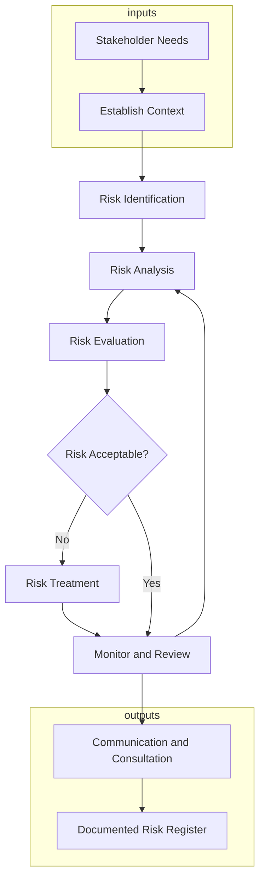
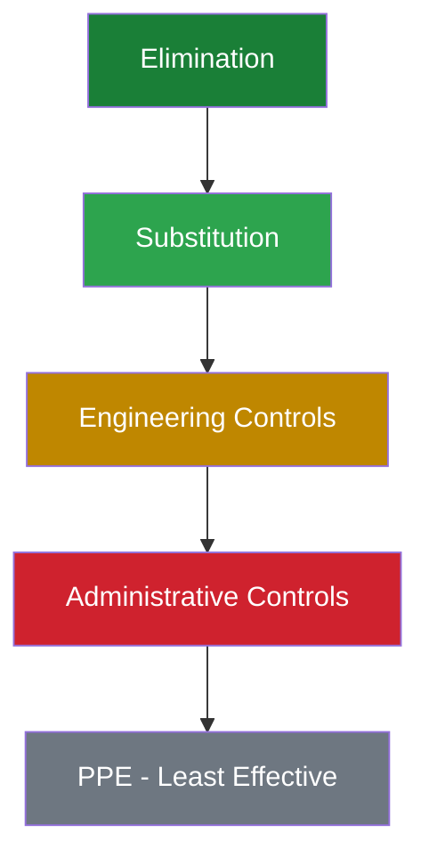
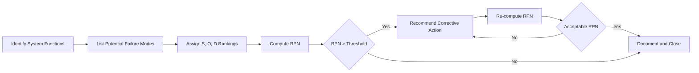
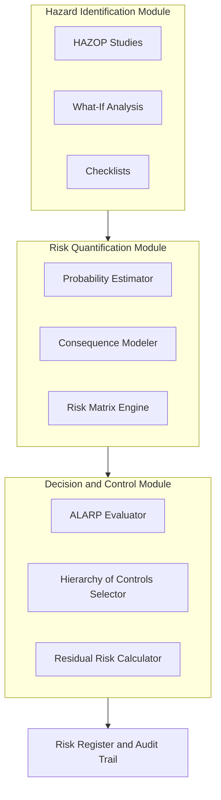

# Safety and Risk Assessment

<!-- SECTION_1_START -->
# 1. Core Technical Definition & Intuitive Overview

## 1.1 Formal Academic Definition

**Safety** in engineering ethics refers to the state of being free from unacceptable levels of physical, psychological, environmental, or financial risk of harm to people, property, or ecosystems arising from the design, construction, operation, or decommissioning of engineered systems. It is a primary professional obligation codified by bodies such as the **NSPE (National Society of Professional Engineers)**, **ABET**, and international standard **ISO 45001**.

**Risk** is the systematic measure of the probability that a hazard will result in an adverse event, multiplied by the severity of the consequences. It is the mathematical expectation of loss, expressed in terms of human injury, property damage, environmental degradation, or economic loss.

**Risk Assessment** is the systematic, iterative, and documented process of identifying, characterizing, estimating, evaluating, and controlling risks associated with a system, process, or activity. The three pillars of risk assessment are:
1. **Risk Identification** (Hazard Recognition)
2. **Risk Analysis** (Probability & Consequence Estimation)
3. **Risk Evaluation** (Comparison against acceptance criteria)

> [!IMPORTANT]
> **KTU 2024 Syllabus Highlight (UHSUT300, Module 3):**
> Engineering ethics places **Public Safety** at the apex of the priority hierarchy, above employer demands, profitability, and even professional advancement. This principle is non-negotiable in the **IEEE Code of Ethics**, **NSPE Code**, and the **KTU-constituted Engineers' Code of Professional Practice**.

## 1.2 Conceptual Analogy / Intuition

Imagine you are crossing a busy Indian highway (say, NH-66). The "safety" of crossing depends on two things:
- **How likely** is it that something bad happens? (a fast bus is approaching, it is raining) → **Probability**
- **How bad** would it be if something bad happens? (you could die, get injured, or just get your clothes wet) → **Severity / Consequence**

**Risk = Probability × Severity**

The moment you step out, your brain is conducting a continuous "risk assessment" — you look both ways, judge vehicle speeds, decide whether to run or wait. Engineering Risk Assessment is the formalized, documented, and rigorous version of this instinctive evaluation, applied to bridges, software, nuclear plants, medical devices, and AI systems.

> [!NOTE]
> **Key Distinction for Board Examinations:**
> - **Hazard** = The *potential* source of harm (a loaded gun).
> - **Risk** = The *likelihood and severity* of harm from that hazard (chance of discharge × injury severity).
> - **Safety** = The *resulting state* after risks are controlled and hazards are mitigated.

## 1.3 Key Terminology & Standard Metrics

| Term | Standard Definition | KTU Board Cue |
|------|---------------------|---------------|
| **ALARP** | As Low As Reasonably Practicable | Risk reduction must be balanced against cost/effort |
| **F-N Curve** | Frequency vs. Number of Fatalities curve | Used to plot societal risk |
| **VSL** | Value of a Statistical Life ≈ ₹4–6 crore (India) | Used in cost-benefit risk analysis |
| **PPE** | Personal Protective Equipment | Last line of defense in Hierarchy of Controls |
| **HIRA** | Hazard Identification and Risk Assessment | Industrial standard in India under Factories Act 1948 |
| **LOPA** | Layer of Protection Analysis | Semi-quantitative risk evaluation method |

> [!VISUALIZATION CONTROL]
> **Concept:** Risk as a Function of Two Variables (Probability vs. Severity)
> **Conceptual Graph Axes:**
> * x-axis: Probability (0 → 1)
> * y-axis: Severity (0 → 10, indexed by consequence class)
> **Visual Description:** Plot the iso-risk hyperbolas. The set of (Probability, Severity) pairs that produce the same risk score form downward-sloping curves. Hazards in the **upper-right quadrant** (high probability × high severity) demand immediate control, while the **lower-left quadrant** represents broadly acceptable risk.

<!-- SECTION_1_END -->

<!-- SECTION_2_START -->
# 2. Deep Theoretical Analysis & KTU High-Yield Formula Sheet

## 2.1 The Risk Assessment Framework (ISO 31000 Paradigm)

The risk assessment process is not a one-time event but a continuous lifecycle embedded in the engineering process. According to **ISO 31000:2018** and the **KTU 2024 Module 3 syllabus**, the structured workflow is:

1. **Establish the Context** — define scope, system boundaries, stakeholders, and risk criteria.
2. **Hazard Identification** — systematic enumeration of potential sources of harm using techniques like *Hazard and Operability Studies (HAZOP)*, *Failure Mode and Effects Analysis (FMEA)*, *Checklists*, and *What-If Analysis*.
3. **Risk Analysis** — qualitative, semi-quantitative, or quantitative estimation of probability and consequence.
4. **Risk Evaluation** — comparison against pre-agreed risk acceptance criteria (often a matrix or F-N curve).
5. **Risk Treatment (Control)** — application of the **Hierarchy of Controls**: Elimination → Substitution → Engineering Controls → Administrative Controls → PPE.
6. **Monitoring & Review** — continuous feedback loop, incident reporting, audits.

## 2.2 Mathematical Formulation of Risk

The fundamental risk equation in engineering ethics is:

$$
R = P \times C
$$

Where:
- $R$ = Risk score (expected loss per unit time or per event)
- $P$ = Probability of the hazardous event occurring
- $C$ = Consequence (severity) of that event

For systems with multiple failure pathways, the **cumulative risk** is the sum over all pathways:

$$
R_{\text{total}} = \sum_{i=1}^{n} P_i \times C_i
$$

For independent events over a time period $T$, the aggregated risk becomes:

$$
R_{\text{agg}} = 1 - \prod_{i=1}^{n} (1 - P_i)
$$

## 2.3 Risk Matrix (The KTU Board Favorite)

A **Risk Assessment Matrix** cross-tabulates Probability (rows) against Severity (columns). Each cell carries a Risk Score, often color-coded:

$$
\text{Risk Score} = \text{Probability Index} \times \text{Severity Index}
$$

A standard **5×5 matrix** (used by NASA, ISRO, DRDO, and Indian Railways) yields scores from **1 (negligible)** to **25 (catastrophic)**:

| Probability ↓ / Severity → | 1 Insignificant | 2 Minor | 3 Moderate | 4 Major | 5 Catastrophic |
|---|---|---|---|---|---|
| 5 Almost Certain | 5 | 10 | 15 | **20** | **25** |
| 4 Likely | 4 | 8 | 12 | **16** | **20** |
| 3 Possible | 3 | 6 | 9 | 12 | **15** |
| 2 Unlikely | 2 | 4 | 6 | 8 | 10 |
| 1 Rare | 1 | 2 | 3 | 4 | 5 |

- **Scores 1–4:** Broadly Acceptable (Green) — operate with routine controls.
- **Scores 5–12:** ALARP Region (Yellow) — reduce risk to "As Low As Reasonably Practicable."
- **Scores 15–25:** Intolerable (Red) — *stop work, redesign, or decommission*.

## 2.4 Failure Mode and Effects Analysis (FMEA) — Risk Priority Number (RPN)

FMEA is a structured, bottom-up technique for evaluating failure modes. The **Risk Priority Number** is computed as:

$$
\text{RPN} = S \times O \times D
$$

Where:
- $S$ = Severity ranking (1–10)
- $O$ = Occurrence ranking (1–10)
- $D$ = Detection ranking (1–10, where 10 = lowest chance of detection)

> [!NOTE]
> A high RPN (>150 in many industry standards) requires immediate corrective action and re-engineering.

## 2.5 ALARP (As Low As Reasonably Practicable) — The Cost-Benefit Test

The economic test for whether further risk reduction is justified is the **Gross Imbalance Test**:

$$
\frac{\text{Cost of further risk reduction}}{\text{Risk reduction achieved (in VSL units)}} \ll 1
$$

If the **cost of saving one statistical life** through further controls is **grossly disproportionate** to the risk reduction, the residual risk is considered ALARP. This is heavily tested in KTU examinations as a case-study analysis tool.

## 2.6 Engineering Real-World Utility

- **Civil Engineering:** Dam structural safety (e.g., Idukki Dam risk assessment), bridge load tolerance.
- **Software Engineering:** Cybersecurity risk modeling (STRIDE, DREAD), AI/ML safety (e.g., autonomous vehicle braking failure).
- **Chemical Engineering:** Process Safety Management (PSM), Seveso Directive compliance.
- **Aerospace:** Crewed mission abort thresholds, FAA DO-178C software safety levels (DAL A–E).
- **Biomedical:** FDA Risk Classification (Class I, II, III) for medical devices.

## 2.7 KTU Formula Cheat Sheet

| Concept | Formula | Variable Description |
|---------|---------|----------------------|
| Basic Risk | $R = P \times C$ | Probability × Consequence |
| Aggregated Risk | $R_{\text{agg}} = 1 - \prod (1 - P_i)$ | For independent events |
| Risk Score | $\text{RS} = P_{\text{index}} \times S_{\text{index}}$ | Matrix-based scoring |
| RPN (FMEA) | $\text{RPN} = S \times O \times D$ | Severity × Occurrence × Detection |
| Expected Loss | $E[L] = \sum P_i \times L_i$ | Statistical expectation of loss |
| ALARP Ratio | $\text{CSR} = \frac{\Delta C}{\Delta R}$ | Cost-to-Savings Ratio |
| F-N Curve Ordinate | $F(N) = \sum F_i \text{ for events with } f_i \geq N$ | Societal risk measure |

<!-- SECTION_2_END -->

<!-- SECTION_3_START -->
# 3. Step-by-Step Derivations, Worked Examples & Tabular Analyses

## 3.1 Worked Example 1 — Calculating Risk Score for a Construction Site Hazard

> **Scenario:** A construction company in Kerala is evaluating the risk of a deep excavation collapse. The site engineer estimates the probability of collapse at $P = 0.02$ per project. If collapse occurs, estimated losses are: ₹2 crore in equipment damage, ₹50 lakh in project delay, and a 15% statistical chance of a worker fatality (VSL in India ≈ ₹5 crore).

### Step 1: Quantify the Consequence $C$

We compute the expected monetary consequence by combining all loss categories.

$$
C_{\text{property}} = 2{,}00{,}00{,}000 \text{ INR}
$$

$$
C_{\text{delay}} = 50{,}00{,}000 \text{ INR}
$$

$$
C_{\text{fatality}} = 0.15 \times 5{,}00{,}00{,}000 = 75{,}00{,}000 \text{ INR}
$$

$$
C_{\text{total}} = 2{,}00{,}00{,}000 + 50{,}00{,}000 + 75{,}00{,}000 = 3{,}25{,}00{,}000 \text{ INR}
$$

### Step 2: Apply the Risk Equation

$$
R = P \times C_{\text{total}} = 0.02 \times 3{,}25{,}00{,}000
$$

$$
R = 6{,}50{,}000 \text{ INR per project}
$$

### Step 3: Risk Acceptance Decision

Using a 5×5 matrix with $P = 0.02 \Rightarrow$ Probability Index = 2 (Unlikely) and total loss above ₹3 crore $\Rightarrow$ Severity Index = 5 (Catastrophic):

$$
\text{Risk Score} = 2 \times 5 = 10
$$

This places the hazard in the **ALARP (Yellow) region**. The engineer must implement cost-effective controls (e.g., shoring, dewatering) until the residual risk score is below 4.

> **Valuation Key Points:**
> - '[Stating the basic risk equation: 1 Mark]'
> - '[Computing consequence components: 2 Marks]'
> - '[Final multiplication and matrix placement: 2 Marks]'

---

## 3.2 Worked Example 2 — FMEA on a Brake System in an Electric Vehicle

A team is performing FMEA on a regenerative + hydraulic brake system. The failure modes are tabulated below:

| Failure Mode | $S$ (Severity) | $O$ (Occurrence) | $D$ (Detection) | RPN Calculation | RPN |
|---|---|---|---|---|---|
| Brake fluid leak | 8 | 4 | 3 | $8 \times 4 \times 3$ | **96** |
| Rotor crack | 9 | 3 | 6 | $9 \times 3 \times 6$ | **162** |
| Sensor calibration drift | 7 | 5 | 5 | $7 \times 5 \times 5$ | **175** |
| ECU software bug | 10 | 2 | 7 | $10 \times 2 \times 7$ | **140** |

### Step-by-Step Logic:

1. **Severity ($S$)** ranks the seriousness of the failure effect on the user/environment (10 = death; 1 = negligible).
2. **Occurrence ($O$)** ranks how often the failure mode is expected (10 = very high; 1 = remote).
3. **Detection ($D$)** ranks the inability to detect the failure before it reaches the user (10 = no detection method).
4. The product is the **RPN** — higher numbers demand prioritized intervention.

**Action Plan Triggered:** Rotor crack (RPN = 162) and Sensor drift (RPN = 175) both exceed the action threshold of 150. Recommended Corrective Actions (RCA):

- Rotor crack: introduce eddy-current non-destructive testing (reduces $D$ from 6 to 2) and improve material grade (reduces $O$ from 3 to 1) $\Rightarrow$ New RPN $= 9 \times 1 \times 2 = 18$.
- Sensor drift: implement dual-redundant IMU sensors (reduces $S$ from 7 to 4) $\Rightarrow$ New RPN $= 4 \times 5 \times 5 = 100$.

> **Mark Allocation Hint:** '[Identifying highest RPNs: 2 Marks]'; '[Justifying mitigation by reducing individual indices: 3 Marks]'.

---

## 3.3 Worked Example 3 — ALARP Cost-Benefit Decision

A factory must decide whether to install a ₹8 crore advanced fire-suppression system to reduce fatality risk from 0.5 per year to 0.1 per year. VSL = ₹5 crore.

### Step 1: Compute the Risk Reduction ($\Delta R$)

$$
\Delta R = 0.5 - 0.1 = 0.4 \text{ statistical lives saved per year}
$$

### Step 2: Compute the Monetary Benefit of Risk Reduction

$$
\text{Benefit} = 0.4 \times 5{,}00{,}00{,}000 = 2{,}00{,}00{,}000 \text{ INR/year}
$$

### Step 3: Compute the Cost-to-Saving Ratio (CSR)

$$
\text{CSR} = \frac{8{,}00{,}00{,}000}{2{,}00{,}00{,}000} = 4
$$

### Step 4: ALARP Test

A CSR of 4 means it costs **₹4 to save ₹1 in risk reduction**. This is generally considered **not grossly disproportionate**; in jurisdictions like the UK HSE, a CSR between 1 and 10 is acceptable for ALARP. Therefore, **the system should be installed**.

> **Board Tip:** Always conclude the ALARP test with a clear *qualitative judgement* — 'grossly disproportionate?' — not just a number.

---

## 3.4 Comparative Engineering Case Frameworks (Humanities/Management Style Table)

Mapping real-world engineering case frameworks to regulatory matrices for KTU essay-type questions:

| Case Study | Domain | Ethical Violation | Risk Assessment Tool Used | Regulatory Body | Outcome |
|---|---|---|---|---|---|
| Bhopal Gas Tragedy (1984) | Chemical | Design + Maintenance negligence | HAZOP (absent) | EPA / Indian Factories Act | $470M+ settlement, new ESI Act |
| Boeing 737 MAX (2018) | Aerospace | MCAS design concealment | FMEA (incomplete) | FAA / DGCA | 346 deaths, \$20B+ cost |
| Volkswagen Dieselgate (2015) | Automotive | Defeat device installation | FMEA (willfully ignored) | EPA / EU Commission | \$30B+ fines |
| Hyatt Regency Walkway (1981) | Civil | Last-minute design change | Permit/Review failure | OSHA | 114 deaths |
| Therac-25 (1985) | Software | Software safety lockouts removed | FMEA / Risk Matrix | FDA | 6 deaths, recalls |

> [!NOTE]
> In every catastrophe above, the root cause was **not the absence of risk assessment tools** — it was the **suppression or trivialization** of documented risks by management under commercial pressure. This is a recurring KTU 14-mark theme.

<!-- SECTION_3_END -->

<!-- SECTION_4_START -->
# 4. Structural Diagrams & Schematics

## 4.1 The ISO 31000 Risk Management Process Flow

## 4.2 Hierarchy of Controls Pyramid (Inverted for Emphasis)

> **Visual Reading Note:** The most effective control (Elimination) sits at the top of the inverted hierarchy in safety engineering. PPE is the **last resort**, never the first.

## 4.3 FMEA Logic Workflow

## 4.4 Block-Level Functional Architecture of an Industrial Risk Assessment Cell

> [!IMPORTANT]
> **Mermaid Node Safety Note:** All node IDs above are purely alphanumeric (e.g., `A1`, `B3`, `C2`) and all labels are raw uppercase or hyphenated text — no markdown formatting is embedded inside double-quoted node labels, ensuring clean rendering.

<!-- SECTION_4_END -->

<!-- SECTION_5_START -->
# 5. KTU 2024 Scheme Examination Question Bank & Topic Recap

---

## 5.1 Part A Questions (3 Marks Each)

### Q1. [KTU University Exam - July 2024]
**"Distinguish between Hazard and Risk with a suitable engineering example."** (3 Marks, CO3, Remember)

**Model Answer:**
A **Hazard** is any source, situation, or act with the potential to cause harm in terms of human injury or ill-health, damage to property, damage to the environment, or a combination of these. A **Risk**, on the other hand, is the combination of the *probability* of an event occurring and the *severity* of the consequences if it does occur.

*Example:* A high-voltage 11 kV overhead conductor in a residential area is a **hazard**; the **risk** is the function of the probability that someone might come in contact with it (P) and the severity of electrocution (C). The hazard is fixed, but the risk can be reduced by insulation, barriers, or relocation.

> **Valuation Key:** '[Definition of Hazard: 1 Mark]'; '[Definition of Risk: 1 Mark]'; '[Suitable Example: 1 Mark]'.

---

### Q2. [KTU University Exam - Dec 2023]
**"What is the Hierarchy of Controls? List its five levels in descending order of effectiveness."** (3 Marks, CO4, Understand)

**Model Answer:**
The **Hierarchy of Controls** is a framework used in occupational safety and engineering ethics to rank the effectiveness of risk control measures from most to least effective:

1. **Elimination** — physically remove the hazard (e.g., discontinue a toxic process).
2. **Substitution** — replace the hazard with a less dangerous one (e.g., lead-free solder).
3. **Engineering Controls** — isolate people from the hazard (e.g., machine guarding, fume hoods).
4. **Administrative Controls** — change work procedures (e.g., job rotation, training, signage).
5. **PPE (Personal Protective Equipment)** — protect the worker with personal gear (e.g., helmets, gloves).

> **Valuation Key:** '[Concept: 1 Mark]'; '[Correct order of all five levels: 2 Marks]'.

---

## 5.2 Part B Questions (14 Marks Each — ESE Module Internal Choice)

### Question A (14 Marks)

#### (a) [7 Marks] — [KTU University Exam - Dec 2024] (CO3, Understand)
**"Explain in detail the steps involved in a formal Risk Assessment process as prescribed by ISO 31000. Illustrate with a flowchart."**

**Model Answer:**

The **ISO 31000:2018 Risk Management Process** consists of the following systematic steps:

1. **Establish the Context:** Define the scope of the assessment, the system boundaries, stakeholder expectations, and the risk criteria that will be used as the basis for evaluation. The context includes strategic, organizational, and risk-management contexts.

2. **Risk Identification:** Systematic enumeration of all hazards using techniques such as HAZOP, FMEA, brain-storming sessions, expert elicitation, or historical incident databases. The output is a comprehensive list of potential events.

3. **Risk Analysis:** Determines the nature, sources, and level of risk. This involves estimating **Probability (P)** and **Consequence (C)** using qualitative, semi-quantitative, or quantitative techniques. Tools include Fault Trees, Event Trees, Bow-Tie analysis, and Bayesian Networks.

4. **Risk Evaluation:** The estimated risks are compared against predefined risk acceptance criteria, often visualized as a **Risk Matrix** or **F-N Curve**. This step classifies risks as acceptable, ALARP, or intolerable.

5. **Risk Treatment (Control):** For risks deemed unacceptable, control measures are applied according to the **Hierarchy of Controls**. Multiple control options should be evaluated for cost-effectiveness.

6. **Monitoring and Review:** Continuous oversight to detect changes in the risk profile, validate the effectiveness of controls, and identify emerging hazards.

7. **Communication and Consultation:** Stakeholders are engaged at each step to ensure transparency, build trust, and integrate diverse expertise.

> **Flowchart:** (Refer to the Mermaid diagram in Section 4.1 — ISO 31000 Risk Management Process Flow.)

> **Valuation Key Points:**
> - '[Each of the 7 steps named and explained: 5 Marks]'
> - '[Referencing the iterative feedback loop: 1 Mark]'
> - '[Neatly drawn / described flowchart: 1 Mark]'

---

#### (b) [7 Marks] — [KTU University Exam - July 2024] (CO4, Apply)
**"An engineering company is evaluating the launch of a new unmanned aerial vehicle (UAV) for civilian delivery. Construct a 5×5 Risk Assessment Matrix and place the following hazards in their appropriate cells:**
- **H1:** GPS spoofing causing loss of control (Probability = Unlikely, Severity = Major)
- **H2:** Battery thermal runaway (Probability = Likely, Severity = Catastrophic)
- **H3:** Propeller strike to a person (Probability = Possible, Severity = Major)
- **H4:** Software glitch in payload release (Probability = Almost Certain, Severity = Minor)
- **H5:** Mild vibration nuisance to residents (Probability = Rare, Severity = Insignificant)

**Recommend the highest-priority mitigation action."**

**Model Answer:**

Mapping each hazard to a Probability Index and Severity Index and computing the Risk Score $\text{RS} = P \times S$:

| Hazard | $P$ (Index) | $S$ (Index) | RS = $P \times S$ | Region |
|---|---|---|---|---|
| H1: GPS Spoofing | 2 | 4 | **8** | ALARP (Yellow) |
| H2: Battery Thermal Runaway | 4 | 5 | **20** | Intolerable (Red) |
| H3: Propeller Strike | 3 | 4 | **12** | ALARP (Yellow) |
| H4: Software Glitch | 5 | 2 | **10** | ALARP (Yellow) |
| H5: Vibration Nuisance | 1 | 1 | **1** | Acceptable (Green) |

**Highest-Priority Mitigation:** H2 (Battery Thermal Runaway, RS = 20) is in the **intolerable region**. The company must halt UAV launch until the risk is reduced. Recommended controls in priority order:

1. **Engineering Control:** Install a Battery Management System (BMS) with thermal cutoff and use LiFePO4 chemistry (reduces $P$ from 4 to 1).
2. **Engineering Control:** Add a fire-retardant battery enclosure (reduces $S$ from 5 to 3).
3. **Administrative Control:** Restrict flight over populated areas and enforce altitude ceilings.

New RS for H2 after controls: $1 \times 3 = 3$ (Acceptable).

> **Valuation Key Points:**
> - '[Correct matrix construction with five cells: 1 Mark]'
> - '[Placing all five hazards with proper RS calculation: 3 Marks]'
> - '[Identifying H2 as highest priority: 1 Mark]'
> - '[Two specific controls: 2 Marks]'

---

### Question B (Alternative — 14 Marks)

#### (a) [7 Marks] — [KTU University Exam - Dec 2023] (CO3, Understand)
**"What is FMEA? Explain the meaning of Severity (S), Occurrence (O), and Detection (D) with one example each. Compute the RPN for a failure mode with S = 8, O = 5, D = 4."**

**Model Answer:**

**FMEA (Failure Mode and Effects Analysis)** is a systematic, bottom-up, inductive analytical method used to identify and evaluate the potential failure modes of a product, process, or system and their effects on performance, safety, and the end user.

- **Severity (S):** A ranking (1–10) of the seriousness of the *effect* of the failure on the customer, system, or environment. Example: $S = 10$ corresponds to a failure that could cause death (e.g., airbag not deploying in a crash).
- **Occurrence (O):** A ranking (1–10) of how frequently the failure mode is expected to occur. Example: $O = 8$ corresponds to a failure that happens about once in 100 operations.
- **Detection (D):** A ranking (1–10) of the *inability* of current controls to detect the failure *before* it reaches the customer. Example: $D = 9$ corresponds to no inspection or sensor that can identify the impending failure.

**Computation:**

$$
\text{RPN} = S \times O \times D = 8 \times 5 \times 4 = 160
$$

An RPN of 160 exceeds the typical industrial action threshold of 150, triggering mandatory corrective action and re-engineering.

> **Valuation Key Points:**
> - '[FMEA definition: 1 Mark]'
> - '[S, O, D explanations with examples: 3 Marks each at 1 mark]'
> - '[Correct RPN computation: 1 Mark]'

---

#### (b) [7 Marks] — [KTU University Exam - July 2024] (CO4, Apply)
**"A chemical plant stores 50 tonnes of chlorine gas. A quantitative risk assessment estimates the probability of a major leak as $5 \times 10^{-4}$ per year. If a leak occurs, the expected consequences are 2 fatalities, ₹10 crore in property damage, and ₹2 crore in environmental cleanup. Using VSL = ₹5 crore, calculate: (i) the annual expected loss, (ii) the Risk Score if probability index = 2 and severity index = 4, and (iii) whether the risk is in the ALARP region. Justify."**

**Model Answer:**

**(i) Annual Expected Loss:**

First, compute the total monetary consequence per incident.

$$
C_{\text{per incident}} = (2 \times 5{,}00{,}00{,}000) + 10{,}00{,}00{,}000 + 2{,}00{,}00{,}000
$$

$$
C_{\text{per incident}} = 10{,}00{,}00{,}000 + 10{,}00{,}00{,}000 + 2{,}00{,}00{,}000 = 22{,}00{,}00{,}000 \text{ INR}
$$

Now compute the expected annual loss.

$$
E[L] = P \times C = 5 \times 10^{-4} \times 22{,}00{,}00{,}000
$$

$$
E[L] = 1{,}10{,}000 \text{ INR per year}
$$

**(ii) Risk Score from Matrix:**

$$
\text{RS} = P_{\text{index}} \times S_{\text{index}} = 2 \times 4 = 8
$$

**(iii) ALARP Region Assessment:**

A Risk Score of 8 lies in the **5–12 (Yellow / ALARP) band** of the 5×5 matrix. The plant must reduce the risk to "As Low As Reasonably Practicable" by applying cost-effective controls (e.g., double-walled storage tanks, scrubber neutralization systems, real-time gas detectors) and demonstrate through cost-benefit analysis that further controls would be grossly disproportionate to the residual risk reduction achieved.

> **Valuation Key Points:**
> - '[Correct conversion of all consequences to monetary value: 2 Marks]'
> - '[Annual expected loss computation: 1 Mark]'
> - '[Risk Score = 8: 1 Mark]'
> - '[ALARP classification with justification: 2 Marks]'
> - '[At least one practical control: 1 Mark]'

---

> [!WARNING]
> **KTU Examiner's Valuation Warning / Pitfall Callout:**
> 1. **Do not confuse "Risk" with "Hazard."** Many students use the terms interchangeably, costing a full mark band. Hazard is the *source*; risk is the *product of probability and consequence*.
> 2. **Always state the unit of probability (per year, per project, per flight hour).** A bare decimal is incomplete.
> 3. **In ALARP questions, do not stop at the number — always write a qualitative judgement** ("grossly disproportionate?") because the KTU key explicitly tests your ethical reasoning, not just arithmetic.
> 4. **FMEA questions require defining S, O, D with examples**; stating only "Severity is severity" will not earn the definition marks.
> 5. **Mentioning the relevant Code of Ethics (NSPE / IEEE / ABET)** in long essays adds at least 1–2 marks of "breadth credit" awarded by senior examiners.

---

## 5.3 Topic Recap & Important Things to Remember

- **Safety** = freedom from unacceptable risk; **Hazard** = potential source of harm; **Risk** = $P \times C$ (Probability × Consequence).
- The **ISO 31000 Risk Management Process** has 7 steps: Context → Identification → Analysis → Evaluation → Treatment → Monitoring → Communication, with a continuous feedback loop.
- The **5×5 Risk Matrix** is the most frequently tested visual tool — memorize the color bands: Green (1–4, Acceptable), Yellow (5–12, ALARP), Red (15–25, Intolerable).
- The **Risk Priority Number (RPN)** in FMEA = $S \times O \times D$, with an action threshold typically at 150. Reduction of any one index is a legitimate mitigation strategy.
- The **ALARP Principle** requires the cost of further risk reduction to be *grossly disproportionate* to the benefit achieved; this is the ethical bridge between engineering economics and safety.
- The **Hierarchy of Controls** (Elimination → Substitution → Engineering → Administrative → PPE) must be cited in the correct descending order of effectiveness.
- In every major engineering disaster (Bhopal, Boeing 737 MAX, Therac-25), the technical risk had been documented but **suppressed or ignored** — the ethical lesson is that *documented risk must drive action*.
- **Codes of Ethics** (NSPE, IEEE, ABET) explicitly place **public safety** above employer or client demands — this is the cornerstone of KTU Module 3's professional responsibility argument.
- **Indian regulatory references** for KTU Kerala context: Factories Act 1948, Manufacture Storage and Import of Hazardous Chemical Rules 1989, BOCW Act 1996, and the Disaster Management Act 2005.
- **VSL (Value of a Statistical Life)** in India ≈ ₹4–6 crore for cost-benefit safety analyses.
- **F-N Curves** plot cumulative frequency of $N$ or more fatalities and are used to evaluate societal risk in industrial installations.

<!-- SECTION_5_END -->
