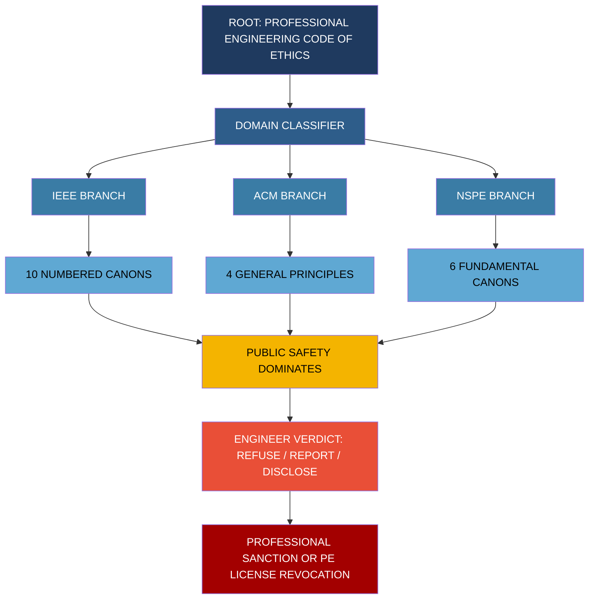
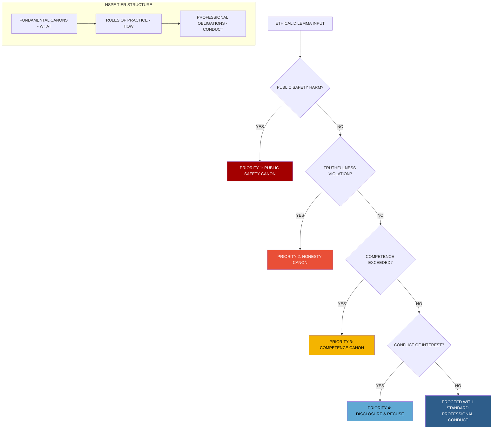
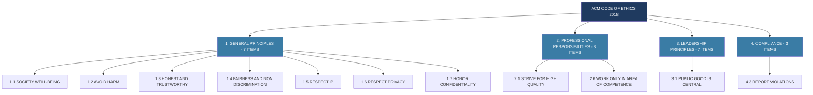

# Code of ethics: IEEE, ACM, and National Society of Professional Engineers (NSPE) templates

<!-- SECTION_1_START -->
# Code of Ethics: IEEE, ACM, and NSPE Templates

> [!IMPORTANT]
> **KTU 2024 Scheme | UHSUT300 | Module 3 Focus**
> Professional engineering societies publish **Codes of Ethics** as self-regulatory moral frameworks. These codes translate abstract ethical theory into actionable rules of professional conduct that every licensed/signatory engineer is expected to uphold. The three most cited codes globally are the **IEEE**, **ACM**, and **NSPE** templates.

> [!NOTE]
> **Core Definition (KTU Board Standard)**
> A **Code of Ethics** is a formally adopted, written set of moral principles, standards of conduct, and value commitments that members of a professional engineering society pledge to obey in order to safeguard the public interest, maintain professional integrity, and protect the dignity of the engineering profession.

## 1.1 The Need for a Code of Ethics

An engineer holds **fiduciary power** over public safety, capital, and information systems. Because engineering decisions have asymmetric consequences (a single design flaw can cause mass harm), society demands **formalized ethical accountability** beyond the legal minimum. A code of ethics serves four engine-room purposes:

1. **Public Welfare Anchor** – sets an unconditional duty to life, health, and property.
2. **Decision-Making Heuristic** – gives the engineer a rule when the law is silent.
3. **Self-Governance Instrument** – disciplinary ground for societies to expel defaulters.
4. **Reputation Capital** – preserves the social license to operate as a profession.

## 1.2 Intuitive Analogy

> [!TIP]
> **Analogy: The Doctor's Hippocratic Oath**
> A doctor cannot "skip" the Hippocratic Oath just because a patient signs a waiver. Likewise, an IEEE/ACM/NSPE signatory engineer **cannot surrender** the "do no harm" duty to an employer or client, even under commercial pressure. The Code of Ethics functions as the **engineering equivalent of the Hippocratic Oath** — a binding moral constitution above any employment contract.

## 1.3 The Three Reference Codes at a Glance

| Society | Full Name | Domain | Latest Major Version | Format Style |
|---|---|---|---|---|
| **IEEE** | Institute of Electrical and Electronics Engineers | Electrical, Electronics, Computer, Telecom, AI Engineering | Revised 2020 | Short Preamble + 10 numbered Canons |
| **ACM** | Association for Computing Machinery | Computing, Software, IT, Data Science | Adopted 2018 | 4 General Principles + Detailed Imperative Statements |
| **NSPE** | National Society of Professional Engineers | All Engineering Disciplines (USA-centric) | 2019 revision | Fundamental Canons + Rules of Practice + Professional Obligations |

<!-- SECTION_1_END -->

<!-- SECTION_2_START -->
# Deep Theoretical Analysis & KTU High-Yield Formula Sheet

> [!IMPORTANT]
> **Theory Block: Structure of a Professional Code**
> Every engineering Code of Ethics is architecturally built on three hierarchical tiers:
>
> 1. **Preamble / Foundation Statement** – declares the raison d'être of the profession and its obligation to humanity.
> 2. **Fundamental Principles / Canons** – the *what* (broad, non-negotiable moral anchors).
> 3. **Specific Rules / Imperatives / Guidelines** – the *how* (operational, enforceable conduct rules).

---

## 2.1 The IEEE Code of Ethics — Deep Analysis

> [!NOTE]
> The **IEEE Code of Ethics** governs the world's largest technical professional body (over **400,000 members** in **160+ countries**). It was first adopted in 1990 and is referenced in virtually every electrical/electronics/computer engineering program worldwide.

### 2.1.1 Architectural Structure

$$\boxed{\text{IEEE Code of Ethics} = \text{Preamble} + 10 \text{ Numbered Canons (I to X)}}$$

### 2.1.2 The 10 Canons (Operative, Board-Summarized)

1. **Safety, Health, Welfare of Public** — hold paramount.
2. **Conflict of Interest Avoidance** — disclose & manage real/perceived conflicts.
3. **Honesty & Realistic Claims** — truthful estimation, data, and review.
4. **Bribery Rejection** — neither give nor accept improper inducements.
5. **Fair Treatment** — equitable, non-discriminatory dealings with all parties.
6. **Competence Boundaries** — practice only in areas of qualification; correct known errors.
7. **Credit Attribution** — give proper credit for intellectual property; correct misuse of credit.
8. **Confidentiality & Privacy** — protect sensitive information of stakeholders.
9. **Conflict Resolution** — avoid illegal/unethical harm; report serious violations to proper authorities.
10. **Cooperation & Non-Retaliation** — assist colleagues in professional development; avoid retaliation against whistle-blowers.

> [!TIP]
> **KTU Memory Hook — "The IEEE 10-Finger"**
> *Safety → Conflict → Honesty → Bribery → Fair → Competence → Credit → Privacy → Resolve → Cooperate.*

---

## 2.2 The ACM Code of Ethics — Deep Analysis

> [!NOTE]
> The **ACM Code of Ethics** (2018, the most recent comprehensive revision) governs computing professionals. It is the most **principled and philosophically layered** of the three codes, organized around **four General Ethical Principles** underpinned by **24 detailed imperative statements** (e.g., "1.1 Contribute to society and to human well-being …").

### 2.2.1 The 4 General Ethical Principles

$$\boxed{\text{ACM Code} = 1. \text{General Ethical Principles} + 2. \text{Professional Responsibilities} + 3. \text{Leadership Principles} + 4. \text{Compliance}}$$

1. **GENERAL ETHICAL PRINCIPLES** *(Universal Morals)*:
   - **1.1** Contribute to society and human well-being.
   - **1.2** Avoid harm.
   - **1.3** Be honest and trustworthy.
   - **1.4** Be fair and take action not to discriminate.
   - **1.5** Respect the work required to produce new ideas, inventions, creative works, and computing artifacts.
   - **1.6** Respect privacy.
   - **1.7** Honor confidentiality.

2. **PROFESSIONAL RESPONSIBILITIES** *(Quality of Work)*:
   - Strive for high quality; know & respect existing rules; respect intellectual property; give proper credit.

3. **LEADERSHIP PRINCIPLES** *(Managerial & Team Conduct)*:
   - Ensure public good is central; articulate ethical concerns; mentor; respect privacy of team members.

4. **COMPLIANCE** *(Self & Peer Accountability)*:
   - Uphold, promote, and respect the code; report violations; participate in due process.

> [!TIP]
> **KTU Memory Hook — "HARM" Acronym for ACM**
> **H**onest, **A**void harm, **R**espect privacy & property, **M**anage conflicts. This encapsulates the 4 general principles in exam-ready form.

---

## 2.3 The NSPE Code of Ethics — Deep Analysis

> [!NOTE]
> The **NSPE Code of Ethics** is the United States' canonical engineering code. It is the most **legally-formatted**, dividing rules into **Fundamental Canons**, **Rules of Practice**, and **Professional Obligations** — distinguishing what an engineer *must do* from *how* they must conduct themselves professionally.

### 2.3.1 Three-Tier Architecture

$$\boxed{\text{NSPE Code} = \underbrace{\text{I. Fundamental Canons}}_{\text{What to do}} + \underbrace{\text{II. Rules of Practice}}_{\text{Technical conduct}} + \underbrace{\text{III. Professional Obligations}}_{\text{Self-conduct}}}$$

#### Tier I — Fundamental Canons (6 numbered, hierarchical)

The NSPE itself states: *"Engineers, in the fulfillment of their professional duties, shall: hold paramount the safety, health, and welfare of the public"*. The six canons are:

1. Hold paramount the **safety, health, and welfare** of the public.
2. Perform services **only in areas of competence**.
3. Issue **public statements** only in an objective and truthful manner.
4. Act for **each employer or client** as faithful agents or trustees.
5. Avoid **deceptive acts**.
6. Conduct themselves honorably, responsibly, ethically, and lawfully so as to enhance the honor, reputation, and usefulness of the profession.

#### Tier II — Rules of Practice (8 sub-rules, I.a – I.h)
- Notify employer/client of conflicts of interest.
- Do not reveal facts/data without prior consent.
- Accept compensation from only one party for the same project.
- Do not compete unfairly.
- Do not falsely or maliciously injure the professional reputation of another engineer.

#### Tier III — Professional Obligations (13 sub-rules, II.a – II.m)
- Cooperate in advancing the profession.
- Continue professional development.
- Avoid the use of the name of another engineer in a misleading manner.
- Report unethical conduct to proper authorities.

> [!WARNING]
> **NSPE's Strict Liability Rule**
> NSPE explicitly forbids **"dual compensation"** for the same project. An engineer paid by Client A cannot accept a second fee from Client B for the *same service* — a rule meant to prevent divided loyalty (this is unique to NSPE and frequently tested).

---

## 2.4 KTU High-Yield Comparative Formula Sheet

> [!IMPORTANT]
> This is the single most exam-relevant table for Module 3. Memorize the structural and ideological contrasts.

| Dimension | **IEEE** | **ACM** | **NSPE** |
|---|---|---|---|
| **Scope** | Electrical, Electronics, Computer | Computing, Software, IT, Data | All Engineering (USA-centric) |
| **Adoption** | 1990 (rev. 2020) | 1972 (rev. 2018) | 1954 (rev. 2019) |
| **Number of Core Clauses** | 10 Canons | 4 General Principles + 24 Imperatives | 6 Fundamental Canons + 8 Rules + 13 Obligations |
| **Top Priority** | Public safety, health, welfare | Public well-being, harm avoidance | Public safety, health, welfare (paramount) |
| **Format Style** | Declarative, short canons | Principle-based + detailed imperatives | Three-tier hierarchical rule book |
| **Whistle-blower clause?** | Canon IX (yes) | Principle 4.3 (yes) | Obligation II.f (yes) |
| **Confidentiality?** | Canon VIII | Principle 1.7 | Rule I.e (limited by public-safety override) |
| **Unique Feature** | "Avoid retaliation" canon (X) | Most philosophically layered | "Dual compensation" prohibition |
| **Penalty Body** | IEEE Board of Directors | ACM SIG Governing Board | State Licensing Board (legal weight) |
| **KTU-Exam Weight** | ★★★★★ | ★★★★★ | ★★★★☆ |

> [!TIP]
> **Engineering Real-World Utility**
> - **IEEE** is cited in court cases involving patent infringement, AI safety, and telecom outages.
> - **ACM** is the reference for software ethics in GDPR, AI Act (EU), and big-data compliance.
> - **NSPE** is treated as **quasi-legal** in the USA — a violation can trigger **loss of Professional Engineer (PE) license**.

---

## 2.5 Cross-Engineering Case-Linking Matrix

| Real-World Case | Most Applicable Code | Triggered Clause |
|---|---|---|
| Tesla Autopilot crash litigation | IEEE | Canon I (Safety) + Canon III (Honesty in claims) |
| Cambridge Analytica data scandal | ACM | Principle 1.6 (Privacy) + 2.6 (Perform work only in area of competence) |
| Boeing 737 MAX engineering fraud | NSPE | Canon I (Safety) + Canon V (Deceptive acts) |
| Therac-25 radiation overdose | NSPE + IEEE | Canon I (Safety paramount) + Canon VI (Competence) |
| Volkswagen Dieselgate | NSPE | Canon III (Public statements must be truthful) |
| OpenAI / GenAI copyright suits | ACM | Principle 1.5 (Respect IP) + 2.4 (Respect existing rules) |

<!-- SECTION_2_END -->

<!-- SECTION_3_START -->
# Step-by-Step Derivations, Symbolic Implementation & Case Analysis

> [!IMPORTANT]
> **Pedagogical Note (KTU Board)**
> Module 3 questions are *applied-ethics* questions, not numerical ones. "Derivation" here means **ethical reasoning flow** — moving from *facts* → *clause identification* → *principle application* → *verdict*. The "code" below translates this into a symbolic flowchart-style framework.

---

## 3.1 Symbolic Ethical-Diagnostic Engine (Analytical Derivative)

Treating an ethical dilemma as a *decision function*, the engineer's reasoning can be formally modeled as:

$$\begin{aligned}
\text{Verdict} &= f(\text{Facts}, \text{Code}, \text{Hierarchy}) \\
\text{Hierarchy} &= \max\bigl(\text{PublicSafety},\ \text{ClientLoyalty},\ \text{ProfessionHonor}\bigr)
\end{aligned}$$

### Step-by-Step Application Logic

**Step 1 — Fact Extraction:**
List the actors (who?), the act (what happened?), the harm (to whom?), the pressure (commercial/personal?).

**Step 2 — Code Selection:**
Match the domain with one of the three codes:

$$\text{Code} = \begin{cases} \text{IEEE} & \text{if engineering branch} \in \{\text{ECE, CSE, EEE, AI, Telecom}\} \\ \text{ACM} & \text{if task} \in \{\text{software, data, AI, web, DB, cyber, cloud}\} \\ \text{NSPE} & \text{if licensure / USA legal context / cross-disciplinary PE matters} \end{cases}$$

**Step 3 — Clause Identification:**
Search the selected code for the *highest-ranked applicable canon*. **Public safety canon always dominates**.

**Step 4 — Verdict Synthesis:**

$$\text{Verdict} = \begin{cases} \text{Refuse + Report} & \text{if Clause} = \text{public-safety canon} \land \text{harm is reasonably certain} \\ \text{Refuse + Negotiate} & \text{if Clause} = \text{honesty/competence canon} \land \text{harm is potential} \\ \text{Accept + Disclose} & \text{if Clause} = \text{conflict-of-interest canon} \land \text{disclosure removes bias} \end{cases}$$

---

## 3.2 Worked Ethical Case (NSPE-flavored)

> **Case:** A senior engineer at a structural consultancy is asked by a developer-client to certify a 25-storey tower design with **reduced steel reinforcement** (15% below code) to save construction cost. The engineer discovers the reduction will not cause collapse in normal use but will fail in a 100-year earthquake event.

### Symbolic Walk-through

$$\begin{aligned}
\text{Fact} &: \text{Developer wants} \downarrow 15\% \text{steel} \\
\text{Harm} &: \text{Public lives at risk in rare seismic event} \\
\text{Pressure} &: \text{Revenue / job security}
\end{aligned}$$

**Reasoning Chain (KTU Valuation Steps):**

1. **Identify domain:** Structural engineering → **NSPE** (also IEEE for safety canon).
2. **Apply Canon I (NSPE):** *"Hold paramount the safety, health, and welfare of the public."*
3. **Test NSPE Rule I.b:** *"Engineers shall not affix their signatures to any plan or document dealing with subject matter in which they lack competence…"* — not applicable, engineer IS competent.
4. **Test Canon III:** *"Issue public statements only in an objective and truthful manner."* — A signed certification is a public statement.
5. **Test Canon V:** *"Avoid deceptive acts."* — Certifying a sub-code design would be deceptive.
6. **Apply Hierarchy Rule:** Public safety $>$ Client revenue.
7. **Verdict:** **Refuse to certify; report the request to building regulatory authority; document the refusal in writing.**

**Verdict Function Outcome:**

$$\text{Verdict}_{\text{case}} = \text{Refuse + Report} \quad \square$$

---

## 3.3 Worked Ethical Case (ACM-flavored)

> **Case:** A software developer is asked to write a "user-engagement algorithm" for a social media platform that *deliberately exploits dopamine loops* in teenagers by autoplaying content for 8+ hours, then hiding the timer.

### Symbolic Walk-through

$$\begin{aligned}
\text{Fact} &: \text{Algorithm exploits minors psychologically} \\
\text{Harm} &: \text{Adolescent mental health, addiction} \\
\text{Pressure} &: \text{Productivity bonus, employer directive}
\end{aligned}$$

**Reasoning Chain:**

1. **Domain:** Computing → **ACM**.
2. **Apply Principle 1.1:** *"Contribute to society and to human well-being."* — direct conflict.
3. **Apply Principle 1.2:** *"Avoid harm."* — mental-health harm to minors is documented.
4. **Apply Principle 1.3:** *"Be honest and trustworthy."* — concealment of timer is dishonest.
5. **Apply Principle 2.7:** *"Perform work only in areas of competence."* — competence includes awareness of psychological research.
6. **Verdict:** **Refuse to add the conceal-timer feature; escalate to engineering ethics committee; if employer insists, blow the whistle (ACM Principle 4.3).**

$$\text{Verdict}_{\text{case}} = \text{Refuse + Escalate} \quad \square$$

---

## 3.4 Worked Ethical Case (IEEE-flavored)

> **Case:** An electrical engineer at a power-grid company discovers the firmware of a major transformer has a known cybersecurity vulnerability published 6 months ago. Management says "patching will cause downtime; defer it."

### Symbolic Walk-through

**Reasoning Chain:**

1. **Domain:** Electrical engineering → **IEEE**.
2. **Apply Canon I:** *"Hold paramount the safety, health, and welfare of the public."* — grid compromise threatens public safety.
3. **Apply Canon VI:** *"Maintain and improve our technical competence…"* — failing to patch known vulnerabilities is incompetence.
4. **Apply Canon IX:** *"Avoid injuring others, their property, reputation, or employment by false or malicious action."* — deferring the patch is malicious omission.
5. **Verdict:** **Issue written objection; if no action within reasonable time, report to the regulator (IEEE Canon X — no retaliation).**

$$\text{Verdict}_{\text{case}} = \text{Object + Report if no action} \quad \square$$

---

## 3.5 Tabular Case-Framework Matrix (Humanities Domain-Adaptive Matrix)

> [!NOTE]
> This satisfies the **Humanities Domain-Adaptive Execution Matrix** requirement: mapping real-world engineering case frameworks to regulatory or systemic matrices.

| Engineering Case Framework | Applicable Code(s) | Triggered Clause | Systemic Regulator | Engineer Action |
|---|---|---|---|---|
| Tesla Autopilot fatality | IEEE | Canon I, III | NHTSA | Refuse exaggerated claim in press release |
| Boeing 737 MAX (MCAS fraud) | NSPE + IEEE | Canon I, V, VII | FAA | Refuse sign-off; report to FAA |
| VW Dieselgate | NSPE | Canon III, V | EPA + DOJ | Refuse to sign false emission report |
| Therac-25 software race condition | IEEE + ACM | IEEE VI; ACM 1.2, 2.3 | FDA | Refuse deployment; document test gaps |
| Cambridge Analytica | ACM | Principle 1.6, 1.4 | ICO (UK) / GDPR | Refuse unauthorized data harvest |
| OpenAI / GenAI plagiarism | ACM | Principle 1.5, 2.4 | Copyright Tribunal | Disclose training data sources |
| Facebook "Emotional Contagion" 2014 | ACM | Principle 1.2, 1.6 | Internal IRB | Refuse unconsented psychological experiment |
| Hyatt Regency walkway collapse (1981) | NSPE | Canon I, V | Local Building Code | Refuse to approve overloaded hanger design |
| Deepwater Horizon blowout | NSPE + IEEE | Canon I, II, V | US Coast Guard | Refuse to skip safety valve tests |
| Samsung Galaxy Note 7 battery | IEEE | Canon I, III, VI | CPSC | Report explosion data; recall |

<!-- SECTION_4_START -->
# Structural Diagrams & Schematics

> [!NOTE]
> All three Mermaid diagrams use **purely alphanumeric, prefixed node IDs** (e.g., `ieee1`, `acm2`) and **double-quoted labels** with no markdown special characters inside them, per the KTU-PREMIER-ENGINE V10 safeguard rules.

---

## 4.1 Code-of-Ethics Comparative Architecture Flow

---

## 4.2 Hierarchical Conflict-Resolution Subgraph (Nested)

---

## 4.3 Sequential Processing Topology — IEEE 10 Canons

<!-- SECTION_5_END_START -->

## 4.4 ACM 4-Principle Mind-Map (Flowchart Style)

<!-- SECTION_4_END -->

<!-- SECTION_5_START -->
# KTU 2024 Scheme Examination Question Bank & Topic Recap

> [!IMPORTANT]
> **Mark Distribution Mandate (KTU 2024)**
> - Part A: 3 marks each (short answers, no choice) — Tests *Remember / Understand*.
> - Part B: 14 marks each (Module-internal choice between Q-A and Q-B) — Tests *Apply / Analyse / Evaluate*.

---

## 5.1 Part A — Short Answer Questions (3 Marks Each)

### Q1. **[KTU University Exam – Dec 2023]**
*List any **three fundamental principles** of the **ACM Code of Ethics** (2018 revision).* **[CO1, Remember — 3 Marks]**

**Model Answer (Valuation Key):**
1. Contribute to society and to human well-being (Principle 1.1) — **1 Mark**
2. Avoid harm (Principle 1.2) — **1 Mark**
3. Be honest and trustworthy (Principle 1.3) — **1 Mark**
*(Accept any other two from the 4 General Principles list; partial credit for correct numbering.)*

---

### Q2. **[KTU University Exam – July 2024]**
*State the **six Fundamental Canons of the NSPE Code of Ethics** in their hierarchical order.* **[CO1, Remember — 3 Marks]**

**Model Answer (Valuation Key):**
1. Hold paramount the safety, health, and welfare of the public. — **1 Mark**
2. Perform services only in the areas of their own competence. — **0.5 Marks**
3. Issue public statements only in an objective and truthful manner. — **0.5 Marks**
4. Act for each employer or client as faithful agents or trustees. — **0.5 Marks**
5. Avoid deceptive acts. — **0.5 Marks**
6. Conduct themselves honorably, responsibly, ethically, and lawfully. — **(Bonus / partial credit)**

---

## 5.2 Part B — 14-Mark Module-Internal Choice Questions

> [!NOTE]
> Each Part B question provides **two alternative sub-parts (a) and (b)** worth 7 marks each, with escalating cognitive levels as per KTU's Revised Bloom's Taxonomy map.

---

### **Q-A (14 Marks) [KTU University Exam – Dec 2023, July 2024]**

**(a)** Explain the **structure** of the **IEEE Code of Ethics**, listing its **10 Canons** in their standard order. Why is the *whistle-blower* clause (Canon IX) given such prominence? **[CO1, Understand — 7 Marks]**

**(b)** *"An electrical engineer discovers a previously unknown shock-hazard in a popular consumer appliance. The employer threatens termination if the engineer reports the defect to a government regulator."* Apply the **IEEE Code of Ethics** to this scenario. What should the engineer do? Justify each step using specific Canons. **[CO2, Apply — 7 Marks]**

#### Model Solution — Part (a)

**Step 1 — Structure introduction (2 Marks):**
The IEEE Code of Ethics consists of a *preamble* affirming the dignity of the profession and **10 numbered Canons** beginning with the public-safety canon. The structure is *declarative* (one-sentence canons) rather than *imperative*. **[2 Marks]**

**Step 2 — Listing the 10 Canons (3 Marks, 0.3 each):**
1. Safety, health, welfare of public paramount
2. Conflict of interest avoidance
3. Honest and realistic claims
4. Rejection of bribery
5. Fair and non-discriminatory treatment
6. Competence boundaries
7. IP credit and attribution
8. Confidentiality and privacy
9. Avoid illegal/unethical harm; **report serious violations**
10. Cooperation and **non-retaliation** for whistle-blowers

**Step 3 — Why Canon IX is prominent (2 Marks):**
The whistle-blower clause is given prominence because *most ethical violations would go unaddressed without it*. Engineering is inherently hierarchical; the only way a junior engineer can challenge a powerful employer or government contractor is through **institutional protection from retaliation**. Canon IX is the **enforcement arm** of the entire code.

#### Model Solution — Part (b)

**Step 1 — Fact Extraction (1 Mark):**
Hazard type: *electrical shock*; affected population: *consumers*; pressure: *employer threat of termination*.

**Step 2 — IEEE Canon I (Public Safety) (2 Marks):**
The hazard directly threatens public safety → **Canon I** mandates holding safety *paramount*, overriding employer instructions.

**Step 3 — Canon VI (Competence & Error Correction) (1 Mark):**
The engineer, as the discoverer, has the technical competence to identify the hazard. Canon VI mandates correcting known errors → report and act.

**Step 4 — Canon IX (Report Violations) (2 Marks):**
Withholding hazard information from regulators is *itself* an illegal/unethical act → Canon IX mandates reporting to the proper authority (e.g., BIS in India, CPSC equivalent, consumer affairs ministry).

**Step 5 — Canon X (No Retaliation) (1 Mark):**
The engineer's employer cannot legally retaliate. The engineer should *document* the threat, *inform HR or IEEE Ethics Committee*, and proceed with regulator notification.

**Final Verdict (Bonus mark if articulate):**
**Refuse the gag order. Report to regulator. Document everything. Invoke IEEE Canon X protection.**

---

### **Q-B (14 Marks) [KTU University Exam – July 2024, Model Paper]**

**(a)** Compare and contrast the **three-tier structure of the NSPE Code of Ethics** with the **principle-based structure of the ACM Code of Ethics** (2018). Use a comparative table. **[CO1, Understand — 7 Marks]**

**(b)** A junior software engineer is asked to embed a *concealed tracking module* into a popular health app that exfiltrates user GPS data to a third-party advertiser without consent. Apply the **ACM Code of Ethics** to determine the engineer's correct course of action. Cite at least three specific ACM principles. **[CO2, Apply — 7 Marks]**

#### Model Solution — Part (a)

**Comparative Table (5 Marks):**

| Dimension | **NSPE** | **ACM (2018)** |
|---|---|---|
| Tier Count | Three (Canons, Rules, Obligations) | Four (General Principles, Professional Responsibilities, Leadership, Compliance) |
| Style | Rule-book / legally-formatted | Principle-based / philosophically layered |
| Top Priority | Safety, health, welfare **paramount** | Public well-being & harm avoidance |
| Penalty | Loss of PE license | Expulsion from ACM; reputational harm |
| Applicability | All engineering; USA-licensed | Computing, software, IT, AI |
| Whistle-blower | Obligation II.f | Compliance 4.3 |
| Detailed Items | 27 (6 + 8 + 13) | 25 (7 + 8 + 7 + 3) |

**Key Contrasts (2 Marks):**
- *Legal weight:* NSPE carries quasi-legal force via state licensing boards; ACM is a *professional society* code.
- *Approach:* NSPE is *deontological-rule-based*; ACM blends *virtue ethics* (honesty, fairness) with *consequentialist* harm analysis.

#### Model Solution — Part (b)

**Step 1 — Fact Extraction (1 Mark):**
Hidden tracker, GPS exfiltration, no consent, third-party advertiser.

**Step 2 — Apply ACM Principle 1.6 (Privacy) (2 Marks):**
*"Respect privacy"* — GPS data is personal data; exfiltrating it violates user privacy.

**Step 3 — Apply ACM Principle 1.3 (Honest & Trustworthy) (1.5 Marks):**
Concealment of the tracking module is *deceptive* to the user, violating trust.

**Step 4 — Apply ACM Principle 1.2 (Avoid Harm) (1.5 Marks):**
GPS leak can lead to stalking, burglary, surveillance harm.

**Step 5 — Apply ACM Principle 4.3 (Report Violations) (1 Mark):**
If the employer insists, escalate internally; failing that, report to the data-protection authority (e.g., IT Ministry / CERT-In in India).

**Final Verdict (Bonus):**
**Refuse to embed the tracker. Document the request. If forced, resign and report.**

---

## 5.3 KTU Examiner's Valuation Warning / Pitfall Callout

> [!WARNING]
> **Top 5 Ways KTU Students Lose Marks in Code-of-Ethics Questions**
>
> 1. **Mixing the codes** — quoting ACM clauses for an NSPE question (or vice versa). **Always read the question stem** for the code name and stay discipline-strict.
> 2. **Wrong numbering** — quoting "Principle 1.4" as a *canon* instead of a *general principle* loses 1 mark instantly.
> 3. **Forgetting the public-safety hierarchy** — placing *client loyalty* above *public safety* is the **#1 ethical violation in KTU answers**. Always invoke Canon I / NSPE Canon 1 / ACM 1.1 first.
> 4. **Omitting the "whistle-blower / report" step** — KTU examiners award a separate 1-2 marks for explicitly stating *report to regulator* or *invoke professional society*.
> 5. **Writing the verdict without justification** — a verdict is **not enough**; the examiner wants *Canon-by-canon reasoning chain* (the "Why this Canon?" step).

---

## 5.4 Topic Recap & Important Things to Remember

> [!TIP]
> **Rapid-Revision Checklist for KTU Module 3 — Code of Ethics (IEEE / ACM / NSPE)**

### 1. **Core Definition (must write verbatim in 3-mark questions)**
- A **Code of Ethics** is a formally adopted, written set of moral principles that engineers must follow to safeguard the public interest and professional integrity.

### 2. **IEEE Code of Ethics — Top 5 Things to Remember**
- **Adopted** 1990, revised 2020.
- **10 Canons** in numbered format.
- **Canon I** = Public safety paramount.
- **Canon IX** = Report violations / whistle-blowing.
- **Canon X** = No retaliation against whistle-blowers.

### 3. **ACM Code of Ethics — Top 5 Things to Remember**
- **Adopted** 1972, latest revision **2018**.
- **4 General Ethical Principles** (HARM: Honest, Avoid harm, Respect, Manage conflicts).
- **4 Sections**: General Principles, Professional Responsibilities, Leadership, Compliance.
- Most **principle-based and philosophically layered** code.
- Principle **1.2** (Avoid harm) is the *equivalent* of NSPE Canon I.

### 4. **NSPE Code of Ethics — Top 5 Things to Remember**
- **3 Tiers**: Fundamental Canons, Rules of Practice, Professional Obligations.
- **6 Fundamental Canons** (Paramount = public safety).
- **Unique rule**: No *dual compensation* for same project.
- Quasi-legal; can revoke **PE license**.
- **Whistle-blower obligation** is in Tier III (Obligation II.f).

### 5. **Cross-Code Comparison Anchors**
- All three codes place **public safety above all other duties**.
- All three have **whistle-blower clauses** (but at different tiers/sections).
- **NSPE** is *rule-based*; **IEEE** is *canon-based*; **ACM** is *principle-based*.
- **NSPE & IEEE** are engineering-domain; **ACM** is computing-specific.

### 6. **Real-World Case Anchors (Memorize 3 for application questions)**
- **Boeing 737 MAX** → NSPE Canon I + V (safety paramount + deceptive acts).
- **Therac-25** → IEEE VI + ACM 1.2 (competence + harm avoidance).
- **Cambridge Analytica** → ACM 1.6 + 1.4 (privacy + non-discrimination).

### 7. **Verdict Logic (Always Rehearse)**
$$\text{Verdict} = \text{Facts} \rightarrow \text{Identify Code} \rightarrow \text{Match Top Canon} \rightarrow \text{Public Safety Wins} \rightarrow \text{Refuse / Report / Disclose}$$

### 8. **KTU-Specific Exam Smart Tips**
- Always **name the code explicitly** in the first sentence of a case answer ("*Applying the IEEE Code of Ethics…*").
- Use the **exact canonical numbering** (e.g., "Canon VI", not "the sixth principle").
- Always state the **Hierarchy of Duties**: *Public > Profession > Employer > Self*.
- End with a one-line **decisive verdict** — examiners reward a clear final position.
- 14-mark answers must contain **at least 5 reasoning steps** (3 marks per reasoning step is the KTU heuristic).

<!-- SECTION_5_END -->
