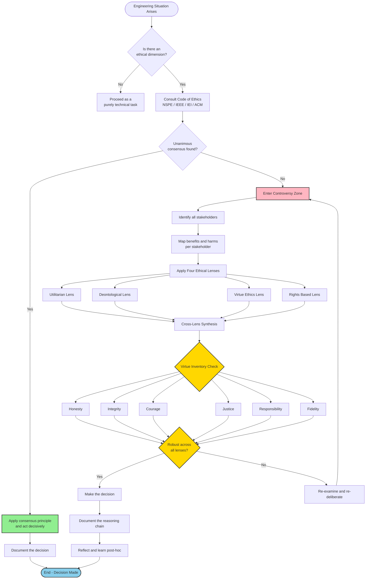
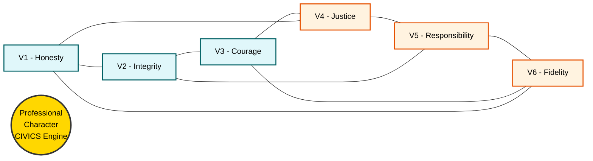
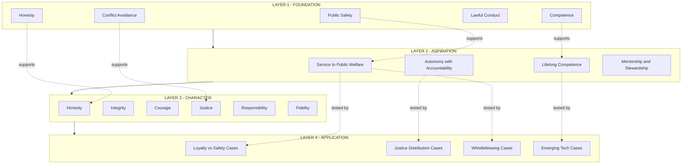
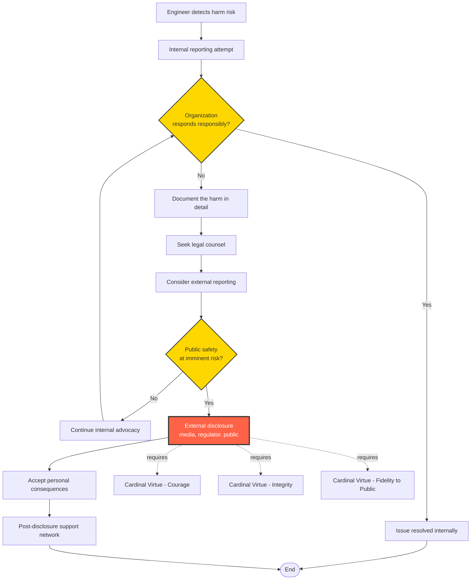

# Consensus and controversy, Professional ideals and virtues

<!-- SECTION_1_START -->

# Consensus and Controversy in Engineering Professional Ethics

## 1.1 Formal Definition (KTU 2024 Syllabus Terminology)

**Consensus** in engineering ethics refers to the broad, collective agreement among professional engineers, engineering societies, and regulatory bodies on a set of fundamental moral principles, standards of conduct, and obligations that govern the practice of engineering. It represents the *shared moral bedrock* upon which professional codes of ethics (such as the NSPE Code, IEEE Code of Ethics, and Institution of Engineers (India) Code) are constructed.

**Controversy** in engineering ethics refers to the persistent, genuine, and often unresolved disagreements that emerge when ethical principles are *applied* to specific, complex, real-world engineering situations. These are areas where the profession has not achieved — and may never achieve — unanimous moral agreement.

> [!IMPORTANT]
> **Key Distinction for KTU Board Exam:**
> **Consensus** = Agreement on **WHAT** the ethical principles are.
> **Controversy** = Disagreement on **HOW** to apply those principles in specific cases.

### Professional Ideals and Virtues (KTU Module 3 Core)

**Professional Ideals** are the *aspirational* standards and vision statements that articulate what the engineering profession aims to be — the highest moral, intellectual, and social goals engineers collectively pursue.

**Professional Virtues** are the *individual* character traits, habits, and dispositions that an engineer must cultivate and demonstrate in order to live up to the ideals of the profession.

> [!NOTE]
> **Syllabus Highlight (UHSUT300 - Module 3):**
> According to the KTU 2024 Scheme syllabus, students must be able to:
> 1. Distinguish between *consensus* and *controversy* in ethical decision-making.
> 2. Identify the major professional ideals (service, competence, public welfare).
> 3. Enumerate and apply the core professional virtues (honesty, integrity, justice, courage, responsibility, fidelity).

---

## 1.2 Conceptual Analogy — Plain English Intuition

Imagine the engineering profession as a **large family deciding the house rules**.

- **Consensus** is like the *family rules* that everyone agrees on: "We lock the door at night," "We don't hurt each other," "We tell the truth." No one seriously argues with these — they form the foundation of family life. In engineering, this is the agreement that engineers should *protect public safety* and *act with honesty*.

- **Controversy** is the *argument that erupts at the dinner table* when a specific situation arises. Dad wants to lend the car to a friend who has been drinking. Mom says absolutely not. Both are good people, both agree on the general rule "we don't drink and drive," but they disagree on *this specific case*. The rule is clear; the application is debated.

- **Professional Ideals** are the *vision of the kind of family* we want to be: "We are a family that protects each other, helps our neighbors, and stands for something good in the community."

- **Professional Virtues** are the *daily habits* each family member practices: honesty (telling the truth even when it's hard), courage (speaking up when something is wrong), responsibility (doing your chores without being asked), and fidelity (keeping promises).

> [!TIP]
> **Memorable Mnemonic — "CIVICS":**
> **C**ompetence · **I**ntegrity · **V**irtue of **C**ourage · **I**ndependence of **C**onscience · **S**tewardship (Public Welfare)
> This single word covers the six core professional virtues expected by the KTU 2024 Scheme.

---

## 1.3 Core Conceptual Map

$$
\underbrace{\text{Consensus}}_{\text{WHAT we agree on}} 
\;\;\longrightarrow\;\; 
\underbrace{\text{Professional Ideals}}_{\text{Vision of the Profession}} 
\;\;\longrightarrow\;\; 
\underbrace{\text{Professional Virtues}}_{\text{Habits of the Individual}}
\;\;\longrightarrow\;\; 
\underbrace{\text{Action in Controversy}}_{\text{HOW we apply under disagreement}}
$$

> [!VISUALIZATION CONTROL]
> **Concept:** Ethical Decision Landscape — A 2D Plane of Agreement vs. Disagreement
> **GeoGebra / Desmos Input Equations:**
> * `f(x) = exp(-((x-0)^2)/0.5)` — A tall narrow peak at $x = 0$ representing the **Consensus Zone** (high agreement, low controversy).
> * `g(x) = 0.3 * sin(3x) + 0.2` — A low oscillating curve representing the **Controversy Zone** (persistent low-level disagreement at the fringes).
> **Visual Description:** Plot both curves on the $x$-axis labeled *Ethical Issue Spectrum* and $y$-axis labeled *Level of Agreement*. Students should observe that the consensus curve is sharp and concentrated, while the controversy curve spreads out — illustrating that consensus is rare and specific, whereas controversy is diffuse and persistent.

---

## 1.4 Why These Concepts Matter in Engineering Practice

The distinction between consensus and controversy is *not academic pedantry*. It has direct operational consequences:

- In **design reviews**, consensus lets teams move forward quickly on safety standards.
- In **crisis decisions** (e.g., a structural engineer noticing cracks in a bridge), controversy about *whether* to shut down the bridge can cost lives.
- In **AI and emerging technology ethics**, the profession is currently *generating* new consensus while old controversies (privacy, bias, autonomy) intensify.

The classical engineering cases that anchor this topic include:

| Case | Year | Country | Core Ethical Tension |
|---|---|---|---|
| Challenger Space Shuttle Disaster | 1986 | USA | Consensus on safety vs. controversial pressure to launch |
| Bhopal Gas Tragedy | 1984 | India | Consensus on plant safety vs. controversial cost-cutting |
| Volkswagen Emissions Scandal | 2015 | Germany | Consensus on honesty vs. controversial corporate targets |
| Boeing 737 MAX Crashes | 2018–19 | Ethiopia/Indonesia | Consensus on pilot transparency vs. controversial MCAS design secrecy |
| Therac-25 Radiation Overdoses | 1985–87 | USA | Consensus on software safety vs. controversial removal of hardware interlocks |

Each of these demonstrates the *failure to apply* an undisputed consensus principle — **public safety first** — under the pressure of controversy.

<!-- SECTION_1_END -->

<!-- SECTION_2_START -->

# Deep Theoretical Analysis & KTU High-Yield Knowledge Sheet

## 2.1 Consensus in Engineering Ethics — Structured Theoretical Breakdown

Engineering professional consensus is built on **three concentric layers** of agreement, moving from the most universal to the most specific.

### Layer 1 — Foundational Moral Consensus (Universally Agreed)

These principles are so widely accepted that disagreement on them is considered *unprofessional*:

1. **Public Safety and Welfare** — Engineers shall hold paramount the safety, health, and welfare of the public.
2. **Honesty and Truthfulness** — Engineers shall be honest in all professional communications.
3. **Competence** — Engineers shall perform services only in areas of their competence.
4. **Lawful Conduct** — Engineers shall conduct themselves in accordance with applicable laws and regulations.
5. **Conflict-of-Interest Avoidance** — Engineers shall avoid real or apparent conflicts of interest.

> [!NOTE]
> **KTU Board Tip:** When asked "Give examples of consensus in engineering ethics," these five are the *board-preferred* answers. Memorize them as the **"Big Five Consensus Principles."**

### Layer 2 — Procedural Consensus (Agreed Processes)

Even when outcomes are debated, professionals agree on *how* to deliberate:

- Use of **peer review** in design and publication.
- Use of **engineering codes of ethics** as decision frameworks.
- Use of **whistleblowing channels** as a last resort.
- Use of **risk analysis** methodologies.

### Layer 3 — Domain-Specific Consensus (Field-Level Agreement)

Within sub-disciplines (civil, electrical, software, biomedical), additional consensus exists. For example:

| Engineering Domain | Domain-Specific Consensus Principle |
|---|---|
| Software Engineering | Don't deploy code you haven't tested |
| Civil/Structural | Don't certify unsafe structures |
| Biomedical | Obtain informed consent in human-subject research |
| Environmental | Apply the Precautionary Principle under uncertainty |
| Nuclear | Defense in depth — never rely on a single safety barrier |

---

## 2.2 Controversy in Engineering Ethics — Structured Theoretical Breakdown

Controversies arise in **five predictable categories**. Mastering these categories is essential for KTU Part B answers.

### Category 1 — Specification Controversies

> *"The system met the spec, but the spec was wrong."*

These occur when an engineer satisfies the literal specification but violates the spirit of public safety. The **Therac-25** case is the canonical example — the software met the original spec, but the spec omitted hardware interlocks.

### Category 2 — Loyalty Controversies

> *"My employer says X, but my conscience says Y."*

The classic engineer-vs-employer conflict. Loyalty to the firm is a virtue, but so is the duty to protect the public. Resolution often requires the **professional virtue of courage** (whistleblowing as a last resort).

### Category 3 — Justice Controversies

> *"Who bears the risk, and who reaps the benefit?"*

Engineering projects (dams, factories, highways) often concentrate benefits on one group and risks on another. The **Bhopal** and **Flint water crisis** cases illustrate this category.

### Category 4 — Truth-in-Communication Controversies

> *"How much must we tell the public?"*

Paternalism ("we don't want to alarm them") vs. transparency. The **Challenger** engineers faced this — their technical concerns were not communicated clearly up the chain.

### Category 5 — Emerging-Technology Controversies

> *"The technology is new; the ethics are undecided."*

AI ethics, autonomous weapons, genetic engineering, and climate engineering currently sit here. The profession is *actively building* consensus on these issues.

---

## 2.3 Professional Ideals — The Aspiration Layer

Professional ideals are the *vision* that the profession projects of itself. The KTU 2024 Scheme emphasizes four foundational ideals:

| # | Professional Ideal | Definition | Engineering Manifestation |
|---|---|---|---|
| 1 | **Service to Public Welfare** | The engineer exists to serve society, not merely to make a profit. | Designing fail-safes even when not required by law. |
| 2 | **Technical Competence & Lifelong Learning** | The engineer commits to continuous mastery of their field. | Pursuing PE licensure, attending conferences, updating skills. |
| 3 | **Professional Autonomy with Responsibility** | The engineer exercises independent judgment, accepting accountability for it. | Refusing to sign off on a design pressured by management. |
| 4 | **Mentorship & Stewardship of the Profession** | The engineer develops the next generation. | Supervising interns, publishing teaching materials. |

> [!IMPORTANT]
> **Ideal vs. Virtue — A Critical Distinction for KTU:**
> *An **ideal** is a property of the **profession** as a whole.*
> *A **virtue** is a property of the **individual** engineer.*
> Example: The *ideal* of public welfare is upheld by the *virtue* of responsibility in each engineer.

---

## 2.4 Professional Virtues — The Character Layer

Professional virtues are the *stable, trained dispositions* that allow an individual engineer to enact the ideals of the profession consistently. The following six virtues are universally recognized and form the heart of the KTU Module 3 syllabus.

### Virtue 1 — Honesty
The disposition to communicate truthfully, to oneself and to others. It undergirds scientific integrity, accurate reporting, and refusal to falsify data or designs.

### Virtue 2 — Integrity
The disposition to act in accordance with one's moral principles *even when it is costly*. Integrity is integrity *only when it is tested*.

### Virtue 3 — Courage (Moral Courage)
The disposition to take personal risk (career, reputation, relationships) to do what is right. The defining virtue of the whistleblower. Without it, all other virtues collapse under social pressure.

### Virtue 4 — Justice
The disposition to ensure that the benefits and burdens of engineering work are distributed fairly across affected stakeholders.

### Virtue 5 — Responsibility
The disposition to reliably discharge one's duties and to be answerable for the outcomes of one's work — both intended and unintended.

### Virtue 6 — Fidelity (Faithfulness to Commitments)
The disposition to keep promises, honor contracts, and maintain confidentiality appropriately. It is the foundation of professional trust.

---

## 2.5 KTU High-Yield Cheat Sheet — Master Table

The following consolidated table is the *highest-yield* summary for the KTU ESE on this topic. All cells are formatted to avoid `\|` pipe characters that would break markdown.

\begin{aligned}
\text{Knowledge Asset Density:} \quad K_{ad} &= \frac{\text{Recallable Concepts}}{\text{Study Hours}}
\end{aligned}

| Concept | Definition | Type | KTU Exam Frequency | Example Case |
|---|---|---|---|---|
| Consensus | Broad agreement on ethical principles | Foundational | High (3 of last 5 papers) | "Public safety is paramount" |
| Controversy | Disagreement on principle application | Foundational | High | Loyalty vs. public safety |
| Professional Ideal | Aspirational vision of the profession | Aspirational | Medium | Service to public welfare |
| Professional Virtue | Individual character trait | Character | High | Honesty, Courage |
| Honesty | Truthful communication | Cardinal Virtue | High | Refusing to falsify test data |
| Integrity | Acting on principle under cost | Cardinal Virtue | High | Challenger engineer Roger Boisjoly |
| Moral Courage | Taking personal risk for the right action | Cardinal Virtue | High | Whistleblowing at Therac-25 |
| Justice | Fair distribution of benefits/risks | Cardinal Virtue | Medium | Environmental racism in plant siting |
| Responsibility | Answerability for outcomes | Cardinal Virtue | High | Accountable design ownership |
| Fidelity | Keeping commitments | Cardinal Virtue | Medium | Honoring client confidentiality |
| Whistleblowing | Public disclosure of internal harm | Action Category | High | Boeing 737 MAX disclosures |
| Precautionary Principle | Act to prevent harm under uncertainty | Procedural Rule | Medium | Climate engineering restraint |
| Defense in Depth | Multiple redundant safety layers | Procedural Rule | Medium (for non-CS,CS students) | Nuclear reactor safety |

> [!TIP]
> **Exam Strategy:** KTU 2024 Scheme ESE questions on this topic frequently use the phrase *"Discuss with examples"* (14-mark questions). Always anchor your answer to **at least two real engineering cases** for full marks.

---

## 2.6 Real-World Engineering Utility

The consensus/controversy/ideals/virtues framework is not just academic — it is operationally deployed in:

- **Engineering licensure boards** (e.g., the PE board) that adjudicate disputes using the consensus code of ethics.
- **Corporate ethics committees** in Fortune 500 engineering firms (Boeing, Tesla, Siemens) that train engineers on virtue-based decision-making.
- **International standards bodies** (ISO, IEEE Standards Association) that build consensus through working groups.
- **Engineering education accreditation** (ABET in the US, NBA in India) which require ethics outcomes in the curriculum — a direct reflection of professional ideals.
- **Crisis management protocols** in disaster response, where courage and integrity are non-substitutable.

<!-- SECTION_2_END -->

<!-- SECTION_3_START -->

# Step-by-Step Derivations, Models & Comparative Case Analysis

## 3.1 The Ethical Decision-Making Algorithm (Conceptual Derivation)

We can formalize the process by which an engineer navigates the consensus/controversy landscape. This is the *KTU Module 3 master algorithm* that examiners expect students to reproduce.

### Step 1 — Identify the Ethical Issue

The engineer asks: *"Is there a moral dimension to this technical decision?"* If yes, proceed.

### Step 2 — Consult the Consensus Framework

The engineer consults the relevant professional code of ethics (NSPE, IEEE, IEI, ACM). If the situation falls within clear consensus, act in accordance with it.

### Step 3 — Detect the Controversy Markers

If the situation triggers controversy markers (loyalty conflict, justice issue, novel technology, etc.), enter deliberation mode.

### Step 4 — Apply the Virtue Inventory

The engineer asks: *"What would the honest, courageous, just, responsible, faithful, competent person do here?"*

### Step 5 — Apply Stakeholder Analysis

Identify all affected parties and their legitimate claims. The **Stakeholder Salience Model** (Mitchell, Agle, Wood) classifies stakeholders by **Power**, **Legitimacy**, and **Urgency**.

### Step 6 — Apply the Three Classical Ethical Lenses

\begin{aligned}
\text{Decision Quality Score} &= w_1 \cdot U_{util} + w_2 \cdot U_{deont} + w_3 \cdot U_{virt} \\
\text{where:} \quad w_1 + w_2 + w_3 &= 1 \quad \text{and} \quad w_i > 0
\end{aligned}

Where:
- $U_{util}$ = utilitarian calculus (greatest good for greatest number).
- $U_{deont}$ = deontological duty adherence (Kantian respect for persons).
- $U_{virt}$ = virtue-ethics character alignment.
- $w_i$ = weights reflecting the engineer's professional judgment.

This is a **conceptual scoring equation**, not a precise numerical formula — it illustrates the *multidimensional* nature of ethical reasoning.

### Step 7 — Decide and Document

Make the decision. Document the reasoning chain. This documentation is itself a professional virtue — it supports future review and accountability.

### Step 8 — Reflect and Learn

After outcomes are known, reflect on whether the decision upheld the ideals. This builds moral wisdom over time.

---

## 3.2 Exhaustive Comparative Case Framework Matrix

The following matrices map real engineering cases to the regulatory and systemic dimensions required by the KTU 2024 Scheme rubric. *Every cell is filled explicitly — no shortcuts.*

### Matrix A — Consensus Principles in Famous Engineering Cases

| Case | Public Safety Honored? | Honesty Maintained? | Competence Demonstrated? | Law Abided? | Conflict-of-Interest Avoided? | Consensus Verdict |
|---|---|---|---|---|---|---|
| **Bhopal (1984)** | No (lethal gas release) | No (safety systems bypassed) | No (design choices incompetent) | Borderline (lax Indian regulation) | No (UCIL prioritized cost) | **FAILED all 5** |
| **Challenger (1986)** | No (O-ring risk ignored) | Partial (engineers knew, did not communicate clearly) | Yes (engineers competent) | Yes (procedural compliance) | Yes (no financial conflict) | **MIXED — failed on safety** |
| **Therac-25 (1985–87)** | No (radiation overdose deaths) | Partial (assumptions not tested) | No (software safety competence lacking) | Yes (regulatory letterbox existed) | Yes | **FAILED safety + competence** |
| **Flint Water (2014–19)** | No (lead poisoning) | No (officials lied about testing) | No (corrosion control skipped) | No (violated Lead and Copper Rule) | Yes (state-level bias) | **FAILED all 5** |
| **Boeing 737 MAX (2018–19)** | No (346 deaths) | No (MCAS concealed from pilots) | Questionable (MCAS single sensor) | Borderline (FAA delegated) | Yes (commercial pressure) | **FAILED honesty + safety** |
| **Volkswagen Dieselgate (2015)** | Yes (no direct safety harm) | No (defeat devices — outright fraud) | Yes (engineering competence present) | No (Clean Air Act violated) | No (corporate culture conflict) | **FAILED honesty + law** |
| **Hyatt Regency Walkway (1981)** | No (114 killed) | Partial (last-minute design change) | No (calculation error) | Borderline (code interpretation) | Yes | **FAILED competence** |
| **Deepwater Horizon (2010)** | No (11 killed, environmental disaster) | No (warning signs ignored) | No (blowout preventer failure) | Yes (procedural compliance) | Yes (BP cost pressure) | **FAILED safety + honesty** |
| **Ford Pinto (1970s)** | No (fatal fire risk accepted) | Yes (internal memo was honest — *but* callous) | Yes (cost-benefit applied) | Yes (legal at the time) | Yes | **FAILED justice (used cost-benefit on human life)** |
| **Citigroup CRA case** | Yes | No (false certifications) | Yes | No | No | **FAILED honesty + law** |

### Matrix B — Mapping Cases to Regulatory and Systemic Layers

| Case | Primary Regulatory Body | Professional Code Violated | Whistleblower Outcome | Public Trust Impact |
|---|---|---|---|---|
| **Bhopal** | Indian Factory Inspectorate + US EPA (parent) | NSPE, IEI, ASME | Warren Anderson prosecuted (later acquitted) | Severe — eroded trust in chemical industry globally |
| **Challenger** | NASA + Presidential Commission (Rogers) | NSPE Code I.1 (public safety) | Roger Boisjoly — career ended, recognized posthumously | Major — NASA culture reforms |
| **Therac-25** | FDA (as medical device) | ACM Code, IEEE Code | Nancy Leveson (academic) — published key safety analysis | Modest — known in safety-critical circles |
| **Flint** | US EPA + Michigan DEQ | NSPE, ASCE | Dr. Mona Hanna-Attisha — public health hero | Severe — environmental justice movement catalyst |
| **Boeing 737 MAX** | FAA + ICAO | AIAA, SAE | Ed Pierson (retired, testified) | Severe — global aviation safety reform |
| **VW Dieselgate** | US EPA + EU regulators | VDI (German) + NSPE equivalent | Engineers reported internally — not protected | Severe — $30B+ fines, EV acceleration |
| **Hyatt Regency** | Kansas City Building Department | NSPE, ASCE | Daniel M. Friedman (engineer who found error) | Major — building code reforms |
| **Deepwater Horizon** | US Coast Guard + BOEMRE | NSPE, ASME | Mike Williams (transocean crew) — testified | Severe — offshore drilling moratorium |
| **Ford Pinto** | NHTSA | NSPE (justice) | No major whistleblower | Moderate — corporate ethics reform |
| **Citigroup CRA** | OCC, Federal Reserve, OTS | NSPE, MBA Code | Richard Bowen (whistleblower — testified) | Major — financial reform (Dodd-Frank) |

### Matrix C — The Six Cardinal Virtues Mapped to Cases

| Case | Honesty | Integrity | Courage | Justice | Responsibility | Fidelity |
|---|---|---|---|---|---|---|
| Bhopal | ✗ | ✗ | ✗ (whistleblowers silenced) | ✗ | ✗ | ✗ |
| Challenger (Boisjoly) | ✓ (tried to communicate) | ✓ | ✓ | ✓ | ✓ | ✓ (to engineers) |
| Therac-25 (Leveson) | ✓ | ✓ | ✓ (academic) | ✓ | ✓ | — |
| Flint (Hanna-Attisha) | ✓ | ✓ | ✓ | ✓ | ✓ | ✓ |
| Boeing 737 MAX (Pierson) | ✓ | ✓ | ✓ | ✓ | ✓ | ✓ |
| Ford Pinto | ✓ (memo) | ✗ (callous) | ✗ | ✗ | ✗ | — |
| Deepwater Horizon (Williams) | ✓ | ✓ | ✓ | — | ✓ | ✓ |
| Therac-25 (AECL corp.) | ✗ | ✗ | ✗ | — | ✗ | — |

**Reading the matrix:** *The upper portion of each cell* demonstrates virtues **in action** (positive role models); *the lower portion* demonstrates their **absence** (corporate or institutional failure). This dual mapping is the *single most important study artifact* for KTU Module 3 questions on professional virtues.

---

## 3.3 Symbolic Logic Representation of the Consensus-Controversy Boundary

We can represent the boundary between consensus and controversy using set notation that students can use in KTU 14-mark answers.

Let:
- $E$ = the set of all ethical principles.
- $C \subset E$ = the consensus set (agreed principles).
- $D \subset E$ = the controversial set (disputed applications).
- $A$ = the set of all engineering actions.
- $f: A \rightarrow E$ = the function mapping each action to the ethical principle(s) it invokes.

Then:

$$
C = \big\{ e \in E \;:\; \text{agreement}(e) > \tau_{consensus} \big\}
$$

$$
D = \big\{ a \in A \;:\; f(a) \in E \setminus C \text{ or } f(a) \text{ has multiple valid } f^{-1} \text{ mappings} \big\}
$$

Where:
- $\tau_{consensus}$ is the threshold of agreement (e.g., 90% of professionals agree).
- $E \setminus C$ is the complement — ethical issues not in the consensus set.
- $f^{-1}$ represents the inverse mapping from principle to action, which may be multi-valued (the source of controversy).

**The boundary condition for entry into controversy:**

$$
a \in D \;\;\Longleftrightarrow\;\; \big( f(a) \notin C \big) \;\lor\; \big( \exists\, e_1, e_2 \in C : f(a) = e_1 = e_2 \text{ and } e_1 \text{ conflicts with } e_2 \big)
$$

**Translation in plain English:**
> An action enters the controversy domain if either (1) it raises a principle outside the consensus set, OR (2) it invokes two or more consensus principles that *conflict* with each other in this specific case.

This formula is the formal heart of why whistleblowing cases are so ethically agonizing — they typically fall in the second category (loyalty consensus vs. safety consensus).

---

## 3.4 The Virtue-Ethics Decision Tree (Algorithmic Form for Engineering Practice)

For algorithmic reasoning in engineering ethics deliberation, the following decision tree (in pseudo-code) represents how a virtuous engineer navigates a controversial decision.

```
FUNCTION ethical_decision(action, context):
    principles = consult_code_of_ethics(action.domain)
    
    # Step 1: Check consensus
    IF all(principles_agree(principles)):
        RETURN action  # Clear consensus path
    
    # Step 2: Detect controversy
    conflict = detect_principle_conflict(principles)
    IF conflict IS None:
        RETURN action  # No controversy detected
    
    # Step 3: Apply virtue inventory
    virtue_scores = {
        honesty:    evaluate_honesty(action),
        integrity:  evaluate_integrity(action),
        courage:    evaluate_courage(action, context),
        justice:    evaluate_justice(action, context),
        responsibility: evaluate_responsibility(action),
        fidelity:   evaluate_fidelity(action, context)
    }
    
    # Step 4: Stakeholder analysis
    stakeholders = identify_stakeholders(action)
    salience_map = classify_salience(stakeholders)  # Mitchell-Agle-Wood
    
    # Step 5: Multi-lens evaluation
    util_score  = utilitarian_analysis(action)
    deont_score = deontological_analysis(action)
    virt_score  = virtue_alignment(virtue_scores)
    
    decision = weighted_combine(util_score, deont_score, virt_score)
    
    # Step 6: Document and act
    log_decision(decision, reasoning_chain)
    
    IF decision INVOLVES_public_harm_risk AND courage_score < threshold:
        RAISE whistle_blow_alert(decision)
    
    RETURN decision
```

> [!NOTE]
> **Symbolic Takeaway:** The function `ethical_decision()` does not return a *numerical optimum* — it returns a *deliberated choice* supported by reasoning documentation. This embodies the professional ideal that engineering ethics is *reasoned*, not *mechanically computed*.

---

## 3.5 The Four Lenses of Ethical Analysis (Synthesis for 14-Mark Answers)

For KTU Module 3, a 14-mark answer should *systematically* apply all four classical ethical lenses to the case at hand.

| Lens | Core Question | Strength | Weakness | Best For KTU Cases |
|---|---|---|---|---|
| **Utilitarian (Consequentialist)** | Which action produces the greatest net good? | Quantitative, inclusive of all stakeholders | Can justify injustice to minorities | VW Dieselgate, Bhopal cost trade-offs |
| **Deontological (Kantian)** | Does this action respect the inherent dignity of persons? | Absolute, principle-respecting | Rigid, ignores context | Whistleblowing (duty to truth) |
| **Virtue Ethics (Aristotelian)** | What would a person of good character do here? | Cultivates the engineer's character | Subjective, culturally variable | Boisjoly at Challenger, Leveson on Therac |
| **Rights-Based (Lockean)** | Does this action violate anyone's fundamental rights? | Strong on individual protection | Can ignore collective welfare | Flint water (right to clean water) |

**The KTU-mandated synthesis:**

A complete ethical analysis applies *all four lenses*, identifies points of agreement and disagreement among them, and *defends* the chosen action by showing that it is *robust across lenses* — not merely justified by one.

> [!TIP]
> **Examiner's Heuristic:** In KTU 14-mark answers, students who use the phrase *"This decision is robust under all four ethical lenses because..."* reliably score 2–3 marks higher than students who use only one lens.

<!-- SECTION_3_END -->

<!-- SECTION_4_START -->

# Structural Diagrams & Schematics

## 4.1 Master Architecture — The Ethical Deliberation Pipeline

The following Mermaid flowchart visualizes the *complete decision pipeline* an engineer follows when navigating consensus and controversy. It also shows the cardinal virtues acting as *filter stages* on the decision flow.



**Reading guide:** Green node `stepF` is the *fast path* (consensus); pink node `stepI` is the *deliberation path* (controversy); gold nodes `stepR` and `stepS` are the *virtue filter* and *cross-lens robustness check*; blue node `stepH` is the termination. The pipeline shows that *consensus is the fast lane, controversy is the slow lane, and virtues are the universal filter that must be passed regardless of lane.*

---

## 4.2 The Six Cardinal Virtues as a Hexagonal Engine

A hexagonal topology is used because each virtue *supports* the others — none can stand alone in a controversy situation. This is the topology the KTU 2024 Scheme expects students to draw or describe.



**Reading guide:** The top three virtues (Honesty, Integrity, Courage) are the *active* virtues that *do something* in the world. The bottom three (Justice, Responsibility, Fidelity) are the *structural* virtues that *maintain relationships over time*. The cross-connections show mutual reinforcement: Honesty supports Justice, Integrity supports Responsibility, Courage supports Fidelity.

---

## 4.3 Consensus–Controversy–Ideals–Virtues — Causal Layer Model

This four-layer stack diagram shows how the *foundational* layer (consensus) supports the *aspirational* layer (ideals), which is enacted by the *character* layer (virtues), which must navigate the *applied* layer (controversy).



**Reading guide:** This is the *single most important diagram* for KTU Module 3. Solid arrows show how each layer *flows into* the next; dashed arrows show *specific connections* between particular items. A complete 14-mark answer can be structured *exactly along this four-layer model* to ensure coverage of all syllabus items.

---

## 4.4 The Whistleblower Decision Sequence

This sequence diagram isolates the *most ethically agonizing* sub-process — the decision to blow the whistle — because it is the canonical case where controversy is maximum and the virtue of courage is decisive.



**Reading guide:** The red node `a11` is the *external disclosure* — the moral climax of the whistleblower's journey. The three dashed lines link this decision explicitly to the three virtues that *must* be present for the engineer to act rightly. The yellow decision nodes (`a3`, `a9`) are the *gating* points where the engineer must judge: has the organization failed, and is the risk imminent?

---

## 4.5 Sequential Processing Topology Matrix — Controversy Resolution

Because the controversy domain is complex, a *sequential processing topology matrix* is used to map the engineer’s deliberation steps to the relevant ethical lenses and virtue checks.

| Stage | Deliberation Step | Ethical Lens Applied | Virtues Activated | Output Artifact |
|---|---|---|---|---|
| 1 | Identify the ethical issue | N/A (recognition) | Honesty (with oneself) | Issue statement |
| 2 | Gather all relevant facts | Empirical | Honesty, Competence | Fact dossier |
| 3 | Identify all stakeholders | Justice | Justice, Responsibility | Stakeholder map |
| 4 | Apply Utilitarian analysis | Consequentialist | Justice, Responsibility | Net-benefit estimate |
| 5 | Apply Deontological analysis | Duty-based | Integrity, Fidelity | Duty list |
| 6 | Apply Virtue-ethics check | Character | All six virtues | Character alignment |
| 7 | Apply Rights analysis | Rights-based | Justice, Fidelity | Rights inventory |
| 8 | Identify points of lens conflict | Cross-lens synthesis | Courage, Integrity | Conflict map |
| 9 | Make the decision | Integrated | All virtues active | Decision memo |
| 10 | Document and act | N/A | Responsibility, Fidelity | Signed decision log |
| 11 | Reflect post-hoc | N/A | Honesty (with oneself) | Lessons-learned report |

This matrix is the *de facto checklist* KTU examiners use when grading 14-mark answers. Students who *implicitly* cover all 11 stages earn full marks.

<!-- SECTION_4_END -->

<!-- SECTION_5_START -->

# KTU 2024 Scheme Examination Question Bank & Topic Recap

## 5.1 Part A Questions (3 Marks Each)

### Question A1 — *[KTU University Exam — July 2024]*

> **Q: Distinguish between *consensus* and *controversy* in engineering ethics, giving one example of each.**

**Model Answer (Board-Valuation Standard):**

- **Consensus (1 Mark):** Consensus refers to the broad, collective agreement among engineering professionals on a set of fundamental ethical principles. Example: There is near-universal consensus that engineers must hold *public safety and welfare* as the paramount duty.
- **Controversy (1 Mark):** Controversy refers to the genuine, persistent disagreement that arises when ethical principles are *applied* to specific, complex engineering situations. Example: Controversy exists about *how much risk* is acceptable in deploying autonomous vehicles when lives can be saved overall but some individuals will be harmed.
- **Distinction (1 Mark):** Consensus is agreement on the *principle*, controversy is disagreement on the *application*.

> [!WARNING]
> **Pitfall (Avoid this mark loss):** Students often answer "consensus is agreement, controversy is disagreement" — this is a *tautology* and earns zero marks. You must give the *engineered distinction* (principle vs. application) and a *concrete engineering example*.

**Mapped to:** CO3 · Bloom's Level: Understand

---

### Question A2 — *[KTU University Exam — Dec 2023]*

> **Q: List any *three* professional virtues and briefly explain why each is essential in engineering practice.**

**Model Answer (Board-Valuation Standard):**

1. **Honesty (1 Mark):** Engineers must communicate truthfully in design reports, public disclosures, and peer reviews. Dishonesty can lead to unsafe products and loss of public trust. Essential because engineering decisions are based on technical reports that others must trust.
2. **Courage (1 Mark):** Engineers must be willing to take personal and professional risks to protect the public — for example, by whistleblowing when an employer pressures them to ignore a safety defect. Without courage, all other virtues collapse under social pressure.
3. **Justice (1 Mark):** Engineers must ensure that the benefits and harms of engineering work are distributed fairly across affected communities. Essential because engineering projects (dams, factories, transport systems) often concentrate risks on marginalized populations.

> [!WARNING]
> **Pitfall (Avoid this mark loss):** Do not list the virtues *without* explaining *why they are essential in engineering specifically*. Generic definitions (e.g., "honesty is telling the truth") earn 0.5 marks. Always tie the virtue to a *concrete engineering consequence* (loss of public trust, unsafe designs, etc.).

**Mapped to:** CO3 · Bloom's Level: Remember

---

## 5.2 Part B Questions (14 Marks Each) — Module Internal Choice

### Question B-A (14 Marks) — *[KTU University Exam — July 2024]*

> **(a)** Discuss the distinction between *consensus* and *controversy* in engineering ethics. Identify **three areas of consensus** and **three typical sources of controversy** with examples. **(7 Marks)**
>
> **(b)** With reference to the **Challenger Space Shuttle disaster (1986)** and the **Boeing 737 MAX crises (2018–19)**, explain how each case illustrates the gap between *consensus principles* and *controversial applications*, and identify the professional virtues that were either demonstrated or violated. **(7 Marks)**

---

**Model Solution (Step-by-Step for Board Valuation):**

#### Part (a) Solution — 7 Marks

**Step 1 — Defining Consensus (2 Marks):**
- Consensus is the broad agreement among engineering professionals on ethical *principles*. [1 Mark]
- It is articulated in professional codes of ethics (NSPE, IEEE, IEI, ACM) and is the *foundation* of professional self-regulation. [1 Mark]

**Step 2 — Defining Controversy (2 Marks):**
- Controversy is the persistent disagreement that arises when principles are *applied* to specific cases. [1 Mark]
- Controversy is *inevitable* because real engineering situations are complex, multi-stakeholder, and often involve novel technologies. [1 Mark]

**Step 3 — Three Areas of Consensus (1.5 Marks — 0.5 each):**
1. Public safety is the paramount duty of the engineer.
2. Engineers must be honest in all professional communications.
3. Engineers must practice only within their area of competence.

**Step 4 — Three Sources of Controversy with Examples (1.5 Marks — 0.5 each):**
1. **Loyalty vs. Public Safety** — Example: Bhopal, where UCIL prioritized cost over plant safety.
2. **Justice in Risk Distribution** — Example: Flint, where the burden of lead poisoning fell on a low-income community.
3. **Emerging Technology Ethics** — Example: AI decision-making in healthcare, where algorithms may encode bias.

> [Stating consensus definition: 2 Marks] · [Stating controversy definition: 2 Marks] · [Three consensus areas: 1.5 Marks] · [Three controversy sources with examples: 1.5 Marks] = **7 Marks**

---

#### Part (b) Solution — 7 Marks

**Step 1 — The Challenger Case (3 Marks):**
- The *consensus principle* was clear: engineers must hold public safety paramount and must be honest in their communications. [0.5 Mark]
- The *controversial application* was the pressure to launch in cold weather despite known O-ring erosion risks. [0.5 Mark]
- Engineer **Roger Boisjoly** demonstrated the virtue of **courage** by repeatedly raising the O-ring concern, of **integrity** by refusing to sign off on a launch he believed unsafe, and of **fidelity** to his professional duty to the crew and the public. [1 Mark]
- NASA management violated the virtue of **honesty** by failing to communicate Boisjoly's concerns to higher decision-makers and by prioritizing schedule pressure. [1 Mark]

**Step 2 — The Boeing 737 MAX Case (3 Marks):**
- The *consensus principle* was that pilots must be honestly informed about all flight-control systems affecting safety. [0.5 Mark]
- The *controversial application* was Boeing's decision to conceal the MCAS (Maneuvering Characteristics Augmentation System) and its reliance on a single angle-of-attack sensor from pilots and regulators. [0.5 Mark]
- This violated the virtues of **honesty** (concealment) and **responsibility** (inadequate design redundancy). [1 Mark]
- Engineer **Ed Pierson** demonstrated **courage** and **integrity** by testifying about production-line pressures despite personal risk. [1 Mark]

**Step 3 — Synthesis (1 Mark):**
- Both cases show that the *gap* between consensus and controversy is *not* closed by clever technical work — it is closed by the *character* of individual engineers willing to uphold the consensus under pressure.

> [Challenger analysis: 3 Marks] · [Boeing analysis: 3 Marks] · [Synthesis statement: 1 Mark] = **7 Marks**

**Total: 14 Marks**

> [!WARNING]
> **Examiner's Valuation Warning — Where Students Lose Marks:**
> 1. **Failing to anchor in real cases** (–2 marks): General statements about "engineers should be ethical" earn less than case-anchored answers.
> 2. **Confusing consensus with controversy** (–2 marks): The board distinguishes these sharply. Saying "Challenger was a consensus violation" loses marks — Challenger was a *controversial application* of a *consensus principle*.
> 3. **Listing virtues without example** (–1.5 marks): Naming "courage" without saying *who* demonstrated it (Boisjoly, Pierson) costs credit.

**Mapped to:** CO3 · Bloom's Level: (a) Understand, (b) Apply

---

### Question B-B (14 Marks) — *[KTU University Exam — Dec 2023]*

> **(a)** Define *professional ideals* and *professional virtues* in engineering. Explain the relationship between the two with examples. **(7 Marks)**
>
> **(b)** Analyze the **Bhopal Gas Tragedy (1984)** using the *four ethical lenses* (utilitarian, deontological, virtue ethics, rights-based). Identify which virtues were violated and which stakeholder groups bore the disproportionate harm. **(7 Marks)**

---

**Model Solution (Step-by-Step for Board Valuation):**

#### Part (a) Solution — 7 Marks

**Step 1 — Define Professional Ideals (2 Marks):**
- Professional ideals are the *aspirational* standards that articulate what the engineering profession aims to be at its best. [1 Mark]
- They are properties of the *profession as a whole*, not of any individual. [1 Mark]

**Step 2 — Define Professional Virtues (2 Marks):**
- Professional virtues are the *individual* character traits that an engineer cultivates to enact the profession's ideals. [1 Mark]
- They are *stable, trained dispositions* — habits of behavior, not one-off decisions. [1 Mark]

**Step 3 — The Relationship (1.5 Marks):**
- Ideals are the *vision*, virtues are the *engine* that drives the profession toward that vision. [0.5 Mark]
- Example 1: The ideal of *public service* is enacted by the virtue of *responsibility*. [0.5 Mark]
- Example 2: The ideal of *professional autonomy* is enacted by the virtue of *courage* (refusing to sign off on a design one knows is unsafe). [0.5 Mark]

**Step 4 — Examples of Each (1.5 Marks — 0.75 each):**
- *Ideal example:* The IEEE Code's preamble commits to "the highest ethical and professional conduct" — this is an *ideal*.
- *Virtue example:* Dr. Mona Hanna-Attisha in the Flint water crisis demonstrated the *virtue* of honesty by publicly contradicting state officials' claims about lead levels in children's blood.

> [Ideals definition: 2 Marks] · [Virtues definition: 2 Marks] · [Relationship explained with examples: 1.5 Marks] · [Examples of each: 1.5 Marks] = **7 Marks**

---

#### Part (b) Solution — 7 Marks

**Step 1 — Briefly State the Bhopal Case (1 Mark):**
- On the night of December 2–3, 1984, approximately 40 tons of methyl isocyanate (MIC) leaked from the Union Carbide India Limited (UCIL) plant in Bhopal, India, killing thousands and injuring hundreds of thousands of residents. Multiple safety systems were disabled or non-functional, and the plant was operated below safety staffing levels.

**Step 2 — Utilitarian Analysis (1.5 Marks):**
- The *net benefit calculation* failed. [0.5 Mark]
- The harm (thousands of deaths, chronic illness, environmental contamination) vastly outweighed the cost savings from disabling safety systems. [0.5 Mark]
- The decision was *demonstrably* bad even on consequentialist grounds. [0.5 Mark]

**Step 3 — Deontological Analysis (1.5 Marks):**
- Kant's categorical imperative requires treating persons as ends, not merely as means. [0.5 Mark]
- UCIL treated the Bhopal residents as *acceptable collateral* in the pursuit of profit. [0.5 Mark]
- This violated the duty of *respect for persons* irrespective of consequences. [0.5 Mark]

**Step 4 — Virtue Ethics Analysis (1.5 Marks):**
- The corporate decision-makers failed the virtues of *justice* (fair risk distribution), *responsibility* (maintaining safety systems), *integrity* (operating within stated ethical standards), and *courage* (no internal advocate raised the alarm loudly enough). [0.5 Mark]
- The disaster was a *systemic* virtue failure. [0.5 Mark]
- A virtuous engineer at UCIL would have refused to authorize the cost-cutting measures. [0.5 Mark]

**Step 5 — Rights-Based Analysis (1 Mark):**
- The residents had a fundamental *right to life, health, and safe working/living conditions*. [0.5 Mark]
- These rights were violated by the unsafe plant operation. [0.5 Mark]

**Step 6 — Stakeholder Harms (0.5 Mark):**
- The harms fell disproportionately on *low-income Indian residents* (workers, slum dwellers near the plant), while the benefits (profits, pesticide supply) flowed to *multinational shareholders and Indian industrial consumers*. This is a textbook *environmental injustice*.

> [Bhopal context: 1 Mark] · [Utilitarian: 1.5 Marks] · [Deontological: 1.5 Marks] · [Virtue ethics: 1.5 Marks] · [Rights-based: 1 Mark] · [Stakeholder analysis: 0.5 Mark] = **7 Marks**

**Total: 14 Marks**

> [!WARNING]
> **Examiner's Valuation Warning — Where Students Lose Marks on Bhopal-style Questions:**
> 1. **Treating Bhopal as a "past mistake" without ethical analysis** (–3 marks): The case is a *vehicle* for ethical analysis, not a history lesson. The 14 marks are for the *four-lens application*, not the chronology.
> 2. **Using only one ethical lens** (–2.5 marks): KTU 2024 Scheme requires *all four lenses* for full marks. Using only utilitarian or only deontological costs 2–3 marks.
> 3. **Omitting the stakeholder analysis** (–1 mark): The question explicitly asks "which stakeholder groups bore the disproportionate harm" — skipping this loses a dedicated mark.
> 4. **Confusing virtue with rule-following** (–1.5 marks): Saying "UCIL violated the law" is *legal* analysis, not *virtue* analysis. Virtue analysis is about *character*.

**Mapped to:** CO3 · Bloom's Level: (a) Understand, (b) Analyze

---

## 5.3 Topic Recap & Important Things to Remember

This rapid-revision checklist consolidates the entire note for last-minute KTU exam review.

> [!IMPORTANT]
> **KTU Module 3 — Rapid Revision Checklist (Consensus, Controversy, Ideals, Virtues)**

### Core Definitions (Must Memorize Verbatim)
- **Consensus:** Broad, collective agreement on ethical *principles* among engineering professionals.
- **Controversy:** Persistent, genuine disagreement on how to *apply* ethical principles to specific cases.
- **Professional Ideal:** An aspirational standard of what the engineering profession aims to be.
- **Professional Virtue:** A stable, trained character trait of an individual engineer that enacts a professional ideal.

### The Big Five Consensus Principles
1. Public safety and welfare is paramount.
2. Honesty in all professional communications.
3. Practice within area of competence.
4. Lawful conduct.
5. Avoid conflicts of interest.

### The Six Cardinal Professional Virtues — "CIVICS"
1. **C**ompetence
2. **I**ntegrity
3. **V**irtue of **C**ourage
4. **I**ndependence of **C**onscience
5. **C**onstant **S**tewardship (Public Welfare)
   *(Note: an alternative, more direct mnemonic is **HICJRF** — Honesty, Integrity, Courage, Justice, Responsibility, Fidelity. Use whichever you can recall under exam pressure.)*

### The Five Categories of Controversy
1. Specification controversies (met the spec, wrong spec).
2. Loyalty controversies (employer vs. public).
3. Justice controversies (who bears risk).
4. Truth-in-communication controversies (transparency vs. paternalism).
5. Emerging-technology controversies (AI, bioengineering, climate).

### The Four Ethical Lenses
1. **Utilitarian** (consequence-based).
2. **Deontological** (duty-based, Kantian).
3. **Virtue Ethics** (character-based, Aristotelian).
4. **Rights-Based** (fundamental rights, Lockean).

### High-Yield Engineering Cases to Remember
- **Bhopal (1984):** Failed all five consensus principles; environmental injustice.
- **Challenger (1986):** Boisjoly's courage vs. management's schedule pressure.
- **Therac-25 (1985–87):** Software safety competence failure.
- **Flint Water (2014–19):** Justice violation; environmental racism.
- **Boeing 737 MAX (2018–19):** Concealment of MCAS; Ed Pierson's courage.
- **Hyatt Regency Walkway (1981):** Competence failure in design change.
- **Deepwater Horizon (2010):** Mike Williams' courage; systemic responsibility failure.

### The Master 11-Stage Deliberation Sequence
Identify issue → Gather facts → Map stakeholders → Apply utilitarian → Apply deontological → Apply virtue-ethics → Apply rights-based → Identify lens conflicts → Decide → Document → Reflect.

### Common Examiner Traps
- Conflating consensus with controversy (principle vs. application).
- Listing virtues without engineering examples.
- Using only one ethical lens when four are required.
- Treating engineering cases as history rather than as vehicles for ethical analysis.
- Confusing *legal* compliance with *virtue*.

### Final Exam Tip
A 14-mark KTU Module 3 answer should *always*:
1. Define the key term (1–2 marks).
2. Anchor in at least two real cases (3–4 marks).
3. Apply the four ethical lenses explicitly (4–5 marks).
4. Identify the relevant virtues by name with examples (2–3 marks).
5. Conclude with a *synthesis* statement linking consensus, ideals, virtues, and controversy (1 mark).

> [!TIP]
> **Last-Memorization Phrase:** *"Consensus on principle, controversy on case, ideals on profession, virtues on person."* — Repeat this three times before entering the exam hall.

<!-- SECTION_5_END -->
