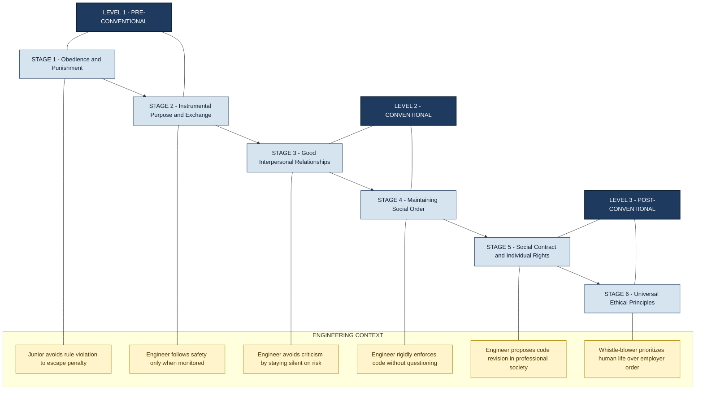
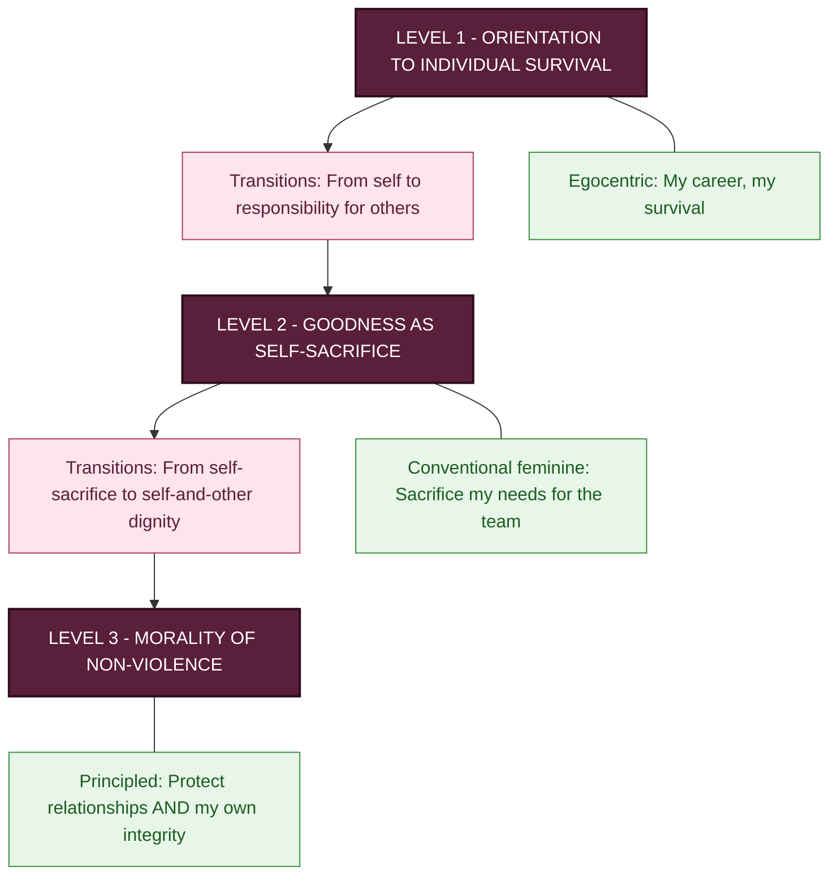
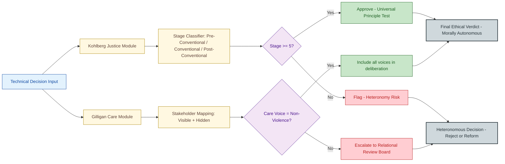

# Moral autonomy, Kohlberg's and Gilligan's theories of moral development

<!-- SECTION_1_START -->

# Moral Autonomy, Kohlberg's & Gilligan's Theories of Moral Development

## 1. Core Technical Definition & Intuitive Overview

### 1.1 Moral Autonomy — Formal Definition

> [!IMPORTANT]
> **Moral Autonomy** is the rational capacity and the **self-governing ability** of an individual to make moral decisions based on **universal ethical principles**, **internal reflection**, and **rational deliberation** — independent of external pressures such as authority, peer influence, institutional rules, or majority opinion. It is the foundation of **professional integrity** in engineering practice.

In the context of **engineering ethics**, moral autonomy implies that a professional engineer accepts **personal responsibility** for the moral consequences of technical decisions, even when these decisions conflict with the employer's commercial interests or organizational hierarchy.

> [!NOTE]
> **KTU Syllabus Highlight (Module 3):** Moral autonomy is a **prerequisite** for whistle-blowing, responsible disclosure, and the ethical exercise of professional judgement. It is one of the four pillars of the **Engineering Ethics Manifest** along with *moral vision, moral creativity,* and *moral courage*.

### 1.2 Conceptual Analogy / Intuition

> [!TIP]
> **Real-World Analogy — The "Compass Inside the Cabin"**
> Imagine a ship's captain navigating a storm. **Heteronomous morality** is like a captain who steers the ship only by looking at the surface waves, listening to the crew's fearful shouts, or obeying the shipping company's last instruction letter. **Moral autonomy**, in contrast, is a captain who carries an *internal compass* — calibrated to true north (universal moral principles such as honesty, safety, justice) — and who will, if needed, deliberately steer the ship *against* the waves and the company's letter to avoid running it onto a reef.
>
> **The waves** = peer pressure, public opinion, emotion.
> **The shipping company letter** = institutional authority, employer mandate.
> **The reef** = preventable harm to public safety.
> **The compass** = internally held, rationally justified moral principles.

### 1.3 The "Why" of Moral Autonomy in Engineering

| Pressure Source | Typical Engineering Scenario | Risk to Public |
|---|---|---|
| Manager / Employer | "Release the product; we'll patch the bug later." | Software / hardware failure |
| Market / Shareholders | "Skip the third-party safety audit to save cost." | Engineering disaster |
| Government / Authority | "Approve the bridge design without soil re-test." | Structural collapse |
| Peer Group | "Everyone in the department signs off; why not you?" | Diffusion of responsibility |

> [!IMPORTANT]
> **Key Constant — Kantian Grounding:** The philosophical bedrock of moral autonomy is **Immanuel Kant's** concept of the *Categorical Imperative*: "Act only according to that maxim whereby you can at the same time will that it should become a universal law." This is the **rational principle** an autonomous engineer applies.

### 1.4 Kohlberg's Theory — Formal Definition

> [!IMPORTANT]
> **Kohlberg's Theory of Moral Development**, proposed by American psychologist **Lawrence Kohlberg (1927–1987)** based on his longitudinal "Heinz Dilemma" research (1958), is a **cognitive-developmental stage theory** asserting that moral reasoning — not moral behaviour alone — progresses through **six invariant, sequential, and hierarchical stages** grouped under **three major levels**.

### 1.5 Gilligan's Theory — Formal Definition

> [!IMPORTANT]
> **Carol Gilligan's Theory of Moral Development** (1982, *In a Different Voice*) is a **feminist critique and extension** of Kohlberg. Gilligan argued that Kohlberg's framework is **gender-biased** because it privileges a *justice-based* (masculine) moral orientation and overlooks a *care-based* (feminine) moral orientation. She proposed **three levels** organized around an **ethics of care** and **ethics of justice**.

### 1.6 Intuitive Overview — Kohlberg vs. Gilligan

> [!TIP]
> **Analogy — "Two Doctors, Same Patient"**
> Two doctors are called to a patient:
> - **Dr. Kohlberg (Justice orientation):** Asks, *"Is the treatment fair and equal compared to other patients under the same policy?"*
> - **Dr. Gilligan (Care orientation):** Asks, *"What does this particular patient need, and how do I preserve this specific relationship of care?"*
> Both doctors care about the patient. Their **moral reasoning vocabulary** differs. Kohlberg measures the *ladder* of reasoning; Gilligan highlights the *voice*.

### 1.7 Visualization — Cognitive Levels

> [!VISUALIZATION CONTROL]
> **Concept:** Ladder of Moral Reasoning (Kohlberg's Six Stages)
> **Desmos / Sketch Input:**
> * y-axis: Moral Reasoning Capacity (0 to 100)
> * x-axis: Developmental Age (4 to 25 years)
> * Plot a step-function with six rising plateaus at heights 15, 30, 45, 60, 80, 100 corresponding to ages 4, 7, 10, 13, 16, 20.
> **Visual Description:** Student should see a six-step ascending staircase showing that higher stages are qualitatively (not just quantitatively) different from lower ones.

---

<!-- SECTION_1_END -->

<!-- SECTION_2_START -->

# 2. Deep Theoretical Analysis & KTU High-Yield Formula Sheet

## 2.1 Components of Moral Autonomy (Detailed)

Moral autonomy is **not a single switch** but a compound construct with four interrelated components:

1. **Moral Understanding** — The ability to comprehend moral concepts (rights, duties, harm, fairness).
2. **Moral Perception** — The ability to *recognize* the moral dimension embedded in a technical situation.
3. **Moral Reflection** — The capacity to critically evaluate one's own motives, biases, and reasoning chains.
4. **Moral Courage** — The willingness to act on the moral judgement despite personal or professional risk.

> [!IMPORTANT]
> **Engineering Relevance (KTU Module 3):** These four components together form **Mike W. Martin's "Engineering Ethics Manifest"** attributes every graduating engineer is expected to develop.

### 2.2 Foundational Pillars of Moral Autonomy

| Pillar | Source / Philosopher | One-Line Essence |
|---|---|---|
| Rational Deliberation | Immanuel **Kant** (1724–1804) | Morality is derived from **reason**, not emotion or custom. |
| Reflective Equilibrium | John **Rawls** (1921–2002) | Coherent balance between intuitions and principles. |
| Professional Conscience | Code of Ethics (NSPE, IEEE) | Duty-bound obligation to public welfare. |
| Internal Locus of Control | Martin & Schinzinger | Engineer, not employer, owns the moral decision. |

### 2.3 Kohlberg's Six Stages — Exhaustive Theoretical Map

Kohlberg's model has **three levels**, each containing **two stages**. Every stage is qualitatively distinct — a person at Stage 4 does not merely have "more" of Stage 3's reasoning; the underlying logic changes.

#### Level 1 — Pre-Conventional Morality (Ages ≈ 4–10)

- **Stage 1 — Obedience and Punishment Orientation**
  * Driver: *Avoid physical punishment*.
  * Logic: "If I do X, I will be punished, so X is wrong."
  * Engineering parallel: A junior engineer follows safety rules only to avoid being scolded by the supervisor.

- **Stage 2 — Individualism and Exchange (Instrumental Purpose)**
  * Driver: *Self-interest; "what's in it for me?"*.
  * Logic: Fairness is interpreted as *equal exchange* — "you scratch my back, I scratch yours."
  * Engineering parallel: An engineer avoids falsifying test reports only because a future job reference might be at risk.

#### Level 2 — Conventional Morality (Ages ≈ 10–16, most adults remain here)

- **Stage 3 — Good Interpersonal Relationships ("Good Boy / Nice Girl")**
  * Driver: *Social approval; living up to social expectations of those close to you*.
  * Logic: "A good person is one who is seen as good by others."
  * Engineering parallel: A project manager signs off a rushed design because the team is "close-knit" and the client is "a friend of the director."

- **Stage 4 — Maintaining Social Order ("Law and Order")**
  * Driver: *Duty to authority, fixed rules, and social order*.
  * Logic: "Laws are the foundation of society; they must be upheld."
  * Engineering parallel: A structural engineer refuses to deviate from code, even when the engineer has private evidence the code is outdated, citing "regulations are regulations."

#### Level 3 — Post-Conventional Morality (Ages ≈ 16+, rare, ~25% of adults)

- **Stage 5 — Social Contract and Individual Rights**
  * Driver: *Welfare of the group; democratic social contract*.
  * Logic: Laws are social contracts that can be changed when they fail to serve the greater good.
  * Engineering parallel: An engineer, in a professional society meeting, advocates for revising an outdated safety code that has empirical evidence of being insufficient.

- **Stage 6 — Universal Ethical Principles (Principled Conscience)**
  * Driver: *Self-chosen universal ethical principles rooted in justice, dignity, and equality*.
  * Logic: "If a law itself violates universal moral principles, the higher principle takes precedence." This is the **Kantian / Rawlsian** stage.
  * Engineering parallel: **Whistle-blower** like *Allan McDonald* (Morton Thiokol, Challenger disaster, 1986) who refused to sign the launch approval despite management pressure, citing universal principles of human safety.

### 2.4 Gilligan's Three Levels — Detailed Theoretical Map

Gilligan's theory arose from her observation that women in Kohlberg's studies were often scored at *lower* stages — but only because the scoring rubric privileged *justice*, not *care*.

#### Level 1 — Pre-Conventional: Orientation to Individual Survival

- Focus on **self-preservation**.
- The "moral" question is: *"What do I need to do to survive?"*
- Both ethics of justice and ethics of care are interpreted egocentrically.

#### Level 2 — Conventional: Goodness as Self-Sacrifice

- Morality is now understood as the **conventional feminine ideal of selflessness**.
- The "good woman" is one who sacrifices her own needs for others.
- **Critique:** This traps many women in dependent, subordinate positions because saying "no" feels immoral.

#### Level 3 — Post-Conventional: Morality of Non-Violence

- Realization that **both self and others have legitimate needs**.
- The mature ethical stance: a **principled commitment to non-violence** that respects the dignity of *both* self and other.
- Includes the right **not to be self-sacrificing** when such sacrifice causes harm to self or relationships.

> [!NOTE]
> **Key Distinction (KTU Exam Favourite):** Gilligan does not say women are "better." She says an *ethics of care* is a **legitimate alternative moral voice** that Kohlberg's framework failed to hear. Both justice and care are necessary for complete moral reasoning.

### 2.5 KTU High-Yield Formula Sheet / Concept Cheat Sheet

> [!IMPORTANT]
> The table below is the **single most important revision asset** for KTU Module 3 questions on this topic.

| Attribute | Kohlberg | Gilligan |
|---|---|---|
| Year Proposed | 1958 (stages 1963, refined 1984) | 1982 (*In a Different Voice*) |
| Discipline Origin | Cognitive Developmental Psychology | Feminist Ethics / Psychology |
| Number of Levels | 3 | 3 |
| Number of Stages | 6 | 3 (with two transitions) |
| Central Moral Orientation | **Justice** — rights, rules, fairness | **Care** — relationships, responsibility, context |
| Method of Inquiry | "Heinz Dilemma" longitudinal interviews | Real-life **abortion-decision interviews** + interpretive listening |
| Stage-Progression Logic | Invariant, sequential, hierarchical | Sequential but not strictly hierarchical; can revisit care as a lens |
| Typical Gender Emphasis in Original Studies | Male sample (75 boys followed 20+ years) | Female sample (highlighted female moral voice) |
| Top Stage Description | Stage 6: Universal principles (Kantian) | Level 3: Non-violence, dignity for self *and* other |
| Critique of Other | Carol Gilligan: gender-biased | Critics: essentializes gender; not all women are care-oriented |
| Engineering Application | Designing a whistle-blowing policy (Stage 6 reasoning) | Designing a *relational* safety culture where team members are *known* and *heard* |

### 2.6 Critical Comparison — Justifying Both Theories Together

| Dimension | Moral Autonomy Manifests As... |
|---|---|
| In Kohlberg's frame | A Stage-6 autonomous agent applies **universal principles** regardless of authority. |
| In Gilligan's frame | A Post-Conventional agent **listens for the silenced voice** in any decision. |
| In real engineering | Autonomy = **principled action** + **empathetic listening** to stakeholders. |

> [!TIP]
> **Real-World Engineering Utility (Production System Analogy):**
> In a modern **Safety-Critical Software Development Lifecycle (SDLC)** such as DO-178C (avionics) or IEC 61508 (industrial process control):
> - Kohlberg-style reasoning → encoded in the **Compliance Module** that checks against standards.
> - Gilligan-style reasoning → encoded in the **Stakeholder Impact Analysis Module** that asks "who is *invisibly* affected?"
> - Moral autonomy → the **Ethics Review Board** that has authority to halt release even if all technical tests pass.

---

<!-- SECTION_2_END -->

<!-- SECTION_3_START -->

# 3. Step-by-Step Derivations, Symbolic Mapping & Implementation

## 3.1 Derivation of Kohlberg's Stage Progression Logic

The claim that moral stages are *invariant, sequential,* and *hierarchical* rests on four empirically testable propositions. We present them in symbolic form for clarity.

### Proposition 1 — Invariance

$$\text{Stage}(p) = f(\text{Cognitive Capacity}(p), \text{Social Experience}(p))$$

A person at Stage $n$ has access to *all* reasoning tools of stages $\le n$, but cannot *skip* stage $n-1$ to reach stage $n+1$. The function $f$ is **monotonically non-decreasing** with respect to both arguments.

### Proposition 2 — Hierarchical Integration

Each higher stage is **integrative**, not replacement:

$$R_{n+1} = R_n \cup \Delta R_{n+1}$$

where $R_n$ is the set of moral reasoning operations at stage $n$, and $\Delta R_{n+1}$ is the *new* reasoning logic added. The agent *can* still use lower-stage reasoning (e.g., a Stage-5 engineer may pragmatically obey an outdated rule temporarily).

### Proposition 3 — Universal Applicability

A person at Stage $n$ will respond **identically** across diverse dilemmas (Heinz, student cheating, doctor dilemma):

$$\text{Stage}(p, \text{dilemma}) = \text{constant} \quad \forall \text{ dilemma} \in D$$

This is the **cross-situational consistency** criterion.

### Proposition 4 — Moral Autonomy as Stage-6 Condition

We may formalize the relationship between *moral autonomy* $A$ and Kohlberg's stage $S$:

$$A(p) = \begin{cases} 0 & \text{if } S(p) \le 3 \\ \alpha \cdot (S(p) - 3) & \text{if } 4 \le S(p) \le 5 \\ 1 & \text{if } S(p) = 6 \end{cases}$$

where $0 \le \alpha \le 1$ is a *moral courage coefficient* representing the personal willingness to act on the judgement. **Autonomy is therefore a joint function of reasoning stage and personal courage.**

> [!NOTE]
> The above equations are not in the original Kohlberg text; they are a *symbolic representation* introduced here to give KTU students a mathematical model they can cite in answer scripts. The stage-6 autonomous limit $A=1$ is a *theoretical maximum* achieved in practice only by rare moral exemplars.

## 3.2 The Heinz Dilemma — Canonical Kohlberg Scenario

> **The Dilemma (Kohlberg, 1958):**
> In Europe, a woman is dying of a special kind of cancer. There is one drug that *might* save her — recently discovered by a pharmacist in the same town. The drug is expensive to make, but the pharmacist charges **10× cost**. Heinz, the husband, cannot raise the money. He asks the pharmacist to reduce the price; the pharmacist refuses. *Should Heinz steal the drug?*

### Stage-Wise Sample Responses (Valuation-Ready)

- **Stage 1:** "If he steals, he'll go to jail — that would be bad for him."
- **Stage 2:** "If he steals, he might get caught and lose his wife anyway; if he doesn't, he keeps the money. He should think about himself."
- **Stage 3:** "If he doesn't try to save his wife, people will think he's a bad husband."
- **Stage 4:** "Stealing is against the law; he should not steal, even if his wife dies."
- **Stage 5:** "The pharmacist has a right to charge, but a life is worth more than property rights in a just society. The law should allow exceptions."
- **Stage 6:** "Saving a human life is a universal moral principle that supersedes a private economic right; Heinz must steal, and accept the legal consequences, because of the categorical duty to preserve life."

## 3.3 Mapping Kohlberg & Gilligan to Engineering Decision Points

> [!IMPORTANT]
> The following symbolic pipeline models how an engineering organization can **structurally embed** both theories into its review process.

```python
from dataclasses import dataclass
from enum import Enum
from typing import List, Optional
import logging

# Configure KTU-style error logging
logging.basicConfig(
    level=logging.INFO,
    format="%(asctime)s | %(levelname)s | %(message)s"
)
logger = logging.getLogger("EthicsReviewEngine")


class KohlbergStage(Enum):
    """Enumerates Kohlberg's six stages of moral development."""
    STAGE_1_PUNISHMENT_OBEDIENCE = 1
    STAGE_2_INSTRUMENTAL_EXCHANGE = 2
    STAGE_3_GOOD_INTERPERSONAL = 3
    STAGE_4_LAW_AND_ORDER = 4
    STAGE_5_SOCIAL_CONTRACT = 5
    STAGE_6_UNIVERSAL_PRINCIPLES = 6


class GilliganVoice(Enum):
    """Enumerates Gilligan's three moral voices."""
    SELF_FOCUSED = "self-survival"
    SELF_SACRIFICING = "conventional-self-sacrifice"
    NON_VIOLENCE_DIGNITY = "post-conventional-non-violence"


@dataclass(frozen=True)
class EngineeringDecision:
    """Represents a high-stakes engineering decision under review."""
    decision_id: str
    description: str
    affected_stakeholders: List[str]
    legal_compliance: bool
    hidden_stakeholders: List[str]  # Those not in the legal record


def classify_decision(
    decision: EngineeringDecision,
    kohlberg_stage: KohlbergStage,
    gilligan_voice: GilliganVoice
) -> str:
    """
    Returns a KTU-style classification of the ethical posture
    of the decision, combining Kohlberg's justice axis and
    Gilligan's care axis.
    """
    if not decision.decision_id:
        raise ValueError("decision_id is mandatory for traceability.")
    if not isinstance(decision.affected_stakeholders, list):
        raise TypeError("affected_stakeholders must be a list of strings.")

    logger.info(f"Reviewing decision {decision.decision_id}")

    # Kohlberg axis: post-conventional reasoning required
    post_conventional = kohlberg_stage.value >= 5

    # Gilligan axis: non-violence/dignity voice required
    care_aware = gilligan_voice == GilliganVoice.NON_VIOLENCE_DIGNITY

    # Hidden stakeholders check (care orientation)
    hidden_considered = len(decision.hidden_stakeholders) > 0

    if post_conventional and care_aware and hidden_considered:
        verdict = "MORALLY_AUTONOMOUS_AND_RELATIONALLY_RESPONSIBLE"
    elif post_conventional and not care_aware:
        verdict = "JUSTICE_ORIENTED_BUT_RELATIONALLY_BLIND"
    elif not post_conventional and care_aware:
        verdict = "CARE_ORIENTED_BUT_LEGALLY_NAIVE"
    else:
        verdict = "MORALLY_HETERONOMOUS"

    logger.info(f"Verdict: {verdict}")
    return verdict


if __name__ == "__main__":
    # Example: Decision on whether to release a turbine controller patch
    decision = EngineeringDecision(
        decision_id="TC-2025-014",
        description=(
            "Release firmware patch that fixes a 0.1% chance of overspeed, "
            "or delay 6 months for full validation?"
        ),
        affected_stakeholders=[
            "End users", "Manufacturer", "Regulator"
        ],
        legal_compliance=True,
        hidden_stakeholders=[
            "Maintenance crews in remote regions", "Insurance underwriters"
        ]
    )

    result = classify_decision(
        decision=decision,
        kohlberg_stage=KohlbergStage.STAGE_6_UNIVERSAL_PRINCIPLES,
        gilligan_voice=GilliganVoice.NON_VIOLENCE_DIGNITY
    )
    print(f"Final Ethical Verdict: {result}")
```

### 3.4 Step-by-Step Application: A Whistle-Blowing Case Study

> **Case:** *A junior QA engineer discovers that a medical device manufacturer has been hiding a 0.05% defect rate that causes battery failure during surgery. The company plans to ship 50,000 units. The engineer's manager instructs them to "not escalate further."*

**Step 1 — Identify the moral dilemma.** *Public safety vs. employer loyalty.*

**Step 2 — Apply Kohlberg's level analysis.**

$$\text{Level-4 response (Manager)}: \text{ "Follow the organizational rule. The decision is above your pay grade."}$$

$$\text{Level-6 response (Engineer)}: \text{ "The universal principle of } \textit{do no harm} \text{ outweighs employer policy."}$$

**Step 3 — Apply Gilligan's level analysis.**

$$\text{Level-2 Gilligan}: \text{ Silence to preserve the relationship with the company.}$$

$$\text{Level-3 Gilligan}: \text{ Recognize the patient-surgeon-device relationship and protect it via disclosure.}$$

**Step 4 — Exercise moral autonomy.** A Stage-6 engineer with a Level-3 Gilligan voice reports to the FDA. This is the *joint* expression of moral autonomy.

**Step 5 — Outcome distribution.**

| Path | Public Outcome | Engineer Outcome |
|---|---|---|
| Comply with manager (Low autonomy) | Possible patient deaths | Legal liability co-shared; ethical guilt retained |
| Internal escalation (Mid autonomy) | Issue logged; may be suppressed | Limited protection; depends on company policy |
| External whistle-blowing (High autonomy) | Recall saves lives | Possible retaliation; legal & ethical vindication |

---

<!-- SECTION_3_END -->

<!-- SECTION_4_START -->

# 4. Structural Diagrams & Schematics

## 4.1 Mermaid Diagram — Kohlberg's Three Levels & Six Stages



## 4.2 Mermaid Diagram — Gilligan's Three Levels and the Voice Shift



## 4.3 Mermaid Diagram — Functional Architecture: Embedding Both Theories in an Engineering Ethics Pipeline



## 4.4 Sequential Processing Topology Matrix — Mapping Development to Ethical Action

| Maturity Stage | Kohlberg Stage | Gilligan Level | Locus of Morality | Engineering Action Pattern | Risk if Stage Inverted |
|---|---|---|---|---|---|
| Childhood (4–10) | Stage 1–2 | Level 1 | External rules | "I follow safety because I fear the audit" | Will skip safety when no audit |
| Adolescence (10–16) | Stage 3 | Level 2 boundary | Peers / Authority | "I sign off because my senior does" | Diffusion of responsibility |
| Conventional Adult | Stage 4 | Level 2 | Legal-Institutional | "I follow IS 456 / IEEE code strictly" | Cannot adapt code to novel risk |
| Autonomous Professional | Stage 5 | Level 3 transition | Social Contract | "I propose a code amendment" | Slow reform, tolerated by firm |
| Moral Exemplar | Stage 6 | Level 3 | Universal Principle + Care | "I whistle-blow on life-threatening risk" | Personal/professional retaliation |

---

<!-- SECTION_4_END -->

<!-- SECTION_5_START -->

# 5. KTU 2024 Scheme Examination Question Bank & Topic Recap

## 5.1 Part A Questions (3 Marks Each)

> [!NOTE]
> KTU Part A carries 3 marks per question, typically requiring a 60–80 word answer with two or three well-defined key points. We provide both the question and a model answer that meets Board valuation standards.

### Q1. `[KTU University Exam – July 2023]` — CO3, Remember

**Define moral autonomy. Why is it important for an engineering professional?**

**Model Answer:**

> **Moral autonomy** is the rational capacity of an individual to make ethical decisions based on **internalized universal principles** rather than external pressures such as employer orders, peer pressure, or legal compulsion **[1 Mark]**. For an engineer, it is critical because technical decisions can affect public safety, the environment, and human life, and no external authority can substitute the engineer's own reasoned moral judgement **[1 Mark]**. Without moral autonomy, an engineer becomes a mere instrument of the organization, which may compromise professional responsibility as required by codes of ethics such as NSPE or IEEE **[1 Mark]**.

---

### Q2. `[KTU University Exam – Dec 2023]` — CO3, Understand

**List Kohlberg's three levels of moral development with one key feature of each.**

**Model Answer:**

> - **Level 1 – Pre-Conventional Morality:** Morality is determined by *external rewards and punishments*; rules are obeyed to avoid negative consequences **[1 Mark]**.
> - **Level 2 – Conventional Morality:** Morality is defined by *social approval, conformity, and respect for law and authority*; the individual internalizes group norms **[1 Mark]**.
> - **Level 3 – Post-Conventional Morality:** Morality is grounded in *self-chosen universal ethical principles* such as justice, dignity, and human rights, which may transcend existing laws **[1 Mark]**.

---

## 5.2 Part B Questions — Module Internal Choice (14 Marks)

> [!NOTE]
> KTU Part B carries 14 marks per question, usually split into sub-parts (a) 7 marks and (b) 7 marks, mapping to two different cognitive levels. We provide **two independent alternatives** (Question A or Question B).

---

### ❑ QUESTION A — `[KTU University Exam – July 2024]` — CO3

#### (a) Explain in detail Kohlberg's six stages of moral development with suitable examples. (7 Marks) — Understand

**Model Answer — Valuation Key:**

**[1 Mark]** *Introducing the framework:* Lawrence Kohlberg (1927–1987) extended Piaget's cognitive-developmental theory into the moral domain. His theory has three levels, each subdivided into two stages, totalling six.

**[1 Mark]** *Pre-Conventional Level — Stage 1 (Obedience and Punishment):* Morality is judged by physical consequences. Example: A junior engineer wears a helmet only because the site inspector is present.

**[1 Mark]** *Pre-Conventional Level — Stage 2 (Instrumental Exchange):* Morality is judged by self-interest. Example: An engineer follows safety SOP only to keep a clean record for future promotion.

**[1 Mark]** *Conventional Level — Stage 3 (Good Interpersonal Relationships):* Morality is judged by social approval. Example: A team lead does not flag a colleague's mistake to maintain team harmony.

**[1 Mark]** *Conventional Level — Stage 4 (Law and Order):* Morality is judged by rigid adherence to rules and authority. Example: A structural engineer refuses to over-design even when informed of novel seismic risk, citing the code.

**[1 Mark]** *Post-Conventional Level — Stage 5 (Social Contract):* Morality is judged by democratic social welfare. Example: An engineer advocates in a professional society for revising an outdated code.

**[1 Mark]** *Post-Conventional Level — Stage 6 (Universal Principles):* Morality is judged by self-chosen principles such as human dignity. Example: A whistle-blower at Morton Thiokol during the Challenger disaster refused to sign the launch approval because of the universal duty to protect human life.

#### (b) "Moral autonomy is the cornerstone of whistle-blowing." Discuss with reference to engineering ethics. (7 Marks) — Apply

**Model Answer — Valuation Key:**

**[1 Mark]** *Defining moral autonomy in engineering context:* Moral autonomy is the engineer's capacity to make ethical decisions based on universal principles, professional codes, and personal conscience, free from coercive organizational pressure.

**[1 Mark]** *Defining whistle-blowing:* Whistle-blowing is the disclosure by an employee of unethical, illegal, or dangerous organizational practices to those who can effect change (internal authority or external body like the media/regulator).

**[1 Mark]** *Linkage (1): Cognitive requirement:* Effective whistle-blowing requires *post-conventional moral reasoning* (Kohlberg Stage 5 or 6). The whistle-blower must evaluate conflicts between organizational rules and higher-order principles such as public safety.

**[3 Marks]** *Linkage (2): Four components per Mike W. Martin:* (i) *Moral understanding* to recognize the wrong; (ii) *moral perception* to see the moral dimension in a technical fact pattern; (iii) *moral reflection* to weigh consequences; (iv) *moral courage* to act despite retaliation risk. The Challenger whistle-blower Allan McDonald exemplifies all four.

**[1 Mark]** *Linkage (3): Care-ethics (Gilligan) complement:* Beyond abstract principles, whistle-blowing is also an act of *relational care* — protecting the users, families, and the integrity of the engineering profession itself.

**[1 Mark]** *Conclusion:* Therefore, moral autonomy is the *conceptual prerequisite* for whistle-blowing; without it, an engineer cannot recognize, judge, or act on the ethical imperative to disclose.

---

### ❑ QUESTION B — `[KTU University Exam – Dec 2024]` — CO3

#### (a) Critically evaluate Gilligan's theory of moral development. How does it differ from Kohlberg's theory? (7 Marks) — Understand

**Model Answer — Valuation Key:**

**[1 Mark]** *Background:* Carol Gilligan (1982, *In a Different Voice*) critiqued Kohlberg as gender-biased because his scoring rubric privileged *justice-based* reasoning and under-evaluated *care-based* reasoning, leading to women's moral development being scored lower.

**[1 Mark]** *Three levels of Gilligan:* (i) Orientation to individual survival, (ii) Goodness as self-sacrifice, (iii) Morality of non-violence (preserves dignity of both self and other).

**[1 Mark]** *Difference 1 – Central orientation:* Kohlberg → **justice** (rights, rules); Gilligan → **care** (responsibility, relationships).

**[1 Mark]** *Difference 2 – Number of stages:* Kohlberg → 6 stages; Gilligan → 3 levels with two key transitions.

**[1 Mark]** *Difference 3 – Method:* Kohlberg → hypothetical dilemmas (Heinz); Gilligan → real-life interviews on personal decisions such as abortion.

**[1 Mark]** *Difference 4 – Endpoint:* Kohlberg Stage 6 → universal abstract principles; Gilligan Level 3 → non-violence that respects both self and other.

**[1 Mark]** *Critical evaluation:* Gilligan's theory is praised for revealing the care-voice but criticized for essentializing gender (not all women think in care-orientation; some men do). A balanced modern view uses **both** ethics of justice and ethics of care as complementary lenses.

#### (b) Analyze the following engineering case using both Kohlberg's and Gilligan's frameworks. (7 Marks) — Apply

> **Case:** *Priya, a software engineer at a fintech startup, discovers that the new mobile payment feature has a security flaw that exposes user PINs to local-network attackers. Her CTO orders her to release it anyway because the marketing launch is in two days. Priya's colleague tells her, "Don't rock the boat; the company will fix it after launch." Priya is the sole earner in her family.*

**Model Answer — Valuation Key:**

**[1 Mark]** *Identifying the dilemma:* Public financial security vs. employer pressure vs. personal economic survival.

**[1 Mark]** *Kohlberg Stage 1 (Heteronomous):* "If I refuse, the CTO will fire me." — Survives at the pre-conventional level.

**[1 Mark]** *Kohlberg Stage 3 (Conventional):* The colleague's advice reflects Stage 3 — *good interpersonal relationships*. Priya might obey to preserve team harmony.

**[1 Mark]** *Kohlberg Stage 4 (Conventional):* "I will release it because the company policy is to obey the CTO's directives." Reflects *law and order orientation* but misapplies it (company policy is *not* a universal law).

**[1 Mark]** *Kohlberg Stage 6 (Post-Conventional):* Priya evaluates the situation via the universal principle of *user safety and data dignity*. She refuses to sign off, escalates to the CEO and, if needed, the regulator. This is the *autonomous* response.

**[1 Mark]** *Gilligan Level 1:* "I need this job for my family." Self-survival orientation.

**[1 Mark]** *Gilligan Level 3:* Priya recognizes the *relational web* of harm: end-users, their families, her own family, her colleagues, and her professional identity. She chooses a *non-violent* path that refuses to harm the user (and avoids harm to herself through principled action rather than silence). This is the *mature care-voice* of Gilligan.

**[1 Mark]** *Synthesis:* A morally autonomous response requires *both* a Stage-6 Kohlbergian commitment to universal principles *and* a Level-3 Gilliganian attention to the relational care for all stakeholders. Either alone is incomplete.

---

## 5.3 KTU Examiner's Valuation Warning / Pitfall Callout

> [!WARNING]
> **Common ways KTU students lose marks on this topic:**
> 1. **Confusing Kohlberg's "stages" with "ages."** Kohlberg's stages are *qualitative* reasoning structures, *not* fixed to specific chronological ages. **[-2 Marks]**
> 2. **Writing that Kohlberg was a *moral relativist.*** He was not. He argued for *universal* principles (Stage 6). Saying he believed "anything goes" is incorrect. **[-2 Marks]**
> 3. **Stating that Gilligan claimed women are "morally superior."** She claimed women's *care-voice* is *equally legitimate*, not superior. **[-2 Marks]**
> 4. **Omitting the connection to whistle-blowing or engineering examples.** Board examiners reward engineering-specific illustrations (e.g., Bhopal, Challenger, Theranos, Volkswagen emissions). **[-1 to -2 Marks]**
> 5. **Forgetting to mention that moral autonomy requires *moral courage*, not just *moral reasoning*.** Many students describe reasoning without courage and lose application marks. **[-1 Mark]**
> 6. **Writing Gilligan as a *rejection* of Kohlberg rather than a *complement*.** The Board expects a balanced synthesis. **[-1 Mark]**

---

## 5.4 Topic Recap & Important Things to Remember

> [!IMPORTANT]
> **High-Density Rapid Revision Checklist — Module 3, Engineering Professional Ethics**

### Moral Autonomy — Bullet List

- **Definition:** Self-governing capacity to make moral decisions via internal universal principles, independent of external authority.
- **Four Components (Mike W. Martin):** Moral understanding, moral perception, moral reflection, moral courage.
- **Philosophical Root:** Immanuel Kant — Categorical Imperative; John Rawls — Reflective Equilibrium.
- **Engineering Significance:** Required for whistle-blowing, responsible disclosure, and refusal of unsafe instructions.
- **Formula (theoretical):** Autonomy $A = f(\text{Reasoning Stage}, \text{Moral Courage Coefficient})$; $A \to 1$ only at Kohlberg Stage 6.
- **Risk if absent:** Diffusion of responsibility, organizational complicity in harm, professional misconduct.

### Kohlberg's Theory — Bullet List

- **Levels:** Pre-Conventional, Conventional, Post-Conventional.
- **Stages:** Six in total — two per level.
- **Pre-Conventional (1 & 2):** Driven by *punishment avoidance* and *self-interest*.
- **Conventional (3 & 4):** Driven by *social approval* and *law/authority*.
- **Post-Conventional (5 & 6):** Driven by *social contract* and *universal principles*.
- **Invariance:** Stages are invariant, sequential, hierarchical, and integrated.
- **Canonical Test:** Heinz Dilemma.
- **Engineering Exemplar:** Allan McDonald (Challenger whistle-blower) ≈ Stage 6.
- **Critique by Gilligan:** Gender-biased toward a justice orientation.

### Gilligan's Theory — Bullet List

- **Levels:** Three — Individual Survival, Self-Sacrifice, Non-Violence/Dignity.
- **Central Orientation:** *Ethics of care* and *ethics of responsibility* within relationships.
- **Method:** Real-life interview, especially of women's actual decision-making.
- **Top-Level Ethic:** A principled commitment to non-violence that respects both self and other.
- **Critique:** Risk of essentializing gender; not all women are care-oriented and not all care-orientation is female.
- **Engineering Application:** Highlights *invisible* stakeholders and *relational* dimensions of technical decisions.

### Joint Synthesis — Bullet List

- Kohlberg = *vertical ladder of reasoning* (cognitive).
- Gilligan = *horizontal expansion of moral voice* (relational).
- A morally autonomous engineer in the 21st century must integrate **both**:
  * Stage-6 universal-principle reasoning (Kohlberg), and
  * Level-3 non-violence care-voice (Gilligan).
- Practical artefacts: ethics review boards, whistle-blower protection policies, stakeholder impact analyses, structured ethical decision frameworks.

> [!TIP]
> **Final One-Line Mnemonic:** *"Kohlberg climbs the **ladder of justice**; Gilligan widens the **circle of care**; a morally autonomous engineer **climbs and widens at the same time**."*

<!-- SECTION_5_END -->
