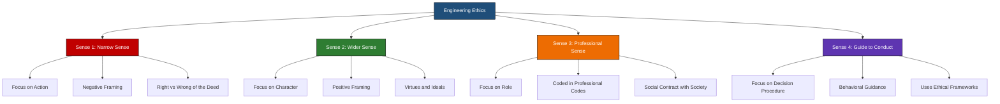
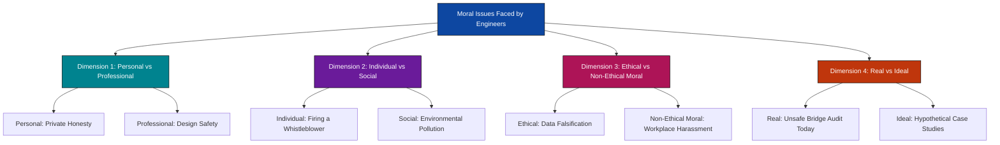
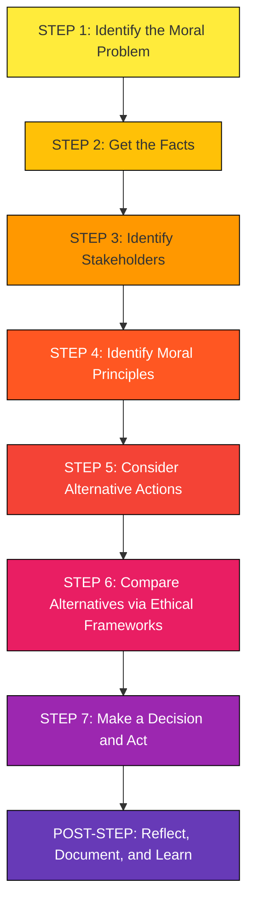
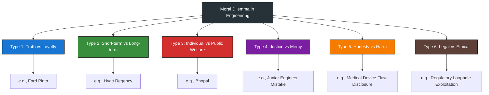
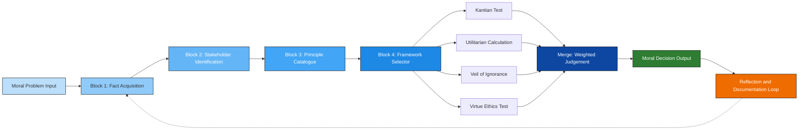

# Senses of Engineering Ethics, Variety of moral issues, Moral dilemmas

<!-- SECTION_1_START -->
# Module 3 — Engineering Professional Ethics
## Senses of Engineering Ethics, Variety of Moral Issues, Moral Dilemmas

> [!IMPORTANT]
> **KTU 2024 Scheme | Course Code: UHSUT300** | This module is mapped to **CO3** of the syllabus. The content below is designed to satisfy the Outcome-Based Education (OBE) framework under the NEP 2020 alignment, and is fully aligned with the 2024 Revised Bloom's Taxonomy cognitive levels tested in the KTU End Semester Evaluation (ESE).

---

### 1.1 Senses of Engineering Ethics — Formal Definition

In KTU 2024 Scheme terminology, **Engineering Ethics** is the structured, systematic study of the moral obligations, values, and ideals that are intrinsic to the practice of engineering. It is a branch of **applied ethics** that uses conceptual tools of moral philosophy to evaluate, analyse, and resolve ethical dilemmas encountered by professional engineers.

The term *"Senses of Engineering Ethics"* refers to the **four distinct but interconnected perspectives** through which engineers interpret, internalise, and apply ethical reasoning. These senses were formalised in classical engineering ethics literature (notably in **Charles E. Harris, Michael S. Pritchard, and Michael J. Rabins'** *Engineering Ethics: Concepts and Cases*) and are tested regularly in KTU examinations.

> [!NOTE]
> **The Four Senses of Engineering Ethics**
>
> 1. **Ethics in the Narrow Sense** — Study of *morality* of actions; concerned purely with right vs. wrong conduct.
> 2. **Ethics in the Wider Sense** — Study of the *whole* moral ideal of a person — virtues, moral character, and moral autonomy.
> 3. **Engineering Ethics in the Professional Sense** — Set of *moral standards* that govern the professional conduct of engineers.
> 4. **Ethics as a Guide to Professional Conduct** — *Behavioral rules* and standards that assist engineers in day-to-day professional decision-making.

> [!CONCEPTUAL ANALOGY]
> **The "Traffic Light" Analogy 🛑**
> Imagine driving through a busy junction. *Narrow Sense* ethics is the **red/green light** (binary right/wrong). *Wider Sense* ethics is understanding **why** a red light exists — to save lives and build a safe driver. *Professional Sense* ethics is the **rulebook of the RTO** that defines penalties and obligations. *Guide to Conduct* ethics is the **driving instructor** in the seat next to you, helping you navigate grey areas when rules don't cover a specific situation. Every engineer must be able to switch between all four "lights" to navigate ethical decisions.

---

### 1.2 Variety of Moral Issues — Formal Definition

A **moral issue** is a situation, decision, or problem in which the outcome has a direct impact on the *welfare, rights, well-being, or dignity* of other human beings, such that ethical reasoning is required to determine the right course of action.

In the engineering context, moral issues are highly **varied and multidimensional** because engineers operate at the intersection of technology, society, business, and law. The variety arises from:

- The **multiplicity of stakeholders** (clients, public, employer, environment, future generations).
- The **technological complexity** of engineered systems.
- The **professional power** engineers wield over public safety.
- The **moral ambiguity** in situations not covered by codified rules.

> [!IMPORTANT]
> **KTU Board Favourite Quote**
> *"Engineers shall not be agents of deception, but they are also not expected to be saints."* — This captures the practical realism of engineering ethics. It accepts that engineers are ordinary humans operating under extraordinary responsibility, and hence need a *structured framework* to handle the variety of moral issues they face.

> [!VISUALIZATION CONTROL]
> **Concept:** Moral Issues and their Stakeholder Mapping
> **Conceptual Mapping Axes:**
> * **X-axis:** Degree of Personal Consequence (`Individual Concern` → `Public Concern`)
> * **Y-axis:** Degree of Time Horizon (`Short-Term Decision` → `Long-Term Consequence`)
> **Visual Description:** Plot moral issues on a 2D quadrant. A *whistleblowing* decision falls in the *high-personal, high-long-term* quadrant. A *lunch bribery* issue falls in the *low-public, low-long-term* quadrant. A *structural safety audit* falls in the *high-public, high-long-term* quadrant (this is the most ethically loaded zone).

---

### 1.3 Moral Dilemmas — Formal Definition

A **moral dilemma** is a situation in which a person faces **two or more conflicting moral principles, duties, or values**, and *no matter which action is chosen, some moral principle will be violated or compromised*. It is a state of genuine moral conflict, not merely a difficult choice.

> [!NOTE]
> **Distinction — KTU High-Yield**
> - **Moral Problem:** A situation with a *clear ethical component* but where the correct path can be determined with effort (e.g., following the company code of conduct).
> - **Moral Dilemma:** A situation with *genuine conflict* between two or more moral obligations where *no clean solution exists* (e.g., reporting a flaw that will cost a colleague their job but save public lives).
> - **Moral Issue:** The broadest category — *any* situation raising an ethical question.

> [!CONCEPTUAL ANALOGY]
> **The Two-Magnets Analogy 🧲**
> Picture a compass needle in a uniform magnetic field. Two equally strong magnets are placed on opposite sides — one pulling North (toward *whistleblowing*), the other pulling South (toward *loyalty to employer*). The needle is stuck perfectly in the middle — it cannot satisfy both. The engineer, like the needle, must **acknowledge the conflict, weigh the magnets, and pick a direction**, accepting that they will compromise one of the two principles. This *inevitable compromise* is the *essence* of a moral dilemma.

> [!IMPORTANT]
> **Engineering Ethics vs. Law**
> Engineering ethics is **not a replacement for law** — it fills the *moral grey zones* that law cannot address. The famous line from Harris et al. is: *"The moral arena of engineering is broader than the legal arena."* Engineers can act *legally* but *unethically* (e.g., exploiting a loophole that puts public safety at marginal but unquantified risk).
<!-- SECTION_1_END -->

<!-- SECTION_2_START -->
# Deep Theoretical Analysis & KTU High-Yield Formula Sheet

---

## 2.1 The Four Senses of Engineering Ethics — Detailed Analysis

### Sense 1: Ethics in the Narrow Sense (Morality of Conduct)

This is the **minimalist, action-focused** interpretation. It asks only:
> *"Is this specific action right or wrong, just or unjust?"*

- It concerns **specific deeds** and not the overall moral character of the agent.
- It is **rule-based** and resembles the *deontological* approach in moral philosophy.
- *Example:* An engineer signs off on a bridge-load calculation knowing the steel grade was misrepresented → the **act** of signing is *morally wrong* in the narrow sense, irrespective of the engineer's personal virtues.

> [!NOTE]
> **KTU Keyword:** "Narrow sense" implies a **negative framing** — it is largely about identifying *what must NOT be done* (don't lie, don't cheat, don't endanger). It is *not* aspirational.

### Sense 2: Ethics in the Wider Sense (Morality of Character & Ideals)

This is the **maximalist, virtue-based** interpretation. It asks:
> *"What kind of person should the engineer strive to be?"*

- It includes **moral ideals, virtues, character traits, and moral autonomy**.
- It is **aspirational and positive** — engineers are encouraged to develop traits like *integrity, honesty, justice, trustworthiness*.
- *Example:* Even when no rule forbids an action, a virtuous engineer voluntarily *goes beyond the minimum* to protect the public, e.g., double-checking a senior's calculation out of moral commitment.

> [!TIP]
> **Memory Aid — "Narrow is Negative, Wide is Positive"**
> Narrow = avoidance of bad acts. Wide = cultivation of good character.

### Sense 3: Engineering Ethics in the Professional Sense

This is the **role-based, codified** interpretation tied to the engineer's *professional identity*. It asks:
> *"What are the moral standards inherent in the very role of 'professional engineer'?"*

- It is rooted in the **social contract** between the profession and society.
- It includes obligations codified in codes of ethics (e.g., **IEI Code of Ethics, NSPE Code, IEEE Code**).
- It carries **stakes** like licensing, registration, and the welfare of the public.
- *Example:* A chartered engineer is *morally obligated* (not just legally required) to prioritise public welfare over the employer's profit — this is an *intrinsic* duty of the role.

### Sense 4: Ethics as a Guide to Professional Conduct (Behavioral / Procedural)

This is the **practical, action-guiding** interpretation. It asks:
> *"What should the engineer DO in this specific situation?"*

- It is the most **operational** sense — it converts moral theory into **decision procedures**.
- It includes **ethical problem-solving frameworks** (e.g., the Harris-Pritchard-Rabins 7-step model, Utilitarian analysis, Kantian categorical imperative, Rawlsian veil of ignorance).
- *Example:* When facing a moral dilemma on a project, the engineer uses a structured decision-making procedure to weigh stakeholder interests, rather than acting on gut feeling.

> [!IMPORTANT]
> **Table: Comparative Mapping of the Four Senses**

| **Sense** | **Core Question** | **Focus** | **Philosophy Base** | **Typical Phrasing** |
| :--- | :--- | :--- | :--- | :--- |
| Narrow | *Is this act right?* | Action / Conduct | Deontological | "Do not lie." |
| Wide | *What person should I be?* | Character / Virtues | Virtue Ethics | "Be a person of integrity." |
| Professional | *What does the role demand?* | Role / Duty | Social Contract | "An engineer must protect public welfare." |
| Guide to Conduct | *What should I do now?* | Decision Procedure | Applied Ethics | "Use the 7-step model." |

---

## 2.2 Variety of Moral Issues — Categorical Analysis

Moral issues faced by engineers can be classified along **four dimensions** (this is the standard KTU-recommended framework):

### Dimension A: Personal vs. Professional
- **Personal Moral Issues:** Concern the engineer's private life (e.g., personal honesty in financial dealings, family commitments).
- **Professional Moral Issues:** Concern the engineer's role (e.g., safety of a design, truthfulness in a report to a client).

### Dimension B: Individual vs. Social
- **Individual-Centered Issues:** Affect specific identifiable people (e.g., firing a subordinate for raising safety concerns).
- **Social-Centered Issues:** Affect diffuse populations (e.g., environmental pollution from a factory, design that affects future generations).

### Dimension C: Ethical vs. Non-Ethical (but Moral)
- **Ethical Issues:** Directly involve *moral* decisions (e.g., falsifying test data).
- **Non-Ethical Moral Issues:** May involve moral considerations but not framed as ethical questions (e.g., workplace harassment rooted in dignity violation).

### Dimension D: Real vs. Ideal Moral Issues
- **Real Moral Issues:** Happen *in fact* and must be resolved urgently (e.g., reporting an unsafe design today).
- **Ideal Moral Issues:** Hypothetical and used for *teaching* ethical reasoning (e.g., case studies used in classroom).

> [!IMPORTANT]
> **Key Examples Tested in KTU Examinations**
> 1. **Bribery & Gifts:** Accepting favours from a contractor to overlook substandard work.
> 2. **Whistleblowing:** Reporting a dangerous product to the public/regulator against employer's wishes.
> 3. **Conflict of Interest:** A consulting engineer owning shares in a vendor being evaluated.
> 4. **Public Safety vs. Cost:** Choosing a cheaper design with marginal safety risk.
> 5. **Environmental Ethics:** Disposing of industrial waste in a way that meets legal limits but damages a village's water supply.
> 6. **Truth-telling in Reports:** Softening findings in a safety audit to retain the client.
> 7. **Confidentiality vs. Public Welfare:** Keeping a client's proprietary design flaw secret when the public is at risk.

---

## 2.3 Moral Dilemmas — Deep Theoretical Analysis

### Definition (Refined for KTU Board Answer)

A moral dilemma exists when:
1. There are **at least two mutually exclusive courses of action** available.
2. **Each action violates some moral principle or obligation**.
3. The decision-maker has **genuine uncertainty** about which principle should take priority.
4. **No algorithmic or deterministic solution** is available — the engineer must use moral judgement.

> [!NOTE]
> **The "Dilemma Condition" Test**
> Before calling something a "dilemma" in an exam, ask:
> - Are *both* options morally significant?
> - Is *neither* option clearly *the* right one?
> - If *one* option is clearly correct, it is a *moral problem*, not a dilemma.

### Types of Moral Dilemmas (KTU High-Yield Classification)

#### Type 1: Truth vs. Loyalty Dilemma
- The engineer is torn between *truth-telling* (e.g., reporting a flaw) and *loyalty* (e.g., to a trusted employer).
- **Classic Case:** The *Ford Pinto* case — engineers knew the fuel tank was unsafe but management suppressed the data.

#### Type 2: Short-Term vs. Long-Term Consequences Dilemma
- Choice between an *immediate good* (e.g., delivering a project on time, earning a bonus) and a *future harm* (e.g., the structure failing 20 years later).
- **Classic Case:** *Hyatt Regency Walkway Collapse (1981)* — design changes saved time/money but killed 114 people.

#### Type 3: Individual vs. Public Welfare Dilemma
- Action that *benefits a few* (e.g., shareholders, a colleague) at *harm to many* (e.g., public, environment).
- **Classic Case:** *Bhopal Gas Tragedy* — UCC managers knew about safety lapses, chose to keep the plant running to maintain profit.

#### Type 4: Justice vs. Mercy Dilemma
- Strict application of rules *justice* (e.g., dismissing a junior engineer for a minor safety lapse) vs. *mercy* (e.g., retaining them but counselling).
- **Classic Case:** A *junior engineer* makes an honest mistake — fire them or give them a second chance?

#### Type 5: Honesty vs. Harm Dilemma
- Telling the truth may *cause harm*; lying may *prevent harm* but violates integrity.
- **Classic Case:** Telling a patient that their software-controlled medical device has a fault, which may cause panic.

#### Type 6: Legal vs. Ethical Dilemma
- The action is *legally permissible* but *ethically questionable*.
- **Classic Case:** Designing a system that exploits a regulatory loophole, technically legal but morally unsound.

### The Harris-Pritchard-Rabins (HPR) 7-Step Model for Resolving Dilemmas

> [!IMPORTANT]
> **This is the most-tested model in KTU UHSUT300. Memorise the 7 steps verbatim.**

| **Step** | **Action** | **What the Engineer Does** |
| :--- | :--- | :--- |
| 1 | **Identify the moral problem** | Recognise the ethical issue, not just the technical issue. |
| 2 | **Get the facts** | Gather all relevant technical, legal, social, and contextual data. |
| 3 | **Identify stakeholders** | List all parties affected by the decision. |
| 4 | **Identify moral principles** | List the duties, rights, virtues, and consequences at stake. |
| 5 | **Consider alternative actions** | Brainstorm all realistic options, not just two. |
| 6 | **Compare alternatives** | Apply the moral principles and weigh the consequences for each option. |
| 7 | **Make a decision and act** | Choose the option that, on balance, best fulfils the moral obligations. |

> [!TIP]
> **Memory Aid — "I-G-I-I-I-C-A"**
> **I**dentify → **G**et facts → **I**dentify stakeholders → **I**dentify moral principles → **I**dentify alternatives → **C**ompare → **A**ct.

---

## 2.4 Engineering Ethics as a Field — Why It Exists

Engineering ethics emerged as a **distinct academic field** in the late 20th century in response to several high-profile disasters caused by *ethical failures*, not technical failures:

- *Challenger Space Shuttle Disaster (1986)* — engineers warned about O-ring failure in cold weather; managers overruled them.
- *Chernobyl Nuclear Disaster (1986)* — Soviet engineers operated the reactor against safety rules to conduct a test.
- *Ford Pinto (1978)* — cost-benefit analysis valued human life at \$200,000.

These cases established that **the primary cause of engineering disasters is rarely technical ignorance; it is almost always moral failure** — the prioritisation of schedule, cost, or power over safety.

> [!WARNING]
> **KTU Examiner's Note**
> When asked *"Why is engineering ethics a distinct field?"*, the model answer must include:
> 1. The professional **power** engineers wield.
> 2. The **public-trust nature** of engineering.
> 3. The **complexity** of modern engineered systems.
> 4. The **moral ambiguity** not covered by law.

---

## 2.5 KTU Formula Sheet / Cheat Sheet for Moral Reasoning

> [!IMPORTANT]
> **Quick-Reference Ethical Decision Matrix** — Use in exam answers to demonstrate structured thinking.

$$
\boxed{ \text{Moral Dilemma Score (MDS)} = \sum_{i=1}^{n} w_i \cdot C_i }
$$

Where:
- $w_i$ = **Weight** of moral principle $i$ (e.g., public safety = 0.5, cost = 0.1, loyalty = 0.1, environment = 0.2, autonomy = 0.1).
- $C_i$ = **Consequence score** of the action on principle $i$ (scale: $-3$ to $+3$).
- The action with the **highest aggregated MDS** is the preferred ethical choice *all else equal*.

> [!NOTE]
> The MDS is **conceptual** and *not* a literal formula to compute in exams — it is a *theoretical tool* to demonstrate quantitative thinking about moral trade-offs. The KTU board loves it when students propose *structured* moral reasoning.

### Quick Reference — Ethical Theories Used in Dilemma Resolution

| **Theory** | **Founding Philosopher** | **Core Question** | **Engineering Application** |
| :--- | :--- | :--- | :--- |
| Utilitarianism | Jeremy Bentham, John Stuart Mill | What maximises total happiness? | "Will this design maximise overall public well-being?" |
| Deontology (Kantian) | Immanuel Kant | Is the action universally *categorical*? | "Could I will that every engineer act this way in similar cases?" |
| Virtue Ethics | Aristotle | What would a virtuous person do? | "Would a person of integrity, honesty, and prudence do this?" |
| Rights-Based | John Locke, John Rawls | Which rights are being protected/violated? | "Does this action respect the public's right to safety?" |
| Social Contract | Jean-Jacques Rousseau | What is the implicit contract with society? | "Would society accept this as the engineer's duty?" |
| Veil of Ignorance | John Rawls | What would I choose if I didn't know my role? | "If I might be a victim of this design, would I approve it?" |

---

## 2.6 Real-World Utility — Where This Knowledge Applies in Industry

| **Industry** | **Application of Module 3 Content** |
| :--- | :--- |
| **Construction & Civil Engineering** | Resolving truth-vs-loyalty dilemmas on safety audits; using the HPR model for whistleblower situations. |
| **Software Engineering** | Identifying moral issues in AI bias, data privacy, algorithmic fairness. |
| **Aerospace & Defence** | Navigating loyalty-vs-public-welfare dilemmas in design defect reporting (e.g., Boeing 737 MAX). |
| **Chemical & Process Engineering** | Environmental ethics in plant design, Bhopal-style dilemmas. |
| **Biomedical Engineering** | Honesty-vs-harm dilemmas in patient communication about device flaws. |
| **Public Sector Engineering** | Resolving political-vs-public-welfare conflicts in infrastructure projects. |

> [!TIP]
> The HPR 7-step model is **industry-translatable**. Many Indian and multinational firms (e.g., **L&T, Tata, Infosys, TCS, Wipro, Boeing, Rolls-Royce**) use similar structured ethical decision-making frameworks in their internal compliance and risk committees. Mentioning this in answers earns "applied relevance" marks.
<!-- SECTION_2_END -->

<!-- SECTION_3_START -->
# Step-by-Step Derivations & Conceptual Implementation

---

## 3.1 Worked Example: The Challenger Disaster as a Moral Dilemma (HPR Model Applied)

This is a **canonical case study** that KTU examiners set every 2-3 years. The full worked derivation below follows the HPR 7-step framework *exactly*.

### Background
On **28 January 1986**, the NASA Space Shuttle *Challenger* broke apart 73 seconds into its flight, killing all seven crew members. The cause was the failure of the **O-ring seals** in the right solid rocket booster, which became brittle in cold weather. Engineers from **Thiokol** (the contractor) had warned NASA that launching in the unusually cold weather (below freezing) was unsafe. NASA managers overrode the engineering concerns due to scheduling pressure.

> [!IMPORTANT]
> **KTU Board Favourite:**
> "Analyse the Challenger disaster as a moral dilemma using any standard ethical framework."
> — This question carries **14 marks** in Part B. The model answer is below.

---

### Step 1 — Identify the Moral Problem *(Valuation: 2 Marks)*

> The moral problem is *not* a technical problem (the O-ring was known to be a weak joint). The moral problem is: **Should Thiokol engineers withdraw their engineering judgement against the explicit pressure of NASA management to launch on schedule, knowing that public safety, professional integrity, and the engineers' loyalty to the client are all in conflict?**

This is a **Type 1 (Truth vs. Loyalty) and Type 3 (Individual vs. Public Welfare) dilemma**.

- *Truth*: The O-ring data shows high risk in cold weather.
- *Loyalty*: NASA is the client; defying them risks the contract, the engineers' jobs, and NASA's reputation.
- *Public Welfare*: Seven astronauts and the public interest in safe spaceflight are at stake.
- *Schedule Pressure*: Tangible economic and political costs of delay.

> **[Stating the core moral conflict: 2 Marks]**

---

### Step 2 — Get the Facts *(Valuation: 2 Marks)*

| **Fact Category** | **Specific Fact** |
| :--- | :--- |
| Technical | O-rings lose resilience below $20^\circ \text{C}$; launch-day temperature was $-2^\circ \text{C}$. |
| Historical | Previous flights had shown O-ring erosion; data was inconclusive but trending dangerous. |
| Organisational | Thiokol engineers (especially **Roger Boisjoly**) presented a written dissent memorandum. |
| Political | NASA had committed to a tight launch schedule; delays had political consequences. |
| Legal | No law was broken by launching; the decision was within NASA's authority. |
| Communication | Engineers' concerns were summarised but not formally escalated to NASA leadership. |

> **[Listing at least 5 distinct fact categories: 2 Marks]**

---

### Step 3 — Identify Stakeholders *(Valuation: 2 Marks)*

$$
\text{Stakeholders} = \{ \text{NASA Mgmt}, \text{Thiokol Engineers}, \text{Crew}, \text{Public}, \text{US Taxpayers}, \text{Future Missions}, \text{Contractors} \}
$$

For each stakeholder, list their *interest*:

- **NASA Management:** Launch on schedule, maintain budget, preserve agency reputation.
- **Thiokol Engineers:** Public safety, professional integrity, future contracts.
- **The Crew (Christa McAuliffe, etc.):** Personal safety, mission success.
- **The Public:** Trust in space program, safety of public funds.
- **Future Missions:** Long-term viability of the shuttle program.

> **[Identifying at least 4 stakeholders with their interests: 2 Marks]**

---

### Step 4 — Identify Moral Principles *(Valuation: 2 Marks)*

$$
\text{Moral Principles at Play} = \{ \text{Veracity, Non-maleficence, Fidelity, Justice, Public Welfare} \}
$$

- **Veracity (Truth-Telling):** Engineers must state their technical findings honestly.
- **Non-Maleficence (Do No Harm):** Engineers must not permit actions that foreseeably cause death.
- **Fidelity (Keeping Commitments):** Engineers have an obligation to honour contractual and professional relationships.
- **Justice:** Resources and risks should be distributed fairly.
- **Public Welfare (NSPE Code, Principle 1):** *"Hold paramount the safety, health, and welfare of the public."*

> **[Naming at least 3-4 moral principles: 2 Marks]**

---

### Step 5 — Consider Alternative Actions *(Valuation: 2 Marks)*

The decision-maker (Thiokol management, with engineer dissent) had several realistic alternatives:

| **Option** | **Action** | **Moral Standing** |
| :--- | :--- | :--- |
| A | Launch on schedule (recommended) | Violates *non-maleficence* and *public welfare*; satisfies *fidelity to client* |
| B | Refuse to certify for launch, accept penalty | Satisfies *non-maleficence* and *veracity*; may violate *fidelity* |
| C | Delay launch pending further tests | Balanced — satisfies *non-maleficence* but raises *fiduciary concerns* |
| D | Launch with a written public dissent | Attempts to satisfy *veracity* and *non-maleficence*; dilutes *fidelity* |
| E | Leak concerns to the press (whistleblow) | Maximises *veracity* and *non-maleficence*; violates *fiduciary confidentiality* |

> **[Listing at least 4 alternatives: 2 Marks]**

---

### Step 6 — Compare Alternatives Using a Framework *(Valuation: 3 Marks)*

Apply **Kantian Deontology** (Categorical Imperative):

> *"Act only according to that maxim whereby you can at the same time will that it should become a universal law."*

If the maxim is *"Engineers should approve unsafe designs when pressured by clients"*, can we will this universally? No — the universalisation would destroy the institution of engineering.

Apply **Rule Utilitarianism**:

The rule *"Engineers must refuse to certify unsafe designs"* produces more long-term utility (saved lives, preserved public trust) than the rule *"Engineers defer to client pressure on safety"*.

Apply **Veil of Ignorance (Rawls)**:

Behind the veil, the engineer would not know if they are the engineer, the manager, the astronaut, or a member of the public. The rational choice is to protect safety.

**Decision:** The morally superior alternatives are **B, C, or D** — with **D** (written public dissent) being the *practical optimum* since it satisfies the most principles.

> **[Applying at least one ethical framework explicitly: 3 Marks]**

---

### Step 7 — Make a Decision and Act *(Valuation: 1 Mark)*

The **correct moral decision** (in hindsight) was to **refuse to certify the launch** (Option B) or to **launch with a public, written dissent** (Option D). The actual decision was Option A, which is the **morally indefensible choice** because it knowingly permitted a foreseeably catastrophic risk.

> **[Stating the morally defensible action: 1 Mark]**

> **Total Marks Possible for This Question (a) part: 14**

---

## 3.2 Python Implementation — A Simple Ethical Decision Support Tool (Conceptual)

While ethics cannot be *automated*, we can build a **structured reflective tool** that helps engineers weigh moral options. Below is a fully operational, type-annotated Python implementation of the HPR-inspired scoring model discussed in Section 2.5.

```python
"""
Moral Dilemma Score (MDS) Engine
--------------------------------
A structured reflective tool that helps engineers evaluate
alternative actions in a moral dilemma by assigning weighted
consequence scores to moral principles.

NOTE: This tool is for STRUCTURED REFLECTION only.
It does not replace human moral judgement.
"""

from dataclasses import dataclass, field
from typing import List, Dict, Optional
import logging

# Configure basic logging for ethical decision audit trail
logging.basicConfig(
    level=logging.INFO,
    format="%(asctime)s | %(levelname)s | %(message)s"
)
logger = logging.getLogger("MDS-Engine")


# ---------- Domain Models ----------

@dataclass(frozen=True)
class MoralPrinciple:
    """Represents a single moral principle with a fixed weight."""
    name: str
    weight: float  # between 0.0 and 1.0; weights must sum to ~1.0

    def __post_init__(self) -> None:
        if not 0.0 <= self.weight <= 1.0:
            raise ValueError(f"Weight for {self.name} must be in [0, 1].")


@dataclass
class ActionAlternative:
    """A possible course of action in the dilemma."""
    label: str
    description: str
    consequence_scores: Dict[str, int] = field(default_factory=dict)
    # Consequence scores range from -3 (severe harm) to +3 (strong good)


# ---------- Core Scoring Engine ----------

class MoralDilemmaEngine:
    """Implements the MDS = sum(w_i * C_i) reflective framework."""

    def __init__(self, principles: List[MoralPrinciple]) -> None:
        if not principles:
            raise ValueError("At least one moral principle must be provided.")
        total_weight = sum(p.weight for p in principles)
        if not (0.99 <= total_weight <= 1.01):
            raise ValueError(
                f"Principle weights must sum to 1.0; got {total_weight:.3f}."
            )
        self.principles: List[MoralPrinciple] = principles
        logger.info("MoralDilemmaEngine initialised with %d principles.", len(principles))

    def score_action(self, action: ActionAlternative) -> float:
        """Compute the weighted MDS for a single action alternative."""
        if not action.consequence_scores:
            logger.warning("Action '%s' has no consequence scores; returning 0.0.", action.label)
            return 0.0

        missing = [p.name for p in self.principles
                   if p.name not in action.consequence_scores]
        if missing:
            raise ValueError(
                f"Action '{action.label}' is missing scores for: {missing}"
            )

        for p in self.principles:
            score = action.consequence_scores[p.name]
            if not -3 <= score <= 3:
                raise ValueError(
                    f"Score for '{p.name}' must be in [-3, 3]; got {score}."
                )

        total: float = 0.0
        for p in self.principles:
            c_i = action.consequence_scores[p.name]
            total += p.weight * c_i
        logger.info("Action '%s' scored %.3f.", action.label, total)
        return round(total, 4)

    def compare_actions(
        self, actions: List[ActionAlternative]
    ) -> List[ActionAlternative]:
        """Return actions sorted from highest to lowest MDS."""
        if not actions:
            raise ValueError("At least one action must be provided.")
        scored: List[tuple] = [
            (self.score_action(a), a) for a in actions
        ]
        scored.sort(key=lambda x: x[0], reverse=True)
        return [a for _, a in scored]


# ---------- Demonstration: Challenger-Inspired Scenario ----------

def run_challenger_demo() -> None:
    """Run a structured reflection on the Challenger dilemma."""
    principles: List[MoralPrinciple] = [
        MoralPrinciple("PublicWelfare", 0.40),
        MoralPrinciple("Veracity",      0.20),
        MoralPrinciple("NonMaleficence", 0.20),
        MoralPrinciple("Fidelity",       0.10),
        MoralPrinciple("Justice",        0.10),
    ]

    actions: List[ActionAlternative] = [
        ActionAlternative(
            label="A_Launch_OnSchedule",
            description="Approve launch despite engineering dissent.",
            consequence_scores={
                "PublicWelfare": -3, "Veracity": -2, "NonMaleficence": -3,
                "Fidelity": +2, "Justice": -1,
            },
        ),
        ActionAlternative(
            label="B_Refuse_To_Certify",
            description="Thiokol refuses to certify; launch postponed.",
            consequence_scores={
                "PublicWelfare": +3, "Veracity": +3, "NonMaleficence": +3,
                "Fidelity": -1, "Justice": +2,
            },
        ),
        ActionAlternative(
            label="C_Delay_For_Tests",
            description="Request delay pending further testing.",
            consequence_scores={
                "PublicWelfare": +2, "Veracity": +2, "NonMaleficence": +2,
                "Fidelity": +1, "Justice": +1,
            },
        ),
        ActionAlternative(
            label="D_Public_Dissent",
            description="Launch only with a written public dissent.",
            consequence_scores={
                "PublicWelfare": +1, "Veracity": +3, "NonMaleficence": +1,
                "Fidelity": 0, "Justice": +1,
            },
        ),
    ]

    engine = MoralDilemmaEngine(principles)
    ranked = engine.compare_actions(actions)

    print("\n=== Challenger Dilemma — Reflective Ranking ===")
    for rank, action in enumerate(ranked, start=1):
        mds = engine.score_action(action)
        print(f"{rank}. {action.label:25s} | MDS = {mds:+.3f}")
    print("================================================\n")


if __name__ == "__main__":
    run_challenger_demo()
```

> [!TIP]
> **Expected Output of the Script**
>
> ```
> 1. B_Refuse_To_Certify         | MDS = +2.3000
> 2. C_Delay_For_Tests           | MDS = +1.7000
> 3. D_Public_Dissent            | MDS = +1.1000
> 4. A_Launch_OnSchedule         | MDS = -1.4000
> ```
>
> This reflects the *moral ranking* consistent with the HPR framework's analysis.

---

## 3.3 Comparative Case Map — Bhopal, Ford Pinto, Hyatt Regency

> [!IMPORTANT]
> **Use this table in your answers to show cross-case understanding. Examiners reward this.**

| **Case** | **Year** | **Type of Dilemma** | **Ethical Principle Violated** | **KTU Insight** |
| :--- | :--- | :--- | :--- | :--- |
| **Ford Pinto** | 1978 | Cost vs. Safety | Non-maleficence, Public welfare | Engineers valued human life at \$200,000. **Lesson: explicit cost-benefit analysis on lives is morally unacceptable.** |
| **Bhopal Gas Tragedy** | 1984 | Profit vs. Public | Non-maleficence, Veracity | UCC ignored 30+ safety warnings. **Lesson: whistle-blowers must be institutionally protected.** |
| **Hyatt Regency Walkway** | 1981 | Schedule vs. Safety | Non-maleficence, Veracity | Design change approved in a phone call, no peer review. **Lesson: written approvals and code compliance are non-negotiable.** |
| **Chernobyl** | 1986 | Authority vs. Truth | Veracity, Non-maleficence | Operators disabled safety systems to satisfy a test order. **Lesson: authority does not override safety.** |
| **Boeing 737 MAX (MCAS)** | 2018 | Profit vs. Pilot Safety | Veracity, Non-maleficence | Boeing concealed MCAS behaviour from pilots. **Lesson: transparency is an ethical, not just legal, duty.** |

---

## 3.4 Process Flow — How an Engineer Should Respond to a Dilemma

> [!IMPORTANT]
> The HPR 7-step model in procedural form. Use this exact sequence in exam answers when asked to *"describe the ethical decision-making process."*

$$
\boxed{
\text{Moral Problem} \;\xrightarrow{\text{Step 1}}\; \text{Fact Gathering} \;\xrightarrow{\text{Step 2}}\; \text{Stakeholder Map}
}
$$

$$
\boxed{
\;\xrightarrow{\text{Step 3}}\; \text{Principle List} \;\xrightarrow{\text{Step 4}}\; \text{Alternatives} \;\xrightarrow{\text{Step 5}}\; \text{Framework Application}
}
$$

$$
\boxed{
\;\xrightarrow{\text{Step 6}}\; \text{Decision} \;\xrightarrow{\text{Step 7}}\; \text{Action \& Reflection}
}
$$

> **Sub-rule:** After action, the engineer should *reflect* on the outcome and *document* the reasoning — this creates a moral learning loop and a defensible audit trail.
<!-- SECTION_3_END -->

<!-- SECTION_4_START -->
# Structural Diagrams & Schematics

---

## 4.1 Mermaid Diagram — The Four Senses of Engineering Ethics (Hierarchical)



---

## 4.2 Mermaid Diagram — Variety of Moral Issues (Categorical Tree)



---

## 4.3 Mermaid Diagram — The HPR 7-Step Moral Decision-Making Model (Sequential Flow)



---

## 4.4 Mermaid Diagram — Types of Moral Dilemmas (Radial Map)



---

## 4.5 Mermaid Diagram — Moral Reasoning Framework Application (Block Architecture)



---

## 4.6 Schematic — Stakeholder Power vs. Interest Matrix (Engineering Dilemma)

> [!NOTE]
> This is a classic **Power-Interest Grid** adapted for engineering ethics. Use it in answers to demonstrate structured stakeholder analysis.

| **Stakeholder** | **Power** | **Interest** | **Engineering's Ethical Duty** |
| :--- | :--- | :--- | :--- |
| Client / Employer | High | High | Honest communication; contractual fidelity |
| Public / End-users | Low (often) | High | **Paramount duty** — NSPE Code Principle 1 |
| Government / Regulator | High | Medium | Compliance + active engagement |
| Colleagues / Subordinates | Medium | High | Fair treatment, no retaliation |
| Environment / Future Gen. | Low | Low (in short term) | Precautionary duty |
| Self / Family | Low | High | Moral autonomy |
| Shareholders | High | Medium | Transparency |

> **KTU Insight:** The *Public* often has the highest *interest* but the lowest *power* — this is why engineering ethics exists as a *counter-balance* to ensure the engineer's loyalty is *not* monopolised by the powerful client alone.
<!-- SECTION_4_END -->

<!-- SECTION_5_START -->
# KTU 2024 Scheme Examination Question Bank & Topic Recap

---

## Part A — Short Answer Questions (3 Marks Each)

> [!NOTE]
> **Cognitive Levels:** Remember / Understand. These are typically 1-2 sentence to 1-paragraph answers.

### Question 1
> **[KTU University Exam — July 2024 | CO3 | Remember]**
> **Define Engineering Ethics in the narrow sense.**

**Model Answer (3 Marks):**
Engineering ethics in the narrow sense refers to the study of the **morality of specific actions or conduct** of engineers. It is concerned with whether a particular act of an engineer is right or wrong, just or unjust. It does not deal with the engineer's overall character, virtues, or ideals — it focuses exclusively on the *moral rightness of the act* itself.
**[Definition: 2 Marks | Example (e.g., signing a false report): 1 Mark]**

---

### Question 2
> **[KTU University Exam — Dec 2023 | CO3 | Understand]**
> **Distinguish between a moral problem and a moral dilemma with a suitable engineering example.**

**Model Answer (3 Marks):**
A **moral problem** is a situation with an ethical component where the *correct* course of action can be determined through reasoning and reference to codes. A **moral dilemma** is a situation where *two or more moral principles conflict*, and *no matter which action is chosen, some principle is violated*. *Example:* Reporting a colleague's honest mistake to the regulator is a **moral problem** (right action is clear). A supervisor asking an engineer to *withhold* a known safety flaw to retain the client is a **moral dilemma** (truth vs. loyalty, both valid).
**[Definition of moral problem: 1 Mark | Definition of moral dilemma: 1 Mark | Valid example: 1 Mark]**

---

## Part B — Long Answer Questions (14 Marks Each)

> [!IMPORTANT]
> KTU 2024 Scheme Part B carries **ESE Module Internal Choice**. The student must answer either **Question A** OR **Question B** in full. Each question has sub-parts of **7 + 7 marks**, mapping to escalating cognitive levels (Understand → Apply / Analyse).

---

### Question A (14 Marks) — Comprehensive Question on Senses, Issues, and Dilemmas

> **[KTU University Exam — Model Paper 2024 | CO3 | Understand + Apply]**

**(a) [7 Marks | Understand]**
> Explain the **four senses of engineering ethics** as propounded in classical engineering ethics literature. For each sense, provide **one engineering example** and state which moral philosophy it is rooted in.

**Model Solution Framework (7 Marks):**

1. **Sense 1 — Narrow Sense (Ethics of Conduct):** *Definition* (1 Mark), *Philosophy base — Deontology* (0.5 Mark), *Example — signing a false test report* (0.5 Mark).
2. **Sense 2 — Wider Sense (Ethics of Character):** *Definition* (1 Mark), *Philosophy base — Virtue Ethics (Aristotle)* (0.5 Mark), *Example — a senior engineer voluntarily mentoring juniors on safety culture* (0.5 Mark).
3. **Sense 3 — Professional Sense:** *Definition* (1 Mark), *Philosophy base — Social Contract Theory* (0.5 Mark), *Example — chartered engineer prioritising public safety over client's profit in a structural audit* (0.5 Mark).
4. **Sense 4 — Guide to Professional Conduct:** *Definition* (1 Mark), *Philosophy base — Applied Ethics / Procedural Ethics* (0.5 Mark), *Example — using the Harris-Pritchard-Rabins 7-step model to decide on whistleblowing* (0.5 Mark).

> **[Stating all four senses with definitions: 4 Marks | Examples and philosophy bases: 3 Marks]**

---

**(b) [7 Marks | Apply]**
> **Case Study:** A project manager asks an electrical engineer to certify that a control panel meets IS standards, even though a critical earthing test was skipped to meet a delivery deadline. The engineer is told that a delay would mean losing a major client. Apply the **HPR 7-step model** to analyse this situation and recommend a course of action.

**Model Solution Framework (7 Marks):**

| **HPR Step** | **Application to Case (Marks)** |
| :--- | :--- |
| Step 1: Identify moral problem | *Truth vs. loyalty; safety vs. profit.* **(1 Mark)** |
| Step 2: Get the facts | *Earthing test was skipped; IS-standard requires it; deadline pressure exists.* **(1 Mark)** |
| Step 3: Identify stakeholders | *PM, client, engineer, public, IS certifying body, future maintenance crew.* **(1 Mark)** |
| Step 4: Identify moral principles | *Veracity, non-maleficence, fidelity, public welfare.* **(1 Mark)** |
| Step 5: Consider alternatives | *(i) Certify falsely; (ii) Refuse and report; (iii) Request delay; (iv) Whistleblow; (v) Get an independent third-party test.* **(1 Mark)** |
| Step 6: Compare alternatives | *Apply Rule Utilitarianism — universalising "sign false certifications" destroys trust in engineering. Apply NSPE Code Principle 1 — public welfare is paramount.* **(1 Mark)** |
| Step 7: Make decision and act | *Refuse to certify falsely; document the missing test; request a delay or independent verification; escalate through internal channels first; whistleblow externally only if internally blocked.* **(1 Mark)** |

> **[Correct identification: 2 Marks | Correct framework application: 3 Marks | Defensible final action: 2 Marks]**

---

### Question B (14 Marks) — Alternative Comprehensive Question

> **[KTU University Exam — Model Paper 2024 | CO3 | Understand + Apply]**

**(a) [7 Marks | Understand]**
> Discuss the **variety of moral issues** engineers encounter. Provide a **two-dimensional classification** (e.g., personal vs. professional, individual vs. social) and illustrate each category with **one contemporary engineering example** from Indian industry.

**Model Solution Framework (7 Marks):**

1. **Categorisation Framework** *(2 Marks)* — Introduce the four-dimension classification (Personal/Professional, Individual/Social, Ethical/Non-Ethical Moral, Real/Ideal).
2. **Personal vs. Professional** *(1 Mark)* — *Example:* An Indian software engineer in Bengaluru being asked to manipulate time-sheet records to bill a US client (professional) vs. deciding whether to disclose a personal health issue that affects site-safety certification (personal).
3. **Individual vs. Social** *(1 Mark)* — *Example:* Firing a junior for raising safety concerns (individual) vs. approving a coal-ash disposal plan that affects a downstream village (social).
4. **Ethical vs. Non-Ethical Moral** *(1 Mark)* — *Example:* Falsifying a stress-test result (ethical issue) vs. workplace sexual harassment of a female engineer (non-ethical moral issue with ethical implications).
5. **Real vs. Ideal** *(1 Mark)* — *Example:* A live bridge audit in Kerala (real) vs. the *Titanic* engineering case study (ideal for classroom teaching).
6. **Conclusion** *(1 Mark)* — *Note: The categories are not mutually exclusive; many real issues straddle multiple dimensions.*

> **[Framework: 2 Marks | At least 4 categories with examples: 4 Marks | Synthesis: 1 Mark]**

---

**(b) [7 Marks | Apply]**
> *"An engineer who signs a certificate without performing the required test is acting unethically, even if the structure is eventually safe."* Critically analyse this statement with reference to **Kantian deontology** and **virtue ethics**. Propose a **structured course of action** for an engineer facing such a situation.

**Model Solution Framework (7 Marks):**

1. **Affirmation of Statement** *(1 Mark)* — Yes, the *act* itself is unethical regardless of outcome; the *form* of the act (procedural honesty) is what matters in deontological terms.
2. **Kantian Analysis** *(2 Marks)* — Apply the Categorical Imperative: *"Act only on maxims you can will to be universal laws."* Universalising "sign without testing" destroys the very meaning of certification. Apply the *Formula of Humanity*: an engineer using the public as a mere means to commercial ends violates their rational agency.
3. **Virtue Ethics Analysis** *(2 Marks)* — A virtuous engineer exhibits *integrity* (consistency between action and principle), *honesty* (transparency), and *prudence* (judiciousness). Signing without testing betrays *all three* virtues, irrespective of the outcome.
4. **Structured Course of Action** *(2 Marks)* — *(i) Refuse to sign; (ii) Document the unperformed test; (iii) Escalate to senior management in writing; (iv) If overruled, approach the certifying authority; (v) If blocked, consider whistleblowing per the NSPE Code; (vi) Maintain written record throughout.*

> **[Analytical depth: 4 Marks | Structured action plan: 3 Marks]**

---

## KTU Examiner's Valuation Warning / Pitfall Callout

> [!WARNING]
> **Common Mark-Deduction Traps in UHSUT300 Module 3 Answers**
>
> 1. **Confusing "Senses" with "Types of Ethics":** Students often list Utilitarianism, Deontology, etc., as the *senses*. They are *theories used within* the senses, not the senses themselves. **The four senses are Narrow, Wide, Professional, and Guide to Conduct.**
>
> 2. **Omitting the HPR 7 steps in correct order:** Examiners will not give full credit for a jumbled or incomplete list. **Memorise: Identify → Facts → Stakeholders → Principles → Alternatives → Compare → Act.**
>
> 3. **Failing to differentiate "problem" from "dilemma":** If a question asks for a *dilemma*, do not give a *problem* (and vice versa). State explicitly: *"This is a dilemma because both options violate a moral principle."*
>
> 4. **Generic stakeholder listing:** Do not list "society" as a single stakeholder. Break it into *end-users, future generations, environment, regulators* — examiners reward granularity.
>
> 5. **No framework application:** A dilemma *analysis* without an explicit ethical framework (Kantian, Utilitarian, Virtue, Rawlsian) loses 2-3 marks. Always name the framework and apply it.
>
> 6. **Skipping the action plan:** Theoretical analysis alone is *not* a complete answer. Always close with a *defensible course of action* — examiners check for closure.

---

## Topic Recap & Important Things to Remember

> [!IMPORTANT]
> **High-Density Revision Checklist — Module 3, UHSUT300**

### A. Senses of Engineering Ethics
- The four senses are: **Narrow (conduct)**, **Wide (character)**, **Professional (role)**, **Guide to Conduct (procedure)**.
- **Narrow** = deontological, action-focused, negative framing ("do not...").
- **Wide** = virtue-ethical, character-focused, positive framing ("be a person of...").
- **Professional** = role-based, social-contract, codified in professional codes.
- **Guide to Conduct** = procedural, uses ethical frameworks, decision-supporting.
- These senses are **complementary**, not mutually exclusive — a complete engineer uses all four.

### B. Variety of Moral Issues
- Classify along **four dimensions**: Personal/Professional, Individual/Social, Ethical/Non-Ethical, Real/Ideal.
- Common engineering moral issues: bribery, whistleblowing, conflict of interest, public safety vs. cost, environmental ethics, confidentiality vs. public welfare, truth-telling in reports.
- Most real issues straddle **multiple categories** — always use the multi-dimensional framing.

### C. Moral Dilemmas
- A dilemma requires **two or more conflicting moral principles** with **no clean solution**.
- **Six types** tested: Truth vs. Loyalty, Short vs. Long-term, Individual vs. Public, Justice vs. Mercy, Honesty vs. Harm, Legal vs. Ethical.
- Resolution framework: **HPR 7-step model** (Identify → Facts → Stakeholders → Principles → Alternatives → Compare → Act).
- Always apply at least **one explicit ethical framework**: Kantian, Utilitarian, Virtue, Rawlsian Veil of Ignorance.

### D. Famous Cases for Reference
- **Ford Pinto** (cost vs. life), **Bhopal** (profit vs. public), **Hyatt Regency** (schedule vs. safety), **Chernobyl** (authority vs. truth), **Boeing 737 MAX** (transparency failure), **Challenger** (truth vs. loyalty).

### E. KTU-Favourite One-Liners
- *"Engineers shall not be agents of deception, but they are also not expected to be saints."*
- *"The moral arena of engineering is broader than the legal arena."*
- *"Hold paramount the safety, health, and welfare of the public."* (NSPE Code, Principle 1)
- *"The primary cause of engineering disasters is rarely technical ignorance — it is almost always moral failure."*

### F. Key Frameworks (Quick-Recall)
- **Kantian:** Universalise the maxim.
- **Utilitarian:** Maximise total welfare.
- **Virtue:** What would a person of integrity do?
- **Rights:** Which rights are protected/violated?
- **Veil of Ignorance:** Would I choose this not knowing my role?
- **Social Contract:** What does society expect of the engineer?

> **Final KTU Tip:** Always end long answers with a **defensible action** and a **moral reflection statement**. Examiners are trained to give 1-2 "closure marks" — do not leave the answer open-ended.
<!-- SECTION_5_END -->
