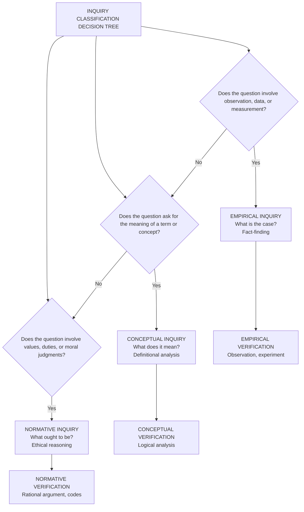
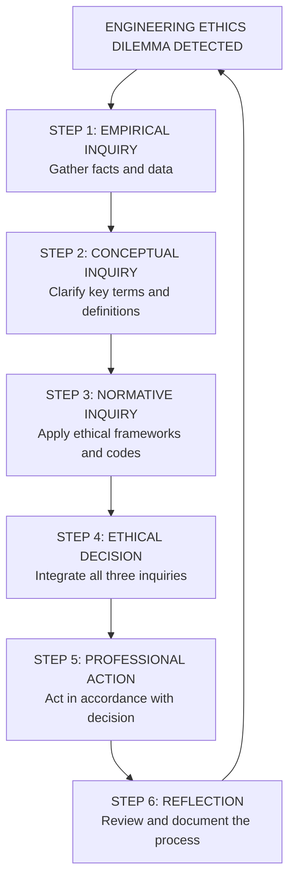
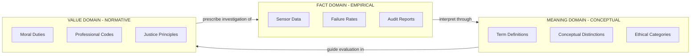
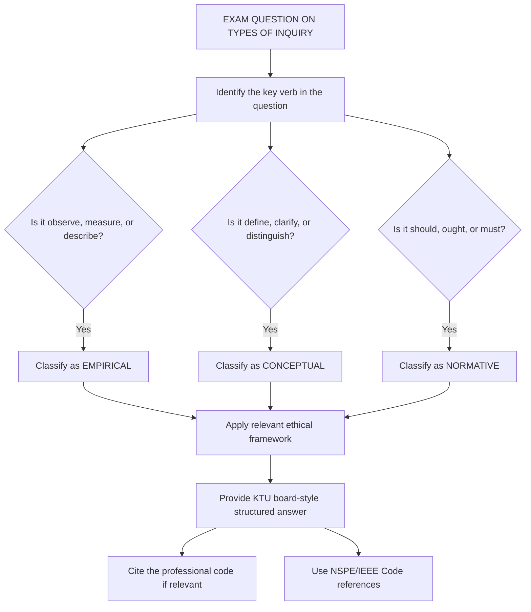

# Types of inquiry: Normative, conceptual, and empirical

<!-- SECTION_1_START -->
# Types of Inquiry: Normative, Conceptual, and Empirical

> [!IMPORTANT]
> **KTU 2024 Scheme | UHSUT300 | Module 3 | Engineering Professional Ethics**
> In KTU Board Examinations, students are frequently tested on the ability to *classify* a given engineering ethics dilemma into one of the three inquiry types. Mastering this classification is a high-yield scoring area.

## 1.1 Formal Academic Definition

In the philosophy of knowledge and engineering ethics, **inquiry** refers to a systematic process of asking questions and seeking answers to resolve a problem, doubt, or dilemma. The three principal **types of inquiry** recognized in KTU's professional ethics syllabus are:

- **Normative Inquiry**: A value-laden, prescriptive form of investigation that asks *"What ought to be?"* or *"What is the right thing to do?"* It is concerned with establishing standards, ideals, duties, and moral obligations. In engineering ethics, it deals with questions of justice, safety, honesty, and responsibility.
- **Conceptual Inquiry**: A definitional, analytical, and interpretive form of investigation that asks *"What does this mean?"* It focuses on clarifying the meaning of concepts, the logical relationships between ideas, and the proper use of terms and categories.
- **Empirical Inquiry**: A descriptive, fact-based, and observational form of investigation that asks *"What is the case?"* or *"What are the facts?"* It relies on verifiable evidence, data, experiments, and measurable observations about the world.

> [!NOTE]
> **Core Distinction**: Normative inquiry is **prescriptive** (value judgments), Conceptual inquiry is **analytical** (clarification of meaning), and Empirical inquiry is **descriptive** (fact-finding). Together, they form the epistemological triad upon which sound engineering ethical decisions are built.

## 1.2 Conceptual Analogy & Intuitive Overview

> [!TIP]
> **The Courtroom Analogy**
> Imagine a judge deciding a complex engineering malpractice case:
>
> - **Empirical Inquiry** is the **forensic investigator** who collects data: *"The bridge collapsed at 3:42 PM. The steel bolts were 40% corroded. Wind speed was 65 km/h."* — purely factual.
> - **Conceptual Inquiry** is the **legal scholar** who defines key terms: *"What exactly does 'engineering negligence' mean? What is the precise definition of 'structural failure' vs. 'design flaw'?"* — purely analytical.
> - **Normative Inquiry** is the **judge** who delivers the verdict: *"The engineer ought to have inspected the bolts. The firm had a duty to prioritize public safety over profit."* — purely value-driven.

### Why It Matters for Engineers
Engineering professionals face dilemmas that cannot be resolved by calculations alone. When a self-driving car's algorithm causes an accident, the engineer must:
1. Gather **empirical** facts (sensor data, logs),
2. Clarify **concepts** ("What is 'reasonable' risk?" "What counts as 'consent'?"),
3. Decide **normatively** ("The company ought to recall the vehicles.").

## 1.3 Visualization: Inquiry Mapping

> [!VISUALIZATION CONTROL]
> **Concept:** Three-Domain Inquiry Classification Space
> **Conceptual Mapping Coordinates:**
> * **Empirical Axis (X-axis):** Observable Facts $\rightarrow$ 0 to 10 scale of factual evidence
> * **Conceptual Axis (Y-axis):** Conceptual Clarity $\rightarrow$ 0 to 10 scale of definitional rigor
> * **Normative Axis (Z-axis):** Moral Prescriptiveness $\rightarrow$ 0 to 10 scale of value commitment
>
> **Visual Description:** Plot a 3D conceptual space where the pure types of inquiry occupy distinct corners: Empirical Inquiry sits at the high-X corner (fact-rich, value-neutral), Conceptual Inquiry sits at the high-Y corner (definition-rich, fact-neutral), and Normative Inquiry sits at the high-Z corner (value-rich, fact-neutral). Real engineering ethics problems lie *inside* this cube, requiring a mix of all three.

<!-- SECTION_1_END -->

<!-- SECTION_2_START -->
# Deep Theoretical Analysis & KTU High-Yield Notes

## 2.1 Structural Breakdown of Each Inquiry Type

### 2.1.1 Empirical Inquiry (The "Is" Question)
- **Nature:** Descriptive, factual, and verifiable.
- **Method:** Observation, experiment, measurement, statistical analysis.
- **Tools:** Sensors, surveys, audits, case studies, post-incident reports.
- **Output:** Data, statistics, factual statements that can be true or false.
- **Key Test:** Can the claim be verified by observation or experiment? If yes, it is empirical.
- **Engineering Example:** *"78% of software projects fail to meet deadlines due to poor requirement analysis."*

### 2.1.2 Conceptual Inquiry (The "Meaning" Question)
- **Nature:** Analytical, definitional, and interpretive.
- **Method:** Logical analysis, definition refinement, taxonomy creation, conceptual mapping.
- **Tools:** Dictionaries, philosophical analysis, IEEE/ISO standard definitions, logical argumentation.
- **Output:** Clarified definitions, distinctions, conceptual frameworks, taxonomies.
- **Key Test:** Is the question asking what a term means or how concepts relate? If yes, it is conceptual.
- **Engineering Example:** *"What is the precise distinction between 'bug', 'defect', and 'failure' in software engineering?"*

### 2.1.3 Normative Inquiry (The "Ought" Question)
- **Nature:** Prescriptive, evaluative, and value-laden.
- **Method:** Moral reasoning, ethical frameworks, deontological/consequentialist analysis, professional code application.
- **Tools:** NSPE Code of Ethics, IEEE Code of Ethics, utilitarianism, deontology, virtue ethics, rights-based theories.
- **Output:** Judgments about what is right, just, fair, or obligatory.
- **Key Test:** Does the question involve a "should", "ought", "must", or value judgment? If yes, it is normative.
- **Engineering Example:** *"Engineers ought to hold paramount the safety, health, and welfare of the public."*

## 2.2 The Three-Pillar Relationship in Engineering Ethics

A well-reasoned engineering ethical decision-making process requires the **integration of all three inquiries** in a specific sequence:

1. **Empirical Foundation** → Gather the facts (What happened?).
2. **Conceptual Clarification** → Define the relevant terms (What do we mean by 'harm'?).
3. **Normative Resolution** → Apply values and principles (What should we do?).

> [!IMPORTANT]
> **KTU High-Yield Point:** In Board Examinations, if a question presents a scenario, the *first* step the examiner expects is to **identify the type(s) of inquiry** involved. Many students lose marks by jumping to conclusions without explicitly classifying the inquiry.

## 2.3 KTU High-Yield Cheat Sheet

| Attribute | Empirical Inquiry | Conceptual Inquiry | Normative Inquiry |
|:---|:---|:---|:---|
| **Core Question** | What is the case? | What does it mean? | What ought to be? |
| **Nature** | Descriptive | Analytical | Prescriptive |
| **Method** | Observation, experiment | Logical analysis | Ethical reasoning |
| **Output Type** | Facts and data | Definitions and frameworks | Value judgments |
| **Verifiability** | Empirically testable | Logically coherent | Rationally defensible |
| **Truth Criterion** | Correspondence to reality | Internal consistency | Universalizability / coherence |
| **Key Verbs** | Measure, observe, record | Define, clarify, distinguish | Should, ought, must, evaluate |
| **Engineering Domain** | Failure analysis, statistics | Standards, taxonomies | Codes of ethics, whistle-blowing |
| **Discipline Roots** | Natural sciences, statistics | Philosophy of language | Moral philosophy, ethics |
| **Typical Disagreement** | About the *facts* | About the *definitions* | About the *values* |
| **Example Tool** | Root-cause analysis | Concept mapping | Cost-benefit moral analysis |
| **Can be proven by data?** | Yes | Partially | No (requires argument) |
| **Example Statement** | The bridge had 12 cracks. | A 'crack' is any fissure > 0.3mm. | Cracks must be repaired before public use. |

## 2.4 Real-World Engineering Utility

> [!NOTE]
> **Industry Application Matrix**
>
> - **Software Engineering:** Empirical = A/B testing and bug metrics; Conceptual = defining 'technical debt'; Normative = establishing the right to privacy in data collection.
> - **Civil Engineering:** Empirical = soil testing and load calculations; Conceptual = clarifying 'public safety' thresholds; Normative = deciding whether to halt a project over safety concerns.
> - **AI/Machine Learning Ethics:** Empirical = measuring algorithmic bias rates; Conceptual = defining 'fairness' mathematically; Normative = deciding what level of bias is ethically unacceptable.
> - **Environmental Engineering:** Empirical = measuring pollution levels; Conceptual = defining 'sustainable'; Normative = obligations to future generations.

<!-- SECTION_2_END -->

<!-- SECTION_3_START -->
# Step-by-Step Analytical Derivations & Application Framework

## 3.1 The KTU Decision Algorithm for Classifying Inquiry Type

When faced with an engineering ethics question, apply the following exhaustive decision tree:

### Step 1: Identify the Verbs
- Does the statement contain **observation verbs** (observe, measure, count, record)? $\rightarrow$ Likely **Empirical**.
- Does the statement contain **definition verbs** (define, clarify, distinguish, mean)? $\rightarrow$ Likely **Conceptual**.
- Does the statement contain **prescriptive verbs** (should, ought, must, ought not)? $\rightarrow$ Likely **Normative**.

### Step 2: Apply the Three-Question Test
Ask the original question in three forms:
- *"What is the factual evidence?"* $\rightarrow$ Empirical dimension.
- *"What is the precise meaning of the key terms?"* $\rightarrow$ Conceptual dimension.
- *"What value judgment or duty is invoked?"* $\rightarrow$ Normative dimension.

### Step 3: Verify the Truth Criterion
- Can it be verified by a **measuring instrument**? $\rightarrow$ Empirical.
- Can it be verified by **logical analysis**? $\rightarrow$ Conceptual.
- Can it be verified by **rational argument among reasonable people**? $\rightarrow$ Normative.

## 3.2 Detailed Case Analysis: The Self-Driving Car Dilemma

**Scenario:** An autonomous vehicle manufactured by RoboCorp is involved in a fatal accident. The car's AI had identified a pedestrian but chose to swerve into a barrier to avoid a school bus, killing the passenger.

### Step 1: Identify Empirical Inquiries
The following empirical questions must be answered first:
- What was the speed of the vehicle at the moment of decision?
- What was the visibility and weather condition?
- What were the exact sensor readings?
- How many similar incidents have occurred in the past 12 months?

### Step 2: Identify Conceptual Inquiries
The following conceptual questions must be clarified:
- What is the precise legal and ethical definition of "negligence" in autonomous systems?
- How is "informed consent" defined when the user purchases a self-driving car?
- What is the distinction between "algorithmic decision" and "manufacturer decision"?
- How is "reasonable risk" defined for AI-controlled vehicles?

### Step 3: Identify Normative Inquiries
The following normative questions must be resolved:
- Should the algorithm prioritize passenger safety or pedestrian safety?
- Ought RoboCorp to recall all similar vehicles?
- Does the engineer who designed the decision algorithm bear moral responsibility?
- What is the company's duty to disclose the risk profile to buyers?

## 3.3 Comparative Engineering Case Frameworks

The following matrix maps real-world engineering scenarios to the three inquiry types for KTU exam preparation:

| Case Scenario | Empirical Component | Conceptual Component | Normative Component |
|:---|:---|:---|:---|
| **Boeing 737 MAX Crashes** | Sensor failure data, pilot reports | Definition of "MCAS override" | Engineers' duty to disclose safety flaws |
| **Volkswagen Emissions Scandal** | Measured vs. actual NO$_x$ levels | Definition of "defeat device" | Engineers' obligation to refuse fraud |
| **Therac-25 Radiation Overdoses** | Software lock failure rate | Definition of "fail-safe" | Designers' duty to non-maleficence |
| **Hyundai-Kia Engine Fires** | Fire incident statistics | Definition of "non-crash fire" | Duty to issue timely recall |
| **Cambridge Analytica Data Misuse** | Number of users affected | Definition of "informed consent" | Engineers' duty to protect privacy |
| **Boeing Starliner Software Error** | Mission clock timing data | Definition of "mission-critical error" | Engineers' duty to refuse unsafe launches |
| **GM Ignition Switch Defect** | Failure rate, death toll | Definition of "known defect" | Engineers' duty to prioritize safety over cost |

## 3.4 Worked Example: Distinguishing the Three Inquiries

**Question:** *"Should an engineer blow the whistle if a company is dumping toxic waste illegally?"*

**Step-by-step Resolution:**

**Empirical Layer (Facts):**
- The waste is being dumped in the local river.
- The chemical concentrations exceed EPA limits by a factor of 50.
- The local community depends on the river for drinking water.
- The dumping has occurred for at least 8 months.

**Conceptual Layer (Definitions):**
- "Whistle-blowing" is defined as the disclosure of illegal, immoral, or illegitimate practices to parties who can effect change.
- "Illegal dumping" is defined under the Clean Water Act as the unauthorized discharge of pollutants.
- "Moral courage" is the willingness to face personal cost for an ethical principle.

**Normative Layer (Values):**
- The engineer ought to prioritize public health and environmental protection (per NSPE Code of Ethics, Fundamental Canon 1).
- The engineer has a duty to report illegal activity even at personal cost.
- The company has an obligation to cease dumping and remediate the site.

**Synthesis Answer for KTU Exam:**
> *"This scenario involves all three types of inquiry. The empirical inquiry establishes the facts (dumping has occurred, concentrations exceed limits). The conceptual inquiry clarifies key terms (the precise meaning of 'whistle-blowing' and 'illegal dumping'). The normative inquiry resolves the ethical question: the engineer **ought** to blow the whistle, as the duty to protect public welfare (a normative principle codified in the NSPE Code) outweighs the duty of confidentiality to the employer."*

<!-- SECTION_3_END -->

<!-- SECTION_4_START -->
# Structural Diagrams & Schematics

## 4.1 Mermaid Diagram: The Inquiry Classification Decision Tree

## 4.2 Mermaid Diagram: Engineering Ethics Decision-Making Flow

## 4.3 Mermaid Diagram: Three-Domain Inquiry Interaction Matrix

## 4.4 Mermaid Diagram: KTU Exam Strategy Flowchart

<!-- SECTION_4_END -->

<!-- SECTION_5_START -->
# KTU 2024 Scheme Examination Question Bank & Topic Recap

## Part A: Short Answer Questions (3 Marks Each)

### Question 1 (3 Marks)
**[KTU University Exam - December 2023 | CO1 | Remember]**

**Differentiate between Normative Inquiry and Empirical Inquiry in the context of engineering ethics. Provide one engineering example for each.**

**Model Answer (3 Marks):**

| Basis | Normative Inquiry | Empirical Inquiry |
|:---|:---|:---|
| Question Type | *"What ought to be?"* | *"What is the case?"* |
| Nature | Prescriptive and value-laden | Descriptive and fact-based |
| Method | Ethical reasoning, codes of conduct | Observation, measurement, data collection |
| Example | *"Engineers ought to hold paramount the safety, health, and welfare of the public."* | *"The structural load test recorded a deflection of 14 mm at 80% of design load."* |

> **Valuation Key:** [Definition of Normative with example: 1.5 Marks] [Definition of Empirical with example: 1.5 Marks]

---

### Question 2 (3 Marks)
**[KTU University Exam - July 2024 | CO1 | Understand]**

**Explain the role of Conceptual Inquiry in resolving engineering ethics dilemmas. Why is definitional clarity important?**

**Model Answer (3 Marks):**

Conceptual Inquiry focuses on **clarifying the meaning of key terms, distinctions, and categories** used in ethical discussions. It addresses questions such as *"What does 'negligence' mean in software engineering?"* or *"What is the precise distinction between 'risk' and 'hazard'?"*

**Importance of Definitional Clarity:**
1. **Prevents miscommunication** between engineers, managers, and the public.
2. **Establishes common standards** for measuring compliance (e.g., ISO definitions).
3. **Enables precise normative judgment** — you cannot judge whether something is "right" or "wrong" without first knowing what it *is*.
4. **Reduces legal and regulatory ambiguity** in professional practice.

> **Valuation Key:** [Definition of Conceptual Inquiry: 1 Mark] [Three valid points on importance: 2 Marks]

---

## Part B: Long Answer Questions (14 Marks with Internal Choice)

### Question A (14 Marks)
**[KTU University Exam - December 2024 | CO1, CO2 | Apply, Analyze]**

**(a)** Define the three types of inquiry — Normative, Conceptual, and Empirical — and explain their distinct epistemological goals. State one engineering ethics question that corresponds to each type. **(7 Marks)**

**(b)** Consider the following scenario: *A structural engineer at BridgeCorp discovers that the design specifications for a new suspension bridge call for steel cables rated 20% below the calculated safety margin. The project manager instructs the engineer to "make the numbers work" and not raise concerns, citing tight deadlines. The engineer is unsure whether to comply, raise the issue internally, or report it to the public regulatory authority.*

Apply the three types of inquiry to analyze this scenario. For each type, state **two specific questions** the engineer should ask and explain how the answers would guide the ethical decision. **(7 Marks)**

---

### **Model Answer for Question A**

#### Part (a) — 7 Marks

**Definition 1: Empirical Inquiry (2 Marks)**
Empirical inquiry is a descriptive, fact-based investigation that seeks to establish *what is the case* through observation, measurement, and verifiable evidence. Its epistemological goal is **truth by correspondence** — matching claims to observable reality.

- *Engineering ethics question:* *"How many bridges built with substandard cables have failed in the past decade?"*

**Definition 2: Conceptual Inquiry (2 Marks)**
Conceptual inquiry is an analytical investigation that seeks to clarify *what terms and concepts mean*, how they relate, and how they are properly defined. Its epistemological goal is **truth by coherence and clarity** — ensuring logical consistency in definitions.

- *Engineering ethics question:* *"What is the precise engineering definition of 'safety margin' and how is it distinguished from 'factor of safety'?"*

**Definition 3: Normative Inquiry (2 Marks)**
Normative inquiry is a prescriptive, value-laden investigation that seeks to establish *what ought to be done* through ethical reasoning, professional codes, and moral frameworks. Its epistemological goal is **truth by rational defensibility** — making judgments that any reasonable, informed person would accept.

- *Engineering ethics question:* *"Ought the engineer prioritize the company's deadline or the public's safety?"*

**Synthesis (1 Mark):**
The three inquiries are interdependent: empirical facts provide the data, conceptual clarity provides the framework, and normative judgment provides the action.

> **Valuation Key:** [Three definitions: 1 Mark each = 3 Marks] [Three example questions: 1 Mark each = 3 Marks] [Synthesis statement: 1 Mark]

---

#### Part (b) — 7 Marks

**Empirical Inquiry Questions (2.5 Marks):**
1. *"What is the actual load-bearing capacity of the specified cables under the projected maximum stress?"*
2. *"What is the historical failure rate of bridges using cables rated 20% below standard?"*

**How they guide the decision:** If the empirical data shows that such cables have a non-trivial failure rate, the engineer has **objective evidence** that the design poses a genuine safety risk, transforming the issue from a *preference* into a *factual danger*.

> **[Identifying empirical questions: 1 Mark] [Explaining how facts guide decision: 1.5 Marks]**

**Conceptual Inquiry Questions (2.5 Marks):**
1. *"What is the precise contractual and professional definition of 'acceptable safety margin' under the relevant Indian/IS standards?"*
2. *"What is the distinction between 'cost optimization' and 'unsafe design' under the NSPE Code of Ethics?"*

**How they guide the decision:** Conceptual clarity removes the ambiguity that the project manager is exploiting. If the IS standard *mandates* a specific safety margin, the "20% below" is **not a matter of opinion** but a **definitional violation**, removing the manager's ability to frame it as a trade-off.

> **[Identifying conceptual questions: 1 Mark] [Explaining how definitions guide decision: 1.5 Marks]**

**Normative Inquiry Questions (2 Marks):**
1. *"Given the NSPE Code Fundamental Canon 1 (hold paramount public safety), ought the engineer to comply with the manager's instruction?"*
2. *"What is the engineer's professional duty when an internal instruction conflicts with public welfare?"*

**How they guide the decision:** The normative framework provides the **decision rule**: public safety supersedes managerial authority. The engineer has a positive duty to refuse and report.

> **[Identifying normative questions: 1 Mark] [Applying ethical framework: 1 Mark]**

---

### Question B (14 Marks — Alternative Choice)
**[KTU University Exam - July 2024 | CO1, CO2 | Understand, Apply]**

**(a)** "Engineering ethics is fundamentally an applied form of Normative Inquiry." Critically evaluate this statement, demonstrating how Empirical and Conceptual Inquiries also play essential, non-replaceable roles. **(7 Marks)**

**(b)** A pharmaceutical engineer at MediCorp discovers that a new drug delivery device has a 3% malfunction rate in laboratory tests, while the industry standard is 0.5%. The company argues that 3% is "acceptable" given the device's affordability for low-income patients. The engineer is asked to approve the device for release. Apply the **three types of inquiry** to identify the key questions the engineer must address before making a decision. For each inquiry type, state **two questions** and explain the role of the answer in the final decision. **(7 Marks)**

---

### **Model Answer for Question B**

#### Part (a) — 7 Marks

**Statement Affirmation (2 Marks):**
Engineering ethics is indeed centrally **normative**, because its core purpose is to determine *what engineers ought to do*. The NSPE Code, IEEE Code, and global engineering ethics frameworks are normative documents prescribing duties, virtues, and obligations.

**Empirical Counter-Point (2 Marks):**
However, normative inquiry **cannot operate in a factual vacuum**. To determine whether a design is *safe*, we must first **empirically measure** the failure rates, stress tolerances, and risk profiles. A normative claim like "X is dangerous" is only meaningful if X is empirically established to be dangerous. The Boeing 737 MAX case demonstrates how empirical data (angle-of-attack sensor readings) was the foundation of the normative judgment (engineers ought to have disclosed the defect).

**Conceptual Counter-Point (2 Marks):**
Conceptual inquiry is essential because **vague terms corrupt ethical judgment**. The phrase "acceptable risk" is meaningless without a clear, agreed-upon definition. The 3% malfunction rate example (in part b) hinges on what we *define* as "acceptable." Without conceptual clarity on terms like "safety," "consent," and "harm," normative disputes become unresolvable.

**Synthesis (1 Mark):**
The statement is **partially correct but incomplete**. Engineering ethics is *governed* by normative inquiry, but *informed* by empirical inquiry and *clarified* by conceptual inquiry. All three are indispensable.

> **Valuation Key:** [Statement validation: 2 Marks] [Empirical role: 2 Marks] [Conceptual role: 2 Marks] [Synthesis: 1 Mark]

---

#### Part (b) — 7 Marks

**Empirical Inquiry Questions (2.5 Marks):**
1. *"What is the precise malfunction rate at different operating conditions, temperatures, and patient populations?"*
2. *"What is the documented rate of patient harm (hospitalizations, deaths) associated with each percentage point of malfunction?"*

**Role in decision:** The empirical data converts an abstract worry into a **quantified risk**. If 3% malfunction translates to, say, 30,000 preventable injuries per year, the engineer has hard evidence of a public health crisis.

> **[Questions: 1 Mark] [Role explanation: 1.5 Marks]**

**Conceptual Inquiry Questions (2.5 Marks):**
1. *"What is the precise regulatory definition of 'acceptable malfunction rate' under the relevant drug control authority?"*
2. *"What is the ethical distinction between 'acceptable to the company' and 'acceptable to the patient'?"*

**Role in decision:** Conceptual clarity exposes the **value-loaded term** "acceptable." If the regulatory definition is 0.5%, then 3% is **not acceptable by definition** — regardless of affordability arguments. This neutralizes the company's framing.

> **[Questions: 1 Mark] [Role explanation: 1.5 Marks]**

**Normative Inquiry Questions (2 Marks):**
1. *"Given the biomedical engineer's duty of non-maleficence (do no harm), ought the engineer to approve a device with a 6x higher malfunction rate than the standard?"*
2. *"Is affordability a sufficient justification to expose patients to a higher risk of harm?"*

**Role in decision:** The normative framework establishes that **patient safety supersedes cost considerations** and that distributive justice (affordability) cannot override non-maleficence (avoiding harm). The engineer ought to refuse approval.

> **[Questions: 1 Mark] [Applying framework: 1 Mark]**

---

> [!WARNING]
> **KTU Examiner's Valuation Warning / Pitfall Callout**
>
> 1. **The "Single Inquiry Trap":** The most common mistake KTU examiners penalize is when a student classifies an engineering ethics scenario as *only* normative, ignoring the empirical and conceptual layers. A 14-mark answer that identifies **all three inquiries** with **two questions each** scores significantly higher than one that merely discusses ethics in general.
>
> 2. **The "Verb Identification Failure":** Students often misclassify empirical statements as normative because they contain the word "should." Always look for the *actual subject* of the prescription. *"The bridge SHOULD support the load"* is empirical (factual capacity) — *"The engineer SHOULD report the defect"* is normative (moral duty).
>
> 3. **The "Code Citation Gap":** For full marks on normative sub-questions, KTU examiners expect explicit reference to the **NSPE Fundamental Canons** (especially Canon 1: hold paramount public safety) or the **IEEE Code of Ethics**. A normative answer without a code citation loses at least 1–2 marks.
>
> 4. **The "Definitional Vagueness Penalty":** When asked for conceptual inquiry, do not give a *general* answer like "it means being clear." Specify the *exact concept* you are defining (e.g., "the precise engineering definition of safety factor is..."). Vague answers receive partial credit only.
>
> 5. **The "Synthesis Omission":** Many students analyze each inquiry in isolation and forget to **integrate** them in the conclusion. The final 1–2 marks are reserved for a synthesis statement showing how empirical + conceptual + normative = complete ethical reasoning.

---

## 📌 Topic Recap & Important Things to Remember

> [!IMPORTANT]
> **Rapid Revision Checklist for KTU University Exam**

### Core Definitions to Memorize
- **Empirical Inquiry:** A *descriptive*, fact-based investigation that asks *"What is the case?"* — verified by observation and measurement.
- **Conceptual Inquiry:** An *analytical*, definitional investigation that asks *"What does it mean?"* — verified by logical analysis.
- **Normative Inquiry:** A *prescriptive*, value-laden investigation that asks *"What ought to be?"* — verified by rational argument and ethical frameworks.

### The Three-Question Test (Exam Shortcut)
For any engineering ethics statement, ask:
1. What are the **facts**? $\rightarrow$ **Empirical**
2. What do the **terms mean**? $\rightarrow$ **Conceptual**
3. What **ought** to be done? $\rightarrow$ **Normative**

### Key Distinctions to Remember
- Empirical = **Is** (descriptive) $\neq$ Normative = **Ought** (prescriptive) — this is the **is-ought gap** in philosophy.
- Conceptual inquiry is **not** a sub-type of empirical; it is a parallel, independent mode.
- All three inquiries are **interdependent** — none can stand alone in a complete ethical analysis.

### High-Yield Examples to Memorize for KTU
- *Empirical:* "The 737 MAX had two fatal crashes killing 346 people."
- *Conceptual:* "What constitutes 'known' vs. 'unknown' defect under product liability law?"
- *Normative:* "Engineers must hold paramount the safety, health, and welfare of the public." *(NSPE Canon 1)*

### Code References to Cite in the Exam
- **NSPE Code of Ethics, Fundamental Canon 1:** Hold paramount public safety.
- **NSPE Code, Fundamental Canon 3:** Issue public statements only in an objective and truthful manner.
- **IEEE Code of Ethics, Article 1:** Accept responsibility in making engineering decisions consistent with the safety, health, and welfare of the public.

### Common Traps in KTU Questions
- A statement can be **simultaneously** empirical AND normative (e.g., "The device is unsafe and must be recalled" — empirical fact + normative duty).
- Conceptual inquiry is often **hidden** in questions that look empirical: "Define what counts as 'acceptable risk'?"
- Normative questions sometimes use neutral-sounding verbs: "What is the right thing to do?" (normative, not empirical).

### The KTU Perfect-Answer Formula (14-Mark Template)
1. **Identify all three types of inquiry** explicitly in the scenario (3 Marks).
2. **State two specific questions** for each inquiry type (3 Marks).
3. **Explain how the answers guide the decision** for each (5 Marks).
4. **Integrate all three** in a synthesis conclusion citing a professional code (2 Marks).
5. **Provide the final normative verdict** supported by all three inquiries (1 Mark).

> **Final Note:** In KTU Board Examinations, the examiner is testing your ability to **think systematically about ethical dilemmas** using the inquiry framework, not merely to recall definitions. Always structure your answer as: *Empirical Facts $\rightarrow$ Conceptual Clarifications $\rightarrow$ Normative Judgment $\rightarrow$ Synthesized Decision.*

<!-- SECTION_5_END -->
