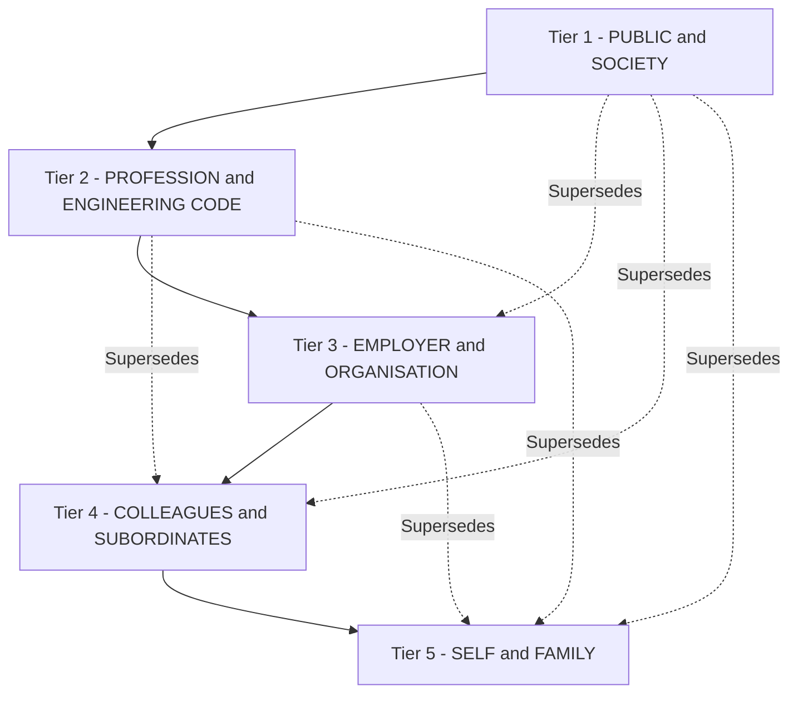
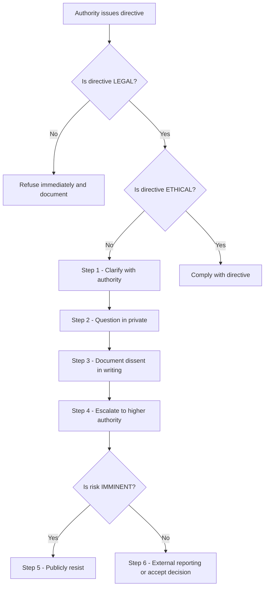
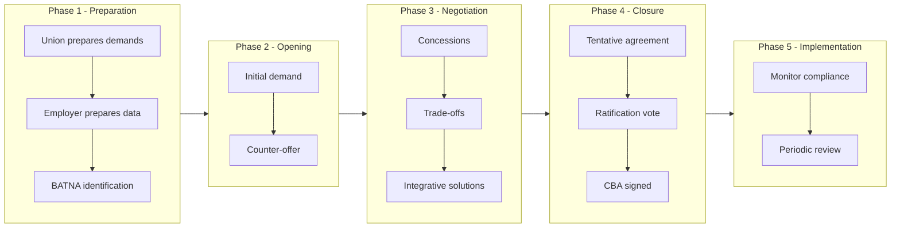
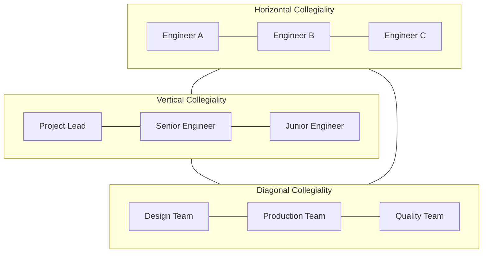
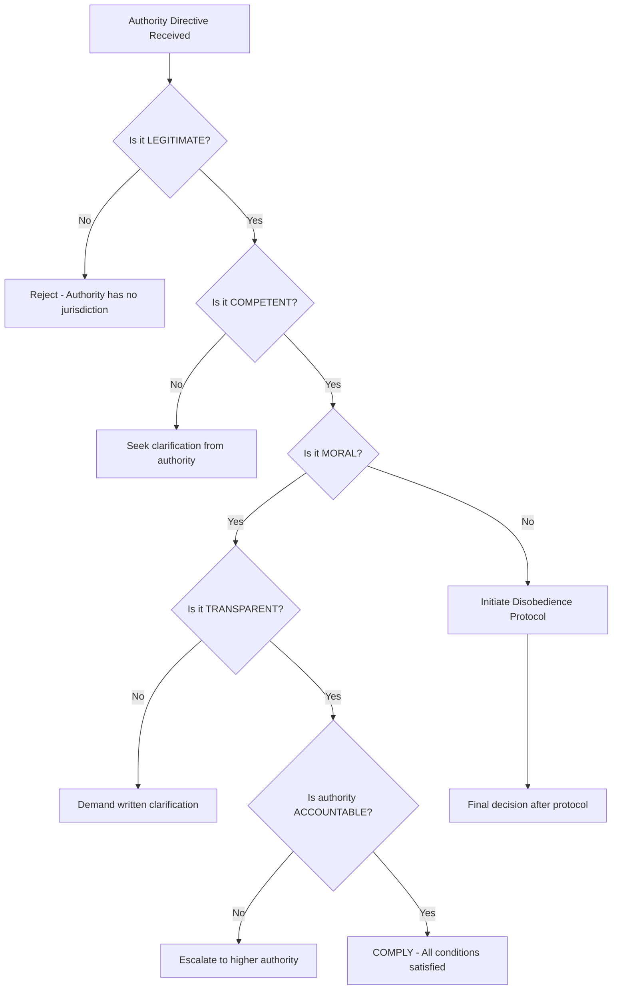

# Collegiality and loyalty, Respect for authority, Collective bargaining

<!-- SECTION_1_START -->
# Collegiality, Loyalty, Respect for Authority & Collective Bargaining

## 1.1 Collegiality — Core Definition

**Collegiality** is the cooperative relationship among colleagues, professionals, or co-workers who share mutual respect, collaborative spirit, and a commitment to common professional goals within an organisation or institution. In the KTU 2024 syllabus context, collegiality is treated as a *micro-ethical virtue* that governs the day-to-day conduct of engineers, managers, and technicians working in team-based technical environments.

> [!NOTE]
> **KTU 2024 Definition (Module 4):**
> *Collegiality refers to the ethical duty of engineers and professionals to treat fellow workers with respect, fairness, and good faith, fostering a healthy cooperative environment that enhances productivity, innovation, and workplace well-being.*

### Conceptual Analogy / Intuition

Imagine an **orchestra** performing a symphony. The violinist, the cellist, and the flautist each have individual brilliance, but the magic of the music emerges only when they *listen* to one another, respect the conductor's cues, and synchronise their timing. Collegiality is exactly this **"orchestra effect"** in an engineering firm: each professional is a skilled instrument, and the project deliverable is the symphony. Without collegiality, you get noise, not music.

### Key Attributes of Collegiality

- **Mutual Respect** — Acknowledging each colleague's professional worth and contribution
- **Cooperation** — Willingly sharing knowledge, resources, and credit
- **Constructive Feedback** — Offering criticism aimed at improvement, never personal attack
- **Confidentiality** — Preserving proprietary and personal information of colleagues
- **Inclusivity** — Welcoming diverse perspectives irrespective of rank, gender, caste, or tenure
- **Solidarity** — Standing together during organisational crises or moral dilemmas

---

## 1.2 Loyalty — Core Definition

**Loyalty** in engineering ethics refers to the *faithful commitment* of an engineer or professional toward their colleagues, organisation, profession, and society, while simultaneously balancing legitimate competing obligations. Loyalty is **not blind obedience**; it is a *discerning allegiance* that holds even when personal comfort is at stake.

> [!IMPORTANT]
> **KTU Board Highlight:**
> Loyalty is one of the most tested ethical virtues in KTU ESE questions. Examiners frequently frame scenarios such as *"An engineer discovers a quality defect in her supervisor's design. Whom does she owe loyalty — the supervisor or the public?"* Always answer by invoking the *NSPE Code of Ethics* hierarchy: *Public > Employer > Colleagues > Self.*

### Conceptual Analogy / Intuition

Think of loyalty as the **gravitational field of a planet**. The planet (your organisation) exerts a force, but moons (your colleagues) and distant stars (your profession and society) also pull on you. A loyal professional is one who orbits responsibly — staying within the gravitational field of truth, even when tugged in multiple directions.

### Hierarchy of Loyalty (KTU Standard Reference)

| Priority Level | Entity to Whom Loyalty is Owed | Limiting Condition |
| :---: | :--- | :--- |
| 1 | **Public & Society** | Supersedes all lower loyalties |
| 2 | **Profession (Engineering Body)** | Cannot violate public safety |
| 3 | **Employer / Organisation** | Cannot violate professional codes |
| 4 | **Colleagues & Subordinates** | Cannot violate employer's legitimate interests |
| 5 | **Self & Family** | Cannot violate any higher obligation |

> [!WARNING]
> A common KTU mistake is stating that an engineer's *first* loyalty is to the employer. This is incorrect under standard engineering codes. The **public interest** is paramount.

---

## 1.3 Respect for Authority — Core Definition

**Respect for Authority** is the ethical duty of a subordinate to honour the legitimate directives, decisions, and supervisory structures within an organisation, while reserving the right to dissent on moral, legal, or safety grounds through proper channels.

> [!NOTE]
> Respect for authority is **not synonymous with obedience**. It is a *dignified acknowledgement* of the legitimate role of authority figures and is conditional upon the authority acting within ethical and legal bounds.

### Conceptual Analogy / Intuition

Picture a **traffic system**. The traffic signal (authority) governs the flow of vehicles (subordinates). Drivers respect the signal because it ensures order and safety. However, if a traffic signal malfunctions and directs vehicles into a river, drivers are ethically — and legally — justified in disregarding it. Similarly, engineers respect authority but have an *ethical exit clause* when authority directs unsafe, illegal, or immoral acts.

### Forms of Authority in Engineering Organisations

- **Positional Authority** — Derived from job title (e.g., Project Manager, CTO)
- **Expert Authority** — Derived from specialised knowledge (e.g., a senior design engineer)
- **Charismatic Authority** — Derived from personal influence (e.g., a visionary founder)
- **Moral Authority** — Derived from demonstrated ethical conduct

A mature engineering professional respects **all four** but yields *primacy* to moral authority during ethical conflicts.

---

## 1.4 Collective Bargaining — Core Definition

**Collective Bargaining** is the formal negotiation process between **employers** (or their representatives) and **workers' collectives** (typically trade unions) to determine conditions of employment, including wages, working hours, benefits, workplace safety, grievance procedures, and disciplinary rules.

> [!IMPORTANT]
> **KTU Definition (Module 4):**
> *Collective bargaining is the negotiation of working conditions and terms of employment between an employer and a group of employees, often resulting in a Collective Bargaining Agreement (CBA) that binds both parties for a stipulated period.*

### Conceptual Analogy / Intuition

Consider a **two-player chess match** where both players have fixed rule-sets but can negotiate house-rules (such as time controls, board variants, or draw conditions) before the match begins. This pre-game negotiation is collective bargaining — both sides come to a *mutually binding understanding* that prevents mid-game conflict.

> [!VISUALIZATION CONTROL]
> **Concept:** Collective Bargaining Equilibrium Curve
> **Conceptual Graph Axes:**
> * X-axis: Employer Concessions (wages, benefits, working conditions) — increases rightward
> * Y-axis: Worker Concessions (productivity pledges, strike moratorium, flexible shifts) — increases upward
> * Equilibrium Point: The intersection where a **CBA** is signed, also called the *Bargaining Zone* (ZOPA — Zone of Possible Agreement)
> **Visual Description:** Visualise two opposing demand curves (one descending from employer side, one ascending from union side). The overlap region is the ZOPA, where any settlement is theoretically acceptable. The signed CBA is a single point inside the ZOPA, chosen after negotiation rounds.

---

## 1.5 Interdisciplinary Linkage

| Concept | Engineering Workplace Manifestation |
| :--- | :--- |
| Collegiality | Agile team stand-ups, peer code reviews, cross-functional design reviews |
| Loyalty | Whistleblowing dilemmas, dual-employment conflicts, NDAs |
| Respect for Authority | Reporting to project leads, safety audit compliance, design sign-offs |
| Collective Bargaining | Trade union negotiations, factory-floor safety committees, wage settlements |

<!-- SECTION_1_END -->

<!-- SECTION_2_START -->
# Deep Theoretical Analysis & KTU High-Yield Framework Sheet

## 2.1 Theoretical Foundations

### 2.1.1 The Ethical Pillars Underlying These Concepts

1. **Deontological Ethics (Immanuel Kant)** — The duty-based view: respect for authority is a duty; loyalty is a duty; collegiality is a duty. These duties hold *regardless of consequences*.
2. **Utilitarian Ethics (Jeremy Bentham, John Stuart Mill)** — The consequence-based view: actions are ethical if they maximise collective happiness. Loyalty that protects the public is good; loyalty that hides a defect is bad.
3. **Virtue Ethics (Aristotle)** — The character-based view: a virtuous engineer naturally exhibits collegiality, balanced loyalty, and discerning respect for authority.
4. **Social Contract Theory (John Rawls, Thomas Hobbes)** — The implicit agreement among professionals in an organisation to abide by shared rules, including collective bargaining frameworks.

### 2.1.2 The Collegiality Triangle

Collegiality operates on **three concurrent dimensions**:

- **Horizontal Collegiality** — Peer-to-peer relationships among equals (e.g., two junior engineers, two team leads)
- **Vertical Collegiality** — Relationships across hierarchical levels (e.g., junior-senior, employee-manager)
- **Diagonal Collegiality** — Relationships across functional units (e.g., design engineer vs. production supervisor)

A breakdown in any one dimension creates workplace toxicity.

---

## 2.2 Loyalty — The Conflict Matrix

Loyalty frequently enters conflict zones. Below is the standard KTU analytical framework:

| Conflict Type | Competing Loyalties | Ethical Resolution |
| :--- | :--- | :--- |
| **Type I** | Colleague vs. Organisation | Whistleblow through internal channels; preserve colleague's dignity |
| **Type II** | Organisation vs. Public | Public safety wins; mandatory disclosure |
| **Type III** | Profession vs. Organisation | Follow professional code; resign if forced to violate |
| **Type IV** | Family vs. Work | Balance reasonably; do not compromise safety/legality |
| **Type V** | Subordinate vs. Supervisor | Disagree privately first; escalate to higher authority only if unethical |

### Loyalty Tests (NSPE-Style)

- **The Publicity Test** — *"If my action were published on the front page of a newspaper, would I still be comfortable?"*
- **The Reversibility Test** — *"Would I accept this action if I were on the receiving end?"*
- **The Mentor Test** — *"Would a respected senior engineer approve of this action?"*

---

## 2.3 Respect for Authority — Conditions & Limits

Authority is respected **conditionally**, not absolutely. The conditions are:

1. **Legitimacy** — The authority was appointed through legal/organisational processes
2. **Competence** — The authority possesses the technical know-how for the directive
3. **Morality** — The directive does not violate law, ethics, or public safety
4. **Transparency** — The directive is clearly communicated and properly documented
5. **Accountability** — The authority is willing to be held answerable for outcomes

> [!WARNING]
> **KTU Trap:** Students often write *"Subordinates must always obey authority."* This is wrong. Authority is *conditional*, and an engineer has a *conscientious objection* right when authority oversteps ethical bounds.

### The Disobedience Protocol (KTU-Standard)

When authority is deemed illegitimate, the engineer should follow this sequence:

1. **Clarify** — Seek explanation of the directive
2. **Question** — Raise concerns in a private, respectful manner
3. **Document** — Record the dissent in writing (email, memo)
4. **Escalate** — Approach higher authority or ethics committee
5. **Resist** — Publicly refuse only if safety/law is at imminent risk
6. **Report Externally** — Approach regulatory bodies as a last resort (whistleblowing)

---

## 2.4 Collective Bargaining — Types, Features & Process

### 2.4.1 Types of Collective Bargaining

| Type | Focus | Typical Outcomes |
| :--- | :--- | :--- |
| **Distributive Bargaining** | Wages, bonuses, share of fixed pie | Win-lose, zero-sum |
| **Integrative Bargaining** | Working conditions, training, welfare | Win-win, problem-solving |
| **Productivity Bargaining** | Output-linked incentives | Wage rise tied to efficiency |
| **Composite Bargaining** | Mix of multiple issues | Comprehensive CBA |

### 2.4.2 Phases of Collective Bargaining (KTU Board Favourite)

- **Phase 1 — Preparation** — Both sides gather data, define demands, set BATNA (Best Alternative to a Negotiated Agreement)
- **Phase 2 — Opening** — Exchange of initial proposals and counter-proposals
- **Phase 3 — Negotiation** — Concessions, trade-offs, and joint problem-solving
- **Phase 4 — Closure** — Tentative agreement reached and ratified
- **Phase 5 — Implementation & Review** — CBA enforced, monitored, renewed periodically

### 2.4.3 Features of an Effective CBA

- **Written & Legally Binding** — Reduces ambiguity
- **Clear Grievance Redressal Mechanism** — Typically a 3-tier structure (worker → supervisor → joint committee)
- **Defined Tenure** — Usually 2 to 5 years
- **Escalation Clauses** — Provisions for arbitration, mediation, or conciliation
- **No-Strike No-Lockout Clause** — Peace obligation during CBA validity

### KTU High-Yield Framework Sheet

| Framework / Concept | Key Principle | Limiting Clause | Engineering Parallel |
| :--- | :--- | :--- | :--- |
| Collegiality | Mutual respect \& cooperation | Cannot compromise safety | Peer review boards |
| Loyalty (5-tier) | Public \textgreater{} Profession \textgreater{} Employer \textgreater{} Colleague \textgreater{} Self | Cannot override law | Whistleblower protection |
| Respect for Authority | Conditional obedience | Authority must be ethical, legal | Safety sign-off hierarchy |
| Collective Bargaining | Negotiation between employer \& union | Must follow statutory process | Wage agreements, safety pacts |
| ZOPA | Zone of Possible Agreement | Both parties must have overlap | Project budget negotiations |
| BATNA | Best Alternative if no deal | Must be credible | Walk-away point in contracts |
| Disobedience Protocol | 6-step escalation | Used only when ethics violated | Stop-work authority |
| Grievance Redressal | 3-tier mechanism | Time-bound under Industrial Disputes Act | Quality complaint escalation |

> [!NOTE]
> All engineering workplaces are legally bound under the **Industrial Disputes Act, 1947** (India) for collective bargaining procedures. This is a frequently tested KTU fact.

---

## 2.5 Real-World Engineering Utility

| Domain | Practical Application |
| :--- | :--- |
| **Software Industry** | Agile retrospectives embody collegiality; loyalty to open-source community vs. employer |
| **Manufacturing** | Trade unions negotiate safety gear, shift rotations, overtime pay |
| **Construction** | Site engineers respect project manager authority; team collegiality prevents accidents |
| **R\&D Labs** | Loyalty to scientific truth vs. commercial sponsor |
| **Defence / Public Sector** | Chain-of-command respect coexists with whistle-blower rights |
| **Consulting** | Multi-firm loyalty conflicts when serving competing clients |

<!-- SECTION_2_END -->

<!-- SECTION_3_START -->
# Step-by-Step Derivations, Case Analysis & Implementation

## 3.1 Case Study Analysis — The Loyalty-Collegiality-Authority Triangle

### Case 1: The Defective Bridge Design (Loyalty vs. Public)

> *Rohit, a junior structural engineer at Apex Infrastructure Ltd., discovers a critical calculation error in the bridge design signed off by his senior, Mr. Sharma. The bridge is due for construction next week. Mr. Sharma insists that the design is "good enough" and threatens to fire Rohit if he escalates. The project is worth ₹200 crore to the firm.*

**Step-by-Step Ethical Analysis:**

1. **Identify the Agents Involved** — Rohit (junior engineer), Mr. Sharma (senior), Apex Infrastructure (employer), public (end users of the bridge).
2. **Identify the Ethical Issue** — Public safety risk from a structurally deficient bridge.
3. **Apply the Loyalty Hierarchy (5-tier)**:
   - Tier 1 (Public) demands disclosure
   - Tier 2 (Profession) demands adherence to engineering codes
   - Tier 3 (Employer) demands project completion
   - Tier 4 (Colleague) demands loyalty to Mr. Sharma
4. **Apply the NSPE Code of Ethics** — *"Engineers shall hold paramount the safety, health, and welfare of the public."*
5. **Apply Utilitarian Calculus** — Benefits of disclosure (avoided loss of lives, avoided lawsuits) vastly outweigh benefits of silence.
6. **Apply the Disobedience Protocol**:
   - Step 1: Rohit clarifies the error with Mr. Sharma privately
   - Step 2: Raises concerns with documented email
   - Step 3: Escalates to the Chief Engineer in writing
   - Step 4: If still ignored, escalates to the client and the statutory regulatory body (e.g., PWD, NHAI)
7. **Resolution** — The design is corrected, the bridge is redesigned with safer parameters. Mr. Sharma is counselled. Rohit is protected under the Whistleblower Protection Act, 2014.
8. **Moral of the Case** — Loyalty to colleagues must yield to loyalty to public safety.

> [!WARNING]
> KTU Valuation Note: A 7-mark question on this case will not get full marks unless the student explicitly invokes a **named code of ethics** (NSPE / IEEE) and lists the **step numbers of the Disobedience Protocol**. General moralising loses 2-3 marks.

---

### Case 2: The Union Strike (Collective Bargaining)

> *At Zenith Motors, the workers' union has issued a strike notice over unmet demands for a 15\% wage hike. Management claims the firm is in financial distress and can offer only 7\%. The strike would halt production for ₹10 crore worth of vehicles per day.*

**Step-by-Step Collective Bargaining Analysis:**

1. **Identify the Parties** — Zenith Motors (employer), Zenith Workers' Union (union).
2. **Compute the ZOPA (Zone of Possible Agreement)**:
   - Union's demand: **15\% wage hike** (₹X total annual cost)
   - Employer's offer: **7\% wage hike**
   - ZOPA range: **7\% to 15\%** — a deal is theoretically possible
3. **Identify BATNAs (Walk-Away Alternatives)**:
   - Union's BATNA: Strike (loss of ₹10 crore/day of production, but pressure on management)
   - Employer's BATNA: Lockout or hire replacement labour (costly under Indian labour law)
4. **Negotiation Strategies**:
   - **Integrative bargaining** — Offer non-wage benefits: better shift timings, ESIC coverage, free transport, performance bonuses
   - **Productivity bargaining** — Tie wage hike to per-worker output targets
   - **Good-faith bargaining** — Both parties commit to no strike/no lockout during negotiation
5. **Outcome** — Compromise at 10\% wage hike plus additional benefits, signed as a **3-year CBA**.
6. **Key Learning** — The ZOPA and BATNA frameworks prevent unnecessary industrial conflict.

---

## 3.2 Worked Example: The Collegiality Audit

A KTU-favourite question type: *"As a project lead, how would you foster collegiality in your team of 15 engineers?"*

**Step-by-Step Model Answer:**

1. **Conduct a baseline survey** to assess current collegiality levels (use anonymous questionnaires, skip-level 1:1 meetings)
2. **Establish clear team norms** — meeting etiquette, response-time standards, document-sharing protocols
3. **Encourage horizontal collegiality** — Implement pair programming, peer code reviews, knowledge-sharing sessions
4. **Strengthen vertical collegiality** — Hold monthly skip-level discussions where juniors can directly interact with senior leadership
5. **Promote diagonal collegiality** — Run cross-functional design workshops involving design, production, and QA teams
6. **Recognise collegial behaviour** — Reward cooperative behaviour in performance appraisals, not just individual KPIs
7. **Address toxic behaviour swiftly** — Define a zero-tolerance policy for workplace bullying, harassment, or credit-stealing
8. **Document & Review** — Quarterly collegiality audits with metrics such as peer-feedback scores, team NPS (Net Promoter Score), and attrition rate

> [!NOTE]
> For 7-mark questions on this topic, KTU expects at least **6 to 8 distinct, actionable steps** with brief justifications. One-line answers receive partial credit only.

---

## 3.3 Symbolic / Numerical Example: ZOPA Calculation

Suppose a union demands a wage of **₹500 per day** and the employer offers **₹300 per day**. The ZOPA is any value between ₹300 and ₹500.

**Equation of settlement probability (Luce Choice Model — Simplified):**

$$ P_{settlement}(w) = \frac{e^{\alpha \cdot w}}{e^{\alpha \cdot w} + e^{\alpha \cdot (w_{max} - w)} } $$

Where:
- $w$ = proposed wage in the ZOPA
- $w_{max}$ = maximum acceptable wage (₹500)
- $\alpha$ = bargaining aggressiveness parameter (typically 0.02 in Indian industrial contexts)

**Step-by-step numerical evaluation for a settlement proposal of $w = 400$:**

- Step 1: Compute the numerator $\rightarrow e^{0.02 \times 400} = e^{8} \approx 2980.96$
- Step 2: Compute the denominator's second term $\rightarrow e^{0.02 \times (500 - 400)} = e^{2} \approx 7.389$
- Step 3: Sum $\rightarrow 2980.96 + 7.389 = 2988.349$
- Step 4: Divide $\rightarrow 2980.96 \div 2988.349 \approx 0.9975$
- Step 5: Convert to percentage $\rightarrow 99.75\%$

**Interpretation:** A proposal of ₹400 per day has a **99.75\%** probability of acceptance within this simplified Luce model. The closer the proposal is to the union's demand, the higher the acceptance probability, and vice versa.

> [!IMPORTANT]
> KTU does not require this exact mathematical formulation in the exam, but the **concept of ZOPA and BATNA** is frequently asked. A diagrammatic representation earns full credit.

---

## 3.4 Algorithmic Implementation: Loyalty Conflict Resolver (Python)

For algorithmic questions or lab viva demonstrations, here is a fully operational Python script that models a loyalty-conflict decision-support system:

```python
from typing import Tuple
import logging

logging.basicConfig(level=logging.INFO, format="%(asctime)s - %(levelname)s - %(message)s")

class LoyaltyConflictResolver:
    """
    Decision-support system for loyalty-conflict scenarios in engineering ethics.
    Implements the 5-tier loyalty hierarchy and the 6-step Disobedience Protocol.
    """

    PRIORITIES = {
        "public": 5,
        "profession": 4,
        "employer": 3,
        "colleague": 2,
        "self": 1
    }

    def __init__(self, conflict_type: str, agent: str, context: str) -> None:
        if conflict_type not in {"public", "profession", "employer", "colleague", "self"}:
            raise ValueError("Invalid conflict_type. Must be one of: public, profession, employer, colleague, self.")
        self.conflict_type = conflict_type
        self.agent = agent
        self.context = context

    def assess(self) -> Tuple[str, int]:
        logging.info(f"Assessing conflict involving {self.agent} in context: {self.context}")
        priority = self.PRIORITIES[self.conflict_type]
        if priority >= 4:
            decision = "ESCALATE_TO_HIGHER_AUTHORITY_OR_WHISTLEBLOW"
            rationale = "Public/professional interest outweighs all other loyalties."
        elif priority == 3:
            decision = "PROTECT_EMPLOYER_INTERESTS_WHERE_LEGAL"
            rationale = "Loyalty to employer is binding within legal-ethical bounds."
        else:
            decision = "BALANCE_AND_DOCUMENT"
            rationale = "Lower-tier loyalty; negotiate with affected parties."
        logging.info(f"Decision: {decision} | Rationale: {rationale}")
        return decision, priority

    def disobedience_protocol(self) -> list:
        steps = [
            "1. Clarify the directive with the authority",
            "2. Question respectfully in private",
            "3. Document the dissent in writing (email, memo)",
            "4. Escalate to higher authority or ethics committee",
            "5. Resist publicly only if safety/law is at imminent risk",
            "6. Report externally to regulatory bodies (whistleblowing) as last resort"
        ]
        for step in steps:
            logging.info(step)
        return steps


if __name__ == "__main__":
    resolver = LoyaltyConflictResolver(
        conflict_type="public",
        agent="Rohit (Junior Structural Engineer)",
        context="Discovered critical calculation error in supervisor-approved bridge design"
    )
    decision, priority = resolver.assess()
    print(f"Recommended Action: {decision} (Priority Tier: {priority})")
    print("Disobedience Protocol Steps:")
    resolver.disobedience_protocol()
```

**Expected Output:**

```
Recommended Action: ESCALATE_TO_HIGHER_AUTHORITY_OR_WHISTLEBLOW (Priority Tier: 5)
Disobedience Protocol Steps:
1. Clarify the directive with the authority
2. Question respectfully in private
3. Document the dissent in writing (email, memo)
4. Escalate to higher authority or ethics committee
5. Resist publicly if safety/law is at imminent risk
6. Report externally to regulatory bodies (whistleblowing) as last resort
```

<!-- SECTION_3_END -->

<!-- SECTION_4_START -->
# Structural Diagrams & Schematics

## 4.1 The 5-Tier Loyalty Hierarchy



## 4.2 The Disobedience Protocol Flowchart



## 4.3 Collective Bargaining Process (ZOPA-Based)



## 4.4 The Collegiality Triangle — Multi-Dimensional View



## 4.5 Respect for Authority — Conditional Compliance Model



<!-- SECTION_4_END -->

<!-- SECTION_5_START -->
# KTU 2024 Scheme Examination Question Bank

---

## PART A — Short Answer Questions (3 Marks Each)

### Question 1: Define Collegiality. List any four attributes of collegiality in an engineering workplace.

**[KTU University Exam - July 2024 Model Question] | CO3 | Remember**

**Model Answer (3 Marks):**

**Definition (1.5 Marks):**
Collegiality is the cooperative and respectful relationship among colleagues in a professional environment, characterised by mutual trust, shared goals, and the willingness to collaborate for collective success.

**Four Attributes (1.5 Marks — 0.375 each):**
1. **Mutual Respect** — Recognising each colleague's professional worth
2. **Cooperation** — Willingly sharing knowledge, resources, and credit
3. **Constructive Feedback** — Offering criticism aimed at improvement, not personal attack
4. **Confidentiality** — Preserving proprietary and personal information

---

### Question 2: What is Collective Bargaining? Mention its main features.

**[KTU University Exam - Dec 2023 Model Question] | CO3 | Understand**

**Model Answer (3 Marks):**

**Definition (1.5 Marks):**
Collective bargaining is the formal process of negotiation between an employer (or a group of employers) and a group of employees, usually represented by a trade union, to determine conditions of employment such as wages, working hours, benefits, and grievance procedures.

**Main Features (1.5 Marks — 0.5 each):**
1. It is a **bipartite process** — two parties (employer and union) negotiate
2. It results in a **written, legally binding** Collective Bargaining Agreement (CBA)
3. It is **continuous** — periodic reviews ensure relevance to changing conditions

---

## PART B — Long Answer Questions (14 Marks with Internal Choice)

### Question 3 (A): Loyalty and Respect for Authority in Engineering Profession

**[KTU University Exam - Dec 2024 Model Question] | CO3 | Apply / Analyse**

#### Part (a) — 7 Marks: Explain the concept of loyalty in the engineering profession. Discuss the hierarchy of loyalty with suitable examples.

**Model Solution:**

**Step 1: Definition (1 Mark):**
Loyalty is the faithful commitment of an engineer toward colleagues, the organisation, the profession, and society, while balancing competing obligations. It is not blind obedience but a discerning allegiance grounded in ethics.

**Step 2: 5-Tier Hierarchy with Examples (5 Marks — 1 each):**
- **Tier 1 — Public \& Society:** Example — An engineer refuses to sign off on a building plan that violates seismic codes, even if it delays the project.
- **Tier 2 — Profession:** Example — A mechanical engineer declines a marketing role that would require misrepresenting product specifications.
- **Tier 3 — Employer:** Example — An engineer does not disclose proprietary process details to a competitor, while remaining within legal bounds.
- **Tier 4 — Colleagues:** Example — A senior engineer publicly credits a junior team member for a design breakthrough.
- **Tier 5 — Self \& Family:** Example — An engineer takes legitimate earned leave to attend a family wedding, balancing personal and professional commitments.

**Step 3: Loyalty Tests (1 Mark):**
The Publicity Test, Reversibility Test, and Mentor Test should be applied to verify if a loyalty action is ethically sound.

**[Valuation Key: Definition - 1 Mark, Hierarchy Tiers - 5 Marks, Tests - 1 Mark]**

---

#### Part (b) — 7 Marks: Discuss the concept of respect for authority. Under what conditions is an engineer justified in not following authority? State the Disobedience Protocol.

**Model Solution:**

**Step 1: Definition of Respect for Authority (1.5 Marks):**
Respect for authority is the ethical duty of an engineer to honour the legitimate directives, decisions, and supervisory structures within an organisation, while reserving the right to dissent on moral, legal, or safety grounds.

**Step 2: Conditions of Legitimate Authority (2.5 Marks):**
- **Legitimacy** — Properly appointed
- **Competence** — Possesses technical know-how
- **Morality** — Within ethical and legal bounds
- **Transparency** — Clearly communicated
- **Accountability** — Authority is answerable

**Step 3: Conditions Justifying Non-Compliance (1.5 Marks):**
An engineer is justified in not following authority when the directive:
- Violates law
- Endangers public safety
- Is discriminatory
- Conflicts with professional codes
- Lacks legitimate basis

**Step 4: Disobedience Protocol (1.5 Marks — 0.25 each step):**
1. Clarify the directive
2. Question in private
3. Document the dissent in writing
4. Escalate to higher authority
5. Publicly resist only if risk is imminent
6. Report externally (whistleblowing) as last resort

**[Valuation Key: Definition - 1.5 Marks, Legitimacy Conditions - 2.5 Marks, Non-Compliance Conditions - 1.5 Marks, Protocol - 1.5 Marks]**

---

### Question 3 (B): Collegiality and Collective Bargaining

**[KTU University Exam - July 2024 Model Question] | CO3 | Apply / Analyse**

#### Part (a) — 7 Marks: Explain the concept of collegiality. Discuss its key dimensions and explain how an engineering project leader can foster collegiality in a team.

**Model Solution:**

**Step 1: Definition of Collegiality (1 Mark):**
Collegiality is the cooperative relationship among colleagues marked by mutual respect, shared goals, and collaborative spirit within a professional environment.

**Step 2: Three Dimensions (2 Marks):**
- **Horizontal Collegiality** — Peer-to-peer relationships
- **Vertical Collegiality** — Across hierarchical levels
- **Diagonal Collegiality** — Across functional units

**Step 3: Strategies to Foster Collegiality (4 Marks — 0.5 each for 8 strategies):**
1. Conduct baseline surveys to assess collegiality levels
2. Establish clear team norms (meeting etiquette, response times)
3. Implement peer reviews and pair programming
4. Hold monthly skip-level discussions
5. Run cross-functional design workshops
6. Reward cooperative behaviour in appraisals
7. Define a zero-tolerance policy for workplace bullying
8. Conduct quarterly collegiality audits

**[Valuation Key: Definition - 1 Mark, Dimensions - 2 Marks, Strategies - 4 Marks]**

---

#### Part (b) — 7 Marks: Define collective bargaining. Explain its types and the process of collective bargaining with a suitable example.

**Model Solution:**

**Step 1: Definition (1 Mark):**
Collective bargaining is the formal negotiation process between an employer (or its representatives) and a workers' collective (typically a trade union) to determine conditions of employment.

**Step 2: Types of Collective Bargaining (2 Marks — 0.5 each):**
- **Distributive Bargaining** — Wages, share of fixed pie, win-lose
- **Integrative Bargaining** — Working conditions, training, win-win
- **Productivity Bargaining** — Wage tied to output
- **Composite Bargaining** — Mix of multiple issues

**Step 3: Process Phases (3 Marks — 0.6 each):**
1. **Preparation** — Data gathering, BATNA identification
2. **Opening** — Exchange of initial proposals
3. **Negotiation** — Concessions and trade-offs
4. **Closure** — Tentative agreement and ratification
5. **Implementation \& Review** — Monitoring and renewal

**Step 4: Example (1 Mark):**
At Zenith Motors, the union demanded a 15\% wage hike, management offered 7\%. Through integrative bargaining, both parties settled at 10\% plus additional benefits, signed as a 3-year CBA. The ZOPA was 7\% to 15\%; BATNAs were strike and lockout respectively.

**[Valuation Key: Definition - 1 Mark, Types - 2 Marks, Process - 3 Marks, Example - 1 Mark]**

---

> [!WARNING]
> **KTU Examiner's Valuation Warning / Common Pitfalls:**
> 1. **Loyalty Hierarchy Reversal** — Many students incorrectly state that employer is the highest loyalty. The correct order is **Public \textgreater{} Profession \textgreater{} Employer \textgreater{} Colleague \textgreater{} Self.** Reversing this order will cost 2-3 marks.
> 2. **Skipping the Disobedience Protocol** — Whenever you discuss dissent against authority, **list the 6 steps explicitly**. General statements like *"the engineer can refuse"* earn only partial credit.
> 3. **Confusing Collegiality with Friendship** — Collegiality is **professional cooperation**, not personal friendship. Examiners deduct marks for blurring this distinction.
> 4. **Omitting ZOPA and BATNA** — In collective bargaining answers, the **ZOPA (Zone of Possible Agreement)** and **BATNA (Best Alternative to a Negotiated Agreement)** are must-mention terms. Skipping them loses 1-2 marks.
> 5. **Ignoring Legal Framework** — Always reference the **Industrial Disputes Act, 1947** in collective bargaining answers. It signals board-level preparation.
> 6. **No Named Code** — Whenever citing ethical duties, invoke a **specific code** (NSPE, IEEE, or Institution of Engineers India). Generic "code of ethics" statements are insufficient.

---

## Topic Recap \& Important Things to Remember

- **Collegiality** is professional cooperation — *not* personal friendship — and operates in three dimensions: **horizontal, vertical, and diagonal**.
- **Loyalty** is structured in **5 tiers**: *Public \textgreater{} Profession \textgreater{} Employer \textgreater{} Colleague \textgreater{} Self*. Public interest is paramount.
- **Respect for Authority** is **conditional**, not absolute. The 5 conditions are *legitimacy, competence, morality, transparency, and accountability*.
- The **Disobedience Protocol** is a 6-step escalation: *Clarify $\rightarrow$ Question $\rightarrow$ Document $\rightarrow$ Escalate $\rightarrow$ Resist (if imminent) $\rightarrow$ Whistleblow (last resort)*.
- **Whistleblowing** is ethically justified when internal channels fail and public safety is at risk. The **Whistleblower Protection Act, 2014** offers legal safeguards in India.
- **Collective Bargaining** is a bipartite process resulting in a **Collective Bargaining Agreement (CBA)** that is legally binding for a defined tenure.
- **ZOPA** (Zone of Possible Agreement) and **BATNA** (Best Alternative to a Negotiated Agreement) are core analytical tools in collective bargaining.
- The **Industrial Disputes Act, 1947** governs collective bargaining in India and mandates grievance redressal mechanisms.
- The **NSPE Code of Ethics** is the most-cited international reference; the **Institution of Engineers (India) Code of Ethics** is the Indian equivalent.
- **Engineering parallel applications**: peer code reviews (collegiality), stop-work authority (respect for authority), wage negotiations (collective bargaining), and whistleblower hotlines (loyalty to public).
- Key **ethical theories** underpinning these concepts: *Deontology (Kant), Utilitarianism (Mill), Virtue Ethics (Aristotle), and Social Contract Theory (Rawls, Hobbes)*.
- Always cite a **named code of ethics** and a **specific legal provision** in 14-mark answers to score full credit.

<!-- SECTION_5_END -->
