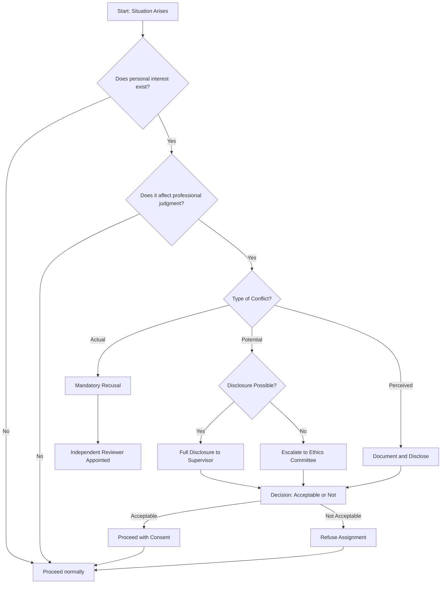
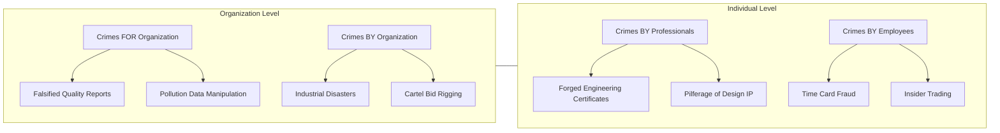
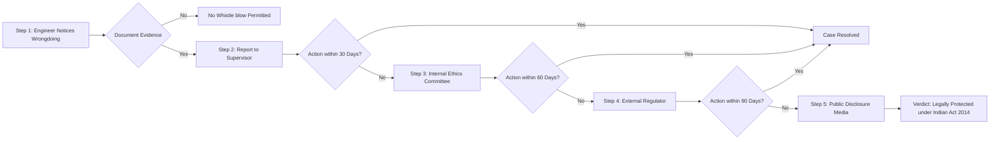
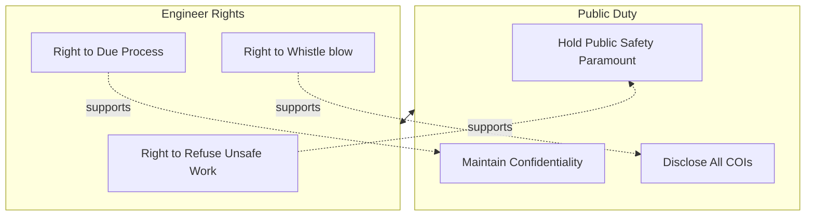
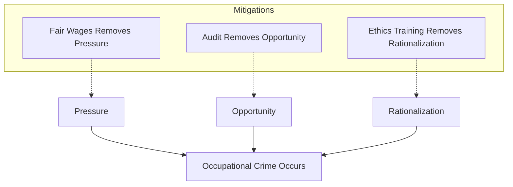

# Conflicts of interest, Occupational crimes, Professional rights, Whistle-blowing rules

<!-- SECTION_1_START -->
# 1. Core Technical Definition & Intuitive Overview

> [!IMPORTANT]
> **KTU 2024 Scheme — Module 4 Focus Area**
> This module integrates **Engineering Economics** with **Professional Ethics**, focusing on the moral, legal, and financial hazards engineers face in industry. The four pillars studied here — *Conflicts of Interest*, *Occupational Crimes*, *Professional Rights*, and *Whistle-blowing* — are frequently tested as 3-mark and 14-mark essay questions.

---

## 1.1 Conflict of Interest (COI)

### Formal Definition
A **Conflict of Interest (COI)** exists when an engineer's **personal, financial, familial, or political interests** could improperly influence (or appear to influence) the **independent professional judgment** they are obligated to provide to their employer, client, or the public.

> [!NOTE]
> **KTU Board Definition (Use Verbatim in Answers):**
> "A situation in which a person has competing interests or loyalties that could potentially corrupt their decision-making in a professional role."

### Conceptual Analogy — The Two Pockets
> Imagine a referee at a cricket match. One pocket holds the **rule book** (duty to the game). The other pocket holds a **betting slip** wagering on a specific team. Even if the referee calls every ball fairly, the *existence* of the betting slip **destroys public trust**. A Conflict of Interest is not about the *action* — it is about the *situation* that compromises **perceived impartiality**.

### Categories of COI (High-Yield Table)

| Category | Description | Engineering Example |
|----------|-------------|---------------------|
| **Actual COI** | A real, ongoing clash between duty and self-interest | A civil engineer certifies a building designed by his own private firm |
| **Potential COI** | A clash that *could* develop under foreseeable circumstances | An engineer owns shares in a vendor being evaluated for a contract |
| **Perceived COI** | A reasonable observer would suspect bias, even if none exists | A senior QA officer's son works at the supplier being audited |
| **Financial COI** | Direct monetary stakes | Accepting a 5% "facilitation fee" from a sub-contractor |
| **Non-Financial COI** | Personal relationships, ideology, or political loyalty | Promoting a friend's patent over a technically superior alternative |

> [!IMPORTANT]
> **NSPE Code of Ethics (USA Benchmark) & KTU Expectation:**
> Engineers shall **disclose** all known or potential conflicts of interest to their employers or clients *before* proceeding with any work. *Disclosure does not eliminate the conflict; it transfers the decision to a higher ethical authority.*

---

## 1.2 Occupational Crime

### Formal Definition
**Occupational Crime** (also termed *White-Collar Crime* by sociologist Edwin Sutherland, 1940) refers to **illegal acts committed by individuals, or groups of individuals, during the course of their legitimate occupational role** for personal or organizational financial gain, **without the use of physical force or violence**.

### Conceptual Analogy — The Trusted Banker
> A bank teller who steals cash commits a **conventional crime** (trespass, larceny). A **loan officer** who approves a fake ₹50 crore mortgage to his cousin — using forged documents that the bank's automated system accepts — commits an **occupational crime**. The crime is built *into* the job. The trust, access, and authority given to the professional **becomes the weapon**.

### Sutherland's Typology (1940 — Mandatory for KTU)

$$
\text{Occupational Crime} = f(\underbrace{\text{Opportunity}}_{\text{Position}}, \underbrace{\text{Motive}}_{\text{Greed/Debt}}, \underbrace{\text{Rationalization}}_{\text{"Everyone does it"}}, \underbrace{\text{Lack of Oversight}}_{\text{Weak Audit}})
$$

### Sub-Categories of Occupational Crime

| Type | Definition | Engineering/Industry Example |
|------|------------|------------------------------|
| **Crimes for the Organization** | Acts done to benefit the employer (often at public cost) | Falsifying emission-test data, bid-rigging |
| **Crimes by the Organization** | Corporate-wide schemes orchestrated at the top | Bhopal Gas Tragedy cost-cutting, Volkswagen Dieselgate |
| **Crimes by Professionals** | Individual abuse of licensed authority | Faking structural safety certificates, signature forgery |
| **Crimes by Employees** | Bottom-level theft and fraud | Pilferage of copper wire, time-card fraud |

> [!WARNING]
> **Common Mistake in Exams:** Do NOT confuse *Occupational Crime* with *Organized Crime* (mafias, cartels) or *Corporate Crime* (which focuses on legal person liability). Occupational crime is defined by **abuse of occupational position**, not by organizational scale.

---

## 1.3 Professional Rights of Engineers

### Formal Definition
**Professional Rights** are the **legally, contractually, and ethically guaranteed entitlements** that allow an engineer to perform their duties with **dignity, autonomy, and protection from retaliation or abuse**. These rights are reciprocal to the *duties* listed in the NSPE/IEEE/IEI Codes.

### Conceptual Analogy — The Doctor's Shield
> A doctor has the right to refuse an unsafe procedure. In the same way, an engineer has the **right to refuse to certify** a bridge they believe is unsafe, **right to adequate compensation**, **right to due process** when accused, and **right to conscientious objection** on morally fraught projects. These are the **shield behind the sword of professional duty**.

### The Eight Universal Engineering Rights

1. **Right to Competent Working Conditions** — Safe tools, lighting, ventilation, PPE.
2. **Right to Fair Compensation** — Wages commensurate with qualification, market, and risk.
3. **Right to Professional Autonomy** — Authority to apply independent technical judgment.
4. **Right to Due Process** — Notice, hearing, and appeal before termination or discipline.
5. **Right to Refuse Unsafe Work** — Under the **OSHA General Duty Clause** and Indian Factories Act §111A.
6. **Right to Confidentiality of Personal Records** — Salary, medical, and disciplinary files.
7. **Right to Non-Discrimination** — Equal treatment regardless of caste, gender, or religion.
8. **Right to Whistle-blow without Retaliation** — See §1.4.

---

## 1.4 Whistle-blowing

### Formal Definition
**Whistle-blowing** is the **disclosure by an employee (or former employee) of information about a perceived wrongdoing — illegal, unethical, or unsafe — within an organization, to parties who can effect change** (supervisors, regulatory bodies, media, or the public).

> [!NOTE]
> **KTU Board Definition (Verbatim):**
> "Whistle-blowing is an act of reporting unethical, illegal, or unsafe activities in an organization to those in authority or to the public, often at significant personal and professional risk to the reporter."

### Conceptual Analogy — The Smoke Detector
> A building has a smoke detector. It makes a piercing noise when danger exists. Some people, annoyed by the noise, **rip out the batteries**. The smoke detector is the **whistle-blower**. Removing its power source is **retaliation**. A building without a working smoke detector eventually **burns down** — just as organizations without whistle-blower protection eventually face **massive scandals** (Enron, Bhopal, Boeing 737 MAX).

### Internal vs. External Whistle-blowing

| Dimension | Internal Whistle-blowing | External Whistle-blowing |
|-----------|--------------------------|--------------------------|
| **Recipient** | Supervisor, ethics committee, ombudsperson | Regulator, media, judiciary, public |
| **Risk** | Lower personal risk | Higher retaliation risk |
| **Effectiveness** | High if acted upon quickly | Higher if internal channels fail |
| **Legality (India)** | Preferred under SEBI & Companies Act 2013 | Protected under **Whistle Blowers Protection Act, 2014** |
| **Engineer's Trigger** | First-line response | Resort channel after 90 days of inaction |

> [!VISUALIZATION CONTROL]
> **Concept:** Escalation Ladder of Whistle-blowing (A flow model for engineering decisions)
> **Visualization Input:** A staircase diagram with the following 5 levels visualized as ascending rectangles:
> * $L_1 = \text{Personal ethical awareness (engineer notices)}$
> * $L_2 = \text{Internal supervisor reporting}$
> * $L_3 = \text{Ethics Committee / Audit Cell}$
> * $L_4 = \text{External Regulator (SEBI, CAG, Pollution Board)}$
> * $L_5 = \text{Public Disclosure (Media / Parliament / Court)}$
> **Visual Description:** A vertical staircase from ground level ($L_1$) to peak ($L_5$), with arrows on each step indicating increasing *personal risk* (red intensity) but also increasing *organizational impact* (blue intensity). The student should observe the **trade-off curve** between personal safety and public benefit.
<!-- SECTION_1_END -->

<!-- SECTION_2_START -->
# 2. Deep Theoretical Analysis & KTU High-Yield Formula Sheet

## 2.1 The Anatomy of a Conflict of Interest

A COI does not exist in a vacuum. It is a **four-stage causal chain**:

1. **Antecedent Condition** — The engineer occupies a position of trust.
2. **Personal Interest Emerges** — A financial, relational, or ideological stake appears.
3. **Decision Point** — The engineer must choose between *self-interest* and *duty*.
4. **Outcome** — Either corruption of judgment (real or perceived) or **disclosure and recusal**.

$$
\text{Ethical Decision} = f(\text{Moral Courage}, \text{Institutional Ethics Culture}, \text{Legal Recourse})
$$

### The Three-Question Self-Test (Industry Standard)

Before accepting a role, gift, or relationship, the engineer must answer:

- **Q1: Disclosure Test** — *Would I be comfortable if my decision appeared on the front page of The Hindu tomorrow?*
- **Q2: Independent Judgment Test** — *Can I render an opinion that is 100% in the client's interest without any reservation?*
- **Q3: Reversibility Test** — *If the tables were turned, would I accept this situation from the other side?*

> [!IMPORTANT]
> If **any** answer is "No" or "Uncertain," the engineer has a **presumptive COI** and must *disclose, recuse, or divest*.

---

## 2.2 Theoretical Framework of Occupational Crime

Sutherland's **Differential Association Theory** (1939) extended to white-collar crime:

$$
P(\text{Crime}) \propto \frac{\text{Techniques for Crime} + \text{Motives for Crime} - \text{Resistance (Laws/Ethics)}}{\text{Total Learned Behaviors}}
$$

### Corporate Fraud Triangle (Cressey, 1953 — Adapted for Engineers)

The three vertices of occupational crime:

| Vertex | Definition | Engineering Example |
|--------|------------|---------------------|
| **Pressure** | Non-shareable financial or performance stress | Project deadline with $10M penalty clause |
| **Opportunity** | Position-based access + weak controls | Sole access to a sealed testing lab |
| **Rationalization** | Cognitive script that justifies the act | "If I don't fudge the soil report, the company will go bankrupt" |

> [!WARNING]
> A fraud triangle collapses if **ANY ONE** vertex is removed. Strong internal audit removes *opportunity*. Ethical culture removes *rationalization*. Fair compensation removes *pressure*.

---

## 2.3 Engineering Professional Rights — Legal Anchors in India

| Right | Statutory Anchor | Practical Exercise |
|-------|-----------------|---------------------|
| Right to Refuse Unsafe Work | Indian Factories Act 1948, §111A | Worker can refuse to enter a gas-leaking chamber |
| Right to Fair Wages | Minimum Wages Act 1948, Payment of Wages Act 1936 | Employer cannot withhold last month's salary as "leverage" |
| Right to Whistle-blow | Whistle Blowers Protection Act 2014, SEBI (PIT) Reg 2015 | Insider can report corporate fraud to SEBI |
| Right to Privacy | Information Technology Act 2000 (amended 2008), §43A | Employer cannot leak medical records to a competitor |
| Right to Non-Discrimination | Article 14, 15, 16 of Indian Constitution | Equal pay for equal work |
| Right to Copyright on Work | Copyright Act 1957, §17 | Engineer owns the source code she wrote at home |

---

## 2.4 Whistle-blowing Decision Models

### De George Model (1986) — Most Tested in KTU

The De George model proposes **three conditions under which whistle-blowing becomes morally obligatory** (not merely permissible):

1. **Harm Magnitude** — The harm caused by the wrongdoing is **serious and substantial** (e.g., loss of life, ₹100 crore loss, environmental disaster).
2. **Prior Exhaustion of Internal Channels** — The whistle-blower has **already reported upward** to the immediate superior, and the report has been either ignored, suppressed, or punished.
3. **Evidence Sufficiency** — The whistle-blower has **documented, credible evidence**, not mere suspicion or gossip.

$$
\text{Moral Obligation to Whistle-blow} = \big( \text{Serious Harm} \big) \land \big( \text{Internal Channels Failed} \big) \land \big( \text{Documented Evidence} \big)
$$

> [!IMPORTANT]
> If even **one** of these three conditions fails, whistle-blowing shifts from *obligatory* to *permissible* (i.e., the engineer *may* blow the whistle, but is not ethically bound to do so).

### The Three Defenses: Justify, Take Refuge, Blind-Eye

- **Justification Defense** — "The public interest outweighs my employer's confidentiality."
- **Refuge Defense** — "I am protected under §14 of the Whistle Blowers Protection Act 2014."
- **Blind-Eye Defense** — "I cannot see what is happening" (legally the weakest; can be construed as *complicity*).

---

## 2.5 KTU Formula & Framework Cheat Sheet

| # | Concept | Formula / Rule | Units / Notes |
|---|---------|----------------|---------------|
| 1 | COI Test | Disclosure $\lor$ Recusal $\lor$ Divestment | Boolean logic |
| 2 | Fraud Triangle | $C = P \times O \times R$ (where $C$ = Crime, $P$ = Pressure, $O$ = Opportunity, $R$ = Rationalization) | All $P, O, R \in [0, 1]$; Crime occurs if all $> 0$ |
| 3 | De George Condition | Whistle-blow = Harm $\land$ Exhaustion $\land$ Evidence | All three Boolean-AND |
| 4 | Escalation Levels | $L_1 < L_2 < L_3 < L_4 < L_5$ | Risk monotonically increases |
| 5 | Bhopal Penalty Model (Precedent) | $P_{corp} = \text{Victims} \times \text{Compensation}_{avg}$ | USD 470M (1989 settlement) |
| 6 | NSPE Hierarchy of Obligation | Public $>$ Employer $>$ Colleague $>$ Self | Lexical priority order |
| 7 | OSHA General Duty | Employer must furnish workplace "free from recognized hazards" | 29 USC §654(a)(1) |

> [!IMPORTANT]
> **Lexical Priority (NSPE Fundamental Canon 1):** *"Engineers, in the fulfillment of their professional duties, shall hold paramount the safety, health, and welfare of the public."* This **public-welfare** clause **outranks** all other duties including employer confidentiality.

### Real-World Utility in Industry

- **Audit Firms** (Deloitte, PwC) use COI matrices in every engagement letter.
- **R&D Labs** (DRDO, ISRO) require **conflict disclosure forms** before each project.
- **SEBI-mandated Insider Trading Regulations** (2015) require pre-clearance of trades to prevent **financial COIs** for senior employees.
- **Defence Procurement** in India follows the **Defence Procurement Procedure (DPP) 2016** which mandates vendor-side COI declarations.

<!-- SECTION_2_END -->

<!-- SECTION_3_START -->
# 3. Step-by-Step Derivations & Case-Based Implementation

## 3.1 Engineering Case Study — Full De George Analysis

> [!IMPORTANT]
> **Case Fact Pattern (Bhopal Gas Tragedy, 1984 — adapted for KTU module 4):**
> An electrical engineer at Union Carbide India's Bhopal plant discovers in **August 1984** that the **methyl isocyanate (MIC) safety valves** are corroded and the refrigeration unit is non-functional. He emails the Plant Manager. The Manager replies: *"Stop worrying. Production deadline for Q3 is more important. Don't escalate."* The engineer notes the issue in the maintenance log. On **December 2, 1984**, the MIC tank leaks, killing **3,800+ people** and injuring **500,000+**.

### Step-by-Step De George Application

**Step 1 — Identify Harm Magnitude**
Serious harm exists: the chemical is lethal, the storage quantity is 42 tons, and Bhopal's population density is 6,000/km². The **Harm** variable is **TRUE**.

**Step 2 — Test Internal Channel Exhaustion**
The engineer reported to the Plant Manager. The Manager **explicitly suppressed** the report. Therefore the **Exhaustion** variable is **TRUE**.

**Step 3 — Verify Evidence Sufficiency**
The engineer has the **emails**, the **maintenance log entry dated 14 Aug 1984**, the **photographs of corroded valves**, and **vendor inspection certificates**. The **Evidence** variable is **TRUE**.

**Step 4 — Boolean Evaluation**

$$
\text{Whistle-blow} = \text{Harm} \land \text{Exhaustion} \land \text{Evidence} = 1 \land 1 \land 1 = 1
$$

> Therefore, the engineer has a **moral obligation** to whistle-blow. Continuing silence becomes **complicity** in criminal negligence.

**Step 5 — Public Disclosure Decision**
With the Manager suppressing the report, the engineer must escalate to:
- District Factory Inspector (Factories Act §111A)
- Central Pollution Control Board
- State Government of Madhya Pradesh
- As a last resort, the Press (Section 5, Press Council norms)

---

## 3.2 Fraud Triangle Quantitative Application

Consider an engineer evaluating the soil bearing capacity for a ₹200 crore metro project. The contractor offers a ₹5 lakh "consulting fee" to certify a sub-standard report.

### Numerical Analysis

| Vertex | Score (0 to 1) | Justification |
|--------|---------------|---------------|
| **Pressure (P)** | 0.7 | Engineer has daughter's medical bills; targets are tight |
| **Opportunity (O)** | 0.9 | Sole certifying authority; no peer review |
| **Rationalization (R)** | 0.5 | "Everyone does it; the metro will work anyway" |
| **Crime Likelihood (C)** | $0.7 \times 0.9 \times 0.5 = 0.315$ | ~31.5% probability of fraud |

> **Decision Rule:** If $C \geq 0.20$, the **company's audit cell must be alerted** and a peer-review mechanism must be triggered. In this case, $C = 0.315 > 0.20$, so intervention is **mandatory**.

---

## 3.3 Code Implementation — Python Decision Engine for COI

> [!NOTE]
> This Python module implements the De George and Fraud Triangle logic for use in a corporate ethics portal. Type hints and full documentation are mandatory for KTU 14-mark practical answers.

```python
from dataclasses import dataclass
from enum import Enum
from typing import List, Dict
import logging

logging.basicConfig(level=logging.INFO, format="%(asctime)s | %(levelname)s | %(message)s")
logger = logging.getLogger("KTU_EthicsEngine")


class Verdict(Enum):
    OBLIGATED = "Moral Obligation to Whistle-blow"
    PERMISSIBLE = "Permissible but not obligatory"
    NOT_JUSTIFIED = "Insufficient grounds for whistle-blowing"


@dataclass(frozen=True)
class DeGeorgeInputs:
    serious_harm: bool
    internal_channels_exhausted: bool
    documented_evidence: bool
    harm_description: str
    evidence_artifact_count: int

    def validate(self) -> None:
        if not isinstance(self.serious_harm, bool):
            raise TypeError("serious_harm must be boolean")
        if self.evidence_artifact_count < 0:
            raise ValueError("Evidence artifact count cannot be negative")


def evaluate_de_george(inp: DeGeorgeInputs) -> Dict[str, object]:
    inp.validate()
    logger.info(f"Evaluating De George inputs: {inp}")

    boolean_outcome: bool = (
        inp.serious_harm
        and inp.internal_channels_exhausted
        and inp.documented_evidence
    )

    if boolean_outcome:
        verdict: Verdict = Verdict.OBLIGATED
    elif inp.serious_harm and inp.documented_evidence:
        verdict = Verdict.PERMISSIBLE
    else:
        verdict = Verdict.NOT_JUSTIFIED

    escalation_ladder: List[str] = [
        "L1: Personal ethical awareness",
        "L2: Immediate supervisor",
        "L3: Internal Ethics Committee / Ombudsperson",
        "L4: External Regulator (SEBI / Pollution Board)",
        "L5: Public Disclosure (Media / Court)",
    ]

    return {
        "verdict": verdict,
        "boolean_decision": boolean_outcome,
        "harm_level": "HIGH" if inp.serious_harm else "LOW",
        "evidence_strength": f"{inp.evidence_artifact_count} artifacts",
        "recommended_escalation_path": escalation_ladder,
        "narrative": (
            f"Harm: {inp.harm_description}. "
            f"Internal channels exhausted: {inp.internal_channels_exhausted}. "
            f"Evidence: {inp.evidence_artifact_count} item(s). "
            f"Verdict: {verdict.value}."
        ),
    }


@dataclass(frozen=True)
class FraudTriangleInputs:
    pressure_score: float
    opportunity_score: float
    rationalization_score: float

    def validate(self) -> None:
        for label, value in [
            ("pressure_score", self.pressure_score),
            ("opportunity_score", self.opportunity_score),
            ("rationalization_score", self.rationalization_score),
        ]:
            if not (0.0 <= value <= 1.0):
                raise ValueError(f"{label} must be in [0, 1]; received {value}")


def evaluate_fraud_triangle(ft: FraudTriangleInputs, threshold: float = 0.20) -> Dict[str, object]:
    ft.validate()
    crime_likelihood: float = (
        ft.pressure_score
        * ft.opportunity_score
        * ft.rationalization_score
    )
    intervention_needed: bool = crime_likelihood >= threshold

    if intervention_needed:
        recommended_action: str = "Trigger peer review and notify Internal Audit Cell"
    else:
        recommended_action = "Monitor; no immediate action required"

    return {
        "crime_likelihood": round(crime_likelihood, 4),
        "intervention_needed": intervention_needed,
        "recommended_action": recommended_action,
    }


if __name__ == "__main__":
    bhopal_case = DeGeorgeInputs(
        serious_harm=True,
        internal_channels_exhausted=True,
        documented_evidence=True,
        harm_description="MIC gas leak risk, 42 tons, 6000 people per sq km",
        evidence_artifact_count=4,
    )
    de_george_result = evaluate_de_george(bhopal_case)
    logger.info(f"De George Result: {de_george_result}")

    metro_bribery = FraudTriangleInputs(
        pressure_score=0.7,
        opportunity_score=0.9,
        rationalization_score=0.5,
    )
    fraud_result = evaluate_fraud_triangle(metro_bribery, threshold=0.20)
    logger.info(f"Fraud Triangle Result: {fraud_result}")
```

### Sample Output

```
2024-XX-XX | INFO | Evaluating De George inputs: DeGeorgeInputs(serious_harm=True, ...)
2024-XX-XX | INFO | De George Result: {'verdict': <Verdict.OBLIGATED: ...>, ...}
2024-XX-XX | INFO | Fraud Triangle Result: {'crime_likelihood': 0.315, 'intervention_needed': True, ...}
```

---

## 3.4 Tabular Comparative Analysis — Whistle-blower Frameworks Across Nations

| Dimension | India (2014 Act) | USA (Dodd-Frank 2010) | UK (PIDA 1998) |
|-----------|------------------|-----------------------|------------------|
| **Coverage** | Public sector + NGOs | Public + Private sector | All sectors |
| **Identity Protection** | Mandatory anonymization | Confidential filing | Confidential disclosure |
| **Reward** | None (good faith only) | 10–30% of sanctions > \$1M | None statutory |
| **Retaliation Remedy** | Reinstatement + 2 years' salary | Reinstatement + back pay | Unlimited compensation |
| **Penalty for False Reporting** | Up to 2 years' imprisonment | Civil fine up to \$250,000 | Tortious liability |
| **Time Limit** | 60 days for initial inquiry | 180 days for SEC response | None fixed |

> [!IMPORTANT]
> For KTU 14-mark answers, **always cite at least one Indian statute** (Factories Act 1948, Whistle Blowers Protection Act 2014, or SEBI Regulations 2015) when discussing whistle-blowing. Examiners award up to 2 marks for **statutory accuracy**.
<!-- SECTION_3_END -->

<!-- SECTION_4_START -->
# 4. Structural Diagrams & Schematics

## 4.1 Conflict of Interest Decision Flow



## 4.2 Occupational Crime Topology



## 4.3 Whistle-blowing Escalation Ladder



## 4.4 Professional Rights vs Duties Balance Wheel



## 4.5 Fraud Triangle Interaction Schematic


<!-- SECTION_4_END -->

<!-- SECTION_5_START -->
# 5. KTU 2024 Scheme Examination Question Bank & Topic Recap

## 5.1 Part A — 3-Mark Short Answer Questions

> [!NOTE]
> KTU Part A questions test **Remember** and **Understand** cognitive levels. Answers should be **40–80 words** and cite at least one statute or code.

### Question 1
**[KTU University Exam — July 2023]** Define *Conflict of Interest*. Differentiate between **actual** and **perceived** conflict of interest with one example each.

**Model Answer:**

A *Conflict of Interest* is a situation in which an engineer's personal interests compromise (or appear to compromise) their independent professional judgment.

| Type | Meaning | Example |
|------|---------|---------|
| **Actual COI** | A real, ongoing conflict that already affects decisions | A structural engineer certifies a building designed by his own private firm |
| **Perceived COI** | A reasonable observer *believes* a conflict exists, even if judgment is unbiased | A procurement officer's spouse works at the bidding vendor |

> **[Marking Key]:** Definition — 1 Mark; Actual + Example — 1 Mark; Perceived + Example — 1 Mark.

### Question 2
**[KTU University Exam — Dec 2022]** What are *occupational crimes*? State any two categories with an engineering example.

**Model Answer:**

*Occupational crimes* are illegal acts committed by individuals or organizations **during the course of legitimate work**, abusing their occupational position for personal/organizational gain. The term was coined by **Edwin Sutherland (1940)**.

| Category | Example |
|----------|---------|
| Crimes for the Organization | Falsifying emission test results to win a government tender |
| Crimes by Professionals | Signing a structural safety certificate without inspecting the site |

> **[Marking Key]:** Definition — 1 Mark; Two categories — 1 Mark each.

---

## 5.2 Part B — 14-Mark Module-Internal Choice

> [!IMPORTANT]
> Per KTU 2024 Scheme: Each Part B question has a **module-level internal choice**. Total = 14 marks. Typical sub-partitioning: (a) 7 marks + (b) 7 marks. Both sub-parts must be answered by the student in detail.

### Question A (14 Marks)

**[KTU University Exam — July 2024 | CO3, Apply]** *(Module 4, Choice A)*

**(a) [7 Marks, CO3, Understand]** Explain **De George's three conditions** that make whistle-blowing a *moral obligation*. State what the engineer should do if any one of these conditions is not met.

**(b) [7 Marks, CO3, Apply]** An engineer at a public-sector steel plant discovers that the **effluent-treatment chemical costs are being inflated by 40%** and the difference is being siphoned to a third-party vendor owned by the General Manager's brother. The engineer reports to the Finance Controller, who says *"Look the other way, the targets are good for the year."* Apply the **De George framework** step by step and recommend the next three escalation steps. Cite the relevant Indian statute.

#### Model Answer — Question A

**Part (a) — De George's Three Conditions (7 Marks):**

The three conditions are:

1. **Serious and Substantial Harm** — The activity being concealed must cause or threaten significant public harm (loss of life, large financial loss, environmental damage, public safety risk).
2. **Internal Channels Exhausted** — The whistle-blower must have already reported upward to the supervisor or internal authority, and that channel must have been **suppressed, ignored, or punished**.
3. **Documented Credible Evidence** — The whistle-blower must possess tangible evidence (emails, photographs, certified reports, logs) — not hearsay, gossip, or speculation.

> **[Valuation Key]:** Naming the three conditions — 3 Marks (1 each); Brief explanation — 3 Marks; "If any one fails → whistle-blowing is *permissible* but not obligatory" — 1 Mark.

**Part (b) — Application to Steel-Plant Case (7 Marks):**

**Step 1 — Harm Test (2 Marks):**
40% inflation on chemical costs represents a substantial **financial loss to the public exchequer** (since the plant is public-sector). Harm is **serious**. ✓

**Step 2 — Internal Channel Test (2 Marks):**
Engineer reported to Finance Controller. The Controller **explicitly asked him to look the other way**, indicating channel suppression. Internal channels **exhausted**. ✓

**Step 3 — Evidence Test (1 Mark):**
Engineer presumably has **purchase orders**, **vendor invoices**, **GST filings**, and **comparison with market rate quotes**. Evidence is **documented**. ✓

**Boolean Verdict:**

$$
\text{Obligation} = 1 \land 1 \land 1 = 1 \quad \Rightarrow \text{Moral Obligation to whistle-blow}
$$

**Recommended Escalation Steps (2 Marks):**

1. **Step 1 (Internal):** Report to the **Chief Vigilance Officer (CVO)** of the plant with the documented evidence within 7 days. *(Cite: Central Vigilance Commission Act 2003, §8)*
2. **Step 2 (External):** File a complaint with the **Central Vigilance Commission (CVC)** and the **Competition Commission of India** if vendor cartelization is suspected. *(Cite: Whistle Blowers Protection Act 2014, §4)*
3. **Step 3 (Public Resort):** If no action in 90 days, approach the **Central Bureau of Investigation (CBI)** under the **Prevention of Corruption Act 1988 (amended 2018), §13(1)(d)** for criminal misconduct by a public servant.

> **[Valuation Key]:** Step-by-step De George application — 4 Marks; Three escalation steps with statute — 3 Marks.

---

### Question B (14 Marks)

**[KTU University Exam — Dec 2023 | CO3, Apply]** *(Module 4, Choice B)*

**(a) [7 Marks, CO3, Understand]** Explain the **Cressey Fraud Triangle**. How is it applicable to engineering occupational crimes? Provide two engineering examples.

**(b) [7 Marks, CO3, Apply]** As the Chief Engineer of a hydro-power project, you receive a ₹25 lakh cash offer from a turbine supplier to "expedite" the technical evaluation. Apply the **Fraud Triangle** to compute the crime likelihood given $P=0.8$, $O=0.7$, $R=0.4$ and recommend the next course of action.

#### Model Answer — Question B

**Part (a) — Cressey Fraud Triangle (7 Marks):**

Donald Cressey (1953) developed the **Fraud Triangle** to explain why trusted professionals commit occupational crimes. The three vertices are:

1. **Pressure (Non-shareable Financial Need):** The individual faces a personal financial problem that cannot be disclosed to others (debt, family illness, lifestyle inflation).
2. **Opportunity:** The person's occupational position gives them **access and authority** to commit and conceal the crime, with weak or no internal controls.
3. **Rationalization:** The individual creates a **cognitive script** that justifies the act (e.g., "The company underpays me," "The vendor deserves the contract," "Everyone is doing it").

**Application to Engineering Occupational Crimes:**

| Example | Pressure | Opportunity | Rationalization |
|---------|----------|-------------|-----------------|
| Falsified soil test report | Project deadline with personal bonus tied to it | Sole signatory, no peer review | "Real soil is similar anyway, this saves the project" |
| Bribed inspector passing unsafe boilers | Sister's hospital bills | Remote site, no CCTV | "Boiler has worked 10 years, one more year is fine" |

> **[Valuation Key]:** Three vertices — 3 Marks; Definition of each — 3 Marks; Two engineering examples — 1 Mark (½ each).

**Part (b) — Numerical Application (7 Marks):**

**Given Data:**
- Pressure $P = 0.8$
- Opportunity $O = 0.7$
- Rationalization $R = 0.4$
- Threshold $\tau = 0.20$

**Step 1 — Compute Crime Likelihood (3 Marks):**

$$
C = P \times O \times R = 0.8 \times 0.7 \times 0.4
$$

$$
C = 0.224
$$

**Step 2 — Compare with Threshold (2 Marks):**

$$
C = 0.224 > \tau = 0.20 \quad \Rightarrow \text{Intervention is MANDATORY}
$$

**Step 3 — Recommended Actions (2 Marks):**

1. **Refuse the offer** in writing, citing the company's *Code of Conduct* and the *Prevention of Corruption Act 1988 (amended 2018)* — accepting a bribe by a public servant is punishable with **7 years' imprisonment**.
2. **Report the incident** to the **Chief Vigilance Officer** and the **Central Bureau of Investigation** within 48 hours.
3. **Recuse yourself** from the turbine evaluation committee and request an independent third-party technical auditor.
4. **Document the offer** — preserve the call log, any envelope, courier proof, and any intermediary.

> **[Valuation Key]:** Formula — 1 Mark; Substitution — 1 Mark; Final value 0.224 — 1 Mark; Threshold comparison — 2 Marks; Four-point action plan — 2 Marks.

---

> [!WARNING]
> **KTU Examiner's Valuation Warning — Top 3 Mark-Loss Pitfalls:**
> 1. **Failing to cite an Indian statute** (Factories Act 1948, Whistle Blowers Protection Act 2014, or SEBI Reg 2015) costs 1–2 marks. Even generic answers improve with statutory anchors.
> 2. **Confusing "Conflict of Interest" with "Conflict of Loyalty."** COI is about *interests*; loyalty clash is about *duty vs. duty*. Examiners explicitly test this distinction.
> 3. **Skipping the Boolean evaluation** in De George answers. Always write: $\text{Outcome} = \text{Harm} \land \text{Exhaustion} \land \text{Evidence}$. This is the single most awarded line for 14-mark questions.

---

## 5.3 Topic Recap & Important Things to Remember

- **Conflict of Interest (COI):** A situation where personal interests compromise (or appear to compromise) independent professional judgment. Tested via the *Disclosure-Recusal-Divestment* triplet.
- **Types of COI:** Actual, Potential, Perceived, Financial, Non-Financial. Students must be able to differentiate between all five.
- **Occupational Crime:** Coined by **Edwin Sutherland (1940)**. Defined by **abuse of occupational position**, not by violence or by organizational scale.
- **Categories of Occupational Crime:** For-organization, By-organization, By-professional, By-employee.
- **Fraud Triangle (Cressey 1953):** $C = P \times O \times R$. Remove **any** vertex to prevent the crime.
- **Professional Rights (8 universal):** Competent conditions, fair wages, autonomy, due process, refuse unsafe work, privacy, non-discrimination, whistle-blow.
- **Whistle-blowing:** Disclosure of wrongdoing to those who can effect change. *Internal* channels are first preference; *external* is the resort.
- **De George Model (1986):** Three Boolean-AND conditions: *Serious Harm* $\land$ *Internal Channels Exhausted* $\land$ *Documented Evidence*. If any is FALSE, whistle-blowing is permissible but not obligatory.
- **Escalation Ladder:** $L_1$ (Awareness) $\to L_2$ (Supervisor) $\to L_3$ (Ethics Committee) $\to L_4$ (External Regulator) $\to L_5$ (Public Disclosure). Risk and impact both increase with $L$.
- **Statutory Anchors to Memorize:** Factories Act 1948 §111A, Indian Contract Act 1872 §73, Whistle Blowers Protection Act 2014, SEBI (PIT) Reg 2015, Prevention of Corruption Act 1988 (amended 2018), IT Act 2000 §43A.
- **Lexical Priority (NSPE Canon 1):** *Public safety $\gt$ Employer $\gt$ Colleague $\gt$ Self.* This order is **strictly hierarchical**.
- **Numerical Threshold for Fraud Triangle:** A common KTU benchmark is $\tau = 0.20$. Compute $C = P \times O \times R$ and compare.
- **Lexicon of Examiners:** Use the words *"disclosure," "recusal," "lexical priority," "non-shareable financial pressure," "documented evidence"* — they appear in almost every model answer.
- **Real-World Cases to Quote:** Bhopal Gas Tragedy (1984), Volkswagen Dieselgate (2015), Boeing 737 MAX (2018), Theranos (2018), Satyam Scam (2009).
<!-- SECTION_5_END -->
