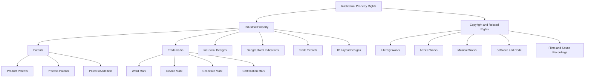
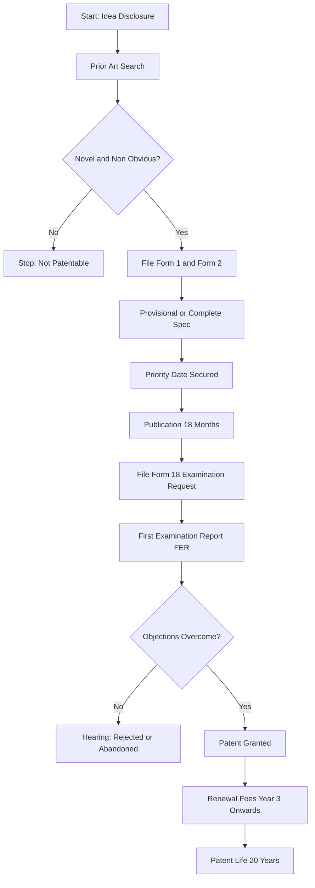
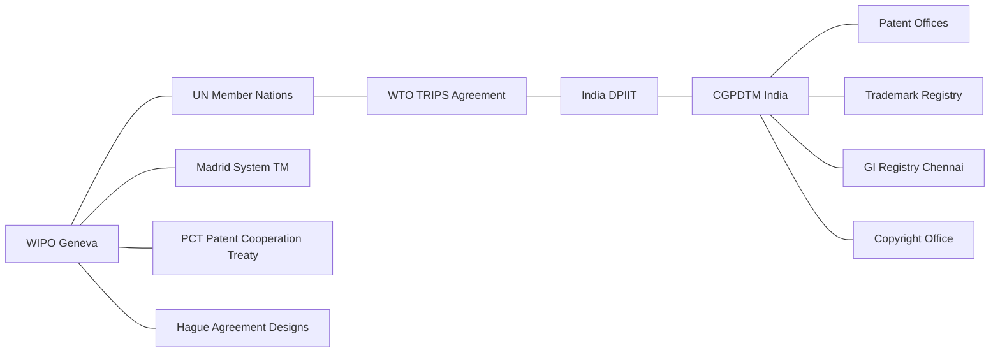
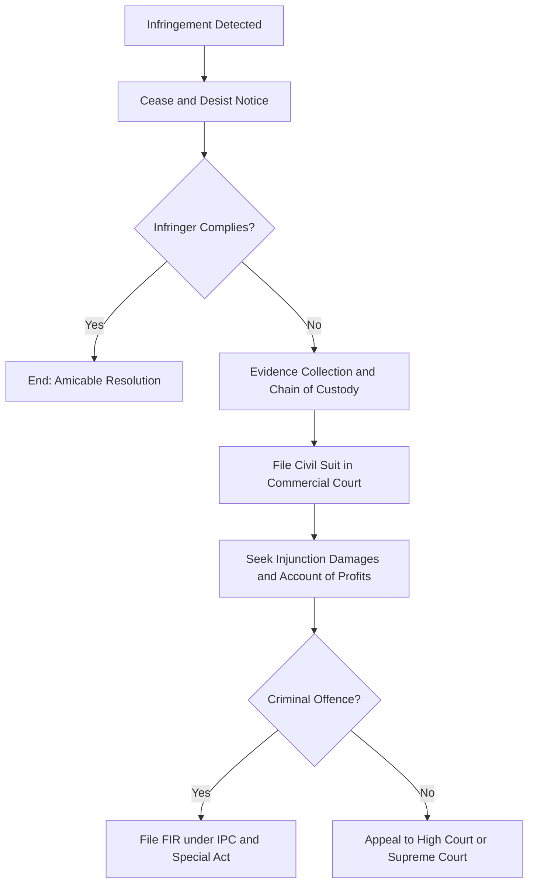

# Intellectual Property Rights (IPR) and institutional parameters

<!-- SECTION_1_START -->
# Intellectual Property Rights (IPR) & Institutional Parameters

> [!NOTE]
> **Formal KTU 2024 Definition (Syllabus-aligned):**
> *Intellectual Property Rights (IPR)* are the legally recognized exclusive rights赋予 to creators, inventors, and owners of original works of the mind, intangible assets, and industrial innovations. These rights grant the holder a temporary statutory monopoly to control the use, commercial exploitation, and distribution of their creations, thereby incentivizing innovation while balancing public interest.

## 1.1 The Core Philosophy of IPR
Engineering innovation rarely exists in a vacuum. When a student designs a novel suspension system, a new algorithm, or a unique industrial process, that creation has **commercial and ethical value** that must be protected — just like a building or a piece of land is protected by physical property law.

> [!IMPORTANT]
> **Why IPR Exists:** To convert *knowledge* into a *legally tradable asset*, encouraging disclosure (in exchange for protection) and preventing unauthorized duplication.

## 1.2 Intuitive Analogy — The "Invisible Land"
Imagine a brilliant farmer in Kerala who develops a new hybrid coconut variety that yields **40% more** than standard palms.

| Physical Property Analogy | Intellectual Property Analogy |
| :--- | :--- |
| The farmer **owns the land** | The inventor **owns the idea/process** |
| Trespassing is illegal | **Infringement** is illegal |
| Land can be sold, leased, inherited | IP can be **licensed, assigned, or transferred** |
| Boundaries defined by fences | Boundaries defined by **claims, claims, and registration** |

> [!TIP]
> Just as you cannot "see" a radio wave but it can be owned (spectrum licenses), an *idea* is invisible but legally ownable through proper documentation and registration.

## 1.3 Core Branches of IPR
The KTU 2024 syllabus mandates a comprehensive understanding of the following typology:

1. **Patents** — Protection of inventions and processes.
2. **Trademarks** — Protection of brand identity (logos, names, slogans).
3. **Copyrights** — Protection of original literary, artistic, musical, and software works.
4. **Industrial Designs** — Protection of the aesthetic/visual appearance of an article.
5. **Geographical Indications (GI)** — Protection of products tied to a specific region (e.g., *Alphonso Mango*, *Kerala Kasaragod Teak*).
6. **Trade Secrets** — Protection of confidential business information (e.g., the *Coca-Cola formula*).
7. **Semiconductor Integrated Circuit Layout Design**

## 1.4 Institutional Parameters — The Global and National Guardians
An *Institutional Parameter* refers to the network of organizations, treaties, and legislative bodies that create, govern, and enforce IP laws.

> [!IMPORTANT]
> **Key Institutional Pillars (KTU High-Yield):**
> * **WIPO** — World Intellectual Property Organization (UN body, Geneva, founded **1967**)
> * **WTO / TRIPS Agreement** — Trade-Related Aspects of Intellectual Property Rights (signed **1994**, effective from **1995**)
> * **Indian Patent Office** — Administered under the **Controller General of Patents, Designs & Trade Marks (CGPDTM)**
> * **Indian IP Statutes:** Indian Patents Act **1970** (amended 2005), Copyright Act **1957**, Trade Marks Act **1999**, Geographical Indications of Goods Act **1999**, Designs Act **2000**, Semiconductor IC Layout Design Act **2000**

## 1.5 The Engineer's Ethical Stance on IPR
> [!WARNING]
> As a B.Tech engineer, you are professionally bound (under the **Institution of Engineers (India) Code of Ethics** and the **KTU graduate attributes**) to:
> * Respect third-party IP during project development.
> * Avoid **plagiarism** in research papers and code.
> * Disclose IP generated during employment to your organization (unless contractually exempted).
> * Refuse to knowingly infringe patents even under employer pressure.

## 1.6 Visualizing the IPR Ecosystem
> [!VISUALIZATION CONTROL]
> **Concept:** The hierarchical relationship between creators, IP, institutions, and society.
> **Desmos / Conceptual Graph Axes:**
> * $x$-axis: Stages of Innovation (Idea $\rightarrow$ Disclosure $\rightarrow$ Registration $\rightarrow$ Commercialization)
> * $y$-axis: Legal Protection Level (Low $\rightarrow$ High)
> * **Key Plot Points:** *(Idea, Low)*, *(Patent Filed, Medium)*, *(Patent Granted, High)*, *(Trademark Registered, High)*
> **Visual Description:** A staircase-like ascending curve — showing that as innovation matures and is formally registered, the legal shield grows stronger, peaking at the "Granted" state and then declining (time-bound) at expiry.
<!-- SECTION_1_END -->

<!-- SECTION_2_START -->
# Deep Theoretical Analysis & KTU High-Yield Formula Sheet

## 2.1 Patent Law — The Crown Jewel of Engineering IP
A **patent** is an exclusive statutory right granted for a *novel, non-obvious, and useful* invention, providing the owner the right to exclude others from making, using, or selling the invention for a limited period.

> [!IMPORTANT]
> **Three Pillars of Patentability (Section 2(d), Indian Patents Act 1970):**
> 1. **Novelty** — Must be genuinely new, never disclosed publicly before the priority date.
> 2. **Inventive Step (Non-Obviousness)** — A person skilled in the art must not find it obvious.
> 3. **Industrial Application (Utility)** — Must be capable of being made or used in industry.

### 2.1.1 What CANNOT be Patented in India (Section 3 & 4)
* Frivolous inventions contrary to natural laws
* Inventions harmful to public order, morality, or health
* Mere discoveries of scientific principles
* Atomic energy-related inventions
* Plants and animals in whole or any part (other than microorganisms)
* A method of agriculture or horticulture
* Mathematical or business methods
* Computer programs *per se* (but software-implemented inventions are often patented)
* Topography of integrated circuits

## 2.2 Comparative Anatomy of Major IPRs
> [!TIP]
> **KTU Examiner's Mantra:** Most valuation mistakes occur when students confuse *what is protected*, *how long it lasts*, and *whether registration is mandatory*. Memorize the table below.

| IPR Type | Protects | Duration (India) | Registration Mandatory? | Key Statutory Body |
| :--- | :--- | :--- | :--- | :--- |
| **Patent** | Inventions, Processes, Products | **20 years** from filing date | Yes | Patent Office (CGPDTM) |
| **Trademark** | Brand name, Logo, Tagline | **10 years**, renewable indefinitely | Recommended (provides better rights) | Registry of Trademarks |
| **Copyright** | Literary, Artistic, Musical, Software, Films | **Life of author + 60 years** (literary); 60 years (films/sound) | No (auto-arises on creation) | Copyright Office |
| **Industrial Design** | Aesthetic appearance/shape of an article | **10 years**, extendable to **15 years** | Yes | Patent Office (Design Wing) |
| **Geographical Indication** | Region-specific products | **10 years**, renewable indefinitely | Yes (mandatory) | GI Registry, Chennai |
| **Trade Secret** | Confidential business info | Indefinite (as long as secrecy maintained) | No (un-registered right) | Protected under common law & contract |
| **IC Layout Design** | Topography of integrated circuits | **10 years** | Yes | Semiconductor IC Design Registry |

## 2.3 The TRIPS Agreement — The Global Equalizer
The **Trade-Related Aspects of Intellectual Property Rights (TRIPS)** agreement, administered under the **WTO**, establishes minimum standards of IP protection for all member nations.

> [!NOTE]
> **Seven TRIPS-Mandated IP Categories:**
> 1. Copyright and Related Rights
> 2. Trademarks
> 3. Geographical Indications
> 4. Industrial Designs
> 5. Patents
> 6. Layout Designs of Integrated Circuits
> 7. Undisclosed Information (Trade Secrets)

* **Minimum Patent Term under TRIPS:** 20 years from the filing date.
* **Enforcement:** TRIPS mandates civil, criminal, and border (customs) enforcement mechanisms.
* **India's Compliance:** India amended its Patent Act in **2005** specifically to comply with TRIPS — notably allowing **product patents in pharmaceuticals and agrochemicals** for the first time.

## 2.4 Institutional Architecture — The IP Governance Pyramid
```
APEX (Global)    →  WIPO (UN), WTO/TRIPS
NATIONAL         →  DPIIT (Dept. for Promotion of Industry & Internal Trade)
                    Ministry of Electronics & IT (MeitY)
ADMINISTRATIVE   →  CGPDTM (Controller General of Patents, Designs & TM)
                    IP India Digital Portal
JUDICIAL         →  IP Appellate Board (IPAB) — *now merged with High Courts*
                    Commercial Courts
USER LEVEL       →  IP Attorneys, R&D Cells, Tech Transfer Offices (TTOs)
```

## 2.5 KTU High-Yield Formula Sheet — IP Quantification &amp; Valuation

> [!NOTE]
> **The KTU 2024 paper may require simplified IP valuation logic (numerical or descriptive).**

The "Cost-Approach" of IP valuation can be conceptually expressed as:

$$
V_{IP} \;=\; C_{R\&D} \;+\; C_{Registration} \;+\; C_{Defense} \;+\; C_{Maintenance} \;-\; T_{Amortization}
$$

Where:
* $V_{IP}$ — Net value of the intellectual property asset
* $C_{R\&D}$ — Total Research and Development expenditure
* $C_{Registration}$ — Filing, examination, and grant fees
* $C_{Defense}$ — Litigation and opposition costs
* $C_{Maintenance}$ — Annual renewal/working fees
* $T_{Amortization}$ — Depreciation over the asset's useful statutory life

The "Market-Approach" for a licensed IP can be approximated as:

$$
R_{Royalty} \;=\; S_{Net} \;\times\; r_{pct}
$$

Where:
* $R_{Royalty}$ — Royalty revenue per period
* $S_{Net}$ — Net sales of the licensed product
* $r_{pct}$ — Agreed royalty percentage (typically **2% – 8%** for engineering patents)

## 2.6 Real-World Engineering Utility of IPR
* **For Startups:** A strong patent portfolio attracts VC funding (e.g., GreyOrange, Tonbo Imaging).
* **For Industry:** Patents form the bedrock of defensive and offensive technology strategy (e.g., Qualcomm-Apple litigation over wireless patents).
* **For Academia:** IPR enables **technology transfer** from universities to industry via licensing (e.g., MIT, IISc Bengaluru TTOs).
* **For Public Welfare:** Compulsory licensing and Bolar exemptions balance IP with public health (critical during pandemics).

<!-- SECTION_2_END -->

<!-- SECTION_3_START -->
# Step-by-Step Derivations, Case Frameworks & Regulatory Matrices

> [!NOTE]
> This module is conceptual and case-driven. Per the KTU 2024 scheme, the matrix below maps engineering and ethical scenarios to applicable IP regulatory frameworks — a high-frequency question pattern in Part B.

## 3.1 Comparative Regulatory Matrix — Engineering Case Scenarios vs. IP Statutes

| Engineering / Ethical Scenario | IP Type Triggered | Applicable Statute | Remedy &amp; Penalty |
| :--- | :--- | :--- | :--- |
| A final-year B.Tech team publishes a paper on a novel antenna design; later, a company replicates it without permission. | **Patent** (if filed) / **Copyright** (on paper) | Indian Patents Act 1970, Sec 104; Copyright Act 1957 | Civil suit: injunction + damages up to **₹50 lakh** (patent); criminal prosecution (copyright) |
| A startup copies a competitor's product logo and domain name to mislead customers. | **Trademark** + Possible **Passing Off** | Trade Marks Act 1999, Sec 29 | Injunction, damages, account of profits; *criminal:* 6 months – 3 years imprisonment |
| An open-source developer discovers their GPL-licensed code was used in closed-source commercial firmware. | **Copyright** (License Breach) | Copyright Act 1957, Sec 55 | Injunction, damages; **mandatory disclosure** of source under GPL |
| A firm reverse-engineers a competitor's patented chemical formula and markets a generic version. | **Patent Infringement** | Indian Patents Act 1970, Sec 48 | Injunction, damages, seizure of infringing goods |
| A textile company in Kannur uses the name "Kasara Gold" for a saree that has no link to the GI-registered Kasaragod region. | **Geographical Indication** | GI of Goods Act 1999, Sec 22 | Civil suit by registered proprietor; seizure of goods |
| A former employee shares the customer database and pricing model of their old employer with a new firm. | **Trade Secret / Confidential Info** | Indian Contract Act 1872 (Sec 27); Information Technology Act 2000 | Injunction; damages for breach of NDA |
| An engineering student submits a copied CAD design as their own final-year project. | **Copyright** + **Plagiarism** | Copyright Act 1957, Sec 51; University Plagiarism Policy | Project rejection; revocation of degree in extreme cases |
| A chip manufacturer replicates the circuit layout of a competitor's semiconductor. | **IC Layout Design** | Semiconductor IC Layout Design Act 2000, Sec 15 | Damages; injunction |

## 3.2 Step-by-Step Patent Filing Workflow in India

> [!TIP]
> **Valuation Key Insight:** A well-illustrated *process flow* earns **2–3 free marks** in KTU Part B 14-mark questions.

1. **Invention Disclosure** — Inventor documents the idea with prior art and full technical specification.
2. **Prior Art Search** — Conduct a search on *ipindiaonline.gov.in*, *Espacenet*, and *Google Patents* to confirm novelty.
3. **Drafting the Application** — Prepare the **Form 1** (Application for Patent), **Form 2** (Specification: Provisional or Complete), and optionally **Form 5** (Declaration of Inventorship).
4. **Filing Date Allotment** — Submit to the appropriate Patent Office (Chennai, Mumbai, Delhi, Kolkata — based on jurisdiction). A **provisional specification** secures the priority date for 12 months.
5. **Publication** — Application is published in the Patent Journal after **18 months** (or earlier on early request via Form 9).
6. **Examination Request** — File **Form 18** with fees within **48 months** of the priority date.
7. **FER (First Examination Report)** — Controller raises objections; applicant must respond within **6 months** (extendable by 3 months).
8. **Hearing & Grant** — If objections are overcome, the patent is granted and published in the Patent Journal.
9. **Renewal Fees** — Payable from the **3rd year** onwards, annually, to keep the patent in force up to 20 years.

$$
\text{Total Effective Patent Life} \;=\; 20 \text{ years} \;-\; (\text{Examination Delay}) \;-\; (\text{Lapsed Renewals})
$$

## 3.3 Case Study Analysis — Novartis v. Union of India (2013)

> [!NOTE]
> **High-Yield Case Law** — frequently cited in KTU papers and engineering ethics discussions.

**Background:**
* Novartis AG (Switzerland) filed a patent application in **1998** for the beta-crystal form of *Imatinib Mesylate*, the active ingredient in the cancer drug **Gleevec/Glivec**.
* The application was rejected by the Chennai Patent Office and the Intellectual Property Appellate Board (IPAB) on the grounds that the new form was not a "new invention" but a mere "discovery of a new form of a known substance" — falling under **Section 3(d)** of the Indian Patents Act (anti-evergreening provision).

**Section 3(d) Explained:**
> A new form of a known substance shall not be considered an invention unless it results in a *significant enhancement in efficacy* of that substance.

**Supreme Court Verdict (1 April 2013):**
The Supreme Court upheld the rejection, ruling that Novartis's beta-crystal form did *not* demonstrate a significant enhancement in efficacy.

**Engineering Ethics Lessons:**

| Dimension | Analysis |
| :--- | :--- |
| **TRIPS Compliance** | India's Section 3(d) is TRIPS-compliant as a safeguard against evergreening. |
| **Public Health vs IP** | Patent denial kept life-saving cancer drug affordable. |
| **Innovation Incentives** | Critics argue this discourages R&D investment; supporters argue it prevents patent thickets. |
| **Global Equity** | Reinforces the role of IP in **access to medicine** for developing nations. |

## 3.4 Step-by-Step Trademark Infringement Analysis (Valuation-Ready)

> [!TIP]
> **Use this 5-point test for any KTU 14-mark trademark question.**

1. **Establish the Validity of the Plaintiff's Mark** — Confirm registration, prior use, distinctiveness, and reputation.
2. **Prove Use of an Identical/Deceptively Similar Mark** — Show the defendant's mark, logo, or trade dress.
3. **Demonstrate Likelihood of Confusion** — Use the *purchaser-of-ordinary-attention* test.
4. **Show Damages / Likelihood of Damage** — Quantify loss of sales, dilution of brand value, or unfair profit.
5. **Pray for Relief** — Permanent injunction, damages or account of profits, delivery-up of infringing goods.

$$
\text{Remedies} \;=\; \text{Injunction} \;+\; \text{Damages (or Account of Profits)} \;+\; \text{Costs}
$$

## 3.5 Step-by-Step Technology Transfer Process (Industry-Relevant)

1. **Identification of IP** — Inventor / TTO identifies patentable know-how.
2. **IP Protection** — Patent filed before any external disclosure.
3. **Valuation** — Cost, market, or income approach applied.
4. **Licensing Negotiation** — Define royalty rate ($r_{pct}$), territory, exclusivity, and term.
5. **Contract Execution** — Sign Licensing Agreement with milestones and audit rights.
6. **Monitoring &amp; Enforcement** — Periodic royalty audit; legal action on breach.

<!-- SECTION_4_END -->

<!-- SECTION_4_START -->
# Structural Diagrams &amp; Schematics

## 4.1 Mermaid — The IPR Classification Architecture



## 4.2 Mermaid — Patent Filing Workflow (Sequential Processing Topology)



## 4.3 Mermaid — Global Institutional Hierarchy (IP Governance)



## 4.4 Block-Level Functional Architecture — IP Enforcement Flow



> [!NOTE]
> **Diagrammatic Interpretation:** Every box above represents a *legally permissible action* in India. Skipping steps (e.g., going directly to court without a cease-and-desist) weakens the plaintiff's case and is often cited as poor legal strategy by KTU examiners.

<!-- SECTION_4_END -->

<!-- SECTION_5_START -->
# KTU 2024 Scheme Examination Question Bank &amp; Topic Recap

## PART A — Short Answer Questions (3 Marks Each)

> **Q1.** [KTU University Exam — Dec 2023] **Define Intellectual Property Rights. List the major categories of IPR recognized under the TRIPS Agreement.**
>
> **Model Answer (Valuation-Ready):**
> * **Definition (1.5 Marks):** *Intellectual Property Rights (IPR) are the legally recognized exclusive statutory rights granted to creators and inventors over their intangible creations of the mind, enabling them to control commercial use for a limited period.*
> * **TRIPS Categories (1.5 Marks):** (1) Copyright and Related Rights (2) Trademarks (3) Geographical Indications (4) Industrial Designs (5) Patents (6) Layout Designs of Integrated Circuits (7) Undisclosed Information (Trade Secrets)
> *[Valuation Tip: Listing all 7 categories: 1.5 marks; precise definition with key words: 1.5 marks.]*

> **Q2.** [KTU University Exam — July 2024] **State the criteria for an invention to be patentable under the Indian Patents Act, 1970.**
>
> **Model Answer (Valuation-Ready):**
> An invention must satisfy three cumulative criteria (Section 2(1)(j)):
> 1. **Novelty** — not previously published or known in India or abroad.
> 2. **Inventive Step (Non-Obviousness)** — not obvious to a person skilled in the art.
> 3. **Industrial Application** — capable of being made or used in an industry.
> *[1 mark each for stating the three criteria correctly; mnemonic: NIN — Novelty, Inventiveness, industrial use.]*

---

## PART B — Long Answer Questions (14 Marks)

> ### **Question A (14 Marks)**
> [KTU University Exam — July 2024, Module 4]
>
> **(a)** Explain the various forms of Intellectual Property Rights with suitable examples. Enumerate the key provisions of the TRIPS Agreement. **(7 Marks)**
>
> **(b)** Discuss the institutional framework for the protection of IPR in India. Mention the role of WIPO in harmonizing global IP standards. **(7 Marks)**

### Model Answer — Question A

**(a) Forms of IPR and TRIPS Provisions (7 Marks) — *Escalating: Understand → Apply***

1. **Patent (1 Mark):** Protects inventions — *Example:* A new process for manufacturing graphene at low cost.
2. **Trademark (1 Mark):** Protects brand identity — *Example:* The "Tata" logo and "Salt" tagline.
3. **Copyright (1 Mark):** Protects original literary/artistic works — *Example:* A B.Tech final-year project report.
4. **Industrial Design (0.5 Mark):** Protects aesthetic appearance — *Example:* The shape of an Apple iPhone.
5. **Geographical Indication (0.5 Mark):** Protects region-specific products — *Example:* Darjeeling Tea, Kani Shawl.
6. **Trade Secret (0.5 Mark):** Protects confidential information — *Example:* The Coca-Cola formula.
7. **IC Layout Design (0.5 Mark):** Protects topography of integrated circuits.

**TRIPS Provisions (2 Marks):**
* Administered by WTO; entered into force 1 January 1995.
* Establishes *minimum* standards of IP protection across seven categories.
* Mandates *national treatment* and *most-favoured-nation* treatment.
* Requires *enforcement* through civil, criminal, and border (customs) measures.
* Minimum patent term of **20 years**.

**(b) Institutional Framework in India and WIPO's Role (7 Marks) — *Escalating: Remember → Analyze***

**Indian Institutional Framework (4 Marks):**
* **DPIIT (Dept. for Promotion of Industry & Internal Trade):** Apex nodal body under the Ministry of Commerce and Industry for IP policy.
* **CGPDTM (Controller General of Patents, Designs &amp; Trade Marks):** Administrative head of the IP Offices.
* **Patent Offices:** Four locations — Delhi, Mumbai, Chennai, Kolkata.
* **Trademark Registry:** Headquartered in Mumbai.
* **Copyright Office:** Delhi.
* **GI Registry:** Chennai.
* **Judicial:** Commercial Courts, High Courts, and the Supreme Court for IP disputes.

**Role of WIPO (3 Marks):**
* **Treaty Administration:** Administers the **PCT** (Patent Cooperation Treaty), **Madrid System** (International Trademarks), **Hague Agreement** (Industrial Designs), and **Lisbon System** (GI).
* **Standard Setting:** Promotes harmonization through treaties like the **Paris Convention** (1883) and **Berne Convention** (1886).
* **Global IP Database:** Provides **WIPO IP Portal**, **WIPO Lex**, and **Madrid Monitor** for transparency.
* **Capacity Building:** Runs the WIPO Academy, training millions in IP from developing nations.
* **Dispute Resolution:** Offers the **WIPO Arbitration and Mediation Center** for IP disputes.

> [!WARNING]
> **Examiner's Pitfall Alert:** Students often confuse *WIPO* (a UN specialized agency) with *WTO* (a trade body). WIPO administers *IP treaties*; WTO administers *TRIPS* through trade sanctions. **Losing 1 mark** is common here.

---

> ### **Question B (14 Marks)**
> [KTU University Exam — Dec 2023, Module 4]
>
> **(a)** What is a Patent? Explain the procedure for obtaining a patent in India. Why is software *per se* not patentable in India? **(7 Marks)**
>
> **(b)** Explain the salient features of the Copyright Act, 1957. Discuss the concept of Fair Dealing as an exception to copyright infringement. **(7 Marks)**

### Model Answer — Question B

**(a) Patent Definition, Procedure, and Software Exclusions (7 Marks) — *Escalating: Remember → Apply***

**Definition (1 Mark):**
A *Patent* is a statutory right granted by the government to an inventor, conferring the exclusive privilege to make, use, sell, or import the patented invention for a term of **20 years** from the date of filing, in exchange for public disclosure.

**Procedure for Obtaining a Patent in India (4 Marks):**
1. **Invention Disclosure &amp; Prior Art Search (0.5 Mark)**
2. **Filing of Application — Form 1, Form 2 (Provisional/Complete), Form 5 (Optional) (1 Mark)**
3. **Publication in Patent Journal after 18 months (0.5 Mark)**
4. **Examination Request — Form 18 (within 48 months) (0.5 Mark)**
5. **First Examination Report and Response (within 6 months, extendable by 3 months) (0.5 Mark)**
6. **Hearing, Grant, and Publication of Grant (0.5 Mark)**
7. **Annual Renewal Fees from the 3rd year onwards (0.5 Mark)**

**Why Software *per se* is Not Patentable (2 Marks):**
* Under **Section 3(k)** of the Indian Patents Act, a *computer program per se* is excluded from patentability.
* **Rationale:** Software is already protected under the **Copyright Act, 1957**; allowing patents would create a monopoly over basic logic and algorithms.
* **Exception:** Software-implemented inventions that produce a *technical effect* or solve a *technical problem* (e.g., a novel image compression algorithm integrated into hardware) are patentable.
* **Judicial Precedent:** *Ferid Allani v. Union of India* (2011) — a mathematical method or business method alone is not patentable.

**(b) Copyright Act, 1957 and Fair Dealing (7 Marks) — *Escalating: Understand → Analyze***

**Salient Features of the Copyright Act, 1957 (4 Marks):**
1. **Auto-Arising Right (0.5 Mark):** Copyright arises automatically upon creation — no registration is mandatory.
2. **Categories of Works Protected (1 Mark):** Literary, Dramatic, Musical, Artistic, Cinematograph Films, Sound Recordings.
3. **Duration (1 Mark):**
   * Literary, Dramatic, Musical, Artistic works: **Life of the author + 60 years**.
   * Cinematograph films, Sound recordings, Government works, PSUs: **60 years from publication**.
4. **First Owner Rule (0.5 Mark):** Generally the **author**; exceptions for employees (employer) and commissioned works (commissioner) under Section 17.
5. **Author's Moral Rights (0.5 Mark):** Right of paternity (attribution) and integrity (objection to distortion).
6. **Sociedad General de Derechos de los Productores Audiovisuales (SGAE) Compliance (0.5 Mark):** Amended in 2012 to align with WIPO Internet Treaties (WCT and WPPT).

**Fair Dealing (3 Marks):**
* **Definition:** A statutory exception under **Section 52** of the Copyright Act permitting limited use of copyrighted material without the owner's consent.
* **Permitted Purposes (2 Marks):**
  * Private or personal use, including research
  * Criticism or review (with due acknowledgement of the source)
  * Reporting of current events in newspapers, magazines, or broadcasts
  * Use in judicial proceedings
  * Use in educational institutions for non-commercial teaching
  * Making accessible copies for persons with disabilities (Amendment 2012)
* **Four-Factor Test (1 Mark):** Purpose, Nature of the work, Amount and substantiality of the portion used, and Effect upon the potential market.

> [!WARNING]
> **Examiner's Pitfall Alert — Fair Dealing vs. Fair Use:**
> 1. India follows the **closed-list "Fair Dealing"** doctrine; the US follows the **open-ended "Fair Use"** doctrine. Do **not** interchange them.
> 2. *Academic* copying for *commercial coaching classes* is **NOT** fair dealing in India.
> 3. Mere acknowledgment of source is **not** sufficient — purpose must be one of the listed categories.

---

## Topic Recap &amp; Important Things to Remember

> [!IMPORTANT]
> **High-Density Revision Checklist for KTU Module 4 — IPR &amp; Institutional Parameters**

* **IPR Definition:** Statutory, time-bound, exclusive rights over intangible creations of the mind.
* **Seven TRIPS Categories:** Copyright, Trademarks, GI, Industrial Designs, Patents, IC Layouts, Trade Secrets.
* **Three Patentability Criteria:** **NIN** — Novelty, Inventive Step, Industrial Application.
* **Patent Term:** 20 years from filing date (TRIPS-mandated).
* **Patent Non-Eligibility in India (Section 3):** Frivolous, harmful, mathematical, business methods, plants/animals, computer programs *per se*, atomic energy, agricultural/horticultural methods.
* **Section 3(d):** Anti-evergreening — new forms of known substances need *significant enhancement in efficacy* (Novartis v. UOI, 2013).
* **Trademark Duration:** 10 years, renewable indefinitely; well-known marks have extended protection.
* **Copyright Duration:** Life of author + 60 years (literary/dramatic/musical/artistic); 60 years (films/sound recordings/government works).
* **Copyright is Auto-Arising:** No registration is mandatory for protection, but registration strengthens enforcement.
* **Fair Dealing (India) is a Closed List** — Section 52 of the Copyright Act, 1957.
* **GI Tag:** 10 years renewable; protects region-specific products (e.g., Alphonso Mango, Kani Shawl).
* **Industrial Design:** Protects *aesthetic appearance* — registered for 10 years, extendable to 15 years.
* **Trade Secret:** No registration; protected indefinitely via NDAs and confidentiality contracts.
* **WIPO:** UN agency, Geneva, 1967 — administers PCT, Madrid, Hague, Lisbon systems.
* **WTO TRIPS:** 1994, effective 1995 — sets *minimum* IP standards globally.
* **Indian Patent Act 1970:** Amended in **1999, 2002, 2005** (2005 amendment enabled product patents in pharma/agro).
* **Key Indian Statutory Acts:** Patents 1970, Copyright 1957, Trade Marks 1999, GI 1999, Designs 2000, Semiconductor IC 2000.
* **IPAB (Intellectual Property Appellate Board):** Wound up; jurisdiction now with Commercial Courts and High Courts.
* **Compulsory License:** Government can grant under Sections 84, 92, 92A of the Patent Act (public interest safeguard).
* **Bolar Exception:** Indian generic manufacturers can use patented inventions for regulatory approvals before patent expiry.
* **Engineering Ethics Hook:** Plagiarism, code copying, and unauthorized use of third-party patents are **professional misconduct** under IEI and institutional codes.
* **Mnemonic — Key Indian Acts by Year:** *P-1970, C-1957, TM-1999, GI-1999, ID-2000, IC-2000* (PC, then CC, then TMGIIDIC).
* **Most Important Case Law:** *Novartis v. Union of India (2013)* — interpret Section 3(d) and the balance between innovation and public health.

> **Final KTU Examiner Mantra:** *"In any 14-mark Part B question, always define → classify → apply statute → cite remedy/case law → conclude with ethical responsibility. Missing any one stage costs a full grade step."*
<!-- SECTION_5_END -->
