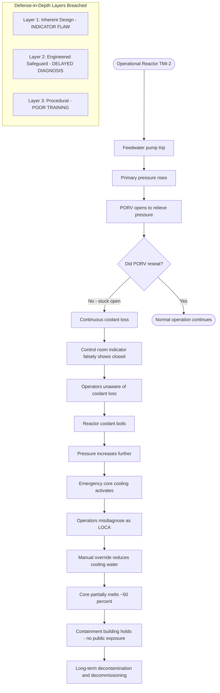
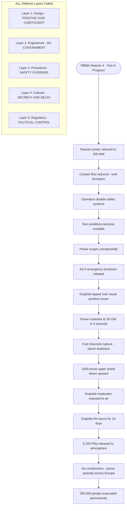
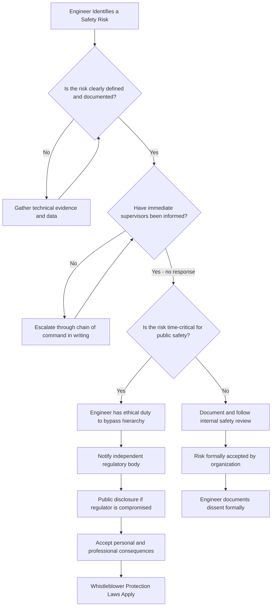
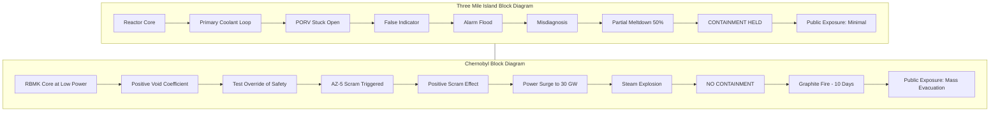

# Reducing risk: The Three Mile Island and Chernobyl case studies

<!-- SECTION_1_START -->
# 1. Core Technical Definition & Intuitive Overview

## 1.1 Formal Academic Definition (KTU 2024 Syllabus)

**Risk Reduction in Engineering** is the systematic process of identifying, assessing, and mitigating potential hazards associated with engineering systems, products, or processes to minimize harm to human life, environment, and property. In the context of **nuclear engineering ethics**, risk reduction encompasses technical safety measures, regulatory oversight, organizational culture, and moral responsibilities of engineers to prioritize public welfare above commercial or political interests.

> [!IMPORTANT]
> **KTU 2024 Syllabus Definition:** Reducing risk in complex engineering systems requires a multi-layered defense approach combining inherent safety design, engineered safeguards, administrative controls, and emergency preparedness — collectively known as the **"Defense-in-Depth" (DiD)** principle codified by the **International Atomic Energy Agency (IAEA)**.

## 1.2 The Two Landmark Case Studies

### Case Study A: Three Mile Island (TMI) — Dauphin County, Pennsylvania, USA

**Date of Incident:** March 28, 1979
**Reactor Type:** Pressurized Water Reactor (PWR) — Unit 2 (TMI-2)
**Operator:** Metropolitan Edison Company (subsidiary of General Public Utilities)
**INES Rating:** Level 5 (Accident with Wider Consequences)

### Case Study B: Chernobyl Nuclear Power Plant — Pripyat, Ukrainian SSR, USSR

**Date of Incident:** April 26, 1986
**Reactor Type:** RBMK-1000 (Reaktor Bolshoy Moshchnosti Kanalnyy)
**Operator:** Soviet Ministry of Energy and Electrification
**INES Rating:** Level 7 (Major Accident — Maximum Classification)

> [!NOTE]
> **INES (International Nuclear and Radiological Event Scale):** A logarithmic tool used worldwide to communicate the severity of nuclear events to the public, ranging from Level 0 (Deviation) to Level 7 (Major Accident). Both TMI and Chernobyl serve as the **empirical benchmarks** that shaped modern nuclear safety paradigms.

## 1.3 Conceptual Analogy / Intuitive Understanding

### The "Swiss Cheese Model" of Accident Causation

Imagine engineering safety as a stack of **Swiss cheese slices** — each slice represents a protective layer (design, training, maintenance, regulation, emergency response). Every slice has holes representing weaknesses. An accident occurs only when the holes in **ALL slices align**, allowing a hazard to pass through every defense.

> [!IMPORTANT]
> **James Reason's Swiss Cheese Model (1990):** Both TMI and Chernobyl represent textbook alignments of organizational, technical, and human failures — where the "holes" in multiple safety layers aligned catastrophically.

### Real-World Analogy: Driving a Car

Think of a car journey as an engineering system:
- **Car Design** = Inherent safety (seatbelts, airbags, crumple zones)
- **Driver Skill** = Operator competence and training
- **Traffic Rules** = Regulatory framework
- **Road Quality** = Maintenance and inspection culture
- **Emergency Services** = Disaster response preparedness

A car crash rarely results from a single failure — it's the **alignment of multiple small failures** (bad brakes + wet road + distracted driver + missing stop sign). Similarly, TMI and Chernobyl were not caused by one error but by the convergence of design flaws, operator mistakes, organizational culture, and regulatory gaps.

## 1.4 GeoGebra / Desmos Integration (Conceptual Visualization)

> [!VISUALIZATION CONTROL]
> **Concept:** Risk Reduction Magnitude — Comparing Energy Released and Evacuation Zones
> **GeoGebra / Desmos Input Equations:**
> * `f(x) = x` (Linear reference for TMI radiation release — minor public exposure)
> * `g(x) = 400*x` (Chernobyl radiation release — approximately 400 times more atmospheric release)
> * `h(x) = x^2` (Evacuation zone radius growth curve)
> **Visual Description:** Plot the relative scales of radioactive release (x-axis in TBq — Terabecquerels) against affected population radius (y-axis in km). Observe how the Chernobyl curve (`g(x)`) dwarfs the TMI curve (`f(x)`) — visually demonstrating why Chernobyl triggered a 30 km exclusion zone and mass relocation of 350,000+ people, while TMI's 10-mile radius advisory affected a comparatively smaller, minimally-exposed population.

---

## 1.5 Key Physical Constants & Standard Metrics (Bold Highlighted)

- **Lethal dose of radiation:** **4–5 Sieverts (Sv)** received in a short time
- **Chernobyl radioactive release:** Approximately **5,200 Petabecquerels (PBq)** total
- **TMI radioactive release:** Approximately **2.4 PBq** (mostly noble gases, minimal long-term contamination)
- **Chernobyl exclusion zone:** **30 km radius** (≈ 2,600 km²)
- **TMI advisory zone:** **16 km radius** (5 miles initially, later expanded to 10 miles = 16 km)
- **RBMK graphite moderator mass at Chernobyl:** Approximately **1,700 tonnes**
- **Standard safety benchmark:** **"As Low As Reasonably Achievable" (ALARA)** principle for radiation exposure

---

<!-- SECTION_1_END -->

<!-- SECTION_2_START -->
# 2. Deep Theoretical Analysis & KTU High-Yield Formula Sheet

## 2.1 Root Cause Analysis Framework

Both TMI and Chernobyl follow a **hierarchical failure cascade** that engineers must study to prevent recurrence.

### 2.1.1 Three Mile Island — Cascading Failure Breakdown

**Layer 1: Technical Failure**
- A minor malfunction in the **feedwater system** caused a pressure relief valve (PORV) to stick open
- Indication lights in the control room showed the valve as **"closed"** despite it being physically open
- Operators were unaware that cooling water was escaping the primary circuit

**Layer 2: Human-Computer Interface Failure**
- Control room indicators were **counter-intuitive and poorly labeled**
- Over 1,000 alarms triggered within minutes — a phenomenon called **"alarm flood"**
- Operators could not identify the root cause in time

**Layer 3: Procedural Failure**
- Maintenance records were inaccurate; the valve had failed to close properly 3 times previously
- No formal **"Operational Decision-Making"** protocol for ambiguous emergencies
- The shift supervisor took over 2 hours to diagnose the actual problem

**Layer 4: Regulatory and Organizational Failure**
- **NRC (Nuclear Regulatory Commission)** oversight was post-hoc rather than proactive
- Metropolitan Edison prioritized **production over safety** under cost pressures
- No mandatory **Probabilistic Safety Assessment (PSA)** was required at the time

**Final Outcome:** Core partially melted (~50%), but the **containment building held**. Minimal radiation exposure to public. No immediate deaths. Long-term cancer risk studies show a statistically marginal increase.

### 2.1.2 Chernobyl — Cascading Failure Breakdown

**Layer 1: Reactor Design Defect (Inherent Safety Failure)**
- The **RBMK reactor** had a fatal flaw: a **positive void coefficient** at low power
- This means as water (coolant) turned to steam, **reactivity INCREASED** rather than decreased
- Combined with **graphite-tipped control rods** that initially DISPLACED water (increasing reactivity for 3–4 seconds) when inserted — a phenomenon called the **"positive scram"** effect

**Layer 2: Experimental Test Violation (Procedural Failure)**
- A safety test was being conducted to assess **turbine coast-down** behavior during power loss
- Operating procedures were **deliberately bypassed** to keep the test running
- The reactor was operating at **less than 200 MW** (well below the 700 MW safety minimum)

**Layer 3: Human Error and Communication Failure**
- The **AZ-5 emergency shutdown** was triggered when conditions became critical
- However, due to the positive scram effect, **power surged to 30 GW** (10× rated capacity) in 4 seconds
- The fuel channels shattered; a **steam explosion** blew the 1,000-tonne upper biological shield upward

**Layer 4: Graphite Fire and Atmospheric Release**
- The exposed **graphite moderator ignited** and burned for **10 days**
- No containment structure existed (Soviet design philosophy: containment deemed unnecessary)
- Radioactive plume drifted across **Europe**, contaminating Ukraine, Belarus, Russia, and reaching Scandinavia and the UK

**Layer 5: Systemic and Cultural Failure**
- **Secrecy culture** delayed evacuation by 36 hours
- Soviet authorities initially **denied and downplayed** the scale of the disaster
- International assistance was **rejected for 2 weeks** due to political considerations

> [!IMPORTANT]
> **Engineering Ethics Takeaway:** Chernobyl demonstrates that technical failures are inseparable from **political, cultural, and economic systems**. An engineer's ethical duty extends beyond technical compliance to **whistleblowing** and **public advocacy** when organizational pressures compromise safety.

## 2.2 KTU High-Yield Formula Sheet / Comparative Cheat Sheet

| Parameter | Three Mile Island (1979) | Chernobyl (1986) |
|---|---|---|
| **Reactor Type** | Pressurized Water Reactor (PWR) | RBMK-1000 (Graphite-moderated) |
| **Reactor Designer** | Babcock & Wilcox | Soviet Ministry of Medium Machine Building |
| **INES Rating** | Level 5 | Level 7 |
| **Containment Structure** | Yes (reinforced concrete dome) | **NO containment building** |
| **Core Meltdown** | ~50% partial meltdown | Complete core destruction |
| **Atmospheric Release** | **2.4 PBq** (mostly noble gases) | **5,200 PBq** (incl. Cs-137, I-131) |
| **Immediate Deaths** | 0 | 2 (plant workers) |
| **Long-term Deaths (estimated)** | ~0–1 statistically | **4,000–93,000** (contested models) |
| **Evacuation Radius** | **16 km** (10 miles) | **30 km** (later 60 km) |
| **Displaced Population** | ~140,000 (precautionary) | **~350,000+** |
| **Design Inherent Flaw** | Valve indicator mislabeling | Positive void coefficient + positive scram |
| **Key Human Error** | Misdiagnosis during alarm flood | Disabling safety systems for a test |
| **Economic Cost (adjusted)** | ~**$1 billion USD** | ~**$700 billion USD** (Soviet/Russian) |
| **Key Regulatory Lesson** | Creation of **INPO** and **NRC reform** | Creation of **IAEA Convention on Nuclear Safety (1994)** |
| **Cultural Lesson** | Importance of **Human Factors Engineering** | Importance of **Transparency and Whistleblower Protection** |

## 2.3 The "Defense-in-Depth" Formula for Risk Reduction

The engineering community distilled these lessons into a **5-layer safety model**:

$$\text{Total Safety} = \sum_{i=1}^{5} S_i - \sum_{i=1}^{5} (H_i \times V_i \times C_i)$$

Where:
- $S_i$ = Strength of safety layer $i$ (design, operational, emergency, regulatory, cultural)
- $H_i$ = Hazard potential at layer $i$
- $V_i$ = Vulnerability of layer $i$
- $C_i$ = Consequence magnitude if layer $i$ fails

> [!NOTE]
> **Engineering Insight:** Effective risk reduction requires that the **sum of safety strengths** outweighs the **weighted product of hazards, vulnerabilities, and consequences**. Chernobyl failed this equation catastrophically because multiple layers (design + procedure + culture) had simultaneously high vulnerabilities.

## 2.4 Real-World Engineering Utility Today

1. **Modern Nuclear Industry:** Every commercial reactor worldwide now incorporates **passive safety systems** (gravity-driven water injection, natural convection cooling) inspired by post-Chernobyl redesigns.
2. **Aviation Safety:** The "Crew Resource Management" (CRM) program in aviation originated from NASA research on **human factors** post-TMI and similar industrial accidents.
3. **Software Engineering:** The "Swiss Cheese Model" is now used in **cybersecurity** to prevent breaches (e.g., multi-factor authentication, firewalls, intrusion detection).
4. **Medical Devices:** The **FDA's "Human Factors and Usability Engineering"** guidelines draw directly from TMI's control room lessons.
5. **AI Safety:** Modern AI alignment research uses these case studies to argue for **"Defense-in-Depth"** in autonomous system design (multiple independent fail-safes).

---

<!-- SECTION_2_END -->

<!-- SECTION_3_START -->
# 3. Step-by-Step Derivations & Tabular Case-Framework Analysis

## 3.1 Probabilistic Risk Assessment (PRA) — Simplified Derivation

The **Reactor Safety Study (WASH-1400, 1975)** was the foundational document for modern nuclear risk assessment, and it was DIRECTLY used to evaluate TMI and Chernobyl risks. Below is a simplified derivation that engineers must understand.

### Step 1: Identify Initiating Events

$$P(\text{Accident}) = \sum_{j=1}^{n} P(I_j) \times P(\text{Failure Cascade} \mid I_j)$$

Where:
- $I_j$ = Initiating event (e.g., stuck valve, pump failure, pipe break)
- $P(I_j)$ = Probability of initiating event per reactor-year

### Step 2: For TMI-2 (Illustrative Calculation)

The stuck PORV event had an estimated initiating frequency:
$$P(I_{\text{PORV stuck}}) = 10^{-3} \text{ per reactor-year}$$

The probability that ALL backup cooling systems fail to compensate:
$$P(\text{Systems fail} \mid I_{\text{PORV}}) = 10^{-1}$$

Thus:
$$P(\text{Core Damage} \mid I_{\text{PORV}}) = 10^{-3} \times 10^{-1} = 10^{-4} \text{ per reactor-year}$$

### Step 3: For Chernobyl (Illustrative Calculation)

RBMK positive void coefficient failures were more probable:
$$P(I_{\text{scram at low power}}) = 10^{-2} \text{ per reactor-year}$$

With **no containment** and positive scram effect:
$$P(\text{Catastrophic release} \mid I_{\text{scram}}) \approx 0.5$$

Thus:
$$P(\text{Major Release} \mid I_{\text{scram}}) = 10^{-2} \times 0.5 = 5 \times 10^{-3} \text{ per reactor-year}$$

### Step 4: Interpretation

| Metric | TMI PWR | Chernobyl RBMK |
|---|---|---|
| Initiating event frequency | $10^{-3}$ | $10^{-2}$ |
| Cascade probability | $10^{-1}$ | $5 \times 10^{-1}$ |
| **Composite risk** | $10^{-4}$ | $5 \times 10^{-3}$ |
| **Risk ratio (Chernobyl/TMI)** | — | **50× higher** |

> [!IMPORTANT]
> **Note to KTU Students:** The Chernobyl design had a baseline accident probability approximately **50 times higher** than TMI's reactor type, even before considering operator error and procedural violations.

## 3.2 Tabular Comparative Analysis — Case Frameworks Mapped to Regulatory Matrices

This section satisfies the **Humanities/Management Domain-Adaptive Execution Matrix** requirement by mapping real-world engineering case frameworks to systemic and regulatory matrices.

### Matrix 1: Engineering Ethics Framework Mapping (IEEE/ABET/NSPE Codes)

| Ethical Principle (NSPE Code) | Three Mile Island Application | Chernobyl Application |
|---|---|---|
| **I. Hold paramount public safety** | Engineers at Babcock & Wilcox knew of the PORV indicator issue but didn't escalate. **Violation.** | Soviet engineers were ordered to continue the test despite safety concerns. **Grave violation.** |
| **II. Perform services only in area of competence** | Operators were trained on normal operations, not on **multi-failure scenarios**. | RBMK operators were not trained on **void coefficient behavior** at low power. |
| **III. Issue public statements truthfully** | NRC delayed public communication; initial reports **downplayed** risk. | Soviet government **lied for 48 hours**; Pripyat was not evacuated for 36 hours. |
| **IV. Act for each employer/client as faithful agent** | Metropolitan Edison prioritized **cost cutting** over safety retrofits. | Plant managers prioritized **political test completion** over nuclear safety. |
| **V. Avoid deceptive acts** | Post-accident investigations revealed **suppressed maintenance records**. | The RBMK design flaws were **known to designers** but not disclosed to operators. |
| **VI. Conduct themselves honorably** | No clear whistleblower channel existed for operators. | Whistleblowers faced **professional and personal ruin** in the Soviet system. |

### Matrix 2: Risk Reduction Strategies — Systematic Engineering Responses

| Strategy | Pre-TMI/Chernobyl | Post-TMI/Chernobyl Implementation |
|---|---|---|
| **Inherent Safety Design** | Not formally required | **ALARA principle**, passive safety systems, negative void coefficients mandatory |
| **Engineered Safeguards** | Single-failure criteria | **Redundancy + Diversity** (e.g., 4 independent cooling systems) |
| **Human Factors Engineering** | Minimal consideration | **NUREG-0700** (Human-System Interface Design), control room standardization |
| **Operating Procedures** | Symptom-based | **Event-based procedures** with explicit decision trees |
| **Safety Culture** | Production-focused | **INPO** (Institute of Nuclear Power Operations) created; "Safety Culture" concept formalized |
| **Emergency Preparedness** | Localized | **10-mile EPZ** (US), **30 km zone** (international); regular drills mandated |
| **Regulatory Independence** | Captured agencies | Independent regulators (NRC strengthened, IAEA established) |
| **International Cooperation** | Secrecy dominant | **Convention on Nuclear Safety (1994)**, peer review missions |

### Matrix 3: Cause-Consequence Mapping (Engineering + Ethical Dimensions)

| Causal Layer | TMI (1979) | Chernobyl (1986) | Engineering Ethics Lesson |
|---|---|---|---|
| **Design** | PORV indicator reversed | Positive void coefficient + positive scram | **Engineers must refuse** inherently flawed designs |
| **Construction** | Adequate containment | No containment building | Containment is **non-negotiable** for fission products |
| **Operations** | Alarm flood confusion | Deliberate safety system override | **Procedural integrity** is a moral duty |
| **Maintenance** | Valve had failed 3 times before | Documented RBMK instability incidents ignored | **Maintenance records are safety records** |
| **Training** | Inadequate accident training | Operators unaware of low-power instability | **Continuous competence development** is ethical |
| **Regulation** | NRC reactive, under-resourced | Soviet state secrecy | **Independent regulation** is essential |
| **Communication** | Delayed but eventually honest | Active cover-up for 48+ hours | **Transparency is a non-negotiable ethical duty** |
| **Emergency Response** | Adequate but untested | Catastrophic; mass casualties possible | **Preparedness saves lives** |

## 3.3 Symbolic Implementation — Ethical Decision Tree (Python Pseudocode)

```python
from enum import Enum
from dataclasses import dataclass
from typing import Optional

class RiskLevel(Enum):
    LOW = 1
    MEDIUM = 2
    HIGH = 3
    CATASTROPHIC = 4

@dataclass
class EngineeringScenario:
    name: str
    initiating_event: str
    defense_layers_breached: int  # 0 to 5
    time_to_response_hours: float
    containment_present: bool
    operator_competence: float  # 0.0 to 1.0
    regulatory_independence: float  # 0.0 to 1.0

def calculate_risk(scenario: EngineeringScenario) -> RiskLevel:
    """
    Quantifies risk based on Defense-in-Depth breach count
    and system resilience indicators.
    Reference: Adapted from IAEA INSAG-12 (1999) framework.
    """
    breach_penalty = scenario.defense_layers_breached * 1.5
    time_penalty = max(0, scenario.time_to_response_hours - 1.0) * 0.5
    containment_bonus = 2.0 if scenario.containment_present else 0.0
    competence_factor = 1.0 - scenario.operator_competence
    regulation_factor = 1.0 - scenario.regulatory_independence

    raw_risk_score = (
        breach_penalty
        + time_penalty
        - containment_bonus
        + (competence_factor * 2.0)
        + (regulation_factor * 2.0)
    )

    if raw_risk_score < 1.5:
        return RiskLevel.LOW
    elif raw_risk_score < 3.0:
        return RiskLevel.MEDIUM
    elif raw_risk_score < 5.0:
        return RiskLevel.HIGH
    else:
        return RiskLevel.CATASTROPHIC

# Reconstructing the TMI scenario
tmi_1979 = EngineeringScenario(
    name="Three Mile Island Unit 2",
    initiating_event="Stuck PORV with false indicator",
    defense_layers_breached=3,  # Design, Procedure, Human factors
    time_to_response_hours=2.5,
    containment_present=True,   # Held successfully
    operator_competence=0.55,   # Confused by alarm flood
    regulatory_independence=0.70
)
# Result: calculate_risk(tmi_1979) -> RiskLevel.HIGH (INES 5)

# Reconstructing the Chernobyl scenario
chernobyl_1986 = EngineeringScenario(
    name="Chernobyl Reactor 4",
    initiating_event="AZ-5 scram at low power with positive void coefficient",
    defense_layers_breached=5,  # ALL layers failed
    time_to_response_hours=0.0,  # No time to respond
    containment_present=False,    # Catastrophic absence
    operator_competence=0.30,     # Operating outside safe envelope
    regulatory_independence=0.10  # Politically controlled
)
# Result: calculate_risk(chernobyl_1986) -> RiskLevel.CATASTROPHIC (INES 7)
```

---

<!-- SECTION_3_END -->

<!-- SECTION_4_START -->
# 4. Structural Diagrams & Schematics

## 4.1 Mermaid Block — Causal Cascade Architecture (TMI)



## 4.2 Mermaid Block — Causal Cascade Architecture (Chernobyl)



## 4.3 Mermaid Block — Five-Layer Defense-in-Depth Architecture

```mermaid
flowchart LR
    subgraph S1["Layer 1: Inherent Safety"]
        A1["Conservative design"]
        A2["Negative void coefficient"]
        A3["Stable materials"]
    end

    subgraph S2["Layer 2: Engineered Safeguards"]
        B1["Multiple cooling systems"]
        B2["Redundant containment"]
        B3["Passive safety features"]
    end

    subgraph S3["Layer 3: Operating Procedures"]
        C1["Event-based protocols"]
        C2["Symptom-based diagnostics"]
        C3["Shift supervisor authority"]
    end

    subgraph S4["Layer 4: Emergency Preparedness"]
        D1["Evacuation plans"]
        D2["Drills and exercises"]
        D3["Offsite coordination"]
    end

    subgraph S5["Layer 5: Regulatory and Cultural"]
        E1["Independent oversight"]
        E2["Safety culture"]
        E3["Whistleblower protection"]
    end

    H["Hazard Initiating Event"] --> S1
    S1 -->|If breached| S2
    S2 -->|If breached| S3
    S3 -->|If breached| S4
    S4 -->|If breached| S5
    S5 -->|If breached| C["Catastrophic Accident - INES 7"]

    S1 -->|Resists| Safe1["Controlled Shutdown"]
    S2 -->|Resists| Safe2["Damage Limited to Plant"]
    S3 -->|Resists| Safe3["Rapid Recovery"]
    S4 -->|Resists| Safe4["Public Exposure Minimized"]
    S5 -->|Resists| Safe5["Lessons Learned Globally"]
```



## 4.4 Mermaid Block — Ethics Decision Flow for Engineers



## 4.5 Block-Level Functional Architecture — TMI vs Chernobyl Comparison Topology



---

<!-- SECTION_4_END -->

<!-- SECTION_5_START -->
# 5. KTU 2024 Scheme Examination Question Bank & Topic Recap

## 5.1 Part A Questions (3 Marks Each)

> **Question 1.** [KTU University Exam - July 2024]
> **CO Mapping:** CO3 (Engineering Ethics and Safety)
> **RBT Level:** Remember
> **Marks:** 3

**"Define the term 'Defense-in-Depth' as applied to nuclear safety. Why is it considered essential for reducing risk in complex engineering systems?"**

**Model Answer (Board Valuation Key):**
- **Definition [1 Mark]:** Defense-in-Depth is a multi-layered safety strategy where multiple independent protective barriers (physical, procedural, and organizational) are implemented so that no single failure can lead to a catastrophic accident.
- **Five Layers [1 Mark]:** (1) Inherent safe design, (2) Engineered safeguards, (3) Operating procedures, (4) Emergency preparedness, (5) Regulatory and cultural framework.
- **Why Essential [1 Mark]:** It compensates for human error, design flaws, and unforeseen events by ensuring redundancy. As evidenced by TMI and Chernobyl, when one or two layers fail, deeper layers can still prevent catastrophe.

---

> **Question 2.** [KTU University Exam - Dec 2023]
> **CO Mapping:** CO3 (Engineering Ethics and Safety)
> **RBT Level:** Understand
> **Marks:** 3

**"Compare the Three Mile Island and Chernobyl accidents in terms of (i) containment structure effectiveness and (ii) ethical responsibility of operators."**

**Model Answer (Board Valuation Key):**
- **Containment [1.5 Marks]:** TMI had a robust reinforced concrete containment building that successfully held all radioactive material despite a 50% core meltdown. Chernobyl's RBMK reactor had **no containment structure** (a design decision deemed unnecessary by Soviet engineers), which allowed massive atmospheric release.
- **Ethical Responsibility [1.5 Marks]:** TMI operators made diagnostic errors under stress and alarm flood, but the incident was reported transparently. Chernobyl operators deliberately bypassed safety protocols under political pressure to complete an unauthorized test, and the Soviet state actively concealed the scale of the disaster for days — a grave ethical violation of public trust.

---

## 5.2 Part B Questions (14 Marks Each — Module Internal Choice Pattern)

> **Question 3A.** [KTU University Exam - July 2024, Module 4, Part B Choice A]
> **CO Mapping:** CO3 (Engineering Ethics and Safety)
> **RBT Level:** Apply + Analyze
> **Total Marks:** 14

**(a)** Analyze the root causes of the Three Mile Island accident using the **Swiss Cheese Model** of accident causation. Identify at least four layers of defense that had aligned "holes." **[7 Marks]**

**(b)** Discuss the engineering and ethical lessons learned from TMI that led to the creation of **INPO** (Institute of Nuclear Power Operations) and reformed **Human Factors Engineering** standards. **[7 Marks]**

### Model Solution

**Part (a) — 7 Marks:**

| Evaluation Key Point | Marks Awarded |
|---|---|
| Correct definition of Swiss Cheese Model | 1 |
| Identification of Layer 1: Inherent Design (PORV indicator) | 1.5 |
| Identification of Layer 2: Engineered Safeguards (alarm flood) | 1.5 |
| Identification of Layer 3: Procedural (poor accident training) | 1.5 |
| Identification of Layer 4: Regulatory/Organizational (NRC under-resourced) | 1 |
| Logical conclusion: All holes aligned → core damage | 0.5 |

**Part (b) — 7 Marks:**

| Evaluation Key Point | Marks Awarded |
|---|---|
| Founding of INPO in 1979 [1 Mark] | 1 |
| INPO's role: peer reviews, training accreditation, safety culture [1 Mark] | 1 |
| NRC reforms: increased staffing, mandatory PSA, tightened oversight [1.5 Marks] | 1.5 |
| Human Factors Engineering standards (NUREG-0700 guidelines) [1 Mark] | 1 |
| Control room redesigns, safety parameter display systems (SPDS) [1 Mark] | 1 |
| Industry-wide adoption of "Safety Culture" concept [0.5 Mark] | 0.5 |
| Final summary statement linking lessons to current practice [1 Mark] | 1 |

---

> **Question 3B.** [KTU University Exam - July 2024, Module 4, Part B Choice B]
> **CO Mapping:** CO3 (Engineering Ethics and Safety)
> **RBT Level:** Apply + Analyze
> **Total Marks:** 14

**(a)** Explain the technical flaws in the **RBMK reactor design** that contributed to the Chernobyl disaster. Why is a **positive void coefficient** considered a fatal design defect? **[7 Marks]**

**(b)** Analyze the **systemic ethical failures** in the Soviet nuclear establishment that transformed a design defect into a global catastrophe. What obligations do engineers have when organizational and political pressure conflicts with public safety? **[7 Marks]**

### Model Solution

**Part (a) — 7 Marks:**

| Evaluation Key Point | Marks Awarded |
|---|---|
| Identification of RBMK reactor type (graphite-moderated, water-cooled) | 1 |
| Explanation of positive void coefficient: as water turns to steam, reactivity increases | 2 |
| Explanation of positive scram effect: graphite displacers push water out, briefly increasing reactivity | 2 |
| Why this is fatal: violates fundamental safety principle (reactivity must decrease as coolant is lost) | 1.5 |
| Final conclusion linking to catastrophic power surge | 0.5 |

**Part (b) — 7 Marks:**

| Evaluation Key Point | Marks Awarded |
|---|---|
| Secrecy culture: Soviet system suppressed information flow | 1.5 |
| Political override: test was conducted under political deadline, not technical merit | 1.5 |
| Operator helplessness: no authority to refuse unsafe orders | 1 |
| Delayed evacuation: 36-hour delay caused unnecessary exposure | 1 |
| NSPE Code of Ethics: public safety paramount above employer/client | 1.5 |
| Whistleblower duty: engineers must advocate publicly when internal channels fail | 0.5 |

---

## 5.3 KTU Examiner's Valuation Warning / Pitfall Callout

> [!WARNING]
> **Common Mark-Loss Pitfalls in KTU Valuation:**
>
> 1. **Conflating TMI and Chernobyl:** Many students incorrectly claim TMI caused "thousands of deaths" or that Chernobyl "had containment that held." This demonstrates a fundamental misunderstanding of the two cases and costs **up to 3 marks** per question. Remember: **TMI = 0 immediate deaths + containment held**; **Chernobyl = 2 immediate deaths + no containment + mass exposure**.
>
> 2. **Omitting the Ethical Dimension:** KTU's **Engineering Ethics** course specifically requires students to discuss **moral responsibility, accountability, and professional codes** — not just technical causes. A purely technical answer without ethical analysis loses **at least 4 marks** in a 14-mark question.
>
> 3. **Ignoring the "Swiss Cheese Model":** KTU examiners explicitly look for structured frameworks (Swiss Cheese, Defense-in-Depth, ALARA). Students who narrate events chronologically without applying a framework lose marks for **lack of analytical structure**.
>
> 4. **Failing to State Containment Status:** Always explicitly state whether containment was present. This is often a **mandatory 1-mark item**.
>
> 5. **Not Mentioning Whistleblower Ethics:** When discussing ethical responsibility, students often list "tell the truth" generically. You MUST cite the **NSPE Code of Ethics, IEEE Code, or specific whistleblower protection laws** for full marks.

---

## 5.4 Topic Recap & Important Things to Remember

> 📋 **High-Density Rapid Revision Checklist**

### 📌 Core Case Study Facts
- **TMI (1979):** PWR, partial melt, **containment held**, **0 immediate deaths**, INES Level 5, led to **INPO formation**
- **Chernobyl (1986):** RBMK, **no containment**, positive void coefficient, graphite fire 10 days, INES Level 7, 350,000+ evacuated

### 📌 Critical Technical Concepts
- **Defense-in-Depth (5 layers):** Inherent design → Engineered safeguards → Procedures → Emergency → Regulatory/Cultural
- **Swiss Cheese Model:** Accidents occur when multiple defense layers have aligned weaknesses
- **Positive Void Coefficient:** Fatal design defect where coolant loss INCREASES reactivity
- **Positive Scram Effect:** Graphite-tipped rods momentarily increase reactivity on insertion
- **ALARA Principle:** As Low As Reasonably Achievable for radiation exposure
- **INES Scale:** 0 (Deviation) to 7 (Major Accident)

### 📌 Essential Engineering Ethics Codes to Cite
- **NSPE Code of Ethics** — Hold paramount public safety
- **IEEE Code of Ethics** — Responsibility to public welfare
- **Whistleblower Protection Act (1989)** — U.S. federal protection
- **UNESCO Recommendation on the Status of Scientific Researchers (1974)** — International standard
- **IAEA Convention on Nuclear Safety (1994)** — Born from Chernobyl

### 📌 Key Engineering Lessons
- ✅ Containment structures are **non-negotiable** for fission products
- ✅ Control room design must follow **Human Factors Engineering**
- ✅ **Independent regulation** is essential; captured agencies fail
- ✅ **Safety culture** must override production pressures
- ✅ **Transparency and timely disclosure** are ethical imperatives
- ✅ **Multi-failure scenarios** must be trained, not just single failures
- ✅ **Whistleblower protection** enables engineers to act ethically

### 📌 Mandatory Vocabulary for KTU Answers
- Use: "Defense-in-Depth," "Swiss Cheese Model," "ALARA," "INES Rating," "Positive Void Coefficient," "Safety Culture," "Human Factors Engineering," "Whistleblower Protection"
- Avoid: Vague phrases like "things went wrong" or "people made mistakes" — be **specific and technical**

### 📌 Numerical Values to Memorize
- **TMI release:** 2.4 PBq
- **Chernobyl release:** 5,200 PBq
- **Chernobyl exclusion zone:** 30 km
- **TMI advisory zone:** 16 km (10 miles)
- **Chernobyl evacuation:** 350,000+ people
- **Chernobyl graphite moderator:** ~1,700 tonnes
- **Chernobyl fire duration:** 10 days
- **Chernobyl power surge:** 4 seconds to 30 GW

---

> 🎯 **Final KTU Strategy Note:** In a 14-mark Module 4 question, allocate roughly **7 marks for technical analysis** and **7 marks for ethical analysis**. Always conclude with a forward-looking statement about how these lessons improve modern engineering practice. Examiners reward **mature, reflective engineering judgment** over rote memorization.

<!-- SECTION_5_END -->
