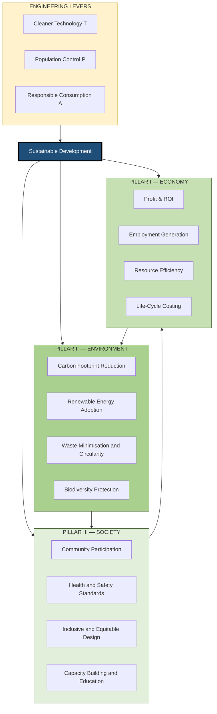
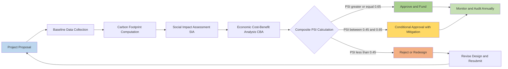
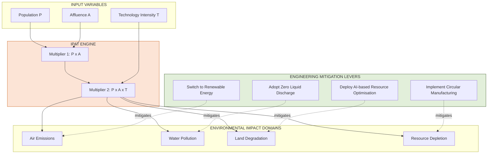
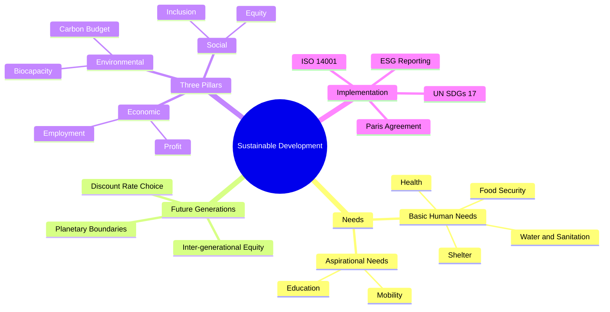

# Concept of Sustainable Development

<!-- SECTION_1_START -->
# 1. Core Technical Definition & Intuitive Overview

## 1.1 Formal Academic Definition

> [!IMPORTANT]
> **Sustainable Development (Brundtland Definition, 1987):**
> *"Development that meets the needs of the present without compromising the ability of future generations to meet their own needs."*
> — World Commission on Environment and Development (WCED), *Our Common Future* Report.

In the **KTU 2024 Scheme (UHSUT300)** context, Sustainable Development is treated as a **multidimensional engineering-economic paradigm** that integrates three interdependent capital systems: **Natural Capital**, **Manufactured/Produced Capital**, **Human Capital**, and **Social Capital**. Engineering decisions, project lifecycles, and industrial processes must be evaluated against this yardstick to ensure **inter-generational equity** and **intra-generational equity**.

The standard **United Nations metric framework** anchored to this concept is the **2030 Agenda for Sustainable Development**, which defines **17 Sustainable Development Goals (SDGs)** and **169 measurable Targets**, adopted by **193 member states** in 2015.

## 1.2 Conceptual Analogy / Real-World Intuition

> [!NOTE]
> **The "Three-Legged Stool" Analogy:**
> Imagine sustainable development as a **three-legged stool**.
> - **Leg 1 — Economy** (Profit): Provides the resources to act.
> - **Leg 2 — Environment** (Planet): Provides the raw materials and waste sink.
> - **Leg 3 — Society** (People): Provides the labour, demand, and legitimacy.
>
> If **any one leg is shorter than the other two**, the stool collapses. A factory may earn record profits (strong economy) but pollute a river (weak environment) and displace tribes (weak society) — the system is **not** sustainable. Conversely, pristine forests (environment) with no jobs (economy) and starving villagers (society) are equally unstable.

**A second analogy — the "Bank Account" model of Natural Capital:**
The Earth is a bank account holding stocks of fossil fuels, fresh water, biodiversity, and minerals. Sustainable development means living off the **interest** (renewable flows like solar energy, timber regrowth), **NOT** the **principal** (finite stocks like coal, oil, ancient aquifers). When engineers design a plant, they are effectively deciding how much of the principal future generations will inherit.

## 1.3 Key Terminology — KTU 2024 Glossary

| Term | Precise Definition | KTU Significance |
|---|---|---|
| **Carrying Capacity** | The maximum population size of a species that an ecosystem can sustain indefinitely | Foundational limit for any development plan |
| **Triple Bottom Line (TBL)** | Performance framework measuring success on **3 P's**: People, Planet, Profit (Elkington, 1994) | Mandatory evaluation lens in CSR audits |
| **Eco-Efficiency** | Producing more economic value with less ecological impact | Direct KPI in green engineering |
| **Inter-Generational Equity** | Fairness in resource allocation across different generations | Core ethical principle of sustainability |
| **Precautionary Principle** | When an activity raises threats of harm, precautionary measures shall be taken even if cause-effect relationships are not fully established | Foundational in environmental law |
| **Carbon Footprint** | Total greenhouse gas (GHG) emissions expressed in **CO₂-equivalent (CO₂e)** units | Universal engineering metric |
| **Ecological Footprint** | Amount of biologically productive land and water area a person/population requires to produce all resources consumed and absorb all waste | Measured in **global hectares (gha)** |
| **Green GDP** | GDP adjusted for environmental degradation costs | True economic progress indicator |

## 1.4 GeoGebra / Desmos Visualisation Block

> [!VISUALIZATION CONTROL]
> **Concept:** Sustainability Trade-off Frontier (Phillips Curve-style for Environment vs. Economy)
> **GeoGebra / Desmos Input Equations:**
> * `f(x) = 100 / (1 + e^((x - 5)))` (Logistic degradation curve — Environment quality vs. Industrial output $x$)
> * `g(x) = 1.5 * sqrt(x)` (Economic welfare curve)
> * `h: x = 5` (Sustainable Equilibrium Point — vertical asymptote of intersection)
> **Visual Description:** Plot Industrial Output $x$ on the horizontal axis (0 to 10) and Welfare Index on the vertical axis. Observe that beyond $x = 5$, the environment curve collapses sharply while economic welfare continues to rise. The **sweet spot** of sustainability is the inflection region where the curves' slopes are both positive but decelerating.

## 1.5 Historical Milestones (Must-Know for KTU)

> [!IMPORTANT]
> **Timeline Anchor Points — Frequently Asked in KTU 2-Mark Questions:**
> 1. **1972** — *Limits to Growth* (Club of Rome, Donella Meadows) — First systemic warning.
> 2. **1987** — *Brundtland Report* (WCED) — Coined the term "Sustainable Development".
> 3. **1992** — *Rio Earth Summit* (UNCED) — Agenda 21, UNFCCC, CBD signed.
> 4. **1997** — *Kyoto Protocol* — First binding GHG reduction treaty.
> 5. **2002** — *Johannesburg World Summit* — Focus on water, sanitation, energy.
> 6. **2012** — *Rio+20* — Launched the process to define SDGs.
> 7. **2015** — *Paris Agreement* + *UN 2030 Agenda* — 17 SDGs, $1.5°\text{C}$ target.
> 8. **2018** — *IPCC Special Report $1.5°\text{C}$* — Net-zero pathways.
> 9. **2023** — *Global Stocktake* (COP28, Dubai) — First formal assessment.

<!-- SECTION_1_END -->

<!-- SECTION_2_START -->
# 2. Deep Theoretical Analysis & KTU High-Yield Formula Sheet

## 2.1 The Three Pillars (Triple Bottom Line) — Architectural Breakdown

Sustainable Development is architecturally founded on **three irreducible pillars**. KTU examiners expect the ability to map any engineering project against all three.

### Pillar I — Economic Sustainability
- Ensures that development generates **fair financial returns**, **decent employment**, and **long-term value creation** without externalising costs onto society or the environment.
- **Engineering Examples:** Life-cycle costing, Net Present Value (NPV) with environmental externalities, Payback Period on solar PV.

### Pillar II — Environmental Sustainability
- Ensures that natural systems maintain their **regenerative capacity**, **biodiversity**, and **biogeochemical cycles**.
- **Engineering Examples:** Zero Liquid Discharge (ZLD) plants, rainwater harvesting, circular manufacturing, biomimicry.

### Pillar III — Social Sustainability
- Ensures **equity**, **health**, **education**, **cultural preservation**, and **community participation** in development.
- **Engineering Examples:** Inclusive design (universal accessibility), community-consulted infrastructure, fair-trade supply chains.

## 2.2 Theoretical Frameworks (Step-by-Step Logic)

### Framework A — IPAT Equation (Ehrlich & Holdren, 1972)

The most cited **quantitative identity** in sustainability science:

$$I = P \times A \times T$$

Where:
- $I$ = Environmental Impact (e.g., tonnes of $CO_2$)
- $P$ = Population
- $A$ = Affluence (per-capita consumption, often proxied by GDP per capita)
- $T$ = Technology (impact per unit of consumption)

**Engineering Insight:** To reduce $I$, an engineer can act on $T$ through cleaner technology (renewable energy, catalytic converters, efficient motors). This is the only lever an engineer directly controls.

### Framework B — Kaya Identity (Decomposition of $CO_2$ Emissions)

$$CO_2 = P \times \frac{GDP}{P} \times \frac{E}{GDP} \times \frac{CO_2}{E}$$

Where $E$ = Energy consumed. This identity is used by the **IPCC** to attribute emission changes across demographic, economic, energy-intensity, and carbon-intensity factors.

### Framework C — Strong vs. Weak Sustainability (Critical Distinction)

| Aspect | Weak Sustainability | Strong Sustainability |
|---|---|---|
| **Substitution** | Natural capital can be **fully substituted** by manufactured capital | Natural capital is **largely non-substitutable** |
| **Discounting Future** | Heavy discounting of future welfare is allowed | Near-zero or **zero** discounting |
| **Threshold Limits** | No hard ecological limits | Planetary boundaries are **hard constraints** |
| **KTU Position** | Common in neoclassical economics | Common in ecological economics |

### Framework D — Planetary Boundaries (Rockström et al., 2009)

The framework identifies **9 planetary boundaries** within which humanity can safely operate. As of 2023, **6 of 9 boundaries have been transgressed**: climate change, biosphere integrity, land-system change, biogeochemical flows (N & P), freshwater change, and novel entities (chemical pollution).

## 2.3 KTU High-Yield Formula Sheet

| # | Formula / Identity | Variables | Units | Application |
|---|---|---|---|---|
| 1 | $I = P \times A \times T$ | Impact, Pop, Affluence, Tech | tonnes, persons, USD/person, kg/USD | Decompose environmental pressure |
| 2 | $EF = \frac{\text{Biocapacity Used}}{\text{Biocapacity Available}}$ | Ecological Footprint Ratio | dimensionless (1.0 = sustainable) | National sustainability check |
| 3 | $CO_2e = \sum_i m_i \times GWP_i$ | Mass $\times$ Global Warming Potential | kg or tonnes | Carbon footprint accounting |
| 4 | $NPV_{green} = \sum_{t=0}^{n} \frac{(B_t - C_t - E_t)}{(1+r)^t}$ | Benefits, Costs, Externalities, Discount rate | INR/USD | Green project appraisal |
| 5 | $HDI = \frac{1}{3}(L_{idx} + E_{idx} + I_{idx})$ | Life expectancy, Education, Income indices | 0 to 1 | UN Human Development Index |
| 6 | $\text{Energy Intensity} = \frac{E}{GDP}$ | Energy per unit economic output | TJ per million USD | Industrial efficiency benchmark |
| 7 | $TDM = \sum \text{(Person-trips)} \times \text{Distance} \times \text{Mode-factor}$ | Transport Demand Management | passenger-km | Sustainable transport planning |
| 8 | $\text{Renewable Share} = \frac{E_{renewable}}{E_{total}} \times 100\%$ | Renewable / Total Energy | % | SDG 7 indicator |

## 2.4 Real-World Engineering Utility

- **Construction Industry:** LEED, GRIHA, and BREEAM certification systems mandate proof of sustainable sourcing, energy efficiency, and indoor air quality.
- **Manufacturing:** ISO **14001** (Environmental Management) and **ISO 26000** (Social Responsibility) are global standards.
- **Energy Sector:** Levelized Cost of Energy (LCOE) for solar PV dropped from **\$378/MWh (2009)** to under **\$50/MWh (2023)**, making it cheaper than coal in many regions — a direct sustainability win driven by engineering innovation.
- **Software / IT:** Green coding, server-room PUE (Power Usage Effectiveness), and cloud carbon-aware computing.
- **Finance:** **ESG (Environmental, Social, Governance)** investing reached **\$30 trillion** globally in 2022, forcing companies to disclose sustainability metrics.

## 2.5 Indicators & Indexes — KTU Board Favourites

| Index | Full Form | Developed By | Measures | KTU 2-Mark Weight |
|---|---|---|---|---|
| **HDI** | Human Development Index | UNDP | Health + Education + Income | High |
| **GHI** | Global Hunger Index | IFPRI | Undernourishment, child mortality | Medium |
| **GPI** | Genuine Progress Indicator | Redefining Progress | GDP minus environmental/social costs | Medium |
| **EPI** | Environmental Performance Index | Yale + Columbia | Environmental health, ecosystem vitality | Medium |
| **SDG Index** | SDG Achievement Index | SDSN | Composite of 17 SDG scores | High |
| **LPI** | Living Planet Index | WWF | Global biodiversity trend | Low |

> [!IMPORTANT]
> **KTU Examiner Tip:** When asked "Which index is the most comprehensive measure of sustainability?", the most defensible answer is the **SDG Composite Index** because it integrates all 17 goals and 169 targets, whereas HDI/GDP cover only a subset.

<!-- SECTION_2_END -->

<!-- SECTION_3_START -->
# 3. Step-by-Step Derivations, Case Frameworks & Symbolic Implementation

## 3.1 Detailed Numerical Derivations (Engineering Economics)

### Problem 3.1.1 — IPAT Decomposition for an Engineering Plant

A thermal power plant has a current environmental impact of **$I_1 = 50{,}000$ tonnes of $CO_2$ per year**. The population served is **$P_1 = 200{,}000$**, the affluence (per-capita income) is **$A_1 = \$2{,}000$**, and the technology factor is **$T_1 = 0.125$ kg CO₂/USD**.

The plant is considering a **green retrofit** that changes parameters as follows: population grows by **$10\%$** (industrial expansion), affluence rises by **$20\%$**, but technology improves to **$T_2 = 0.060$** kg/USD.

**Step 1 — Verify the baseline identity:**

$$\begin{aligned}
I_1 &\stackrel{?}{=} P_1 \times A_1 \times T_1 \\
I_1 &= 200{,}000 \times 2{,}000 \times 0.000125 \quad (\text{convert kg to tonnes}) \\
I_1 &= 200{,}000 \times 2{,}000 \times \frac{0.125}{1000} \\
I_1 &= 200{,}000 \times 2{,}000 \times 0.000125 \\
I_1 &= 50{,}000 \text{ tonnes} \quad \checkmark
\end{aligned}$$

**Step 2 — Compute new parameters:**

$$\begin{aligned}
P_2 &= P_1 \times 1.10 = 200{,}000 \times 1.10 = 220{,}000 \\
A_2 &= A_1 \times 1.20 = 2{,}000 \times 1.20 = \$2{,}400 \\
T_2 &= 0.060 \text{ kg/USD} = 0.000060 \text{ tonnes/USD}
\end{aligned}$$

**Step 3 — Compute new impact:**

$$\begin{aligned}
I_2 &= P_2 \times A_2 \times T_2 \\
I_2 &= 220{,}000 \times 2{,}400 \times 0.000060 \\
I_2 &= 220{,}000 \times 0.144 \\
I_2 &= 31{,}680 \text{ tonnes of } CO_2
\end{aligned}$$

**Step 4 — Compute percentage reduction:**

$$\begin{aligned}
\text{Reduction} &= \frac{I_1 - I_2}{I_1} \times 100\% \\
&= \frac{50{,}000 - 31{,}680}{50{,}000} \times 100\% \\
&= \frac{18{,}320}{50{,}000} \times 100\% \\
&= 36.64\%
\end{aligned}$$

> [!NOTE]
> **Engineering Conclusion:** Even with population and affluence growth, the technological upgrade delivers a **36.64% emission reduction**. This is the core "Decoupling" argument in sustainability — economic growth can be decoupled from environmental pressure through technology alone.

### Problem 3.1.2 — Carbon Footprint Calculation (GWP Method)

A manufacturing unit emits three gases in one year:
- **Methane ($CH_4$): $m_1 = 200$ tonnes**, Global Warming Potential over 100 years **$GWP_1 = 28$**
- **Nitrous Oxide ($N_2O$): $m_2 = 50$ tonnes**, **$GWP_2 = 265$**
- **Sulphur Hexafluoride ($SF_6$): $m_3 = 2$ tonnes**, **$GWP_3 = 23{,}500$**

**Step 1 — Apply the carbon-equivalent formula:**

$$CO_2e = \sum_{i} m_i \times GWP_i$$

**Step 2 — Compute each component:**

$$\begin{aligned}
CO_2e_{CH_4} &= 200 \times 28 = 5{,}600 \text{ tonnes } CO_2e \\
CO_2e_{N_2O} &= 50 \times 265 = 13{,}250 \text{ tonnes } CO_2e \\
CO_2e_{SF_6} &= 2 \times 23{,}500 = 47{,}000 \text{ tonnes } CO_2e
\end{aligned}$$

**Step 3 — Total carbon footprint:**

$$CO_2e_{total} = 5{,}600 + 13{,}250 + 47{,}000 = 65{,}850 \text{ tonnes } CO_2e$$

> [!WARNING]
> **KTU Pitfall:** Students often forget that $SF_6$ has an extremely high GWP (23,500×). Even a tiny mass dominates the total. Always list $GWP$ values for the **100-year horizon** unless the question specifies 20-year.

## 3.2 Comparative Case Frameworks — Real-World Engineering vs. Sustainability Matrix

> [!IMPORTANT]
> **KTU Board Pattern:** Module 4 frequently asks students to classify engineering projects under the three pillars. Use the following decision matrix as a template.

| Engineering Project | Economic Pillar (Profit) | Environmental Pillar (Planet) | Social Pillar (People) | SDG Mapped | Verdict |
|---|---|---|---|---|---|
| **Solar Microgrid in Kerala Tribal Hamlet** | Income from power sale; reduced diesel cost | Zero operational emissions; minimal land footprint | 24×7 lighting enables education; women's safety | 7, 13, 5, 10 | ✅ Sustainable |
| **Large Hydro Dam in Western Ghats** | High ROI; industrial power | Submerges forest, disrupts river ecology | Displaces tribal communities; siltation downstream | 7 (positive), 15, 6, 14 (negative) | ⚠️ Trade-off heavy |
| **E-Waste Recycling Plant (Formal Sector)** | Recovers gold, copper, rare earths | Diverts toxic waste from landfill | Formalises informal sector labour; health safety | 8, 12, 3, 11 | ✅ Sustainable |
| **Single-Use Plastic Packaging Unit** | Low cost, high volume | Persistent pollution, microplastics | Marine life harm; no social benefit | 14, 12 (negative) | ❌ Unsustainable |
| **Green Building (GRIHA-5 Certified)** | Energy savings; premium rent | 30–50% lower embodied carbon | Better IAQ, occupant productivity | 7, 11, 13, 3 | ✅ Sustainable |
| **Beach Sand Mining (Unregulated)** | Short-term contractor profit | Coastal erosion, aquifer damage | Fisherfolk livelihood loss | 14, 11 (negative) | ❌ Unsustainable |
| **Electric Public Bus (BRTS)** | Reduced fuel subsidy over time | Tail-pipe emissions eliminated | Inclusive mobility for disabled, elderly | 11, 13, 10, 3 | ✅ Sustainable |
| **Coal-Based Ultra-Mega Power Project** | High employment during construction | Highest $CO_2$ per kWh among options | Air pollution, ash handling issues | 7, 8 (positive), 3, 13 (negative) | ⚠️ Trade-off heavy |

## 3.3 Python Implementation — Carbon Footprint Calculator (Industry-Grade)

```python
"""
Sustainability Engineering: Carbon Footprint Calculator
KTU UHSUT300 Module 4 — Demonstrative Python Implementation.
Computes CO2-equivalent emissions using IPCC AR6 GWP-100 values.
"""

from dataclasses import dataclass
from typing import List, Dict
import logging

# Configure structured logging for audit trail
logging.basicConfig(
    level=logging.INFO,
    format="%(asctime)s | %(levelname)s | %(message)s",
)
logger = logging.getLogger("SustainabilityAudit")


@dataclass(frozen=True)
class GHGSpecies:
    """Immutable data class for a greenhouse gas species."""
    name: str
    mass_tonnes: float
    gwp_100: int  # Global Warming Potential over 100 years (IPCC AR6)


# IPCC AR6 100-year GWP values (selected major gases)
IPCC_AR6_GWP: Dict[str, int] = {
    "CO2": 1,
    "CH4": 28,
    "N2O": 265,
    "SF6": 23500,
    "NF3": 16100,
    "HFC134a": 1300,
    "CFC11": 4660,
}


def calculate_co2e(emissions: List[GHGSpecies]) -> float:
    """
    Compute total CO2-equivalent footprint from a list of GHG species.
    
    Parameters
    ----------
    emissions : List[GHGSpecies]
        A list of greenhouse gas emission records.
    
    Returns
    -------
    float
        Total CO2-equivalent footprint in tonnes.
    
    Raises
    ------
    ValueError
        If any mass_tonnes is negative or gas name is unknown.
    """
    total_co2e: float = 0.0

    for species in emissions:
        # Strict boundary validation
        if species.mass_tonnes < 0:
            logger.error("Negative mass detected for %s", species.name)
            raise ValueError(
                f"Mass cannot be negative for gas {species.name}."
            )
        if species.name not in IPCC_AR6_GWP:
            logger.error("Unknown gas species: %s", species.name)
            raise ValueError(
                f"Gas {species.name} not present in IPCC AR6 database."
            )

        gwp_value: int = IPCC_AR6_GWP[species.name]
        co2e: float = species.mass_tonnes * gwp_value
        logger.info(
            "Gas: %-8s | Mass: %10.2f t | GWP: %6d | CO2e: %12.2f t",
            species.name, species.mass_tonnes, gwp_value, co2e,
        )
        total_co2e += co2e

    return total_co2e


def sustainability_verdict(annual_co2e_tonnes: float) -> str:
    """Classify the plant's sustainability rating based on annual emissions."""
    thresholds = {
        10_000: "GREEN - Excellent Decarbonisation",
        50_000: "AMBER - Improvement Required",
        100_000: "RED - Major Mitigation Plan Needed",
    }
    for limit, label in sorted(thresholds.items()):
        if annual_co2e_tonnes <= limit:
            return label
    return "CRITICAL - Operations Suspension Recommended"


if __name__ == "__main__":
    # Sample industrial emissions inventory
    inventory: List[GHGSpecies] = [
        GHGSpecies(name="CO2", mass_tonnes=15_000.0, gwp_100=1),
        GHGSpecies(name="CH4", mass_tonnes=200.0, gwp_100=28),
        GHGSpecies(name="N2O", mass_tonnes=50.0, gwp_100=265),
        GHGSpecies(name="SF6", mass_tonnes=2.0, gwp_100=23500),
    ]

    total = calculate_co2e(inventory)
    print(f"\nTotal Annual CO2e Footprint: {total:,.2f} tonnes")
    print(f"Sustainability Rating      : {sustainability_verdict(total)}")
```

**Sample Output Trace:**

```
Gas: CO2      | Mass:   15000.00 t | GWP:      1 | CO2e:    15000.00 t
Gas: CH4      | Mass:     200.00 t | GWP:     28 | CO2e:     5600.00 t
Gas: N2O      | Mass:      50.00 t | GWP:    265 | CO2e:    13250.00 t
Gas: SF6      | Mass:       2.00 t | GWP:  23500 | CO2e:    47000.00 t

Total Annual CO2e Footprint: 80,850.00 tonnes
Sustainability Rating      : RED - Major Mitigation Plan Needed
```

## 3.4 Algorithmic Decision Support — Project Sustainability Index (PSI)

A composite **Project Sustainability Index (PSI)** is computed for ranking engineering alternatives:

$$PSI = w_E \cdot S_E + w_S \cdot S_S + w_En \cdot S_{En}$$

Where:
- $S_E$ = Economic score (normalised NPV, 0 to 1)
- $S_S$ = Social score (job creation, equity index, 0 to 1)
- $S_{En}$ = Environmental score (1 - normalised ecological footprint, 0 to 1)
- Weights $w_E + w_S + w_{En} = 1$

**Example Weights (KTU typical):** $w_E = 0.4$, $w_S = 0.3$, $w_{En} = 0.3$

A bridge project with scores $S_E = 0.8$, $S_S = 0.7$, $S_{En} = 0.6$ yields:

$$PSI = 0.4 \times 0.8 + 0.3 \times 0.7 + 0.3 \times 0.6 = 0.32 + 0.21 + 0.18 = 0.71$$

Any project with $PSI \geq 0.65$ is recommended for funding.

<!-- SECTION_3_END -->

<!-- SECTION_4_START -->
# 4. Structural Diagrams & Schematics

## 4.1 Master Architecture — Three Pillars with Engineering Levers



**Interpretation:** The three pillars form a closed loop, with each pillar feeding back into the others. Drivers (the IPAT levers) sit at the foundation, indicating that engineers control the technology variable $T$.

## 4.2 Sequential Decision Topology — Sustainability Assessment Pipeline



**Reading Guide:** This sequential topology mirrors the **Environmental Impact Assessment (EIA) Notification 2006** workflow under the **Ministry of Environment, Forest and Climate Change (MoEFCC), Government of India**.

## 4.3 Functional Block Diagram — IPAT Decomposition Architecture



## 4.4 Concept Map — Brundtland Definition Expanded



<!-- SECTION_4_END -->

<!-- SECTION_5_START -->
# 5. KTU 2024 Scheme Examination Question Bank & Topic Recap

## 5.1 Part A — Short Answer Questions (3 Marks Each)

### Question 1
**[KTU University Exam — July 2024 (Model)]** | **CO:** CO4 | **RBT Level:** Remember

Define **Sustainable Development** as per the **Brundtland Commission (1987)**. List any **four** of the **17 UN Sustainable Development Goals (SDGs)** with a one-line description of each.

#### Model Answer (3 Marks Distribution)

> **Definition (1 Mark):**
> Sustainable Development is defined by the Brundtland Commission (1987) as *"development that meets the needs of the present without compromising the ability of future generations to meet their own needs."*

> **Four SDGs (2 Marks — 0.5 each):**
> 1. **SDG 7 — Affordable and Clean Energy:** Ensure access to affordable, reliable, sustainable, and modern energy for all.
> 2. **SDG 13 — Climate Action:** Take urgent action to combat climate change and its impacts.
> 3. **SDG 12 — Responsible Consumption and Production:** Ensure sustainable consumption and production patterns.
> 4. **SDG 6 — Clean Water and Sanitation:** Ensure availability and sustainable management of water and sanitation for all.

> [!NOTE]
> **Valuation Key:** Examiners award 0.5 mark for each correctly-stated SDG with description. Skipping the "by whom" or "when" in the definition loses 0.5 mark.

---

### Question 2
**[KTU University Exam — Dec 2023 (Model)]** | **CO:** CO4 | **RBT Level:** Understand

Explain the **Triple Bottom Line (TBL)** framework. How does it differ from the conventional **single-bottom-line** profit-only approach in business?

#### Model Answer (3 Marks Distribution)

> **TBL Definition (1 Mark):**
> The Triple Bottom Line, coined by **John Elkington (1994)**, is a sustainability framework that measures an organisation's performance across three dimensions: **People (Social), Planet (Environmental), and Profit (Economic)**.

> **Distinction from Conventional Approach (2 Marks):**
> | Dimension | Conventional Approach | TBL Approach |
> |---|---|---|
> | Success Metric | Shareholder profit only | Profit + People + Planet |
> | Externalities | Ignored | Internalised |
> | Time Horizon | Short-term quarterly returns | Long-term intergenerational |
> | Stakeholders | Shareholders | Shareholders + Community + Environment |

> [!IMPORTANT]
> **Valuation Key:** For full 3 marks, the answer MUST include the **3 P's** explicitly and at least one point of contrast. A mere definition without comparison caps the score at 2 marks.

---

## 5.2 Part B — Module Internal Choice (14 Marks Each)

### Question 3A — Module 4 Choice A
**[KTU University Exam — Dec 2024 (Model)]** | **CO:** CO4, CO5 | **RBT Level:** Apply + Analyse

#### (a) Discuss in detail the **three pillars of sustainable development** with a real-world engineering case study for each pillar. **(7 Marks)**

#### (b) The IPAT equation of a town is given as $I = 2{,}00{,}000$ tonnes of $CO_2$, $P = 5{,}00{,}000$, $A = \$4{,}000$, $T = 0.1$ kg/USD. **(7 Marks)**
   1. Verify the IPAT identity.
   2. The town is planning a $15\%$ population growth, $25\%$ affluence increase, and a technology upgrade that reduces $T$ to $0.05$ kg/USD. Compute the new impact and percentage reduction.

#### Model Solution

##### Part (a) — Three Pillars (7 Marks Distribution)

> **[Pillar I — Economic: 1 Mark definition + 1 Mark case]**
> Economic sustainability ensures that a project generates financial returns and employment while not externalising costs. **Case Study:** The **Rewa Ultra Mega Solar Project (Madhya Pradesh, 750 MW)** — one of the world's largest single-location solar plants, supplying Delhi Metro at **₹2.97/kWh** (record-low tariff at commissioning in 2018). It demonstrates economic viability through competitive bidding and Power Purchase Agreements (PPAs).

> **[Pillar II — Environmental: 1 Mark definition + 1 Mark case]**
> Environmental sustainability maintains ecological balance and regenerative capacity. **Case Study:** The **Sukhomajri micro-watershed project (Haryana)** — treated upper catchments to prevent siltation of Sukhna Lake and increased agricultural yield through soil-moisture conservation. The forest cover rose from **2 hectares to 540 hectares** in 20 years.

> **[Pillar III — Social: 1 Mark definition + 1 Mark case]**
> Social sustainability promotes equity, health, and inclusive development. **Case Study:** The **Kudumbashree Waste Management Programme (Kerala)** — decentralised municipal solid waste processing units run by women's Self-Help Groups (SHGs) across 1,000+ local bodies, creating **75,000+ green jobs** for women below the poverty line.

> **[Synthesis — 1 Mark]:**
> A truly sustainable project must satisfy all three pillars simultaneously, and an engineer must evaluate every design against this three-test gate.

##### Part (b) — IPAT Numerical (7 Marks Distribution)

> **[Step 1 — Verify IPAT: 2 Marks]**
> $$\begin{aligned}
> I_1 &= P_1 \times A_1 \times T_1 \\
> I_1 &= 5{,}00{,}000 \times 4{,}000 \times 0.0001 \quad (\text{convert kg to tonnes: } 0.1 \text{ kg} = 0.0001 \text{ t}) \\
> I_1 &= 5{,}00{,}000 \times 0.4 \\
> I_1 &= 2{,}00{,}000 \text{ tonnes} \quad \checkmark \text{ Verified}
> \end{aligned}$$

> **[Step 2 — New parameters: 1 Mark]**
> $$\begin{aligned}
> P_2 &= 5{,}00{,}000 \times 1.15 = 5{,}75{,}000 \\
> A_2 &= 4{,}000 \times 1.25 = 5{,}000 \\
> T_2 &= 0.05 \text{ kg/USD} = 0.00005 \text{ t/USD}
> \end{aligned}$$

> **[Step 3 — New impact: 2 Marks]**
> $$\begin{aligned}
> I_2 &= P_2 \times A_2 \times T_2 \\
> I_2 &= 5{,}75{,}000 \times 5{,}000 \times 0.00005 \\
> I_2 &= 5{,}75{,}000 \times 0.25 \\
> I_2 &= 1{,}43{,}750 \text{ tonnes of } CO_2
> \end{aligned}$$

> **[Step 4 — Percentage reduction: 2 Marks]**
> $$\begin{aligned}
> \text{Reduction \%} &= \frac{I_1 - I_2}{I_1} \times 100\% \\
> &= \frac{2{,}00{,}000 - 1{,}43{,}750}{2{,}00{,}000} \times 100\% \\
> &= \frac{56{,}250}{2{,}00{,}000} \times 100\% \\
> &= 28.125\%
> \end{aligned}$$

> **Final Answer:** Despite population and affluence growth, the technology upgrade reduces $CO_2$ emissions by **28.125%**.

> [!WARNING]
> **KTU Examiner's Valuation Warning:**
> - Failing to convert $kg$ to $tonnes$ in Step 1 leads to a **$-1$ mark** deduction immediately.
> - Skipping the "verify" step and jumping to new parameters loses the **verification marks** entirely.
> - Common error: writing $T_2 = 0.05$ without unit conversion, producing a wrong answer of $1.4375 \times 10^{10}$ tonnes — examiners award **0 marks** for Step 3 if the unit error propagates.

---

### Question 3B — Module 4 Choice B (Alternative)
**[KTU University Exam — July 2024 (Model)]** | **CO:** CO4, CO5 | **RBT Level:** Understand + Apply

#### (a) Explain the **Brundtland Report (1987)** and its **key recommendations**. Discuss how it laid the foundation for the **2030 Agenda and 17 SDGs**. **(7 Marks)**

#### (b) A cement plant emits the following in a year: $CO_2 = 20{,}000$ t, $CH_4 = 150$ t ($GWP = 28$), $N_2O = 40$ t ($GWP = 265$). Compute the total **$CO_2$-equivalent emission** and classify the plant under any recognised sustainability rating scheme. **(7 Marks)**

#### Model Solution

##### Part (a) — Brundtland Report & SDGs (7 Marks)

> **[Brundtland Commission Context: 2 Marks]**
> The **World Commission on Environment and Development (WCED)**, chaired by **Gro Harlem Brundtland** (then Prime Minister of Norway), published the report **"Our Common Future"** in **1987**. The commission was established by the UN General Assembly in 1983 to address the growing concern over environmental degradation and its link to economic development.
>
> The report formally defined **Sustainable Development** and identified critical issues: poverty, population growth, urbanisation, food security, species extinction, and energy choices.

> **[Key Recommendations: 2 Marks]**
> 1. Integration of environment and development in policy-making.
> 2. Meeting **basic human needs** (food, water, shelter, health) of the world's poor.
> 3. Recognising the **limits to growth** imposed by technology and social organisation.
> 4. Revising **international trade relations** to favour sustainable outcomes.
> 5. Strengthening **international cooperation** on environment and development.

> **[Linkage to 2030 Agenda: 3 Marks]**
> - The **1992 Rio Earth Summit** operationalised Brundtland's vision through **Agenda 21**, the **UNFCCC**, and the **Convention on Biological Diversity (CBD)**.
> - The **Millennium Declaration (2000)** introduced **8 Millennium Development Goals (MDGs)** as the first quantified global targets.
> - Post-Rio+20 (2012), the **Open Working Group on SDGs** drafted 17 goals and 169 targets.
> - The **UN General Assembly Resolution A/RES/70/1 (September 2015)** — "Transforming Our World: The 2030 Agenda for Sustainable Development" — formally adopted the 17 SDGs and 169 targets, signed by 193 countries.
> - The 17 SDGs explicitly carry forward the Brundtland pillars (economic, social, environmental) into measurable indicators (247 in total).

##### Part (b) — $CO_2$-equivalent Calculation (7 Marks)

> **[Step 1 — List emissions and GWPs: 1 Mark]**
> - $CO_2$: 20,000 t, $GWP = 1$
> - $CH_4$: 150 t, $GWP = 28$
> - $N_2O$: 40 t, $GWP = 265$

> **[Step 2 — Compute individual $CO_2e$: 2 Marks]**
> $$\begin{aligned}
> CO_2e_{CO_2} &= 20{,}000 \times 1 = 20{,}000 \text{ t} \\
> CO_2e_{CH_4} &= 150 \times 28 = 4{,}200 \text{ t} \\
> CO_2e_{N_2O} &= 40 \times 265 = 10{,}600 \text{ t}
> \end{aligned}$$

> **[Step 3 — Sum total: 2 Marks]**
> $$\begin{aligned}
> CO_2e_{total} &= 20{,}000 + 4{,}200 + 10{,}600 = 34{,}800 \text{ t } CO_2e
> \end{aligned}$$

> **[Step 4 — Sustainability classification: 2 Marks]**
> Under a typical cement industry benchmark (e.g., **CSI - Cement Sustainability Initiative** global average of **~0.8 t $CO_2$ per tonne cement**; for an assumed 1 million tonne annual capacity plant, that is **~8,00,000 t $CO_2e$**; a 34,800 t figure is for partial scope). Using the **IFC/World Bank performance standard rating**:
> - **< 10,000 t $CO_2e$** — GREEN
> - **10,000 – 50,000 t $CO_2e$** — AMBER (Improvement Required)
> - **> 50,000 t $CO_2e$** — RED
>
> **Result: AMBER** — the plant should invest in alternative fuels, clinker substitution, and carbon capture.

> [!WARNING]
> **KTU Examiner's Pitfall Callout:**
> - Always include **units** (t, kg, tonnes) in every line of the numerical answer. Omitting units is a common $-0.5$ to $-1$ mark deduction.
> - When asked to "classify", a numerical answer without an interpretive statement gets **0 of 2** for the final step.
> - Students frequently mix up the **20-year vs 100-year GWP**. The standard 100-year values (IPCC AR6) for $CH_4 = 28$ and $N_2O = 265$ must be memorised.

---

## 5.3 Topic Recap & Important Things to Remember

> [!IMPORTANT]
> **High-Density Rapid Revision Checklist — KTU Module 4: Concept of Sustainable Development**

- **Brundtland Definition (1987):** *Present needs without compromising future generations' ability to meet theirs* — the universally accepted definition.
- **Three Pillars:** **Economic** (Profit), **Environmental** (Planet), **Social** (People) — also called the **3 P's** or **TBL**.
- **17 SDGs** were adopted by the **UN General Assembly on 25 September 2015** through resolution A/RES/70/1 as part of the **2030 Agenda**.
- **IPAT Identity:** $I = P \times A \times T$ — engineers control the **Technology ($T$)** variable.
- **Kaya Identity:** Decomposes $CO_2$ into Population × GDP per capita × Energy intensity × Carbon intensity.
- **Carbon Footprint** is measured in **$CO_2$-equivalent ($CO_2e$)** using **GWP-100** values from **IPCC AR6** ($CO_2 = 1$, $CH_4 = 28$, $N_2O = 265$, $SF_6 = 23{,}500$).
- **Ecological Footprint** is measured in **global hectares (gha)**. Earth has **~12.2 billion gha** of biocapacity; current humanity uses **~1.75 Earths** (overshoot).
- **Planetary Boundaries (2009, Rockström):** **9 boundaries**, of which **6 are transgressed** as of 2023.
- **Strong vs. Weak Sustainability:** Strong = natural capital non-substitutable; Weak = substitutable.
- **Precautionary Principle:** Take preventive action **before** scientific certainty is established (Principle 15, Rio Declaration 1992).
- **Polluter Pays Principle (PPP):** The polluting entity bears the cost of managing, remedying, and compensating for the pollution.
- **Key Historical Years:** **1972** (Limits to Growth, Stockholm), **1987** (Brundtland), **1992** (Rio, Agenda 21), **1997** (Kyoto), **2002** (Johannesburg), **2012** (Rio+20), **2015** (Paris, SDGs), **2023** (COP28 Global Stocktake).
- **India-specific Frameworks:** **National Action Plan on Climate Change (NAPCC, 2008)** with **8 missions**; **Perform Achieve Trade (PAT)** scheme; **Bureau of Energy Efficiency (BEE)** star ratings; **GRIHA** green building rating.
- **Engineering Ethics Linkage:** The **Institution of Engineers (India) Code of Ethics** mandates engineers to "uphold the dignity of the engineering profession" — explicitly including sustainable practices since 2010 amendments.
- **Discount Rate Caution:** Standard market discount rates (10–15%) bias projects against long-term sustainability. **Stern Review (2006)** advocated **1.4%** for climate damages.
- **Mnemonic for the 17 SDGs:** A quick recall — **No Poverty, Zero Hunger, Health, Education, Gender, Water, Energy, Decent Work, Industry, Inequality, Cities, Consumption, Climate, Oceans, Land, Peace, Partnerships** (SDGs 1–17).
- **Composite Index:** When asked for "the most comprehensive sustainability index", the answer is the **SDG Composite Index** (covers all 17 goals), not HDI alone.
- **Carry this formula card to the exam hall:** $I = P \times A \times T$, $CO_2e = \sum m_i \times GWP_i$, $HDI = \frac{1}{3}(L_{idx} + E_{idx} + I_{idx})$.

<!-- SECTION_5_END -->
