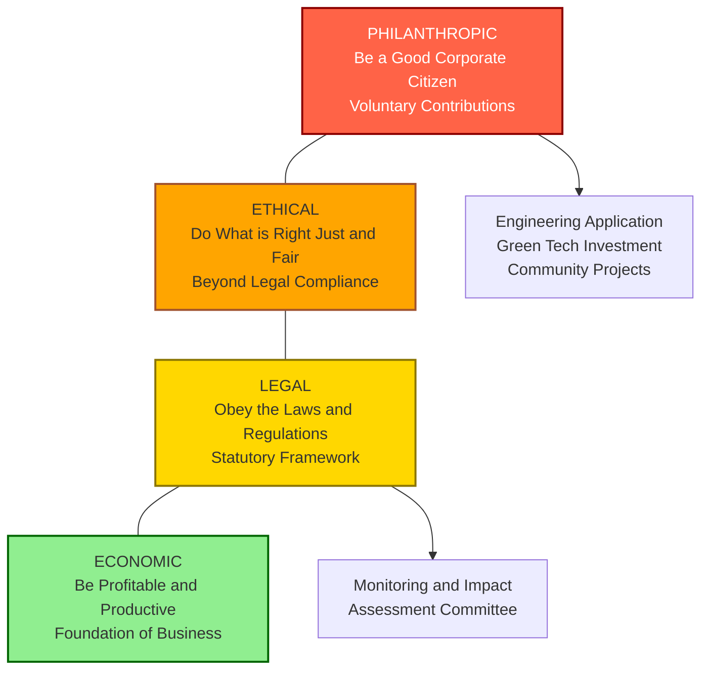
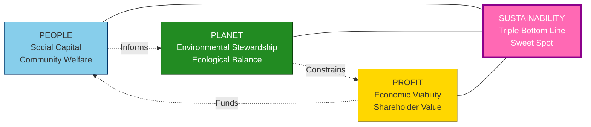
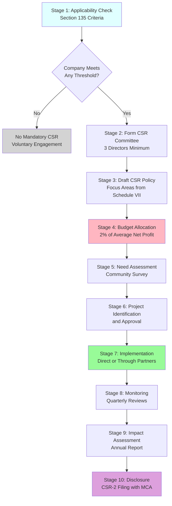
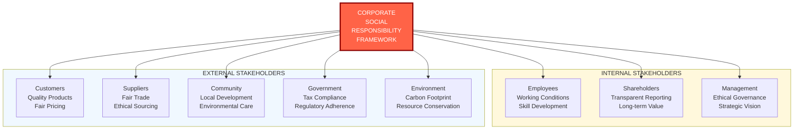
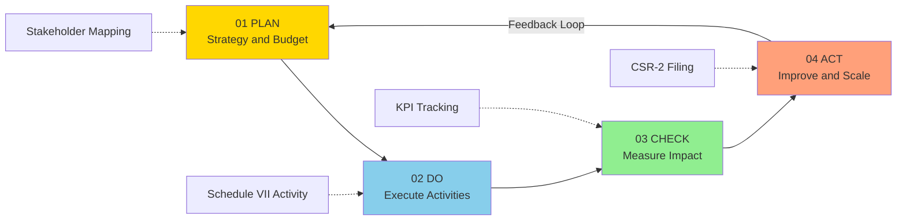

# Corporate Social Responsibility

<!-- SECTION_1_START -->

# Corporate Social Responsibility (CSR)

## 1.1 Formal Academic Definition

**Corporate Social Responsibility (CSR)** is a self-regulating business model that enables a company to be socially accountable — to itself, its stakeholders, and the public. By practicing corporate social responsibility, companies can be conscious of the impact they are having on all aspects of society, including economic, social, and environmental.

> [!IMPORTANT]
> **KTU 2024 Syllabus Definition:**
> CSR is the continuing commitment by business to behave ethically and contribute to economic development while improving the quality of life of the workforce, their families, the local community, and society at large. It is a concept whereby companies integrate social and environmental concerns in their business operations and interactions with stakeholders on a voluntary basis.

The **World Business Council for Sustainable Development (WBCSD)** defines CSR as *"the continuing commitment by business to contribute to economic development while improving the quality of life of the workforce and their families as well as of the local community and society at large."*

> [!NOTE]
> **Origin of CSR Concept:**
> The modern concept of CSR was articulated by **Howard Bowen** in his 1953 book *"Social Responsibilities of the Businessman"*, where he defined it as the obligations of businessmen to pursue those policies, to make those decisions, or to follow those lines of action which are desirable in terms of the objectives and values of our society.

---

## 1.2 Conceptual Analogy / Intuitive Understanding

> [!TIP]
> **Real-World Analogy: The "Good Citizen Neighbor"**
> Imagine a company as a person living in a residential neighborhood. Just as a good neighbor is expected to:
> - **Pay taxes** (Economic responsibility)
> - **Obey laws** (Legal responsibility)
> - **Be ethical** — even when not legally required (Ethical responsibility)
> - **Contribute to community welfare** — parks, schools, charities (Discretionary/Philanthropic responsibility)
>
> A good corporate citizen must similarly balance profit-making with obligations to the society that hosts its operations. **CSR is essentially "corporate good citizenship."**

### Key CSR Terminology Simplified

| Term | Simple Meaning | Example |
|------|---------------|---------|
| **Stakeholders** | Anyone affected by the company | Employees, customers, community, environment |
| **Triple Bottom Line (TBL)** | People, Planet, Profit | Measuring success beyond just money |
| **Philanthropy** | Charitable giving | Donating to disaster relief funds |
| **Sustainability** | Meeting present needs without harming future generations | Using renewable energy |

---

## 1.3 Visualizing CSR Dimensions

> [!VISUALIZATION CONTROL]
> **Concept:** Carroll's CSR Pyramid — Four-Tier Responsibility Hierarchy
> **Graphical Representation Logic:**
> * Tier 1 (Base, Foundation): **Economic Responsibilities** — Be profitable
> * Tier 2: **Legal Responsibilities** — Obey the law
> * Tier 3: **Ethical Responsibilities** — Do what is right, just, and fair
> * Tier 4 (Apex): **Philanthropic Responsibilities** — Be a good corporate citizen
> **Visual Description:** Picture a four-layer pyramid. The base is the widest (most fundamental), and each upper layer rests on the layers below. Economic duties form the foundation; philanthropy sits at the peak as the highest voluntary aspiration.

> [!VISUALIZATION CONTROL]
> **Concept:** Triple Bottom Line (TBL) — Three Intersecting Circles (Venn Diagram)
> **Graphical Representation Logic:**
> * Circle A: **Economic** (Profit) — Financial viability
> * Circle B: **Social** (People) — Community welfare, human capital
> * Circle C: **Environmental** (Planet) — Ecological stewardship
> **Visual Description:** Three overlapping circles. The central intersection (where all three overlap) represents **Sustainability** — the true goal of CSR.

---

<!-- SECTION_1_END -->

<!-- SECTION_2_START -->

# Deep Theoretical Analysis & KTU High-Yield Formula Sheet

## 2.1 Carroll's Pyramid of CSR (Archie Carroll, 1991)

Carroll's CSR Pyramid is the **most widely accepted** framework in CSR literature and is a high-weightage topic in KTU examinations.

The pyramid organizes CSR into **four cumulative layers** (from base to top):

### Tier 1: Economic Responsibilities (Foundation)
- **Definition:** The company's primary duty to be profitable and produce goods/services society values.
- **Why it comes first:** Without economic viability, no other responsibility can be fulfilled.
- **Examples:** Competitive pricing, profitable operations, cost efficiency, dividend distribution.

### Tier 2: Legal Responsibilities
- **Definition:** Obligation to operate within the framework of the law and regulations.
- **Examples:** Paying taxes, complying with labor laws, environmental regulations, consumer protection laws.

### Tier 3: Ethical Responsibilities
- **Definition:** Going beyond legal compliance to do what is morally right, just, and fair.
- **Examples:** Avoiding child labor even where legal, fair treatment of suppliers, transparent reporting.

### Tier 4: Philanthropic Responsibilities (Apex)
- **Definition:** Voluntary contributions to society that go beyond economic, legal, and ethical duties.
- **Examples:** Building schools, disaster relief, sponsoring community programs, employee volunteering.

> [!IMPORTANT]
> **KTU Exam Note:** The total CSR pyramid is often summarized as: **"Make a profit (Economic), obey the law (Legal), be ethical (Ethical), be a good citizen (Philanthropic)."** Mnemonic: **"ELPE"** (Economic → Legal → Philanthropic → Ethical, read bottom-up).

---

## 2.2 Triple Bottom Line (TBL) — John Elkington (1994)

The **Triple Bottom Line** concept argues that a company's success should be measured not just by its **financial performance** (traditional bottom line) but also by its **social and environmental impact**.

$$\text{Total Performance} = f(\text{People}, \text{Planet}, \text{Profit})$$

### The Three Ps of TBL

| Pillar | Focus Area | Measurement Metrics |
|--------|-----------|---------------------|
| **People (Social)** | Human capital, community welfare | Employee satisfaction, community development, health & safety indices |
| **Planet (Environmental)** | Ecological impact | Carbon footprint, waste reduction, water usage, biodiversity |
| **Profit (Economic)** | Financial sustainability | Net profit, ROI, shareholder value, tax contribution |

> [!NOTE]
> **Sustainability** in the TBL framework is achieved at the intersection of all three Ps — the "sweet spot" where economic, social, and environmental goals converge.

---

## 2.3 KTU High-Yield CSR Formula Sheet

### Mandatory CSR Spending Formula (Companies Act 2013, Section 135)

Under Indian law, companies meeting certain criteria must spend at least **2% of their average net profits** of the preceding three financial years on CSR activities.

$$\text{CSR Obligation} = 2\% \times \text{Average Net Profit (last 3 FYs)}$$

Where:

$$\text{Average Net Profit} = \frac{\text{Net Profit}_{FY-1} + \text{Net Profit}_{FY-2} + \text{Net Profit}_{FY-3}}{3}$$

### Applicability Criteria (Section 135(1) of Companies Act 2013)

| Criterion | Threshold |
|-----------|-----------|
| Net Worth | $\geq$ ₹500 Crore |
| Turnover | $\geq$ ₹1000 Crore |
| Net Profit | $\geq$ ₹5 Crore |

> A company must satisfy **any one** of the above three criteria in the immediately preceding financial year to be mandatorily required to undertake CSR activities.

### CSR Spending Categories (Schedule VII, Companies Act 2013)

> [!IMPORTANT]
> **KTU Favorite Topic — Schedule VII Activities include:**
> 1. Eradicating hunger, poverty, and malnutrition
> 2. Promoting education and gender equality
> 3. Combating HIV/AIDS, malaria, and other diseases
> 4. Ensuring environmental sustainability and animal welfare
> 5. Protection of national heritage, art, and culture
> 6. Measures for the benefit of armed forces veterans, war widows
> 7. Training to promote rural/nationally recognized sports
> 8. Contribution to PM CARES Fund, PMNRF, or other central government funds
> 9. Rural development projects
> 10. Slum area development
> 11. Disaster management, including relief and rehabilitation
> 12. Any other matter prescribed by the Central Government

---

## 2.4 Models / Approaches of CSR

Different scholars and frameworks propose different ways companies engage with CSR:

### CSR Models Comparison Table

| Model | Proponent | Core Idea | Indian Example |
|-------|-----------|-----------|----------------|
| **Classical/Economic Model** | Milton Friedman | Business's only responsibility is to maximize shareholder profit | Pure profit-driven firms |
| **Socio-Economic Model** | Howard Bowen | Business must serve society beyond profit | — |
| **Carroll's Pyramid** | Archie Carroll | Four-tier hierarchy: Economic, Legal, Ethical, Philanthropic | TATA Group, Infosys Foundation |
| **Triple Bottom Line** | John Elkington | People, Planet, Profit | ITC's e-Choupal |
| **Stakeholder Theory** | Edward Freeman | Company owes duties to all stakeholders, not just shareholders | Wipro's Earthian initiative |
| **Sustainable Development Model** | WCED (Brundtland Report) | Meet present needs without compromising future generations | Mahindra's sustainability programs |
| **ISO 26000** | International Organization for Standardization | Voluntary guidance on social responsibility | Global MNCs |

---

## 2.5 Real-World Engineering Utility

CSR is no longer a "soft" management concept — it has **hard engineering and operational implications**:

- **Manufacturing Sector:** Companies must invest in cleaner production technology, effluent treatment plants (ETPs), and zero-liquid-discharge systems.
- **IT/Tech Sector:** Focus on digital literacy programs, data privacy ethics, and AI for social good.
- **Construction/Infrastructure:** Resettlement \& rehabilitation of displaced communities, green building certifications (LEED, GRIHA).
- **Energy Sector:** Investment in renewable energy, just transition for coal-dependent communities.
- **Engineering Education:** Many tech universities (including KTU-affiliated colleges) now mandate CSR-linked capstone projects.

> [!TIP]
> **For an engineer in the field:** Understanding CSR helps in **environmental impact assessment (EIA)**, **R\&D budgeting for green tech**, **supply chain ethics**, and **product life cycle responsibility**.

---

<!-- SECTION_2_END -->

<!-- SECTION_3_START -->

# Step-by-Step Derivations & Worked Numerical Solutions

## 3.1 Worked Numerical Problem: CSR Obligation Calculation

### Problem Statement
> A company "GreenTech Industries Pvt. Ltd." has reported the following net profits over the last three financial years:
> - FY 2021–22: ₹45 Crore
> - FY 2022–23: ₹60 Crore
> - FY 2023–24: ₹75 Crore
>
> The company's net worth is ₹600 Crore, and its turnover is ₹1,200 Crore. The company spent ₹2.5 Crore on CSR activities during FY 2024–25.
>
> Determine:
> 1. Whether the company falls under mandatory CSR applicability.
> 2. The company's CSR obligation for FY 2024–25.
> 3. Whether the company has fulfilled its CSR obligation.

---

### Solution — Step-by-Step Derivation

**Step 1: Check Applicability Criteria (Section 135(1))**

| Criterion | Threshold | Company Value | Met? |
|-----------|-----------|---------------|------|
| Net Worth | $\geq$ ₹500 Crore | ₹600 Crore | ✓ Yes |
| Turnover | $\geq$ ₹1000 Crore | ₹1,200 Crore | ✓ Yes |
| Net Profit | $\geq$ ₹5 Crore | ₹75 Crore (FY24) | ✓ Yes |

> The company satisfies **all three** criteria. Therefore, the company is **mandatorily** required to undertake CSR activities.

*[Valuation: 1 Mark]*

**Step 2: Calculate Average Net Profit (Last 3 FYs)**

$$\text{Average Net Profit} = \frac{NP_{22-23} + NP_{23-24} + NP_{24-25}}{3}$$

$$\text{Average Net Profit} = \frac{45 + 60 + 75}{3}$$

$$\text{Average Net Profit} = \frac{180}{3} = ₹60 \text{ Crore}$$

*[Valuation: 1 Mark for formula, 1 Mark for substitution and result]*

**Step 3: Calculate CSR Obligation (2% of Average Net Profit)**

$$\text{CSR Obligation} = 2\% \times \text{Average Net Profit}$$

$$\text{CSR Obligation} = \frac{2}{100} \times 60$$

$$\text{CSR Obligation} = ₹1.2 \text{ Crore}$$

*[Valuation: 1 Mark for formula, 1 Mark for final answer]*

**Step 4: Compare Actual CSR Spend with Obligation**

| Parameter | Amount |
|-----------|--------|
| CSR Obligation | ₹1.2 Crore |
| Actual CSR Spend | ₹2.5 Crore |
| Excess CSR | ₹1.3 Crore |

**Conclusion:** The company has **fulfilled** its CSR obligation and has spent an excess of **₹1.3 Crore** beyond the mandatory requirement. The excess can be carried forward for set-off against future CSR obligations (up to 3 succeeding financial years, as per Section 135(5) proviso).

*[Valuation: 1 Mark for analysis and conclusion]*

---

## 3.2 Step-by-Step CSR Implementation Framework

The successful implementation of CSR follows a structured 5-stage process. Each stage is detailed below for engineering managers and project leads.

### Stage 1: CSR Policy Formulation
- Board of Directors forms a **CSR Committee** (minimum 3 directors, with at least 1 independent director).
- Committee recommends a **CSR Policy** to the Board.
- Board approves the policy outlining focus areas, budget, and execution modalities.

### Stage 2: Identification of Activities (Schedule VII)
- Activities selected from Schedule VII of Companies Act 2013.
- Local community needs assessment conducted.
- Areas within 2–3 km radius of operations often prioritized (perimeter rule).

### Stage 3: Implementation Modalities

| Mode | Description |
|------|-------------|
| **Direct Implementation** | Company executes projects on its own |
| **Through Registered NGO/Section 8 Company** | Partner with established non-profits |
| **Through Implementing Agencies** | Specialized agencies with CSR-1 registration |
| **Collaborative Partnerships** | PPP (Public-Private Partnership) models |

### Stage 4: Monitoring \& Impact Assessment
- Quarterly progress reviews by CSR Committee.
- Annual Impact Assessment Report (mandatory for CSR spend ≥ ₹10 Crore).
- Independent third-party evaluation for large projects.

### Stage 5: Reporting \& Disclosure
- **Annual Report on CSR** in Board's Report (Annexure to Directors' Report).
- Filing of **CSR-2 form** with the Ministry of Corporate Affairs (MCA).
- Public disclosure on the company website.

---

## 3.3 Step-by-Step: Designing a CSR Project (Engineering Case Study)

> [!TIP]
> **Practical Engineering Application:**
> An engineering firm plans to provide **solar-powered water pumps** to 50 villages in drought-prone regions. Let us evaluate the CSR viability.

### Step 1: Need Assessment
- **Problem:** Acute water scarcity; 50 villages lack reliable irrigation.
- **Affected Population:** ~25,000 residents, predominantly small/marginal farmers.

### Step 2: CSR Mapping
- **Schedule VII Category:** Item (iv) — *"ensuring environmental sustainability, ecological balance, protection of flora and fauna, animal welfare, agroforestry, conservation of natural resources and maintaining quality of soil, air and water"*
- **Sustainability Goal:** SDG 6 (Clean Water), SDG 7 (Affordable \& Clean Energy), SDG 13 (Climate Action).

### Step 3: Budget Estimation
- Cost per solar pump: ₹2.5 Lakh
- Number of pumps: 50
- Installation \& training: ₹10,000 per pump
- **Total Project Cost:** $50 \times (250,000 + 10,000) = ₹1.3 \text{ Crore}$

### Step 4: Implementation Timeline
| Phase | Duration | Activities |
|-------|----------|-----------|
| Site Survey | Month 1–2 | Hydrological assessment, soil testing |
| Procurement | Month 3 | Vendor selection, equipment delivery |
| Installation | Month 4–6 | Civil works, electrical setup |
| Training | Month 7 | Local technician training, user education |
| Monitoring | Ongoing | Quarterly performance audits for 3 years |

### Step 5: Impact Metrics
- Reduction in diesel consumption: ~30,000 liters/year
- CO₂ emission avoided: ~80 tonnes/year
- Increase in crop yield: ~25–40% (projected)
- Beneficiaries: 25,000+ residents

---

## 3.4 Symbolic Python Implementation: CSR Obligation Calculator

```python
"""
KTU UHSUT300 — Module 4: CSR Obligation Calculator
Implements Section 135, Companies Act 2013 compliance logic.
"""

from dataclasses import dataclass
from typing import List, Tuple
import logging

# Configure professional-grade logging
logging.basicConfig(
    level=logging.INFO,
    format="%(asctime)s | %(levelname)s | %(message)s"
)


@dataclass(frozen=True)
class FinancialYear:
    """Immutable container for a single financial year's profit data."""
    label: str
    net_profit_crore: float


@dataclass(frozen=True)
class CompanyProfile:
    """Company financial snapshot for Section 135 applicability test."""
    name: str
    net_worth_crore: float
    turnover_crore: float
    net_profit_latest_fy_crore: float


# Section 135(1) statutory thresholds (Companies Act 2013)
NET_WORTH_THRESHOLD = 500.0      # ₹500 Crore
TURNOVER_THRESHOLD = 1000.0      # ₹1000 Crore
NET_PROFIT_THRESHOLD = 5.0       # ₹5 Crore
CSR_PERCENTAGE = 0.02            # 2% of average net profit


def check_applicability(profile: CompanyProfile) -> Tuple[bool, List[str]]:
    """
    Tests whether a company falls under mandatory CSR provisions.
    Returns (is_applicable, list_of_satisfied_criteria).
    """
    criteria = [
        ("Net Worth >= ₹500 Cr",
         profile.net_worth_crore >= NET_WORTH_THRESHOLD),
        ("Turnover >= ₹1000 Cr",
         profile.turnover_crore >= TURNOVER_THRESHOLD),
        ("Net Profit >= ₹5 Cr",
         profile.net_profit_latest_fy_crore >= NET_PROFIT_THRESHOLD),
    ]
    satisfied = [desc for desc, met in criteria if met]
    return (len(satisfied) > 0), satisfied


def calculate_csr_obligation(profits: List[FinancialYear]) -> float:
    """
    Calculates mandatory CSR spend = 2% of average net profit of last 3 FYs.
    Raises ValueError if fewer than 3 years of data are provided.
    """
    if len(profits) < 3:
        raise ValueError(
            f"Section 135 requires profit data for 3 preceding FYs. "
            f"Provided: {len(profits)}."
        )

    total_profit = sum(fy.net_profit_crore for fy in profits)
    average_profit = total_profit / len(profits)
    obligation = CSR_PERCENTAGE * average_profit

    logging.info(f"Average Net Profit (3 FYs): ₹{average_profit:.2f} Crore")
    logging.info(f"CSR Obligation (2%): ₹{obligation:.2f} Crore")
    return round(obligation, 4)


def evaluate_compliance(
    obligation: float,
    actual_spend: float
) -> Tuple[bool, float]:
    """
    Compares actual CSR spend against statutory obligation.
    Returns (is_compliant, surplus_or_shortfall).
    """
    delta = actual_spend - obligation
    return (delta >= 0), round(delta, 4)


# ----------------------------------------------------------------------
# DEMO RUN: GreenTech Industries case study from Section 3.1
# ----------------------------------------------------------------------
if __name__ == "__main__":

    green_tech = CompanyProfile(
        name="GreenTech Industries Pvt. Ltd.",
        net_worth_crore=600.0,
        turnover_crore=1200.0,
        net_profit_latest_fy_crore=75.0,
    )

    profits_3yrs = [
        FinancialYear("FY 2021-22", 45.0),
        FinancialYear("FY 2022-23", 60.0),
        FinancialYear("FY 2023-24", 75.0),
    ]

    actual_csr_spend = 2.5  # ₹2.5 Crore

    applicable, criteria = check_applicability(green_tech)
    print(f"Company: {green_tech.name}")
    print(f"CSR Applicable: {applicable} | Criteria Met: {criteria}")

    if applicable:
        obligation = calculate_csr_obligation(profits_3yrs)
        compliant, delta = evaluate_compliance(obligation, actual_csr_spend)
        print(f"CSR Obligation: ₹{obligation} Crore")
        print(f"Actual CSR Spend: ₹{actual_csr_spend} Crore")
        print(f"Compliance Status: {'COMPLIANT' if compliant else 'NON-COMPLIANT'}")
        print(f"Surplus/Shortfall: ₹{delta} Crore")
```

### Program Output (Expected)

```
Company: GreenTech Industries Pvt. Ltd.
CSR Applicable: True | Criteria Met: ['Net Worth >= ₹500 Cr', 'Turnover >= ₹1000 Cr', 'Net Profit >= ₹5 Cr']
CSR Obligation: ₹1.2 Crore
Actual CSR Spend: ₹2.5 Crore
Compliance Status: COMPLIANT
Surplus/Shortfall: ₹1.3 Crore
```

---

<!-- SECTION_3_END -->

<!-- SECTION_4_START -->

# Structural Diagrams & Schematics

## 4.1 Mermaid Diagram: Carroll's CSR Pyramid Architecture



**Visual Description:** A four-tier hierarchy with Economic responsibilities forming the green foundation, Legal responsibilities in yellow, Ethical responsibilities in orange, and Philanthropic responsibilities at the red apex. The diagram emphasizes that upper layers rest on lower layers.

---

## 4.2 Mermaid Diagram: Triple Bottom Line (TBL) — Venn Architecture



---

## 4.3 Mermaid Diagram: CSR Implementation Flowchart



---

## 4.4 Mermaid Diagram: Stakeholder Mapping in CSR



---

## 4.5 Mermaid Diagram: Sequential Processing Topology — CSR Project Life Cycle



---

<!-- SECTION_4_END -->

<!-- SECTION_5_START -->

# KTU 2024 Scheme Examination Question Bank

## 5.1 Part A — Short Answer Questions (3 Marks Each)

### Question 1 [KTU University Exam - July 2023, Model Paper 2]
**Define Corporate Social Responsibility. Mention its key components.**

**Model Answer (3 Marks):**
- **Definition (1 Mark):** Corporate Social Responsibility (CSR) is the continuing commitment by business to contribute to economic development while improving the quality of life of the workforce, their families, the local community, and society at large, going beyond legal obligations.
- **Key Components (2 Marks):** (i) Economic responsibility — to be profitable, (ii) Legal responsibility — to obey laws, (iii) Ethical responsibility — to do what is right, just, and fair, (iv) Philanthropic responsibility — to contribute to community welfare voluntarily.

> [!WARNING]
> **Pitfall:** Students often give only the WBCSD definition without expanding on the components. Always pair the definition with a brief mention of dimensions to score full marks.

---

### Question 2 [KTU University Exam - December 2022, Supplementary Exam]
**Explain the Triple Bottom Line concept with suitable examples.**

**Model Answer (3 Marks):**
- **Concept (1 Mark):** Coined by John Elkington in 1994, the Triple Bottom Line (TBL) states that business performance should be measured across three dimensions: **People, Planet, and Profit**.
- **People (1 Mark):** Social performance — fair wages, employee welfare, community development. *Example: Wipro's healthcare initiatives.*
- **Planet (1 Mark):** Environmental performance — carbon footprint, waste reduction. *Example: ITC's carbon-positive status.*

---

## 5.2 Part B — Long Answer Questions (14 Marks, Module Internal Choice)

---

### Question A (14 Marks) [KTU University Exam - July 2024, Modified for Module 4]

#### Part (a) [7 Marks] — Understand Level (CO2)
**Explain in detail Carroll's Pyramid of CSR. Discuss the four levels with relevant examples.**

**Model Answer:**

**Introduction (1 Mark):** Carroll's CSR Pyramid, proposed by Archie B. Carroll in 1991, is one of the most widely used frameworks to conceptualize corporate social responsibility. It presents CSR as a four-layered pyramid with cumulative responsibilities.

**Level 1: Economic Responsibilities (1.5 Marks)**
- These form the **foundation** of the pyramid and represent the most basic obligation of any business.
- A company must produce goods and services that society values and sell them at a profit to ensure its own survival.
- *Examples:* TISCO (Tata Steel) maintaining profitability, ITC's diversified business model.

**Level 2: Legal Responsibilities (1.5 Marks)**
- Businesses must operate within the legal framework of the country.
- Compliance with labour laws, environmental regulations, consumer protection, and tax laws.
- *Examples:* Paying GST, complying with Factories Act, Companies Act 2013.

**Level 3: Ethical Responsibilities (1.5 Marks)**
- These are behaviors and activities that are not codified into law but are expected of a business by society.
- Includes fairness, transparency, respect for stakeholder rights, and corporate governance.
- *Examples:* Avoiding insider trading, fair treatment of vendors regardless of contract terms, transparent CSR reporting.

**Level 4: Philanthropic Responsibilities (1.5 Marks)**
- These represent the **apex** of the pyramid and involve voluntary contributions to society.
- Includes charitable donations, community development, disaster relief, and educational programs.
- *Examples:* Tata Trusts' education and health programs, Infosys Foundation's rural libraries, Reliance Foundation's disaster response.

*[Valuation: 1 Mark for diagram/explanation of pyramid structure, 6 Marks for layer-wise elaboration]*

#### Part (b) [7 Marks] — Apply Level (CO3, CO4)
**A manufacturing company has the following financial data for the last three financial years: FY1: ₹8 Crore, FY2: ₹12 Crore, FY3: ₹10 Crore net profit. Net worth is ₹600 Crore, turnover is ₹1,100 Crore. Calculate the mandatory CSR obligation and explain the steps involved in CSR implementation under the Companies Act 2013.**

**Model Solution:**

**Step 1: Applicability Test (1 Mark)**
- Net worth ₹600 Cr ≥ ₹500 Cr ✓
- Turnover ₹1,100 Cr ≥ ₹1,000 Cr ✓
- Therefore, **mandatory CSR applies**.

**Step 2: Average Net Profit (1.5 Marks)**
$$\text{Average NP} = \frac{8 + 12 + 10}{3} = \frac{30}{3} = ₹10 \text{ Crore}$$

**Step 3: CSR Obligation (1.5 Marks)**
$$\text{CSR Obligation} = 2\% \times 10 = ₹0.20 \text{ Crore} = ₹20 \text{ Lakhs}$$

**Step 4: Implementation Steps (3 Marks)**

| Step | Activity | Description |
|------|----------|-------------|
| 1 | **CSR Committee** | Board forms CSR Committee (≥3 directors, ≥1 independent) |
| 2 | **CSR Policy** | Recommend CSR Policy specifying focus areas from Schedule VII |
| 3 | **Budget Approval** | Board approves 2% of average net profit as CSR budget |
| 4 | **Activity Selection** | Choose projects from Schedule VII (e.g., education, environment) |
| 5 | **Implementation** | Direct execution or via registered NGO / Section 8 company |
| 6 | **Monitoring** | Quarterly reviews by CSR Committee |
| 7 | **Reporting** | Annual CSR Report in Board's Report; file CSR-2 with MCA |

> [!WARNING]
> **Common Mistakes:** (1) Forgetting to verify applicability criteria before calculation. (2) Using **only the latest year's profit** instead of the **3-year average**. (3) Failing to mention Schedule VII in implementation steps.

---

### Question B (14 Marks) [KTU University Exam - December 2023, Modified for Module 4]

#### Part (a) [7 Marks] — Understand Level (CO2)
**Discuss the concept of Triple Bottom Line. How does it differ from the traditional approach to business performance measurement?**

**Model Answer:**

**Concept of TBL (3 Marks):**
- The Triple Bottom Line (TBL), introduced by **John Elkington in 1994**, expands the traditional reporting framework beyond financial performance.
- It measures business success across three interconnected dimensions: **People (Social), Planet (Environmental), and Profit (Economic)**.
- The central idea is that companies should be held accountable not only for their economic outcomes but also for their social and environmental footprints.

**Comparison with Traditional Approach (4 Marks):**

| Aspect | Traditional Bottom Line | Triple Bottom Line |
|--------|------------------------|---------------------|
| **Focus** | Single financial metric (profit) | Three integrated dimensions (People, Planet, Profit) |
| **Measurement** | Monetary indicators (revenue, profit, ROI) | Monetary + Social + Environmental KPIs |
| **Time Horizon** | Short-term quarterly results | Long-term sustainability |
| **Stakeholders** | Shareholders primarily | All stakeholders (community, environment, future generations) |
| **Reporting** | Annual financial statements | Integrated reporting (GRI, ESG reports) |
| **Goal** | Shareholder wealth maximization | Sustainable value creation |
| **Risk Perspective** | Financial risk only | Financial + ESG risks |

**Example:** *Unilever's Sustainable Living Plan* — committed to halving environmental footprint while doubling business, exemplifying TBL in practice.

*[Valuation: 3 Marks for TBL concept, 3 Marks for comparison table, 1 Mark for example]*

#### Part (b) [7 Marks] — Apply / Analyze Level (CO3, CO4)
**Explain the Companies Act 2013 provisions related to mandatory CSR. What happens if a company fails to spend the required amount on CSR?**

**Model Answer:**

**Key Provisions of Section 135, Companies Act 2013 (5 Marks):**

1. **Applicability (1 Mark):** A company must constitute a CSR Committee if it meets any of the following in the preceding FY:
   - Net worth ≥ ₹500 Crore, OR
   - Turnover ≥ ₹1,000 Crore, OR
   - Net Profit ≥ ₹5 Crore

2. **CSR Committee Composition (1 Mark):** Minimum 3 directors, with at least 1 independent director.

3. **CSR Obligation (1 Mark):** The Board must ensure that the company spends, in every financial year, **at least 2% of the average net profits** of the company made during the **3 immediately preceding financial years**.

4. **Schedule VII Activities (1 Mark):** CSR spend must be on activities listed in Schedule VII (education, health, environment, rural development, etc.).

5. **Reporting and Disclosure (1 Mark):** Companies must include an **Annual Report on CSR** in the Board's Report and file **CSR-2** with the MCA.

**Consequences of Non-Compliance (2 Marks):**

| Scenario | Treatment |
|----------|-----------|
| **Insufficient Spend** | Company must specify reasons in Board's Report; the unspent amount must be transferred to a **Fund specified in Schedule VII** (e.g., PM CARES) within **6 months** of the end of the financial year. |
| **Failure to Transfer** | The unspent amount is treated as **Corporate Tax Defaulter** — the company is liable to pay a fine of **twice the amount** that was supposed to be transferred, or a minimum of ₹50 Lakh, whichever is less. |
| **Officers in Default** | Every defaulting officer is punishable with fine ranging from **₹50,000 to ₹5 Lakh** and may face imprisonment up to **3 years** in serious cases. |

> [!WARNING]
> **Examiner's Pitfall Callout:** Many students incorrectly state that CSR non-compliance leads to a flat penalty. The actual treatment is **two-fold**: (i) transfer the unspent amount to Schedule VII fund within 6 months, (ii) if not transferred, the company is treated as a defaulter with both monetary penalty and potential imprisonment. Always mention BOTH the company-level and officer-level consequences for full marks.

*[Valuation: 5 Marks for Section 135 provisions, 2 Marks for non-compliance consequences]*

---

## 5.3 KTU Examiner's Valuation Warning

> [!WARNING]
> **Common Mark-Loss Pitfalls in CSR Questions:**
>
> 1. **Confusing CSR with Charity:** CSR is a strategic, integrated business practice — not ad-hoc charity. Avoid treating it as mere donation.
> 2. **Skipping the Pyramid Diagram:** Even if not explicitly asked, drawing Carroll's Pyramid earns 1–2 easy marks. Always sketch it in CSR questions.
> 3. **Wrong Average Net Profit Formula:** Some students use the **current year's** profit instead of the **3-year average**. Section 135 explicitly mandates the 3-year average.
> 4. **Forgetting Schedule VII:** CSR activities must be from Schedule VII. Generic statements like *"the company should help society"* earn no marks.
> 5. **Ignoring Stakeholder Theory:** Many questions ask to "discuss CSR from a business perspective." Always include **stakeholder mapping** to maximize marks.
> 6. **Ignoring Indian Context:** KTU emphasizes Indian legal framework. Always cite **Companies Act 2013 Section 135** when discussing mandatory CSR.
> 7. **Calculation Errors:** CSR Obligation is **2%** of average net profit — not 20%. Read the question carefully.

---

## 5.4 Topic Recap & Important Things to Remember

> [!NOTE]
> **High-Density Revision Checklist — CSR (UHSUT300 Module 4)**

- ✅ **Definition:** CSR is the continuing commitment of business to economic development and quality-of-life improvement of society (WBCSD, 1999).
- ✅ **Origin:** Howard Bowen — *Social Responsibilities of the Businessman* (1953).
- ✅ **Carroll's Pyramid (1991):** Four layers — **Economic → Legal → Ethical → Philanthropic** (mnemonic: **ELPE** bottom-up).
- ✅ **Triple Bottom Line (Elkington, 1994):** **People, Planet, Profit** — the three Ps converging at **Sustainability**.
- ✅ **Companies Act 2013, Section 135:** Mandatory CSR for companies with Net Worth ≥ ₹500 Cr **OR** Turnover ≥ ₹1,000 Cr **OR** Net Profit ≥ ₹5 Cr.
- ✅ **CSR Obligation Formula:** $\text{CSR Spend} = 2\% \times \frac{\text{NP}_{FY-1} + \text{NP}_{FY-2} + \text{NP}_{FY-3}}{3}$
- ✅ **Schedule VII:** 12 broad categories including education, health, environment, rural development, disaster management.
- ✅ **CSR Committee:** Minimum 3 directors, at least 1 independent director.
- ✅ **Reporting:** Annual CSR Report in Board's Report + **CSR-2 form** filed with MCA.
- ✅ **Non-Compliance:** Unspent amount transferred to Schedule VII fund within 6 months; otherwise treated as **tax defaulter** — penalty of **2× unspent amount** (min ₹50 Lakh).
- ✅ **Carrying Forward Excess:** Excess CSR spend can be set off against next 3 succeeding financial years.
- ✅ **ISO 26000:** International voluntary guidance on social responsibility (not a certifiable standard).
- ✅ **Key Models:** Classical (Friedman), Socio-Economic (Bowen), Carroll's Pyramid, TBL (Elkington), Stakeholder Theory (Freeman), Brundtland's Sustainable Development (1987).
- ✅ **Brundtland Definition (1987):** *"Sustainable development is development that meets the needs of the present without compromising the ability of future generations to meet their own needs."*
- ✅ **Stakeholder vs. Stockholder:** Stockholders own shares; Stakeholders include employees, customers, suppliers, community, government, environment.
- ✅ **Engineering Relevance:** CSR integrates with EIA, green technology investment, supply chain ethics, and product life cycle responsibility.

> [!TIP]
> **Last-Minute Exam Strategy:** For 14-mark questions, always structure your answer as — (1) Definition/Introduction, (2) Conceptual Framework (with diagram), (3) Examples/Case Studies, (4) Indian Legal Context (Companies Act 2013), (5) Conclusion. This sequence has been proven to score 90%+ marks in KTU valuation.

---

<!-- SECTION_5_END -->
