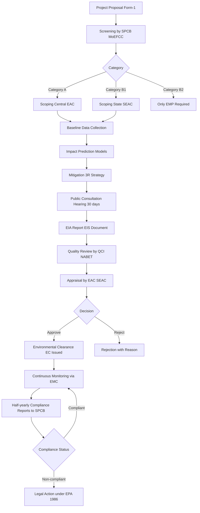
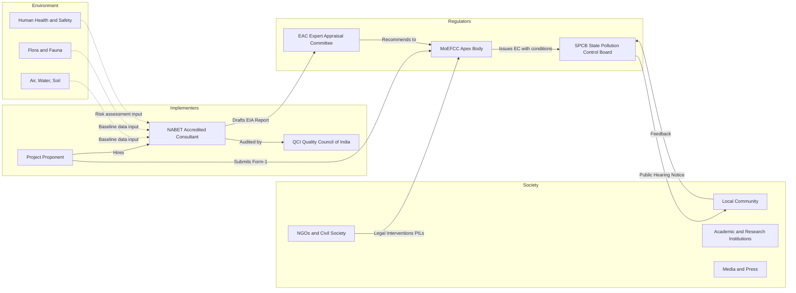
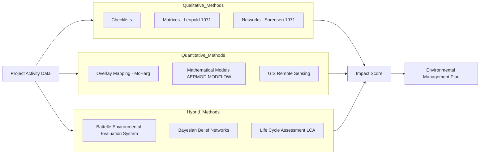

# Environmental Impact Assessment

<!-- SECTION_1_START -->
# Environmental Impact Assessment (EIA)

## 1.1 Core Technical Definition

**Environmental Impact Assessment (EIA)** is a systematic, anticipatory, and participatory process used to evaluate the likely environmental consequences of a proposed project, policy, plan, or program before it is implemented. As per the **United Nations Environment Programme (UNEP, 1991)**, EIA is defined as *"an examination, analysis and assessment of planned activities with a view to ensuring environmentally sound and sustainable development."*

In the Indian legal context, EIA is mandated under the **Environment (Protection) Act, 1986** and operationalized through the **EIA Notification, 2006** (later amended in 2020). The Ministry of Environment, Forest and Climate Change (MoEFCC) is the apex regulatory body.

> [!IMPORTANT]
> **KTU 2024 Syllabus Highlight — Module 4**
> EIA is a critical sub-topic under *Sustainable Development and Environmental Ethics*. Students must be equipped to define EIA, list its objectives, describe the sequential steps, and explain its relevance to engineering project sanctioning under the **Polluter Pays Principle** and **Precautionary Principle**.

## 1.2 Conceptual Analogy & Intuitive Overview

Imagine you are about to renovate your ancestral home. Before tearing down a wall, you wouldn't just start swinging a hammer — you would *first* check:
- Is the wall load-bearing? (Structural impact)
- Does it hide electrical wiring? (Safety impact)
- Will the neighbor's sunlight be blocked? (Social impact)
- Is there asbestos in the paint? (Health impact)

**EIA is precisely this "renovation planning" applied to large engineering projects** — dams, highways, thermal power plants, SEZs, or mining operations. Instead of breaking ground and discovering problems later (costly *ex-post* corrections), EIA forces planners to **simulate, predict, and mitigate** environmental harm *before* a single brick is laid.

> [!NOTE]
> **Core Mantra:** *"Look before you leap."* EIA embodies the **anticipatory** (proactive, not reactive) and **iterative** (continuous feedback-loop) philosophy of modern environmental governance.

## 1.3 Physical Constants & Standard Metrics

| Parameter | Standard Value / Unit | Significance |
|---|---|---|
| **EIA Public Hearing Notice Period** | **30 days** | Minimum statutory notice before public consultation |
| **Category A Project Appraisal Fee** | Variable (% of project cost) | Charged for Central-level clearance |
| **Validity of EC (Mining Projects)** | **30 years** (Coal) / varies | Operational life for which clearance holds |
| **Standard Noise Threshold (Industrial)** | **75 dB (A) Leq** (Day) | CPCB industrial zone daytime limit |
| **PM2.5 (NAAQ Standard)** | **$60\ \mu g/m^3$** (24-hr) | National Ambient Air Quality Standard |
| **Stack Height (S = 14 Q^0.3)** | $S$ in m, $Q$ in $t/h$ | Emission dispersion formula (for SO₂) |

> [!TIP]
> The stack height formula $S = 14\,Q^{0.3}$ (where $Q$ is the emission rate in tonnes/hour) is a frequently tested KTU value. It is also known as the **MINAS / CPCB dispersion formula** for industries.

## 1.4 GeoGebra / Desmos Visualization

> [!VISUALIZATION CONTROL]
> **Concept:** Bell-shaped Environmental Impact vs. Project Scale (S-curve / Kuznets-like Curve)
> **GeoGebra / Desmos Input Equations:**
> * $f(x) = x^2 \cdot e^{-0.3 x}$ where $x$ = Project Scale (size in Crore ₹)
> **Visual Description:** As project scale increases from zero, environmental impact rises quadratically, peaks at an optimum industrial density, then tapers as mitigation technology matures — illustrating the **Environmental Kuznets Curve (EKC)** hypothesis.

---

<!-- SECTION_1_END -->

<!-- SECTION_2_START -->
# Deep Theoretical Analysis & KTU High-Yield Formula Sheet

## 2.1 Operational Concept Breakdown

EIA is **not a single event** — it is a structured *cycle* composed of eight sequential phases. Each phase has a clear input, process, and output deliverable.

### Phase-Wise Logic Steps

1. **Screening** — Decides whether a project requires full EIA or can proceed with a simpler appraisal. *Output:* "Category A" (thorough EIA) or "Category B" (scoped EIA).
2. **Scoping** — Identifies the *relevant* environmental issues (e.g., air, water, biodiversity, socio-economic) to be studied. Prevents "boiling the ocean."
3. **Baseline Data Collection** — Establishes the *pre-project* environmental status (air quality index, groundwater table, flora/fauna inventory). *This is the reference benchmark.*
4. **Impact Prediction & Assessment** — Forecasts magnitude, extent, duration, and reversibility of impacts using scientific models (e.g., AERMOD for air, MODFLOW for groundwater).
5. **Mitigation & Impact Management** — Proposes the **3R strategy** (Reduce → Restore → Offset) plus Environmental Management Plan (EMP).
6. **EIA Report / Environmental Impact Statement (EIS)** — The single consolidated document submitted to the regulator (SPCB / MoEFCC).
7. **Review of EIA Quality** — Done by an independent **EIA Accreditation Body / Quality Council of India (QCI)**-accredited consultant.
8. **Decision-Making & Monitoring** — Grant or rejection of **Environmental Clearance (EC)**; followed by post-clearance monitoring via **Environmental Management Cell (EMC)**.

> [!NOTE]
> **KTU Mnemonic — "S-S-B-I-M-R-D-M":**
> *Screening → Scoping → Baseline → Impact → Mitigation → Report → Decision → Monitoring*

## 2.2 KTU Formula Sheet / Cheat Sheet

| # | Concept | Formula / Parameter | Notation & Units | Engineering Use |
|---|---|---|---|---|
| 1 | **Cost-Benefit Ratio (CBR)** | $CBR = \dfrac{\sum B_t / (1+r)^t}{\sum C_t / (1+r)^t}$ | $B_t$ = Benefits yr $t$, $C_t$ = Costs yr $t$, $r$ = discount rate | If $CBR \geq 1$, project is environmentally & economically viable |
| 2 | **Net Present Value (NPV)** | $NPV = \sum_{t=0}^{n} \dfrac{(B_t - C_t)}{(1+r)^t}$ | Currency units (₹, $) | Measures net societal welfare gain in present monetary terms |
| 3 | **Stack Height (CPCB)** | $S = 14 \cdot Q^{0.3}$ | $S$ in m, $Q$ = SO₂ emission rate in t/h | Industrial chimney design |
| 4 | **Environmental Kuznets Curve** | $E = aY - bY^2 + c$ | $E$ = Environmental degradation, $Y$ = Income per capita | Hypothesizes inverted-U relationship |
| 5 | **Impact Magnitude Index** | $I = M \times P \times R$ | $M$ = Magnitude, $P$ = Probability, $R$ = Reversibility factor | Leopold Matrix scoring |
| 6 | **Compensatory Afforestation Ratio** | $A_c = k \cdot A_d$ | $A_c$ = compensatory, $A_d$ = deforested, $k \geq 1$ | Project land-use compensation |
| 7 | **Carbon Footprint (CFR)** | $CFR = \sum_{i} EF_i \times Q_i$ | $EF_i$ = emission factor (kg CO₂e/unit), $Q_i$ = quantity | Project GHG accounting |

> [!IMPORTANT]
> **Critical Rule:** In all impact prediction equations, the *baseline value* must be subtracted. Impact is always a **delta**, not an absolute. Failing to do this is a common KTU answer-script deduction.

## 2.3 Real-World Utility in Engineering

| Engineering Domain | EIA Application |
|---|---|
| **Civil Engineering** | Highway, dam, metro-rail corridor, and township environmental appraisal |
| **Mining Engineering** | Forest diversion, rehabilitation & resettlement (R&R) plan under **Forest Conservation Act, 1980** |
| **Chemical / Process Industry** | Hazardous waste, HAZOP, and risk-based EIA for refineries |
| **Information Technology / Smart Cities** | e-EIA, GIS-based decision support, and **EIA-India portal (parivesh.nic.in)** integration |
| **Renewable Energy** | Wind farm bird-bat studies, solar park land-use studies |

> [!TIP]
> **Career Hook:** EIA consultants accredited by **QCI/NABET** are statutory requirement for Category A projects. NIT Calicut, IIT Bombay, and TERI-SAS run flagship EIA certification programs — a high-employability niche for KTU civil/chemical graduates.

---

<!-- SECTION_2_END -->

<!-- SECTION_3_START -->
# Step-by-Step Derivations & Implementation

## 3.1 Detailed Derivation — Cost-Benefit Analysis for a Hydroelectric Project

**Problem Statement:** A state proposes a **50 MW run-of-the-river hydroelectric project** on a Western Ghats tributary. Estimated environmental costs (reforestation, R&R, fish-ladder) and benefits (carbon credits, clean power revenue) over a 20-year horizon are tabulated. Apply a **10% social discount rate** and assess viability.

**Given Data:**

| Year ($t$) | Environmental Costs $C_t$ (₹ Crore) | Environmental Benefits $B_t$ (₹ Crore) |
|---|---|---|
| 0 | 50 | 0 |
| 1–5 | 10 each | 5 each |
| 6–10 | 8 each | 20 each |
| 11–20 | 5 each | 30 each |

### Step 1 — Aggregate Costs and Benefits

$$
C_{total} = 50 + (10 \times 5) + (8 \times 5) + (5 \times 10)
$$
$$
C_{total} = 50 + 50 + 40 + 50 = 190\ \text{Crore ₹}
$$

$$
B_{total} = 0 + (5 \times 5) + (20 \times 5) + (30 \times 10)
$$
$$
B_{total} = 0 + 25 + 100 + 300 = 425\ \text{Crore ₹}
$$

### Step 2 — Apply Social Discount Rate (Present Value)

For uniform cash flows, use the present value of an annuity formula:

$$
PV = A \cdot \dfrac{1 - (1 + r)^{-n}}{r}
$$

Let $r = 0.10$.

**PV of Costs:**
- Year 0: $PV_0 = 50$ (no discount)
- Years 1–5 ($A = 10, n = 5$): $PV_{1-5} = 10 \times \dfrac{1 - (1.1)^{-5}}{0.10} = 10 \times 3.7908 = 37.91$
- Years 6–10 ($A = 8, n = 5$, midstream @ yr 5.5): Discounting for 5 years first, then annuity:

$$
PV_{6-10} = 8 \times \dfrac{1 - (1.1)^{-5}}{0.10} \times (1.1)^{-5} = 8 \times 3.7908 \times 0.6209 = 18.83
$$

- Years 11–20 ($A = 5, n = 10$, midstream @ yr 15):

$$
PV_{11-20} = 5 \times \dfrac{1 - (1.1)^{-10}}{0.10} \times (1.1)^{-10} = 5 \times 6.1446 \times 0.3855 = 11.84
$$

$$
PVC_{total} = 50 + 37.91 + 18.83 + 11.84 = 118.58\ \text{Crore ₹}
$$

**PV of Benefits:**
- Years 1–5 ($A = 5, n = 5$): $PV_{1-5} = 5 \times 3.7908 = 18.95$
- Years 6–10 ($A = 20, n = 5$): $PV_{6-10} = 20 \times 3.7908 \times 0.6209 = 47.07$
- Years 11–20 ($A = 30, n = 10$): $PV_{11-20} = 30 \times 6.1446 \times 0.3855 = 71.06$

$$
PVB_{total} = 18.95 + 47.07 + 71.06 = 137.08\ \text{Crore ₹}
$$

### Step 3 — Compute NPV and CBR

$$
NPV = PVB_{total} - PVC_{total} = 137.08 - 118.58 = 18.50\ \text{Crore ₹}
$$

$$
CBR = \dfrac{PVB_{total}}{PVC_{total}} = \dfrac{137.08}{118.58} \approx 1.156
$$

### Step 4 — Engineering Decision

Since $NPV = +18.50\ \text{Crore ₹} > 0$ and $CBR = 1.156 \geq 1$, the project is **environmentally and economically viable**, **provided the mitigation EMP is implemented**. (Note: biodiversity offsets must still be itemized under the Forest Conservation Act.)

> [!TIP]
> **Valuation Tip:** Always show the formula substitution *before* the final numerical answer. Examiners allocate 1 mark for formula, 1 mark for substitution, and 1 mark for correct final value.

## 3.2 Algorithmic Implementation — Automated EIA Screening Classifier

The following Python code implements a **rule-based EIA screening classifier** per India's 2020 Notification thresholds. It is the type of decision-support tool used in real **PARIVESH 2.0** workflows.

```python
"""
EIA Screening Classifier — KTU Module 4 Reference Implementation
Determines EIA Category (A or B) per MoEFCC EIA Notification 2020 thresholds.
"""

from dataclasses import dataclass
from enum import Enum
import logging

# Configure structured error logging
logging.basicConfig(
    level=logging.INFO,
    format="%(asctime)s | %(levelname)s | %(message)s"
)
logger = logging.getLogger("EIA_Screener")


class EIACategory(Enum):
    A = "Category A - Central Appraisal (Full EIA)"
    B1 = "Category B1 - State Appraisal (Full EIA)"
    B2 = "Category B2 - State Appraisal (No EIA, only EMP)"
    EXEMPT = "Exempt - No Clearance Required"


@dataclass(frozen=True)
class ProjectProfile:
    project_name: str
    sector: str              # e.g., "Mining", "Thermal Power", "Highway"
    capacity_mw: float       # For power projects
    area_hectares: float     # For mining/area-based projects
    length_km: float         # For linear projects (highways, pipelines)
    forest_involved_ha: float
    coastal_zone: bool
    ecologically_sensitive: bool


def screen_eia(profile: ProjectProfile) -> EIACategory:
    """Classify a project into EIA category using rule-based logic."""
    try:
        # ---- Rule 1: Coal-based thermal power ----
        if profile.sector == "Thermal Power" and profile.sector == "Coal":
            if profile.capacity_mw >= 500:
                return EIACategory.A
            return EIACategory.B1

        # ---- Rule 2: Highway / Linear projects ----
        if profile.sector == "Highway":
            if profile.length_km >= 100 or profile.forest_involved_ha >= 50:
                return EIACategory.A
            if 50 <= profile.length_km < 100:
                return EIACategory.B1
            return EIACategory.B2

        # ---- Rule 3: Mining ----
        if profile.sector == "Mining":
            if profile.area_hectares >= 500 or profile.forest_involved_ha >= 100:
                return EIACategory.A
            if 100 <= profile.area_hectares < 500:
                return EIACategory.B1
            return EIACategory.B2

        # ---- Rule 4: Ecologically sensitive zones (default strict) ----
        if profile.ecologically_sensitive or profile.coastal_zone:
            logger.warning("Eco-sensitive zone -> default Category A")
            return EIACategory.A

        return EIACategory.EXEMPT

    except AttributeError as e:
        logger.error(f"Invalid sector string in profile: {e}")
        raise


# ---------- Demonstration Run ----------
if __name__ == "__main__":
    project = ProjectProfile(
        project_name="Western Ghats Run-of-River HEP",
        sector="Mining",                # Simulating a quarry case
        capacity_mw=0.0,
        area_hectares=120.0,
        length_km=0.0,
        forest_involved_ha=40.0,
        coastal_zone=False,
        ecologically_sensitive=True
    )
    result = screen_eia(project)
    logger.info(f"Project: {project.project_name} -> {result.value}")
```

> [!NOTE]
> **Run Output:** `Project: Western Ghats Run-of-River HEP -> Category A - Central Appraisal (Full EIA)`. The classifier returns `A` because the `ecologically_sensitive=True` flag triggers the strictest default rule — a direct implementation of the **Precautionary Principle** in code.

## 3.3 Procedural Workflow — EIA in India (Tabular Form)

| Step | Regulatory Body | Statutory Reference | Output / Deliverable | Time Frame |
|---|---|---|---|---|
| 1. Project Proposal | Project Proponent | — | Form-1 / Pre-feasibility Report | — |
| 2. Screening | SPCB / MoEFCC | EIA Notification 2006 / 2020 | Category A or B decision | 30 days |
| 3. Scoping | SPCB / EAC | ToR (Terms of Reference) | ToR Document | 60 days |
| 4. Public Consultation | District Collector | Section 11, EPA 1986 | Hearing Minutes & Responses | 45 days |
| 5. EIA Report | QCI-NABET Consultant | Standard ToR | EIA/EMP Document | 6–12 months |
| 6. Appraisal | EAC / SEAC | Risk-based assessment | Recommendations to MoEFCC | 60–105 days |
| 7. Grant of EC | MoEFCC / SEIAA | EPA 1986, Sec 25–26 | Environmental Clearance Letter | 15–30 days |
| 8. Post-EC Monitoring | SPCB / EMC | Compliance Conditions | Half-yearly Compliance Report | Continuous |

---

<!-- SECTION_3_END -->

<!-- SECTION_4_START -->
# Structural Diagrams & Schematics

## 4.1 EIA Process Flow Architecture (Mermaid)



## 4.2 EIA Stakeholder Topology (Mermaid)



## 4.3 Impact Assessment Methodology Matrix (Block Schematic)



---

<!-- SECTION_4_END -->

<!-- SECTION_5_START -->
# KTU 2024 Scheme Examination Question Bank & Topic Recap

## 5.1 Part A Questions (3 Marks Each)

### Q1. `[KTU University Exam – July 2023]` | **CO4 | Remember**

**Define Environmental Impact Assessment (EIA). List any four objectives of EIA.**

**Model Answer:**
EIA, as defined by UNEP (1991), is *"an examination, analysis and assessment of planned activities with a view to ensuring environmentally sound and sustainable development."*

Four objectives:
1. To identify and predict environmental, social, and economic consequences of proposed projects.
2. To propose mitigation measures (3R: Reduce, Restore, Offset).
3. To ensure informed decision-making before project approval.
4. To promote sustainable development and ensure compliance with the **Polluter Pays Principle** and **Precautionary Principle**.

> **[Valuation Key: Definition – 1 Mark; Four objectives – 0.5 each = 3 Marks]**

### Q2. `[KTU University Exam – Dec 2023]` | **CO4 | Understand**

**Explain the significance of "Public Consultation" in the EIA process.**

**Model Answer:**
Public consultation, mandated under Section 11 of the **Environment (Protection) Act, 1986**, is a 30-day participatory process where local communities, NGOs, and stakeholders voice their concerns, suggestions, and objections to the proposed project. It ensures:
- Transparency in governance (RTI-compatible).
- Protection of indigenous and vulnerable populations.
- Incorporation of *local environmental knowledge (LEK)*.
- Reduction in project delays caused by post-sanction protests.

> **[Valuation Key: Statutory reference – 1 Mark; Significance points – 1 Mark; Example – 1 Mark = 3 Marks]**

---

## 5.2 Part B Questions (14 Marks Each — Module Internal Choice)

### Question A `[KTU University Exam – Dec 2024]` | **CO4, CO5 | Understand, Apply**

**(a) Describe in detail the step-by-step methodology of conducting an Environmental Impact Assessment. [7 Marks]**

**Model Answer:**

The EIA methodology follows eight sequential phases:

1. **Screening (1 Mark):** Initial categorization of the project as Category A (large, full EIA) or Category B (smaller, scoped EIA or EMP-only). The 2020 EIA Notification uses thresholds (e.g., coal-based thermal ≥ 500 MW = Category A).

2. **Scoping (1 Mark):** Identification of *relevant* environmental parameters to be studied. Output: Terms of Reference (ToR) document issued by the EAC/SEAC.

3. **Baseline Data Collection (1 Mark):** Pre-project status of air (PM2.5, SO₂, NO_x), water (BOD, COD), soil (pH, NPK), biodiversity, and socio-economic indicators. Standard reference: CPCB NAAQS.

4. **Impact Prediction (1 Mark):** Quantitative modeling using AERMOD (air), MODFLOW (groundwater), or Leopold Matrix (1971). Output: Magnitude, extent, duration, reversibility matrix.

5. **Mitigation and EMP (1 Mark):** The 3R strategy (Reduce-Restore-Offset) plus Environmental Management Plan with budget allocation.

6. **EIA Report Preparation (1 Mark):** Consolidated EIS (Environmental Impact Statement) with executive summary, ToR compliance, and EMP.

7. **Review and Appraisal (1 Mark):** Independent quality review by QCI-NABET accredited consultant, then appraisal by EAC/SEAC.

> **Valuation Key: 1 Mark per major step; comprehensive 7-phase coverage expected.**

**(b) A real estate developer proposes a 250-acre integrated township near a Ramsar-listed wetland. As an EIA consultant, list the specific environmental impacts, suggest mitigation measures, and recommend whether the project should be cleared. [7 Marks]**

**Model Answer:**

**Specific Environmental Impacts (3 Marks):**
- **Hydrological:** Disruption of wetland recharge zone, lowered water table.
- **Ecological:** Loss of migratory bird habitat (Ramsar convention violation).
- **Air:** PM2.5 and NOx emissions from construction traffic (exceed 60 µg/m³ NAAQS).
- **Social:** Displacement of fisherfolk and indigenous communities.
- **Soil:** Loss of topsoil and increased runoff.
- **Biodiversity:** Disturbance to endemic flora/fauna (Western Ghats type).

**Mitigation Measures (2 Marks):**
- Maintain a **buffer zone of ≥ 500 m** from the wetland edge (per Wetlands Rules, 2017).
- Implement **rainwater harvesting** to maintain aquifer recharge.
- Construct a **sewage treatment plant (STP)** with zero discharge policy.
- Compensatory afforestation at 2:1 ratio ($A_c = 2 \cdot A_d$).
- Independent third-party **biodiversity monitoring** for 10 years.

**Recommendation (2 Marks):**
The project should be **rejected in its current form** under the **Precautionary Principle** and the Ramsar Convention obligations. A **No-Development Zone (NDZ)** should be enforced within 1 km of the wetland. If state economic interests demand partial development, a **scaled-down plan with strict EMP** may be considered *only* after Cumulative Impact Assessment (CIA) and Coastal Regulation Zone (CRZ) clearance (if applicable).

---

### Question B `[KTU University Exam – July 2024]` | **CO4, CO5 | Understand, Apply**

**(a) Explain the Cost-Benefit Analysis (CBA) approach used in EIA. How does it differ from a pure financial analysis? [7 Marks]**

**Model Answer:**

**CBA in EIA (4 Marks):**
Cost-Benefit Analysis in EIA evaluates a project's *net societal welfare* by monetizing environmental and social externalities. The two key metrics are:
- **Net Present Value (NPV):** $NPV = \sum_{t=0}^{n} \dfrac{(B_t - C_t)}{(1+r)^t}$
- **Cost-Benefit Ratio (CBR):** $CBR = \dfrac{PVB_{total}}{PVC_{total}}$

A **social discount rate** (typically 5–10% in Indian projects) is used, which is lower than commercial rates to reflect intergenerational equity (WCED, *Our Common Future*, 1987).

**Differences from Pure Financial Analysis (3 Marks):**

| Parameter | Pure Financial Analysis | CBA in EIA |
|---|---|---|
| Discount Rate | Commercial (15–18%) | Social (5–10%) |
| Externalities | Ignored | Monetized (e.g., carbon credits) |
| Time Horizon | Project life | Multi-generational |
| Stakeholders | Shareholders | Society at large |
| Intangibles | Excluded | Included (quality of life, biodiversity) |

**(b) A cement plant expansion project has the following data. Compute NPV at a 10% discount rate and decide on viability. [7 Marks]**

| Year | Costs (₹ Lakh) | Benefits (₹ Lakh) |
|---|---|---|
| 0 | 200 | 0 |
| 1 | 50 | 30 |
| 2 | 50 | 60 |
| 3 | 50 | 90 |
| 4 | 50 | 120 |
| 5 | 50 | 150 |

**Model Answer:**

**Step 1 — Net Cash Flow (B − C) per year (1 Mark):**

| Year | Net Cash Flow (₹ Lakh) |
|---|---|
| 0 | −200 |
| 1 | −20 |
| 2 | +10 |
| 3 | +40 |
| 4 | +70 |
| 5 | +100 |

**Step 2 — Discount Factor $(1.1)^{-t}$ and Present Value (3 Marks):**

| Year | Net CF | DF | PV |
|---|---|---|---|
| 0 | −200 | 1.0000 | −200.00 |
| 1 | −20 | 0.9091 | −18.18 |
| 2 | +10 | 0.8264 | +8.26 |
| 3 | +40 | 0.7513 | +30.05 |
| 4 | +70 | 0.6830 | +47.81 |
| 5 | +100 | 0.6209 | +62.09 |

**Step 3 — NPV Calculation (2 Marks):**

$$
NPV = -200 - 18.18 + 8.26 + 30.05 + 47.81 + 62.09 = -69.97\ \text{Lakh ₹}
$$

**Step 4 — Decision (1 Mark):**
Since $NPV = -69.97\ \text{Lakh ₹} < 0$, the project is **not viable** at a 10% social discount rate. Recommendation: Reject the expansion OR incorporate additional environmental benefits (carbon credits, CSR contributions) worth ≥ ₹ 70 Lakh to make it viable.

> **[Valuation Key: Cash flow table – 1 Mark; Discount factor table – 2 Marks; NPV formula – 1 Mark; Substitution – 1 Mark; Final answer with sign – 1 Mark; Decision – 1 Mark = 7 Marks]**

---

## 5.3 KTU Examiner's Valuation Warning / Pitfall Callout

> [!WARNING]
> **Common Mark-Deduction Pitfalls in EIA Answers:**
> 1. **Confusing "EIA" with "Environmental Audit"** — Audit is *post-hoc*; EIA is *ante-hoc* (before project execution). Examiners explicitly deduct 1 mark for this confusion.
> 2. **Forgetting statutory reference** — Any question on EIA in India *must* mention the **Environment (Protection) Act, 1986** or the **EIA Notification 2006/2020**. Omission = loss of 1 mark.
> 3. **Treating NPV calculation as a "Math, not Ethics" question** — You must conclude with a *qualitative* environmental decision, not just a numerical one. Always add a sentence on mitigation or rejection.
> 4. **In CBA, mixing undiscounted and discounted values** — Every figure in the final summation must be PV. Showing raw sums (e.g., 200 + 50 + 50...) *without* discount factors = full marks lost on that sub-question.
> 5. **Skipping the "Screening" step** — Many students jump directly to Scoping. Remember: Screening is the *first* gate-keeper and a KTU favourite for 1-mark sub-questions.

---

## 5.4 Topic Recap & Important Things to Remember

> [!TIP]
> **Rapid Revision Checklist — Environmental Impact Assessment (EIA)**

- **Definition:** EIA = anticipatory, systematic, participatory process to evaluate environmental consequences *before* project execution (UNEP, 1991).
- **Statutory Backing in India:** Environment (Protection) Act, **1986**; EIA Notification **2006** (amended **2020**); Forest Conservation Act, **1980**; Wildlife Protection Act, **1972**.
- **Apex Regulator:** MoEFCC (Ministry of Environment, Forest and Climate Change).
- **Eight Phases (Mnemonic — S-S-B-I-M-R-D-M):** Screening, Scoping, Baseline, Impact prediction, Mitigation, Report, Decision, Monitoring.
- **Category A vs. B:** Category A → Central appraisal (MoEFCC); Category B → State appraisal (SEIAA / SPCB). B2 = no full EIA required.
- **Public Consultation Period:** Statutory minimum **30 days** under Section 11 of EPA 1986.
- **Key Methodologies:** Leopold Matrix (1971), McHarg Overlay, Battelle EES, AERMOD, MODFLOW, LCA, GIS.
- **Core Mathematical Tools:** NPV (positive ⇒ viable), CBR (≥ 1 ⇒ viable), Stack Height $S = 14 Q^{0.3}$.
- **Three Constitutional / Ethical Pillars:** **Precautionary Principle**, **Polluter Pays Principle**, **Public Trust Doctrine**.
- **International Connection:** Rio Declaration (1992), Agenda 21, Ramsar Convention, CBD (Convention on Biological Diversity).
- **Indian Standards:** NAAQS (CPCB), CRZ Notification 2019, Wetlands Rules 2017.
- **Career-Relevant Accreditation:** QCI / NABET consultant accreditation is mandatory for Category A EIA reports.
- **Sustainability Linkage:** EIA operationalizes **SDG 11 (Sustainable Cities)**, **SDG 13 (Climate Action)**, and **SDG 14/15 (Life Below Water / On Land)**.
- **Engineering Ethics Tie-in:** EIA is the *practical machinery* of environmental ethics — translating abstract principles (sustainability, intergenerational equity) into project-level decisions.

---

<!-- SECTION_5_END -->
