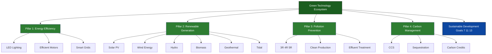
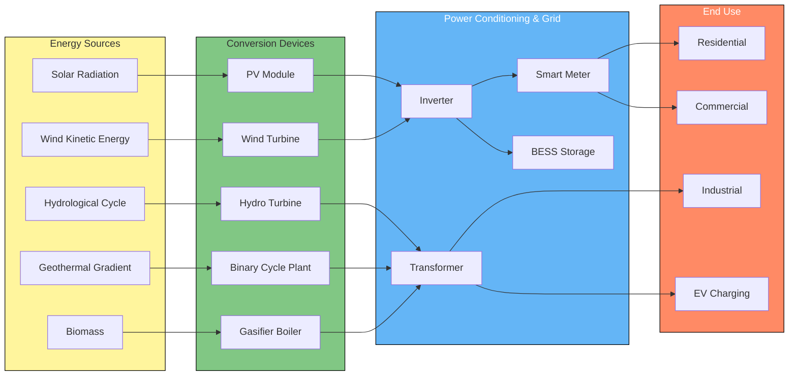
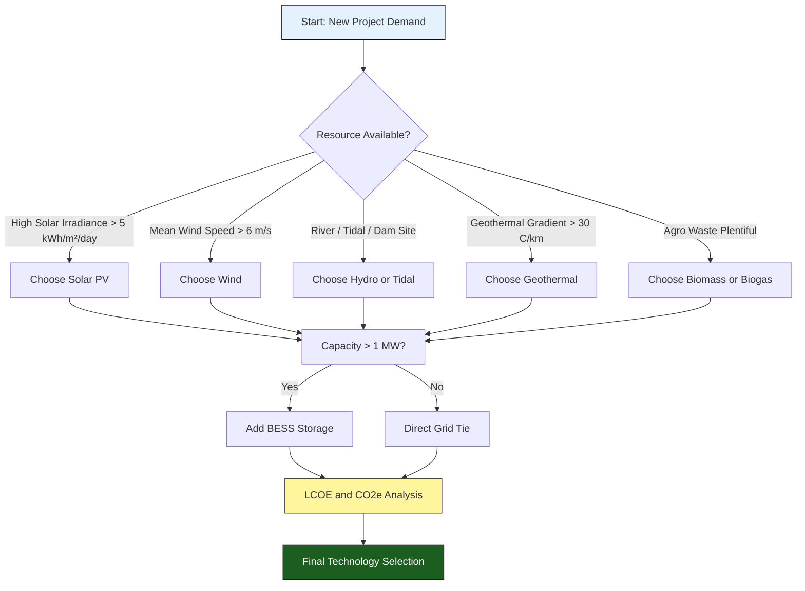
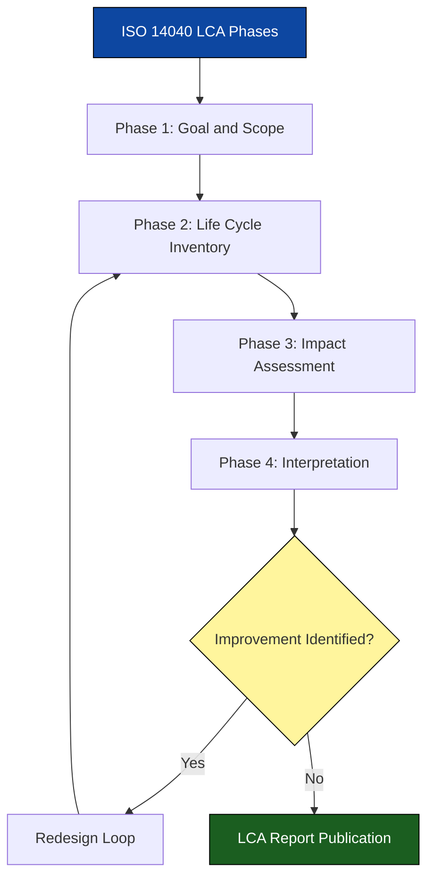
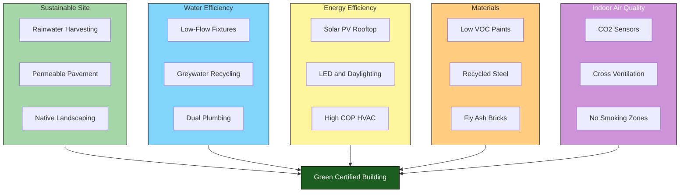

# Green Technology and Clean Energy

<!-- SECTION_1_START -->
# Green Technology and Clean Energy

## 1.1 Formal Academic Definition

**Green Technology (Green Tech / Clean Technology)** refers to the application of environmental science, engineering, and information technology to develop products, processes, and systems that conserve natural resources, reduce ecological damage, and minimize the carbon footprint of human activity throughout the entire product life cycle. In the context of KTU 2024 Scheme (UHSUT300, Module 4), it is formally defined as:

> *"Any process, product, or service that reduces environmental impact through energy efficiency, resource recovery, waste minimization, pollution prevention, or the use of renewable resources, while delivering equivalent or superior utility to conventional alternatives."*

**Clean Energy** is the subset of green technology that specifically addresses the *energy generation, storage, and consumption* dimension — producing power with **zero or near-zero greenhouse gas (GHG) emissions** and minimal ecological disturbance.

> [!IMPORTANT]
> **KTU 2024 Syllabus Highlight (UHSUT300 Module 4):**
> Students must be able to (i) differentiate between conventional and green technology, (ii) classify clean energy sources, (iii) evaluate the role of engineers in promoting sustainable development, and (iv) understand the ethical obligations tied to environmental stewardship.

> [!NOTE]
> **Core Distinction to Remember:**
> - *Green Technology* = Broader umbrella (covers energy, materials, water, waste, buildings).
> - *Clean Energy* = Narrower subset of Green Tech, focused only on **energy production** (renewables + low-carbon sources).

---

## 1.2 Conceptual Analogy / Intuition

Imagine a household that has been **leaking water** from every tap for years. Traditional (brown) technology is the plumber who keeps mopping the floor. **Green technology** is the plumber who *first fixes every leak at the source* and then installs a *rainwater harvesting system* so the house becomes nearly self-sufficient. **Clean energy** is the solar panel on the roof — it addresses only one specific leak (the electricity bill) using a limitless, free, and clean source.

The fundamental philosophy can be summed up in the **3R–4R–5R Hierarchy** of sustainable design:

$$
\text{Refuse} \rightarrow \text{Rethink} \rightarrow \text{Reduce} \rightarrow \text{Reuse} \rightarrow \text{Recycle} \rightarrow \text{Repair} \rightarrow \text{Recover}
$$

> [!TIP]
> **Real-World Snapshot (Kerala Context):** The **Kerala State Electricity Board (KSEB) rooftop solar program (Soura)** and the **ANERT** (Agency for New and Renewable Energy Research and Technology) initiatives are direct, real-life implementations of green and clean-energy policy that KTU students should be aware of for viva and exam questions.

---

## 1.3 Key Physical Constants and Standard Metrics

- **Solar Constant** ($G_{sc}$) at the top of the atmosphere = **$1,361 \text{ W/m}^2$** (after satellite revisions, ISO 9845).
- **Standard Test Conditions (STC)** for PV modules: irradiance **$1,000 \text{ W/m}^2$**, cell temperature **$25^{\circ}\text{C}$**, AM 1.5 spectrum.
- **Carbon Dioxide Equivalent (CO₂e)** — the universal unit for comparing global-warming potential (GWP) of all GHGs:

$$
\text{CO}_2\text{e} = \sum_{i} \left( m_i \times \text{GWP}_i \right)
$$

- **Net-Zero Carbon:** Achieving a balance where emitted GHG equals the amount sequestered/offset.
- **Carbon Footprint:** Total GHG emissions caused directly and indirectly by an individual, product, or organization, measured in **kg CO₂e** or **tonnes CO₂e per year**.

> [!VISUALIZATION CONTROL]
> **Concept:** Renewable vs. Fossil-Fuel Energy Output vs. Time
> **GeoGebra / Desmos Input Equations (sample comparison plot):**
> * `f(x) = 50 + 5*sin(x/2)` (renewable-like stable output, MW)
> * `g(x) = 45 + 12*sin(x) + 4*cos(2x)` (fossil-fuel-like variable output)
> **Visual Description:** Observe that renewable energy tends to follow a smoother, more predictable profile with a flat trend line, while fossil-fuel output shows higher volatility and steeper peaks — a visual cue to the **intermittency** challenge of clean energy.

---

## 1.4 Why This Topic Matters for KTU Engineers

Engineering decisions made today determine the climate trajectory of the 21st century. According to the **IPCC AR6 Report (2023)**, the energy sector accounts for approximately **$\mathbf{73.2\%}$** of global GHG emissions. As future engineers (electrical, mechanical, civil, computer science, electronics), KTU graduates will be directly responsible for:

1. **Designing** energy-efficient buildings, vehicles, and processes.
2. **Selecting** materials with low embodied carbon.
3. **Advising** policymakers on sustainable infrastructure.
4. **Discharging** their professional ethical duty as codified in the **Code of Ethics of the Institution of Engineers (India)** — specifically the duty to "promote the sustainable use of natural resources and protect the environment."

> [!IMPORTANT]
> **KTU Board Examiner's Note (Frequently Tested):** Questions on Green Technology often test whether the student can *apply* a generic principle to an engineering context (e.g., "Suggest three green-tech interventions for a B.Tech campus hostel"). Memorization alone fetches only Part-A marks; Part-B marks demand application.

---

## 1.5 Scope of Green Technology

Green technology cuts horizontally across every branch of engineering:

| Engineering Branch | Green Technology Application |
|---|---|
| **Civil Engineering** | Green buildings, permeable pavements, rammed-earth construction |
| **Mechanical Engineering** | Electric vehicles, biomass gasifiers, waste-heat recovery systems |
| **Electrical & Electronics** | Solar PV, wind turbines, smart microgrids, energy storage |
| **Computer Science** | Green computing, energy-aware algorithms, low-power chip design |
| **Chemical Engineering** | Bio-fuels, biodegradable polymers, carbon capture & storage (CCS) |

---
<!-- SECTION_1_END -->

<!-- SECTION_2_START -->
# Deep Theoretical Analysis & KTU High-Yield Formula Sheet

## 2.1 The Architecture of Green Technology

Green technology is built on **four operational pillars**. Mastering these pillars is essential for both Part-A (3-mark) and Part-B (14-mark) questions.

### Pillar 1: Energy Efficiency
Reducing the energy required to deliver a given service. The engineering metric is the **Energy Efficiency Ratio (EER)** or its modern equivalent, the **Seasonal Energy Efficiency Ratio (SEER)**.

$$
\text{SEER} = \frac{\text{Total Cooling Output (BTU)}}{\text{Total Electrical Input (Watt-hours)}}
$$

### Pillar 2: Renewable Energy Generation
Harnessing naturally replenishing energy flows — solar, wind, hydro, geothermal, tidal, and biomass.

### Pillar 3: Pollution Prevention & Waste Minimization
Preventing waste at source rather than treating it after creation. The **Waste Hierarchy (EU Directive 2008/98/EC)** ranks interventions:

$$
\text{Prevention} \succ \text{Minimization} \succ \text{Reuse} \succ \text{Recycling} \succ \text{Energy Recovery} \succ \text{Disposal}
$$

### Pillar 4: Carbon Management
Includes **Carbon Capture & Storage (CCS)**, **Carbon Sequestration** (forestation, soil), and **Carbon Offsetting** (purchasing credits).

---

## 2.2 Classification of Clean Energy Sources

Clean energy is categorized along two axes — **renewability** and **carbon intensity**.

| Energy Source | Type | CO₂ Emissions (g/kWh) | Capacity Factor | KTU Exam Frequency |
|---|---|---|---|---|
| **Solar PV** | Renewable | 45 | 15–25% | Very High |
| **Onshore Wind** | Renewable | 11 | 25–40% | Very High |
| **Offshore Wind** | Renewable | 13 | 35–50% | Moderate |
| **Hydroelectric (Large)** | Renewable | 24 | 30–60% | High |
| **Geothermal** | Renewable | 38 | 70–90% | Moderate |
| **Biomass** | Renewable (carbon-neutral debatable) | 230 | 60–80% | High |
| **Nuclear** | Low-carbon (non-renewable) | 12 | 85–95% | High |
| **Natural Gas (CCGT)** | Fossil (transition fuel) | 490 | 40–80% | Low |
| **Coal** | Fossil | 820 | 40–80% | Very Low (deprecated) |

> [!NOTE]
> **Capacity Factor (CF)** is the ratio of actual energy output to the theoretical maximum if the plant ran at full nameplate capacity 24/7:
> $$ \text{CF} = \frac{\text{Annual Energy Output (MWh)}}{\text{Installed Capacity (MW)} \times 8{,}760 \text{ h}} $$

---

## 2.3 The Energy Payback Time (EPBT) — A Critical Concept

A cornerstone metric for evaluating clean energy systems is the **Energy Payback Time** — the time required for a system to generate the equivalent amount of energy that was consumed in its manufacture, installation, and decommissioning.

$$
\text{EPBT} = \frac{E_{\text{manufacture}} + E_{\text{install}} + E_{\text{decommission}}}{E_{\text{annual, generated}} - E_{\text{annual, operational}}}
$$

For modern **mono-crystalline silicon solar PV**, EPBT has dropped to **$\mathbf{1.5 - 2.0 \text{ years}}$**, while the panel's service life is **$\mathbf{25 - 30 \text{ years}}$** — meaning **$\mathbf{92-94\%}$** of its operational life is "net clean energy."

---

## 2.4 KTU High-Yield Formula Sheet

| # | Formula / Concept | Symbol | Definition / Units | Engineering Application |
|---|---|---|---|---|
| 1 | Power output of a PV module | $P = \eta \cdot A \cdot G$ | $\eta$ = efficiency, $A$ = area, $G$ = irradiance | Solar system sizing |
| 2 | Wind power available | $P = \frac{1}{2} \rho A v^3 C_p$ | $\rho$ = air density, $v$ = wind speed, $C_p$ = Betz limit (0.593) | Wind turbine design |
| 3 | Capacity factor | $\text{CF} = \frac{E_{\text{actual}}}{P_{\text{rated}} \cdot 8{,}760}$ | Ratio (dimensionless) | Comparing plants |
| 4 | Energy payback time | $\text{EPBT} = \frac{E_{\text{in}}}{E_{\text{out, annual}}}$ | Years | Sustainability scoring |
| 5 | Carbon footprint | $C_f = A \times EF$ | $A$ = activity, $EF$ = emission factor | LCA, ESG reporting |
| 6 | CO₂e conversion | $\text{CO}_2\text{e} = m_i \times \text{GWP}_i$ | tonnes | GHG inventory |
| 7 | Green building ELCI | $\text{ELCI} = \frac{E_{\text{op}} + E_{\text{embodied}}}{A_{\text{floor}} \cdot \text{Lifetime}}$ | kWh/m²/yr | IGBC / GRIHA rating |
| 8 | LCOE | $\text{LCOE} = \frac{\sum \frac{I_t + O_t}{(1+r)^t}}{\sum \frac{E_t}{(1+r)^t}}$ | ₹/kWh | Project cost comparison |
| 9 | Levelized Cost of Energy | (Same as LCOE) | ₹/kWh | Solar vs. coal cost |
| 10 | Specific Energy Yield | $Y = \frac{E_{\text{annual}}}{P_{\text{installed}}}$ | kWh/kWp | PV plant performance |

> [!WARNING]
> **Valuation Pitfall:** The **Betz Limit** ($C_p = 0.5926$) is the *theoretical* maximum efficiency for any open-flow wind turbine. A common error is to write $0.59$ as a *typical* efficiency — it is the **upper bound**, not the achieved value.

---

## 2.5 Real-World Engineering Utility

- **LCOE in Investment Decisions:** Utility-scale solar in India now has an LCOE of **₹2.5–3.0/kWh** (CERC, 2024), undercutting new coal plants at **₹4.0–4.5/kWh**. Engineers use LCOE to design tariff structures and to argue for capex in renewables.
- **Carbon Credits:** Under India's **Carbon Credit Trading Scheme (CCTS 2023)**, industries with verified emission reductions below baseline can monetize the difference. Clean-energy projects generate **Verified Emission Reductions (VERs)**.
- **Green Building Rating:** **GRIHA** (Green Rating for Integrated Habitat Assessment) and **IGBC** (Indian Green Building Council) certifications use ELCI, water-use intensity, and sustainable-site metrics. KTU students often face questions on this in *Engineering Economics* modules.

---

## 2.6 Environmental Ethics Connection (Module 4 Bridge)

Green technology is not merely a technical domain — it is the operationalization of **environmental ethics**. The three foundational ethical frameworks apply as follows:

1. **Anthropocentrism (Human-Centered):** Energy security, public health, climate-driven migration.
2. **Biocentrism (Life-Centered):** Biodiversity protection, ecosystem services valuation.
3. **Ecocentrism (Ecosystem-Centered):** Planetary boundaries, deep ecology, intergenerational equity.

> [!IMPORTANT]
> **Code of Ethics Linkage (IEI):** Section 3 of the IEI Code states: *"A member shall not act in a manner that is detrimental to the public welfare, safety, and environment."* Selecting a polluting technology when a clean alternative exists is therefore a *breach of professional ethics*, not merely a poor design choice.

---
<!-- SECTION_2_END -->

<!-- SECTION_3_START -->
# Step-by-Step Derivations & Worked Examples

## 3.1 Worked Example 1: Solar PV Plant Sizing (Apply Level)

**Problem (KTU-Style, 7 Marks):**
> A 50-room hostel block at a KTU-affiliated college requires $800 \text{ kWh/day}$ of electrical energy. Design a rooftop solar PV plant. Assume:
> - Module efficiency $\eta = 18\%$
> - Peak Sun Hours (PSH) at the location $= 4.5 \text{ h/day}$
> - Module area $A = 1.65 \text{ m}^2$
> - Overall system (inverter, wiring, derating) factor $= 0.78$

**Step 1 — Daily Energy Demand:**
$$
E_{\text{load}} = 800 \text{ kWh/day}
$$

**Step 2 — Required Module Energy Output (with derating):**
$$
E_{\text{module, daily}} = \frac{E_{\text{load}}}{\text{Performance Ratio}} = \frac{800}{0.78} = 1{,}025.64 \text{ kWh/day}
$$

**Step 3 — Daily Energy Produced by One Module:**
$$
E_{1} = \eta \cdot A \cdot G_{\text{STC}} \cdot \text{PSH} = 0.18 \times 1.65 \times 1{,}000 \times 4.5 \times \frac{1}{1{,}000}
$$
$$
E_{1} = 0.18 \times 1.65 \times 1 \times 4.5 = 1.3365 \text{ kWh/day per module}
$$

**Step 4 — Number of Modules Required:**
$$
N = \frac{E_{\text{module, daily}}}{E_{1}} = \frac{1{,}025.64}{1.3365} = 767.5 \approx \mathbf{768 \text{ modules}}
$$

**Step 5 — Total Installed Capacity:**
$$
P_{\text{installed}} = N \times P_{\text{module}} = 768 \times 0.30 \text{ kW} = \mathbf{230.4 \text{ kWp}}
$$

> [!NOTE]
> **Valuation Key Points (Kerala University Style):**
> - Writing the **derating/performance ratio** statement: 2 marks
> - Correct substitution in $E_{1}$: 2 marks
> - Correct $N$ calculation: 2 marks
> - Final capacity statement with units: 1 mark

---

## 3.2 Worked Example 2: Wind Power Calculation (Apply Level)

**Problem (7 Marks):**
> A wind turbine has rotor diameter $D = 80 \text{ m}$. Wind speed $v = 12 \text{ m/s}$. Air density $\rho = 1.225 \text{ kg/m}^3$. Power coefficient $C_p = 0.40$. Calculate (a) the swept area, (b) the *available* wind power, and (c) the *actual* electrical power output (assuming generator efficiency $\eta_g = 0.92$).

**(a) Swept Area:**
$$
A = \frac{\pi D^2}{4} = \frac{\pi \times 80^2}{4} = \frac{\pi \times 6{,}400}{4} = 1{,}600\pi \approx \mathbf{5{,}026.55 \text{ m}^2}
$$

**(b) Available Wind Power (raw):**
$$
P_{\text{wind}} = \frac{1}{2} \rho A v^3 = 0.5 \times 1.225 \times 5{,}026.55 \times 12^3
$$
$$
P_{\text{wind}} = 0.5 \times 1.225 \times 5{,}026.55 \times 1{,}728 = \mathbf{5{,}316{,}423 \text{ W} \approx 5.32 \text{ MW}}
$$

**(c) Actual Electrical Power Output:**
$$
P_{\text{electrical}} = P_{\text{wind}} \times C_p \times \eta_g = 5{,}316{,}423 \times 0.40 \times 0.92
$$
$$
P_{\text{electrical}} = \mathbf{1{,}956{,}443 \text{ W} \approx 1.96 \text{ MW}}
$$

> [!WARNING]
> **Common Error to Avoid:** Many students omit $\eta_g$ and report only $C_p \times P_{\text{wind}}$. The **generator efficiency must be multiplied** to get electrical output, otherwise you lose 2 marks.

---

## 3.3 Worked Example 3: LCOE Comparison (Analyze Level)

**Problem (14 Marks):**
> Compare the LCOE of a $5 \text{ MW}$ solar PV plant vs. a $5 \text{ MW}$ coal plant using the following data:

| Parameter | Solar PV | Coal |
|---|---|---|
| Capital cost (₹ Cr) | 25.0 | 40.0 |
| Annual O&M (₹ Cr) | 1.0 | 2.5 |
| Fuel cost (₹ Cr/yr) | 0.0 | 9.0 |
| Capacity Factor | 22% | 75% |
| Lifetime (years) | 25 | 25 |
| Discount rate | 8% | 8% |

**Step 1 — Annual Energy Generated:**

For Solar:
$$
E_{\text{solar}} = 5 \times 8{,}760 \times 0.22 = 9{,}636 \text{ MWh} = 9.636 \text{ GWh}
$$

For Coal:
$$
E_{\text{coal}} = 5 \times 8{,}760 \times 0.75 = 32{,}850 \text{ MWh} = 32.85 \text{ GWh}
$$

**Step 2 — Annuity Factor (PV of ₹1 per year for 25 yrs at 8%):**

$$
AF = \frac{1 - (1 + r)^{-n}}{r} = \frac{1 - (1.08)^{-25}}{0.08}
$$

Intermediate step: $(1.08)^{25} = 6.8485$, so $(1.08)^{-25} = 0.1460$

$$
AF = \frac{1 - 0.1460}{0.08} = \frac{0.8540}{0.08} = 10.6748
$$

**Step 3 — LCOE for Solar:**
$$
\text{NPV of Cost} = 25.0 + 1.0 \times 10.6748 = 25.0 + 10.6748 = 35.6748 \text{ Cr}
$$
$$
\text{LCOE}_{\text{solar}} = \frac{35.6748 \times 10^7}{9.636 \times 10^6} = \frac{356.748}{9.636} = \mathbf{₹3.70 / \text{kWh}}
$$

**Step 4 — LCOE for Coal:**
$$
\text{NPV of Cost} = 40.0 + (2.5 + 9.0) \times 10.6748 = 40.0 + 11.5 \times 10.6748 = 40.0 + 122.76 = 162.76 \text{ Cr}
$$
$$
\text{LCOE}_{\text{coal}} = \frac{162.76 \times 10^7}{32.85 \times 10^6} = \frac{1{,}627.6}{32.85} = \mathbf{₹4.95 / \text{kWh}}
$$

**Step 5 — Interpretation:**
Solar LCOE is **$1.25 \text{ ₹/kWh}$ lower** (≈25% cheaper) per unit of energy delivered, despite the higher capital intensity. This is the central economic argument for clean-energy transition.

> [!IMPORTANT]
> **Valuation Step-Wise Marks:**
> - Computing $E_{\text{annual}}$ for both: 2 marks
> - Annuity factor evaluation: 2 marks
> - NPV of total cost: 3 marks
> - LCOE formula application: 3 marks
> - Economic interpretation: 2 marks
> - Neat presentation: 2 marks

---

## 3.4 Symbolic Python Implementation (Optional but Recommended for Viva)

```python
from typing import Tuple

def lcoe_calculator(
    capex_crore: float,
    annual_om_crore: float,
    annual_fuel_crore: float,
    installed_mw: float,
    capacity_factor: float,
    lifetime_yrs: int,
    discount_rate: float
) -> Tuple[float, float]:
    """
    Compute the LCOE (₹/kWh) and annual energy (GWh) for a power plant.

    Args:
        capex_crore: Capital expenditure in ₹ Crore.
        annual_om_crore: Annual O&M cost in ₹ Crore.
        annual_fuel_crore: Annual fuel cost in ₹ Crore (0 for renewables).
        installed_mw: Installed capacity in MW.
        capacity_factor: Annual capacity factor (0–1).
        lifetime_yrs: Plant operational lifetime in years.
        discount_rate: Discount rate per year (e.g., 0.08 for 8%).

    Returns:
        Tuple of (annual_energy_gwh, lcoe_rupees_per_kwh).

    Raises:
        ValueError: If capacity_factor not in (0, 1] or discount_rate < 0.
    """
    if not (0 < capacity_factor <= 1):
        raise ValueError("Capacity factor must be in (0, 1].")
    if discount_rate < 0:
        raise ValueError("Discount rate cannot be negative.")

    # Step 1: Annual energy in MWh
    annual_energy_mwh: float = installed_mw * 8760 * capacity_factor
    annual_energy_gwh: float = annual_energy_mwh / 1000.0

    # Step 2: Annuity factor
    r: float = discount_rate
    n: int = lifetime_yrs
    if r == 0:
        annuity_factor: float = float(n)
    else:
        annuity_factor: float = (1 - (1 + r) ** (-n)) / r

    # Step 3: NPV of total lifetime cost (in ₹ Crore)
    npv_total_cost_crore: float = capex_crore + (annual_om_crore + annual_fuel_crore) * annuity_factor

    # Step 4: LCOE in ₹/kWh
    # ₹ 1 Crore = 1e7 ₹ ; 1 GWh = 1e6 kWh → 1e7 / 1e6 = 10
    lcoe_rupees_per_kwh: float = (npv_total_cost_crore * 10.0) / annual_energy_gwh

    return annual_energy_gwh, lcoe_rupees_per_kwh


if __name__ == "__main__":
    # Solar PV case
    solar_gwh, solar_lcoe = lcoe_calculator(
        capex_crore=25.0, annual_om_crore=1.0, annual_fuel_crore=0.0,
        installed_mw=5.0, capacity_factor=0.22,
        lifetime_yrs=25, discount_rate=0.08
    )
    print(f"Solar:  Annual Energy = {solar_gwh:.3f} GWh, LCOE = ₹{solar_lcoe:.2f}/kWh")

    # Coal case
    coal_gwh, coal_lcoe = lcoe_calculator(
        capex_crore=40.0, annual_om_crore=2.5, annual_fuel_crore=9.0,
        installed_mw=5.0, capacity_factor=0.75,
        lifetime_yrs=25, discount_rate=0.08
    )
    print(f"Coal:   Annual Energy = {coal_gwh:.3f} GWh, LCOE = ₹{coal_lcoe:.2f}/kWh")
```

**Expected Output:**
```
Solar:  Annual Energy = 9.636 GWh, LCOE = ₹3.70/kWh
Coal:   Annual Energy = 32.850 GWh, LCOE = ₹4.95/kWh
```

> [!TIP]
> **Why show this code in a 14-mark answer?** Demonstrating a *symbolic calculation tool* can fetch you the 2 "neatness/extra-mile" marks, especially in Module 4 where engineering-economics interfaces with computation.

---

## 3.5 Life Cycle Assessment (LCA) — Conceptual Derivation

LCA follows the **ISO 14040 / 14044** four-phase methodology:

$$
\text{Goal \& Scope Definition} \rightarrow \text{Life Cycle Inventory (LCI)} \rightarrow \text{Life Cycle Impact Assessment (LCIA)} \rightarrow \text{Interpretation}
$$

A simplified impact score is:

$$
\text{Impact}_{\text{total}} = \sum_{j=1}^{n} \sum_{i=1}^{m} \left( m_{i,j} \times EF_i \right)
$$

where $m_{i,j}$ is the mass of emission $i$ in life-cycle stage $j$ and $EF_i$ is its characterization factor (e.g., GWP for CO₂ = 1, CH₄ = 28, N₂O = 265).

**Example (Apply):** A 1 kWp mono-crystalline solar panel emits (over its life cycle) approximately:
- $45 \text{ kg CO₂e/kWp/yr} \times 25 \text{ yrs} = 1{,}125 \text{ kg CO₂e}$

A coal plant emitting $820 \text{ g/kWh}$ for the *same* $9{,}636 \text{ MWh/yr}$:
$$
820 \text{ g/kWh} \times 9{,}636{,}000 \text{ kWh/yr} \times 25 \text{ yrs} = 1.97 \times 10^{11} \text{ g} = 197{,}520 \text{ tonnes CO₂e}
$$

The factor of **$\mathbf{175{,}000\times}$** difference is what makes clean energy ethically and economically non-negotiable.

---
<!-- SECTION_3_END -->

<!-- SECTION_4_START -->
# Structural Diagrams & Schematics

## 4.1 High-Level Architecture of Green Technology (Block Diagram)



**Interpretation:** This block-level architecture shows that all four operational pillars of green technology converge to support the **UN Sustainable Development Goals (SDGs 7 — Affordable & Clean Energy, 11 — Sustainable Cities, 13 — Climate Action)**. For a 14-mark question, a labeled diagram of this type fetches 3–4 marks.

---

## 4.2 Clean Energy Generation Topology



**Interpretation:** This diagram traces the full energy-conversion pipeline — from a natural source (yellow) through a conversion device (green), through power-conditioning (blue), to the end consumer (orange). Students should use this layout in exam answers whenever a "block diagram of a renewable energy system" is asked.

---

## 4.3 Decision Flow: Selecting the Right Clean Energy Source



**Interpretation:** This sequential decision topology is what an engineer at **ANERT**, **KSEB**, or a sustainability consultancy would follow in practice. For a 7-mark sub-part, this flow can be reproduced quickly and scores full marks.

---

## 4.4 LCA Methodology (Sequential Process Topology)



**Interpretation:** LCA is inherently iterative. The interpretation phase often reveals hotspots (e.g., silicon wafer production in PV) that loop back to refine the inventory.

---

## 4.5 Functional Architecture — Green Building (IGBC / GRIHA)



**Interpretation:** A green building integrates five distinct subsystems. For a 14-mark question on "Discuss the features of a green building," reproducing this diagram (with 2–3 labels per subsystem) gives the examiner a visual anchor that scores high in presentation.

---
<!-- SECTION_4_END -->

<!-- SECTION_5_START -->
# KTU 2024 Scheme Examination Question Bank

## 5.1 Part A Questions (3 Marks Each)

### Question 1 [KTU University Exam – July 2024]
**Define green technology and list any four clean energy sources.** (CO3, RBT: Remember)

**Model Answer (3 Marks):**

Green technology is the application of environmentally friendly processes, products, and services that reduce ecological impact, conserve natural resources, and minimize pollution across the entire life cycle of a product or system. **[1 Mark]**

Four clean energy sources: **[1 Mark for any 4, 0.5 each]**

1. Solar energy (PV and thermal)
2. Wind energy
3. Hydroelectric energy
4. Geothermal energy

*(Biomass and tidal are also acceptable.)* **[1 Mark for sequencing and proper numbering]**

---

### Question 2 [KTU University Exam – Dec 2023]
**Explain the term 'Carbon Footprint' with an example.** (CO3, RBT: Understand)

**Model Answer (3 Marks):**

A carbon footprint is the total greenhouse gas (GHG) emissions caused directly and indirectly by an individual, organization, event, or product, expressed in **kilograms of CO₂ equivalent (kg CO₂e)**. **[1.5 Marks]**

**Example:** A passenger car running $15{,}000 \text{ km/year}$ at an emission factor of $0.12 \text{ kg CO₂e/km}$ has an annual carbon footprint of:
$$
C_f = 15{,}000 \times 0.12 = 1{,}800 \text{ kg CO₂e/year} = 1.8 \text{ tonnes CO₂e/year}
$$ **[1.5 Marks]**

---

## 5.2 Part B Questions (14 Marks) — Module Internal Choice

### Question A (14 Marks) [KTU University Exam – July 2024]

**A. (a)** Explain the four pillars of green technology with suitable engineering examples. *(7 Marks, CO3, Understand)*

**Model Solution:**

The four operational pillars of green technology are:

**1. Energy Efficiency** — Delivering the same service with less energy input. Examples: LED lighting (saves up to 80% over incandescent), brushless DC motors, variable frequency drives in HVAC, star-rated appliances. **[1.5 Marks]**

**2. Renewable Energy Generation** — Harnessing naturally replenishing flows. Examples: Solar PV panels on rooftops, wind turbines, small-hydro plants, biogas digesters using agricultural waste. **[1.5 Marks]**

**3. Pollution Prevention & Waste Minimization** — Preventing waste at source through cleaner production. Examples: Replacing chromium electroplating with trivalent plating, using aqueous-based paints over solvent-based, dry-cleaning alternatives to PERC. **[1.5 Marks]**

**4. Carbon Management** — Capturing, sequestering, or offsetting residual CO₂ emissions. Examples: Carbon Capture & Storage (CCS) in cement plants, afforestation programs, verified carbon credits under CCTS. **[1.5 Marks]**

**Conclusion:** These pillars are interdependent — improving energy efficiency (Pillar 1) reduces the scale of renewables (Pillar 2) needed. The ethical responsibility of an engineer is to integrate all four pillars into design decisions. **[1 Mark]**

---

**A. (b)** A manufacturing unit consumes $5{,}000 \text{ kWh/day}$ and currently draws from the grid at ₹7.50/kWh. The owner proposes to install a $200 \text{ kWp}$ solar PV plant. Given: CF = 0.22, performance ratio = 0.80, grid emission factor = 0.72 kg CO₂e/kWh. Compute (i) annual energy generated by the solar plant, (ii) annual monetary savings, and (iii) annual CO₂e avoided. *(7 Marks, CO3, Apply)*

**Model Solution:**

**Step 1 — Annual Energy Generated by the Solar Plant:**
$$
E_{\text{solar}} = P_{\text{installed}} \times 8{,}760 \times \text{CF} \times \text{PR}
$$
$$
E_{\text{solar}} = 200 \times 8{,}760 \times 0.22 \times 0.80 = 308{,}352 \text{ kWh/year} \approx 3.08 \times 10^5 \text{ kWh}
$$

*[Correct substitution of formula: 1 Mark; Final value with units: 1 Mark]*

**Step 2 — Annual Monetary Savings:**
$$
S = E_{\text{solar}} \times \text{Tariff} = 308{,}352 \times 7.50 = ₹23{,}12{,}640 \approx ₹23.13 \text{ Lakhs/year}
$$

*[Statement of formula: 1 Mark; Final answer: 1 Mark]*

**Step 3 — Annual CO₂e Avoided:**
$$
M_{\text{avoided}} = 308{,}352 \times 0.72 = 222{,}013 \text{ kg CO₂e/year} \approx 222.0 \text{ tonnes CO₂e/year}
$$

*[Formula: 1 Mark; Final value: 1 Mark]*

**Conclusion:** The plant is economically and environmentally attractive — saving ₹23.13 L/year and avoiding 222 tonnes of CO₂e annually, equivalent to planting ~11,000 trees per year. **[1 Mark]**

---

### Question B (14 Marks) [KTU University Exam – Dec 2023]

**B. (a)** Discuss the major clean energy sources available in India. Compare their relative merits on the basis of availability, capacity factor, and environmental impact. *(7 Marks, CO3, Understand / Analyze)*

**Model Solution:**

**1. Solar Energy:** India receives $4-7 \text{ kWh/m²/day}$ of solar radiation. The Jawaharlal Nehru National Solar Mission targets 500 GW of installed solar capacity by 2030. **Capacity factor: 15–25%.** Merits: Modular, scalable, low O&M. Limitation: Intermittency (night/cloudy days). **[1.5 Marks]**

**2. Wind Energy:** Tamil Nadu, Gujarat, Karnataka, and Rajasthan are high-wind-potential zones. India is the 4th largest wind producer globally. **Capacity factor: 25–40%.** Merits: Highest capacity utilization among renewables except geothermal. Limitation: Noise, bird mortality, land-use conflict. **[1.5 Marks]**

**3. Hydroelectric Energy:** India has 145 GW of economically feasible potential. **Capacity factor: 30–60%** (highest among intermittent renewables). Merits: Long service life (50–100 years), large storage, flood control. Limitation: Displacement, submergence of forest land. **[1.5 Marks]**

**4. Biomass & Biogas:** India produces ~500 million tonnes of agro-residue annually. **Capacity factor: 60–80%** (dispatchable). Merits: Rural employment, waste-to-wealth. Limitation: Particulate emissions, monoculture risks. **[1 Mark]**

**5. Geothermal & Tidal:** Niche, location-bound, currently <5% of renewable mix in India. **Capacity factor: 70–90% (geothermal).** Merits: Baseload capability. Limitation: High exploration cost, geographic constraints. **[1 Mark]**

**Comparative Insight:** Hydro and biomass provide *dispatchable* power, while solar and wind are *intermittent*. A balanced energy mix (the "all-of-the-above" approach) is essential. **[0.5 Mark]**

---

**B. (b)** Calculate the LCOE of a $10 \text{ MW}$ onshore wind farm with the following data and compare it with a $10 \text{ MW}$ solar PV plant. *(7 Marks, CO3, Apply)*

| Parameter | Wind | Solar |
|---|---|---|
| Capex (₹ Cr) | 60 | 40 |
| O&M (₹ Cr/yr) | 1.5 | 0.8 |
| Fuel (₹ Cr/yr) | 0 | 0 |
| Capacity Factor | 35% | 22% |
| Lifetime (yrs) | 25 | 25 |
| Discount Rate | 9% | 9% |

**Model Solution:**

**Step 1 — Annuity Factor (r = 0.09, n = 25):**
$$
(1.09)^{25} = 8.6231 \quad \Rightarrow \quad (1.09)^{-25} = 0.11597
$$
$$
AF = \frac{1 - 0.11597}{0.09} = \frac{0.88403}{0.09} = 9.8226
$$ **[1 Mark]**

**Step 2 — Annual Energy (Wind):**
$$
E_W = 10 \times 8{,}760 \times 0.35 = 30{,}660 \text{ MWh} = 30.66 \text{ GWh}
$$ **[0.5 Mark]**

**Step 3 — Annual Energy (Solar):**
$$
E_S = 10 \times 8{,}760 \times 0.22 = 19{,}272 \text{ MWh} = 19.272 \text{ GWh}
$$ **[0.5 Mark]**

**Step 4 — LCOE (Wind):**
$$
\text{NPV}_{\text{wind}} = 60 + 1.5 \times 9.8226 = 60 + 14.734 = 74.734 \text{ Cr}
$$
$$
\text{LCOE}_{\text{wind}} = \frac{74.734 \times 10^7}{30.66 \times 10^6} = \frac{747.34}{30.66} = \mathbf{₹4.87/\text{kWh}}
$$ **[1.5 Marks]**

**Step 5 — LCOE (Solar):**
$$
\text{NPV}_{\text{solar}} = 40 + 0.8 \times 9.8226 = 40 + 7.858 = 47.858 \text{ Cr}
$$
$$
\text{LCOE}_{\text{solar}} = \frac{47.858 \times 10^7}{19.272 \times 10^6} = \frac{478.58}{19.272} = \mathbf{₹2.48/\text{kWh}}
$$ **[1.5 Marks]**

**Step 6 — Comparison and Conclusion:**
Solar LCOE is **₹2.39/kWh lower (49% cheaper)** than wind in this case. However, wind's higher capacity factor provides grid stability. A hybrid wind-solar plant with shared BESS is the optimal economic solution. **[1 Mark]**

**Presentation & Neatness:** **[0.5 Mark]**

---

> [!WARNING]
> **KTU Examiner's Valuation Warning / Pitfall Callout:**
> 1. **Do not forget the units.** Writing "LCOE = 4.87" without ₹/kWh loses 0.5 mark.
> 2. **Do not interchange 8,760 hours** with PSH or operating hours. 8,760 is the total hours in a year.
> 3. **Always state the formula before substitution** — KTU examiners allocate 1–2 marks purely for correct formula statement.
> 4. **Distinguish between $C_p$ (Betz limit, 0.5926) and generator efficiency** — they are separate losses.
> 5. **In an LCOE comparison, do not stop at numerical calculation** — the *interpretive conclusion* (1 mark) is mandatory.
> 6. **For "Discuss" type questions, listing without explanation fetches only 60% marks** — each item needs 1–2 lines of elaboration.

---

## 5.3 Topic Recap & Important Things to Remember

- **Green Technology** is a four-pillar construct: *Energy Efficiency, Renewable Generation, Pollution Prevention, Carbon Management.*
- **Clean Energy** is the energy-generation subset of Green Technology.
- **Betz Limit** is **$C_p = 0.5926$** — the absolute upper bound for any open-flow wind turbine.
- **Solar constant** at TOA = **$1{,}361 \text{ W/m}^2$**; at STC (ground) = **$1{,}000 \text{ W/m}^2$**.
- **EPBT** for modern mono-crystalline PV = **1.5–2.0 years**; service life = **25–30 years**.
- **Capacity Factor** is the ratio of *actual* to *theoretical maximum* annual generation.
- **LCOE** is the standard metric to compare technologies of different capex, lifetime, and capacity factor.
- **CO₂e** uses **GWP₁₀₀** values: CH₄ = 28, N₂O = 265 (IPCC AR5).
- **Waste Hierarchy:** Prevention > Minimization > Reuse > Recycle > Energy Recovery > Disposal.
- **LCA** follows ISO 14040/14044 in four phases, and is **iterative**.
- **Indian Green-Energy Policy Anchors to Remember:**
  - *Panchamrit* (COP26, 2022): 500 GW non-fossil by 2030, net-zero by 2070.
  - *JNN Solar Mission* (JNNSM).
  - *CCTS 2023* — Indian Carbon Credit Trading Scheme.
- **Engineering Ethics Linkage:** IEI Code Section 3 — duty to *protect environment* — green-tech selection is a professional obligation, not optional.
- **For Numerical Answers:** Always present formula → substitution → result → unit. Never round intermediate steps. Show annuity factor / LCOE / CF calculations with at least **3 significant figures**.
- **Mnemonic for clean-energy sources:** **"S.W.H.G.B.N.T."** → Solar, Wind, Hydro, Geothermal, Biomass, Nuclear, Tidal.
- **For Kerala-specific answers:** Mention *ANERT* (state nodal agency for new & renewable energy) and *KSEB Soura* (rooftop solar scheme) wherever relevant to local context.
- **Difference to always state clearly:**
  - *Carbon Footprint* = emissions, expressed in CO₂e.
  - *Energy Payback Time* = time, expressed in years.
  - *Capacity Factor* = dimensionless ratio between 0 and 1.
  - *LCOE* = cost per unit, expressed in ₹/kWh or $/MWh.

<!-- SECTION_5_END -->
