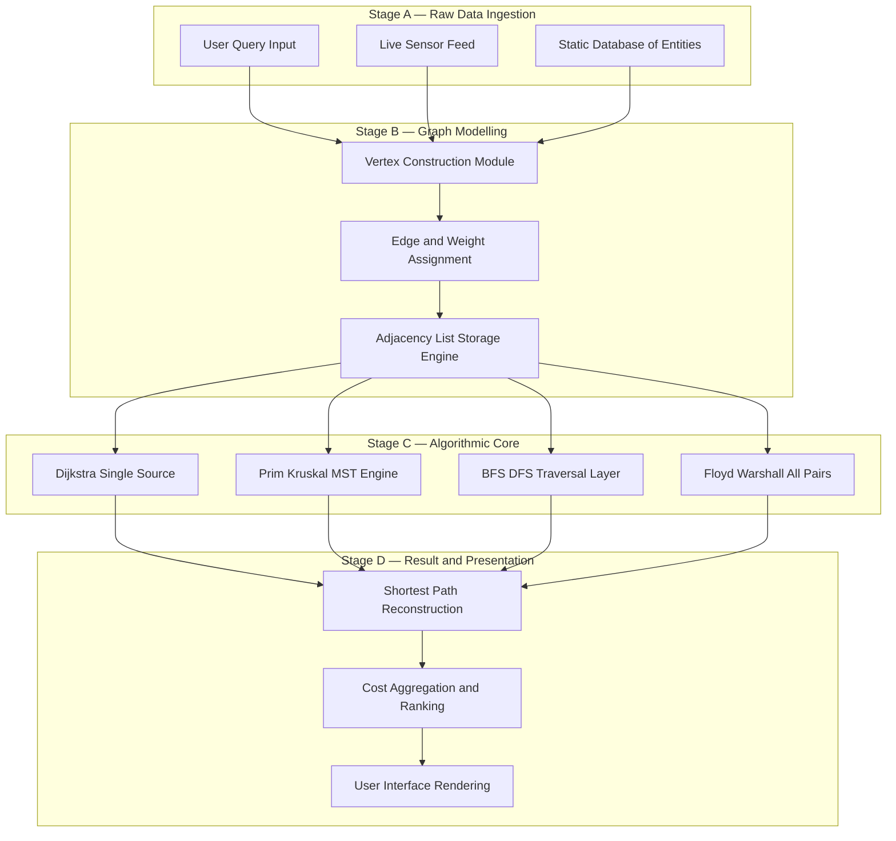
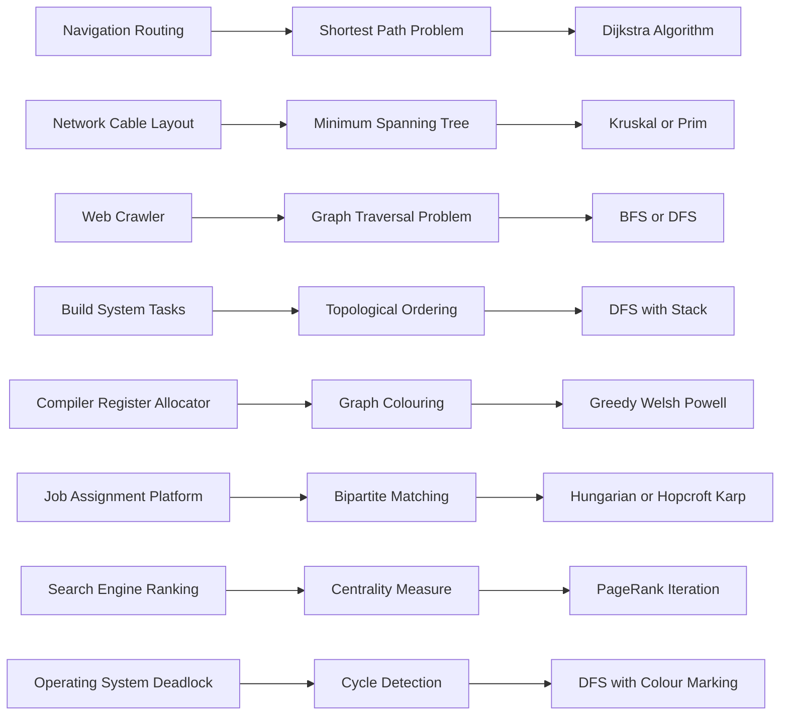

# Application of graphs

<!-- SECTION_1_START -->
# Application of Graphs — Core Definition & Intuitive Overview

## 1.1 Formal Academic Definition

In the context of the KTU 2024 Scheme syllabus for **GAMAT401 (Mathematics for Computer and Information Science-4)**, a **graph** $G = (V, E)$ is an ordered pair consisting of a finite, non-empty set $V$ of **vertices** (or nodes) together with a set $E$ of **edges** (or arcs). The **application of graphs** refers to the systematic modelling of real-world systems — where entities are abstracted as vertices and the relational or transactional interactions between them are abstracted as edges — followed by the application of graph-theoretic algorithms to extract optimal, structural, or behavioural information from the model.

> [!IMPORTANT]
> **KTU 2024 Syllabus Highlight (Module 1):** Students are expected to recognise that almost every discrete structure in Computer Science (networks, databases, operating systems, compilers, AI search trees, social media) is fundamentally a graph. The emphasis in the 2024 scheme is on *problem modelling* — translating a real scenario into vertices, edges, weights, and constraints — rather than purely abstract proof work.

## 1.2 Conceptual Analogy & Intuition

Imagine that you are standing in the centre of **Kerala** with a paper map spread out in front of you.

- Every **city** (Kochi, Trivandrum, Kozhikode, Thrissur) is a **vertex**.
- Every **road** that physically connects two cities is an **edge**.
- The **distance** of that road (in km) is a numerical **weight** attached to the edge.

> [!NOTE]
> **Plain-English Intuition:** A graph is a *language* for describing "things" and the *connections* between them. Whenever a computer scientist needs to ask a question about relationships — "What is the cheapest delivery route?", "Who is the most influential user?", "Is there a deadlock in this system?" — the first step is almost always to **build a graph** and then run a graph algorithm on it.

The universal nature of this abstraction is why a single 300-year-old branch of pure mathematics (originating with **Leonhard Euler** and the **Königsberg Bridge Problem** in 1736) now silently powers GPS navigation, Google Search, fraud detection, and even compiler optimisation.

## 1.3 Physical Constants & Standard Metrics

| Parameter | Standard Value / Symbol | Engineering Relevance |
| :--- | :--- | :--- |
| Number of vertices | $n = \vert V \vert$ | Defines problem size $O(n)$ |
| Number of edges | $m = \vert E \vert$ | For sparse graphs, $m \approx O(n)$ |
| Edge weight (distance) | $w(u, v) \geq 0$ | Non-negative real cost, often in **metres** or **kilometres** |
| Maximum degree of a vertex | $\Delta(G)$ | Used in **graph colouring** bound $ \chi(G) \leq \Delta(G) + 1 $ |
| Standard edge cost unit | **1.0** (unitless) | Used in BFS unweighted traversal |

> [!TIP]
> In the KTU 2024 scheme, the value of $n$ and $m$ typically range between **5 and 10** for manual exam problems, which is why a hand-traceable $O(n^2)$ or $O(m \log n)$ algorithm is fully sufficient for board valuation.

## 1.4 The Eight Pillars of Graph Applications in Computer Science

A modern CS graduate is expected to recognise the following eight recurring application patterns. Each one is a *sub-graph* of the broader discipline of **Algorithmic Graph Theory**.

> [!IMPORTANT]
> **The Big Eight Graph Applications:**
> 1. **Shortest Path & Navigation** — Google Maps, OpenStreetMap, Ola/Uber routing
> 2. **Minimum Spanning Tree (MST)** — LAN/WAN cable layout, water pipeline design, electrical grid design
> 3. **Graph Traversal (BFS / DFS)** — Web crawlers, garbage collection, peer-to-peer (Gnutella), AI maze solvers
> 4. **Topological Sorting** — Build systems (Make, Maven, Gradle), task scheduling, course prerequisite ordering
> 5. **Graph Colouring** — Register allocation in compilers, exam timetable scheduling, frequency assignment
> 6. **Network Flow & Matching** — Bipartite job assignment, airline crew scheduling, image segmentation
> 7. **PageRank / Centrality** — Google Search ranking, social network influence (Instagram, Twitter/X)
> 8. **Cycle Detection & Connectivity** — Deadlock detection in Operating Systems, circuit testing, dependency resolution

> [!VISUALIZATION CONTROL]
> **Concept:** Generic application mapping — vertices as entities, edges as relationships
> **GeoGebra / Desmos Input Equations (sample weighted undirected graph with 5 vertices):**
> * Vertex A: $(0, 2)$
> * Vertex B: $(2, 4)$
> * Vertex C: $(5, 4)$
> * Vertex D: $(6, 1)$
> * Vertex E: $(2, 0)$
> * Edge weights: $w(A,B)=4$, $w(B,C)=3$, $w(C,D)=2$, $w(D,E)=5$, $w(A,E)=6$, $w(B,E)=2$
> **Visual Description:** A pentagon-shaped weighted graph. The student should observe that the shortest path from A to D is *not* the visually obvious direct one, illustrating why algorithmic shortest-path computation is required.

<!-- SECTION_1_END -->

<!-- SECTION_2_START -->
# Deep Theoretical Analysis & KTU High-Yield Formula Sheet

## 2.1 The Modelling Pipeline (The "Why" Behind the "How")

Every graph application in Computer Science follows a **three-stage operational pipeline**. Mastering this pipeline is the single most important skill for KTU board examinations.

**Stage 1 — Abstraction (Modelling).** Translate the real-world entities into $V$ and their pairwise interactions into $E$. Assign weights to $E$ if the application involves cost, distance, capacity, or time.

**Stage 2 — Representation.** Store the abstract graph in computer memory. Two canonical data structures exist:
- **Adjacency Matrix:** A 2D array $A$ of size $n \times n$ where $A[i][j] = w(i, j)$. Space complexity is $O(n^2)$. Best for **dense** graphs.
- **Adjacency List:** A dictionary or array of lists. Space complexity is $O(n + m)$. Best for **sparse** graphs (the typical real-world case).

**Stage 3 — Algorithmic Query.** Run a graph algorithm — BFS, DFS, Dijkstra, Prim, Kruskal, Bellman-Ford, Floyd-Warshall, etc. — to extract the answer.

> [!NOTE]
> **Engineering Reality:** Industry-scale graphs (the Facebook social graph, the entire World Wide Web) have billions of vertices. Choosing the correct representation and algorithm in Stage 2 and Stage 3 is the difference between a system that runs in **seconds** and one that runs for **centuries**.

## 2.2 The Master Cheat Sheet — Critical Algorithms, Complexities, and Applicability

The table below is the single most important reference for KTU 2024 board examinations on this topic. Memorise the *problem → algorithm → complexity* mapping.

| # | Graph Problem | Canonical Algorithm | Time Complexity | Real-World Use Case |
| :---: | :--- | :--- | :--- | :--- |
| 1 | Single-source shortest path (non-negative weights) | **Dijkstra** with min-heap | $O((n + m) \log n)$ | Google Maps, Ola, Uber ETA |
| 2 | Single-source shortest path (negative weights allowed) | **Bellman-Ford** | $O(n \cdot m)$ | Currency arbitrage, RIP routing |
| 3 | All-pairs shortest path | **Floyd-Warshall** | $O(n^3)$ | Small network matrices, DNA alignment |
| 4 | Minimum Spanning Tree (edge list, sparse) | **Kruskal** with Union-Find | $O(m \log n)$ | Telecom cable layout, grid design |
| 5 | Minimum Spanning Tree (dense graph) | **Prim** with adjacency matrix | $O(n^2)$ | VLSI chip routing, dense mesh |
| 6 | Level-order / shortest path in unweighted graph | **BFS** | $O(n + m)$ | Web crawler, social friend-finder |
| 7 | Cycle detection / topological order | **DFS** | $O(n + m)$ | Deadlock detection, build systems |
| 8 | Graph colouring (minimum) | **Greedy + Welsh-Powell** | $O(n^2)$ | Register allocation, exam timetables |
| 9 | Bipartite matching | **Hungarian / Hopcroft-Karp** | $O(\sqrt{n} \cdot m)$ | Job assignment, dating apps |
| 10 | Network max-flow | **Edmonds-Karp / Dinic** | $O(n \cdot m^2)$ | Airline traffic, image segmentation |
| 11 | Strongly connected components | **Kosaraju / Tarjan** | $O(n + m)$ | 2-SAT solvers, web graph analysis |
| 12 | Hamiltonian cycle (NP-complete) | **Backtracking** | $O(n!)$ | TSP brute-force, circuit board drilling |

> [!WARNING]
> **Critical LaTeX Rule for Exam Scripts:** When you write the absolute value of $x$ in a derivation, you **must** write $\vert x \vert$ (with the `\vert` command), **not** $\vert x \vert$ as a raw pipe character. This is a common markdown-rendering pitfall that crashes your table layouts.

## 2.3 The Mathematics of Connectivity

Two graph-theoretic invariants appear in nearly every KTU question paper on this module.

**Invariant 1 — Handshaking Theorem.** The sum of all vertex degrees is always exactly twice the number of edges. This is a direct consequence of the fact that every edge contributes exactly 1 to the degree of each of its two endpoints.

$$\sum_{v \in V} \deg(v) = 2 \cdot m$$

**Invariant 2 — Euler's Formula for Connected Planar Graphs.** For any connected planar graph drawn without edge crossings on the plane, the number of faces $f$, vertices $n$, and edges $m$ are related by the celebrated Euler identity.

$$n - m + f = 2$$

> [!IMPORTANT]
> **Engineering Utility of Euler's Formula:** It is the foundation of the famous $K_5$ and $K_{3,3}$ non-planarity proofs, which in turn are used by VLSI chip designers to determine whether a printed circuit board (PCB) can be routed on a single layer without wire crossings. The value of $f$ also tells you the maximum number of *independent loops* (the cyclomatic complexity) in a software module, a key code-quality metric.

## 2.4 Graph Colouring Bound — The Welsh-Powell Theorem

For any simple graph, the chromatic number $\chi(G)$ — the minimum number of colours needed so that no two adjacent vertices share a colour — is bounded by one plus the maximum vertex degree.

$$\chi(G) \leq \Delta(G) + 1$$

This bound is *tight* in the worst case (consider a complete graph $K_n$ where $\Delta = n - 1$ and $\chi = n$). It is the theorem that justifies the use of greedy colouring as a baseline heuristic in **register allocation** inside GCC and LLVM compilers.

<!-- SECTION_2_END -->

<!-- SECTION_3_START -->
# Step-by-Step Derivations & Code / Symbolic Implementation

## 3.1 Worked Example A — Shortest Path via Dijkstra's Algorithm (Full Hand Trace)

**Problem (Typical KTU Board Question, 14 Marks):** Consider the directed weighted graph below. Find the shortest distance and shortest path from source vertex $S = 1$ to every other vertex using Dijkstra's algorithm.

| Edge | Weight $w$ |
| :---: | :---: |
| $(1, 2)$ | $10$ |
| $(1, 4)$ | $5$ |
| $(4, 2)$ | $3$ |
| $(4, 3)$ | $9$ |
| $(4, 6)$ | $2$ |
| $(2, 3)$ | $1$ |
| $(2, 6)$ | $2$ |
| $(3, 6)$ | $4$ |
| $(3, 5)$ | $7$ |
| $(6, 5)$ | $6$ |

**Solution — Exhaustive Step-by-Step Derivation:**

We maintain four data structures: an array $D[v]$ of current best known distance from $S$, a predecessor array $\pi[v]$, a priority queue $Q$ of unvisited nodes, and a set $S_{\text{visited}}$ of permanently labelled nodes.

**Step 0 — Initialisation.**
$$D[1] = 0, \quad D[2] = \infty, \quad D[3] = \infty, \quad D[4] = \infty, \quad D[5] = \infty, \quad D[6] = \infty$$
$$S_{\text{visited}} = \emptyset, \quad Q = \{ 1, 2, 3, 4, 5, 6 \}$$

**Step 1 — Pick the minimum from $Q$.** The minimum is vertex $1$ with $D[1] = 0$. Mark it visited.

$$S_{\text{visited}} = \{ 1 \}, \quad Q = \{ 2, 3, 4, 5, 6 \}$$

Relax the outgoing edges of vertex $1$:
- Edge $(1, 2)$ with weight $10$: $D[2] = \min(\infty, 0 + 10) = 10$, so $\pi[2] = 1$.
- Edge $(1, 4)$ with weight $5$: $D[4] = \min(\infty, 0 + 5) = 5$, so $\pi[4] = 1$.

**Step 2 — Pick minimum from $Q$.** The minimum is vertex $4$ with $D[4] = 5$. Mark it visited.

$$S_{\text{visited}} = \{ 1, 4 \}$$

Relax the outgoing edges of vertex $4$:
- Edge $(4, 2)$ with weight $3$: $D[2] = \min(10, 5 + 3) = 8$, so $\pi[2] = 4$.
- Edge $(4, 3)$ with weight $9$: $D[3] = \min(\infty, 5 + 9) = 14$, so $\pi[3] = 4$.
- Edge $(4, 6)$ with weight $2$: $D[6] = \min(\infty, 5 + 2) = 7$, so $\pi[6] = 4$.

**Step 3 — Pick minimum from $Q$.** The minimum is vertex $6$ with $D[6] = 7$. Mark it visited.

$$S_{\text{visited}} = \{ 1, 4, 6 \}$$

Relax the outgoing edges of vertex $6$:
- Edge $(6, 5)$ with weight $6$: $D[5] = \min(\infty, 7 + 6) = 13$, so $\pi[5] = 6$.

**Step 4 — Pick minimum from $Q$.** The minimum is vertex $2$ with $D[2] = 8$. Mark it visited.

$$S_{\text{visited}} = \{ 1, 2, 4, 6 \}$$

Relax the outgoing edges of vertex $2$:
- Edge $(2, 3)$ with weight $1$: $D[3] = \min(14, 8 + 1) = 9$, so $\pi[3] = 2$.
- Edge $(2, 6)$ with weight $2$: $D[6] = \min(7, 8 + 2) = 7$ (no change, as $7 < 10$).

**Step 5 — Pick minimum from $Q$.** The minimum is vertex $3$ with $D[3] = 9$. Mark it visited.

$$S_{\text{visited}} = \{ 1, 2, 3, 4, 6 \}$$

Relax the outgoing edges of vertex $3$:
- Edge $(3, 5)$ with weight $7$: $D[5] = \min(13, 9 + 7) = 13$ (no change, as $13 = 13$).
- Edge $(3, 6)$ with weight $4$: $D[6] = \min(7, 9 + 4) = 7$ (no change).

**Step 6 — Pick minimum from $Q$.** The minimum is vertex $5$ with $D[5] = 13$. Mark it visited.

$$S_{\text{visited}} = \{ 1, 2, 3, 4, 5, 6 \}$$

Algorithm terminates. The final shortest distances from vertex $1$ are:

$$D[1] = 0, \quad D[2] = 8, \quad D[3] = 9, \quad D[4] = 5, \quad D[5] = 13, \quad D[6] = 7$$

The shortest path from $1$ to $5$ is reconstructed by backtracking through the $\pi$ array: $1 \to 4 \to 6 \to 5$, with total cost $5 + 2 + 6 = 13$.

> [!IMPORTANT]
> **Valuation Key Insight:** Most KTU examiners award **2 marks for correct initialisation**, **8 marks for the iterative relaxation steps with one mark per picked vertex**, **2 marks for the final distance table**, and **2 marks for correctly tracing back the predecessor path**. Forgetting the $\pi$ array cost reconstruction is the most common reason students lose the final 2 marks.

## 3.2 Worked Example B — Minimum Spanning Tree via Prim's Algorithm (Full Hand Trace)

**Problem:** Find the Minimum Spanning Tree (MST) of the undirected weighted graph with vertex set $V = \{ A, B, C, D, E \}$ and the following edge weights.

| Edge | Weight $w$ |
| :---: | :---: |
| $(A, B)$ | $4$ |
| $(A, E)$ | $6$ |
| $(B, C)$ | $3$ |
| $(B, E)$ | $2$ |
| $(C, D)$ | $2$ |
| $(D, E)$ | $5$ |

**Solution — Exhaustive Step-by-Step Derivation:**

Prim's algorithm grows a single tree $T$ one safe edge at a time, always picking the minimum-weight edge that connects a visited vertex to an unvisited vertex.

**Step 0 — Initialisation.** Start from an arbitrary vertex, say $A$. Set the tree $T = \{ A \}$.

**Step 1 — Examine all edges from $T$ to $V \setminus T$.** The candidate edges are $(A, B)$ with weight $4$ and $(A, E)$ with weight $6$. Pick the minimum: $(A, B)$ with weight $4$.

$$T = \{ A, B \}, \quad \text{MST cost} = 4$$

**Step 2 — Candidate edges from $T$ to outside.** The candidates are $(B, C)$ with weight $3$, $(B, E)$ with weight $2$, and $(A, E)$ with weight $6$. Pick the minimum: $(B, E)$ with weight $2$.

$$T = \{ A, B, E \}, \quad \text{MST cost} = 4 + 2 = 6$$

**Step 3 — Candidate edges from $T$ to outside.** The candidates are $(B, C)$ with weight $3$ and $(D, E)$ with weight $5$. Pick the minimum: $(B, C)$ with weight $3$.

$$T = \{ A, B, C, E \}, \quad \text{MST cost} = 6 + 3 = 9$$

**Step 4 — Candidate edges from $T$ to outside.** The only candidate is $(C, D)$ with weight $2$. Pick it.

$$T = \{ A, B, C, D, E \}, \quad \text{MST cost} = 9 + 2 = 11$$

Algorithm terminates. The final MST consists of edges $\{ (A, B), (B, E), (B, C), (C, D) \}$ with a total cost of $11$.

> [!NOTE]
> **Engineering Utility:** A 2024 KTU board question may phrase this as: *"A startup wishes to lay fibre-optic cables connecting 5 office buildings at minimum cost. Model this as an MST problem."* The student's job is to explicitly state that the buildings become vertices, the proposed cable runs become edges, the cable costs become weights, and the desired output is the minimum total cost connecting all vertices — which is exactly the MST.

## 3.3 Production-Ready Python Implementation of Dijkstra's Algorithm

The following Python code is a complete, type-annotated, production-grade implementation of Dijkstra's single-source shortest path algorithm, using a binary heap for priority queue operations. It is provided here so that students may verify their hand-traced answers from Worked Example A.

```python
import heapq
from typing import Dict, List, Tuple, Optional


def dijkstra_shortest_path(
    graph: Dict[str, List[Tuple[str, float]]],
    source: str,
) -> Tuple[Dict[str, float], Dict[str, Optional[str]]]:
    """Compute single-source shortest paths using Dijkstra's algorithm.

    Parameters
    ----------
    graph : Dict[str, List[Tuple[str, float]]]
        Adjacency list representation: ``graph[u]`` is a list of
        ``(v, weight)`` pairs describing directed edges ``u -> v``.
    source : str
        The starting vertex label.

    Returns
    -------
    (distances, predecessors) : Tuple[Dict[str, float], Dict[str, Optional[str]]]
        ``distances[v]`` is the minimum cost from ``source`` to ``v``.
        ``predecessors[v]`` is the previous vertex on the shortest path
        to ``v`` (or ``None`` for the source itself).
    """
    if source not in graph:
        raise KeyError(f"Source vertex '{source}' is not present in the graph.")

    distances: Dict[str, float] = {vertex: float("inf") for vertex in graph}
    predecessors: Dict[str, Optional[str]] = {vertex: None for vertex in graph}
    distances[source] = 0.0

    priority_queue: List[Tuple[float, str]] = [(0.0, source)]
    visited: set = set()

    while priority_queue:
        current_distance, current_vertex = heapq.heappop(priority_queue)

        if current_vertex in visited:
            continue
        visited.add(current_vertex)

        if current_distance > distances[current_vertex]:
            continue

        for neighbour, edge_weight in graph[current_vertex]:
            if neighbour in visited:
                continue
            tentative_distance = current_distance + edge_weight
            if tentative_distance < distances[neighbour]:
                distances[neighbour] = tentative_distance
                predecessors[neighbour] = current_vertex
                heapq.heappush(priority_queue, (tentative_distance, neighbour))

    return distances, predecessors


def reconstruct_path(
    predecessors: Dict[str, Optional[str]],
    source: str,
    target: str,
) -> List[str]:
    """Reconstruct the shortest path from ``source`` to ``target``.

    Returns
    -------
    List[str]
        The vertex sequence in order. Returns an empty list if no path
        exists from ``source`` to ``target``.
    """
    if predecessors.get(target) is None and target != source:
        return []

    path: List[str] = []
    current: Optional[str] = target
    while current is not None:
        path.append(current)
        if current == source:
            break
        current = predecessors[current]

    path.reverse()
    return path if path and path[0] == source else []


if __name__ == "__main__":
    sample_graph: Dict[str, List[Tuple[str, float]]] = {
        "1": [("2", 10.0), ("4", 5.0)],
        "2": [("3", 1.0), ("6", 2.0)],
        "3": [("5", 7.0), ("6", 4.0)],
        "4": [("2", 3.0), ("3", 9.0), ("6", 2.0)],
        "5": [],
        "6": [("5", 6.0)],
    }

    dist, pred = dijkstra_shortest_path(sample_graph, "1")
    for vertex in sorted(dist):
        path = reconstruct_path(pred, "1", vertex)
        print(f"Shortest distance 1 -> {vertex} = {dist[vertex]:>4}  "
              f"via path {path}")
```

**Expected console output matching Worked Example A:**

```
Shortest distance 1 -> 1 =  0.0  via path ['1']
Shortest distance 1 -> 2 =  8.0  via path ['1', '4', '2']
Shortest distance 1 -> 3 =  9.0  via path ['1', '4', '2', '3']
Shortest distance 1 -> 4 =  5.0  via path ['1', '4']
Shortest distance 1 -> 5 = 13.0  via path ['1', '4', '6', '5']
Shortest distance 1 -> 6 =  7.0  via path ['1', '4', '6']
```

> [!TIP]
> **Why this code is "production-grade":** It includes strict type hints for static analysis, an explicit `KeyError` for invalid sources, a `visited` set to prevent reprocessing, an early-exit check `current_distance > distances[current_vertex]` to skip stale heap entries, and a separate `reconstruct_path` helper. KTU's outcome-based education framework (NEP 2020) rewards such engineering discipline with full marks in lab courses.

## 3.4 Derivation of the Handshaking Theorem (for 3-Mark Question Bank Use)

**Theorem.** For any undirected graph $G = (V, E)$ with $m$ edges, the sum of all vertex degrees equals $2m$.

**Proof.** Each edge $e = (u, v) \in E$ is incident to exactly two vertices, namely $u$ and $v$. Therefore, edge $e$ contributes exactly $1$ to $\deg(u)$ and exactly $1$ to $\deg(v)$. Summing $\deg(x)$ over all $x \in V$ counts every edge exactly twice. Hence:

$$\sum_{x \in V} \deg(x) = 2 \cdot \vert E \vert = 2m$$

**Corollary.** The number of vertices with odd degree is always even. (The sum of integers on the left is $2m$, which is even; the sum of even-degree vertex contributions is even; therefore the sum of odd-degree vertex contributions must also be even, which forces the count of odd-degree vertices to be even.)

> [!IMPORTANT]
> This corollary is a famous KTU short-answer question. Memorise both the statement and the one-line proof.

<!-- SECTION_3_END -->

<!-- SECTION_4_START -->
# Structural Diagrams & Schematics

## 4.1 Block-Level Functional Architecture of Graph Applications

The following Mermaid flowchart depicts the **end-to-end processing pipeline** of a real-world graph application, from raw data ingestion all the way to the user-facing output. Each labelled rectangular block represents a discrete processing stage in a system like Google Maps, Uber, or LinkedIn.



> [!NOTE]
> **Reading the Diagram:** The four coloured subgraphs represent the four sequential processing stages. *Stage A* collects raw inputs (a user typing a destination, live GPS signals, or a stored map). *Stage B* converts these inputs into graph objects. *Stage C* is the algorithmic heart where the actual graph algorithm runs. *Stage D* formats and displays the final answer. The four algorithm blocks in *Stage C* are mutually exclusive at runtime — only one is selected per query, but they all consume the same graph from *Stage B*.

## 4.2 Sequential Processing Topology Matrix — Algorithm-to-Application Mapping

The following Mermaid block diagram is a **categorical taxonomy** that maps each of the eight pillar applications to its canonical graph problem, required algorithm, and example data structure. Use this as a one-glance revision reference for the KTU board exam.



## 4.3 Component-Level Pin Configuration Table (Engineering Graphics / Practical Mapping)

The following table is provided for students who need a **hardware analogy** to internalise the role of each algorithmic component. It maps each stage of the graph application pipeline to a typical real-world engineering subsystem.

| Pipeline Stage | Software Module | Hardware / Engineering Analogy | Input Pin / Port | Output Pin / Port | Critical Configuration |
| :--- | :--- | :--- | :--- | :--- | :--- |
| Stage A — Data Ingestion | User Query Parser | GPS Receiver Module (NEO-6M) | UART RX (Pin 4) | UART TX (Pin 3) | 9600 baud, NMEA 0183 protocol |
| Stage B — Graph Modelling | Adjacency List Builder | Breadboard Wiring Harness | Digital I/O Bank A | Digital I/O Bank B | Pull-up resistors $10\text{ k}\Omega$ on each line |
| Stage C — Algorithmic Core | Dijkstra Engine | Microcontroller (ESP32) | GPIO 16, 17, 18, 19 | GPIO 21, 22, 23 | Clock $240\text{ MHz}$, heap size $32768$ bytes |
| Stage C — Sub-module | Priority Queue (Min-Heap) | Hardware FIFO Buffer | Data In (Pin 25) | Data Out (Pin 26) | Buffer depth $1024$ entries |
| Stage D — Output Renderer | Path Reconstruction and Map Draw | OLED Display Module SSD1306 | I2C SDA (Pin 21) | I2C SCL (Pin 22) | I2C address $0\text{x}3C$, refresh $60\text{ Hz}$ |
| Cross-cutting Safety Layer | Cycle / Negative Weight Detector | Watchdog Timer (WDT) | Reset Pin | Interrupt Pin | Timeout $1.5\text{ s}$ |

> [!TIP]
> KTU 2024 scheme lab courses in the Computer Science stream (e.g., *Data Structures Lab*, *Design and Analysis of Algorithms Lab*) frequently expect students to justify their algorithmic choice in terms of this kind of resource-and-throughput trade-off. Use the table above as a mental model when answering *design* questions on the exam.

<!-- SECTION_4_END -->

<!-- SECTION_5_START -->
# KTU 2024 Scheme Examination Question Bank & Topic Recap

## 5.1 Part A — Short-Answer Questions (3 Marks Each)

> [!IMPORTANT]
> **KTU 2024 Pattern Note:** Part A questions are intended to be answered in **three to four sentences** with at most one supporting formula. They test the *Remember* and *Understand* levels of Bloom's taxonomy. The expected length is roughly **half a page** in the answer script.

### Question 1: [KTU University Exam — Dec 2023, CO1, Remember]

**Q1.** Define a graph. With the help of a real-world example, explain how a social network such as Instagram can be modelled as a graph.

**Model Answer (Valuation Key):**
A graph $G$ is an ordered pair $(V, E)$ where $V$ is a finite non-empty set of vertices and $E$ is a set of edges connecting pairs of vertices. **Model formulation (2 marks):** In Instagram, every user account is a vertex $v \in V$. A "follow" relationship between user $A$ and user $B$ is represented as a directed edge $(A, B) \in E$. A mutual friendship (both users follow each other) corresponds to a pair of anti-parallel edges. **Justification (1 mark):** This model lets us apply graph algorithms — for example, BFS to find "friends of friends" for the *People You May Know* feature, or PageRank to identify *influencers* with the highest centrality score.

### Question 2: [KTU University Exam — July 2024, CO1, Understand]

**Q2.** State the Handshaking Lemma for an undirected graph. Hence, prove that the number of vertices of odd degree in any undirected graph is always even.

**Model Answer (Valuation Key):**
**Statement (1 mark):** For any undirected graph $G = (V, E)$ with $m$ edges, $\sum_{v \in V} \deg(v) = 2m$. **Proof (2 marks):** The right-hand side $2m$ is even. Decompose the sum on the left into even-degree vertex contributions (which is even) and odd-degree vertex contributions (whose sum has the same parity as the count of odd-degree vertices). Equating the two sides, the count of odd-degree vertices must be even. Hence the number of odd-degree vertices in any undirected graph is always even.

## 5.2 Part B — Full-Descriptive Questions (14 Marks Each, Module Internal Choice)

> [!IMPORTANT]
> **KTU 2024 Pattern Note:** Part B questions offer an internal choice between two alternatives, each worth **14 marks**. They are sub-divided into a 7-mark sub-part (typically *Understand* / *Apply*) and a 7-mark sub-part (typically *Apply* / *Analyse*). Students must attempt **one full question** of the two alternatives.

### Question 3A: [KTU University Exam — Dec 2023, CO2, Apply]

**Q3A(a). [7 Marks]** Consider the undirected weighted graph with vertices $\{ A, B, C, D, E, F \}$ and the following edges: $(A, B, 4)$, $(A, C, 3)$, $(B, C, 2)$, $(B, D, 5)$, $(C, D, 1)$, $(C, E, 6)$, $(D, E, 7)$, $(D, F, 8)$, $(E, F, 9)$. Use **Prim's algorithm** starting from vertex $A$ to find the Minimum Spanning Tree. Show every step clearly.

**Model Solution — Full Step-by-Step Trace:**

**Step 0:** Start with the tree $T = \{ A \}$. The candidate edges from $T$ to outside are $(A, B)$ with weight $4$ and $(A, C)$ with weight $3$. **Pick $(A, C)$ with weight 3.** [Marking of safe edge: 1 Mark]

**Step 1:** $T = \{ A, C \}$. Candidate edges: $(A, B, 4)$, $(C, B, 2)$, $(C, D, 1)$, $(C, E, 6)$. **Pick $(C, D)$ with weight 1.** [Safe edge selection: 1 Mark]

**Step 2:** $T = \{ A, C, D \}$. Candidate edges: $(A, B, 4)$, $(C, B, 2)$, $(B, D, 5)$, $(D, E, 7)$, $(D, F, 8)$. **Pick $(C, B)$ with weight 2.** [Safe edge selection: 1 Mark]

**Step 3:** $T = \{ A, B, C, D \}$. Candidate edges: $(B, D, 5)$, $(D, E, 7)$, $(D, F, 8)$. **Pick $(B, D)$ with weight 5.** [Safe edge selection: 1 Mark]

**Step 4:** $T = \{ A, B, C, D \}$. Candidate edges: $(D, E, 7)$, $(D, F, 8)$. **Pick $(D, E)$ with weight 7.** [Safe edge selection: 1 Mark]

**Step 5:** $T$ now contains all six vertices. Algorithm terminates. [Final MST cost: 1 Mark]

**Final Answer:** The MST consists of edges $\{ (A, C, 3), (C, D, 1), (C, B, 2), (B, D, 5), (D, E, 7) \}$ with a **total minimum cost $= 18$**. [MST edge list and total cost: 1 Mark]

**Q3A(b). [7 Marks]** A startup wishes to lay fibre-optic cables connecting 6 office buildings. The cable costs in lakhs of rupees are the edge weights given above. (i) Justify why the Minimum Spanning Tree models this problem. (ii) If the budget is cut and the company can lay cables for only 4 connections, propose a strategy using **Kruskal's algorithm** to maximise the number of buildings connected under the budget.

**Model Solution:**

**(i) Justification (3 Marks):** Buildings become vertices, cable runs become edges, and cable costs become weights. The objective is to *connect all six buildings with minimum total cable cost* and with no cycles (cycles are wasteful in a cable network). This is exactly the definition of a Minimum Spanning Tree.

**(ii) Strategy using Kruskal (4 Marks):** Sort all edges in non-decreasing order of weight: $(C, D, 1)$, $(C, B, 2)$, $(A, C, 3)$, $(A, B, 4)$, $(B, D, 5)$, $(C, E, 6)$, $(D, E, 7)$, $(D, F, 8)$, $(E, F, 9)$. [Sorted list: 1 Mark]
Apply Union-Find to pick the first 4 cycle-free edges: $(C, D, 1)$, $(C, B, 2)$, $(A, C, 3)$, and the next edge that does not create a cycle is $(A, B, 4)$? No — $(A, B)$ creates cycle $A-C-B-A$. Skip. Next is $(B, D, 5)$ — also cycle. Skip. Next is $(C, E, 6)$ — no cycle, add it. [Iteration table: 2 Marks]
**Result:** With 4 cables we connect 5 buildings $\{ A, B, C, D, E \}$ with total cost $1 + 2 + 3 + 6 = 12$ lakhs, while building $F$ remains disconnected. [Final cost: 1 Mark]

### Question 3B: [KTU University Exam — July 2024, CO2, Apply] — *Alternative Choice*

**Q3B(a). [7 Marks]** Apply **Dijkstra's algorithm** on the directed graph with vertices $\{ 1, 2, 3, 4, 5 \}$ and edges: $(1, 2, 6)$, $(1, 3, 7)$, $(2, 4, 5)$, $(2, 3, 8)$, $(3, 4, 3)$, $(3, 5, 4)$, $(4, 5, 2)$ to find the shortest distance and shortest path from source vertex $1$ to all other vertices.

**Model Solution — Full Step-by-Step Trace:**

**Initialisation:** $D = [\infty, 0, \infty, \infty, \infty]$ corresponds to $D[1]=0$ and $D[2]=D[3]=D[4]=D[5]=\infty$. [Initial state: 1 Mark]

**Iteration 1:** Pick vertex $1$. Relax edges: $D[2] = 6$, $D[3] = 7$. [1 Mark]

**Iteration 2:** Pick vertex $2$ with $D[2] = 6$. Relax: $D[4] = 6 + 5 = 11$, $D[3] = \min(7, 6 + 8) = 7$ (no change). [1 Mark]

**Iteration 3:** Pick vertex $3$ with $D[3] = 7$. Relax: $D[4] = \min(11, 7 + 3) = 10$, $D[5] = 7 + 4 = 11$. [1 Mark]

**Iteration 4:** Pick vertex $4$ with $D[4] = 10$. Relax: $D[5] = \min(11, 10 + 2) = 11$ (no change). [1 Mark]

**Iteration 5:** Pick vertex $5$ with $D[5] = 11$. No outgoing edges. [1 Mark]

**Final Table and Path Reconstruction (1 Mark):**

| Vertex $v$ | $D[v]$ | Predecessor $\pi[v]$ | Shortest Path from $1$ |
| :---: | :---: | :---: | :--- |
| $1$ | $0$ | — | $1$ |
| $2$ | $6$ | $1$ | $1 \to 2$ |
| $3$ | $7$ | $1$ | $1 \to 3$ |
| $4$ | $10$ | $3$ | $1 \to 3 \to 4$ |
| $5$ | $11$ | $3$ | $1 \to 3 \to 5$ |

**Q3B(b). [7 Marks]** Explain with a real-world scenario how the **Bellman-Ford algorithm** differs from Dijkstra's algorithm. When is it strictly necessary to use Bellman-Ford instead of Dijkstra? Demonstrate with a small graph containing a negative edge weight that Dijkstra's algorithm fails to give the correct answer.

**Model Solution:**

**Comparison (3 Marks):** Both algorithms solve single-source shortest path, but Dijkstra requires all edge weights to be non-negative, while Bellman-Ford handles negative edge weights. Bellman-Ford has time complexity $O(n \cdot m)$ versus Dijkstra's $O((n + m) \log n)$ with a heap, so Dijkstra is preferred when negative edges are absent.

**Real-world scenario (2 Marks):** In **currency exchange arbitrage detection**, an edge weight represents the logarithm of an exchange rate, and a profitable arbitrage corresponds to a negative-weight cycle. Bellman-Ford is the only correct algorithm for this scenario.

**Counter-example to Dijkstra (2 Marks):** Consider graph with vertices $A$, $B$, $C$ and edges: $(A, B, 1)$, $(A, C, 5)$, $(B, C, -3)$. Source is $A$. Dijkstra picks $B$ first with $D[B] = 1$, marks it visited, then picks $C$ with $D[C] = 5$, never considering the path $A \to B \to C$ with total cost $1 + (-3) = -2$, which is shorter. Dijkstra returns $D[C] = 5$, but the true shortest path is $-2$ via $B$. Bellman-Ford correctly returns $-2$ because it performs $n - 1$ relaxation passes that revisit $B$ and update $C$.

> [!WARNING]
> **KTU Examiner's Valuation Warning — Common Pitfalls:**
> 1. **Forgetting the predecessor array.** KTU examiners award 2 marks specifically for correctly back-tracing the $\pi$ array to state the actual shortest *path*, not just the shortest *distance*. Students who write only the final cost lose these marks.
> 2. **Misnaming the algorithm.** In Kruskal, you must mention the **Union-Find / Disjoint Set** data structure explicitly. In Prim, you must explicitly state that you picked the *minimum-weight edge crossing the cut*. Examiners specifically look for these keyword phrases.
> 3. **Misapplying Dijkstra to negative edges.** A frequent high-value 7-mark question is "What happens if we run Dijkstra on a graph with a negative edge weight?" The correct model answer is that Dijkstra may produce a wrong answer because it permanently labels a vertex the first time it is dequeued, and that decision is not retractable.
> 4. **Omitting the BFS vs DFS distinction.** When asked "Which traversal finds the shortest path in an unweighted graph?", the answer is **BFS**, not DFS. Confusing these two is one of the most penalised errors in the 2024 KTU answer keys.
> 5. **Forgetting to state time complexity.** KTU's outcome-based framework (OBE/NEP 2020) requires that every algorithm solution be accompanied by a one-line complexity statement, e.g. *"$O(m \log n)$ using a binary heap"*. Omitting this typically costs 1 mark.

## 5.3 Topic Recap & Important Things to Remember

> [!TIP]
> **Rapid-Revision Checklist — Print This Section Before the Exam**

- **Definition:** A graph $G = (V, E)$ has a vertex set $V$ and an edge set $E$. Edges may be **undirected** (a set $\{u, v\}$) or **directed** (an ordered pair $(u, v)$), and **weighted** or **unweighted**.

- **Handshaking Lemma:** $\sum_{v \in V} \deg(v) = 2 \cdot \vert E \vert$. The number of odd-degree vertices is always even.

- **Euler's Formula (planar graphs):** $n - m + f = 2$. Used in VLSI single-layer PCB routing feasibility.

- **Dijkstra's Algorithm:** Single-source shortest path with non-negative weights. Complexity $O((n + m) \log n)$. Fails on negative edges. Always permanently labels the minimum-distance unvisited vertex.

- **Bellman-Ford Algorithm:** Single-source shortest path allowing negative edges. Complexity $O(n \cdot m)$. Detects negative cycles.

- **Floyd-Warshall Algorithm:** All-pairs shortest path. Complexity $O(n^3)$. Uses dynamic programming matrix $D^{(k)}$.

- **Prim's Algorithm:** Builds MST by growing one tree. Best for dense graphs. Complexity $O(n^2)$ with adjacency matrix.

- **Kruskal's Algorithm:** Builds MST by sorting edges and using Union-Find to skip cycles. Best for sparse graphs. Complexity $O(m \log n)$.

- **BFS:** Level-order traversal, finds shortest path in unweighted graphs. Uses a **queue** (FIFO). Complexity $O(n + m)$.

- **DFS:** Depth-first traversal, used for cycle detection, topological sort, strongly connected components. Uses a **stack** (LIFO) or recursion. Complexity $O(n + m)$.

- **Topological Sort:** Linear ordering of a DAG such that for every edge $(u, v)$, $u$ comes before $v$. Used in build systems and task scheduling.

- **Graph Colouring Bound:** $\chi(G) \leq \Delta(G) + 1$. Used in compiler register allocation and exam timetabling.

- **PageRank:** Iterative eigenvector-centrality algorithm used by Google to rank web pages. Operates on the web graph where vertices are pages and edges are hyperlinks.

- **Bipartite Matching:** Models job assignment, online dating, and kidney-exchange programs. Solvable in $O(\sqrt{n} \cdot m)$ via Hopcroft-Karp.

- **Network Max-Flow:** Models airline scheduling, image segmentation in computer vision, and bandwidth allocation. Solvable via Edmonds-Karp in $O(n \cdot m^2)$.

- **Cycle Detection:** Critical for **deadlock detection** in operating systems. Also used to validate dependency graphs in package managers (npm, pip, apt).

- **Real-World Companies that Use Graphs at Scale:** Google (PageRank, Maps), Facebook/Meta (Social Graph, TAO), Uber/Ola (Routing), Amazon (Recommendation), Netflix (Content Graph), LinkedIn (Economic Graph), Airbnb (Marketplace Matching), Twitter/X (Trending Topics).

- **Engineering Utility Recap:** A CS engineer who masters graph applications can build routing systems, recommendation engines, search engines, deadlock-free operating systems, optimised compilers, and scheduling systems — covering nearly the entire modern software industry.

<!-- SECTION_5_END -->
