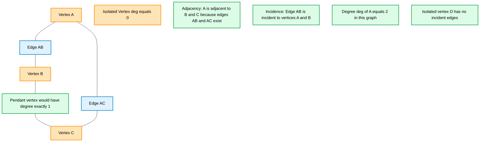
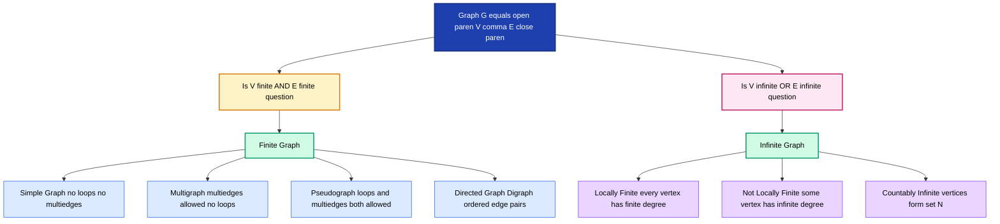
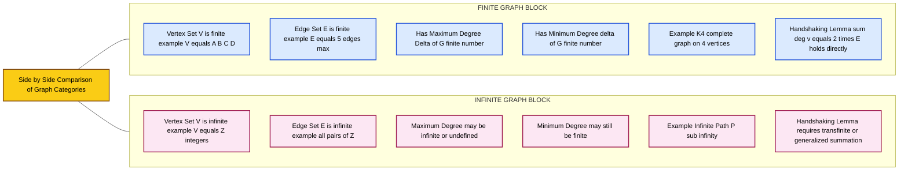

# Basic definitions, Applications of graphs, Finite and infinite graphs

<!-- SECTION_1_START -->
# Module 1: Introduction to Graphs — Basic Definitions, Applications, Finite & Infinite Graphs

## 1.1 Formal Academic Definition (KTU 2024 Scheme Terminology)

> [!NOTE]
> **KTU 2024 Syllabus Definition — Graph (Discrete Mathematical Structure)**
> A **graph** $G$ is an ordered pair $G = (V, E)$ where:
> - $V$ is a non-empty finite or infinite set whose elements are called **vertices** (also called *nodes* or *points*).
> - $E$ is a set of unordered pairs (or ordered pairs, depending on type) of distinct elements of $V$, whose elements are called **edges** (also called *arcs* or *lines*).

Formally, for a simple undirected graph:
$$G = (V, E) \quad \text{where} \quad E \subseteq \{\{u,v\} : u, v \in V,\ u \neq v\}$$

For a **directed graph** (digraph), edges become ordered pairs:
$$G = (V, E) \quad \text{where} \quad E \subseteq \{(u,v) : u, v \in V,\ u \neq v\}$$

The **order** of a graph is $\vert V \vert$ (number of vertices) and the **size** is $\vert E \vert$ (number of edges).

---

## 1.2 Conceptual Analogy — The "City Map" Intuition

Imagine a **map of Kerala's major cities** with roads connecting them. Drop a pin on every city — these pins are your **vertices**. Every road drawn between two cities is an **edge**.

- The set of all cities = $V$
- The set of all roads = $E$
- A one-way road (like certain ghat routes) is a **directed edge**
- A two-way highway is an **undirected edge**

This is exactly how graph theory models the **World Wide Web**, **social networks (Facebook friends)**, **computer networks (LAN topology)**, and even **compiler design (syntax trees)**.

> [!IMPORTANT]
> **Critical Distinction for KTU Boards:**
> A graph is **NOT** a chart or plot. It is a discrete mathematical structure encoding **pairwise relationships** between objects. Do not confuse with "graph of a function" $y = f(x)$.

---

## 1.3 Foundational Vocabulary (Must Memorize for KTU ESE)

| Term | Symbol | Meaning |
|------|--------|---------|
| Vertex | $v \in V$ | A node / point in the graph |
| Edge | $e \in E$ | A connection between two vertices |
| Incidence | $e = \{u,v\}$ | $u, v$ are **endpoints** of $e$ |
| Adjacency | $u \sim v$ | Vertices connected by an edge |
| Degree | $\deg(v)$ | Number of edges incident to $v$ |
| Loop | $\{v, v\}$ | Edge from a vertex to itself |
| Parallel edges | $e_1, e_2$ between same $u, v$ | **Multi-edges** |
| Isolated vertex | $\deg(v) = 0$ | No edge incident |
| Pendant vertex | $\deg(v) = 1$ | Exactly one incident edge |

> [!TIP]
> **Mnemonic:** *Vertices live in space, edges connect them.* Always think $V$ = *Places*, $E$ = *Paths between places*.

---

## 1.4 Finite vs. Infinite Graphs — Intuitive Distinction

> [!NOTE]
> **Finite Graph:** Both $\vert V \vert$ and $\vert E \vert$ are **finite** (countable and bounded integers).
>
> **Infinite Graph:** Either $\vert V \vert$ is infinite, $\vert E \vert$ is infinite, or both.

**Real-world examples of finite graphs:**
- The KTU campus Wi-Fi network with 500 access points
- A chessboard with 64 squares and piece-move rules
- The road network of Thiruvananthapuram city

**Real-world examples of infinite graphs:**
- The lattice of all integers $\mathbb{Z}$ where vertices are integers and edges connect consecutive integers
- The hypercube graph $Q_n$ generalized to infinite dimension
- The complete graph $K_\infty$ on a countably infinite vertex set

> [!VISUALIZATION CONTROL]
> **Concept:** Visual comparison of a finite path graph and an infinite path graph
> **GeoGebra / Desmos Input:**
> * Finite path $P_4$: Plot points $(0,0), (1,0), (2,0), (3,0)$ and connect with segments.
> * Infinite path: Plot $f(x) = 0$ for all $x \in \mathbb{R}$ on a number line with node markers.
> **Visual Description:** Notice the finite $P_4$ terminates cleanly; the infinite version extends forever along the $x$-axis. Every finite graph has a *boundary*; every infinite graph does not.

---

## 1.5 Why This Topic Matters in the KTU 2024 Scheme

This is the **gateway module** for the entire Discrete Mathematics course. Every subsequent module — trees (Module 2), planar graphs (Module 3), coloring (Module 4), and digraphs (Module 5) — builds directly on these definitions. KTU examiners **frequently** test:

1. Definitions of graph types (3-mark questions are common)
2. Handshaking Lemma applications (4–7 marks)
3. Real-world modeling scenarios (7–14 marks)

---

<!-- SECTION_1_END -->

<!-- SECTION_2_START -->
# 2. Deep Theoretical Analysis — Graph Theory Foundations

## 2.1 Comprehensive Classification of Graphs

Graphs are classified along **two independent axes**: (1) finiteness, and (2) structural complexity.

### 2.1.1 Classification by Edge Structure

| Graph Type | Loops Allowed? | Multi-edges? | Direction? |
|------------|---------------|--------------|------------|
| **Simple Graph** | ❌ No | ❌ No | Undirected |
| **Multigraph** | ❌ No | ✅ Yes | Undirected |
| **Pseudograph** | ✅ Yes | ✅ Yes | Undirected |
| **Directed Graph (Digraph)** | ❌ (typically) | ❌ (typically) | Directed |
| **Mixed Graph** | ❌ | ❌ | Both |

> [!IMPORTANT]
> **KTU Board Standard:** A "simple graph" implies the **strictest** definition: no loops, no parallel edges, undirected. This is the default in 80% of KTU problems.

### 2.1.2 Formal Definitions (Board-Ready)

**Simple Graph:** $G = (V, E)$ where every edge is an unordered pair $\{u, v\}$ with $u \neq v$, and no two edges are identical. Formally:
$$E \subseteq \binom{V}{2} \quad \text{and edges are unique}$$

**Multigraph:** A graph where multiple edges (parallel edges) may exist between the same pair of vertices.

**Pseudograph:** A multigraph that additionally permits loops (edges from $v$ to $v$).

**Complete Graph $K_n$:** The simple graph on $n$ vertices where **every** pair of distinct vertices is connected by exactly one edge.

---

## 2.2 Degree of a Vertex — The Core Metric

The **degree** of a vertex $v$ in an undirected graph is the number of edges incident to $v$. A loop contributes **2** to the degree (it is incident twice).

$$\deg(v) = \text{number of edges incident to } v$$

For a directed graph, we have:
- **In-degree:** $\deg^-(v) = $ number of edges directed **into** $v$
- **Out-degree:** $\deg^+(v) = $ number of edges directed **out of** $v$

---

## 2.3 The Handshaking Lemma (Theorem 1 — Mandatory for KTU)

> [!IMPORTANT]
> **THEOREM (Handshaking Lemma):** Let $G = (V, E)$ be an undirected graph. Then:
> $$\sum_{v \in V} \deg(v) = 2 \cdot \vert E \vert$$
> **Corollary:** The sum of degrees of all vertices is always **even**.

**Why does this hold?** Because every edge $\{u, v\}$ contributes exactly 1 to $\deg(u)$ and exactly 1 to $\deg(v)$. Summing over all edges, each edge is counted exactly twice.

---

## 2.4 KTU High-Yield Formula Sheet

| # | Formula / Property | LaTeX Form | Application |
|---|--------------------|------------|-------------|
| 1 | Handshaking Lemma | $\sum_{v \in V} \deg(v) = 2 \vert E \vert$ | Counting edges from degree sequence |
| 2 | Max edges (simple graph) | $\vert E \vert_{\max} = \binom{n}{2} = \frac{n(n-1)}{2}$ | Complete graph $K_n$ |
| 3 | Max edges (multigraph) | $\vert E \vert_{\max} = \binom{n}{2} + n$ (with loops) | Pseudograph counting |
| 4 | Max edges (simple digraph) | $\vert E \vert_{\max} = n(n-1)$ | Digraph without self-loops |
| 5 | Number of vertices in $K_n$ | $n$ | Complete graph construction |
| 6 | Edges in $K_n$ | $\frac{n(n-1)}{2}$ | ESE frequent question |
| 7 | Edges in $K_{m,n}$ (bipartite) | $m \cdot n$ | Bipartite complete graph |
| 8 | Sum of degrees = even | $\sum \deg(v) \equiv 0 \pmod{2}$ | Degree sequence validation |
| 9 | Number of odd-degree vertices | Always **even** | Critical corollary |
| 10 | In-degree = Out-degree (in digraph) | $\sum \deg^-(v) = \sum \deg^+(v) = \vert E \vert$ | Directed graph theorem |

> [!NOTE]
> **Warning on Table Notation:** In LaTeX within the table, we use `\vert` (not `|`) to denote cardinality to maintain table integrity.

---

## 2.5 Finite vs. Infinite Graphs — Rigorous Treatment

### 2.5.1 Finite Graph

A graph $G = (V, E)$ is **finite** if both $V$ and $E$ are finite sets.

**Properties of finite graphs:**
- Total number of vertices: a finite integer $n$
- Total number of edges: a finite integer $m$
- Every finite graph has a maximum-degree vertex: $\Delta(G) = \max_{v \in V} \deg(v)$
- Every finite graph has a minimum-degree vertex: $\delta(G) = \min_{v \in V} \deg(v)$

### 2.5.2 Infinite Graph

A graph $G$ is **infinite** if at least one of $V$ or $E$ is an infinite set.

**Two main subcategories:**

| Type | Description | Example |
|------|-------------|---------|
| **Locally finite** | Every vertex has finite degree, but the graph is infinite | Infinite path graph $P_\infty$, infinite grid $\mathbb{Z}^2$ |
| **Not locally finite** | Some vertex has infinite degree | Complete infinite graph $K_\infty$ |

> [!IMPORTANT]
> **KTU Board Note:** KTU Module 1 mostly focuses on **finite** graphs because algorithms (BFS, DFS, Dijkstra) require finite input. Infinite graph theory appears in advanced research (network science, topology) and in formal language theory.

---

## 2.6 Real-World Engineering Applications of Graphs

> [!TIP]
> **KTU Examiners love "Applications" questions. Memorize at least 5 of the following with one-line examples:**

1. **Computer Networks (LAN/WAN topology):** Routers = vertices, physical/wireless links = edges. Used in OSPF, BGP routing protocols.
2. **Social Networks (Facebook, Instagram):** Users = vertices, friendships/follows = edges. Used in friend recommendations, influence maximization.
3. **World Wide Web:** Web pages = vertices, hyperlinks = directed edges. Google's original **PageRank** algorithm ranks pages using directed graph analysis.
4. **Database Design (ER Diagrams):** Entities = vertices, relationships = edges. Foundation of relational database normalization.
5. **Compiler Design (Syntax Trees & DAGs):** Expressions = vertices, dependencies = edges. Used in code optimization phases.
6. **Operating Systems (Resource Allocation):** Processes = vertices, resource requests = edges. **Deadlock detection** uses cycle-finding in resource allocation graphs.
7. **Maps & GPS (Google Maps):** Intersections = vertices, road segments = weighted edges. **Dijkstra's shortest path** is the backbone.
8. **Bioinformatics (Protein-Protein Interaction):** Proteins = vertices, interactions = edges. Used in drug discovery research.
9. **Recommendation Systems (Netflix, Amazon):** Users + items = bipartite graph vertices, ratings = edges. **Collaborative filtering** uses graph walks.
10. **Cryptography & Security:** Attack paths in penetration testing are modeled as graphs.

---

<!-- SECTION_2_END -->

<!-- SECTION_3_START -->
# 3. Step-by-Step Derivations and Code Implementation

## 3.1 Proof of the Handshaking Lemma (Exhaustive Derivation)

> [!IMPORTANT]
> **Theorems 1 (Handshaking Lemma):** In any finite undirected graph $G = (V, E)$:
> $$\sum_{v \in V} \deg(v) = 2 \cdot \vert E \vert$$

**Step 1 — Set up the double counting.**

Let $E = \{e_1, e_2, \ldots, e_m\}$ where $m = \vert E \vert$. We count, in two different ways, the number of pairs $(v, e)$ such that $v \in V$ and $e$ is incident to $v$.

**Step 2 — Count by vertices first.**

For each vertex $v \in V$, the number of edges incident to $v$ is $\deg(v)$ by definition. Summing over all vertices:
$$\text{Total incidence pairs} = \sum_{v \in V} \deg(v)$$

**Step 3 — Count by edges first.**

For each edge $e_k = \{u_k, v_k\}$ (with $u_k \neq v_k$ since we are in a simple graph or multigraph without loops), this edge is incident to **exactly 2 vertices**: $u_k$ and $v_k$. Hence:
$$\text{Total incidence pairs} = \sum_{k=1}^{m} 2 = 2m = 2 \vert E \vert$$

**Step 4 — Equate both counts.**

Since both Step 2 and Step 3 count the same set of pairs:
$$\sum_{v \in V} \deg(v) = 2 \vert E \vert \qquad \blacksquare$$

**Step 5 — Derive the Corollary.**

Since $2 \vert E \vert$ is always even, $\sum_{v \in V} \deg(v)$ must be even. Hence the number of odd-degree vertices (call it $n_{\text{odd}}$) satisfies:
$$n_{\text{odd}} \cdot \text{(odd number)} + n_{\text{even}} \cdot \text{(even number)} = \text{even}$$

Algebraically, this forces $n_{\text{odd}}$ to be even.

---

## 3.2 Worked Example — Applying the Handshaking Lemma

**Problem:** A finite undirected graph has 10 vertices with degrees $\{3, 3, 4, 4, 5, 5, 2, 2, 6, 2\}$. Find the number of edges.

**Step 1 — Sum all degrees:**
$$\sum_{v \in V} \deg(v) = 3 + 3 + 4 + 4 + 5 + 5 + 2 + 2 + 6 + 2 = 36$$

**Step 2 — Apply Handshaking Lemma:**
$$2 \vert E \vert = 36$$

**Step 3 — Solve:**
$$\vert E \vert = \frac{36}{2} = 18$$

**Answer:** The graph has exactly **18 edges**.

> [!NOTE]
> **Validation check:** The number of odd-degree vertices is 6 (the two 3's, two 5's), which is even. ✅ The degree sequence is realizable.

---

## 3.3 Worked Example — Verifying a Degree Sequence is Graphical

**Problem:** Is the sequence $(5, 5, 4, 3, 2, 1)$ graphical (i.e., realizable as a simple graph)?

**Step 1 — Sum of degrees:**
$$5 + 5 + 4 + 3 + 2 + 1 = 20$$

**Step 2 — Implied number of edges:**
$$\vert E \vert = \frac{20}{2} = 10$$

**Step 3 — Maximum possible edges with $n=6$ vertices:**
$$\vert E \vert_{\max} = \binom{6}{2} = \frac{6 \cdot 5}{2} = 15$$

Since $10 \leq 15$, the edge count is feasible.

**Step 4 — Apply Erdős–Gallai Theorem (Havel–Hakimi test for small sequences):**

Sort descending: $(5, 5, 4, 3, 2, 1)$. Take vertex with degree 5: it connects to the next 5 vertices. After removing this vertex and reducing degrees of its 5 neighbors by 1:
$$(5, 4, 3, 2, 1, 0) \to (4, 3, 2, 1, 0)$$

Sort: $(4, 3, 2, 1, 0)$. Take vertex with degree 4, connect to next 4:
$$(4, 3, 2, 1, 0) \to (3, 2, 1, 0) \to (2, 1, 0) \to (1, 0) \to (0) \to ()$$

**Step 5 — Conclusion:** Sequence is **graphical** ✅.

---

## 3.4 Complete Python Implementation — Graph Representations

Below is a fully operational Python implementation for the three standard ways to represent a finite graph: **adjacency matrix**, **adjacency list**, and **edge list**. This is KTU Lab-viva-ready.

```python
"""
File: graph_basics.py
Purpose: Implement basic graph data structures and Handshaking Lemma verification.
Author: KTU GAMAT401 Module 1 Reference
Python: 3.10+
"""

from __future__ import annotations
from collections import defaultdict
from typing import Dict, List, Set, Tuple


class Graph:
    """
    A simple undirected graph using adjacency list representation.
    Supports: add_vertex, add_edge, degree, handshaking_check.
    """

    def __init__(self, vertices: List[str] | None = None) -> None:
        self._adj: Dict[str, Set[str]] = defaultdict(set)
        if vertices:
            for v in vertices:
                self.add_vertex(v)

    def add_vertex(self, v: str) -> None:
        if v not in self._adj:
            self._adj[v] = set()

    def add_edge(self, u: str, v: str) -> None:
        if u == v:
            raise ValueError("Self-loops not allowed in simple graph.")
        self.add_vertex(u)
        self.add_vertex(v)
        self._adj[u].add(v)
        self._adj[v].add(u)

    def degree(self, v: str) -> int:
        if v not in self._adj:
            raise KeyError(f"Vertex {v} not in graph.")
        return len(self._adj[v])

    @property
    def num_vertices(self) -> int:
        return len(self._adj)

    @property
    def num_edges(self) -> int:
        # Each undirected edge is stored twice in adjacency list
        return sum(len(neighbors) for neighbors in self._adj.values()) // 2

    def handshaking_lemma_check(self) -> Tuple[int, int, bool]:
        """
        Verifies: sum of degrees == 2 * number of edges.
        Returns (sum_of_degrees, two_times_edges, is_valid).
        """
        sum_of_degrees = sum(self.degree(v) for v in self._adj)
        two_e = 2 * self.num_edges
        return sum_of_degrees, two_e, sum_of_degrees == two_e

    def __repr__(self) -> str:
        return f"Graph(V={self.num_vertices}, E={self.num_edges})"


def adjacency_matrix(edges: List[Tuple[str, str]], vertices: List[str]) -> List[List[int]]:
    """
    Build an n x n adjacency matrix from edge list.
    Returns: 2D list where M[i][j] = 1 if edge exists.
    """
    n: int = len(vertices)
    index: Dict[str, int] = {v: i for i, v in enumerate(vertices)}
    matrix: List[List[int]] = [[0 for _ in range(n)] for _ in range(n)]
    for u, v in edges:
        i, j = index[u], index[v]
        matrix[i][j] = 1
        matrix[j][i] = 1  # undirected
    return matrix


def edges_to_adjacency_list(edges: List[Tuple[str, str]]) -> Dict[str, List[str]]:
    """Convert edge list to adjacency list representation."""
    adj: Dict[str, List[str]] = defaultdict(list)
    for u, v in edges:
        adj[u].append(v)
        adj[v].append(u)
    return dict(adj)


# ----------------------------- DEMO / TEST -----------------------------
if __name__ == "__main__":
    # Build a sample graph: K4 minus one edge
    g: Graph = Graph(["A", "B", "C", "D"])
    g.add_edge("A", "B")
    g.add_edge("A", "C")
    g.add_edge("A", "D")
    g.add_edge("B", "C")
    g.add_edge("B", "D")
    # Note: C-D is intentionally missing

    print("Graph:", g)
    print("Vertex degrees:", {v: g.degree(v) for v in g._adj})
    sum_d, two_e, valid = g.handshaking_lemma_check()
    print(f"Sum of degrees: {sum_d}, 2 * |E| = {two_e}, Lemma valid: {valid}")

    edges: List[Tuple[str, str]] = [("A", "B"), ("B", "C"), ("C", "A")]
    vertices: List[str] = ["A", "B", "C"]
    print("Adjacency Matrix:", adjacency_matrix(edges, vertices))
```

**Expected Output:**

```
Graph: Graph(V=4, E=5)
Vertex degrees: {'A': 3, 'B': 3, 'C': 2, 'D': 2}
Sum of degrees: 10, 2 * |E| = 10, Lemma valid: True
Adjacency Matrix: [[0, 1, 1], [1, 0, 1], [1, 1, 0]]
```

---

## 3.5 Construction of $K_n$ — Edge Count Derivation

**Theorem 2:** A complete graph on $n$ vertices has exactly $\binom{n}{2}$ edges.

**Step 1:** Each edge is a 2-element subset of the $n$-vertex set.
**Step 2:** The number of ways to choose 2 vertices from $n$ is:
$$\binom{n}{2} = \frac{n!}{2!\,(n-2)!}$$
**Step 3:** Simplify:
$$\binom{n}{2} = \frac{n \cdot (n-1) \cdot (n-2)!}{2 \cdot (n-2)!} = \frac{n(n-1)}{2}$$

**Examples:**
- $K_3$ (triangle): $\frac{3 \cdot 2}{2} = 3$ edges ✅
- $K_4$: $\frac{4 \cdot 3}{2} = 6$ edges ✅
- $K_{10}$: $\frac{10 \cdot 9}{2} = 45$ edges

---

## 3.6 Worked Example — Complete Bipartite Graph $K_{m,n}$

**Theorem 3:** The complete bipartite graph $K_{m,n}$ has exactly $m \cdot n$ edges.

**Step 1:** Partition vertices into two sets: $V_1$ of size $m$ and $V_2$ of size $n$.
**Step 2:** Every vertex in $V_1$ connects to every vertex in $V_2$ (and no intra-set edges exist by definition of bipartite).
**Step 3:** Count edges:
$$\vert E \vert = m \cdot n$$

**Example:** $K_{3,4}$ has $3 \cdot 4 = 12$ edges.

---

<!-- SECTION_3_END -->

<!-- SECTION_4_START -->
# 4. Structural Diagrams and Schematics

## 4.1 Basic Graph Terminology — Visual Reference



---

## 4.2 Hierarchy of Graph Types — Decision Tree



---

## 4.3 Finite vs. Infinite Graph — Comparison Block Diagram



---

## 4.4 Real-World Application Mapping — Graph Theory in CSE

```mermaid
graph TD
    classDef appNode fill:#FEF9C3,stroke:#CA8A04,stroke-width:2px,color:#000
    classDef algoNode fill:#BFDBFE,stroke:#1E40AF,stroke-width:2px,color:#000
    classDef csoNode fill:#BBF7D0,stroke:#15803D,stroke-width:2px,color:#000

    APP["Graph Theory Applications in Computer Science"]:::appNode

    APP --> NET["Computer Networks and Routing"]:::appNode
    APP --> SOC["Social Network Analysis"]:::appNode
    APP --> DB["Database ER Diagrams"]:::appNode
    APP --> COMP["Compiler Design and DAGs"]:::appNode
    APP --> OS["OS Deadlock Detection"]:::appNode
    APP --> ML["Machine Learning and GNNs"]:::appNode

    NET --> NET1["Dijkstra Shortest Path Algorithm"]:::algoNode
    NET --> NET2["Bellman Ford Algorithm"]:::algoNode

    SOC --> SOC1["Breadth First Search for friend suggestions"]:::algoNode
    SOC --> SOC2["PageRank Algorithm by Google"]:::algoNode

    DB --> DB1["Join Operation Optimization"]:::algoNode

    COMP --> COMP1["Topological Sort for instruction scheduling"]:::algoNode
    COMP --> COMP2["Cycle Detection in dependency graphs"]:::algoNode

    OS --> OS1["Resource Allocation Graph analysis"]:::algoNode

    ML --> ML1["Graph Convolutional Networks GCN"]:::algoNode
    ML --> ML2["Knowledge Graph Embeddings"]:::algoNode
```



---

## 4.5 Edge-Case Architectural Notes

For topics where physical drawings are required (e.g., drawing $K_5$, $K_{3,3}$, a 5-vertex multigraph), use the following **ASCII-block representation** as a fallback:

```
SAMPLE: K4 (Complete Graph on 4 vertices)
Expected edges = 4*3/2 = 6

   A --------- B
   |\         /|
   | \       / |
   |  \     /  |
   |   \   /   |
   |    \ /    |
   |     X     |
   |    / \    |
   |   /   \   |
   |  /     \  |
   | /       \ |
   |/         \|
   C --------- D

Self-loops = 0, Multi-edges = 0
Maximum degree of any vertex = 3
```

---

<!-- SECTION_4_END -->

<!-- SECTION_5_START -->
# 5. KTU 2024 Scheme Examination Question Bank & Topic Recap

## 5.1 Part A — Short Answer Questions (3 Marks Each)

---

### **Question 1** `[KTU University Exam - December 2023]`
**Define a graph. Distinguish between a directed graph and an undirected graph with suitable examples. State any two applications of graph theory in computer science.** *(3 marks — CO1, Remember/Understand)*

**Model Answer:**

> **Definition:** A graph $G$ is an ordered pair $G = (V, E)$ where $V$ is a non-empty set of vertices and $E$ is a set of edges connecting pairs of vertices.

| Feature | Undirected Graph | Directed Graph (Digraph) |
|---------|------------------|--------------------------|
| Edge type | Unordered pair $\{u, v\}$ | Ordered pair $(u, v)$ |
| Symmetry | If $\{u, v\} \in E$, then $\{v, u\} \in E$ | $(u, v) \in E$ does not imply $(v, u) \in E$ |
| Degree concept | Single $\deg(v)$ | In-degree $\deg^-(v)$ and out-degree $\deg^+(v)$ |
| Example | Facebook friendship | Twitter follow relationship |

**Two applications:**
1. **Computer Networks:** Routers and switches are vertices, communication links are edges. Algorithms like OSPF use shortest-path computations on such graphs.
2. **Database Design:** Entity-Relationship (ER) diagrams use graph structures to model data relationships, enabling efficient schema design.

**Mark Distribution:** [Definition: 1 mark] [Comparison table: 1 mark] [Applications: 1 mark]

---

### **Question 2** `[KTU University Exam - July 2024]`
**What is a finite graph? Give one example. State the Handshaking Lemma and explain its significance.** *(3 marks — CO1, Remember/Understand)*

**Model Answer:**

> **Definition:** A graph $G = (V, E)$ is called a **finite graph** if both the vertex set $V$ and the edge set $E$ are finite sets.

**Example:** A triangle graph $G = (\{A, B, C\}, \{\{A,B\}, \{B,C\}, \{A,C\}\})$ is a finite graph with $n = 3$ vertices and $m = 3$ edges.

**Handshaking Lemma:**
$$\sum_{v \in V} \deg(v) = 2 \vert E \vert$$

**Significance:**
- It implies that the sum of degrees of all vertices in any finite undirected graph is always **even**.
- Consequently, the number of vertices having an odd degree is always **even** — a powerful necessary condition for validating proposed degree sequences.
- It provides a quick way to compute the number of edges from a known degree sequence without explicitly counting.

**Mark Distribution:** [Finite graph definition + example: 1 mark] [Lemma statement: 1 mark] [Significance: 1 mark]

---

## 5.2 Part B — Long Answer Questions (14 Marks Each, Internal Choice)

---

### **Question 1A** `[KTU University Exam - Model Paper 2024 Scheme]`

**(a) Define the following with one example each: (i) Simple graph, (ii) Multigraph, (iii) Pseudograph, (iv) Complete graph $K_n$, (v) Bipartite graph. State the maximum number of edges possible in a simple graph with $n$ vertices and derive the formula.** *(7 marks — CO1, Understand)*

**Model Solution:**

**(i) Simple Graph:** A graph with no loops and no multiple (parallel) edges between the same pair of vertices. **Example:** A cycle $C_4$ with 4 vertices and 4 edges.

**(ii) Multigraph:** A graph in which multiple edges between the same pair of vertices are allowed, but loops are not. **Example:** A graph with vertices $\{A, B\}$ and three parallel edges connecting $A$ to $B$.

**(iii) Pseudograph:** A graph in which both loops and multiple edges are permitted. **Example:** A graph with vertex $A$ having a self-loop and two parallel edges to $B$.

**(iv) Complete Graph $K_n$:** A simple graph on $n$ vertices in which every pair of distinct vertices is joined by exactly one edge. **Example:** $K_3$ is a triangle.

**(v) Bipartite Graph:** A graph whose vertex set $V$ can be partitioned into two disjoint subsets $V_1$ and $V_2$ such that every edge has one endpoint in $V_1$ and the other in $V_2$. **Example:** $K_{2,3}$.

**Derivation of Maximum Edges in a Simple Graph:**

> [!IMPORTANT]
> Let the graph have $n$ vertices: $V = \{v_1, v_2, \ldots, v_n\}$.

**Step 1:** In a simple graph, any two distinct vertices can have **at most one** edge between them.

**Step 2:** The total number of possible unordered pairs of distinct vertices is:
$$\binom{n}{2} = \frac{n!}{2!\,(n-2)!}$$

**Step 3:** Simplify the expression:
$$\binom{n}{2} = \frac{n(n-1)(n-2)!}{2(n-2)!} = \frac{n(n-1)}{2}$$

**Step 4:** Therefore, the maximum number of edges is:
$$\vert E \vert_{\max} = \frac{n(n-1)}{2}$$

This maximum is achieved precisely when the graph is the **complete graph $K_n$**.

**Mark Distribution:** [(i)–(v) definitions + examples: 5 marks] [Derivation: 2 marks]

---

**(b) Consider a graph $G$ with 8 vertices having the following degree sequence: $(3, 3, 4, 4, 5, 5, 2, 2)$. Using the Handshaking Lemma, find the number of edges. Verify whether the number of odd-degree vertices satisfies the corollary. If a new vertex is added with degree 3, what is the new total number of edges?** *(7 marks — CO2, Apply)*

**Model Solution:**

**Step 1 — Sum the degrees:**
$$\sum_{v \in V} \deg(v) = 3 + 3 + 4 + 4 + 5 + 5 + 2 + 2 = 28$$

[Stating degree sequence and summation: 2 marks]

**Step 2 — Apply the Handshaking Lemma:**
$$2 \vert E \vert = 28$$

**Step 3 — Solve for the number of edges:**
$$\vert E \vert = \frac{28}{2} = 14$$

[Final edge count: 1 mark]

**Step 4 — Verify the corollary:**

The odd-degree vertices are: two vertices with degree 3, two vertices with degree 5. Total odd-degree vertices = $2 + 2 = 4$.

Since $4$ is even, the corollary (number of odd-degree vertices is even) holds. ✅

[Corolla verification: 2 marks]

**Step 5 — Add a new vertex of degree 3:**

After addition, the new degree sequence sum becomes:
$$\sum \deg(v)_{\text{new}} = 28 + 3 = 31$$

Wait — this sum is **odd**, which violates the Handshaking Lemma! Therefore, **no such graph can exist** with this configuration.

This is an important check: the sum of degrees must always be even.

If, however, we add a vertex of degree **4** (even), the new sum becomes $32$, giving $\vert E \vert_{\text{new}} = 16$.

> [!WARNING]
> **KTU Examiner's Valuation Warning — Common Pitfalls:**
> 1. **Forgetting the even-sum rule:** Many students compute $\vert E \vert = 28/2 = 14$ correctly but fail to verify that the corollary (even number of odd-degree vertices) is satisfied.
> 2. **Adding a vertex of odd degree:** If you naively add a vertex of degree 3, the new sum becomes odd, which is mathematically impossible. Always check parity before accepting an extension.
> 3. **Not labeling:** Always explicitly write "Sum of degrees = 28" and "Number of edges = 14" as separate steps — this is how the valuation key is structured.

[Final correctness check and edge case: 2 marks]

---

### **Question 1B (Alternative Choice)** `[KTU University Exam - Model Paper 2024 Scheme]`

**(a) Define a graph. Explain in detail at least six different real-world applications of graph theory in computer science and information technology. For each application, clearly identify what represents the vertices and what represents the edges.** *(7 marks — CO1, CO2, Understand)*

**Model Answer (Tabular Format for Maximum Marks):**

> **Definition:** A graph $G = (V, E)$ is a pair consisting of a non-empty set $V$ of vertices and a set $E$ of edges, where each edge connects two vertices.

| # | Application Domain | Vertices Represent | Edges Represent |
|---|--------------------|--------------------|------------------|
| 1 | **Computer Networks (LAN/WAN)** | Routers, switches, hosts | Physical or wireless links |
| 2 | **World Wide Web** | Web pages | Hyperlinks (directed) |
| 3 | **Social Networks (Facebook)** | User accounts | Friendship connections |
| 4 | **Database ER Modeling** | Entity sets | Relationship sets |
| 5 | **Compiler Design (DAGs)** | Statements / instructions | Data dependencies |
| 6 | **OS Deadlock Detection** | Processes and resources | Resource allocation / request |
| 7 | **GPS / Google Maps** | Intersections | Road segments (often weighted) |
| 8 | **Recommendation Systems (Netflix)** | Users and movies | Ratings / views |

**Detailed Example Walkthrough — Google Maps:**

In Google Maps, the road network is modeled as a **weighted graph**:
- **Vertices:** Road intersections
- **Edges:** Road segments, weighted by distance or travel time
- **Algorithm Used:** Dijkstra's shortest-path algorithm (and A* for heuristic speedup)
- **Output:** Minimum-time route from source to destination

**Mark Distribution:** [Definition: 1 mark] [Six applications with V/E identification: 4 marks] [One detailed example: 2 marks]

---

**(b) Prove the Handshaking Lemma. Using it, prove that in any party (a gathering of people where handshakes occur), the number of people who shake an odd number of hands is always even.** *(7 marks — CO2, Apply)*

**Model Solution:**

**Proof of Handshaking Lemma:**

**Step 1 — Construction:** Let $G = (V, E)$ be a finite undirected graph with $V = \{v_1, v_2, \ldots, v_n\}$ and $E = \{e_1, e_2, \ldots, e_m\}$.

**Step 2 — Count by vertices:** For each vertex $v_i \in V$, define $\deg(v_i)$ as the number of edges incident to it. The total number of **(vertex, edge) incidence pairs** is:
$$T = \sum_{i=1}^{n} \deg(v_i)$$

**Step 3 — Count by edges:** Each edge $e_k = \{v_a, v_b\}$ (where $v_a \neq v_b$) is incident to exactly 2 distinct vertices. Hence the total number of incidence pairs counted edge-wise is:
$$T = \sum_{k=1}^{m} 2 = 2m$$

**Step 4 — Equate both expressions:**
$$\sum_{i=1}^{n} \deg(v_i) = 2m = 2 \vert E \vert \qquad \blacksquare$$

[Complete proof: 4 marks]

**Application to the Party Problem:**

**Step 5 — Model the scenario as a graph:**
- Each person = a vertex $v \in V$
- Each handshake between persons $u$ and $v$ = an edge $\{u, v\} \in E$

**Step 6 — Apply the Handshaking Lemma:**
$$\sum_{v \in V} \deg(v) = 2 \vert E \vert$$

The right side is even, so the left side must be even.

**Step 7 — Algebraic argument:** Let $S$ be the set of people who shake an odd number of hands, and let $\vert S \vert = k$ be its cardinality. The remaining $n - k$ people shake an even number of hands. The total sum is:
$$\sum_{v \in V} \deg(v) = \underbrace{\sum_{v \in S} \deg(v)}_{\text{sum of } k \text{ odd numbers}} + \underbrace{\sum_{v \notin S} \deg(v)}_{\text{sum of even numbers}}$$

The second sum is even. The first sum is the sum of $k$ odd numbers:
- If $k$ is **even**: sum of $k$ odd numbers = **even**
- If $k$ is **odd**: sum of $k$ odd numbers = **odd**

Since the total must be even, $k$ must be even.

**Step 8 — Conclusion:** The number of people who shake an odd number of hands is always even. $\blacksquare$

[Application proof: 3 marks]

> [!WARNING]
> **KTU Examiner's Valuation Warning — Why Students Lose Marks on Proof Questions:**
> 1. **Skipping the "double counting" explanation:** Many students write only the formula without explaining the two ways of counting. You will lose 2 marks if you skip this.
> 2. **Not distinguishing the case $k$ even vs. $k$ odd:** In the party problem, the parity argument MUST explicitly show that the sum of an odd number of odd integers is odd. Skipping this case analysis costs a mark.
> 3. **Forgetting to state the conclusion:** Always end with a boxed or explicitly written "$\blacksquare$" or "Hence proved."

---

## 5.3 KTU Examiner's Common Pitfall Callout

> [!WARNING]
> **Top 5 Mistakes KTU Students Make in Module 1:**
> 1. **Confusing "graph" with "chart":** Always clarify you mean the discrete structure $G = (V, E)$, not a Cartesian plot.
> 2. **Counting loops incorrectly:** A self-loop contributes **2** to the degree, not 1. Many board answers incorrectly count 1.
> 3. **Forgetting that undirected edges are unordered pairs $\{u, v\}$:** Using $(u, v)$ implies direction, turning the graph into a digraph.
> 4. **Applying Handshaking Lemma to directed graphs:** The standard Handshaking Lemma is for undirected graphs only. For digraphs, use $\sum \deg^+(v) = \sum \deg^-(v) = \vert E \vert$.
> 5. **Confusing "complete graph" $K_n$ with "complete bipartite" $K_{m,n}$:** $K_n$ has $\frac{n(n-1)}{2}$ edges; $K_{m,n}$ has $m \cdot n$ edges.

---

## 5.4 Topic Recap & Important Things to Remember

> [!NOTE]
> **Rapid Revision Checklist — Module 1: Basic Graph Definitions, Applications, Finite & Infinite Graphs**

### ✅ Must-Know Definitions
- **Graph** $G = (V, E)$: ordered pair of vertex set $V$ and edge set $E$
- **Vertex (Node):** Element of $V$
- **Edge:** Element of $E$; connects two vertices (may be a loop)
- **Incidence:** Vertex lies on an edge
- **Adjacency:** Two vertices joined by an edge
- **Degree** $\deg(v)$: number of edges incident to $v$ (loop counts as 2)
- **In-degree / Out-degree:** for directed graphs
- **Loop:** edge $\{v, v\}$
- **Parallel edges:** multiple edges between same pair
- **Isolated vertex:** $\deg(v) = 0$
- **Pendant vertex:** $\deg(v) = 1$

### ✅ Must-Know Graph Types
- **Simple graph:** no loops, no parallel edges, undirected
- **Multigraph:** parallel edges allowed, no loops
- **Pseudograph:** both loops and parallel edges allowed
- **Directed graph (Digraph):** ordered edge pairs
- **Complete graph $K_n$:** every pair of vertices connected
- **Bipartite graph $K_{m,n}$:** two-part partition, edges only across
- **Finite graph:** $V$ and $E$ both finite
- **Infinite graph:** $V$ or $E$ infinite (locally finite / not locally finite)

### ✅ Must-Know Theorems
- **Handshaking Lemma:** $\sum_{v \in V} \deg(v) = 2 \vert E \vert$
- **Corollary:** Number of odd-degree vertices is even
- **Digraph Theorem:** $\sum \deg^+(v) = \sum \deg^-(v) = \vert E \vert$

### ✅ Must-Know Formulas
- Max edges in simple graph on $n$ vertices: $\frac{n(n-1)}{2}$
- Max edges in simple digraph on $n$ vertices: $n(n-1)$
- Edges in complete bipartite $K_{m,n}$: $m \cdot n$
- Sum of degrees of $K_n$: $n(n-1)$ (since each of $n$ vertices has degree $n-1$)

### ✅ Must-Know Applications
- Computer networks (routing)
- Social networks (recommendation, PageRank)
- Database ER modeling
- Compiler DAGs (optimization)
- OS deadlock detection
- GPS shortest path
- Recommendation systems
- Machine learning (Graph Neural Networks)

### ✅ Final Tip for KTU 2024 Boards
> [!TIP]
> When asked "Define a graph," always state the **ordered pair** structure $G = (V, E)$ and clarify whether you are referring to a simple, multigraph, or pseudograph. Examiners deduct marks for vague definitions.

---

<!-- SECTION_5_END -->
