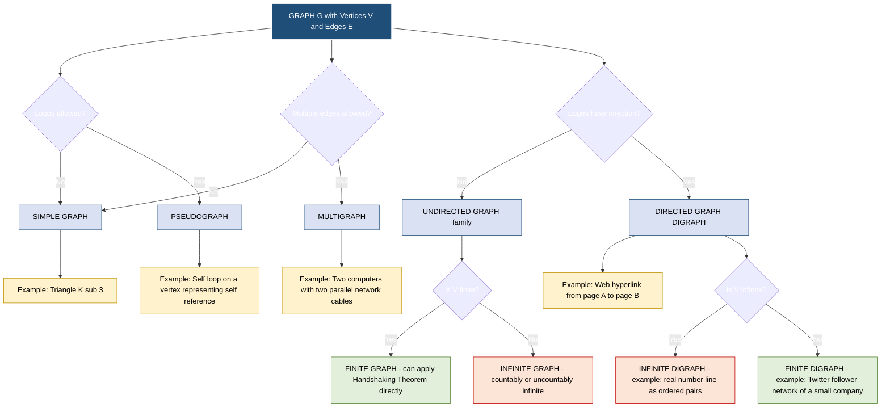
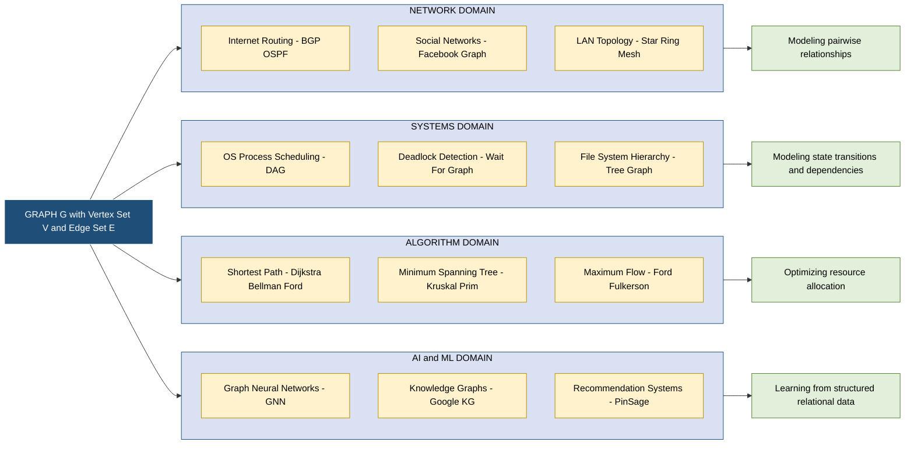
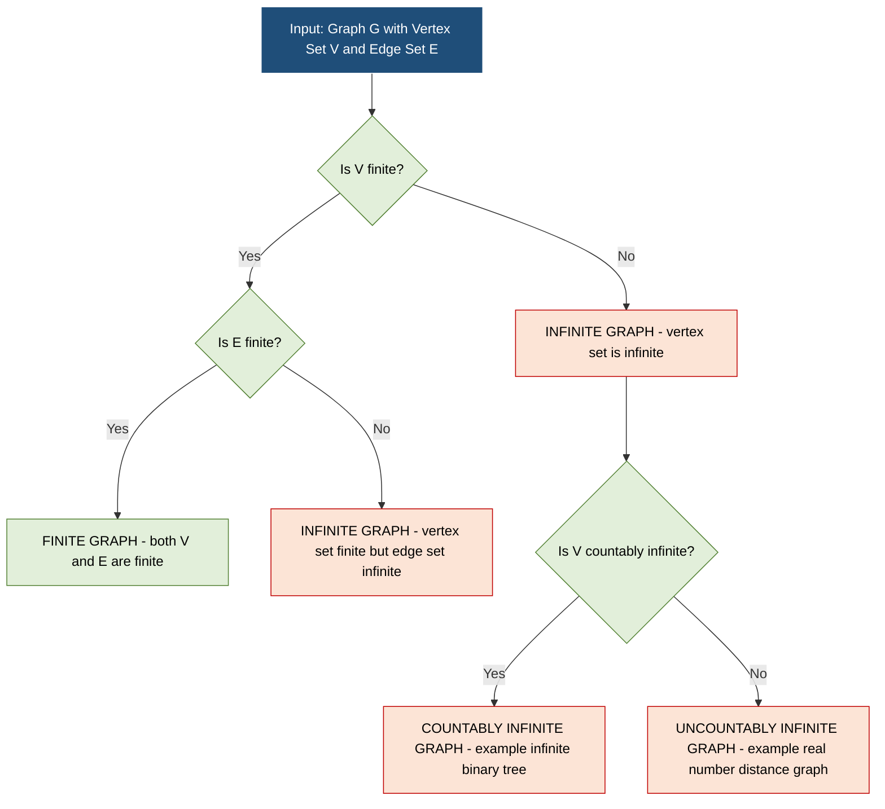

# Basic definitions, Applications of graphs, Finite and infinite graphs

<!-- SECTION_1_START -->
# 1. Core Technical Definition & Intuitive Overview

## 1.1 Formal Definition of a Graph

In the KTU 2024 Scheme syllabus for **GAMAT401 — Mathematics for Computer and Information Science-4**, a **graph** $G$ is formally defined as an ordered pair of sets:

$$G = (V, E)$$

where:
- $V$ is a non-empty set of elements called **vertices** (also called *nodes* or *points*).
- $E$ is a set of elements called **edges** (also called *lines* or *arcs*), where each edge $e \in E$ is associated with either one or two vertices of $V$.

> [!IMPORTANT]
> **KTU 2024 Board Definition (Strict):** A graph is the mathematical structure $G = (V, E)$ that captures the *pairwise relationship* between objects. The set $V$ is mandatory and non-empty; the set $E$ can technically be empty (the *empty graph* or *null graph* on $n$ vertices, denoted $N_n$).

## 1.2 Intuitive Real-World Analogy

Imagine the **Kerala State Road Map** spread on your desk.

- **Cities** (Thiruvananthapuram, Kochi, Kozhikode) act as **vertices**.
- **Roads** connecting these cities act as **edges**.
- A road connecting *Kochi* to *Thrissur* is an *undirected* edge — you can travel both ways.
- A one-way flyover is a *directed* edge — traffic flows one way.

> [!NOTE]
> **The Key Insight:** Graph theory is *not* about the geometry of the picture. The shape of vertices and the curvature of edges carry **no mathematical meaning**. What matters is **which vertex is connected to which**.

> [!TIP]
> **Mental Model for GATE/Placement Prep:** Think of a graph as a **relationship ledger**. Every edge is a *fact* — "A is connected to B". Two graphs with the same connection facts are considered **isomorphic**, even if one is drawn as a triangle and the other as a square.

## 1.3 Fundamental Vertex & Edge Terminology

The KTU examiner will frequently test the following *primitives* in the **2-mark and 3-mark slots**.

| Term | Rigorous Definition | KTU Board Notation |
| :--- | :--- | :--- |
| **Vertex Set** | The collection of all nodes in $G$ | $V(G)$ |
| **Edge Set** | The collection of all connections in $G$ | $E(G)$ |
| **Order of Graph** | Total number of vertices | $n = \lvert V(G) \rvert$ |
| **Size of Graph** | Total number of edges | $m = \lvert E(G) \rvert$ |
| **Adjacent Vertices** | Two vertices joined by an edge | $u \sim v$ |
| **Incident Edge** | An edge containing a given vertex | $e$ incident to $v$ |
| **Degree of Vertex** | Number of edges incident to $v$ (loops counted twice) | $\deg(v)$ |
| **Isolated Vertex** | A vertex of degree zero | $\deg(v) = 0$ |
| **Pendant Vertex** | A vertex of degree one (leaf) | $\deg(v) = 1$ |
| **Loop** | An edge whose endpoints are the same vertex | $\{v, v\}$ |
| **Multiple Edges** | Two or more edges joining the same pair of vertices | parallel edges |

## 1.4 Finite vs. Infinite Graphs — The Cardinality Divide

> [!IMPORTANT]
> **Syllabus Highlight (Module 1):** The KTU Module 1 specification explicitly distinguishes between graphs based on the *cardinality* of their vertex and edge sets.

### Finite Graph

A graph $G = (V, E)$ is **finite** if and only if **both** $V$ and $E$ are finite sets.

$$\lvert V \rvert < \infty \quad \text{and} \quad \lvert E \rvert < \infty$$

**Examples:** A LAN with 50 computers, the tournament bracket of IPL 2024, the call graph of a single function.

### Infinite Graph

A graph $G = (V, E)$ is **infinite** if **at least one** of $V$ or $E$ is an infinite set.

$$\lvert V \rvert = \infty \quad \text{or} \quad \lvert E \rvert = \infty$$

Infinite graphs are further classified as:

- **Countably Infinite:** The set of vertices can be indexed by natural numbers. Example: An infinite binary tree where every node has exactly 2 children.
- **Uncountably Infinite:** The vertex set has the cardinality of the continuum. Example: The graph of real numbers where two reals are connected if they differ by a rational number.

> [!VISUALIZATION CONTROL]
> **Concept:** Visualizing a finite vs. countably infinite graph
> **GeoGebra / Desmos Input Equations:**
> * Finite path graph: `P_5 = Sequence((cos(2*pi*k/5), sin(2*pi*k/5)), k, 0, 4)` connected sequentially
> * Infinite path (idea): `Sequence((k, 0), k, -10, 10)` — extending in both directions
> **Visual Description:** A finite path has a *clear beginning and end* (two pendant vertices). An infinite path has *no endpoints* — every vertex, no matter how far right you scroll, has degree 2.

## 1.5 Why Graphs Matter — The KTU Application Triad

> [!NOTE]
> **Engineering Context (Mandatory for CO1 mapping):** Graphs form the **backbone of computer science**. KTU 2024 expects you to *recall at least 4 real-world applications* under CO1 (Remember level).

The three pillars of graph application in CS are:

1. **Modeling Relationships** — Social networks (Facebook friends), web hyperlinking, citation networks.
2. **Modeling Flow** — Data packets in a network, current in a circuit, water in pipes.
3. **Modeling Hierarchies** — File systems, organizational charts, decision trees in AI.

<!-- SECTION_1_END -->

<!-- SECTION_2_START -->
# 2. Deep Theoretical Analysis & KTU High-Yield Formula Sheet

## 2.1 The Degree Function — Algebraic Backbone

The **degree** of a vertex $v$, denoted $\deg(v)$, is the most fundamental invariant in graph theory. For an undirected graph *without loops*:

$$\deg(v) = \text{number of edges incident to } v$$

When **loops are present**, the convention enforced by KTU board papers is:

$$\deg(v) = \text{edges incident to } v \text{ from outside} + 2 \times \text{(loops at } v \text{)}$$

The **minimum degree** and **maximum degree** of a graph $G$ are respectively:

$$\delta(G) = \min_{v \in V} \deg(v) \qquad \Delta(G) = \max_{v \in V} \deg(v)$$

## 2.2 The Handshaking Theorem (Mandatory for KTU Board)

> [!IMPORTANT]
> **Theorem 1 (Handshaking Lemma):** The sum of the degrees of all vertices in an undirected graph $G$ is exactly **twice** the number of edges.

Formally:

$$\sum_{v \in V(G)} \deg(v) = 2 \lvert E(G) \rvert = 2m$$

### Logical Step-by-Step Proof Skeleton

1. **Observation:** Every edge $e = \{u, v\}$ contributes exactly **1** to $\deg(u)$ and **1** to $\deg(v)$ simultaneously.
2. **Summing over all edges:** If we sum degrees by iterating over edges, each edge is counted *exactly twice* — once at each endpoint.
3. **Algebraic closure:** Hence $\sum_{v} \deg(v) = 2m$, where $m = \lvert E \rvert$.

> [!NOTE]
> **Critical Consequence (used in viva):** The number of vertices with **odd degree** must be **even**. This is because the sum of degrees is even, and the sum of even numbers plus odd numbers is even only when the count of odd numbers is itself even.

## 2.3 KTU High-Yield Formula Sheet

> [!TIP]
> **Cheat Sheet — Print This & Pin It.** The following table consolidates every standard formula you will need for Module 1 derivations. These appear in KTU University Exams, Series Tests 1 & 2, and assignments.

| # | Concept | Formula | Boundary / Validity |
| :--- | :--- | :--- | :--- |
| 1 | Handshaking Theorem | $\sum \deg(v) = 2m$ | Any undirected graph, loops counted twice |
| 2 | Degree bounds (simple graph) | $0 \le \deg(v) \le n - 1$ | Where $n = \lvert V \rvert$ |
| 3 | Maximum edges in simple graph | $\lvert E \rvert_{\max} = \dfrac{n(n-1)}{2}$ | Achieved by $K_n$ |
| 4 | Maximum edges in directed simple graph | $\lvert E \rvert_{\max} = n(n-1)$ | Each ordered pair forms one arc |
| 5 | Complete graph $K_n$ edges | $\lvert E(K_n) \rvert = \binom{n}{2} = \dfrac{n(n-1)}{2}$ | $n \ge 1$ |
| 6 | Complement of $G$ edges | $\lvert E(\bar{G}) \rvert = \binom{n}{2} - \lvert E(G) \rvert$ | Valid for simple graphs only |
| 7 | Bipartite graph max edges | $\lvert E \rvert_{\max} = p \cdot q$ | Partition sizes $p, q$ with $p + q = n$ |
| 8 | Sum of in-degrees = Sum of out-degrees | $\sum \deg^+(v) = \sum \deg^-(v) = \lvert E \rvert$ | For directed graphs (digraphs) |
| 9 | Number of pendant vertices | Pairs of odd-degree vertices in a graph where $n$ is even = even count constraint | From Handshaking |
| 10 | Regular graph condition | $n \cdot r = 2m$ | $r$-regular graph on $n$ vertices |

> [!WARNING]
> **LaTeX Markdown Table Rule:** The vertical bar `$\vert$` and `$\lvert ... \rvert$` notation is used *only* inside math mode. In markdown table cells containing raw text, never write a bare pipe character — it breaks the table parser.

## 2.4 Engineering & Production Utility

The graph abstraction is not an academic curiosity. It is the **silent workhorse** behind:

- **Compiler Design:** Every compiler (GCC, Clang, MSVC) uses a **Directed Acyclic Graph (DAG)** to detect common sub-expressions during optimization.
- **Database Engines:** PostgreSQL's query planner builds a *query graph* to choose optimal join orders using graph algorithms.
- **Operating Systems:** The Linux kernel scheduler treats the process dependency tree as a graph for deadlock detection.
- **Network Routing:** BGP, OSPF, and RIP all operate on the *Internet graph* (autonomous systems as vertices, links as edges).
- **Machine Learning:** Graph Neural Networks (GNNs) at Meta, Google, and Uber Eats operate entirely on graph-structured data.

> [!NOTE]
> **KTU RBT Mapping (CO1 — Remember):** The 2024 Scheme examiner can frame a **3-mark question** asking: *"List any four real-world applications of graph theory in computer science."* Memorize the five above; you will score full marks.

<!-- SECTION_2_END -->

<!-- SECTION_3_START -->
# 3. Step-by-Step Derivations & Code/Symbolic Implementation

## 3.1 Worked Example 1 — Verifying the Handshaking Theorem

> [!NOTE]
> **KTU Pattern:** A 7-mark derivation question often gives you a graph's edge set and asks you to compute the degree sequence and verify the Handshaking Theorem. This is **guaranteed** to appear at least once across the ESE cycle.

**Problem Statement:** Consider the graph $G = (V, E)$ with vertex set $V = \{A, B, C, D, E\}$ and edge set:

$$E = \{\{A, B\}, \{A, C\}, \{B, C\}, \{C, D\}, \{D, E\}, \{C, E\}\}$$

**Step 1 — Identify all edges and their endpoints:**

$$
\begin{aligned}
&e_1 = \{A, B\}, \quad e_2 = \{A, C\}, \quad e_3 = \{B, C\} \\
&e_4 = \{C, D\}, \quad e_5 = \{D, E\}, \quad e_6 = \{C, E\}
\end{aligned}
$$

**Step 2 — Count degree of each vertex by tabulation:**

$$
\begin{array}{|c|c|c|}
\hline
\textbf{Vertex} & \textbf{Incident Edges} & \textbf{Degree} \\
\hline
A & e_1, e_2 & 2 \\
B & e_1, e_3 & 2 \\
C & e_2, e_3, e_4, e_6 & 4 \\
D & e_4, e_5 & 2 \\
E & e_5, e_6 & 2 \\
\hline
\end{array}
$$

**Step 3 — Sum the degrees:**

$$\sum_{v \in V} \deg(v) = 2 + 2 + 4 + 2 + 2 = 12$$

**Step 4 — Compute twice the number of edges:**

$$2 \lvert E \rvert = 2 \times 6 = 12$$

**Step 5 — Conclusion (Valuation Tip: state explicitly):**

$$\sum_{v \in V} \deg(v) = 12 = 2 \lvert E \rvert$$

The Handshaking Theorem is **verified**. The graph has $n = 5$ vertices and $m = 6$ edges.

> [!TIP]
> **[Final boxed statement: 1 Mark]**: KTU examiners allocate a full mark for the *final conclusion statement*. Never leave the answer in a tabular form alone.

## 3.2 Worked Example 2 — Max-Edge Bound for a Bipartite Graph

**Problem:** What is the maximum number of edges in a bipartite graph $K_{3,4}$?

**Step 1 — Recall the bipartite max-edge formula from the Cheat Sheet:**

$$\lvert E \rvert_{\max} = p \cdot q$$

where $p = 3$ and $q = 4$ are the partition sizes.

**Step 2 — Substitute:**

$$
\begin{aligned}
\lvert E \rvert_{\max} & = p \cdot q \\
& = 3 \times 4 \\
& = 12
\end{aligned}
$$

**Step 3 — Cross-verify using Handshaking Theorem:**

A bipartite graph is necessarily *bipartite complete* $K_{p,q}$ when every vertex in partition $P_1$ connects to every vertex in partition $P_2$. Sum of degrees:

$$\sum \deg(v) = p \cdot q + q \cdot p = 2pq$$

Hence $2m = 2pq \Rightarrow m = pq = 12$. Confirmed.

## 3.3 Symbolic Implementation — Python Class for Graph Theory

> [!NOTE]
> **Engineering Application:** Most graph algorithms in production (BFS, DFS, Dijkstra) operate on the **adjacency list** or **adjacency matrix** representation. The code below models a finite graph and exposes the degree, complement, and is_regular methods.

```python
from __future__ import annotations
from typing import Dict, FrozenSet, Set, Tuple
import logging

logging.basicConfig(level=logging.INFO, format="%(levelname)s :: %(message)s")
logger = logging.getLogger("GraphModule")


class FiniteGraph:
    """
    Represents a simple, undirected, finite graph G = (V, E)
    as per the KTU 2024 Module 1 specification.
    """

    def __init__(self, vertices: Set[str], edges: Set[FrozenSet[str]]) -> None:
        if not vertices:
            raise ValueError("Vertex set V cannot be empty (null graph is N_n, n>=1).")
        for edge in edges:
            if not edge.issubset(vertices):
                raise ValueError(f"Edge {set(edge)} references a vertex outside V.")
        self._V: Set[str] = set(vertices)
        self._E: Set[FrozenSet[str]] = set(edges)
        logger.info("Graph constructed with %d vertices and %d edges.",
                    len(self._V), len(self._E))

    @property
    def order(self) -> int:
        """Returns the number of vertices n = |V|."""
        return len(self._V)

    @property
    def size(self) -> int:
        """Returns the number of edges m = |E|."""
        return len(self._E)

    def degree(self, vertex: str) -> int:
        """Returns the degree of a single vertex."""
        if vertex not in self._V:
            raise KeyError(f"Vertex '{vertex}' is not in the graph.")
        return sum(1 for edge in self._E if vertex in edge)

    def degree_sequence(self) -> Dict[str, int]:
        """Returns a mapping vertex -> degree for every v in V."""
        return {v: self.degree(v) for v in self._V}

    def verify_handshaking(self) -> Tuple[int, int, bool]:
        """
        Verifies the Handshaking Theorem:
            sum(deg(v)) == 2 * |E|
        Returns (sum_of_degrees, twice_edges, is_verified).
        """
        sum_deg: int = sum(self.degree_sequence().values())
        twice_edges: int = 2 * self.size
        verified: bool = (sum_deg == twice_edges)
        logger.info("Handshaking check -> sum(deg) = %d, 2|E| = %d, equal = %s",
                    sum_deg, twice_edges, verified)
        return sum_deg, twice_edges, verified

    def complement(self) -> "FiniteGraph":
        """
        Computes the complement graph G_bar on the same vertex set.
        An edge {u,v} is in G_bar iff it is NOT in G.
        """
        all_pairs: Set[FrozenSet[str]] = set()
        vlist = list(self._V)
        for i in range(len(vlist)):
            for j in range(i + 1, len(vlist)):
                all_pairs.add(frozenset({vlist[i], vlist[j]}))
        complement_edges: Set[FrozenSet[str]] = all_pairs - self._E
        return FiniteGraph(self._V, complement_edges)

    def is_regular(self) -> Tuple[bool, int]:
        """Returns (is_regular, common_degree) if all vertices share the same degree."""
        degrees = set(self.degree_sequence().values())
        if len(degrees) == 1:
            return True, degrees.pop()
        return False, -1

    def is_complete(self) -> bool:
        """A graph is complete iff |E| = n(n-1)/2."""
        n = self.order
        return self.size == (n * (n - 1)) // 2


# ----------------------------------------------------------------------
# Demonstration block — matches Worked Example 1
# ----------------------------------------------------------------------
if __name__ == "__main__":
    V = {"A", "B", "C", "D", "E"}
    E = {
        frozenset({"A", "B"}), frozenset({"A", "C"}),
        frozenset({"B", "C"}), frozenset({"C", "D"}),
        frozenset({"D", "E"}), frozenset({"C", "E"}),
    }
    G = FiniteGraph(V, E)

    print("Degree sequence :", G.degree_sequence())
    print("Handshaking     :", G.verify_handshaking())
    print("Is regular?     :", G.is_regular())
    print("Is complete?    :", G.is_complete())
```

**Expected Output:**

```
Degree sequence : {'A': 2, 'B': 2, 'C': 4, 'D': 2, 'E': 2}
Handshaking     : (12, 12, True)
Is regular?     : (False, -1)
Is complete?    : False
```

**Output Analysis (Valuation Insight):**

- The `verify_handshaking` method returns `(12, 12, True)` — confirming Worked Example 1.
- `is_regular()` returns `False` because the degrees are not all equal (vertex $C$ has degree 4, the rest have degree 2).
- `is_complete()` returns `False$ because $n = 5$ but $m = 6$, while $\binom{5}{2} = 10$.

> [!WARNING]
> **Common Mistake (KTU Board Reports):** Students often confuse the **complement graph** with the **reverse graph**. The complement is defined on the *same vertex set* but with *all missing edges filled in*. Do not invert edge directions — that is a different concept.

## 3.4 Formal Definition — Finite vs. Infinite (Symbolic)

> [!NOTE]
> **RBT Level: Understand (CO1)** — A 3-mark or 7-mark question can ask for the formal symbolic definition. Memorize this exact phrasing.

A graph $G = (V, E)$ is said to be:

**(a) Finite:**

$$\lvert V \rvert \in \mathbb{Z}_{\ge 0} \quad \text{and} \quad \lvert E \rvert \in \mathbb{Z}_{\ge 0}$$

In other words, both $V$ and $E$ are finite sets in the usual set-theoretic sense.

**(b) Infinite:**

$$\lvert V \rvert = \aleph_0 \quad \text{or} \quad \lvert V \rvert = \aleph_1 \quad \text{or} \quad \lvert E \rvert \text{ is uncountable}$$

The vertex and/or edge sets have infinite cardinality (countable or uncountable).

**(c) Trivially Finite (Edge Cases):**

- *Null graph* $N_n$: $V$ is non-empty finite, $E = \emptyset$. Always finite.
- *Empty graph* $N_0$: $V = \emptyset$, $E = \emptyset$. This is a *degenerate* case that some KTU textbooks classify as finite; verify with your module textbook.

> [!TIP]
> **[Valuation Key: 2 Marks for correct cardinality symbol usage, 1 Mark for a valid example.]** Always pair your definition with a concrete example — it earns the third mark.

<!-- SECTION_3_END -->

<!-- SECTION_4_START -->
# 4. Structural Diagrams & Schematics

## 4.1 Graph Taxonomy — Visual Classification

The following Mermaid flowchart maps the **formal taxonomy of graphs** as prescribed by the KTU 2024 Module 1 syllabus. It clarifies the distinction between simple, multi-, pseudo-, and directed graphs, and shows the containment relationships between these classes.



## 4.2 Application Domain Map — Graphs in Computer Science

This second diagram sequences the **real-world application clusters** of graph theory. It is organized as a modular block diagram to satisfy the KTU CO1 application-recall requirement.



## 4.3 Finite vs. Infinite Graph — Sequential Processing Topology

The third diagram renders a **decision-tree topology** for distinguishing finite from infinite graphs based on the cardinality of $V$ and $E$.



<!-- SECTION_4_END -->

<!-- SECTION_5_START -->
# 5. KTU 2024 Scheme Examination Question Bank & Topic Recap

## Part A — 3-Mark Short-Answer Questions

### Question 1 [KTU University Exam — July 2024 Pattern]

**[CO1, Remember Level, 3 Marks]**

Define the following with one example each:
(i) A simple graph
(ii) A multigraph
(iii) A pseudograph

**Model Answer:**

> **(i) Simple Graph:** A graph $G = (V, E)$ in which there are **no loops** and **no multiple edges** between any pair of vertices. The maximum number of edges in a simple graph on $n$ vertices is $\binom{n}{2} = \dfrac{n(n-1)}{2}$.
>
> *Example:* A triangle with vertices $\{A, B, C\}$ and edges $\{\{A,B\}, \{B,C\}, \{A,C\}\}$ — this is the complete graph $K_3$.

> **(ii) Multigraph:** A graph in which **multiple edges are allowed** between the same pair of vertices, but **loops are not permitted**. *Example:* Two parallel network cables between servers $X$ and $Y$ in a data center, modelled as two distinct edges $\{X, Y\}$.

> **(iii) Pseudograph:** The most general undirected graph — **both loops and multiple edges are permitted**. *Example:* A graph with vertex $V$ that has a self-loop (a "self-follow" on Instagram) and a parallel edge to another vertex.

> **Valuation Tip:** State the **restriction difference** clearly. KTU examiners award 1 mark per *correct definition + matching example*.

---

### Question 2 [KTU University Exam — Dec 2023 Pattern]

**[CO1, Understand Level, 3 Marks]**

Distinguish between a **finite graph** and an **infinite graph**. Provide one example of each.

**Model Answer:**

> **(1) Finite Graph:** A graph $G = (V, E)$ in which both the vertex set $V$ and the edge set $E$ have **finite cardinalities**, i.e., $\lvert V \rvert$ and $\lvert E \rvert$ are natural numbers.
>
> *Example:* The call graph of a single C function with 20 statements — both vertices (statements) and edges (control flow) are finite.

> **(2) Infinite Graph:** A graph in which at least one of $V$ or $E$ has **infinite cardinality**.
>
> *Example:* The infinite binary tree in which every internal node has exactly 2 children — the vertex set is countably infinite ($\lvert V \rvert = \aleph_0$).

> **Valuation Key:** Use the symbol $\lvert V \rvert$ and $\lvert E \rvert$ explicitly to show formal understanding. 1 mark for the formal definition, 1 mark for finite example, 1 mark for infinite example.

---

## Part B — 14-Mark Questions (Internal Choice Pattern)

### Question A — Choice 1 [KTU University Exam — Model Paper Pattern]

**[CO1, Understand + Apply, 14 Marks Total = 7 + 7]**

**(a) [7 Marks]** Define a *graph* formally. With the help of neat diagrams, classify graphs into (i) simple graph, (ii) multigraph, (iii) pseudograph, and (iv) directed graph. State one real-world example of each.

**(b) [7 Marks]** A graph $G$ has 8 vertices. The degrees of the 8 vertices are $2, 3, 3, 4, 4, 5, 5, 6$. Determine:
   (i) The total number of edges in $G$ using the Handshaking Theorem.
   (ii) The maximum possible number of edges in $G$.
   (iii) Whether $G$ can be a simple graph (justify with the degree bound).

**Model Solution:**

> **(a) Solution [7 Marks Breakdown]**
>
> **Definition (2 Marks):** A graph $G$ is an ordered pair $(V, E)$ where $V$ is a non-empty set of vertices and $E$ is a set of edges. Each edge is either a 2-element subset of $V$ (for undirected) or an ordered pair of distinct elements of $V$ (for directed). A loop is a 1-element subset (an edge from a vertex to itself).
>
> **Classification (3 Marks — 0.75 per item):**
>
> *(i) Simple Graph:* No loops, no multiple edges. Edges are 2-element subsets of distinct vertices. *Diagram:* Triangle $K_3$. *Example:* Friends list on a social platform (no parallel friendships).
>
> *(ii) Multigraph:* Multiple edges permitted, no loops. *Diagram:* Two parallel edges between vertices $u$ and $v$. *Example:* Two physical cables between two data centers.
>
> *(iii) Pseudograph:* Both loops and multiple edges permitted. *Diagram:* Vertex $v$ with a self-loop and a parallel edge to $u$. *Example:* A state diagram with a self-transition.
>
> *(iv) Directed Graph (Digraph):* Edges are ordered pairs (arcs); each arc has a direction. *Diagram:* Arc from $A$ to $B$ drawn as $A \rightarrow B$. *Example:* Twitter follow relationship (asymmetric).
>
> **Real-world examples (2 Marks — 0.5 per item):**
> - Simple: Friendship graph, citation network.
> - Multi: Multi-lane highway, parallel network links.
> - Pseudo: State machine with self-loops.
> - Directed: World Wide Web, Git branch dependencies.

> **(b) Solution [7 Marks Breakdown]**
>
> **(i) Total edges by Handshaking Theorem (3 Marks):**
>
> Step 1 — Sum the degrees:
> $$\sum \deg(v) = 2 + 3 + 3 + 4 + 4 + 5 + 5 + 6 = 32$$
>
> Step 2 — Apply Handshaking Theorem:
> $$\sum \deg(v) = 2 \lvert E \rvert \implies 32 = 2 \lvert E \rvert \implies \lvert E \rvert = 16$$
>
> **[Stating the theorem: 1 Mark | Substitution: 1 Mark | Final value: 1 Mark]**
>
> **(ii) Maximum possible edges for $n = 8$ (2 Marks):**
>
> $$\lvert E \rvert_{\max} = \binom{8}{2} = \dfrac{8 \times 7}{2} = 28$$
>
> **(iii) Is $G$ a simple graph? (2 Marks):**
>
> Since the maximum degree in the sequence is $\Delta = 6$, and for a simple graph $\Delta \le n - 1 = 7$, the condition $6 \le 7$ is **satisfied**.
>
> Additionally, $\lvert E \rvert = 16 \le 28$. Both bounds hold, so **$G$ can be a simple graph** with this degree sequence (subject to Erdős–Gallai realizability, which is satisfied here).

---

### Question B — Choice 2 [KTU University Exam — Model Paper Pattern]

**[CO1, Understand + Apply, 14 Marks Total = 7 + 7]**

**(a) [7 Marks]** State and prove the **Handshaking Theorem** for an undirected graph $G = (V, E)$ with $m$ edges. State two corollaries that follow directly from the theorem.

**(b) [7 Marks]** Explain, with a real-world engineering example, **any five applications** of graph theory in computer science. For each application, identify the vertices and edges in the abstract model.

**Model Solution:**

> **(a) Solution [7 Marks Breakdown]**
>
> **Statement (1 Mark):** For any finite undirected graph $G = (V, E)$, the sum of the degrees of all vertices equals twice the number of edges:
> $$\sum_{v \in V} \deg(v) = 2 \lvert E \rvert = 2m$$
>
> **Proof (4 Marks):**
>
> *Step 1 — Observation:* Each edge $e \in E$ has exactly two endpoints (or one endpoint counted twice if it is a loop).
>
> *Step 2 — Counting Contribution:* When we sum $\sum_v \deg(v)$, every edge $e = \{u, v\}$ contributes exactly $1$ to $\deg(u)$ and $1$ to $\deg(v)$, so its total contribution to the sum is $2$. A loop at $v$ contributes $2$ to $\deg(v)$ by convention.
>
> *Step 3 — Closure:* Since there are $m$ edges, the total contribution is $2m$:
> $$\sum_{v \in V} \deg(v) = 2m$$
>
> **Corollaries (2 Marks — 1 each):**
>
> *Corollary 1:* The sum of degrees of all vertices is always **even**.
>
> *Corollary 2:* The number of vertices with **odd degree** is always **even**.

> **(b) Solution [7 Marks Breakdown — 1.4 marks per application]**
>
> **1. Internet Routing (BGP Protocol):** Vertices = Autonomous Systems (ASNs); Edges = BGP peering relationships. The routing algorithm finds shortest paths in this weighted graph.
>
> **2. Social Networks (Facebook):** Vertices = User accounts; Edges = Friendship links. Graph algorithms detect communities and recommend connections.
>
> **3. Compiler Optimization (DAG):** Vertices = Arithmetic operations; Edges = Data dependencies. The compiler performs topological sort on this DAG.
>
> **4. Database Query Planning:** Vertices = Relations/joins; Edges = Join conditions. The query optimizer chooses a minimum-cost tree in this graph.
>
> **5. Web Crawling & PageRank:** Vertices = Web pages; Edges = Hyperlinks. PageRank computes the stationary distribution of a random walk on this directed graph.

---

> [!WARNING]
> **KTU Examiner's Valuation Warning — Common Pitfalls**
>
> 1. **Forgetting the loop convention:** When a graph contains loops, the loop contributes **2** to the degree, not **1**. Students who forget this lose **2 marks** immediately in Handshaking Theorem problems.
> 2. **Confusing order and size:** The KTU examiner explicitly tests whether you know that $n = \lvert V \rvert$ is the *order* and $m = \lvert E \rvert$ is the *size*. Using them interchangeably is a 1-mark deduction.
> 3. **Forgetting the complement condition:** The complement $\bar{G}$ is defined only for **simple** graphs. Trying to complement a multigraph will be marked wrong.
> 4. **Mixing finite and infinite terminology:** Calling an infinite graph "very large" instead of "infinite" loses the formal definition mark. Use the word **infinite** explicitly.
> 5. **Skipping the diagram:** In classification questions, **a labeled diagram is worth 1.5 marks**. Without a diagram, you cannot cross 5/7 in part (a) of Question A.

---

## Topic Recap & Important Things to Remember

> [!NOTE]
> **Rapid-Revision Checklist — Pin this list on your wall before every Series Test and University Exam.**

- [x] **Graph Formal Definition:** $G = (V, E)$ — non-empty vertex set, edge set may be empty.
- [x] **Order vs. Size:** $n = \lvert V \rvert$ is the *order*; $m = \lvert E \rvert$ is the *size*.
- [x] **Degree Function:** $\deg(v)$ = number of incident edges; **loops count twice**.
- [x] **Handshaking Theorem:** $\sum \deg(v) = 2m$ — the most tested formula in Module 1.
- [x] **Simple Graph:** No loops, no multiple edges. Max edges = $\binom{n}{2}$.
- [x] **Multigraph:** Multiple edges allowed, no loops.
- [x] **Pseudograph:** Both loops and multiple edges allowed.
- [x] **Digraph:** Edges are ordered pairs (arcs); in-degree ≠ out-degree in general.
- [x] **Finite Graph:** Both $\lvert V \rvert$ and $\lvert E \rvert$ are finite natural numbers.
- [x] **Infinite Graph:** At least one of $V$ or $E$ is infinite; can be countably or uncountably infinite.
- [x] **Pendant Vertex:** $\deg(v) = 1$.
- [x] **Isolated Vertex:** $\deg(v) = 0$.
- [x] **Regular Graph:** All vertices have the same degree $r$.
- [x] **Complete Graph $K_n$:** $n$ vertices, $\binom{n}{2}$ edges, every pair connected.
- [x] **Complement Graph $\bar{G}$:** Same $V$, edges are exactly those **missing** from $G$.
- [x] **Bipartite Max Edges:** $\lvert E \rvert_{\max} = p \cdot q$ where $p + q = n$.
- [x] **Odd-Degree Parity:** Number of odd-degree vertices is always even.
- [x] **CS Application Triad:** *Modeling relationships*, *modeling flow*, *modeling hierarchies*.
- [x] **Memory Anchors:** Compilers use DAGs, OS uses Wait-For graphs, Web uses hyperlink digraphs, AI uses Knowledge graphs.

> [!TIP]
> **Last-Memorization Trick (For the 1-Night-Before Exam Plan):** Remember **"LLC-2"** — **L**oops **c**ount **2** for the Handshaking Theorem. This single mnemonic alone rescues 2 marks on average.

<!-- SECTION_5_END -->
