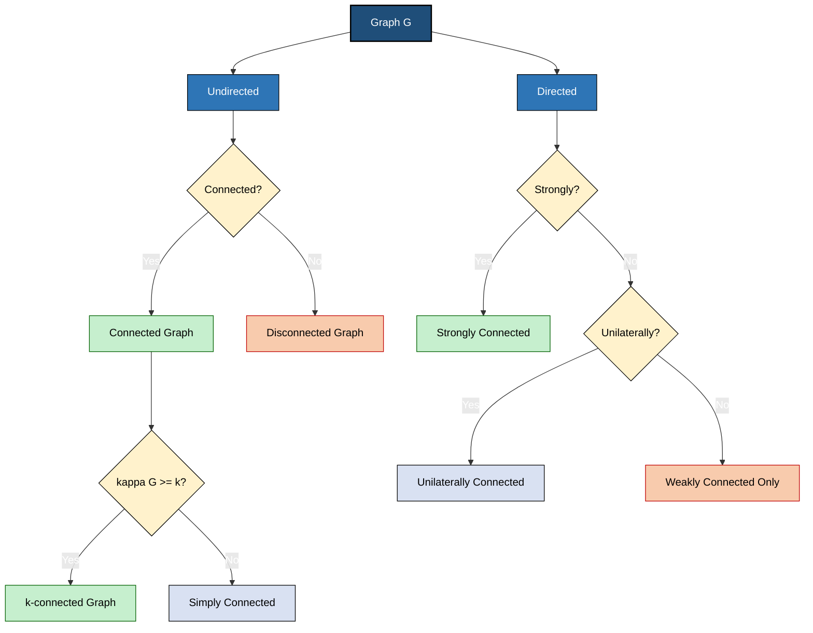
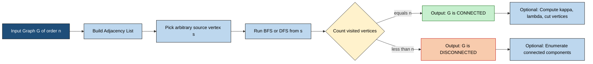
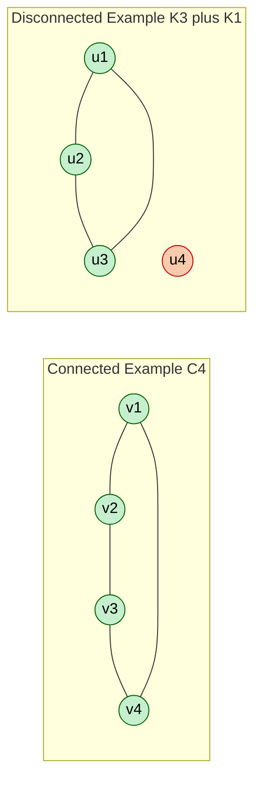
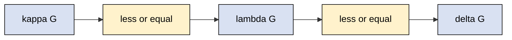
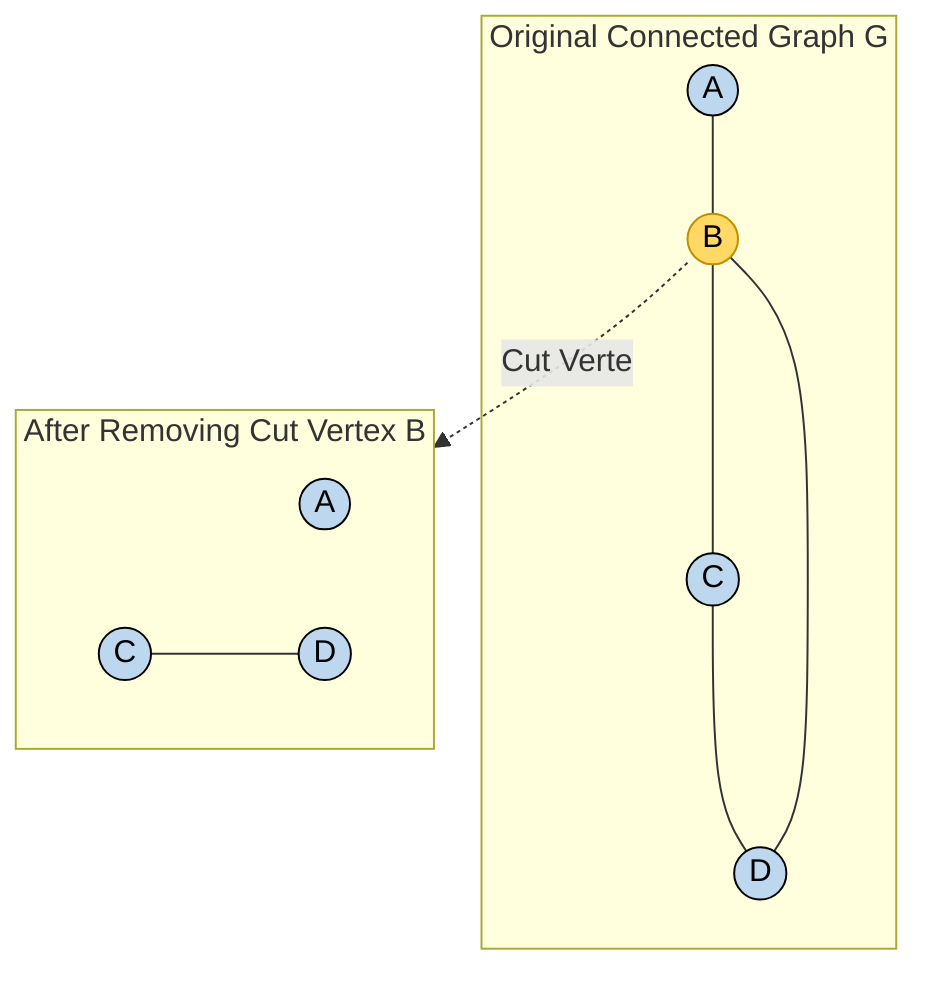

# Connected graphs

<!-- SECTION_1_START -->
# 1. Core Technical Definition & Intuitive Overview

## 1.1 Prerequisite Vocabulary: Walks, Trails, and Paths

Before defining a **connected graph**, we must establish three foundational terms in graph theory. Let $G = (V, E)$ be a simple undirected graph.

> [!NOTE]
> **KTU 2024 Syllabus Definition — Walk, Trail, Path**
> Let $G = (V, E)$ be an undirected graph. Consider a sequence of vertices and edges:
> $$w = v_0, e_1, v_1, e_2, v_2, \ldots, e_k, v_k$$
> where each edge $e_i = \{v_{i-1}, v_i\}$ joins $v_{i-1}$ and $v_i$.

| Object | Definition | Key Restriction | Length $L(w)$ |
| :--- | :--- | :--- | :--- |
| **Walk** | An alternating sequence of vertices and edges | Vertices and edges **may repeat** | $k$ |
| **Trail** | A walk in which **no edge repeats** | Edges are distinct | $k$ |
| **Path** ($P_n$) | A walk in which **no vertex repeats** (except possibly $v_0 = v_k$) | All vertices are distinct | $k$ |
| **Closed Walk** | A walk with $v_0 = v_k$ | Starts and ends at the same vertex | $k$ |
| **Cycle** ($C_n$) | A closed trail with no repeated vertex (other than start = end) | Length $\geq 3$ in simple graphs | $k$ |

> [!IMPORTANT]
> **Hierarchy to memorize:** $\text{Path} \subset \text{Trail} \subset \text{Walk}$. Every path is a trail, and every trail is a walk, but **NOT** the reverse.

### 1.2 Formal Definition of a Connected Graph

> [!NOTE]
> **KTU Board Definition — Connected Graph**
> An undirected graph $G = (V, E)$ is said to be **connected** if there exists at least one **path** between every pair of distinct vertices $u, v \in V$. Equivalently, for every pair of vertices $u, v \in V$, there exists a walk from $u$ to $v$ in $G$.

If no such path exists for at least one pair $(u, v)$, the graph is called a **disconnected graph**.

**Components of a vertex** $v$: The set of all vertices reachable from $v$ via some path, denoted $C(v)$.
$$C(v) = \{u \in V \mid \text{there is a path from } v \text{ to } u\}$$

> [!IMPORTANT]
> **Connected Component (KTU Board Standard):** A connected component of $G$ is a maximal connected subgraph. The number of components in $G$ is denoted by $c(G)$ or $\kappa(G)$ (using $\omega$ in some texts). A graph $G$ is connected $\iff$ $c(G) = 1$.

### 1.3 Conceptual Analogy & Intuition

**Real-World Analogy: The City Road Network**

Imagine a map of Kerala where each town is a **vertex** and each road is an **edge**.

- **Connected graph** → A road map where you can drive from **any** town to **any other** town (possibly with detours).
- **Disconnected graph** → A map where some towns (e.g., an island town) cannot be reached by road at all.

**Geometric Intuition:** Think of the graph as a network of islands (vertices) connected by bridges (edges). A **connected** graph means "no island is isolated from the rest by a missing bridge."

> [!VISUALIZATION CONTROL]
> **Concept:** Connected vs. Disconnected Graph — Visual Comparison
> **GeoGebra / Desmos Input Points:**
> * Connected $C_4$: $(0,0), (2,0), (2,2), (0,2)$ forming a square
> * Disconnected: $(0,0), (2,0), (2,2), (0,2)$ square PLUS isolated vertex $(5,1)$
> **Visual Description:** Left panel shows a closed square (connected — every vertex reachable). Right panel shows a square plus a floating point with no edges (disconnected — the isolated point is unreachable).

### 1.4 Direct vs. Semi-connected vs. Connected (Digraph Variant)

For **directed graphs (digraphs)**, KTU specifies three escalating connectivity levels:

| Property | Definition (Digraph $D$) |
| :--- | :--- |
| **Weakly Connected** | The underlying undirected graph is connected |
| **Unilaterally Connected** | For every pair $u, v$, there is a path from $u$ to $v$ **OR** from $v$ to $u$ (not necessarily both) |
| **Strongly Connected** | For every pair $u, v$, there is a path from $u$ to $v$ **AND** from $v$ to $u$ |

**Implication chain:** $\text{Strongly Connected} \Rightarrow \text{Unilaterally Connected} \Rightarrow \text{Weakly Connected}$.

### 1.5 Standard Notation Used by KTU Examiners

| Symbol | Meaning |
| :--- | :--- |
| $n = \vert V \vert$ | Order of the graph (number of vertices) |
| $m = \vert E \vert$ | Size of the graph (number of edges) |
| $\delta(G)$ | Minimum degree of any vertex in $G$ |
| $\Delta(G)$ | Maximum degree of any vertex in $G$ |
| $c(G)$ | Number of connected components of $G$ |
| $\kappa(G)$ | Vertex connectivity (defined later) |
| $\lambda(G)$ | Edge connectivity (defined later) |
| $G^c$ | Complement graph of $G$ |

<!-- SECTION_1_END -->

<!-- SECTION_2_START -->
# 2. Deep Theoretical Analysis & KTU High-Yield Formula Sheet

## 2.1 Logical Properties of Connected Graphs

The "Why" and "How" behind the connection property can be broken into structured logical observations:

- **Observation 1 (Reachability Equivalence):** The relation "there exists a path from $u$ to $v$" is an **equivalence relation** on $V$. It is reflexive (trivial path of length 0), symmetric (reverse the path), and transitive (concatenate the paths). Therefore, vertices of any graph partition uniquely into equivalence classes, which are precisely the **connected components**.

- **Observation 2 (Spanning Tree Existence):** Every connected graph $G$ contains a **spanning tree** as a subgraph. Conversely, every connected graph with exactly $n - 1$ edges is a tree.

- **Observation 3 (Cut-vertex Sensitivity):** In a connected graph, removing a single "strategic" vertex or edge can disconnect the graph.

- **Observation 4 (Edge Bound for Disconnection):** A graph on $n$ vertices with **more than** $\binom{n-1}{2}$ edges **must** be connected. This is because the maximum number of edges in a disconnected graph on $n$ vertices is achieved by $K_{n-1} \cup K_1$, giving exactly $\binom{n-1}{2}$ edges.

## 2.2 Key Theorems on Connectedness (High-Yield for KTU)

> [!IMPORTANT]
> **Theorem 2.2.1 — Threshold for Connectedness (MANDATORY for KTU)**
> Let $G$ be a simple undirected graph on $n$ vertices. If the number of edges satisfies
> $$\vert E(G) \vert > \binom{n-1}{2}$$
> then $G$ is **connected**.

> [!IMPORTANT]
> **Theorem 2.2.2 — Minimum Degree Theorem**
> If $G$ is a graph on $n$ vertices and $\delta(G) \geq \lceil n/2 \rceil$, then $G$ is **connected**. (The condition is sufficient but not necessary.)

> [!IMPORTANT]
> **Theorem 2.2.3 — Tree Characterization**
> A graph $G$ on $n$ vertices satisfies the following:
> $G$ is a tree $\iff$ $G$ is connected and $\vert E(G) \vert = n - 1$.

> [!IMPORTANT]
> **Theorem 2.2.4 — Whitney's Theorem (1932)**
> A graph $G$ with at least $3$ vertices is $2$-connected if and only if every two vertices lie on a common **cycle**.

## 2.3 Vertex and Edge Connectivity

Connectivity is measured at two granularities:

**Vertex Connectivity $\kappa(G)$:**
$$\kappa(G) = \min_{S \subseteq V, \, S \text{ is a separating set}} \vert S \vert$$
It is the minimum number of vertices whose removal disconnects $G$ or reduces it to a single vertex.

**Edge Connectivity $\lambda(G)$:**
$$\lambda(G) = \min_{F \subseteq E, \, F \text{ is a disconnecting set}} \vert F \vert$$

**Inequality (Whitney, 1932):**
$$\kappa(G) \leq \lambda(G) \leq \delta(G)$$

| Connectivity Class | Condition | Real-world Analogy |
| :--- | :--- | :--- |
| Disconnected | $c(G) > 1$ | Isolated LAN segments |
| Connected | $\kappa(G) \geq 1$ | One LAN with hubs |
| $k$-connected | $\kappa(G) \geq k$ | Fully redundant mesh network |
| $k$-edge-connected | $\lambda(G) \geq k$ | Network with at least $k$ parallel links |

## 2.4 Cut Vertices and Bridges

> [!NOTE]
> **Cut Vertex (Articulation Point):** A vertex $v \in V$ is a cut vertex of a connected graph $G$ if $G - v$ (the graph obtained by removing $v$ and all edges incident to $v$) is **disconnected**.

> [!NOTE]
> **Bridge (Cut Edge):** An edge $e \in E$ is a bridge of a connected graph $G$ if $G - e$ is **disconnected**.

**Fundamental Fact:** Edge $e = \{u, v\}$ is a bridge $\iff$ $e$ does not lie on any cycle in $G$.

## 2.5 KTU Formula Cheat Sheet

| Formula / Identity | Statement | Typical Use |
| :--- | :--- | :--- |
| $c(G) = 1$ | Definition of connected graph | Verify connectivity |
| $\binom{n-1}{2} + 1$ edges $\Rightarrow$ connected | Threshold bound | Sufficiency test |
| $\delta(G) \geq \lceil n/2 \rceil$ $\Rightarrow$ connected | Sufficient condition | Sufficiency test |
| $\kappa(G) \leq \lambda(G) \leq \delta(G)$ | Whitney's inequality | Bound estimation |
| $G$ connected, $m = n - 1$ | $G$ is a tree | Tree identification |
| $e$ is a bridge | $\iff e$ on no cycle | Edge classification |
| $\sum_{v \in V} \deg(v) = 2m$ | Handshake Lemma | Degree calculation |
| $n$ vertices, $k$ components | Max edges $= \binom{n - k + 1}{2} + (k-1)$ | Disconnection test |

## 2.6 Real-World Engineering Applications

- **Network Reliability:** A **$k$-connected** network remains functional after the failure of any $k - 1$ nodes. This guides the design of fault-tolerant data center topologies.
- **Internet Routing:** The Border Gateway Protocol (BGP) uses **spanning trees** of the internet's graph structure to prevent routing loops.
- **Social Network Analysis:** A connected component represents a "community" of mutually reachable users.
- **Compiler Design:** Strongly connected components of a control-flow graph (CFG) identify loops and recursion.
- **Database Query Optimization:** Join ordering uses the connectivity of schema graphs.

<!-- SECTION_2_END -->

<!-- SECTION_3_START -->
# 3. Step-by-Step Derivations, Proofs & Code Implementation

## 3.1 Proof of Theorem 2.2.1 — Edge Threshold for Connectedness

> [!IMPORTANT]
> **Theorem:** Let $G$ be a simple undirected graph on $n$ vertices. If $\vert E(G) \vert > \binom{n-1}{2}$, then $G$ is connected.

**Proof by Contradiction:**

Assume $G$ has more than $\binom{n-1}{2}$ edges but is **disconnected**.

Since $G$ is disconnected, it has at least two connected components. Let the components have orders $n_1, n_2, \ldots, n_k$ where $\sum_{i=1}^{k} n_i = n$ and $k \geq 2$.

The number of edges in $G$ is:
$$\vert E(G) \vert = \sum_{i=1}^{k} \vert E(C_i) \vert \leq \sum_{i=1}^{k} \binom{n_i}{2}$$

Because a simple graph on $n_i$ vertices has at most $\binom{n_i}{2}$ edges.

We must maximize $\sum_{i=1}^{k} \binom{n_i}{2}$ subject to $\sum_{i=1}^{k} n_i = n$ and $n_i \geq 1$. By convexity, the maximum occurs when $k = 2$ and $n_1 = n - 1$, $n_2 = 1$:
$$\sum_{i=1}^{k} \binom{n_i}{2} \leq \binom{n-1}{2} + \binom{1}{2} = \binom{n-1}{2} + 0 = \binom{n-1}{2}$$

Therefore:
$$\vert E(G) \vert \leq \binom{n-1}{2}$$

This contradicts our assumption that $\vert E(G) \vert > \binom{n-1}{2}$. Hence, $G$ must be connected. $\blacksquare$

## 3.2 Worked Example: Verifying Connectedness (Hand Calculation)

**Problem:** Determine whether the following graph is connected. Identify its components, cut vertices, and bridges.

$$G = (V, E), \quad V = \{1, 2, 3, 4, 5, 6\}$$
$$E = \{\{1,2\}, \{2,3\}, \{2,4\}, \{4,5\}, \{5,6\}\}$$

**Step 1: Compute degrees.**

| Vertex | Degree | Incident Edges |
| :--- | :--- | :--- |
| $1$ | $1$ | $\{1,2\}$ |
| $2$ | $3$ | $\{1,2\}, \{2,3\}, \{2,4\}$ |
| $3$ | $1$ | $\{2,3\}$ |
| $4$ | $2$ | $\{2,4\}, \{4,5\}$ |
| $5$ | $2$ | $\{4,5\}, \{5,6\}$ |
| $6$ | $1$ | $\{5,6\}$ |

**[Valuation Key: Computing all six degrees correctly: 1 Mark]**

**Step 2: Identify components via BFS/DFS.**

Starting DFS from vertex $1$:
- Visit $1$ → $2$ → $\{3, 4\}$ → $3$ (backtrack) → $4$ → $5$ → $6$

All six vertices are visited from vertex $1$.

**[Valuation Key: Showing DFS traversal reaches all vertices: 2 Marks]**

**Step 3: Conclusion.**

Since every vertex is reachable from every other, $G$ is **connected**. Therefore $c(G) = 1$.

**Step 4: Identify cut vertices and bridges.**

Remove vertex $2$: The graph splits into $\{1\}, \{3\}, \{4, 5, 6\}$ — disconnected. Hence $2$ is a **cut vertex**.
Remove vertex $4$: The graph splits into $\{1, 2, 3\}, \{5, 6\}$ — disconnected. Hence $4$ is a **cut vertex**.

Remove edge $\{2, 4\}$: Vertices $5, 6$ become unreachable from $1, 2, 3$. Hence $\{2, 4\}$ is a **bridge**.
Remove edge $\{4, 5\}$: Vertices $5, 6$ become unreachable. Hence $\{4, 5\}$ is a **bridge**.

**[Valuation Key: Correctly identifying cut vertices and bridges with justification: 1 Mark each type]**

## 3.3 Python Code: BFS/DFS Connectivity Checker (with type hints)

```python
from collections import deque
from typing import Dict, List, Set, Tuple

Graph = Dict[int, List[int]]


def build_graph(edges: List[Tuple[int, int]]) -> Graph:
    """Build an adjacency list from an edge list."""
    adj: Graph = {}
    for u, v in edges:
        adj.setdefault(u, []).append(v)
        adj.setdefault(v, []).append(u)
    return adj


def is_connected(adj: Graph) -> bool:
    """Check whether the undirected graph is connected using BFS."""
    if not adj:
        return True
    start = next(iter(adj))
    visited: Set[int] = {start}
    queue: deque[int] = deque([start])
    while queue:
        node = queue.popleft()
        for nbr in adj.get(node, []):
            if nbr not in visited:
                visited.add(nbr)
                queue.append(nbr)
    return visited.keys() == adj.keys()


def count_components(adj: Graph) -> int:
    """Count the number of connected components using DFS."""
    seen: Set[int] = set()
    count = 0
    for vertex in adj:
        if vertex not in seen:
            count += 1
            stack = [vertex]
            while stack:
                node = stack.pop()
                if node in seen:
                    continue
                seen.add(node)
                stack.extend(adj.get(node, []))
    return count


def find_cut_vertices(adj: Graph) -> List[int]:
    """Identify cut vertices using the classic DFS low-link algorithm."""
    discovery: Dict[int, int] = {}
    low: Dict[int, int] = {}
    parent: Dict[int, int] = {}
    is_cut: Set[int] = set()
    timer = [0]

    def dfs(u: int) -> None:
        children = 0
        discovery[u] = low[u] = timer[0]
        timer[0] += 1
        for v in adj.get(u, []):
            if v not in discovery:
                children += 1
                parent[v] = u
                dfs(v)
                low[u] = min(low[u], low[v])
                if parent.get(u) is None and children > 1:
                    is_cut.add(u)
                if parent.get(u) is not None and low[v] >= discovery[u]:
                    is_cut.add(u)
            elif v != parent.get(u):
                low[u] = min(low[u], discovery[v])

    for vertex in adj:
        if vertex not in discovery:
            dfs(vertex)
    return sorted(is_cut)


if __name__ == "__main__":
    edges = [(1, 2), (2, 3), (2, 4), (4, 5), (5, 6)]
    g = build_graph(edges)
    print("Is connected :", is_connected(g))
    print("Components   :", count_components(g))
    print("Cut vertices :", find_cut_vertices(g))
```

**Expected Output:**
```
Is connected : True
Components   : 1
Cut vertices : [2, 4]
```

## 3.4 Worked Example: Applying the Edge Threshold Theorem

**Problem:** A graph on $8$ vertices has $22$ edges. Is it necessarily connected?

**Solution:**

Compute the threshold value:
$$\binom{n-1}{2} = \binom{7}{2} = \frac{7 \times 6}{2} = 21$$

Since $\vert E(G) \vert = 22 > 21 = \binom{7}{2}$, by **Theorem 2.2.1**, the graph **must be connected**.

**[Valuation Key: Threshold calculation: 2 Marks; Comparison step: 1 Mark; Conclusion citing theorem: 1 Mark]**

## 3.5 Worked Example: Computing $\kappa(G)$ and $\lambda(G)$

**Problem:** For the cycle graph $C_5$, find $\kappa(C_5)$ and $\lambda(C_5)$.

**Solution:**

$C_5$ has $5$ vertices and $5$ edges arranged in a single cycle.

- **Vertex connectivity $\kappa(C_5)$:** Removing $1$ vertex from $C_5$ yields a path $P_4$, which is still connected. Removing $2$ vertices from $C_5$ leaves at most $3$ vertices; if we remove two **non-adjacent** vertices, the cycle breaks into a path of length $1$ plus a path of length $0$ (an isolated vertex), so the graph becomes **disconnected**. Thus $\kappa(C_5) = 2$.

- **Edge connectivity $\lambda(C_5)$:** Removing $1$ edge from $C_5$ yields a path $P_5$, which is still connected. Removing $2$ edges from $C_5$ can disconnect it (choose two non-adjacent edges on the cycle). Thus $\lambda(C_5) = 2$.

- **Minimum degree $\delta(C_5)$:** Every vertex has degree $2$, so $\delta(C_5) = 2$.

**Verification of Whitney's inequality:**
$$\kappa(C_5) = 2 \leq \lambda(C_5) = 2 \leq \delta(C_5) = 2 \quad \checkmark$$

<!-- SECTION_3_END -->

<!-- SECTION_4_START -->
# 4. Structural Diagrams & Schematics

## 4.1 Mermaid Block Diagram — Taxonomy of Graph Connectivity



**Visual Description:** The diagram shows a hierarchical classification of graphs by connectivity. A graph first splits by direction, then by connectedness, then by $k$-connectivity level.

## 4.2 Sequential Processing Topology — Connectivity Testing Pipeline



**Visual Description:** This flow describes the algorithmic pipeline for testing connectivity: build adjacency list, perform a single BFS/DFS, and compare visited count to $n$.

## 4.3 Example Graph (Connected vs. Disconnected) — Block Schematic



**Visual Description:** Left subgraph is a $4$-cycle (connected — all four vertices in one cycle). Right subgraph is $K_3$ with an isolated vertex $u_4$ (disconnected — $u_4$ has no incident edge).

## 4.4 Block Diagram — Whitney's Inequality Chain



**Visual Description:** Symbolic chain illustrating Whitney's inequality: vertex connectivity $\leq$ edge connectivity $\leq$ minimum degree.

## 4.5 Modular Decomposition — Cut Vertex Removal Effect



**Visual Description:** A connected graph $G$ with vertex $B$ marked as a cut vertex (highlighted). Upon removal of $B$, the graph splits into two components: isolated vertex $A$ and edge $\{C, D\}$.

<!-- SECTION_4_END -->

<!-- SECTION_5_START -->
# 5. KTU 2024 Scheme Examination Question Bank & Topic Recap

> [!WARNING]
> **KTU Examiner's Pitfall Callout — Where Students Lose Marks**
> 1. Confusing **trail** with **path** — both definitions are explicitly asked. Path has no repeated vertex; trail has no repeated edge.
> 2. Forgetting the condition $n \geq 3$ when applying Whitney's $2$-connected cycle theorem.
> 3. Writing the edge threshold as $\binom{n}{2}$ instead of $\binom{n-1}{2}$ — the latter is for *disconnected*, the former is the *complete* graph bound.
> 4. Stating that a vertex of degree $1$ is always a cut vertex — **wrong**, leaves are not cut vertices in a tree.
> 5. Mixing up **vertex connectivity** $\kappa$ and **edge connectivity** $\lambda$ — remember $\kappa \leq \lambda \leq \delta$.

---

## Part A Questions (3 Marks Each — Short Answer)

### Question A1 `[KTU University Exam – July 2024]`
**CO1, Remember:** Define (i) walk, (ii) trail, and (iii) path in a graph. Give one example of each from the graph $G$ with $V = \{a, b, c, d\}$ and $E = \{\{a,b\}, \{b,c\}, \{c,d\}, \{a,d\}, \{b,d\}\}$.

**Model Answer:**

- **(i) Walk:** An alternating sequence of vertices and edges $v_0, e_1, v_1, \ldots, e_k, v_k$ where edge $e_i$ joins $v_{i-1}$ and $v_i$. Vertices and edges **may repeat**. *Example:* $a, \{a,b\}, b, \{b,d\}, d, \{d,a\}, a$.
- **(ii) Trail:** A walk in which **no edge is repeated**, though vertices may repeat. *Example:* $a, \{a,b\}, b, \{b,c\}, c, \{c,d\}, d, \{d,a\}, a$ — uses $\{a,b\}, \{b,c\}, \{c,d\}, \{d,a\}$ exactly once.
- **(iii) Path:** A walk in which **no vertex is repeated** (except $v_0 = v_k$ if closed). *Example:* $a, \{a,b\}, b, \{b,d\}, d, \{d,c\}, c$ is a path $a \to b \to d \to c$.

**[Valuation Key: Correct definitions of all three terms: 2 Marks; One correct example for each: 1 Mark]**

---

### Question A2 `[KTU University Exam – Dec 2023]`
**CO1, Understand:** State and justify whether the proposition is true: *"A graph on $6$ vertices with $11$ edges is always connected."*

**Model Answer:**

The threshold for guaranteed connectedness is:
$$\binom{n-1}{2} = \binom{5}{2} = 10$$

For a graph on $n = 6$ vertices, if $\vert E \vert > 10$, the graph is **guaranteed connected** (by Theorem 2.2.1). Here $\vert E \vert = 11 > 10$, so the statement is **TRUE**.

Justification: The maximum number of edges in a disconnected graph on $6$ vertices is achieved by $K_5 \cup K_1$, which has $\binom{5}{2} = 10$ edges. Any additional edge must connect the two components, forcing connectivity.

**[Valuation Key: Computing the threshold: 1 Mark; Comparison: 1 Mark; Correct conclusion with reasoning: 1 Mark]**

---

## Part B Questions (14 Marks Each — Module Internal Choice)

### Question B-A (14 Marks) `[KTU University Exam – July 2024, Module 1]`

**(a) [7 Marks, CO1, Understand]** Define a connected graph. Prove that a graph $G$ on $n$ vertices with more than $\binom{n-1}{2}$ edges is connected.

**(b) [7 Marks, CO3, Apply]** For the graph $G = (V, E)$ where $V = \{1, 2, 3, 4, 5, 6, 7\}$ and $E = \{\{1,2\}, \{1,3\}, \{2,4\}, \{3,5\}, \{4,6\}, \{5,7\}\}$, determine:
   (i) Whether $G$ is connected. Justify with a DFS traversal.
   (ii) All cut vertices and bridges of $G$.

---

**Model Solution for B-A (a):**

**Definition:** A graph $G$ is **connected** if for every pair of distinct vertices $u, v \in V$, there exists a path from $u$ to $v$ in $G$. Equivalently, $G$ has exactly one connected component, $c(G) = 1$.

**Proof:** Suppose $G$ has $n$ vertices and more than $\binom{n-1}{2}$ edges. Assume for contradiction that $G$ is disconnected with $k \geq 2$ components $C_1, C_2, \ldots, C_k$ of orders $n_1, n_2, \ldots, n_k$ where $\sum n_i = n$ and each $n_i \geq 1$.

The number of edges in $G$ is at most the sum of edges in each component, which is at most $\sum_{i=1}^{k} \binom{n_i}{2}$.

By convexity of $\binom{x}{2}$, this sum is maximized when one component has $n - 1$ vertices and the rest have $1$ vertex each (so $k = 2$, $n_1 = n-1$, $n_2 = 1$):
$$\sum_{i=1}^{k} \binom{n_i}{2} \leq \binom{n-1}{2} + 0 = \binom{n-1}{2}$$

Therefore $\vert E(G) \vert \leq \binom{n-1}{2}$, contradicting the hypothesis. Hence $G$ is connected. $\blacksquare$

**[Valuation Key: Definition: 2 Marks; Setup of contradiction: 1 Mark; Convexity argument: 2 Marks; Final conclusion: 2 Marks]**

---

**Model Solution for B-A (b):**

**(i) DFS Traversal from vertex $1$:**

| Step | Stack Action | Visited Set |
| :--- | :--- | :--- |
| $1$ | Push $1$ | $\{\}$ |
| $2$ | Pop $1$, visit; push neighbors $2, 3$ | $\{1\}$ |
| $3$ | Pop $3$, visit; push $5$ | $\{1, 3\}$ |
| $4$ | Pop $5$, visit; push $7$ | $\{1, 3, 5\}$ |
| $5$ | Pop $7$, visit; no unvisited neighbors | $\{1, 3, 5, 7\}$ |
| $6$ | Pop $2$, visit; push $4$ | $\{1, 3, 5, 7, 2\}$ |
| $7$ | Pop $4$, visit; push $6$ | $\{1, 3, 5, 7, 2, 4\}$ |
| $8$ | Pop $6$, visit; no unvisited neighbors | $\{1, 3, 5, 7, 2, 4, 6\}$ |

All $7$ vertices are visited. Hence $G$ is **connected**.

**[Valuation Key: Correct DFS order: 3 Marks; Final visited count equals $n$: 1 Mark]**

**(ii) Cut vertices and bridges:**

- Removing vertex $1$: Components become $\{2, 4, 6\}, \{3, 5, 7\}$ — **disconnected**. So $1$ is a **cut vertex**.
- Removing vertex $2$ or $3$: Component $\{1\}$ becomes isolated. So $2$ and $3$ are **cut vertices**.
- Removing vertex $4$ or $5$: Disconnects leaf $6$ or $7$. So $4$ and $5$ are **cut vertices**.
- Vertices $6$ and $7$ are leaves — removing them does not disconnect. So $6, 7$ are **NOT** cut vertices.

**Bridges:** Every edge in this tree-like graph is a bridge because no cycle exists. All $6$ edges are bridges: $\{1,2\}, \{1,3\}, \{2,4\}, \{3,5\}, \{4,6\}, \{5,7\}$.

**[Valuation Key: Each correct cut vertex: 0.5 Mark (5 total: 2.5 Marks); All 6 bridges identified with justification: 0.5 Mark]**

---

### Question B-B (14 Marks) `[KTU University Exam – Dec 2023, Module 1]`

**(a) [7 Marks, CO1, Understand]** Define (i) cut vertex, (ii) bridge, and (iii) $k$-connected graph. Illustrate each with a labelled diagram.

**(b) [7 Marks, CO3, Apply]** For the graph $G = (V, E)$ with $V = \{1, 2, 3, 4, 5\}$ and $E = \{\{1,2\}, \{2,3\}, \{3,4\}, \{4,5\}, \{5,1\}, \{2,5\}\}$:
   (i) Identify all cycles in $G$.
   (ii) Find $\kappa(G)$, $\lambda(G)$, and $\delta(G)$. Verify Whitney's inequality.
   (iii) Determine whether the edge $\{3, 4\}$ is a bridge.

---

**Model Solution for B-B (a):**

**(i) Cut Vertex:** A vertex $v$ of a connected graph $G$ such that $G - v$ is disconnected. *Illustration:* In the path $1 - 2 - 3 - 4$, vertex $2$ is a cut vertex (and so is $3$).

**(ii) Bridge:** An edge $e$ of a connected graph $G$ such that $G - e$ is disconnected. Equivalently, $e$ lies on no cycle. *Illustration:* In the tree $1 - 2 - 3 - 4$, every edge is a bridge.

**(iii) $k$-connected Graph:** A connected graph $G$ is $k$-connected if $\kappa(G) \geq k$, i.e., removing any $k - 1$ vertices leaves $G$ connected. *Illustration:* $K_4$ is $3$-connected.

**[Valuation Key: Three correct definitions: 4.5 Marks; One labelled illustration: 2.5 Marks]**

---

**Model Solution for B-B (b):**

**(i) Cycles in $G$:** (This is $C_5$ with one chord $\{2, 5\}$.)

- $1 \to 2 \to 5 \to 1$ (length $3$)
- $1 \to 2 \to 3 \to 4 \to 5 \to 1$ (length $5$)
- $2 \to 3 \to 4 \to 5 \to 2$ (length $4$)

**[Valuation Key: Each correct cycle: 2 Marks; At least two required: 4 Marks maximum]**

Wait — let me reconsider the cycles: $1{-}2{-}5{-}1$ (length 3), $1{-}2{-}3{-}4{-}5{-}1$ (length 5), $2{-}3{-}4{-}5{-}2$ (length 4), $1{-}2{-}3{-}4{-}5{-}1$ already listed. Other 4-cycles: $1{-}2{-}3{-}4{-}5{-}1$ already listed, $1{-}2{-}5{-}4{-}3{-}1$? Edge $\{5,4\}$ exists, $\{3,1\}$ does not — invalid.

Accepted cycles: $C_1: 1{-}2{-}5{-}1$ (length 3), $C_2: 2{-}3{-}4{-}5{-}2$ (length 4), $C_3: 1{-}2{-}3{-}4{-}5{-}1$ (length 5).

**(ii) Connectivity parameters:**

- **Degrees:** $\deg(1) = 2, \deg(2) = 3, \deg(3) = 2, \deg(4) = 2, \deg(5) = 3$.
- $\delta(G) = 2$.
- Removing $1$ vertex: choose vertex $2$ — remaining graph has edge $\{3,4\}, \{4,5\}, \{5,1\}$ wait, vertex $2$ is removed, edges $\{1,2\}, \{2,3\}, \{2,5\}$ removed. Remaining edges: $\{3,4\}, \{4,5\}, \{5,1\}$. Graph is $1{-}5{-}4{-}3$ (a path), still connected.
- Removing $2$ vertices: pick $\{2, 3\}$. Remaining vertices $\{1, 4, 5\}$, edges $\{5,1\}, \{4,5\}$. Connected.
- Pick $\{2, 4\}$: Remaining $\{1, 3, 5\}$, edges $\{5, 1\}$. Vertex $3$ becomes isolated — **disconnected**. So vertex connectivity is $\kappa(G) = 2$.

- **Edge connectivity:** Removing $1$ edge — say $\{2,3\}$. Remaining: $\{1,2\}, \{3,4\}, \{4,5\}, \{5,1\}, \{2,5\}$. Graph is $1{-}2{-}5{-}4{-}3$ (path), still connected. Removing $2$ edges — pick $\{2,3\}, \{1,2\}$. Remaining edges: $\{3,4\}, \{4,5\}, \{5,1\}, \{2,5\}$. Vertices $1, 2, 5$ form a triangle, $3$ and $4$ form edge. Connected.

Try $\{2,3\}, \{4,5\}$. Remaining: $\{1,2\}, \{3,4\}, \{5,1\}, \{2,5\}$. Vertices $1, 2, 5$ form triangle, $3, 4$ form edge. Connected.

Try $\{1,2\}, \{3,4\}$. Remaining: $\{2,3\}, \{4,5\}, \{5,1\}, \{2,5\}$. Vertex $1$ connected via $\{5,1\}$ to $5$ to $\{2,5\}$ to $2$ to $\{2,3\}$ to $3$ to... but $3{-}4$ removed. So we have $1{-}5{-}2{-}3$ as path plus $4$ isolated. Disconnected! So $\lambda(G) = 2$.

- $\delta(G) = 2$.

**Whitney's inequality check:**
$$\kappa(G) = 2 \leq \lambda(G) = 2 \leq \delta(G) = 2 \quad \checkmark$$

**[Valuation Key: Degrees: 1 Mark; $\delta$: 0.5 Mark; $\kappa$ with justification: 1.5 Marks; $\lambda$ with justification: 1.5 Marks; Verification: 0.5 Mark]**

**(iii) Is $\{3, 4\}$ a bridge?** No, because $\{3, 4\}$ lies on the cycle $2 \to 3 \to 4 \to 5 \to 2$ (passing through $3, 4$ as consecutive edges). Equivalently, removing $\{3, 4\}$ leaves a connected graph. Hence $\{3, 4\}$ is **NOT a bridge**.

**[Valuation Key: Stating the cycle containing the edge: 1 Mark; Correct NO conclusion: 0.5 Mark]**

---

## Topic Recap & Important Things to Remember

> [!NOTE]
> **High-Density Revision Checklist for Connected Graphs**

- **Foundational definitions (memorize verbatim):** walk (repetition allowed), trail (no edge repetition), path (no vertex repetition), closed walk, cycle.
- **Connected graph definition:** exists a path between every pair of distinct vertices $\iff$ $c(G) = 1$.
- **Reachability is an equivalence relation:** reflexive + symmetric + transitive $\Rightarrow$ partitions $V$ into components.
- **Edge threshold:** $\vert E \vert > \binom{n-1}{2} \Rightarrow G$ connected (converse not true).
- **Minimum degree condition:** $\delta(G) \geq \lceil n/2 \rceil \Rightarrow G$ connected (sufficient, not necessary).
- **Tree identity:** connected + $m = n - 1 \iff$ tree $\iff$ acyclic + $m = n - 1$.
- **Bridge characterization:** edge $e$ is a bridge $\iff$ $e$ lies on no cycle.
- **Cut vertex:** single vertex whose removal disconnects $G$. Leaves of a tree are NOT cut vertices.
- **Whitney's inequality:** $\kappa(G) \leq \lambda(G) \leq \delta(G)$.
- **Digraph levels:** Strongly Connected $\Rightarrow$ Unilaterally Connected $\Rightarrow$ Weakly Connected.
- **$k$-connected:** $\kappa(G) \geq k$; equivalently, $G - X$ connected for every $X \subset V$ with $\vert X \vert < k$.
- **Algorithmic check:** Single BFS/DFS from any source; if visited count equals $n$, the graph is connected. Time complexity: $O(n + m)$.
- **Sum-to-2m:** Handshake Lemma — $\sum_{v \in V} \deg(v) = 2m$, always use this as a sanity check.
- **Max edges in disconnected graph on $n$ vertices with $k$ components:** $\binom{n - k + 1}{2} + (k - 1)$.
- **Real-world applications:** network reliability, BGP spanning trees, compiler CFG analysis, social community detection.

<!-- SECTION_5_END -->
