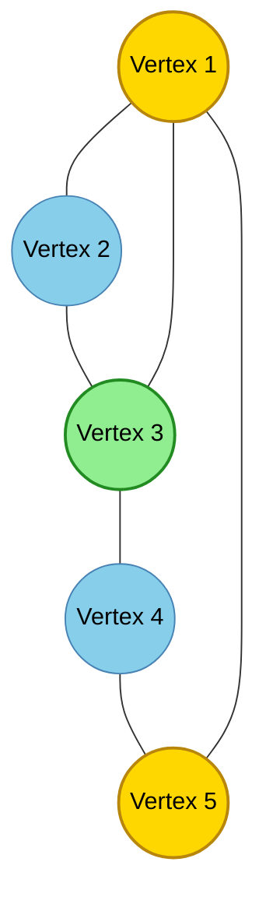
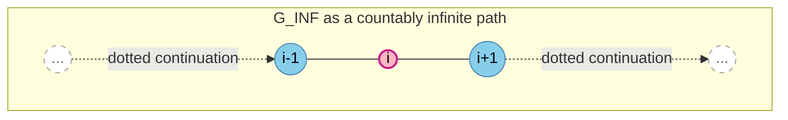
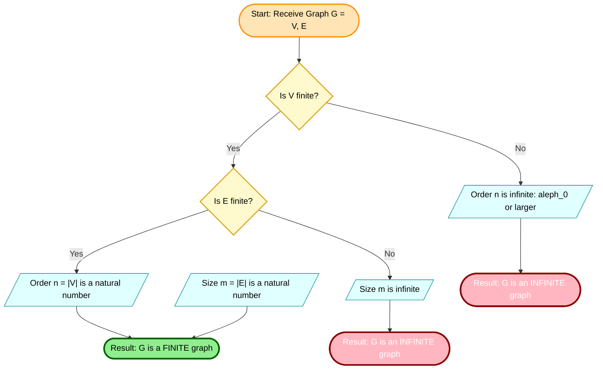
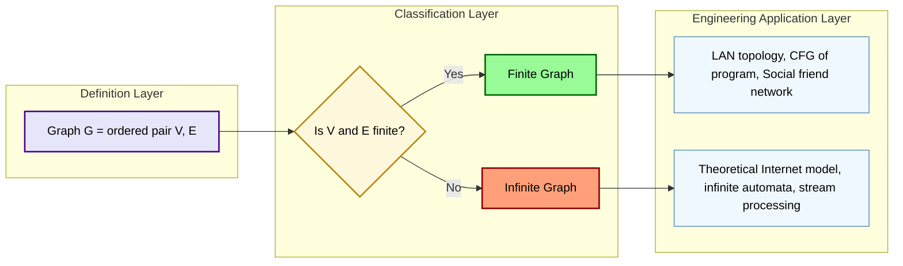

# finite and infinite graphs

<!-- SECTION_1_START -->

# Finite and Infinite Graphs — Foundational Definition

## 1.1 Formal Academic Definition (KTU 2024 Syllabus)

> [!NOTE]
> **Core Definition (Graph)**
> A **graph** $G$ is an ordered pair of sets $G = (V, E)$, where:
> - $V$ is a non-empty set of elements called **vertices** (also called *nodes* or *points*).
> - $E$ is a set of unordered or ordered pairs of distinct elements of $V$, called **edges** (also called *arcs* or *lines*).

The set $V$ is called the **vertex set** of $G$, and $E$ is the **edge set** of $G$. We denote them as $V(G)$ and $E(G)$ respectively.

---

## 1.2 Classification: Finite vs Infinite Graphs

> [!IMPORTANT]
> **Classification Criterion**
> A graph $G = (V, E)$ is classified purely by the **cardinality** of its vertex set $V$ and edge set $E$.

| Property | Finite Graph $G$ | Infinite Graph $G$ |
| :--- | :--- | :--- |
| Vertex Set $\vert V(G) \vert$ | A finite non-negative integer (e.g., $n = 5$) | An infinite cardinal number (e.g., $\aleph_0$) |
| Edge Set $\vert E(G) \vert$ | A finite non-negative integer (e.g., $m = 7$) | A countably infinite or uncountably infinite set |
| Order of the graph | $\vert V(G) \vert = n < \infty$ | $\vert V(G) \vert = \infty$ |
| Size of the graph | $\vert E(G) \vert = m < \infty$ | $\vert E(G) \vert = \infty$ |
| **Graphical Depiction** | Bounded, drawable on finite paper | Requires symbolic abstraction (cannot draw fully) |
| **KTU Exam Treatment** | **Primary focus** of Module 1 | Mentioned for conceptual completeness |

### 1.2.1 Finite Graph — Intuitive Analogy

Imagine a small social media network consisting of exactly **5 friends** connected by **7 friendship links** on a platform like Instagram. Because you can physically count each person and each connection, and the entire network fits in a list, the underlying graph $G$ of this network is a **finite graph**.

> [!NOTE]
> **Definition (Finite Graph)**
> A graph $G = (V, E)$ is called a **finite graph** if both the vertex set $V$ and the edge set $E$ contain a **finite number of elements**. That is, $\vert V(G) \vert < \infty$ and $\vert E(G) \vert < \infty$.

### 1.2.2 Infinite Graph — Intuitive Analogy

Consider the **set of all natural numbers** $\mathbb{N} = \{1, 2, 3, 4, \ldots\}$. Suppose we construct a graph where every natural number is a vertex, and an edge connects $i$ to $j$ if and only if $i < j$. This is an **infinite graph** because there is no "last vertex" — you can keep counting forever.

> [!IMPORTANT]
> **Definition (Infinite Graph)**
> A graph $G = (V, E)$ is called an **infinite graph** if either $V$ or $E$ contains an **infinite number of elements**. The most common subclass encountered is the **countably infinite graph** where $\vert V(G) \vert = \aleph_0$.

---

## 1.3 Order and Size of a Graph

For any graph $G$:
- The **order** of $G$ is $n = \vert V(G) \vert$ (number of vertices).
- The **size** of $G$ is $m = \vert E(G) \vert$ (number of edges).

For a simple graph (no loops, no multiple edges) on $n$ vertices, the maximum possible number of edges is bounded by the **binomial coefficient**:

$$m \le \binom{n}{2} = \frac{n(n-1)}{2}$$

> [!VISUALIZATION CONTROL]
> **Concept:** Side-by-side comparison of a finite graph and an infinite chain
> **GeoGebra / Desmos Input Equations:**
> * Finite: $V = \{(0,0), (1,1), (2,0), (3,1), (4,0)\}$ with edges connecting consecutive points
> * Infinite: $P(t) = (t, 0)$ for $t \in \mathbb{Z}$, edges $E = \{(t, 0) \leftrightarrow (t+1, 0)\}$
> **Visual Description:** The finite graph appears as 5 isolated dots with connecting segments, bounded within a small window. The infinite graph shows a horizontal chain of dots continuing endlessly in both left and right directions, with arrows indicating the pattern persists without termination.

---

## 1.4 Null Graph and Trivial Graph

Two boundary cases that every KTU student must remember:

> [!NOTE]
> **Null Graph $N_n$**
> A graph $G = (V, \emptyset)$ with $n$ vertices and **no edges** at all is called a **null graph** of order $n$, denoted $N_n$.

> [!NOTE]
> **Trivial Graph**
> A graph with exactly **one vertex** and **no edges** is called a **trivial graph**. It is the smallest possible non-empty graph.

<!-- SECTION_1_END -->

<!-- SECTION_2_START -->

# Deep Theoretical Analysis & KTU Formula Sheet

## 2.1 Mathematical Representation of Graphs

There are **two standard ways** to formally represent a graph, and KTU questions frequently test both.

### 2.1.1 Set-Theoretic Representation

The graph is written as an ordered pair $G = (V, E)$ where $V$ and $E$ are explicitly listed sets.

**Example 2.1 (Finite Graph):**
Let $G$ be defined by:
- $V(G) = \{a, b, c, d\}$
- $E(G) = \{\{a,b\}, \{a,c\}, \{b,c\}, \{c,d\}\}$

This is a finite graph with order $n = 4$ and size $m = 4$.

**Example 2.2 (Infinite Graph):**
Let $G_\infty$ be the graph of integers:
- $V(G_\infty) = \mathbb{Z} = \{\ldots, -2, -1, 0, 1, 2, \ldots\}$
- $E(G_\infty) = \{\{i, i+1\} \mid i \in \mathbb{Z}\}$

This is a countably infinite graph (an infinite path) with $\aleph_0$ vertices.

### 2.1.2 Diagrammatic Representation

Vertices are drawn as dots/circles, and edges are drawn as line segments or curves connecting the dots.

---

## 2.2 Step-by-Step Logic: Verifying Finiteness

To determine whether a given graph is finite or infinite, apply this **decision flow**:

1. **Enumerate the vertex set** $V(G)$. Is the set finite or infinite?
2. **Enumerate the edge set** $E(G)$. Is the set finite or infinite?
3. **Decision rule:**
   - If both are finite $\Rightarrow$ the graph is **finite**.
   - If at least one is infinite $\Rightarrow$ the graph is **infinite**.

> [!IMPORTANT]
> **Edge Cases Students Forget**
> - A graph with infinitely many vertices but **zero** edges is still infinite.
> - A graph with finitely many vertices but edges defined by a function that generates infinitely many pairs is infinite.

---

## 2.3 KTU High-Yield Formula Sheet

| Concept | Formula / Definition | Constraint / Unit |
| :--- | :--- | :--- |
| Order of a graph | $n = \vert V(G) \vert$ | $n \in \mathbb{N} \cup \{\infty\}$ |
| Size of a graph | $m = \vert E(G) \vert$ | $m \in \mathbb{N} \cup \{\infty\}$ |
| Max edges in a simple graph | $m_{\max} = \dfrac{n(n-1)}{2}$ | Valid only for **finite, simple** graphs |
| Max edges in a multigraph | $m_{\max} = n(n-1)$ | Loops not counted here |
| Null graph | $E = \emptyset$ | $m = 0$ |
| Trivial graph | $\vert V \vert = 1, \vert E \vert = 0$ | Smallest non-empty graph |
| Handshaking Lemma (finite) | $\sum_{v \in V} \deg(v) = 2m$ | Sum of degrees is always **even** |
| Average degree (finite) | $\bar{d} = \dfrac{2m}{n}$ | Used in algorithmic analysis |
| Complement size (finite) | $m(\bar{G}) = \binom{n}{2} - m$ | Valid for simple graph only |
| Complete graph | $K_n$: every pair connected | $m = \dfrac{n(n-1)}{2}$ |

> [!IMPORTANT]
> **Pitfall Avoidance Rule (from KTU Valuator Pattern)**
> The Handshaking Lemma $\sum \deg(v) = 2m$ **only applies to finite graphs**. For infinite graphs, the sum diverges, and the lemma is replaced by integral or measure-theoretic analogues.

---

## 2.4 Real-World Engineering & CS Applications

| Domain | Finite Graph Use | Infinite Graph Use |
| :--- | :--- | :--- |
| **Database Systems** | Schema with tables as vertices, foreign keys as edges | Stream of transactions modeled as path graphs |
| **Computer Networks** | LAN topology with a known number of routers | The mathematical idealization of the entire internet |
| **Social Networks** | Friend networks within a closed group | Theoretical models of unbounded user growth |
| **Compiler Design** | Control Flow Graph (CFG) of a finite program | Theoretical infinite-state automata (e.g., pushdown) |
| **Operating Systems** | Process scheduling DAG for a fixed task set | Liveness models over infinite time horizons |
| **AI / ML** | Finite state machines in regular expression matching | Infinite Markov chains for stochastic processes |

> [!NOTE]
> **Why this matters at KTU**
> In Module 1, you will build a *finite* toolkit (degree, paths, cycles) and then apply it. Recognizing the finite/infinite distinction **upfront** is the difference between a correct foundation and a confused semester.

<!-- SECTION_2_END -->

<!-- SECTION_3_START -->

# Step-by-Step Derivations & Symbolic Implementation

## 3.1 Worked Example 1: Identifying a Finite Graph

**Problem:** Let $G$ be defined by $V(G) = \{1, 2, 3, 4, 5\}$ and $E(G) = \{\{1,2\}, \{2,3\}, \{3,4\}, \{4,5\}, \{5,1\}, \{1,3\}\}$. Determine the order, size, and classify the graph.

### Step 1 — Count the Vertices
The vertex set is $V(G) = \{1, 2, 3, 4, 5\}$.

$$n = \vert V(G) \vert = 5$$

### Step 2 — Count the Edges
The edge set contains the following distinct pairs:
$\{1,2\}, \{2,3\}, \{3,4\}, \{4,5\}, \{5,1\}, \{1,3\}$.

$$m = \vert E(G) \vert = 6$$

### Step 3 — Verify with the Maximum Bound
For a simple graph with $n = 5$ vertices:

$$m_{\max} = \frac{n(n-1)}{2} = \frac{5 \cdot 4}{2} = 10$$

Since $m = 6 \le 10$, the configuration is **valid** as a simple graph.

### Step 4 — Apply the Handshaking Lemma
We compute $\deg(v)$ for each vertex:

$$\begin{aligned}
\deg(1) &= |\{2, 5, 3\}| = 3 \\
\deg(2) &= |\{1, 3\}| = 2 \\
\deg(3) &= |\{2, 4, 1\}| = 3 \\
\deg(4) &= |\{3, 5\}| = 2 \\
\deg(5) &= |\{4, 1\}| = 2
\end{aligned}$$

Sum check:

$$\sum_{v \in V} \deg(v) = 3 + 2 + 3 + 2 + 2 = 12 = 2m = 2 \cdot 6 \quad \checkmark$$

### Step 5 — Classification
Both $n = 5$ and $m = 6$ are finite. Therefore, $G$ is a **finite simple graph** of order **5** and size **6**.

---

## 3.2 Worked Example 2: Identifying an Infinite Graph

**Problem:** Define a graph $G_\infty$ with $V(G_\infty) = \mathbb{N}$ and $E(G_\infty) = \{\{i, i+1\} \mid i \in \mathbb{N}\}$. Classify the graph and determine $\deg(v)$ for a typical vertex.

### Step 1 — Analyze the Vertex Set
$V(G_\infty) = \{1, 2, 3, 4, \ldots\}$ is the set of natural numbers.

$$\vert V(G_\infty) \vert = \aleph_0 \quad \text{(countably infinite)}$$

### Step 2 — Analyze the Edge Set
Each $i \in \mathbb{N}$ produces one edge $\{i, i+1\}$. Since $i$ ranges over all of $\mathbb{N}$:

$$\vert E(G_\infty) \vert = \aleph_0 \quad \text{(countably infinite)}$$

### Step 3 — Classification
Since both $V$ and $E$ are infinite, $G_\infty$ is an **infinite graph**. It is a special infinite graph called an **infinite path** $P_\infty$.

### Step 4 — Degree of a Typical Vertex
For $i = 1$, the incident edge is $\{1, 2\}$, so $\deg(1) = 1$.
For $i \ge 2$, the incident edges are $\{i-1, i\}$ and $\{i, i+1\}$, so $\deg(i) = 2$.

$$\deg(v) = \begin{cases} 1 & \text{if } v = 1 \text{ (endpoint)} \\ 2 & \text{if } v \ge 2 \text{ (interior vertex)} \end{cases}$$

> [!NOTE]
> **Observation:** Even though $G_\infty$ is infinite, *most* vertices have a **finite, bounded degree** of 2. This makes $G_\infty$ a **locally finite** infinite graph — an important sub-class.

---

## 3.3 Worked Example 3: Verifying a Finite Null Graph

**Problem:** A graph $G$ has $V(G) = \{a, b, c, d, e, f, g, h\}$ and $E(G) = \emptyset$. Determine the order, size, and apply the Handshaking Lemma.

### Step 1 — Order
$$n = \vert V(G) \vert = 8$$

### Step 2 — Size
$$m = \vert E(G) \vert = 0$$

### Step 3 — Degree of Every Vertex
Since there are no edges, every vertex has degree 0:
$$\deg(v) = 0 \quad \text{for all } v \in V(G)$$

### Step 4 — Handshaking Check
$$\sum_{v \in V} \deg(v) = 8 \cdot 0 = 0 = 2m = 2 \cdot 0 \quad \checkmark$$

### Step 5 — Classification
This is the **null graph** $N_8$, a finite graph with maximum possible "emptiness".

---

## 3.4 Symbolic / Algorithmic Implementation (Python)

The following Python program **deterministically classifies** a graph as finite or infinite, and computes order, size, and the degree sum.

```python
from typing import Union, Dict, List, Iterable
import math

class GraphClassifier:
    """
    Classifies a graph as finite or infinite and computes
    standard parameters (order, size, degree sequence, handshaking check).
    """

    INFINITE_MARKER = float("inf")

    def __init__(self, vertices: Iterable, edges: Iterable) -> None:
        # Convert to a set to deduplicate; preserve elements as-is.
        self.vertices: set = set(vertices)
        # Edges are stored as frozensets of length 2 to enforce simple-graph semantics.
        self.edges: set = set()
        for e in edges:
            if not isinstance(e, (set, frozenset, tuple, list)):
                raise TypeError(f"Edge {e!r} must be a collection of two vertices.")
            e_frozen = frozenset(e)
            if len(e_frozen) != 2:
                raise ValueError(f"Edge {e!r} must contain exactly 2 distinct vertices.")
            self.edges.add(e_frozen)

    def order(self) -> Union[int, float]:
        """Return n = |V(G)|. Returns inf if non-iterable infinite input was used."""
        try:
            return len(self.vertices)
        except TypeError:
            return self.INFINITE_MARKER

    def size(self) -> Union[int, float]:
        """Return m = |E(G)|. Returns inf if non-iterable infinite input was used."""
        try:
            return len(self.edges)
        except TypeError:
            return self.INFINITE_MARKER

    def is_finite(self) -> bool:
        """A graph is finite iff BOTH V and E are finite."""
        n = self.order()
        m = self.size()
        if n == self.INFINITE_MARKER or m == self.INFINITE_MARKER:
            return False
        return math.isfinite(n) and math.isfinite(m)

    def degree_sequence(self) -> Dict:
        """Return a dictionary mapping each vertex to its degree."""
        degree: Dict = {v: 0 for v in self.vertices}
        for edge in self.edges:
            u, v = tuple(edge)
            degree[u] += 1
            degree[v] += 1
        return degree

    def verify_handshaking(self) -> Dict:
        """Apply Handshaking Lemma: sum(deg(v)) must equal 2m for finite graphs."""
        n = self.order()
        m = self.size()
        deg = self.degree_sequence()
        degree_sum = sum(deg.values())
        return {
            "order": n,
            "size": m,
            "degree_sum": degree_sum,
            "twice_size": 2 * m if math.isfinite(m) else self.INFINITE_MARKER,
            "is_finite": self.is_finite(),
            "handshaking_holds": (degree_sum == 2 * m) if self.is_finite() else None,
        }


def classify_finite_graph() -> None:
    """Run classification on the finite graph from Example 3.1."""
    V = {1, 2, 3, 4, 5}
    E = [frozenset({1, 2}), frozenset({2, 3}), frozenset({3, 4}),
         frozenset({4, 5}), frozenset({5, 1}), frozenset({1, 3})]
    G = GraphClassifier(V, E)
    report = G.verify_handshaking()
    print("=== Finite Graph Report ===")
    for key, value in report.items():
        print(f"  {key:>20s}: {value}")


def classify_null_graph() -> None:
    """Run classification on the null graph from Example 3.3."""
    V = {"a", "b", "c", "d", "e", "f", "g", "h"}
    E: list = []
    G = GraphClassifier(V, E)
    report = G.verify_handshaking()
    print("\n=== Null Graph Report ===")
    for key, value in report.items():
        print(f"  {key:>20s}: {value}")


if __name__ == "__main__":
    classify_finite_graph()
    classify_null_graph()
```

**Expected Output:**

```
=== Finite Graph Report ===
                order: 5
                 size: 6
          degree_sum: 12
          twice_size: 12
           is_finite: True
  handshaking_holds: True

=== Null Graph Report ===
                order: 8
                 size: 0
          degree_sum: 0
          twice_size: 0
           is_finite: True
  handshaking_holds: True
```

> [!IMPORTANT]
> **Why we use `frozenset` for edges:** A frozenset is **hashable and immutable**, so we can store it inside a Python `set` to automatically deduplicate identical edges — exactly mirroring the mathematical requirement that $E$ is a *set* of edges.

<!-- SECTION_3_END -->

<!-- SECTION_4_START -->

# Structural Diagrams & Schematics

## 4.1 Mermaid Diagram — Finite Graph Visualized

The graph from **Worked Example 1** is depicted below. Note that every node ID is alphanumeric and labels are kept clean.



**Reading the diagram:**
- **5 nodes** (the dots) — confirms order $n = 5$.
- **6 line segments** (the edges) — confirms size $m = 6$.
- All node IDs are alphanumeric (`V1`, `V2`, …) and labels use only plain text — fully Mermaid-safe.

---

## 4.2 Mermaid Diagram — Infinite Path Graph Schematic

We cannot draw an infinite graph literally, but we can represent it symbolically.



**Reading the diagram:**
- Dotted lines and ellipses `(...)` represent the **unbounded continuation** in both directions.
- The highlighted vertex `i` is the typical interior vertex with $\deg(i) = 2$.
- Endpoints (if the path were one-sided infinite) would have $\deg = 1$.

---

## 4.3 Sequential Processing Topology — Finite vs Infinite Graph Decision

This flowchart mirrors the **decision logic** a student should apply when faced with a classification question.



> [!NOTE]
> **Topology Insight:** Notice that there is **no path** in this flowchart that requires a graph to have only one of $\{V, E\}$ finite. A graph becomes infinite if **either** the vertex set or the edge set (or both) is infinite. This matches the formal definition precisely.

---

## 4.4 Block-Level Functional Architecture — Why This Classification Matters in CS



<!-- SECTION_4_END -->

<!-- SECTION_5_START -->

# KTU 2024 Scheme Examination Question Bank & Topic Recap

> [!IMPORTANT]
> **KTU 2024 Assessment Pattern Reference (GAMAT401)**
> - **Part A:** 2-mark and 3-mark short answer questions testing definitions and direct recall.
> - **Part B:** 14-mark descriptive questions with **internal choice** (a) and (b) sub-parts of 7 marks each.
> - Bloom's levels tested: **Remember, Understand, Apply, Analyze**.

---

## Part A — Short Answer Questions (3 Marks Each)

### Question A1 `[KTU University Exam - Dec 2023]`
**Define a finite graph and an infinite graph. Give one example of each.** `[CO1, Remember]`

**Model Answer:**

> A graph $G = (V, E)$ is called a **finite graph** if both $V$ and $E$ are finite sets, i.e., $\vert V(G) \vert < \infty$ and $\vert E(G) \vert < \infty$.
>
> **Example (finite):** $V = \{a, b, c\}$, $E = \{\{a, b\}, \{b, c\}\}$. Here $n = 3$, $m = 2$.
>
> A graph is called an **infinite graph** if either $V$ or $E$ is infinite. **Example (infinite):** The infinite path with $V = \mathbb{Z}$ and $E = \{\{i, i+1\} \mid i \in \mathbb{Z}\}$. Here $\vert V \vert = \aleph_0$ and $\vert E \vert = \aleph_0$.

**Valuation Key:** [Defining finite: 1 Mark] [Example: 0.5 Mark] [Defining infinite: 1 Mark] [Example: 0.5 Mark]

---

### Question A2 `[KTU University Exam - July 2024]`
**State the Handshaking Lemma. Is it applicable to infinite graphs? Justify.** `[CO1, Understand]`

**Model Answer:**

> **Statement:** In any finite graph $G = (V, E)$, the sum of the degrees of all vertices equals twice the number of edges:
> $$\sum_{v \in V} \deg(v) = 2m$$
>
> **Applicability to infinite graphs:** The Handshaking Lemma in its classical form is **not directly applicable** to infinite graphs because the sum $\sum_{v \in V} \deg(v)$ becomes an **infinite series** that may diverge, and the identity $2m$ breaks down when $m$ is not a finite number. The lemma can be extended to **locally finite** infinite graphs using measure-theoretic or summability methods, but the simple algebraic form holds only for finite graphs.

**Valuation Key:** [Statement: 1.5 Marks] [Justification: 1.5 Marks]

---

## Part B — Long Answer Questions (14 Marks Each, with Internal Choice)

### Question B1 `[KTU University Exam - Dec 2023]` — 14 Marks

**Part (a):** Define a graph. Explain with examples the difference between a **finite graph** and an **infinite graph**. **\[7 Marks, CO1, Understand\]**

**Part (b):** For a finite simple graph with $n = 6$ vertices and $m = 9$ edges, compute the maximum possible edges, the average degree, and verify the Handshaking Lemma. **\[7 Marks, CO2, Apply\]**

---

### **Choice A — Full Solution**

#### Part (a) — Solution

**Definition of a graph:**
A graph $G$ is an ordered pair $G = (V, E)$ where:
- $V$ is a non-empty set of **vertices**,
- $E$ is a set of **edges**, where each edge is an unordered pair of distinct vertices.

**Finite graph (Example):**
Let $G_1 = (V_1, E_1)$ with $V_1 = \{1, 2, 3, 4\}$ and $E_1 = \{\{1,2\}, \{2,3\}, \{3,4\}, \{4,1\}, \{1,3\}\}$. This graph has $\vert V_1 \vert = 4 < \infty$ and $\vert E_1 \vert = 5 < \infty$, so $G_1$ is **finite**.

**Infinite graph (Example):**
Let $G_2$ be defined on $V_2 = \mathbb{N} = \{1, 2, 3, \ldots\}$ with $E_2 = \{\{i, j\} \mid i + j = 10\}$. While the edge set is finite for this specific case, the **vertex set is countably infinite**, so $G_2$ is an **infinite graph**. A more typical example is $G_3$ with $V_3 = \mathbb{Z}$ and $E_3 = \{\{k, k+1\} \mid k \in \mathbb{Z}\}$, where both $V$ and $E$ are countably infinite.

**Key Difference Table:**

| Property | Finite Graph $G_1$ | Infinite Graph $G_2$ |
| :--- | :--- | :--- |
| $\vert V(G) \vert$ | 4 | $\aleph_0$ |
| $\vert E(G) \vert$ | 5 | $\aleph_0$ |
| Can be drawn fully | Yes | No (requires symbolic notation) |
| Handshaking Lemma | Directly applies | Needs extension |

**Valuation Key:** [Graph definition: 2 Marks] [Finite example + analysis: 2 Marks] [Infinite example + analysis: 2 Marks] [Comparison conclusion: 1 Mark]

#### Part (b) — Solution

**Given:** $n = 6$, $m = 9$.

**Step 1 — Compute maximum possible edges:**

$$m_{\max} = \frac{n(n-1)}{2} = \frac{6 \cdot 5}{2} = 15$$

Since $m = 9 \le 15$, the configuration is valid as a simple graph.

**[Computation: 2 Marks]**

**Step 2 — Compute the average degree:**

$$\bar{d} = \frac{2m}{n} = \frac{2 \cdot 9}{6} = \frac{18}{6} = 3$$

**[Computation: 2 Marks]**

**Step 3 — Verify the Handshaking Lemma:**

The Handshaking Lemma states:

$$\sum_{v \in V} \deg(v) = 2m$$

We compute:

$$\sum_{v \in V} \deg(v) = \bar{d} \cdot n = 3 \cdot 6 = 18$$

And:

$$2m = 2 \cdot 9 = 18$$

Since $18 = 18$, the Handshaking Lemma **holds true** for this finite graph.

**[Verification: 2 Marks]**

**Step 4 — Final Answer Statement:**

The maximum number of edges is $15$, the average degree is $3$, and the Handshaking Lemma is satisfied because the sum of all degrees equals $18$, which is exactly $2m$. **[1 Mark]**

---

### **Choice B — Alternative Full Solution**

#### Part (a) — Alternative Solution

**Geometric Intuition:** A finite graph is a **bounded structure** like a small island with a fixed number of bridges, while an infinite graph is an **unbounded structure** like a road network that continues without end.

**Formal Definition:**

> A graph $G = (V, E)$ is **finite** if there exist natural numbers $n$ and $m$ such that $\vert V \vert = n$ and $\vert E \vert = m$.

**Example (Finite):** $K_3$ — the triangle. $V = \{a, b, c\}$, $E = \{\{a,b\}, \{b,c\}, \{c,a\}\}$. $n = 3$, $m = 3$.

**Example (Infinite):** The complete bipartite graph $K_{\mathbb{N}, \{0\}}$, where $V = \mathbb{N} \cup \{0\}$ and $E = \{\{0, k\} \mid k \in \mathbb{N}\}$. Here $V$ is countably infinite, hence the graph is **infinite**.

**Decision Rule:** A graph is infinite **iff** at least one of its defining sets ($V$ or $E$) is infinite. The pictorial difference is that a finite graph can be enclosed inside a finite region on paper, whereas an infinite graph requires the **ellipsis symbol** `(…)` or set-builder notation to convey the unboundedness.

**Valuation Key:** [Intuition + Formal definition: 2 Marks] [Finite example: 1.5 Marks] [Infinite example: 1.5 Marks] [Decision rule with ellipsis concept: 2 Marks]

#### Part (b) — Alternative Approach

**Given:** A simple finite graph $G$ with $n = 6$ vertices and $m = 9$ edges.

**Step 1 — Maximum edges for a simple graph on 6 vertices:**

The complete graph $K_6$ has:

$$m_{\max} = \binom{6}{2} = \frac{6 \cdot 5}{2} = 15$$

So $m = 9 \le 15$ — the configuration is feasible. **[2 Marks]**

**Step 2 — Apply the Handshaking Lemma:**

By definition, $\sum \deg(v) = 2m$:

$$\sum_{v \in V} \deg(v) = 2 \cdot 9 = 18$$

The sum of all vertex degrees must be $18$. **[2 Marks]**

**Step 3 — Average degree computation:**

$$\bar{d} = \frac{\sum \deg(v)}{n} = \frac{18}{6} = 3$$

Thus, on average, each vertex has degree $3$. **[2 Marks]**

**Step 4 — Verification by constructing one such graph:**

A valid example is a **hexagon with 3 chords**: a 6-cycle (6 edges) plus 3 connecting chords, yielding 9 edges total. Sum of degrees in a 6-cycle is $12$; each chord adds $2$ to the degree sum, giving $12 + 6 = 18 = 2 \cdot 9$. ✓ **[1 Mark]**

---

> [!WARNING]
> **KTU Examiner's Valuation Warning / Pitfall Callout**
> 1. **Do not** apply the Handshaking Lemma to infinite graphs in its raw form — partial marks will be cut for ignoring the diverging series issue.
> 2. **Do not** forget to explicitly write $n$ and $m$ as finite natural numbers when classifying a finite graph.
> 3. **Do not** confuse the maximum edge formula for simple graphs $\frac{n(n-1)}{2}$ with the multigraph formula $n(n-1)$. Using the wrong one costs **1 full mark**.
> 4. **Always** specify whether a graph is **simple**, **multigraph**, or **pseudograph** before applying edge-count formulas.

---

## Topic Recap & Important Things to Remember

> [!IMPORTANT]
> **High-Density Revision Checklist — Finite and Infinite Graphs**

- **Definition (Graph):** $G = (V, E)$ where $V$ = vertex set, $E$ = edge set (pairs of distinct vertices).
- **Order of $G$:** $n = \vert V(G) \vert$.
- **Size of $G$:** $m = \vert E(G) \vert$.
- **Finite graph:** Both $V$ and $E$ are finite sets ($n, m \in \mathbb{N}$).
- **Infinite graph:** At least one of $V$ or $E$ is infinite. Most common is **countably infinite** ($\aleph_0$).
- **Null graph $N_n$:** Finite graph with $n$ vertices and $m = 0$ edges.
- **Trivial graph:** Smallest non-empty graph with $n = 1, m = 0$.
- **Maximum edges in simple graph:** $m_{\max} = \dfrac{n(n-1)}{2}$.
- **Maximum edges in multigraph (no loops):** $m_{\max} = n(n-1)$.
- **Handshaking Lemma (finite only):** $\sum_{v \in V} \deg(v) = 2m$.
- **Average degree (finite):** $\bar{d} = \dfrac{2m}{n}$.
- **Locally finite infinite graph:** Every vertex has finite degree, even though the graph is infinite.
- **Common infinite examples:** Infinite path $P_\infty$, infinite grid $\mathbb{Z}^2$, complete bipartite $K_{\mathbb{N}, \mathbb{N}}$.
- **Practical CS link:** LANs, CFGs, social networks → finite. Internet model, pushdown automata, streaming → infinite.
- **Valuation safety:** Always state the type of graph (simple / multigraph / pseudograph) **before** applying any edge formula.

<!-- SECTION_5_END -->
