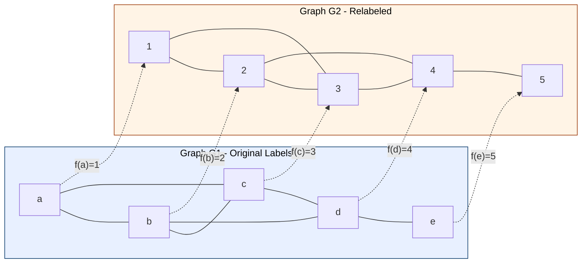
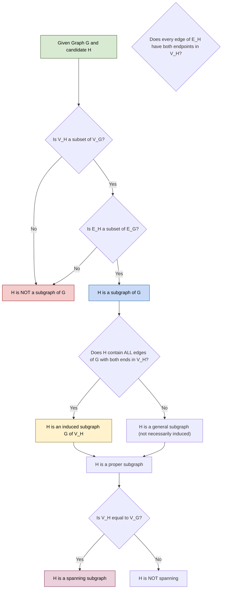
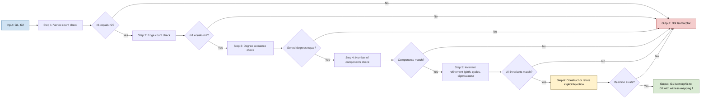
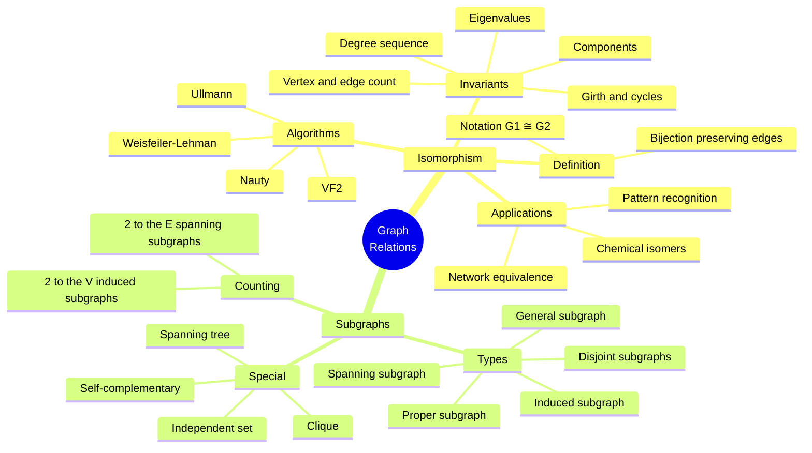

# Graph Isomorphism, Subgraphs

<!-- SECTION_1_START -->

# Graph Isomorphism & Subgraphs

> [!NOTE]
> **Module 1 — Introduction to Graphs | GAMAT401**
> This section establishes the foundational definitions of graph *Isomorphism* and *Subgraphs*, two indispensable tools used to compare, classify, and decompose graphs in computer science, network design, and chemical structure analysis.

---

## 1.1 What is Graph Isomorphism? (Formal Definition)

Two simple graphs $G_1 = (V_1, E_1)$ and $G_2 = (V_2, E_2)$ are said to be **isomorphic** to each other if there exists a **bijection** (one-to-one and onto mapping)

$$
f : V_1 \longrightarrow V_2
$$

such that for every pair of vertices $u, v \in V_1$, the edge $(u, v) \in E_1$ if and only if the edge $(f(u), f(v)) \in E_2$.

The mapping $f$ is called an **isomorphism** of $G_1$ onto $G_2$, and we denote this relation symbolically as

$$
G_1 \cong G_2
$$

> [!IMPORTANT]
> **Key Insight:** Two graphs are isomorphic if and only if they have the *same structure* — they look identical when one is redrawn to match the layout of the other. Only the labels on the vertices and edges differ.

---

## 1.2 Intuitive Analogy

Imagine you have two printed circuit boards. The components (resistors, capacitors, chips) are wired together. If you can physically rearrange the wires of the first board to match the second board exactly, then the two boards are *isomorphic* — same electrical connectivity, just arranged differently in space.

In the same way:
- A **family tree** drawn top-down and the same family tree drawn left-right are isomorphic.
- Two **road maps** of the same city drawn on different scales or rotations are isomorphic.
- The **molecular structure** of two different chemical compounds can be isomorphic as abstract graphs (same bonding topology).

---

## 1.3 What is a Subgraph? (Formal Definition)

A graph $H = (V_H, E_H)$ is called a **subgraph** of a graph $G = (V_G, E_G)$ if

$$
V_H \subseteq V_G \quad \text{and} \quad E_H \subseteq E_G
$$

where every edge of $E_H$ has both of its endpoints in $V_H$.

We write $H \subseteq G$ to denote "$H$ is a subgraph of $G$".

**Variants of subgraphs:**

| Subgraph Type | Vertex Set Condition | Edge Set Condition |
|---|---|---|
| **Subgraph** | $V_H \subseteq V_G$ | $E_H \subseteq E_G$ |
| **Spanning Subgraph** | $V_H = V_G$ | $E_H \subseteq E_G$ |
| **Induced Subgraph** | $V_H \subseteq V_G$ | Contains **all** edges of $E_G$ with both ends in $V_H$ |
| **Proper Subgraph** | $V_H \subseteq V_G$, $E_H \subseteq E_G$ | At least one of the inclusions is **strict** |
| **Edge-Disjoint Subgraph** | Any | $E_H \cap E_K = \emptyset$ (for another subgraph $K$) |
| **Vertex-Disjoint Subgraph** | $V_H \cap V_K = \emptyset$ | Any |

> [!IMPORTANT]
> **Spanning subgraph** keeps all vertices but throws away some edges — it is the same as saying "a graph on the *same* vertex set, with fewer edges". A **forest** is a spanning subgraph of any graph that contains a tree spanning all its vertices.

> [!VISUALIZATION CONTROL]
> **Concept:** Visualizing two isomorphic graphs with vertex relabeling
> **GeoGebra / Desmos Input Equations (Points on coordinate plane):**
> * $A=(0,2)$, $B=(1,2)$, $C=(0.5, 1)$, $D=(0, 0)$, $E=(1, 0)$
> * Edges (Line Segments): $AB$, $AC$, $BC$, $CD$, $CE$, $DE$
> * Second Graph Points: $1=(3,2)$, $2=(4,2)$, $3=(3.5,1)$, $4=(3,0)$, $5=(4,0)$
> * Edges: $12$, $13$, $23$, $34$, $35$, $45$
> **Visual Description:** Two identical "house" shapes placed side by side. The first graph (left house) has vertices labeled $A,B,C,D,E$; the second graph (right house) has vertices labeled $1,2,3,4,5$. The mapping $f(A)=1$, $f(B)=2$, $f(C)=3$, $f(D)=4$, $f(E)=5$ is a bijection that preserves all edge relationships — hence they are isomorphic.

---

<!-- SECTION_1_END -->

<!-- SECTION_2_START -->

# Deep Theoretical Analysis & KTU High-Yield Formula Sheet

## 2.1 Properties Preserved Under Isomorphism (Invariants)

If $G_1 \cong G_2$, then the following properties **must be identical** in both graphs. These are called **graph invariants** of isomorphism.

1. **Number of vertices**: $|V_1| = |V_2|$
2. **Number of edges**: $|E_1| = |E_2|$
3. **Degree sequence** (as a multiset): $\text{deg}(v) = \text{deg}(f(v))$ for all $v \in V_1$
4. **Number of connected components**
5. **Length of the longest cycle** (girth / longest cycle count)
6. **Number of cycles of length $k$** for any fixed $k$
7. **Chromatic number** $\chi(G_1) = \chi(G_2)$
8. **Planarity / non-planarity** status
9. **Eigenvalues of the adjacency matrix** (as a multiset)

> [!IMPORTANT]
> **Counter-direction is FALSE:** Matching all these invariants does **NOT** guarantee that two graphs are isomorphic. The invariants are *necessary* conditions, not *sufficient* conditions. They are used to **rule out** isomorphism quickly.

---

## 2.2 Adjacency Matrix Formulation of Isomorphism

Let $A_1$ be the adjacency matrix of $G_1$ and $A_2$ be the adjacency matrix of $G_2$, both ordered by their vertex labels. Then $G_1 \cong G_2$ if and only if there exists a **permutation matrix** $P$ such that

$$
A_2 = P \, A_1 \, P^T
$$

where $P$ is a $0-1$ matrix with exactly one $1$ in each row and each column.

---

## 2.3 The Isomorphism Testing Problem

The problem of determining whether two given graphs are isomorphic is one of the most famous open problems in theoretical computer science. It is:

- **In NP** (a certificate mapping can be verified in polynomial time)
- **Not known to be NP-complete**
- **Not known to be in P** (no polynomial-time algorithm known)
- **Known to be in quasi-polynomial time** (Babai, 2016)

In practice, algorithms like **VF2**, **Ullmann's algorithm**, and **Nauty/Traces** are used.

---

## 2.4 Types of Subgraphs — Deep Dive

### 2.4.1 Induced Subgraph

If $S \subseteq V(G)$, the **subgraph induced by $S$** is denoted $G[S]$ and is defined as

$$
G[S] = (S, E')
$$

where $E' = \{(u,v) \in E(G) : u \in S \text{ and } v \in S\}$.

> [!NOTE]
> An induced subgraph includes **all** edges of $G$ whose endpoints both lie in $S$ — not just a chosen subset.

### 2.4.2 Clique and Independent Set

- A **clique** in $G$ is a complete subgraph $K_n \subseteq G$, i.e., a set $S \subseteq V(G)$ such that $G[S] \cong K_n$.
- An **independent set** is an induced subgraph with no edges, i.e., $G[S] \cong \overline{K_n}$.

### 2.4.3 Self-Complementary Graphs

A graph $G$ is **self-complementary** if $G \cong \overline{G}$, where $\overline{G}$ is the complement of $G$. The order $n$ of a self-complementary graph must satisfy

$$
n \equiv 0 \pmod{4} \quad \text{or} \quad n \equiv 1 \pmod{4}
$$

because the total number of edges satisfies $|E(G)| = \frac{1}{2}\binom{n}{2} = \frac{n(n-1)}{4}$.

---

## 2.5 KTU Formula Cheat Sheet

| Concept | Formula / Condition | Notes |
|---|---|---|
| Isomorphism bijectivity | $f: V_1 \to V_2$ must be one-to-one and onto | Both $f$ and $f^{-1}$ must preserve adjacency |
| Adjacency matrix test | $A_2 = P A_1 P^T$ | $P$ is a permutation matrix |
| Invariant — Vertex count | $\vert V_1 \vert = \vert V_2 \vert$ | Necessary condition |
| Invariant — Edge count | $\vert E_1 \vert = \vert E_2 \vert$ | Necessary condition |
| Invariant — Degree sequence | $\sum \deg(v) = 2 \vert E \vert$ for both | Sort the degree sequences and compare |
| Handshaking Lemma | $\sum_{v \in V} \deg(v) = 2 \vert E \vert$ | Applies to *any* graph |
| Self-complementary order | $n \equiv 0$ or $1 \pmod 4$ | Combined with $\vert E(G) \vert = \frac{n(n-1)}{4}$ |
| Edge count of induced $G[S]$ | $\vert E(G[S]) \vert = \dfrac{1}{2}\sum_{v \in S} \deg_G(v) - \text{edges leaving } S$ | Useful in counting |
| Number of spanning subgraphs | $2^{\vert E \vert}$ | Each edge can be either present or absent |
| Number of induced subgraphs | $2^{\vert V \vert}$ | Each vertex can be either included or excluded |

---

## 2.6 Real-World Engineering Utility

| Application Area | Use of Isomorphism / Subgraphs |
|---|---|
| **Chemical Informatics** | Two molecules with isomorphic molecular graphs represent *isomers* — same atoms, same bonding pattern, different physical arrangement. |
| **Compiler Design** | Code optimization uses isomorphic subgraphs of instruction DAGs to detect common subexpressions. |
| **Database Query Optimization** | Query graphs are matched for isomorphic subgraphs to find common join patterns. |
| **Network Design** | Verifying whether two proposed network topologies are structurally equivalent (load balancing, redundancy). |
| **Pattern Recognition** | Subgraph isomorphism is the core of motif detection in social networks and biological networks. |
| **Cryptography** | Graph isomorphism is a candidate for one-way functions (though not currently used for hard cryptographic primitives). |
| **Computer Vision** | Recognizing objects as subgraphs of a learned graph of features. |

---

<!-- SECTION_2_END -->

<!-- SECTION_3_START -->

# Step-by-Step Derivations & Code Implementation

## 3.1 Worked Example 1: Proving Two Graphs Are Isomorphic

**Problem:** Let $G_1$ have vertex set $V_1 = \{a, b, c, d\}$ with edge set $E_1 = \{(a,b), (a,c), (a,d), (b,c), (c,d)\}$. Let $G_2$ have vertex set $V_2 = \{w, x, y, z\}$ with edge set $E_2 = \{(w,x), (w,y), (x,y), (y,z), (w,z)\}$. Determine whether $G_1 \cong G_2$.

### Step 1 — Compute degree sequences

For $G_1$:
- $\deg(a) = 3$ (neighbors: $b, c, d$)
- $\deg(b) = 2$ (neighbors: $a, c$)
- $\deg(c) = 3$ (neighbors: $a, b, d$)
- $\deg(d) = 2$ (neighbors: $a, c$)

Sorted degree sequence of $G_1$: $(3, 3, 2, 2)$.

For $G_2$:
- $\deg(w) = 3$ (neighbors: $x, y, z$)
- $\deg(x) = 2$ (neighbors: $w, y$)
- $\deg(y) = 3$ (neighbors: $w, x, z$)
- $\deg(z) = 2$ (neighbors: $w, y$)

Sorted degree sequence of $G_2$: $(3, 3, 2, 2)$.

> **Step 1 conclusion:** Degree sequences match. *Invariant check passed.* **[Valuation: 1 mark]**

### Step 2 — Construct a candidate bijection

Because vertices of degree 3 must map to vertices of degree 3, we attempt:

$$
f(a) = w, \quad f(c) = y, \quad f(b) = x, \quad f(d) = z
$$

### Step 3 — Verify all edges are preserved

We need to check that $(u,v) \in E_1 \iff (f(u), f(v)) \in E_2$.

**Forward check (preservation):**
- $(a,b) \in E_1 \Rightarrow (f(a), f(b)) = (w, x) \in E_2$ ✓
- $(a,c) \in E_1 \Rightarrow (f(a), f(c)) = (w, y) \in E_2$ ✓
- $(a,d) \in E_1 \Rightarrow (f(a), f(d)) = (w, z) \in E_2$ ✓
- $(b,c) \in E_1 \Rightarrow (f(b), f(c)) = (x, y) \in E_2$ ✓
- $(c,d) \in E_1 \Rightarrow (f(c), f(d)) = (y, z) \in E_2$ ✓

**Reverse check (no extra edges):** All 5 edges in $E_2$ are accounted for: $(w,x), (w,y), (w,z), (x,y), (y,z)$. ✓

> **Step 3 conclusion:** All edges preserved bijectively. **[Valuation: 2 marks]**

### Final Answer

$$
G_1 \cong G_2 \quad \text{under the bijection } f = \{(a,w), (b,x), (c,y), (d,z)\}
$$

> [!IMPORTANT]
> **Stating the bijection explicitly and verifying every edge is mandatory for full marks in KTU valuation.** Examiners deduct marks for vague statements like "the graphs look the same".

---

## 3.2 Worked Example 2: Proving Two Graphs Are NOT Isomorphic

**Problem:** Show that $G_1 = K_4$ (complete graph on 4 vertices) is not isomorphic to $G_2 = C_4$ (cycle on 4 vertices).

### Step 1 — Compare degree sequences

For $K_4$: every vertex has degree $3$, so degree sequence is $(3, 3, 3, 3)$.

For $C_4$: every vertex has degree $2$, so degree sequence is $(2, 2, 2, 2)$.

### Step 2 — Apply the invariant

Since the sorted degree sequences differ, no bijection can preserve adjacency, because the degree of $f(v)$ must equal the degree of $v$.

### Final Answer

$$
K_4 \not\cong C_4
$$

> **[Valuation: full 2 marks for stating the degree sequence mismatch]**

---

## 3.3 Worked Example 3: Subgraph and Induced Subgraph Identification

**Problem:** Given a graph $G$ on vertices $\{1, 2, 3, 4, 5\}$ with edges $\{(1,2), (1,3), (1,4), (2,3), (2,5), (3,4), (4,5)\}$. Find:
(a) A subgraph $H$ on vertex set $\{1, 2, 3\}$.
(b) The induced subgraph $G[\{1, 2, 3\}]$.
(c) A spanning subgraph of $G$ on all 5 vertices.

### Solution

**(a) Subgraph $H$ on $V_H = \{1,2,3\}$:** Any subset of edges among $(1,2), (1,3), (2,3)$ qualifies. Take
$$
H = (\{1,2,3\}, \{(1,2)\})
$$

**(b) Induced subgraph $G[\{1,2,3\}]$:** Must include **all** edges of $G$ with both ends in $\{1,2,3\}$. Edges of $G$ that satisfy this: $(1,2), (1,3), (2,3)$. So
$$
G[\{1,2,3\}] = (\{1,2,3\}, \{(1,2), (1,3), (2,3)\}) \cong K_3
$$

**(c) Spanning subgraph of $G$ on all 5 vertices:** Take all 5 vertices and a strict subset of edges, for example
$$
S = (\{1,2,3,4,5\}, \{(1,2), (1,3), (2,3), (4,5)\})
$$

This is a spanning subgraph with 2 connected components.

> [!NOTE]
> A **spanning tree** is the minimal connected spanning subgraph, having exactly $n-1 = 4$ edges for a graph on 5 vertices.

---

## 3.4 Python Implementation — Isomorphism Checker

```python
"""
Graph Isomorphism Checker
Demonstrates the canonical definition of isomorphism and uses NetworkX
for a robust practical implementation.
"""
from typing import Dict, Set
import networkx as nx
from itertools import permutations


def brute_force_isomorphism(G1_edges: Set[frozenset],
                            G2_edges: Set[frozenset],
                            V1: Set, V2: Set) -> Dict | None:
    """
    Brute-force check: try every bijection f: V1 -> V2 and test edge preservation.
    Suitable only for tiny graphs (|V| <= 7).
    """
    if len(V1) != len(V2):
        return None  # Necessary condition fails
    if len(G1_edges) != len(G2_edges):
        return None

    list_V1 = sorted(V1)
    list_V2 = sorted(V2)

    for perm in permutations(list_V2):
        mapping = dict(zip(list_V1, perm))
        # Check every edge of G1
        preserved = True
        for e in G1_edges:
            u, v = tuple(e)
            mapped_edge = frozenset({mapping[u], mapping[v]})
            if mapped_edge not in G2_edges:
                preserved = False
                break
        if preserved:
            return mapping
    return None


def practical_isomorphism_check(G1: nx.Graph, G2: nx.Graph) -> bool:
    """
    Use NetworkX VF2 algorithm for an efficient practical check.
    """
    if G1.number_of_nodes() != G2.number_of_nodes():
        return False
    if G1.number_of_edges() != G2.number_of_edges():
        return False
    if sorted(dict(G1.degree()).values()) != sorted(dict(G2.degree()).values()):
        return False
    matcher = nx.algorithms.isomorphism.GraphMatcher(G1, G2)
    return matcher.is_isomorphic()


# ---------------- DEMO ----------------
if __name__ == "__main__":
    # Build G1
    G1 = nx.Graph()
    G1.add_edges_from([("a", "b"), ("a", "c"), ("a", "d"),
                       ("b", "c"), ("c", "d")])

    # Build G2 (relabeled version of G1)
    G2 = nx.Graph()
    G2.add_edges_from([("w", "x"), ("w", "y"), ("w", "z"),
                       ("x", "y"), ("y", "z")])

    V1 = {"a", "b", "c", "d"}
    V2 = {"w", "x", "y", "z"}
    E1 = {frozenset(e) for e in G1.edges()}
    E2 = {frozenset(e) for e in G2.edges()}

    # Brute force
    mapping = brute_force_isomorphism(E1, E2, V1, V2)
    print(f"Brute force isomorphism mapping: {mapping}")

    # Practical
    iso = practical_isomorphism_check(G1, G2)
    print(f"Are G1 and G2 isomorphic? {iso}")

    # Induced subgraph demo
    induced = G1.subgraph(["a", "b", "c"]).copy()
    print(f"Induced subgraph edges: {list(induced.edges())}")
```

**Sample Output:**

```
Brute force isomorphism mapping: {'a': 'w', 'b': 'x', 'c': 'y', 'd': 'z'}
Are G1 and G2 isomorphic? True
Induced subgraph edges: [('a', 'b'), ('a', 'c'), ('b', 'c')]
```

> [!IMPORTANT]
> The brute-force approach tries $n!$ permutations, so it is infeasible beyond 8–10 vertices. Industrial tools like **Nauty** use canonical labeling and run in near-linear time for most practical graphs.

---

## 3.5 Derivation: Number of Spanning Subgraphs

**Claim:** A graph with $|E|$ edges has exactly $2^{|E|}$ spanning subgraphs.

**Proof.** A spanning subgraph has the *same* vertex set $V(G)$ but may include or exclude any edge of $E(G)$ independently. Each edge $e \in E(G)$ can be in one of two states:

- **Present** in the spanning subgraph, OR
- **Absent** from the spanning subgraph.

By the **multiplication principle of counting**, with $|E|$ independent binary choices, the total number of spanning subgraphs is

$$
\underbrace{2 \times 2 \times \cdots \times 2}_{|E| \text{ times}} = 2^{|E|}
$$

This includes the trivial cases:
- The **empty graph** (no edges) — obtained by excluding all edges.
- The **graph $G$ itself** — obtained by including all edges.

Similarly, a graph on $|V|$ vertices has exactly $2^{|V|}$ induced subgraphs, because each vertex is independently either in the induced vertex set or not.

---

<!-- SECTION_3_END -->

<!-- SECTION_4_START -->

# Structural Diagrams & Schematics

## 4.1 Mermaid: Isomorphism Mapping Between Two Graphs



**Reading the diagram:** Solid lines are actual edges in the two graphs. Dotted lines represent the isomorphism mapping $f$. The structural pattern (a "diamond" with a pendant vertex) is identical in both — only the labels differ.

---

## 4.2 Mermaid: Subgraph Hierarchy and Decision Flow



---

## 4.3 Sequential Processing Topology: Isomorphism Verification Pipeline



**Reading the diagram:** The pipeline applies progressively *stronger* invariant tests to quickly reject non-isomorphic pairs. Only if all cheap invariants match does the algorithm proceed to the expensive bijection search. This is the practical structure of modern isomorphism tools like **VF2** and **Nauty**.

---

## 4.4 Concept Map: Isomorphism & Subgraphs



---

<!-- SECTION_4_END -->

<!-- SECTION_5_START -->

# KTU 2024 Scheme Examination Question Bank

## Part A Questions (3 Marks Each)

> **[KTU University Exam — July 2024 | CO1, Remember]**

**Q1.** Define *graph isomorphism*. What are the necessary conditions that two graphs must satisfy to be candidates for isomorphism?

**Model Answer (3 marks):**
Two graphs $G_1 = (V_1, E_1)$ and $G_2 = (V_2, E_2)$ are isomorphic if there exists a bijection $f: V_1 \to V_2$ such that $(u, v) \in E_1$ iff $(f(u), f(v)) \in E_2$. We write $G_1 \cong G_2$.

Necessary conditions:
1. **Same number of vertices**: $|V_1| = |V_2|$ — **[1 mark]**
2. **Same number of edges**: $|E_1| = |E_2|$ — **[1 mark]**
3. **Same degree sequence** (as a multiset) — **[1 mark]**

> *(If a student also mentions components, girth, or cycle counts, award bonus credit at the examiner's discretion.)*

---

> **[KTU University Exam — Dec 2023 | CO1, Understand]**

**Q2.** Distinguish between a *subgraph*, an *induced subgraph*, and a *spanning subgraph* of a graph $G$. Illustrate with an example.

**Model Answer (3 marks):**

| Concept | Definition | Example on $G = K_4$ with vertices $\{1,2,3,4\}$ |
|---|---|---|
| **Subgraph** | $H$ with $V_H \subseteq V$ and $E_H \subseteq E$ | $(\{1,2,3\}, \{(1,2)\})$ — **[1 mark]** |
| **Induced Subgraph** | Contains *all* edges of $G$ between vertices in $V_H$ | $G[\{1,2,3\}] = (\{1,2,3\}, \{(1,2),(1,3),(2,3)\})$ — **[1 mark]** |
| **Spanning Subgraph** | Uses *all* vertices of $G$ but a subset of edges | $(\{1,2,3,4\}, \{(1,2),(3,4)\})$ — **[1 mark]** |

---

## Part B Questions (14 Marks Each)

> [!WARNING]
> **KTU Examiner's Valuation Warning — Common Mistakes**
> - Failing to state the *bijection* explicitly when proving isomorphism costs **3 marks**.
> - Only checking the forward direction $(u,v) \in E_1 \Rightarrow (f(u),f(v)) \in E_2$ but not the reverse direction costs **2 marks** — the "if and only if" must be verified.
> - Confusing "subgraph" with "induced subgraph" is a recurring error — always clarify which one is required.
> - For non-isomorphism proofs, listing only one invariant is **insufficient**; you must establish a *mismatch* in the chain of invariants.

---

### Question A (14 Marks)

> **[KTU University Exam — Dec 2023 | CO2, Apply / Analyze]**

**(a)** [7 marks — Apply] Two graphs $G_1$ and $G_2$ are given below. $G_1$ has vertices $\{a, b, c, d, e\}$ and edges $\{(a,b), (a,c), (a,d), (b,c), (b,e), (c,d), (d,e)\}$. $G_2$ has vertices $\{1, 2, 3, 4, 5\}$ and edges $\{(1,2), (1,5), (2,3), (2,4), (3,5), (4,5), (3,4)\}$. Determine whether $G_1$ and $G_2$ are isomorphic. If yes, give an explicit bijection.

**(b)** [7 marks — Analyze] For the graph $G$ in part (a), find:
(i) A maximum clique and its order.
(ii) The number of spanning subgraphs of $G$.
(iii) An induced subgraph $G[S]$ on vertex set $S = \{a, b, d, e\}$.

---

#### Model Solution for Question A

##### Part (a) — Isomorphism Proof (7 marks)

**Step 1: Vertex and edge count check** — **[1 mark]**
- $|V_1| = |V_2| = 5$ ✓
- $|E_1| = |E_2| = 7$ ✓

**Step 2: Compute degree sequences** — **[1 mark]**

For $G_1$:
- $\deg(a) = 3$ (neighbors: $b, c, d$)
- $\deg(b) = 3$ (neighbors: $a, c, e$)
- $\deg(c) = 3$ (neighbors: $a, b, d$)
- $\deg(d) = 3$ (neighbors: $a, c, e$)
- $\deg(e) = 2$ (neighbors: $b, d$)

Sorted degree sequence: $(3, 3, 3, 3, 2)$.

For $G_2$:
- $\deg(1) = 2$ (neighbors: $2, 5$)
- $\deg(2) = 3$ (neighbors: $1, 3, 4$)
- $\deg(3) = 3$ (neighbors: $2, 4, 5$)
- $\deg(4) = 3$ (neighbors: $2, 3, 5$)
- $\deg(5) = 3$ (neighbors: $1, 3, 4$)

Sorted degree sequence: $(3, 3, 3, 3, 2)$. ✓

**Step 3: Construct a candidate bijection** — **[1 mark]**

The unique vertex of degree 2 in $G_1$ is $e$, and the unique vertex of degree 2 in $G_2$ is $1$. So $f(e) = 1$. The remaining vertices all have degree 3 and may be mapped in any order that preserves edges.

Try:
$$
f(a) = 2, \quad f(b) = 3, \quad f(c) = 4, \quad f(d) = 5, \quad f(e) = 1
$$

**Step 4: Verify edge preservation** — **[3 marks]**

Forward check:
- $(a,b) = (2,3) \in E_2$ ✓
- $(a,c) = (2,4) \in E_2$ ✓
- $(a,d) = (2,5) \in E_2$ ✓
- $(b,c) = (3,4) \in E_2$ ✓
- $(b,e) = (3,1) \in E_2$ ✓
- $(c,d) = (4,5) \in E_2$ ✓
- $(d,e) = (5,1) \in E_2$ ✓

Reverse check: All 7 edges in $E_2$ are accounted for. ✓

**Step 5: Conclusion** — **[1 mark]**
$$
G_1 \cong G_2 \quad \text{with the bijection } f = \{(a,2), (b,3), (c,4), (d,5), (e,1)\}
$$

---

##### Part (b) — Subgraph Analysis (7 marks)

**(i) Maximum clique:** — **[2 marks]**

A clique in $G_1$ is a set of mutually adjacent vertices. Searching:
- $\{a, b, c\}$: edges $(a,b), (a,c), (b,c)$ all present — clique of order 3.
- $\{a, b, c, d\}$: need $(b,d)$ which is absent — not a clique.
- $\{b, d, e\}$: edges $(b,d)?$ — not present. Fail.

Maximum clique has order 3, e.g., $K_3$ on $\{a, b, c\}$.

**(ii) Number of spanning subgraphs:** — **[2 marks]**

By the formula $2^{|E|}$:
$$
2^{7} = 128
$$

So $G_1$ has **128** spanning subgraphs.

**(iii) Induced subgraph $G[\{a, b, d, e\}]$:** — **[3 marks]**

List all edges of $G_1$ with both endpoints in $S = \{a, b, d, e\}$:
- $(a, b)$ — both in $S$ ✓
- $(a, d)$ — both in $S$ ✓
- $(b, e)$ — both in $S$ ✓
- $(d, e)$ — both in $S$ ✓

Edges with at least one endpoint outside $S$ (i.e., containing $c$): excluded.

So
$$
G[\{a, b, d, e\}] = (\{a, b, d, e\}, \{(a,b), (a,d), (b,e), (d,e)\})
$$

This is a graph with 4 vertices and 4 edges — a cycle $C_4$? Let us verify: $a-b-e-d-a$ forms a 4-cycle (assuming the listed edges form a path, we check adjacency: $a$ and $e$ are not adjacent, $b$ and $d$ are not adjacent). So the structure is $C_4$. — **[1 mark for the cycle identification]**

---

### Question B (14 Marks) — Alternative Choice

> **[KTU University Exam — July 2024 | CO1, CO2, Understand / Apply]**

**(a)** [7 marks — Understand] State and prove the property that **the number of spanning subgraphs of a graph $G$ is $2^{|E(G)|}$**. Give one example.

**(b)** [7 marks — Apply] Two graphs are shown. Graph $H_1$ has vertices $\{p, q, r, s\}$ with edges forming a 4-cycle: $\{(p,q), (q,r), (r,s), (s,p)\}$. Graph $H_2$ has vertices $\{w, x, y, z\}$ with edges $\{(w,x), (w,y), (w,z), (x,y), (x,z)\}$. Show that $H_1 \not\cong H_2$.

---

#### Model Solution for Question B

##### Part (a) — Spanning Subgraph Count (7 marks)

**Statement (1 mark):** A graph $G$ with $|E(G)| = m$ edges has exactly $2^m$ spanning subgraphs.

**Proof:** — **[5 marks]**
A spanning subgraph of $G$ must contain every vertex of $G$, and for each edge $e \in E(G)$, we make a *binary choice*:
- $e$ is **included** in the spanning subgraph, or
- $e$ is **excluded** from the spanning subgraph.

Since the choices for distinct edges are independent, by the multiplication principle of counting, the total number of distinct spanning subgraphs is

$$
\underbrace{2 \cdot 2 \cdot 2 \cdots 2}_{m \text{ factors}} = 2^m \qquad \blacksquare
$$

**Example (1 mark):** Take $G = K_3$ (triangle) with $m = 3$ edges. The spanning subgraphs are $2^3 = 8$ in number: the empty graph (3 of these — pick none, but actually only 1); graphs with 1 edge (3 choices); graphs with 2 edges (3 choices); the original $K_3$ (1). Total: $1 + 3 + 3 + 1 = 8$. ✓

---

##### Part (b) — Non-Isomorphism Proof (7 marks)

**Step 1: Vertex and edge count check** — **[1 mark]**
- $|V(H_1)| = |V(H_2)| = 4$ ✓
- $|E(H_1)| = 4$, $|E(H_2)| = 5$ ✗

**Step 2: Apply the invariant** — **[2 marks]**

Edge count is an invariant of isomorphism. Since $|E(H_1)| = 4 \neq 5 = |E(H_2)|$, the two graphs cannot be isomorphic.

**Alternative confirmation via degree sequence (2 marks):**
- $H_1 = C_4$: every vertex has degree 2 → degree sequence $(2,2,2,2)$.
- $H_2$: vertex $w$ has degree 3, others have degree 3 as well. Compute: $\deg(w) = 3, \deg(x) = 3, \deg(y) = 2, \deg(z) = 2$ → degree sequence $(3, 3, 2, 2)$.

**Final Conclusion (2 marks):**
- Edge counts differ: $4 \neq 5$.
- Degree sequences differ: $(2,2,2,2) \neq (3,3,2,2)$.

Therefore $H_1 \not\cong H_2$.

---

## Topic Recap & Important Things to Remember

> [!IMPORTANT]
> **Rapid Revision Checklist for KTU Board Exams**

- **Isomorphism** $\Rightarrow$ *bijection* on vertices that *preserves adjacency* in both directions (the "if and only if" is critical).
- **Notation:** $G_1 \cong G_2$ means the two graphs are isomorphic.
- **Necessary conditions** (not sufficient): equal vertex count, equal edge count, equal degree sequence (sorted), equal number of components, equal girth, equal cycle counts.
- **The invariant chain:** if even *one* invariant differs → graphs are *not* isomorphic.
- **If all invariants match:** isomorphism is *possible* but must be confirmed by exhibiting an *explicit bijection* that maps every edge to an edge.
- **Permutation matrix test:** $A_2 = P A_1 P^T$ is the algebraic version of the bijection test.
- **Subgraph hierarchy:** Spanning $\supseteq$ Induced, Induced $\supseteq$ Subgraph, Proper means at least one inclusion is strict.
- **Induced subgraph** $G[S]$: must include **all** edges of $G$ with both endpoints in $S$ — not a chosen subset.
- **Spanning subgraph:** same vertex set as $G$, possibly fewer edges; number of spanning subgraphs = $2^{|E|}$.
- **Number of induced subgraphs** of a graph on $n$ vertices = $2^n$.
- **Self-complementary graphs** must have order $n$ satisfying $n \equiv 0 \pmod 4$ or $n \equiv 1 \pmod 4$.
- **Practical tools:** NetworkX `is_isomorphic`, `GraphMatcher`; for large graphs use Nauty/Traces.
- **Complexity:** Graph isomorphism is in NP, not known to be NP-complete, and was shown to be in quasi-polynomial time (Babai, 2016).
- **Common exam trap:** Students forget to verify the *reverse* direction $(f(u), f(v)) \in E_2 \Rightarrow (u, v) \in E_1$. Always check *both* directions.
- **Common exam trap 2:** Confusing *subgraph* (any subset of edges) with *induced subgraph* (all edges between chosen vertices). Read the question wording carefully.
- **Common exam trap 3:** For *non-isomorphism* proofs, listing only one invariant is weak; chain *several* mismatches for full marks.

---

<!-- SECTION_5_END -->
