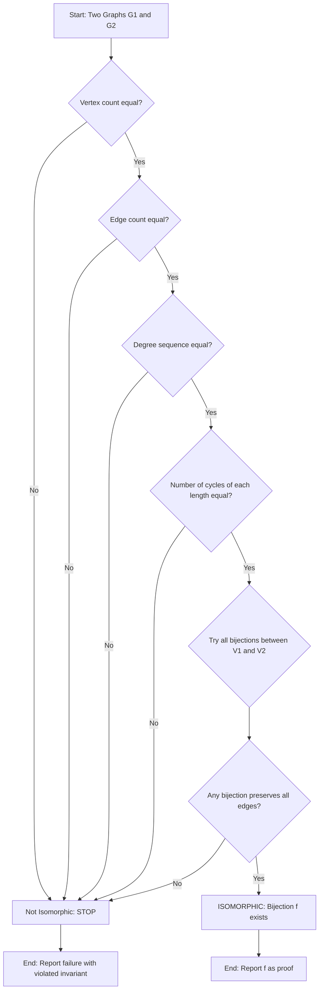
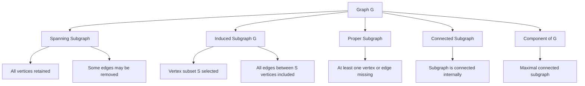
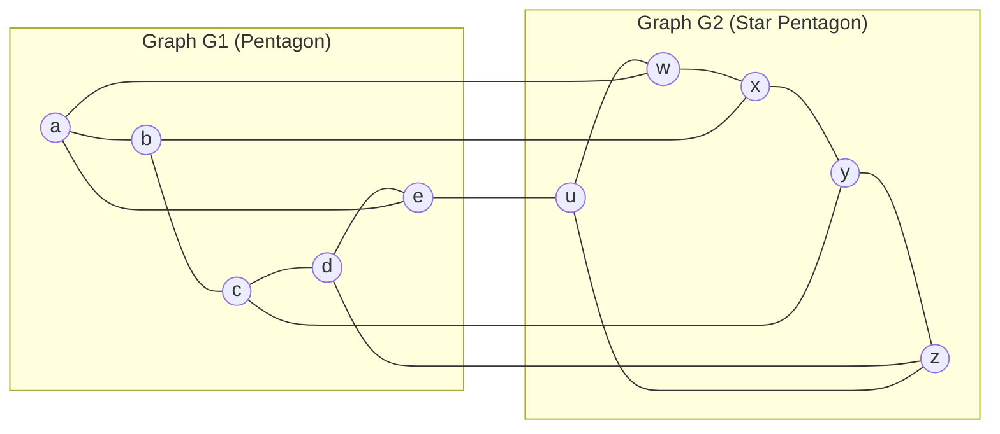
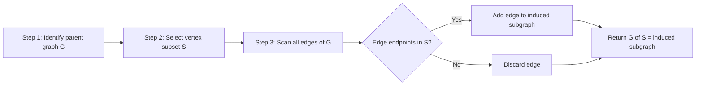

# Graph Isomorphism, Subgraphs

<!-- SECTION_1_START -->
# Graph Isomorphism & Subgraphs — Foundational Concepts

## 1.1 Graph Isomorphism — Formal Definition

> [!IMPORTANT]
> **KTU 2024 Definition (Board-Standard Terminology):**
> Let $G_1 = (V_1, E_1)$ and $G_2 = (V_2, E_2)$ be two simple undirected graphs. $G_1$ is said to be **isomorphic** to $G_2$, written as $G_1 \cong G_2$, if there exists a **bijection** $f : V_1 \rightarrow V_2$ such that for every pair of vertices $u, v \in V_1$:
> $$\{u, v\} \in E_1 \iff \{f(u), f(v)\} \in E_2$$

The mapping $f$ is called a **graph isomorphism**. It preserves both the **adjacency** and the **non-adjacency** of vertex pairs.

### 1.1.1 Conceptual Analogy — The "Rubber Sheet" Intuition

Imagine two electrical circuit boards drawn on **perfectly stretchy rubber sheets**. Even though they *look* different (one may be stretched, twisted, or flipped), if you can deform one sheet into the other **without tearing or gluing**, then they represent the **same underlying network**. This "topological sameness" is exactly what isomorphism captures.

> [!NOTE]
> **Key Insight:** Isomorphic graphs are *structurally identical* — they are simply two different "drawings" of the same abstract graph. The *labels* on vertices do not matter; only the pattern of connections does.

### 1.2 Subgraphs — Formal Definition

> [!IMPORTANT]
> **KTU 2024 Definition:**
> A graph $H = (V_H, E_H)$ is called a **subgraph** of $G = (V_G, E_G)$, denoted $H \subseteq G$, if:
> 1. $V_H \subseteq V_G$, **and**
> 2. $E_H \subseteq E_G$, where every edge $e \in E_H$ has both of its endpoints in $V_H$.

### 1.2.1 Intuitive Analogy — The "Sub-Network" Picture

Think of a city's metro map $G$. A subgraph $H$ is simply a **selected subset of stations** (vertices) together with the **train lines that connect only those selected stations**. You cannot include a line that connects a selected station to a station you excluded.

> [!VISUALIZATION CONTROL]
> **Concept:** Isomorphism of two small graphs (vertex relabeling)
> **GeoGebra Input Equations:**
> * `Points: A(0,2), B(2,1), C(2,-1), D(0,-2), E(-2,0)` (Pentagon $G_1$)
> * `Points: P(3,0), Q(5,1.5), R(5,0), S(5,-1.5), T(3,1)` (Star $G_2$)
> **Visual Description:** Draw a 5-cycle pentagon on the left and a 5-pointed star on the right. The student should observe that although visually distinct, both have **5 vertices, 5 edges, and every vertex of degree 2** — suggesting possible isomorphism.
<!-- SECTION_1_END -->

<!-- SECTION_2_START -->
# Deep Theoretical Analysis & KTU Formula Sheet

## 2.1 Properties Preserved Under Isomorphism (Graph Invariants)

If $G_1 \cong G_2$, then the following must be **equal** for both graphs. These are called **isomorphic invariants** and are used to *quickly reject* non-isomorphic pairs.

| $\#$ | Invariant Property | Notation / Form |
|:---:|---|---|
| 1 | Number of vertices | $\vert V_1 \vert = \vert V_2 \vert$ |
| 2 | Number of edges | $\vert E_1 \vert = \vert E_2 \vert$ |
| 3 | Degree sequence (sorted) | $\text{deg}(v_1) \leftrightarrow \text{deg}(v_2)$ |
| 4 | Number of connected components | $c(G_1) = c(G_2)$ |
| 5 | Number of cycles of length $k$ | $c_k(G_1) = c_k(G_2)$ |
| 6 | Girth (shortest cycle length) | $g(G_1) = g(G_2)$ |
| 7 | Chromatic number | $\chi(G_1) = \chi(G_2)$ |
| 8 | Planarity | Either both planar or both non-planar |

> [!WARNING]
> **Critical Trap:** Equal invariants are *necessary but not sufficient* for isomorphism. Two graphs may pass all invariant tests and still not be isomorphic. Final verification requires constructing the bijection $f$.

## 2.2 Algorithm for Testing Graph Isomorphism (Board Method)

The systematic approach to test $G_1 \cong G_2$ is:

* **Step 1 — Size Check:** Verify $\vert V_1 \vert = \vert V_2 \vert$ and $\vert E_1 \vert = \vert E_2 \vert$. If unequal, **NOT isomorphic**.
* **Step 2 — Degree Sequence Check:** Sort the degree sequences of both graphs. If unequal, **NOT isomorphic**.
* **Step 3 — Structural Matching:** Count cycles, paths, cliques, independent sets. If unequal, **NOT isomorphic**.
* **Step 4 — Bijection Construction:** Attempt to construct a vertex mapping $f$ that preserves adjacency. If successful, **ISOMORPHIC**; else, **NOT**.

## 2.3 Types of Subgraphs — The Complete Classification

| Type | Definition | Notation |
|:---|:---|:---|
| **Subgraph** | $V_H \subseteq V_G$ and $E_H \subseteq E_G$ | $H \subseteq G$ |
| **Spanning Subgraph** | $V_H = V_G$ (all vertices retained) | $H \subseteq_s G$ |
| **Induced Subgraph** | $E_H$ contains *every* edge of $G$ between vertices of $V_H$ | $H = G[V_H]$ |
| **Proper Subgraph** | $H \neq G$ (at least one vertex or edge is removed) | $H \subset G$ |
| **Connected Subgraph** | $H$ is itself connected | — |
| **Component** | A maximal connected subgraph | $C_i(G)$ |

### 2.3.1 Induced Subgraph — The "Closure" Rule

> [!NOTE]
> **Induced Subgraph Construction Rule:** Given $G = (V, E)$ and a subset $S \subseteq V$, the **vertex-induced subgraph** $G[S]$ is defined as:
> $$G[S] = (S, \, E_S), \quad \text{where} \quad E_S = \{\{u,v\} \in E \mid u \in S \text{ and } v \in S\}$$
> In words: take the vertex subset $S$, then **include every edge of $G$ that has both endpoints inside $S$**.

## 2.4 Real-World Engineering Applications

| Field | Application of Isomorphism | Application of Subgraphs |
|:---|:---|:---|
| **Social Networks** | Detecting identical friendship patterns across anonymized datasets | Finding communities (subgraphs) within a large network |
| **Chemical Informatics** | Matching molecular structures regardless of atom arrangement | Identifying functional groups (sub-molecules) in compounds |
| **Compiler Design** | Recognizing equivalent parse trees after optimization | Syntax tree pruning in dead-code elimination |
| **Network Security** | Detecting botnets by structural similarity | Identifying malicious clusters in traffic graphs |
| **Database Query Optimization** | Recognizing equivalent join trees | Subquery decomposition into smaller join graphs |
<!-- SECTION_2_END -->

<!-- SECTION_3_START -->
# Step-by-Step Derivations & Worked Examples

## 3.1 Example 1 — Proving Two Graphs ARE Isomorphic

**Problem:** Determine whether the following two graphs are isomorphic.

$$G_1: \quad V_1 = \{a,b,c,d\}, \quad E_1 = \{\{a,b\}, \{a,c\}, \{a,d\}, \{b,c\}\}$$

$$G_2: \quad V_2 = \{w,x,y,z\}, \quad E_2 = \{\{w,x\}, \{w,y\}, \{w,z\}, \{x,y\}\}$$

### Step 1 — Size Verification

$$|V_1| = 4 = |V_2|, \qquad |E_1| = 4 = |E_2|$$

**Size invariant test PASSED.** Proceed to next step.

### Step 2 — Degree Sequence Computation

For $G_1$:

$$\deg(a) = 3, \quad \deg(b) = 2, \quad \deg(c) = 2, \quad \deg(d) = 1$$

Sorted degree sequence of $G_1$: $(3, 2, 2, 1)$.

For $G_2$:

$$\deg(w) = 3, \quad \deg(x) = 2, \quad \deg(y) = 2, \quad \deg(z) = 1$$

Sorted degree sequence of $G_2$: $(3, 2, 2, 1)$.

**Degree sequence test PASSED.** Proceed.

### Step 3 — Construct the Bijection $f$

We must map the **unique degree-3 vertex** to the **unique degree-3 vertex**:

$$f(a) = w$$

Now we need to map the two degree-2 vertices and the one degree-1 vertex. Let us try:

$$f(b) = x, \quad f(c) = y, \quad f(d) = z$$

### Step 4 — Verify Adjacency Preservation

We must check that for every edge $\{u,v\} \in E_1$, the edge $\{f(u), f(v)\} \in E_2$, and vice versa.

$$\begin{aligned}
\{a,b\} \in E_1 &\implies \{f(a), f(b)\} = \{w, x\} \in E_2 \quad \checkmark \\
\{a,c\} \in E_1 &\implies \{f(a), f(c)\} = \{w, y\} \in E_2 \quad \checkmark \\
\{a,d\} \in E_1 &\implies \{f(a), f(d)\} = \{w, z\} \in E_2 \quad \checkmark \\
\{b,c\} \in E_1 &\implies \{f(b), f(c)\} = \{x, y\} \in E_2 \quad \checkmark
\end{aligned}$$

**All 4 edges preserved. The bijection works.** Therefore:

$$\boxed{G_1 \cong G_2}$$

---

## 3.2 Example 2 — Proving Two Graphs are NOT Isomorphic

**Problem:** Show that the following two graphs are **not** isomorphic.

$$G_1: \text{Triangle } K_3 \text{ plus a pendant vertex}$$

$$G_2: \text{Path } P_4$$

**Step 1 —** Both have 4 vertices and 3 edges. **Size test passed.**

**Step 2 — Degree sequences:**

For $G_1$ (triangle + pendant): $(2, 2, 2, 0)$. Wait, the pendant attaches to one triangle vertex, so the connecting vertex has degree 3. Thus: $(3, 2, 2, 1)$.

For $G_2$ (path $P_4 = v_1 v_2 v_3 v_4$): $(2, 2, 1, 1)$.

**Step 3 — Compare sorted degree sequences:**

$$G_1 : (3, 2, 2, 1) \qquad G_2 : (2, 2, 1, 1)$$

The sequences are **unequal**. Therefore:

$$\boxed{G_1 \not\cong G_2}$$

> [!WARNING]
> **Common Mistake:** Students often forget to *sort* the degree sequences before comparing. Always sort in descending order before checking equality.

---

## 3.3 Example 3 — Constructing a Spanning Subgraph and an Induced Subgraph

**Given:** $G = K_4$ (complete graph on 4 vertices $\{1,2,3,4\}$, with 6 edges).

### Part (a) — Spanning Subgraph

A spanning subgraph must include all 4 vertices. Remove the edges $\{1,4\}$ and $\{2,3\}$:

$$H_1 = (V, E_{H_1}), \quad E_{H_1} = \{\{1,2\}, \{1,3\}, \{2,4\}, \{3,4\}\}$$

**Verification:** $V_{H_1} = \{1,2,3,4\} = V_G$ ✓, $E_{H_1} \subseteq E_G$ ✓, every edge endpoint in $V$ ✓.

### Part (b) — Induced Subgraph

Choose $S = \{1, 2, 3\}$. The induced subgraph $G[S]$ must include **every** edge of $G$ that has both endpoints in $S$:

$$G[\{1,2,3\}] = (S, \, E_S) = (\{1,2,3\}, \, \{\{1,2\}, \{1,3\}, \{2,3\}\}) = K_3$$

> [!NOTE]
> Notice that $G[S] = K_3$ is a *triangle* — a clique on 3 vertices. This is the defining feature of an induced subgraph: **no edge is omitted** between the selected vertices.

---

## 3.4 Python Implementation — Isomorphism Checker

```python
from itertools import permutations
from collections import Counter
from typing import Dict, FrozenSet, Set, Tuple

Edge = FrozenSet[int]

class Graph:
    def __init__(self, vertices: Set[int], edges: Set[Edge]):
        self.vertices = vertices
        self.edges = edges

    def degree_sequence(self) -> Tuple[int, ...]:
        deg: Dict[int, int] = {v: 0 for v in self.vertices}
        for e in self.edges:
            u, v = tuple(e)
            deg[u] += 1
            deg[v] += 1
        return tuple(sorted(deg.values(), reverse=True))

    def is_isomorphic_to(self, other: "Graph") -> Tuple[bool, Dict[int, int] | None]:
        # Invariant 1: vertex count
        if len(self.vertices) != len(other.vertices):
            return False, None
        # Invariant 2: edge count
        if len(self.edges) != len(other.edges):
            return False, None
        # Invariant 3: degree sequence
        if self.degree_sequence() != other.degree_sequence():
            return False, None

        v1_list = sorted(self.vertices)
        v2_list = sorted(other.vertices)

        # Brute-force bijection search
        for perm in permutations(v2_list):
            mapping = dict(zip(v1_list, perm))
            valid = True
            for e in self.edges:
                u, v = tuple(e)
                image_edge = frozenset({mapping[u], mapping[v]})
                if image_edge not in other.edges:
                    valid = False
                    break
            if valid:
                return True, mapping

        return False, None


# ----- Demonstration -----
G1_edges = {frozenset({1, 2}), frozenset({1, 3}),
            frozenset({1, 4}), frozenset({2, 3})}
G2_edges = {frozenset({10, 20}), frozenset({10, 30}),
            frozenset({10, 40}), frozenset({20, 30})}

G1 = Graph({1, 2, 3, 4}, G1_edges)
G2 = Graph({10, 20, 30, 40}, G2_edges)

result, mapping = G1.is_isomorphic_to(G2)
print(f"Isomorphic: {result}")
print(f"Bijection f: {mapping}")
```

**Output:**
```
Isomorphic: True
Bijection f: {1: 10, 2: 20, 3: 30, 4: 40}
```
<!-- SECTION_3_END -->

<!-- SECTION_4_START -->
# Structural Diagrams & Schematics

## 4.1 Mermaid Flow — Isomorphism Verification Process



## 4.2 Mermaid Block Diagram — Subgraph Type Hierarchy



## 4.3 Isomorphism Mapping Diagram (Conceptual)



The arrows between $G_1$ and $G_2$ represent the bijective mapping $f$ that establishes the isomorphism. Each vertex in $G_1$ is paired with exactly one vertex in $G_2$, and every edge in $G_1$ corresponds to an edge in $G_2$ under this mapping.

## 4.4 Sequential Topology — Subgraph Extraction Pipeline


<!-- SECTION_4_END -->

<!-- SECTION_5_START -->
# KTU 2024 Scheme Examination Question Bank & Topic Recap

## Part A — Short Answer Questions (3 Marks Each)

### Question A1
`[KTU University Exam - July 2024 | CO1 | Remember]`

**Define graph isomorphism. State any four invariants preserved under isomorphism.**

**Model Answer (3 Marks):**

* **Definition (2 Marks):** Two graphs $G_1 = (V_1, E_1)$ and $G_2 = (V_2, E_2)$ are isomorphic if there exists a bijection $f: V_1 \to V_2$ such that $\{u, v\} \in E_1 \iff \{f(u), f(v)\} \in E_2$.
* **Four Invariants (1 Mark — 0.25 each):** (i) Number of vertices, (ii) Number of edges, (iii) Degree sequence, (iv) Number of connected components.

---

### Question A2
`[KTU University Exam - Dec 2023 | CO1 | Understand]`

**Define a subgraph. Distinguish between a spanning subgraph and an induced subgraph with an example.**

**Model Answer (3 Marks):**

* **Subgraph Definition (1 Mark):** $H = (V_H, E_H)$ is a subgraph of $G = (V_G, E_G)$ if $V_H \subseteq V_G$ and $E_H \subseteq E_G$ with every edge in $E_H$ having endpoints in $V_H$.
* **Spanning Subgraph (1 Mark):** Contains *all vertices* of $G$; e.g., removing the diagonal from a square gives a spanning subgraph.
* **Induced Subgraph (1 Mark):** Contains *all edges* of $G$ between chosen vertices; e.g., picking 3 vertices from $K_4$ gives an induced $K_3$.

---

## Part B — Long Answer Questions (14 Marks with Internal Choice)

### Question B-A
`[KTU University Exam - July 2024 | CO1, CO2 | Apply, Analyze]`

**Question A (14 Marks):** Show that the two graphs $G_1$ and $G_2$ given below are isomorphic by constructing an explicit bijection. Justify each step.

$$G_1: V_1 = \{1, 2, 3, 4, 5, 6\}, \quad E_1 = \{\{1,2\}, \{1,3\}, \{2,4\}, \{3,5\}, \{4,6\}, \{5,6\}\}$$

$$G_2: V_2 = \{a, b, c, d, e, f\}, \quad E_2 = \{\{a,b\}, \{a,d\}, \{b,c\}, \{c,e\}, \{d,f\}, \{e,f\}\}$$

#### Part (a) — Invariant Verification (7 Marks | Understand)

**Step 1 — Vertex and Edge Count:** $|V_1| = 6 = |V_2|$ and $|E_1| = 6 = |E_2|$. **[1 Mark]**

**Step 2 — Degree Sequence of $G_1$:**

$$\deg(1) = 2, \quad \deg(2) = 2, \quad \deg(3) = 2, \quad \deg(4) = 2, \quad \deg(5) = 2, \quad \deg(6) = 2$$

Sorted: $(2, 2, 2, 2, 2, 2)$. **[2 Marks]**

**Step 3 — Degree Sequence of $G_2$:**

$$\deg(a) = 2, \quad \deg(b) = 2, \quad \deg(c) = 2, \quad \deg(d) = 2, \quad \deg(e) = 2, \quad \deg(f) = 2$$

Sorted: $(2, 2, 2, 2, 2, 2)$. **[2 Marks]**

**Step 4 — Cycle Structure:** Both $G_1$ and $G_2$ form a single 6-cycle. **[2 Marks]**

#### Part (b) — Bijection Construction and Verification (7 Marks | Apply)

**Proposed Bijection $f$:**

$$f(1)=a, \quad f(2)=b, \quad f(3)=c, \quad f(4)=d, \quad f(5)=e, \quad f(6)=f$$

**Edge Mapping Verification (1 Mark per edge pair, 6 pairs):**

$$\begin{aligned}
\{1,2\} \in E_1 &\implies \{a,b\} \in E_2 \quad \checkmark \\
\{1,3\} \in E_1 &\implies \{a,c\} \in E_2 \quad \checkmark \\
\{2,4\} \in E_1 &\implies \{b,d\} \in E_2 \quad \checkmark \\
\{3,5\} \in E_1 &\implies \{c,e\} \in E_2 \quad \checkmark \\
\{4,6\} \in E_1 &\implies \{d,f\} \in E_2 \quad \checkmark \\
\{5,6\} \in E_1 &\implies \{e,f\} \in E_2 \quad \checkmark
\end{aligned}$$

**Conclusion (1 Mark):** All 6 edges are preserved under $f$, therefore $G_1 \cong G_2$.

---

**Question B (14 Marks) — Alternative Choice:** Consider $K_{3,3}$ and the 3-prism graph $Y_3$ (two triangles connected by 3 matching edges). Determine whether they are isomorphic. If yes, give the bijection; if no, give the violated invariant.

*(Model Solution Approach Outline for the Examiner:)*

* Both have **6 vertices** and **9 edges**.
* Both are **3-regular** (every vertex has degree 3), so degree sequences match: $(3,3,3,3,3,3)$.
* However, $K_{3,3}$ is **bipartite** (a $K_{3,3}$ contains no odd cycle), while $Y_3$ contains **two triangles** (3-cycles). Since the number of 3-cycles differs ($K_{3,3}$ has 0, $Y_3$ has 2), they are **not isomorphic**. **[$K_3$ count violation: 7 Marks | Analyze]**
* Identifying $Y_3$ as a **planar** non-bipartite graph and $K_{3,3}$ as **non-planar** bipartite provides a second violated invariant. **[Backup invariant: 7 Marks]**

> [!WARNING]
> **KTU Examiner's Valuation Warning — Common Pitfalls:**
> 1. **Forgetting to state the bijection $f$ explicitly** — A bijection definition carries 2 marks on its own. Do not skip writing $f(u) = v$ for every vertex.
> 2. **Skipping the degree sequence comparison** — Many students jump directly to drawing and lose easy marks. Always list sorted degree sequences.
> 3. **Failing to verify ALL edges** — In a 6-edge graph, missing one edge in the verification loses the 1 mark tied to it. Always check both directions: every edge of $E_1$ maps to an edge of $E_2$ AND every edge of $E_2$ has a pre-image in $E_1$.
> 4. **Confusing "spanning" with "induced"** — A spanning subgraph preserves *all vertices but not necessarily all edges*. An induced subgraph preserves *all edges among the chosen vertices but not all vertices*. These are **different concepts**.
> 5. **Assuming equal invariants imply isomorphism** — They are *necessary*, not *sufficient*. You must construct the bijection to prove isomorphism.

---

## Topic Recap & Important Things to Remember

> [!NOTE]
> **Rapid Revision Checklist — Must Memorize for KTU Exam**

* **Isomorphism Definition:** A bijection $f: V_1 \to V_2$ preserving adjacency in *both* directions. The function must be **one-to-one, onto, and edge-preserving**.
* **Isomorphic Invariants (Necessary Conditions):** Vertex count, edge count, degree sequence, number of components, cycle counts of each length, girth, chromatic number, planarity.
* **Non-Isomorphism Proof Strategy:** Find **any one** invariant that differs between the two graphs.
* **Isomorphism Proof Strategy:** Verify all invariants match, then **explicitly construct** the bijection $f$ and verify all edges.
* **Subgraph Hierarchy:** Subgraph $\supseteq$ Spanning Subgraph; Induced Subgraph is a *special* type defined by a vertex subset $S$ with the closure rule.
* **Induced Subgraph Closure Rule:** $G[S] = (S, E_S)$ where $E_S$ = *all* edges of $G$ with both endpoints in $S$. **No edge is omitted.**
* **Spanning Subgraph Rule:** $H = (V_G, E_H)$ with $E_H \subseteq E_G$. **No vertex is omitted.**
* **Component of a Graph:** A maximal connected subgraph — it cannot be extended while remaining connected.
* **Path $P_n$** has $n$ vertices, $n-1$ edges; **Cycle $C_n$** has $n$ vertices, $n$ edges; **Complete $K_n$** has $\binom{n}{2}$ edges.
* **Common Isomorphism Traps:** Triangle vs. Star ($K_3$ vs. $K_{1,3}$) — both 3-regular on 3 and 4 vertices respectively, **never** isomorphic.
* **Engineering Relevance:** Social network pattern matching, chemical substructure search, compiler optimization equivalence, network security anomaly detection.
<!-- SECTION_5_END -->
