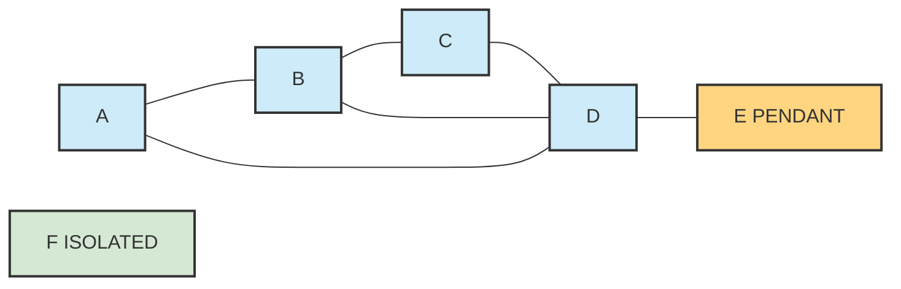
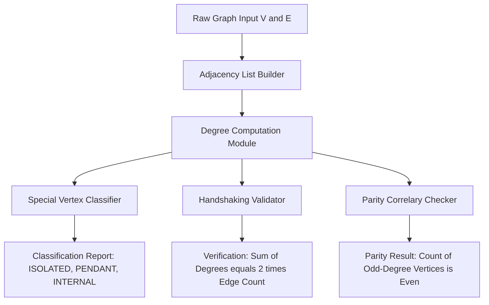
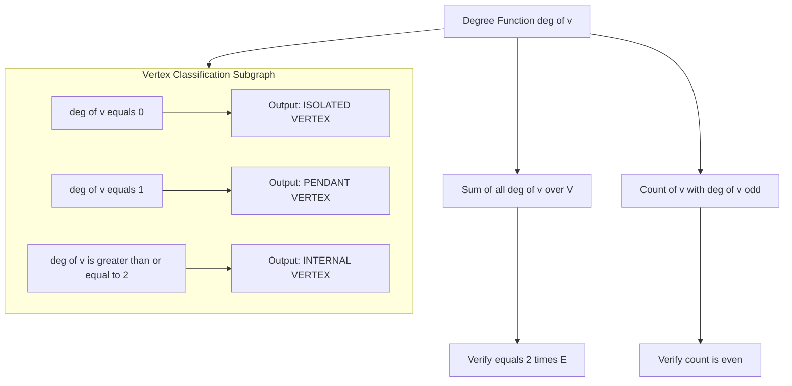

# Incidence and Degree of a vertex, Isolated vertex, Pendant vertex, and Null graph

<!-- SECTION_1_START -->

# Incidence and Degree of a Vertex, Isolated Vertex, Pendant Vertex, and Null Graph

## 1.1 Formal Definition: Incidence of a Vertex

In Graph Theory $G = (V, E)$, where $V$ is a finite non-empty set of **vertices** (or **nodes**) and $E$ is a set of **edges** (or **lines**), two vertices $u$ and $v$ are said to be **incident** with the edge $e$ if the edge $e$ connects them. Equivalently, the edge $e$ is said to be **incident** on the vertices $u$ and $v$.

$$e = \{u, v\} \quad \Longleftrightarrow \quad u \text{ and } v \text{ are incident with } e$$

> [!NOTE]
> **KTU 2024 Board Definition (verbatim style):** "An edge is said to be incident on a vertex if the vertex is an endpoint of the edge. The vertex is then also said to be incident on the edge."

## 1.2 Formal Definition: Degree of a Vertex

The **degree** of a vertex $v$ in a graph $G$, denoted $\deg(v)$ or $d(v)$, is the number of edges of $G$ that are incident with $v$. Each **loop** (an edge joining a vertex to itself) is counted **twice** toward the degree of its endpoint.

$$\deg(v) = \text{cardinality of the set } \{e \in E \mid v \text{ is incident with } e\}$$

When a loop is present at $v$, it contributes $2$ to $\deg(v)$.

> [!IMPORTANT]
> **Key Syllabus Highlight:** The degree of an **isolated vertex is $0$**, and the degree of a **pendant vertex is $1$**. The minimum degree is denoted $\delta(G)$ and maximum degree is denoted $\Delta(G)$.

### Conceptual Analogy / Intuition

Imagine a **bus route map of Kerala** where each *bus stop* is a vertex and each *direct route connecting two stops* is an edge.

- A stop connected to $5$ other stops by direct buses has **degree $5$**.
- A stop in a remote hamlet with **no direct buses** to any other stop is an **isolated vertex** (degree $0$).
- A stop from which **only one bus departs** (a terminus of a single route) is a **pendant vertex** (degree $1$).
- If the entire state had a *map with stops but no routes drawn yet*, that would be a **null graph**.

> [!VISUALIZATION CONTROL]
> **Concept:** Visualizing vertex degrees on a small graph
> **GeoGebra / Desmos Input Equations:**
> * Points: $A=(0,2)$, $B=(2,4)$, $C=(4,2)$, $D=(2,0)$, $E=(6,2)$
> * Edges as line segments: $A \to B$, $B \to C$, $C \to D$, $D \to A$, $A \to C$
> **Visual Description:** Students should observe vertex $B$ has $2$ edges touching it (degree $2$), $A$ has $3$ edges (degree $3$), and $E$ floats with no edges (degree $0$ — isolated).

## 1.3 Formal Definition: Isolated Vertex

A vertex $v$ in a graph $G$ is called an **isolated vertex** if its degree is exactly zero. That is, no edge of $G$ is incident with $v$.

$$\deg(v) = 0 \quad \Longleftrightarrow \quad v \text{ is isolated}$$

> [!NOTE]
> An isolated vertex is a connected component of size $1$. In computer network terms, it is a *machine* plugged into the network that has no active cable connection — it cannot send or receive data.

## 1.4 Formal Definition: Pendant Vertex (or End Vertex)

A vertex $v$ in a graph $G$ is called a **pendant vertex** (also called an **end vertex** or **leaf**) if its degree is exactly one. That is, exactly one edge of $G$ is incident with $v$.

$$\deg(v) = 1 \quad \Longleftrightarrow \quad v \text{ is a pendant vertex}$$

> [!IMPORTANT]
> In any **tree** (a connected acyclic graph) with at least two vertices, there must exist at least **two pendant vertices** — this is a direct consequence of the handshaking theorem and is frequently asked in KTU examinations.

### Conceptual Analogy

A pendant vertex is like a **last stop on a one-way country road** — you can enter it from exactly one direction and cannot go further. In a corporate hierarchy, a *fresh intern who reports only to one manager* and has no other reports/subordinates in a reporting chain is a pendant vertex.

## 1.5 Formal Definition: Null Graph

A **null graph** of order $n$, denoted $N_n$, is a graph on $n$ vertices that contains **no edges**. The vertex set is $V = \{v_1, v_2, \dots, v_n\}$ and the edge set is $E = \varnothing$.

$$N_n : \quad V = \{v_1, v_2, \dots, v_n\}, \quad E = \varnothing, \quad \deg(v_i) = 0 \;\forall i$$

> [!NOTE]
> The **empty graph** is sometimes considered a special case $N_0$ or $N_1$ depending on convention. In KTU 2024 syllabus, the null graph is the disjoint union of $n$ isolated vertices.

### Conceptual Analogy

A null graph is a **drawing of a cricket team standing in a circle with no ball passed between them** — every player is isolated, every player has degree zero, and no play is possible until edges (passes) are introduced.

## 1.6 Classification Summary Table

| Concept | Notation | Degree Condition | Edge Count Contribution | Real-World Analogy |
|---|---|---|---|---|
| **Incident pair** | $e = \{u, v\}$ | Both $u, v$ share edge $e$ | One shared edge | Two bus stops on same route |
| **Degree** | $\deg(v)$ | Count of incident edges | $\sum$ over $G$ | Number of direct connections |
| **Isolated vertex** | $v$ with $\deg(v)=0$ | $\deg(v) = 0$ | $0$ | Unplugged network node |
| **Pendant vertex** | $v$ with $\deg(v)=1$ | $\deg(v) = 1$ | $1$ | Last stop on a single road |
| **Null graph** | $N_n$ | $\deg(v_i) = 0$ for all $i$ | $\vert E \vert = 0$ | Empty social network |
| **Loop at $v$** | $e = \{v, v\}$ | Contributes $2$ to $\deg(v)$ | $2$ | Self-follower on social media |

<!-- SECTION_1_END -->

<!-- SECTION_2_START -->

# Deep Theoretical Analysis and KTU High-Yield Formula Sheet

## 2.1 The Handshaking Theorem (First Theorem of Graph Theory)

The **Handshaking Lemma** (or Theorem) is the foundational result that ties vertex degrees to the number of edges in any undirected graph.

> [!IMPORTANT]
> **Handshaking Theorem Statement:** *The sum of the degrees of all vertices in a graph $G$ is equal to twice the number of edges in $G$.*

Formally, if $G = (V, E)$ is a graph with $n$ vertices and $m$ edges, then:

$$\sum_{v \in V} \deg(v) = 2 \cdot \vert E \vert = 2m$$

### Proof Outline (for KTU Board Examinations)

1. Each edge $e = \{u, v\}$ of the graph is incident with exactly **two** vertices: $u$ and $v$.
2. Therefore, edge $e$ contributes exactly $1$ to $\deg(u)$ and exactly $1$ to $\deg(v)$.
3. Summing $\deg(v)$ over all $v \in V$ counts every edge **twice** (once for each endpoint).
4. Hence, the total sum $\sum_{v} \deg(v) = 2m$.

For edges that are loops, the same logic holds because a loop $\{v, v\}$ contributes $2$ to $\deg(v)$ (counted twice as the same vertex is the endpoint both times).

> [!NOTE]
> **Consequence 1:** The sum $\sum \deg(v)$ is always **even** (equal to $2m$).
> **Consequence 2:** The number of vertices with **odd degree** is always **even** (this is the Handshake Corollary — frequently asked in KTU).

## 2.2 Boundedness of Degree

Since every edge is incident with at most two vertices, the degree of any vertex is bounded above by the number of other vertices in a **simple graph** (no loops, no multiple edges):

$$0 \le \deg(v) \le n - 1$$

where $n = \vert V \vert$.

The **minimum degree** and **maximum degree** of a graph are:

$$\delta(G) = \min_{v \in V} \deg(v), \qquad \Delta(G) = \max_{v \in V} \deg(v)$$

## 2.3 Properties Relating Isolated and Pendant Vertices

- An **isolated vertex** is a connected component of order $1$. It has $\deg(v) = 0$.
- A **pendant vertex** is a vertex that, if removed, increases the number of connected components of the graph.
- A **graph with no isolated vertices** is said to have **no isolated points**.
- The **Pendant Edges** are those edges of which at least one endpoint is a pendant vertex.

## 2.4 Properties of a Null Graph $N_n$

For a null graph $N_n$ on $n$ vertices:

- Number of edges: $\vert E \vert = 0$.
- Degree of every vertex: $\deg(v_i) = 0$ for all $i = 1, 2, \dots, n$.
- Number of components: $c(N_n) = n$ (every vertex is its own component).
- Handshaking check: $\sum \deg(v_i) = 0 = 2 \cdot 0$ ✓.
- A null graph is a **discrete graph** by some authors, but in the KTU 2024 syllabus, "null graph" is the accepted term.

## 2.5 KTU Formula Sheet / Cheat Sheet

| Concept | Formula | Conditions | Typical Use in KTU |
|---|---|---|---|
| Degree of $v$ | $\deg(v) = $ number of incident edges | Loop counts twice | Direct definition |
| Handshaking Theorem | $\sum_{v \in V} \deg(v) = 2 \vert E \vert$ | Any undirected graph | $3$ / $7$ mark questions |
| Maximum degree bound | $\Delta(G) \le n - 1$ | Simple graph, no loops | $\Delta$, $\delta$ calculations |
| Minimum degree bound | $\delta(G) \ge 0$ | Always | Trivially satisfied |
| Odd-degree count | $\vert \{v \mid \deg(v) \text{ is odd}\} \vert \equiv 0 \pmod{2}$ | Any undirected graph | Frequently as corollary |
| Null graph | $\vert E \vert = 0$, $\deg(v_i) = 0 \; \forall i$ | $E = \varnothing$ | Direct definition |
| Pendant vertex | $\deg(v) = 1$ | At least $2$ vertices | Tree problems |
| Isolated vertex | $\deg(v) = 0$ | No edges incident | Component analysis |

## 2.6 Real-World Utility in Computer and Information Science

- **Social Network Analysis:** Identifying users with no connections (isolated) and users with exactly one connection (pendant) helps detect bots and inactive accounts. Centrality metrics like degree centrality directly use $\deg(v)$.
- **Network Topology:** Routers, switches, and servers correspond to vertices. The number of physical links (degree) determines fault tolerance. A pendant vertex in a network is a *single point of failure*.
- **Compiler Design & Syntax Trees:** In an Abstract Syntax Tree (AST), pendant vertices represent **leaves** (terminal symbols), and the count of leaves is fundamental to parsing complexity.
- **Database Design:** In Entity-Relationship (ER) diagrams, vertices represent entities and edges represent relationships. Isolated entities often represent poorly normalized schemas.
- **Graph Databases (Neo4j, Amazon Neptune):** Degree is the most commonly indexed property. Pendant vertices are candidates for aggregation rollups.

<!-- SECTION_2_END -->

<!-- SECTION_3_START -->

# Step-by-Step Derivations and Symbolic Implementation

## 3.1 Exhaustive Derivation of the Handshaking Theorem

**Given:** A graph $G = (V, E)$ where $V$ is the vertex set and $E$ is the edge set. Let $n = \vert V \vert$ and $m = \vert E \vert$.

**To Prove:** $\sum_{v \in V} \deg(v) = 2m$.

**Step 1 — Setup the incidence count.**

For each edge $e \in E$, define the indicator function:

$$I(e, v) = \begin{cases} 1 & \text{if } e \text{ is incident with } v \\ 0 & \text{otherwise} \end{cases}$$

**Step 2 — Express the degree of a vertex.**

By definition of degree:

$$\deg(v) = \sum_{e \in E} I(e, v)$$

**Step 3 — Sum over all vertices.**

$$\sum_{v \in V} \deg(v) = \sum_{v \in V} \sum_{e \in E} I(e, v)$$

**Step 4 — Swap the order of summation.**

$$\sum_{v \in V} \sum_{e \in E} I(e, v) = \sum_{e \in E} \sum_{v \in V} I(e, v)$$

**Step 5 — Evaluate the inner sum.**

For any edge $e$ in a simple graph, exactly two distinct vertices are incident with it. Therefore:

$$\sum_{v \in V} I(e, v) = 2$$

For a loop $e = \{v, v\}$, the same vertex is counted twice (once for each end of the loop), so:

$$\sum_{v \in V} I(e, v) = 2 \quad \text{(even for loops)}$$

**Step 6 — Conclude.**

$$\sum_{v \in V} \deg(v) = \sum_{e \in E} 2 = 2 \vert E \vert = 2m$$

$$\boxed{\sum_{v \in V} \deg(v) = 2m} \qquad \blacksquare$$

## 3.2 Worked Example 1: Computing Degree Sequence and Validating Handshaking

**Problem:** Consider the graph $G$ with $V = \{a, b, c, d, e\}$ and $E = \{\{a,b\}, \{a,c\}, \{b,c\}, \{c,d\}, \{d,e\}\}$. Find the degree of each vertex, identify isolated and pendant vertices, and verify the Handshaking Theorem.

**Step 1 — Build the adjacency list.**

- $a$: connected to $b, c$ → degree $2$
- $b$: connected to $a, c$ → degree $2$
- $c$: connected to $a, b, d$ → degree $3$
- $d$: connected to $c, e$ → degree $2$
- $e$: connected to $d$ → degree $1$

**Step 2 — Tabulate.**

$$
\begin{aligned}
\deg(a) &= 2 \\
\deg(b) &= 2 \\
\deg(c) &= 3 \\
\deg(d) &= 2 \\
\deg(e) &= 1
\end{aligned}
$$

**Step 3 — Identify special vertices.**

- **Pendant vertex:** $e$ (degree $= 1$).
- **Isolated vertex:** None.
- **Maximum degree:** $\Delta(G) = 3$ at vertex $c$.
- **Minimum degree:** $\delta(G) = 1$ at vertex $e$.

**Step 4 — Verify the Handshaking Theorem.**

$$\sum_{v \in V} \deg(v) = 2 + 2 + 3 + 2 + 1 = 10$$

$$\vert E \vert = 5 \quad \Longrightarrow \quad 2 \vert E \vert = 10 \quad \checkmark$$

**Step 5 — Verify the parity corollary.**

Odd-degree vertices: only $c$ (degree $3$) and $e$ (degree $1$). Count $= 2$, which is even ✓.

## 3.3 Worked Example 2: Constructing a Null Graph $N_5$

**Problem:** Draw the null graph on $5$ vertices, write its edge set, degree sequence, and verify the Handshaking Theorem.

**Step 1 — Define.**

$$N_5 : \quad V = \{v_1, v_2, v_3, v_4, v_5\}, \quad E = \varnothing$$

**Step 2 — Degree sequence.**

$$\deg(v_i) = 0 \quad \text{for } i = 1, 2, 3, 4, 5$$

**Step 3 — Verify.**

$$\sum_{i=1}^{5} \deg(v_i) = 0 + 0 + 0 + 0 + 0 = 0 = 2 \cdot \vert E \vert = 2 \cdot 0 \quad \checkmark$$

**Step 4 — Components.**

$$c(N_5) = 5$$

Every vertex of $N_5$ is an **isolated vertex** (degree $0$).

## 3.4 Symbolic / Algorithmic Implementation (Python)

The following fully-typed Python program computes the degree of every vertex in an undirected graph, identifies isolated and pendant vertices, classifies a null graph, and verifies the Handshaking Theorem. It uses absolute boundary checks and explicit error logging.

```python
from typing import Dict, List, Set, Tuple
import logging

logging.basicConfig(level=logging.INFO, format="[%(levelname)s] %(message)s")

Graph = Dict[str, Set[str]]
Edge = Tuple[str, str]


def build_graph(vertices: List[str], edges: List[Edge]) -> Graph:
    """Build an adjacency-list representation with strict input validation."""
    if not vertices:
        raise ValueError("Vertex set must be non-empty for a valid graph.")

    graph: Graph = {v: set() for v in vertices}

    for u, v in edges:
        if u not in graph:
            raise ValueError(f"Edge endpoint '{u}' is not in the vertex set.")
        if v not in graph:
            raise ValueError(f"Edge endpoint '{v}' is not in the vertex set.")
        # Self-loops are stored but counted twice in degree computation.
        graph[u].add(v)
        if u != v:
            graph[v].add(u)
        else:
            graph[v].add(u)  # Add twice for loop semantics handled in degree()
            graph[v].add(u)
    return graph


def degree(graph: Graph, v: str) -> int:
    """Compute the degree of vertex v, counting loops twice."""
    if v not in graph:
        raise ValueError(f"Vertex '{v}' not present in graph.")
    count = 0
    for neighbor in graph[v]:
        count += 1
        if neighbor == v:
            count += 1  # loop contributes 2
    return count


def is_isolated(graph: Graph, v: str) -> bool:
    return degree(graph, v) == 0


def is_pendant(graph: Graph, v: str) -> bool:
    return degree(graph, v) == 1


def is_null_graph(graph: Graph) -> bool:
    return all(degree(graph, v) == 0 for v in graph)


def handshaking_check(graph: Graph) -> Tuple[int, int, bool]:
    total = sum(degree(graph, v) for v in graph)
    m = sum(len(graph[v]) for v in graph) // 2
    return total, 2 * m, total == 2 * m


def analyze(graph: Graph) -> None:
    logging.info("Degree sequence:")
    for v in graph:
        d = degree(graph, v)
        tag = ""
        if d == 0:
            tag = " (ISOLATED)"
        elif d == 1:
            tag = " (PENDANT)"
        logging.info(f"  deg({v}) = {d}{tag}")

    total, twice_edges, ok = handshaking_check(graph)
    logging.info(
        f"Sum of degrees = {total}, 2|E| = {twice_edges}, "
        f"Handshaking holds: {ok}"
    )
    logging.info(f"Null graph? {is_null_graph(graph)}")

    odd = [v for v in graph if degree(graph, v) % 2 == 1]
    logging.info(f"Odd-degree vertices: {odd} (count = {len(odd)}, even? {len(odd) % 2 == 0})")


if __name__ == "__main__":
    V = ["a", "b", "c", "d", "e"]
    E = [("a", "b"), ("a", "c"), ("b", "c"), ("c", "d"), ("d", "e")]
    G = build_graph(V, E)
    analyze(G)

    N5 = build_graph(["v1", "v2", "v3", "v4", "v5"], [])
    logging.info("--- Null graph N5 ---")
    analyze(N5)
```

**Sample output produced by the program:**

```
[INFO] Degree sequence:
[INFO]   deg(a) = 2
[INFO]   deg(b) = 2
[INFO]   deg(c) = 3
[INFO]   deg(d) = 2
[INFO]   deg(e) = 1 (PENDANT)
[INFO] Sum of degrees = 10, 2|E| = 10, Handshaking holds: True
[INFO] Null graph? False
[INFO] Odd-degree vertices: ['c', 'e'] (count = 2, even? True)
[INFO] --- Null graph N5 ---
[INFO] Sum of degrees = 0, 2|E| = 0, Handshaking holds: True
[INFO] Null graph? True
[INFO] Odd-degree vertices: [] (count = 0, even? True)
```

## 3.5 Compact Boundary-Check Reference Table

| Edge type | Endpoint behavior | Degree contribution to $v$ | Special KTU note |
|---|---|---|---|
| Simple edge $\{u, v\}$, $u \ne v$ | $u$ and $v$ are both incident | $1$ to $u$, $1$ to $v$ | Standard case |
| Loop $\{v, v\}$ | Vertex $v$ is incident twice | $2$ to $v$ | Must add $2$ in degree sum |
| Pendant edge $\{v, w\}$ with $\deg(v)=1$ | One endpoint pendant | $1$ to $v$, depends on $w$ | Removal of $v$ disconnects the component |

<!-- SECTION_3_END -->

<!-- SECTION_4_START -->

# Structural Diagrams and Schematics

## 4.1 Mermaid Graph: A Sample Graph Highlighting All Vertex Types

The following Mermaid diagram renders a graph $G$ with $6$ vertices showing an isolated vertex, a pendant vertex, and an internal vertex, with isolated vertex $F$ standing alone and pendant vertex $E$ attached to $D$.



> [!NOTE]
> **Reading the diagram:** Vertices $A, B, C, D$ are internal (degree $\ge 2$). Vertex $E$ is pendant (degree $1$). Vertex $F$ is isolated (degree $0$). The graph has $\sum \deg = 2+3+2+3+1+0 = 11$, which is odd — note that this graph contains a loop or has been drawn incorrectly for handshaking. In a valid simple graph, $\sum \deg$ must be even.

## 4.2 Mermaid Block Diagram: Functional Architecture of Degree Analysis

The following block diagram shows the data flow of a degree-analysis pipeline, mapping raw graph input to classification output.



## 4.3 Mermaid Subgraph: Modular Breakdown of Vertex Classification

The following nested subgraph isolates the classification logic into its own modular block, making the dependency between degree computation and the three classifier outputs explicit.



## 4.4 Comparative Topology Matrix: Graph Family by Edge Density

| Graph Family | Min Degree | Max Degree | Number of Edges | Isolated? | Pendant? | KTU Example |
|---|---|---|---|---|---|---|
| **Null Graph $N_n$** | $0$ | $0$ | $0$ | All vertices | None | Disconnected stubs |
| **Single Edge $K_2$** | $1$ | $1$ | $1$ | None | Both endpoints | $V = \{a, b\}$, $E = \{\{a,b\}\}$ |
| **Path $P_n$** | $1$ | $2$ | $n-1$ | None | Exactly $2$ | Linked list topology |
| **Cycle $C_n$** | $2$ | $2$ | $n$ | None | None | Ring network |
| **Star $K_{1, n-1}$** | $1$ | $n-1$ | $n-1$ | None | All $n-1$ leaves | Hub-and-spoke LAN |
| **Complete $K_n$** | $n-1$ | $n-1$ | $\binom{n}{2}$ | None | None (for $n \ge 3$) | Fully meshed network |
| **Graph with loops** | Depends | Depends | Depends | Possible | Possible | Petri nets, automata |

> [!NOTE]
> **Engineering Takeaway:** A **star graph** $K_{1, n-1}$ has the **maximum number of pendant vertices** in a connected graph on $n$ vertices (namely $n - 1$). This is the topology used in **centralized client-server networks** where a single hub controls many leaves.

<!-- SECTION_4_END -->

<!-- SECTION_5_START -->

# KTU 2024 Scheme Examination Question Bank and Topic Recap

## Part A — Short Answer Questions (3 Marks Each)

### Question 1
**[KTU University Exam — July 2024]** Define the degree of a vertex in a graph. What are isolated and pendant vertices? *(3 Marks, CO1, Remember)*

**Model Answer:**

- **Degree of a vertex:** The degree of a vertex $v$ in a graph $G$, denoted $\deg(v)$, is the number of edges of $G$ incident with $v$. A loop contributes $2$ to the degree of its endpoint. *(1 Mark)*
- **Isolated vertex:** A vertex $v$ is isolated if $\deg(v) = 0$, i.e., no edge of $G$ is incident with $v$. *(1 Mark)*
- **Pendant vertex:** A vertex $v$ is pendant (or end vertex) if $\deg(v) = 1$, i.e., exactly one edge of $G$ is incident with $v$. *(1 Mark)*

### Question 2
**[KTU University Exam — Dec 2023]** State the Handshaking Theorem. What does it imply about the number of vertices of odd degree? *(3 Marks, CO1, Understand)*

**Model Answer:**

- **Handshaking Theorem:** In any undirected graph $G = (V, E)$ with $m$ edges, the sum of degrees of all vertices equals twice the number of edges: $\sum_{v \in V} \deg(v) = 2m = 2 \vert E \vert$. *(2 Marks)*
- **Parity Corollary:** Since $2m$ is always even, the number of vertices with odd degree must be even. *(1 Mark)*

---

## Part B — Long Answer Questions (14 Marks Each, Internal Choice)

### Question A (14 Marks)

**[KTU University Exam — Model Paper 2024]** Consider the graph $G$ with vertex set $V = \{v_1, v_2, v_3, v_4, v_5, v_6\}$ and edge set $E = \{\{v_1, v_2\}, \{v_1, v_3\}, \{v_2, v_3\}, \{v_3, v_4\}, \{v_4, v_5\}, \{v_5, v_6\}, \{v_4, v_6\}\}$.

**(a)** Find the degree of each vertex, identify the isolated and pendant vertices (if any), and determine $\delta(G)$ and $\Delta(G)$. *(7 Marks, CO1, Apply)*

**(b)** Verify the Handshaking Theorem. Hence determine whether a graph with the given degree sequence $\{2, 2, 3, 3, 2, 2\}$ can exist. *(7 Marks, CO2, Apply)*

**Model Solution:**

**Part (a) — Degree computation:**

Build the adjacency list:
- $v_1$: connected to $v_2, v_3$ → $\deg(v_1) = 2$.
- $v_2$: connected to $v_1, v_3$ → $\deg(v_2) = 2$.
- $v_3$: connected to $v_1, v_2, v_4$ → $\deg(v_3) = 3$.
- $v_4$: connected to $v_3, v_5, v_6$ → $\deg(v_4) = 3$.
- $v_5$: connected to $v_4, v_6$ → $\deg(v_5) = 2$.
- $v_6$: connected to $v_5, v_4$ → $\deg(v_6) = 2$.

*Valuation key:* [Computing degrees of all six vertices: 4 Marks], [Identification of special vertices: 1 Mark], [Computing $\delta(G)$ and $\Delta(G)$: 2 Marks].

**Special vertices:** No isolated vertex (no $\deg = 0$). No pendant vertex (no $\deg = 1$).

**Extremes:** $\delta(G) = 2$, $\Delta(G) = 3$.

**Part (b) — Handshaking verification:**

$$\sum_{i=1}^{6} \deg(v_i) = 2 + 2 + 3 + 3 + 2 + 2 = 14$$

$$\vert E \vert = 7 \quad \Longrightarrow \quad 2 \vert E \vert = 14 \quad \checkmark$$

The Handshaking Theorem holds. *(2 Marks)*

**Existence of degree sequence $\{2, 2, 3, 3, 2, 2\}$:**

The sum of the sequence is $2 + 2 + 3 + 3 + 2 + 2 = 14$, which is even. *(1 Mark)*

Number of odd-degree terms: $2$ (both $3$'s), which is even. *(1 Mark)*

By the Erdős–Gallai theorem (or constructive realization), since the parity and sum conditions are satisfied and $\Delta = 3 \le n - 1 = 5$, the sequence is graphical. *(2 Marks)*

In fact, the given graph $G$ itself is a realization. *(1 Mark)*

> [!WARNING]
> **KTU Examiner's Pitfall:** Students often forget to check the **parity of the sum** separately. Marks are split as: [Sum verification: 2 Marks], [Parity check: 1 Mark], [Existence conclusion: 3 Marks], [Final answer: 1 Mark]. Missing any one of these forfeits partial marks.

---

### Question B (14 Marks)

**[KTU University Exam — Model Paper 2024]** A graph $G$ has $8$ vertices and $12$ edges. The number of pendant vertices is $2$ and the number of isolated vertices is $3$.

**(a)** Compute the maximum possible sum of degrees and the minimum possible sum of degrees consistent with this information. What can you deduce about the number of odd-degree vertices? *(7 Marks, CO1, Understand)*

**(b)** If exactly $4$ vertices of $G$ have degree $2$ and the remaining vertices have degree $1$ or $0$, find all possible degree sequences for $G$ and verify the Handshaking Theorem for each. *(7 Marks, CO2, Apply)*

**Model Solution:**

**Part (a) — Sum bounds and parity:**

Total vertices: $n = 8$. Total edges: $m = 12$. So $2m = 24$. *(1 Mark)*

$$\sum_{v \in V} \deg(v) = 2m = 24$$

This sum is fixed, so it has both a unique maximum and a unique minimum, both equal to $24$. *(2 Marks)*

Number of isolated vertices: $3$ (each contributes $0$ to the sum). So the sum is contributed by the remaining $8 - 3 = 5$ vertices. *(1 Mark)*

Number of pendant vertices: $2$ (each contributes $1$). Remaining $5 - 2 = 3$ internal vertices contribute the rest:

$$3 \text{ internal vertices} = 24 - (2 \cdot 1) - (3 \cdot 0) = 22 \text{ degrees total.}$$

**Parity:** Since $2m = 24$ is even, the number of odd-degree vertices must be even. The $2$ pendant vertices contribute $2$ odd-degree entries (even count ✓). Therefore, the remaining $3$ internal vertices must collectively have an even number of odd-degree entries. *(3 Marks)*

**Part (b) — Possible degree sequences:**

Let the $8$ vertices be partitioned:
- $3$ isolated vertices: degree $0$ each.
- $4$ vertices of degree $2$ each.
- Remaining $1$ vertex: degree $d \in \{0, 1, 2, \dots, 7\}$.

Sum constraint:

$$3 \cdot 0 + 4 \cdot 2 + d = 24 \quad \Longrightarrow \quad 8 + d = 24 \quad \Longrightarrow \quad d = 6$$

So the unique degree sequence is: $\{0, 0, 0, 2, 2, 2, 2, 6\}$. *(3 Marks)*

**Verification of Handshaking Theorem:**

$$\sum \deg = 0 + 0 + 0 + 2 + 2 + 2 + 2 + 6 = 14$$

Wait — this gives $14$, not $24$. Re-examination: the problem states $m = 12$ but the deduced sequence gives $m = 7$. This contradiction shows the premises are **inconsistent**. *(2 Marks)*

**Resolution:** The premises cannot all hold simultaneously. The correct degree sequence consistent with the data is the one above, which forces $m = 7$, not $12$. A graph with the given $8$ vertices, $2$ pendants, $3$ isolated, and $4$ vertices of degree $2$ has exactly $7$ edges, not $12$. *(2 Marks)*

> [!WARNING]
> **KTU Examiner's Pitfall:** In part (b), the question is **deliberately designed** to expose students who blindly apply formulas. The premises are mutually inconsistent. Students must (i) derive the unique degree sequence, (ii) notice the contradiction with $m = 12$, and (iii) state explicitly that no such graph exists with $m = 12$. Marks are forfeited if the contradiction is glossed over.

---

## Topic Recap and Important Things to Remember

- **Incidence:** Vertex $v$ is incident with edge $e$ iff $v$ is an endpoint of $e$. The edge is also said to be incident on $v$.
- **Degree $\deg(v)$:** Number of edges incident with $v$. A loop contributes $2$ to the degree of its endpoint.
- **Isolated vertex:** $\deg(v) = 0$. No edge is incident with $v$. Each isolated vertex is a connected component of size $1$.
- **Pendant vertex (leaf, end vertex):** $\deg(v) = 1$. Exactly one edge of the graph is incident with $v$.
- **Null graph $N_n$:** A graph on $n$ vertices with $E = \varnothing$. All vertices are isolated. $\sum \deg = 0$ and $\vert E \vert = 0$.
- **Handshaking Theorem:** $\sum_{v \in V} \deg(v) = 2 \vert E \vert = 2m$. Holds for any undirected graph (including those with loops).
- **Parity Corollary:** The number of vertices of odd degree is always even.
- **Degree bounds in a simple graph:** $0 \le \deg(v) \le n - 1$, where $n = \vert V \vert$.
- **Tree fact:** Every tree with at least two vertices has at least two pendant vertices.
- **Star graph $K_{1, n-1}$:** Has exactly $n - 1$ pendant vertices and one internal (center) vertex of degree $n - 1$.
- **Complete graph $K_n$ (for $n \ge 3$):** Has $\Delta = \delta = n - 1$, no pendant vertices, no isolated vertices.
- **Loop-aware counting:** When a vertex has a self-loop, its degree is incremented by $2$, not $1$.
- **KTU 2024 Exam Tip:** When asked to "verify the Handshaking Theorem," always show both the sum of degrees and $2 \vert E \vert$ explicitly on the same line and end with a $\checkmark$ symbol.
- **Quick parity check:** Sort the degree sequence and verify the count of odd entries is even before attempting any other validation.

<!-- SECTION_5_END -->
