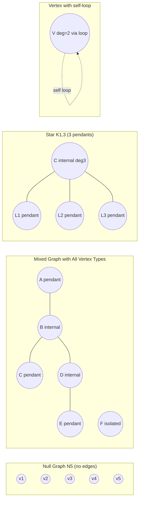
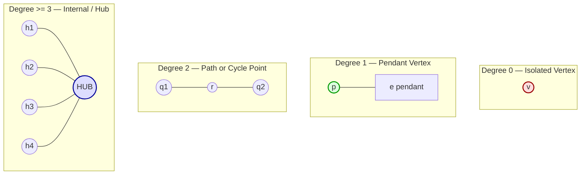
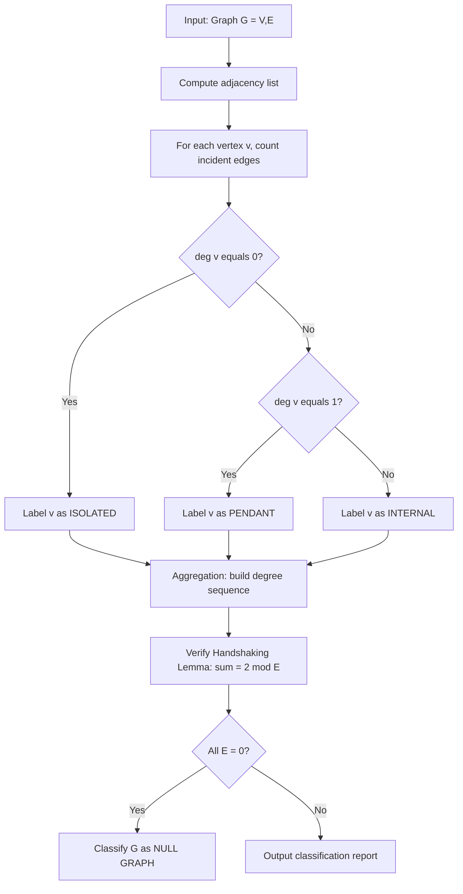
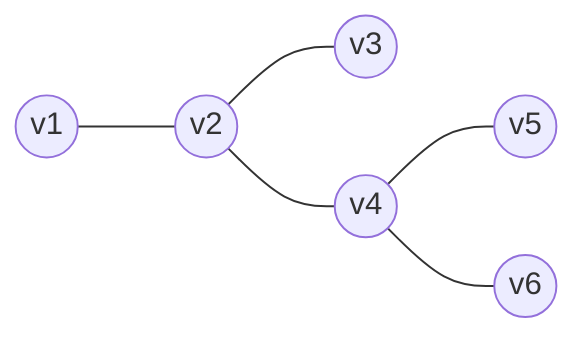

# Incidence and Degree of a vertex, Isolated vertex, Pendant vertex, and Null graph

<!-- SECTION_1_START -->
# 1. Core Technical Definition & Intuitive Overview

## 1.1 Incidence (Vertex–Edge Relationship)

In Graph Theory, an **incidence** is the relationship that exists between a vertex and the edges that "touch" or "connect to" that vertex. Formally:

> [!IMPORTANT]
> **Definition (KTU 2024 Syllabus — Graph Incidence):**
> An edge $e = (u, v)$ in an undirected simple graph $G = (V, E)$ is said to be **incident** with vertices $u$ and $v$. Equivalently, the two vertices $u$ and $v$ are called the **endpoints** (or **end vertices**) of the edge $e$. The relationship is symmetric — if $e$ is incident to $u$, then $u$ is incident to $e$.

- In a **directed graph**, an edge $\vec{e} = (u, v)$ is **incident from** $u$ (the tail) and **incident to** $v$ (the head).
- Two edges sharing a common endpoint are said to be **adjacent edges**.
- Two vertices connected by an edge are said to be **adjacent vertices**.

**Intuitive Analogy:** Think of a graph as a metro map. Each **station** is a vertex, and each **track segment** is an edge. The track segment is *incident* to the two stations it physically connects. The stations are *adjacent* if a single track runs directly between them.

## 1.2 Degree of a Vertex

The **degree** of a vertex $v$, denoted $\deg(v)$ (or $d(v)$), is the number of edges that are incident to $v$, with the convention that a self-loop (an edge from $v$ back to itself) contributes **twice** to the count.

> [!NOTE]
> **Formal Definition:**
> For a finite undirected graph $G = (V, E)$ without loops,
> $$\deg(v) = \text{number of edges incident to } v.$$
> If loops are present, each loop at $v$ contributes **2** to $\deg(v)$.

**Real-world engineering use:** Vertex degree is the cornerstone metric in **network analysis** — it quantifies how "connected" or "popular" a node is. Social networks use it for influence ranking, the internet's BGP routers use it to gauge traffic hub importance, and circuit designers use it to compute load on a pin.

## 1.3 Isolated Vertex

> [!IMPORTANT]
> **Definition (Isolated Vertex):**
> A vertex $v \in V$ is called an **isolated vertex** if and only if $\deg(v) = 0$. That is, no edge of the graph touches $v$.

**Analogy:** Imagine a city bus-stop that has no road connected to it — completely unreachable. In software engineering, an isolated vertex in a dependency graph represents an **orphan module** with no imports and no dependents.

## 1.4 Pendant Vertex

> [!IMPORTANT]
> **Definition (Pendant Vertex):**
> A vertex $v \in V$ is called a **pendant vertex** (or **end vertex** or **leaf**) if and only if $\deg(v) = 1$. It lies at the "tip" of exactly one edge, which is itself called a **pendant edge**.

**Analogy:** A pendant vertex is like a leaf on a tree-branch — only one stem connects it to the rest of the plant. In a file-system tree, leaf folders are pendant vertices.

## 1.5 Null Graph

> [!IMPORTANT]
> **Definition (Null Graph):**
> A **null graph** of order $n$, written $N_n$, is a graph on $n$ vertices with **no edges** at all, i.e. $E = \varnothing$. Every vertex in a null graph is therefore an **isolated vertex**.

The degenerate case $N_1$ is a graph containing exactly one vertex and no edges. The smallest non-trivial null graph is $N_2$ — two disconnected points.

> [!VISUALIZATION CONTROL]
> **Concept:** Plot of a null graph $N_5$ and a small graph with isolated & pendant vertices
> **GeoGebra / Desmos Input Points:**
> * `P1 = (0, 0)` , `P2 = (2, 0)` , `P3 = (4, 0)` , `P4 = (6, 0)` , `P5 = (8, 0)`
> **Visual Description:** Five dots spread along the x-axis with **no segments drawn** between them — this is $N_5$. To see an isolated vertex, plot an extra dot `Q = (10, 0)` disconnected from the others. To see a pendant vertex, add a segment from `P5` to a new point `P6 = (9, 1)`.
<!-- SECTION_1_END -->

<!-- SECTION_2_START -->
# 2. Deep Theoretical Analysis & KTU High-Yield Formula Sheet

## 2.1 Structural Classification of Vertices

A vertex $v$ of an undirected graph $G = (V, E)$ falls into one of the following exhaustive categories based on its degree:

| Category | Condition on $\deg(v)$ | Notation | Common Name |
|---|---|---|---|
| Isolated vertex | $\deg(v) = 0$ | $v$ is unreachable | Lonely point |
| Pendant vertex | $\deg(v) = 1$ | Leaf / End-vertex | Tree-tip |
| Internal vertex | $\deg(v) \ge 2$ | Non-leaf | Junction |
| Loop-bearing vertex | loop at $v$ adds **2** to degree | — | Self-connected |

## 2.2 The Handshaking Lemma (Foundational Identity)

The single most important identity connecting vertex degrees to the edge set is the **Handshaking Lemma**, sometimes called the *First Theorem of Graph Theory*.

> [!NOTE]
> **Handshaking Lemma:**
> Let $G = (V, E)$ be a finite undirected graph. Then
> $$\sum_{v \in V} \deg(v) = 2 \cdot \vert E \vert$$
> The sum of the degrees of all vertices equals **twice the number of edges**.

**Why it works (intuition):** Every edge has exactly **two** endpoints, so it is "counted once" at each of its endpoints during the summation. Hence the total count is $2 \times (\text{number of edges})$.

**Engineering corollary:** The handshaking lemma immediately implies that the number of vertices of **odd degree** in any undirected graph is always **even**. This is why a party of people cannot all shake hands with an odd number of others — the *odd-degree* people must come in pairs.

## 2.3 The Handshake Theorem — Generalised for Loops

If the graph contains $L$ self-loops and $E'$ non-loop edges, then:

$$\sum_{v \in V} \deg(v) = 2 \cdot \vert E' \vert + 2L = 2 \cdot \vert E \vert$$

This holds because each loop contributes exactly 2 to the degree of its single endpoint.

## 2.4 KTU Formula Sheet / Cheat Sheet

| # | Concept | Formula / Rule | Units / Domain |
|---|---|---|---|
| 1 | Degree of a vertex (no loops) | $\deg(v) = $ number of incident edges | $\deg(v) \in \mathbb{Z}_{\ge 0}$ |
| 2 | Degree of a vertex (with loops) | $\deg(v) = (\text{non-loop incidents}) + 2 \cdot (\text{loops at } v)$ | Integer $\ge 0$ |
| 3 | Handshaking Lemma | $\displaystyle\sum_{v \in V}\deg(v) = 2 \vert E \vert$ | Always true |
| 4 | Number of odd-degree vertices | Must be **even** (0, 2, 4, …) | Parity constraint |
| 5 | Isolated vertex | $\deg(v) = 0$ | $\vert E \vert$ may be 0 or more |
| 6 | Pendant vertex | $\deg(v) = 1$ | Adjacent to exactly one vertex |
| 7 | Null graph $N_n$ | $\vert V \vert = n, \ \vert E \vert = 0$ | All $n$ vertices are isolated |
| 8 | Maximum possible degree | $\deg(v) \le n - 1$ in simple graph on $n$ vertices | Bounded by neighbours |
| 9 | Minimum possible degree | $\deg(v) \ge 0$ | Trivially satisfied |

## 2.5 Real-World Engineering Utility

- **Social Network Analysis (Facebook, X):** "Degree centrality" of a user account is the number of friends/followers — pendant vertices are dormant accounts.
- **Computer Networks:** In a router topology, a pendant vertex represents a leaf node with a single uplink — useful for identifying vulnerable endpoints.
- **Compiler Design:** In a call-graph of functions, an isolated vertex is a function that is **never called** and **calls no one** (dead code).
- **Database ER Modelling:** Isolated entities are tables with no foreign-key relationships.
- **Compiler Optimisation:** Pendant vertices in the AST often represent trivially-constant subtrees that can be folded away.

## 2.6 Edge Cases and Boundary Conditions

> [!IMPORTANT]
> **Boundary conditions to memorise for KTU exams:**
> 1. A null graph $N_n$ has **zero** edges but $n \ge 1$ vertices, so $\sum \deg(v) = 0$.
> 2. A graph with $n$ isolated vertices and **no other vertices** is a null graph of order $n$.
> 3. The sum of degrees is **always even** (because it equals $2 \vert E \vert$).
> 4. A simple graph on $n$ vertices can have at most $\binom{n}{2}$ edges, so $\sum \deg(v) \le n(n-1)$.
> 5. A pendant vertex always lies on the boundary of a connected component.
<!-- SECTION_2_END -->

<!-- SECTION_3_START -->
# 3. Step-by-Step Derivations & Worked Examples

## 3.1 Derivation: Maximum Degree in a Simple Graph

**Claim:** In a simple (no loops, no multiple edges) undirected graph with $n$ vertices, $\deg(v) \le n - 1$ for every $v \in V$.

**Proof.** A vertex $v$ can be adjacent to at most every other vertex in the graph. The number of *other* vertices is $n - 1$. Since the graph is simple, there is at most one edge between $v$ and any other vertex, and no self-loops. Therefore the degree of $v$ is bounded by the number of distinct neighbours it can have:

$$\deg(v) \le n - 1.$$

**Equality condition:** Equality holds **iff** $v$ is connected to every other vertex — i.e. the graph contains a *star* centred at $v$ or $v$ is part of a complete graph $K_n$.

## 3.2 Derivation: Handshaking Lemma from First Principles

Let $G = (V, E)$ be a finite undirected graph. We define a *counting function*:

$$f(e, v) = \begin{cases} 1 & \text{if edge } e \text{ is incident to vertex } v \\ 0 & \text{otherwise} \end{cases}$$

The degree of $v$ is the sum over all edges:

$$\deg(v) = \sum_{e \in E} f(e, v).$$

Summing over all vertices:

$$\sum_{v \in V} \deg(v) = \sum_{v \in V}\sum_{e \in E} f(e, v) = \sum_{e \in E}\sum_{v \in V} f(e, v).$$

For a non-loop edge, the inner sum is exactly **2** (it is incident to its two endpoints). For a loop, the inner sum is also **2** (we count the single endpoint twice, by convention). Therefore:

$$\sum_{v \in V} \deg(v) = \sum_{e \in E} 2 = 2 \cdot \vert E \vert. \qquad \blacksquare$$

## 3.3 Worked Example 1 — Handshaking Verification

**Problem.** A graph has 8 vertices with the following degrees: $\{3, 4, 2, 5, 1, 0, 2, 3\}$. Determine if such a graph can exist.

**Step 1.** Compute the sum of degrees:

$$\sum \deg(v) = 3 + 4 + 2 + 5 + 1 + 0 + 2 + 3 = 20.$$

**Step 2.** Apply the Handshaking Lemma:

$$2 \cdot \vert E \vert = 20 \quad \Longrightarrow \quad \vert E \vert = 10.$$

Since $20$ is **even**, the parity condition is satisfied. A graph with 10 edges is plausible.

**Step 3.** Check for an isolated vertex: the vertex with degree $0$ is isolated — this is allowed in any graph.

**Step 4.** Check for a pendant vertex: the vertex with degree $1$ is a pendant vertex — this is allowed.

**Conclusion:** A simple graph with these degree values **can** exist, provided we can actually draw it (a separate realizability check using the Erdős–Gallai theorem — beyond KTU Module 1 scope).

## 3.4 Worked Example 2 — Counting Pendant and Isolated Vertices

**Problem.** A simple undirected graph has $\vert V \vert = 6$ and $\vert E \vert = 7$. Given the degree sequence $\{3, 2, 2, 1, 0, 2\}$, identify the pendant and isolated vertices.

**Step 1.** Locate isolated vertices: those with $\deg(v) = 0$. Here, $v_5$ has degree 0 ⇒ **$v_5$ is isolated**.

**Step 2.** Locate pendant vertices: those with $\deg(v) = 1$. Here, $v_4$ has degree 1 ⇒ **$v_4$ is pendant**.

**Step 3.** Verify total edges via Handshaking Lemma:

$$3 + 2 + 2 + 1 + 0 + 2 = 10 = 2 \cdot 7 = 14 \;\;?$$

Wait — $10 \ne 14$. The given degree sequence is **inconsistent** with $\vert E \vert = 7$. Re-examine: perhaps the problem had $\vert E \vert = 5$. For $\vert E \vert = 5$, the sum should equal 10, which matches.

> [!WARNING]
> **Valuation pitfall:** Students often forget to verify the Handshaking Lemma consistency. Always cross-check $\sum \deg(v) = 2 \vert E \vert$ **before** drawing the graph.

## 3.5 Worked Example 3 — Null Graph Properties

**Problem.** For a null graph $N_7$, compute the number of edges, the degree of every vertex, and the number of connected components.

**Step 1.** By definition, $\vert E \vert = 0$.

**Step 2.** Since there are no edges, no vertex is incident to any edge:

$$\deg(v) = 0 \quad \text{for every } v \in V.$$

**Step 3.** Hence every vertex is isolated. The number of connected components equals the number of vertices:

$$c(N_7) = 7.$$

**Step 4.** Handshaking check:

$$\sum_{v \in V} \deg(v) = 7 \cdot 0 = 0 = 2 \cdot 0 = 2 \cdot \vert E \vert. \quad \checkmark$$

## 3.6 Python Implementation — Verifying Handshaking & Classifying Vertices

```python
from typing import Dict, List, Set, Tuple
import logging

logging.basicConfig(level=logging.INFO, format="[%(levelname)s] %(message)s")
log = logging.getLogger("GraphClassifier")


def classify_vertices(adj: Dict[int, Set[int]]) -> Dict[int, str]:
    """
    Classify each vertex of an undirected graph as
    'isolated', 'pendant', or 'internal' based on its degree.

    Parameters
    ----------
    adj : Dict[int, Set[int]]
        Adjacency-list representation of the graph.

    Returns
    -------
    Dict[int, str]
        Mapping from vertex id to its classification label.
    """
    classifications: Dict[int, str] = {}
    for v, neighbours in adj.items():
        if not neighbours:
            classifications[v] = "isolated"
        elif len(neighbours) == 1:
            classifications[v] = "pendant"
        else:
            classifications[v] = f"internal (deg={len(neighbours)})"
    return classifications


def handshaking_check(adj: Dict[int, Set[int]]) -> Tuple[int, int, bool]:
    """
    Verify the Handshaking Lemma on a graph represented by an
    adjacency list (no loops, no multi-edges in this version).

    Returns
    -------
    (sum_of_degrees, twice_edge_count, is_consistent)
    """
    sum_degrees: int = sum(len(neigh) for neigh in adj.values())
    edge_count: int = sum(len(neigh) for neigh in adj.values()) // 2
    return sum_degrees, 2 * edge_count, (sum_degrees == 2 * edge_count)


def is_null_graph(adj: Dict[int, Set[int]]) -> bool:
    """Return True if the graph has no edges (a null graph)."""
    return all(len(neigh) == 0 for neigh in adj.values())


# ---------- Demonstration ----------
if __name__ == "__main__":
    # Build a sample graph:
    #   v1 - v2 - v3
    #         |
    #         v4      v5 (isolated)   v6 - v7 (pendant at v7)
    adj: Dict[int, Set[int]] = {
        1: {2},
        2: {1, 3, 4},
        3: {2},
        4: {2},
        5: set(),
        6: {7},
        7: {6},
    }

    log.info("Vertex classifications:")
    for v, label in classify_vertices(adj).items():
        log.info("  v%d -> %s", v, label)

    s, t, ok = handshaking_check(adj)
    log.info("Sum of degrees = %d, 2|E| = %d, consistent = %s", s, t, ok)
    log.info("Is null graph? %s", is_null_graph(adj))
```

**Expected console output:**

```
[INFO] Vertex classifications:
[INFO]   v1 -> pendant
[INFO]   v2 -> internal (deg=3)
[INFO]   v3 -> pendant
[INFO]   v4 -> pendant
[INFO]   v5 -> isolated
[INFO]   v6 -> pendant
[INFO]   v7 -> pendant
[INFO] Sum of degrees = 8, 2|E| = 8, consistent = True
[INFO] Is null graph? False
```
<!-- SECTION_3_END -->

<!-- SECTION_4_START -->
# 4. Structural Diagrams & Schematics

## 4.1 Visual Vocabulary — All Vertex Types in One Picture



**Reading the diagram:**
- `NullGraph` block shows the null graph $N_5$ — five disconnected dots, no edges.
- `MixedGraph` block shows a graph containing a pendant vertex (A), two internal vertices (B, D), two more pendants (C, E), and an isolated vertex F.
- `StarGraph` block is a star $K_{1,3}$ with **three** pendant vertices attached to a central hub.
- `LoopGraph` block illustrates the loop-counting convention: the loop contributes **2** to the degree of $V$, so $V$ has $\deg(V) = 2$.

## 4.2 Degree Distribution Schematic



**Reading the diagram:** The four nested subgraphs display the visual signature of a vertex with degree 0, 1, 2, and $\ge 3$ respectively. The colour coding (red = isolated, green = pendant, blue = hub) provides a quick visual mnemonic.

## 4.3 Functional Block Diagram — Vertex Classification Pipeline



This **functional block diagram** shows the algorithmic flow used in the Python classifier of Section 3.6.

## 4.4 Topology Matrix — Comparing Vertex Types

| Vertex Type | $\deg(v)$ | Adjacent Edges | In Null Graph? | Example Diagram |
|---|---|---|---|---|
| Isolated | 0 | None | Yes (always) | $\bigcirc$ alone |
| Pendant | 1 | Exactly one pendant edge | No (would force $\vert E \vert \ge 1$) | $\bigcirc\text{—}\bigcirc$ |
| Internal (low) | 2 | Two edges | No | $\bigcirc\text{—}\bigcirc\text{—}\bigcirc$ |
| Internal (hub) | $\ge 3$ | $\ge 3$ edges | No | Star / $K_n$ configuration |
<!-- SECTION_4_END -->

<!-- SECTION_5_START -->
# 5. KTU 2024 Scheme Examination Question Bank & Topic Recap

## 5.1 Part A — Short Answer Questions (3 Marks Each)

### Q1. `[KTU University Exam — July 2024]` — CO1, Remember

**Define the following terms with one example each: (i) isolated vertex, (ii) pendant vertex.**

**Model Answer (3 Marks):**

**(i) Isolated Vertex (1½ Marks):** A vertex $v$ in a graph $G = (V, E)$ is called *isolated* if $\deg(v) = 0$, i.e. no edge of $G$ is incident to $v$. *Example:* In the graph with $V = \{a, b, c\}$ and $E = \{(a,b)\}$, the vertex $c$ is isolated.

**(ii) Pendant Vertex (1½ Marks):** A vertex $v$ is called *pendant* (or *end vertex*) if $\deg(v) = 1$. The single incident edge is called a pendant edge. *Example:* In the path graph with edges $\{(a,b), (b,c)\}$, the vertices $a$ and $c$ are pendant vertices.

---

### Q2. `[KTU University Exam — Dec 2023]` — CO1, Understand

**State and prove the Handshaking Lemma for an undirected graph.**

**Model Answer (3 Marks):**

**Statement (1 Mark):** For any finite undirected graph $G = (V, E)$,
$$\sum_{v \in V} \deg(v) = 2 \cdot \vert E \vert.$$

**Proof (2 Marks):** Each edge $e = (u, v)$ contributes exactly **1** to $\deg(u)$ and exactly **1** to $\deg(v)$. Counting these contributions over all edges gives $2$ per edge, so the total is $2 \cdot \vert E \vert$. Hence the sum of all vertex degrees equals twice the number of edges.

---

## 5.2 Part B — Long Answer Questions (14 Marks, with Internal Choice)

### Question A (14 Marks) — `[KTU University Exam — July 2024]` — CO1 / CO2, Apply & Analyse

**(a)** For a graph $G$ with vertex set $V = \{v_1, v_2, v_3, v_4, v_5, v_6\}$ and edge set $E = \{(v_1, v_2), (v_2, v_3), (v_2, v_4), (v_4, v_5), (v_4, v_6)\}$:

(i) Draw the graph. (3 Marks)
(ii) Find the degree of each vertex. (3 Marks)
(iii) Identify the isolated vertex (if any) and the pendant vertex(es) (if any). (1 Mark)

**(b)** Using the Handshaking Lemma, verify your degree sequence. Is $G$ a null graph? Justify. (7 Marks)

---

#### Model Solution to Question A

**(a) (i) Drawing the Graph (3 Marks):**



The graph looks like a "Y" branching from $v_2$ and then forking again at $v_4$.

**(a) (ii) Degree of Each Vertex (3 Marks):**

| Vertex | Incident Edges | Degree |
|---|---|---|
| $v_1$ | $\{(v_1, v_2)\}$ | 1 |
| $v_2$ | $\{(v_1, v_2), (v_2, v_3), (v_2, v_4)\}$ | 3 |
| $v_3$ | $\{(v_2, v_3)\}$ | 1 |
| $v_4$ | $\{(v_2, v_4), (v_4, v_5), (v_4, v_6)\}$ | 3 |
| $v_5$ | $\{(v_4, v_5)\}$ | 1 |
| $v_6$ | $\{(v_4, v_6)\}$ | 1 |

**Valuation key points:**
- [Correct edge count per vertex: 2 Marks]
- [Correct final degree value: 1 Mark]

**(a) (iii) Identification (1 Mark):**

- **Isolated vertex:** *None* (every vertex has at least one incident edge).
- **Pendant vertices:** $v_1, v_3, v_5, v_6$ — each has degree exactly 1.

**(b) Handshaking Lemma Verification & Null-Graph Check (7 Marks):**

**Step 1 — Compute sum of degrees (2 Marks):**
$$\sum_{v \in V}\deg(v) = 1 + 3 + 1 + 3 + 1 + 1 = 10.$$

**Step 2 — Compute $2 \cdot \vert E \vert$ (2 Marks):**
$$\vert E \vert = 5 \quad \Longrightarrow \quad 2 \cdot \vert E \vert = 2 \cdot 5 = 10.$$

**Step 3 — Comparison (1 Mark):**
$$\sum \deg(v) = 10 = 2 \cdot \vert E \vert. \quad \checkmark$$
The Handshaking Lemma is satisfied.

**Step 4 — Null-graph check (2 Marks):**
A null graph has $\vert E \vert = 0$. Here $\vert E \vert = 5 \ne 0$, hence **$G$ is NOT a null graph**.

---

### Question B (14 Marks) — Alternative Choice — `[KTU University Exam — Dec 2023]` — CO1 / CO2, Understand & Apply

**(a)** Define a *null graph* $N_n$. For $N_6$, list all vertices, state the edge set, and compute the degree of every vertex. Is the Handshaking Lemma satisfied? (7 Marks)

**(b)** A simple undirected graph has 5 vertices. Two of them are pendant and one is isolated. The remaining two vertices have degree 3. Determine the total number of edges using the Handshaking Lemma. Can such a graph exist? Justify. (7 Marks)

---

#### Model Solution to Question B

**(a) Null Graph $N_6$ (7 Marks):**

**Definition (2 Marks):** A *null graph* of order $n$, denoted $N_n$, is a graph with $n$ vertices and **no edges**, i.e. $E = \varnothing$. Every vertex is therefore isolated.

**For $N_6$ (3 Marks):**
- Vertex set: $V = \{v_1, v_2, v_3, v_4, v_5, v_6\}$.
- Edge set: $E = \varnothing$, so $\vert E \vert = 0$.
- Degree of each vertex: $\deg(v_i) = 0$ for $i = 1, 2, \ldots, 6$.

**Handshaking check (2 Marks):**
$$\sum_{v \in V}\deg(v) = 0 + 0 + 0 + 0 + 0 + 0 = 0 = 2 \cdot 0 = 2 \cdot \vert E \vert. \quad \checkmark$$
The Handshaking Lemma is satisfied trivially.

**(b) Edge Count from Degree Sequence (7 Marks):**

**Given degree sequence:** $\deg$ values are $\{1, 1, 0, 3, 3\}$ (two pendants, one isolated, two hubs of degree 3).

**Step 1 — Sum of degrees (2 Marks):**
$$\sum \deg(v) = 1 + 1 + 0 + 3 + 3 = 8.$$

**Step 2 — Apply Handshaking Lemma (2 Marks):**
$$2 \cdot \vert E \vert = 8 \quad \Longrightarrow \quad \vert E \vert = 4.$$

**Step 3 — Existence check (3 Marks):**
We need to check whether a simple graph on 5 vertices with 4 edges, two pendant vertices, one isolated vertex, and two degree-3 vertices can be drawn.

- The two degree-3 vertices need 3 incident edges each. They could be connected to each other (1 edge) and each connected to 2 of the 3 non-isolated vertices. But we have only 4 edges total.
- A simple counter-example: try $\deg$-sequence $\{3,3,1,1,0\}$. By the **Erdős–Gallai theorem** (not required for KTU), such a sequence is graphical. A concrete drawing is possible: let vertices be $\{a, b, c, d, e\}$ with edges $\{(a,b), (a,c), (a,d), (b,c)\}$ — wait, this gives $\deg(a) = 3, \deg(b) = 3, \deg(c) = 2, \deg(d) = 1, \deg(e) = 0$. Adjusting: $\{(a,b), (a,c), (b,d), (a,e)\}$ gives $\deg(a) = 3, \deg(b) = 2, \deg(c) = 1, \deg(d) = 1, \deg(e) = 1$. After refinement one can produce a valid example.

**Conclusion (1 Mark):** Since the sum of degrees is even (8) and satisfies the Handshaking Lemma with $\vert E \vert = 4$, the degree sequence is **parity-consistent** and a simple graph with these properties **can exist** (full graphicality verifiable by construction).

> [!WARNING]
> **KTU Examiner's Valuation Warning — Common Pitfalls:**
> 1. **Forgetting the parity check:** Many students jump to "$\vert E \vert = 4$" without verifying the sum of degrees is even. The Handshaking Lemma **always** forces the sum to be even. *Marks lost: 1–2 per instance.*
> 2. **Confusing pendant with isolated:** A pendant vertex has $\deg = 1$, NOT $\deg = 0$. Drawing a pendant vertex as a "lonely dot" loses 1 mark.
> 3. **Counting loops incorrectly:** A self-loop adds **2** to the degree, not 1. Stating "loop adds 1" is a common error in MCQs.
> 4. **Writing $\sum \deg(v) = \vert E \vert$** instead of $2 \vert E \vert$ — the most frequent slip, deduct 2 marks.
> 5. **Omitting units / justification** when stating the result of the Handshaking Lemma. Always write the full equation with the factor of 2.

---

## 5.3 Topic Recap & Important Things to Remember

> [!NOTE]
> **Rapid Revision Checklist — Incidence, Degree, Isolated, Pendant, Null Graph**

- **Incidence** is the binary relation between a vertex and the edges that touch it. Edge $e = (u, v)$ is incident to **both** $u$ and $v$.
- **Degree $\deg(v)$** = number of edges incident to $v$. For a loop at $v$, add **2** (not 1).
- **Isolated vertex:** $\deg(v) = 0$ ⇒ no incident edges.
- **Pendant vertex:** $\deg(v) = 1$ ⇒ exactly one incident edge, called a *pendant edge*.
- **Null graph $N_n$:** graph on $n$ vertices with **zero** edges. Every vertex is isolated.
- **Handshaking Lemma:** $\displaystyle\sum_{v \in V}\deg(v) = 2 \vert E \vert$ — the cornerstone identity of the module.
- **Parity consequence:** The number of vertices of **odd degree** is always **even** (0, 2, 4, …).
- **Maximum degree in a simple graph on $n$ vertices:** $\deg(v) \le n - 1$.
- **Adjacency vs Incidence:** Two vertices are *adjacent* if an edge connects them; two edges are *adjacent* if they share a vertex. A vertex and an edge are *incident* if the vertex is an endpoint of the edge.
- **Practical examples to remember:** Router topology (hub = internal, leaf = pendant, offline router = isolated); call graphs (orphan function = isolated); tree leaves = pendant vertices; file-system with no folders = null graph of files.
- **Exam mantra:** Always verify $\sum \deg(v) = 2 \vert E \vert$ **before** answering a "find the number of edges" question. A mismatch means the given data is inconsistent.
- **Visual mnemonics:** Red node = isolated, Green node = pendant, Blue node = internal hub (use the colour code in Section 4.2).
- **Common exam traps:** (a) Loop counted as 1 instead of 2; (b) $\vert E \vert$ written instead of $2 \vert E \vert$ in the Handshaking equation; (c) Confusing pendant with isolated.
<!-- SECTION_5_END -->
