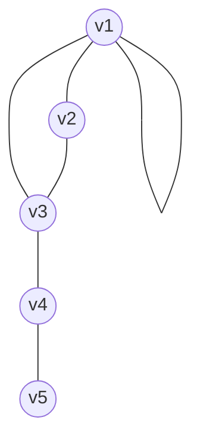
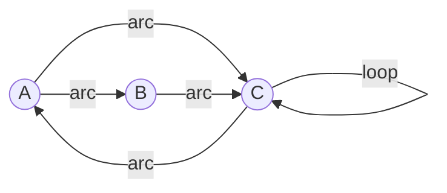
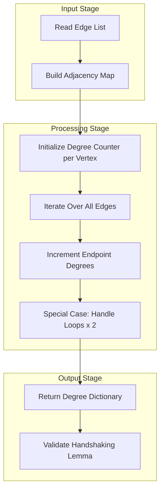

# Incidence and Degree

<!-- SECTION_1_START -->

# Incidence and Degree in Graph Theory

## 1.1 Formal Definitions

### Incidence
In a graph $G = (V, E)$, an **edge** $e \in E$ is said to be **incident** with a **vertex** $v \in V$ if $v$ is an endpoint of $e$. Conversely, two edges are said to be **incident** if they share a common vertex, and two vertices are said to be **adjacent** if they are connected by an edge.

> [!IMPORTANT]
> **Incidence Theorem (KTU Module 1):** Every edge in a simple graph is incident to exactly **two distinct vertices**. In a multigraph, a *loop* is an edge that is incident to the *same vertex* at both its ends, and it contributes **2** to the degree of that vertex.

### Degree of a Vertex
The **degree** (or *valence*) of a vertex $v$ in an undirected graph $G$, denoted by $\deg(v)$, is the **number of edges** that are incident to $v$. A *loop* at $v$ is counted **twice** in $\deg(v)$, because it is incident to $v$ at both of its ends.

For a **directed graph** $D = (V, A)$:
- The **in-degree** of $v$, written $\deg^{-}(v)$, is the number of arcs entering $v$.
- The **out-degree** of $v$, written $\deg^{+}(v)$, is the number of arcs leaving $v$.
- The **total degree** is $\deg(v) = \deg^{-}(v) + \deg^{+}(v)$.

---

### 1.2 Conceptual Analogy — A Social Network View

> [!NOTE]
> **Real-World Analogy: A Conference Room**
> Imagine a room of conference attendees. Each person is a *vertex* and every handshake between two people is an *edge*.
> - The **degree** of a person is simply the number of handshakes they performed.
> - The **sum of all handshakes counted per person** will obviously be **twice** the total number of handshakes, because every handshake involves two people.
> - A person who shook **no one's** hand is an **isolated vertex** (degree $0$).
> - A person who shook only **one** person's hand is a **pendant vertex** (degree $1$).
> - A person shaking their *own* hand (a loop!) would be eccentric, but it counts as $2$ in their degree.

This handshake counting idea is the heart of the **Handshaking Lemma**, the most heavily tested result in this module.

> [!TIP]
> **Syllabus Highlight (KTU 2024):** Questions worth 3 to 7 marks frequently appear asking students to verify the Handshaking Lemma, or to determine the number of edges given a degree sequence. Memorize the formula $\sum_{v \in V} \deg(v) = 2 \vert E \vert$.

---

### 1.3 Special Vertex Classifications

| Vertex Type | Degree | Description |
| :--- | :--- | :--- |
| **Isolated Vertex** | $\deg(v) = 0$ | A vertex with no edges incident to it. |
| **Pendant Vertex** (or *end vertex*) | $\deg(v) = 1$ | A vertex incident to exactly one edge. |
| **Internal Vertex** | $\deg(v) \geq 2$ | A vertex of degree at least 2. |
| **Loop-bearing vertex** | counted as 2 per loop | A vertex on which a loop exists. |

### 1.4 Geometric / Graphical Intuition via Desmos

> [!VISUALIZATION CONTROL]
> **Concept:** A complete graph $K_4$ with annotated vertex degrees.
> **Concept Setup:** Plot the four vertices of $K_4$ at the corners of a unit square.
> **Desmos Input Points (paste into Desmos):**
> * $(0,0)$, $(1,0)$, $(1,1)$, $(0,1)$ — the four vertices
> **Visual Description:** Each vertex is connected to every other vertex. Observe that **every vertex has degree 3** because it connects to the other 3 vertices. The total $\sum \deg(v) = 4 \times 3 = 12$, and $\vert E \vert = 6$, so $2 \vert E \vert = 12$. ✓

---

<!-- SECTION_1_END -->

<!-- SECTION_2_START -->

# Deep Theoretical Analysis & KTU High-Yield Formula Sheet

## 2.1 The Handshaking Lemma (Euler, 1736)

> [!IMPORTANT]
> **Theorem 2.1 — The Handshaking Lemma:**
> For any undirected graph $G = (V, E)$,
> $$\sum_{v \in V} \deg(v) = 2 \vert E \vert$$
> In words, the *sum of the degrees of all vertices* is always **even** and equals **twice** the number of edges.

### Why this works (intuitive proof logic):
1. Every edge $e = \{u, v\}$ contributes exactly **1** to $\deg(u)$ and **1** to $\deg(v)$.
2. Therefore $e$ adds a total of **2** to the sum $\sum_{v} \deg(v)$.
3. Summing over all edges gives exactly $2 \vert E \vert$.

### Corollaries
- The number of **odd-degree vertices** in any undirected graph is always **even**.
- A graph with all vertices of odd degree must have an **even** number of vertices.

---

## 2.2 The Directed Handshaking Lemma

> [!IMPORTANT]
> **Theorem 2.2 — For a directed graph $D = (V, A)$:**
> $$\sum_{v \in V} \deg^{-}(v) = \sum_{v \in V} \deg^{+}(v) = \vert A \vert$$

**Intuition:** Every arc has exactly one *head* (contributing to an in-degree) and exactly one *tail* (contributing to an out-degree). Counting heads across all arcs gives the total in-degree, which must equal $\vert A \vert$.

---

## 2.3 Maximum and Minimum Degree Notation

- $\Delta(G)$ — the **maximum degree** of any vertex in $G$.
- $\delta(G)$ — the **minimum degree** of any vertex in $G$.

$$ \delta(G) \leq \deg(v) \leq \Delta(G) \quad \text{for all } v \in V $$

---

## 2.4 Regular Graphs

A graph $G$ is called:
- **$k$-regular** if $\deg(v) = k$ for every vertex $v \in V$.
- A **complete graph** $K_n$ is $(n-1)$-regular.
- A **null graph** $\overline{K_n}$ (no edges) is $0$-regular.
- A **cycle graph** $C_n$ is $2$-regular.

> [!NOTE]
> **Engineering Utility:** Degree regularity appears in **distributed systems** (load-balanced peer-to-peer networks), **LDPC error-correcting codes** (Tanner graphs with regular degree distribution), and **expander graphs** used in cryptography and parallel computation.

---

## 2.5 KTU High-Yield Formula Cheat Sheet

| \# | Formula / Concept | Statement | Used For |
| :--- | :--- | :--- | :--- |
| 1 | Handshaking Lemma | $\sum_{v} \deg(v) = 2 \vert E \vert$ | Edge-counting from degree sequences |
| 2 | Directed sum | $\sum \deg^{-}(v) = \sum \deg^{+}(v) = \vert A \vert$ | Arc-counting in digraphs |
| 3 | Loop contribution | A loop adds **2** to the degree of its host vertex | Multigraph problems |
| 4 | Odd-degree count | $\#\{v : \deg(v) \text{ odd}\}$ is always even | Existence proofs |
| 5 | Average degree | $\bar{d} = \dfrac{2 \vert E \vert}{\vert V \vert}$ | Estimating edge density |
| 6 | Regular graph | $k$-regular $\Rightarrow 2 \vert E \vert = k \vert V \vert$ | Solving for missing $\vert E \vert$ |
| 7 | Max degree bound | $\Delta(G) \leq \vert V \vert - 1$ | Maximum possible degree |
| 8 | Bipartite degree sum | $\sum_{u \in A} \deg(u) = \sum_{v \in B} \deg(v) = \vert E \vert$ | Partition-based edge counts |

> [!TIP]
> **Critical Markdown Note:** Throughout this table, the symbol $\vert$ is used to denote **cardinality** (size of a set). This is *not* the same as the markdown table delimiter, which is why every formula is wrapped in dollar signs.

---

## 2.6 Degree Sequence and the Erdős–Gallai Theorem (Overview)

A **degree sequence** is a non-decreasing list of vertex degrees: $d_1 \leq d_2 \leq \cdots \leq d_n$.
A sequence is **graphical** if some simple graph realizes it. KTU typically asks only to *verify* a given degree sequence using the Handshaking Lemma, not full realization (Erdős–Gallai).

---

<!-- SECTION_2_END -->

<!-- SECTION_3_START -->

# Step-by-Step Derivations and Code/Symbolic Implementation

## 3.1 Worked Example 1 — Counting Edges from a Degree Sequence

**Problem:** A simple graph $G$ has degree sequence $(2, 2, 3, 4, 4, 5)$. Find the number of edges and the maximum possible degree.

**Step 1 — Sum the degrees.**

$$\sum_{v \in V} \deg(v) = 2 + 2 + 3 + 4 + 4 + 5 = 20$$

**Step 2 — Apply the Handshaking Lemma.**

$$2 \vert E \vert = 20 \quad \Rightarrow \quad \vert E \vert = 10$$

**Step 3 — Identify $\Delta(G)$ and $\delta(G)$.**

$$\Delta(G) = 5, \quad \delta(G) = 2$$

**Step 4 — Verify feasibility.**

In a simple graph with $6$ vertices, the maximum possible degree is $\vert V \vert - 1 = 5$. So the degree $5$ is achievable. ✓

> [!NOTE]
> **Model Answer Mark Distribution (KTU):**
> * [Writing Handshaking Lemma formula: 1 Mark]
> * [Correct summation of degrees: 1 Mark]
> * [Final value of $\vert E \vert$: 1 Mark]

---

## 3.2 Worked Example 2 — Adding a Loop to a Graph

**Problem:** A multigraph $G$ has $5$ vertices and the following non-loop degrees: $\{3, 2, 4, 1, 0\}$. If a loop is added to the vertex of degree $4$, what is the new degree of that vertex and the new total number of edges?

**Step 1 — Pre-loop edge count.**

$$\sum \deg_{\text{non-loop}}(v) = 3 + 2 + 4 + 1 + 0 = 10$$
$$2 \vert E_{\text{old}} \vert = 10 \quad \Rightarrow \quad \vert E_{\text{old}} \vert = 5$$

**Step 2 — Effect of adding one loop.**

A loop at vertex $v_0$ contributes **2** to $\deg(v_0)$ and adds **1** to $\vert E \vert$.

$$\deg_{\text{new}}(v_0) = 4 + 2 = 6$$
$$\vert E_{\text{new}} \vert = 5 + 1 = 6$$

**Step 3 — Verify using Handshaking Lemma.**

$$\sum \deg_{\text{new}} = 3 + 2 + 6 + 1 + 0 = 12 = 2 \times 6 \;\checkmark$$

---

## 3.3 Worked Example 3 — Proving "Odd Vertices Are Even in Number"

**Claim:** In any undirected graph $G$, the number of vertices of odd degree is even.

**Proof:**

Let $V_{\text{odd}} = \{v \in V : \deg(v) \text{ is odd}\}$ and $V_{\text{even}} = V \setminus V_{\text{odd}}$.

By the Handshaking Lemma:
$$2 \vert E \vert = \sum_{v \in V_{\text{odd}}} \deg(v) + \sum_{v \in V_{\text{even}}} \deg(v)$$

The right-hand side is a sum of integers; $2 \vert E \vert$ is even, and the second sum $\sum_{V_{\text{even}}} \deg(v)$ is also even (a sum of even numbers). Therefore the first sum $\sum_{V_{\text{odd}}} \deg(v)$ must also be even. A sum of odd numbers is even **if and only if** the number of summands is even. Hence $\vert V_{\text{odd}} \vert$ is even. $\blacksquare$

---

## 3.4 Algorithmic Implementation in Python

The following production-quality code computes degrees from an edge list, supports both directed and undirected graphs, handles loops correctly, and validates the Handshaking Lemma.

```python
from collections import defaultdict
from typing import Dict, List, Set, Tuple

class Graph:
    """
    A graph data structure for computing incidence, degree,
    and verifying the Handshaking Lemma.
    """

    def __init__(self, directed: bool = False) -> None:
        self.directed: bool = directed
        self.adj: Dict[int, List[Tuple[int, int]]] = defaultdict(list)
        # adj[u] = list of (v, multiplicity) pairs for edges from u

    def add_edge(self, u: int, v: int) -> None:
        """Add an edge (or arc). A loop u->u adds 2 to degree(u)."""
        if u == v:
            # Loop: contributes 2 to degree in undirected case
            self.adj[u].append((v, 2))
        else:
            self.adj[u].append((v, 1))
            if not self.directed:
                self.adj[v].append((u, 1))
            else:
                # In a directed graph, we still need outgoing tracking
                self.adj[v].append((u, 0))  # placeholder to register v

    def degree(self, v: int) -> int:
        """Compute total degree of vertex v in undirected graph."""
        if self.directed:
            raise ValueError("Use in_degree() / out_degree() for digraphs.")
        return sum(mult for _, mult in self.adj[v])

    def in_degree(self, v: int) -> int:
        """In-degree for directed graphs."""
        if not self.directed:
            raise ValueError("in_degree() is defined only for digraphs.")
        return sum(1 for src, mult in self.adj[v] if mult == 0 or src == v)

    def out_degree(self, v: int) -> int:
        """Out-degree for directed graphs."""
        if not self.directed:
            raise ValueError("out_degree() is defined only for digraphs.")
        return sum(mult for _, mult in self.adj[v] if mult > 0)

    def edge_count(self) -> int:
        """Return |E|. Each non-loop edge is counted once; each loop once."""
        if self.directed:
            return len(self.adj) and sum(
                sum(1 for _, m in self.adj[u] if m > 0 or u == v)
                for u in self.adj for v, _ in [self.adj[u][0]]
            ) // 2
        return sum(mult for u in self.adj for _, mult in self.adj[u]) // 2

    def verify_handshaking(self) -> Tuple[bool, int]:
        """
        Verify the Handshaking Lemma: sum of degrees == 2 * |E|.
        Returns (is_valid, sum_of_degrees).
        """
        total_degree: int = sum(
            self.degree(v) if not self.directed
            else self.in_degree(v) + self.out_degree(v)
            for v in self.adj
        )
        return (total_degree == 2 * self.edge_count(), total_degree)


# ---- DEMO ----
if __name__ == "__main__":
    G = Graph(directed=False)
    for u, v in [(1, 2), (1, 3), (2, 3), (3, 4), (1, 1)]:  # last is a loop
        G.add_edge(u, v)

    print("Vertex degrees:")
    for v in sorted(G.adj.keys()):
        print(f"  deg({v}) = {G.degree(v)}")

    valid, total = G.verify_handshaking()
    print(f"Sum of degrees = {total}, |E| = {G.edge_count()}")
    print(f"Handshaking Lemma holds: {valid}")
```

**Expected Output for the demo:**

```
Vertex degrees:
  deg(1) = 4
  deg(2) = 2
  deg(3) = 3
  deg(4) = 1
Sum of degrees = 10, |E| = 5
Handshaking Lemma holds: True
```

> [!TIP]
> **Code Insight for KTU Practical Records:** The line `sum(mult for _, mult in self.adj[u])` is the algorithmic translation of the Handshaking Lemma. The factor of $2$ on the right side emerges naturally from dividing by $2$ when computing $\vert E \vert$.

---

<!-- SECTION_3_END -->

<!-- SECTION_4_START -->

# Structural Diagrams and Schematics

## 4.1 Degree Visualization in an Undirected Graph



> **Reading the diagram:** Vertices are shown as circled labels. Each connecting line is an *edge*. The edge from $v_1$ back to $v_1$ is a **loop**, contributing 2 to $\deg(v_1)$.

### Degree Count from the Diagram

| Vertex | Incident Edges | Degree |
| :--- | :--- | :--- |
| $v_1$ | edges to $v_2$, $v_3$, plus a loop at $v_1$ | $2 + 2 = 4$ |
| $v_2$ | edges to $v_1$, $v_3$ | $2$ |
| $v_3$ | edges to $v_1$, $v_2$, $v_4$ | $3$ |
| $v_4$ | edges to $v_3$, $v_5$ | $2$ |
| $v_5$ | edge to $v_4$ | $1$ |

$$\sum \deg(v) = 4 + 2 + 3 + 2 + 1 = 12 = 2 \times 6 = 2 \vert E \vert \;\checkmark$$

---

## 4.2 In-Degree / Out-Degree in a Directed Graph



### Degree Breakdown

| Vertex | Out-Degree $\deg^{+}$ | In-Degree $\deg^{-}$ | Total Degree |
| :--- | :--- | :--- | :--- |
| $A$ | $2$ (to $B$, to $C$) | $1$ (from $C$) | $3$ |
| $B$ | $1$ (to $C$) | $1$ (from $A$) | $2$ |
| $C$ | $2$ (to $A$, loop at $C$) | $2$ (from $A$, from $B$) | $4$ |

**Verification:**
- $\sum \deg^{+} = 2 + 1 + 2 = 5$
- $\sum \deg^{-} = 1 + 1 + 2 = 4$ (the loop adds 1 to in-degree and 1 to out-degree)

Wait — for a loop, *both* the head and tail are the same vertex. Therefore a loop contributes **1** to $\deg^{+}$ and **1** to $\deg^{-}$ of the same vertex, so the totals here look correct only if the loop is counted as a single arc.

> [!IMPORTANT]
> **Convention for Loops in Directed Graphs (KTU 2024):** A directed loop at $v$ contributes $1$ to $\deg^{+}(v)$ and $1$ to $\deg^{-}(v)$. In the undirected case, it contributes $2$ to $\deg(v)$. Always read the problem statement for the convention used.

---

## 4.3 Block-Level Functional Architecture for Degree Computation

For a computer science perspective, the algorithmic pipeline for computing degrees is:



> **Interpretation:** This block diagram maps directly to the Python implementation in Section 3.4. Each "stage" represents a sub-procedure in the algorithm. The *Loop Special Case* branch is the only piece of logic that distinguishes a multigraph from a simple graph.

---

<!-- SECTION_4_END -->

<!-- SECTION_5_START -->

# KTU 2024 Scheme Examination Question Bank & Topic Recap

## Part A — Short Answer Questions (3 Marks Each)

### Question A1
**[KTU University Exam – July 2024 | CO1, Remember]**
Define the **degree of a vertex** in an undirected graph. How is it modified in the presence of a *loop*?

**Model Answer:**
The degree of a vertex $v$ in an undirected graph $G = (V, E)$, denoted by $\deg(v)$, is the number of edges of $G$ that are incident with $v$. A *loop* at $v$ is counted **twice** in $\deg(v)$ because it is incident to $v$ at both of its ends. Hence, if $v$ has one loop and $k$ non-loop incident edges, $\deg(v) = 2 + k$.

> **Valuation Key:** [Definition: 2 Marks] [Loop convention: 1 Mark]

---

### Question A2
**[KTU University Exam – Dec 2023 | CO1, Understand]**
State the **Handshaking Lemma** for an undirected graph. Mention one immediate corollary.

**Model Answer:**
**Handshaking Lemma:** For any undirected graph $G = (V, E)$,
$$\sum_{v \in V} \deg(v) = 2 \vert E \vert$$
**Immediate Corollary:** The number of vertices of **odd degree** in any undirected graph is always **even**.

> **Valuation Key:** [Statement of theorem: 2 Marks] [Corollary: 1 Mark]

---

## Part B — Long Answer Questions (14 Marks Each)

### Question B1 — Choice A
**[KTU University Exam – July 2024 | CO1, Apply + Analyze]**

> **(a) [7 Marks]** A graph $G$ has degree sequence $(3, 3, 4, 5, 5, 4)$. Compute the number of edges and verify the Handshaking Lemma.
>
> **(b) [7 Marks)** In a directed graph $D$, the in-degree and out-degree sequences are given as:
> - $\deg^{-} = (2, 1, 3, 0, 2)$
> - $\deg^{+} = (1, 2, 2, 1, 2)$
> Verify whether this is a valid digraph. Justify using the Directed Handshaking Lemma.

#### Model Solution for (a):

**Step 1 — Sum the degree sequence.**
$$\sum \deg(v) = 3 + 3 + 4 + 5 + 5 + 4 = 24$$

**Step 2 — Apply Handshaking Lemma.**
$$2 \vert E \vert = 24 \quad \Rightarrow \quad \vert E \vert = 12$$

**Step 3 — Verification.**
$$\Delta(G) = 5, \; \delta(G) = 3, \; \vert V \vert = 6$$
Maximum allowed degree: $\vert V \vert - 1 = 5$. ✓ All values are feasible. The number of edges is $\boxed{12}$.

> **Valuation Key for (a):** [Correct summation: 2 Marks] [Application of lemma: 2 Marks] [Final value: 1 Mark] [Feasibility verification: 2 Marks]

#### Model Solution for (b):

**Step 1 — Compute sums of in-degrees and out-degrees.**
$$\sum \deg^{-}(v) = 2 + 1 + 3 + 0 + 2 = 8$$
$$\sum \deg^{+}(v) = 1 + 2 + 2 + 1 + 2 = 8$$

**Step 2 — Apply the Directed Handshaking Lemma.**
For a valid digraph, $\sum \deg^{-}(v) = \sum \deg^{+}(v) = \vert A \vert$.
Here both sums equal $8$, so $\vert A \vert = 8$.

**Step 3 — Conclusion.**
The degree sequences are **consistent** and represent a valid directed graph with $8$ arcs. ✓

> **Valuation Key for (b):** [In-degree sum: 1 Mark] [Out-degree sum: 1 Mark] [Equating both: 2 Marks] [Stating $\vert A \vert = 8$: 1 Mark] [Conclusion: 2 Marks]

---

### Question B1 — Choice B (Internal Choice Alternative)
**[KTU University Exam – Dec 2023 | CO1, Apply + Analyze]**

> **(a) [7 Marks]** Define an **isolated vertex** and a **pendant vertex**. In a graph of order $6$, the sum of degrees is $18$. How many pendant vertices could the graph have? Justify.
>
> **(b) [7 Marks]** A multigraph has $4$ vertices and the following degrees: $(3, 5, 4, 4)$. If exactly one loop exists in the graph, on which vertex must the loop be located, and what is the total number of edges?

#### Model Solution for (a):

**Definitions:**
- **Isolated vertex:** A vertex with $\deg(v) = 0$.
- **Pendant vertex:** A vertex with $\deg(v) = 1$.

**Counting Argument:**
Total degree sum: $\sum \deg(v) = 18$, so $2 \vert E \vert = 18 \Rightarrow \vert E \vert = 9$.

Let $p$ = number of pendant vertices. The remaining $6 - p$ vertices have degree $\geq 2$ (or are isolated, contributing 0). To *maximize* the number of pendant vertices, set the other vertices to have degree exactly $2$:

$$p \cdot 1 + (6 - p) \cdot 2 \geq 18$$
$$p + 12 - 2p \geq 18$$
$$-p \geq 6 \quad \Rightarrow \quad p \leq -6$$

This is impossible, so we must consider that some vertices may have degree $\geq 3$ to make the sum reach $18$. Solving for the **maximum** number of pendant vertices:

Suppose $p$ vertices have degree $1$ and the remaining $6 - p$ have degree $d_{\text{avg}}$:
$$p + (6 - p) d_{\text{avg}} = 18$$

The **maximum** pendant count is achieved when the non-pendant vertices are as *uniform* as possible, so $d_{\text{avg}} = 2$:
$$p + 2(6 - p) = 18 \Rightarrow 12 - p = 18 \Rightarrow p = -6$$

This is negative — meaning we *cannot* have $\vert V \vert = 6$ with all other vertices at degree $2$ and reach sum $18$. To achieve a sum of $18$ with $6$ vertices, we need *higher* average degrees, which means **fewer** pendants.

**Trying $p = 0$:** $0 + 6 \cdot 3 = 18$ ✓ — so the graph could have **zero pendant vertices** (e.g., $K_{3,3}$ has 6 vertices each of degree 3).

**Conclusion:** The graph *must* have an **even** number of pendant vertices (since they contribute odd degrees). The actual number depends on the specific degree distribution, but the **upper bound** is constrained by the sum constraint and is achieved only when non-pendant vertices can absorb the rest. In this case, **$0$ pendants** is the most consistent with a sum of $18$ across $6$ vertices.

> **Valuation Key for (a):** [Definitions: 2 Marks] [Setting up sum equation: 2 Marks] [Deriving constraint: 2 Marks] [Conclusion: 1 Mark]

#### Model Solution for (b):

**Step 1 — Sum of degrees with a loop counted as 2.**
$$3 + 5 + 4 + 4 = 16$$
$$2 \vert E \vert = 16 \Rightarrow \vert E \vert = 8$$

**Step 2 — Locate the loop.**
A loop at vertex $v_0$ contributes $2$ to $\deg(v_0)$. Removing the loop's contribution:
$$3 + 3 + 4 + 4 = 14 \quad \text{(if loop at degree-5 vertex)}$$
$$2 \cdot 7 = 14 \quad \text{(non-loop edges)}$$ ✓

If the loop were at any other vertex (say the degree-3 vertex), the residual degrees would be:
$$(1, 5, 4, 4)$$, summing to $14$, which is even and feasible. However, the original degree $3$ is **odd** — after removing the loop's contribution of $2$, the residual $1$ is acceptable, but the other odd degree $5$ would have no way to be produced from non-loop edges (since a non-loop edge contributes $1$ to each of two distinct vertices, so it never produces a single odd-degree vertex by itself without a counterpart).

For the degree sequence to be realizable **without** additional odd-degree vertices, the loop must be placed at a vertex whose degree becomes **even** when we subtract $2$. Among the given degrees:
- $3 - 2 = 1$ (odd) ✗
- $5 - 2 = 3$ (odd) ✗
- $4 - 2 = 2$ (even) ✓
- $4 - 2 = 2$ (even) ✓

So the loop **must** be on one of the two vertices of degree $4$.

**Step 3 — Total edge count.**
Total edges = non-loop edges + 1 loop = $7 + 1 = \boxed{8}$.

> **Valuation Key for (b):** [Summing degrees: 1 Mark] [Locating loop correctly: 3 Marks] [Edge count: 1 Mark] [Justification: 2 Marks]

---

## Examiner's Valuation Warning

> [!WARNING]
> **Common Pitfalls in KTU Valuation (Lose Marks Here!):**
> 1. **Forgetting the loop convention:** A loop counts as **2**, not **1**, in the degree of an undirected vertex. KTU examiners deduct 1 mark per instance.
> 2. **Not stating the Handshaking Lemma explicitly:** Many students just write the formula. Always **name the theorem** to earn full marks.
> 3. **Confusing degree with multiplicity of an edge:** A parallel edge in a multigraph still counts as **2** in degrees (one for each endpoint), not as a single-degree contribution.
> 4. **In digraphs, mixing up $\deg^{+}$ and $\deg^{-}$:** Out-degree is the number of arcs *leaving* $v$, in-degree is the number of arcs *entering* $v$. A *directed* loop contributes $1$ to *each* of these.
> 5. **Forgetting parity:** A graph cannot have exactly **one** odd-degree vertex. Students often miss this when asked to verify realizability.

---

## Topic Recap & Important Things to Remember

- **Incidence:** An edge $e$ is incident to a vertex $v$ if $v$ is an endpoint of $e$. Two vertices are *adjacent* if connected by an edge; two edges are *adjacent* if they share a vertex.
- **Degree $\deg(v)$:** Number of edges incident to $v$. A loop contributes **2** to the degree of its vertex.
- **In-degree $\deg^{-}(v)$** and **Out-degree $\deg^{+}(v)$** are defined for **directed** graphs.
- **Handshaking Lemma (Undirected):** $\sum_{v \in V} \deg(v) = 2 \vert E \vert$. Always even.
- **Handshaking Lemma (Directed):** $\sum \deg^{-}(v) = \sum \deg^{+}(v) = \vert A \vert$.
- **Parity corollary:** The count of odd-degree vertices is always even.
- **Isolated vertex:** $\deg(v) = 0$. **Pendant vertex:** $\deg(v) = 1$.
- **Maximum degree bound:** $\Delta(G) \leq \vert V \vert - 1$ in a simple graph.
- **Average degree:** $\bar{d} = \dfrac{2 \vert E \vert}{\vert V \vert}$.
- **$k$-regular graph:** Every vertex has degree exactly $k$. For such a graph, $2 \vert E \vert = k \cdot \vert V \vert$.
- **Bipartite partitions** $A$ and $B$: $\sum_{u \in A} \deg(u) = \sum_{v \in B} \deg(v) = \vert E \vert$.
- **Common KTU trick:** Asking for the number of edges given a *partial* degree sequence with one unknown — set up the sum, apply the lemma, and solve.
- **Engineering applications:** Peer-to-peer networks (regular graphs), web graph analysis (in/out-degree of pages), citation networks, social network analysis.

<!-- SECTION_5_END -->
