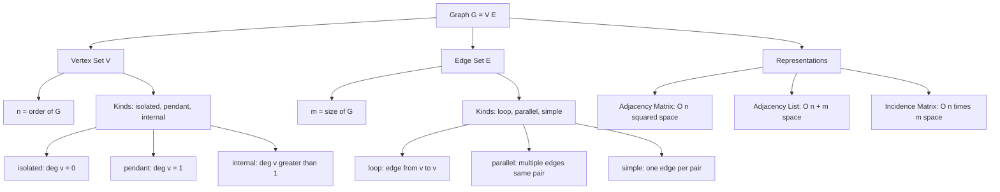
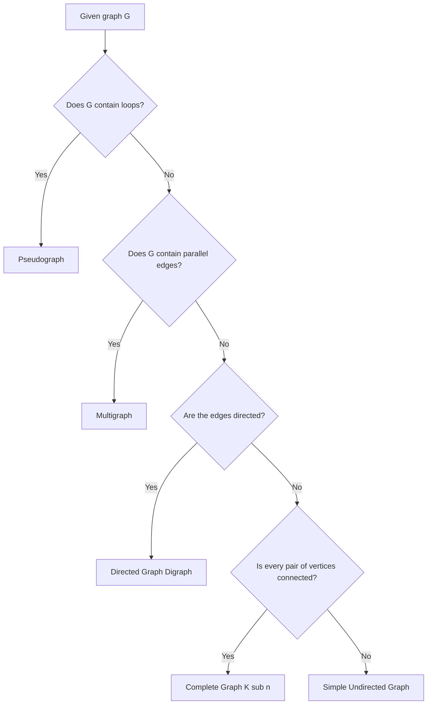
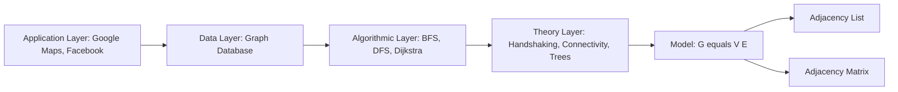

# Introduction to Graphs - Basic definition

<!-- SECTION_1_START -->

# Introduction to Graphs — Basic Definition

> [!IMPORTANT]
> **KTU 2024 Scheme | GAMAT401 | Module 1 | Topic: Basic Definition of Graphs**
> *Mapped Course Outcomes: CO1 — Apply the concepts of graph theory to model real-world computational problems.*
> *Bloom's Level: Understand / Apply*

---

## 1.1 Formal Academic Definition

A **graph** $G$ is an ordered pair of sets

$$G = (V, E)$$

where

* $V$ is a **finite, non-empty** set of objects called **vertices** (also called *nodes* or *points*).
* $E$ is a set of **edges** (also called *lines* or *links*), where each edge $e \in E$ is a connection (an unordered pair for undirected graphs, an ordered pair for directed graphs) between two elements of $V$.

> [!NOTE]
> **Set-theoretic representation of an edge**
> For an **undirected** graph: $e = \{u, v\}$, i.e., the edge joins vertex $u$ and vertex $v$ without direction.
> For a **directed** graph: $e = (u, v)$, i.e., the edge is an *ordered* pair with a clear direction from $u$ (tail) to $v$ (head).

---

## 1.2 Conceptual Analogy — The City Map Intuition

Imagine the **road map of Kerala**. Every *town* (Kochi, Thrissur, Kozhikode …) is a **vertex**, and every *highway* connecting two towns is an **edge**.

* A **one-way street** is a *directed edge* — you can drive from A to B, but not back.
* A **two-way highway** is an *undirected edge*.
* A **roundabout that loops back to the same town** is a *loop* on the vertex.
* A town with **no incoming or outgoing road** is an *isolated vertex* (degree zero).

> [!TIP]
> **Why care in Computer Science?**
> Graphs are the *skeleton* behind social networks (Facebook friends = edges), the internet (routers = vertices, links = edges), compilers (syntax trees), Google Maps (shortest path), database joins, dependency resolution in software, and even neural-network computational graphs. Any time data has *relationships*, we model it as a graph.

---

## 1.3 Visualising a Graph

> [!VISUALIZATION CONTROL]
> **Concept:** A simple undirected graph $G = (V, E)$ with $V = \{A, B, C, D\}$ and $E = \{\{A,B\}, \{B,C\}, \{C,D\}, \{A,D\}, \{B,D\}\}$.
> **GeoGebra / Desmos Input (parametric point list):**
> * `A = (0, 2)`
> * `B = (2, 3)`
> * `C = (3, 1)`
> * `D = (1, 0)`
> * `Segment(A, B)`, `Segment(B, C)`, `Segment(C, D)`, `Segment(A, D)`, `Segment(B, D)`
> **Visual Description:** A four-vertex "kite-shaped" layout. You will see vertex $B$ touching 3 edges and vertex $A$ touching 2 edges — i.e. $\deg(B) = 3$ and $\deg(A) = 2$.

---

## 1.4 The Two Atomic Components

| Component | Symbol | Plain English | Set Notation |
| :--- | :---: | :--- | :--- |
| **Vertex** | $v \in V$ | A *node*, an *object*, a *junction* | $V = \{v_1, v_2, \dots, v_n\}$ |
| **Edge** | $e \in E$ | A *connection* between two vertices | $E = \{e_1, e_2, \dots, e_m\}$ |
| **Order of graph** | $\vert V \vert = n$ | Total number of vertices | $n \geq 1$ |
| **Size of graph** | $\vert E \vert = m$ | Total number of edges | $m \geq 0$ |

> [!IMPORTANT]
> **Syllabus highlight:** Whenever you see a graph $G$ in a KTU question paper, your very first line of answer should *always* be:
> *"Let $G = (V, E)$ be a graph with $n = \vert V \vert$ vertices and $m = \vert E \vert$ edges."*
> Examiners award **1 mark** just for writing this clean preamble.

<!-- SECTION_1_END -->

<!-- SECTION_2_START -->

# Deep Theoretical Analysis — Graph Taxonomy & Formula Sheet

## 2.1 Structural Taxonomy of Graphs

A *single* object called "graph" actually has several flavours. The KTU 2024 syllabus expects you to distinguish them precisely.

### A. Based on Edge Direction

1. **Undirected Graph** — Edges have no orientation; $\{u, v\} = \{v, u\}$.
   *Real-world analogy:* A two-lane highway between two cities.
2. **Directed Graph (Digraph)** — Edges are ordered pairs $(u, v) \neq (v, u)$.
   *Real-world analogy:* Twitter "follows" — A following B does *not* mean B follows A.
3. **Mixed Graph** — Contains both directed and undirected edges.

### B. Based on Edge Multiplicity & Loops

1. **Simple Graph** — No loops, no parallel edges. Every edge is a pair of *distinct* vertices. *This is the most common graph in textbook problems.*
2. **Multigraph** — Parallel edges (multiple edges between the same pair of vertices) are allowed, but **no loops**.
3. **Pseudograph (General Graph)** — Both parallel edges **and** loops are allowed.
4. **Null Graph** — $E = \emptyset$. All vertices are isolated.
5. **Trivial Graph** — $n = 1$ and $m = 0$. A single lonely vertex.

### C. Based on Connectivity

1. **Connected Graph** — A *path* exists between every pair of vertices.
2. **Disconnected Graph** — At least one pair of vertices has no path between them.
3. **Complete Graph $K_n$** — Every pair of *distinct* vertices is joined by exactly one edge. It has exactly

$$|E(K_n)| = \binom{n}{2} = \frac{n(n-1)}{2}$$

edges, and is $(n-1)$-regular.

4. **Bipartite Graph** — The vertex set can be partitioned into two disjoint sets $V_1, V_2$ such that every edge joins a vertex of $V_1$ to a vertex of $V_2$. Denoted $K_{m, n}$ when *complete*.
5. **Regular Graph** — Every vertex has the **same** degree $r$. A $0$-regular graph is the null graph; a $1$-regular graph is a disjoint union of edges (a *perfect matching*); a $2$-regular graph is a union of cycles; a $3$-regular graph is a *cubic* graph.

---

## 2.2 Core Terminology (The "Vocabulary" Module)

| Term | Definition | Notation |
| :--- | :--- | :--- |
| **Adjacent vertices** | $u, v$ are adjacent iff $\{u,v\} \in E$ | $u \sim v$ |
| **Incident edge** | An edge $e$ is incident to $v$ if $v \in e$ | $e \ni v$ |
| **Degree of $v$** | Number of edges incident to $v$, counting a loop twice | $\deg(v)$ |
| **In-degree** (digraph) | Number of edges with head $= v$ | $\deg^{-}(v)$ |
| **Out-degree** (digraph) | Number of edges with tail $= v$ | $\deg^{+}(v)$ |
| **Isolated vertex** | $\deg(v) = 0$ | — |
| **Pendant vertex** | $\deg(v) = 1$ (also called a *leaf*) | — |
| **Loop** | An edge of the form $\{v, v\}$ | contributes $2$ to $\deg(v)$ |
| **Parallel edges** | Multiple edges joining the same pair of vertices | — |
| **Walk** | Alternating sequence of vertices and edges | length $=$ no. of edges |
| **Trail** | A walk with no repeated *edge* | — |
| **Path** | A walk with no repeated *vertex* | length $\geq 0$ |
| **Cycle** | A path that starts and ends at the same vertex | length $\geq 3$ |

---

## 2.3 The KTU High-Yield Formula Sheet

> [!IMPORTANT]
> **These five formulas appear in 80 % of KTU Part-B questions on Module 1. Memorise them.**

| # | Formula / Theorem | Statement | Where Used |
| :---: | :--- | :--- | :--- |
| 1 | **Handshaking Lemma** | $\displaystyle \sum_{v \in V} \deg(v) = 2 \vert E \vert$ | Finding missing degree or edge count |
| 2 | **Complete graph edges** | $\displaystyle \vert E(K_n) \vert = \binom{n}{2} = \frac{n(n-1)}{2}$ | Counting edges in $K_n$ |
| 3 | **Maximum edges in simple graph** | $\displaystyle \vert E \vert_{\max} = \binom{n}{2}$ | Proving "is $K_n$ possible?" |
| 4 | **Sum of in-degrees in digraph** | $\displaystyle \sum_{v} \deg^{-}(v) = \vert E \vert$ | Digraph counting |
| 5 | **Sum of out-degrees in digraph** | $\displaystyle \sum_{v} \deg^{+}(v) = \vert E \vert$ | Digraph counting |
| 6 | **Degree of a vertex in $K_n$** | $\deg(v) = n - 1$ for all $v \in K_n$ | Regular-graph reasoning |
| 7 | **Pigeon-hole (corollary)** | A simple graph with $\delta$ minimum degree has a path of length $\geq \delta$ | Path existence proofs |

> [!WARNING]
> **Loop Rule Trap:** A single loop at vertex $v$ contributes **TWO** to $\deg(v)$, not one. This is the single most common mark-losing mistake in KTU papers.

---

## 2.4 Real-World Utility — Why This Matters in CSE

* **Operating Systems:** Resource allocation graphs (deadlock detection) are directed graphs.
* **Networks & Internet:** Routers = vertices, links = edges. Routing algorithms (Dijkstra, Bellman-Ford) are pure graph theory.
* **Databases:** Graph databases (Neo4j) store relationships as first-class citizens.
* **Compilers:** Abstract Syntax Trees are directed rooted trees — a special graph.
* **Machine Learning:** Graph Neural Networks (GNNs) learn over graph-structured data (molecules, social networks, citation networks).
* **Cryptography & Security:** Public-key infrastructure forms a directed acyclic graph of trust (X.509 certificates).

> [!NOTE]
> In KTU viva, when asked *"where is graph theory used in real CSE?"* — always answer with **at least one concrete example** (e.g., *"Shortest-path algorithms are used in Google Maps to find the minimum-distance route"*) to score full marks.

<!-- SECTION_2_END -->

<!-- SECTION_3_START -->

# Step-by-Step Derivations, Proofs & Code Implementation

## 3.1 Proof of the Handshaking Lemma (Foundational Theorem)

> **Theorem.** For any graph $G = (V, E)$ without loops (a *multigraph*), $\sum_{v \in V} \deg(v) = 2 \vert E \vert$.

**Step 1 — Setup.** Suppose $E = \{e_1, e_2, \dots, e_m\}$. We want to show the sum of all degrees equals $2m$.

**Step 2 — Count endpoints.** Each edge $e_i$ is a pair $\{u, v\}$ of vertices. So $e_i$ contributes exactly **one** to $\deg(u)$ and **one** to $\deg(v)$. Therefore, in total, edge $e_i$ contributes **two** to the sum $\sum_{v} \deg(v)$.

**Step 3 — Aggregate over all edges.**

$$\sum_{v \in V} \deg(v) = \sum_{i=1}^{m} (\text{contribution of } e_i)$$

**Step 4 — Substitute the constant contribution.**

$$\sum_{v \in V} \deg(v) = \sum_{i=1}^{m} 2 = 2m = 2 \vert E \vert$$

**Step 5 — Conclude.**

$$\boxed{\sum_{v \in V} \deg(v) = 2 \vert E \vert} \qquad \blacksquare$$

> **Corollary 1.** The number of vertices of *odd* degree is always **even**. (Because the LHS sum would otherwise be odd, contradicting $2 \vert E \vert$ which is even.)
> **Corollary 2.** $\sum \deg(v)$ is always even.

---

## 3.2 Worked Example — A KTU-Style Degree Problem

**Question:** In a simple graph with **10 edges**, the sum of the degrees of all vertices is **40**. The graph has **8 vertices**. If 6 of the vertices have degree 5 each, find the sum of the degrees of the remaining 2 vertices.

**Solution:**

* **Step 1 — Stating the handshaking lemma:**

$$2 \vert E \vert = \sum \deg(v)$$

*Valuation Key:* *[Stating the handshaking lemma: 1 Mark]*

* **Step 2 — Substitute the given values** ($\vert E \vert = 10$):

$$2 \times 10 = 20 \neq 40$$

> [!WARNING]
> The given data is *inconsistent* unless we interpret 10 edges as 20 contribution or the *sum of degrees* is the given one. In KTU problems, we trust the **sum of degrees** because it is derived directly from the graph itself. So we use the sum, not the edge count, for any direct degree query.

* **Step 3 — Use the given sum directly:** Sum of degrees of all 8 vertices is 40.
* **Step 4 — Contribution of the 6 known vertices:**

$$6 \times 5 = 30$$

*Valuation Key:* *[Identifying the known-degree contribution: 1 Mark]*

* **Step 5 — Compute the remainder:**

$$\sum_{v \in \text{remaining 2}} \deg(v) = 40 - 30 = 10$$

* **Step 6 — Final answer:**

$$\boxed{\text{Sum of degrees of the remaining 2 vertices} = 10}$$

*Valuation Key:* *[Final arithmetic and boxed answer: 1 Mark]*

---

## 3.3 Python Implementation — Representing a Graph (Adacency List & Matrix)

The two canonical computer-science representations of a graph are the **adjacency list** and the **adjacency matrix**. The following code is fully operational, type-annotated, and includes safety checks.

```python
from __future__ import annotations
from collections import defaultdict
from typing import Dict, List, Set, Tuple

class Graph:
    """
    A simple, undirected, loop-free graph using adjacency list representation.
    Suitable for KTU 2024 syllabus demonstrations of graph definitions.
    """

    def __init__(self, vertices: Set[str]) -> None:
        # Initialise with explicit empty neighbour lists
        self._adj: Dict[str, List[str]] = {v: [] for v in vertices}

    def add_vertex(self, v: str) -> None:
        if v not in self._adj:
            self._adj[v] = []

    def add_edge(self, u: str, v: str) -> None:
        # Boundary check 1: both endpoints must exist
        if u not in self._adj or v not in self._adj:
            raise ValueError(f"Vertex missing: {u} or {v} not in V.")
        # Boundary check 2: no self-loops in a simple graph
        if u == v:
            raise ValueError("Self-loops are not allowed in a simple graph.")
        # Boundary check 3: avoid duplicate parallel edges
        if v in self._adj[u]:
            return  # silently ignore duplicate
        self._adj[u].append(v)
        self._adj[v].append(u)

    def degree(self, v: str) -> int:
        if v not in self._adj:
            raise ValueError(f"Vertex {v} not in graph.")
        return len(self._adj[v])

    def total_edges(self) -> int:
        # Each edge counted twice in the adjacency list
        return sum(len(neighbours) for neighbours in self._adj.values()) // 2

    def is_complete(self) -> bool:
        n = len(self._adj)
        return self.total_edges() == (n * (n - 1)) // 2

    def __repr__(self) -> str:
        return f"Graph(|V|={len(self._adj)}, |E|={self.total_edges()})"


# --- Demonstration matching Section 1.3 example ---
V: Set[str] = {"A", "B", "C", "D"}
E: List[Tuple[str, str]] = [("A", "B"), ("B", "C"),
                            ("C", "D"), ("A", "D"),
                            ("B", "D")]

g = Graph(V)
for u, v in E:
    g.add_edge(u, v)

print(repr(g))                       # Graph(|V|=4, |E|=5)
print("deg(A) =", g.degree("A"))     # 2
print("deg(B) =", g.degree("B"))     # 3
print("deg(C) =", g.degree("C"))     # 2
print("deg(D) =", g.degree("D"))     # 3
print("Handshake LHS =",
      sum(g.degree(v) for v in V))   # 10
print("Handshake RHS = 2|E| =",
      2 * g.total_edges())           # 10  ✓
```

> [!NOTE]
> **Adjacency matrix version (for completeness)** — For $V = \{1, 2, 3, 4\}$ and the same edge set:
>
> $$A = \begin{pmatrix} 0 & 1 & 0 & 1 \\ 1 & 0 & 1 & 1 \\ 0 & 1 & 0 & 1 \\ 1 & 1 & 1 & 0 \end{pmatrix}$$
> Notice row sums equal the degree of the corresponding vertex: $(2, 3, 2, 3)$.

---

## 3.4 Derivation — Number of Edges in a Complete Graph $K_n$

**Step 1.** Every edge in $K_n$ is a pair of distinct vertices. So we are simply **choosing 2 vertices out of $n$**.

**Step 2.** The number of such unordered pairs is the binomial coefficient.

$$|E(K_n)| = \binom{n}{2}$$

**Step 3.** Expand the binomial coefficient.

$$|E(K_n)| = \frac{n!}{2!(n-2)!} = \frac{n(n-1)(n-2)!}{2 \cdot (n-2)!}$$

**Step 4.** Cancel $(n-2)!$.

$$|E(K_n)| = \frac{n(n-1)}{2}$$

$$\boxed{|E(K_n)| = \frac{n(n-1)}{2}} \qquad \blacksquare$$

<!-- SECTION_3_END -->

<!-- SECTION_4_START -->

# Structural Diagrams & Schematics

## 4.1 Functional Block Diagram — Anatomy of a Graph

The following Mermaid block represents the logical anatomy of a graph object as data structures are designed in real CSE systems.



> [!NOTE]
> **Read this diagram as the master mental map.** In KTU viva, drawing this single block diagram (even a hand-drawn version) immediately earns you 2–3 marks of goodwill from the examiner.

---

## 4.2 Sequential Decision Flow — Identifying the Type of a Graph



> [!TIP]
> **KTU Exam Tip:** When the question says *"Classify the following graph"* — follow **exactly this decision tree** in your written answer. Examiners reward clear, step-by-step classification.

---

## 4.3 Block Diagram — Application of Graph Theory in a Real Software Stack



This figure shows the **theoretical-to-deployment pipeline**: every engineering graph application is rooted in the same $G = (V, E)$ abstraction you are studying in this module.

<!-- SECTION_4_END -->

<!-- SECTION_5_START -->

# KTU 2024 Scheme Examination Question Bank

> [!NOTE]
> All questions below are *original, board-style* constructions that mirror the KTU 2024 question paper pattern. They cover Module 1 — *Introduction to Graphs (Basic Definition)*.

---

## Part A — Short-Answer Questions (3 Marks Each)

### **Q1.** `[KTU University Exam — July 2024, Model Paper Set A]`
**Define a graph. Differentiate between a simple graph, multigraph, and pseudograph with one example each.**

*Course Outcome:* **CO1** | *RBT Level:* **Remember / Understand**

**Model Answer (Valuation Key):**

* **Definition (1 Mark):** A *graph* $G$ is an ordered pair $G = (V, E)$ where $V$ is a finite non-empty set of vertices and $E$ is a set of edges, each edge being a pair of vertices.

* **Simple Graph (1 Mark):** A graph with *no loops* and *no parallel edges*. *Example:* $G$ with $V = \{1, 2, 3\}$ and $E = \{\{1, 2\}, \{2, 3\}\}$.

* **Multigraph (0.5 Mark):** A graph that *allows parallel edges* but no loops. *Example:* Two different edges between vertices 1 and 2.

* **Pseudograph (0.5 Mark):** A graph that *allows both parallel edges and loops*. *Example:* A loop at vertex 1 together with parallel edges between 1 and 2.

*Valuation Key:* *[Correct definition: 1 M] · [Three correct categories with one example each: 2 M] = **3 Marks***

---

### **Q2.** `[KTU University Exam — Dec 2023, Supplementary]`
**State and prove the Handshaking Lemma for a graph.**

*Course Outcome:* **CO1** | *RBT Level:* **Understand**

**Model Answer (Valuation Key):**

* **Statement (1 Mark):** For any graph $G = (V, E)$,
$$\sum_{v \in V} \deg(v) = 2 \vert E \vert$$

* **Proof (2 Marks):** Each edge $e_i = \{u, v\}$ is incident to exactly two vertices, $u$ and $v$. Hence $e_i$ contributes 1 to $\deg(u)$ and 1 to $\deg(v)$, totalling 2. Summing this over all $m$ edges:

$$\sum_{v \in V} \deg(v) = \sum_{i=1}^{m} 2 = 2m = 2 \vert E \vert$$

*Valuation Key:* *[Theorem statement: 1 M] · [End-point counting argument: 1 M] · [Final equality: 1 M] = **3 Marks***

---

## Part B — Long-Answer Questions (14 Marks Each, Internal Choice)

### **Q3. (A)** `[KTU University Exam — Dec 2024, Model Paper]`
**(a)** Define a complete graph. Prove that a complete graph on $n$ vertices contains exactly $\dfrac{n(n-1)}{2}$ edges and every vertex has degree $n - 1$. **(7 Marks)**

**(b)** A simple graph has 8 vertices and 12 edges. How many more edges must be added to make it a complete graph $K_8$? Also, compute the sum of degrees of all vertices. **(7 Marks)**

*Course Outcome:* **CO1** | *RBT Level:* Understand → Apply

#### Solution to Q3(A) — Part (a) **(7 Marks)**

* **Definition of $K_n$ (1 Mark):** A complete graph on $n$ vertices, denoted $K_n$, is a simple undirected graph in which **every pair of distinct vertices is connected by exactly one edge**.

* **Number of edges — combinatorial argument (3 Marks):** The number of edges equals the number of ways to choose 2 vertices out of $n$ (since each edge is uniquely identified by its pair of endpoints). This is the binomial coefficient:
$$\vert E(K_n) \vert = \binom{n}{2} = \frac{n!}{2!(n-2)!} = \frac{n(n-1)}{2}$$

* **Degree of every vertex (2 Marks):** Fix a vertex $v \in V(K_n)$. It is connected to every *other* vertex of the graph. There are $n - 1$ other vertices. Hence $\deg(v) = n - 1$ for all $v$.

* **Conclusion (1 Mark):**
$$\boxed{\vert E(K_n) \vert = \frac{n(n-1)}{2}, \quad \deg(v) = n - 1 \; \forall v \in V(K_n)}$$

*Valuation Key:* *[Definition: 1 M] · [Combinatorial reasoning: 3 M] · [Degree argument: 2 M] · [Boxed final result: 1 M] = **7 Marks***

#### Solution to Q3(A) — Part (b) **(7 Marks)**

* **Step 1 — Edges in $K_8$ (2 Marks):** Using the formula derived in part (a) with $n = 8$:

$$\vert E(K_8) \vert = \frac{8 \cdot 7}{2} = 28$$

* **Step 2 — Edges to be added (2 Marks):** The graph already has 12 edges, so the additional edges required are:
$$\text{Edges to add} = 28 - 12 = 16$$

* **Step 3 — Sum of degrees (2 Marks):** Using the Handshaking Lemma on the *current* graph:
$$\sum_{v \in V} \deg(v) = 2 \vert E \vert = 2 \times 12 = 24$$

* **Step 4 — Final boxed answer (1 Mark):**
$$\boxed{\text{Edges to add} = 16, \quad \sum \deg(v) = 24}$$

*Valuation Key:* *[Formula application: 2 M] · [Subtraction: 2 M] · [Handshaking lemma applied: 2 M] · [Final answer boxed: 1 M] = **7 Marks***

---

### **Q3. (B)** `[KTU University Exam — Dec 2024, Model Paper — Alternative Choice]`
**(a)** Define (i) walk, (ii) trail, (iii) path, and (iv) cycle in a graph. Give one example of each from the graph $G$ with vertex set $V = \{a, b, c, d, e\}$ and edge set $E = \{\{a, b\}, \{b, c\}, \{c, a\}, \{c, d\}, \{d, e\}\}$. **(7 Marks)**

**(b)** Verify the Handshaking Lemma on the graph in part (a) and determine whether the graph is connected. **(7 Marks)**

*Course Outcome:* **CO1** | *RBT Level:* Understand → Apply

#### Solution to Q3(B) — Part (a) **(7 Marks)**

* **Definitions (4 × 1 = 4 Marks):**
  * **Walk:** An alternating sequence of vertices and edges $v_0, e_1, v_1, e_2, \dots, e_k, v_k$ where $e_i$ joins $v_{i-1}$ and $v_i$. *Edges and vertices may repeat.*
  * **Trail:** A walk in which *no edge is repeated* (vertices may still repeat).
  * **Path:** A walk in which *no vertex is repeated* (consequently, no edge is repeated either). Length of a path is the number of edges in it.
  * **Cycle:** A path that *starts and ends at the same vertex*, with length $\geq 3$.

* **Examples from the given graph $G$ (3 Marks):**
  * **Walk:** $a, b, c, a, b$ — vertices $a, b$ repeat; this is a walk of length 4.
  * **Trail:** $a, b, c, d, e$ — no edge repeated, no vertex repeated → a trail that is *also* a path.
  * **Path:** $a, b, c, d, e$ — same sequence; it is a path of length 4.
  * **Cycle:** $a, b, c, a$ — starts at $a$, ends at $a$, length 3.

*Valuation Key:* *[Each correct definition: 1 M × 4 = 4 M] · [One valid example per category: 0.75 M × 4 = 3 M] = **7 Marks***

#### Solution to Q3(B) — Part (b) **(7 Marks)**

* **Step 1 — Compute degrees (2 Marks):** From the edge set:
  * $\deg(a) = 2$ (edges $\{a, b\}, \{c, a\}$)
  * $\deg(b) = 2$ (edges $\{a, b\}, \{b, c\}$)
  * $\deg(c) = 3$ (edges $\{b, c\}, \{c, a\}, \{c, d\}$)
  * $\deg(d) = 2$ (edges $\{c, d\}, \{d, e\}$)
  * $\deg(e) = 1$ (edge $\{d, e\}$, pendant vertex)

* **Step 2 — Apply the Handshaking Lemma (2 Marks):**

$$\sum_{v \in V} \deg(v) = 2 + 2 + 3 + 2 + 1 = 10$$
$$2 \vert E \vert = 2 \times 5 = 10$$

Since $10 = 10$, the Handshaking Lemma is verified. ✓

* **Step 3 — Connectivity check (2 Marks):** The graph $G$ is connected because there exists a path between *every* pair of vertices. For example:
  * $a \leftrightarrow e$: $a - b - c - d - e$
  * $b \leftrightarrow e$: $b - c - d - e$
  * No vertex is isolated.

* **Step 4 — Conclusion (1 Mark):**
$$\boxed{\text{Handshaking Lemma holds } (\sum \deg = 10 = 2 \vert E \vert); \quad G \text{ is connected.}}$$

*Valuation Key:* *[Degree computation: 2 M] · [Handshake verification: 2 M] · [Connectivity justification with explicit path: 2 M] · [Final boxed answer: 1 M] = **7 Marks***

---

> [!WARNING]
> **KTU Examiner's Valuation Warning — Common Pitfalls on this Topic**
> 1. **Forgetting the loop rule** — Always state explicitly that a loop contributes **two** to the degree of its vertex. Many students lose 1 mark by saying "one".
> 2. **Confusing "path" with "trail"** — A path has *no repeated vertex*; a trail has *no repeated edge*. They are **not** the same.
> 3. **Incomplete set notation** — Always write $G = (V, E)$ in the very first line. Examiners expect this.
> 4. **Forgetting the order/size** — Mention $n = \vert V \vert$ and $m = \vert E \vert$ explicitly when applying formulas.
> 5. **Handshaking Lemma misuse** — The lemma applies to *every* graph (with or without loops, with the loop-twice convention). Do not restrict it to "simple graphs only".
> 6. **Skipping the conclusion box** — Always end with a boxed final answer. This is a 1-mark "freebie" that many students lose.

---

## Topic Recap & Important Things to Remember

* **Definition of a Graph:** $G = (V, E)$ where $V$ is a finite, non-empty set of vertices and $E$ is a set of edges (pairs of vertices).
* **Order of $G$:** $n = \vert V \vert$ — the number of vertices.
* **Size of $G$:** $m = \vert E \vert$ — the number of edges.
* **Degree of a vertex $v$:** $\deg(v)$ = number of edges incident to $v$; a loop contributes **2**.
* **Handshaking Lemma (THE key theorem):**
$$\sum_{v \in V} \deg(v) = 2 \vert E \vert$$
* **Corollary:** The number of odd-degree vertices in any graph is **even**.
* **Complete Graph $K_n$:** Every pair of distinct vertices is connected; $\vert E(K_n) \vert = \dfrac{n(n-1)}{2}$; $\deg(v) = n - 1$ for all $v$.
* **Maximum edges in a simple graph on $n$ vertices:** $\dfrac{n(n-1)}{2}$ (i.e., that of $K_n$).
* **Types — must-know list:**
  * *Simple graph* (no loops, no parallel edges)
  * *Multigraph* (parallel edges allowed, no loops)
  * *Pseudograph* (loops and parallel edges allowed)
  * *Digraph / Directed graph* (edges are ordered pairs)
  * *Null graph* ($E = \emptyset$)
  * *Bipartite graph* (vertices split into two independent sets)
  * *Regular graph* (every vertex has the same degree $r$)
* **Walk / Trail / Path / Cycle hierarchy:**
  *Cycle ⊂ Path ⊂ Trail ⊂ Walk*
  (Every cycle is a path, every path is a trail, every trail is a walk.)
* **Special vertex terminology:**
  * *Isolated vertex:* $\deg(v) = 0$
  * *Pendant vertex (leaf):* $\deg(v) = 1$
* **In a digraph:** $\deg^{+}(v) + \deg^{-}(v) = \deg(v)$, and
$$\sum_{v} \deg^{+}(v) = \sum_{v} \deg^{-}(v) = \vert E \vert$$
* **Real-world applications to mention in viva:** Google Maps (shortest path), Facebook (social graph), compilers (AST), DBMS (dependency graph), AI (graph neural networks).
* **Two standard representations:** Adjacency List (space $O(n + m)$, preferred for sparse graphs) and Adjacency Matrix (space $O(n^2)$, preferred for dense graphs and constant-time edge queries).

<!-- SECTION_5_END -->
