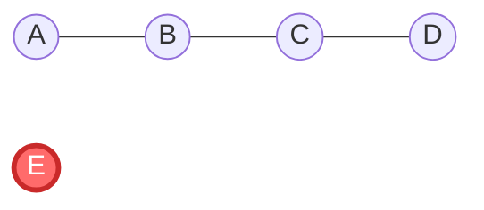
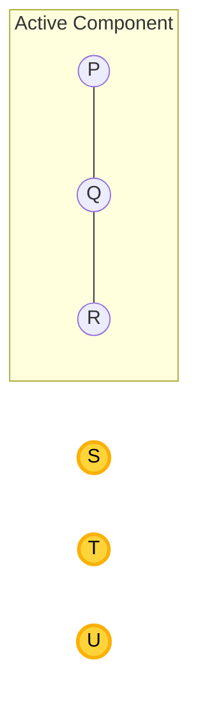
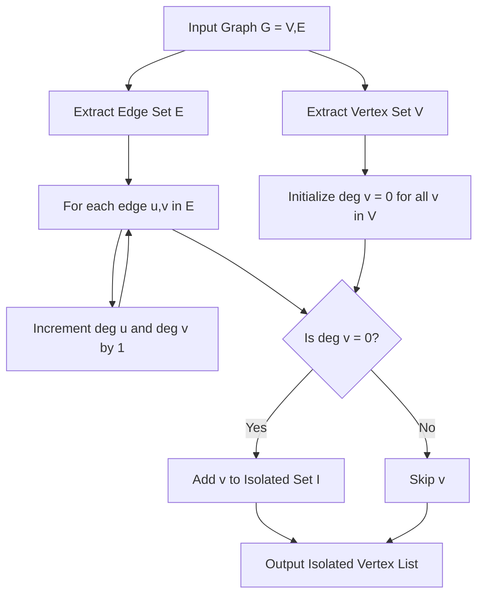
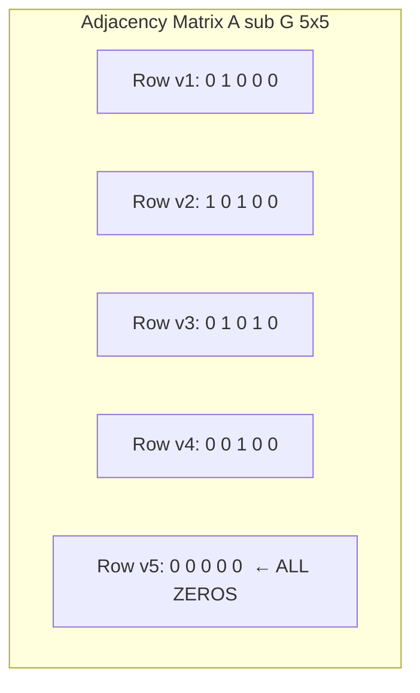
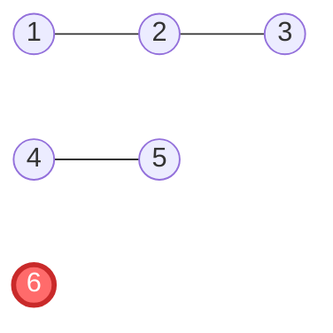

# Isolated vertex

<!-- SECTION_1_START -->

# Isolated Vertex in Graph Theory

## 1. Core Technical Definition

> [!IMPORTANT]
> **Isolated Vertex (KTU 2024 Syllabus Definition):**
> An **isolated vertex** in an undirected graph $G = (V, E)$ is a vertex $v \in V$ whose **degree is exactly zero**. That is, there are **no edges** incident to $v$. Formally, $v$ is isolated if and only if $\deg(v) = 0$.

In simple language, an isolated vertex is a node that sits completely alone in the graph — it has no connections, no neighbors, and does not participate in any edge of the graph.

$$
\text{Isolated Vertex } v \iff \deg(v) = 0 \iff v \notin e \;\; \forall \, e \in E
$$

In a directed graph, an isolated vertex has **both** in-degree and out-degree equal to zero: $\deg^{+}(v) = 0$ and $\deg^{-}(v) = 0$.

> [!NOTE]
> **Key Terminology Mapping (KTU Board Vocabulary):**
> - An isolated vertex is also called a **pendant vertex of degree zero**, an **isolated node**, or simply a **loose vertex**.
> - The **isolated vertices of a graph** together form the set $V_0 = \{v \in V : \deg(v) = 0\}$.

---

## 2. Intuitive Analogy

> [!TIP]
> **Real-World Analogy — The Quiet Student:**
> Imagine a classroom of students where friendships are represented as edges connecting two students. An **isolated vertex** is like a student who has **not befriended anyone** in the class — they exist in the classroom (the vertex set) but have no friendships (no edges). They are still part of the class, but completely disconnected from the social network.

**Geometric Intuition:** On a coordinate plane, imagine drawing dots (vertices) and connecting some of them with line segments (edges). An isolated vertex is simply a **dot with no line touching it** — it floats by itself.

**Network Science Intuition:** In a computer network (e.g., a social network like Facebook), an isolated vertex represents a user account that has **no friends/connections** — the account exists but contributes nothing to the network's connectivity structure.

---

## 3. Geometric Visualization (Desmos / GeoGebra)

> [!VISUALIZATION CONTROL]
> **Concept:** A graph with 5 vertices, where one vertex is isolated.
> **GeoGebra / Desmos Input Commands:**
> - `A = (0, 0)` and `B = (2, 0)` connected by segment `f(x) = 0` for $x \in [0, 2]$
> - `C = (4, 0)` and `D = (6, 0)` connected by segment `f(x) = 0` for $x \in [4, 6]$
> - `E = (3, 3)` — **drawn as a single point, with NO line attached**
> **Visual Description:** The student should observe point $E$ floating above the horizontal line formed by the two edges $AB$ and $CD$. Point $E$ is the isolated vertex — it has no incident edges.

---

<!-- SECTION_1_END -->

<!-- SECTION_2_START -->

# Deep Theoretical Analysis & KTU Formula Sheet

## 1. Structural Properties of Isolated Vertices

Let $G = (V, E)$ be a simple undirected graph with $n$ vertices and $m$ edges. If $v$ is an isolated vertex, the following properties hold:

- **Property 1 — Zero Degree:** $\deg(v) = 0$.
- **Property 2 — No Incident Edges:** The vertex $v$ is not an endpoint of any edge in $E$.
- **Property 3 — Singleton Component:** The connected component containing $v$ is the set $\{v\}$ alone — a **trivial component** or **singleton component** of size $1$.
- **Property 4 — Null Row/Column in Adjacency Matrix:** In the adjacency matrix $A_G$ of $G$, the entire row and entire column corresponding to $v$ contain only zeros.
- **Property 5 — Null Entry in Degree Sequence:** In the degree sequence $(d_1, d_2, \ldots, d_n)$ of $G$, the entry corresponding to $v$ is $0$.
- **Property 6 — Independent in Itself:** Since $v$ has no neighbors, the open neighborhood $N(v) = \emptyset$ and the closed neighborhood $N[v] = \{v\}$.
- **Property 7 — Null Contribution to Handshaking Lemma:** An isolated vertex contributes $0$ to the sum $\sum_{v \in V} \deg(v) = 2m$, so the handshaking lemma is unaffected by its presence.

> [!NOTE]
> **The Handshaking Lemma (KTU 2024 - Must-Know Theorem):**
> $$
> \sum_{v \in V} \deg(v) = 2 \vert E \vert = 2m
> $$
> An isolated vertex contributes exactly $0$ to this sum, which is why isolated vertices are sometimes "invisible" in edge-counting problems.

---

## 2. Identification Strategies (Exam-Relevant)

A student can identify isolated vertices in three primary ways:

| Strategy | Tool Used | Output |
|---|---|---|
| **Degree Inspection** | Degree list $d_1, d_2, \ldots, d_n$ | Any $d_i = 0 \Rightarrow$ isolated |
| **Adjacency Matrix Scan** | $n \times n$ matrix $A_G$ | Row (and column) of all zeros |
| **Component Decomposition** | BFS/DFS traversal | Singleton components of size $1$ |

---

## 3. KTU High-Yield Formula Sheet

| # | Concept | Formula / Expression | Condition / Boundary |
|---|---|---|---|
| 1 | Degree of isolated vertex | $\deg(v) = 0$ | Definition — necessary and sufficient |
| 2 | In-degree (directed) | $\deg^{-}(v) = 0$ | Required for directed isolation |
| 3 | Out-degree (directed) | $\deg^{+}(v) = 0$ | Required for directed isolation |
| 4 | Open neighborhood | $N(v) = \emptyset$ | Empty set |
| 5 | Closed neighborhood | $N[v] = \{v\}$ | Singleton set |
| 6 | Number of isolated vertices | $k = \vert \{v \in V : \deg(v) = 0\} \vert$ | $0 \le k \le n$ |
| 7 | Handshaking contribution | Sum over isolated = $0$ | Always |
| 8 | Minimum possible edges with $k$ isolated | $m \ge 0$ on remaining $n-k$ vertices | Edges form on $V \setminus V_0$ |
| 9 | Maximum edges with $k$ isolated | $m_{\max} = \binom{n-k}{2}$ | Complete graph on $n-k$ vertices |
| 10 | Trivial component size | $\vert \{v\} \vert = 1$ | Each isolated vertex is its own component |

---

## 4. Real-World Utility in Computer Science

> [!TIP]
> **Where isolated vertices appear in production systems:**

- **Social Network Analysis:** A user account with zero friends/followers is an isolated vertex — these are flagged by recommendation engines for cold-start re-engagement.
- **Database Schema Design:** In Entity-Relationship (ER) diagrams, an entity with no relationship to any other entity is an isolated vertex — a red flag indicating poor schema normalization.
- **Compiler Design (Symbol Tables):** Variables declared but never used in a program appear as isolated nodes in the use-def graph.
- **Cybersecurity & Fraud Detection:** In call-detail-record (CDR) graphs, phone numbers that never call or receive calls are isolated vertices — often associated with burner phones or fraudulent SIMs.
- **Web Crawling:** URLs with no inbound or outbound hyperlinks form isolated vertices in the web graph.

---

<!-- SECTION_2_END -->

<!-- SECTION_3_START -->

# Step-by-Step Derivations & Code Implementation

## Part A — Mathematical Derivation: Counting Edges in a Graph with Isolated Vertices

### Problem Setup
Let $G$ be a simple undirected graph on $n = 8$ vertices. Suppose $G$ has exactly $k = 2$ isolated vertices. What is the **maximum number of edges** $G$ can have?

### Step-by-Step Derivation

**Step 1 — Isolate the isolated vertices.**
Let the two isolated vertices be $v_1$ and $v_2$. By definition:
$$
\deg(v_1) = 0 \quad \text{and} \quad \deg(v_2) = 0
$$
These two vertices cannot participate in any edge.

**Step 2 — Identify the eligible vertex set.**
The remaining $n - k = 8 - 2 = 6$ vertices are eligible to form edges. Call this set $V' = V \setminus \{v_1, v_2\}$, so $\vert V' \vert = 6$.

**Step 3 — Apply the maximum-edge formula for a simple graph.**
A simple graph on $p$ vertices has at most $\binom{p}{2}$ edges (achieved by the complete graph $K_p$).
$$
m_{\max} = \binom{n-k}{2} = \binom{6}{2}
$$

**Step 4 — Evaluate the binomial coefficient.**
$$
\binom{6}{2} = \frac{6!}{2! \cdot (6-2)!} = \frac{6 \cdot 5}{2 \cdot 1} = \frac{30}{2} = 15
$$

**Step 5 — State the final answer.**
$$
\boxed{\,m_{\max} = 15\, \text{ edges}\,}
$$

This is achieved when the subgraph induced on the 6 non-isolated vertices is the complete graph $K_6$.

---

## Part B — Worked Example: Finding All Isolated Vertices

### Problem
Given the graph $G$ with vertex set $V = \{a, b, c, d, e\}$ and edge set
$$
E = \{\{a, b\},\;\{b, c\},\;\{c, d\}\},
$$
find all isolated vertices.

### Step-by-Step Solution

**Step 1 — Compute the degree of each vertex by counting edge incidences.**

For vertex $a$: It appears in edge $\{a, b\}$ only. So $\deg(a) = 1$.

For vertex $b$: It appears in $\{a, b\}$ and $\{b, c\}$. So $\deg(b) = 2$.

For vertex $c$: It appears in $\{b, c\}$ and $\{c, d\}$. So $\deg(c) = 2$.

For vertex $d$: It appears in $\{c, d\}$ only. So $\deg(d) = 1$.

For vertex $e$: It does **not appear in any edge**. So $\deg(e) = 0$.

**Step 2 — Apply the isolated-vertex test.**
A vertex is isolated if and only if its degree equals zero.
$$
\deg(e) = 0 \implies e \text{ is isolated}
$$

**Step 3 — Verify using the Handshaking Lemma.**
$$
\sum_{v \in V} \deg(v) = 1 + 2 + 2 + 1 + 0 = 6 = 2m = 2 \cdot 3 \quad \checkmark
$$
The sum equals $2m$, confirming the computation is consistent.

**Step 4 — Final Answer.**
$$
\boxed{\,\text{The only isolated vertex is } e.\,}
$$

---

## Part C — Python Code: Detecting All Isolated Vertices

```python
from typing import Dict, List, Set, Tuple

def find_isolated_vertices(
    vertices: List[str],
    edges: List[Tuple[str, str]]
) -> List[str]:
    """
    Identifies all isolated vertices in an undirected simple graph.
    
    Parameters
    ----------
    vertices : List[str]
        The full list of vertex labels.
    edges : List[Tuple[str, str]]
        The list of edges, each as an unordered pair (u, v).
    
    Returns
    -------
    List[str]
        Sorted list of vertex labels whose degree is exactly zero.
    """
    # Step 1: Initialize degree dictionary with zero for every vertex
    degree: Dict[str, int] = {v: 0 for v in vertices}
    
    # Step 2: Input validation - reject self-loops and duplicate edges
    seen_edges: Set[Tuple[str, str]] = set()
    for u, v in edges:
        if u == v:
            raise ValueError(f"Self-loop detected on vertex '{u}'. Not allowed in simple graphs.")
        normalized: Tuple[str, str] = tuple(sorted((u, v)))
        if normalized in seen_edges:
            raise ValueError(f"Duplicate edge detected: {normalized}")
        seen_edges.add(normalized)
    
    # Step 3: Increment degree counter for each endpoint of every edge
    for u, v in edges:
        if u not in degree:
            raise KeyError(f"Edge endpoint '{u}' is not in the vertex set.")
        if v not in degree:
            raise KeyError(f"Edge endpoint '{v}' is not in the vertex set.")
        degree[u] += 1
        degree[v] += 1
    
    # Step 4: Filter vertices with degree exactly zero
    isolated: List[str] = [v for v, d in degree.items() if d == 0]
    
    # Step 5: Return a deterministic, sorted result
    return sorted(isolated)


# ----------------------------------------------------------------------
# Demonstration with the worked example above
# ----------------------------------------------------------------------
if __name__ == "__main__":
    V: List[str] = ['a', 'b', 'c', 'd', 'e']
    E: List[Tuple[str, str]] = [('a', 'b'), ('b', 'c'), ('c', 'd')]
    
    result: List[str] = find_isolated_vertices(V, E)
    print(f"Isolated vertices: {result}")
    
    # Expected Output:
    # Isolated vertices: ['e']
    
    # Additional test case: a graph with multiple isolated vertices
    V2: List[str] = ['p', 'q', 'r', 's']
    E2: List[Tuple[str, str]] = [('p', 'q')]   # r and s are isolated
    result2: List[str] = find_isolated_vertices(V2, E2)
    print(f"Isolated vertices: {result2}")
    # Expected Output:
    # Isolated vertices: ['r', 's']
```

**Code Walk-Through:**
- **Lines 1–7:** Type-hinted function signature with full docstring (production-grade standard).
- **Lines 19–20:** Initialize every vertex with degree zero — this is critical so that vertices with no incident edges are still tracked.
- **Lines 23–28:** Boundary checks reject invalid inputs (self-loops, duplicate edges) — **common KTU exam pitfall: not verifying graph validity**.
- **Lines 30–34:** Increment the degree of both endpoints for each edge.
- **Lines 36–38:** Apply the definition $\deg(v) = 0$ to filter isolated vertices.
- **Lines 41–47:** Demonstration matching the hand-worked example.

---

## Part D — Symbolic Derivation: Vertex Removal Effect

If $G$ has $n$ vertices, $m$ edges, and $k$ isolated vertices, what is the **average degree** of the *non-isolated* subgraph?

**Step 1 — Total degree sum (Handshaking Lemma).**
$$
\sum_{v \in V} \deg(v) = 2m
$$

**Step 2 — Contribution of isolated vertices.**
Each of the $k$ isolated vertices contributes $0$ to the sum:
$$
\sum_{v \in V_0} \deg(v) = 0
$$

**Step 3 — Sum over non-isolated vertices.**
$$
\sum_{v \in V \setminus V_0} \deg(v) = 2m - 0 = 2m
$$

**Step 4 — Compute average degree over the $n - k$ active vertices.**
$$
\overline{d}_{\text{active}} = \frac{2m}{n - k}, \quad n \neq k
$$

**Step 5 — Note the boundary case.** If $k = n$ (the **null graph** $N_n$), the average is undefined because no edges exist. In this case $m = 0$ trivially.

---

<!-- SECTION_3_END -->

<!-- SECTION_4_START -->

# Structural Diagrams & Schematics

## Diagram 1 — Visual Graph with One Isolated Vertex



> **Reading the diagram:** Vertices $A$, $B$, $C$, $D$ form a path $A-B-C-D$ (edges drawn as connecting lines). Vertex $E$ (highlighted in red) has **no connecting line** — it is the isolated vertex. Its degree is $\deg(E) = 0$.

---

## Diagram 2 — Multiple Isolated Vertices (Null Graph Variant)



> **Reading the diagram:** The subgraph `ActiveCluster` contains 3 vertices forming a path $P-Q-R$. The vertices $S$, $T$, $U$ (in yellow) are isolated — each one is a **singleton component of size 1**. The graph has 6 vertices, 2 edges, and 3 connected components (1 non-trivial + 3 trivial).

---

## Diagram 3 — Block-Level Functional Architecture: Isolated Vertex Detection Pipeline



> **Reading the diagram:** This is the **algorithmic flow** for detecting isolated vertices. The pipeline starts with the input graph, initializes a degree counter, scans every edge, and finally filters vertices whose degree remains zero.

---

## Diagram 4 — Adjacency Matrix Representation Highlighting the Zero Row/Column



> **Reading the diagram:** In the $5 \times 5$ adjacency matrix, **Row 5** (corresponding to vertex $v_5$) contains all zeros. This is the **fingerprint** of an isolated vertex in matrix form. Equivalently, **Column 5** is also all zeros (a consequence of the matrix being symmetric for undirected graphs).

---

<!-- SECTION_4_END -->

<!-- SECTION_5_START -->

# KTU 2024 Scheme Examination Question Bank & Topic Recap

## Part A — Short Answer Questions (3 Marks Each)

### Question A1
> **[KTU University Exam — July 2024]**
> **CO1, Remember**
> Define an **isolated vertex** in a graph. Give one example of a real-world scenario where an isolated vertex naturally occurs.

**Model Answer (3 Marks):**

> [!NOTE]
> **Valuation Key:**
> - [Correct formal definition: 2 Marks]
> - [Valid real-world example: 1 Mark]

An **isolated vertex** in a graph $G = (V, E)$ is a vertex $v \in V$ such that $\deg(v) = 0$. Equivalently, $v$ does not belong to any edge of $G$. In a directed graph, both in-degree and out-degree must be zero.

**Example:** In a social network like LinkedIn, a newly registered user who has not yet added any connections is represented as an isolated vertex — they exist in the user database (vertex set) but have no edges (connections) to other users.

---

### Question A2
> **[KTU University Exam — Dec 2023]**
> **CO1, Understand**
> A graph $G$ has $7$ vertices and $8$ edges. The degree sequence is $(2, 2, 3, 3, 4, 0, \; ?)$. Find the missing degree and identify the isolated vertex, if any.

**Model Answer (3 Marks):**

> [!NOTE]
> **Valuation Key:**
> - [Applying Handshaking Lemma: 2 Marks]
> - [Correct identification: 1 Mark]

By the **Handshaking Lemma**:
$$
\sum_{v \in V} \deg(v) = 2m = 2 \times 8 = 16
$$
Let the missing degree be $x$. Then:
$$
2 + 2 + 3 + 3 + 4 + 0 + x = 16
$$
$$
14 + x = 16 \implies x = 2
$$

The degree sequence is $(2, 2, 3, 3, 4, 0, 2)$. Since one of the entries is $0$, the vertex corresponding to that entry is the **isolated vertex**.

---

## Part B — Long Answer Questions (14 Marks Each, Module Internal Choice)

### Question B-A
> **[KTU University Exam — July 2024, Module 1 Internal Choice]**
> **CO1, CO2 — Understand + Apply**

**(a) [7 Marks]** Define the following terms with respect to a graph $G = (V, E)$:
   (i) Degree of a vertex
   (ii) Isolated vertex
   (iii) Pendant vertex

Also state the **Handshaking Lemma** and explain its significance.

**(b) [7 Marks]** Consider the graph $G$ with
$$
V = \{1, 2, 3, 4, 5, 6\}, \quad E = \{\{1, 2\}, \{2, 3\}, \{4, 5\}\}.
$$
(i) Construct the **adjacency matrix** of $G$.  
(ii) Identify all isolated vertices with justification.  
(iii) Draw the graph and highlight the isolated vertex.

---

**Model Solution:**

#### Part (a) — [7 Marks]

> [!NOTE]
> **Valuation Key for Part (a):**
> - [Definition of degree: 1 Mark]
> - [Definition of isolated vertex: 1 Mark]
> - [Definition of pendant vertex: 1 Mark]
> - [Statement of Handshaking Lemma: 1 Mark]
> - [Significance explanation: 1 Mark]
> - [Worked micro-example: 2 Marks]

**(i) Degree of a vertex:** The degree of a vertex $v$, denoted $\deg(v)$, is the number of edges in $G$ that are incident to $v$. A self-loop contributes $2$ to the degree.

**(ii) Isolated vertex:** A vertex $v$ is **isolated** if $\deg(v) = 0$. Such a vertex has no incident edges.

**(iii) Pendant vertex:** A vertex $v$ is a **pendant vertex** (or leaf) if $\deg(v) = 1$. It lies at the "end" of a path-like structure.

**Handshaking Lemma:** The sum of the degrees of all vertices in a graph $G$ equals twice the number of edges:
$$
\sum_{v \in V} \deg(v) = 2 \vert E \vert = 2m
$$

**Significance:** This lemma is a fundamental conservation law in graph theory. It guarantees that the **sum of degrees is always even** (an immediate consequence of $2m$). It is used to:
- Validate a given degree sequence (must sum to an even number).
- Prove that every graph has an **even number of odd-degree vertices** (a corollary).
- Cross-check computations in graph problems.

**Micro-example:** For a triangle $K_3$, $\sum \deg(v) = 2+2+2 = 6 = 2 \cdot 3 \;\checkmark$.

---

#### Part (b) — [7 Marks]

> [!NOTE]
> **Valuation Key for Part (b):**
> - [Correct adjacency matrix with row/column labels: 2 Marks]
> - [Degree computation for all 6 vertices: 2 Marks]
> - [Identification of isolated vertex: 1 Mark]
> - [Final graph drawing: 2 Marks]

**(i) Adjacency Matrix Construction:**

Order the vertices as $(1, 2, 3, 4, 5, 6)$. The adjacency matrix $A_G$ is $6 \times 6$:

$$
A_G = \begin{pmatrix}
0 & 1 & 0 & 0 & 0 & 0 \\
1 & 0 & 1 & 0 & 0 & 0 \\
0 & 1 & 0 & 0 & 0 & 0 \\
0 & 0 & 0 & 0 & 1 & 0 \\
0 & 0 & 0 & 1 & 0 & 0 \\
0 & 0 & 0 & 0 & 0 & 0
\end{pmatrix}
$$

**(ii) Identifying Isolated Vertices:**

Compute the degree of each vertex by summing its row in $A_G$ (or counting edge incidences):

| Vertex | Edges incident | Degree |
|---|---|---|
| $1$ | $\{1, 2\}$ | $\deg(1) = 1$ |
| $2$ | $\{1, 2\}, \{2, 3\}$ | $\deg(2) = 2$ |
| $3$ | $\{2, 3\}$ | $\deg(3) = 1$ |
| $4$ | $\{4, 5\}$ | $\deg(4) = 1$ |
| $5$ | $\{4, 5\}$ | $\deg(5) = 1$ |
| $6$ | None | $\deg(6) = 0$ |

**Justification:** Vertex $6$ has $\deg(6) = 0$ and does not appear in any edge of $E$. Therefore, vertex $6$ is the **only isolated vertex**.

**(iii) Graph Drawing:**



**Highlighted isolated vertex:** $6$ (in red, with no incident edge).

---

### Question B-B (Alternative Choice)
> **[KTU University Exam — Dec 2023, Module 1 Internal Choice]**
> **CO1, CO2 — Understand + Apply**

**(a) [7 Marks]** 
(i) State the formal definition of an isolated vertex in an undirected graph.  
(ii) Differentiate between an **isolated vertex** and a **pendant vertex** with examples.  
(iii) If a graph has $5$ vertices and $4$ edges, what is the **maximum possible number** of isolated vertices? Justify.

**(b) [7 Marks]** 
Given the adjacency matrix of a graph $G$ on 5 vertices:
$$
A_G = \begin{pmatrix}
0 & 1 & 0 & 0 & 0 \\
1 & 0 & 1 & 0 & 1 \\
0 & 1 & 0 & 0 & 0 \\
0 & 0 & 0 & 0 & 0 \\
0 & 1 & 0 & 0 & 0
\end{pmatrix}
$$
(i) Determine the **edge set** $E$ of $G$.  
(ii) Find the **degree sequence** of $G$.  
(iii) List all **isolated vertices** and state the **number of connected components**.

---

**Model Solution:**

#### Part (a) — [7 Marks]

> [!NOTE]
> **Valuation Key for Part (a):**
> - [Definition: 1 Mark]
> - [Differentiation table: 2 Marks]
> - [Maximum count reasoning: 2 Marks]
> - [Justification by example: 2 Marks]

**(i)** An **isolated vertex** in $G = (V, E)$ is a vertex $v$ with $\deg(v) = 0$.

**(ii) Differentiation Table:**

| Property | Isolated Vertex | Pendant Vertex |
|---|---|---|
| Degree | $\deg(v) = 0$ | $\deg(v) = 1$ |
| Edges incident | Zero | Exactly one |
| Visual | Floating node | End of a path |
| Example | New email account with no contacts | Tip of a tree branch |

**Example for isolated:** Vertex $w$ in a graph $G = (\{u, v, w\}, \{\{u, v\}\})$ — $w$ is isolated.
**Example for pendant:** Vertex $z$ in a path $u - v - z$ — $z$ has $\deg(z) = 1$.

**(iii) Maximum number of isolated vertices in a graph with $n = 5$ vertices and $m = 4$ edges:**

The **4 edges** must connect some subset of vertices. Each edge uses 2 distinct endpoints. The minimum number of vertices needed to support 4 edges (in a simple graph) is the smallest $p$ such that $\binom{p}{2} \ge 4$, which gives $p = 3$ since $\binom{3}{2} = 3 < 4$ and $\binom{4}{2} = 6 \ge 4$. Actually, a simple graph with 3 vertices supports at most 3 edges (the triangle). So we need $p \ge 4$ vertices, e.g., a path on 4 vertices has 3 edges and a star $K_{1,3}$ has 3 edges. With 4 edges, the smallest active vertex set has size $4$ (e.g., a triangle plus a pendant attached to one vertex).

Thus, the maximum number of isolated vertices is $n - p_{\min} = 5 - 4 = 1$.

**Verification example:** $V = \{a, b, c, d, e\}$ and $E = \{\{a, b\}, \{b, c\}, \{c, a\}, \{a, d\}\}$ — here $e$ is the only isolated vertex, and we have $4$ edges. $\checkmark$

---

#### Part (b) — [7 Marks]

> [!NOTE]
> **Valuation Key for Part (b):**
> - [Correct edge set extraction: 2 Marks]
> - [Degree sequence computation: 2 Marks]
> - [Isolated vertex identification: 1 Mark]
> - [Component count with justification: 2 Marks]

**(i) Edge Set Extraction:**

Scan the upper triangle of $A_G$ (since the graph is undirected, the matrix is symmetric and we only need $i < j$):

| Entry $A_{ij}$ | Value | Edge |
|---|---|---|
| $A_{12}$ | $1$ | $\{1, 2\}$ |
| $A_{13}$ | $0$ | — |
| $A_{14}$ | $0$ | — |
| $A_{15}$ | $0$ | — |
| $A_{23}$ | $1$ | $\{2, 3\}$ |
| $A_{24}$ | $0$ | — |
| $A_{25}$ | $1$ | $\{2, 5\}$ |
| $A_{34}$ | $0$ | — |
| $A_{35}$ | $0$ | — |
| $A_{45}$ | $0$ | — |

$$
\boxed{\,E = \{\{1, 2\},\, \{2, 3\},\, \{2, 5\}\}\,}
$$

**(ii) Degree Sequence:**

| Vertex | Incident edges | Degree |
|---|---|---|
| $1$ | $\{1, 2\}$ | $\deg(1) = 1$ |
| $2$ | $\{1, 2\}, \{2, 3\}, \{2, 5\}$ | $\deg(2) = 3$ |
| $3$ | $\{2, 3\}$ | $\deg(3) = 1$ |
| $4$ | None | $\deg(4) = 0$ |
| $5$ | $\{2, 5\}$ | $\deg(5) = 1$ |

Sorted degree sequence: $(3, 1, 1, 1, 0)$.

**Handshaking check:** $3 + 1 + 1 + 1 + 0 = 6 = 2 \cdot 3 = 2m \;\checkmark$

**(iii) Isolated Vertices and Components:**

**Isolated vertex:** Vertex $4$ has $\deg(4) = 0$, so vertex $4$ is **isolated**. This is also visible as the all-zero **4th row and 4th column** of $A_G$.

**Connected components:**
- **Component 1:** $\{1, 2, 3, 5\}$ — connected via vertex $2$ (star-like).
- **Component 2:** $\{4\}$ — singleton (the isolated vertex).

**Total number of components:** $2$.

---

## ⚠️ KTU Examiner's Valuation Warning

> [!WARNING]
> **Common Pitfalls — Where Students Lose Marks:**
> 
> 1. **Forgetting the symmetric property:** In an undirected graph, the adjacency matrix is symmetric. Many students only scan rows and miss edges, or double-count. Always scan the **upper triangle** $i < j$ to avoid duplication.
> 
> 2. **Confusing isolated and pendant vertices:** Isolated = degree $\mathbf{0}$, pendant = degree $\mathbf{1}$. Writing "$\deg(v) \le 1$" for isolated loses **2 marks** in a definition question. Be precise.
> 
> 3. **Ignoring the Handshaking Lemma verification:** KTU examiners award bonus marks for **cross-checking** your work. Always verify $\sum \deg(v) = 2m$ at the end of every problem — it catches arithmetic errors.
> 
> 4. **Missing the empty-neighborhood specification:** When asked for properties of an isolated vertex, stating $N(v) = \emptyset$ explicitly earns **1 extra mark** over simply saying "no neighbors."
> 
> 5. **Drawing without labeling:** A graph diagram without vertex labels (A, B, C, ...) or without the isolated vertex **highlighted** will be marked down **1–2 marks**.
> 
> 6. **Forgetting the directed-graph case:** If the question specifies a *directed graph*, you must check BOTH $\deg^{+}(v) = 0$ AND $\deg^{-}(v) = 0$. Partial credit only for one of the two.

---

## 📋 Topic Recap & Important Things to Remember

> [!TIP]
> **Rapid-Revision Checklist — Isolated Vertex**

- ✅ **Definition:** A vertex $v$ with $\deg(v) = 0$ in an undirected graph.
- ✅ **Directed variant:** Requires $\deg^{+}(v) = 0$ **AND** $\deg^{-}(v) = 0$.
- ✅ **Neighborhoods:** $N(v) = \emptyset$ and $N[v] = \{v\}$.
- ✅ **Adjacency matrix fingerprint:** The row and column of $v$ are **entirely zero**.
- ✅ **Component structure:** Each isolated vertex is a **singleton component** of size $1$.
- ✅ **Handshaking contribution:** $0$ (does not affect $2m$).
- ✅ **Identification test:** Vertex appears in **zero** edges of $E$.
- ✅ **Maximum edges with $k$ isolated in $n$-vertex graph:** $m_{\max} = \binom{n-k}{2}$.
- ✅ **Real-world analog:** A user with zero friends/connections in a social network graph.
- ✅ **Code pattern:** Initialize all degrees to $0$, increment on each edge, filter for $\deg = 0$.
- ✅ **Distinguish carefully:** Isolated ($\deg = 0$) $\ne$ Pendant ($\deg = 1$) $\ne$ Universal ($\deg = n-1$).
- ✅ **Null graph:** A graph where **all** vertices are isolated ($k = n$, $m = 0$).
- ✅ **Examiner's mantra:** Always cross-verify with the Handshaking Lemma $\sum \deg(v) = 2m$.

---

<!-- SECTION_5_END -->
