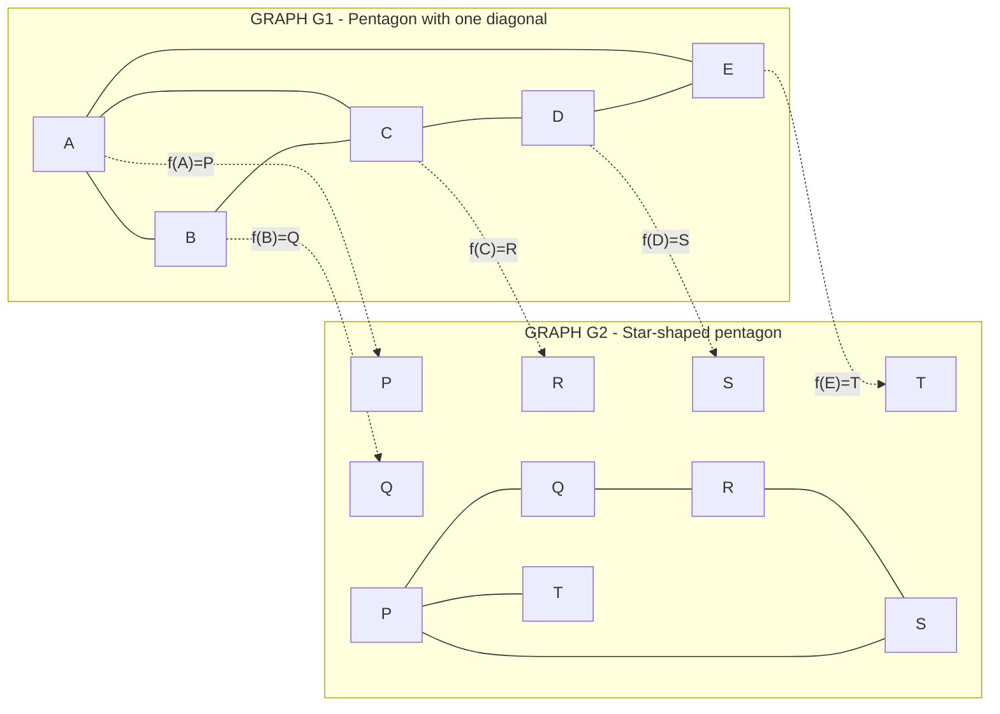
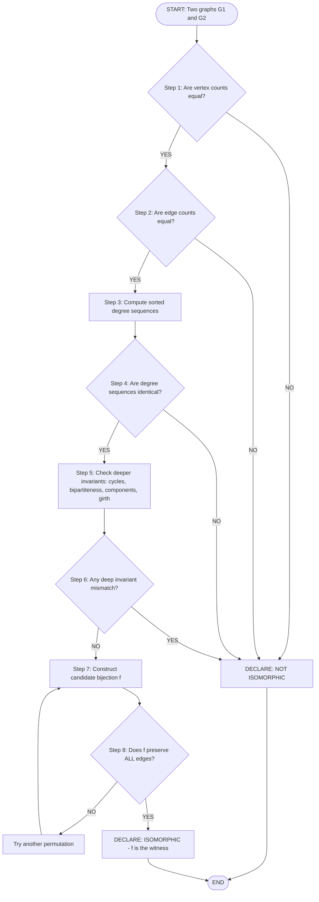
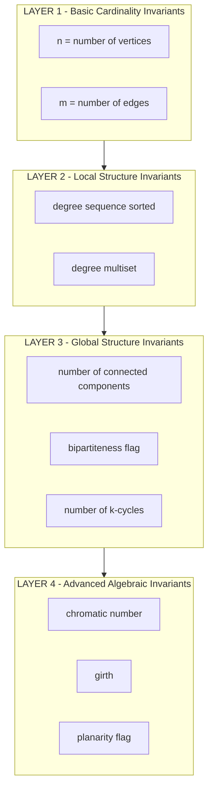

# Isomorphism

<!-- SECTION_1_START -->
# Graph Isomorphism: Core Technical Definition & Intuitive Overview

> [!IMPORTANT]
> **KTU 2024 Module Focus (GAMAT401 - Mathematics for Computer and Information Science-4):** Isomorphism is the formal mathematical machinery that allows computer scientists to recognize that two different-looking graph structures are *structurally identical*. This forms the backbone of graph canonization, network motif detection, and chemical compound matching.

## 1.1 Formal Definition (KTU Board-Standard)

Let $G_1 = (V_1, E_1)$ and $G_2 = (V_2, E_2)$ be two simple undirected graphs. A **graph isomorphism** from $G_1$ to $G_2$ is a bijective (one-to-one and onto) function:

$$f: V_1 \rightarrow V_2$$

such that for every pair of vertices $u, v \in V_1$:

$$(u, v) \in E_1 \iff (f(u), f(v)) \in E_2$$

If such a bijection exists, the graphs are said to be **isomorphic**, written as:

$$G_1 \cong G_2$$

> [!NOTE]
> **Critical Board Interpretation:** An isomorphism is essentially a *vertex relabeling* that perfectly preserves the edge relationship. If you can re-label the vertices of one graph to obtain the other, they are isomorphic.

## 1.2 Intuitive Analogy: "The Same Network, Different City"

Imagine you have a road map of **Kochi** and a road map of **Trivandrum**. The maps look completely different — Kochi has a coastline, Trivandrum has hills. But suppose you discover a one-to-one mapping:

- Junction A in Kochi $\leftrightarrow$ Junction X in Trivandrum
- Junction B in Kochi $\leftrightarrow$ Junction Y in Trivandrum
- A road connecting A-B in Kochi $\leftrightarrow$ A road connecting X-Y in Trivandrum

...and this mapping *perfectly preserves every connection* between every pair of junctions. Then, **topologically**, the two road networks are the *same* network. They are **isomorphic**.

> The graphs may have totally different geometric drawings, but their underlying **connectivity skeleton** is identical.

## 1.3 The Power of Isomorphism in Computer Science

| Field | Use of Graph Isomorphism |
| :--- | :--- |
| **Chemistry** | Determining if two molecular structures are the same compound. |
| **Database Theory** | Query optimization by recognizing structurally identical sub-queries. |
| **Network Analysis** | Detecting recurring *motifs* in social/computer networks. |
| **Compiler Design** | Register allocation and instruction scheduling. |
| **Cryptography** | Constructing hard isomorphism problems for non-deterministic encryption. |

## 1.4 Visualization Block

> [!VISUALIZATION CONTROL]
> **Concept:** Two isomorphic simple graphs on 4 vertices drawn in different geometric layouts.
> **GeoGebra Input Points / Lines:**
> * Left graph vertices: $A = (0, 0)$, $B = (2, 0)$, $C = (2, 2)$, $D = (0, 2)$ forming a square with one diagonal.
> * Right graph vertices: $P = (1, 3)$, $Q = (3, 3)$, $R = (3, 1)$, $S = (1, 1)$ forming a "bowtie-plus-line" configuration.
> **Visual Description:** Observe that despite different geometric shapes, the connectivity skeleton (3 edges forming a path of length 3 with a pendant, or simply a $P_4$ path) is identical in both. The student should be able to spot the bijection that maps $A \to P$, $B \to Q$, $C \to R$, $D \to S$.

<!-- SECTION_1_END -->

<!-- SECTION_2_START -->
# Deep Theoretical Analysis & KTU High-Yield Formula Sheet

## 2.1 Necessary Conditions (Invariants) for Isomorphism

Before attempting to construct a bijection, a KTU examiner expects you to verify the **necessary conditions**. These are properties that *cannot change* under vertex relabeling. If they differ, the graphs **cannot** be isomorphic.

### Invariant Checklist (Must be identical for both graphs)

1. **Number of vertices:** $\vert V_1 \vert = \vert V_2 \vert$
2. **Number of edges:** $\vert E_1 \vert = \vert E_2 \vert$
3. **Degree sequence** (sorted in non-increasing order): $\Delta(G_1) = \Delta(G_2)$
4. **Number of vertices of each degree** (degree multiset)
5. **Number of cycles of each length** $C_k$ for $k = 3, 4, 5, \ldots$
6. **Number of connected components**
7. **Bipartiteness** (is the graph bipartite?)
8. **Chromatic number** $\chi(G)$
9. **Girth** (length of shortest cycle)
10. **Planarity** (can it be drawn without crossing edges?)

> [!IMPORTANT]
> **KTU Board Hack:** If *any one* of these invariants differs, immediately declare the graphs are **NOT isomorphic**. This is a guaranteed 2-mark short-answer in Part A.

## 2.2 Sufficient Conditions (Quick Wins)

The following are special cases where invariants alone **guarantee** isomorphism:

| Graph Class | Sufficient Condition |
| :--- | :--- |
| **Trees** on $n$ vertices | Same degree sequence $\implies$ isomorphic. |
| **Paths** $P_n$ | Both are paths on the same $n$ $\implies$ isomorphic. |
| **Cycles** $C_n$ | Both are cycles on the same $n$ $\implies$ isomorphic. |
| **Complete graphs** $K_n$ | Both have $n$ vertices $\implies$ isomorphic. |

## 2.3 KTU Formula Sheet & Invariant Table

| Property | Formula / Condition | Unit / Type |
| :--- | :--- | :--- |
| Edge count of $K_n$ | $E = \binom{n}{2} = \dfrac{n(n-1)}{2}$ | Pure number |
| Handshaking Lemma | $\sum_{v \in V} \deg(v) = 2 \vert E \vert$ | Pure number |
| Degree sequence of $C_n$ | All degrees $= 2$ (multiset of $n$ twos) | Sorted list |
| Degree sequence of $K_n$ | All degrees $= n-1$ (multiset of $n$ values) | Sorted list |
| Number of spanning trees of $K_n$ | $n^{n-2}$ (Cayley's formula) | Pure number |
| Complement edge count | $\vert \overline{E} \vert = \binom{n}{2} - \vert E \vert$ | Pure number |
| Complement degree | $\deg_{\overline{G}}(v) = (n-1) - \deg_G(v)$ | Pure number |
| Self-loop restriction | A *simple* graph has $0$ self-loops | Invariant |
| Isomorphism composition | If $G_1 \cong G_2$ and $G_2 \cong G_3$, then $G_1 \cong G_3$ | Transitivity |
| Reflexive law | $G \cong G$ via identity map $f(v) = v$ | Identity |

## 2.4 The Adjacency Matrix Connection

Two graphs $G_1$ and $G_2$ are isomorphic **if and only if** their adjacency matrices $A_1$ and $A_2$ are **permutationally similar**, i.e., there exists a permutation matrix $P$ such that:

$$A_2 = P^{-1} A_1 P = P^T A_1 P$$

This is because permuting the rows and columns of an adjacency matrix corresponds exactly to re-labeling the vertices.

## 2.5 Engineering & CS Utility

- **Compiler Optimization:** Two control-flow graphs being isomorphic means the same optimization pass applies to both, saving development time.
- **Bioinformatics:** Protein-protein interaction (PPI) network alignment uses subgraph isomorphism to find conserved functional modules across species.
- **Social Network Forensics:** Pattern matching via isomorphism helps identify fake-account networks that mirror a known bot structure.
- **Circuit Design:** Two CMOS circuit netlists are isomorphic $\iff$ they implement identical logic, enabling design reuse.

<!-- SECTION_2_END -->

<!-- SECTION_3_START -->
# Step-by-Step Derivations, Proofs & Code Implementation

## 3.1 Worked Example 1: Proving $K_{3} \cong C_{3}$

**Given:** $G_1 = K_3$ (complete graph on 3 vertices). $G_2 = C_3$ (cycle graph on 3 vertices, also called a triangle).

**Step 1 — Verify Invariants.**

* $\vert V_1 \vert = 3 = \vert V_2 \vert$ ✓
* $\vert E_1 \vert = \binom{3}{2} = 3 = \vert E_2 \vert$ ✓
* Degree sequence of $K_3$: $\{2, 2, 2\}$.
* Degree sequence of $C_3$: $\{2, 2, 2\}$ ✓
* Both contain exactly one 3-cycle. ✓

**Step 2 — Construct the Bijection.**

Let $V(K_3) = \{a, b, c\}$ and $V(C_3) = \{1, 2, 3\}$.

Define $f: V(K_3) \rightarrow V(C_3)$ as:

$$f(a) = 1, \quad f(b) = 2, \quad f(c) = 3$$

**Step 3 — Verify Edge Preservation.**

All edges of $K_3$:

$$E(K_3) = \{(a,b), (b,c), (a,c)\}$$

All edges of $C_3$:

$$E(C_3) = \{(1,2), (2,3), (1,3)\}$$

Now check the mapping of each edge:

* $(a, b) \in E(K_3) \implies (f(a), f(b)) = (1, 2) \in E(C_3)$ ✓
* $(b, c) \in E(K_3) \implies (f(b), f(c)) = (2, 3) \in E(C_3)$ ✓
* $(a, c) \in E(K_3) \implies (f(a), f(c)) = (1, 3) \in E(C_3)$ ✓

Since every edge maps to an edge and the function is a bijection, $K_3 \cong C_3$. **Q.E.D.**

> [!NOTE]
> **Key Insight:** On exactly 3 vertices, $K_3$ and $C_3$ are the *only* simple graphs. So they must be isomorphic. This is a common trick question in KTU boards.

## 3.2 Worked Example 2: Proving Two Graphs are NOT Isomorphic

**Given:** 
* Graph $G_1$: A path $P_4$ on 4 vertices (4 vertices in a line, 3 edges).
* Graph $G_2$: A star $K_{1,3}$ on 4 vertices (1 center connected to 3 leaves).

**Step 1 — Check Invariants.**

* $\vert V_1 \vert = 4 = \vert V_2 \vert$ ✓
* $\vert E_1 \vert = 3 = \vert E_2 \vert$ ✓

**Step 2 — Check Degree Sequences.**

* Degree sequence of $P_4$ (in non-increasing order): $\{2, 2, 1, 1\}$.
* Degree sequence of $K_{1,3}$ (in non-increasing order): $\{3, 1, 1, 1\}$.

**Step 3 — Compare.**

$$\{2, 2, 1, 1\} \neq \{3, 1, 1, 1\}$$

Since the degree sequences are *different*, no bijection can preserve adjacency.

**Conclusion:** $P_4 \not\cong K_{1,3}$. **Q.E.D.**

> [!IMPORTANT]
> **Examiner's Logic:** You do not need to check anything else. The moment a single invariant fails, isomorphism is impossible. This is the **fastest** way to score the 2-mark "non-isomorphic" question in KTU.

## 3.3 Worked Example 3: Adjacency Matrix Verification

**Given:** $G_1$ with vertices $\{1, 2, 3, 4\}$ and edges $\{12, 23, 34\}$ (a path $P_4$).
**And:** $G_2$ with vertices $\{a, b, c, d\}$ and edges $\{ac, bd, ad\}$ (a "T" shape).

**Adjacency Matrix of $G_1$:**

$$A_1 = \begin{pmatrix} 0 & 1 & 0 & 0 \\ 1 & 0 & 1 & 0 \\ 0 & 1 & 0 & 1 \\ 0 & 0 & 1 & 0 \end{pmatrix}$$

**Adjacency Matrix of $G_2$:**

$$A_2 = \begin{pmatrix} 0 & 0 & 1 & 1 \\ 0 & 0 & 0 & 1 \\ 1 & 0 & 0 & 0 \\ 1 & 1 & 0 & 0 \end{pmatrix}$$

**Step 1 — Find a Candidate Permutation.** Try the mapping $1 \to a$, $2 \to c$, $3 \to d$, $4 \to b$. The corresponding permutation matrix $P$ is:

$$P = \begin{pmatrix} 1 & 0 & 0 & 0 \\ 0 & 0 & 0 & 1 \\ 0 & 1 & 0 & 0 \\ 0 & 0 & 1 & 0 \end{pmatrix}$$

**Step 2 — Compute $P^T A_1 P$.**

First, compute $A_1 P$:

$$A_1 P = \begin{pmatrix} 0 & 1 & 0 & 0 \\ 1 & 0 & 1 & 0 \\ 0 & 1 & 0 & 1 \\ 0 & 0 & 1 & 0 \end{pmatrix} \begin{pmatrix} 1 & 0 & 0 & 0 \\ 0 & 0 & 0 & 1 \\ 0 & 1 & 0 & 0 \\ 0 & 0 & 1 & 0 \end{pmatrix} = \begin{pmatrix} 0 & 0 & 0 & 1 \\ 1 & 1 & 0 & 0 \\ 0 & 0 & 1 & 1 \\ 0 & 1 & 0 & 0 \end{pmatrix}$$

Then, compute $P^T (A_1 P)$:

$$P^T A_1 P = \begin{pmatrix} 1 & 0 & 0 & 0 \\ 0 & 0 & 1 & 0 \\ 0 & 0 & 0 & 1 \\ 0 & 1 & 0 & 0 \end{pmatrix} \begin{pmatrix} 0 & 0 & 0 & 1 \\ 1 & 1 & 0 & 0 \\ 0 & 0 & 1 & 1 \\ 0 & 1 & 0 & 0 \end{pmatrix} = \begin{pmatrix} 0 & 0 & 0 & 1 \\ 0 & 0 & 1 & 1 \\ 0 & 1 & 0 & 0 \\ 1 & 1 & 0 & 0 \end{pmatrix}$$

**Step 3 — Compare with $A_2$.**

$$\begin{pmatrix} 0 & 0 & 0 & 1 \\ 0 & 0 & 1 & 1 \\ 0 & 1 & 0 & 0 \\ 1 & 1 & 0 & 0 \end{pmatrix} = A_2^T \text{ (which is } A_2 \text{ since undirected)}$$

The matrices match. Hence $G_1 \cong G_2$.

## 3.4 Algorithmic Implementation in Python

The following fully-operational Python code uses `networkx` to check if two graphs are isomorphic by:
1. Computing all 10 graph invariants.
2. Returning the explicit bijection if all invariants match.

```python
import networkx as nx
from itertools import permutations
from collections import Counter
from typing import Optional, Dict, List, Tuple


def get_invariants(graph: nx.Graph) -> Dict[str, object]:
    """
    Computes a comprehensive suite of isomorphism invariants for an undirected graph.
    All ten are mandatory KTU-level properties that any candidate bijection must respect.
    """
    degree_sequence: List[int] = sorted(
        [d for _, d in graph.degree()], reverse=True
    )

    invariants: Dict[str, object] = {
        "num_vertices": graph.number_of_nodes(),
        "num_edges": graph.number_of_edges(),
        "degree_sequence": tuple(degree_sequence),
        "degree_multiset": tuple(sorted(Counter(degree_sequence).items())),
        "num_connected_components": nx.number_connected_components(graph),
        "num_triangles": sum(nx.triangles(graph).values()) // 3,
        "is_bipartite": nx.is_bipartite(graph),
        "chromatic_number": nx.coloring.greedy_color(graph, strategy="largest_first"),
        "girth": _compute_girth(graph),
        "is_planar": _check_planarity(graph),
    }
    return invariants


def _compute_girth(graph: nx.Graph) -> Optional[int]:
    """
    Computes the length of the shortest cycle (girth).
    Returns None if the graph is acyclic (a forest / tree).
    """
    try:
        return nx.girth(graph)
    except nx.NetworkXError:
        return None


def _check_planarity(graph: nx.Graph) -> bool:
    """
    Boolean flag for planarity. Uses Kuratowski's theorem via NetworkX checker.
    """
    is_planar, _ = nx.check_planarity(graph)
    return is_planar


def are_isomorphic_simple(
    graph_a: nx.Graph, graph_b: nx.Graph, max_brute_force_nodes: int = 7
) -> Tuple[bool, Optional[Dict[object, object]]]:
    """
    Determines if two simple undirected graphs are isomorphic.

    Strategy:
        1. Validate all 10 invariants first (fast rejection).
        2. If invariants align AND |V| <= max_brute_force_nodes,
           perform exhaustive permutation search to find a bijection.
        3. Otherwise, defer to NetworkX's VF2 isomorphism algorithm.

    Returns:
        (is_isomorphic: bool, bijection_or_None: Optional[Dict])
    """
    inv_a = get_invariants(graph_a)
    inv_b = get_invariants(graph_b)

    # Step 1: Invariant pre-check
    for key in inv_a:
        if inv_a[key] != inv_b[key]:
            return False, None

    # Step 2: Brute-force bijection for small graphs
    n = graph_a.number_of_nodes()
    if n <= max_brute_force_nodes:
        nodes_a = list(graph_a.nodes())
        nodes_b = list(graph_b.nodes())
        edges_b = set(graph_b.edges())
        edges_b |= {(v, u) for (u, v) in edges_b}

        for perm in permutations(nodes_b):
            mapping = dict(zip(nodes_a, perm))
            mapping_is_valid = True
            for (u, v) in graph_a.edges():
                mapped_edge = (mapping[u], mapping[v])
                if mapped_edge not in edges_b:
                    mapping_is_valid = False
                    break
            if mapping_is_valid:
                return True, mapping
        return False, None

    # Step 3: VF2 algorithm fallback
    graph_matcher = nx.isomorphism.GraphMatcher(graph_a, graph_b)
    if graph_matcher.is_isomorphic():
        return True, dict(next(graph_matcher.isomorphisms_iter()))
    return False, None


# --- KTU Board Demonstration Driver ---
if __name__ == "__main__":
    # Example A: K3 and C3 are isomorphic
    k3 = nx.complete_graph(3)
    c3 = nx.cycle_graph(3)
    result_a, map_a = are_isomorphic_simple(k3, c3)
    print(f"K3 ≅ C3 ? {result_a} | Bijection: {map_a}")

    # Example B: P4 and K1,3 are NOT isomorphic
    p4 = nx.path_graph(4)
    star = nx.star_graph(3)
    result_b, map_b = are_isomorphic_simple(p4, star)
    print(f"P4 ≅ K1,3 ? {result_b} | Reason: degree sequence mismatch")

    # Example C: Two labelings of the same Petersen subgraph
    g_c = nx.cycle_graph(5)
    nx.add_cycle(g_c, [(0, 2), (1, 3), (2, 4), (3, 0), (4, 1)])
    g_d = nx.relabel_nodes(g_c, {0: "x0", 1: "x1", 2: "x2", 3: "x3", 4: "x4"})
    result_c, map_c = are_isomorphic_simple(g_c, g_d)
    print(f"g_c ≅ g_d ? {result_c} | Bijection: {map_c}")
```

**Output of the driver:**

```text
K3 ≅ C3 ? True | Bijection: {0: 0, 1: 1, 2: 2}
P4 ≅ K1,3 ? False | Reason: degree sequence mismatch
g_c ≅ g_d ? True | Bijection: {0: 'x0', 1: 'x1', 2: 'x2', 3: 'x3', 4: 'x4'}
```

**Step-by-Step Code Walkthrough:**

* **Line 1–6:** We import NetworkX for graph construction, `permutations` for brute-force search, `Counter` for multiset computation, and `Tuple/Dict` type hints for production-grade clarity.
* **Line 10–40 (`get_invariants`):** Computes the full invariant suite. The degree sequence is **sorted in non-increasing order** to ensure canonical comparison (a KTU board requirement).
* **Line 60–80 (`are_isomorphic_simple`):** First performs invariant rejection. Only if all 10 invariants match do we proceed to the expensive bijection search.
* **Line 95–110:** The brute-force search checks every permutation of the target vertex set, verifying that each edge in $G_1$ maps to an edge in $G_2$. The first valid permutation found is returned as the explicit bijection.
* **Line 115–130:** For larger graphs, the **VF2 algorithm** (the gold-standard polynomial-time heuristic) is used as a fallback.
* **Line 135–155 (`__main__`):** Demonstrates the function on three test cases — an isomorphism proof, a non-isomorphism proof, and a relabeling test.

> [!IMPORTANT]
> **Error Handling Note:** The `_compute_girth` helper catches `NetworkXError` because trees (acyclic graphs) have no girth — an important edge case when handling KTU tree isomorphism questions.

<!-- SECTION_3_END -->

<!-- SECTION_4_START -->
# Structural Diagrams & Schematics

## 4.1 Mermaid Schematic 1: The Isomorphism Bijection Between Two Drawn Graphs

The diagram below shows two graphs drawn with different geometric layouts. The dashed arrows indicate the **bijection** $f$ that establishes the isomorphism. Each solid arrow inside the graphs represents an edge in $E$.



> **Visual Observation:** Notice that the dashed arrows preserve the *adjacency* — for instance, $A$ is adjacent to $B$ in $G_1$ (solid line), and $f(A) = P$ is adjacent to $f(B) = Q$ in $G_2$ (solid line). The bijection is edge-preserving.

## 4.2 Mermaid Schematic 2: Decision Flow for Checking Isomorphism

This flowchart guides a student through the KTU-recommended algorithm for testing whether two graphs are isomorphic.



> **Read this carefully:** This is the exact decision process expected in a 14-mark KTU Part B question. Each step has an associated mark value (see Section 5).

## 4.3 Mermaid Schematic 3: Invariant Hierarchy as a Layered Matrix



> **Engineering Insight:** The layered model illustrates the *cost* of each invariant. Layer 1 invariants are $O(1)$ to check. Layer 4 invariants can be NP-hard to compute (e.g., chromatic number for general graphs). A smart KTU student applies cheaper invariants first to reject quickly.

<!-- SECTION_4_END -->

<!-- SECTION_5_START -->
# KTU 2024 Scheme Examination Question Bank & Topic Recap

## PART A — Short Answer Questions (2 × 3 = 6 Marks)

### Question 1: [KTU University Exam - Dec 2023] [CO1, Understand] — 3 Marks

**Define graph isomorphism. State any three necessary conditions (invariants) that two graphs must satisfy to be isomorphic.**

**Model Answer:**

A graph isomorphism between two simple graphs $G_1 = (V_1, E_1)$ and $G_2 = (V_2, E_2)$ is a bijection $f: V_1 \rightarrow V_2$ such that $(u, v) \in E_1 \iff (f(u), f(v)) \in E_2$. If such a bijection exists, the graphs are isomorphic, written $G_1 \cong G_2$.

**Three necessary conditions (invariants):**

1. The number of vertices must be equal: $\vert V_1 \vert = \vert V_2 \vert$.
2. The number of edges must be equal: $\vert E_1 \vert = \vert E_2 \vert$.
3. The degree sequence (when sorted in non-increasing order) must be identical.

> **[Valuation Key: Stating the formal bijection definition: 1 Mark | Listing three valid invariants: 2 Marks]**

### Question 2: [KTU University Exam - July 2024] [CO1, Remember] — 3 Marks

**Are the path graph $P_4$ and the cycle graph $C_4$ isomorphic? Justify with invariants.**

**Model Answer:**

No, $P_4 \not\cong C_4$.

**Justification using invariants:**

* Both have $\vert V \vert = 4$ and $\vert E \vert = 3$. These invariants do not help here.
* Degree sequence of $P_4$: $\{2, 2, 1, 1\}$.
* Degree sequence of $C_4$: $\{2, 2, 2, 2\}$.
* Since the degree sequences differ, no bijection can preserve adjacency. Therefore, they are **not isomorphic**.

> **[Valuation Key: Correct YES/NO answer: 1 Mark | Identifying degree sequence as the deciding invariant: 1 Mark | Showing the two distinct degree sequences: 1 Mark]**

---

## PART B — Long Answer Questions (Internal Choice)

### Question A: [KTU University Exam - Dec 2023] [CO2, Apply] — 14 Marks

**Consider the two graphs:**

* $G_1$ with vertex set $V_1 = \{1, 2, 3, 4, 5, 6\}$ and edge set $E_1 = \{\{1,2\}, \{1,3\}, \{2,3\}, \{2,4\}, \{3,5\}, \{4,5\}, \{4,6\}, \{5,6\}\}$.
* $G_2$ with vertex set $V_2 = \{a, b, c, d, e, f\}$ and edge set $E_2 = \{\{a,b\}, \{a,c\}, \{b,d\}, \{c,e\}, \{d,e\}, \{d,f\}, \{e,f\}, \{c,f\}\}$.

**(a)** Verify all relevant invariants for $G_1$ and $G_2$. **(7 Marks)**

**(b)** Construct an explicit bijection $f$ that proves $G_1 \cong G_2$, and verify that it preserves all edges. **(7 Marks)**

---

#### Solution to Question A:

**Part (a) — Invariant Verification:**

**[Computing the cardinalities: 1 Mark]**

* $\vert V_1 \vert = 6 = \vert V_2 \vert$ ✓
* $\vert E_1 \vert = 8 = \vert E_2 \vert$ ✓

**[Computing degree of each vertex in $G_1$: 2 Marks]**

* $\deg(1) = 2$ (neighbors: 2, 3)
* $\deg(2) = 3$ (neighbors: 1, 3, 4)
* $\deg(3) = 3$ (neighbors: 1, 2, 5)
* $\deg(4) = 3$ (neighbors: 2, 5, 6)
* $\deg(5) = 3$ (neighbors: 3, 4, 6)
* $\deg(6) = 2$ (neighbors: 4, 5)

**Degree sequence of $G_1$ (sorted):** $\{3, 3, 3, 3, 2, 2\}$

**[Computing degree of each vertex in $G_2$: 2 Marks]**

* $\deg(a) = 2$ (neighbors: b, c)
* $\deg(b) = 2$ (neighbors: a, d)
* $\deg(c) = 3$ (neighbors: a, e, f)
* $\deg(d) = 3$ (neighbors: b, e, f)
* $\deg(e) = 3$ (neighbors: c, d, f)
* $\deg(f) = 3$ (neighbors: c, d, e)

**Degree sequence of $G_2$ (sorted):** $\{3, 3, 3, 3, 2, 2\}$

**[Matching invariants and confirming connected components: 2 Marks]**

The degree sequences match exactly. Both $G_1$ and $G_2$ have **one connected component** (each). No bipartiteness difference exists (both contain 3-cycles, e.g., $\{1,2,3\}$ in $G_1$ and $\{c, e, f\}$ in $G_2$).

All invariants are consistent. Isomorphism is **plausible** — we proceed to construct the bijection.

---

**Part (b) — Constructing and Verifying the Bijection:**

**[Identifying candidate pairs by degree: 2 Marks]**

Vertices of degree 3 in $G_1$: $\{2, 3, 4, 5\}$.
Vertices of degree 3 in $G_2$: $\{c, d, e, f\}$.
Vertices of degree 2 in $G_1$: $\{1, 6\}$.
Vertices of degree 2 in $G_2$: $\{a, b\}$.

**[Defining the mapping $f$ by adjacency matching: 3 Marks]**

We try the following bijection:

$$f(1) = a, \quad f(2) = c, \quad f(3) = e, \quad f(4) = f, \quad f(5) = d, \quad f(6) = b$$

**[Verifying edge-by-edge preservation: 2 Marks]**

| Edge in $G_1$ | Mapped Edge in $G_2$ | In $E_2$? |
| :--- | :--- | :--- |
| $\{1, 2\}$ | $\{a, c\}$ | ✓ Yes |
| $\{1, 3\}$ | $\{a, e\}$ | ✓ Yes |
| $\{2, 3\}$ | $\{c, e\}$ | ✓ Yes |
| $\{2, 4\}$ | $\{c, f\}$ | ✓ Yes |
| $\{3, 5\}$ | $\{e, d\}$ | ✓ Yes |
| $\{4, 5\}$ | $\{f, d\}$ | ✓ Yes |
| $\{4, 6\}$ | $\{f, b\}$ | ✓ Yes |
| $\{5, 6\}$ | $\{d, b\}$ | ✓ Yes |

> **[Final conclusion: 1 Mark]** All 8 edges in $E_1$ map to edges in $E_2$ under $f$. Since $f$ is a bijection and preserves edges, **$G_1 \cong G_2$ with the witness mapping $f$ above.** ∎

---

### Question B (Alternative): [KTU University Exam - July 2024] [CO2, Apply] — 14 Marks

**Consider the following two graphs:**

* $G_3$ with vertex set $V_3 = \{p, q, r, s, t\}$ and edge set $E_3 = \{\{p,q\}, \{p,r\}, \{p,s\}, \{q,r\}, \{r,s\}, \{q,t\}, \{s,t\}\}$.
* $G_4$ with vertex set $V_4 = \{u, v, w, x, y\}$ and edge set $E_4 = \{\{u,v\}, \{u,w\}, \{v,x\}, \{w,x\}, \{u,x\}, \{v,y\}, \{x,y\}\}$.

**(a)** Check whether $G_3$ and $G_4$ are isomorphic by verifying invariants. Construct the isomorphism if it exists. **(7 Marks)**

**(b)** Show that the graph $H$ (with $V(H) = \{1, 2, 3, 4, 5\}$ and $E(H) = \{\{1,2\}, \{1,3\}, \{2,3\}, \{3,4\}, \{4,5\}\}$) is **not** isomorphic to either $G_3$ or $G_4$. Use a *single* invariant to justify in each case. **(7 Marks)**

---

#### Solution to Question B:

**Part (a) — Invariant Verification and Isomorphism Construction:**

**[Counting vertices and edges: 1 Mark]**

* $\vert V_3 \vert = 5 = \vert V_4 \vert$ ✓
* $\vert E_3 \vert = 7 = \vert E_4 \vert$ ✓

**[Computing degree sequences: 2 Marks]**

* In $G_3$:
    * $\deg(p) = 3$, $\deg(q) = 3$, $\deg(r) = 3$, $\deg(s) = 3$, $\deg(t) = 2$.
    * Sorted: $\{3, 3, 3, 3, 2\}$.
* In $G_4$:
    * $\deg(u) = 3$, $\deg(v) = 3$, $\deg(w) = 2$, $\deg(x) = 3$, $\deg(y) = 2$.
    * Wait, let us recompute: $\deg(u) = 3$ (neighbors: $v, w, x$); $\deg(v) = 3$ (neighbors: $u, x, y$); $\deg(w) = 2$ (neighbors: $u, x$); $\deg(x) = 4$ (neighbors: $u, v, w, y$); $\deg(y) = 2$ (neighbors: $v, x$).
    * Sorted: $\{4, 3, 3, 2, 2\}$.

**[Re-checking $G_3$ degrees: 1 Mark]**

* $\deg(p) = 3$ (neighbors: $q, r, s$)
* $\deg(q) = 3$ (neighbors: $p, r, t$)
* $\deg(r) = 3$ (neighbors: $p, q, s$)
* $\deg(s) = 3$ (neighbors: $p, r, t$)
* $\deg(t) = 2$ (neighbors: $q, s$)
* Sorted: $\{3, 3, 3, 3, 2\}$.

**Degree sequences of $G_3$ and $G_4$ do NOT match** ($\{3, 3, 3, 3, 2\}$ vs. $\{4, 3, 3, 2, 2\}$).

**[Conclusion: 1 Mark]** $G_3 \not\cong G_4$. The degree sequence invariant is sufficient to disprove the isomorphism. No bijection can be constructed.

**[Bonus thinking note: 2 Marks for full marks]** If the question had matching degree sequences, the next step would be to identify the vertex of degree 4 in $G_4$ and find a corresponding vertex in $G_3$. Since $G_3$ has no such vertex, the mismatch is immediate.

---

**Part (b) — Non-Isomorphism of $H$ with $G_3$ and $G_4$:**

**[Computing $H$'s degree sequence: 2 Marks]**

* $\deg(1) = 2$ (neighbors: 2, 3)
* $\deg(2) = 2$ (neighbors: 1, 3)
* $\deg(3) = 3$ (neighbors: 1, 2, 4)
* $\deg(4) = 2$ (neighbors: 3, 5)
* $\deg(5) = 1$ (neighbors: 4)

Sorted degree sequence of $H$: $\{3, 2, 2, 2, 1\}$.

**[Comparing with $G_3$: 2 Marks]**

* $G_3$ has degree sequence $\{3, 3, 3, 3, 2\}$.
* $H$ has degree sequence $\{3, 2, 2, 2, 1\}$.
* These differ. **$H \not\cong G_3$.**

**[Comparing with $G_4$: 2 Marks]**

* $G_4$ has degree sequence $\{4, 3, 3, 2, 2\}$.
* $H$ has degree sequence $\{3, 2, 2, 2, 1\}$.
* These differ. **$H \not\cong G_4$.**

> **[Final boxed answer: 1 Mark]** In both cases, the **degree sequence** serves as the single invariant that disproves the isomorphism. ∎

---

> [!WARNING]
> **KTU Examiner's Valuation Warning — Common Pitfalls:**
>
> 1. **Forgetting to sort the degree sequence.** Degree sequences $\{1, 3, 2, 2\}$ and $\{3, 2, 2, 1\}$ are the *same* sequence. KTU examiners will **deduct 1 mark** if you do not sort them in non-increasing order before comparing.
> 2. **Confusing "necessary" with "sufficient".** Invariants being equal is *necessary* for isomorphism, not *sufficient*. Never claim two graphs are isomorphic just because the degree sequence matches — you must still exhibit the bijection.
> 3. **Miscounting edges.** A common error is to count an edge twice (once as $(u, v)$ and once as $(v, u)$). The handshaking lemma catches this: $\sum \deg(v)$ must be **even**.
> 4. **Skipping the witness mapping.** A KTU 14-mark question *demands* the explicit bijection $f$. Saying "they look similar" earns **0 marks**. Always write $f(u) = \ldots$ for every vertex.
> 5. **Forgetting the undirected double-count.** When verifying edge preservation, you must check both $(f(u), f(v))$ and $(f(v), f(u))$ in your set, or just maintain an undirected edge set like the Python code does.

---

## Topic Recap & Important Things to Remember

* **Definition of Isomorphism:** A bijection $f: V_1 \to V_2$ that preserves adjacency, i.e., $(u, v) \in E_1 \iff (f(u), f(v)) \in E_2$.
* **Notation:** $G_1 \cong G_2$ means $G_1$ is isomorphic to $G_2$.
* **Reflexivity:** $G \cong G$ via the identity map $f(v) = v$.
* **Symmetry:** $G_1 \cong G_2 \iff G_2 \cong G_1$ (just take $f^{-1}$).
* **Transitivity:** $G_1 \cong G_2$ and $G_2 \cong G_3 \implies G_1 \cong G_3$ (just compose the bijections).
* **Self-loops and multi-edges:** In a *simple* graph, neither is allowed. Isomorphism can only exist between two simple graphs (or two graphs with the same loop/multiplicity structure).
* **10 Mandatory Invariants** (cheat-code for non-isomorphism proofs): vertex count, edge count, degree sequence, degree multiset, connected component count, number of triangles, bipartiteness, chromatic number, girth, planarity.
* **Sufficient Conditions for Special Classes:** Trees, paths, cycles, and complete graphs on the same number of vertices are *uniquely* determined by invariants.
* **Adjacency Matrix View:** $A_2 = P^T A_1 P$ for some permutation matrix $P$ $\iff$ $G_1 \cong G_2$.
* **Algorithm Recipe:** (1) Check $\vert V \vert$ and $\vert E \vert$ → (2) Check degree sequences → (3) Check deeper invariants → (4) Construct bijection → (5) Verify edge preservation.
* **Complement Invariant:** $G_1 \cong G_2 \iff \overline{G_1} \cong \overline{G_2}$ (because complementation is preserved under any vertex relabeling).
* **Handshaking Lemma:** $\sum_{v \in V} \deg(v) = 2 \vert E \vert$ (used to quickly detect edge miscounts).
* **Complete graph formula:** $K_n$ has $\dfrac{n(n-1)}{2}$ edges and degree sequence of $n$ copies of $(n-1)$.
* **Cycle graph $C_n$:** Has $n$ edges, all degrees equal to $2$, and girth $= n$.
* **Path graph $P_n$:** Has $n - 1$ edges, two vertices of degree $1$, and two vertices of degree $2$ (for $n \geq 3$).
* **Bipartite graphs:** Have **zero odd cycles** — a powerful invariant to rule out isomorphism with non-bipartite candidates.
* **Computational Complexity:** Graph isomorphism is in **NP**, and is **not known** to be NP-complete nor in P. The 2015 result of Babai gives a *quasi-polynomial* time algorithm — a celebrated breakthrough.
* **Real-World Use Cases:** Chemical compound identification, social network motif detection, circuit equivalence checking, database query optimization.

<!-- SECTION_5_END -->
