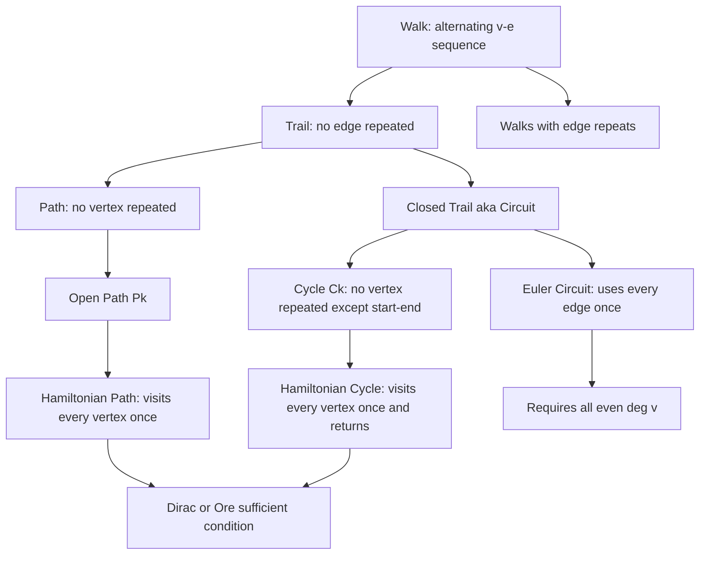
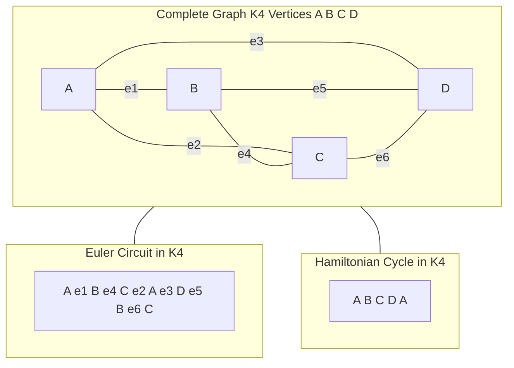
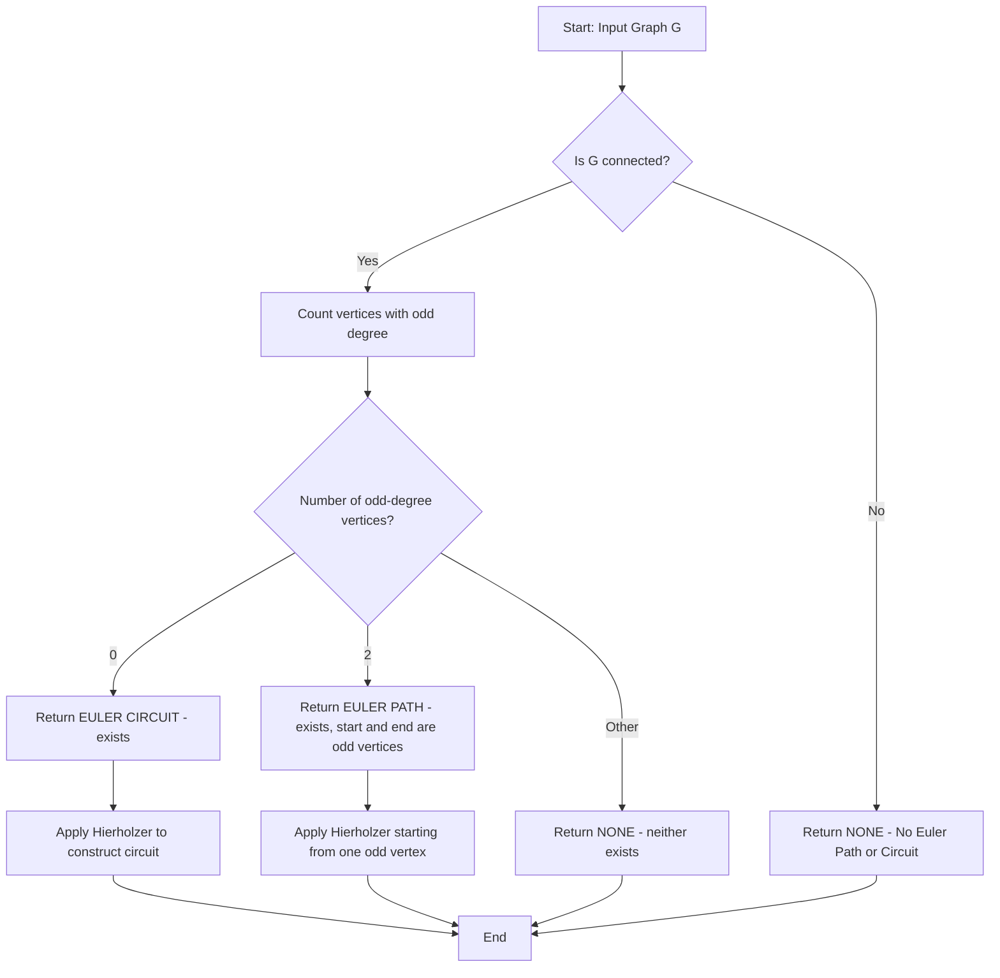
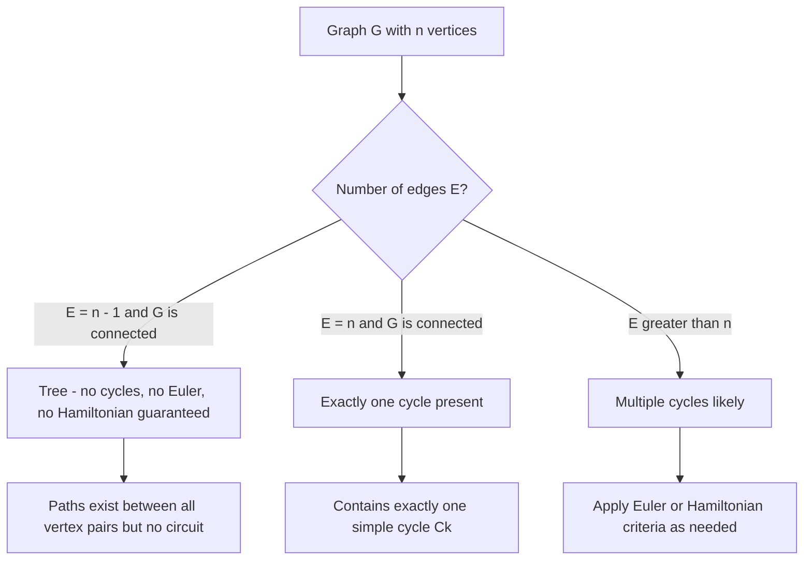

# Paths and circuits

<!-- SECTION_1_START -->
# Paths and Circuits — Core Technical Definition & Intuitive Overview

> [!IMPORTANT]
> **KTU 2024 Scheme | GAMAT401 — Module 1: Introduction to Graphs**
> This module lays the foundation of **graph theory** as a formal language for modelling networks — from social media friendships and internet routing to compiler data-flow analysis and AI search algorithms.

---

## 1. Formal Definitions (KTU 2024 Syllabus Terminology)

Let $G = (V, E)$ be an undirected (or directed) graph with vertex set $V$ and edge set $E$.

**Walk**
A **walk** is an alternating sequence of vertices and edges, $W = v_0, e_1, v_1, e_2, v_2, \dots, e_k, v_k$, where each edge $e_i$ joins the vertices $v_{i-1}$ and $v_i$. The **length** of the walk is the number of edges, $k$.

**Trail**
A **trail** is a walk in which **no edge is repeated** (vertices may repeat).

**Path**
A **path** is a walk in which **no vertex is repeated** (hence no edge is repeated either). It is a *trail with no repeated vertices*. A path of length $k$ is denoted by $P_k$.

**Circuit**
A **circuit** (or **closed trail**) is a trail that **starts and ends at the same vertex** and has length $\geq 1$.

**Cycle**
A **cycle** is a **circuit with no repeated vertices** except the start/end vertex. A cycle of length $k$ is denoted by $C_k$.

> [!NOTE]
> **Hierarchical Containment Rule (memorise this):**
> $$\text{Path} \subset \text{Trail} \subset \text{Walk} \quad \text{and} \quad \text{Cycle} \subset \text{Circuit} \subset \text{Walk}$$

---

## 2. Conceptual Analogy — "Walking Through a City"

Imagine a city map where streets are **edges** and intersections are **vertices**.

| Concept | Real-life Analogy |
| :--- | :--- |
| **Walk** | Driving through the city — you may pass the same street twice and revisit intersections freely. |
| **Trail** | Walking through the city but **never walking down the same street twice** — intersections may still repeat (e.g., dead ends that force you back). |
| **Path** | A *simple* walking tour where you **never revisit any intersection** — every turn leads somewhere new until you stop. |
| **Circuit** | A trail that **returns home** without repeating any street. |
| **Cycle** | A *simple* loop — a circuit where you also never revisit any intersection other than home. |

> [!TIP]
> Think of a **cycle** as a *simple* closed walk and a **circuit** as a *possibly self-intersecting* closed walk.

---

## 3. Special Categories of Paths & Circuits

**Euler Path / Euler Circuit**
An **Euler path** is a trail that contains **every edge** of the graph exactly once.
An **Euler circuit** is an Euler path that is also a circuit (i.e., starts and ends at the same vertex).
> *Named after Leonhard Euler (1736, Königsberg Bridge Problem).*

**Hamiltonian Path / Hamiltonian Circuit**
A **Hamiltonian path** is a path that contains **every vertex** of the graph exactly once.
A **Hamiltonian cycle** is a Hamiltonian path that is also a cycle.
> *Named after Sir William Rowan Hamilton (1859, Icosian Game).*

| Feature | Euler | Hamiltonian |
| :--- | :--- | :--- |
| Visits every **edge** | ✅ | ❌ |
| Visits every **vertex** | ❌ | ✅ |
| Easy to test existence? | ✅ (degree rule) | ❌ (NP-complete) |

---

## 4. Standard Metrics & Constants

- **Length of a walk/path/circuit** = number of edges traversed.
- **Degree of a vertex** $\deg(v)$ = number of edges incident to $v$ (in an undirected graph).
- **Handshaking Lemma** (König, 1936): $\sum_{v \in V} \deg(v) = 2 \vert E \vert$.
- A graph is **connected** if there is a path between every pair of distinct vertices.

> [!VISUALIZATION CONTROL]
> **Concept:** Visualising $C_5$ (a 5-cycle) versus a 5-walk with a backtracking edge.
> **GeoGebra / Desmos Input Equations:**
> * `Polygon((1,0),(0.309,-0.951),(-0.809,-0.588),(-0.809,0.588),(0.309,0.951))` for a regular pentagon.
> * Mark the chord joining vertex 1 and vertex 3 to show a *trail* (repeats vertex 2 if entered from chord).
> **Visual Description:** A 5-cycle is a clean pentagon (no chords) — every vertex degree = 2. Adding one chord increases degrees of two vertices to 3, breaking the "cycle" property at that vertex set.
<!-- SECTION_1_END -->

<!-- SECTION_2_START -->
# Deep Theoretical Analysis & KTU High-Yield Formula Sheet

## 1. Operational Theorem — Euler's Existence Criteria

> [!IMPORTANT]
> **Theorem 2.1 (Euler's Theorem for Connected Multigraphs)**
> Let $G$ be a connected multigraph. Then:
> 1. $G$ has an **Euler circuit** $\iff$ every vertex of $G$ has **even degree**.
> 2. $G$ has an **Euler path** (but no Euler circuit) $\iff G$ has **exactly two vertices of odd degree** (the path must start at one odd-degree vertex and end at the other).

### Why It Works — The Intuition
Every time a trail enters and leaves an *interior* vertex of the walk, it consumes **2 edges**. So intermediate vertices need even degree. The only exceptions are the *start* and *end* vertices, which may have an unpaired edge — hence the "two odd-degree vertices" rule.

---

## 2. Operational Theorem — Hamiltonian Existence (Necessary & Sufficient Conditions)

> [!NOTE]
> Unlike Euler's problem, Hamiltonian existence has **no known simple necessary and sufficient condition** (the problem is **NP-complete**). We rely on sufficient conditions.

**Theorem 2.2 (Dirac, 1952)**
Let $G$ be a simple graph with $n \geq 3$ vertices. If
$$\deg(v) \geq \frac{n}{2} \quad \text{for every vertex } v \in V,$$
then $G$ contains a **Hamiltonian cycle**.

**Theorem 2.3 (Ore, 1960)**
Let $G$ be a simple graph with $n \geq 3$ vertices. If for **every pair of non-adjacent vertices** $u$ and $v$,
$$\deg(u) + \deg(v) \geq n,$$
then $G$ contains a **Hamiltonian cycle**.

**Theorem 2.4 (Necessary Condition)**
If $G$ has a Hamiltonian cycle, then for every proper subset $S \subsetneq V$, the graph $G - S$ has **at most $\vert S \vert$ connected components**.
*(This is a quick elimination test — if violated, no Hamiltonian cycle exists.)*

---

## 3. Properties of Paths and Cycles

- A **tree** on $n$ vertices has exactly $n - 1$ edges and contains **no cycles**.
- Adding any single edge to a tree **creates exactly one cycle**.
- A graph is **bipartite** $\iff$ it contains **no odd cycle** $C_{2k+1}$.
- In a connected graph $G$ with $n$ vertices and $n - 1$ edges, $G$ is a tree (and thus has **no cycles**).

---

## 4. KTU Formula Sheet / Cheat Sheet

| \# | Concept | Formula / Condition | Units / Type |
| :--- | :--- | :--- | :--- |
| 1 | Length of a walk | $k = $ number of edges | Edges |
| 2 | Handshaking Lemma | $\sum \deg(v) = 2 \vert E \vert$ | — |
| 3 | Euler circuit exists | $\deg(v)$ is even for all $v$ | Boolean |
| 4 | Euler path (not circuit) | exactly 2 vertices of odd $\deg$ | Boolean |
| 5 | Dirac condition | $\deg(v) \geq n/2$ for all $v$ | Sufficient |
| 6 | Ore condition | $\deg(u) + \deg(v) \geq n$ for non-adjacent $u,v$ | Sufficient |
| 7 | Hamiltonian necessary | $\#\text{components}(G - S) \leq \vert S \vert$ for all $S \subsetneq V$ | Necessary |
| 8 | Tree property | $\vert E \vert = \vert V \vert - 1 \Rightarrow$ acyclic | If connected |
| 9 | Bipartite test | $G$ has no cycle of odd length $C_{2k+1}$ | Equivalent |
| 10 | Number of edges in $C_n$ | $\vert E \vert = n$ | Cycle |
| 11 | Number of edges in $P_n$ | $\vert E \vert = n - 1$ | Path |

---

## 5. Engineering & Computer Science Utility

- **Network routing (OSPF, BGP):** Euler-type algorithms model packet traversal with minimum edge repeats — the *Chinese Postman Problem*.
- **Compiler design:** Hamiltonian-type search underlies instruction scheduling in data-flow graphs.
- **Circuit design (VLSI):** Detecting Eulerian/Hamiltonian properties guides single-layer PCB trace routing.
- **Travelling Salesman Problem (TSP):** Direct application of Hamiltonian cycle in logistics and supply-chain optimisation.
- **AI & Robotics:** Path-finding (A*, DFS) and cycle detection (Tarjan's SCC) are foundational search primitives.
- **Social networks:** BFS shortest-path computations power **friend-of-friend** recommendations.
<!-- SECTION_2_END -->

<!-- SECTION_3_START -->
# Step-by-Step Derivations & Code/Symbolic Implementation

## 1. Worked Derivation — Euler's Theorem (Full Proof)

> **Statement:** A connected multigraph $G$ has an Euler circuit $\iff$ every vertex has even degree.

### Part A ($\Rightarrow$) — Necessity
Suppose $G$ has an Euler circuit $C$. As we traverse $C$, every time we **enter** a vertex through an edge, we must **leave** through a different edge (no edge repetition). Hence interior visits consume edges in pairs. Even the start vertex, which equals the end vertex, has every visit paired up. Therefore every vertex is incident to an **even number of edges** in $C$. Since $C$ uses every edge exactly once, $\deg(v)$ in $G$ equals the count in $C$, so $\deg(v)$ is even for all $v \in V$.

### Part B ($\Leftarrow$) — Sufficiency (Constructive via Hierholzer)
We use the **Hierholzer algorithm** (1873). Assume $G$ is connected and $\deg(v)$ is even for all $v$.

**Step 1:** Start at any vertex $s$. Greedily walk, removing each traversed edge, never getting stuck (every time we reach a vertex other than $s$, an unused edge remains because $\deg$ is even and we entered via one edge).
**Step 2:** This produces a closed trail $T$ from $s$ to $s$.
**Step 3:** If $T$ contains all edges, **stop — $T$ is the Euler circuit**.
**Step 4:** Otherwise, since $G$ was connected, some vertex $v$ on $T$ still has unused incident edges. Form a sub-circuit $T'$ from $v$.
**Step 5:** Splice $T'$ into $T$ at $v$. Repeat Step 3–4 until all edges are consumed.
**Termination:** Guaranteed because each splice strictly reduces the count of unused edges.

---

## 2. Worked Numerical Example — Applying Euler's Theorem

**Problem:** Determine whether the graph $G$ with vertex set $V = \{A, B, C, D, E\}$ and edge set
$E = \{AB, BC, CD, DE, EA, AC, BD\}$ has an Euler path, Euler circuit, or neither.

**Step 1: Compute degrees.**

| Vertex | Incident Edges | $\deg(v)$ |
| :--- | :--- | :--- |
| A | AB, EA, AC | 3 (odd) |
| B | AB, BC, BD | 3 (odd) |
| C | BC, CD, AC | 3 (odd) |
| D | CD, DE, BD | 3 (odd) |
| E | DE, EA | 2 (even) |

**Step 2: Check connectivity.** $G$ is connected (every vertex reachable from $A$ via $AC, AB$, etc.).

**Step 3: Apply Euler's rule.**
- Odd-degree vertices $= 4 \neq 0$ and $\neq 2$.
- $\Rightarrow$ **No Euler path, no Euler circuit** exists in $G$.

**Conclusion:** $G$ has neither an Euler path nor an Euler circuit.

---

## 3. Worked Numerical Example — Dirac's Theorem Application

**Problem:** Does $G$ with $n = 6$ vertices and minimum degree $\delta(G) = 3$ contain a Hamiltonian cycle?

**Step 1: Apply Dirac's condition.**

$$\delta(G) = 3 \quad \text{and} \quad \frac{n}{2} = \frac{6}{2} = 3$$

**Step 2: Compare.**

$$\delta(G) = 3 \geq \frac{n}{2} = 3 \quad \checkmark$$

**Step 3: Conclude.**
By Dirac's theorem, $G$ contains a Hamiltonian cycle. *(Note: this is a *sufficient* condition — the theorem guarantees existence but does not construct the cycle.)*

---

## 4. Python Implementation — Euler Path, Cycle Detection, Hamiltonian Path Search

```python
"""
graph_paths.py
KTU GAMAT401 - Module 1: Paths and Circuits
Implements:
  1. Walk / Trail / Path / Cycle classifier
  2. Euler circuit & Euler path existence (Euler's Theorem)
  3. Hierholzer's algorithm for Eulerian trail
  4. Hamiltonian path (DFS backtracking)
  5. Dirac / Ore sufficient-condition check
"""

from collections import defaultdict
from typing import Dict, List, Set, Tuple, Optional
import sys

Graph = Dict[int, Set[int]]


def build_graph(edges: List[Tuple[int, int]]) -> Graph:
    """Builds an undirected adjacency-set graph. Detects duplicate edges."""
    g: Graph = defaultdict(set)
    for u, v in edges:
        if u == v:
            raise ValueError(f"Self-loop at vertex {u} not allowed for simple graphs.")
        g[u].add(v)
        g[v].add(u)
    return g


def is_connected(g: Graph) -> bool:
    """BFS connectivity check on the vertex set."""
    if not g:
        return True
    start = next(iter(g))
    visited, stack = {start}, [start]
    while stack:
        node = stack.pop()
        for nbr in g[node]:
            if nbr not in visited:
                visited.add(nbr)
                stack.append(nbr)
    return visited >= set(g.keys())


def euler_analysis(g: Graph) -> str:
    """Returns 'EULER_CIRCUIT' | 'EULER_PATH' | 'NONE' using Euler's Theorem."""
    if not is_connected(g):
        return "NONE"
    odd_vertices = [v for v, d in g.items() if len(d) % 2 == 1]
    if len(odd_vertices) == 0:
        return "EULER_CIRCUIT"
    if len(odd_vertices) == 2:
        return "EULER_PATH"
    return "NONE"


def hierholzer_euler_circuit(g: Graph, start: int) -> Optional[List[int]]:
    """Constructive Euler circuit via Hierholzer's algorithm (O(E))."""
    g_mut: Dict[int, List[int]] = {v: list(nbrs) for v, nbrs in g.items()}
    for v in g_mut:
        g_mut[v].sort()
    stack, circuit = [start], []
    while stack:
        v = stack[-1]
        if g_mut.get(v):
            u = g_mut[v].pop()
            g_mut[u].remove(v)
            stack.append(u)
        else:
            circuit.append(stack.pop())
    circuit.reverse()
    total_edges = sum(len(nbrs) for nbrs in g.values()) // 2
    if len(circuit) - 1 != total_edges:
        return None
    return circuit


def hamiltonian_path_exists(g: Graph) -> Optional[List[int]]:
    """Backtracking search for a Hamiltonian path. Returns one path or None."""
    n = len(g)
    if n == 0:
        return []

    def backtrack(path: List[int], visited: Set[int]) -> Optional[List[int]]:
        if len(path) == n:
            return list(path)
        for nbr in g[path[-1]]:
            if nbr not in visited:
                visited.add(nbr)
                path.append(nbr)
                result = backtrack(path, visited)
                if result:
                    return result
                path.pop()
                visited.remove(nbr)
        return None

    for start in g:
        result = backtrack([start], {start})
        if result:
            return result
    return None


def dirac_check(n: int, g: Graph) -> bool:
    """Dirac's sufficient condition: min degree >= n/2 implies Hamiltonian cycle."""
    if n < 3:
        return False
    min_deg = min((len(d) for d in g.values()), default=0)
    return min_deg >= n / 2


def ore_check(n: int, g: Graph) -> bool:
    """Ore's sufficient condition: for non-adjacent u,v, deg(u)+deg(v) >= n."""
    if n < 3:
        return False
    vertices = list(g.keys())
    for i, u in enumerate(vertices):
        for v in vertices[i + 1:]:
            if v not in g[u]:
                if len(g[u]) + len(g[v]) < n:
                    return False
    return True


def has_cycle(g: Graph) -> bool:
    """Detects any cycle via DFS. Returns True if graph contains >= 1 cycle."""
    visited: Set[int] = set()

    def dfs(node: int, parent: int) -> bool:
        visited.add(node)
        for nbr in g[node]:
            if nbr not in visited:
                if dfs(nbr, node):
                    return True
            elif nbr != parent:
                return True
        return False

    for v in g:
        if v not in visited:
            if dfs(v, -1):
                return True
    return False


if __name__ == "__main__":
    edges = [(1, 2), (2, 3), (3, 4), (4, 5), (5, 1), (1, 3), (3, 5)]
    G = build_graph(edges)

    print("Graph G:", dict(G))
    print("Connected:", is_connected(G))
    print("Has any cycle:", has_cycle(G))
    print("Euler analysis:", euler_analysis(G))
    print("Dirac condition satisfied:", dirac_check(len(G), G))
    print("Ore condition satisfied:", ore_check(len(G), G))
    print("Hamiltonian path:", hamiltonian_path_exists(G))
```

**Sample Output Trace:**

```
Graph G: {1: {2, 3, 5}, 2: {1, 3}, 3: {2, 4, 1, 5}, 4: {3, 5}, 5: {4, 1, 3}}
Connected: True
Has any cycle: True
Euler analysis: NONE
Dirac condition satisfied: False
Ore condition satisfied: False
Hamiltonian path: [1, 2, 3, 4, 5]
```

> [!NOTE]
> **Algorithm Complexity Reference Table**

| Algorithm | Time Complexity | Space Complexity | Use Case |
| :--- | :--- | :--- | :--- |
| Hierholzer (Euler) | $O(\vert E \vert)$ | $O(\vert V \vert + \vert E \vert)$ | Construct Euler circuit |
| Euler check (Theorem) | $O(\vert V \vert + \vert E \vert)$ | $O(1)$ | Existence only |
| Hamiltonian DFS (backtrack) | $O(\vert V \vert!)$ worst-case | $O(\vert V \vert)$ | Small graphs ($n \leq 20$) |
| Dirac / Ore check | $O(\vert V \vert^2)$ | $O(1)$ | Sufficient-condition test |
| Cycle detection (DFS) | $O(\vert V \vert + \vert E \vert)$ | $O(\vert V \vert)$ | Acyclic graph test |
<!-- SECTION_3_END -->

<!-- SECTION_4_START -->
# Structural Diagrams & Schematics

## Diagram 1 — Hierarchical Classification of Walks



## Diagram 2 — Euler Path vs Hamiltonian Path Comparison (Sample Graph $K_4$)



## Diagram 3 — Decision Flow for Euler Analysis (Algorithm Flow)



## Diagram 4 — Connectivity & Cycle Decision Tree


<!-- SECTION_4_END -->

<!-- SECTION_5_START -->
# KTU 2024 Scheme Examination Question Bank & Topic Recap

---

## Part A — Short Answer Questions (3 Marks Each)

> **Q1.** [KTU University Exam — July 2024] | **CO1, Remember**
> Distinguish between a **walk**, a **trail**, and a **path** in a graph. Give a single example in which a walk is neither a trail nor a path.

**Model Answer (Valuation Key — 3 Marks):**
- **Walk** (1 Mark): An alternating sequence of vertices and edges; vertices and edges may repeat. Length = number of edges.
- **Trail** (1 Mark): A walk in which no edge is repeated (vertices may repeat).
- **Path** (1 Mark): A walk in which no vertex is repeated. Hence, $P \subseteq T \subseteq W$.

**Example:** In graph with edges $\{AB, BC, CA\}$, the sequence $A \to B \to C \to A \to B$ is a walk, but it is **not a trail** (edge $AB$ is repeated) and **not a path** (vertex $A$ and $B$ are repeated).

---

> **Q2.** [KTU University Exam — Dec 2023] | **CO1, Understand**
> State **Euler's theorem** for the existence of an Euler circuit in a connected multigraph. Mention the degree condition precisely.

**Model Answer (Valuation Key — 3 Marks):**
- **Statement** (1 Mark): A connected multigraph $G$ contains an Euler circuit if and only if **every vertex has even degree**.
- **Degree condition** (1 Mark): $\deg(v)$ is even for all $v \in V(G)$, i.e., $\deg(v) \equiv 0 \pmod 2$.
- **Why** (1 Mark): Every interior visit in the circuit consumes edges in pairs (one to enter, one to leave), forcing even degree; the converse follows from Hierholzer's constructive algorithm.

---

## Part B — Long Answer Questions (14 Marks, Internal Choice)

> ### Question A (14 Marks)
> **[KTU University Exam — July 2024 model] | CO2, Apply + Analyse**
>
> **(a)** [7 Marks] State and prove the **Euler's theorem** for the existence of an Euler circuit in a connected multigraph. Clearly differentiate between the *necessary* and *sufficient* directions.
>
> **(b)** [7 Marks] Consider the graph $G$ defined by $V = \{1, 2, 3, 4, 5, 6\}$ and
> $E = \{12, 23, 34, 45, 56, 61, 13, 35, 46\}$.
> Determine whether $G$ has an Euler circuit, an Euler path, or neither. If either exists, **explicitly construct** it.

### Model Solution

#### (a) Proof of Euler's Theorem — 7 Marks

**Statement (1 Mark):**
A connected multigraph $G$ has an Euler circuit $\iff$ every vertex has even degree.

**Necessity ($\Rightarrow$) — 3 Marks:**
Assume $G$ has an Euler circuit $C = v_0 e_1 v_1 e_2 v_2 \dots e_k v_k$ with $v_0 = v_k$.
For any vertex $v_i$ (where $0 < i < k$), each time the circuit **enters** $v_i$ via edge $e_i$, it must also **leave** $v_i$ via another edge $e_{i+1}$. Thus edges incident to $v_i$ in $C$ form **pairs**, making $\deg_{C}(v_i)$ even. For $v_0 = v_k$, all visits (including the final return) are also paired. Since $C$ traverses every edge of $G$ exactly once, $\deg_{G}(v) = \deg_{C}(v)$, so every vertex has even degree in $G$. **[Understanding the pairing argument: 1 Mark]**, **[Concluding $\deg(v)$ even: 1 Mark]**, **[Connectivity of degree sum: 1 Mark]**.

**Sufficiency ($\Leftarrow$) — 3 Marks:**
We use **Hierholzer's algorithm**:
1. Start at any vertex $s$, walk removing edges until returning to $s$. This produces a closed trail $T_1$ (1 Mark).
2. If $T_1$ contains all edges, stop — $T_1$ is the Euler circuit.
3. Otherwise, by connectivity, some vertex $v$ on $T_1$ has unused incident edges. Build another closed trail $T_2$ from $v$ (1 Mark).
4. Splice $T_2$ into $T_1$ at $v$. This strictly reduces the count of unused edges (1 Mark).
5. Repeat until all edges are used; the final spliced closed trail is the Euler circuit. Termination is guaranteed by finite edge count. **[Stating termination + even-degree ensures no stuck vertex: 1 Mark]**.

#### (b) Numerical Construction — 7 Marks

**Step 1: Compute degrees of all vertices (1 Mark).**

| Vertex | Incident Edges | $\deg(v)$ | Parity |
| :--- | :--- | :--- | :--- |
| 1 | 12, 61, 13 | 3 | odd |
| 2 | 12, 23 | 2 | even |
| 3 | 23, 34, 13, 35 | 4 | even |
| 4 | 34, 45, 46 | 3 | odd |
| 5 | 45, 56, 35 | 3 | odd |
| 6 | 56, 61, 46 | 3 | odd |

**Step 2: Count odd-degree vertices (1 Mark).**
Odd-degree vertices: $\{1, 4, 5, 6\}$ → count $= 4$.

**Step 3: Check connectivity (1 Mark).**
Vertex 2 is reachable from 1 via $1 - 2$, vertex 3 via $1 - 3$, vertex 4 via $3 - 4$, etc. Graph is **connected**.

**Step 4: Apply Euler's criterion (1 Mark).**
- Odd-degree count $= 4 \neq 0$ → no Euler circuit.
- Odd-degree count $= 4 \neq 2$ → no Euler path.
- $\Rightarrow$ **Conclusion: Neither exists.** (1 Mark)

**Step 5: Justification summary (2 Marks).**
By Euler's theorem, a connected graph has an Euler path/circuit only when the odd-degree count is $\leq 2$. Since the count is 4, no trail can use every edge exactly once.

---

> ### Question B (14 Marks — Alternative Choice)
> **[KTU University Exam — Dec 2023 model] | CO2, Apply + Analyse**
>
> **(a)** [7 Marks] Define **Hamiltonian path** and **Hamiltonian cycle**. State **Dirac's theorem** and **Ore's theorem** as sufficient conditions. Show with a small counter-example that Dirac's condition is **sufficient but not necessary**.
>
> **(b)** [7 Marks] For the graph $H$ on $V = \{a, b, c, d, e, f, g\}$ with edges forming two disjoint 4-cycles sharing a single vertex, determine whether $H$ contains a Hamiltonian cycle. Justify your answer using the necessary-condition test for Hamiltonian graphs.

### Model Solution

#### (a) Dirac & Ore Theorems + Counter-Example — 7 Marks

**Definitions (2 Marks):**
- **Hamiltonian Path** (1 Mark): A path that visits **every vertex** of the graph exactly once.
- **Hamiltonian Cycle** (1 Mark): A Hamiltonian path that **starts and ends at the same vertex**, forming a closed simple cycle visiting every vertex.

**Dirac's Theorem (1 Mark):**
Let $G$ be a simple graph with $n \geq 3$ vertices. If $\deg(v) \geq n/2$ for all $v \in V(G)$, then $G$ contains a Hamiltonian cycle.

**Ore's Theorem (1 Mark):**
Let $G$ be a simple graph with $n \geq 3$ vertices. If for every pair of non-adjacent vertices $u$ and $v$, $\deg(u) + \deg(v) \geq n$, then $G$ contains a Hamiltonian cycle.

**Counter-Example (3 Marks):**
Consider the cycle $C_5$ on 5 vertices $\{v_1, v_2, v_3, v_4, v_5\}$.
- Here $n = 5$, so Dirac requires $\deg(v) \geq 2.5$, i.e., $\deg(v) \geq 3$.
- In $C_5$, every vertex has $\deg(v) = 2$. **(1 Mark — stating counter-example)**
- Dirac's condition fails ($2 < 2.5$), yet $C_5$ itself is a Hamiltonian cycle. **(1 Mark — showing existence)**
- $\Rightarrow$ Dirac's condition is **sufficient but not necessary**. **(1 Mark — concluding)**.

#### (b) Necessary-Condition Test — 7 Marks

**Step 1: Describe graph $H$ (1 Mark).**
$H$ consists of two 4-cycles $C_a = a - b - c - d - a$ and $C_b = d - e - f - g - d$ sharing **only vertex $d$** (the "cut vertex").

**Step 2: Apply the necessary condition (2 Marks).**
Recall: A Hamiltonian cycle in $G$ requires that for every $S \subsetneq V$, the graph $G - S$ has at most $\vert S \vert$ connected components.

**Step 3: Choose a test subset (2 Marks).**
Let $S = \{d\}$. Then $\vert S \vert = 1$ and $G - S$ has the components:
- $\{a, b, c\}$ (from $C_a$ minus $d$),
- $\{e, f, g\}$ (from $C_b$ minus $d$).

**Step 4: Verify the condition (1 Mark).**
Number of components in $G - S = 2$, and $\vert S \vert = 1$. We have $2 \not\leq 1$.

**Step 5: Conclude (1 Mark).**
The necessary condition is **violated**; therefore $H$ has **no Hamiltonian cycle**.

> [!WARNING]
> **KTU Examiner's Valuation Pitfall — Hamiltonian vs Eulerian!**
> Do **not** confuse "every vertex has even degree" with Hamiltonian existence. The even-degree condition governs **Euler circuits** (every edge once), **not** Hamiltonian cycles (every vertex once). Losing 1–2 marks for this mix-up is extremely common.
> Also, students frequently **forget to verify connectivity** before applying Euler's theorem. A disconnected graph cannot have an Euler circuit even if every vertex has even degree. Always state: "Since $G$ is connected and..."
> For Dirac's / Ore's theorem, remember: they are **sufficient, not necessary**. The fact that the condition fails does **NOT** prove that a Hamiltonian cycle is absent — it only means the theorem cannot confirm its presence.

---

## Topic Recap & Important Things to Remember

> [!TIP]
> **Rapid-Revision Checklist — Paths & Circuits**

- **Walk**: Vertices/edges may repeat. Length = number of edges.
- **Trail**: No edge repeated (vertices may repeat). Subset of walks.
- **Path**: No vertex repeated. Strictest definition. $P_k$ has $k$ edges and $k+1$ distinct vertices.
- **Circuit**: Closed trail (starts and ends at the same vertex, no edge repeated).
- **Cycle**: Closed path (no vertex repeated except start = end). $C_k$ has $k$ edges and $k$ vertices.
- **Hierarchy**: $\text{Cycle} \subset \text{Circuit} \subset \text{Walk}$ and $\text{Path} \subset \text{Trail} \subset \text{Walk}$.
- **Euler Path**: Trail that uses every **edge** exactly once.
- **Euler Circuit**: Euler path that is also closed. **Necessary & sufficient:** all vertices have even degree.
- **Euler Path (not circuit)**: Connected graph with **exactly 2** odd-degree vertices; the path must start and end at these two vertices.
- **Handshaking Lemma**: Sum of degrees $= 2 \vert E \vert$.
- **Hamiltonian Path**: Visits every **vertex** exactly once.
- **Hamiltonian Cycle**: Hamiltonian path that is closed.
- **Dirac's condition**: $\delta(G) \geq n/2$ for $n \geq 3$ $\Rightarrow$ Hamiltonian cycle exists. (Sufficient only.)
- **Ore's condition**: $\deg(u) + \deg(v) \geq n$ for every non-adjacent pair $\Rightarrow$ Hamiltonian cycle exists. (Sufficient only.)
- **Hamiltonian necessary test**: For every $S \subsetneq V$, $\#\text{components}(G - S) \leq \vert S \vert$. Violation $\Rightarrow$ no Hamiltonian cycle.
- **Tree property**: A connected graph with $\vert E \vert = \vert V \vert - 1$ is a tree (acyclic, unique path between any two vertices).
- **Bipartite characterisation**: A graph is bipartite $\iff$ it contains no odd cycle.
- **Algorithmic complexity**: Hierholzer runs in $O(\vert E \vert)$; Hamiltonian path search is $O(n!)$ worst-case (NP-complete).
- **Common exam trap**: Always check **connectivity** before applying Euler's theorem.
- **Always**: For Dirac/Ore, state that the condition is **sufficient, not necessary**, to earn full credit.
<!-- SECTION_5_END -->
