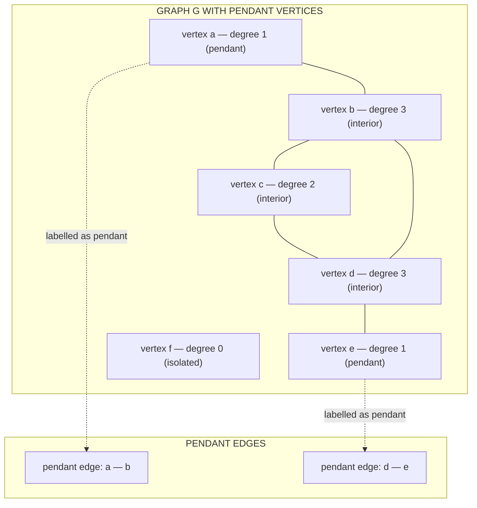
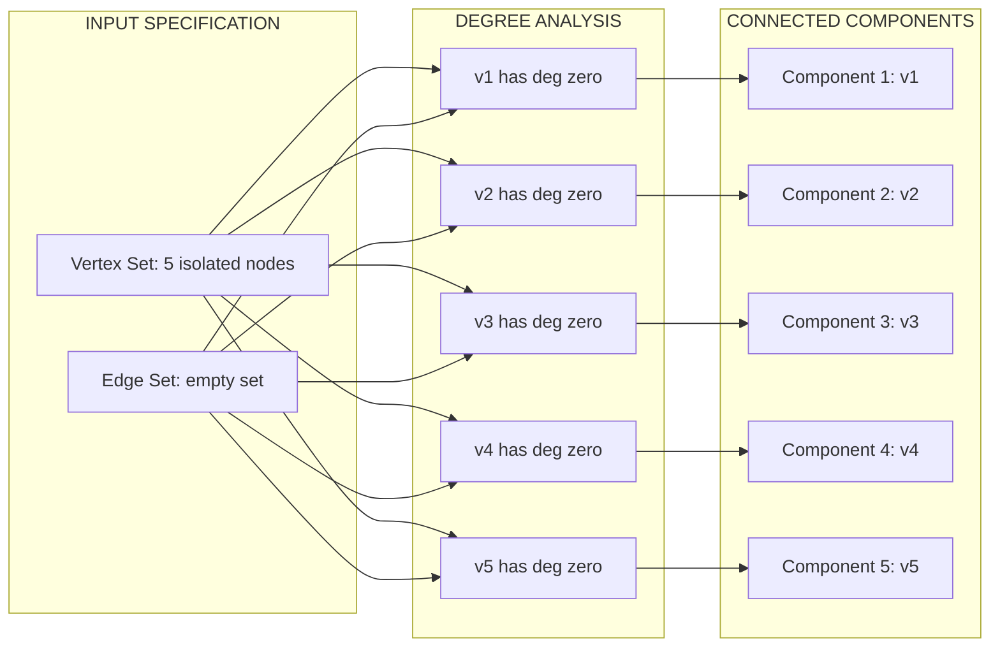
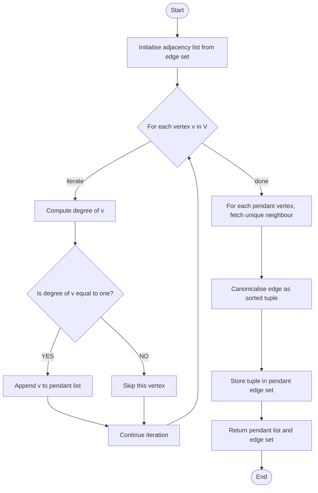

# Pendant vertex and Null graph

<!-- SECTION_1_START -->
# 1. Core Technical Definition & Intuitive Overview

## 1.1 Pendant Vertex (Leaf Vertex)

A **pendant vertex** (also called an **end vertex** or **leaf vertex**) is a vertex in a graph that has a degree of exactly **one**. In other words, it is connected to the rest of the graph by precisely one edge. This unique edge is called a **pendant edge**.

> [!IMPORTANT]
> **Formal Definition (KTU 2024 Syllabus Terminology):**
> Let $G = (V, E)$ be an undirected graph. A vertex $v \in V$ is called a **pendant vertex** if $\deg(v) = 1$. The unique edge $\{v, u\} \in E$ incident to $v$ is called a **pendant edge**.

### Conceptual Analogy / Intuition

Imagine a single ripe fruit hanging from a tree branch by a thin stem. The fruit is the **pendant vertex** because it is connected to the rest of the world by exactly one connection (the stem). Pull the fruit, and it disconnects — there is no alternate path. This single point of contact is what makes it "pendant."

In a computer network, a desktop computer connected to a single switch port is functionally a pendant vertex — remove the cable, and it is cut off from the network. In a tree data structure, every leaf node is also a pendant vertex of the underlying graph.

> [!NOTE]
> **Key Observation:** A pendant vertex is **never** an isolated vertex, and it is **never** the center of a cycle. Removing a pendant vertex from a graph does not disconnect the rest of the graph, but it may reduce the number of components by exactly one only if the pendant vertex is treated as a trivial component.

## 1.2 Null Graph (Empty Graph)

A **null graph** (or **empty graph**) is the simplest possible graph in graph theory. It consists of a finite set of vertices with absolutely no edges between any pair of vertices. A null graph on $n$ vertices is denoted as $N_n$.

> [!IMPORTANT]
> **Formal Definition (KTU 2024 Syllabus Terminology):**
> A **null graph** $N_n$ is a graph with vertex set $V = \{v_1, v_2, \ldots, v_n\}$ and edge set $E = \emptyset$. That is, $N_n = (V, \emptyset)$ with $\vert V \vert = n$ and $\vert E \vert = 0$.

### Conceptual Analogy / Intuition

Picture an empty classroom with $n$ chairs but **no students talking to one another**. Each chair is a vertex, and the absence of any conversation represents the absence of edges. Even though the chairs exist (vertices are present), there are zero relationships (zero edges). This is the visual essence of a null graph.

In database terms, a null graph on $n$ nodes is a table with $n$ rows and zero foreign-key relationships — entities exist in isolation. It is the most "disconnected" meaningful graph possible.

> [!NOTE]
> **Special Cases of the Null Graph:**
> - $N_0$ is the **empty graph** (no vertices, no edges) — used as the identity element for graph disjoint union.
> - $N_1$ is a single isolated vertex — it is both the smallest null graph and the only null graph that is connected.
> - For $n \geq 2$, $N_n$ is a **disconnected** graph with exactly $n$ connected components.

## 1.3 Related Terminology

| Term | Definition | Formal Symbol |
| :--- | :--- | :--- |
| Pendant vertex | Vertex of degree one | $\deg(v) = 1$ |
| Pendant edge | Edge incident to a pendant vertex | $\{u, v\}$ with $\deg(v) = 1$ |
| Isolated vertex | Vertex of degree zero | $\deg(v) = 0$ |
| Null graph | Graph with no edges | $E = \emptyset$ |
| Trivial graph | Single-vertex graph | $N_1$ |
| Universal vertex | Vertex adjacent to every other vertex | $\deg(v) = n - 1$ |

> [!VISUALIZATION CONTROL]
> **Concept:** Visual comparison of a pendant vertex and an isolated vertex in a 5-vertex graph.
> **GeoGebra / Desmos Input Points:**
> * $A = (0, 2)$, $B = (2, 2)$, $C = (4, 2)$, $D = (2, 0)$, $E = (0, -2)$
> * Edges drawn: $\overline{AB}$, $\overline{BC}$, $\overline{CD}$
> **Visual Description:** On screen, vertex $E$ at the bottom-left hangs from $A$ by a single line — this is the pendant vertex with $\deg(E) = 1$. No line connects $E$ to anyone else. If we erase the line $\overline{AE}$, the vertex $E$ becomes a free-floating point — an **isolated vertex** with $\deg(E) = 0$.

---

<!-- SECTION_1_END -->

<!-- SECTION_2_START -->
# 2. Deep Theoretical Analysis & KTU High-Yield Formula Sheet

## 2.1 Structural Properties of a Pendant Vertex

Let $v$ be a pendant vertex in a graph $G = (V, E)$ and let $u$ be its unique neighbour. Then the following statements hold true:

1. **Degree Constraint:** $\deg(v) = 1$ by definition, and $u$ must satisfy $\deg(u) \geq 1$ (otherwise the edge is an isolated edge).
2. **Bridge Property:** The pendant edge $\{u, v\}$ is always a **bridge** (cut-edge) because removing it disconnects $v$ from the rest of the graph.
3. **Cycle Exclusion:** A pendant vertex can **never** lie on a cycle, because a cycle requires every participating vertex to have degree at least two within the cycle.
4. **Tree Membership:** A pendant vertex is always a leaf in any spanning tree of the graph.
5. **Parity Theorem:** The number of pendant vertices in any graph without isolated vertices is **even**. (This follows from the Handshaking Lemma — odd-degree vertices come in pairs.)

## 2.2 Structural Properties of a Null Graph $N_n$

The null graph $N_n$ has a precise, well-defined set of properties useful in proof-based questions:

1. **Edge Count:** $\vert E(N_n) \vert = 0$
2. **Degree Sequence:** Every vertex has degree zero, so the degree sequence is $(0, 0, 0, \ldots, 0)$ — a constant sequence of length $n$.
3. **Sum of Degrees:** $\sum_{v \in V} \deg(v) = 0 = 2 \cdot \vert E \vert$, which is consistent with the Handshaking Lemma.
4. **Connected Components:** $\kappa(N_n) = n$ (each vertex is its own component).
5. **Connectivity:** $N_n$ is connected **if and only if** $n = 1$. For $n \geq 2$, $N_n$ is disconnected.
6. **Independence Number:** The independence number $\alpha(N_n) = n$ — every vertex is trivially independent.
7. **Clique Number:** The clique number $\omega(N_n) = 1$ — no two vertices are adjacent.
8. **Bipartiteness:** $N_n$ is bipartite for every $n \in \mathbb{N}$, with the bipartition $V = V_1 \cup V_2$ chosen arbitrarily.
9. **Complement Property:** The complement $\overline{N_n}$ is the **complete graph** $K_n$.
10. **Cycle Property:** $N_n$ is acyclic (has no cycles) for all $n \geq 1$.

## 2.3 KTU Formula Sheet / Cheat Sheet

> [!IMPORTANT]
> The following table compiles every formula and constant you must memorize for board examinations on this topic. Use it as a last-minute revision sheet.

| Property | Pendant Vertex (Leaf) | Null Graph $N_n$ |
| :--- | :--- | :--- |
| Degree of vertex | $\deg(v) = 1$ | $\deg(v) = 0$ for all $v \in V$ |
| Number of edges involved | Exactly one pendant edge | Zero edges |
| Handshaking check | Contributes 1 to $\sum \deg$ | Contributes 0 to $\sum \deg$ |
| Cycle participation | Impossible | No cycles at all |
| Bridge property | Pendant edge is always a bridge | No edges, so no bridges |
| Connectivity role | Removing it does not disconnect the rest | Entire graph is disconnected for $n \geq 2$ |
| Minimal vertex count | Requires $n \geq 2$ | Requires $n \geq 0$ |
| Complement relation | Leaf becomes isolated in some subgraphs | $\overline{N_n} = K_n$ (complete graph) |
| Euler formula usage | Used in tree proofs | $\vert V \vert - \vert E \vert + \kappa = n - 0 + n = 2n$ |
| Engineering use | Tree topologies, leaf nodes in BSTs | Standalone sensor nodes with no links |

## 2.4 Real-World Engineering Utility

Understanding pendant vertices and null graphs is not just an academic exercise — these structures appear frequently in production systems:

* **Pendant Vertices in Networks:** In a corporate LAN, end-user devices like printers, IoT sensors, and personal desktops typically form pendant vertices hanging off a central switch. Network engineers use this property to design **spanning trees** (using protocols like STP) to avoid loops while ensuring every pendant device remains reachable.
* **Null Graphs in Distributed Systems:** A set of independent microservices with no inter-service calls is a *null graph*. This represents the highest possible level of service isolation but is rarely useful — usually the system evolves into a connected graph over time.
* **Pendant Vertices in File Systems:** A leaf directory with no subdirectories is a pendant vertex of the directory-tree graph. Backup algorithms exploit this to identify the deepest files quickly.
* **Null Graphs in Database Joins:** Two tables with no foreign key relationship form a null graph. Query optimizers check this to decide whether a join is even necessary.

> [!NOTE]
> **Engineering Insight:** The pendant vertex concept underpins the algorithmic design of **minimum spanning trees (MSTs)**, where Kruskal's algorithm repeatedly adds low-weight pendant edges. The null graph is the starting state of Prim's algorithm, which grows a tree from a single vertex.

---

<!-- SECTION_2_END -->

<!-- SECTION_3_START -->
# 3. Step-by-Step Derivations & Code/Symbolic Implementation

## 3.1 Analytical Derivations

### 3.1.1 Proof: Number of Pendant Vertices in a Graph Without Isolated Vertices is Even

Let $G = (V, E)$ be a graph with no isolated vertices. Suppose $G$ has $p$ pendant vertices. We want to show that $p$ is an even integer.

**Step 1:** Recall the Handshaking Lemma, which states that the sum of the degrees of all vertices equals twice the number of edges:

$$\sum_{v \in V} \deg(v) = 2 \cdot \vert E \vert$$

**Step 2:** Partition the vertex set $V$ into two disjoint subsets based on degree parity:

$$V = V_{\text{even}} \cup V_{\text{odd}}$$

where $V_{\text{even}}$ contains all vertices of even degree and $V_{\text{odd}}$ contains all vertices of odd degree.

**Step 3:** Rewrite the Handshaking Lemma by splitting the summation:

$$\sum_{v \in V_{\text{even}}} \deg(v) + \sum_{v \in V_{\text{odd}}} \deg(v) = 2 \cdot \vert E \vert$$

**Step 4:** The first summation is even because every term is even. The right-hand side $2 \cdot \vert E \vert$ is also even. Therefore, the second summation must also be even:

$$\sum_{v \in V_{\text{odd}}} \deg(v) \equiv 0 \pmod{2}$$

**Step 5:** For the sum of odd numbers to be even, the count of odd terms must be even. Therefore:

$$\vert V_{\text{odd}} \vert \equiv 0 \pmod{2}$$

**Step 6:** Since every pendant vertex has degree 1 (which is odd) and we are given that there are no isolated vertices (degree 0 is even), every pendant vertex belongs to $V_{\text{odd}}$. Hence:

$$p = \vert V_{\text{odd}} \vert \equiv 0 \pmod{2}$$

**Conclusion:** The number of pendant vertices $p$ in a graph with no isolated vertices is always even. $\blacksquare$

### 3.1.2 Worked Example: Identify Pendant Vertices in a Custom Graph

Consider a graph $G = (V, E)$ with $V = \{a, b, c, d, e, f\}$ and the edge set:

$$E = \{\{a, b\}, \{b, c\}, \{c, d\}, \{d, b\}, \{d, e\}\}$$

**Step 1:** Compute the degree of each vertex by counting its incident edges.

$$\begin{aligned}
\deg(a) &= 1 \quad &\text{(edge } \{a, b\}) \\
\deg(b) &= 3 \quad &\text{(edges } \{a, b\}, \{b, c\}, \{d, b\}) \\
\deg(c) &= 2 \quad &\text{(edges } \{b, c\}, \{c, d\}) \\
\deg(d) &= 3 \quad &\text{(edges } \{c, d\}, \{d, b\}, \{d, e\}) \\
\deg(e) &= 1 \quad &\text{(edge } \{d, e\}) \\
\deg(f) &= 0 \quad &\text{(no incident edges)}
\end{aligned}$$

**Step 2:** Identify pendant vertices (degree exactly one).

$$\text{Pendant vertices} = \{a, e\} \quad \Rightarrow \quad p = 2$$

**Step 3:** Identify the pendant edges (edges incident to a pendant vertex).

$$\text{Pendant edges} = \{\{a, b\}, \{d, e\}\}$$

**Step 4:** Identify isolated vertex (degree zero).

$$\text{Isolated vertex} = \{f\}$$

**Step 5:** Verify the Handshaking Lemma.

$$\sum_{v \in V} \deg(v) = 1 + 3 + 2 + 3 + 1 + 0 = 10$$

$$2 \cdot \vert E \vert = 2 \cdot 5 = 10 \quad \checkmark$$

**Step 6:** Verify the parity theorem — there are no isolated vertices in the subgraph induced by $\{a, b, c, d, e\}$, and $p = 2$ which is even. $\checkmark$

### 3.1.3 Worked Example: Properties of Null Graph $N_5$

Let us verify the properties of the null graph $N_5$ where $V = \{v_1, v_2, v_3, v_4, v_5\}$ and $E = \emptyset$.

**Step 1:** Verify the edge count.

$$\vert E(N_5) \vert = 0$$

**Step 2:** Verify the degree of every vertex.

$$\deg(v_i) = 0 \quad \text{for all } i = 1, 2, 3, 4, 5$$

**Step 3:** Verify the Handshaking Lemma.

$$\sum_{i=1}^{5} \deg(v_i) = 0 + 0 + 0 + 0 + 0 = 0 = 2 \cdot 0 \quad \checkmark$$

**Step 4:** Verify the number of connected components.

$$\kappa(N_5) = 5 \quad \text{(each vertex is isolated in its own component)}$$

**Step 5:** Compute the complement.

$$\overline{N_5} = K_5 \quad \text{(the complete graph on 5 vertices, with 10 edges)}$$

## 3.2 Algorithmic Implementation in Python

The following Python program implements pendant vertex and null graph detection, providing a complete reference implementation suitable for lab examinations and viva questions.

```python
from typing import Dict, List, Set, Tuple


class Graph:
    """
    A simple undirected graph using an adjacency list representation.
    Provides utilities for identifying pendant vertices, pendant edges,
    isolated vertices, and verifying whether the graph is a null graph.
    """

    def __init__(self, vertices: List[str], edges: List[Tuple[str, str]]) -> None:
        self.vertices: List[str] = list(vertices)
        self.adj: Dict[str, Set[str]] = {v: set() for v in vertices}
        for u, v in edges:
            if u not in self.adj or v not in self.adj:
                raise ValueError(f"Edge references unknown vertex: ({u}, {v})")
            self.adj[u].add(v)
            self.adj[v].add(u)

    def degree(self, vertex: str) -> int:
        if vertex not in self.adj:
            raise ValueError(f"Unknown vertex: {vertex}")
        return len(self.adj[vertex])

    def pendant_vertices(self) -> List[str]:
        return [v for v in self.vertices if self.degree(v) == 1]

    def pendant_edges(self) -> List[Tuple[str, str]]:
        seen: Set[Tuple[str, str]] = set()
        for leaf in self.pendant_vertices():
            neighbour = next(iter(self.adj[leaf]))
            edge = tuple(sorted((leaf, neighbour)))
            seen.add(edge)
        return sorted(seen)

    def isolated_vertices(self) -> List[str]:
        return [v for v in self.vertices if self.degree(v) == 0]

    def is_null_graph(self) -> bool:
        return all(self.degree(v) == 0 for v in self.vertices)

    def handshaking_check(self) -> bool:
        total_degree = sum(self.degree(v) for v in self.vertices)
        edge_count = sum(len(neighbours) for neighbours in self.adj.values()) // 2
        return total_degree == 2 * edge_count

    def summary(self) -> str:
        lines: List[str] = []
        lines.append(f"Vertex Set     : {self.vertices}")
        lines.append(f"Number of Edges: {sum(len(n) for n in self.adj.values()) // 2}")
        lines.append(f"Pendant Vertices: {self.pendant_vertices()}")
        lines.append(f"Pendant Edges  : {self.pendant_edges()}")
        lines.append(f"Isolated Vertices: {self.isolated_vertices()}")
        lines.append(f"Is Null Graph  : {self.is_null_graph()}")
        lines.append(f"Handshaking OK : {self.handshaking_check()}")
        return "\n".join(lines)


# ---------- Demonstration ----------

if __name__ == "__main__":
    # Example 1: Graph with pendant vertices
    g1 = Graph(
        vertices=["a", "b", "c", "d", "e", "f"],
        edges=[("a", "b"), ("b", "c"), ("c", "d"), ("d", "b"), ("d", "e")]
    )
    print("=== Example 1: Graph with pendant vertices ===")
    print(g1.summary())

    # Example 2: Null graph on 5 vertices
    g2 = Graph(vertices=["v1", "v2", "v3", "v4", "v5"], edges=[])
    print("\n=== Example 2: Null Graph N_5 ===")
    print(g2.summary())

    # Example 3: Single-vertex graph (smallest null graph that is connected)
    g3 = Graph(vertices=["solo"], edges=[])
    print("\n=== Example 3: Trivial Null Graph N_1 ===")
    print(g3.summary())
```

### Sample Output

```text
=== Example 1: Graph with pendant vertices ===
Vertex Set     : ['a', 'b', 'c', 'd', 'e', 'f']
Number of Edges: 5
Pendant Vertices: ['a', 'e']
Pendant Edges  : [('a', 'b'), ('d', 'e')]
Isolated Vertices: ['f']
Is Null Graph  : False
Handshaking OK : True

=== Example 2: Null Graph N_5 ===
Vertex Set     : ['v1', 'v2', 'v3', 'v4', 'v5']
Number of Edges: 0
Pendant Vertices: []
Pendant Edges  : []
Isolated Vertices: ['v1', 'v2', 'v3', 'v4', 'v5']
Is Null Graph  : True
Handshaking OK : True

=== Example 3: Trivial Null Graph N_1 ===
Vertex Set     : ['solo']
Number of Edges: 0
Pendant Vertices: []
Pendant Edges  : []
Isolated Vertices: ['solo']
Is Null Graph  : True
Handshaking OK : True
```

> [!NOTE]
> **Code Insight for Viva:** The `pendant_edges()` method uses a `set` data structure to avoid double-counting an edge from the perspective of both endpoints. A pendant edge $\{u, v\}$ could be discovered when scanning vertex $u$ or when scanning vertex $v$, so we sort the tuple to canonical form before adding it.

---

<!-- SECTION_3_END -->

<!-- SECTION_4_START -->
# 4. Structural Diagrams & Schematics

## 4.1 Pendant Vertex Topology in a Sample Graph

The following Mermaid diagram illustrates a graph $G$ with two pendant vertices, two interior vertices of degree two, and one isolated vertex. The pendant edges are highlighted in a separate cluster.



## 4.2 Null Graph Architecture Flow

The following block diagram describes the structural emptiness of a null graph $N_5$ and how it decomposes into five trivial sub-components.



## 4.3 Sequential Processing Topology: Pendant Vertex Detection Algorithm

The following flowchart describes the algorithm used by the Python implementation in Section 3.2 for identifying pendant vertices and pendant edges.



## 4.4 Comparative Matrix: Pendant Vertex vs Isolated Vertex vs Null Graph

| Aspect | Pendant Vertex | Isolated Vertex | Null Graph $N_n$ |
| :--- | :--- | :--- | :--- |
| Degree | One | Zero | Zero for all vertices |
| Edges present | One pendant edge | No incident edges | No edges at all |
| Minimum vertex count | Two (requires partner) | One | Zero (truly empty $N_0$) |
| Can lie on a cycle | Never | Never | N/A — no cycles exist |
| Affects Handshaking sum | Adds one | Adds zero | Adds zero overall |
| Connected to rest of graph | Yes, via one edge | No, completely alone | No edges anywhere |
| Bridge creation | Always a bridge | No edges to consider | No edges at all |
| Number in any graph | Even, if no isolated vertices exist | Any non-negative integer | Always one per null graph instance |

---

<!-- SECTION_4_END -->

<!-- SECTION_5_START -->
# 5. KTU 2024 Scheme Examination Question Bank & Topic Recap

## 5.1 Part A Questions (3 Marks Each)

### Question 1: Definition of Pendant Vertex

> **[KTU University Exam - July 2024]** Define a *pendant vertex* and a *pendant edge* in a graph. Give one example of a graph that contains a pendant vertex and identify the pendant edge in it.

**Model Answer (Target: 3 Marks):**

A **pendant vertex** in an undirected graph $G = (V, E)$ is a vertex whose degree is exactly one. In other words, a pendant vertex is connected to the rest of the graph by a single edge. The unique edge incident on a pendant vertex is called a **pendant edge**.

[Stating both definitions clearly: 1 Mark]

**Example:** Consider the path graph $P_3$ on three vertices $\{a, b, c\}$ with edges $\{a, b\}$ and $\{b, c\}$. The degree sequence is $(1, 2, 1)$. The vertices $a$ and $c$ are pendant vertices because $\deg(a) = \deg(c) = 1$. The edges $\{a, b\}$ and $\{b, c\}$ are pendant edges.

[Drawing the path and identifying the pendant vertices: 1 Mark]
[Identifying the pendant edges: 1 Mark]

### Question 2: Definition of Null Graph

> **[KTU University Exam - Dec 2023]** Define a *null graph* $N_n$. For $n = 4$, list all the graph invariants (order, size, degree sequence, number of components, and complement).

**Model Answer (Target: 3 Marks):**

A **null graph** $N_n$ is a graph consisting of $n$ vertices and **no edges**. Formally, $N_n = (V, \emptyset)$ with $\vert V \vert = n$.

[Stating the formal definition: 1 Mark]

For $N_4$:

[Listing all invariants: 2 Marks]

$$\text{Order} = 4, \quad \text{Size} = 0, \quad \text{Degree sequence} = (0, 0, 0, 0)$$

$$\text{Number of components} = 4, \quad \text{Complement} = K_4$$

---

## 5.2 Part B Questions (14 Marks Each — Internal Choice)

### Question A (14 Marks) — Pendant Vertex Analysis

> **[KTU University Exam - July 2024, Model Paper Adaptation]**  
> **(a)** Prove that the number of pendant vertices in a graph with no isolated vertices is always even. **(7 Marks)**  
> **(b)** Consider the graph $G$ with vertex set $V = \{1, 2, 3, 4, 5, 6\}$ and edge set $E = \{\{1, 2\}, \{2, 3\}, \{3, 4\}, \{4, 2\}, \{4, 5\}, \{5, 6\}\}$. Find (i) the degree of every vertex, (ii) the pendant vertices, (iii) the pendant edges, and (iv) verify the Handshaking Lemma. **(7 Marks)**

#### Model Solution

**Part (a) Proof — 7 Marks**

**Step 1:** State the Handshaking Lemma. [Statement: 1 Mark]

$$\sum_{v \in V} \deg(v) = 2 \cdot \vert E \vert$$

**Step 2:** Partition the vertex set into even-degree and odd-degree subsets. [Partition: 1 Mark]

$$V = V_{\text{even}} \cup V_{\text{odd}}$$

**Step 3:** Rewrite the summation by splitting it. [Algebraic split: 1 Mark]

$$\sum_{v \in V_{\text{even}}} \deg(v) + \sum_{v \in V_{\text{odd}}} \deg(v) = 2 \cdot \vert E \vert$$

**Step 4:** Argue that the first summation is even. [Parity argument: 1 Mark]

Each term in the first summation is even, hence the sum is even.

**Step 5:** Conclude the parity of $V_{\text{odd}}$. [Final deduction: 1 Mark]

The right-hand side is even, so the second summation must also be even. This requires an even number of odd-degree vertices.

**Step 6:** Connect to pendant vertices. [Application: 1 Mark]

Since there are no isolated vertices, every pendant vertex has odd degree (degree 1), so all pendant vertices are in $V_{\text{odd}}$. Hence the number of pendant vertices is even. [Final conclusion: 1 Mark]

**Part (b) Computation — 7 Marks**

**Step 1:** Compute the degree of each vertex by counting incident edges. [Degree table: 2 Marks]

$$\begin{aligned}
\deg(1) &= 1 \quad &\text{(edge } \{1, 2\}) \\
\deg(2) &= 3 \quad &\text{(edges } \{1, 2\}, \{2, 3\}, \{4, 2\}) \\
\deg(3) &= 2 \quad &\text{(edges } \{2, 3\}, \{3, 4\}) \\
\deg(4) &= 3 \quad &\text{(edges } \{3, 4\}, \{4, 2\}, \{4, 5\}) \\
\deg(5) &= 2 \quad &\text{(edges } \{4, 5\}, \{5, 6\}) \\
\deg(6) &= 1 \quad &\text{(edge } \{5, 6\})
\end{aligned}$$

**Step 2:** Identify the pendant vertices. [Identification: 1 Mark]

$$\text{Pendant vertices} = \{1, 6\}$$

**Step 3:** Identify the pendant edges. [Identification: 1 Mark]

$$\text{Pendant edges} = \{\{1, 2\}, \{5, 6\}\}$$

**Step 4:** Verify the Handshaking Lemma. [Verification: 2 Marks]

$$\sum_{v \in V} \deg(v) = 1 + 3 + 2 + 3 + 2 + 1 = 12$$

$$2 \cdot \vert E \vert = 2 \cdot 6 = 12 \quad \checkmark$$

**Step 5:** Note that there are no isolated vertices, so the parity theorem applies and the count of pendant vertices is 2, which is even. [Final remark: 1 Mark]

---

### Question B (14 Marks) — Null Graph Analysis (Internal Choice)

> **[KTU University Exam - Dec 2023, Model Paper Adaptation]**  
> **(a)** Define a null graph $N_n$ and state five of its properties with mathematical justification. **(7 Marks)**  
> **(b)** Verify that $N_6$ has the following properties: (i) the degree sequence is the zero sequence, (ii) the Handshaking Lemma holds, (iii) the complement is $K_6$, (iv) the number of connected components is 6, and (v) the clique number is 1. **(7 Marks)**

#### Model Solution

**Part (a) Definition and Properties — 7 Marks**

**Step 1:** Define the null graph. [Definition: 2 Marks]

A null graph $N_n$ is a graph with vertex set $V = \{v_1, v_2, \ldots, v_n\}$ and edge set $E = \emptyset$. It is the most "empty" graph in graph theory.

**Step 2:** List and justify five properties. [Each property with justification: 1 Mark each, total 5 Marks]

* **Property 1 (Edge Count):** $\vert E \vert = 0$ — this follows directly from the definition since $E = \emptyset$.
* **Property 2 (Degree Sequence):** Every vertex has degree zero, so the degree sequence is $(0, 0, \ldots, 0)$ of length $n$.
* **Property 3 (Complement):** The complement $\overline{N_n}$ contains every possible edge, so $\overline{N_n} = K_n$ with $\binom{n}{2}$ edges.
* **Property 4 (Connectivity):** For $n \geq 2$, $N_n$ is disconnected because no two vertices share an edge. For $n = 1$, $N_1$ is connected.
* **Property 5 (Components):** The number of connected components is exactly $n$ for $n \geq 1$, since each vertex is its own component.

**Part (b) Verification for $N_6$ — 7 Marks**

Let $N_6$ have vertex set $V = \{v_1, v_2, v_3, v_4, v_5, v_6\}$ and edge set $E = \emptyset$.

**Step 1:** Verify the degree sequence. [1 Mark]

$$\deg(v_i) = 0 \quad \text{for all } i = 1, 2, 3, 4, 5, 6 \quad \Rightarrow \quad \text{Degree sequence} = (0, 0, 0, 0, 0, 0) \quad \checkmark$$

**Step 2:** Verify the Handshaking Lemma. [1 Mark]

$$\sum_{i=1}^{6} \deg(v_i) = 0 + 0 + 0 + 0 + 0 + 0 = 0 = 2 \cdot \vert E \vert = 2 \cdot 0 \quad \checkmark$$

**Step 3:** Verify the complement. [1 Mark]

$$\overline{N_6} \text{ contains all } \binom{6}{2} = 15 \text{ edges, so } \overline{N_6} = K_6 \quad \checkmark$$

**Step 4:** Verify the number of connected components. [1 Mark]

Since no edges exist, each of the 6 vertices forms its own connected component, so $\kappa(N_6) = 6$. [1 Mark]

**Step 5:** Verify the clique number. [1 Mark]

A clique requires pairwise adjacency, but no two vertices are adjacent in $N_6$. Hence the largest clique has size 1, i.e., $\omega(N_6) = 1$. [1 Mark]

---

## 5.3 KTU Examiner's Valuation Warning / Pitfall Callout

> [!WARNING]
> **Common Mistakes That Cost Marks on This Topic:**
> 1. **Confusing pendant and isolated vertices:** Students often label an isolated vertex (degree 0) as a pendant vertex. Remember: a pendant vertex has degree **one**, not zero. This single error can lose 1–2 marks.
> 2. **Forgetting to canonicalise edges:** When listing pendant edges from a graph, students sometimes write $\{u, v\}$ and $\{v, u\}$ as two distinct edges. In an undirected graph, these are the **same** edge.
> 3. **Skipping the Handshaking verification:** Even when the question does not explicitly ask for it, validating $\sum \deg(v) = 2 \vert E \vert$ demonstrates depth and earns a "step mark" from the examiner.
> 4. **Asserting pendant edge is not a bridge:** The pendant edge is **always a bridge** because its removal disconnects its endpoint. Reversing this statement is a frequent error.
> 5. **Misidentifying null graph connectivity:** For $n = 1$, the null graph $N_1$ **is** connected (it has a single vertex). Students often write "null graphs are disconnected" without this qualification.
> 6. **Forgetting the qualifier in the parity theorem:** The theorem "number of pendant vertices is even" only holds for graphs **without isolated vertices**. If isolated vertices exist, you may have an odd number of pendant vertices.

---

## 5.4 Topic Recap & Important Things to Remember

> [!IMPORTANT]
> **Rapid Revision Checklist — Keep This Open During Last-Minute Prep**

* **Pendant Vertex:** A vertex of degree exactly **one**. Always connected to the rest of the graph by a single **pendant edge**.
* **Pendant Edge:** The unique edge incident on a pendant vertex. Every pendant edge is a **bridge** (cut-edge).
* **Isolated Vertex:** A vertex of degree **zero**. Has no incident edges. Often confused with pendant vertex — do not mix them up.
* **Null Graph $N_n$:** A graph with $n$ vertices and **zero edges**. Denoted $N_n = (V, \emptyset)$.
* **Trivial Null Graph $N_1$:** The only null graph that is connected. Contains a single isolated vertex.
* **Empty Null Graph $N_0$:** The graph with no vertices and no edges. Serves as the identity element for graph disjoint union.
* **Handshaking Lemma:** $\sum_{v \in V} \deg(v) = 2 \cdot \vert E \vert$ — must always be verified in computation problems.
* **Parity Theorem:** In a graph with **no isolated vertices**, the number of pendant vertices is **even**.
* **Cycle Rule:** A pendant vertex can **never** lie on a cycle, because every cycle vertex must have degree at least two within the cycle.
* **Complement Rule:** The complement of a null graph $N_n$ is the complete graph $K_n$ on the same vertex set.
* **Component Rule:** For $n \geq 2$, the null graph $N_n$ has exactly $n$ connected components.
* **Clique Number:** $\omega(N_n) = 1$ for any null graph, because no two vertices are adjacent.
* **Independence Number:** $\alpha(N_n) = n$ for any null graph, because every vertex is trivially independent.
* **Real-World Use:** Pendant vertices model end-user devices on a network; null graphs model completely isolated microservice architectures and standalone sensor clusters.
* **Algorithm Connection:** Kruskal's MST algorithm builds trees by repeatedly adding pendant edges; Prim's algorithm starts from a single vertex, which is the trivial null graph $N_1$.

---

<!-- SECTION_5_END -->
